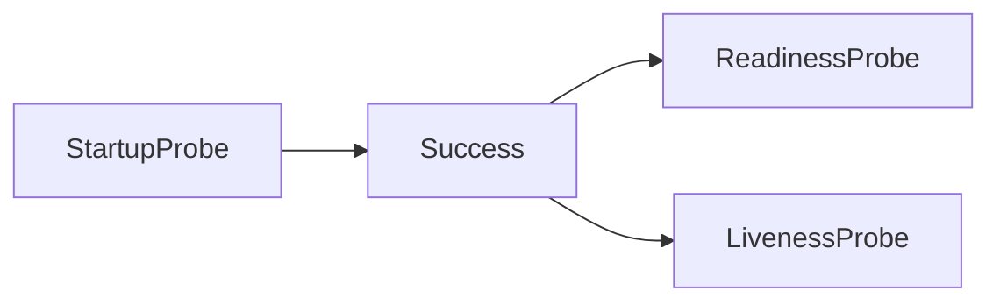
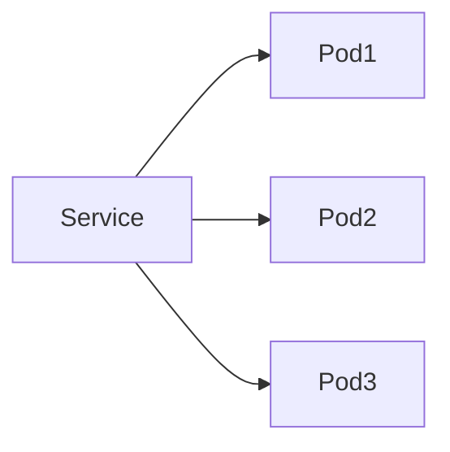
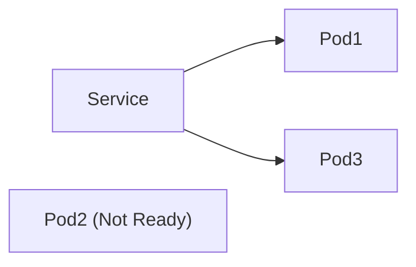

# Ch 3. Healthcheck Probe를 위한 엔드포인트 만들기

# Ch 3. Healthcheck Probe를 위한 엔드포인트 만들기 
* toc
{:toc}

---

## 01. Kubernetes Probe와 Healthcheck

### Kubernetes Probe와 Health Check

Kubernetes는 컨테이너를 자동으로 실행하고 관리하는 플랫폼이다. 하지만 단순히 컨테이너 프로세스가 살아 있다는 사실만으로 애플리케이션이 정상이라고 판단하기는 어렵다.

예를 들어 Spring Boot 서버가 실행 중이더라도 다음과 같은 상황이 발생할 수 있다.

* 모든 요청 처리 스레드가 고갈된 상태
* 데이터베이스 연결이 모두 끊어진 상태
* 데드락(Deadlock)에 빠진 상태
* 무한 루프에 빠진 상태
* 응답 시간이 지나치게 느려진 상태

이 경우 프로세스는 살아 있지만 실제 서비스는 정상적으로 동작하지 않는다.

Probe는 Kubernetes가 컨테이너의 상태를 확인하기 위해 사용하는 메커니즘이며, 애플리케이션이 스스로 자신의 상태를 알려주는 Health Check와 함께 사용된다.

---

#### Health Check란?

가장 단순한 형태의 Health Check는 특정 URL에 요청을 보냈을 때 정상 응답을 반환하는 것이다.

예를 들어 다음과 같은 API를 제공할 수 있다.

```java
@GetMapping("/check")
public String healthCheck() {
    return "OK";
}
```

정상 상태라면

```text
GET /check

200 OK
```

응답을 반환한다.

반대로

```text
404 Not Found
```

또는

```text
Timeout
```

이 발생하면 Kubernetes는 애플리케이션에 문제가 있다고 판단할 수 있다.

---

### Kubernetes의 컨테이너 상태 체크

Kubernetes는 주기적으로 컨테이너 상태를 확인한다.

지원하는 방식은 다음과 같다.

* HTTP Probe
* TCP Probe
* gRPC Probe
* Exec Probe

상태 확인은 각 노드에서 실행되는 kubelet이 수행한다.


---

### Probe 공통 설정

모든 Probe는 비슷한 설정값을 가진다.

```yaml
readinessProbe:
  httpGet:
    path: /health
    port: 8080

  initialDelaySeconds: 10
  periodSeconds: 5
  timeoutSeconds: 2
  successThreshold: 1
  failureThreshold: 3
```

---

#### initialDelaySeconds

컨테이너 시작 후 첫 번째 Probe를 실행하기 전에 기다리는 시간이다.

```yaml
initialDelaySeconds: 10
```

의미

```text
Container Start
      ↓
10초 대기
      ↓
첫 Probe 실행
```

Spring Boot 애플리케이션은 기동 시간이 필요하기 때문에 보통 몇 초 정도의 여유를 둔다.

---

#### periodSeconds

Probe 실행 주기이다.

```yaml
periodSeconds: 5
```

의미

```text
Probe
 ↓ 5초
Probe
 ↓ 5초
Probe
```

주기를 짧게 하면 장애를 빠르게 감지할 수 있다.

반대로 너무 짧으면 불필요한 요청이 많이 발생할 수 있다.

---

#### timeoutSeconds

응답을 기다리는 최대 시간이다.

```yaml
timeoutSeconds: 2
```

2초 안에 응답이 없으면 실패로 판단한다.

```text
Request
   ↓
2초 초과
   ↓
Failure
```

---

#### successThreshold

몇 번 연속 성공해야 정상으로 판단할지 지정한다.

```yaml
successThreshold: 2
```

의미

```text
Success
Success
↓
Ready
```

Readiness Probe에서 주로 사용된다.

---

#### failureThreshold

몇 번 연속 실패해야 비정상으로 판단할지 지정한다.

```yaml
failureThreshold: 3
```

의미

```text
Fail
Fail
Fail
↓
Unhealthy
```

값이 너무 작으면 일시적인 장애에도 민감하게 반응할 수 있다.

---

#### terminationGracePeriodSeconds

Probe 실패 후 컨테이너 종료 시 주어지는 유예 시간이다.

```yaml
terminationGracePeriodSeconds: 30
```

의미

```text
Probe Failure
      ↓
SIGTERM
      ↓
30초 대기
      ↓
강제 종료
```

최근 Kubernetes에서는 Probe 단위로도 설정할 수 있다.

---

### Probe 종류

Kubernetes는 세 가지 Probe를 제공한다.

```text
Startup Probe
     ↓
Readiness Probe
     ↓
Liveness Probe
```


---

### Startup Probe

애플리케이션이 정상적으로 기동되었는지 확인한다.

Startup Probe가 성공하기 전까지는

* Readiness Probe 실행 안 함
* Liveness Probe 실행 안 함



---

#### Startup Probe 예시

```yaml
startupProbe:
  httpGet:
    path: /actuator/health
    port: 8080

  periodSeconds: 5
  failureThreshold: 20
```

의미

```text
5초마다 확인
20번 실패 가능

최대 대기 시간

5 × 20 = 100초
```

100초 안에 기동하지 못하면 컨테이너를 재시작한다.

---

### Readiness Probe

컨테이너가 트래픽을 받을 준비가 되었는지 확인한다.

가장 중요한 특징은

> 컨테이너를 종료시키지 않는다.

이다.

대신 Service의 Endpoint 목록에서 제거한다.

---

#### 정상 상태



---

#### Readiness 실패



Pod2는 살아 있지만 트래픽을 받지 않는다.

---

#### Readiness Probe 예시

```yaml
readinessProbe:
  httpGet:
    path: /actuator/health/readiness
    port: 8080

  periodSeconds: 5
  failureThreshold: 2
```

---

#### 사용 목적

##### 애플리케이션 초기 기동

```text
Container Start
      ↓
Readiness Success
      ↓
Service 연결
      ↓
트래픽 수신
```

---

##### 실행 중 장애 감지

```text
Ready 상태
      ↓
Readiness Failure
      ↓
Endpoint 제거
      ↓
트래픽 차단
      ↓
Readiness Success
      ↓
Endpoint 재등록
```

일시적으로 과부하가 발생했을 때 매우 유용하다.

---

### Liveness Probe

컨테이너가 정상 동작 중인지 확인한다.

Readiness와 가장 큰 차이는

> 실패 시 컨테이너를 재시작한다.

는 점이다.

---

#### Liveness Probe 예시

```yaml
livenessProbe:
  httpGet:
    path: /actuator/health/liveness
    port: 8080

  periodSeconds: 10
  failureThreshold: 3
```

---

#### 동작 과정

```text
Liveness Fail
      ↓
Failure Threshold 초과
      ↓
Container Stop
      ↓
Container Restart
```

---

#### 해결 가능한 문제

* 무한 루프
* 데드락
* 스레드 고갈
* 메모리 누수 후 응답 불가 상태
* 내부 로직 오류

---

#### 주의사항

Liveness Probe 실패는 생각보다 비용이 크다.

```text
Container 종료
↓
Container 재생성
↓
Startup Probe
↓
Readiness Probe
↓
서비스 복귀
```

Spring Boot 기준으로 수 초에서 수십 초가 걸릴 수도 있다.

따라서 지나치게 민감하게 설정하면 오히려 서비스 품질이 떨어질 수 있다.

---

### Spring Boot 권장 설정

Spring Boot Actuator를 사용하는 경우 일반적으로 다음과 같이 구성한다.

```yaml
startupProbe:
  httpGet:
    path: /actuator/health
    port: 8080

readinessProbe:
  httpGet:
    path: /actuator/health/readiness
    port: 8080

livenessProbe:
  httpGet:
    path: /actuator/health/liveness
    port: 8080
```

Spring Boot 2.3 이상에서는 Readiness와 Liveness Endpoint를 기본 제공한다.

---

### Probe 설정 시 고려사항

#### Readiness가 Liveness보다 더 민감해야 한다

일반적으로 다음 순서가 좋다.

```text
Readiness 실패
↓
트래픽 차단

(복구 시도)

↓

Liveness 실패
↓
재시작
```

즉, 먼저 트래픽을 차단하고 최후의 수단으로 재시작하는 것이 좋다.

---

#### Health Check는 가벼워야 한다

좋은 예

```text
메모리 확인
스레드 상태 확인
애플리케이션 상태 확인
```

나쁜 예

```text
복잡한 DB 조회
외부 API 호출
대용량 데이터 조회
```

Probe는 수 초마다 호출되므로 반드시 빠르게 처리되어야 한다.

---

#### Probe 설정은 배포 시간에도 영향을 준다

예를 들어

```yaml
startupProbe:
  periodSeconds: 10
  failureThreshold: 30
```

이라면

```text
최대 300초
```

동안 Startup Probe가 수행될 수 있다.

따라서 Probe 설정은 단순한 상태 체크를 넘어 배포 속도와 서비스 가용성에도 직접적인 영향을 준다.

---

### 정리

Probe는 Kubernetes의 자가 복구(Self-Healing) 기능을 가능하게 만드는 핵심 기능이다.

```text
Startup Probe
↓
애플리케이션 기동 확인

Readiness Probe
↓
트래픽 수신 가능 여부 판단

Liveness Probe
↓
컨테이너 재시작 여부 판단
```

실무에서는 보통

* Startup Probe → 느슨하게
* Readiness Probe → 민감하게
* Liveness Probe → 신중하게

설정하는 것이 일반적이며, 특히 Liveness Probe는 컨테이너 재시작이라는 큰 비용을 동반하기 때문에 충분한 검토 후 적용하는 것이 좋다.
