# Ch 6. Storage 정의하고 파일 저장하기

# Ch 6. Storage 정의하고 파일 저장하기
* toc
{:toc}

---

## 01. Kubernetes Storage의 종류와 활용

### Kubernetes Storage의 종류와 활용

Kubernetes에서 Storage를 이해할 때 핵심은 **데이터의 생명주기**를 먼저 구분하는 것이다. 

---

### Ephemeral and Persistence

Kubernetes Storage는 크게 두 가지로 나눌 수 있다.

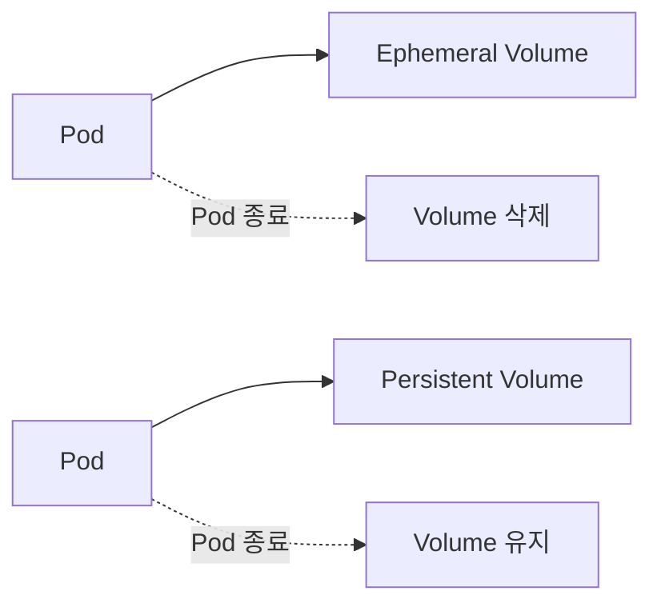

#### 임시 볼륨

임시 볼륨은 Pod가 종료되면 함께 사라지는 볼륨이다.

즉 데이터의 생명주기가 Pod에 종속된다.

```text
Pod 생성
    ↓
임시 볼륨 생성
    ↓
컨테이너에서 사용
    ↓
Pod 종료
    ↓
임시 볼륨 삭제
```

#### 영구 볼륨

영구 볼륨은 Pod의 라이프사이클과 관계없이 유지되는 볼륨이다.

```text
Pod 생성
    ↓
영구 볼륨 연결
    ↓
Pod 종료
    ↓
영구 볼륨 유지
    ↓
다른 Pod에서 다시 연결 가능
```

이 차이가 Kubernetes Storage 설계의 출발점이다.

---

### 임시 볼륨의 활용

임시 볼륨은 오래 보관할 필요가 없는 파일을 다룰 때 사용한다. PDF에서도 임시 볼륨의 대표 용도를 “요청-응답 이후 사용되지 않는 파일”과 “다른 영구 저장소로 이전되는 파일”로 설명한다.

대표적인 예시는 다음과 같다.

* 요청 처리 중 생성되는 임시 파일
* 이미지 리사이징 중간 파일
* 압축 파일 생성 중간 결과물
* CSV, Excel 다운로드 파일
* 외부 스토리지로 업로드하기 전 임시 저장 파일
* 짧은 시간 동안만 필요한 캐시 데이터

예를 들어 이미지 업로드 서버라면 다음과 같이 동작할 수 있다.

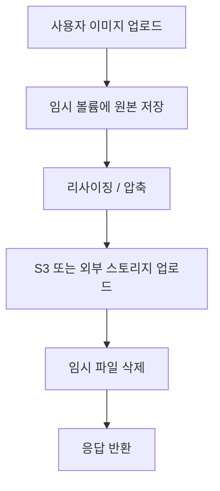

이 경우 파일은 요청 처리 과정에서만 필요하다. 최종 결과물이 외부 스토리지에 저장되면 Pod 내부의 임시 파일은 사라져도 문제가 없다.

---

### 임시 볼륨의 구성

임시 볼륨은 Pod 스펙에서 `volumes`로 정의하고, 컨테이너의 `volumeMounts`를 통해 특정 경로에 연결한다.

```yaml
spec:
  volumes:
    - name: cache-volume
      emptyDir:
        medium: Memory

  containers:
    - name: my-app
      image: my-app
      volumeMounts:
        - mountPath: /tmp/cache
          name: cache-volume
```

#### 설정 설명

```yaml
volumes:
  - name: cache-volume
```

Pod 안에서 사용할 볼륨을 정의한다.

```yaml
emptyDir:
  medium: Memory
```

`emptyDir`은 Pod가 생성될 때 비어 있는 디렉터리를 만들어주는 임시 볼륨이다.

`medium: Memory`를 설정하면 디스크가 아니라 메모리를 저장공간으로 사용한다.

```yaml
volumeMounts:
  - mountPath: /tmp/cache
    name: cache-volume
```

컨테이너 내부의 `/tmp/cache` 경로에 `cache-volume`을 마운트한다.

즉 애플리케이션은 `/tmp/cache`에 파일을 쓰면 되고, 실제 저장 위치는 Kubernetes가 관리한다.

---

### emptyDir의 특징

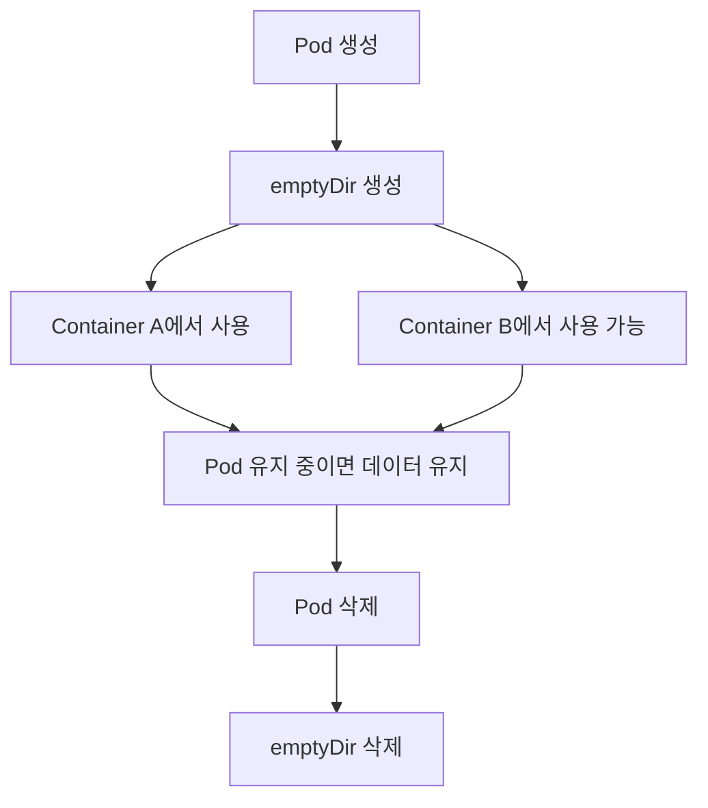

`emptyDir`의 중요한 특징은 다음과 같다.

* Pod가 생성될 때 함께 생성된다.
* Pod가 삭제되면 함께 삭제된다.
* 같은 Pod 안의 여러 컨테이너가 공유할 수 있다.
* 컨테이너가 재시작되어도 Pod가 살아 있으면 유지될 수 있다.
* `medium: Memory`를 사용하면 메모리 기반 저장소로 사용할 수 있다.

여기서 중요한 포인트는 **컨테이너 재시작과 Pod 재생성은 다르다**는 점이다.

```text
컨테이너 재시작
→ Pod는 그대로
→ emptyDir 유지 가능

Pod 삭제 후 재생성
→ 새로운 Pod
→ emptyDir 새로 생성
```

따라서 애플리케이션은 시작할 때 임시 볼륨이 항상 비어 있을 것이라고 가정하면 안 된다.

---

### 임시 볼륨 사용 시 주의사항

#### 저장 용량 증가

임시 볼륨도 결국 노드의 저장공간이나 메모리를 사용한다.

파일이 계속 쌓이면 다음 문제가 발생할 수 있다.

* 노드 디스크 사용량 증가
* Disk Pressure 발생
* Pod Eviction 발생
* 다른 Pod 성능 영향
* 메모리 기반 emptyDir 사용 시 OOM 위험

#### sizeLimit 설정

`emptyDir`에는 크기 제한을 줄 수 있다.

```yaml
spec:
  volumes:
    - name: cache-volume
      emptyDir:
        sizeLimit: 1Gi
```

메모리 기반으로 사용할 경우에도 제한을 두는 것이 좋다.

```yaml
spec:
  volumes:
    - name: cache-volume
      emptyDir:
        medium: Memory
        sizeLimit: 512Mi
```

#### 파일 삭제 전략

임시 볼륨을 사용할 때는 파일 삭제 전략도 함께 고려해야 한다.

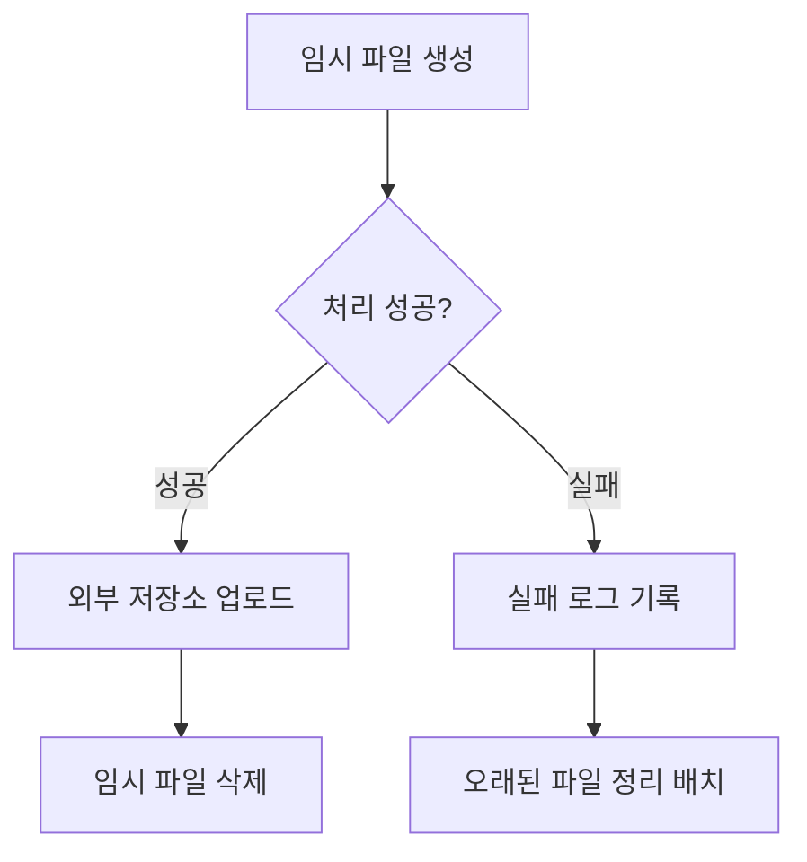

대용량 파일을 자주 생성한다면 다음 중 하나는 필요하다.

* 요청 처리 후 즉시 삭제
* 일정 시간 지난 파일 정리
* Pod 시작 시 오래된 파일 삭제
* 별도 cleanup 스레드 또는 배치 실행

---

### 영구 볼륨의 활용

영구 볼륨은 Pod가 삭제되거나 다시 생성되어도 유지되어야 하는 데이터를 저장할 때 사용한다. PDF에서는 “애플리케이션 자체에서 계속 유지되어야 하는 파일”과 “여러 Pod들이 서로 공유해야 하는 저장공간”을 영구 볼륨의 활용 예시로 든다.

대표적인 예시는 다음과 같다.

* 애플리케이션 상태 복구용 파일
* 장기간 보관해야 하는 로그
* 여러 Pod가 공유해야 하는 파일
* 데이터베이스 데이터
* 메시지 브로커 데이터
* 레지스트리 저장소
* 검색 엔진 인덱스 데이터

영구 볼륨은 일반적으로 다음 구조로 사용한다.


Pod가 직접 Storage를 고르는 것이 아니라, PVC를 통해 필요한 저장공간을 요청하고, Kubernetes가 조건에 맞는 PV를 연결한다.

---

### 영구 볼륨의 구성

영구 볼륨은 AccessMode 설정에 따라 성격이 달라진다. PDF의 영구 볼륨 구성 페이지에서도 AccessMode에 따라 성격이 달라지고, 일반적으로 공유 스토리지의 성격을 가진다고 설명한다.

#### AccessMode

| AccessMode       | 의미                | 활용 예시               |
| ---------------- | ----------------- | ------------------- |
| ReadWriteOnce    | 하나의 노드에서 읽기/쓰기 가능 | 일반적인 블록 스토리지        |
| ReadOnlyMany     | 여러 노드에서 읽기 전용 가능  | 공통 설정 파일, 읽기 전용 데이터 |
| ReadWriteMany    | 여러 노드에서 읽기/쓰기 가능  | 공유 파일 시스템           |
| ReadWriteOncePod | 하나의 Pod만 읽기/쓰기 가능 | 특정 Pod 전용 스토리지      |

AccessMode를 선택할 때는 “몇 개의 Pod가 동시에 접근해야 하는가?”를 먼저 생각해야 한다.

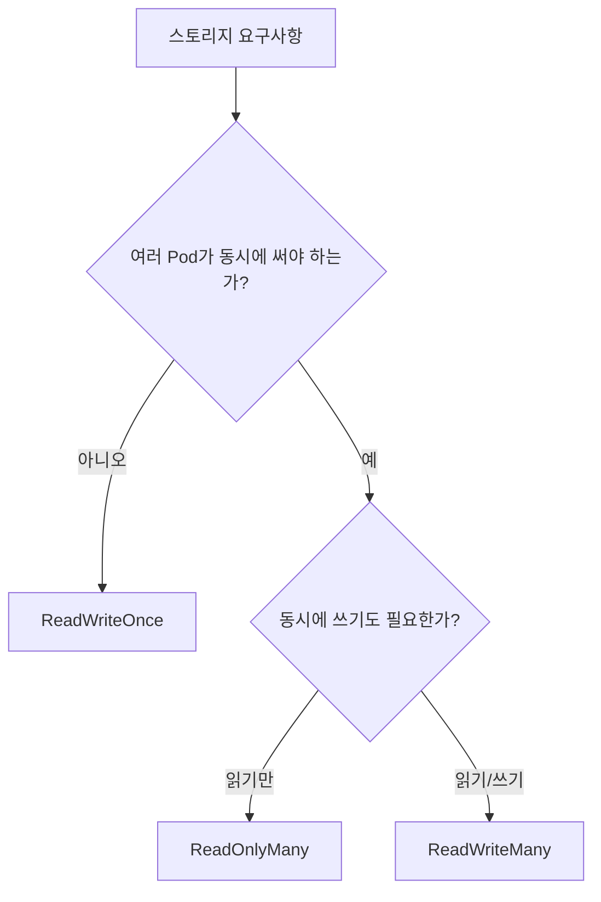

---

### StatefulSet을 활용한 구성

StatefulSet은 Pod마다 고유한 스토리지를 할당할 수 있다. PDF에서도 Pod-01은 PV-01, Pod-02는 PV-02처럼 Pod와 PV가 1:1로 연결되는 구조를 보여준다.

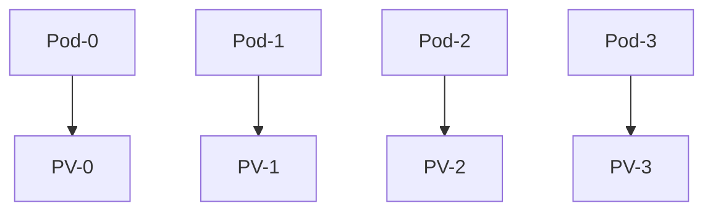

Deployment와 StatefulSet의 차이는 여기서 중요해진다.

#### Deployment

Deployment로 생성된 Pod는 개별 정체성이 약하다.

```text
my-app-7f8d9c-x1
my-app-7f8d9c-a2
my-app-7f8d9c-z9
```

Pod가 삭제되면 비슷한 역할의 새로운 Pod가 생성된다.

즉 “이 Pod가 반드시 이 저장공간을 다시 사용해야 한다”는 개념이 약하다.

#### StatefulSet

StatefulSet은 Pod에 순서와 이름을 부여한다.

```text
redis-0
redis-1
redis-2
```

이 이름은 유지된다.

따라서 다음과 같은 연결이 가능하다.

```text
redis-0 → redis-0 전용 PVC
redis-1 → redis-1 전용 PVC
redis-2 → redis-2 전용 PVC
```

Pod가 삭제되었다가 다시 생성되어도 같은 이름으로 돌아오고, 기존 PVC를 다시 연결할 수 있다.

---

### StatefulSet이 적합한 경우

StatefulSet은 일반적인 백엔드 API 서버보다는 고유한 상태를 가진 워크로드에 적합하다.

대표적인 예시는 다음과 같다.

* Database
* Redis Cluster
* Kafka
* Elasticsearch
* Container Registry
* Zookeeper

이런 시스템은 각 인스턴스가 동일한 역할만 수행하지 않는다.

예를 들어 Kafka Broker는 각각 고유한 데이터 파티션을 가질 수 있고, Redis Cluster도 각 노드가 담당하는 슬롯이나 데이터가 다를 수 있다.

즉 다음과 같은 조건이라면 StatefulSet을 고려할 수 있다.

* Pod마다 고유한 역할이 있다.
* Pod마다 고유한 저장공간이 필요하다.
* Pod 이름이나 순서가 중요하다.
* 삭제 후 재생성되어도 기존 데이터를 다시 연결해야 한다.
* 수량이 자주 변하지 않는다.

---

### Kubernetes Storage 활용 전략

PDF 마지막 페이지에서는 Kubernetes Storage 활용 방향으로 네 가지를 제시한다. 저장공간에 크게 의존하지 않는 애플리케이션 개발, 외부 스토리지 서비스 활용, 임시 볼륨의 저장공간 크기 유의, 컨테이너 내부 파일 저장 방식 고려가 그것이다.

---

### 1. 저장공간에 크게 의존하지 않는 애플리케이션 개발

Kubernetes에서 백엔드 애플리케이션을 개발할 때 가장 좋은 Storage 전략은, 역설적으로 **Storage에 크게 의존하지 않는 것**이다.

Kubernetes는 다음 철학을 가진다.


Pod는 영구적인 서버 인스턴스가 아니다.

언제든 다음 상황이 발생할 수 있다.

* Rolling Update로 교체
* Node 장애로 재스케줄링
* Liveness Probe 실패로 재시작
* Scale In으로 삭제
* Eviction으로 제거

이런 환경에서 특정 Pod의 파일 시스템에 중요한 데이터를 저장하면 운영이 어려워진다.

---

### 2. 외부 스토리지 서비스를 활용하는 구성

모든 파일을 임시 볼륨에만 둘 수는 없다.

파일을 장기 보관해야 한다면 외부 스토리지 서비스를 사용하는 구성이 더 자연스럽다.

대표적인 예시는 다음과 같다.

* AWS S3
* Azure Blob Storage
* Google Cloud Storage
* MinIO
* 사내 Object Storage

구조는 다음과 같다.

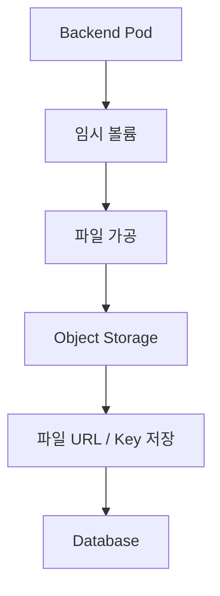

이 방식의 장점은 다음과 같다.

* Pod 교체와 데이터 생명주기를 분리할 수 있다.
* Scale Out이 쉬워진다.
* 여러 Pod가 동일한 파일에 접근할 수 있다.
* 백업, 보관, 권한 관리가 쉬워진다.
* 애플리케이션이 특정 노드나 특정 PV에 묶이지 않는다.

---

### 3. 내부 스토리지 서비스를 API로 추상화하는 구성

내부적으로 별도의 스토리지 서비스를 운영해야 하는 경우도 있다.

예를 들어 사내 파일 서버나 자체 구축한 스토리지가 있을 수 있다.

이때 일반 백엔드 애플리케이션이 직접 PV를 마운트해서 사용하는 방식은 어색할 수 있다.

대신 다음과 같은 구성이 더 자연스러울 수 있다.

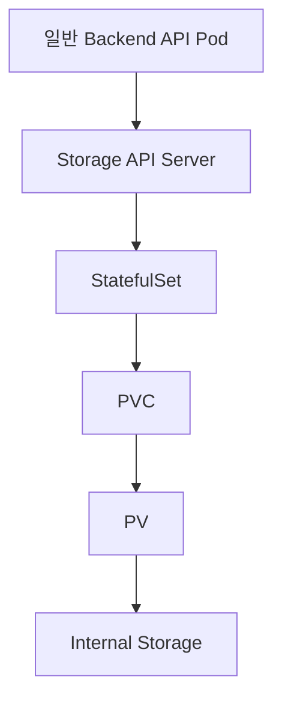

즉 일반 백엔드 애플리케이션은 파일 시스템을 직접 만지지 않고, Storage API Server를 통해 파일을 저장하거나 조회한다.

이 방식은 내부 Object Storage처럼 사용할 수 있다.

---

### 4. 임시 볼륨 사용 시 저장공간 크기에 유의

임시 볼륨은 이름 그대로 임시이지만, 자원 사용 측면에서는 실제 노드의 디스크나 메모리를 사용한다.

따라서 다음 상황에 주의해야 한다.

* 대용량 파일 업로드
* 동영상 변환
* 이미지 대량 처리
* 대용량 엑셀 생성
* 압축 파일 생성
* 로그성 파일 누적

특히 배포가 자주 일어나는 서비스는 Pod가 자주 교체되면서 임시 볼륨도 정리될 수 있다.

하지만 오래 실행되는 서비스라면 임시 파일이 계속 누적될 수 있다.

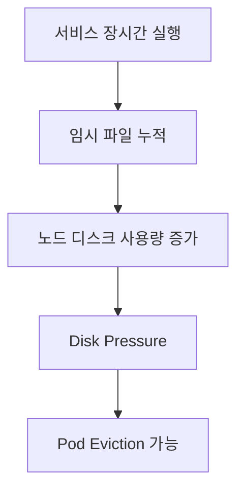

따라서 다음 전략을 고려해야 한다.

* 파일 크기 제한
* 요청당 업로드 크기 제한
* 임시 파일 TTL 관리
* 작업 완료 후 삭제
* 주기적 cleanup
* emptyDir sizeLimit 설정
* 모니터링 지표 수집

---

### 5. 컨테이너 내부에 파일을 저장하는 방식

정말 일시적으로만 사용되고, 다른 컨테이너와 공유할 필요도 없고, Pod 생명주기에서도 유지될 필요가 없다면 별도의 Volume 없이 컨테이너 내부 파일 시스템에 저장할 수도 있다.

예를 들어 다음과 같은 방식이다.

```text
/tmp
/var/tmp
/app/tmp
```

애플리케이션 코드에서는 일반 파일 시스템처럼 접근하면 된다.

```java
Files.write(
    Paths.get("/tmp/result.csv"),
    data
);
```

이 방식의 장점은 단순하다는 것이다.

* Kubernetes Volume 설정 불필요
* 애플리케이션 코드만으로 처리 가능
* 매우 짧은 생명주기의 파일에 적합

하지만 단점도 있다.

* 컨테이너 종료 시 파일 삭제
* 저장 위치 추적이 어려움
* 용량 통제가 어려움
* 대용량 파일 저장 시 노드 자원에 영향
* 운영자가 인지하기 어려움

따라서 컨테이너 내부 파일 시스템은 **작고 짧게 쓰고 바로 버리는 파일**에만 사용하는 것이 좋다.

---

### 임시 볼륨 vs 컨테이너 내부 저장소

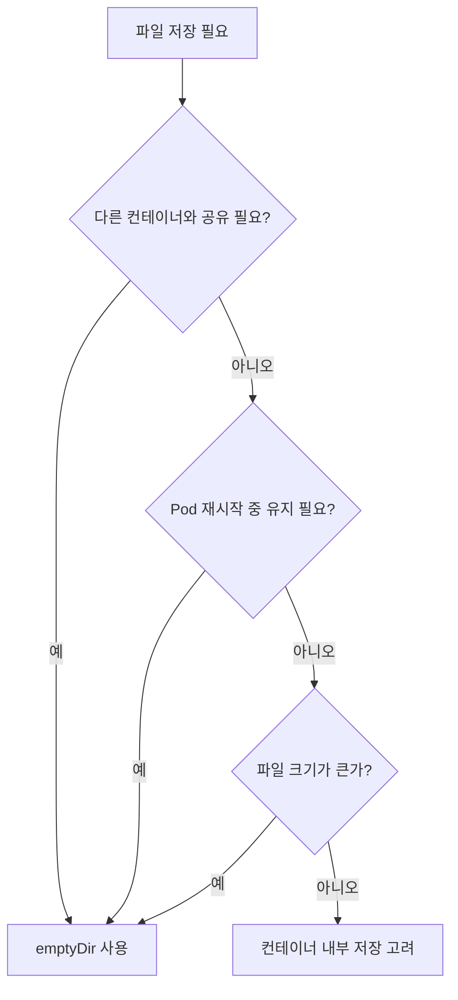

간단히 정리하면 다음과 같다.

| 구분            | 컨테이너 내부 저장  | emptyDir     |
| ------------- | ----------- | ------------ |
| 설정 복잡도        | 낮음          | 중간           |
| 컨테이너 간 공유     | 어려움         | 가능           |
| 컨테이너 재시작 시 유지 | 보장 어려움      | Pod가 유지되면 가능 |
| 크기 제한 관리      | 어려움         | sizeLimit 가능 |
| 권장 용도         | 아주 짧은 임시 파일 | 명시적인 임시 저장공간 |

---

### 백엔드 개발 관점의 Storage 선택 기준

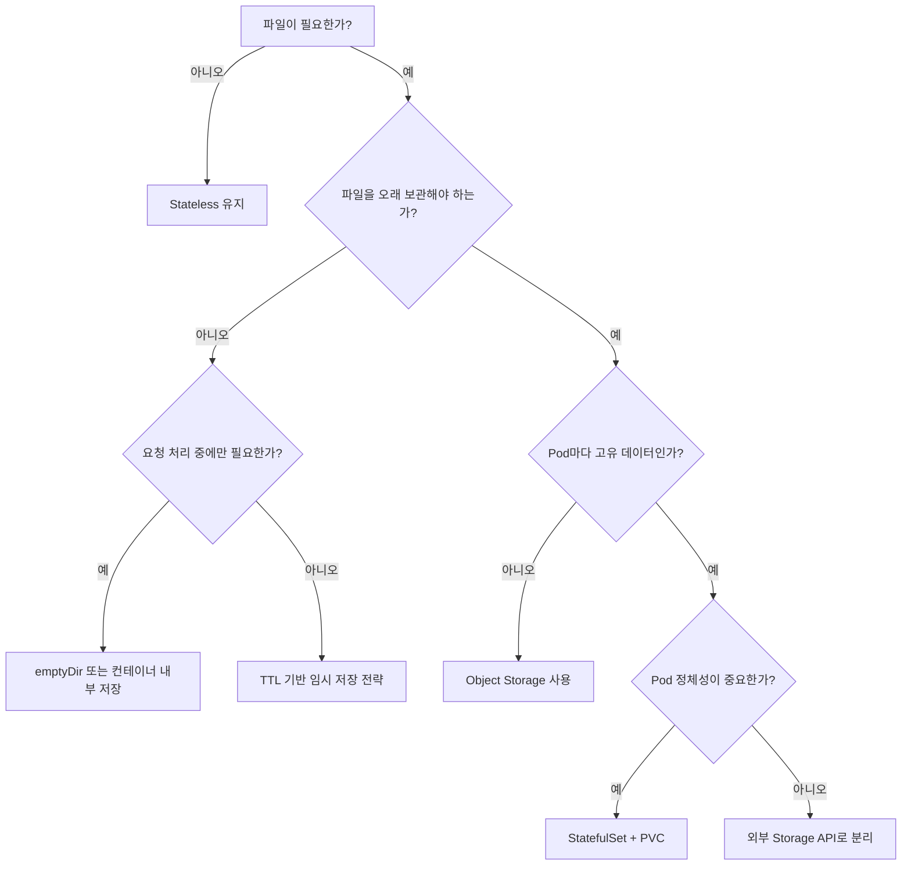

---

### 실무적인 정리

Kubernetes Storage를 사용할 때는 다음 순서로 판단하는 것이 좋다.

#### 1. 파일을 저장하지 않아도 되는가?

가능하다면 가장 좋다.

백엔드 애플리케이션은 Stateless하게 만드는 것이 Kubernetes와 가장 잘 맞는다.

#### 2. 임시 파일인가?

요청 처리 중에만 필요하다면 `emptyDir`이나 컨테이너 내부 저장을 고려한다.

#### 3. 오래 보관해야 하는 파일인가?

Object Storage 같은 외부 스토리지 서비스를 우선 고려한다.

#### 4. Pod마다 고유한 저장공간이 필요한가?

이 경우 StatefulSet과 PVC를 고려한다.

#### 5. 여러 Pod가 동시에 공유해야 하는가?

ReadWriteMany를 지원하는 공유 스토리지가 필요할 수 있다.

---

### 정리

Kubernetes Storage는 단순히 “파일을 어디에 저장할 것인가”의 문제가 아니다.

핵심은 **데이터의 생명주기와 Pod의 생명주기를 분리해서 생각하는 것**이다.

* 임시 볼륨은 Pod 생명주기에 종속된다.
* 영구 볼륨은 Pod 생명주기와 분리된다.
* emptyDir은 요청 처리 중 임시 파일에 적합하다.
* 메모리 기반 emptyDir은 빠르지만 메모리 사용량에 주의해야 한다.
* 영구 볼륨은 상태 저장 워크로드에 적합하다.
* StatefulSet은 Pod별 고유 스토리지에 적합하다.
* 일반 백엔드 애플리케이션은 가능하면 Stateless하게 개발하는 것이 좋다.
* 장기 보관 파일은 외부 Object Storage를 우선 고려하는 것이 좋다.
* 임시 파일도 노드 자원을 사용하므로 용량 관리가 필요하다.

한 문장으로 정리하면 다음과 같다.

> Kubernetes에서 좋은 Storage 설계는 “Pod가 언제든 사라져도 데이터와 서비스가 안전한 구조”를 만드는 것이다.

## 02. PV와 PVC를 이용한 파일 저장 실습

### PV와 PVC를 이용한 파일 저장 실습

이번 실습에서는 Kubernetes에서 임시 볼륨과 영구 볼륨을 함께 사용해본다.

실습 목표는 두 가지이다.

첫 번째는 애플리케이션 캐시 데이터를 파일로 저장해서 컨테이너가 재시작되더라도 캐시를 복구하는 것이다.

두 번째는 여러 Pod가 공통으로 접근할 수 있는 영구 저장소를 구성하고, 각 Pod의 로그를 하나의 파일에 기록하는 것이다.

---

### 실습 구성

이번 실습에서는 다음 구조를 만든다.

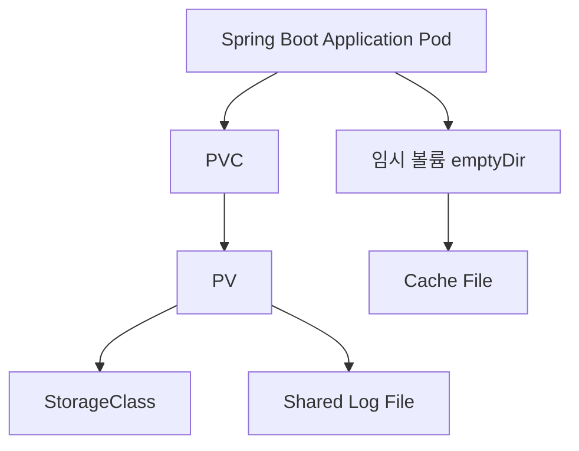

구성 요소는 다음과 같다.

* `emptyDir`: 캐시 데이터를 저장할 임시 볼륨
* `StorageClass`: 동적 볼륨 생성을 위한 스토리지 정의
* `PVC`: 애플리케이션이 요청하는 영구 저장소
* `PV`: 실제 할당된 영구 볼륨
* `Deployment`: 애플리케이션 실행 및 볼륨 마운트
* Spring Boot 코드: 캐시 저장, 캐시 복구, 로그 기록

---

### 실습 시나리오

#### 1. 캐시 파일 저장

애플리케이션 내부의 `Map` 데이터를 주기적으로 파일에 저장한다.


컨테이너가 재시작되면 애플리케이션 기동 시점에 해당 파일을 읽어서 Map을 복구한다.


---

#### 2. 여러 Pod의 로그를 하나의 파일에 기록

여러 Pod가 하나의 영구 볼륨을 공유하고, 각 Pod가 동일한 로그 파일에 메시지를 기록한다.

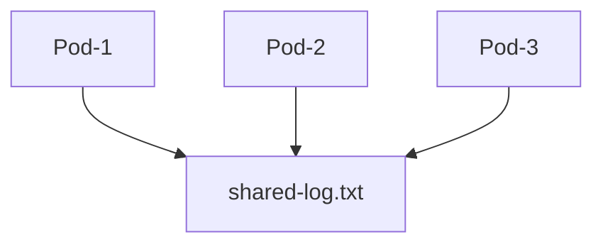

로그에는 다음 정보를 기록한다.

* Pod 이름
* 캐시 히트 여부
* 캐시 미스 여부
* 요청 메시지
* 기록 시간

---

### StorageClass 생성

먼저 동적 볼륨 생성을 위한 StorageClass를 만든다.

StorageClass는 클러스터 전역 객체이기 때문에 Namespace를 지정하지 않는다.

```yaml
apiVersion: storage.k8s.io/v1
kind: StorageClass
metadata:
  name: local-storage
provisioner: rancher.io/local-path
volumeBindingMode: WaitForFirstConsumer
```

#### 설정 설명

`storageClassName`으로 PVC에서 이 StorageClass를 참조할 수 있다.

```yaml
metadata:
  name: local-storage
```

`provisioner`는 실제 볼륨을 생성할 스토리지 제공자를 의미한다.

```yaml
provisioner: rancher.io/local-path
```

`volumeBindingMode`는 볼륨이 언제 생성되고 바인딩될지 결정한다.

```yaml
volumeBindingMode: WaitForFirstConsumer
```

`WaitForFirstConsumer`는 PVC가 생성되는 즉시 볼륨을 만드는 것이 아니라, 실제 Pod가 PVC를 사용할 때 볼륨을 바인딩한다.

---

### PVC 생성

PVC는 애플리케이션이 사용할 저장공간을 요청하는 객체이다.

PVC는 Namespace에 속하는 객체이므로 애플리케이션과 같은 Namespace에 생성한다.

```yaml
apiVersion: v1
kind: PersistentVolumeClaim
metadata:
  name: app-log-pvc
  namespace: default
spec:
  storageClassName: local-storage
  accessModes:
    - ReadWriteOnce
  resources:
    requests:
      storage: 1Gi
```

#### 설정 설명

```yaml
storageClassName: local-storage
```

앞에서 만든 StorageClass를 사용한다.

```yaml
accessModes:
  - ReadWriteOnce
```

하나의 노드에서 읽기/쓰기가 가능한 볼륨을 요청한다.

```yaml
resources:
  requests:
    storage: 1Gi
```

1Gi 크기의 저장공간을 요청한다.

---

### Deployment에 볼륨 마운트

애플리케이션 Deployment에 두 가지 볼륨을 추가한다.

* 캐시용 임시 볼륨
* 로그용 영구 볼륨

```yaml
apiVersion: apps/v1
kind: Deployment
metadata:
  name: storage-app
spec:
  replicas: 2
  selector:
    matchLabels:
      app: storage-app
  template:
    metadata:
      labels:
        app: storage-app
    spec:
      volumes:
        - name: cache-volume
          emptyDir: {}

        - name: log-volume
          persistentVolumeClaim:
            claimName: app-log-pvc

      containers:
        - name: storage-app
          image: my-repo/storage-app:0.0.1
          volumeMounts:
            - name: cache-volume
              mountPath: /tmp/cache

            - name: log-volume
              mountPath: /app/logs
```

---

### 볼륨 마운트 구조

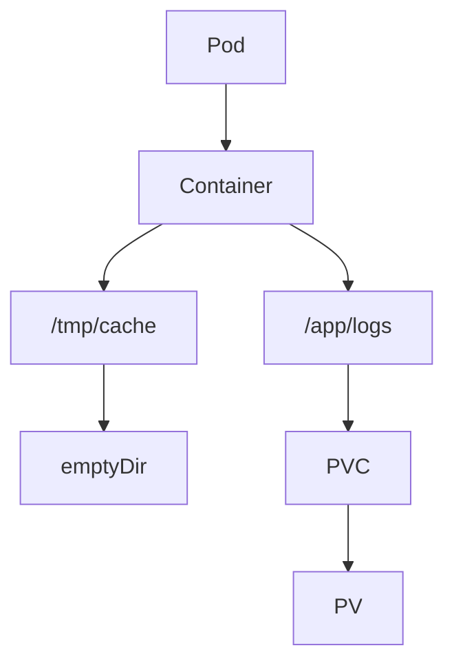

`/tmp/cache`는 임시 볼륨이다.

Pod가 삭제되면 함께 삭제된다.

`/app/logs`는 영구 볼륨이다.

Pod가 재생성되더라도 PVC를 통해 다시 연결될 수 있다.

---

### 로그 기록 클래스 생성

여러 Pod가 공통 로그 파일에 메시지를 기록하도록 간단한 클래스를 만든다.

```java
@Component
public class FileLogWriter {

    private static final Path LOG_FILE = Paths.get("/app/logs/shared-log.txt");

    @Value("${HOSTNAME:unknown-pod}")
    private String podName;

    public synchronized void write(String message) {
        try {
            Files.createDirectories(LOG_FILE.getParent());

            String log = String.format(
                    "[%s] pod=%s message=%s%n",
                    LocalDateTime.now(),
                    podName,
                    message
            );

            Files.writeString(
                    LOG_FILE,
                    log,
                    StandardOpenOption.CREATE,
                    StandardOpenOption.APPEND
            );
        } catch (IOException e) {
            throw new IllegalStateException("Failed to write log file", e);
        }
    }
}
```

#### 코드 설명

`HOSTNAME` 환경 변수는 Kubernetes에서 Pod 이름으로 주입되는 경우가 많다.

```java
@Value("${HOSTNAME:unknown-pod}")
private String podName;
```

이를 이용하면 어떤 Pod가 로그를 남겼는지 확인할 수 있다.

```text
[2026-01-01T10:00:00] pod=storage-app-xxxx message=cache hit
```

---

### 캐시 서비스 생성

비즈니스 로직에서는 캐시를 조회하고, 캐시 히트 또는 캐시 미스를 로그로 남긴다.

```java
@Service
@RequiredArgsConstructor
public class CacheService {

    private final FileLogWriter fileLogWriter;

    private final Map<String, String> cache = new ConcurrentHashMap<>();

    public String getValue(String key) {
        if (cache.containsKey(key)) {
            fileLogWriter.write("CACHE_HIT key=" + key);
            return cache.get(key);
        }

        String value = "value-" + key;
        cache.put(key, value);

        fileLogWriter.write("CACHE_MISS key=" + key);

        return value;
    }

    public Map<String, String> getCache() {
        return cache;
    }
}
```

---

### 캐시 파일 저장

캐시 데이터를 주기적으로 파일에 기록한다.

간단하게 JSON 파일로 저장한다.

```java
@Component
@RequiredArgsConstructor
@EnableScheduling
public class CacheFileManager {

    private static final Path CACHE_FILE = Paths.get("/tmp/cache/cache.json");

    private final ObjectMapper objectMapper;
    private final CacheService cacheService;

    @Scheduled(fixedRate = 1000)
    public void saveCache() {
        try {
            Files.createDirectories(CACHE_FILE.getParent());

            String json = objectMapper.writeValueAsString(cacheService.getCache());

            Files.writeString(
                    CACHE_FILE,
                    json,
                    StandardOpenOption.CREATE,
                    StandardOpenOption.TRUNCATE_EXISTING
            );
        } catch (IOException e) {
            throw new IllegalStateException("Failed to save cache file", e);
        }
    }
}
```

#### 동작 방식

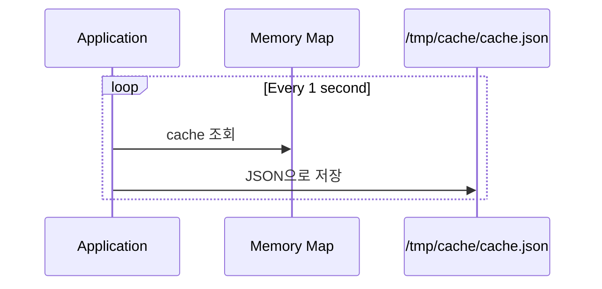

---

### 애플리케이션 기동 시 캐시 복구

애플리케이션이 시작될 때 캐시 파일을 읽어 Map을 복구한다.

```java
@Component
@RequiredArgsConstructor
public class CacheInitializer {

    private static final Path CACHE_FILE = Paths.get("/tmp/cache/cache.json");

    private final ObjectMapper objectMapper;
    private final CacheService cacheService;

    @PostConstruct
    public void loadCache() {
        if (!Files.exists(CACHE_FILE)) {
            return;
        }

        try {
            Map<String, String> restored = objectMapper.readValue(
                    Files.readString(CACHE_FILE),
                    new TypeReference<Map<String, String>>() {}
            );

            cacheService.getCache().putAll(restored);
        } catch (IOException e) {
            throw new IllegalStateException("Failed to load cache file", e);
        }
    }
}
```

#### 동작 방식

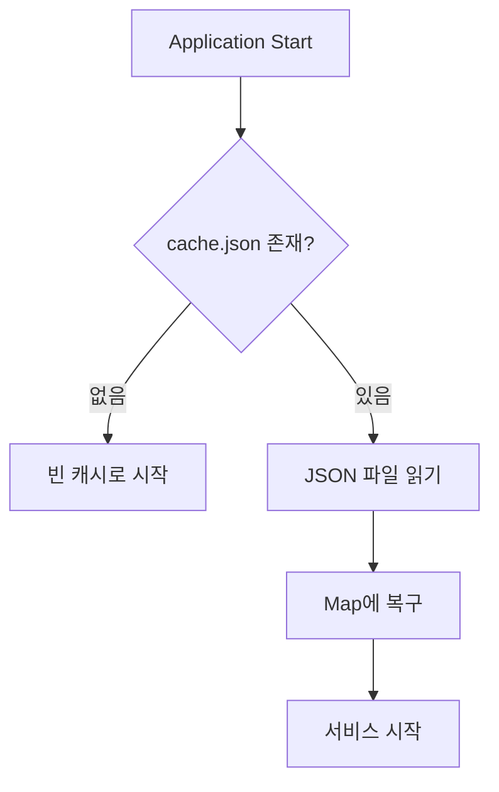

---

### 테스트용 Controller

캐시 동작을 확인할 수 있는 API를 만든다.

```java
@RestController
@RequiredArgsConstructor
@RequestMapping("/cache")
public class CacheController {

    private final CacheService cacheService;

    @GetMapping("/{key}")
    public String get(@PathVariable String key) {
        return cacheService.getValue(key);
    }

    @GetMapping
    public Map<String, String> getAll() {
        return cacheService.getCache();
    }
}
```

---

### YAML 적용

StorageClass를 먼저 적용한다.

```bash
kubectl apply -f storage-class.yaml
```

PVC를 적용한다.

```bash
kubectl apply -f pvc.yaml
```

Deployment를 적용한다.

```bash
kubectl apply -f deployment.yaml
```

상태를 확인한다.

```bash
kubectl get storageclass
kubectl get pvc
kubectl get pv
kubectl get pods
```

---

### 동작 확인

API를 호출해서 캐시 데이터를 만든다.

```bash
curl http://localhost/cache/user-1
curl http://localhost/cache/user-2
curl http://localhost/cache/user-1
```

Pod 내부에 들어가 캐시 파일을 확인한다.

```bash
kubectl exec -it <pod-name> -- sh
```

```bash
cat /tmp/cache/cache.json
```

로그 파일도 확인한다.

```bash
cat /app/logs/shared-log.txt
```

여러 Pod가 같은 파일에 로그를 남기고 있다면 다음과 같은 형태가 보인다.

```text
[2026-01-01T10:00:00] pod=storage-app-abc message=CACHE_MISS key=user-1
[2026-01-01T10:00:03] pod=storage-app-def message=CACHE_HIT key=user-1
```

---

### 컨테이너 강제 재시작 테스트

컨테이너를 강제로 재시작시켜 캐시가 유지되는지 확인한다.

예를 들어 애플리케이션 프로세스를 종료한다.

```bash
kubectl exec -it <pod-name> -- sh
```

```bash
kill 1
```

컨테이너가 재시작된 후 다시 접속한다.

```bash
kubectl get pods
kubectl exec -it <pod-name> -- sh
```

캐시 파일이 남아 있는지 확인한다.

```bash
cat /tmp/cache/cache.json
```

API를 다시 호출한다.

```bash
curl http://localhost/cache/user-1
```

컨테이너만 재시작되고 Pod가 유지되었다면 `emptyDir`에 저장된 캐시 파일이 남아 있을 수 있다.

따라서 애플리케이션은 기동 시 캐시 파일을 읽어 Map을 복구할 수 있다.

---

### Pod 삭제 테스트

이번에는 Pod 자체를 삭제한다.

```bash
kubectl delete pod <pod-name>
```

Deployment가 새로운 Pod를 생성한다.

```bash
kubectl get pods
```

새 Pod에 접속해 캐시 파일을 확인한다.

```bash
cat /tmp/cache/cache.json
```

이 경우 `emptyDir`은 Pod와 함께 삭제되었기 때문에 캐시 파일이 사라진다.

하지만 영구 볼륨에 기록한 로그 파일은 PVC/PV를 통해 유지될 수 있다.

---

### 컨테이너 재시작과 Pod 재생성의 차이

```mermaid
flowchart TD
    A[장애 발생] --> B{무엇이 재시작되는가?}

    B -->|컨테이너만 재시작| C[Pod 유지]
    C --> D[emptyDir 유지 가능]
    D --> E[캐시 복구 가능]

    B -->|Pod 삭제 후 재생성| F[새 Pod 생성]
    F --> G[emptyDir 새로 생성]
    G --> H[캐시 복구 불가]

    F --> I[PVC 재연결]
    I --> J[영구 로그 유지 가능]
```

---

### 실습에서 확인해야 할 포인트

* PVC는 Namespace에 속한다.
* StorageClass와 PV는 클러스터 전역 객체이다.
* emptyDir은 Pod 생명주기에 종속된다.
* 컨테이너가 재시작되어도 Pod가 유지되면 emptyDir 데이터가 남을 수 있다.
* Pod가 삭제되면 emptyDir은 삭제된다.
* PVC/PV 기반 저장소는 Pod가 재생성되어도 유지될 수 있다.
* 여러 Pod가 하나의 로그 파일에 접근하려면 AccessMode와 실제 스토리지 지원 여부를 고려해야 한다.
* 일반적인 백엔드 애플리케이션에서는 영구 저장소보다 외부 Object Storage를 우선 고려하는 경우가 많다.

---

### 정리

이번 실습에서는 임시 볼륨과 영구 볼륨을 함께 사용했다.

캐시 데이터는 `emptyDir`에 저장해서 컨테이너 재시작 시 복구할 수 있도록 했다.

공통 로그는 PVC/PV 기반 영구 볼륨에 기록해서 Pod가 재생성되어도 유지될 수 있도록 했다.

핵심은 다음과 같다.

```mermaid
flowchart LR
    A[임시 데이터] --> B[emptyDir]
    C[영구 데이터] --> D[PVC/PV]
    E[Pod별 고유 데이터] --> F[StatefulSet]
    G[장기 보관 파일] --> H[Object Storage]
```

Kubernetes Storage를 사용할 때는 파일을 저장하는 방법보다 먼저 데이터의 생명주기를 판단해야 한다.

