# Ch 7. 대규모 트래픽에 대응하기위한 Kubernetes 활용

# Ch 7. 대규모 트래픽에 대응하기위한 Kubernetes 활용
* toc
{:toc}

---

## 01 Kubernetes Pod의 자원 할당과 스케일 조정

### Kubernetes Pod의 자원 할당과 스케일 조정

Kubernetes에서 애플리케이션의 처리량을 높이거나 안정성을 확보하려면 Pod에 할당되는 자원과 Pod의 수량을 함께 이해해야 한다.

이번 내용의 핵심은 두 가지이다.

* 하나의 Pod에 얼마나 많은 자원을 줄 것인가
* Pod를 몇 개 실행할 것인가

PDF에서도 이를 Vertical Scaling과 Horizontal Scaling으로 구분하고, `requests`, `limits`, JVM Memory, CPU Throttling, Replica 조정까지 이어서 설명한다.

---

### 스케일 조정

Kubernetes에서 스케일 조정은 크게 두 가지 방식으로 나눌 수 있다.

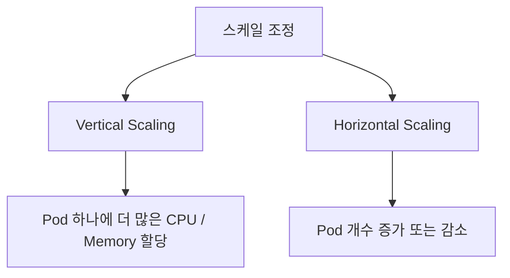

---

#### Vertical Scaling

Vertical Scaling은 하나의 인스턴스에 할당되는 자원을 늘리거나 줄이는 방식이다.

예를 들어 다음과 같은 변화가 Vertical Scaling이다.

```text
변경 전
cpu: 1 core
memory: 1Gi

변경 후
cpu: 2 core
memory: 4Gi
```

즉 Pod의 수량은 그대로 두고, Pod 하나가 사용할 수 있는 자원을 늘리는 방식이다.

대표적인 조정 대상은 다음과 같다.

* CPU
* Memory
* Network Bandwidth
* Storage Size
* Storage I/O 성능

운영 중인 애플리케이션이 메모리 부족으로 자주 오류가 발생한다면, 메모리 할당량을 늘리는 방식으로 대응할 수 있다.

이것이 수직적 스케일 증가이다.

---

#### Horizontal Scaling

Horizontal Scaling은 작업을 처리하는 인스턴스의 수를 늘리거나 줄이는 방식이다.

예를 들어 하나의 Pod로 트래픽을 처리하다가 부족해져서 Pod를 두 개로 늘렸다면 Horizontal Scaling이다.

```text
변경 전
replicas: 1

변경 후
replicas: 2
```

즉 Pod 하나의 자원은 그대로 두고, Pod의 수량을 늘려 전체 처리량을 높이는 방식이다.

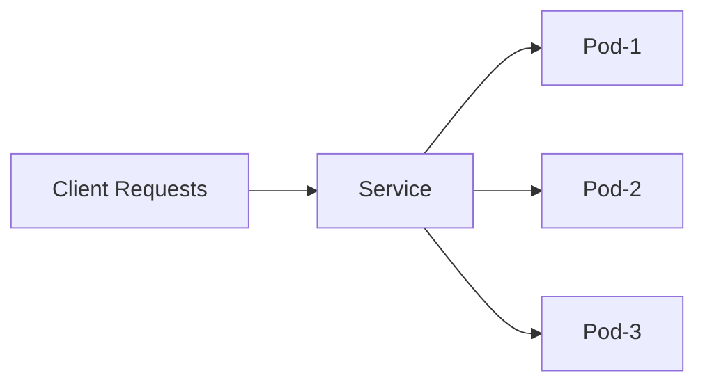

---

### Vertical Scaling과 Horizontal Scaling의 차이

| 구분            | Vertical Scaling            | Horizontal Scaling    |
| ------------- | --------------------------- | --------------------- |
| 조정 대상         | Pod 하나의 자원                  | Pod의 개수               |
| 예시            | CPU 1core → 2core           | replicas 1 → 3        |
| 장점            | Pod 하나의 처리 능력 증가            | 전체 처리량과 가용성 증가        |
| 단점            | 노드 자원 한계에 영향을 받음            | 애플리케이션이 분산 처리에 적합해야 함 |
| Kubernetes 설정 | resources.requests / limits | replicas              |

중요한 점은 둘 중 하나만 정답이 아니라는 것이다.

대량 트래픽을 처리하려면 보통 적절한 Vertical Scaling과 Horizontal Scaling을 함께 사용해야 한다.

---

### Pod Resource 조정

Kubernetes에서는 컨테이너 단위로 CPU와 Memory 자원을 설정할 수 있다.

대표적으로 사용하는 설정은 다음과 같다.

* `requests`
* `limits`

```yaml
resources:
  requests:
    memory: "512Mi"
    cpu: "250m"
  limits:
    memory: "1Gi"
    cpu: "500m"
```

---

### requests

`requests`는 Pod가 Node에 배치될 때 확보되어야 하는 자원이다.

```yaml
requests:
  memory: "512Mi"
  cpu: "250m"
```

이 설정은 다음 의미를 가진다.

```text
이 컨테이너는 최소한 memory 512Mi, cpu 250m 정도는 필요하다.
```

Kubernetes Scheduler는 Pod를 Node에 배치할 때 `requests` 값을 기준으로 판단한다.

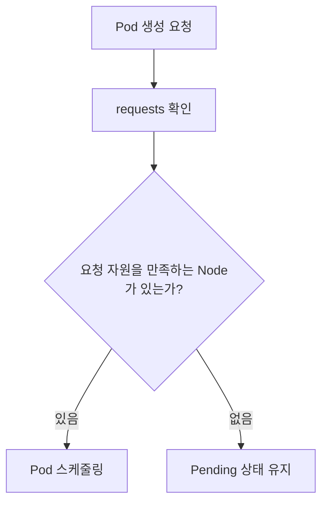

즉 `requests`에 해당하는 자원을 확보할 수 있는 Node가 없다면 Pod는 실행되지 않고 Pending 상태로 남는다.

---

#### requests를 너무 높게 잡으면?

`requests`는 실제 사용량이 아니라 Kubernetes가 예약하는 자원에 가깝다.

예를 들어 어떤 Pod가 실제로는 200Mi만 사용하지만 `requests.memory`를 2Gi로 설정했다면 Kubernetes는 이 Pod가 2Gi를 사용하는 것으로 보고 스케줄링한다.

```text
실제 사용량: 200Mi
requests: 2Gi
Node 입장: 2Gi 사용 중으로 계산
```

이 경우 다음 문제가 발생할 수 있다.

* Node 자원이 빠르게 부족해짐
* Pod가 Pending 상태에 빠질 가능성 증가
* Scale Out이 어려워짐
* 클러스터 전체 자원 효율 저하

따라서 `requests`는 애플리케이션이 안정적으로 동작하기 위해 필요한 최소 자원보다 약간 여유 있는 수준으로 잡는 것이 좋다.

---

#### requests를 설정하지 않으면?

`requests`를 설정하지 않으면 Kubernetes는 해당 Pod의 자원 요구량을 제대로 고려하지 못하고 스케줄링할 수 있다.

이 경우 CPU나 Memory가 거의 남아 있지 않은 Node에도 Pod가 배치될 수 있다.

운영 환경에서는 대부분의 애플리케이션에 `requests`를 설정하는 것이 좋다.

---

### limits

`limits`는 컨테이너가 최대한 사용할 수 있는 자원의 상한이다.

```yaml
limits:
  memory: "1Gi"
  cpu: "500m"
```

이 설정은 다음 의미를 가진다.

```text
이 컨테이너는 최대 memory 1Gi, cpu 500m까지 사용할 수 있다.
```

다만 `limits`는 Kubernetes가 항상 그만큼의 자원을 보장한다는 의미가 아니다.

`requests`가 보장에 가까운 값이라면, `limits`는 상한에 가까운 값이다.

---

#### limits의 역할

`limits`는 애플리케이션이 노드의 자원을 과도하게 사용하는 것을 막는 안전장치이다.

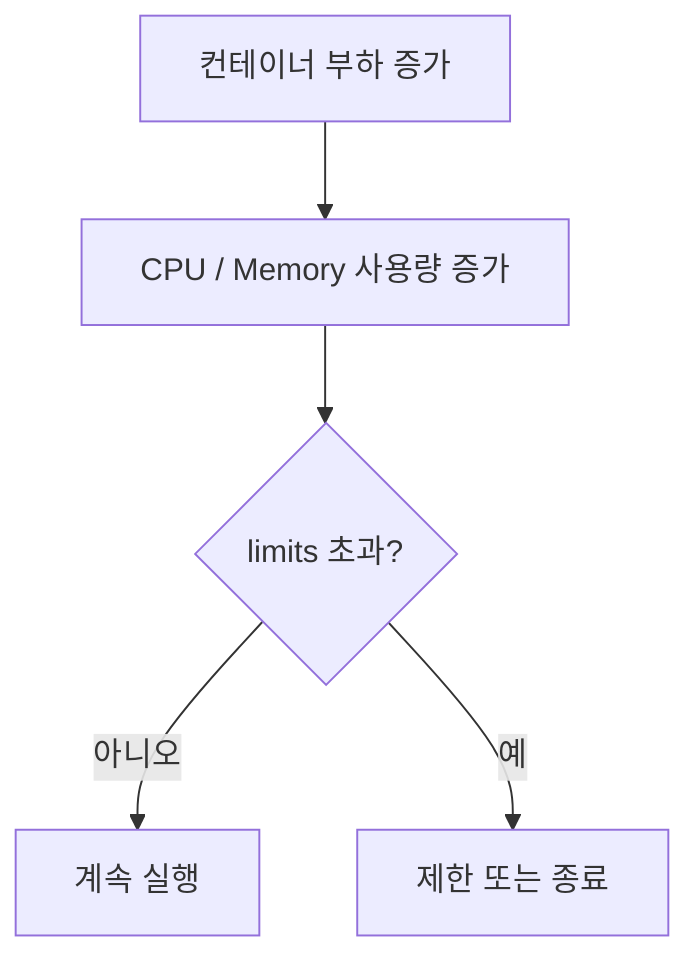

특히 Memory는 한 번 할당된 뒤 바로 반납되지 않는 경우가 많다.

Java, Node.js, Python 같은 런타임은 메모리를 한 번 확보하면 사용량이 줄어도 운영체제에 바로 돌려주지 않는 경우가 있다.

그래서 Memory limit을 설정하지 않으면 하나의 컨테이너가 Node 전체 메모리를 과도하게 사용할 수 있다.

---

#### limits를 설정하지 않으면?

`limits`를 설정하지 않으면 컨테이너가 사용할 수 있는 자원의 상한은 사실상 Node에 남아 있는 전체 자원이 된다.

이 경우 고성능이 필요한 워크로드에서는 장점처럼 보일 수 있다.

하지만 일반적인 운영 환경에서는 다음 문제가 생긴다.

* 특정 Pod가 Node 자원을 독점
* 다른 Pod 성능 저하
* 예측하기 어려운 성능
* Node 불안정
* OOM 발생 가능성 증가

따라서 대부분의 운영 애플리케이션에서는 `requests`와 `limits`를 함께 설정하는 것이 좋다.

---

### requests와 limits의 관계

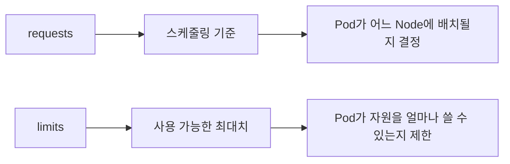

간단히 정리하면 다음과 같다.

| 설정       | 의미          | 주요 영향      |
| -------- | ----------- | ---------- |
| requests | 최소 확보 자원    | 스케줄링       |
| limits   | 최대 사용 가능 자원 | 실행 중 자원 제한 |

---

### Memory 설정

Memory는 컨테이너가 사용할 수 있는 메모리의 양을 설정한다.

```yaml
memory: "512Mi"
```

Kubernetes에서는 `Mi`, `Gi` 같은 단위를 자주 사용한다.

여기서 주의할 점은 `MB`, `GB`와 `Mi`, `Gi`가 정확히 같지는 않다는 것이다.

| 단위 | 의미            |
| -- | ------------- |
| MB | 10진수 기준 메가바이트 |
| Mi | 2진수 기준 메비바이트  |
| GB | 10진수 기준 기가바이트 |
| Gi | 2진수 기준 기비바이트  |

일반적으로 큰 차이처럼 느껴지지는 않지만, Kubernetes 리소스 설정에서는 `Mi`, `Gi`를 사용하는 것이 더 명확하다.

---

### CPU 설정

CPU는 컨테이너가 할당받는 CPU Time을 코어 단위로 환산한 값이다.

```yaml
cpu: "250m"
```

CPU 단위는 다음과 같이 이해할 수 있다.

| 설정     | 의미        |
| ------ | --------- |
| `1`    | 1 core    |
| `2`    | 2 core    |
| `500m` | 0.5 core  |
| `250m` | 0.25 core |
| `100m` | 0.1 core  |

여기서 `m`은 millicore를 의미한다.

```text
1000m = 1 core
500m = 0.5 core
250m = 0.25 core
```

---

### Resource 설정 예시

```yaml
apiVersion: apps/v1
kind: Deployment
metadata:
  name: my-app
spec:
  replicas: 2
  selector:
    matchLabels:
      app: my-app
  template:
    metadata:
      labels:
        app: my-app
    spec:
      containers:
        - name: my-app
          image: my-app:1.0.0
          resources:
            requests:
              memory: "512Mi"
              cpu: "250m"
            limits:
              memory: "1Gi"
              cpu: "500m"
```

이 설정은 다음 의미를 가진다.

* Pod는 최소 512Mi 메모리와 250m CPU를 필요로 한다.
* 컨테이너는 최대 1Gi 메모리와 500m CPU까지 사용할 수 있다.
* Scheduler는 requests 기준으로 Node 배치를 결정한다.
* 실행 중 자원 사용은 limits 기준으로 제한된다.

---

### JVM Memory 설정

Java 애플리케이션을 Kubernetes에서 실행할 때는 컨테이너 메모리와 JVM Heap 메모리를 구분해야 한다.

PDF에서도 JVM Heap과 Container Memory를 별도로 표현하고, JVM 옵션을 통해 크기나 비율을 조정할 수 있다고 설명한다.

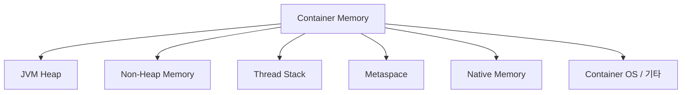

많은 개발자가 Java 메모리라고 하면 Heap만 생각하기 쉽다.

하지만 컨테이너 안에서 Java 애플리케이션은 Heap 외에도 여러 메모리를 사용한다.

* Heap
* Metaspace
* Thread Stack
* Code Cache
* Direct Buffer
* Native Memory
* JVM 자체 메모리
* 컨테이너 내부 프로세스 메모리

따라서 컨테이너 메모리 전체를 Heap으로 잡으면 안 된다.

---

### JVM 버전과 컨테이너 인식

오래된 JVM은 컨테이너 환경을 제대로 인식하지 못했다.

컨테이너에 1Gi 메모리를 제한해도 JVM이 Node 전체 메모리를 기준으로 Heap을 계산할 수 있었다.

이 경우 JVM이 컨테이너 limit보다 더 많은 메모리를 사용할 수 있다고 판단하는 문제가 생긴다.

최근 JVM은 컨테이너 환경을 인식한다.

현재는 `UseContainerSupport` 옵션이 기본적으로 활성화되어 있는 경우가 많기 때문에 별도로 켜지 않아도 되는 경우가 많다.

운영 환경에서는 적어도 컨테이너 환경을 제대로 지원하는 JVM 버전을 사용하는 것이 좋다.

---

### JVM Heap 설정 방식

JVM Heap은 크게 두 방식으로 설정할 수 있다.

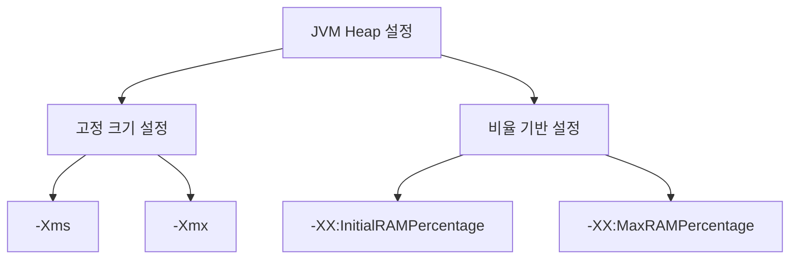

---

#### -Xms, -Xmx

`-Xms`, `-Xmx`는 Heap 크기를 고정값으로 지정하는 방식이다.

```shell
java -Xms512m -Xmx512m -jar app.jar
```

이 방식은 명확하지만 단점이 있다.

Kubernetes에서 컨테이너 메모리 limit을 변경해도 JVM Heap 설정은 자동으로 바뀌지 않는다.

예를 들어 다음 상황을 보자.

```text
컨테이너 memory limit: 1Gi
JVM -Xmx: 512m
```

이후 컨테이너 limit을 2Gi로 늘려도 `-Xmx`가 그대로 512m이면 JVM Heap은 늘어나지 않는다.

따라서 리소스 조정 시 Kubernetes 설정과 JVM 옵션을 함께 수정해야 한다.

---

#### InitialRAMPercentage, MaxRAMPercentage

비율 기반 설정은 컨테이너에 할당된 메모리를 기준으로 Heap 비율을 정한다.

```shell
java \
  -XX:InitialRAMPercentage=50 \
  -XX:MaxRAMPercentage=50 \
  -jar app.jar
```

예를 들어 컨테이너 메모리가 1Gi이고 `MaxRAMPercentage=50`이면 JVM은 약 512Mi를 최대 Heap으로 사용할 수 있다.

이 방식의 장점은 Kubernetes 리소스 조정과 JVM Heap 조정이 자연스럽게 연결된다는 점이다.

```text
memory limit 1Gi → heap 약 512Mi
memory limit 2Gi → heap 약 1Gi
```

---

### Heap 비율 설정 시 주의사항

Heap 비율을 너무 높게 잡으면 Non-Heap 영역이 부족해질 수 있다.

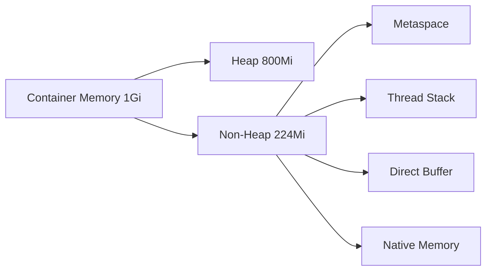

Spring Boot 애플리케이션은 Thread, Class Metadata, Buffer 등을 많이 사용할 수 있다.

처음부터 80~90%를 Heap으로 잡으면 애플리케이션이 제대로 기동되지 않거나 운영 중 문제가 생길 수 있다.

일반적으로는 50% 정도에서 시작하고 모니터링을 통해 조정하는 것이 안전하다.

---

### OutOfMemory와 ExitOnOutOfMemoryError

메모리가 부족하면 JVM에서 `OutOfMemoryError`가 발생할 수 있다.

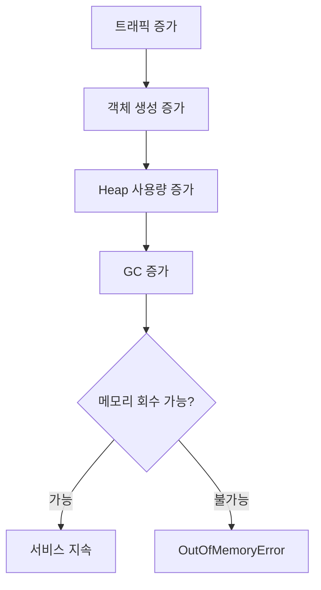

문제는 JVM의 OOM이 발생했다고 해서 항상 컨테이너가 바로 종료되는 것은 아니라는 점이다.

JVM이 OOM 이후에도 살아 있다면 애플리케이션은 불안정한 상태로 계속 동작할 수 있다.

그래서 보통 다음 옵션을 사용한다.

```shell
-XX:+ExitOnOutOfMemoryError
```

이 옵션을 주면 OOM 발생 시 JVM 프로세스가 종료된다.

JVM 프로세스가 종료되면 컨테이너도 종료되고, Kubernetes가 컨테이너를 다시 시작할 수 있다.

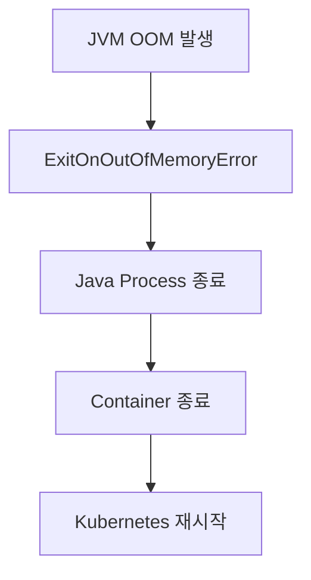

---

### CPU Resource 설정

CPU Resource는 실제 물리 코어를 고정으로 할당한다는 의미가 아니다.

PDF에서도 CPU Resource를 “실제로 사용하는 코어가 아닌 노드의 CPU를 점유하는 비율”이라고 설명한다.

예를 들어 Node가 8 core이고 어떤 컨테이너가 2000m CPU를 요청한다고 하자.

```text
2000m = 2 core
8 core Node 기준 약 1/4 수준의 CPU Time
```

이것은 물리 코어 2개를 전용으로 준다는 의미가 아니라, 전체 CPU Time 중 2 core에 해당하는 비율만큼 사용할 수 있다는 의미에 가깝다.

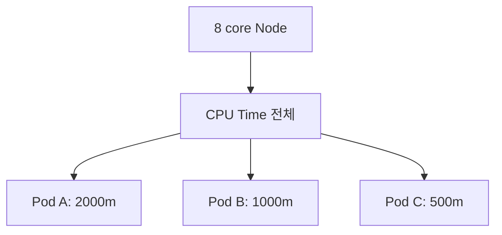

---

### CPU Throttling

CPU limit을 설정하면 컨테이너가 해당 CPU Time 이상을 사용하려고 할 때 제한이 걸릴 수 있다.

이를 CPU Throttling이라고 한다.

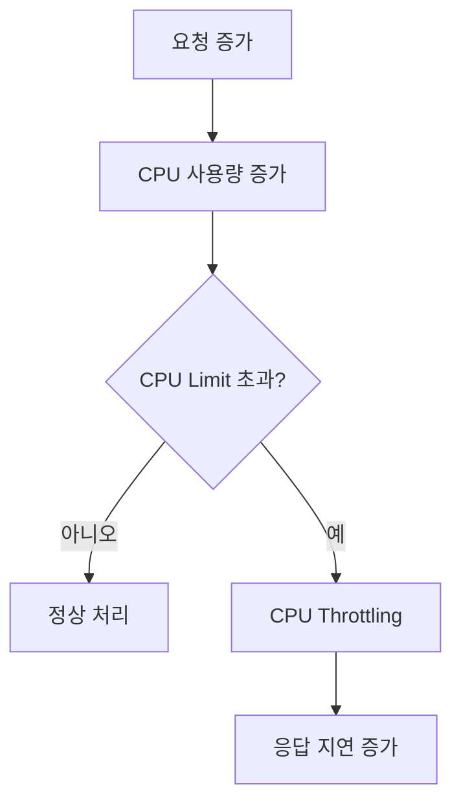

CPU Throttling이 발생하면 애플리케이션은 죽지는 않지만 느려진다.

특히 Spring MVC처럼 요청마다 Thread를 사용하는 서버는 CPU가 부족하면 요청 처리 속도가 크게 떨어질 수 있다.

---

### CPU와 멀티스레딩

CPU를 1 core로 설정했다고 해서 애플리케이션이 실제로 하나의 물리 코어만 사용하는 것은 아니다.

여러 Thread가 여러 Core에서 실행될 수 있다.

다만 전체적으로 사용할 수 있는 CPU Time이 1 core 수준으로 제한된다고 이해하는 것이 좋다.

```text
CPU 1 core 할당
= 물리 코어 1개 고정 사용
X

CPU 1 core 할당
= 전체 CPU Time 중 1 core에 해당하는 비율 사용
O
```

Spring MVC처럼 Thread를 많이 사용하는 애플리케이션은 CPU를 너무 낮게 잡으면 효율이 떨어질 수 있다.

---

### Deployment의 Replica 조정

Horizontal Scaling은 Deployment의 `replicas` 값을 조정하여 수행할 수 있다.

PDF에서도 `replicas` 설정과 `kubectl scale` 명령어를 함께 보여준다.

```yaml
kind: Deployment
metadata:
  name: my-app
spec:
  replicas: 5
```

명령어로도 조정할 수 있다.

```shell
kubectl scale deployment my-app --replicas=5
```

---

### 명령어 기반 Scale 조정의 특징

`kubectl scale`은 급하게 Pod 수량을 늘리거나 줄일 때 유용하다.

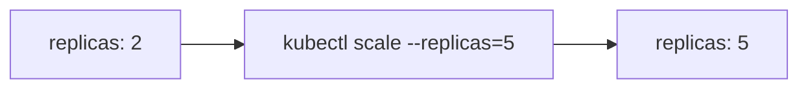

하지만 명령어로 변경한 값은 YAML 파일에 자동으로 반영되지 않는다.

따라서 이후 다시 배포하면 YAML에 정의된 replicas 값으로 돌아갈 수 있다.

예를 들어 다음 상황을 생각해보자.

```text
deployment.yaml: replicas 2
kubectl scale: replicas 5
다시 kubectl apply -f deployment.yaml
결과: replicas 2로 돌아갈 수 있음
```

운영에서는 임시 조정과 선언형 스펙의 차이를 반드시 이해해야 한다.

---

### 대량의 트래픽에 대응하기

대량 트래픽에 대응하는 기본 방식은 Pod의 자원 할당과 Pod 수량을 조정하는 것이다.

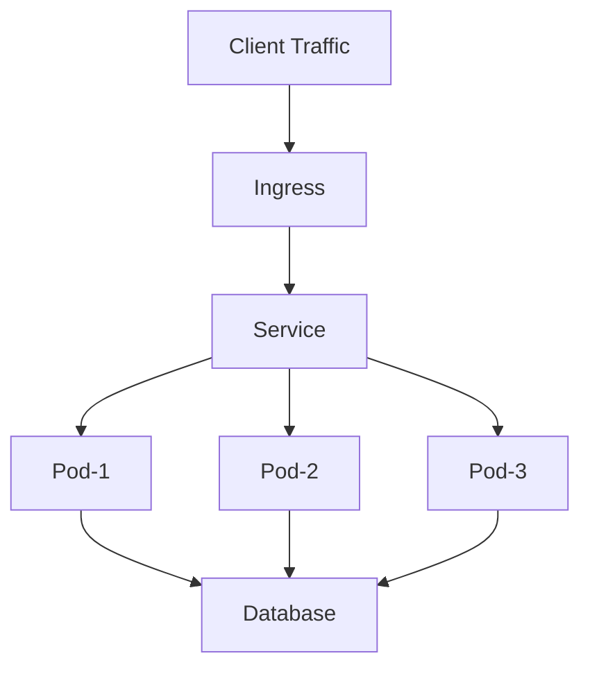

Ingress와 Service는 들어온 요청을 여러 Pod로 분산한다.

따라서 전체 처리량은 대략 다음과 같이 생각할 수 있다.

```text
전체 처리량 ≒ Pod 하나의 처리량 × Pod 개수
```

물론 실제로는 DB, 외부 API, Lock, Network, JVM GC, Thread Pool 등의 병목 때문에 선형적으로 증가하지는 않는다.

---

### Vertical Scaling만으로 대응할 때의 한계

Pod 하나에 많은 자원을 주면 Pod 하나의 처리 능력은 증가한다.

하지만 Pod 수량이 적으면 장애에 취약하다.

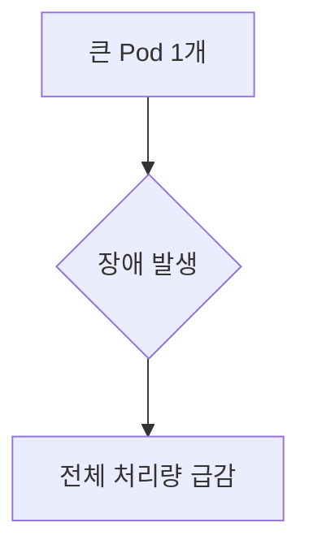

예를 들어 Pod 하나가 대부분의 트래픽을 처리하고 있다가 장애가 발생하면 전체 서비스 처리량이 크게 줄어든다.

---

### Horizontal Scaling만으로 대응할 때의 한계

Pod 수량을 많이 늘려도 Pod 하나당 자원이 너무 적으면 각 Pod가 안정적으로 요청을 처리하지 못할 수 있다.

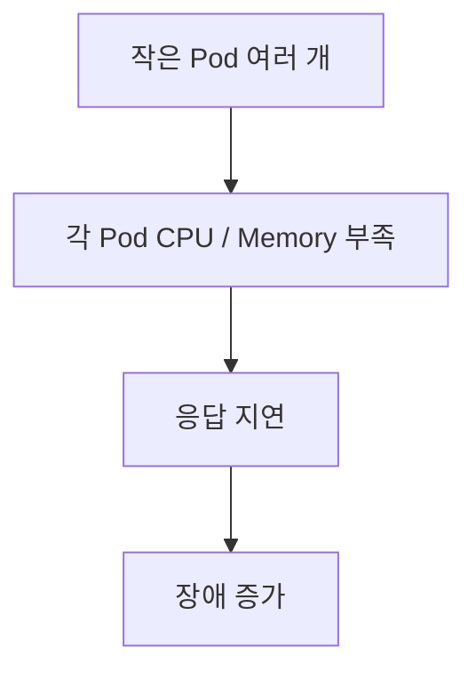

즉 수평 확장만으로 모든 문제가 해결되지는 않는다.

---

### 효율적인 대응 방식

대량 트래픽에는 Vertical Scaling과 Horizontal Scaling을 조합해야 한다.

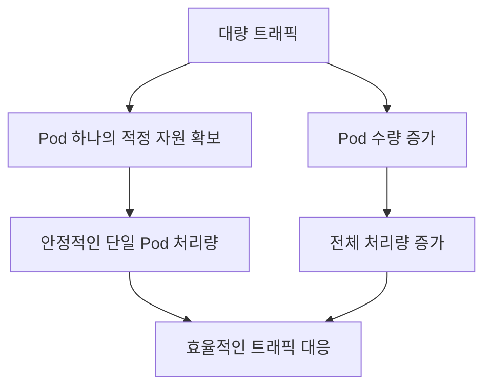

먼저 Pod 하나가 안정적으로 동작할 수 있는 CPU와 Memory를 찾고, 그 기준으로 필요한 replicas 수를 계산하는 것이 좋다.

---

### Kubernetes Pod의 자원 설정

적절한 CPU와 Memory 크기는 감으로 정하기 어렵다.

성능 테스트와 모니터링을 통해 확인해야 한다.

PDF에서도 적절한 CPU, Memory 크기는 성능 테스트나 모니터링을 통해 확인해야 하며, Pod 수량 증가가 성능을 선형적으로 올려주지는 않는다고 정리한다.

---

### 성능 테스트 기준

Pod 하나를 기준으로 먼저 성능을 측정하는 것이 좋다.

예를 들어 다음을 확인한다.

* Pod 하나가 처리 가능한 RPS
* 평균 응답 시간
* P95 / P99 응답 시간
* CPU 사용률
* Memory 사용률
* GC 발생 빈도
* DB Connection 사용량
* Thread Pool 사용량

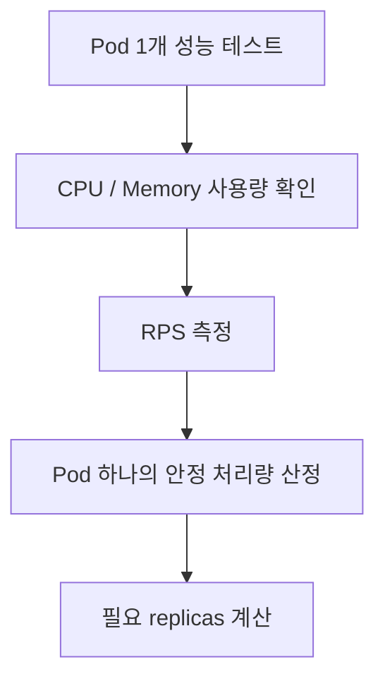

---

### Pod 수량 증가가 항상 선형적이지 않은 이유

Pod를 2배로 늘렸다고 처리량이 항상 2배가 되지는 않는다.

이유는 병목 지점이 Pod 외부에 있을 수 있기 때문이다.

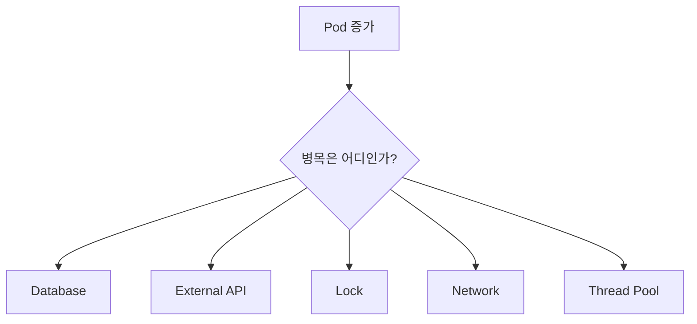

예를 들어 애플리케이션 Pod는 10개로 늘렸지만 DB가 처리할 수 있는 Connection이나 Query 처리량이 그대로라면 전체 성능은 크게 증가하지 않는다.

---

### 애플리케이션 구조에 따른 Scaling 전략

Scaling 전략은 애플리케이션 구조에 따라 달라진다.

#### Spring MVC 기반 애플리케이션

Spring MVC는 일반적으로 요청을 Thread 기반으로 처리한다.

Spring Boot 내장 Tomcat은 기본적으로 많은 Thread를 생성할 수 있다.

요청 처리 중 DB I/O나 외부 API 호출로 Blocking이 발생하면 Thread가 대기한다.

이런 구조에서는 CPU 자원이 너무 적으면 많은 Thread를 효율적으로 처리하기 어렵다.

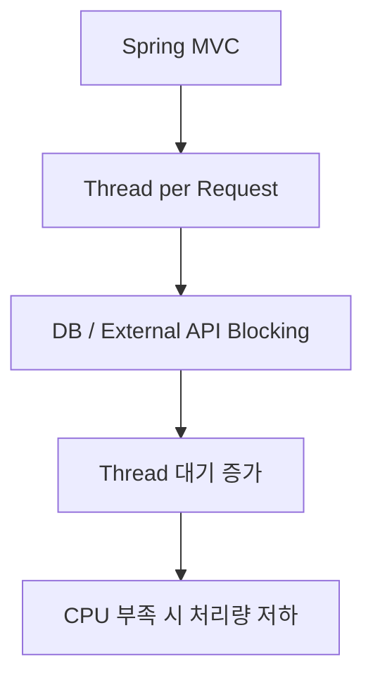

따라서 Spring MVC 애플리케이션은 CPU를 너무 낮게 잡지 않는 것이 좋다.

---

#### Event Loop 기반 애플리케이션

WebFlux, Netty, Node.js 같은 Event Loop 기반 서버는 적은 Thread로 많은 요청을 처리할 수 있다.

이런 구조에서는 하나의 Pod에 CPU를 크게 몰아주기보다, 적절한 CPU를 가진 Pod를 여러 개 Scale Out하는 방식이 더 효율적일 수 있다.

```mermaid
flowchart TD
    A["Event Loop Server"] --> B["적은 Thread"]
    B --> C["Non-blocking I/O"]
    C --> D["Pod 여러 개 Scale Out"]
```

---

### 노드 자원 여유의 중요성

Node의 자원을 100% 가깝게 사용하는 것은 좋지 않다.

자원 여유가 없으면 다음 문제가 발생한다.

* 새 Pod가 Pending 상태에 빠짐
* Rolling Update가 느려짐
* Scale Out이 어려움
* limits까지 자원을 사용하지 못함
* Node 불안정
* 긴급 트래픽 대응 어려움

```mermaid
flowchart TD
    A["Node 자원 부족"] --> B["Pod Pending"]
    A --> C["Rolling Update 지연"]
    A --> D["Scale Out 실패"]
    A --> E["성능 예측 어려움"]
```

트래픽이 급하게 증가하는 상황에서는 Node 여유 자원이 매우 중요하다.

Node를 새로 추가하는 데는 시간이 걸리기 때문이다.

---

### 실무적인 Resource 설정 흐름

```mermaid
flowchart TD
    A["애플리케이션 배포 전"] --> B["Pod 1개 기준 부하 테스트"]
    B --> C["CPU / Memory 사용량 측정"]
    C --> D["requests 설정"]
    D --> E["limits 설정"]
    E --> F["replicas 설정"]
    F --> G["운영 모니터링"]
    G --> H["Resource 재조정"]
```

처음부터 완벽한 값을 정하기는 어렵다.

일반적으로는 적정값으로 시작하고, 모니터링을 통해 조정한다.

---

### 정리

Kubernetes에서 Pod의 자원 설정과 스케일 조정은 애플리케이션 성능과 안정성에 직접적인 영향을 준다.

핵심은 다음과 같다.

* Vertical Scaling은 Pod 하나의 자원 할당량을 조정하는 것이다.
* Horizontal Scaling은 Pod의 수량을 조정하는 것이다.
* `requests`는 스케줄링 기준이 되는 최소 확보 자원이다.
* `limits`는 컨테이너가 사용할 수 있는 최대 자원이다.
* Memory는 `Mi`, `Gi` 단위를 사용하는 것이 명확하다.
* CPU는 실제 물리 코어 고정 할당이 아니라 CPU Time 비율이다.
* JVM에서는 컨테이너 메모리와 Heap 메모리를 구분해야 한다.
* `MaxRAMPercentage`를 사용하면 컨테이너 메모리 기준으로 Heap 비율을 조정할 수 있다.
* `ExitOnOutOfMemoryError`를 사용하면 JVM OOM 시 Kubernetes 재시작 흐름과 잘 연결할 수 있다.
* CPU limit이 낮으면 CPU Throttling으로 응답 지연이 발생할 수 있다.
* replicas는 YAML이나 `kubectl scale` 명령어로 조정할 수 있다.
* 명령어로 바꾼 replicas는 선언형 스펙과 불일치할 수 있다.
* 대량 트래픽 대응은 Vertical Scaling과 Horizontal Scaling의 조합이 필요하다.
* Pod 수를 늘린다고 성능이 항상 선형적으로 증가하지는 않는다.
* Node 자원에는 항상 여유를 두는 것이 좋다.

한 문장으로 정리하면 다음과 같다.

> Kubernetes에서 성능을 높이는 핵심은 “Pod 하나가 안정적으로 처리할 수 있는 자원을 찾고, 그 Pod를 필요한 만큼 수평 확장하는 것”이다.


