# Ch 7. 대규모 트래픽에 대응하기위한 Kubernetes 활용

# Ch 7. 대규모 트래픽에 대응하기위한 Kubernetes 활용
* toc
{:toc}

---

## 01 Kubernetes Pod의 자원 할당과 스케일 조정

### Kubernetes Pod의 자원 할당과 스케일 조정

Kubernetes에서 애플리케이션의 처리량을 높이거나 안정성을 확보하려면 Pod에 할당되는 자원과 Pod의 수량을 함께 이해해야 한다.

이번 내용의 핵심은 두 가지이다.

* 하나의 Pod에 얼마나 많은 자원을 줄 것인가
* Pod를 몇 개 실행할 것인가

이를 Vertical Scaling과 Horizontal Scaling으로 구분하고, `requests`, `limits`, JVM Memory, CPU Throttling, Replica 조정까지 이어서 살펴본다.

---

### 스케일 조정

Kubernetes에서 스케일 조정은 크게 두 가지 방식으로 나눌 수 있다.

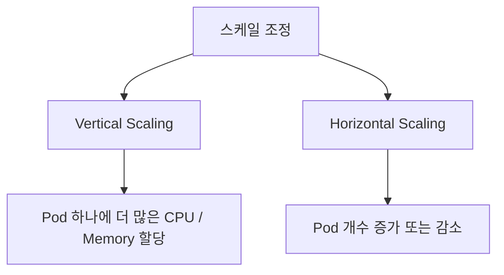

---

#### Vertical Scaling

Vertical Scaling은 하나의 인스턴스에 할당되는 자원을 늘리거나 줄이는 방식이다.

예를 들어 다음과 같은 변화가 Vertical Scaling이다.

```text
변경 전
cpu: 1 core
memory: 1Gi

변경 후
cpu: 2 core
memory: 4Gi
```

즉 Pod의 수량은 그대로 두고, Pod 하나가 사용할 수 있는 자원을 늘리는 방식이다.

대표적인 조정 대상은 다음과 같다.

* CPU
* Memory
* Network Bandwidth
* Storage Size
* Storage I/O 성능

운영 중인 애플리케이션이 메모리 부족으로 자주 오류가 발생한다면, 메모리 할당량을 늘리는 방식으로 대응할 수 있다.

이것이 수직적 스케일 증가이다.

---

#### Horizontal Scaling

Horizontal Scaling은 작업을 처리하는 인스턴스의 수를 늘리거나 줄이는 방식이다.

예를 들어 하나의 Pod로 트래픽을 처리하다가 부족해져서 Pod를 두 개로 늘렸다면 Horizontal Scaling이다.

```text
변경 전
replicas: 1

변경 후
replicas: 2
```

즉 Pod 하나의 자원은 그대로 두고, Pod의 수량을 늘려 전체 처리량을 높이는 방식이다.

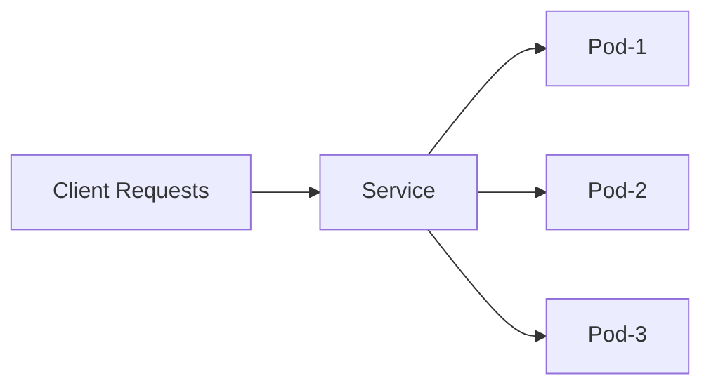

---

### Vertical Scaling과 Horizontal Scaling의 차이

| 구분            | Vertical Scaling            | Horizontal Scaling    |
| ------------- | --------------------------- | --------------------- |
| 조정 대상         | Pod 하나의 자원                  | Pod의 개수               |
| 예시            | CPU 1core → 2core           | replicas 1 → 3        |
| 장점            | Pod 하나의 처리 능력 증가            | 전체 처리량과 가용성 증가        |
| 단점            | 노드 자원 한계에 영향을 받음            | 애플리케이션이 분산 처리에 적합해야 함 |
| Kubernetes 설정 | resources.requests / limits | replicas              |

중요한 점은 둘 중 하나만 정답이 아니라는 것이다.

대량 트래픽을 처리하려면 보통 적절한 Vertical Scaling과 Horizontal Scaling을 함께 사용해야 한다.

---

### Pod Resource 조정

Kubernetes에서는 컨테이너 단위로 CPU와 Memory 자원을 설정할 수 있다.

대표적으로 사용하는 설정은 다음과 같다.

* `requests`
* `limits`

```yaml
resources:
  requests:
    memory: "512Mi"
    cpu: "250m"
  limits:
    memory: "1Gi"
    cpu: "500m"
```

---

### requests

`requests`는 Pod가 Node에 배치될 때 확보되어야 하는 자원이다.

```yaml
requests:
  memory: "512Mi"
  cpu: "250m"
```

이 설정은 다음 의미를 가진다.

```text
이 컨테이너는 최소한 memory 512Mi, cpu 250m 정도는 필요하다.
```

Kubernetes Scheduler는 Pod를 Node에 배치할 때 `requests` 값을 기준으로 판단한다.

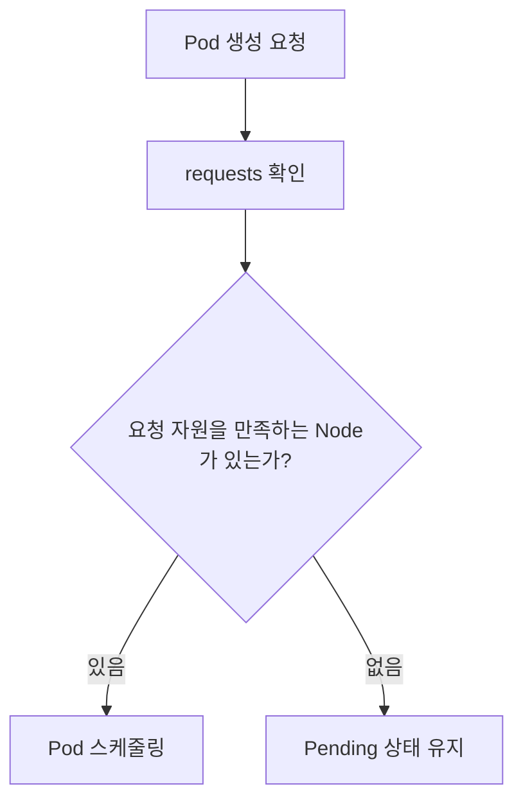

즉 `requests`에 해당하는 자원을 확보할 수 있는 Node가 없다면 Pod는 실행되지 않고 Pending 상태로 남는다.

---

#### requests를 너무 높게 잡으면?

`requests`는 실제 사용량이 아니라 Kubernetes가 예약하는 자원에 가깝다.

예를 들어 어떤 Pod가 실제로는 200Mi만 사용하지만 `requests.memory`를 2Gi로 설정했다면 Kubernetes는 이 Pod가 2Gi를 사용하는 것으로 보고 스케줄링한다.

```text
실제 사용량: 200Mi
requests: 2Gi
Node 입장: 2Gi 사용 중으로 계산
```

이 경우 다음 문제가 발생할 수 있다.

* Node 자원이 빠르게 부족해짐
* Pod가 Pending 상태에 빠질 가능성 증가
* Scale Out이 어려워짐
* 클러스터 전체 자원 효율 저하

따라서 `requests`는 애플리케이션이 안정적으로 동작하기 위해 필요한 최소 자원보다 약간 여유 있는 수준으로 잡는 것이 좋다.

---

#### requests를 설정하지 않으면?

`requests`를 설정하지 않으면 Kubernetes는 해당 Pod의 자원 요구량을 제대로 고려하지 못하고 스케줄링할 수 있다.

이 경우 CPU나 Memory가 거의 남아 있지 않은 Node에도 Pod가 배치될 수 있다.

운영 환경에서는 대부분의 애플리케이션에 `requests`를 설정하는 것이 좋다.

---

### limits

`limits`는 컨테이너가 최대한 사용할 수 있는 자원의 상한이다.

```yaml
limits:
  memory: "1Gi"
  cpu: "500m"
```

이 설정은 다음 의미를 가진다.

```text
이 컨테이너는 최대 memory 1Gi, cpu 500m까지 사용할 수 있다.
```

다만 `limits`는 Kubernetes가 항상 그만큼의 자원을 보장한다는 의미가 아니다.

`requests`가 보장에 가까운 값이라면, `limits`는 상한에 가까운 값이다.

---

#### limits의 역할

`limits`는 애플리케이션이 노드의 자원을 과도하게 사용하는 것을 막는 안전장치이다.

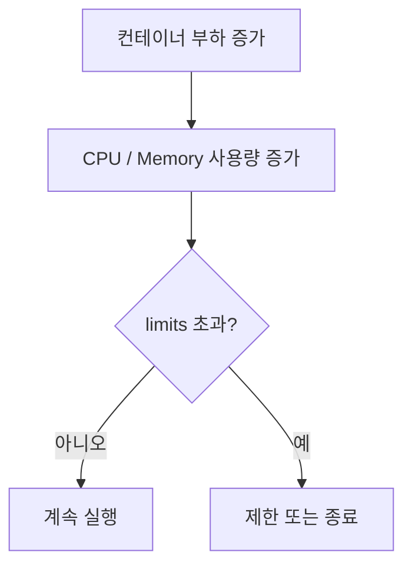

특히 Memory는 한 번 할당된 뒤 바로 반납되지 않는 경우가 많다.

Java, Node.js, Python 같은 런타임은 메모리를 한 번 확보하면 사용량이 줄어도 운영체제에 바로 돌려주지 않는 경우가 있다.

그래서 Memory limit을 설정하지 않으면 하나의 컨테이너가 Node 전체 메모리를 과도하게 사용할 수 있다.

---

#### limits를 설정하지 않으면?

`limits`를 설정하지 않으면 컨테이너가 사용할 수 있는 자원의 상한은 사실상 Node에 남아 있는 전체 자원이 된다.

이 경우 고성능이 필요한 워크로드에서는 장점처럼 보일 수 있다.

하지만 일반적인 운영 환경에서는 다음 문제가 생긴다.

* 특정 Pod가 Node 자원을 독점
* 다른 Pod 성능 저하
* 예측하기 어려운 성능
* Node 불안정
* OOM 발생 가능성 증가

따라서 대부분의 운영 애플리케이션에서는 `requests`와 `limits`를 함께 설정하는 것이 좋다.

---

### requests와 limits의 관계

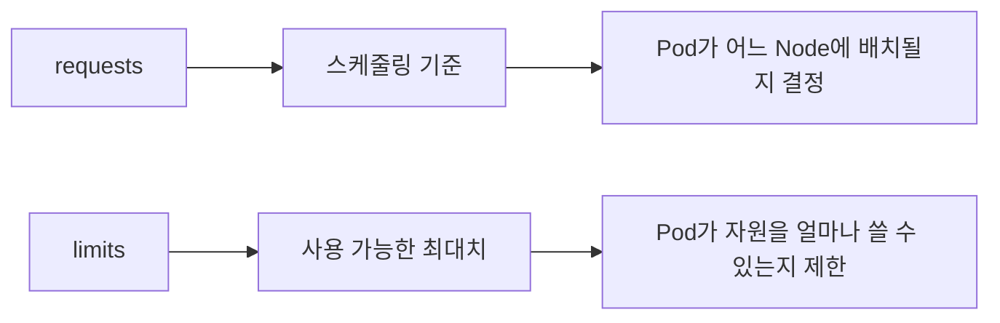

간단히 정리하면 다음과 같다.

| 설정       | 의미          | 주요 영향      |
| -------- | ----------- | ---------- |
| requests | 최소 확보 자원    | 스케줄링       |
| limits   | 최대 사용 가능 자원 | 실행 중 자원 제한 |

---

### Memory 설정

Memory는 컨테이너가 사용할 수 있는 메모리의 양을 설정한다.

```yaml
memory: "512Mi"
```

Kubernetes에서는 `Mi`, `Gi` 같은 단위를 자주 사용한다.

여기서 주의할 점은 `MB`, `GB`와 `Mi`, `Gi`가 정확히 같지는 않다는 것이다.

| 단위 | 의미            |
| -- | ------------- |
| MB | 10진수 기준 메가바이트 |
| Mi | 2진수 기준 메비바이트  |
| GB | 10진수 기준 기가바이트 |
| Gi | 2진수 기준 기비바이트  |

일반적으로 큰 차이처럼 느껴지지는 않지만, Kubernetes 리소스 설정에서는 `Mi`, `Gi`를 사용하는 것이 더 명확하다.

---

### CPU 설정

CPU는 컨테이너가 할당받는 CPU Time을 코어 단위로 환산한 값이다.

```yaml
cpu: "250m"
```

CPU 단위는 다음과 같이 이해할 수 있다.

| 설정     | 의미        |
| ------ | --------- |
| `1`    | 1 core    |
| `2`    | 2 core    |
| `500m` | 0.5 core  |
| `250m` | 0.25 core |
| `100m` | 0.1 core  |

여기서 `m`은 millicore를 의미한다.

```text
1000m = 1 core
500m = 0.5 core
250m = 0.25 core
```

---

### Resource 설정 예시

```yaml
apiVersion: apps/v1
kind: Deployment
metadata:
  name: my-app
spec:
  replicas: 2
  selector:
    matchLabels:
      app: my-app
  template:
    metadata:
      labels:
        app: my-app
    spec:
      containers:
        - name: my-app
          image: my-app:1.0.0
          resources:
            requests:
              memory: "512Mi"
              cpu: "250m"
            limits:
              memory: "1Gi"
              cpu: "500m"
```

이 설정은 다음 의미를 가진다.

* Pod는 최소 512Mi 메모리와 250m CPU를 필요로 한다.
* 컨테이너는 최대 1Gi 메모리와 500m CPU까지 사용할 수 있다.
* Scheduler는 requests 기준으로 Node 배치를 결정한다.
* 실행 중 자원 사용은 limits 기준으로 제한된다.

---

### JVM Memory 설정

Java 애플리케이션을 Kubernetes에서 실행할 때는 컨테이너 메모리와 JVM Heap 메모리를 구분해야 한다.

JVM Heap과 Container Memory는 별도로 봐야 하며, JVM 옵션을 통해 크기나 비율을 조정할 수 있다.

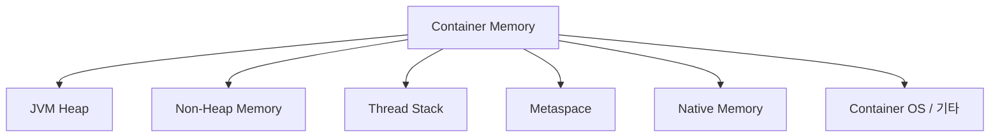

많은 개발자가 Java 메모리라고 하면 Heap만 생각하기 쉽다.

하지만 컨테이너 안에서 Java 애플리케이션은 Heap 외에도 여러 메모리를 사용한다.

* Heap
* Metaspace
* Thread Stack
* Code Cache
* Direct Buffer
* Native Memory
* JVM 자체 메모리
* 컨테이너 내부 프로세스 메모리

따라서 컨테이너 메모리 전체를 Heap으로 잡으면 안 된다.

---

### JVM 버전과 컨테이너 인식

오래된 JVM은 컨테이너 환경을 제대로 인식하지 못했다.

컨테이너에 1Gi 메모리를 제한해도 JVM이 Node 전체 메모리를 기준으로 Heap을 계산할 수 있었다.

이 경우 JVM이 컨테이너 limit보다 더 많은 메모리를 사용할 수 있다고 판단하는 문제가 생긴다.

최근 JVM은 컨테이너 환경을 인식한다.

현재는 `UseContainerSupport` 옵션이 기본적으로 활성화되어 있는 경우가 많기 때문에 별도로 켜지 않아도 되는 경우가 많다.

운영 환경에서는 적어도 컨테이너 환경을 제대로 지원하는 JVM 버전을 사용하는 것이 좋다.

---

### JVM Heap 설정 방식

JVM Heap은 크게 두 방식으로 설정할 수 있다.

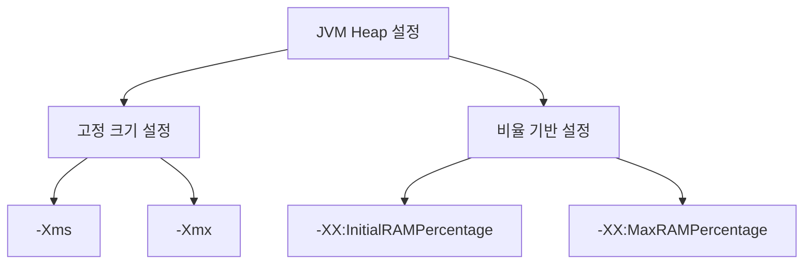

---

#### -Xms, -Xmx

`-Xms`, `-Xmx`는 Heap 크기를 고정값으로 지정하는 방식이다.

```shell
java -Xms512m -Xmx512m -jar app.jar
```

이 방식은 명확하지만 단점이 있다.

Kubernetes에서 컨테이너 메모리 limit을 변경해도 JVM Heap 설정은 자동으로 바뀌지 않는다.

예를 들어 다음 상황을 보자.

```text
컨테이너 memory limit: 1Gi
JVM -Xmx: 512m
```

이후 컨테이너 limit을 2Gi로 늘려도 `-Xmx`가 그대로 512m이면 JVM Heap은 늘어나지 않는다.

따라서 리소스 조정 시 Kubernetes 설정과 JVM 옵션을 함께 수정해야 한다.

---

#### InitialRAMPercentage, MaxRAMPercentage

비율 기반 설정은 컨테이너에 할당된 메모리를 기준으로 Heap 비율을 정한다.

```shell
java \
  -XX:InitialRAMPercentage=50 \
  -XX:MaxRAMPercentage=50 \
  -jar app.jar
```

예를 들어 컨테이너 메모리가 1Gi이고 `MaxRAMPercentage=50`이면 JVM은 약 512Mi를 최대 Heap으로 사용할 수 있다.

이 방식의 장점은 Kubernetes 리소스 조정과 JVM Heap 조정이 자연스럽게 연결된다는 점이다.

```text
memory limit 1Gi → heap 약 512Mi
memory limit 2Gi → heap 약 1Gi
```

---

### Heap 비율 설정 시 주의사항

Heap 비율을 너무 높게 잡으면 Non-Heap 영역이 부족해질 수 있다.

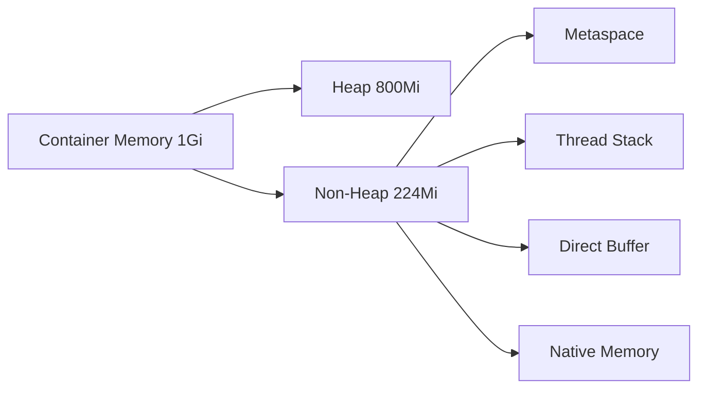

Spring Boot 애플리케이션은 Thread, Class Metadata, Buffer 등을 많이 사용할 수 있다.

처음부터 80~90%를 Heap으로 잡으면 애플리케이션이 제대로 기동되지 않거나 운영 중 문제가 생길 수 있다.

일반적으로는 50% 정도에서 시작하고 모니터링을 통해 조정하는 것이 안전하다.

---

### OutOfMemory와 ExitOnOutOfMemoryError

메모리가 부족하면 JVM에서 `OutOfMemoryError`가 발생할 수 있다.

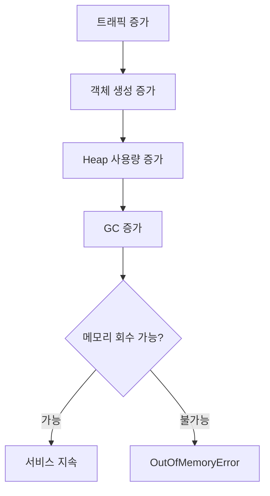

문제는 JVM의 OOM이 발생했다고 해서 항상 컨테이너가 바로 종료되는 것은 아니라는 점이다.

JVM이 OOM 이후에도 살아 있다면 애플리케이션은 불안정한 상태로 계속 동작할 수 있다.

그래서 보통 다음 옵션을 사용한다.

```shell
-XX:+ExitOnOutOfMemoryError
```

이 옵션을 주면 OOM 발생 시 JVM 프로세스가 종료된다.

JVM 프로세스가 종료되면 컨테이너도 종료되고, Kubernetes가 컨테이너를 다시 시작할 수 있다.

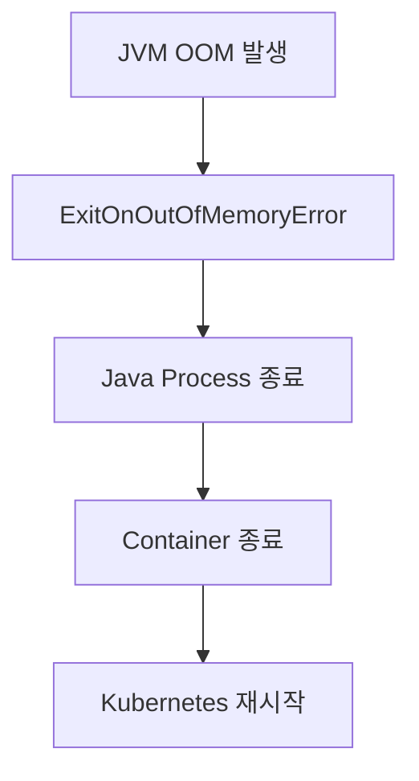

---

### CPU Resource 설정

CPU Resource는 실제 물리 코어를 고정으로 할당한다는 의미가 아니다.

CPU Resource는 실제로 사용하는 코어가 아니라 노드의 CPU를 점유하는 비율에 가깝다.

예를 들어 Node가 8 core이고 어떤 컨테이너가 2000m CPU를 요청한다고 하자.

```text
2000m = 2 core
8 core Node 기준 약 1/4 수준의 CPU Time
```

이것은 물리 코어 2개를 전용으로 준다는 의미가 아니라, 전체 CPU Time 중 2 core에 해당하는 비율만큼 사용할 수 있다는 의미에 가깝다.

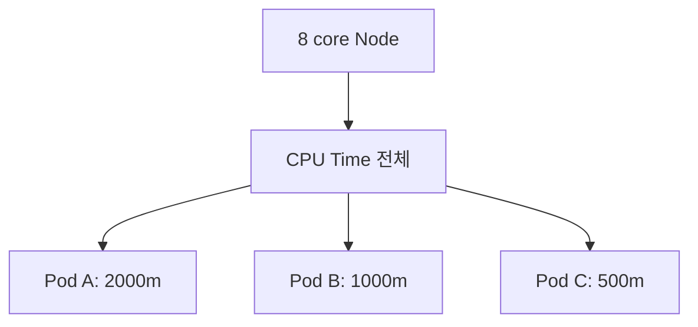

---

### CPU Throttling

CPU limit을 설정하면 컨테이너가 해당 CPU Time 이상을 사용하려고 할 때 제한이 걸릴 수 있다.

이를 CPU Throttling이라고 한다.

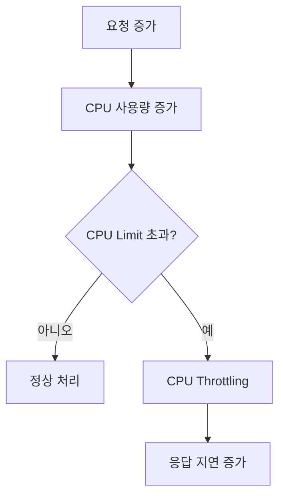

CPU Throttling이 발생하면 애플리케이션은 죽지는 않지만 느려진다.

특히 Spring MVC처럼 요청마다 Thread를 사용하는 서버는 CPU가 부족하면 요청 처리 속도가 크게 떨어질 수 있다.

---

### CPU와 멀티스레딩

CPU를 1 core로 설정했다고 해서 애플리케이션이 실제로 하나의 물리 코어만 사용하는 것은 아니다.

여러 Thread가 여러 Core에서 실행될 수 있다.

다만 전체적으로 사용할 수 있는 CPU Time이 1 core 수준으로 제한된다고 이해하는 것이 좋다.

```text
CPU 1 core 할당
= 물리 코어 1개 고정 사용
X

CPU 1 core 할당
= 전체 CPU Time 중 1 core에 해당하는 비율 사용
O
```

Spring MVC처럼 Thread를 많이 사용하는 애플리케이션은 CPU를 너무 낮게 잡으면 효율이 떨어질 수 있다.

---

### Deployment의 Replica 조정

Horizontal Scaling은 Deployment의 `replicas` 값을 조정하여 수행할 수 있다.

`replicas` 설정은 YAML과 `kubectl scale` 명령어로 조정할 수 있다.

```yaml
kind: Deployment
metadata:
  name: my-app
spec:
  replicas: 5
```

명령어로도 조정할 수 있다.

```shell
kubectl scale deployment my-app --replicas=5
```

---

### 명령어 기반 Scale 조정의 특징

`kubectl scale`은 급하게 Pod 수량을 늘리거나 줄일 때 유용하다.

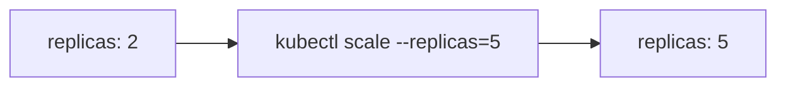

하지만 명령어로 변경한 값은 YAML 파일에 자동으로 반영되지 않는다.

따라서 이후 다시 배포하면 YAML에 정의된 replicas 값으로 돌아갈 수 있다.

예를 들어 다음 상황을 생각해보자.

```text
deployment.yaml: replicas 2
kubectl scale: replicas 5
다시 kubectl apply -f deployment.yaml
결과: replicas 2로 돌아갈 수 있음
```

운영에서는 임시 조정과 선언형 스펙의 차이를 반드시 이해해야 한다.

---

### 대량의 트래픽에 대응하기

대량 트래픽에 대응하는 기본 방식은 Pod의 자원 할당과 Pod 수량을 조정하는 것이다.

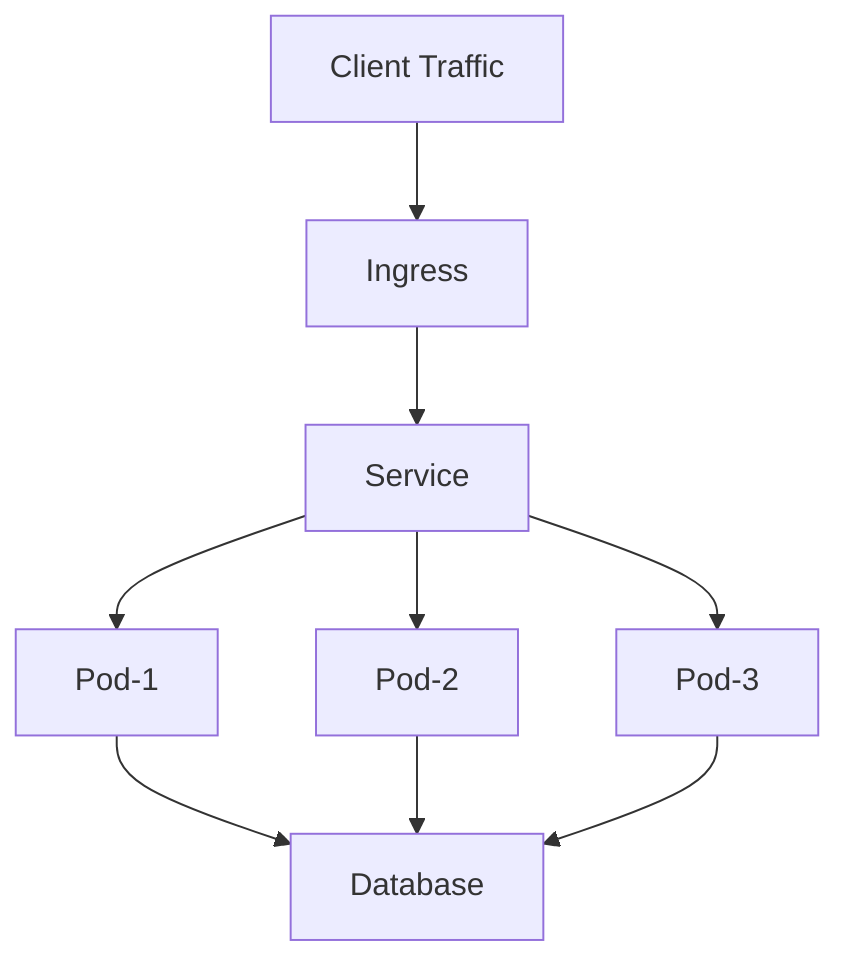

Ingress와 Service는 들어온 요청을 여러 Pod로 분산한다.

따라서 전체 처리량은 대략 다음과 같이 생각할 수 있다.

```text
전체 처리량 ≒ Pod 하나의 처리량 × Pod 개수
```

물론 실제로는 DB, 외부 API, Lock, Network, JVM GC, Thread Pool 등의 병목 때문에 선형적으로 증가하지는 않는다.

---

### Vertical Scaling만으로 대응할 때의 한계

Pod 하나에 많은 자원을 주면 Pod 하나의 처리 능력은 증가한다.

하지만 Pod 수량이 적으면 장애에 취약하다.

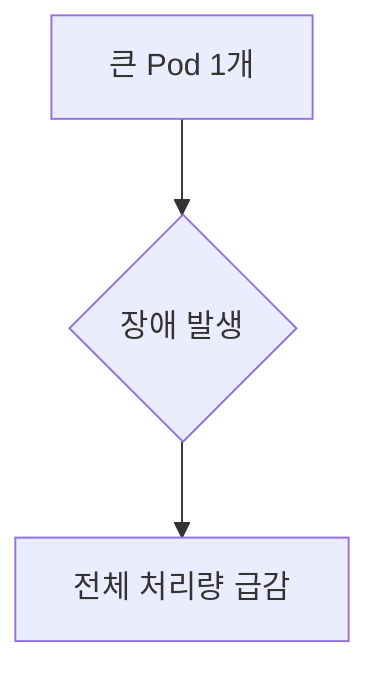

예를 들어 Pod 하나가 대부분의 트래픽을 처리하고 있다가 장애가 발생하면 전체 서비스 처리량이 크게 줄어든다.

---

### Horizontal Scaling만으로 대응할 때의 한계

Pod 수량을 많이 늘려도 Pod 하나당 자원이 너무 적으면 각 Pod가 안정적으로 요청을 처리하지 못할 수 있다.

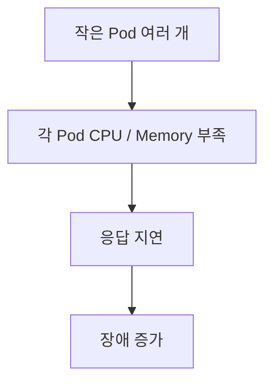

즉 수평 확장만으로 모든 문제가 해결되지는 않는다.

---

### 효율적인 대응 방식

대량 트래픽에는 Vertical Scaling과 Horizontal Scaling을 조합해야 한다.

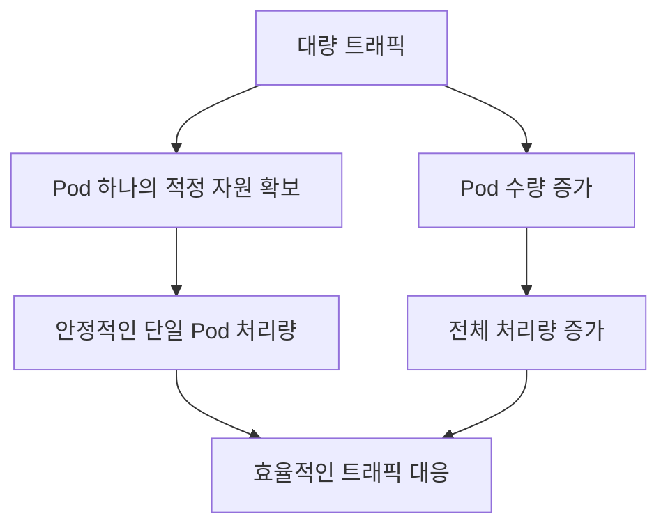

먼저 Pod 하나가 안정적으로 동작할 수 있는 CPU와 Memory를 찾고, 그 기준으로 필요한 replicas 수를 계산하는 것이 좋다.

---

### Kubernetes Pod의 자원 설정

적절한 CPU와 Memory 크기는 감으로 정하기 어렵다.

성능 테스트와 모니터링을 통해 확인해야 한다.

적절한 CPU, Memory 크기는 성능 테스트나 모니터링을 통해 확인해야 하며, Pod 수량 증가가 성능을 선형적으로 올려주지는 않는다.

---

### 성능 테스트 기준

Pod 하나를 기준으로 먼저 성능을 측정하는 것이 좋다.

예를 들어 다음을 확인한다.

* Pod 하나가 처리 가능한 RPS
* 평균 응답 시간
* P95 / P99 응답 시간
* CPU 사용률
* Memory 사용률
* GC 발생 빈도
* DB Connection 사용량
* Thread Pool 사용량

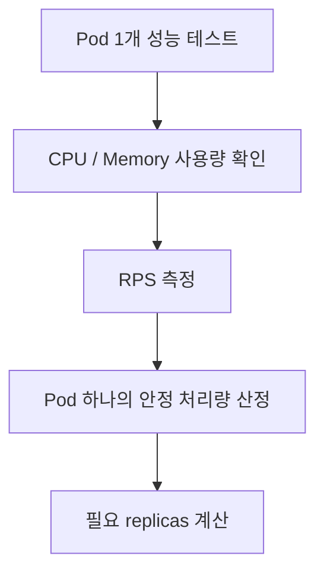

---

### Pod 수량 증가가 항상 선형적이지 않은 이유

Pod를 2배로 늘렸다고 처리량이 항상 2배가 되지는 않는다.

이유는 병목 지점이 Pod 외부에 있을 수 있기 때문이다.

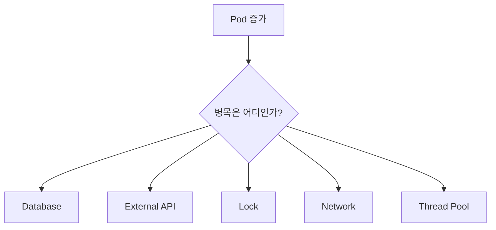

예를 들어 애플리케이션 Pod는 10개로 늘렸지만 DB가 처리할 수 있는 Connection이나 Query 처리량이 그대로라면 전체 성능은 크게 증가하지 않는다.

---

### 애플리케이션 구조에 따른 Scaling 전략

Scaling 전략은 애플리케이션 구조에 따라 달라진다.

#### Spring MVC 기반 애플리케이션

Spring MVC는 일반적으로 요청을 Thread 기반으로 처리한다.

Spring Boot 내장 Tomcat은 기본적으로 많은 Thread를 생성할 수 있다.

요청 처리 중 DB I/O나 외부 API 호출로 Blocking이 발생하면 Thread가 대기한다.

이런 구조에서는 CPU 자원이 너무 적으면 많은 Thread를 효율적으로 처리하기 어렵다.

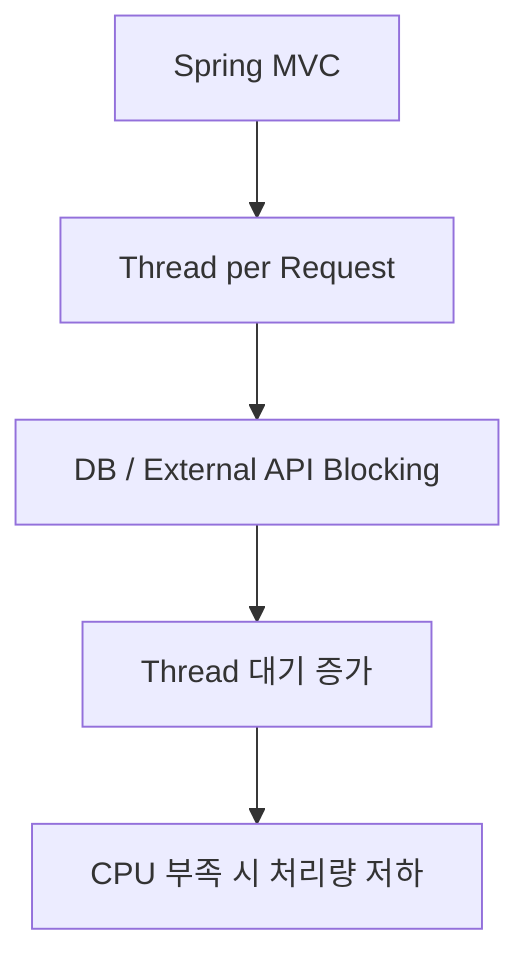

따라서 Spring MVC 애플리케이션은 CPU를 너무 낮게 잡지 않는 것이 좋다.

---

#### Event Loop 기반 애플리케이션

WebFlux, Netty, Node.js 같은 Event Loop 기반 서버는 적은 Thread로 많은 요청을 처리할 수 있다.

이런 구조에서는 하나의 Pod에 CPU를 크게 몰아주기보다, 적절한 CPU를 가진 Pod를 여러 개 Scale Out하는 방식이 더 효율적일 수 있다.

```mermaid
flowchart TD
    A["Event Loop Server"] --> B["적은 Thread"]
    B --> C["Non-blocking I/O"]
    C --> D["Pod 여러 개 Scale Out"]
```

---

### 노드 자원 여유의 중요성

Node의 자원을 100% 가깝게 사용하는 것은 좋지 않다.

자원 여유가 없으면 다음 문제가 발생한다.

* 새 Pod가 Pending 상태에 빠짐
* Rolling Update가 느려짐
* Scale Out이 어려움
* limits까지 자원을 사용하지 못함
* Node 불안정
* 긴급 트래픽 대응 어려움

```mermaid
flowchart TD
    A["Node 자원 부족"] --> B["Pod Pending"]
    A --> C["Rolling Update 지연"]
    A --> D["Scale Out 실패"]
    A --> E["성능 예측 어려움"]
```

트래픽이 급하게 증가하는 상황에서는 Node 여유 자원이 매우 중요하다.

Node를 새로 추가하는 데는 시간이 걸리기 때문이다.

---

### 실무적인 Resource 설정 흐름

```mermaid
flowchart TD
    A["애플리케이션 배포 전"] --> B["Pod 1개 기준 부하 테스트"]
    B --> C["CPU / Memory 사용량 측정"]
    C --> D["requests 설정"]
    D --> E["limits 설정"]
    E --> F["replicas 설정"]
    F --> G["운영 모니터링"]
    G --> H["Resource 재조정"]
```

처음부터 완벽한 값을 정하기는 어렵다.

일반적으로는 적정값으로 시작하고, 모니터링을 통해 조정한다.

---

### 정리

Kubernetes에서 Pod의 자원 설정과 스케일 조정은 애플리케이션 성능과 안정성에 직접적인 영향을 준다.

핵심은 다음과 같다.

* Vertical Scaling은 Pod 하나의 자원 할당량을 조정하는 것이다.
* Horizontal Scaling은 Pod의 수량을 조정하는 것이다.
* `requests`는 스케줄링 기준이 되는 최소 확보 자원이다.
* `limits`는 컨테이너가 사용할 수 있는 최대 자원이다.
* Memory는 `Mi`, `Gi` 단위를 사용하는 것이 명확하다.
* CPU는 실제 물리 코어 고정 할당이 아니라 CPU Time 비율이다.
* JVM에서는 컨테이너 메모리와 Heap 메모리를 구분해야 한다.
* `MaxRAMPercentage`를 사용하면 컨테이너 메모리 기준으로 Heap 비율을 조정할 수 있다.
* `ExitOnOutOfMemoryError`를 사용하면 JVM OOM 시 Kubernetes 재시작 흐름과 잘 연결할 수 있다.
* CPU limit이 낮으면 CPU Throttling으로 응답 지연이 발생할 수 있다.
* replicas는 YAML이나 `kubectl scale` 명령어로 조정할 수 있다.
* 명령어로 바꾼 replicas는 선언형 스펙과 불일치할 수 있다.
* 대량 트래픽 대응은 Vertical Scaling과 Horizontal Scaling의 조합이 필요하다.
* Pod 수를 늘린다고 성능이 항상 선형적으로 증가하지는 않는다.
* Node 자원에는 항상 여유를 두는 것이 좋다.

한 문장으로 정리하면 다음과 같다.

> Kubernetes에서 성능을 높이는 핵심은 “Pod 하나가 안정적으로 처리할 수 있는 자원을 찾고, 그 Pod를 필요한 만큼 수평 확장하는 것”이다.

## 02. Kubernetes를 이용한 오토스케일링
오토스케일링을 이해할 때는 VPA를 “직접 적용”하는 것만이 답이 아니다. **Kubecost 같은 비용/리소스 분석 도구로 적정 requests/limits를 찾는 방식**도 함께 고려하면 흐름이 더 자연스럽다.

### Kubernetes를 이용한 오토스케일링

Kubernetes를 사용하면 Self-Healing을 통해 Pod가 비정상 종료되었을 때 자동으로 복구할 수 있다.

하지만 운영 환경에서는 단순히 장애가 난 Pod를 복구하는 것만으로는 부족하다. 트래픽이 늘어나면 Pod 수량을 늘려야 하고, 트래픽이 줄어들면 불필요하게 사용 중인 자원을 줄여야 한다.

이처럼 현재 트래픽과 자원 사용량에 맞춰 자동으로 규모를 조정하는 기능을 오토스케일링이라고 한다.

오토스케일링을 사용하면 사람이 계속 모니터링하다가 수동으로 Pod 수량을 조정하지 않아도 된다. 미리 정의한 규칙에 따라 시스템이 자동으로 스케일을 조정하므로 예상치 못한 트래픽 증가에 더 유연하게 대응할 수 있다.

### Kubernetes의 Pod 오토스케일링

Kubernetes에서 Pod 오토스케일링은 크게 두 가지 방식으로 나눌 수 있다.

```mermaid
flowchart TD
    A["Kubernetes Pod Autoscaling"] --> B["HPA"]
    A --> C["VPA"]

    B --> B1["Horizontal Pod Autoscaler"]
    B --> B2["Pod 수량 조정"]

    C --> C1["Vertical Pod Autoscaler"]
    C --> C2["Pod CPU / Memory 할당량 조정"]
````

#### HPA

HPA는 Horizontal Pod Autoscaler의 약자이다.

Pod 하나의 자원을 늘리는 것이 아니라, Pod의 개수를 늘리거나 줄인다.

```text
replicas: 2
    ↓
replicas: 5
```

즉 수평적 스케일링을 자동으로 수행한다.

일반적인 백엔드 API 서버에서는 HPA를 가장 많이 사용한다.

---

#### VPA

VPA는 Vertical Pod Autoscaler의 약자이다.

Pod의 개수를 늘리는 것이 아니라, Pod에 할당되는 CPU와 Memory 요청량을 조정한다.

```text
cpu: 250m
memory: 512Mi
    ↓
cpu: 500m
memory: 1Gi
```

즉 수직적 스케일링을 자동으로 수행한다.

다만 VPA는 HPA에 비해 운영 적용 시 고려할 점이 많다. Resource 변경이 Pod 재시작을 유발할 수 있고, HPA와 같은 지표를 바라보면 서로 충돌할 수 있기 때문이다.

---

### 오토스케일링의 동작 방식

오토스케일러는 한 번 실행되고 끝나는 기능이 아니라, 계속 루프를 돌면서 현재 상태를 확인하고 필요한 조정을 수행한다.

```mermaid
flowchart LR
    A["Monitor"] --> B["Analyze"]
    B --> C["Plan"]
    C --> D["Execute"]
    D --> A
```

#### Monitor

현재 Pod 상태를 지속적으로 확인한다.

대표적으로 다음 지표를 확인한다.

* CPU 사용률
* Memory 사용량
* 커스텀 메트릭
* 요청 수
* Queue 길이
* Ingress 트래픽

---

#### Analyze

수집한 메트릭을 분석한다.

예를 들어 현재 CPU 평균 사용률이 목표값보다 높은지 낮은지 판단한다.

```text
현재 CPU 평균 사용률: 80%
목표 CPU 사용률: 50%
```

이 경우 현재 Pod 수량이 부족하다고 판단할 수 있다.

---

#### Plan

분석 결과를 바탕으로 적절한 replicas 수를 계산한다.

```text
현재 replicas: 2
목표 replicas: 4
```

---

#### Execute

계산된 결과를 실제 Kubernetes 객체에 반영한다.

Deployment의 replicas 값이 변경되면 ReplicaSet이 새로운 Pod를 생성하거나 기존 Pod를 줄인다.

---

### HPA 설정

HPA는 `HorizontalPodAutoscaler` 객체로 설정한다.

```yaml
apiVersion: autoscaling/v2
kind: HorizontalPodAutoscaler
metadata:
  name: my-hpa
spec:
  scaleTargetRef:
    apiVersion: apps/v1
    kind: Deployment
    name: my-app

  minReplicas: 1
  maxReplicas: 5

  metrics:
    - type: Resource
      resource:
        name: cpu
        target:
          type: Utilization
          averageUtilization: 50
```

---

### HPA 설정 설명

#### scaleTargetRef

```yaml
scaleTargetRef:
  apiVersion: apps/v1
  kind: Deployment
  name: my-app
```

HPA가 어떤 객체를 대상으로 스케일링할지 지정한다.

일반적으로 Deployment를 대상으로 설정한다.

대상으로 사용할 수 있는 객체는 scale 가능한 객체여야 한다.

대표적으로 다음 객체가 있다.

* Deployment
* ReplicaSet
* StatefulSet

실무에서는 대부분 Deployment를 대상으로 HPA를 설정한다.

---

#### minReplicas

```yaml
minReplicas: 1
```

최소 Pod 수량이다.

트래픽이 적어도 이 수량 이하로는 줄어들지 않는다.

평소 운영에 필요한 최소 수량을 기준으로 설정하는 것이 좋다.

트래픽이 갑자기 증가하는 서비스라면 `minReplicas`를 너무 낮게 잡으면 대응이 늦을 수 있다.

---

#### maxReplicas

```yaml
maxReplicas: 5
```

최대 Pod 수량이다.

트래픽이 많아져도 이 수량 이상으로는 늘어나지 않는다.

이 값은 Node 자원과 전체 시스템 부하를 고려해서 설정해야 한다.

Pod만 많이 늘린다고 항상 좋은 것은 아니다. Pod 수가 늘어나면 DB, Redis, 외부 API, Message Queue에도 더 많은 요청이 전달될 수 있다.

따라서 `maxReplicas`는 단순히 “많을수록 좋다”가 아니라 전체 시스템이 감당할 수 있는 범위 안에서 설정해야 한다.

---

#### metrics

```yaml
metrics:
  - type: Resource
    resource:
      name: cpu
```

오토스케일링의 기준이 되는 지표를 설정한다.

대표적인 지표는 다음과 같다.

* CPU
* Memory
* Custom Metric

`autoscaling/v1`에서는 CPU 기준 설정이 중심이었다면, `autoscaling/v2`에서는 Memory나 Custom Metric 기반 확장이 가능하다.

---

#### averageUtilization

```yaml
averageUtilization: 50
```

목표 평균 사용률이다.

예를 들어 `averageUtilization: 50`은 다음 의미이다.

```text
Pod들의 평균 CPU 사용률이 50% 정도가 되도록 replicas를 조정하라.
```

즉 CPU 사용률이 50%보다 높으면 Pod를 늘리고, 50%보다 낮으면 Pod를 줄이는 방향으로 동작한다.

---

### HPA의 계산 방식

HPA는 대략 다음 공식을 이용해 원하는 replicas 수를 계산한다.

```text
desiredReplicas = ceil(currentReplicas * (currentMetric / targetMetric))
```

각 값의 의미는 다음과 같다.

| 항목              | 의미           |
| --------------- | ------------ |
| currentReplicas | 현재 Pod 수량    |
| currentMetric   | 현재 평균 자원 사용률 |
| targetMetric    | 목표 자원 사용률    |
| ceil            | 올림 처리        |

---

### 예제 1. Pod 1개, CPU 60%

조건은 다음과 같다.

```text
minReplicas: 1
maxReplicas: 3
averageUtilization: 50
currentReplicas: 1
currentCPU: 60
```

계산은 다음과 같다.

```text
desiredReplicas = ceil(1 * (60 / 50))
desiredReplicas = ceil(1.2)
desiredReplicas = 2
```

```mermaid
flowchart LR
    A["Pod 1개<br/>CPU 60%"] --> B["Target 50%"]
    B --> C["desiredReplicas = 2"]
```

현재 Pod 하나가 목표보다 높은 CPU를 사용하고 있으므로 HPA는 Pod를 2개로 늘린다.

---

### 예제 2. Pod 2개, 평균 CPU 30%

조건은 다음과 같다.

```text
currentReplicas: 2
currentCPU: 30
targetCPU: 50
```

계산은 다음과 같다.

```text
desiredReplicas = ceil(2 * (30 / 50))
desiredReplicas = ceil(1.2)
desiredReplicas = 2
```

현재 사용률이 낮지만 계산 결과가 2이므로 replicas는 유지된다.

```mermaid
flowchart LR
    A["Pod 2개<br/>평균 CPU 30%"] --> B["계산 결과 2"]
    B --> C["현재 수량 유지"]
```

---

### 예제 3. Pod 2개, 평균 CPU 80%

예를 들어 Pod 두 개가 각각 90%, 70%를 사용한다면 평균은 80%이다.

```text
currentReplicas: 2
currentCPU: 80
targetCPU: 50
```

계산은 다음과 같다.

```text
desiredReplicas = ceil(2 * (80 / 50))
desiredReplicas = ceil(3.2)
desiredReplicas = 4
```

하지만 `maxReplicas`가 3이라면 최종적으로는 3개까지만 늘어난다.

```mermaid
flowchart TD
    A["계산 결과 replicas 4"] --> B{"maxReplicas = 3"}
    B --> C["최종 replicas 3"]
```

---

### 예제 4. Pod 3개, 평균 CPU 53%

조건은 다음과 같다.

```text
currentReplicas: 3
currentCPU: 53
targetCPU: 50
```

계산은 다음과 같다.

```text
desiredReplicas = ceil(3 * (53 / 50))
desiredReplicas = ceil(3.18)
desiredReplicas = 4
```

하지만 실제 HPA는 아주 작은 변화에 매번 반응하지 않도록 허용 범위와 안정화 정책을 가진다.

따라서 53%처럼 목표값과 아주 가까운 수준에서는 즉시 스케일 아웃하지 않을 수 있다.

---

### 예제 5. Pod 3개, 평균 CPU 15%

조건은 다음과 같다.

```text
currentReplicas: 3
currentCPU: 15
targetCPU: 50
```

계산은 다음과 같다.

```text
desiredReplicas = ceil(3 * (15 / 50))
desiredReplicas = ceil(0.9)
desiredReplicas = 1
```

이 경우 HPA는 Pod를 1개까지 줄일 수 있다.

단, `minReplicas`가 1이므로 1개 미만으로는 줄어들지 않는다.

---

### HPA의 전체 흐름

```mermaid
flowchart TD
    A["Metrics 수집"] --> B["현재 평균 사용률 계산"]
    B --> C["desiredReplicas 계산"]
    C --> D{"min / max 범위 확인"}
    D --> E["Deployment replicas 변경"]
    E --> F["ReplicaSet이 Pod 생성 또는 삭제"]
    F --> A
```

---

### HPA가 즉각적으로 동작하지 않는 이유

HPA는 자원 사용량이 조금 변했다고 바로 Pod를 만들고 지우지 않는다.

너무 민감하게 반응하면 시스템이 불안정해질 수 있기 때문이다.

```mermaid
flowchart TD
    A["CPU 일시적 증가"] --> B["즉시 Scale Out"]
    B --> C["CPU 다시 감소"]
    C --> D["즉시 Scale In"]
    D --> E["Pod 생성 / 삭제 반복"]
    E --> F["시스템 불안정"]
```

그래서 HPA는 일반적으로 다음과 같은 완충 장치를 가진다.

* 허용 오차 범위
* 안정화 시간
* Scale Down 지연
* 일정 주기 기반 메트릭 수집
* 한 번에 증가/감소할 수 있는 범위 제한

이 때문에 HPA는 트래픽 증가에 즉각 반응하는 스위치라기보다, 지속적인 경향을 보고 조정하는 자동화 장치로 이해하는 것이 좋다.

---

### HPA는 1차 대응 장치이다

HPA는 매우 유용하지만 모든 트래픽 문제를 해결하지는 못한다.

특히 다음과 같은 트래픽에는 대응이 늦을 수 있다.

* 순간적으로 폭증하는 트래픽
* 이벤트 오픈 직후 급증하는 트래픽
* 짧은 시간 동안만 몰리는 트래픽
* 예측 가능한 대규모 트래픽

이런 경우에는 HPA만 믿기보다 사전에 replicas를 늘려두는 방식이 필요할 수 있다.

```mermaid
flowchart TD
    A["예측 가능한 이벤트"] --> B["사전 Scale Out"]
    B --> C["이벤트 트래픽 대응"]
    C --> D["이벤트 종료 후 Scale In"]
```

---

### 오토스케일링을 고려한 애플리케이션 개발

HPA를 사용하려면 애플리케이션도 오토스케일링에 적합하게 개발되어야 한다.

#### Stateless 구조

Pod가 늘어나거나 줄어들어도 문제가 없어야 한다.

```text
요청 1 → Pod A
요청 2 → Pod B
요청 3 → Pod C
```

요청이 어떤 Pod로 가도 동일하게 처리되어야 한다.

---

#### Graceful Shutdown

Scale In이 발생하면 일부 Pod가 종료된다.

이때 처리 중인 요청이 있다면 안전하게 마무리해야 한다.

```mermaid
flowchart TD
    A["Scale In 결정"] --> B["Pod 종료 시작"]
    B --> C["Service Endpoint에서 제외"]
    C --> D["처리 중 요청 완료"]
    D --> E["컨테이너 종료"]
```

Graceful Shutdown이 제대로 되어 있지 않으면 Scale In 과정에서 요청 실패가 발생할 수 있다.

---

#### 빠른 기동

Scale Out이 발생하면 새 Pod가 빠르게 준비되어야 한다.

기동 시간이 너무 길면 HPA가 Pod를 늘려도 실제 트래픽 대응은 늦어진다.

따라서 다음 설정이 중요하다.

* Startup Probe
* Readiness Probe
* 적절한 초기화 로직
* 느린 외부 의존성 최소화

---

### Custom Metric 기반 오토스케일링

CPU나 Memory만으로는 충분하지 않은 경우도 있다.

예를 들어 다음 지표를 기준으로 Scale Out하고 싶을 수 있다.

* 초당 요청 수
* Ingress 트래픽
* Queue 길이
* Kafka Lag
* Thread Pool 사용률
* DB Connection Pool 사용률
* 애플리케이션 내부 작업 대기열

이런 경우 Custom Metric을 사용할 수 있다.

```mermaid
flowchart TD
    A["Application Metrics"] --> B["Metrics Adapter"]
    B --> C["HPA"]
    C --> D["Deployment Scale"]
```

Custom Metric을 사용하려면 별도의 메트릭 수집 및 어댑터 구성이 필요하다.

대표적으로 Prometheus Adapter 같은 구성을 사용할 수 있다.

---

### VerticalPodAutoscaler

VPA는 Pod의 자원 사용량을 보고 CPU와 Memory 요청량을 조정해주는 오토스케일러이다.

```mermaid
flowchart TD
    A["Pod Resource 사용량 수집"] --> B["권장 requests 계산"]
    B --> C["CPU / Memory requests 조정"]
```

VPA는 다음 상황에서 유용하다.

* 적절한 CPU requests를 찾고 싶을 때
* 적절한 Memory requests를 찾고 싶을 때
* 과도하게 크게 잡힌 리소스를 줄이고 싶을 때
* 너무 작게 잡힌 리소스를 늘리고 싶을 때
* 운영 메트릭 기반으로 리소스 추천값을 보고 싶을 때

처음부터 적정한 requests 값을 알기는 어렵다.

VPA는 실제 사용량을 기반으로 추천값을 제공할 수 있기 때문에 리소스 튜닝에 도움이 된다.

---

### VPA 대신 활용할 수 있는 리소스 분석 도구

VPA를 반드시 사용해야만 적절한 리소스 값을 찾을 수 있는 것은 아니다.

VPA를 운영 환경에 직접 적용하지 않더라도, 리소스 사용량을 분석하고 적정 `requests`, `limits` 값을 찾는 다른 도구들을 활용할 수 있다.

대표적으로 **Kubecost** 같은 오픈소스 기반 도구가 있다.

```mermaid
flowchart TD
    A["Kubernetes Metrics"] --> B["Kubecost / Resource 분석 도구"]
    B --> C["Namespace별 비용 분석"]
    B --> D["Deployment별 자원 사용량 분석"]
    B --> E["requests / limits 추천"]
    E --> F["YAML 리소스 설정 개선"]
```

Kubecost 같은 도구를 사용하면 다음을 확인할 수 있다.

* Namespace별 비용
* Deployment별 CPU / Memory 사용량
* 실제 사용량 대비 requests가 과도한 워크로드
* limits가 없거나 너무 높은 워크로드
* 유휴 자원이 많은 서비스
* 비용 최적화 대상
* 리소스 설정 추천값

이 방식은 특히 운영 환경에서 VPA를 바로 적용하기 부담스러울 때 유용하다.

VPA가 직접 Pod의 리소스 설정을 변경하는 방식이라면, Kubecost 같은 도구는 현재 사용량을 분석해서 개발자나 운영자가 리소스 설정을 개선할 수 있도록 도와주는 방식에 가깝다.

즉 선택지는 다음처럼 나눌 수 있다.

```mermaid
flowchart TD
    A["적정 리소스 값을 찾고 싶다"] --> B{"자동 변경까지 원하는가?"}
    B -->|"예"| C["VPA 검토"]
    B -->|"아니오"| D["Kubecost 같은 분석 도구 활용"]
    D --> E["추천값 확인"]
    E --> F["requests / limits 수동 조정"]
```

실무에서는 VPA를 바로 운영에 적용하기보다, 먼저 Kubecost나 모니터링 도구를 통해 실제 사용량과 낭비되는 자원을 파악한 뒤 리소스 설정을 조정하는 방식도 많이 고려할 수 있다.

---

### VPA의 주의사항

VPA는 Pod의 resource 설정을 바꿀 수 있다.

문제는 resource 설정 변경이 컨테이너 재시작을 유발할 수 있다는 점이다.

```mermaid
flowchart TD
    A["VPA가 Resource 변경 결정"] --> B["Pod 재생성 필요"]
    B --> C["기존 Pod 종료"]
    C --> D["새 Resource로 Pod 생성"]
```

이 과정에서 애플리케이션에 영향이 생길 수 있다.

따라서 운영 환경에서는 신중하게 적용해야 한다.

---

### HPA와 VPA의 충돌

HPA와 VPA를 함께 사용할 때는 충돌 가능성이 있다.

예를 들어 둘 다 CPU를 기준으로 동작한다고 하자.

```mermaid
flowchart TD
    A["CPU 사용률 증가"] --> B["HPA: Pod 수 늘림"]
    A --> C["VPA: Pod CPU requests 늘림"]
    B --> D["수평 스케일 변경"]
    C --> E["수직 스케일 변경"]
    D --> F["예상 어려운 결과"]
    E --> F
```

HPA는 Pod 수를 조정하고, VPA는 Pod 자원을 조정한다.

둘이 같은 지표를 기준으로 동시에 움직이면 결과를 예측하기 어려워진다.

따라서 다음 방식이 더 안전하다.

* HPA는 CPU 기준으로 운영
* VPA는 추천 모드로만 사용
* VPA 대신 Kubecost 같은 리소스 분석 도구 활용
* VPA는 운영 반영 전 리소스 추천값 확인 용도로 사용
* HPA와 VPA가 같은 지표를 동시에 조정하지 않도록 설계

---

### HPA와 VPA, 리소스 분석 도구 비교

| 구분         | HPA          | VPA                | Kubecost 같은 분석 도구 |
| ---------- | ------------ | ------------------ | ----------------- |
| 목적         | Pod 수량 자동 조정 | Pod 자원 자동 조정 또는 추천 | 비용/리소스 사용량 분석     |
| 조정 대상      | replicas     | requests / limits  | 직접 조정하지 않음        |
| 운영 영향      | 상대적으로 낮음     | Pod 재시작 가능         | 낮음                |
| 자동성        | 높음           | 높음                 | 분석 중심             |
| 사용 목적      | 트래픽 대응       | 적정 리소스 탐색          | 비용 최적화, 리소스 낭비 탐지 |
| HPA 충돌 가능성 | 없음           | 있음                 | 없음                |

---

### 실무적인 오토스케일링 전략

일반적인 백엔드 애플리케이션에서는 다음 흐름이 좋다.

```mermaid
flowchart TD
    A["성능 테스트"] --> B["기본 requests / limits 설정"]
    B --> C["기본 replicas 설정"]
    C --> D["HPA 적용"]
    D --> E["운영 모니터링"]
    E --> F["Kubecost / 모니터링 도구로 리소스 낭비 확인"]
    F --> G["requests / limits 재조정"]
    G --> H["필요 시 VPA 추천 모드 검토"]
```

처음부터 VPA로 모든 것을 자동화하기보다, HPA를 중심으로 운영하고 Kubecost 같은 도구로 리소스 사용량을 분석한 뒤 점진적으로 조정하는 방식이 안정적이다.

---

### 오토스케일링 설정 시 고려사항

#### 1. minReplicas는 너무 낮게 잡지 않는다.

트래픽이 갑자기 증가하는 서비스라면 최소 Pod 수를 너무 낮게 잡으면 대응이 늦을 수 있다.

---

#### 2. maxReplicas는 클러스터와 DB 부하를 고려한다.

Pod만 많이 늘려도 DB가 버티지 못하면 전체 시스템 장애로 이어질 수 있다.

---

#### 3. CPU 기준이 항상 정답은 아니다.

CPU는 일반적인 기준이지만, 애플리케이션에 따라 더 좋은 기준이 있을 수 있다.

Queue 기반 서비스라면 Queue Lag이 더 적절할 수 있다.

---

#### 4. Readiness Probe가 중요하다.

새로 생성된 Pod가 실제로 요청을 받을 준비가 되었을 때만 Service에 연결되어야 한다.

---

#### 5. Scale In에 안전해야 한다.

Pod가 줄어들 때 처리 중인 요청이나 작업이 유실되지 않도록 해야 한다.

---

#### 6. VPA는 바로 자동 적용하기보다 추천 용도로 먼저 검토한다.

VPA는 유용하지만 Pod 재시작과 HPA 충돌 가능성이 있다.

따라서 운영 환경에서는 추천 모드나 분석 도구를 통해 먼저 적정 자원값을 파악하는 것이 안전하다.

---

### 정리

Kubernetes의 오토스케일링은 트래픽과 자원 사용량 변화에 맞춰 Pod의 수량이나 자원 할당량을 자동으로 조정하는 기능이다.

핵심은 다음과 같다.

* HPA는 Pod 수량을 조정한다.
* VPA는 Pod의 CPU와 Memory 할당량을 조정한다.
* HPA는 Kubernetes에서 가장 일반적으로 사용하는 오토스케일링 방식이다.
* HPA는 `minReplicas`, `maxReplicas`, `metrics`, `averageUtilization` 설정을 중심으로 동작한다.
* HPA는 현재 사용률과 목표 사용률을 비교해 desiredReplicas를 계산한다.
* 오토스케일링은 즉각적으로 반응하지 않을 수 있다.
* 급격한 트래픽 증가에는 사전 Scale Out도 필요하다.
* CPU, Memory 외에도 Custom Metric을 사용할 수 있다.
* VPA는 적절한 자원 할당량을 찾는 데 유용하지만 Pod 재시작을 유발할 수 있다.
* VPA를 직접 사용하지 않더라도 Kubecost 같은 도구로 리소스 사용량과 비용을 분석할 수 있다.
* HPA와 VPA를 같은 기준으로 함께 사용하면 충돌할 수 있다.
* 오토스케일링을 제대로 활용하려면 애플리케이션이 Stateless하고 Graceful Shutdown을 지원해야 한다.

한 문장으로 정리하면 다음과 같다.

> Kubernetes 오토스케일링은 “트래픽 변화에 맞춰 자동으로 규모를 조정하는 기능”이지만, 안정적으로 동작하려면 애플리케이션 구조, 메트릭 기준, 리소스 분석 체계가 함께 준비되어야 한다.


## 03. Pod Resource 조정 및 HPA를 이용한 오토스케일링 실습

### Pod Resource 조정 및 HPA를 이용한 오토스케일링 실습

이번 실습에서는 Spring Boot 애플리케이션에 CPU 부하를 발생시키고, Kubernetes가 수집한 자원 사용량을 기준으로 HPA가 Pod 수를 자동으로 조정하는 과정을 확인한다.

실습은 다음 순서로 진행한다.

```mermaid
flowchart TD
    A["Metrics Server 설치"] --> B["Spring Boot 부하 API 구현"]
    B --> C["Deployment Resource 설정"]
    C --> D["Probe 오설정 테스트"]
    D --> E["Readiness와 Liveness 설정 개선"]
    E --> F["HPA 생성"]
    F --> G["동시 요청 발생"]
    G --> H["CPU 증가와 Scale Out 확인"]
    H --> I["부하 종료 후 Scale In 확인"]
```

이번 실습에서 확인할 핵심은 다음과 같다.

* Metrics Server가 Pod와 Node의 CPU·메모리 사용량을 수집하는 과정
* 컨테이너의 `requests`와 `limits`가 HPA 계산에 미치는 영향
* 높은 부하 상황에서 잘못된 Liveness Probe가 장애를 증폭시키는 과정
* Readiness Probe를 이용해 과부하 상태의 Pod를 트래픽 대상에서 일시적으로 제외하는 과정
* HPA가 CPU 사용률에 따라 Deployment의 replicas를 자동으로 조정하는 과정

---

### 실습 구조

```mermaid
flowchart TD
    U["부하 발생 스크립트"] --> S["Kubernetes Service"]
    S --> P1["Spring Boot Pod 1"]
    S --> P2["Spring Boot Pod 2"]
    S --> PN["Spring Boot Pod N"]

    P1 --> M["Metrics Server"]
    P2 --> M
    PN --> M

    M --> H["HorizontalPodAutoscaler"]
    H --> D["Deployment"]
    D --> P1
    D --> P2
    D --> PN
```

Metrics Server는 kubelet에서 CPU와 메모리 사용량을 수집해 Kubernetes Resource Metrics API로 제공한다. `kubectl top`과 HPA가 이 데이터를 사용한다. 장기적인 모니터링이나 로그 저장을 위한 도구라기보다 Kubernetes의 기본 자원 메트릭 파이프라인에 가깝다. ([GitHub][1])

---

### Metrics Server 설치

#### Metrics Server란?

Metrics Server는 클러스터의 Node와 Pod가 현재 사용 중인 CPU 및 메모리 자원을 집계하는 구성 요소이다.

대표적인 사용처는 다음과 같다.

* `kubectl top nodes`
* `kubectl top pods`
* CPU·메모리 기반 HPA
* 기본 자원 사용량 확인

다만 Metrics Server는 다음 목적의 도구는 아니다.

* 장기간 메트릭 보관
* 상세 대시보드
* 애플리케이션 비즈니스 메트릭 수집
* 로그 수집
* 분산 추적

이런 기능이 필요하면 Prometheus, Grafana, OpenTelemetry 같은 별도의 관측 도구를 구성해야 한다.

---

#### 설치 여부 확인

먼저 Metrics Server가 설치되어 있는지 확인한다.

```shell
kubectl get deployment metrics-server -n kube-system
```

Metrics API 등록 상태도 확인할 수 있다.

```shell
kubectl get apiservice v1beta1.metrics.k8s.io
```

정상적으로 설치되어 있다면 다음 명령으로 자원 사용량을 조회할 수 있다.

```shell
kubectl top nodes
```

```shell
kubectl top pods
```

다음과 같은 오류가 발생한다면 Metrics Server가 설치되지 않았거나 아직 준비되지 않은 상태일 수 있다.

```text
error: Metrics API not available
```

클라우드나 회사에서 제공하는 Kubernetes 환경에는 이미 설치되어 있을 수 있지만, Kind 같은 로컬 클러스터에는 별도로 설치해야 하는 경우가 많다.

---

#### Metrics Server 설치

공식 배포 매니페스트를 적용한다.

```shell
kubectl apply -f https://github.com/kubernetes-sigs/metrics-server/releases/latest/download/components.yaml
```

Metrics Server 프로젝트는 공식 설치 방식으로 최신 `components.yaml` 매니페스트와 Helm Chart를 제공한다. ([GitHub][1])

설치 상태를 확인한다.

```shell
kubectl rollout status deployment/metrics-server -n kube-system
```

```shell
kubectl get pods -n kube-system -l k8s-app=metrics-server
```

로그도 확인할 수 있다.

```shell
kubectl logs -n kube-system deployment/metrics-server
```

---

### 로컬 클러스터의 인증서 문제

Kind나 일부 로컬 Kubernetes 환경에서는 kubelet 인증서 검증 문제로 Metrics Server가 정상적으로 데이터를 가져오지 못할 수 있다.

대표적으로 다음과 같은 오류가 발생할 수 있다.

```text
x509: certificate signed by unknown authority
```

실습용 로컬 환경에서는 Metrics Server Deployment를 수정해 kubelet 인증서 검증을 생략할 수 있다.

```shell
kubectl edit deployment metrics-server -n kube-system
```

컨테이너의 `args`에 다음 값을 추가한다.

```yaml
spec:
  template:
    spec:
      containers:
        - name: metrics-server
          args:
            - --cert-dir=/tmp
            - --secure-port=10250
            - --kubelet-preferred-address-types=InternalIP,ExternalIP,Hostname
            - --kubelet-use-node-status-port
            - --metric-resolution=15s
            - --kubelet-insecure-tls
```

`--kubelet-insecure-tls`는 kubelet 인증서 검증을 건너뛰는 옵션이다. 공식 Metrics Server 문서에서도 이 옵션을 제공하지만, 보안 검증을 비활성화하므로 로컬 실습이나 테스트 용도로만 사용하는 것이 적절하다. ([GitHub][1])

수정 이후 Deployment가 다시 배포되는지 확인한다.

```shell
kubectl rollout status deployment/metrics-server -n kube-system
```

```shell
kubectl get pods -n kube-system
```

잠시 기다린 후 메트릭을 조회한다.

```shell
kubectl top nodes
```

```shell
kubectl top pods -A
```

Metrics Server가 설치된 직후에는 데이터가 수집될 때까지 약간의 시간이 필요할 수 있다.

---

### CPU 부하를 발생시키는 Spring Boot API 작성

HPA의 동작을 확인하려면 CPU 사용량을 의도적으로 증가시킬 수 있는 API가 필요하다.

다음과 같이 일정 시간 동안 반복 계산을 수행하는 Controller를 만든다.

```java
package com.example.autoscaling.controller;

import java.time.Duration;
import java.util.Map;
import org.springframework.web.bind.annotation.GetMapping;
import org.springframework.web.bind.annotation.RequestParam;
import org.springframework.web.bind.annotation.RestController;

@RestController
public class LoadController {

    @GetMapping("/load")
    public Map<String, Object> generateCpuLoad(
            @RequestParam(defaultValue = "3000") long durationMs
    ) {
        if (durationMs < 100 || durationMs > 30_000) {
            throw new IllegalArgumentException(
                    "durationMs must be between 100 and 30000"
            );
        }

        long startedAt = System.nanoTime();
        long durationNanos = Duration.ofMillis(durationMs).toNanos();

        double result = 0;

        do {
            // CPU를 지속적으로 사용하도록 단순 반복 계산을 수행한다.
            result += Math.sqrt(System.nanoTime() % 10_000);
        } while (System.nanoTime() - startedAt < durationNanos);

        return Map.of(
                "message", "CPU load completed",
                "durationMs", durationMs,
                "result", result
        );
    }
}
```

이 API를 호출하면 지정한 시간 동안 CPU 연산을 반복한다.

```shell
curl "http://localhost/load?durationMs=5000"
```

이 코드는 오토스케일링 동작을 확인하기 위한 실습 코드이다. 운영 코드에서는 의도적인 Busy Loop를 사용하지 않는다.

---

### 헬스 체크 API 구성

Readiness Probe와 Liveness Probe가 서로 다른 의미를 가지는 것을 확인하기 위해 엔드포인트를 분리한다.

```java
package com.example.autoscaling.controller;

import java.util.Map;
import java.util.concurrent.atomic.AtomicBoolean;
import org.springframework.http.ResponseEntity;
import org.springframework.web.bind.annotation.GetMapping;
import org.springframework.web.bind.annotation.RestController;

@RestController
public class HealthController {

    private final AtomicBoolean ready = new AtomicBoolean(true);
    private final AtomicBoolean alive = new AtomicBoolean(true);

    @GetMapping("/health/readiness")
    public ResponseEntity<Map<String, String>> readiness() {
        if (!ready.get()) {
            return ResponseEntity
                    .status(503)
                    .body(Map.of("status", "NOT_READY"));
        }

        return ResponseEntity.ok(Map.of("status", "READY"));
    }

    @GetMapping("/health/liveness")
    public ResponseEntity<Map<String, String>> liveness() {
        if (!alive.get()) {
            return ResponseEntity
                    .status(500)
                    .body(Map.of("status", "NOT_ALIVE"));
        }

        return ResponseEntity.ok(Map.of("status", "ALIVE"));
    }
}
```

실제 운영에서는 Spring Boot Actuator의 다음 엔드포인트를 사용하는 방법도 있다.

```text
/actuator/health/readiness
/actuator/health/liveness
```

---

### Tomcat Thread 수 제한

부하가 빠르게 드러나도록 Tomcat의 최대 작업 Thread 수를 작게 설정한다.

```yaml
server:
  tomcat:
    threads:
      max: 10
      min-spare: 2
```

`max: 10`으로 설정하면 동시에 처리할 수 있는 요청 Thread가 제한된다.

CPU 연산이 오래 걸리는 요청이 여러 개 들어오면 Thread가 점유되고, 헬스 체크 요청도 제시간에 처리되지 못할 수 있다.

```mermaid
flowchart TD
    A["동시 부하 요청"] --> B["Tomcat Thread 10개 점유"]
    B --> C["일반 요청 대기"]
    B --> D["Probe 요청도 대기"]
    D --> E["Probe Timeout 가능"]
```

이 실습에서는 Probe가 애플리케이션의 일반 요청 처리 Thread Pool과 경쟁할 수 있다는 점도 확인할 수 있다.

---

### Deployment Resource 설정

Spring Boot 애플리케이션의 Deployment에 CPU와 메모리 설정을 추가한다.

```yaml
apiVersion: apps/v1
kind: Deployment
metadata:
  name: autoscaling-app
spec:
  replicas: 1
  selector:
    matchLabels:
      app: autoscaling-app
  template:
    metadata:
      labels:
        app: autoscaling-app
    spec:
      terminationGracePeriodSeconds: 30
      containers:
        - name: autoscaling-app
          image: my-repository/autoscaling-app:1.0.0
          imagePullPolicy: Always

          ports:
            - name: http
              containerPort: 8080

          resources:
            requests:
              cpu: "100m"
              memory: "256Mi"
            limits:
              cpu: "500m"
              memory: "512Mi"

          startupProbe:
            httpGet:
              path: /health/liveness
              port: http
            periodSeconds: 5
            failureThreshold: 24
            timeoutSeconds: 2

          readinessProbe:
            httpGet:
              path: /health/readiness
              port: http
            periodSeconds: 3
            timeoutSeconds: 1
            successThreshold: 1
            failureThreshold: 2

          livenessProbe:
            httpGet:
              path: /health/liveness
              port: http
            periodSeconds: 10
            timeoutSeconds: 2
            failureThreshold: 6
```

---

### Resource 설정 설명

```yaml
requests:
  cpu: "100m"
  memory: "256Mi"
```

Scheduler는 최소 100m CPU와 256Mi 메모리를 제공할 수 있는 Node를 찾아 Pod를 배치한다.

HPA에서 `averageUtilization` 방식으로 CPU 사용률을 계산할 때는 컨테이너의 CPU `requests`가 기준값으로 사용된다.

예를 들어 CPU requests가 `100m`이고 실제 사용량이 `50m`이면 CPU Utilization은 약 50%이다.

```text
CPU Utilization
= 실제 CPU 사용량 / CPU requests
= 50m / 100m
= 50%
```

따라서 CPU requests를 설정하지 않으면 HPA가 해당 Pod의 CPU Utilization을 정상적으로 계산하지 못할 수 있다. HPA는 관측된 평균 사용량과 대상 사용률을 비교해 replicas를 조정한다. ([Kubernetes][2])

```yaml
limits:
  cpu: "500m"
  memory: "512Mi"
```

컨테이너는 최대 500m CPU와 512Mi 메모리 범위 안에서 실행된다.

CPU limit을 초과하려 하면 Throttling이 발생할 수 있고, 메모리 limit을 초과하면 컨테이너가 OOM Kill될 수 있다.

---

### Service 생성

부하 테스트 요청을 여러 Pod로 전달하기 위해 Service를 만든다.

```yaml
apiVersion: v1
kind: Service
metadata:
  name: autoscaling-app
spec:
  type: ClusterIP
  selector:
    app: autoscaling-app
  ports:
    - name: http
      port: 8080
      targetPort: http
```

로컬에서 테스트하려면 포트 포워딩을 사용할 수 있다.

```shell
kubectl port-forward service/autoscaling-app 8080:8080
```

이후 다음 주소로 호출한다.

```shell
curl "http://localhost:8080/load?durationMs=5000"
```

---

### 애플리케이션 배포

Deployment와 Service를 적용한다.

```shell
kubectl apply -f deployment.yaml
kubectl apply -f service.yaml
```

상태를 확인한다.

```shell
kubectl get deployment
kubectl get pods
kubectl get service
```

Pod가 Ready 상태가 될 때까지 기다린다.

```shell
kubectl rollout status deployment/autoscaling-app
```

---

### Probe 설정이 잘못된 경우 테스트

이번에는 Liveness Probe를 지나치게 민감하게 설정해본다.

Readiness Probe와 Liveness Probe를 거의 같은 수준으로 설정하면 일시적인 부하에도 컨테이너가 재시작될 수 있다.

```yaml
readinessProbe:
  httpGet:
    path: /health/readiness
    port: http
  periodSeconds: 2
  timeoutSeconds: 1
  failureThreshold: 2
  successThreshold: 1

livenessProbe:
  httpGet:
    path: /health/liveness
    port: http
  periodSeconds: 2
  timeoutSeconds: 1
  failureThreshold: 2
```

이 설정에서는 Probe 요청이 약 4초 동안 연속으로 실패하면 Liveness Probe가 컨테이너를 비정상으로 판단할 수 있다.

CPU 부하로 Tomcat Thread가 모두 점유되면 헬스 체크 요청도 처리되지 못할 수 있다.

```mermaid
flowchart TD
    A["부하 요청 증가"] --> B["CPU와 Tomcat Thread 포화"]
    B --> C["Readiness Probe 실패"]
    B --> D["Liveness Probe 실패"]
    C --> E["Service 대상에서 일시 제외"]
    D --> F["Container 재시작"]
    F --> G["전체 처리 용량 감소"]
    G --> H["남은 Pod 부하 증가"]
    H --> D
```

Readiness Probe가 실패하면 Pod는 Ready 상태에서 제외되어 Service 트래픽을 받지 않는다. 반면 Liveness Probe 실패는 컨테이너 재시작으로 이어진다. ([Kubernetes][3])

---

### 동시 요청 스크립트 작성

다음과 같이 여러 요청을 동시에 발생시키는 스크립트를 작성한다.

```shell
#!/usr/bin/env bash

set -euo pipefail

BASE_URL="${BASE_URL:-http://localhost:8080}"
REQUEST_COUNT="${REQUEST_COUNT:-100}"
CONCURRENCY="${CONCURRENCY:-20}"
DURATION_MS="${DURATION_MS:-5000}"

seq "${REQUEST_COUNT}" |
  xargs -P "${CONCURRENCY}" -I {} \
    curl \
      --silent \
      --show-error \
      --max-time 20 \
      --output /dev/null \
      --write-out "request={} status=%{http_code} time=%{time_total}\n" \
      "${BASE_URL}/load?durationMs=${DURATION_MS}"
```

파일을 저장한다.

```shell
vi load-test.sh
```

실행 권한을 부여한다.

```shell
chmod +x load-test.sh
```

실행한다.

```shell
./load-test.sh
```

환경 변수로 요청 수와 동시성을 변경할 수도 있다.

```shell
REQUEST_COUNT=200 CONCURRENCY=40 DURATION_MS=3000 ./load-test.sh
```

---

### Pod 상태 모니터링

별도의 터미널에서 Pod 상태를 1초 간격으로 확인한다.

```shell
watch -n 1 'kubectl get pods -o wide'
```

Pod의 CPU와 메모리 사용량도 확인한다.

```shell
watch -n 1 'kubectl top pods'
```

Deployment 상태를 확인한다.

```shell
watch -n 1 'kubectl get deployment'
```

이벤트를 확인한다.

```shell
kubectl get events --sort-by=.lastTimestamp
```

특정 Pod의 상세 상태도 확인할 수 있다.

```shell
kubectl describe pod <pod-name>
```

재시작 횟수를 확인한다.

```shell
kubectl get pods \
  -o custom-columns='NAME:.metadata.name,READY:.status.containerStatuses[*].ready,RESTARTS:.status.containerStatuses[*].restartCount'
```

---

### 잘못된 Probe 설정에서 예상되는 결과

부하 테스트를 실행하면 다음 현상을 확인할 수 있다.

1. CPU 사용률이 증가한다.
2. Tomcat Thread가 부하 요청으로 점유된다.
3. Probe 요청 응답이 지연된다.
4. Readiness Probe가 실패한다.
5. Liveness Probe도 연속 실패한다.
6. Kubernetes가 컨테이너를 재시작한다.
7. 재시작하는 동안 전체 처리 용량이 줄어든다.
8. 남아 있는 Pod 또는 재기동된 Pod에 부하가 다시 집중된다.
9. 컨테이너 재시작이 반복될 수 있다.

```mermaid
sequenceDiagram
    participant Client as "Load Client"
    participant Pod as "Application Pod"
    participant Kubelet as "kubelet"
    participant Service as "Service"

    Client->>Pod: "다수의 CPU 부하 요청"
    Pod-->>Kubelet: "Probe 응답 지연"
    Kubelet->>Service: "Readiness 실패로 Endpoint 제외"
    Kubelet->>Pod: "Liveness 실패로 Container 재시작"
    Client-->>Service: "일부 요청 실패 또는 지연"
```

이 결과는 “애플리케이션이 일시적으로 바쁘다”는 상태와 “프로세스를 재시작해야만 복구할 수 있다”는 상태를 Liveness Probe가 제대로 구분하지 못했기 때문에 발생한다.

---

### Probe 설정 개선

Readiness Probe는 일시적인 과부하에도 비교적 빠르게 반응하도록 설정하고, Liveness Probe는 실제 교착이나 복구 불가능 상태에만 반응하도록 더 둔감하게 설정한다.

```yaml
startupProbe:
  httpGet:
    path: /health/liveness
    port: http
  periodSeconds: 5
  timeoutSeconds: 2
  failureThreshold: 24

readinessProbe:
  httpGet:
    path: /health/readiness
    port: http
  periodSeconds: 3
  timeoutSeconds: 1
  failureThreshold: 2
  successThreshold: 1

livenessProbe:
  httpGet:
    path: /health/liveness
    port: http
  periodSeconds: 10
  timeoutSeconds: 2
  failureThreshold: 6
```

이 설정의 의도는 다음과 같다.

| Probe     | 주요 목적            | 설정 방향           |
| --------- | ---------------- | --------------- |
| Startup   | 애플리케이션 초기화 완료 확인 | 충분한 기동 시간 허용    |
| Readiness | 트래픽 처리 가능 여부 확인  | 비교적 빠르게 제외·복귀   |
| Liveness  | 재시작이 필요한 상태 확인   | 일시적 부하에 둔감하게 설정 |

Readiness Probe는 애플리케이션의 일시적인 과부하나 외부 의존성 문제에서 Pod를 Service의 트래픽 대상에서 제외할 수 있다. Kubernetes 공식 문서에서도 Readiness Probe는 초기 준비뿐 아니라 일시적인 장애나 과부하에서 복구되는 동안 사용할 수 있다고 설명한다. ([Kubernetes][4])

Liveness Probe는 단순히 느리거나 바쁜 상태가 아니라 다음과 같은 상태를 탐지하는 데 집중하는 것이 좋다.

* Deadlock
* 무한 대기
* 이벤트 루프 중단
* 핵심 내부 상태 손상
* 재시작 없이는 복구할 수 없는 상태

---

### 개선된 Probe 설정 적용

Deployment를 다시 적용한다.

```shell
kubectl apply -f deployment.yaml
```

롤아웃 상태를 확인한다.

```shell
kubectl rollout status deployment/autoscaling-app
```

다시 부하 테스트를 실행한다.

```shell
./load-test.sh
```

Pod 상태와 자원을 확인한다.

```shell
watch -n 1 'kubectl get pods'
```

```shell
watch -n 1 'kubectl top pods'
```

---

### 개선 후 예상되는 결과

높은 부하가 발생하면 Readiness Probe가 먼저 실패할 수 있다.

```mermaid
flowchart TD
    A["Pod 과부하"] --> B["Readiness Probe 실패"]
    B --> C["Service 트래픽 대상에서 제외"]
    C --> D["새로운 요청 감소"]
    D --> E["기존 작업 처리"]
    E --> F["Readiness Probe 다시 성공"]
    F --> G["Service 트래픽 대상에 재합류"]
```

잘못된 설정과 비교하면 다음 차이가 있다.

| 구분            | 잘못된 Probe 설정      | 개선된 Probe 설정       |
| ------------- | ----------------- | ------------------ |
| 일시적 부하        | Liveness까지 빠르게 실패 | Readiness가 먼저 실패   |
| Kubernetes 동작 | 컨테이너 재시작          | 트래픽 대상에서 일시 제외     |
| 복구 비용         | 높음                | 상대적으로 낮음           |
| 전체 처리 용량      | 재시작으로 급감 가능       | 실행 중인 프로세스 유지      |
| 요청 영향         | 연쇄 실패 가능          | 일시 지연 또는 일부 실패로 완화 |

Readiness Probe가 트래픽을 막는다고 해서 모든 장애가 사라지는 것은 아니다.

Pod가 하나뿐이라면 Readiness 실패 시 요청을 처리할 Pod가 없어질 수 있다. 여러 Pod가 있더라도 일부 Pod가 제외되면 나머지 Pod로 부하가 이동하므로 전체 용량이 충분하지 않으면 연쇄적인 과부하가 생길 수 있다.

따라서 Probe는 처리량을 증가시키는 기능이 아니라, 비정상 또는 과부하 상태의 Pod로 신규 요청이 계속 유입되는 것을 완화하는 기능으로 이해해야 한다.

---

### HPA 설정

이제 CPU 사용률을 기준으로 Pod 수량을 자동 조정하는 HPA를 생성한다.

```yaml
apiVersion: autoscaling/v2
kind: HorizontalPodAutoscaler
metadata:
  name: autoscaling-app
spec:
  scaleTargetRef:
    apiVersion: apps/v1
    kind: Deployment
    name: autoscaling-app

  minReplicas: 1
  maxReplicas: 5

  metrics:
    - type: Resource
      resource:
        name: cpu
        target:
          type: Utilization
          averageUtilization: 50

  behavior:
    scaleUp:
      stabilizationWindowSeconds: 0
      selectPolicy: Max
      policies:
        - type: Pods
          value: 2
          periodSeconds: 15
        - type: Percent
          value: 100
          periodSeconds: 15

    scaleDown:
      stabilizationWindowSeconds: 60
      selectPolicy: Max
      policies:
        - type: Percent
          value: 50
          periodSeconds: 30
```

`autoscaling/v2`는 CPU 외에도 메모리와 커스텀 메트릭을 지원하고, `behavior`를 통해 Scale Up과 Scale Down 동작을 별도로 설정할 수 있다. 안정화 윈도우는 메트릭 변동 때문에 replicas가 반복해서 늘고 줄어드는 현상을 완화한다. ([Kubernetes][2])

---

### HPA 설정 설명

#### scaleTargetRef

```yaml
scaleTargetRef:
  apiVersion: apps/v1
  kind: Deployment
  name: autoscaling-app
```

HPA가 조정할 대상을 지정한다.

이 실습에서는 `autoscaling-app` Deployment의 replicas를 변경한다.

---

#### minReplicas와 maxReplicas

```yaml
minReplicas: 1
maxReplicas: 5
```

Pod는 최소 1개, 최대 5개 범위에서 조정된다.

운영 환경에서는 갑작스러운 트래픽을 고려해 평소 필요한 수량보다 지나치게 낮은 값을 `minReplicas`로 잡지 않는 것이 좋다.

---

#### averageUtilization

```yaml
target:
  type: Utilization
  averageUtilization: 50
```

전체 대상 Pod의 평균 CPU 사용률이 requests의 50% 수준이 되도록 replicas를 조정한다.

Deployment의 CPU requests가 `100m`라면 HPA가 목표로 하는 Pod당 평균 CPU 사용량은 대략 `50m`이다.

```text
CPU requests: 100m
목표 Utilization: 50%
목표 평균 사용량: 약 50m
```

---

#### scaleUp 설정

```yaml
scaleUp:
  stabilizationWindowSeconds: 0
```

실습에서는 CPU 부하에 비교적 빠르게 반응하도록 Scale Up 안정화 시간을 0초로 설정한다.

```yaml
policies:
  - type: Pods
    value: 2
    periodSeconds: 15
```

15초 동안 최대 2개의 Pod를 추가할 수 있다는 의미이다.

```yaml
  - type: Percent
    value: 100
    periodSeconds: 15
```

15초 동안 현재 replicas의 최대 100%만큼 늘릴 수 있다.

`selectPolicy: Max`이므로 여러 정책 중 더 많이 확장할 수 있는 정책을 선택한다.

---

#### scaleDown 설정

```yaml
scaleDown:
  stabilizationWindowSeconds: 60
```

CPU가 낮아졌다고 즉시 Pod를 줄이지 않고 60초 동안 상태를 확인한다.

Scale Down을 Scale Up보다 보수적으로 설정하는 이유는 트래픽이 잠시 줄었다가 다시 증가하는 상황에서 Pod가 너무 빨리 제거되는 것을 막기 위해서다.

운영 환경에서는 실습보다 더 긴 안정화 시간을 사용하는 경우가 많다.

---

### HPA 적용

HPA 매니페스트를 적용한다.

```shell
kubectl apply -f hpa.yaml
```

생성 여부를 확인한다.

```shell
kubectl get hpa
```

상세 내용을 확인한다.

```shell
kubectl describe hpa autoscaling-app
```

실시간으로 확인한다.

```shell
watch -n 1 'kubectl get hpa'
```

초기에는 다음처럼 CPU 지표가 `<unknown>`으로 표시될 수 있다.

```text
NAME              REFERENCE                    TARGETS         MINPODS   MAXPODS   REPLICAS
autoscaling-app   Deployment/autoscaling-app   <unknown>/50%   1         5         1
```

Metrics Server가 데이터를 수집하고 CPU requests가 올바르게 설정되어 있다면 잠시 후 실제 값이 표시된다.

```text
NAME              REFERENCE                    TARGETS   MINPODS   MAXPODS   REPLICAS
autoscaling-app   Deployment/autoscaling-app   12%/50%   1         5         1
```

---

### HPA 실습 모니터링 구성

여러 터미널을 열어 각각 다음 명령을 실행하면 동작을 관찰하기 쉽다.

#### 터미널 1: 포트 포워딩

```shell
kubectl port-forward service/autoscaling-app 8080:8080
```

#### 터미널 2: HPA 상태

```shell
watch -n 1 'kubectl get hpa'
```

#### 터미널 3: Pod 수와 재시작 횟수

```shell
watch -n 1 'kubectl get pods'
```

#### 터미널 4: Pod 자원 사용량

```shell
watch -n 1 'kubectl top pods'
```

#### 터미널 5: Deployment 상태

```shell
watch -n 1 'kubectl get deployment autoscaling-app'
```

#### 터미널 6: 부하 테스트

```shell
REQUEST_COUNT=300 CONCURRENCY=50 DURATION_MS=5000 ./load-test.sh
```

---

### HPA Scale Out 확인

부하가 발생하면 다음 흐름을 확인할 수 있다.

```mermaid
sequenceDiagram
    participant Load as "Load Test"
    participant Pod as "Application Pods"
    participant Metrics as "Metrics Server"
    participant HPA as "HPA Controller"
    participant Deploy as "Deployment"

    Load->>Pod: "다수의 CPU 부하 요청"
    Pod->>Metrics: "CPU 사용량 증가"
    Metrics->>HPA: "현재 CPU Metrics 제공"
    HPA->>HPA: "목표 CPU와 비교"
    HPA->>Deploy: "replicas 증가"
    Deploy->>Pod: "새 Pod 생성"
```

예상되는 변화는 다음과 같다.

```text
부하 전
Pod: 1
CPU: 10%
HPA Target: 10% / 50%

부하 발생
Pod: 1
CPU: 250%
HPA Target: 250% / 50%

Scale Out
Pod: 3
CPU 평균: 감소

추가 Scale Out
Pod: 5
CPU 평균: 목표값에 접근
```

HPA가 표시하는 CPU Utilization은 CPU requests 대비 비율이므로, 실제 코어 사용률과 숫자가 다르게 보일 수 있다.

예를 들어 requests가 `100m`인데 실제로 `250m`를 사용하면 HPA 사용률은 250%가 될 수 있다.

---

### HPA의 replicas 계산

HPA의 기본적인 계산은 다음과 같이 이해할 수 있다.

```text
desiredReplicas
= ceil(currentReplicas × currentUtilization ÷ targetUtilization)
```

예를 들어 현재 Pod가 1개이고 CPU 사용률이 200%, 목표가 50%라면 다음과 같다.

```text
desiredReplicas
= ceil(1 × 200 ÷ 50)
= ceil(4)
= 4
```

다만 실제 결과에는 다음 요소가 함께 반영된다.

* `minReplicas`
* `maxReplicas`
* 허용 오차
* 누락된 메트릭
* 준비되지 않은 Pod
* `behavior`의 안정화 윈도우
* Scale Up·Down 정책

---

### HPA와 Readiness Probe의 결합

HPA가 Pod를 늘리는 동안 새 Pod는 바로 트래픽을 받지 않는다.

```mermaid
flowchart TD
    A["HPA가 replicas 증가"] --> B["새 Pod 생성"]
    B --> C["애플리케이션 기동"]
    C --> D["Startup Probe 성공"]
    D --> E["Readiness Probe 성공"]
    E --> F["Service Endpoint에 추가"]
    F --> G["트래픽 분산 시작"]
```

따라서 Readiness Probe가 부정확하면 다음 문제가 생길 수 있다.

* 너무 일찍 Ready가 되어 초기화되지 않은 Pod로 요청 전달
* 너무 늦게 Ready가 되어 Scale Out 효과 지연
* 높은 부하에서 반복적으로 Endpoint에 들어갔다 빠짐
* 실제 요청 처리 용량이 예상보다 늦게 증가

HPA의 효과를 높이려면 새 Pod가 빠르게 기동되고 정확한 시점에 Ready 상태가 되어야 한다.

---

### 부하 종료 후 Scale In 확인

부하 테스트가 끝나면 CPU 사용률이 감소한다.

```mermaid
flowchart TD
    A["부하 테스트 종료"] --> B["CPU 사용률 감소"]
    B --> C["Scale Down 안정화 시간 대기"]
    C --> D["HPA가 replicas 감소"]
    D --> E["일부 Pod 종료"]
    E --> F["minReplicas까지 축소"]
```

다음 명령으로 변화를 확인한다.

```shell
watch -n 1 'kubectl get hpa'
```

```shell
watch -n 1 'kubectl get pods'
```

실습 설정에서는 Scale Down 안정화 시간을 60초로 설정했으므로, CPU가 낮아진 직후 바로 Pod가 줄어들지 않을 수 있다.

---

### 실습에서 자주 발생하는 문제

#### HPA의 CPU가 `<unknown>`으로 표시되는 경우

확인할 항목은 다음과 같다.

```shell
kubectl top pods
```

```shell
kubectl get apiservice v1beta1.metrics.k8s.io
```

```shell
kubectl logs -n kube-system deployment/metrics-server
```

그리고 Deployment에 CPU requests가 설정되어 있는지 확인한다.

```yaml
resources:
  requests:
    cpu: "100m"
```

---

#### Pod가 최대 수량까지 늘어나지 않는 경우

가능한 원인은 다음과 같다.

* CPU 사용률이 목표보다 충분히 높지 않음
* 부하 지속 시간이 짧음
* 새 Pod 생성 후 평균 CPU가 빠르게 감소함
* `maxReplicas` 제한
* Scale Up 정책 제한
* Metrics Server 수집 지연
* Node 자원 부족

다음 명령으로 HPA 이벤트를 확인한다.

```shell
kubectl describe hpa autoscaling-app
```

---

#### 새 Pod가 Pending 상태인 경우

Node에 requests를 만족할 여유 자원이 없을 수 있다.

```shell
kubectl describe pod <pending-pod-name>
```

이벤트에서 다음 메시지를 확인할 수 있다.

```text
Insufficient cpu
Insufficient memory
```

HPA는 Deployment의 replicas를 늘릴 수 있지만, Node 자체의 자원을 자동으로 늘려주지는 않는다.

Pod가 늘어날 공간이 없다면 Cluster Autoscaler나 Node 추가가 별도로 필요하다.

---

#### Pod 재시작이 계속 발생하는 경우

다음을 확인한다.

```shell
kubectl describe pod <pod-name>
```

```shell
kubectl logs <pod-name> --previous
```

주요 원인은 다음과 같다.

* Liveness Probe가 지나치게 민감함
* Memory limit 초과
* 애플리케이션 기동 시간이 Startup Probe 허용 시간보다 긺
* CPU Throttling으로 Probe 응답이 지연됨
* 헬스 체크가 DB나 외부 API 상태에 지나치게 의존함

---

### 실습 결과 비교

| 구분            | Probe만 적용 | Probe 개선    | Probe 개선 + HPA |
| ------------- | --------- | ----------- | -------------- |
| 과부하 Pod 처리    | 재시작 가능    | 트래픽에서 일시 제외 | 일시 제외 후 Pod 추가 |
| 전체 처리량        | 고정        | 고정          | 자동 증가          |
| 부하 완화         | 제한적       | 일부 가능       | 상대적으로 효과적      |
| 컨테이너 재시작      | 많을 수 있음   | 감소          | 적절한 설정 시 최소화   |
| 트래픽 증가 대응     | 수동        | 수동          | 자동             |
| Node 자원 부족 해결 | 불가능       | 불가능         | 불가능            |

---

### 전체 실습 흐름 정리

```mermaid
flowchart TD
    A["Metrics Server 설치"] --> B["kubectl top으로 확인"]
    B --> C["CPU 부하 API 배포"]
    C --> D["requests와 limits 설정"]
    D --> E["민감한 Liveness Probe 적용"]
    E --> F["동시 부하 발생"]
    F --> G["재시작과 요청 실패 확인"]
    G --> H["Readiness는 민감하게 조정"]
    H --> I["Liveness는 보수적으로 조정"]
    I --> J["재시작 감소 확인"]
    J --> K["HPA 적용"]
    K --> L["CPU 증가 시 Pod 자동 증가"]
    L --> M["부하 종료 후 Pod 자동 감소"]
```

---

### 실습에서 확인해야 할 핵심

#### Metrics Server는 HPA의 CPU·메모리 데이터 공급원이다

Metrics Server가 정상 동작하지 않으면 기본 자원 메트릭 기반 HPA도 제대로 동작할 수 없다.

#### CPU Utilization은 requests를 기준으로 계산된다

CPU requests를 설정하지 않거나 비현실적인 값으로 설정하면 HPA가 계산한 사용률도 운영 의도와 달라질 수 있다.

#### Readiness와 Liveness는 목적이 다르다

Readiness는 현재 트래픽을 받을 수 있는지를 판단한다.

Liveness는 프로세스를 재시작해야만 복구할 수 있는지를 판단한다.

둘을 같은 민감도로 설정하면 일시적인 부하가 불필요한 컨테이너 재시작으로 이어질 수 있다.

#### Probe는 처리량을 늘려주지 않는다

Readiness Probe는 과부하 Pod를 트래픽에서 제외할 수 있지만, 전체 처리 용량을 증가시키지는 않는다.

전체 처리량을 늘리려면 Pod 자원을 늘리거나 replicas를 늘려야 한다.

#### HPA도 즉시 대응하지는 않는다

메트릭 수집, 계산, Pod 생성, 이미지 Pull, 애플리케이션 기동, Readiness 성공까지 시간이 필요하다.

예측 가능한 대규모 트래픽이라면 HPA만 의존하지 않고 사전에 replicas를 늘리는 전략도 필요하다.

#### HPA는 Node를 추가하지 않는다

HPA는 Pod 수를 조정한다.

클러스터에 여유 자원이 없다면 새 Pod는 Pending 상태에 머문다. Node 수까지 자동으로 늘리려면 Cluster Autoscaler 같은 별도 구성이 필요하다.

---

### 정리

이번 실습에서는 Metrics Server를 설치하고 Spring Boot 애플리케이션에 CPU 부하를 발생시킨 뒤, Probe와 HPA의 동작을 단계적으로 확인했다.

핵심 내용은 다음과 같다.

* Metrics Server는 Node와 Pod의 CPU·메모리 사용량을 제공한다.
* 로컬 실습 환경에서는 kubelet 인증서 문제로 추가 설정이 필요할 수 있다.
* CPU 부하 API와 동시 요청 스크립트를 사용해 과부하 상황을 재현할 수 있다.
* 지나치게 민감한 Liveness Probe는 일시적인 부하를 컨테이너 장애로 오인할 수 있다.
* 컨테이너 재시작이 반복되면 전체 처리량이 줄어 연쇄 장애가 발생할 수 있다.
* Readiness Probe는 과부하 Pod를 트래픽에서 일시적으로 제외하는 데 사용할 수 있다.
* Liveness Probe는 재시작 없이는 복구할 수 없는 상태를 확인하도록 보수적으로 설정해야 한다.
* HPA는 CPU 사용률을 기준으로 Deployment의 replicas를 자동으로 조정할 수 있다.
* CPU 기반 HPA를 사용하려면 컨테이너에 적절한 CPU requests가 필요하다.
* `behavior` 설정으로 Scale Up과 Scale Down의 속도 및 안정화 시간을 조정할 수 있다.
* HPA가 Pod를 늘려도 Node 자원이 부족하면 새 Pod는 실행되지 못한다.
* 안정적인 오토스케일링을 위해서는 빠른 기동, 정확한 Readiness Probe, Graceful Shutdown이 함께 준비되어야 한다.

> HPA 실습의 핵심은 단순히 Pod가 늘어나는 모습을 확인하는 것이 아니라, 메트릭 수집부터 Probe, Resource 설정, Pod 준비 상태까지 오토스케일링 전체 흐름이 서로 연결되어 있다는 점을 이해하는 것이다.

## 04. 대규모 트래픽 시나리오에 대응하는 분산처리 가능한 어플리케이션 개발

Kubernetes는 여러 개의 Pod를 실행하고 Service를 통해 요청을 분산할 수 있기 때문에 대규모 트래픽을 처리하기에 유리하다. 그러나 Pod 개수를 늘리는 것만으로 모든 문제가 해결되는 것은 아니다.

실제 요청은 Ingress, Service, 애플리케이션, Message Queue, 외부 API, Database 등 여러 구성 요소를 거쳐 처리된다. 이 가운데 하나라도 확장되지 못하면 해당 지점이 병목이 되어 전체 시스템의 처리량을 제한한다.

따라서 대규모 트래픽에 대응하려면 단순한 Pod 확장보다 다음 질문에 먼저 답할 수 있어야 한다.

* 요청은 어떤 경로를 거쳐 처리되는가?
* 어느 구간에 부하가 집중될 수 있는가?
* Pod가 갑자기 종료되어도 요청을 복구할 수 있는가?
* 순간적으로 몰린 트래픽을 흡수할 완충 장치가 있는가?
* 모든 작업을 동기 API로 처리해야 하는가?

이번 글에서는 분산 처리의 기본 특성과 Kubernetes에서 사용할 수 있는 요청 분산 방식을 살펴보고, 대규모 트래픽 환경에서 애플리케이션이 갖추어야 할 구조를 정리한다.

---

#### 분산 처리란 무엇인가

분산 처리란 하나의 서버가 모든 작업을 처리하는 대신, 여러 서버가 작업을 나누어 처리하는 구조를 의미한다.

단일 서버 구조에서는 애플리케이션의 CPU나 메모리가 부족해지면 더 높은 사양의 서버로 교체하는 Scale Up 방식에 의존하게 된다. 그러나 서버 한 대가 제공할 수 있는 자원에는 물리적인 한계가 있고, 해당 서버에 장애가 발생하면 전체 서비스가 중단될 가능성도 높다.

분산 처리 구조에서는 동일한 역할을 수행하는 서버를 여러 대 배치하거나, 하나의 비즈니스 작업을 여러 서비스로 나누어 처리한다.

```mermaid
flowchart LR
    A["Client"] --> B["Ingress"]
    B --> C["Service"]
    C --> D["Pod A"]
    C --> E["Pod B"]
    C --> F["Pod C"]
```

이 구조에서는 트래픽이 증가할 때 서버의 사양을 계속 높이는 대신 Pod 수를 늘려 처리량을 확장할 수 있다. 또한 일부 Pod가 종료되더라도 나머지 Pod가 요청을 처리할 수 있으므로 가용성도 높아진다.

하지만 작업이 여러 서버에 분산되는 순간 새로운 문제가 생긴다. 네트워크 통신, 중복 처리, 메시지 유실, 처리 순서, 부분 실패, 데이터 정합성 등을 함께 고려해야 한다.

---

#### 분산 처리의 주요 특징

##### 대규모 작업을 여러 서버가 나누어 처리한다

분산 처리의 가장 기본적인 목적은 하나의 컴퓨팅 자원으로 감당하기 어려운 작업을 여러 서버가 나누어 처리하는 것이다.

예를 들어 이미지 변환 작업 10만 건을 서버 한 대가 순차적으로 처리하면 완료까지 매우 긴 시간이 필요하다. 동일한 작업을 여러 Worker Pod가 나누어 처리하면 전체 완료 시간을 줄일 수 있다.

```mermaid
flowchart TD
    A["대규모 작업"] --> B["작업 분할"]
    B --> C["Worker Pod A"]
    B --> D["Worker Pod B"]
    B --> E["Worker Pod C"]
    C --> F["처리 결과 통합"]
    D --> F
    E --> F
```

다만 작업을 분할하려면 각 작업이 독립적으로 처리될 수 있어야 한다. 여러 Worker가 동일한 데이터를 동시에 수정한다면 동시성 제어가 필요하고, 하나의 작업이 여러 번 전달될 수 있다면 멱등성도 확보해야 한다.

---

##### 서버 간 메시지 교환이 중요해진다

단일 프로세스에서는 메서드 호출만으로 다음 작업을 실행할 수 있다. 반면 분산 환경에서는 작업이 다른 Pod나 다른 서비스에 위치하므로 네트워크를 통해 요청이나 메시지를 전달해야 한다.

대표적인 통신 방식은 다음과 같다.

| 통신 방식         | 특징                  | 적합한 작업                |
| ------------- | ------------------- | --------------------- |
| HTTP REST     | 구조가 단순하고 범용적        | 외부 API, 일반적인 서비스 간 호출 |
| gRPC          | 바이너리 프로토콜과 명확한 스키마  | 내부 서비스 간 저지연 통신       |
| Message Queue | 비동기 처리와 버퍼링 가능      | 긴 작업, 대량 작업, 이벤트 처리   |
| Database      | 저장된 데이터를 기준으로 작업 분할 | 배치, 정산, 통계 집계         |

분산 환경에서는 네트워크 호출이 항상 성공한다고 가정해서는 안 된다.

상대 서비스는 정상적으로 처리했지만 응답이 유실될 수도 있고, 요청을 받은 Pod가 처리 도중 종료될 수도 있다. 이 때문에 타임아웃, 재시도, 중복 처리 방지, 장애 격리와 같은 설계가 필수적이다.

---

##### 일관성과 가용성의 균형이 필요하다

분산 처리에서 중요한 관심사는 전체 처리 과정의 일관성과 가용성이다.

일관성은 모든 구성 요소가 동일하고 올바른 상태를 유지하는 것을 의미한다. 예를 들어 주문은 생성되었지만 재고는 차감되지 않았거나, 결제는 완료되었지만 회원 권한이 갱신되지 않았다면 시스템 상태가 일관되지 않은 것이다.

가용성은 일부 구성 요소에 장애가 발생하더라도 서비스가 계속 요청을 처리할 수 있는 능력을 의미한다.

분산 시스템에서는 네트워크 단절이나 지연이 언제든지 발생할 수 있다. 네트워크 파티션이 발생한 상황에서 모든 노드의 강한 일관성과 모든 요청에 대한 즉시 응답을 동시에 보장하기는 어렵다.

따라서 시스템 특성에 따라 우선순위를 결정해야 한다.

* 결제 승인과 잔액 차감은 데이터 일관성이 매우 중요하다.
* 상품 추천이나 조회수 집계는 약간 늦게 반영되더라도 가용성을 우선할 수 있다.
* 알림 전송은 즉시 완료되지 않아도 되지만 유실 없이 재처리할 수 있어야 한다.

분산 시스템을 설계할 때는 단순히 “장애가 발생하지 않도록 만든다”가 아니라, “장애가 발생했을 때 어떤 상태를 허용하고 어떻게 복구할 것인가”를 정의해야 한다.

---

### Kubernetes 기반의 분산 처리 방식

Kubernetes에서 애플리케이션 작업을 분산하는 방식은 크게 세 가지로 구분할 수 있다.

1. Service를 통한 동기 요청 분산
2. Message Queue를 통한 비동기 작업 분산
3. Database 데이터를 기준으로 한 배치 작업 분산

세 방식은 목적과 특성이 다르므로 작업의 처리 시간과 응답 요구사항에 맞춰 선택해야 한다.

| 구분     | Service 기반       | Message Queue 기반     | Database 기반         |
| ------ | ---------------- | -------------------- | ------------------- |
| 처리 방식  | 동기 요청            | 비동기 작업               | 저장 데이터 분할           |
| 응답 시점  | 즉시 응답 필요         | 접수 후 나중에 완료 가능       | 사용자 요청과 분리되는 경우가 많음 |
| 적합한 작업 | 조회, 간단한 등록·수정    | 이미지 처리, 메일 발송, 대량 계산 | 정산, 통계, 마이그레이션      |
| 부하 제어  | Pod 수와 처리 성능에 의존 | Queue가 버퍼 역할 수행      | Chunk와 병렬 실행 수로 제어  |
| 주요 위험  | 느린 요청이 Pod 점유    | 중복 처리, 메시지 적체        | DB 부하, 중복 실행        |

---

#### Service를 통한 요청 분산

Kubernetes에서 가장 기본적인 분산 처리 구조는 Service가 여러 Pod로 요청을 전달하는 방식이다.

```mermaid
flowchart LR
    A["Client"] --> B["Ingress"]
    B --> C["Service"]
    C --> D["Pod A"]
    C --> E["Pod B"]
    C --> F["Pod C"]
```

Service는 Label Selector와 일치하는 Pod를 백엔드 엔드포인트로 관리한다. 준비가 완료된 Pod는 EndpointSlice에 등록되고, Service의 트래픽 전달 대상이 된다.

중요한 점은 Service가 요청의 비즈니스 의미나 예상 처리 시간을 분석해서 가장 여유로운 Pod를 선택하는 것은 아니라는 점이다.

Service는 다음과 같은 내용을 알지 못한다.

* `/products` 요청이 20ms에 끝나는지
* `/reports/export` 요청이 3분 걸리는지
* 특정 Pod가 이미 무거운 요청을 여러 개 처리 중인지
* 특정 요청이 CPU 중심인지 I/O 중심인지

또한 Kubernetes Service의 분산 방식을 단순히 “항상 라운드 로빈” 또는 “항상 랜덤”이라고 단정하는 것도 정확하지 않다. 실제 트래픽 전달은 kube-proxy 모드, 네트워크 구현, 연결 재사용, 세션 설정 등에 영향을 받는다. 특히 HTTP Keep-Alive를 사용하면 여러 HTTP 요청이 하나의 TCP 연결을 재사용하면서 특정 Pod에 요청이 집중되는 현상도 발생할 수 있다.

---

#### API 처리 시간이 비슷해야 하는 이유

하나의 애플리케이션에 처리 시간이 크게 다른 API가 섞여 있으면 Pod별 부하가 불균형해질 수 있다.

예를 들어 다음 두 API가 동일한 Deployment에 포함되어 있다고 가정한다.

* 상품 조회 API: 평균 30ms
* 대용량 엑셀 생성 API: 평균 3분

Service는 두 요청의 차이를 인식하지 못하고 Pod에 전달한다. 이때 특정 Pod가 우연히 엑셀 생성 요청을 여러 개 받으면 CPU와 메모리, 스레드가 장시간 점유된다.

```mermaid
flowchart TD
    A["Service"] --> B["Pod A<br/>짧은 요청 다수"]
    A --> C["Pod B<br/>긴 요청 다수"]
    A --> D["Pod C<br/>짧은 요청 다수"]
    C --> E["스레드 점유"]
    C --> F["응답 지연"]
    C --> G["추가 요청 실패"]
```

Pod 수가 충분히 많고 요청량도 많다면 통계적으로 부하가 고르게 분산될 가능성이 높다. 그러나 레플리카가 2~3개 정도인 소규모 서비스에서는 요청 편중이 더 쉽게 나타난다.

따라서 마이크로서비스를 분리할 때는 도메인 책임뿐 아니라 처리 특성도 함께 고려할 필요가 있다.

예를 들어 다음과 같이 분리할 수 있다.

* 짧은 조회와 등록 요청을 처리하는 API 서비스
* 파일 생성 작업을 접수하는 서비스
* 실제 파일 생성을 수행하는 Worker 서비스

긴 작업을 일반 API Pod에서 직접 처리하기보다 별도의 Worker와 Message Queue로 분리하면 트래픽 격리와 확장이 쉬워진다.

---

#### 대부분의 API는 짧은 시간 안에 끝나야 한다

Kubernetes에서 Pod는 영구적인 서버가 아니다. Deployment 업데이트, HPA의 Scale In, Node 장애, Eviction, 운영자에 의한 삭제 등으로 언제든지 종료될 수 있다.

Pod가 종료될 때는 일반적으로 다음 과정이 진행된다.

```mermaid
sequenceDiagram
    participant K as "Kubernetes"
    participant P as "Pod"
    participant S as "Service"
    participant A as "Application"

    K->>P: "종료 시작"
    P->>A: "SIGTERM 전달"
    S-->>P: "엔드포인트 제외 진행"
    A->>A: "신규 요청 차단 및 기존 요청 처리"
    K->>P: "terminationGracePeriodSeconds 대기"
    K->>P: "대기 시간 초과 시 SIGKILL"
```

애플리케이션이 몇 초 안에 요청을 처리한다면 종료 유예 시간 안에 기존 요청을 마무리할 가능성이 높다.

반면 하나의 HTTP 요청이 10분 이상 실행된다면 다음 문제가 발생한다.

* Scale In 시 Pod 종료가 장시간 지연된다.
* Rolling Update가 느려진다.
* 종료 유예 시간을 초과하면 작업이 강제 종료될 수 있다.
* 클라이언트 연결이 끊기면 처리 결과를 알기 어렵다.
* 재시도로 인해 동일 작업이 중복 실행될 수 있다.

긴 작업의 유실을 막기 위해 `terminationGracePeriodSeconds`를 무조건 10분이나 20분으로 늘리는 것은 좋은 해결책이 아니다. 종료 시간이 길어지면 배포와 확장, 장애 복구도 함께 느려진다.

따라서 일반적인 API는 가능한 한 초 단위로 완료하도록 설계하고, 긴 작업은 비동기 작업으로 전환하는 것이 좋다.

---

#### Message Queue를 통한 작업 분산 처리

응답을 즉시 완료할 필요가 없거나 처리 시간이 긴 작업은 Message Queue를 사용하는 것이 유리하다.

```mermaid
flowchart LR
    A["Client"] --> B["Ingress"]
    B --> C["API Pod"]
    C --> D["Message Queue"]
    D --> E["Worker Pod A"]
    D --> F["Worker Pod B"]
    D --> G["Worker Pod C"]
    C --> H["작업 접수 응답"]
```

API Pod는 요청을 받은 뒤 작업을 직접 완료하지 않고 Queue에 메시지를 저장한다. 이후 Worker Pod가 Queue에서 작업을 가져와 처리한다.

이 방식의 가장 큰 장점은 생산 속도와 소비 속도를 분리할 수 있다는 점이다.

트래픽이 갑자기 증가하더라도 모든 요청을 즉시 실행하지 않고 Queue에 적재할 수 있다. Worker는 자신이 처리할 수 있는 범위 안에서 메시지를 가져오므로 애플리케이션 서버가 한꺼번에 과부하에 빠지는 것을 줄일 수 있다.

다만 “Queue를 사용하면 서버에 부하가 걸리지 않는다”라고 단정할 수는 없다. Queue의 적체량이 계속 증가하면 다음 문제가 발생한다.

* 작업 완료 시간이 지나치게 늦어진다.
* Queue 저장 공간이 부족해진다.
* 오래된 작업의 유효 시간이 만료될 수 있다.
* 재처리와 DLQ 관리가 복잡해진다.
* Queue 자체가 병목이 될 수 있다.

따라서 Queue 기반 구조에서도 다음 지표를 모니터링해야 한다.

* Queue에 쌓인 메시지 수
* 가장 오래된 메시지의 대기 시간
* 초당 생산량과 소비량
* 메시지 처리 실패율
* 재시도 횟수
* DLQ 적재량

---

##### 메시지 처리에서는 멱등성이 필요하다

대부분의 메시징 시스템은 실무에서 `at-least-once` 전달을 전제로 설계하는 경우가 많다. 즉, 메시지가 유실되지 않는 대신 동일한 메시지가 두 번 이상 전달될 수 있다.

예를 들어 결제 완료 이벤트가 중복 전달되었을 때 회원 권한을 두 번 추가하거나 포인트를 두 번 적립하면 안 된다.

따라서 Consumer는 메시지를 여러 번 받아도 최종 결과가 같도록 설계해야 한다.

```mermaid
flowchart TD
    A["메시지 수신"] --> B{"이미 처리한 이벤트인가?"}
    B -- "예" --> C["중복 처리 없이 종료"]
    B -- "아니오" --> D["비즈니스 로직 수행"]
    D --> E["처리 결과와 이벤트 ID 저장"]
    E --> F["ACK"]
```

이를 위해 이벤트 ID, 작업 ID, 멱등성 키, 처리 이력 테이블 등을 사용할 수 있다.

---

#### Database를 통한 작업 분산 처리

Database에 저장된 데이터를 일정한 단위로 나누어 여러 Worker가 처리하는 방식도 있다.

```mermaid
flowchart TD
    A["Database"] --> B["작업 범위 분할"]
    B --> C["Worker Pod A<br/>ID 1부터 1000"]
    B --> D["Worker Pod B<br/>ID 1001부터 2000"]
    B --> E["Worker Pod C<br/>ID 2001부터 3000"]
```

이 구조는 실시간 요청 분산보다는 배치 작업에서 자주 사용된다.

대표적인 예시는 다음과 같다.

* 월별 정산 데이터 생성
* 대량 회원 데이터 마이그레이션
* 통계 데이터 집계
* 오래된 데이터 정리
* 외부 연동 파일 생성
* 대량 알림 대상 추출

Database 기반 분산 처리에서는 작업 범위를 명확히 분리해야 한다. 여러 Worker가 동일한 레코드를 처리하면 중복 실행이나 충돌이 발생할 수 있다.

분할 기준으로는 다음 방식을 사용할 수 있다.

* 기본 키 범위
* 날짜 범위
* 해시 값
* 테넌트 또는 고객 ID
* 상태 컬럼
* 파티션 번호

다만 Worker 수를 늘린다고 처리 속도가 무한히 증가하지는 않는다. 모든 Worker가 동일한 Database에 접근하면 Database CPU, 디스크 I/O, Lock, Connection Pool이 먼저 한계에 도달할 수 있다.

---

### 대규모 트래픽에 대응하는 분산 처리

#### 요청 경로 전체를 확장할 수 있어야 한다

대규모 트래픽 대응에서 가장 흔한 실수는 외부 요청을 직접 받는 API Pod만 확장하는 것이다.

실제 요청은 여러 구성 요소를 통과한다.

```mermaid
flowchart LR
    A["Client"] --> B["CDN 또는 Load Balancer"]
    B --> C["Ingress Controller"]
    C --> D["API Service"]
    D --> E["API Pod"]
    E --> F["내부 Service"]
    F --> G["Backend Pod"]
    G --> H["Cache"]
    G --> I["Database"]
    G --> J["External API"]
```

API Pod를 10개에서 100개로 늘리더라도 Database Connection Pool이 50개로 제한되어 있다면 전체 처리량은 크게 증가하지 않는다.

마찬가지로 다음과 같은 병목이 발생할 수 있다.

* Ingress Controller의 처리 용량 부족
* 특정 내부 서비스의 레플리카 부족
* Database Connection 고갈
* Redis 단일 인스턴스의 CPU 포화
* 외부 API의 호출 제한
* Message Queue의 파티션 부족
* Thread Pool 고갈
* 파일 시스템 또는 스토리지 I/O 병목

따라서 트래픽 대응은 전체 요청 경로를 기준으로 설계해야 한다.

---

#### 병목은 가장 약한 지점에서 발생한다

하나의 요청이 여러 서비스를 순차적으로 호출한다고 가정한다.

* A 서비스: 초당 5,000건 처리
* B 서비스: 초당 3,000건 처리
* C 서비스: 초당 500건 처리
* Database: 초당 800건 처리

전체 시스템의 실질적인 최대 처리량은 C 서비스의 초당 500건에 가까워진다.

A와 B를 아무리 확장해도 C가 병목인 상태에서는 처리량이 증가하지 않는다. 오히려 앞단의 처리량만 증가하면 C에 더 많은 요청이 쌓이면서 장애가 확대될 수 있다.

```mermaid
flowchart LR
    A["Service A<br/>5000 RPS"] --> B["Service B<br/>3000 RPS"]
    B --> C["Service C<br/>500 RPS"]
    C --> D["Database<br/>800 RPS"]
    C --> E["병목 발생"]
```

따라서 분산 처리 설계의 시작점은 “어디를 Scale Out할 것인가”보다 “어디에 부하가 집중되는가”를 찾는 것이다.

---

### Service 로드 밸런싱과 EndpointSlice

Service는 Selector와 일치하는 Pod를 찾아 트래픽 전달 대상으로 구성한다. 이때 Pod의 IP와 Port 정보는 EndpointSlice 리소스를 통해 관리된다.

Pod가 새로 생성되었다고 해서 즉시 요청을 받는 것은 아니다. 애플리케이션이 준비되지 않은 상태에서 트래픽을 받으면 초기화 중 오류가 발생할 수 있다.

일반적으로 다음 조건이 충족되어야 한다.

1. Pod가 생성된다.
2. 컨테이너가 시작된다.
3. Startup Probe가 성공한다.
4. Readiness Probe가 성공한다.
5. 준비된 Endpoint로 반영된다.
6. Service를 통해 요청을 받기 시작한다.

```mermaid
flowchart TD
    A["Pod 생성"] --> B["컨테이너 시작"]
    B --> C["Startup Probe 성공"]
    C --> D["Readiness Probe 성공"]
    D --> E["EndpointSlice에 준비된 엔드포인트로 반영"]
    E --> F["Service 트래픽 수신"]
```

Readiness Probe가 실패하면 컨테이너가 반드시 재시작되는 것은 아니다. 해당 Pod가 Service의 정상 트래픽 대상에서 제외된다.

반면 Liveness Probe가 반복적으로 실패하면 kubelet이 컨테이너를 재시작할 수 있다.

| Probe           | 주요 목적            | 실패 시 동작                |
| --------------- | ---------------- | ---------------------- |
| Startup Probe   | 초기 기동 완료 확인      | 성공할 때까지 다른 Probe 실행 억제 |
| Readiness Probe | 요청 처리 가능 여부 확인   | Service 트래픽 대상에서 제외    |
| Liveness Probe  | 프로세스 복구 필요 여부 확인 | 컨테이너 재시작               |

대규모 트래픽 환경에서 Readiness Probe 설정은 특히 중요하다. 애플리케이션이 Database 연결을 아직 확보하지 못했거나 캐시 초기화가 끝나지 않았는데 요청을 받으면 신규 Pod가 오히려 장애를 확산시킬 수 있다.

---

#### Probe가 너무 민감해도 문제가 된다

Readiness Probe가 순간적인 지연에도 실패하도록 설정되어 있으면 트래픽이 증가할 때 여러 Pod가 동시에 엔드포인트에서 제외될 수 있다.

남은 Pod에 더 많은 요청이 집중되고, 그 Pod들도 Probe에 실패하면서 전체 서비스가 불안정해지는 연쇄 장애가 발생할 수 있다.

```mermaid
flowchart TD
    A["트래픽 급증"] --> B["일부 Pod 응답 지연"]
    B --> C["Readiness Probe 실패"]
    C --> D["Service 엔드포인트 감소"]
    D --> E["남은 Pod에 트래픽 집중"]
    E --> F["추가 Pod 응답 지연"]
    F --> C
```

Probe는 실제 사용자 요청 처리 가능 여부를 확인해야 하지만 지나치게 무거운 검사를 수행해서는 안 된다.

예를 들어 Readiness Probe가 매번 복잡한 Database Query와 외부 API 호출을 수행하면 Probe 자체가 부하를 만들 수 있다.

---

### 갑작스러운 Pod 종료와 Client 재시도

Kubernetes 환경에서는 Pod가 언제든지 종료될 수 있다는 사실을 전제로 애플리케이션을 설계해야 한다.

정상적인 Scale In이나 Rolling Update에서는 종료 신호와 유예 시간이 제공되지만, 모든 종료가 항상 우아하게 처리되는 것은 아니다.

다음 상황에서는 요청이 실패할 수 있다.

* Node가 갑자기 종료된다.
* 컨테이너가 OOMKilled 된다.
* 애플리케이션 프로세스가 비정상 종료된다.
* 네트워크 연결이 끊긴다.
* 종료 처리 중 유예 시간이 초과된다.
* Endpoint 갱신과 실제 연결 종료 사이에 짧은 시간 차이가 발생한다.

이때 Client는 브라우저나 모바일 앱일 수도 있고, 다른 마이크로서비스일 수도 있다.

하나의 Pod가 실패해도 Service 뒤의 다른 Pod는 정상일 수 있으므로 제한적인 재시도는 가용성을 높이는 데 도움이 된다.

```mermaid
sequenceDiagram
    participant C as "Client"
    participant S as "Service"
    participant P1 as "Pod A"
    participant P2 as "Pod B"

    C->>S: "요청"
    S->>P1: "요청 전달"
    P1--xC: "응답 실패"
    C->>C: "Backoff 대기"
    C->>S: "재시도"
    S->>P2: "다른 Pod로 전달 가능"
    P2-->>C: "정상 응답"
```

---

#### 타임아웃은 반드시 설정해야 한다

네트워크 요청에 타임아웃이 없으면 실패한 요청이 장시간 스레드와 Connection을 점유할 수 있다.

호출 서비스가 응답하지 않을 때 요청이 계속 대기하면 다음 문제가 발생한다.

* 요청 처리 스레드 고갈
* HTTP Connection Pool 고갈
* 응답 지연 증가
* 상위 서비스의 타임아웃 발생
* 장애의 연쇄 전파

타임아웃은 하나만 설정하는 것이 아니라 계층별로 구분하는 것이 좋다.

* Connection Timeout
* Read Timeout
* 전체 요청 Deadline
* Queue 대기 Timeout
* 외부 API Timeout

상위 요청의 전체 제한 시간이 3초인데 내부 서비스 호출 Timeout을 5초로 설정하면 상위 요청이 먼저 종료된다. 따라서 내부 호출의 Timeout 합계와 재시도 시간을 전체 Deadline보다 작게 설계해야 한다.

---

#### 재시도에는 지수 백오프와 Jitter가 필요하다

실패 직후 모든 Client가 동시에 재시도하면 장애가 발생한 서버에 더 큰 부하를 줄 수 있다. 이를 Retry Storm 또는 Thundering Herd 문제라고 한다.

따라서 재시도 간격을 점차 늘리는 지수 백오프를 적용한다.

```text
1차 재시도: 1초 후
2차 재시도: 2초 후
3차 재시도: 4초 후
4차 재시도: 8초 후
```

```mermaid
flowchart LR
    A["첫 요청 실패"] --> B["1초 대기"]
    B --> C["첫 번째 재시도"]
    C --> D["2초 대기"]
    D --> E["두 번째 재시도"]
    E --> F["4초 대기"]
    F --> G["세 번째 재시도"]
```

여러 Client가 완전히 동일한 시간 간격으로 재시도하면 특정 시점에 요청이 다시 몰릴 수 있다. 이를 방지하기 위해 대기 시간에 무작위 값을 추가하는 Jitter도 적용하는 것이 좋다.

재시도에는 반드시 상한이 있어야 한다.

* 최대 재시도 횟수
* 최대 전체 재시도 시간
* 재시도 가능한 오류
* 재시도하지 않아야 하는 오류

예를 들어 인증 실패인 `401 Unauthorized`나 잘못된 요청인 `400 Bad Request`는 동일한 요청을 반복해도 성공할 가능성이 낮다. 반면 일시적인 `503 Service Unavailable`, Connection Reset, Timeout은 재시도 대상이 될 수 있다.

---

#### 모든 요청을 재시도하면 안 된다

조회 요청은 비교적 재시도하기 쉽다. 그러나 주문 생성, 결제 승인, 포인트 차감처럼 상태를 변경하는 요청은 중복 실행 위험이 있다.

첫 번째 요청이 서버에서 성공했지만 응답만 유실된 경우 Client는 실패로 판단하고 같은 요청을 다시 보낼 수 있다.

이 문제를 방지하려면 멱등성 키를 사용할 수 있다.

```mermaid
flowchart TD
    A["Client 요청<br/>Idempotency-Key 포함"] --> B{"처리 이력이 존재하는가?"}
    B -- "예" --> C["기존 처리 결과 반환"]
    B -- "아니오" --> D["비즈니스 처리"]
    D --> E["키와 처리 결과 저장"]
    E --> F["응답 반환"]
```

재시도는 Kubernetes 환경의 가용성을 높이는 중요한 수단이지만, 멱등성과 함께 설계하지 않으면 데이터 오류를 만들 수 있다.

---

### 트래픽 대응 시간을 확보하는 처리 구조

HPA는 메트릭을 확인한 뒤 Pod 수를 조정한다. 하지만 트래픽이 증가한 순간 바로 새로운 Pod가 요청을 처리하는 것은 아니다.

일반적으로 다음 시간이 필요하다.

1. 메트릭 수집
2. HPA의 확장 판단
3. Pod 생성 요청
4. Scheduler의 Node 배치
5. Container Image 다운로드
6. 컨테이너 시작
7. 애플리케이션 초기화
8. Readiness Probe 성공
9. Service 엔드포인트 반영

```mermaid
flowchart LR
    A["트래픽 급증"] --> B["메트릭 증가"]
    B --> C["HPA 확장 결정"]
    C --> D["Pod 생성"]
    D --> E["애플리케이션 기동"]
    E --> F["Readiness 성공"]
    F --> G["트래픽 처리 시작"]
```

이미지 크기가 크거나 Spring Boot 애플리케이션 초기화가 오래 걸리면 수십 초 이상 필요할 수 있다. Cluster Autoscaler가 새로운 Node까지 추가해야 한다면 더 긴 시간이 걸린다.

따라서 HPA만으로 순간적인 Spike Traffic을 완전히 방어하기는 어렵다.

---

#### 트래픽을 완충하는 방법

갑작스러운 요청을 바로 모든 내부 시스템에 전달하지 않고 중간 계층에서 속도를 조절하면 Kubernetes가 확장할 시간을 확보할 수 있다.

대표적인 방법은 다음과 같다.

##### Message Queue

긴 작업을 Queue에 적재하여 Worker가 처리 가능한 속도로 소비한다.

##### Rate Limiting

Client 또는 사용자별 요청 수를 제한하여 비정상적인 요청 폭주를 방지한다.

##### Load Shedding

시스템이 감당할 수 없는 상황에서는 중요도가 낮은 요청을 빠르게 거부하여 핵심 기능을 보호한다.

##### Cache와 CDN

반복 조회를 애플리케이션과 Database까지 전달하지 않고 앞단에서 처리한다.

##### API Gateway

인증, 요청 제한, Timeout, Circuit Breaker 등을 적용해 내부 서비스로 전달되는 트래픽을 제어한다.

##### 사전 확장

이벤트나 정기 배치처럼 트래픽 증가 시점을 예측할 수 있다면 미리 레플리카 수를 늘린다.

```mermaid
flowchart LR
    A["급격한 트래픽"] --> B["CDN 또는 Cache"]
    B --> C["API Gateway"]
    C --> D["Rate Limiting"]
    D --> E["API Pod"]
    E --> F["Message Queue"]
    F --> G["Worker Pod"]
```

목표는 짧은 시간에 수직으로 증가하는 트래픽을 그대로 내부 시스템에 전달하는 것이 아니라, 가능한 범위에서 완충하고 점진적인 처리량으로 바꾸는 것이다.

---

### Service 기반 처리와 Queue 기반 처리의 선택 기준

모든 작업을 Message Queue로 전환할 필요는 없다. 반대로 모든 작업을 동기 HTTP 요청으로 처리해서도 안 된다.

| 판단 기준     | Service 기반 동기 처리 | Queue 기반 비동기 처리     |
| --------- | ---------------- | ------------------- |
| 즉시 결과 필요  | 적합               | 부적합할 수 있음           |
| 처리 시간이 짧음 | 적합               | 오버헤드가 클 수 있음        |
| 처리 시간이 김  | Pod 점유 위험        | 적합                  |
| 순간 트래픽이 큼 | 직접 부하 전달         | Queue가 완충           |
| 처리 순서 중요  | 별도 제어 필요         | 파티션과 Consumer 설계 필요 |
| 중복 처리 가능성 | 재시도 시 발생         | 일반적으로 반드시 고려        |
| 사용자 응답    | 최종 결과 반환         | 작업 접수와 상태 조회 분리     |

실무에서는 다음과 같은 형태로 혼합하는 경우가 많다.

1. API가 요청을 검증한다.
2. 작업 정보를 Database에 저장한다.
3. 메시지를 Queue에 발행한다.
4. Client에는 작업 ID를 반환한다.
5. Worker가 실제 작업을 수행한다.
6. Client가 작업 상태를 조회하거나 완료 알림을 받는다.

---

### 흔히 하는 실수

#### Pod만 늘리면 대규모 트래픽을 처리할 수 있다고 생각하는 경우

Database, Cache, Queue, 외부 API, Connection Pool이 함께 확장되지 않으면 병목은 그대로 유지된다.

#### 긴 작업을 일반 HTTP 요청으로 계속 처리하는 경우

배포와 Scale In 시 작업이 중단될 수 있고, 스레드와 Connection이 장시간 점유된다.

#### 모든 오류를 무조건 재시도하는 경우

복구 불가능한 요청도 반복하면서 장애를 확대하고, 상태 변경 요청은 중복 처리될 수 있다.

#### Readiness Probe를 단순 생존 확인으로 사용하는 경우

프로세스가 살아 있어도 실제 요청을 처리할 수 없다면 Service 트래픽 대상에서 제외해야 한다.

#### Readiness Probe가 너무 민감한 경우

순간적인 부하로 여러 Pod가 동시에 제외되면서 남은 Pod에 트래픽이 집중될 수 있다.

#### HPA가 순간 트래픽에 즉시 반응한다고 생각하는 경우

Pod가 실제 요청을 받기까지 메트릭 수집과 기동 시간이 필요하다.

#### Queue를 무한 버퍼처럼 사용하는 경우

메시지 적체가 늘어나면 처리 지연과 저장 공간 부족, 오래된 작업 문제가 발생한다.

---

### 실무에서 확인해야 할 핵심 지표

대규모 트래픽 시스템에서는 CPU 사용률만 확인해서는 부족하다.

#### 요청 계층

* 초당 요청 수
* 평균 응답 시간
* P95, P99 응답 시간
* HTTP 오류율
* Timeout 비율
* 재시도 비율

#### Pod 계층

* CPU와 메모리 사용률
* JVM Heap과 GC 시간
* Thread Pool 사용량
* Connection Pool 사용량
* 재시작 횟수
* Readiness 실패 횟수

#### Queue 계층

* Queue 길이
* 메시지 대기 시간
* 처리 성공률
* 소비 처리량
* DLQ 메시지 수

#### Database 계층

* Query 응답 시간
* Connection 사용량
* Lock 대기 시간
* Slow Query
* CPU와 I/O 사용률
* Replica Lag

단순 평균값보다 P95와 P99 같은 상위 지연 시간을 확인하는 것이 중요하다. 평균 응답 시간이 정상이어도 일부 사용자가 수초 이상 기다리는 상황이 숨겨질 수 있기 때문이다.

---

### 자주 묻는 질문

#### Service는 항상 요청을 균등하게 분배하는가?

항상 완벽하게 균등하지는 않다. 연결 재사용, kube-proxy 구현 방식, 세션 설정, 요청 처리 시간 차이 등에 따라 특정 Pod에 요청이 더 집중될 수 있다.

#### 긴 API의 종료 유실을 막으려면 종료 유예 시간만 늘리면 되는가?

일시적인 보완책은 될 수 있지만 근본적인 해결책은 아니다. 종료와 배포 시간이 길어지고, Node 장애나 OOMKilled 같은 비정상 종료는 방지하지 못한다. 긴 작업은 Queue 기반 비동기 처리로 분리하는 것이 더 안정적이다.

#### 재시도 횟수는 많을수록 좋은가?

아니다. 재시도가 많아지면 이미 부하가 높은 서비스에 추가 트래픽을 발생시킬 수 있다. 제한된 횟수, 지수 백오프, Jitter, 재시도 가능한 오류 구분이 필요하다.

#### HPA를 사용하면 순간 트래픽도 자동으로 처리할 수 있는가?

HPA는 확장 판단과 Pod 기동에 시간이 필요하다. 순간 트래픽에는 Queue, Cache, Rate Limiting, 사전 확장 같은 완충 구조가 함께 필요하다.

#### Message Queue를 사용하면 작업이 유실되지 않는가?

Queue 자체의 내구성 설정뿐 아니라 Producer 전송 보장, Consumer ACK, 중복 처리 방지, 재시도, DLQ까지 설계해야 한다. Queue를 도입했다는 사실만으로 유실과 중복 문제가 자동으로 해결되지는 않는다.

---

### 정리

분산 처리는 단순히 서버 수를 늘리는 기술이 아니다. 여러 서버가 네트워크를 통해 협력하면서도 전체 처리 결과의 일관성과 서비스 가용성을 유지하도록 만드는 설계 방식이다.

Kubernetes에서는 Service를 통해 짧은 API 요청을 여러 Pod로 분산할 수 있다. 그러나 Service는 요청의 처리 비용을 이해하지 못하므로 처리 시간이 크게 다른 API가 하나의 Pod에 섞여 있으면 부하 불균형이 발생할 수 있다.

처리 시간이 길고 즉시 응답할 필요가 없는 작업은 Message Queue를 이용해 비동기로 분리하는 것이 유리하다. Database에 저장된 대량 데이터를 처리하는 작업은 범위를 분할한 배치 구조로 구성할 수 있지만, Database가 새로운 병목이 되지 않도록 주의해야 한다.

대규모 트래픽에 대응하려면 외부 API Pod만 확장해서는 안 된다. Ingress, 내부 서비스, Queue, Cache, Database, 외부 연동을 포함한 전체 요청 경로가 트래픽을 감당할 수 있어야 한다.

또한 Kubernetes에서는 Pod가 언제든지 종료될 수 있으므로 Timeout, 제한된 재시도, 지수 백오프, Jitter, 멱등성, Readiness Probe, 우아한 종료를 함께 설계해야 한다.

마지막으로 HPA와 Pod 확장에는 시간이 필요하다. 순간적으로 몰리는 트래픽을 직접 전달하기보다 Queue, Cache, Rate Limiting, API Gateway 등을 통해 완충 시간을 확보해야 Kubernetes의 자동 확장과 분산 처리 능력을 안정적으로 활용할 수 있다.

## 05. Redis를 이용한 작업 분산처리 실습

### Redis를 이용한 작업 분산 처리 실습

애플리케이션에서 모든 요청을 즉시 처리하는 방식은 단순하지만, 계산량이 많거나 시간이 오래 걸리는 작업이 포함되면 쉽게 병목이 발생한다. 예를 들어 대용량 데이터 집계, 리포트 생성, 이미지 처리, 추천 결과 계산, 외부 API 연동처럼 시간이 오래 걸리는 작업을 HTTP 요청 안에서 직접 처리하면 사용자는 응답을 오래 기다려야 하고, 서버의 요청 처리 스레드도 그 시간 동안 점유된다.

이런 경우에는 작업을 즉시 실행하지 않고 Queue에 넣은 뒤, 별도의 Worker가 작업을 하나씩 꺼내 처리하는 구조를 사용할 수 있다. 이번 실습에서는 Kubernetes 클러스터 안에 Redis Pod와 Service를 띄우고, Spring Boot 애플리케이션에서 Redis를 작업 Queue와 결과 Cache 용도로 사용하는 구조를 만들어 본다.

#### 실습 목표

이번 실습의 목표는 다음과 같다.

- Kubernetes 클러스터에 Redis Pod를 실행한다.
- Redis에 접근하기 위한 Kubernetes Service를 구성한다.
- Spring Boot에서 Redis에 작업을 등록한다.
- 오래 걸리는 작업은 HTTP 요청에서 직접 처리하지 않고 Queue에 넣는다.
- Worker가 Queue에서 작업을 꺼내 처리한다.
- 처리 결과는 Redis Cache에 저장한다.
- 같은 요청이 다시 들어오면 계산하지 않고 Cache 결과를 반환한다.
- Redis가 다른 Namespace에 있는 경우의 Service DNS 접근 방식을 이해한다.

실무에서는 Redis를 Kubernetes 클러스터 내부에 직접 Pod로 띄우는 경우도 있지만, 운영 환경에서는 외부 Redis, Managed Redis, Redis Sentinel, Redis Cluster 등을 사용하는 경우가 많다. Redis는 단순한 stateless 애플리케이션이 아니며, 복제, 장애 복구, 데이터 영속성, 메모리 정책, 백업 전략 등을 함께 고려해야 하기 때문이다.

이번 실습에서는 구조를 이해하는 것이 목적이므로 Redis를 단일 Pod로 간단히 실행한다.

#### 전체 구성

이번 실습의 전체 흐름은 다음과 같다.

```mermaid
flowchart TD
    A["Client"] --> B["Spring Boot API"]
    B --> C{"Cache에 결과가 있는가"}
    C -->|"있음"| D["Cached Result 반환"]
    C -->|"없음"| E["Redis Queue에 Task 등록"]
    E --> F["Task ID 반환"]
    G["Worker"] --> H["Redis Queue에서 Task 꺼내기"]
    H --> I["오래 걸리는 계산 처리"]
    I --> J["Redis Cache에 결과 저장"]
    B --> K["결과 조회 API"]
    K --> J
```

이 구조에서 Spring Boot 애플리케이션은 두 가지 역할을 한다.

| 역할 | 설명 |
|---|---|
| API 서버 | 요청을 받아 작업을 Queue에 등록하고, 결과 조회 요청에 응답한다. |
| Worker | Redis Queue에서 작업을 꺼내 실제 계산을 수행하고 결과를 Cache에 저장한다. |

실습에서는 하나의 Spring Boot 애플리케이션 안에 API와 Worker를 함께 구현한다. 운영 환경에서는 API 서버와 Worker를 별도 Deployment로 분리하는 것이 일반적이다.

#### Redis를 Kubernetes 클러스터에 설치하는 방식

Redis는 기본적으로 `6379` 포트를 사용한다. 실습에서는 다음 두 개의 Kubernetes 리소스를 만든다.

- Redis Pod
- Redis Service

Redis는 Deployment가 아니라 단일 Pod 형태로 실행한다. 일반적인 웹 애플리케이션은 Deployment로 여러 개의 Pod를 복제해도 되지만, Redis는 여러 인스턴스를 단순히 늘린다고 같은 역할을 하는 것이 아니다.

Redis를 여러 개 실행하려면 각 인스턴스가 다음과 같은 역할을 가져야 한다.

- Primary
- Replica
- Sentinel
- Cluster Master
- Cluster Replica

따라서 Redis를 운영 환경에서 고가용성으로 구성하려면 단순히 replicas 값을 늘리는 것이 아니라 Redis의 복제 구조와 장애 조치 방식을 함께 설계해야 한다.

이번 실습에서는 작업 Queue와 Cache의 동작을 확인하는 것이 목적이므로 단일 Redis Pod를 사용한다.

#### Namespace 구성

Redis가 애플리케이션과 다른 Namespace에 있다고 가정한다.

예를 들어 다음과 같이 구성할 수 있다.

| 리소스 | Namespace |
|---|---|
| Redis Pod, Redis Service | `infra` |
| Spring Boot 애플리케이션 | `app` |

Kubernetes에서 같은 Namespace 안의 Service는 Service 이름만으로 접근할 수 있다.

```text
redis-service
```

하지만 다른 Namespace에 있는 Service에 접근하려면 다음 형식을 사용해야 한다.

```text
redis-service.infra.svc.cluster.local
```

즉, Spring Boot 애플리케이션이 `app` Namespace에 있고 Redis Service가 `infra` Namespace에 있다면 Redis Host는 다음과 같이 설정한다.

```text
redis.infra.svc.cluster.local
```

#### Namespace 생성

먼저 Redis를 배치할 Namespace를 만든다.

```yaml
apiVersion: v1
kind: Namespace
metadata:
  name: infra
```

적용 명령어는 다음과 같다.

```shell
kubectl apply -f redis-namespace.yaml
```

`metadata.name`은 Namespace 이름이다. 이후 Redis Pod와 Service는 이 Namespace 안에 생성한다.

#### Redis Pod YAML 작성

다음은 Redis를 단일 Pod로 실행하는 YAML이다.

```yaml
apiVersion: v1
kind: Pod
metadata:
  name: redis
  namespace: infra
  labels:
    app: redis
spec:
  containers:
    - name: redis
      image: redis:7.2
      ports:
        - containerPort: 6379
      resources:
        requests:
          cpu: 100m
          memory: 128Mi
        limits:
          cpu: 500m
          memory: 256Mi
```

각 필드의 의미는 다음과 같다.

| 필드 | 설명 |
|---|---|
| `apiVersion` | Pod 리소스는 `v1` API를 사용한다. |
| `kind` | 생성할 리소스 종류다. 여기서는 `Pod`를 생성한다. |
| `metadata.name` | Pod 이름이다. |
| `metadata.namespace` | Pod가 생성될 Namespace다. |
| `metadata.labels` | Service가 이 Pod를 찾을 때 사용할 Label이다. |
| `spec.containers` | Pod 안에서 실행할 컨테이너 목록이다. |
| `image` | 사용할 Redis 컨테이너 이미지다. |
| `containerPort` | Redis 컨테이너가 내부에서 사용하는 포트다. |
| `resources.requests` | Kubernetes Scheduler가 배치 판단에 사용하는 최소 요청 자원이다. |
| `resources.limits` | 컨테이너가 사용할 수 있는 최대 자원이다. |

여기서 `requests`와 `limits`는 반드시 구분해야 한다.

- `requests`는 Pod를 어느 Node에 배치할지 판단할 때 사용된다.
- `limits`는 컨테이너가 사용할 수 있는 최대 자원 제한이다.

Redis는 메모리 기반 저장소이므로 운영 환경에서는 `maxmemory`, `maxmemory-policy`, 영속성 설정, PVC 등을 함께 고려해야 한다. 이번 실습에서는 Queue와 Cache 흐름 확인이 목적이므로 가장 단순한 형태로 구성한다.

#### Redis Service YAML 작성

Pod는 재생성될 때 IP가 바뀔 수 있다. 따라서 애플리케이션이 Pod IP에 직접 접근하면 안정적이지 않다. Kubernetes에서는 Service를 통해 Pod에 안정적인 접근 지점을 제공한다.

```yaml
apiVersion: v1
kind: Service
metadata:
  name: redis
  namespace: infra
spec:
  type: ClusterIP
  selector:
    app: redis
  ports:
    - name: redis
      port: 6379
      targetPort: 6379
```

각 필드의 의미는 다음과 같다.

| 필드 | 설명 |
|---|---|
| `kind: Service` | Kubernetes Service를 생성한다. |
| `type: ClusterIP` | 클러스터 내부에서만 접근 가능한 Service를 만든다. |
| `selector.app` | `app: redis` Label을 가진 Pod로 트래픽을 전달한다. |
| `port` | Service가 노출하는 포트다. |
| `targetPort` | 실제 Pod 컨테이너로 전달할 포트다. |

이 Service를 만들면 같은 클러스터 안의 애플리케이션은 다음 주소로 Redis에 접근할 수 있다.

```text
redis.infra.svc.cluster.local:6379
```

#### Redis YAML 적용

Redis 관련 리소스를 적용한다.

```shell
kubectl apply -f redis-pod.yaml
kubectl apply -f redis-service.yaml
```

상태를 확인한다.

```shell
kubectl get pod -n infra
kubectl get service -n infra
```

정상적으로 실행되면 다음과 유사한 결과를 볼 수 있다.

```text
NAME    READY   STATUS    RESTARTS   AGE
redis   1/1     Running   0          30s
```

Service도 다음처럼 확인할 수 있다.

```text
NAME    TYPE        CLUSTER-IP      EXTERNAL-IP   PORT(S)    AGE
redis   ClusterIP   10.100.10.20    <none>        6379/TCP   30s
```

#### Redis 연결 테스트

Redis Pod 내부로 들어가 간단히 동작을 확인할 수 있다.

```shell
kubectl exec -it redis -n infra -- redis-cli
```

Redis CLI에서 다음 명령어를 실행한다.

```shell
PING
```

정상이라면 다음 응답이 반환된다.

```text
PONG
```

Service를 통해 접근되는지도 확인하려면 임시 Pod를 실행해 테스트할 수 있다.

```shell
kubectl run redis-client \
  --image=redis:7.2 \
  --restart=Never \
  -n infra \
  -it \
  -- redis-cli -h redis.infra.svc.cluster.local -p 6379
```

#### Spring Boot Redis 의존성 추가

Spring Boot에서 Redis를 사용하려면 Redis 의존성을 추가한다.

Gradle을 사용하는 경우 다음 의존성을 추가한다.

```groovy
dependencies {
    implementation 'org.springframework.boot:spring-boot-starter-data-redis'
    implementation 'com.fasterxml.jackson.core:jackson-databind'
}
```

Maven을 사용하는 경우에는 다음과 같이 추가할 수 있다.

```xml
<dependencies>
    <dependency>
        <groupId>org.springframework.boot</groupId>
        <artifactId>spring-boot-starter-data-redis</artifactId>
    </dependency>

    <dependency>
        <groupId>com.fasterxml.jackson.core</groupId>
        <artifactId>jackson-databind</artifactId>
    </dependency>
</dependencies>
```

`spring-boot-starter-data-redis`는 Spring Data Redis와 Redis 클라이언트 설정을 제공한다. Spring Boot 3.x에서는 기본적으로 Lettuce 클라이언트를 사용한다.

#### Spring Boot 애플리케이션 설정

Redis가 `infra` Namespace에 있으므로 애플리케이션 설정에서는 Service의 전체 DNS 이름을 사용한다.

```yaml
spring:
  data:
    redis:
      host: redis.infra.svc.cluster.local
      port: 6379
      timeout: 3s

app:
  task:
    queue-key: task:queue
    processing-set-key: task:processing
    result-key-prefix: task:result:
```

각 설정의 의미는 다음과 같다.

| 설정 | 설명 |
|---|---|
| `spring.data.redis.host` | Redis Service 주소다. 다른 Namespace에 있으므로 FQDN 형태를 사용한다. |
| `spring.data.redis.port` | Redis 기본 포트인 `6379`를 사용한다. |
| `spring.data.redis.timeout` | Redis 연결 또는 명령 처리 타임아웃이다. |
| `app.task.queue-key` | 작업을 저장할 Redis Queue Key다. |
| `app.task.processing-set-key` | 처리 중인 작업을 추적할 Set Key다. |
| `app.task.result-key-prefix` | 작업 결과를 저장할 Cache Key Prefix다. |

여기서 중요한 점은 Queue와 Set의 역할을 구분하는 것이다.

Redis Set은 중복 제거에는 유용하지만 순서를 보장하지 않는다. 따라서 작업을 순서대로 하나씩 처리하는 Queue 용도로는 Redis List 또는 Redis Stream이 더 적합하다.

이번 실습에서는 다음처럼 역할을 나눈다.

| Redis 자료구조 | 사용 목적 |
|---|---|
| List | 작업 Queue |
| Set | 처리 중인 작업 ID 추적 또는 중복 등록 방지 |
| String | 작업 결과 Cache 저장 |

#### 작업 데이터 모델 작성

먼저 Redis Queue에 넣을 작업 모델을 만든다.

```java
package com.example.task;

import java.time.LocalDateTime;

public record TaskRequest(
        String taskId,
        int number,
        LocalDateTime requestedAt
) {
}
```

`taskId`는 작업을 식별하기 위한 ID다. 클라이언트는 이 ID를 사용해 나중에 결과를 조회할 수 있다.

`number`는 계산 대상 값이다. 예를 들어 `number`가 크면 오래 걸리는 계산이라고 가정한다.

#### Redis 설정 클래스 작성

`RedisTemplate`을 사용하려면 Key와 Value 직렬화 방식을 명시하는 것이 좋다. 기본 JDK 직렬화는 사람이 읽기 어렵고, 다른 언어나 도구와 함께 사용할 때 불편하다. 실습에서는 JSON 직렬화를 사용한다.

```java
package com.example.task;

import com.fasterxml.jackson.databind.ObjectMapper;
import com.fasterxml.jackson.datatype.jsr310.JavaTimeModule;
import org.springframework.context.annotation.Bean;
import org.springframework.context.annotation.Configuration;
import org.springframework.data.redis.connection.RedisConnectionFactory;
import org.springframework.data.redis.core.RedisTemplate;
import org.springframework.data.redis.serializer.GenericJackson2JsonRedisSerializer;
import org.springframework.data.redis.serializer.StringRedisSerializer;

@Configuration
public class RedisConfig {

    @Bean
    public RedisTemplate<String, Object> redisTemplate(RedisConnectionFactory connectionFactory) {
        ObjectMapper objectMapper = new ObjectMapper();
        objectMapper.registerModule(new JavaTimeModule());

        RedisTemplate<String, Object> template = new RedisTemplate<>();
        template.setConnectionFactory(connectionFactory);
        template.setKeySerializer(new StringRedisSerializer());
        template.setHashKeySerializer(new StringRedisSerializer());
        template.setValueSerializer(new GenericJackson2JsonRedisSerializer(objectMapper));
        template.setHashValueSerializer(new GenericJackson2JsonRedisSerializer(objectMapper));
        template.afterPropertiesSet();

        return template;
    }
}
```

이 설정은 Redis Key는 문자열로 저장하고, Value는 JSON 형태로 저장한다. `LocalDateTime`을 직렬화하기 위해 `JavaTimeModule`도 등록한다.

#### 작업 Cache 서비스 작성

작업 결과를 저장하고 조회하는 서비스를 만든다.

```java
package com.example.task;

import java.time.Duration;
import java.util.Optional;
import org.springframework.beans.factory.annotation.Value;
import org.springframework.data.redis.core.RedisTemplate;
import org.springframework.stereotype.Service;

@Service
public class TaskCacheService {

    private final RedisTemplate<String, Object> redisTemplate;
    private final String resultKeyPrefix;

    public TaskCacheService(
            RedisTemplate<String, Object> redisTemplate,
            @Value("${app.task.result-key-prefix}") String resultKeyPrefix
    ) {
        this.redisTemplate = redisTemplate;
        this.resultKeyPrefix = resultKeyPrefix;
    }

    public void saveResult(String taskId, long result) {
        String key = resultKeyPrefix + taskId;
        redisTemplate.opsForValue().set(key, result, Duration.ofMinutes(10));
    }

    public Optional<Long> getResult(String taskId) {
        String key = resultKeyPrefix + taskId;
        Object value = redisTemplate.opsForValue().get(key);

        if (value instanceof Number number) {
            return Optional.of(number.longValue());
        }

        return Optional.empty();
    }
}
```

결과 Cache에는 TTL을 설정했다. 실무에서는 Cache 데이터가 무한히 쌓이지 않도록 만료 시간을 두는 것이 좋다.

여기서는 10분 동안 결과를 유지한다.

#### 작업 생성 서비스 작성

이제 오래 걸리는 작업을 즉시 처리하지 않고 Redis Queue에 넣는 서비스를 만든다.

```java
package com.example.task;

import java.time.LocalDateTime;
import java.util.UUID;
import org.springframework.beans.factory.annotation.Value;
import org.springframework.data.redis.core.RedisTemplate;
import org.springframework.stereotype.Service;

@Service
public class TaskSubmitService {

    private final RedisTemplate<String, Object> redisTemplate;
    private final TaskCacheService taskCacheService;
    private final String queueKey;

    public TaskSubmitService(
            RedisTemplate<String, Object> redisTemplate,
            TaskCacheService taskCacheService,
            @Value("${app.task.queue-key}") String queueKey
    ) {
        this.redisTemplate = redisTemplate;
        this.taskCacheService = taskCacheService;
        this.queueKey = queueKey;
    }

    public TaskSubmitResponse submit(int number) {
        String taskId = createTaskId(number);

        return taskCacheService.getResult(taskId)
                .map(result -> new TaskSubmitResponse(taskId, "COMPLETED", result))
                .orElseGet(() -> {
                    TaskRequest taskRequest = new TaskRequest(
                            taskId,
                            number,
                            LocalDateTime.now()
                    );

                    redisTemplate.opsForList().rightPush(queueKey, taskRequest);

                    return new TaskSubmitResponse(taskId, "QUEUED", null);
                });
    }

    private String createTaskId(int number) {
        return "calc-" + number;
    }
}
```

여기서는 같은 `number`에 대해 같은 `taskId`가 생성되도록 했다. 예를 들어 `number=100` 요청은 항상 `calc-100`이라는 작업 ID를 가진다.

이렇게 하면 동일한 계산 요청이 다시 들어왔을 때 Cache 결과를 재사용할 수 있다. 다만 실무에서는 요청 파라미터가 여러 개일 수 있으므로 파라미터를 정규화한 뒤 해시로 Cache Key를 만드는 방식이 더 적합하다.

예를 들면 다음과 같은 방식이다.

```text
task:result:{sha256(normalized-request)}
```

#### 작업 응답 객체 작성

작업 등록 API가 반환할 응답 객체를 작성한다.

```java
package com.example.task;

public record TaskSubmitResponse(
        String taskId,
        String status,
        Long result
) {
}
```

`status`는 다음 중 하나가 될 수 있다.

| 상태 | 의미 |
|---|---|
| `QUEUED` | 작업이 Queue에 등록되었다. |
| `COMPLETED` | 이미 계산된 결과가 Cache에 있어 바로 반환했다. |
| `PROCESSING` | Worker가 작업을 처리 중이다. |
| `NOT_FOUND` | 작업 결과가 아직 없다. |

#### Controller 작성

Controller는 작업 등록과 결과 조회 API를 제공한다.

```java
package com.example.task;

import java.util.Map;
import org.springframework.http.ResponseEntity;
import org.springframework.web.bind.annotation.GetMapping;
import org.springframework.web.bind.annotation.PathVariable;
import org.springframework.web.bind.annotation.PostMapping;
import org.springframework.web.bind.annotation.RestController;

@RestController
public class TaskController {

    private final TaskSubmitService taskSubmitService;
    private final TaskCacheService taskCacheService;

    public TaskController(
            TaskSubmitService taskSubmitService,
            TaskCacheService taskCacheService
    ) {
        this.taskSubmitService = taskSubmitService;
        this.taskCacheService = taskCacheService;
    }

    @PostMapping("/tasks/{number}")
    public ResponseEntity<TaskSubmitResponse> submit(@PathVariable int number) {
        if (number < 1) {
            return ResponseEntity.badRequest().build();
        }

        return ResponseEntity.ok(taskSubmitService.submit(number));
    }

    @GetMapping("/tasks/{taskId}")
    public ResponseEntity<Map<String, Object>> getResult(@PathVariable String taskId) {
        return taskCacheService.getResult(taskId)
                .<ResponseEntity<Map<String, Object>>>map(result ->
                        ResponseEntity.ok(Map.of(
                                "taskId", taskId,
                                "status", "COMPLETED",
                                "result", result
                        ))
                )
                .orElseGet(() ->
                        ResponseEntity.ok(Map.of(
                                "taskId", taskId,
                                "status", "NOT_FOUND"
                        ))
                );
    }
}
```

`POST /tasks/{number}`는 작업을 등록한다. 이미 결과가 Cache에 있으면 Queue에 넣지 않고 바로 결과를 반환한다.

`GET /tasks/{taskId}`는 작업 결과를 조회한다. 아직 Worker가 처리하지 않았다면 `NOT_FOUND` 상태를 반환한다.

#### Worker 서비스 작성

Worker는 Redis Queue에서 작업을 하나씩 꺼내 처리한다. 실습에서는 `@Scheduled`를 사용해 일정 간격으로 Queue를 확인한다.

```java
package com.example.task;

import java.time.Duration;
import org.springframework.beans.factory.annotation.Value;
import org.springframework.data.redis.core.RedisTemplate;
import org.springframework.scheduling.annotation.Scheduled;
import org.springframework.stereotype.Component;

@Component
public class TaskWorker {

    private final RedisTemplate<String, Object> redisTemplate;
    private final TaskCacheService taskCacheService;
    private final String queueKey;
    private final String processingSetKey;

    public TaskWorker(
            RedisTemplate<String, Object> redisTemplate,
            TaskCacheService taskCacheService,
            @Value("${app.task.queue-key}") String queueKey,
            @Value("${app.task.processing-set-key}") String processingSetKey
    ) {
        this.redisTemplate = redisTemplate;
        this.taskCacheService = taskCacheService;
        this.queueKey = queueKey;
        this.processingSetKey = processingSetKey;
    }

    @Scheduled(fixedDelay = 1000)
    public void process() {
        Object value = redisTemplate.opsForList().leftPop(queueKey, Duration.ofSeconds(1));

        if (!(value instanceof TaskRequest taskRequest)) {
            return;
        }

        redisTemplate.opsForSet().add(processingSetKey, taskRequest.taskId());

        try {
            long result = calculate(taskRequest.number());
            taskCacheService.saveResult(taskRequest.taskId(), result);
        } finally {
            redisTemplate.opsForSet().remove(processingSetKey, taskRequest.taskId());
        }
    }

    private long calculate(int number) {
        long result = 0;

        for (int i = 1; i <= number; i++) {
            result += heavyOperation(i);
        }

        return result;
    }

    private long heavyOperation(int value) {
        try {
            Thread.sleep(20);
        } catch (InterruptedException e) {
            Thread.currentThread().interrupt();
            throw new IllegalStateException("작업 처리 중 인터럽트가 발생했습니다.", e);
        }

        return (long) value * value;
    }
}
```

`@Scheduled`를 사용하려면 애플리케이션에 스케줄링을 활성화해야 한다.

```java
package com.example.task;

import org.springframework.boot.SpringApplication;
import org.springframework.boot.autoconfigure.SpringBootApplication;
import org.springframework.scheduling.annotation.EnableScheduling;

@EnableScheduling
@SpringBootApplication
public class TaskApplication {

    public static void main(String[] args) {
        SpringApplication.run(TaskApplication.class, args);
    }
}
```

`@Scheduled`는 지정된 주기마다 메서드를 실행한다. 여기서는 1초 간격으로 Redis Queue를 확인한다.

Worker의 동작 흐름은 다음과 같다.

```mermaid
flowchart TD
    A["Worker 스케줄 실행"] --> B["Redis List에서 작업 꺼내기"]
    B --> C{"작업이 있는가"}
    C -->|"없음"| D["다음 실행까지 대기"]
    C -->|"있음"| E["처리 중 Set에 Task ID 저장"]
    E --> F["계산 수행"]
    F --> G["Redis Cache에 결과 저장"]
    G --> H["처리 중 Set에서 Task ID 제거"]
```

#### Redis List를 Queue로 사용하는 이유

초안에서는 Redis Set을 사용해 작업을 넣는다고 정리되어 있었지만, 작업 Queue를 만들 때는 Redis Set보다 List가 더 적합하다.

Set은 중복을 허용하지 않는 자료구조이며 순서를 보장하지 않는다. 따라서 “먼저 들어온 작업을 먼저 처리한다”는 Queue의 기본 동작을 표현하기 어렵다.

반면 Redis List는 다음 명령을 통해 Queue처럼 사용할 수 있다.

| Redis 명령 | 설명 |
|---|---|
| `RPUSH` | List 오른쪽에 작업을 추가한다. |
| `LPOP` | List 왼쪽에서 작업을 꺼낸다. |
| `BLPOP` | 작업이 들어올 때까지 대기하며 꺼낸다. |

Spring Data Redis에서는 다음 메서드로 사용할 수 있다.

```java
redisTemplate.opsForList().rightPush(queueKey, taskRequest);
redisTemplate.opsForList().leftPop(queueKey, Duration.ofSeconds(1));
```

이렇게 하면 작업은 오른쪽으로 들어가고 왼쪽에서 꺼내지므로 FIFO 구조를 만들 수 있다.

```mermaid
flowchart LR
    A["Task 1"] --> B["Task 2"]
    B --> C["Task 3"]
    D["RPUSH로 뒤에 추가"] --> C
    A --> E["LPOP으로 앞에서 꺼내기"]
```

다만 실무에서는 Redis List보다 Redis Stream을 사용하는 경우도 많다. Redis Stream은 Consumer Group, Ack, 재처리, Pending 메시지 추적을 지원하므로 작업 처리 안정성이 더 높다.

#### 작업 처리 상태 조회 개선

현재 `GET /tasks/{taskId}`는 Cache 결과가 없으면 `NOT_FOUND`를 반환한다. 하지만 작업이 처리 중인지도 구분하고 싶다면 Redis Set을 조회하면 된다.

```java
package com.example.task;

import java.util.Map;
import org.springframework.beans.factory.annotation.Value;
import org.springframework.data.redis.core.RedisTemplate;
import org.springframework.http.ResponseEntity;
import org.springframework.web.bind.annotation.GetMapping;
import org.springframework.web.bind.annotation.PathVariable;

public class TaskStatusController {

    private final RedisTemplate<String, Object> redisTemplate;
    private final TaskCacheService taskCacheService;
    private final String processingSetKey;

    public TaskStatusController(
            RedisTemplate<String, Object> redisTemplate,
            TaskCacheService taskCacheService,
            @Value("${app.task.processing-set-key}") String processingSetKey
    ) {
        this.redisTemplate = redisTemplate;
        this.taskCacheService = taskCacheService;
        this.processingSetKey = processingSetKey;
    }

    @GetMapping("/task-status/{taskId}")
    public ResponseEntity<Map<String, Object>> getStatus(@PathVariable String taskId) {
        return taskCacheService.getResult(taskId)
                .<ResponseEntity<Map<String, Object>>>map(result ->
                        ResponseEntity.ok(Map.of(
                                "taskId", taskId,
                                "status", "COMPLETED",
                                "result", result
                        ))
                )
                .orElseGet(() -> {
                    Boolean processing = redisTemplate.opsForSet()
                            .isMember(processingSetKey, taskId);

                    if (Boolean.TRUE.equals(processing)) {
                        return ResponseEntity.ok(Map.of(
                                "taskId", taskId,
                                "status", "PROCESSING"
                        ));
                    }

                    return ResponseEntity.ok(Map.of(
                            "taskId", taskId,
                            "status", "NOT_FOUND"
                    ));
                });
    }
}
```

다만 위 코드는 예시를 위한 Controller다. 실제 프로젝트에서는 기존 `TaskController`에 상태 조회 로직을 합치는 편이 더 자연스럽다.

#### Spring Boot 애플리케이션 Kubernetes YAML

Spring Boot 애플리케이션을 Kubernetes에 배포하려면 Deployment와 Service를 작성할 수 있다.

```yaml
apiVersion: apps/v1
kind: Deployment
metadata:
  name: task-app
  namespace: app
spec:
  replicas: 2
  selector:
    matchLabels:
      app: task-app
  template:
    metadata:
      labels:
        app: task-app
    spec:
      containers:
        - name: task-app
          image: task-app:1.0.0
          ports:
            - containerPort: 8080
          env:
            - name: SPRING_DATA_REDIS_HOST
              value: redis.infra.svc.cluster.local
            - name: SPRING_DATA_REDIS_PORT
              value: "6379"
          resources:
            requests:
              cpu: 200m
              memory: 256Mi
            limits:
              cpu: 1000m
              memory: 512Mi
```

주요 필드는 다음과 같다.

| 필드 | 설명 |
|---|---|
| `apiVersion: apps/v1` | Deployment는 `apps/v1` API를 사용한다. |
| `kind: Deployment` | Pod를 선언적으로 관리하는 리소스다. |
| `replicas` | 실행할 애플리케이션 Pod 개수다. |
| `selector.matchLabels` | Deployment가 관리할 Pod를 선택하는 기준이다. |
| `template.metadata.labels` | 생성될 Pod에 부여할 Label이다. |
| `containers.image` | 실행할 애플리케이션 이미지다. |
| `env` | 컨테이너 환경 변수다. Spring Boot 설정을 덮어쓸 수 있다. |
| `resources` | Pod의 CPU와 Memory 요청량 및 제한값이다. |

애플리케이션 Service는 다음과 같이 작성한다.

```yaml
apiVersion: v1
kind: Service
metadata:
  name: task-app
  namespace: app
spec:
  type: ClusterIP
  selector:
    app: task-app
  ports:
    - name: http
      port: 8080
      targetPort: 8080
```

외부에서 테스트하려면 Ingress를 붙이거나 `kubectl port-forward`를 사용할 수 있다. 실습에서는 `port-forward`가 가장 간단하다.

```shell
kubectl port-forward service/task-app -n app 8080:8080
```

#### 애플리케이션 적용

먼저 `app` Namespace를 생성한다.

```yaml
apiVersion: v1
kind: Namespace
metadata:
  name: app
```

적용한다.

```shell
kubectl apply -f app-namespace.yaml
kubectl apply -f task-app-deployment.yaml
kubectl apply -f task-app-service.yaml
```

Pod 상태를 확인한다.

```shell
kubectl get pod -n app
```

정상이라면 다음처럼 애플리케이션 Pod가 실행된다.

```text
NAME                        READY   STATUS    RESTARTS   AGE
task-app-7f8b9c4d8f-abcd1   1/1     Running   0          1m
task-app-7f8b9c4d8f-efgh2   1/1     Running   0          1m
```

#### 테스트 방법

작업을 등록한다.

```shell
curl -X POST http://localhost:8080/tasks/100
```

처음 요청하면 결과가 아직 없으므로 Queue에 등록된다.

```json
{
  "taskId": "calc-100",
  "status": "QUEUED",
  "result": null
}
```

잠시 후 결과를 조회한다.

```shell
curl http://localhost:8080/tasks/calc-100
```

Worker가 처리를 완료했다면 다음처럼 결과가 반환된다.

```json
{
  "taskId": "calc-100",
  "status": "COMPLETED",
  "result": 338350
}
```

같은 작업을 다시 등록하면 이미 Cache에 결과가 있으므로 Queue에 넣지 않고 바로 결과를 반환한다.

```shell
curl -X POST http://localhost:8080/tasks/100
```

예상 응답은 다음과 같다.

```json
{
  "taskId": "calc-100",
  "status": "COMPLETED",
  "result": 338350
}
```

#### Redis 데이터 확인

Redis에 실제 데이터가 들어갔는지 확인할 수 있다.

```shell
kubectl exec -it redis -n infra -- redis-cli
```

Queue 길이를 확인한다.

```shell
LLEN task:queue
```

처리 중인 작업 Set을 확인한다.

```shell
SMEMBERS task:processing
```

결과 Cache Key를 확인한다.

```shell
GET task:result:calc-100
```

JSON 직렬화 방식에 따라 값이 JSON 형태로 저장되어 있을 수 있다.

#### 정상 동작 시 확인할 수 있는 흐름

정상적으로 동작하면 요청과 처리 흐름은 다음과 같다.

```mermaid
sequenceDiagram
    participant Client as "Client"
    participant API as "Spring Boot API"
    participant Redis as "Redis"
    participant Worker as "Worker"

    Client->>API: "POST /tasks/100"
    API->>Redis: "Cache 조회"
    Redis-->>API: "Cache 없음"
    API->>Redis: "Queue에 작업 등록"
    API-->>Client: "Task ID 반환"

    Worker->>Redis: "Queue에서 작업 꺼내기"
    Worker->>Worker: "계산 처리"
    Worker->>Redis: "결과 Cache 저장"

    Client->>API: "GET /tasks/calc-100"
    API->>Redis: "Cache 조회"
    Redis-->>API: "결과 반환"
    API-->>Client: "계산 결과 반환"
```

#### 잘못 설정했을 때 나타나는 현상

Redis Service 주소를 잘못 설정하면 애플리케이션에서 Redis에 연결하지 못한다.

예를 들어 Redis가 `infra` Namespace에 있는데 다음처럼 설정하면 문제가 발생할 수 있다.

```yaml
spring:
  data:
    redis:
      host: redis
      port: 6379
```

이 설정은 애플리케이션과 Redis가 같은 Namespace에 있을 때만 정상 동작한다. 애플리케이션이 `app` Namespace에 있다면 `redis`라는 이름은 `app` Namespace 안에서 찾게 된다.

이 경우 로그에는 다음과 유사한 오류가 발생할 수 있다.

```text
Unable to connect to Redis server: redis/<unresolved>:6379
```

올바른 설정은 다음과 같다.

```yaml
spring:
  data:
    redis:
      host: redis.infra.svc.cluster.local
      port: 6379
```

또는 환경 변수로 설정한다면 다음과 같이 작성한다.

```yaml
env:
  - name: SPRING_DATA_REDIS_HOST
    value: redis.infra.svc.cluster.local
  - name: SPRING_DATA_REDIS_PORT
    value: "6379"
```

#### Queue 처리 구조에서 주의할 점

Redis Queue 실습은 구조를 이해하기에는 좋지만, 운영 환경에서는 몇 가지 주의가 필요하다.

첫째, Worker가 작업을 꺼낸 직후 장애가 발생하면 작업이 유실될 수 있다. `LPOP`은 Queue에서 작업을 제거한 뒤 반환하기 때문이다. Worker가 작업을 꺼낸 후 처리 중 죽으면 해당 작업은 다시 Queue에 남아 있지 않다.

이를 보완하려면 다음 방식이 필요하다.

| 방식 | 설명 |
|---|---|
| Redis Stream 사용 | Consumer Group과 Ack를 통해 처리 완료 여부를 추적한다. |
| Processing Queue 분리 | 작업을 처리 중 Queue로 이동한 뒤 완료 시 삭제한다. |
| 재시도 정책 추가 | 실패한 작업을 별도 Queue에 넣고 일정 횟수 재시도한다. |
| Dead Letter Queue 사용 | 계속 실패하는 작업을 별도 Queue에 저장한다. |

둘째, 같은 작업이 여러 번 등록될 수 있다. 이번 실습에서는 `taskId`를 계산 대상 값 기반으로 만들었지만, 실제 요청에서는 요청 본문 전체를 기준으로 중복 여부를 판단해야 한다.

셋째, Cache TTL을 적절히 설정해야 한다. 결과를 너무 오래 유지하면 Redis 메모리를 많이 사용하고, 너무 짧게 유지하면 같은 계산을 반복하게 된다.

넷째, Redis는 메모리 기반 저장소이므로 메모리 사용량을 반드시 모니터링해야 한다. Kubernetes의 Memory Limit에 도달하면 컨테이너가 종료될 수 있다. 이것은 Pod 자체가 삭제되는 것과 다르다. 컨테이너 프로세스가 종료되면 Kubelet은 Pod 안의 컨테이너를 재시작할 수 있다.

#### 실무 관점에서의 개선 방향

이번 실습은 하나의 Spring Boot 애플리케이션 안에 API와 Worker를 함께 두었다. 하지만 운영 환경에서는 역할을 분리하는 것이 더 좋다.

```mermaid
flowchart TD
    A["Client"] --> B["API Deployment"]
    B --> C["Redis Queue"]
    D["Worker Deployment"] --> C
    D --> E["Redis Cache"]
    B --> E
```

API 서버는 외부 요청을 처리하고, Worker는 Queue 처리에만 집중한다. 이렇게 분리하면 API 서버와 Worker를 서로 다른 기준으로 스케일링할 수 있다.

| 대상 | 스케일링 기준 |
|---|---|
| API 서버 | HTTP 요청 수, CPU 사용량, 응답 시간 |
| Worker | Queue 길이, 처리 지연 시간, CPU 사용량 |
| Redis | 메모리 사용량, 명령 처리량, 네트워크 I/O |

Worker는 작업량이 많을 때 replicas를 늘릴 수 있다.

```yaml
apiVersion: apps/v1
kind: Deployment
metadata:
  name: task-worker
  namespace: app
spec:
  replicas: 3
  selector:
    matchLabels:
      app: task-worker
  template:
    metadata:
      labels:
        app: task-worker
    spec:
      containers:
        - name: task-worker
          image: task-app:1.0.0
          env:
            - name: SPRING_PROFILES_ACTIVE
              value: worker
            - name: SPRING_DATA_REDIS_HOST
              value: redis.infra.svc.cluster.local
            - name: SPRING_DATA_REDIS_PORT
              value: "6379"
          resources:
            requests:
              cpu: 200m
              memory: 256Mi
            limits:
              cpu: 1000m
              memory: 512Mi
```

Worker replicas를 늘리면 여러 Worker가 Redis Queue에서 작업을 나누어 가져간다. 다만 작업 하나가 여러 번 처리되면 안 되는 구조라면 작업의 원자성, 중복 처리 방지, 멱등성 설계를 반드시 고려해야 한다.

특히 결제, 포인트 지급, 쿠폰 발급처럼 한 번만 실행되어야 하는 작업은 Queue 처리만으로 안전하지 않다. 데이터베이스의 상태값, Unique Constraint, 트랜잭션, 멱등 키를 함께 사용해야 한다.

#### Redis Queue와 Kubernetes 스케일링

작업이 많아질수록 Worker를 늘려 처리량을 높일 수 있다.

```mermaid
flowchart TD
    A["Redis Queue"] --> B["Worker Pod 1"]
    A --> C["Worker Pod 2"]
    A --> D["Worker Pod 3"]
    B --> E["Result Cache"]
    C --> E
    D --> E
```

하지만 Worker 수를 늘린다고 항상 처리량이 선형적으로 증가하는 것은 아니다. Redis 자체가 병목이 될 수도 있고, 작업이 CPU 집약적인지 I/O 집약적인지에 따라 적절한 replicas 수가 달라진다.

CPU 계산이 많은 작업이라면 Worker Pod의 CPU requests와 limits를 적절히 설정해야 한다. JVM 애플리케이션이라면 Kubernetes Memory Limit과 JVM Heap Memory도 함께 고려해야 한다.

예를 들어 컨테이너 Memory Limit이 `512Mi`인데 JVM Heap을 너무 크게 잡으면 컨테이너가 OOMKilled 될 수 있다. 반대로 Heap이 너무 작으면 GC가 자주 발생해 처리 속도가 떨어질 수 있다.

#### 실습에서 확인해야 할 핵심 포인트

이번 실습에서 가장 중요한 포인트는 Redis를 단순 Cache로만 보는 것이 아니라, 비동기 작업 처리의 중간 저장소로 사용할 수 있다는 점이다.

하지만 Redis Queue는 다음 목적을 모두 자동으로 해결해 주지는 않는다.

- 작업 유실 방지
- 실패 작업 재시도
- 중복 실행 방지
- 처리 순서 보장
- Worker 장애 복구
- 작업 상태 추적
- 운영 모니터링

따라서 실무에서는 작업의 중요도에 따라 구조를 다르게 선택해야 한다.

| 작업 유형 | 적합한 방식 |
|---|---|
| 단순 Cache 갱신 | Redis List 또는 Scheduled 작업 |
| 실패해도 재시도 가능한 작업 | Redis Stream, 메시지 Queue |
| 반드시 한 번만 처리되어야 하는 작업 | DB 트랜잭션, 멱등 키, 상태 관리 |
| 대규모 이벤트 처리 | Kafka, RabbitMQ, Redis Stream |
| 짧은 지연 작업 | Redis Queue, 메시지 Queue |

이번 실습 구조는 “오래 걸리는 작업을 요청 흐름에서 분리한다”는 개념을 이해하기에 적합하다. 운영 환경으로 확장하려면 Redis Stream, 별도 Worker Deployment, 재시도 정책, Dead Letter Queue, 모니터링을 추가하는 것이 좋다.

### 정리

이번 실습에서는 Kubernetes 클러스터 안에 Redis Pod와 Service를 만들고, Spring Boot 애플리케이션에서 Redis를 이용해 작업을 분산 처리하는 구조를 구성했다.

핵심 흐름은 다음과 같다.

1. 사용자가 오래 걸리는 작업을 요청한다.
2. API 서버는 Cache를 먼저 확인한다.
3. Cache에 결과가 없으면 작업을 Redis Queue에 넣는다.
4. Worker는 Queue에서 작업을 하나씩 꺼내 처리한다.
5. 처리 결과를 Redis Cache에 저장한다.
6. 같은 요청이 다시 들어오면 계산하지 않고 Cache 결과를 반환한다.

Redis를 Kubernetes에 직접 띄우는 것은 실습에서는 간단하지만, 운영 환경에서는 고가용성, 데이터 영속성, 메모리 정책, 장애 복구 전략을 함께 고려해야 한다. 또한 Redis Set은 중복 제거에는 적합하지만 Queue의 순서 보장에는 적합하지 않으므로, 작업 Queue에는 Redis List나 Redis Stream을 사용하는 것이 더 자연스럽다.

이 실습을 통해 HTTP 요청 처리와 오래 걸리는 백그라운드 작업을 분리하는 기본 구조를 이해할 수 있다. Kubernetes에서는 이러한 구조를 API Deployment와 Worker Deployment로 나누고, Redis 같은 중간 저장소를 통해 작업을 전달함으로써 애플리케이션의 응답성과 확장성을 높일 수 있다.
