# Ch 7. 대규모 트래픽에 대응하기위한 Kubernetes 활용

# Ch 7. 대규모 트래픽에 대응하기위한 Kubernetes 활용
* toc
{:toc}

---

## 01 Kubernetes Pod의 자원 할당과 스케일 조정

### Kubernetes Pod의 자원 할당과 스케일 조정

Kubernetes에서 애플리케이션의 처리량을 높이거나 안정성을 확보하려면 Pod에 할당되는 자원과 Pod의 수량을 함께 이해해야 한다.

이번 내용의 핵심은 두 가지이다.

* 하나의 Pod에 얼마나 많은 자원을 줄 것인가
* Pod를 몇 개 실행할 것인가

PDF에서도 이를 Vertical Scaling과 Horizontal Scaling으로 구분하고, `requests`, `limits`, JVM Memory, CPU Throttling, Replica 조정까지 이어서 설명한다.

---

### 스케일 조정

Kubernetes에서 스케일 조정은 크게 두 가지 방식으로 나눌 수 있다.

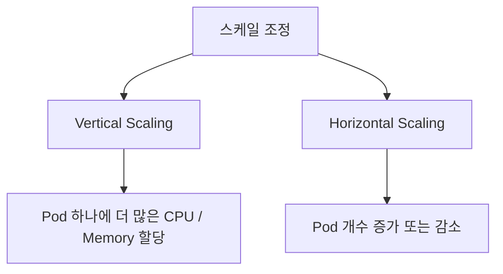

---

#### Vertical Scaling

Vertical Scaling은 하나의 인스턴스에 할당되는 자원을 늘리거나 줄이는 방식이다.

예를 들어 다음과 같은 변화가 Vertical Scaling이다.

```text
변경 전
cpu: 1 core
memory: 1Gi

변경 후
cpu: 2 core
memory: 4Gi
```

즉 Pod의 수량은 그대로 두고, Pod 하나가 사용할 수 있는 자원을 늘리는 방식이다.

대표적인 조정 대상은 다음과 같다.

* CPU
* Memory
* Network Bandwidth
* Storage Size
* Storage I/O 성능

운영 중인 애플리케이션이 메모리 부족으로 자주 오류가 발생한다면, 메모리 할당량을 늘리는 방식으로 대응할 수 있다.

이것이 수직적 스케일 증가이다.

---

#### Horizontal Scaling

Horizontal Scaling은 작업을 처리하는 인스턴스의 수를 늘리거나 줄이는 방식이다.

예를 들어 하나의 Pod로 트래픽을 처리하다가 부족해져서 Pod를 두 개로 늘렸다면 Horizontal Scaling이다.

```text
변경 전
replicas: 1

변경 후
replicas: 2
```

즉 Pod 하나의 자원은 그대로 두고, Pod의 수량을 늘려 전체 처리량을 높이는 방식이다.

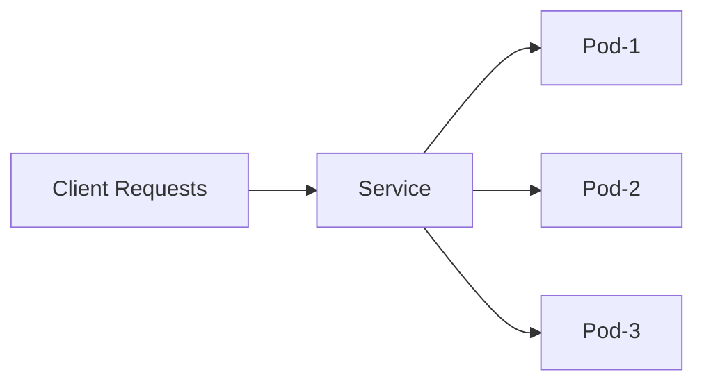

---

### Vertical Scaling과 Horizontal Scaling의 차이

| 구분            | Vertical Scaling            | Horizontal Scaling    |
| ------------- | --------------------------- | --------------------- |
| 조정 대상         | Pod 하나의 자원                  | Pod의 개수               |
| 예시            | CPU 1core → 2core           | replicas 1 → 3        |
| 장점            | Pod 하나의 처리 능력 증가            | 전체 처리량과 가용성 증가        |
| 단점            | 노드 자원 한계에 영향을 받음            | 애플리케이션이 분산 처리에 적합해야 함 |
| Kubernetes 설정 | resources.requests / limits | replicas              |

중요한 점은 둘 중 하나만 정답이 아니라는 것이다.

대량 트래픽을 처리하려면 보통 적절한 Vertical Scaling과 Horizontal Scaling을 함께 사용해야 한다.

---

### Pod Resource 조정

Kubernetes에서는 컨테이너 단위로 CPU와 Memory 자원을 설정할 수 있다.

대표적으로 사용하는 설정은 다음과 같다.

* `requests`
* `limits`

```yaml
resources:
  requests:
    memory: "512Mi"
    cpu: "250m"
  limits:
    memory: "1Gi"
    cpu: "500m"
```

---

### requests

`requests`는 Pod가 Node에 배치될 때 확보되어야 하는 자원이다.

```yaml
requests:
  memory: "512Mi"
  cpu: "250m"
```

이 설정은 다음 의미를 가진다.

```text
이 컨테이너는 최소한 memory 512Mi, cpu 250m 정도는 필요하다.
```

Kubernetes Scheduler는 Pod를 Node에 배치할 때 `requests` 값을 기준으로 판단한다.

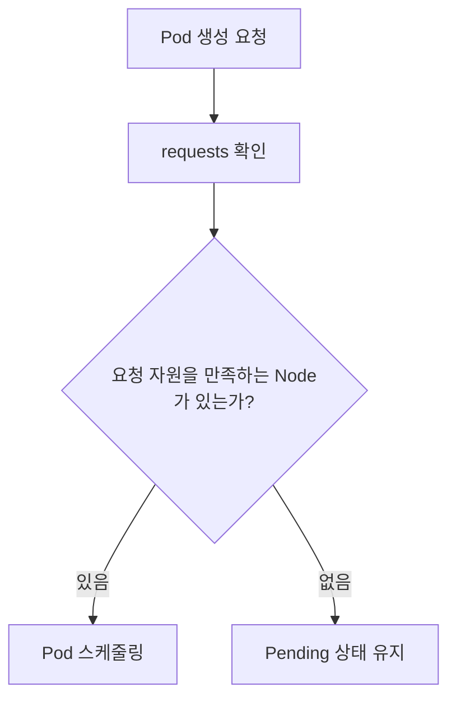

즉 `requests`에 해당하는 자원을 확보할 수 있는 Node가 없다면 Pod는 실행되지 않고 Pending 상태로 남는다.

---

#### requests를 너무 높게 잡으면?

`requests`는 실제 사용량이 아니라 Kubernetes가 예약하는 자원에 가깝다.

예를 들어 어떤 Pod가 실제로는 200Mi만 사용하지만 `requests.memory`를 2Gi로 설정했다면 Kubernetes는 이 Pod가 2Gi를 사용하는 것으로 보고 스케줄링한다.

```text
실제 사용량: 200Mi
requests: 2Gi
Node 입장: 2Gi 사용 중으로 계산
```

이 경우 다음 문제가 발생할 수 있다.

* Node 자원이 빠르게 부족해짐
* Pod가 Pending 상태에 빠질 가능성 증가
* Scale Out이 어려워짐
* 클러스터 전체 자원 효율 저하

따라서 `requests`는 애플리케이션이 안정적으로 동작하기 위해 필요한 최소 자원보다 약간 여유 있는 수준으로 잡는 것이 좋다.

---

#### requests를 설정하지 않으면?

`requests`를 설정하지 않으면 Kubernetes는 해당 Pod의 자원 요구량을 제대로 고려하지 못하고 스케줄링할 수 있다.

이 경우 CPU나 Memory가 거의 남아 있지 않은 Node에도 Pod가 배치될 수 있다.

운영 환경에서는 대부분의 애플리케이션에 `requests`를 설정하는 것이 좋다.

---

### limits

`limits`는 컨테이너가 최대한 사용할 수 있는 자원의 상한이다.

```yaml
limits:
  memory: "1Gi"
  cpu: "500m"
```

이 설정은 다음 의미를 가진다.

```text
이 컨테이너는 최대 memory 1Gi, cpu 500m까지 사용할 수 있다.
```

다만 `limits`는 Kubernetes가 항상 그만큼의 자원을 보장한다는 의미가 아니다.

`requests`가 보장에 가까운 값이라면, `limits`는 상한에 가까운 값이다.

---

#### limits의 역할

`limits`는 애플리케이션이 노드의 자원을 과도하게 사용하는 것을 막는 안전장치이다.

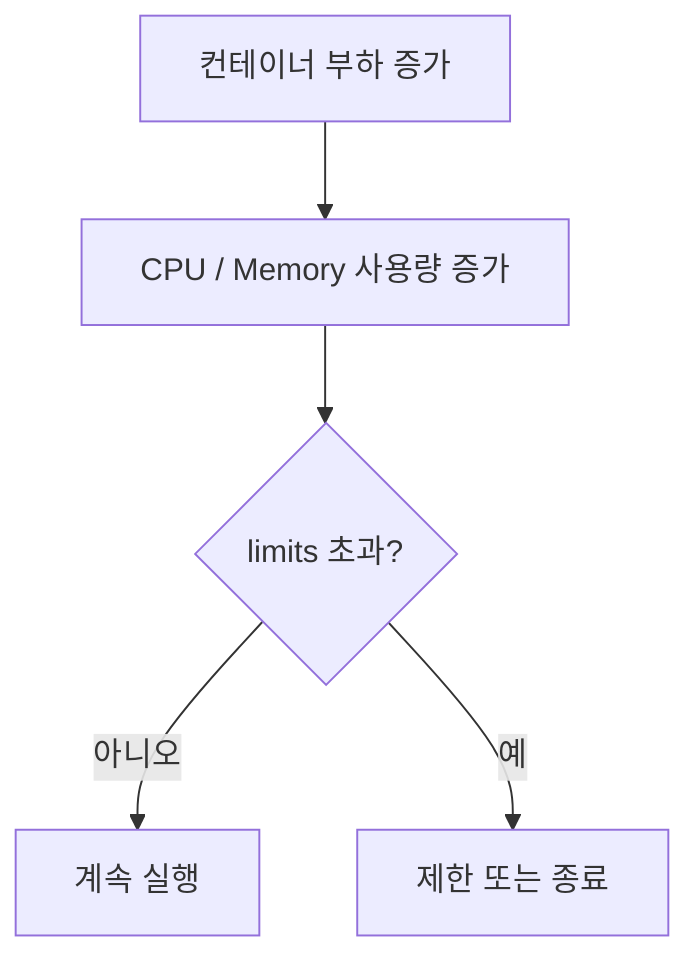

특히 Memory는 한 번 할당된 뒤 바로 반납되지 않는 경우가 많다.

Java, Node.js, Python 같은 런타임은 메모리를 한 번 확보하면 사용량이 줄어도 운영체제에 바로 돌려주지 않는 경우가 있다.

그래서 Memory limit을 설정하지 않으면 하나의 컨테이너가 Node 전체 메모리를 과도하게 사용할 수 있다.

---

#### limits를 설정하지 않으면?

`limits`를 설정하지 않으면 컨테이너가 사용할 수 있는 자원의 상한은 사실상 Node에 남아 있는 전체 자원이 된다.

이 경우 고성능이 필요한 워크로드에서는 장점처럼 보일 수 있다.

하지만 일반적인 운영 환경에서는 다음 문제가 생긴다.

* 특정 Pod가 Node 자원을 독점
* 다른 Pod 성능 저하
* 예측하기 어려운 성능
* Node 불안정
* OOM 발생 가능성 증가

따라서 대부분의 운영 애플리케이션에서는 `requests`와 `limits`를 함께 설정하는 것이 좋다.

---

### requests와 limits의 관계

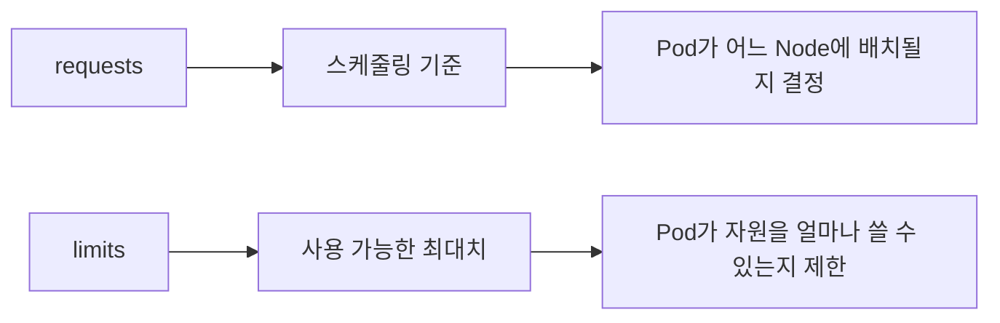

간단히 정리하면 다음과 같다.

| 설정       | 의미          | 주요 영향      |
| -------- | ----------- | ---------- |
| requests | 최소 확보 자원    | 스케줄링       |
| limits   | 최대 사용 가능 자원 | 실행 중 자원 제한 |

---

### Memory 설정

Memory는 컨테이너가 사용할 수 있는 메모리의 양을 설정한다.

```yaml
memory: "512Mi"
```

Kubernetes에서는 `Mi`, `Gi` 같은 단위를 자주 사용한다.

여기서 주의할 점은 `MB`, `GB`와 `Mi`, `Gi`가 정확히 같지는 않다는 것이다.

| 단위 | 의미            |
| -- | ------------- |
| MB | 10진수 기준 메가바이트 |
| Mi | 2진수 기준 메비바이트  |
| GB | 10진수 기준 기가바이트 |
| Gi | 2진수 기준 기비바이트  |

일반적으로 큰 차이처럼 느껴지지는 않지만, Kubernetes 리소스 설정에서는 `Mi`, `Gi`를 사용하는 것이 더 명확하다.

---

### CPU 설정

CPU는 컨테이너가 할당받는 CPU Time을 코어 단위로 환산한 값이다.

```yaml
cpu: "250m"
```

CPU 단위는 다음과 같이 이해할 수 있다.

| 설정     | 의미        |
| ------ | --------- |
| `1`    | 1 core    |
| `2`    | 2 core    |
| `500m` | 0.5 core  |
| `250m` | 0.25 core |
| `100m` | 0.1 core  |

여기서 `m`은 millicore를 의미한다.

```text
1000m = 1 core
500m = 0.5 core
250m = 0.25 core
```

---

### Resource 설정 예시

```yaml
apiVersion: apps/v1
kind: Deployment
metadata:
  name: my-app
spec:
  replicas: 2
  selector:
    matchLabels:
      app: my-app
  template:
    metadata:
      labels:
        app: my-app
    spec:
      containers:
        - name: my-app
          image: my-app:1.0.0
          resources:
            requests:
              memory: "512Mi"
              cpu: "250m"
            limits:
              memory: "1Gi"
              cpu: "500m"
```

이 설정은 다음 의미를 가진다.

* Pod는 최소 512Mi 메모리와 250m CPU를 필요로 한다.
* 컨테이너는 최대 1Gi 메모리와 500m CPU까지 사용할 수 있다.
* Scheduler는 requests 기준으로 Node 배치를 결정한다.
* 실행 중 자원 사용은 limits 기준으로 제한된다.

---

### JVM Memory 설정

Java 애플리케이션을 Kubernetes에서 실행할 때는 컨테이너 메모리와 JVM Heap 메모리를 구분해야 한다.

PDF에서도 JVM Heap과 Container Memory를 별도로 표현하고, JVM 옵션을 통해 크기나 비율을 조정할 수 있다고 설명한다.

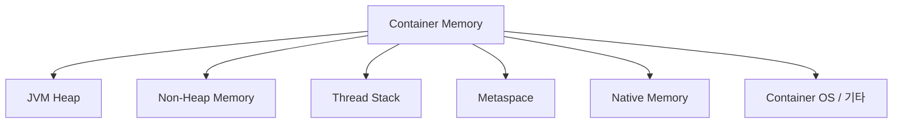

많은 개발자가 Java 메모리라고 하면 Heap만 생각하기 쉽다.

하지만 컨테이너 안에서 Java 애플리케이션은 Heap 외에도 여러 메모리를 사용한다.

* Heap
* Metaspace
* Thread Stack
* Code Cache
* Direct Buffer
* Native Memory
* JVM 자체 메모리
* 컨테이너 내부 프로세스 메모리

따라서 컨테이너 메모리 전체를 Heap으로 잡으면 안 된다.

---

### JVM 버전과 컨테이너 인식

오래된 JVM은 컨테이너 환경을 제대로 인식하지 못했다.

컨테이너에 1Gi 메모리를 제한해도 JVM이 Node 전체 메모리를 기준으로 Heap을 계산할 수 있었다.

이 경우 JVM이 컨테이너 limit보다 더 많은 메모리를 사용할 수 있다고 판단하는 문제가 생긴다.

최근 JVM은 컨테이너 환경을 인식한다.

현재는 `UseContainerSupport` 옵션이 기본적으로 활성화되어 있는 경우가 많기 때문에 별도로 켜지 않아도 되는 경우가 많다.

운영 환경에서는 적어도 컨테이너 환경을 제대로 지원하는 JVM 버전을 사용하는 것이 좋다.

---

### JVM Heap 설정 방식

JVM Heap은 크게 두 방식으로 설정할 수 있다.

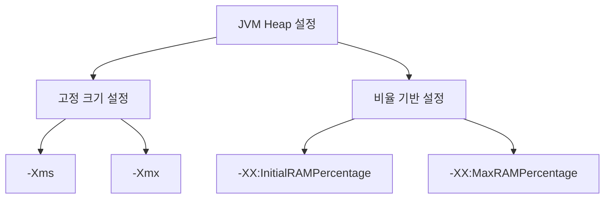

---

#### -Xms, -Xmx

`-Xms`, `-Xmx`는 Heap 크기를 고정값으로 지정하는 방식이다.

```shell
java -Xms512m -Xmx512m -jar app.jar
```

이 방식은 명확하지만 단점이 있다.

Kubernetes에서 컨테이너 메모리 limit을 변경해도 JVM Heap 설정은 자동으로 바뀌지 않는다.

예를 들어 다음 상황을 보자.

```text
컨테이너 memory limit: 1Gi
JVM -Xmx: 512m
```

이후 컨테이너 limit을 2Gi로 늘려도 `-Xmx`가 그대로 512m이면 JVM Heap은 늘어나지 않는다.

따라서 리소스 조정 시 Kubernetes 설정과 JVM 옵션을 함께 수정해야 한다.

---

#### InitialRAMPercentage, MaxRAMPercentage

비율 기반 설정은 컨테이너에 할당된 메모리를 기준으로 Heap 비율을 정한다.

```shell
java \
  -XX:InitialRAMPercentage=50 \
  -XX:MaxRAMPercentage=50 \
  -jar app.jar
```

예를 들어 컨테이너 메모리가 1Gi이고 `MaxRAMPercentage=50`이면 JVM은 약 512Mi를 최대 Heap으로 사용할 수 있다.

이 방식의 장점은 Kubernetes 리소스 조정과 JVM Heap 조정이 자연스럽게 연결된다는 점이다.

```text
memory limit 1Gi → heap 약 512Mi
memory limit 2Gi → heap 약 1Gi
```

---

### Heap 비율 설정 시 주의사항

Heap 비율을 너무 높게 잡으면 Non-Heap 영역이 부족해질 수 있다.

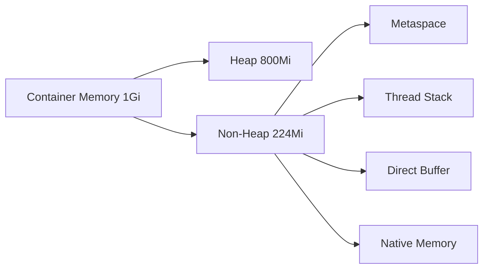

Spring Boot 애플리케이션은 Thread, Class Metadata, Buffer 등을 많이 사용할 수 있다.

처음부터 80~90%를 Heap으로 잡으면 애플리케이션이 제대로 기동되지 않거나 운영 중 문제가 생길 수 있다.

일반적으로는 50% 정도에서 시작하고 모니터링을 통해 조정하는 것이 안전하다.

---

### OutOfMemory와 ExitOnOutOfMemoryError

메모리가 부족하면 JVM에서 `OutOfMemoryError`가 발생할 수 있다.

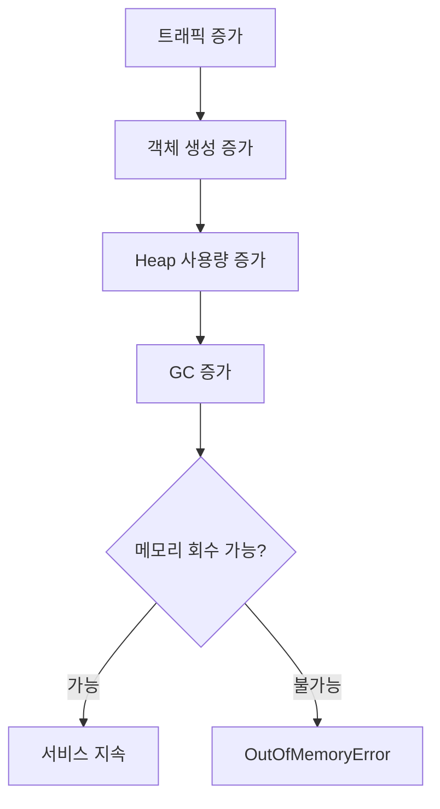

문제는 JVM의 OOM이 발생했다고 해서 항상 컨테이너가 바로 종료되는 것은 아니라는 점이다.

JVM이 OOM 이후에도 살아 있다면 애플리케이션은 불안정한 상태로 계속 동작할 수 있다.

그래서 보통 다음 옵션을 사용한다.

```shell
-XX:+ExitOnOutOfMemoryError
```

이 옵션을 주면 OOM 발생 시 JVM 프로세스가 종료된다.

JVM 프로세스가 종료되면 컨테이너도 종료되고, Kubernetes가 컨테이너를 다시 시작할 수 있다.

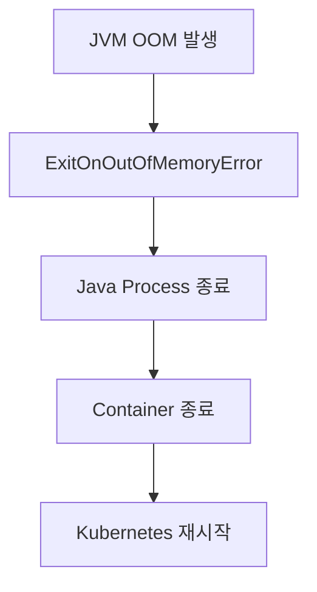

---

### CPU Resource 설정

CPU Resource는 실제 물리 코어를 고정으로 할당한다는 의미가 아니다.

PDF에서도 CPU Resource를 “실제로 사용하는 코어가 아닌 노드의 CPU를 점유하는 비율”이라고 설명한다.

예를 들어 Node가 8 core이고 어떤 컨테이너가 2000m CPU를 요청한다고 하자.

```text
2000m = 2 core
8 core Node 기준 약 1/4 수준의 CPU Time
```

이것은 물리 코어 2개를 전용으로 준다는 의미가 아니라, 전체 CPU Time 중 2 core에 해당하는 비율만큼 사용할 수 있다는 의미에 가깝다.

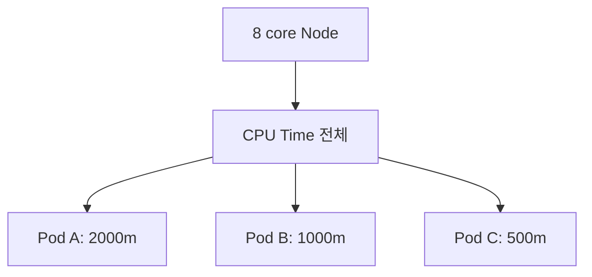

---

### CPU Throttling

CPU limit을 설정하면 컨테이너가 해당 CPU Time 이상을 사용하려고 할 때 제한이 걸릴 수 있다.

이를 CPU Throttling이라고 한다.

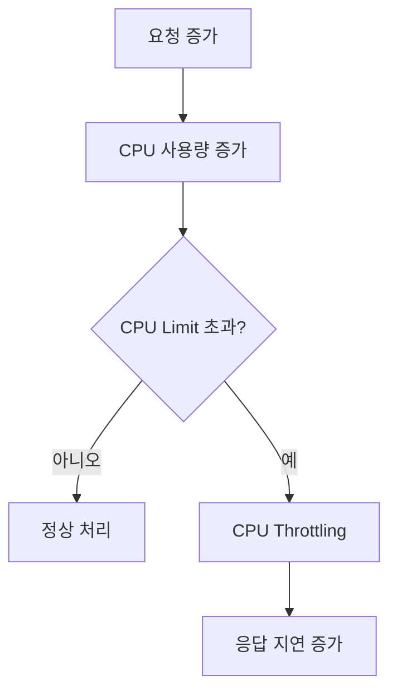

CPU Throttling이 발생하면 애플리케이션은 죽지는 않지만 느려진다.

특히 Spring MVC처럼 요청마다 Thread를 사용하는 서버는 CPU가 부족하면 요청 처리 속도가 크게 떨어질 수 있다.

---

### CPU와 멀티스레딩

CPU를 1 core로 설정했다고 해서 애플리케이션이 실제로 하나의 물리 코어만 사용하는 것은 아니다.

여러 Thread가 여러 Core에서 실행될 수 있다.

다만 전체적으로 사용할 수 있는 CPU Time이 1 core 수준으로 제한된다고 이해하는 것이 좋다.

```text
CPU 1 core 할당
= 물리 코어 1개 고정 사용
X

CPU 1 core 할당
= 전체 CPU Time 중 1 core에 해당하는 비율 사용
O
```

Spring MVC처럼 Thread를 많이 사용하는 애플리케이션은 CPU를 너무 낮게 잡으면 효율이 떨어질 수 있다.

---

### Deployment의 Replica 조정

Horizontal Scaling은 Deployment의 `replicas` 값을 조정하여 수행할 수 있다.

PDF에서도 `replicas` 설정과 `kubectl scale` 명령어를 함께 보여준다.

```yaml
kind: Deployment
metadata:
  name: my-app
spec:
  replicas: 5
```

명령어로도 조정할 수 있다.

```shell
kubectl scale deployment my-app --replicas=5
```

---

### 명령어 기반 Scale 조정의 특징

`kubectl scale`은 급하게 Pod 수량을 늘리거나 줄일 때 유용하다.

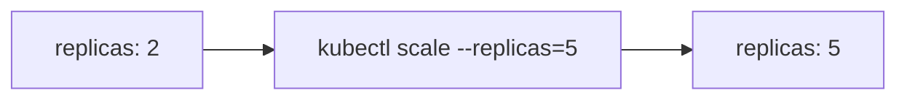

하지만 명령어로 변경한 값은 YAML 파일에 자동으로 반영되지 않는다.

따라서 이후 다시 배포하면 YAML에 정의된 replicas 값으로 돌아갈 수 있다.

예를 들어 다음 상황을 생각해보자.

```text
deployment.yaml: replicas 2
kubectl scale: replicas 5
다시 kubectl apply -f deployment.yaml
결과: replicas 2로 돌아갈 수 있음
```

운영에서는 임시 조정과 선언형 스펙의 차이를 반드시 이해해야 한다.

---

### 대량의 트래픽에 대응하기

대량 트래픽에 대응하는 기본 방식은 Pod의 자원 할당과 Pod 수량을 조정하는 것이다.

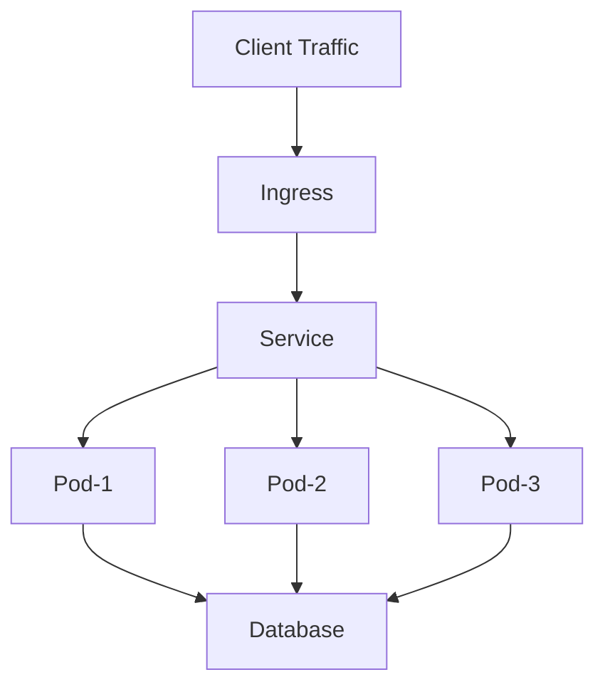

Ingress와 Service는 들어온 요청을 여러 Pod로 분산한다.

따라서 전체 처리량은 대략 다음과 같이 생각할 수 있다.

```text
전체 처리량 ≒ Pod 하나의 처리량 × Pod 개수
```

물론 실제로는 DB, 외부 API, Lock, Network, JVM GC, Thread Pool 등의 병목 때문에 선형적으로 증가하지는 않는다.

---

### Vertical Scaling만으로 대응할 때의 한계

Pod 하나에 많은 자원을 주면 Pod 하나의 처리 능력은 증가한다.

하지만 Pod 수량이 적으면 장애에 취약하다.

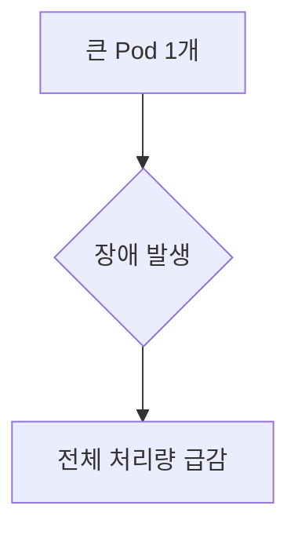

예를 들어 Pod 하나가 대부분의 트래픽을 처리하고 있다가 장애가 발생하면 전체 서비스 처리량이 크게 줄어든다.

---

### Horizontal Scaling만으로 대응할 때의 한계

Pod 수량을 많이 늘려도 Pod 하나당 자원이 너무 적으면 각 Pod가 안정적으로 요청을 처리하지 못할 수 있다.

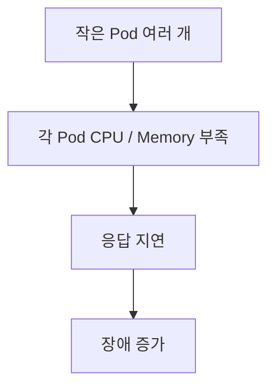

즉 수평 확장만으로 모든 문제가 해결되지는 않는다.

---

### 효율적인 대응 방식

대량 트래픽에는 Vertical Scaling과 Horizontal Scaling을 조합해야 한다.

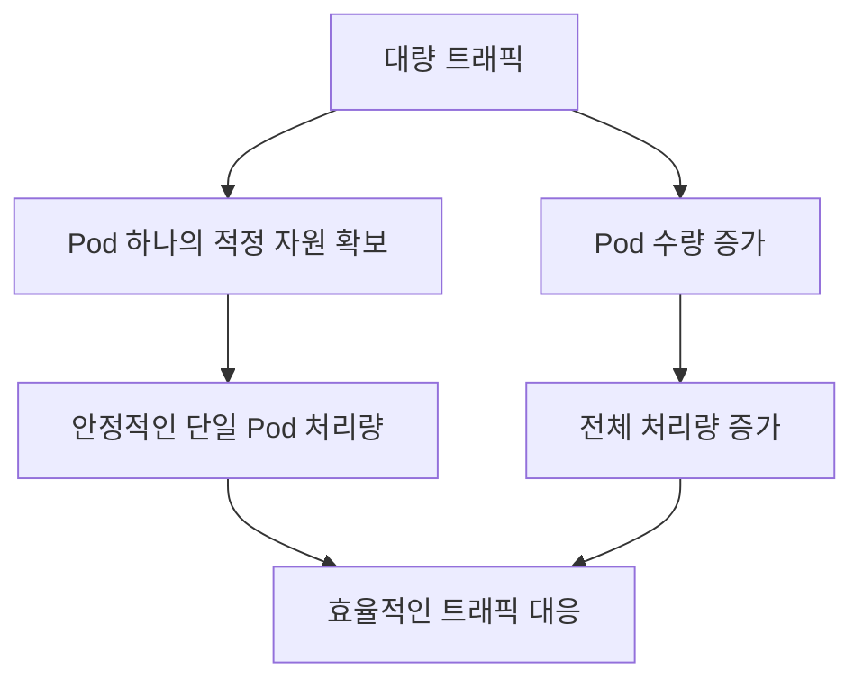

먼저 Pod 하나가 안정적으로 동작할 수 있는 CPU와 Memory를 찾고, 그 기준으로 필요한 replicas 수를 계산하는 것이 좋다.

---

### Kubernetes Pod의 자원 설정

적절한 CPU와 Memory 크기는 감으로 정하기 어렵다.

성능 테스트와 모니터링을 통해 확인해야 한다.

PDF에서도 적절한 CPU, Memory 크기는 성능 테스트나 모니터링을 통해 확인해야 하며, Pod 수량 증가가 성능을 선형적으로 올려주지는 않는다고 정리한다.

---

### 성능 테스트 기준

Pod 하나를 기준으로 먼저 성능을 측정하는 것이 좋다.

예를 들어 다음을 확인한다.

* Pod 하나가 처리 가능한 RPS
* 평균 응답 시간
* P95 / P99 응답 시간
* CPU 사용률
* Memory 사용률
* GC 발생 빈도
* DB Connection 사용량
* Thread Pool 사용량

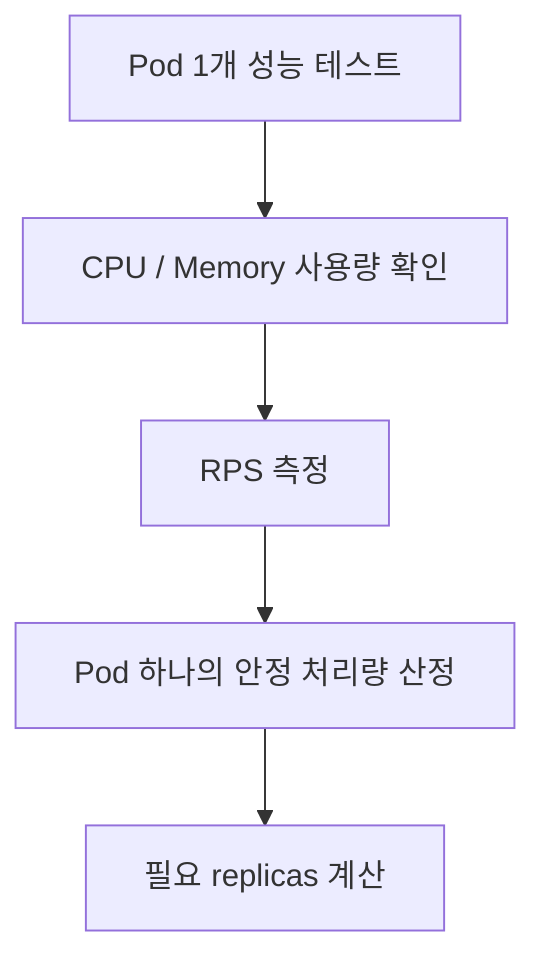

---

### Pod 수량 증가가 항상 선형적이지 않은 이유

Pod를 2배로 늘렸다고 처리량이 항상 2배가 되지는 않는다.

이유는 병목 지점이 Pod 외부에 있을 수 있기 때문이다.

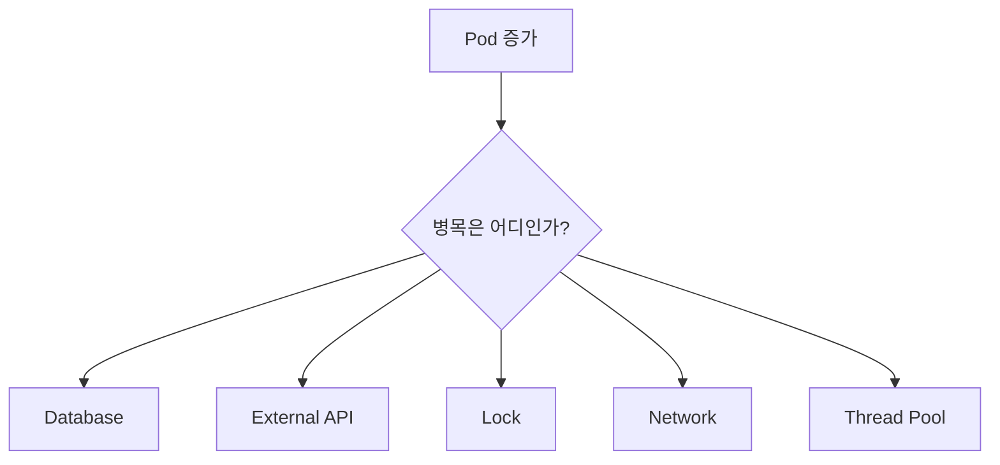

예를 들어 애플리케이션 Pod는 10개로 늘렸지만 DB가 처리할 수 있는 Connection이나 Query 처리량이 그대로라면 전체 성능은 크게 증가하지 않는다.

---

### 애플리케이션 구조에 따른 Scaling 전략

Scaling 전략은 애플리케이션 구조에 따라 달라진다.

#### Spring MVC 기반 애플리케이션

Spring MVC는 일반적으로 요청을 Thread 기반으로 처리한다.

Spring Boot 내장 Tomcat은 기본적으로 많은 Thread를 생성할 수 있다.

요청 처리 중 DB I/O나 외부 API 호출로 Blocking이 발생하면 Thread가 대기한다.

이런 구조에서는 CPU 자원이 너무 적으면 많은 Thread를 효율적으로 처리하기 어렵다.

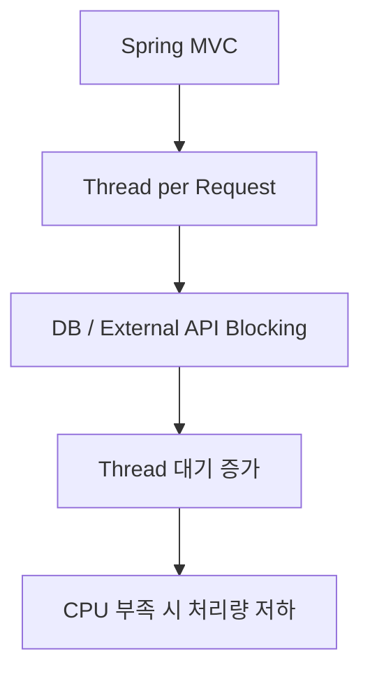

따라서 Spring MVC 애플리케이션은 CPU를 너무 낮게 잡지 않는 것이 좋다.

---

#### Event Loop 기반 애플리케이션

WebFlux, Netty, Node.js 같은 Event Loop 기반 서버는 적은 Thread로 많은 요청을 처리할 수 있다.

이런 구조에서는 하나의 Pod에 CPU를 크게 몰아주기보다, 적절한 CPU를 가진 Pod를 여러 개 Scale Out하는 방식이 더 효율적일 수 있다.

```mermaid
flowchart TD
    A["Event Loop Server"] --> B["적은 Thread"]
    B --> C["Non-blocking I/O"]
    C --> D["Pod 여러 개 Scale Out"]
```

---

### 노드 자원 여유의 중요성

Node의 자원을 100% 가깝게 사용하는 것은 좋지 않다.

자원 여유가 없으면 다음 문제가 발생한다.

* 새 Pod가 Pending 상태에 빠짐
* Rolling Update가 느려짐
* Scale Out이 어려움
* limits까지 자원을 사용하지 못함
* Node 불안정
* 긴급 트래픽 대응 어려움

```mermaid
flowchart TD
    A["Node 자원 부족"] --> B["Pod Pending"]
    A --> C["Rolling Update 지연"]
    A --> D["Scale Out 실패"]
    A --> E["성능 예측 어려움"]
```

트래픽이 급하게 증가하는 상황에서는 Node 여유 자원이 매우 중요하다.

Node를 새로 추가하는 데는 시간이 걸리기 때문이다.

---

### 실무적인 Resource 설정 흐름

```mermaid
flowchart TD
    A["애플리케이션 배포 전"] --> B["Pod 1개 기준 부하 테스트"]
    B --> C["CPU / Memory 사용량 측정"]
    C --> D["requests 설정"]
    D --> E["limits 설정"]
    E --> F["replicas 설정"]
    F --> G["운영 모니터링"]
    G --> H["Resource 재조정"]
```

처음부터 완벽한 값을 정하기는 어렵다.

일반적으로는 적정값으로 시작하고, 모니터링을 통해 조정한다.

---

### 정리

Kubernetes에서 Pod의 자원 설정과 스케일 조정은 애플리케이션 성능과 안정성에 직접적인 영향을 준다.

핵심은 다음과 같다.

* Vertical Scaling은 Pod 하나의 자원 할당량을 조정하는 것이다.
* Horizontal Scaling은 Pod의 수량을 조정하는 것이다.
* `requests`는 스케줄링 기준이 되는 최소 확보 자원이다.
* `limits`는 컨테이너가 사용할 수 있는 최대 자원이다.
* Memory는 `Mi`, `Gi` 단위를 사용하는 것이 명확하다.
* CPU는 실제 물리 코어 고정 할당이 아니라 CPU Time 비율이다.
* JVM에서는 컨테이너 메모리와 Heap 메모리를 구분해야 한다.
* `MaxRAMPercentage`를 사용하면 컨테이너 메모리 기준으로 Heap 비율을 조정할 수 있다.
* `ExitOnOutOfMemoryError`를 사용하면 JVM OOM 시 Kubernetes 재시작 흐름과 잘 연결할 수 있다.
* CPU limit이 낮으면 CPU Throttling으로 응답 지연이 발생할 수 있다.
* replicas는 YAML이나 `kubectl scale` 명령어로 조정할 수 있다.
* 명령어로 바꾼 replicas는 선언형 스펙과 불일치할 수 있다.
* 대량 트래픽 대응은 Vertical Scaling과 Horizontal Scaling의 조합이 필요하다.
* Pod 수를 늘린다고 성능이 항상 선형적으로 증가하지는 않는다.
* Node 자원에는 항상 여유를 두는 것이 좋다.

한 문장으로 정리하면 다음과 같다.

> Kubernetes에서 성능을 높이는 핵심은 “Pod 하나가 안정적으로 처리할 수 있는 자원을 찾고, 그 Pod를 필요한 만큼 수평 확장하는 것”이다.

## 02. Kubernetes를 이용한 오토스케일링
맞아. 그 내용이 빠졌어. VPA를 “직접 적용”하는 것만이 답이 아니라, **Kubecost 같은 비용/리소스 분석 도구로 적정 requests/limits를 찾는 방식**도 같이 넣어서 보강하면 흐름이 더 자연스럽다. PDF의 HPA/VPA 흐름도 같이 반영해서 다시 정리했어.

### Kubernetes를 이용한 오토스케일링

Kubernetes를 사용하면 Self-Healing을 통해 Pod가 비정상 종료되었을 때 자동으로 복구할 수 있다.

하지만 운영 환경에서는 단순히 장애가 난 Pod를 복구하는 것만으로는 부족하다. 트래픽이 늘어나면 Pod 수량을 늘려야 하고, 트래픽이 줄어들면 불필요하게 사용 중인 자원을 줄여야 한다.

이처럼 현재 트래픽과 자원 사용량에 맞춰 자동으로 규모를 조정하는 기능을 오토스케일링이라고 한다.

오토스케일링을 사용하면 사람이 계속 모니터링하다가 수동으로 Pod 수량을 조정하지 않아도 된다. 미리 정의한 규칙에 따라 시스템이 자동으로 스케일을 조정하므로 예상치 못한 트래픽 증가에 더 유연하게 대응할 수 있다.

### Kubernetes의 Pod 오토스케일링

Kubernetes에서 Pod 오토스케일링은 크게 두 가지 방식으로 나눌 수 있다.

```mermaid
flowchart TD
    A["Kubernetes Pod Autoscaling"] --> B["HPA"]
    A --> C["VPA"]

    B --> B1["Horizontal Pod Autoscaler"]
    B --> B2["Pod 수량 조정"]

    C --> C1["Vertical Pod Autoscaler"]
    C --> C2["Pod CPU / Memory 할당량 조정"]
````

#### HPA

HPA는 Horizontal Pod Autoscaler의 약자이다.

Pod 하나의 자원을 늘리는 것이 아니라, Pod의 개수를 늘리거나 줄인다.

```text
replicas: 2
    ↓
replicas: 5
```

즉 수평적 스케일링을 자동으로 수행한다.

일반적인 백엔드 API 서버에서는 HPA를 가장 많이 사용한다.

---

#### VPA

VPA는 Vertical Pod Autoscaler의 약자이다.

Pod의 개수를 늘리는 것이 아니라, Pod에 할당되는 CPU와 Memory 요청량을 조정한다.

```text
cpu: 250m
memory: 512Mi
    ↓
cpu: 500m
memory: 1Gi
```

즉 수직적 스케일링을 자동으로 수행한다.

다만 VPA는 HPA에 비해 운영 적용 시 고려할 점이 많다. Resource 변경이 Pod 재시작을 유발할 수 있고, HPA와 같은 지표를 바라보면 서로 충돌할 수 있기 때문이다.

---

### 오토스케일링의 동작 방식

오토스케일러는 한 번 실행되고 끝나는 기능이 아니라, 계속 루프를 돌면서 현재 상태를 확인하고 필요한 조정을 수행한다.

```mermaid
flowchart LR
    A["Monitor"] --> B["Analyze"]
    B --> C["Plan"]
    C --> D["Execute"]
    D --> A
```

#### Monitor

현재 Pod 상태를 지속적으로 확인한다.

대표적으로 다음 지표를 확인한다.

* CPU 사용률
* Memory 사용량
* 커스텀 메트릭
* 요청 수
* Queue 길이
* Ingress 트래픽

---

#### Analyze

수집한 메트릭을 분석한다.

예를 들어 현재 CPU 평균 사용률이 목표값보다 높은지 낮은지 판단한다.

```text
현재 CPU 평균 사용률: 80%
목표 CPU 사용률: 50%
```

이 경우 현재 Pod 수량이 부족하다고 판단할 수 있다.

---

#### Plan

분석 결과를 바탕으로 적절한 replicas 수를 계산한다.

```text
현재 replicas: 2
목표 replicas: 4
```

---

#### Execute

계산된 결과를 실제 Kubernetes 객체에 반영한다.

Deployment의 replicas 값이 변경되면 ReplicaSet이 새로운 Pod를 생성하거나 기존 Pod를 줄인다.

---

### HPA 설정

HPA는 `HorizontalPodAutoscaler` 객체로 설정한다.

```yaml
apiVersion: autoscaling/v2
kind: HorizontalPodAutoscaler
metadata:
  name: my-hpa
spec:
  scaleTargetRef:
    apiVersion: apps/v1
    kind: Deployment
    name: my-app

  minReplicas: 1
  maxReplicas: 5

  metrics:
    - type: Resource
      resource:
        name: cpu
        target:
          type: Utilization
          averageUtilization: 50
```

---

### HPA 설정 설명

#### scaleTargetRef

```yaml
scaleTargetRef:
  apiVersion: apps/v1
  kind: Deployment
  name: my-app
```

HPA가 어떤 객체를 대상으로 스케일링할지 지정한다.

일반적으로 Deployment를 대상으로 설정한다.

대상으로 사용할 수 있는 객체는 scale 가능한 객체여야 한다.

대표적으로 다음 객체가 있다.

* Deployment
* ReplicaSet
* StatefulSet

실무에서는 대부분 Deployment를 대상으로 HPA를 설정한다.

---

#### minReplicas

```yaml
minReplicas: 1
```

최소 Pod 수량이다.

트래픽이 적어도 이 수량 이하로는 줄어들지 않는다.

평소 운영에 필요한 최소 수량을 기준으로 설정하는 것이 좋다.

트래픽이 갑자기 증가하는 서비스라면 `minReplicas`를 너무 낮게 잡으면 대응이 늦을 수 있다.

---

#### maxReplicas

```yaml
maxReplicas: 5
```

최대 Pod 수량이다.

트래픽이 많아져도 이 수량 이상으로는 늘어나지 않는다.

이 값은 Node 자원과 전체 시스템 부하를 고려해서 설정해야 한다.

Pod만 많이 늘린다고 항상 좋은 것은 아니다. Pod 수가 늘어나면 DB, Redis, 외부 API, Message Queue에도 더 많은 요청이 전달될 수 있다.

따라서 `maxReplicas`는 단순히 “많을수록 좋다”가 아니라 전체 시스템이 감당할 수 있는 범위 안에서 설정해야 한다.

---

#### metrics

```yaml
metrics:
  - type: Resource
    resource:
      name: cpu
```

오토스케일링의 기준이 되는 지표를 설정한다.

대표적인 지표는 다음과 같다.

* CPU
* Memory
* Custom Metric

`autoscaling/v1`에서는 CPU 기준 설정이 중심이었다면, `autoscaling/v2`에서는 Memory나 Custom Metric 기반 확장이 가능하다.

---

#### averageUtilization

```yaml
averageUtilization: 50
```

목표 평균 사용률이다.

예를 들어 `averageUtilization: 50`은 다음 의미이다.

```text
Pod들의 평균 CPU 사용률이 50% 정도가 되도록 replicas를 조정하라.
```

즉 CPU 사용률이 50%보다 높으면 Pod를 늘리고, 50%보다 낮으면 Pod를 줄이는 방향으로 동작한다.

---

### HPA의 계산 방식

HPA는 대략 다음 공식을 이용해 원하는 replicas 수를 계산한다.

```text
desiredReplicas = ceil(currentReplicas * (currentMetric / targetMetric))
```

각 값의 의미는 다음과 같다.

| 항목              | 의미           |
| --------------- | ------------ |
| currentReplicas | 현재 Pod 수량    |
| currentMetric   | 현재 평균 자원 사용률 |
| targetMetric    | 목표 자원 사용률    |
| ceil            | 올림 처리        |

---

### 예제 1. Pod 1개, CPU 60%

조건은 다음과 같다.

```text
minReplicas: 1
maxReplicas: 3
averageUtilization: 50
currentReplicas: 1
currentCPU: 60
```

계산은 다음과 같다.

```text
desiredReplicas = ceil(1 * (60 / 50))
desiredReplicas = ceil(1.2)
desiredReplicas = 2
```

```mermaid
flowchart LR
    A["Pod 1개<br/>CPU 60%"] --> B["Target 50%"]
    B --> C["desiredReplicas = 2"]
```

현재 Pod 하나가 목표보다 높은 CPU를 사용하고 있으므로 HPA는 Pod를 2개로 늘린다.

---

### 예제 2. Pod 2개, 평균 CPU 30%

조건은 다음과 같다.

```text
currentReplicas: 2
currentCPU: 30
targetCPU: 50
```

계산은 다음과 같다.

```text
desiredReplicas = ceil(2 * (30 / 50))
desiredReplicas = ceil(1.2)
desiredReplicas = 2
```

현재 사용률이 낮지만 계산 결과가 2이므로 replicas는 유지된다.

```mermaid
flowchart LR
    A["Pod 2개<br/>평균 CPU 30%"] --> B["계산 결과 2"]
    B --> C["현재 수량 유지"]
```

---

### 예제 3. Pod 2개, 평균 CPU 80%

예를 들어 Pod 두 개가 각각 90%, 70%를 사용한다면 평균은 80%이다.

```text
currentReplicas: 2
currentCPU: 80
targetCPU: 50
```

계산은 다음과 같다.

```text
desiredReplicas = ceil(2 * (80 / 50))
desiredReplicas = ceil(3.2)
desiredReplicas = 4
```

하지만 `maxReplicas`가 3이라면 최종적으로는 3개까지만 늘어난다.

```mermaid
flowchart TD
    A["계산 결과 replicas 4"] --> B{"maxReplicas = 3"}
    B --> C["최종 replicas 3"]
```

---

### 예제 4. Pod 3개, 평균 CPU 53%

조건은 다음과 같다.

```text
currentReplicas: 3
currentCPU: 53
targetCPU: 50
```

계산은 다음과 같다.

```text
desiredReplicas = ceil(3 * (53 / 50))
desiredReplicas = ceil(3.18)
desiredReplicas = 4
```

하지만 실제 HPA는 아주 작은 변화에 매번 반응하지 않도록 허용 범위와 안정화 정책을 가진다.

따라서 53%처럼 목표값과 아주 가까운 수준에서는 즉시 스케일 아웃하지 않을 수 있다.

---

### 예제 5. Pod 3개, 평균 CPU 15%

조건은 다음과 같다.

```text
currentReplicas: 3
currentCPU: 15
targetCPU: 50
```

계산은 다음과 같다.

```text
desiredReplicas = ceil(3 * (15 / 50))
desiredReplicas = ceil(0.9)
desiredReplicas = 1
```

이 경우 HPA는 Pod를 1개까지 줄일 수 있다.

단, `minReplicas`가 1이므로 1개 미만으로는 줄어들지 않는다.

---

### HPA의 전체 흐름

```mermaid
flowchart TD
    A["Metrics 수집"] --> B["현재 평균 사용률 계산"]
    B --> C["desiredReplicas 계산"]
    C --> D{"min / max 범위 확인"}
    D --> E["Deployment replicas 변경"]
    E --> F["ReplicaSet이 Pod 생성 또는 삭제"]
    F --> A
```

---

### HPA가 즉각적으로 동작하지 않는 이유

HPA는 자원 사용량이 조금 변했다고 바로 Pod를 만들고 지우지 않는다.

너무 민감하게 반응하면 시스템이 불안정해질 수 있기 때문이다.

```mermaid
flowchart TD
    A["CPU 일시적 증가"] --> B["즉시 Scale Out"]
    B --> C["CPU 다시 감소"]
    C --> D["즉시 Scale In"]
    D --> E["Pod 생성 / 삭제 반복"]
    E --> F["시스템 불안정"]
```

그래서 HPA는 일반적으로 다음과 같은 완충 장치를 가진다.

* 허용 오차 범위
* 안정화 시간
* Scale Down 지연
* 일정 주기 기반 메트릭 수집
* 한 번에 증가/감소할 수 있는 범위 제한

이 때문에 HPA는 트래픽 증가에 즉각 반응하는 스위치라기보다, 지속적인 경향을 보고 조정하는 자동화 장치로 이해하는 것이 좋다.

---

### HPA는 1차 대응 장치이다

HPA는 매우 유용하지만 모든 트래픽 문제를 해결하지는 못한다.

특히 다음과 같은 트래픽에는 대응이 늦을 수 있다.

* 순간적으로 폭증하는 트래픽
* 이벤트 오픈 직후 급증하는 트래픽
* 짧은 시간 동안만 몰리는 트래픽
* 예측 가능한 대규모 트래픽

이런 경우에는 HPA만 믿기보다 사전에 replicas를 늘려두는 방식이 필요할 수 있다.

```mermaid
flowchart TD
    A["예측 가능한 이벤트"] --> B["사전 Scale Out"]
    B --> C["이벤트 트래픽 대응"]
    C --> D["이벤트 종료 후 Scale In"]
```

---

### 오토스케일링을 고려한 애플리케이션 개발

HPA를 사용하려면 애플리케이션도 오토스케일링에 적합하게 개발되어야 한다.

#### Stateless 구조

Pod가 늘어나거나 줄어들어도 문제가 없어야 한다.

```text
요청 1 → Pod A
요청 2 → Pod B
요청 3 → Pod C
```

요청이 어떤 Pod로 가도 동일하게 처리되어야 한다.

---

#### Graceful Shutdown

Scale In이 발생하면 일부 Pod가 종료된다.

이때 처리 중인 요청이 있다면 안전하게 마무리해야 한다.

```mermaid
flowchart TD
    A["Scale In 결정"] --> B["Pod 종료 시작"]
    B --> C["Service Endpoint에서 제외"]
    C --> D["처리 중 요청 완료"]
    D --> E["컨테이너 종료"]
```

Graceful Shutdown이 제대로 되어 있지 않으면 Scale In 과정에서 요청 실패가 발생할 수 있다.

---

#### 빠른 기동

Scale Out이 발생하면 새 Pod가 빠르게 준비되어야 한다.

기동 시간이 너무 길면 HPA가 Pod를 늘려도 실제 트래픽 대응은 늦어진다.

따라서 다음 설정이 중요하다.

* Startup Probe
* Readiness Probe
* 적절한 초기화 로직
* 느린 외부 의존성 최소화

---

### Custom Metric 기반 오토스케일링

CPU나 Memory만으로는 충분하지 않은 경우도 있다.

예를 들어 다음 지표를 기준으로 Scale Out하고 싶을 수 있다.

* 초당 요청 수
* Ingress 트래픽
* Queue 길이
* Kafka Lag
* Thread Pool 사용률
* DB Connection Pool 사용률
* 애플리케이션 내부 작업 대기열

이런 경우 Custom Metric을 사용할 수 있다.

```mermaid
flowchart TD
    A["Application Metrics"] --> B["Metrics Adapter"]
    B --> C["HPA"]
    C --> D["Deployment Scale"]
```

Custom Metric을 사용하려면 별도의 메트릭 수집 및 어댑터 구성이 필요하다.

대표적으로 Prometheus Adapter 같은 구성을 사용할 수 있다.

---

### VerticalPodAutoscaler

VPA는 Pod의 자원 사용량을 보고 CPU와 Memory 요청량을 조정해주는 오토스케일러이다.

```mermaid
flowchart TD
    A["Pod Resource 사용량 수집"] --> B["권장 requests 계산"]
    B --> C["CPU / Memory requests 조정"]
```

VPA는 다음 상황에서 유용하다.

* 적절한 CPU requests를 찾고 싶을 때
* 적절한 Memory requests를 찾고 싶을 때
* 과도하게 크게 잡힌 리소스를 줄이고 싶을 때
* 너무 작게 잡힌 리소스를 늘리고 싶을 때
* 운영 메트릭 기반으로 리소스 추천값을 보고 싶을 때

처음부터 적정한 requests 값을 알기는 어렵다.

VPA는 실제 사용량을 기반으로 추천값을 제공할 수 있기 때문에 리소스 튜닝에 도움이 된다.

---

### VPA 대신 활용할 수 있는 리소스 분석 도구

VPA를 반드시 사용해야만 적절한 리소스 값을 찾을 수 있는 것은 아니다.

VPA를 운영 환경에 직접 적용하지 않더라도, 리소스 사용량을 분석하고 적정 `requests`, `limits` 값을 찾는 다른 도구들을 활용할 수 있다.

대표적으로 **Kubecost** 같은 오픈소스 기반 도구가 있다.

```mermaid
flowchart TD
    A["Kubernetes Metrics"] --> B["Kubecost / Resource 분석 도구"]
    B --> C["Namespace별 비용 분석"]
    B --> D["Deployment별 자원 사용량 분석"]
    B --> E["requests / limits 추천"]
    E --> F["YAML 리소스 설정 개선"]
```

Kubecost 같은 도구를 사용하면 다음을 확인할 수 있다.

* Namespace별 비용
* Deployment별 CPU / Memory 사용량
* 실제 사용량 대비 requests가 과도한 워크로드
* limits가 없거나 너무 높은 워크로드
* 유휴 자원이 많은 서비스
* 비용 최적화 대상
* 리소스 설정 추천값

이 방식은 특히 운영 환경에서 VPA를 바로 적용하기 부담스러울 때 유용하다.

VPA가 직접 Pod의 리소스 설정을 변경하는 방식이라면, Kubecost 같은 도구는 현재 사용량을 분석해서 개발자나 운영자가 리소스 설정을 개선할 수 있도록 도와주는 방식에 가깝다.

즉 선택지는 다음처럼 나눌 수 있다.

```mermaid
flowchart TD
    A["적정 리소스 값을 찾고 싶다"] --> B{"자동 변경까지 원하는가?"}
    B -->|"예"| C["VPA 검토"]
    B -->|"아니오"| D["Kubecost 같은 분석 도구 활용"]
    D --> E["추천값 확인"]
    E --> F["requests / limits 수동 조정"]
```

실무에서는 VPA를 바로 운영에 적용하기보다, 먼저 Kubecost나 모니터링 도구를 통해 실제 사용량과 낭비되는 자원을 파악한 뒤 리소스 설정을 조정하는 방식도 많이 고려할 수 있다.

---

### VPA의 주의사항

VPA는 Pod의 resource 설정을 바꿀 수 있다.

문제는 resource 설정 변경이 컨테이너 재시작을 유발할 수 있다는 점이다.

```mermaid
flowchart TD
    A["VPA가 Resource 변경 결정"] --> B["Pod 재생성 필요"]
    B --> C["기존 Pod 종료"]
    C --> D["새 Resource로 Pod 생성"]
```

이 과정에서 애플리케이션에 영향이 생길 수 있다.

따라서 운영 환경에서는 신중하게 적용해야 한다.

---

### HPA와 VPA의 충돌

HPA와 VPA를 함께 사용할 때는 충돌 가능성이 있다.

예를 들어 둘 다 CPU를 기준으로 동작한다고 하자.

```mermaid
flowchart TD
    A["CPU 사용률 증가"] --> B["HPA: Pod 수 늘림"]
    A --> C["VPA: Pod CPU requests 늘림"]
    B --> D["수평 스케일 변경"]
    C --> E["수직 스케일 변경"]
    D --> F["예상 어려운 결과"]
    E --> F
```

HPA는 Pod 수를 조정하고, VPA는 Pod 자원을 조정한다.

둘이 같은 지표를 기준으로 동시에 움직이면 결과를 예측하기 어려워진다.

따라서 다음 방식이 더 안전하다.

* HPA는 CPU 기준으로 운영
* VPA는 추천 모드로만 사용
* VPA 대신 Kubecost 같은 리소스 분석 도구 활용
* VPA는 운영 반영 전 리소스 추천값 확인 용도로 사용
* HPA와 VPA가 같은 지표를 동시에 조정하지 않도록 설계

---

### HPA와 VPA, 리소스 분석 도구 비교

| 구분         | HPA          | VPA                | Kubecost 같은 분석 도구 |
| ---------- | ------------ | ------------------ | ----------------- |
| 목적         | Pod 수량 자동 조정 | Pod 자원 자동 조정 또는 추천 | 비용/리소스 사용량 분석     |
| 조정 대상      | replicas     | requests / limits  | 직접 조정하지 않음        |
| 운영 영향      | 상대적으로 낮음     | Pod 재시작 가능         | 낮음                |
| 자동성        | 높음           | 높음                 | 분석 중심             |
| 사용 목적      | 트래픽 대응       | 적정 리소스 탐색          | 비용 최적화, 리소스 낭비 탐지 |
| HPA 충돌 가능성 | 없음           | 있음                 | 없음                |

---

### 실무적인 오토스케일링 전략

일반적인 백엔드 애플리케이션에서는 다음 흐름이 좋다.

```mermaid
flowchart TD
    A["성능 테스트"] --> B["기본 requests / limits 설정"]
    B --> C["기본 replicas 설정"]
    C --> D["HPA 적용"]
    D --> E["운영 모니터링"]
    E --> F["Kubecost / 모니터링 도구로 리소스 낭비 확인"]
    F --> G["requests / limits 재조정"]
    G --> H["필요 시 VPA 추천 모드 검토"]
```

처음부터 VPA로 모든 것을 자동화하기보다, HPA를 중심으로 운영하고 Kubecost 같은 도구로 리소스 사용량을 분석한 뒤 점진적으로 조정하는 방식이 안정적이다.

---

### 오토스케일링 설정 시 고려사항

#### 1. minReplicas는 너무 낮게 잡지 않는다.

트래픽이 갑자기 증가하는 서비스라면 최소 Pod 수를 너무 낮게 잡으면 대응이 늦을 수 있다.

---

#### 2. maxReplicas는 클러스터와 DB 부하를 고려한다.

Pod만 많이 늘려도 DB가 버티지 못하면 전체 시스템 장애로 이어질 수 있다.

---

#### 3. CPU 기준이 항상 정답은 아니다.

CPU는 일반적인 기준이지만, 애플리케이션에 따라 더 좋은 기준이 있을 수 있다.

Queue 기반 서비스라면 Queue Lag이 더 적절할 수 있다.

---

#### 4. Readiness Probe가 중요하다.

새로 생성된 Pod가 실제로 요청을 받을 준비가 되었을 때만 Service에 연결되어야 한다.

---

#### 5. Scale In에 안전해야 한다.

Pod가 줄어들 때 처리 중인 요청이나 작업이 유실되지 않도록 해야 한다.

---

#### 6. VPA는 바로 자동 적용하기보다 추천 용도로 먼저 검토한다.

VPA는 유용하지만 Pod 재시작과 HPA 충돌 가능성이 있다.

따라서 운영 환경에서는 추천 모드나 분석 도구를 통해 먼저 적정 자원값을 파악하는 것이 안전하다.

---

### 정리

Kubernetes의 오토스케일링은 트래픽과 자원 사용량 변화에 맞춰 Pod의 수량이나 자원 할당량을 자동으로 조정하는 기능이다.

핵심은 다음과 같다.

* HPA는 Pod 수량을 조정한다.
* VPA는 Pod의 CPU와 Memory 할당량을 조정한다.
* HPA는 Kubernetes에서 가장 일반적으로 사용하는 오토스케일링 방식이다.
* HPA는 `minReplicas`, `maxReplicas`, `metrics`, `averageUtilization` 설정을 중심으로 동작한다.
* HPA는 현재 사용률과 목표 사용률을 비교해 desiredReplicas를 계산한다.
* 오토스케일링은 즉각적으로 반응하지 않을 수 있다.
* 급격한 트래픽 증가에는 사전 Scale Out도 필요하다.
* CPU, Memory 외에도 Custom Metric을 사용할 수 있다.
* VPA는 적절한 자원 할당량을 찾는 데 유용하지만 Pod 재시작을 유발할 수 있다.
* VPA를 직접 사용하지 않더라도 Kubecost 같은 도구로 리소스 사용량과 비용을 분석할 수 있다.
* HPA와 VPA를 같은 기준으로 함께 사용하면 충돌할 수 있다.
* 오토스케일링을 제대로 활용하려면 애플리케이션이 Stateless하고 Graceful Shutdown을 지원해야 한다.

한 문장으로 정리하면 다음과 같다.

> Kubernetes 오토스케일링은 “트래픽 변화에 맞춰 자동으로 규모를 조정하는 기능”이지만, 안정적으로 동작하려면 애플리케이션 구조, 메트릭 기준, 리소스 분석 체계가 함께 준비되어야 한다.


