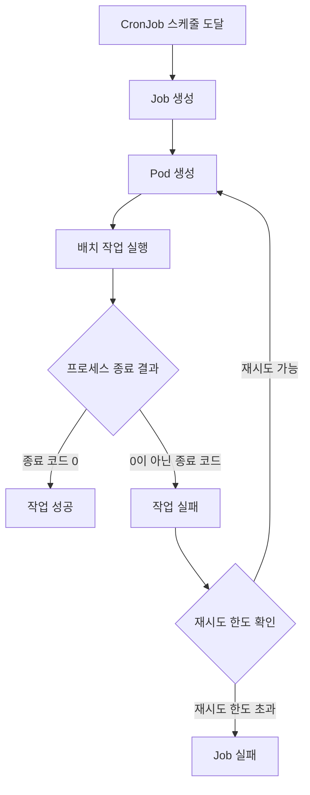
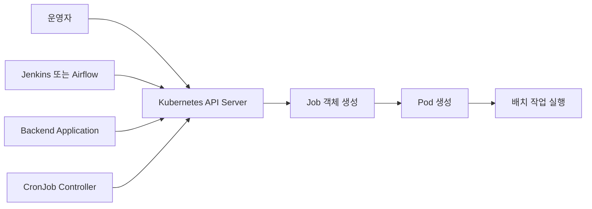
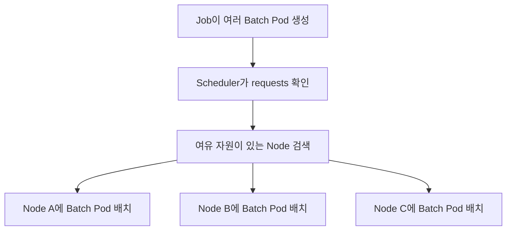
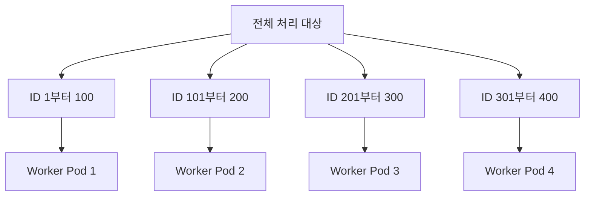
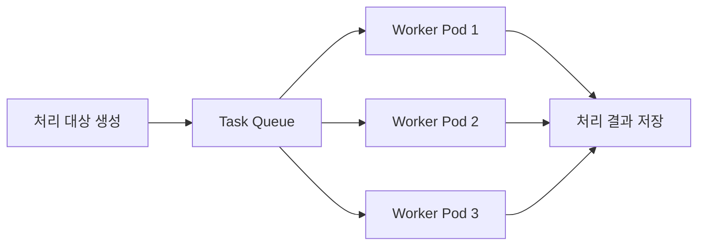
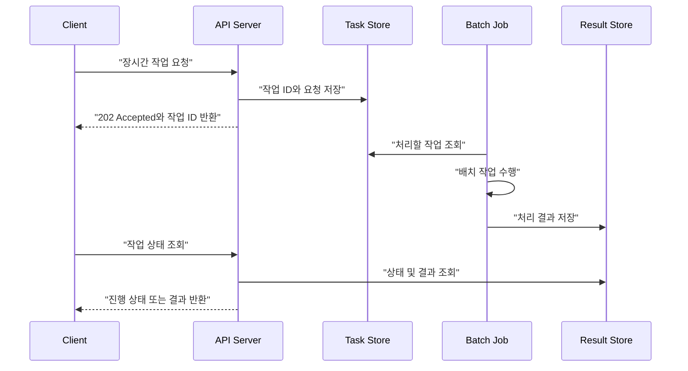
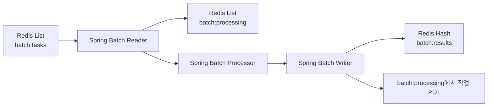
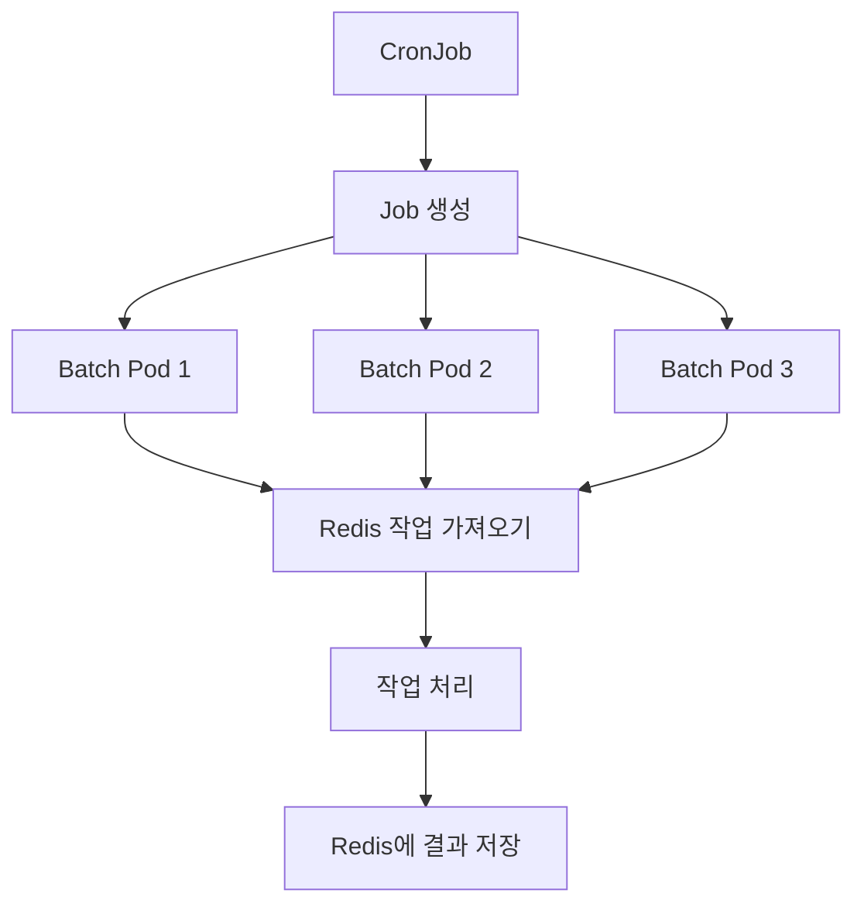
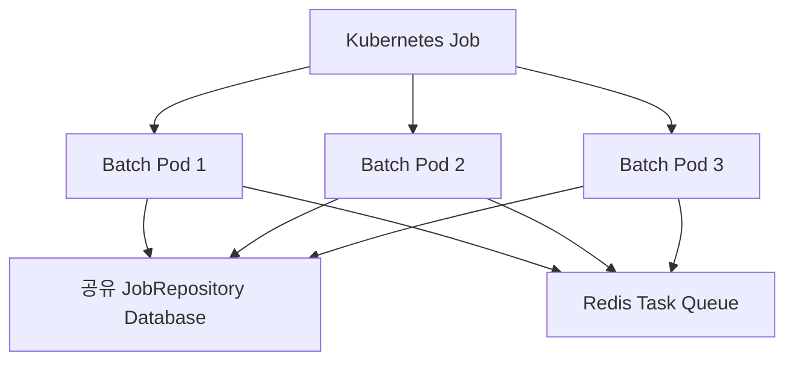

# Ch 8. Job과 CronJob을 이용한 대규모 배치 작업 수행

# Ch 8. Job과 CronJob을 이용한 대규모 배치 작업 수행
* toc
{:toc}

---

## 01. Job과 CronJob을 이용한 대규모 배치 작업 수행

### Job과 CronJob을 이용한 대규모 배치 작업 수행

배치 작업은 대량의 데이터를 한꺼번에 처리하거나, 수행 시간이 긴 계산을 비동기적으로 실행하거나, 정해진 시각에 반복 작업을 수행할 때 사용한다. 대표적으로 정산, 통계 집계, 데이터 마이그레이션, 보고서 생성, 로그 분석, 이미지 변환 등이 있다.

전통적인 환경에서는 배치 서버를 API 서버와 분리하고 Jenkins, Airflow 같은 별도 스케줄러와 모니터링 시스템으로 관리하는 경우가 많았다. 중요한 배치 작업을 Kubernetes로 이전하는 것은 운영 안정성과 데이터 정합성을 함께 검토해야 하므로 단순히 실행 환경만 바꾸는 문제는 아니다.

하지만 Kubernetes 환경에서 배치 작업을 실행하면 다음과 같은 장점을 얻을 수 있다.

- 여러 Node의 자원을 활용한 병렬 처리
- 실패한 작업의 자동 재시도
- 컨테이너 이미지 기반의 일관된 실행 환경
- API 서버와 동일한 네트워크 및 설정 사용
- 작업량에 따른 Pod 수 조절
- 클러스터의 여유 자원 활용

특히 작업 간 독립성이 보장되는 대규모 배치라면 Kubernetes의 스케줄링과 병렬 실행 기능을 효과적으로 활용할 수 있다.

#### Job과 CronJob

Kubernetes에서 일회성 작업은 Job으로 관리하고, 주기적인 작업은 CronJob으로 관리한다.

Job은 작업을 수행하고 정상적으로 종료되는 Pod를 관리하는 객체다. Deployment가 Pod를 지속적으로 실행하는 것을 목표로 한다면, Job은 지정된 작업을 성공적으로 완료하는 것을 목표로 한다.

CronJob은 지정된 스케줄에 따라 Job을 생성한다. CronJob이 직접 Pod를 실행하는 것이 아니라, 실행 시각마다 새로운 Job을 생성하고 Job이 Pod를 관리하는 구조다.



Deployment, Job, CronJob은 목적이 서로 다르다.

| 구분 | Deployment | Job | CronJob |
|---|---|---|---|
| 목적 | 애플리케이션을 지속적으로 실행 | 작업을 완료하고 종료 | 정해진 주기로 Job 생성 |
| 정상적인 Pod 상태 | 계속 실행 중 | 작업 완료 후 종료 | 생성한 Job의 완료 |
| 실패 처리 | 원하는 레플리카 수를 유지 | 설정에 따라 작업 재시도 | 생성된 Job의 정책에 따라 처리 |
| 대표 사례 | API 서버, 메시지 Worker | 데이터 변환, 마이그레이션 | 일별 정산, 정기 보고서 |
| 실행 시점 | 항상 실행 | 필요할 때 생성 | Cron 스케줄에 따라 생성 |

단순히 한 번 실행하고 종료하는 Pod는 Job 없이도 만들 수 있다. 하지만 Job을 사용하면 다음과 같은 기능을 추가로 사용할 수 있다.

- 실패한 작업 재시도
- 지정된 횟수만큼 작업 완료
- 여러 Pod를 이용한 병렬 실행
- 전체 작업 실행 시간 제한
- 작업 성공과 실패 상태 관리
- 완료된 객체의 자동 정리

#### 기본 Job 작성하기

다음 Job은 총 네 번의 작업 완료를 목표로 하며, 동시에 최대 두 개의 Pod를 실행한다.

```yaml
apiVersion: v1
kind: Namespace
metadata:
  name: batch
---
apiVersion: batch/v1
kind: Job
metadata:
  name: sample-batch-job
  namespace: batch
spec:
  completions: 4
  parallelism: 2
  backoffLimit: 3
  activeDeadlineSeconds: 600
  ttlSecondsAfterFinished: 300
  template:
    metadata:
      labels:
        app: sample-batch
    spec:
      restartPolicy: Never
      containers:
        - name: batch-worker
          image: busybox:1.36
          command:
            - /bin/sh
            - -c
          args:
            - |
              echo "Batch job started"
              sleep 10
              echo "Batch job completed"
          resources:
            requests:
              cpu: 100m
              memory: 64Mi
            limits:
              cpu: 500m
              memory: 128Mi
```

##### Job YAML 주요 필드

`apiVersion: batch/v1`은 Job에서 사용하는 API 버전이다.

`kind: Job`은 생성할 객체가 Job임을 의미한다.

`completions`는 Job이 성공하기 위해 필요한 작업 완료 횟수다. 위 설정에서는 네 개의 작업이 성공해야 전체 Job이 완료된다.

`parallelism`은 동시에 실행할 수 있는 최대 Pod 수다. `completions`가 4이고 `parallelism`이 2이므로 최대 두 개의 Pod가 동시에 실행되며, 총 네 번의 성공이 기록될 때까지 작업이 이어진다.

`backoffLimit`은 실패한 작업의 재시도 한도다. 이 한도를 초과하면 Job은 최종적으로 실패 상태가 된다.

`activeDeadlineSeconds`는 Job 전체의 최대 실행 시간이다. 재시도 시간을 포함한 실행 시간이 600초를 넘으면 Job이 중단된다.

`ttlSecondsAfterFinished`는 완료된 Job을 몇 초 후 자동으로 정리할지 지정한다. 위 설정에서는 성공하거나 실패한 Job이 완료된 후 300초가 지나면 관련 객체가 정리된다.

`restartPolicy`는 Job에서 `Never` 또는 `OnFailure`를 사용할 수 있다. Job은 계속 실행되는 워크로드가 아니므로 `Always`는 사용할 수 없다.

`resources.requests`는 스케줄러가 Pod를 배치할 때 사용하는 기준이고, `resources.limits`는 컨테이너가 사용할 수 있는 최대 자원이다.

#### Job 적용 및 상태 확인

YAML을 적용한다.

```shell
kubectl apply -f sample-job.yaml
```

Job 상태를 확인한다.

```shell
kubectl get jobs -n batch
```

실행 중인 Pod를 확인한다.

```shell
kubectl get pods -n batch -l job-name=sample-batch-job
```

Job의 상세 상태와 Event를 확인한다.

```shell
kubectl describe job sample-batch-job -n batch
```

Pod 로그를 확인한다.

```shell
kubectl logs -n batch <pod-name>
```

정상적으로 실행되면 다음과 같은 로그가 출력된다.

```text
Batch job started
Batch job completed
```

작업이 모두 성공하면 Job 상태는 다음과 같이 표시된다.

```text
NAME               STATUS     COMPLETIONS   DURATION
sample-batch-job   Complete   4/4           25s
```

#### Job의 성공과 실패 판단

Job은 컨테이너 프로세스의 종료 코드를 이용해 작업 성공 여부를 판단한다.

- 종료 코드 `0`: 정상 완료
- 종료 코드 `0` 이외의 값: 작업 실패
- 제한 시간을 초과한 경우: 작업 실패
- 재시도 횟수를 초과한 경우: Job 실패

따라서 배치 애플리케이션은 예외를 로그로만 출력한 뒤 정상 종료해서는 안 된다. 실제 작업이 실패했다면 프로세스도 0이 아닌 종료 코드를 반환해야 Kubernetes가 실패를 감지하고 재시도할 수 있다.

#### 컨테이너 재시작과 Pod 재생성

Job의 재시도를 단순히 컨테이너가 다시 시작되는 것으로 이해해서는 안 된다.

`restartPolicy: OnFailure`를 사용하면 동일한 Pod 안에서 실패한 컨테이너가 재시작될 수 있다. 반면 `restartPolicy: Never`에서는 실패한 Pod 대신 새로운 Pod가 생성될 수 있다.

또한 작업 자체가 실패하지 않더라도 다음과 같은 이유로 Pod가 사라질 수 있다.

- Node 장애
- Node 유지보수
- Pod 축출
- 메모리 부족으로 인한 종료
- 스토리지 및 네트워크 장애
- 운영자의 Pod 삭제

따라서 배치 프로그램은 특정 Pod가 계속 유지된다는 가정으로 작성하면 안 된다.

처리 진행 상태를 컨테이너 파일 시스템이나 `emptyDir`에만 기록하는 것도 안전하지 않다. `emptyDir`은 컨테이너가 재시작되는 동안에는 유지될 수 있지만 Pod가 삭제되고 새로 생성되면 함께 사라진다.

배치 진행 상태는 다음과 같은 외부 저장소에 기록하는 것이 적합하다.

- 데이터베이스
- 메시지 큐
- Redis와 같은 외부 저장소
- 오브젝트 스토리지
- 영속성이 보장되는 PV

#### CronJob으로 주기적인 작업 실행하기

CronJob은 Cron 표현식으로 지정한 시간마다 Job을 생성한다. 다음 예제는 서울 시간대를 기준으로 매일 오전 2시에 보고서 생성 작업을 실행한다.

```yaml
apiVersion: batch/v1
kind: CronJob
metadata:
  name: daily-report
  namespace: batch
spec:
  schedule: "0 2 * * *"
  timeZone: "Asia/Seoul"
  concurrencyPolicy: Forbid
  startingDeadlineSeconds: 300
  successfulJobsHistoryLimit: 3
  failedJobsHistoryLimit: 3
  jobTemplate:
    spec:
      backoffLimit: 2
      activeDeadlineSeconds: 1800
      template:
        metadata:
          labels:
            app: daily-report
        spec:
          restartPolicy: Never
          containers:
            - name: report-worker
              image: busybox:1.36
              command:
                - /bin/sh
                - -c
              args:
                - |
                  echo "Daily report started"
                  sleep 20
                  echo "Daily report completed"
              resources:
                requests:
                  cpu: 100m
                  memory: 64Mi
                limits:
                  cpu: 500m
                  memory: 128Mi
```

`schedule`은 다음과 같은 다섯 개의 필드로 구성된다.

```text
분 시 일 월 요일
0  2  *  *  *
```

`timeZone`은 CronJob이 사용할 시간대를 지정한다. 운영 환경에서는 클러스터의 기본 시간대에 의존하지 말고 명시적으로 지정하는 것이 좋다.

`concurrencyPolicy`는 이전 Job이 아직 실행 중인데 다음 스케줄이 도달했을 때의 처리 방법을 결정한다.

| 설정 | 동작 |
|---|---|
| `Allow` | 기존 Job과 새로운 Job을 동시에 실행 |
| `Forbid` | 기존 Job이 실행 중이면 새로운 실행을 건너뜀 |
| `Replace` | 기존 Job을 종료하고 새로운 Job으로 교체 |

정산과 같이 중복 실행이 위험한 작업은 일반적으로 `Forbid`를 우선 검토한다. 하지만 `Forbid`만으로 모든 중복 실행 가능성이 제거되는 것은 아니므로 애플리케이션 수준의 멱등성도 필요하다.

`startingDeadlineSeconds`는 예정된 실행 시각을 놓친 경우 지연 실행을 허용할 시간을 지정한다.

`successfulJobsHistoryLimit`과 `failedJobsHistoryLimit`은 보관할 성공 및 실패 Job의 개수다.

CronJob을 적용하고 상태를 확인한다.

```shell
kubectl apply -f daily-report-cronjob.yaml
kubectl get cronjobs -n batch
kubectl get jobs -n batch
```

스케줄을 기다리지 않고 CronJob 설정으로 Job을 즉시 생성할 수도 있다.

```shell
kubectl create job \
  --from=cronjob/daily-report \
  daily-report-manual \
  -n batch
```

CronJob은 정확히 한 번의 실행을 보장하지 않는다. Control Plane 장애나 스케줄 처리 지연에 따라 실행이 누락되거나 중복 생성될 수 있으므로 중요한 작업은 여러 번 실행되어도 결과가 깨지지 않도록 설계해야 한다.

#### Job과 CronJob을 실행하는 주체

CronJob은 미리 객체를 생성해 두면 Kubernetes가 스케줄에 따라 Job을 생성한다. 반면 일반 Job은 작업이 필요한 시점에 누군가 Kubernetes API Server에 Job 객체를 생성해야 한다.



##### kubectl을 이용한 수동 실행

운영자가 `kubectl`을 이용해 Job을 생성할 수 있다.

```shell
kubectl apply -f batch-job.yaml
```

이 방식은 자주 실행되지 않는 데이터 복구, 일회성 마이그레이션, 운영 관리 작업에 유용하다.

다만 운영자가 직접 실행해야 하므로 실행 승인, 중복 실행 방지, 로그 보관과 같은 관리 체계를 별도로 마련해야 한다.

##### Jenkins와 Airflow 같은 외부 도구 사용

Jenkins나 Airflow가 Kubernetes Job을 생성하도록 구성할 수도 있다.

이 방식은 다음과 같은 상황에 적합하다.

- 여러 배치 작업 사이에 선행 및 후행 관계가 있는 경우
- 실패 시 특정 단계부터 다시 실행해야 하는 경우
- 운영자가 UI에서 실행 이력을 확인해야 하는 경우
- 작업 결과에 따라 다음 작업을 조건부 실행해야 하는 경우
- 별도의 알림과 승인 절차가 필요한 경우

CronJob은 단순한 시간 기반 실행에는 적합하지만 복잡한 워크플로 전체를 관리하는 기능은 제한적이다.

##### Backend Application에서 Job 생성

Backend Application이 Kubernetes API Server를 호출해 Job을 직접 생성할 수도 있다.

이 경우 Backend Pod에 ServiceAccount를 연결하고 Job을 생성할 수 있는 RBAC 권한을 부여해야 한다.

```yaml
apiVersion: v1
kind: ServiceAccount
metadata:
  name: job-creator
  namespace: batch
---
apiVersion: rbac.authorization.k8s.io/v1
kind: Role
metadata:
  name: job-creator-role
  namespace: batch
rules:
  - apiGroups:
      - batch
    resources:
      - jobs
    verbs:
      - create
      - get
      - list
      - watch
---
apiVersion: rbac.authorization.k8s.io/v1
kind: RoleBinding
metadata:
  name: job-creator-role-binding
  namespace: batch
subjects:
  - kind: ServiceAccount
    name: job-creator
    namespace: batch
roleRef:
  apiGroup: rbac.authorization.k8s.io
  kind: Role
  name: job-creator-role
```

애플리케이션에서 셸 명령으로 `kubectl`을 실행할 수도 있지만, 운영 환경에서는 Kubernetes API를 직접 호출하는 클라이언트 SDK를 사용하는 것이 적합하다. Java를 포함한 주요 언어에는 Kubernetes 클라이언트 라이브러리가 제공된다.

다만 Backend Application이 자신을 실행하는 Kubernetes 환경을 직접 제어하면 애플리케이션과 인프라의 결합도가 높아진다. Job 생성 권한은 임의의 컨테이너 실행으로 이어질 수 있으므로 필요한 Namespace와 리소스에 대해서만 최소 권한을 부여해야 한다.

#### Kubernetes의 여유 자원 활용

Kubernetes에서 대규모 배치를 실행하는 장점 중 하나는 여러 Node의 자원을 동시에 활용할 수 있다는 점이다.

운영 환경에서는 장애나 트래픽 증가에 대비해 일정 수준의 여유 자원을 확보한다. 이 자원은 평상시에는 사용되지 않지만 비용은 계속 발생한다. 배치 Pod를 적절하게 스케줄링하면 이러한 자원을 활용할 수 있다.



다만 Kubernetes가 실제 CPU 사용률을 확인해 남는 자원에 자동으로 배치 Pod를 넣는 것은 아니다. 스케줄러는 기본적으로 Pod의 `requests`와 Node의 할당 가능 자원을 기준으로 배치 여부를 판단한다.

배치 작업이 API 서버의 자원을 과도하게 점유하지 않도록 다음 항목을 함께 검토해야 한다.

- 정확한 `requests`와 `limits`
- Namespace별 `ResourceQuota`
- API Pod와 Batch Pod의 `PriorityClass`
- Batch 전용 Node와 Taint 및 Toleration
- Node Selector 또는 Node Affinity
- 동시에 실행할 수 있는 Pod 수
- 데이터베이스 Connection Pool 한도
- 외부 API 호출량 제한

클러스터에 CPU와 메모리가 남아 있더라도 데이터베이스가 병목이라면 Pod 수를 늘리는 것이 처리량 향상으로 이어지지 않는다.

#### 병렬 처리 가능한 배치 작업 만들기

Kubernetes에서 Job을 실행한다고 해서 기존의 단일 배치 프로그램이 자동으로 병렬 처리되는 것은 아니다. 병렬 처리를 위해서는 애플리케이션과 데이터 구조가 이를 지원해야 한다.

##### 작업 간 독립성 보장

여러 Pod가 동시에 작업하려면 각 Pod가 담당할 데이터 범위가 분리되어야 한다. 동일한 데이터를 여러 Pod가 동시에 수정하거나 다른 작업의 완료 결과에 의존하면 동시성 문제가 발생한다.

예를 들어 데이터 ID를 기준으로 다음과 같이 처리 범위를 분할할 수 있다.

| 작업 | 처리 범위 |
|---|---|
| Worker 1 | ID 1부터 100 |
| Worker 2 | ID 101부터 200 |
| Worker 3 | ID 201부터 300 |
| Worker 4 | ID 301부터 400 |



Pod 자체에는 기본적으로 업무 데이터를 어떤 범위로 처리해야 하는지에 대한 정보가 없다. 따라서 작업 분배는 애플리케이션, 데이터베이스 또는 작업 큐에서 구현해야 한다.

##### Indexed Job을 이용한 작업 분할

Kubernetes의 Indexed Job을 사용하면 각 완료 작업에 고유한 인덱스를 부여할 수 있다.

```yaml
apiVersion: batch/v1
kind: Job
metadata:
  name: indexed-batch-job
  namespace: batch
spec:
  completionMode: Indexed
  completions: 10
  parallelism: 3
  backoffLimit: 3
  template:
    metadata:
      labels:
        app: indexed-batch
    spec:
      restartPolicy: Never
      containers:
        - name: indexed-worker
          image: busybox:1.36
          env:
            - name: JOB_COMPLETION_INDEX
              valueFrom:
                fieldRef:
                  fieldPath: metadata.annotations['batch.kubernetes.io/job-completion-index']
          command:
            - /bin/sh
            - -c
          args:
            - |
              echo "Processing partition ${JOB_COMPLETION_INDEX}"
              sleep 10
              echo "Partition ${JOB_COMPLETION_INDEX} completed"
          resources:
            requests:
              cpu: 100m
              memory: 64Mi
            limits:
              cpu: 500m
              memory: 128Mi
```

위 Job은 전체 열 개의 작업 인덱스를 처리하며 동시에 최대 세 개의 Pod를 실행한다. 애플리케이션은 `JOB_COMPLETION_INDEX` 값을 이용해 자신이 처리할 범위를 결정할 수 있다.

```text
startId = index * chunkSize + 1
endId = startId + chunkSize - 1
```

Indexed Job은 데이터 범위가 비교적 균일할 때 유용하다. 특정 구간의 작업량이 지나치게 많다면 일부 Pod만 오랫동안 실행되어 전체 완료 시간이 늦어질 수 있다.

##### 상태 테이블을 이용한 작업 분배

작업량이 균일하지 않다면 데이터베이스에 작업 상태를 기록하는 방식을 사용할 수 있다.

```text
PENDING -> PROCESSING -> COMPLETED
                    -> FAILED
```

각 Worker는 `PENDING` 상태의 데이터를 가져오면서 원자적으로 `PROCESSING` 상태로 변경한다. 다른 Worker는 이미 `PROCESSING` 상태인 데이터를 가져가지 않아야 한다.

이를 구현하려면 다음과 같은 동시성 제어가 필요하다.

- 행 잠금
- 원자적인 상태 변경
- 낙관적 락 또는 비관적 락
- 작업 소유자 식별자
- 작업 점유 만료 시간
- 실패 작업 복구 정책

Worker가 작업 중 종료되면 `PROCESSING` 상태가 계속 남을 수 있다. 일정 시간이 지나도록 완료되지 않은 작업을 다시 `PENDING`으로 변경하는 복구 절차가 필요하다.

##### 작업 큐를 이용한 분배

데이터베이스 대신 Redis, Kafka, RabbitMQ 같은 작업 큐를 이용할 수도 있다.



작업 큐를 사용할 때도 메시지 확인 처리 시점, 중복 소비, 실패 메시지 재처리, Dead Letter Queue를 고려해야 한다.

#### 시간보다 처리 상태를 기준으로 분배하기

기존 배치 작업은 실행 시각을 기준으로 처리 범위를 결정하는 경우가 많다. 예를 들어 매일 자정에 실행되는 작업이 전날 24시간 동안 생성된 데이터를 처리하는 방식이다.

이 방식은 단일 프로세스에서 순차적으로 실행할 때는 단순하지만 병렬 처리에는 불리할 수 있다.

- 시간 경계에서 데이터가 누락될 수 있다.
- 늦게 저장된 데이터가 처리되지 않을 수 있다.
- 여러 Worker의 작업 범위를 균등하게 나누기 어렵다.
- 재시도 시 이미 처리한 데이터가 중복될 수 있다.

병렬 배치에서는 다음과 같이 처리 상태를 기준으로 작업을 분배하는 것이 효과적이다.

- 아직 처리되지 않은 데이터인지
- 다른 Worker가 처리하고 있는지
- 작업 점유 시간이 만료되었는지
- 실패 후 재시도 가능한 상태인지
- 이미 성공적으로 완료되었는지

시간 범위가 필요하더라도 작업 상태와 고유 작업 식별자를 함께 사용해야 안정적인 재처리가 가능하다.

#### 작업 실패와 재시도

대규모 배치에서는 모든 작업이 한 번에 성공할 것이라고 가정해서는 안 된다. 네트워크 장애, 데이터 오류, 외부 API 장애, Node 장애 등으로 일부 작업은 실패할 수 있다.

실패한 작업은 다시 실행해 복구할 수 있어야 한다. 하지만 Job의 재시도 기능만으로 데이터 정합성이 보장되는 것은 아니다.

예를 들어 다음과 같은 상황을 생각할 수 있다.

1. Worker가 외부 API 요청에 성공한다.
2. 처리 완료 상태를 저장하기 전에 Pod가 종료된다.
3. Job이 작업을 다시 실행한다.
4. 동일한 외부 API가 한 번 더 호출된다.

이 문제를 방지하려면 작업이 여러 번 실행되어도 결과가 달라지지 않는 멱등성을 보장해야 한다.

대표적인 방법은 다음과 같다.

- 작업마다 고유한 작업 ID를 사용한다.
- 처리 완료된 작업 ID를 저장한다.
- 동일한 작업 ID가 다시 들어오면 이전 결과를 반환한다.
- 데이터 변경과 완료 상태 저장을 하나의 트랜잭션으로 처리한다.
- 외부 API가 지원한다면 멱등성 키를 전달한다.
- 메시지는 작업 완료 후 확인 처리한다.

Kubernetes의 재시도는 실패한 프로세스를 다시 실행해 주는 기능이지, 데이터베이스 트랜잭션이나 외부 시스템의 상태까지 복구하는 기능이 아니다.

#### 작업을 적절한 단위로 분할하기

작업 단위를 작게 나누면 여러 Pod가 병렬로 처리할 수 있고, 일부 작업이 실패했을 때 재처리해야 하는 범위도 줄어든다.

하지만 작업을 지나치게 작게 나누면 Pod 생성과 종료에 필요한 비용이 실제 작업 처리 비용보다 커질 수 있다.

| 작업 단위 | 장점 | 단점 |
|---|---|---|
| 너무 큼 | Pod 생성 횟수가 적음 | 병렬성이 낮고 실패 시 재처리 범위가 큼 |
| 적절함 | 병렬성과 실행 효율의 균형 | 실제 부하 테스트가 필요 |
| 너무 작음 | 실패 범위가 작음 | Pod 생성과 DB 연결 오버헤드 증가 |

Pod가 실행되기 위해서는 다음 과정이 필요하다.

- Scheduler의 Node 선택
- 컨테이너 이미지 Pull
- 컨테이너 생성
- 애플리케이션 초기화
- 데이터베이스 연결
- 작업 완료 후 리소스 정리

한 건의 데이터를 처리하기 위해 매번 Pod를 생성하면 실제 작업보다 초기화 비용이 더 커질 수 있다.

반대로 한 Pod가 너무 많은 데이터를 처리하면 실행 시간이 길어지고, 마지막 단계에서 실패했을 때 전체 범위를 다시 처리해야 할 수 있다.

적절한 작업 크기는 다음 요소를 기준으로 결정한다.

- 한 작업의 평균 처리 시간
- 컨테이너 시작 시간
- 실패 시 허용 가능한 재처리 범위
- 데이터베이스 Connection Pool 크기
- 외부 API의 호출 제한
- Node의 CPU와 메모리
- 동시에 실행할 Pod 수
- 트랜잭션과 잠금 유지 시간

#### API 서버의 장시간 작업을 배치로 전환하기

API 요청 안에서 수행 시간이 긴 작업을 동기적으로 처리하면 서버가 오랫동안 연결과 Thread를 유지해야 한다.

다음과 같은 작업은 비동기 배치 전환을 고려할 수 있다.

- 대용량 보고서 생성
- 대규모 데이터 내보내기
- 이미지 및 영상 변환
- 대량 이메일 발송
- 통계 재집계
- 데이터 마이그레이션



API 서버는 작업 완료까지 기다리지 않고 작업 ID를 반환한다. 실제 처리는 Job이나 Worker가 담당하고, 클라이언트는 별도의 API를 통해 진행 상태와 결과를 조회한다.

Kubernetes에서 API 서버와 배치 애플리케이션을 함께 운영하면 다음 요소를 공유할 수 있다.

- 데이터베이스와 메시지 큐 접근 환경
- ConfigMap과 Secret
- 공통 라이브러리와 도메인 코드
- 컨테이너 이미지 빌드 파이프라인
- 로깅과 모니터링 체계
- 네트워크 정책
- Spring Framework 기반의 공통 코드

Spring API 애플리케이션의 장시간 처리 로직을 Spring Batch로 이전하는 경우에도 Service와 Repository 같은 도메인 코드를 재사용할 수 있다. 다만 HTTP 요청 처리 계층과 실제 배치 비즈니스 로직은 분리해야 한다.

#### Job과 Worker Deployment 선택 기준

요청마다 Job을 하나씩 생성하는 방식이 항상 적합한 것은 아니다.

| 조건 | 적합한 방식 |
|---|---|
| 실행 빈도가 낮고 작업량이 큼 | Job |
| 정해진 시각에 반복 실행 | CronJob |
| 작업 요청이 지속적으로 들어옴 | Worker Deployment와 메시지 큐 |
| 복잡한 선행 및 후행 작업 존재 | Airflow와 같은 워크플로 도구 |
| 작업마다 독립적인 자원 격리가 필요 | Job |
| 짧은 작업이 초당 여러 건 발생 | 장기 실행 Worker |

짧은 작업이 자주 발생하는 환경에서 요청마다 Job을 생성하면 Kubernetes API Server, Scheduler, 컨테이너 Runtime에 불필요한 부하가 발생할 수 있다.

반면 실행 빈도는 낮지만 작업마다 많은 CPU와 메모리가 필요한 경우에는 Job을 통해 작업별로 자원을 격리하는 것이 유리하다.

#### 운영 환경에서 확인할 문제

| 현상 | 원인 | 개선 방법 |
|---|---|---|
| Job이 성공하지 못하고 반복됨 | 프로세스가 계속 오류 코드로 종료 | Pod 로그와 Job Event 확인 |
| 실제 작업은 실패했지만 Job은 성공함 | 예외를 처리한 뒤 종료 코드 0 반환 | 실패 시 0이 아닌 종료 코드 반환 |
| 데이터가 중복 처리됨 | 재시도와 중복 실행을 고려하지 않음 | 멱등성 키와 상태 테이블 사용 |
| CronJob이 겹쳐 실행됨 | `concurrencyPolicy: Allow` 사용 | `Forbid` 또는 분산 잠금 적용 |
| 완료된 Job이 계속 쌓임 | TTL과 이력 제한 누락 | TTL 및 History Limit 설정 |
| 재시도 시 진행 상태가 사라짐 | 상태를 Pod 내부에만 저장 | 외부 영속 저장소 사용 |
| 배치 실행 중 API 응답이 느려짐 | CPU와 DB 연결을 배치가 과점유 | ResourceQuota와 병렬 수 제한 |
| Pod를 늘려도 처리량이 증가하지 않음 | 데이터베이스나 외부 API가 병목 | 전체 처리 경로 기준으로 튜닝 |
| CronJob 실행 시각이 예상과 다름 | 시간대 설정 누락 | `timeZone` 명시 |
| Job이 끝나지 않고 계속 실행됨 | 외부 호출 타임아웃 누락 | 호출 타임아웃과 실행 제한 설정 |

#### 실무 관점에서의 체크리스트

Kubernetes에서 대규모 배치 작업을 운영하기 전에 다음 항목을 확인해야 한다.

- 각 작업이 서로 독립적으로 실행될 수 있는가
- 동일한 작업이 여러 번 실행되어도 안전한가
- 작업 범위가 명확하게 분리되는가
- Pod가 사라져도 처리 상태를 복구할 수 있는가
- 작업 단위가 지나치게 크거나 작지 않은가
- 데이터베이스가 병렬 연결을 감당할 수 있는가
- 배치가 API 서버의 자원을 침범하지 않는가
- 실패한 작업을 다시 처리할 수 있는가
- Job과 CronJob의 로그를 외부에 보관하는가
- Backend Application의 Job 생성 권한이 최소화되어 있는가
- 복잡한 작업 흐름에 외부 워크플로 도구가 필요한가

### 정리

Job은 지정한 작업을 성공적으로 완료할 때까지 Pod를 관리하는 Kubernetes 객체다. 실패한 작업의 재시도, 반복 완료, 병렬 실행과 같은 배치 처리 기능을 제공한다.

CronJob은 정해진 스케줄마다 Job을 생성한다. 단순한 주기 작업에는 효과적이지만 복잡한 작업 의존 관계와 실행 이력 관리가 필요하다면 외부 워크플로 도구를 함께 검토해야 한다.

Kubernetes 기반 배치 처리의 가장 큰 장점은 여러 Node의 자원을 활용해 작업을 병렬로 실행할 수 있다는 점이다. 그러나 기존의 단일 배치 애플리케이션을 Job으로 감싸는 것만으로 병렬 처리가 완성되는 것은 아니다.

작업 간 독립성, 멱등성, 외부 상태 저장, 실패 복구, 적절한 작업 분할이 함께 설계되어야 한다. 또한 Kubernetes의 Job 재시도는 컨테이너 실행을 복구하는 기능일 뿐 데이터베이스와 외부 시스템의 정합성을 자동으로 보장하지는 않는다. 이러한 특성을 이해하고 애플리케이션 수준의 복구 전략을 함께 적용해야 안정적인 대규모 배치 시스템을 구성할 수 있다.


## 02. 스프링 배치를 Kubernetes를 이용해 실행 하기 실습

### 02. Spring Batch를 Kubernetes에서 실행하는 실습

Spring Batch는 대량 데이터를 일정한 단위로 읽고, 가공하고, 저장하는 배치 처리 프레임워크다. Kubernetes에서는 Spring Batch 애플리케이션을 컨테이너 이미지로 만든 뒤 Job이나 CronJob으로 실행할 수 있다.

이번 실습에서는 Redis에 저장된 작업을 여러 Spring Batch Pod가 나누어 처리하고, 처리 결과를 다시 Redis에 저장한다. Spring Batch의 실행 메타데이터는 실습 편의를 위해 각 Pod 내부의 H2 인메모리 데이터베이스에 저장한다.

#### 실습 목표

이번 실습에서 확인할 내용은 다음과 같다.

- Spring Batch 프로젝트 생성
- Spring Batch 메타데이터를 위한 H2 설정
- Redis 기반 작업 Reader 구현
- Processor를 이용한 작업 처리
- Redis 기반 결과 Writer 구현
- Step과 Job 구성
- Jib를 이용한 컨테이너 이미지 생성
- Docker Hub에 이미지 Push
- Kubernetes CronJob을 이용한 주기적 실행
- 여러 Pod를 이용한 Redis 작업 분산
- 작업 실패와 중복 처리 시 주의사항 확인

#### 전체 구성

Redis에는 처리할 작업이 `batch:tasks` List에 저장된다. Spring Batch의 Reader는 작업을 가져오면서 `batch:processing` List로 이동시킨다.

Processor는 전달받은 작업을 계산하고, Writer는 결과를 `batch:results` Hash에 저장한다. 결과 저장이 끝나면 처리 중 목록에서 해당 작업을 제거한다.



Kubernetes에서는 하나의 CronJob이 정해진 시각마다 Job을 생성한다. Job은 여러 Pod를 병렬로 실행하고, 각각의 Pod가 Redis에서 서로 다른 작업을 가져간다.



#### 사전 조건

실습을 진행하려면 다음 환경이 필요하다.

- Java 17 이상
- Gradle 기반 Spring Boot 프로젝트
- Kubernetes 클러스터
- `kubectl`
- Docker Hub 계정
- Docker Hub Repository
- Kubernetes에서 실행 중인 Redis
- Redis를 가리키는 Kubernetes Service

이번 실습에서는 Redis가 `infra` Namespace에서 다음 이름으로 실행 중이라고 가정한다.

```text
redis.infra.svc.cluster.local:6379
```

Kubernetes Service의 전체 도메인은 다음 구조로 만들어진다.

```text
<Service 이름>.<Namespace>.svc.cluster.local
```

CronJob은 `batch` Namespace에서 실행되고 Redis는 `infra` Namespace에 있으므로 단순히 `redis`라는 이름만 사용할 수 없다. 다른 Namespace의 Service에 접근하려면 최소한 `redis.infra` 또는 전체 주소인 `redis.infra.svc.cluster.local`을 사용해야 한다.

#### Docker Hub Repository 생성

Docker Hub에 로그인한 뒤 Spring Batch 이미지를 저장할 Repository를 생성한다.

예제 Repository 이름은 다음과 같이 사용한다.

```text
spring-batch-redis
```

최종 이미지 주소는 다음과 같은 형식이 된다.

```text
docker.io/<dockerhub-username>/spring-batch-redis:1.0.0
```

Kubernetes가 이미지를 내려받으려면 Public Repository를 사용하거나, Private Repository인 경우 `imagePullSecrets`를 별도로 설정해야 한다.

#### Spring Initializr 프로젝트 생성

Spring Initializr에서 다음과 같이 프로젝트를 생성한다.

| 항목 | 설정 |
|---|---|
| Project | Gradle - Groovy |
| Language | Java |
| Spring Boot | Spring Batch 5.x를 사용하는 Spring Boot 3.x |
| Java | 17 이상 |
| Group | `com.example` |
| Artifact | `batch` |
| Packaging | Jar |

Dependency는 다음 항목을 추가한다.

- Spring Batch
- Spring Data Redis
- H2 Database

JSON 작업을 처리하기 위해 Jackson도 사용한다.

#### Gradle 의존성 설정

`build.gradle`의 의존성은 다음과 같이 구성할 수 있다.

```groovy
dependencies {
    implementation 'org.springframework.boot:spring-boot-starter-batch'
    implementation 'org.springframework.boot:spring-boot-starter-data-redis'
    implementation 'com.fasterxml.jackson.core:jackson-databind'

    runtimeOnly 'com.h2database:h2'

    testImplementation 'org.springframework.boot:spring-boot-starter-test'
    testImplementation 'org.springframework.batch:spring-batch-test'
}
```

`spring-boot-starter-batch`는 Spring Batch의 Job, Step, Reader, Processor, Writer와 배치 실행 인프라를 제공한다.

`spring-boot-starter-data-redis`는 `StringRedisTemplate`과 Redis 연결 기능을 제공한다.

H2는 Spring Batch의 JobRepository가 사용하는 메타데이터 테이블을 생성하기 위해 사용한다.

#### Spring Batch와 JobRepository

Spring Batch는 처리할 업무 데이터뿐만 아니라 배치 작업 자체의 실행 상태도 관리한다.

대표적인 메타데이터는 다음과 같다.

- 어떤 Job이 실행되었는지
- Job이 언제 시작되고 종료되었는지
- 어떤 Step이 실행되었는지
- Step이 몇 건을 읽고 썼는지
- 작업이 성공했는지 실패했는지
- 재시작에 필요한 ExecutionContext
- JobParameter와 JobInstance의 관계

이 정보는 JobRepository에서 관리한다.

Spring Batch 4에서는 Map 기반 인메모리 JobRepository 구현을 사용할 수 있었지만 해당 구현은 4.3에서 Deprecated 되었고 Spring Batch 5에서 제거되었다. 따라서 일반적인 Spring Batch 5.x JDBC 구성에서는 DataSource와 트랜잭션 관리자가 필요하다.

다만 모든 Spring Batch 5 이상 버전이 반드시 관계형 데이터베이스를 요구한다고 단정할 수는 없다. 이후 버전에는 메타데이터를 저장하지 않는 `ResourcelessJobRepository`도 추가되었다. 하지만 이 방식은 재시작, ExecutionContext 공유, 병렬 파티셔닝과 같은 기능이 필요하지 않은 제한적인 일회성 작업에 적합하다.

이번 실습에서는 Spring Batch 5.x 환경을 기준으로 H2를 사용한다.

> H2 인메모리 데이터베이스는 각 Pod 내부에 생성된다. Pod가 종료되면 Spring Batch 메타데이터도 사라지므로 운영 환경의 중앙 실행 이력이나 재시작 기능에는 적합하지 않다. 운영 환경에서는 PostgreSQL이나 MySQL과 같은 외부 데이터베이스 사용을 검토해야 한다.

#### application.yml 설정

`src/main/resources/application.yml`을 다음과 같이 작성한다.

```yaml
spring:
  application:
    name: spring-batch-redis

  main:
    web-application-type: none

  batch:
    job:
      name: redisTaskJob
    jdbc:
      initialize-schema: always

  datasource:
    url: jdbc:h2:mem:batchmeta;DB_CLOSE_DELAY=-1;DB_CLOSE_ON_EXIT=FALSE
    driver-class-name: org.h2.Driver
    username: sa
    password:

  data:
    redis:
      host: ${REDIS_HOST:localhost}
      port: ${REDIS_PORT:6379}
      timeout: 2s

logging:
  level:
    org.springframework.batch: info
    com.example.batch: info
```

##### 설정 설명

`spring.main.web-application-type: none`은 이 애플리케이션이 HTTP 서버가 아니라 배치 프로세스로 실행된다는 것을 의미한다. 따라서 Tomcat과 같은 웹 서버를 시작하지 않는다.

`spring.batch.job.name`은 애플리케이션 시작 시 실행할 Job Bean의 이름을 지정한다.

`spring.batch.jdbc.initialize-schema: always`는 Spring Batch 메타데이터 테이블을 자동 생성한다.

대표적인 메타데이터 테이블은 다음과 같다.

```text
BATCH_JOB_INSTANCE
BATCH_JOB_EXECUTION
BATCH_JOB_EXECUTION_PARAMS
BATCH_STEP_EXECUTION
BATCH_JOB_EXECUTION_CONTEXT
BATCH_STEP_EXECUTION_CONTEXT
```

H2 URL에서 `DB_CLOSE_DELAY=-1`은 애플리케이션이 실행되는 동안 연결이 닫혀도 인메모리 데이터베이스가 유지되도록 한다.

Redis 주소는 환경 변수로 덮어쓸 수 있도록 구성한다. 로컬에서는 기본값인 `localhost:6379`를 사용하고 Kubernetes에서는 `REDIS_HOST`와 `REDIS_PORT`를 전달한다.

#### 프로젝트 구조

예제 프로젝트는 다음과 같이 구성한다.

```text
src/main/java/com/example/batch
├── BatchApplication.java
├── config
│   └── BatchConfig.java
├── domain
│   ├── BatchTask.java
│   └── TaskResult.java
└── job
    ├── RedisTaskReader.java
    ├── RedisTaskProcessor.java
    └── RedisTaskWriter.java
```

#### Spring Batch 애플리케이션 작성

Spring Batch 작업이 끝나면 JVM도 종료되어야 Kubernetes가 Pod를 `Completed` 상태로 처리할 수 있다.

```java
package com.example.batch;

import org.springframework.boot.SpringApplication;
import org.springframework.boot.autoconfigure.SpringBootApplication;
import org.springframework.context.ConfigurableApplicationContext;

@SpringBootApplication
public class BatchApplication {

    public static void main(String[] args) {
        ConfigurableApplicationContext context =
                SpringApplication.run(BatchApplication.class, args);

        int exitCode = SpringApplication.exit(context);
        System.exit(exitCode);
    }
}
```

`SpringApplication.run()`은 Spring Context를 생성하고 등록된 Batch Job을 실행한다.

Job 실행이 끝나면 `SpringApplication.exit()`으로 Context를 종료하고 `System.exit()`으로 JVM 프로세스를 종료한다. 배치가 끝났는데도 JVM이 계속 실행되면 Kubernetes Job도 완료되지 않으므로 종료 처리가 중요하다.

#### 작업 데이터 클래스 작성

Redis에는 다음과 같은 JSON 형식으로 작업을 저장한다.

```json
{
  "id": "task-1",
  "number": 100000
}
```

`id`는 작업을 구분하는 고유 식별자이고, `number`는 1부터 해당 숫자까지 합계를 계산할 때 사용한다.

```java
package com.example.batch.domain;

public record BatchTask(
        String id,
        long number,
        String raw
) {
}
```

`raw`에는 Redis에서 가져온 원본 JSON 문자열을 저장한다. Writer가 작업을 완료한 뒤 `batch:processing` List에서 정확한 원본 데이터를 제거할 때 사용한다.

처리 결과는 다음 record로 표현한다.

```java
package com.example.batch.domain;

public record TaskResult(
        String taskId,
        long input,
        String result,
        String rawTask
) {
}
```

#### Redis Task Reader 작성

Reader는 Redis의 `batch:tasks` List에서 작업을 꺼내 `batch:processing` List로 이동시킨다.

```java
package com.example.batch.job;

import com.example.batch.domain.BatchTask;
import com.fasterxml.jackson.databind.ObjectMapper;
import org.springframework.batch.item.ItemReader;
import org.springframework.data.redis.connection.RedisListCommands;
import org.springframework.data.redis.core.StringRedisTemplate;
import org.springframework.stereotype.Component;

@Component
public class RedisTaskReader implements ItemReader<BatchTask> {

    public static final String TASK_QUEUE = "batch:tasks";
    public static final String PROCESSING_QUEUE = "batch:processing";

    private final StringRedisTemplate redisTemplate;
    private final ObjectMapper objectMapper;

    public RedisTaskReader(
            StringRedisTemplate redisTemplate,
            ObjectMapper objectMapper
    ) {
        this.redisTemplate = redisTemplate;
        this.objectMapper = objectMapper;
    }

    @Override
    public BatchTask read() throws Exception {
        String rawTask = redisTemplate.opsForList().move(
                TASK_QUEUE,
                RedisListCommands.Direction.RIGHT,
                PROCESSING_QUEUE,
                RedisListCommands.Direction.LEFT
        );

        if (rawTask == null) {
            return null;
        }

        try {
            TaskPayload payload =
                    objectMapper.readValue(rawTask, TaskPayload.class);

            if (payload.id() == null || payload.id().isBlank()) {
                throw new IllegalArgumentException("Task id must not be blank");
            }

            if (payload.number() < 0) {
                throw new IllegalArgumentException(
                        "Task number must not be negative"
                );
            }

            return new BatchTask(
                    payload.id(),
                    payload.number(),
                    rawTask
            );
        } catch (Exception exception) {
            throw new IllegalArgumentException(
                    "Invalid Redis task: " + rawTask,
                    exception
            );
        }
    }

    private record TaskPayload(
            String id,
            long number
    ) {
    }
}
```

Redis의 `LMOVE` 연산은 하나의 List에서 값을 제거하고 다른 List에 추가하는 과정을 원자적으로 수행한다.

단순히 `RPOP`으로 작업을 제거하면 Pod가 작업 완료 전에 종료되었을 때 해당 작업을 잃어버릴 수 있다. 반면 처리할 작업을 `batch:processing`으로 이동시키면 작업이 끝나지 않은 항목을 별도로 확인할 수 있다.

여러 Pod가 동시에 `LMOVE`를 실행하더라도 하나의 List 항목은 한 번만 이동되므로 초기 작업 분배 단계에서 동일한 항목을 여러 Pod가 가져가는 것을 방지할 수 있다.

Reader가 `null`을 반환하면 Spring Batch는 더 이상 읽을 데이터가 없다고 판단하고 현재 Step을 종료한다.

#### Task Processor 작성

Processor에서는 입력값까지의 합계를 계산한다. 단순한 실습 코드지만 실제 배치에서는 데이터 변환, 외부 API 호출, 정산 계산과 같은 비즈니스 로직이 위치한다.

```java
package com.example.batch.job;

import com.example.batch.domain.BatchTask;
import com.example.batch.domain.TaskResult;
import java.math.BigInteger;
import org.springframework.batch.item.ItemProcessor;
import org.springframework.stereotype.Component;

@Component
public class RedisTaskProcessor
        implements ItemProcessor<BatchTask, TaskResult> {

    @Override
    public TaskResult process(BatchTask task) {
        BigInteger sum = BigInteger.ZERO;

        for (long number = 1; number <= task.number(); number++) {
            sum = sum.add(BigInteger.valueOf(number));
        }

        return new TaskResult(
                task.id(),
                task.number(),
                sum.toString(),
                task.raw()
        );
    }
}
```

`BigInteger`를 사용한 이유는 입력값이 커졌을 때 `long` 범위를 초과하는 문제를 피하기 위해서다.

입력값 검증은 Reader와 Processor 양쪽에서 적절히 분리할 수 있다. JSON 구조나 필수 필드 검증은 Reader에서 수행하고, 실제 업무 규칙은 Processor에서 처리하는 것이 일반적이다.

#### Redis Task Writer 작성

Writer는 계산 결과를 Redis Hash에 저장하고, 처리 중 목록에서 작업을 제거한다.

```java
package com.example.batch.job;

import com.example.batch.domain.TaskResult;
import org.springframework.batch.item.Chunk;
import org.springframework.batch.item.ItemWriter;
import org.springframework.data.redis.core.StringRedisTemplate;
import org.springframework.stereotype.Component;

@Component
public class RedisTaskWriter implements ItemWriter<TaskResult> {

    public static final String RESULT_HASH = "batch:results";

    private final StringRedisTemplate redisTemplate;

    public RedisTaskWriter(StringRedisTemplate redisTemplate) {
        this.redisTemplate = redisTemplate;
    }

    @Override
    public void write(Chunk<? extends TaskResult> chunk) {
        for (TaskResult taskResult : chunk) {
            redisTemplate.opsForHash().put(
                    RESULT_HASH,
                    taskResult.taskId(),
                    taskResult.result()
            );

            Long removedCount = redisTemplate.opsForList().remove(
                    RedisTaskReader.PROCESSING_QUEUE,
                    1,
                    taskResult.rawTask()
            );

            if (removedCount == null || removedCount == 0) {
                throw new IllegalStateException(
                        "Processing task was not found: "
                                + taskResult.taskId()
                );
            }
        }
    }
}
```

결과는 `batch:results` Hash에 작업 ID를 Field로 저장한다.

```text
batch:results
├── task-1 -> 5000050000
├── task-2 -> 20000100000
└── task-3 -> 45000150000
```

같은 작업 ID가 다시 처리되더라도 Hash의 동일한 Field를 덮어쓰므로 결과 저장은 멱등성을 가진다.

다만 Redis 결과 저장과 Spring Batch의 H2 트랜잭션은 하나의 분산 트랜잭션으로 묶이지 않는다. 결과를 Redis에 저장한 직후 Pod가 종료되면 같은 작업이 다시 처리될 가능성이 있다. 따라서 실제 업무에서는 작업 ID를 이용한 멱등성 보장이 반드시 필요하다.

#### Step과 Job 구성

Reader, Processor, Writer를 연결해 Step을 생성하고 Step을 실행하는 Job을 구성한다.

```java
package com.example.batch.config;

import com.example.batch.domain.BatchTask;
import com.example.batch.domain.TaskResult;
import com.example.batch.job.RedisTaskProcessor;
import com.example.batch.job.RedisTaskReader;
import com.example.batch.job.RedisTaskWriter;
import org.springframework.batch.core.Job;
import org.springframework.batch.core.Step;
import org.springframework.batch.core.job.builder.JobBuilder;
import org.springframework.batch.core.repository.JobRepository;
import org.springframework.batch.core.step.builder.StepBuilder;
import org.springframework.context.annotation.Bean;
import org.springframework.context.annotation.Configuration;
import org.springframework.transaction.PlatformTransactionManager;

@Configuration
public class BatchConfig {

    @Bean
    public Step redisTaskStep(
            JobRepository jobRepository,
            PlatformTransactionManager transactionManager,
            RedisTaskReader reader,
            RedisTaskProcessor processor,
            RedisTaskWriter writer
    ) {
        return new StepBuilder("redisTaskStep", jobRepository)
                .<BatchTask, TaskResult>chunk(10, transactionManager)
                .reader(reader)
                .processor(processor)
                .writer(writer)
                .build();
    }

    @Bean
    public Job redisTaskJob(
            JobRepository jobRepository,
            Step redisTaskStep
    ) {
        return new JobBuilder("redisTaskJob", jobRepository)
                .start(redisTaskStep)
                .build();
    }
}
```

`JobRepository`는 Job과 Step의 실행 상태를 저장한다.

`PlatformTransactionManager`는 Chunk 단위 트랜잭션을 관리한다.

`chunk(10, transactionManager)`은 최대 10개의 항목을 읽고 처리한 뒤 Writer에 전달하는 구조다. 업무 데이터가 관계형 데이터베이스에 저장된다면 일반적으로 이 Chunk 단위로 트랜잭션이 커밋된다.

이번 실습에서 업무 데이터는 Redis에 저장되므로 H2 트랜잭션과 Redis 명령이 완전히 하나의 트랜잭션으로 묶이지 않는다는 점을 구분해야 한다.

`@EnableBatchProcessing`은 추가하지 않는다. Spring Boot의 Batch Auto Configuration을 사용하면 DataSource, JobRepository, JobLauncher와 스키마 초기화가 자동으로 구성된다. `@EnableBatchProcessing`을 직접 추가하면 일부 Spring Boot 자동 설정이 비활성화될 수 있으므로 특별한 커스텀이 없다면 생략하는 것이 간단하다.

#### 로컬 Redis에 작업 등록

애플리케이션을 실행하기 전에 Redis에 테스트 작업을 등록한다.

```shell
redis-cli LPUSH batch:tasks \
  '{"id":"task-1","number":100000}' \
  '{"id":"task-2","number":200000}' \
  '{"id":"task-3","number":300000}'
```

대기 중인 작업 수를 확인한다.

```shell
redis-cli LLEN batch:tasks
```

예상 결과는 다음과 같다.

```text
3
```

애플리케이션을 실행한다.

```shell
./gradlew bootRun
```

Windows PowerShell에서는 다음 명령을 사용할 수 있다.

```powershell
.\gradlew.bat bootRun
```

작업이 완료되면 결과를 확인한다.

```shell
redis-cli HGETALL batch:results
redis-cli LLEN batch:tasks
redis-cli LLEN batch:processing
```

정상 처리되었다면 `batch:tasks`와 `batch:processing`의 길이는 모두 0이고, `batch:results`에는 세 개의 결과가 저장된다.

#### Jib 플러그인 추가

Jib는 Dockerfile과 Docker Daemon 없이 Java 애플리케이션을 OCI 컨테이너 이미지로 만들 수 있는 도구다.

`build.gradle`의 `plugins` 블록에 Jib 플러그인을 추가한다.

```groovy
plugins {
    id 'java'
    id 'org.springframework.boot'
    id 'io.spring.dependency-management'
    id 'com.google.cloud.tools.jib' version '3.5.2'
}
```

Jib 설정을 `build.gradle` 하단에 추가한다.

```groovy
jib {
    from {
        image = 'eclipse-temurin:21-jre'
    }

    to {
        image = project.findProperty('imageName')
                ?: 'docker.io/<dockerhub-username>/spring-batch-redis:1.0.0'
    }

    container {
        mainClass = 'com.example.batch.BatchApplication'
        jvmFlags = [
                '-XX:MaxRAMPercentage=75.0',
                '-Dfile.encoding=UTF-8'
        ]
    }
}
```

`from.image`는 컨테이너가 사용할 Java Runtime 이미지다.

`to.image`는 생성할 최종 이미지 주소다. `<dockerhub-username>`은 실제 Docker Hub 사용자 이름으로 변경해야 한다.

`MaxRAMPercentage`는 컨테이너 Memory Limit을 기준으로 JVM이 사용할 메모리 비율을 설정한다. Container Memory와 JVM Heap Memory는 같은 개념이 아니므로 JVM Heap 이외의 Metaspace, Thread Stack, Direct Memory를 위한 공간도 남겨야 한다.

#### 컨테이너 이미지 빌드 및 Push

먼저 Docker Hub에 로그인한다.

```shell
docker login
```

Jib로 이미지를 빌드하고 Docker Hub에 Push한다.

```shell
./gradlew jib \
  -PimageName=docker.io/<dockerhub-username>/spring-batch-redis:1.0.0
```

Windows PowerShell에서는 다음과 같이 실행한다.

```powershell
.\gradlew.bat jib `
  -PimageName=docker.io/<dockerhub-username>/spring-batch-redis:1.0.0
```

Jib는 애플리케이션 Dependency와 Class를 서로 다른 Layer로 구성한다. 애플리케이션 코드만 변경된 경우 전체 Dependency Layer를 다시 Push하지 않아도 되므로 이미지 빌드와 전송을 효율적으로 수행할 수 있다.

Docker Hub 비밀번호나 Access Token을 `build.gradle` 또는 Kubernetes YAML에 직접 작성해서는 안 된다.

#### Kubernetes CronJob 작성

다음 CronJob은 5분마다 Job을 생성하고, 하나의 Job에서 Spring Batch Pod 세 개를 병렬로 실행한다.

```yaml
apiVersion: v1
kind: Namespace
metadata:
  name: batch
---
apiVersion: batch/v1
kind: CronJob
metadata:
  name: spring-batch-redis
  namespace: batch
spec:
  schedule: "*/5 * * * *"
  timeZone: "Asia/Seoul"
  concurrencyPolicy: Forbid
  startingDeadlineSeconds: 120
  successfulJobsHistoryLimit: 3
  failedJobsHistoryLimit: 3
  jobTemplate:
    spec:
      completions: 3
      parallelism: 3
      backoffLimit: 2
      activeDeadlineSeconds: 600
      ttlSecondsAfterFinished: 300
      template:
        metadata:
          labels:
            app: spring-batch-redis
        spec:
          restartPolicy: Never
          containers:
            - name: spring-batch
              image: docker.io/<dockerhub-username>/spring-batch-redis:1.0.0
              imagePullPolicy: IfNotPresent
              env:
                - name: REDIS_HOST
                  value: redis.infra.svc.cluster.local
                - name: REDIS_PORT
                  value: "6379"
              resources:
                requests:
                  cpu: 200m
                  memory: 256Mi
                limits:
                  cpu: "1"
                  memory: 512Mi
```

##### CronJob 필드 설명

`schedule`은 Cron 표현식이다. `*/5 * * * *`는 5분마다 실행한다는 의미다.

`timeZone`은 Cron 표현식을 해석할 시간대를 지정한다.

`concurrencyPolicy: Forbid`는 이전 CronJob 실행이 끝나지 않았다면 다음 스케줄의 Job 생성을 건너뛴다. 하나의 Job 내부에서 세 개의 Pod가 실행되는 것과 서로 다른 스케줄의 Job이 겹쳐 실행되는 것은 구분해야 한다.

`completions: 3`은 세 개의 Pod 작업이 성공해야 Job이 완료된다는 의미다.

`parallelism: 3`은 최대 세 개의 Pod를 동시에 실행한다.

`backoffLimit: 2`는 실패한 작업의 재시도 한도다.

`activeDeadlineSeconds`는 Job 전체의 최대 실행 시간을 제한한다.

`ttlSecondsAfterFinished`는 완료된 Job과 Pod를 일정 시간이 지난 뒤 정리한다.

`restartPolicy: Never`에서는 컨테이너 작업이 실패할 경우 동일한 Pod 안에서 컨테이너를 계속 재시작하지 않는다. Job Controller가 정책에 따라 새로운 Pod를 생성해 재시도할 수 있다.

#### CronJob 적용

YAML에서 Docker Hub 사용자 이름을 수정한 뒤 적용한다.

```shell
kubectl apply -f spring-batch-cronjob.yaml
```

CronJob을 확인한다.

```shell
kubectl get cronjobs -n batch
```

다음 실행 시각까지 기다리지 않고 수동 Job을 생성할 수 있다.

```shell
kubectl create job \
  --from=cronjob/spring-batch-redis \
  spring-batch-redis-manual \
  -n batch
```

Job과 Pod 상태를 확인한다.

```shell
kubectl get jobs -n batch
kubectl get pods -n batch -l app=spring-batch-redis
```

실행 로그를 확인한다.

```shell
kubectl logs -n batch <pod-name>
```

#### Kubernetes Redis에 테스트 작업 등록

Redis Pod 이름을 확인한다.

```shell
kubectl get pods -n infra
```

Redis Pod가 `redis`라는 이름으로 실행 중이라면 다음과 같이 작업을 등록한다.

```shell
kubectl exec -n infra redis -- redis-cli LPUSH batch:tasks \
  '{"id":"task-1","number":100000}' \
  '{"id":"task-2","number":200000}' \
  '{"id":"task-3","number":300000}' \
  '{"id":"task-4","number":400000}' \
  '{"id":"task-5","number":500000}' \
  '{"id":"task-6","number":600000}'
```

대기 중인 작업을 확인한다.

```shell
kubectl exec -n infra redis -- \
  redis-cli LRANGE batch:tasks 0 -1
```

수동 Job을 실행한다.

```shell
kubectl create job \
  --from=cronjob/spring-batch-redis \
  spring-batch-test \
  -n batch
```

실행 중인 Pod 수를 확인한다.

```shell
kubectl get pods -n batch -w
```

세 개의 Pod가 동시에 실행되며 각 Pod가 Redis에서 서로 다른 작업을 가져간다.

#### 결과 확인

대기 중인 작업 수를 확인한다.

```shell
kubectl exec -n infra redis -- \
  redis-cli LLEN batch:tasks
```

처리 중인 작업 수를 확인한다.

```shell
kubectl exec -n infra redis -- \
  redis-cli LLEN batch:processing
```

결과를 확인한다.

```shell
kubectl exec -n infra redis -- \
  redis-cli HGETALL batch:results
```

정상 처리된 경우 다음과 같은 결과를 확인할 수 있다. Redis Hash의 출력 순서는 달라질 수 있다.

```text
task-1
5000050000
task-2
20000100000
task-3
45000150000
```

모든 작업이 완료되었다면 다음 조건을 만족해야 한다.

```text
LLEN batch:tasks = 0
LLEN batch:processing = 0
HLEN batch:results = 등록한 작업 수
```

#### 병렬 처리 동작 과정

여러 Pod가 작업을 처리하는 과정은 다음과 같다.

1. CronJob이 Job을 생성한다.
2. Job이 `parallelism` 설정에 따라 여러 Pod를 실행한다.
3. 각 Pod에서 독립적인 Spring Batch 애플리케이션이 시작된다.
4. 각 Reader가 Redis의 `batch:tasks`에서 작업을 원자적으로 이동시킨다.
5. 작업은 `batch:processing`에 기록된다.
6. Processor가 작업을 계산한다.
7. Writer가 결과를 `batch:results`에 저장한다.
8. 완료된 작업을 `batch:processing`에서 제거한다.
9. 더 이상 읽을 작업이 없으면 Step과 Job이 완료된다.
10. JVM이 종료되면서 Pod가 `Completed` 상태가 된다.

Redis List의 원자적인 이동 연산을 사용하므로 여러 Pod가 동시에 실행되어도 최초 작업 할당은 서로 겹치지 않는다.

하지만 이것이 전체 처리 과정의 Exactly Once를 의미하지는 않는다. Redis 작업 이동, 비즈니스 로직 실행, 결과 저장, Spring Batch 메타데이터 커밋은 하나의 분산 트랜잭션으로 묶여 있지 않기 때문이다.

#### 실패하거나 잘못 설정했을 때 나타나는 현상

##### Redis Service를 찾지 못하는 경우

로그에 다음과 유사한 오류가 발생할 수 있다.

```text
Unable to connect to Redis
UnknownHostException
```

다른 Namespace의 Service에 접근하면서 `redis`만 지정했을 가능성이 있다.

CronJob의 환경 변수를 다음과 같이 확인한다.

```yaml
env:
  - name: REDIS_HOST
    value: redis.infra.svc.cluster.local
```

Service와 Endpoint도 확인한다.

```shell
kubectl get service -n infra
kubectl get endpoints -n infra redis
```

##### Spring Batch 메타데이터 테이블이 없는 경우

다음과 유사한 오류가 발생할 수 있다.

```text
Table "BATCH_JOB_INSTANCE" not found
```

`spring.batch.jdbc.initialize-schema`가 비활성화되었거나 `@EnableBatchProcessing`을 직접 추가해 Spring Boot 자동 설정이 적용되지 않았을 수 있다.

실습 환경에서는 다음 설정을 확인한다.

```yaml
spring:
  batch:
    jdbc:
      initialize-schema: always
```

운영 환경에서는 애플리케이션 시작 시마다 스키마를 생성하기보다 Flyway나 Liquibase로 Batch 메타데이터 스키마를 관리하는 것이 적합하다.

##### Job이 완료되지 않고 계속 실행되는 경우

Spring Batch 작업은 끝났지만 JVM 프로세스가 종료되지 않았을 수 있다.

다음 항목을 확인한다.

- 웹 서버가 시작되지 않았는지
- `spring.main.web-application-type`이 `none`인지
- 실행 후 `SpringApplication.exit()`이 호출되는지
- 별도의 Scheduler나 비종료 Thread가 남아 있는지

##### Docker Hub 이미지를 가져오지 못하는 경우

Pod가 다음 상태에 머물 수 있다.

```text
ImagePullBackOff
ErrImagePull
```

가능한 원인은 다음과 같다.

- 이미지 이름 오타
- 존재하지 않는 Tag
- Docker Hub Push 실패
- Private Repository에 대한 인증 누락
- Registry 요청 제한

상세 원인은 다음 명령으로 확인한다.

```shell
kubectl describe pod -n batch <pod-name>
```

##### 작업이 processing List에 계속 남는 경우

Pod가 작업 처리 도중 종료되면 작업이 `batch:processing`에 남을 수 있다.

```shell
kubectl exec -n infra redis -- \
  redis-cli LRANGE batch:processing 0 -1
```

단순 실습에서는 항목을 확인한 뒤 다시 대기열로 옮길 수 있다.

```shell
kubectl exec -n infra redis -- \
  redis-cli LMOVE batch:processing batch:tasks RIGHT LEFT
```

운영 환경에서 모든 처리 중 작업을 무조건 되돌리면 아직 다른 Pod가 처리 중인 작업까지 중복 실행될 수 있다. 작업 ID, 작업 소유자, 점유 시각, 만료 시간을 함께 기록하고 일정 시간이 초과된 작업만 복구해야 한다.

Redis Streams와 Consumer Group을 사용하면 Pending Entry와 ACK를 기반으로 더 체계적인 재처리 구조를 만들 수 있다.

##### 여러 Pod가 실행되지만 처리 속도가 빨라지지 않는 경우

가능한 원인은 다음과 같다.

- Redis가 병목인 경우
- 외부 데이터베이스 Connection Pool이 부족한 경우
- Node에 CPU가 부족한 경우
- 모든 Pod가 동일한 잠금을 기다리는 경우
- 작업 크기가 지나치게 작은 경우
- Pod 시작 시간이 실제 작업 시간보다 긴 경우

Pod 수를 늘리는 것만으로 처리 성능이 항상 향상되지는 않는다. Redis, 데이터베이스, 외부 API를 포함한 전체 처리 경로의 동시 처리 한도를 확인해야 한다.

#### H2 구성의 한계와 개선 방법

이번 실습의 H2는 각 Batch Pod에 독립적으로 존재한다.

따라서 다음과 같은 한계가 있다.

- Pod가 종료되면 실행 메타데이터가 사라진다.
- 여러 Pod의 실행 이력을 한곳에서 조회할 수 없다.
- 실패한 Job을 다른 Pod에서 이어서 재시작할 수 없다.
- Spring Batch의 파티셔닝 메타데이터를 공유할 수 없다.
- Kubernetes Job 재시도와 Spring Batch 재시작을 연결하기 어렵다.

운영 환경에서는 다음 구조를 고려할 수 있다.



공유 JobRepository를 사용할 때는 각 실행을 구분할 JobParameter도 필요하다. 동일한 Job 이름과 동일한 JobParameter 조합은 같은 JobInstance로 인식되기 때문이다.

CronJob 실행 시각, Kubernetes Job 이름, Pod UID 등을 JobParameter로 전달해 실행을 구분할 수 있다.

#### Redis List 방식의 한계와 개선 방법

이번 실습은 Redis List의 원자적인 이동 기능을 이용해 작업 유실 가능성을 줄였다. 그러나 전체 시스템이 완전한 Exactly Once 처리를 제공하는 것은 아니다.

| 상황 | 발생 가능한 결과 |
|---|---|
| 작업 이동 전에 Pod 종료 | 작업이 원래 Queue에 남음 |
| 작업 이동 후 처리 전에 Pod 종료 | processing에 작업이 남음 |
| 결과 저장 전에 Pod 종료 | 결과가 생성되지 않음 |
| 결과 저장 후 processing 삭제 전에 종료 | 결과가 있지만 processing에도 남음 |
| 동일 작업 재처리 | 같은 작업이 두 번 실행될 수 있음 |

운영 환경에서는 다음 방법을 함께 적용해야 한다.

- 고유한 작업 ID
- 멱등성 있는 결과 저장
- 작업 점유 시간과 만료 시간
- 실패 작업 복구 Scheduler
- 재시도 횟수 제한
- Dead Letter Queue
- Redis Streams Consumer Group
- 데이터베이스 트랜잭션과 Outbox Pattern
- 외부 API의 멱등성 키

Redis를 사용하면 작업 분배를 원자적으로 수행할 수 있지만, Redis를 사용했다는 사실만으로 전체 배치가 자동으로 안전해지는 것은 아니다.

#### 실무 관점에서 확인할 핵심 포인트

Spring Batch의 Reader, Processor, Writer는 각각 다음 책임을 가져야 한다.

- Reader는 데이터를 읽고 작업 대상으로 변환한다.
- Processor는 비즈니스 로직을 수행한다.
- Writer는 처리 결과를 저장한다.
- Step은 Chunk와 트랜잭션 경계를 정의한다.
- Job은 하나 이상의 Step 실행 흐름을 정의한다.
- JobRepository는 Spring Batch 실행 메타데이터를 관리한다.

Kubernetes Job과 Spring Batch Job도 서로 다른 개념이다.

| 구분 | Kubernetes Job | Spring Batch Job |
|---|---|---|
| 관리 주체 | Kubernetes | Spring Batch |
| 관리 대상 | Pod와 컨테이너 실행 | Step과 배치 실행 상태 |
| 성공 판단 | 컨테이너 프로세스 종료 코드 | Step과 Job의 BatchStatus |
| 재시도 | Pod 또는 컨테이너 재실행 | Step 재시작과 Job 재실행 |
| 메타데이터 | Kubernetes 객체 상태 | JobRepository |
| 실행 단위 | 컨테이너 프로세스 | Reader, Processor, Writer 흐름 |

Spring Batch Job이 실패했는데 JVM이 종료 코드 `0`으로 끝나면 Kubernetes Job은 성공으로 판단할 수 있다. 반대로 Kubernetes Pod가 Node 장애로 종료되면 Spring Batch 업무 로직에 오류가 없더라도 Kubernetes Job은 재시도할 수 있다.

두 계층의 성공과 실패 상태가 올바르게 연결되도록 종료 코드와 재시도 정책을 설계해야 한다.

### 정리

이번 실습에서는 Redis에 저장된 작업을 Spring Batch의 Reader가 가져오고, Processor가 작업을 처리한 뒤, Writer가 결과를 Redis에 저장하는 구조를 구성했다.

Spring Batch 애플리케이션은 Jib를 이용해 컨테이너 이미지로 만들고 Docker Hub에 Push했다. Kubernetes CronJob은 정해진 스케줄마다 Job을 생성하고, Job은 여러 Batch Pod를 병렬로 실행한다.

Redis의 원자적인 List 이동 연산을 사용하면 여러 Pod가 같은 작업을 동시에 가져가는 문제와 작업 유실 가능성을 줄일 수 있다. 하지만 Redis 작업 이동, 결과 저장, H2 메타데이터 커밋은 하나의 트랜잭션이 아니므로 Exactly Once가 자동으로 보장되지는 않는다.

H2 인메모리 데이터베이스는 Spring Batch 5.x의 JobRepository를 간단히 구성하는 실습에는 적합하지만, Pod가 종료되면 메타데이터가 사라진다. 운영 환경에서 실행 이력, 장애 복구, Job 재시작이 필요하다면 외부 관계형 데이터베이스를 JobRepository로 사용해야 한다.

최종적으로 안정적인 배치 처리를 위해서는 Kubernetes의 Pod 재시도뿐만 아니라 작업 ID, 멱등성, 처리 상태, 실패 작업 복구, 적절한 병렬 수와 외부 시스템의 처리 한도까지 함께 설계해야 한다.
