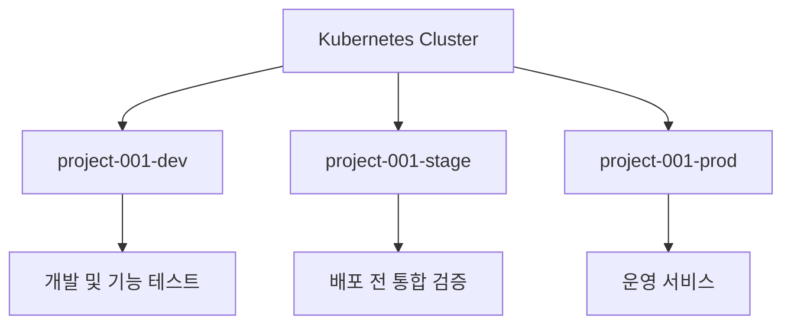
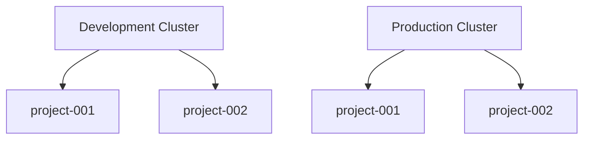
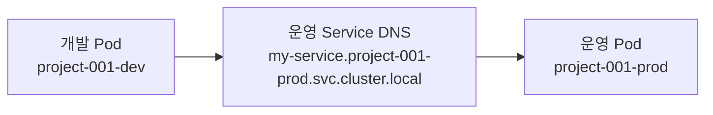
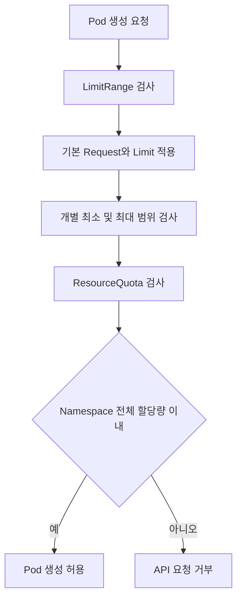
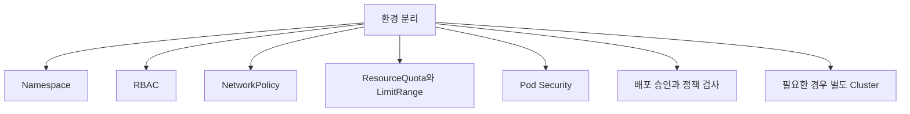
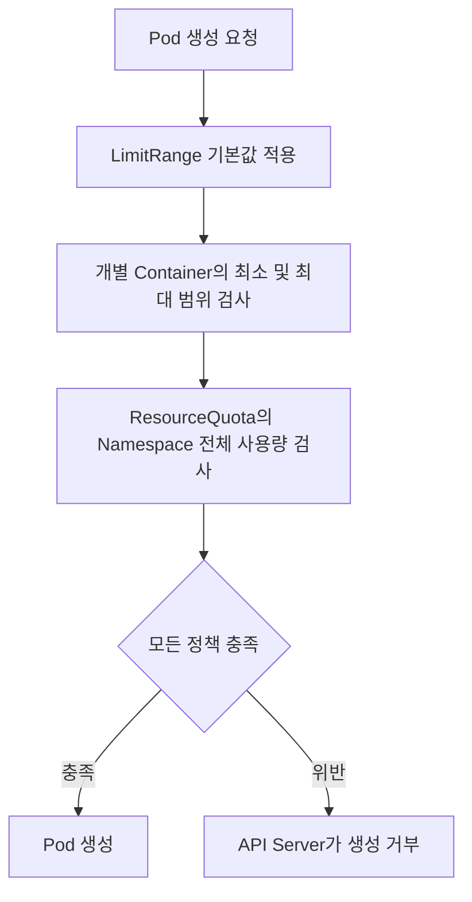
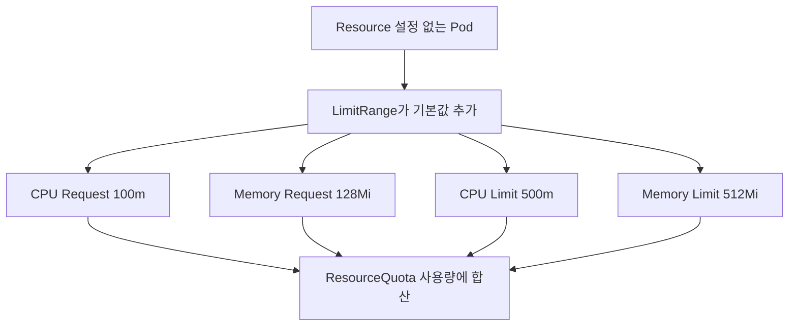

# Ch 9. Namespace를 이용한 개발 환경과 운영 환경 분리

# Ch 9. Namespace를 이용한 개발 환경과 운영 환경 분리
* toc
{:toc}

---

## 01. Namespace를 이용한 개발 환경과 운영 환경 분리

Kubernetes 클러스터에는 여러 애플리케이션과 조직의 워크로드가 함께 배포될 수 있다. 모든 객체를 하나의 공간에서 관리하면 이름 충돌이 발생하기 쉽고, 개발자가 테스트 목적으로 변경한 설정이 운영 워크로드에 영향을 줄 위험도 커진다.

Namespace는 하나의 Kubernetes 클러스터를 조직, 프로젝트, 팀, 환경과 같은 기준으로 논리적으로 구분하는 기능이다. 개발 환경과 운영 환경을 서로 다른 Namespace로 분리하면 객체 이름, 권한, 자원 사용량과 네트워크 정책을 환경별로 관리할 수 있다.



다만 Namespace는 객체를 분류하는 논리적 경계이지, 그 자체만으로 완전한 보안 격리를 제공하는 기능은 아니다. 운영 환경을 안전하게 분리하려면 RBAC, NetworkPolicy, ResourceQuota, LimitRange와 같은 정책을 함께 적용해야 한다.

#### Namespace가 필요한 이유

개발 환경에서는 기능 변경, 장애 테스트, 이미지 교체, 임시 데이터 생성과 같은 작업이 빈번하게 일어난다. 반면 운영 환경은 안정적인 서비스 제공과 데이터 보호가 우선이다.

두 환경을 하나의 Namespace에서 관리하면 다음과 같은 문제가 발생할 수 있다.

- 같은 이름의 Service나 ConfigMap을 생성할 수 없다.
- 개발용 설정이 운영 Deployment에 연결될 수 있다.
- 잘못된 `kubectl delete` 명령이 운영 객체를 삭제할 수 있다.
- 개발 Pod가 운영 Service를 호출할 수 있다.
- 개발 부하 테스트가 클러스터 자원을 모두 사용할 수 있다.
- 환경별 권한과 배포 정책을 다르게 적용하기 어렵다.

Namespace를 분리하면 같은 이름을 환경마다 독립적으로 사용할 수 있다.

```text
project-001-dev
└── Service: api-service

project-001-prod
└── Service: api-service
```

두 Service는 이름이 같지만 Namespace가 다르므로 서로 다른 객체로 관리된다.

#### Namespace의 기본 구조

Namespace는 대부분의 namespaced 객체가 속하는 논리적 범위다.

대표적인 namespaced 객체는 다음과 같다.

- Pod
- Deployment
- StatefulSet
- DaemonSet
- Job
- CronJob
- Service
- Ingress
- ConfigMap
- Secret
- ServiceAccount
- Role
- RoleBinding
- ResourceQuota
- LimitRange
- NetworkPolicy
- PersistentVolumeClaim

반면 다음 객체는 특정 Namespace에 속하지 않고 클러스터 전체에서 관리된다.

- Node
- Namespace
- PersistentVolume
- StorageClass
- ClusterRole
- ClusterRoleBinding
- CustomResourceDefinition

객체가 Namespace에 속하는지 확인하려면 다음 명령을 사용할 수 있다.

```shell
kubectl api-resources --namespaced=true
kubectl api-resources --namespaced=false
```

Namespace는 모든 Kubernetes 객체에 적용되는 공통 계층이 아니다. 특히 Node, StorageClass, PersistentVolume처럼 클러스터 범위에 존재하는 객체는 여러 Namespace에서 공유될 수 있다.

#### 다른 Namespace의 객체 참조

“다른 Namespace의 객체를 참조할 수 없다”는 설명은 객체 종류에 따라 구분해서 이해해야 한다.

Deployment에서 참조하는 ConfigMap, Secret, PersistentVolumeClaim, ServiceAccount는 일반적으로 해당 Pod와 같은 Namespace에 있어야 한다.

```yaml
apiVersion: apps/v1
kind: Deployment
metadata:
  name: api
  namespace: project-001-dev
spec:
  replicas: 1
  selector:
    matchLabels:
      app: api
  template:
    metadata:
      labels:
        app: api
    spec:
      serviceAccountName: api-service-account
      containers:
        - name: api
          image: nginx:1.27
          envFrom:
            - configMapRef:
                name: api-config
            - secretRef:
                name: api-secret
          volumeMounts:
            - name: data
              mountPath: /data
      volumes:
        - name: data
          persistentVolumeClaim:
            claimName: api-pvc
```

위 Deployment가 `project-001-dev`에 있다면 `api-service-account`, `api-config`, `api-secret`, `api-pvc`도 같은 Namespace에 있어야 한다. 필드에 다른 Namespace를 지정하는 구조가 제공되지 않기 때문이다.

하지만 모든 객체 참조가 이런 방식으로 제한되는 것은 아니다.

- Service는 클러스터 DNS를 이용해 다른 Namespace에서도 호출할 수 있다.
- PersistentVolume은 클러스터 범위 객체이며 PVC를 통해 연결된다.
- ClusterRole은 여러 Namespace에서 재사용할 수 있다.
- RoleBinding의 Subject는 다른 Namespace의 ServiceAccount를 지정할 수 있다.
- Kubernetes API 접근 권한이 있다면 다른 Namespace의 객체를 조회하거나 변경할 수 있다.

따라서 Namespace는 기본적인 객체 범위를 제공하지만 완전한 접근 차단 경계는 아니다.

#### Namespace는 계층 구조를 지원하지 않는다

Kubernetes의 Namespace는 상위와 하위 관계가 없는 평면 구조다.

다음과 같은 계층 구조를 기본 기능으로 만들 수는 없다.

```text
organization
└── project-001
    ├── dev
    ├── stage
    └── prod
```

`organization`, `project-001`, `dev`를 각각 Namespace로 생성해도 Kubernetes는 이들 사이의 부모와 자식 관계를 인식하지 않는다.

이 구조는 단순하고 직관적이라는 장점이 있지만, 조직과 프로젝트와 환경을 동시에 표현해야 할 때 불편할 수 있다.

현실적인 대안은 이름 규칙과 Label을 함께 사용하는 것이다.

```text
<조직>-<프로젝트>-<환경>
```

예를 들면 다음과 같다.

```text
backend-project-001-dev
backend-project-001-stage
backend-project-001-prod
```

이름만으로도 의미를 파악할 수 있어야 하며, 지나치게 긴 약어나 모호한 표현은 피하는 것이 좋다.

#### Namespace 이름과 Label 설계

환경별 Namespace를 다음과 같이 생성할 수 있다.

```yaml
apiVersion: v1
kind: Namespace
metadata:
  name: project-001-dev
  labels:
    organization: backend
    project: project-001
    environment: dev
---
apiVersion: v1
kind: Namespace
metadata:
  name: project-001-stage
  labels:
    organization: backend
    project: project-001
    environment: stage
---
apiVersion: v1
kind: Namespace
metadata:
  name: project-001-prod
  labels:
    organization: backend
    project: project-001
    environment: prod
```

Namespace 이름은 사람이 명령을 입력할 때 사용하고, Label은 정책과 자동화 도구가 Namespace를 선택할 때 사용한다.

```shell
kubectl apply -f namespaces.yaml
kubectl get namespaces --show-labels
```

Label을 이용하면 특정 환경에 속한 Namespace만 조회할 수 있다.

```shell
kubectl get namespaces -l environment=prod
kubectl get namespaces -l project=project-001
```

Label은 이름 규칙을 대체하는 것이 아니라 보완하는 수단이다. 이름에는 환경이 표시되지 않고 Label만으로 환경을 구분하면 사람이 명령을 실행할 때 실수하기 쉽다.

#### Label만으로 환경을 분리하면 안 되는 이유

하나의 Namespace 안에 개발과 운영 객체를 함께 배포한 뒤 Label과 Selector만으로 구분할 수도 있다.

```text
Namespace: project-001

Deployment: api-dev
labels:
  environment: dev

Deployment: api-prod
labels:
  environment: prod
```

하지만 이 구성은 다음과 같은 문제를 가진다.

- 모든 객체가 Label Selector로 서로를 찾는 것은 아니다.
- ConfigMap과 Secret은 주로 이름으로 참조한다.
- PVC와 ServiceAccount도 이름으로 참조한다.
- 잘못된 Selector가 다른 환경의 Pod를 선택할 수 있다.
- RBAC와 ResourceQuota를 환경별로 분리하기 어렵다.
- 환경별 일괄 삭제와 조회가 복잡해진다.
- 객체 이름마다 환경 접두사나 접미사가 필요해진다.

따라서 개발, Stage, 운영처럼 수명 주기와 권한이 다른 환경은 별도 Namespace로 분리하고, Label은 Namespace 내부 객체의 애플리케이션과 역할을 구분하는 데 사용하는 것이 적합하다.

#### kubectl에서 Namespace 지정하기

Namespace를 지정하지 않으면 현재 Context에 설정된 기본 Namespace가 사용된다. 기본값은 일반적으로 `default`다.

```shell
kubectl get pods
kubectl get pods -n project-001-dev
kubectl get pods --namespace=project-001-prod
```

현재 Context의 기본 Namespace를 변경할 수도 있다.

```shell
kubectl config set-context \
  --current \
  --namespace=project-001-dev
```

현재 설정을 확인한다.

```shell
kubectl config view --minify \
  --output='jsonpath={..namespace}'
```

운영 작업에서는 Namespace를 명령에 명시하는 습관이 안전하다.

```shell
kubectl get deployments -n project-001-prod
kubectl rollout status deployment/api -n project-001-prod
```

현재 Context가 개발 환경이라고 생각하고 명령을 실행했지만 실제로는 운영 Namespace가 설정되어 있다면 심각한 장애가 발생할 수 있다. 프롬프트에 현재 Context와 Namespace를 표시하는 도구를 사용하는 것도 실수를 줄이는 데 도움이 된다.

#### 프로젝트 중심과 환경 중심의 분리

Namespace를 설계할 때는 프로젝트와 환경 중 어떤 축을 우선할지 결정해야 한다.

##### 프로젝트와 환경을 이름에 함께 표현

하나의 클러스터에서 여러 프로젝트와 환경을 모두 관리한다면 다음 구조를 사용할 수 있다.

```text
project-001-dev
project-001-stage
project-001-prod
project-002-dev
project-002-stage
project-002-prod
```

이 방식은 Namespace 이름만으로 프로젝트와 환경을 확인할 수 있다. 중소 규모의 공유 클러스터에서 적용하기 쉽다.

##### 환경별로 클러스터 분리

운영 환경과 비운영 환경의 보안 및 네트워크 요구사항이 크게 다르다면 클러스터 자체를 분리할 수 있다.



각 클러스터 안에서는 프로젝트별 Namespace만 사용하고, 개발과 운영의 물리적인 경계는 클러스터로 구분한다.

| 구분 | 하나의 클러스터와 Namespace 분리 | 환경별 클러스터 분리 |
|---|---|---|
| 격리 수준 | 논리적 격리 | Control Plane을 포함한 강한 격리 |
| 운영 비용 | 비교적 낮음 | 상대적으로 높음 |
| 자원 공유 | 가능 | 클러스터 사이 공유 불가 |
| 장애 영향 범위 | 클러스터 전체로 확산 가능 | 해당 클러스터로 제한 |
| 네트워크 구성 | 정책으로 분리 | 네트워크 자체를 별도로 구성 가능 |
| 권한 실수 | 다른 Namespace에 영향을 줄 수 있음 | 다른 클러스터에는 직접 영향 없음 |
| 적합한 환경 | 소규모 및 내부 개발 환경 | 중요 운영 환경과 강한 보안 경계 |

클러스터를 추가하면 Control Plane, Node, 네트워크, 모니터링, 보안 정책, 업그레이드와 비용 관리 대상도 함께 늘어난다. 따라서 프로젝트 하나마다 클러스터를 만드는 방식은 규모에 따라 비효율적일 수 있다.

일반적으로 전체 개발 환경과 전체 운영 환경처럼 큰 경계를 클러스터로 나누고, 각 클러스터 내부를 프로젝트 Namespace로 분리하는 구조를 검토할 수 있다.

#### Namespace 간 Service 호출

Namespace가 다르더라도 Service는 Kubernetes DNS를 통해 호출할 수 있다.

같은 Namespace에서는 Service 이름만 사용한다.

```text
http://my-service:8080
```

다른 Namespace의 Service를 호출할 때는 Namespace를 포함한다.

```text
http://my-service.project-001-prod:8080
```

전체 도메인은 다음과 같다.

```text
http://my-service.project-001-prod.svc.cluster.local:8080
```



이 호출 경로가 존재한다는 것은 Namespace만 분리해도 개발과 운영의 네트워크가 자동으로 차단되는 것은 아니라는 뜻이다.

다음과 같은 호출은 모두 장애를 만들 수 있다.

- 개발 애플리케이션이 운영 데이터베이스 API를 호출
- 운영 애플리케이션이 개발용 Service를 호출
- 개발 부하 테스트가 운영 Service로 전송
- 잘못된 환경 변수가 다른 Namespace의 Service DNS를 참조
- 테스트 메시지가 운영 메시지 처리기로 전달

Namespace 간 통신이 필요한 경우도 있다. 인증 서비스나 공용 모니터링 시스템처럼 여러 프로젝트에서 공유하는 Service가 있을 수 있기 때문이다. 따라서 모든 통신을 무조건 허용하거나 차단하기보다 NetworkPolicy로 필요한 경로만 명시적으로 허용해야 한다.

#### NetworkPolicy를 이용한 네트워크 격리

NetworkPolicy를 적용하지 않은 Kubernetes 네트워크는 일반적으로 Namespace가 다르더라도 Pod 간 통신을 허용한다.

다음 정책은 개발과 운영 Namespace의 모든 Pod에 대해 외부 Namespace에서 들어오는 Ingress를 기본적으로 차단한다.

```yaml
apiVersion: networking.k8s.io/v1
kind: NetworkPolicy
metadata:
  name: allow-same-namespace-only
  namespace: project-001-dev
spec:
  podSelector: {}
  policyTypes:
    - Ingress
  ingress:
    - from:
        - podSelector: {}
---
apiVersion: networking.k8s.io/v1
kind: NetworkPolicy
metadata:
  name: allow-same-namespace-only
  namespace: project-001-prod
spec:
  podSelector: {}
  policyTypes:
    - Ingress
  ingress:
    - from:
        - podSelector: {}
```

빈 `podSelector`는 해당 Namespace의 모든 Pod를 선택한다. `ingress.from.podSelector`에 `namespaceSelector`가 없으면 같은 Namespace에 있는 Pod만 선택한다.

따라서 다음 통신은 허용된다.

```text
project-001-dev Pod -> project-001-dev Pod
project-001-prod Pod -> project-001-prod Pod
```

다음 통신은 차단된다.

```text
project-001-dev Pod -> project-001-prod Pod
project-001-prod Pod -> project-001-dev Pod
```

외부 Ingress Controller, 모니터링 시스템, 공용 인증 서비스가 접근해야 한다면 해당 Namespace나 Pod를 선택하는 허용 규칙을 추가해야 한다.

NetworkPolicy를 사용할 때는 다음 사항에 주의해야 한다.

- 클러스터의 CNI Plugin이 NetworkPolicy를 지원해야 한다.
- 여러 NetworkPolicy의 허용 규칙은 합산된다.
- 기본 거부 정책 이후 필요한 통신을 명시적으로 허용해야 한다.
- Ingress와 Egress는 별도로 제어된다.
- DNS, 모니터링, 이미지 Registry, 외부 API 접근 경로를 확인해야 한다.
- NetworkPolicy는 HTTP 경로나 사용자 권한을 제어하지 않는다.

Namespace를 보안 경계로 사용하려면 NetworkPolicy뿐 아니라 RBAC와 Pod 보안 정책도 함께 적용해야 한다.

#### ResourceQuota

여러 Namespace가 하나의 클러스터를 공유하면 CPU, Memory, Storage와 같은 실제 Node 자원도 공유한다.

특정 Namespace가 지나치게 많은 Pod를 생성하거나 자원을 요청하면 다른 Namespace의 워크로드가 스케줄링되지 못할 수 있다. 논리적으로 분리된 Namespace라도 클러스터 자원 고갈을 통해 서로 영향을 줄 수 있는 것이다.

ResourceQuota는 Namespace 전체에서 사용할 수 있는 자원과 생성할 수 있는 객체 수의 상한을 설정한다.

```yaml
apiVersion: v1
kind: ResourceQuota
metadata:
  name: project-001-dev-quota
  namespace: project-001-dev
spec:
  hard:
    requests.cpu: "8"
    requests.memory: 16Gi
    limits.cpu: "16"
    limits.memory: 32Gi
    pods: "50"
    services: "20"
    persistentvolumeclaims: "10"
    requests.storage: 200Gi
```

각 필드는 다음을 의미한다.

| 필드 | 의미 |
|---|---|
| `requests.cpu` | Namespace 전체 CPU Request 합계 |
| `requests.memory` | Namespace 전체 Memory Request 합계 |
| `limits.cpu` | Namespace 전체 CPU Limit 합계 |
| `limits.memory` | Namespace 전체 Memory Limit 합계 |
| `pods` | 생성할 수 있는 Pod 수 |
| `services` | 생성할 수 있는 Service 수 |
| `persistentvolumeclaims` | 생성할 수 있는 PVC 수 |
| `requests.storage` | PVC가 요청할 수 있는 전체 Storage 용량 |

ResourceQuota는 실제 순간 사용량보다 객체에 설정된 `requests`와 `limits`의 합을 기준으로 판단한다.

예를 들어 CPU를 거의 사용하지 않는 Pod라도 `requests.cpu: "2"`로 설정되어 있다면 ResourceQuota에서는 CPU 2개를 요청한 것으로 계산한다.

ResourceQuota를 적용한 후 상태를 확인한다.

```shell
kubectl apply -f resource-quota.yaml
kubectl get resourcequota -n project-001-dev
kubectl describe resourcequota project-001-dev-quota \
  -n project-001-dev
```

할당량을 초과하는 객체를 생성하면 API Server가 요청을 거부한다.

```text
exceeded quota
```

#### LimitRange

ResourceQuota가 Namespace 전체 합계를 제한한다면 LimitRange는 Namespace 내부의 개별 Container, Pod 또는 PVC에 적용할 기본값과 최소 및 최대 범위를 설정한다.

```yaml
apiVersion: v1
kind: LimitRange
metadata:
  name: project-001-dev-limit-range
  namespace: project-001-dev
spec:
  limits:
    - type: Container
      defaultRequest:
        cpu: 100m
        memory: 128Mi
      default:
        cpu: 500m
        memory: 512Mi
      min:
        cpu: 50m
        memory: 64Mi
      max:
        cpu: "2"
        memory: 2Gi
      maxLimitRequestRatio:
        cpu: "4"
        memory: "4"
    - type: PersistentVolumeClaim
      min:
        storage: 1Gi
      max:
        storage: 50Gi
```

`defaultRequest`는 Container에 Request가 없을 때 적용되는 기본값이다.

`default`는 Container에 Limit이 없을 때 적용되는 기본 Limit이다.

`min`과 `max`는 개별 객체가 설정할 수 있는 최소 및 최대 자원이다.

`maxLimitRequestRatio`는 Limit이 Request보다 지나치게 크게 설정되는 것을 제한한다.

PVC에 대한 `min`과 `max`는 개별 PVC가 요청할 수 있는 Storage 크기를 제한한다.

```shell
kubectl apply -f limit-range.yaml
kubectl get limitrange -n project-001-dev
kubectl describe limitrange project-001-dev-limit-range \
  -n project-001-dev
```

LimitRange가 적용된 Namespace에서 Resource 설정 없이 Pod를 생성하면 기본 Request와 Limit이 자동으로 적용될 수 있다.

```yaml
apiVersion: v1
kind: Pod
metadata:
  name: quota-test
  namespace: project-001-dev
spec:
  containers:
    - name: nginx
      image: nginx:1.27
```

생성된 Pod의 Resource 설정을 확인한다.

```shell
kubectl apply -f quota-test-pod.yaml
kubectl get pod quota-test \
  -n project-001-dev \
  -o jsonpath='{.spec.containers[0].resources}'
```

#### ResourceQuota와 LimitRange 비교

| 구분 | ResourceQuota | LimitRange |
|---|---|---|
| 적용 범위 | Namespace 전체 | 개별 Container, Pod, PVC |
| 주요 목적 | 전체 자원 및 객체 수 제한 | 기본값과 최소 및 최대 범위 설정 |
| CPU와 Memory | 전체 Request와 Limit 합계 제한 | 개별 객체의 Request와 Limit 제한 |
| Storage | 전체 요청량과 PVC 개수 제한 | 개별 PVC 크기 제한 |
| 기본값 적용 | 하지 않음 | Request와 Limit 기본값 적용 가능 |
| 대표 사례 | 개발 Namespace의 전체 CPU를 8개로 제한 | Container Memory를 최대 2Gi로 제한 |

ResourceQuota만 설정하고 개별 Container에 Request와 Limit을 지정하지 않으면 객체 생성이 거부될 수 있다. LimitRange로 기본값을 제공하거나 모든 워크로드 YAML에 Resource를 명시해야 한다.

두 객체는 경쟁 관계가 아니라 함께 사용하는 보완적인 정책이다.



#### Namespace 생성과 삭제 권한 제한

Namespace는 클러스터 범위 객체다. 일반적인 namespaced Role만으로 Namespace 생성과 삭제 권한을 관리할 수 없으며 ClusterRole과 ClusterRoleBinding 수준의 권한이 필요하다.

일반 개발자에게 Namespace 생성 권한을 무제한으로 부여하면 다음과 같은 문제가 발생할 수 있다.

- ResourceQuota가 없는 Namespace 생성
- NetworkPolicy가 없는 Namespace 생성
- 조직의 보안 정책을 우회하는 워크로드 배포
- 관리되지 않는 Secret과 ServiceAccount 생성
- 비용과 자원 사용량 추적 누락

사용자의 Namespace 권한은 다음과 같이 확인할 수 있다.

```shell
kubectl auth can-i create namespaces
kubectl auth can-i delete namespaces
```

특정 사용자 권한을 확인할 수 있는 권한이 있다면 다음과 같이 검사한다.

```shell
kubectl auth can-i create namespaces \
  --as=developer@example.com
```

Namespace 삭제 권한은 특히 주의해야 한다.

```shell
kubectl delete namespace project-001-prod
```

Namespace를 삭제하면 해당 Namespace에 속한 Deployment, Pod, Service, Secret, ConfigMap, PVC와 같은 객체가 함께 삭제된다. 일부 객체의 Finalizer 처리에 따라 삭제가 즉시 끝나지 않고 `Terminating` 상태에 머물 수도 있다.

운영 Namespace의 삭제 권한은 최소 인원에게만 부여하고, GitOps나 승인된 자동화 경로를 통해 생성과 변경을 수행하는 것이 안전하다.

#### Namespace를 지나치게 세분화하지 않기

Namespace를 세밀하게 나눌수록 모든 환경을 명확하게 분리할 수 있을 것처럼 보이지만 관리 대상도 함께 증가한다.

Namespace마다 다음 설정이 필요할 수 있다.

- RBAC
- ResourceQuota
- LimitRange
- NetworkPolicy
- Secret
- ServiceAccount
- 모니터링 설정
- 로그 수집 설정
- 배포 파이프라인
- 비용 태그와 Label

기능 하나나 개발자 한 명을 기준으로 Namespace를 생성하면 정책이 중복되고 관리가 복잡해질 수 있다.

Namespace 분리 기준은 다음과 같이 운영 경계가 실제로 달라지는지를 중심으로 판단하는 것이 좋다.

- 접근 권한이 다른가
- 배포 주기가 다른가
- 자원 할당량이 다른가
- 네트워크 정책이 다른가
- 장애 영향 범위를 분리해야 하는가
- 객체의 수명 주기가 다른가
- 비용을 별도로 추적해야 하는가

단순히 객체를 분류하려는 목적이라면 새로운 Namespace보다 Label을 사용하는 것이 적합할 수 있다.

#### Namespace만으로 충분하지 않은 경우

Namespace는 유용한 분리 단위지만 다음 영역은 클러스터 전체에서 공유된다.

- Control Plane
- Node와 컨테이너 Runtime
- CNI 네트워크
- StorageClass와 일부 Storage 인프라
- CustomResourceDefinition
- Admission Webhook
- 클러스터 범위 권한
- 클러스터 전체 장애와 업그레이드 영향

또한 RBAC가 잘못 설정되거나 권한이 높은 Pod가 생성되면 Namespace 경계를 넘어 클러스터 전체에 영향을 줄 수 있다.

중요한 운영 환경에서는 다음 계층을 함께 적용해야 한다.



규제가 적용되는 시스템, 민감한 운영 데이터, 서로 신뢰할 수 없는 조직이 사용하는 환경처럼 강한 격리가 필요하다면 Namespace만으로는 부족할 수 있다. 이 경우 운영 클러스터를 별도로 구성하는 것이 더 명확한 선택이다.

#### 실무적인 Namespace 설계 기준

Namespace를 설계할 때는 다음 원칙을 적용할 수 있다.

- 이름만 보고 프로젝트와 환경을 구분할 수 있게 한다.
- `dev`, `stage`, `prod`처럼 짧고 명확한 환경 이름을 사용한다.
- 프로젝트와 환경을 Namespace 이름에 함께 표현한다.
- 조직, 프로젝트, 환경을 Namespace Label로도 기록한다.
- 개발과 운영을 하나의 Namespace에 혼합하지 않는다.
- Namespace 간 통신을 기본 허용 상태로 방치하지 않는다.
- ResourceQuota와 LimitRange를 함께 적용한다.
- Namespace 생성과 삭제 권한을 제한한다.
- 운영 Namespace 변경은 승인된 배포 절차를 사용한다.
- 강한 보안 경계가 필요하면 클러스터 분리를 검토한다.

### 정리

Namespace는 하나의 Kubernetes 클러스터를 조직, 프로젝트, 환경 단위로 논리적으로 구분하는 기능이다. 개발, Stage, 운영 환경을 별도 Namespace로 나누면 객체 이름, 권한, 자원 정책과 배포 수명 주기를 독립적으로 관리할 수 있다.

하지만 Namespace는 계층 구조를 지원하지 않는다. 조직, 프로젝트, 환경과 같은 여러 단계의 정보를 표현하려면 `project-001-dev`와 같은 이름 규칙과 Label을 함께 사용해야 한다.

또한 Namespace가 다르다고 해서 모든 접근이 자동으로 차단되는 것은 아니다. ConfigMap, Secret, PVC처럼 같은 Namespace에서만 직접 참조할 수 있는 객체도 있지만, Service는 Namespace를 포함한 DNS 이름으로 다른 Namespace에서 호출할 수 있다. 개발과 운영 사이의 잘못된 호출을 방지하려면 NetworkPolicy가 필요하다.

ResourceQuota는 Namespace 전체의 CPU, Memory, Storage와 객체 수를 제한하고, LimitRange는 개별 Container, Pod, PVC의 기본값과 최소 및 최대 범위를 제한한다. 두 정책을 함께 사용하면 하나의 Namespace가 클러스터 자원을 과도하게 점유하는 문제를 줄일 수 있다.

최종적으로 Namespace는 환경 분리의 출발점이지 완전한 보안 경계는 아니다. 안정적인 환경 분리를 위해서는 RBAC, NetworkPolicy, ResourceQuota, LimitRange, Pod 보안 정책을 함께 적용하고, 운영 환경에 더 강한 격리가 필요하다면 클러스터 자체를 분리해야 한다.

## 02. ResourceQuota와 LimitRange 사용 실습

여러 Namespace가 하나의 Kubernetes 클러스터를 공유하면 특정 Namespace가 CPU, Memory, Storage 또는 API 객체를 과도하게 생성하여 다른 워크로드에 영향을 줄 수 있다.

ResourceQuota와 LimitRange는 이러한 자원 독점을 방지하기 위해 사용한다.

- ResourceQuota는 Namespace 전체에서 사용할 수 있는 자원의 총량을 제한한다.
- LimitRange는 개별 Container, Pod, PersistentVolumeClaim이 사용할 수 있는 자원의 기본값과 범위를 제한한다.



이번 실습에서는 ResourceQuota로 Namespace 전체 자원을 제한하고, 제한을 초과하는 Pod가 생성되지 않는지 확인한다. 이후 ResourceQuota를 수정한 뒤 같은 Pod가 생성되는지 테스트한다.

마지막으로 LimitRange를 적용하여 Resource 설정이 없는 Container에 기본값이 자동으로 추가되는지, 최소 및 최대 범위를 위반한 Pod가 거부되는지 확인한다.

#### 실습 목표

이번 실습에서 확인할 내용은 다음과 같다.

- 실습용 Namespace 생성
- ResourceQuota YAML 작성 및 적용
- ResourceQuota 내에서 Pod 생성
- ResourceQuota를 초과하는 Pod 생성 테스트
- ResourceQuota 사용량 조회
- ResourceQuota 설정 변경
- 변경된 ResourceQuota 기준으로 Pod 재생성
- LimitRange YAML 작성 및 적용
- Request와 Limit 기본값 자동 적용
- 최소 및 최대 자원 범위 검증
- ResourceQuota와 LimitRange의 상호작용 확인

#### 사전 조건

다음 환경이 필요하다.

- Kubernetes 클러스터
- 클러스터에 연결된 `kubectl`
- Namespace와 ResourceQuota, LimitRange, Pod를 생성할 권한
- Pod 실행에 사용할 수 있는 Node 자원

현재 Context를 확인한다.

```shell
kubectl config current-context
```

클러스터 연결 상태를 확인한다.

```shell
kubectl cluster-info
kubectl get nodes
```

운영 클러스터에서 실습하지 말고 별도의 테스트 클러스터나 Namespace를 사용하는 것이 안전하다.

#### ResourceQuota와 LimitRange 비교

| 구분 | ResourceQuota | LimitRange |
|---|---|---|
| 적용 범위 | Namespace 전체 | 개별 Container, Pod, PVC |
| CPU와 Memory | 전체 Request와 Limit 합계 제한 | 개별 Request와 Limit 범위 제한 |
| 객체 수 | Pod, Service, Secret 등의 개수 제한 | 제한하지 않음 |
| 기본값 적용 | 지원하지 않음 | Request와 Limit 기본값 적용 |
| 주요 목적 | Namespace의 자원 독점 방지 | 하나의 객체가 과도한 자원을 사용하는 것 방지 |
| 적용 시점 | 객체 생성 및 변경 요청 | 객체 생성 및 변경 요청 |

ResourceQuota는 Namespace의 실제 CPU와 Memory 사용률을 직접 제한하는 기능이 아니다. Pod와 Container에 선언된 `requests`와 `limits`의 합계를 기준으로 허용 여부를 판단한다.

#### 실습용 Namespace 생성

`quota-lab-namespace.yaml`을 작성한다.

```yaml
apiVersion: v1
kind: Namespace
metadata:
  name: quota-lab
  labels:
    purpose: resource-quota-lab
    environment: test
```

Namespace를 생성한다.

```shell
kubectl apply -f quota-lab-namespace.yaml
```

생성 결과를 확인한다.

```shell
kubectl get namespace quota-lab --show-labels
```

이후 명령마다 `-n quota-lab`을 지정하면 다른 Namespace에 실습 객체를 잘못 생성하는 것을 방지할 수 있다.

#### ResourceQuota YAML 작성

`resource-quota.yaml`을 작성한다.

```yaml
apiVersion: v1
kind: ResourceQuota
metadata:
  name: compute-object-quota
  namespace: quota-lab
spec:
  hard:
    requests.cpu: "1"
    requests.memory: 1Gi
    limits.cpu: "2"
    limits.memory: 2Gi
    pods: "3"
    services: "2"
    count/configmaps: "5"
    count/secrets: "5"
```

##### metadata

`metadata.name`은 ResourceQuota 객체의 이름이다.

`metadata.namespace`는 정책을 적용할 Namespace다. ResourceQuota는 Namespace 범위의 객체이므로 다른 Namespace에는 영향을 주지 않는다.

##### requests.cpu와 requests.memory

Namespace 안에 존재하는 모든 Pod의 CPU Request 합계와 Memory Request 합계를 제한한다.

```yaml
requests.cpu: "1"
requests.memory: 1Gi
```

CPU `"1"`은 CPU Core 하나에 해당하는 CPU Time을 의미한다. 실제 물리 CPU Core를 Pod가 독점한다는 뜻은 아니다.

Memory `1Gi`는 Namespace에 속한 Pod가 선언할 수 있는 Memory Request 합계의 상한이다.

##### limits.cpu와 limits.memory

Namespace 안에 존재하는 모든 Pod의 CPU Limit과 Memory Limit 합계를 제한한다.

```yaml
limits.cpu: "2"
limits.memory: 2Gi
```

`requests`는 스케줄러가 Pod를 배치할 때 사용하는 기준이고, `limits`는 Container가 사용할 수 있는 최대 자원이다.

CPU Limit을 초과하면 Container의 CPU 사용이 제한될 수 있다. Memory Limit을 초과하면 Container 프로세스가 OOM으로 종료될 수 있다.

##### pods와 services

Namespace에서 생성할 수 있는 실행 중인 Pod와 Service 개수를 제한한다.

```yaml
pods: "3"
services: "2"
```

`pods` 할당량은 일반적으로 `Running`, `Pending`과 같은 비종료 상태의 Pod를 계산한다. `Succeeded` 또는 `Failed` 상태인 Pod는 해당 할당량 계산에서 제외된다.

##### count 문법

다음 설정은 ConfigMap과 Secret 개수를 제한한다.

```yaml
count/configmaps: "5"
count/secrets: "5"
```

`count/<resource>` 형식을 사용하면 표준 namespaced 객체의 개수를 제한할 수 있다.

다음과 같은 객체에도 적용할 수 있다.

```text
count/deployments.apps
count/statefulsets.apps
count/jobs.batch
count/cronjobs.batch
count/persistentvolumeclaims
```

#### ResourceQuota 적용

ResourceQuota를 적용한다.

```shell
kubectl apply -f resource-quota.yaml
```

생성 여부를 확인한다.

```shell
kubectl get resourcequota -n quota-lab
```

축약형인 `quota`를 사용할 수도 있다.

```shell
kubectl get quota -n quota-lab
```

초기 상태에서는 사용량이 대부분 0으로 표시된다.

```text
NAME                   REQUEST                              LIMIT
compute-object-quota   requests.cpu: 0/1, requests.memory: 0/1Gi   limits.cpu: 0/2, limits.memory: 0/2Gi
```

클러스터가 Namespace 생성 시 기본 ServiceAccount 관련 Secret을 만드는 구성이라면 Secret 사용량은 0이 아닐 수도 있다.

#### ResourceQuota 상세 조회

다음 명령으로 현재 사용량과 최대값을 확인한다.

```shell
kubectl describe resourcequota compute-object-quota \
  -n quota-lab
```

예상되는 주요 내용은 다음과 같다.

```text
Resource                 Used    Hard
--------                 ----    ----
count/configmaps         0       5
count/secrets            0       5
limits.cpu               0       2
limits.memory            0       2Gi
pods                     0       3
requests.cpu             0       1
requests.memory          0       1Gi
services                 0       2
```

YAML 형식으로도 확인할 수 있다.

```shell
kubectl get resourcequota compute-object-quota \
  -n quota-lab \
  -o yaml
```

ResourceQuota의 현재 사용량은 `status.used`, 최대값은 `status.hard`에서 확인할 수 있다.

#### ResourceQuota 설정 누락 테스트

현재 ResourceQuota는 CPU와 Memory의 Request 및 Limit 합계를 모두 제한한다.

LimitRange가 없는 상태에서 Resource 설정을 생략한 Pod를 생성해 본다.

`pod-without-resources.yaml`을 작성한다.

```yaml
apiVersion: v1
kind: Pod
metadata:
  name: pod-without-resources
  namespace: quota-lab
spec:
  containers:
    - name: nginx
      image: nginx:1.27
```

Pod 생성을 시도한다.

```shell
kubectl apply -f pod-without-resources.yaml
```

다음과 유사한 오류가 발생한다.

```text
Error from server (Forbidden):
failed quota: compute-object-quota:
must specify limits.cpu for: nginx;
must specify limits.memory for: nginx;
must specify requests.cpu for: nginx;
must specify requests.memory for: nginx
```

CPU와 Memory에 대한 ResourceQuota가 설정되면 새로 생성하는 Pod의 Container에는 해당 자원의 Request와 Limit이 필요하다.

ResourceQuota는 누락된 값을 자동으로 만들어 주지 않는다. 이후 적용할 LimitRange를 이용하면 이러한 기본값을 자동으로 추가할 수 있다.

#### ResourceQuota 범위 안의 Pod 생성

`quota-pod-1.yaml`을 작성한다.

```yaml
apiVersion: v1
kind: Pod
metadata:
  name: quota-pod-1
  namespace: quota-lab
  labels:
    app: quota-test
spec:
  containers:
    - name: nginx
      image: nginx:1.27
      resources:
        requests:
          cpu: 600m
          memory: 600Mi
        limits:
          cpu: "1"
          memory: 1Gi
```

설정된 Request와 Limit은 현재 ResourceQuota 범위 안에 있다.

| 자원 | Pod 설정 | Namespace 최대값 |
|---|---:|---:|
| CPU Request | `600m` | `1` |
| Memory Request | `600Mi` | `1Gi` |
| CPU Limit | `1` | `2` |
| Memory Limit | `1Gi` | `2Gi` |
| Pod 수 | `1` | `3` |

Pod를 생성한다.

```shell
kubectl apply -f quota-pod-1.yaml
```

상태를 확인한다.

```shell
kubectl get pod quota-pod-1 -n quota-lab
```

정상적인 경우 Pod가 생성되고 `Running` 상태로 전환된다.

```text
NAME          READY   STATUS    RESTARTS
quota-pod-1   1/1     Running   0
```

ResourceQuota 사용량을 다시 확인한다.

```shell
kubectl describe resourcequota compute-object-quota \
  -n quota-lab
```

다음과 유사하게 사용량이 증가한다.

```text
Resource          Used    Hard
--------          ----    ----
limits.cpu        1       2
limits.memory     1Gi     2Gi
pods              1       3
requests.cpu      600m    1
requests.memory   600Mi   1Gi
```

#### ResourceQuota 초과 테스트

첫 번째 Pod와 같은 자원을 요청하는 두 번째 Pod를 작성한다.

`quota-pod-2.yaml`을 작성한다.

```yaml
apiVersion: v1
kind: Pod
metadata:
  name: quota-pod-2
  namespace: quota-lab
  labels:
    app: quota-test
spec:
  containers:
    - name: nginx
      image: nginx:1.27
      resources:
        requests:
          cpu: 600m
          memory: 600Mi
        limits:
          cpu: "1"
          memory: 1Gi
```

두 번째 Pod까지 생성되면 합계는 다음과 같다.

| 자원 | 첫 번째 Pod | 두 번째 Pod | 합계 | ResourceQuota |
|---|---:|---:|---:|---:|
| CPU Request | `600m` | `600m` | `1200m` | `1` |
| Memory Request | `600Mi` | `600Mi` | `1200Mi` | `1Gi` |
| CPU Limit | `1` | `1` | `2` | `2` |
| Memory Limit | `1Gi` | `1Gi` | `2Gi` | `2Gi` |

CPU Limit과 Memory Limit은 최대값 이내지만 CPU Request와 Memory Request가 할당량을 초과한다.

Pod 생성을 시도한다.

```shell
kubectl apply -f quota-pod-2.yaml
```

API Server는 다음과 유사한 오류와 함께 생성 요청을 거부한다.

```text
Error from server (Forbidden):
exceeded quota: compute-object-quota,
requested: requests.cpu=600m,requests.memory=600Mi,
used: requests.cpu=600m,requests.memory=600Mi,
limited: requests.cpu=1,requests.memory=1Gi
```

ResourceQuota를 위반한 객체는 생성된 후 중지되는 것이 아니라 API Server의 Admission 단계에서 생성 자체가 거부된다.

```shell
kubectl get pod quota-pod-2 -n quota-lab
```

다음과 같이 Pod가 존재하지 않아야 한다.

```text
Error from server (NotFound):
pods "quota-pod-2" not found
```

#### ResourceQuota 수정

두 번째 Pod를 허용할 수 있도록 ResourceQuota를 확장한다.

`resource-quota.yaml`을 다음과 같이 수정한다.

```yaml
apiVersion: v1
kind: ResourceQuota
metadata:
  name: compute-object-quota
  namespace: quota-lab
spec:
  hard:
    requests.cpu: "2"
    requests.memory: 2Gi
    limits.cpu: "4"
    limits.memory: 4Gi
    pods: "5"
    services: "3"
    count/configmaps: "10"
    count/secrets: "10"
```

변경된 주요 값은 다음과 같다.

| 자원 | 변경 전 | 변경 후 |
|---|---:|---:|
| CPU Request | `1` | `2` |
| Memory Request | `1Gi` | `2Gi` |
| CPU Limit | `2` | `4` |
| Memory Limit | `2Gi` | `4Gi` |
| Pod 수 | `3` | `5` |

수정된 YAML을 다시 적용한다.

```shell
kubectl apply -f resource-quota.yaml
```

다음과 같은 결과가 출력된다.

```text
resourcequota/compute-object-quota configured
```

변경 내용을 확인한다.

```shell
kubectl describe resourcequota compute-object-quota \
  -n quota-lab
```

#### ResourceQuota 변경 후 재테스트

앞에서 실패했던 두 번째 Pod를 다시 생성한다.

```shell
kubectl apply -f quota-pod-2.yaml
```

ResourceQuota가 확장되었으므로 이번에는 Pod가 생성된다.

```shell
kubectl get pods -n quota-lab
```

예상 결과는 다음과 같다.

```text
NAME          READY   STATUS    RESTARTS
quota-pod-1   1/1     Running   0
quota-pod-2   1/1     Running   0
```

ResourceQuota 사용량을 조회한다.

```shell
kubectl describe quota compute-object-quota \
  -n quota-lab
```

두 Pod의 합계가 표시된다.

```text
Resource          Used     Hard
--------          ----     ----
limits.cpu        2        4
limits.memory     2Gi      4Gi
pods              2        5
requests.cpu      1200m    2
requests.memory   1200Mi   2Gi
```

#### ResourceQuota를 줄일 때의 주의사항

ResourceQuota를 현재 사용량보다 작은 값으로 변경하더라도 기존 Pod가 즉시 종료되지는 않는다.

예를 들어 현재 CPU Request 사용량이 `1200m`인데 ResourceQuota를 다음과 같이 낮춘다고 가정한다.

```yaml
requests.cpu: "1"
```

기존 Pod는 계속 실행될 수 있지만, 현재 사용량이 새 할당량보다 크므로 추가 Pod 생성이나 관련 객체 변경이 거부될 수 있다.

ResourceQuota는 기존 워크로드를 강제로 축출하는 기능이 아니다. 새로운 생성 및 변경 요청을 제한하는 정책으로 이해해야 한다.

#### LimitRange YAML 작성

ResourceQuota는 Namespace 전체 합계를 제한하지만 개별 Container가 사용할 수 있는 최대 자원은 제한하지 않는다.

예를 들어 Namespace의 Memory Limit이 `4Gi`라면 하나의 Container가 `4Gi` 전체를 요청하는 것도 ResourceQuota만 보면 가능할 수 있다.

LimitRange를 사용하면 개별 Container의 최소값, 최대값, 기본값과 Request 대비 Limit 비율을 제한할 수 있다.

`limit-range.yaml`을 작성한다.

```yaml
apiVersion: v1
kind: LimitRange
metadata:
  name: container-limit-range
  namespace: quota-lab
spec:
  limits:
    - type: Container
      defaultRequest:
        cpu: 100m
        memory: 128Mi
      default:
        cpu: 500m
        memory: 512Mi
      min:
        cpu: 50m
        memory: 64Mi
      max:
        cpu: "1"
        memory: 1Gi
      maxLimitRequestRatio:
        cpu: "10"
        memory: "8"
    - type: PersistentVolumeClaim
      min:
        storage: 1Gi
      max:
        storage: 50Gi
```

##### type

`type: Container`는 개별 Container의 CPU와 Memory를 제한한다.

`type: PersistentVolumeClaim`은 개별 PVC가 요청할 수 있는 Storage 크기를 제한한다.

##### defaultRequest

Container에 Request가 없을 때 적용되는 기본값이다.

```yaml
defaultRequest:
  cpu: 100m
  memory: 128Mi
```

##### default

Container에 Limit이 없을 때 적용되는 기본값이다.

```yaml
default:
  cpu: 500m
  memory: 512Mi
```

`default`는 ResourceQuota의 전체 Limit이 아니라 각 Container에 적용되는 기본 Limit이다.

##### min과 max

개별 Container가 설정할 수 있는 Request와 Limit의 최소 및 최대 범위를 정의한다.

```yaml
min:
  cpu: 50m
  memory: 64Mi
max:
  cpu: "1"
  memory: 1Gi
```

##### maxLimitRequestRatio

Limit이 Request에 비해 지나치게 크게 설정되는 것을 방지한다.

```yaml
maxLimitRequestRatio:
  cpu: "10"
  memory: "8"
```

CPU Request가 `100m`이라면 CPU Limit은 최대 `1000m`까지 허용된다.

Memory Request가 `128Mi`라면 Memory Limit은 최대 `1024Mi`까지 허용된다.

#### LimitRange 적용

LimitRange를 적용한다.

```shell
kubectl apply -f limit-range.yaml
```

생성 여부를 확인한다.

```shell
kubectl get limitrange -n quota-lab
```

상세 설정을 조회한다.

```shell
kubectl describe limitrange container-limit-range \
  -n quota-lab
```

YAML로 확인할 수도 있다.

```shell
kubectl get limitrange container-limit-range \
  -n quota-lab \
  -o yaml
```

#### LimitRange 기본값 적용 테스트

Resource 설정이 없는 Pod를 다시 작성한다.

`limit-default-pod.yaml`을 작성한다.

```yaml
apiVersion: v1
kind: Pod
metadata:
  name: limit-default-pod
  namespace: quota-lab
  labels:
    app: limit-range-test
spec:
  containers:
    - name: nginx
      image: nginx:1.27
```

ResourceQuota만 적용되어 있었을 때는 Request와 Limit이 없어서 생성이 거부되었다. 이제 LimitRange가 기본값을 추가하므로 Pod를 생성할 수 있다.

```shell
kubectl apply -f limit-default-pod.yaml
```

Pod 상태를 확인한다.

```shell
kubectl get pod limit-default-pod -n quota-lab
```

실제로 적용된 Resource를 확인한다.

```shell
kubectl get pod limit-default-pod \
  -n quota-lab \
  -o jsonpath='{.spec.containers[0].resources}'
```

예상 결과는 다음과 같다.

```text
{"limits":{"cpu":"500m","memory":"512Mi"},"requests":{"cpu":"100m","memory":"128Mi"}}
```

Pod YAML에서도 자동으로 추가된 값을 확인할 수 있다.

```shell
kubectl get pod limit-default-pod \
  -n quota-lab \
  -o yaml
```

주요 부분은 다음과 같다.

```yaml
resources:
  limits:
    cpu: 500m
    memory: 512Mi
  requests:
    cpu: 100m
    memory: 128Mi
```

LimitRange가 Request와 Limit을 자동으로 추가했기 때문에 ResourceQuota도 해당 값을 사용량에 포함한다.

#### LimitRange 최소값 위반 테스트

`limit-too-small-pod.yaml`을 작성한다.

```yaml
apiVersion: v1
kind: Pod
metadata:
  name: limit-too-small-pod
  namespace: quota-lab
spec:
  containers:
    - name: nginx
      image: nginx:1.27
      resources:
        requests:
          cpu: 10m
          memory: 32Mi
        limits:
          cpu: 100m
          memory: 128Mi
```

LimitRange에서 설정한 최소값은 다음과 같다.

```yaml
min:
  cpu: 50m
  memory: 64Mi
```

Pod가 요청한 CPU `10m`과 Memory `32Mi`는 최소값보다 작으므로 생성이 거부된다.

```shell
kubectl apply -f limit-too-small-pod.yaml
```

다음과 유사한 오류가 발생한다.

```text
Error from server (Forbidden):
minimum cpu usage per Container is 50m
minimum memory usage per Container is 64Mi
```

Pod가 생성되지 않았는지 확인한다.

```shell
kubectl get pod limit-too-small-pod -n quota-lab
```

#### LimitRange 최대값 위반 테스트

`limit-too-large-pod.yaml`을 작성한다.

```yaml
apiVersion: v1
kind: Pod
metadata:
  name: limit-too-large-pod
  namespace: quota-lab
spec:
  containers:
    - name: nginx
      image: nginx:1.27
      resources:
        requests:
          cpu: 500m
          memory: 512Mi
        limits:
          cpu: "2"
          memory: 2Gi
```

LimitRange에서 허용하는 최대값은 CPU `1`, Memory `1Gi`다.

```shell
kubectl apply -f limit-too-large-pod.yaml
```

다음과 유사한 오류가 발생한다.

```text
Error from server (Forbidden):
maximum cpu usage per Container is 1
maximum memory usage per Container is 1Gi
```

ResourceQuota에 여유 자원이 남아 있더라도 개별 Container가 LimitRange의 최대값을 초과하면 생성할 수 없다.

#### Limit과 Request 비율 위반 테스트

`limit-ratio-pod.yaml`을 작성한다.

```yaml
apiVersion: v1
kind: Pod
metadata:
  name: limit-ratio-pod
  namespace: quota-lab
spec:
  containers:
    - name: nginx
      image: nginx:1.27
      resources:
        requests:
          cpu: 50m
          memory: 64Mi
        limits:
          cpu: "1"
          memory: 1Gi
```

CPU의 Limit과 Request 비율은 다음과 같다.

```text
1 CPU / 50m = 20
```

LimitRange에서 허용한 CPU 비율은 최대 10이므로 생성이 거부된다.

Memory의 비율도 다음과 같다.

```text
1Gi / 64Mi = 16
```

Memory의 허용 비율은 최대 8이므로 역시 정책을 위반한다.

```shell
kubectl apply -f limit-ratio-pod.yaml
```

다음과 유사한 오류를 확인할 수 있다.

```text
Error from server (Forbidden):
cpu max limit to request ratio per Container is 10
memory max limit to request ratio per Container is 8
```

#### PVC 최소 및 최대 크기 테스트

LimitRange에는 PVC의 Storage 범위도 설정했다.

```yaml
- type: PersistentVolumeClaim
  min:
    storage: 1Gi
  max:
    storage: 50Gi
```

최소값보다 작은 PVC를 작성한다.

`pvc-too-small.yaml`을 작성한다.

```yaml
apiVersion: v1
kind: PersistentVolumeClaim
metadata:
  name: pvc-too-small
  namespace: quota-lab
spec:
  accessModes:
    - ReadWriteOnce
  resources:
    requests:
      storage: 500Mi
```

적용을 시도한다.

```shell
kubectl apply -f pvc-too-small.yaml
```

요청한 `500Mi`가 최소값 `1Gi`보다 작으므로 PVC 생성이 거부된다.

정상 범위의 PVC는 다음과 같이 작성할 수 있다.

```yaml
apiVersion: v1
kind: PersistentVolumeClaim
metadata:
  name: pvc-valid
  namespace: quota-lab
spec:
  accessModes:
    - ReadWriteOnce
  resources:
    requests:
      storage: 5Gi
```

```shell
kubectl apply -f pvc-valid.yaml
```

LimitRange 검사를 통과해도 클러스터에 적절한 StorageClass와 Provisioner가 없다면 PVC는 `Pending` 상태에 머물 수 있다. LimitRange 통과와 실제 Volume 할당은 서로 다른 단계다.

#### 기존 Pod에 대한 소급 적용 여부

LimitRange를 새로 생성하거나 수정해도 이미 실행 중인 Pod의 Request와 Limit이 자동으로 변경되지는 않는다.

다음 Pod들은 LimitRange 적용 전에 생성되었다.

```text
quota-pod-1
quota-pod-2
```

설정을 확인한다.

```shell
kubectl get pod quota-pod-1 \
  -n quota-lab \
  -o jsonpath='{.spec.containers[0].resources}'
```

기존에 선언했던 값이 그대로 유지된다.

LimitRange의 기본값과 검증 규칙은 기본적으로 새로운 객체 생성 및 변경 요청에서 적용된다. 이미 실행 중인 Pod를 새로운 정책에 맞게 변경하려면 Deployment 등의 Pod Template을 수정하고 Pod를 다시 생성해야 한다. [Kubernetes LimitRange 문서](https://kubernetes.io/docs/concepts/policy/limit-range/)

#### ResourceQuota와 LimitRange의 적용 관계

두 정책을 함께 적용하면 다음 순서로 자원이 검증된다.

1. 사용자가 Pod 생성을 요청한다.
2. LimitRange가 누락된 Request와 Limit에 기본값을 추가한다.
3. 개별 Container가 최소값, 최대값과 비율을 만족하는지 검사한다.
4. ResourceQuota가 Namespace 전체 사용량을 계산한다.
5. 모든 조건을 만족하면 Pod가 생성된다.
6. 하나라도 위반하면 API Server가 요청을 거부한다.

예를 들어 Resource 설정이 없는 Container에는 LimitRange가 다음 값을 추가한다.

```yaml
requests:
  cpu: 100m
  memory: 128Mi
limits:
  cpu: 500m
  memory: 512Mi
```

ResourceQuota는 자동으로 추가된 값까지 Namespace 사용량에 포함한다.



ResourceQuota는 Namespace 전체의 총량을 제한하고, LimitRange는 개별 객체의 설정을 제한한다. 두 정책은 서로 대체하는 관계가 아니라 함께 사용해야 하는 보완 관계다. [Kubernetes ResourceQuota 문서](https://kubernetes.io/docs/concepts/policy/resource-quotas/)

#### 전체 설정 상태 확인

실습 객체를 한 번에 확인한다.

```shell
kubectl get resourcequota,limitrange,pods,pvc \
  -n quota-lab
```

ResourceQuota 상태를 확인한다.

```shell
kubectl describe quota -n quota-lab
```

LimitRange 상태를 확인한다.

```shell
kubectl describe limitrange -n quota-lab
```

Pod별 Request와 Limit을 비교한다.

```shell
kubectl get pods \
  -n quota-lab \
  -o custom-columns='NAME:.metadata.name,CPU_REQUEST:.spec.containers[*].resources.requests.cpu,MEMORY_REQUEST:.spec.containers[*].resources.requests.memory,CPU_LIMIT:.spec.containers[*].resources.limits.cpu,MEMORY_LIMIT:.spec.containers[*].resources.limits.memory'
```

#### 실습에서 발생할 수 있는 문제

##### Pod가 Pending 상태에 머무는 경우

ResourceQuota와 LimitRange를 통과했다고 해서 Pod가 반드시 Node에 배치되는 것은 아니다.

다음과 같은 원인이 있을 수 있다.

- Request를 만족하는 Node가 없음
- Node에 Taint가 설정됨
- Node Selector 또는 Affinity 조건 불일치
- Container 이미지를 가져오지 못함
- PVC가 바인딩되지 않음

상세 원인을 확인한다.

```shell
kubectl describe pod <pod-name> -n quota-lab
```

ResourceQuota는 API 생성 허용 여부를 결정하고, Scheduler는 생성된 Pod를 어느 Node에 배치할지 결정한다.

##### ResourceQuota 사용량이 바로 줄어들지 않는 경우

Pod 삭제 직후에는 API Server와 ResourceQuota Controller의 상태 반영에 짧은 시간이 필요할 수 있다.

```shell
kubectl delete pod quota-pod-1 -n quota-lab
kubectl get quota -n quota-lab --watch
```

삭제된 Pod가 완전히 정리되면 ResourceQuota의 `used` 값도 갱신된다.

##### 기본값이 예상과 다르게 적용되는 경우

동일한 Namespace에 여러 LimitRange를 만들고 서로 다른 기본값을 지정하면 어떤 기본값이 적용될지 의존해서는 안 된다.

Namespace의 LimitRange를 확인한다.

```shell
kubectl get limitrange -n quota-lab
```

일반적으로 하나의 Namespace에는 Container 기본값을 관리하는 대표 LimitRange 하나를 두고 일관된 정책으로 관리하는 것이 좋다.

##### LimitRange 설정이 논리적으로 충돌하는 경우

LimitRange의 기본 Limit이 사용자가 명시한 Request보다 작게 적용되면 최종 Pod 설정에서 Request가 Limit보다 큰 상태가 될 수 있다.

예를 들어 다음 조합은 문제가 된다.

```text
사용자가 지정한 CPU Request: 800m
LimitRange 기본 CPU Limit: 500m
```

Request는 최소 보장량이고 Limit은 최대 사용량이므로 Request가 Limit보다 클 수 없다. 기본값을 설정할 때는 실제 워크로드의 Request 범위와 함께 검토해야 한다.

#### 운영 환경 적용 시 주의사항

ResourceQuota와 LimitRange 값은 임의로 정하기보다 실제 사용량과 운영 정책을 기준으로 결정해야 한다.

다음 항목을 검토하는 것이 좋다.

- Node의 Allocatable CPU와 Memory
- Namespace별 워크로드 수
- 애플리케이션의 평상시와 최대 사용량
- HPA가 확장할 수 있는 최대 레플리카 수
- Deployment 배포 중 발생하는 추가 Pod
- Job과 CronJob의 동시 실행 수
- StatefulSet과 PVC의 Storage 요구량
- 모니터링 Agent와 Sidecar 자원
- 장애 대응을 위한 여유 자원
- 개발과 운영 환경의 우선순위

ResourceQuota의 `pods` 값을 현재 레플리카 수에 딱 맞추면 Rolling Update 중 새 Pod를 만들지 못할 수 있다.

예를 들어 레플리카가 3개인 Deployment의 `maxSurge`가 1이라면 배포 도중 최대 4개의 Pod가 필요할 수 있다. HPA를 사용한다면 `maxReplicas`까지 고려해야 한다.

ResourceQuota는 Namespace에 자원을 예약하지 않는다. Namespace의 할당량이 CPU 10개라고 해서 실제 Node에 CPU 10개가 미리 확보되는 것은 아니다. 다른 Namespace의 Pod와 함께 Node 자원을 공유하며, 실제 배치 가능 여부는 Scheduler가 판단한다.

#### 실습 환경 정리

개별 객체만 삭제하려면 다음 명령을 실행한다.

```shell
kubectl delete pod quota-pod-1 quota-pod-2 limit-default-pod \
  -n quota-lab

kubectl delete pvc pvc-valid \
  -n quota-lab \
  --ignore-not-found

kubectl delete limitrange container-limit-range \
  -n quota-lab

kubectl delete resourcequota compute-object-quota \
  -n quota-lab
```

실습용 Namespace 전체를 삭제하려면 다음 명령을 사용한다.

```shell
kubectl delete namespace quota-lab
```

Namespace를 삭제하면 그 안에 있는 Pod, ResourceQuota, LimitRange, PVC와 기타 namespaced 객체도 함께 삭제된다. 정확한 대상이 `quota-lab`인지 확인한 뒤 실행해야 한다.

### 정리

ResourceQuota는 Namespace 전체에서 사용할 수 있는 CPU Request, Memory Request, CPU Limit, Memory Limit과 Pod 및 Service 같은 API 객체 수를 제한한다.

ResourceQuota를 초과하는 객체는 생성된 뒤 중지되는 것이 아니라 API Server의 Admission 단계에서 생성 요청이 거부된다. ResourceQuota를 수정하면 변경된 값은 이후 생성 및 변경 요청에 적용되지만 기존 Pod를 자동으로 종료하거나 Resource 설정을 변경하지는 않는다.

LimitRange는 개별 Container와 PVC에 적용할 Request 및 Limit의 기본값, 최소값, 최대값과 비율을 설정한다. Resource 설정이 없는 Container에는 기본값을 자동으로 추가할 수 있으며, 허용 범위를 벗어난 객체 생성은 거부한다.

두 정책을 함께 적용하면 LimitRange가 개별 객체의 자원 설정을 보정하고 검증한 뒤 ResourceQuota가 Namespace 전체 합계를 검사한다.

실무에서는 단순히 작은 값을 지정하는 것이 아니라 Deployment의 Rolling Update, HPA 최대 레플리카, Batch Job의 동시 실행, Sidecar와 PVC까지 고려해야 한다. 적절한 ResourceQuota와 LimitRange는 공유 클러스터에서 특정 Namespace의 자원 독점을 방지하고 안정적인 환경 운영을 돕는다.
