# Ch 10. Helm 템플릿과 Kubernetes 객체 생성

# Ch 10. Helm 템플릿과 Kubernetes 객체 생성
* toc
{:toc}

---



## 01. Helm 템플릿과 Kubernetes 객체 생성

Kubernetes에 애플리케이션 하나를 배포하려면 Deployment만 작성해서 끝나는 경우는 많지 않다. 실제 애플리케이션은 Service, ConfigMap, Secret, Ingress, ServiceAccount, PersistentVolumeClaim처럼 서로 연관된 여러 객체로 구성된다.

초기에는 각 YAML을 직접 작성하고 다음과 같이 적용할 수 있다.

```shell
kubectl apply -f deployment.yaml
kubectl apply -f service.yaml
kubectl apply -f configmap.yaml
kubectl apply -f ingress.yaml
```

혼자 진행하는 간단한 실습에서는 충분하지만, 애플리케이션과 환경이 늘어나면 다음과 같은 문제가 발생한다.

- 객체별 YAML 파일이 계속 늘어난다.
- 개발과 운영 환경마다 거의 동일한 YAML을 복사하게 된다.
- 이미지 Tag, 레플리카 수, Service 유형 등을 여러 파일에서 수정해야 한다.
- 서로 연관된 객체를 하나의 배포 단위로 관리하기 어렵다.
- Deployment 이외 객체의 변경 이력을 함께 관리하기 어렵다.
- 이전 배포 상태로 되돌릴 때 여러 객체를 개별적으로 복구해야 한다.
- 개발자마다 서로 다른 옵션으로 `kubectl apply`를 실행할 수 있다.

Helm은 Kubernetes 객체 정의를 하나의 Chart로 패키징하고, 환경별 값과 템플릿을 결합해 일관된 Kubernetes 객체를 생성하도록 도와주는 패키지 관리자다.

#### Helm이 필요한 이유

Kubernetes에는 Deployment, Service, ConfigMap처럼 개별 객체의 종류는 있지만, 여러 객체를 하나의 애플리케이션으로 묶어 관리하는 기본 단위는 명확하지 않다.

Helm은 Chart와 Release를 통해 이러한 애플리케이션 단위를 제공한다.

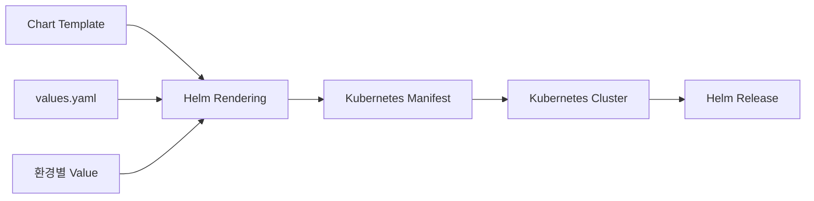

Helm을 사용하면 다음 작업을 수행할 수 있다.

- 여러 Kubernetes 객체를 하나의 Chart로 관리
- Template과 Value를 이용한 환경별 YAML 생성
- Chart 설치와 업그레이드
- 배포 Revision 이력 관리
- 이전 Revision을 기준으로 한 롤백
- Chart Dependency 관리
- Chart 패키징과 Registry 배포
- 공통 Template을 이용한 여러 애플리케이션 관리

Helm은 애플리케이션 소스 코드를 컴파일하거나 컨테이너 이미지를 빌드하는 도구는 아니다. Java 애플리케이션의 빌드와 컨테이너 이미지 생성은 Gradle, Maven, Jib, Docker와 같은 도구가 담당하고, Helm은 만들어진 이미지를 Kubernetes에 어떤 설정으로 배포할지 관리한다.

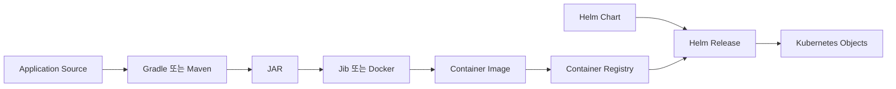

#### Helm과 kubectl의 관계

Helm을 사용한다고 해서 Kubernetes 객체나 `kubectl`에 대한 이해가 필요 없어지는 것은 아니다.

Helm Template의 최종 결과는 일반적인 Kubernetes YAML이다. Helm은 해당 YAML을 Kubernetes API Server에 적용하고 Release 상태를 관리한다.

| 구분 | kubectl | Helm |
|---|---|---|
| 주요 관리 단위 | 개별 Kubernetes 객체 | Chart와 Release |
| 설정 재사용 | 직접 파일을 분리하거나 Kustomize 사용 | Template과 Value 사용 |
| 환경별 설정 | YAML 복사 또는 Overlay | 환경별 Value 파일 |
| 배포 이력 | 객체별로 확인 | Release Revision으로 관리 |
| 롤백 | 객체 종류에 따라 직접 처리 | Release Revision 기준 롤백 |
| Dependency | 별도 관리 | Chart Dependency 지원 |
| 최종 처리 대상 | Kubernetes 객체 | Kubernetes 객체 |

Helm을 사용하더라도 최종적으로 어떤 Deployment와 Service가 생성되는지 이해해야 한다. Value만 변경하고 결과 YAML을 확인하지 않으면 잘못된 Selector, Service Port, Resource 설정이 그대로 배포될 수 있다.

#### Helm의 핵심 개념

Helm을 사용할 때는 Chart, Template, Value, Release, Revision을 명확하게 구분해야 한다.

##### Chart

Chart는 Kubernetes 애플리케이션을 배포하기 위한 패키지다.

Chart에는 다음 요소가 포함될 수 있다.

- Chart 메타데이터
- Kubernetes 객체 Template
- 기본 Value
- Chart Dependency
- 사용자 안내 문서
- Value 검증 스키마

##### Template

Template은 Kubernetes 객체를 생성하기 위한 원형이다.

일반적인 Kubernetes YAML에 Go Template 문법을 추가해 동적으로 값을 삽입하거나 조건에 따라 객체를 생성한다.

```yaml
spec:
  replicas: {{ .Values.replicaCount }}
```

##### Value

Value는 Template에 전달할 실제 설정값이다.

```yaml
replicaCount: 2
```

같은 Template에 개발용 Value와 운영용 Value를 다르게 전달하면 환경별 Kubernetes 객체를 생성할 수 있다.

##### Release

Release는 Chart를 Kubernetes 클러스터에 설치한 하나의 인스턴스다.

같은 Chart라도 Release 이름이나 Namespace가 다르면 서로 독립된 애플리케이션으로 설치할 수 있다.

```shell
helm install my-app-dev ./my-app -n dev
helm install my-app-prod ./my-app -n prod
```

##### Revision

하나의 Release를 설치하거나 업그레이드하거나 롤백할 때마다 Revision이 증가한다.

```text
Release: my-app-prod

Revision 1: 최초 설치
Revision 2: 이미지 Tag 변경
Revision 3: 레플리카 수 변경
Revision 4: Revision 2의 상태를 기준으로 롤백
```

업그레이드할 때마다 새로운 Release가 생기는 것이 아니라, 기존 Release에 새로운 Revision이 추가된다. 롤백도 과거 Revision을 그대로 다시 사용하는 것이 아니라 과거 설정을 기준으로 새로운 Revision을 생성한다.

#### Helm Chart 기본 구조

`helm create` 명령으로 기본 Chart를 생성할 수 있다.

```shell
helm create my-app
```

생성되는 기본 구조는 다음과 같다.

```text
my-app
├── Chart.yaml
├── values.yaml
├── charts
├── templates
│   ├── _helpers.tpl
│   ├── deployment.yaml
│   ├── hpa.yaml
│   ├── ingress.yaml
│   ├── service.yaml
│   ├── serviceaccount.yaml
│   ├── NOTES.txt
│   └── tests
└── .helmignore
```

실제 프로젝트에서는 필요하지 않은 Template을 제거하고 애플리케이션에 필요한 객체만 유지할 수 있다.

```text
my-app
├── Chart.yaml
├── values.yaml
├── values-dev.yaml
├── values-prod.yaml
├── templates
│   ├── _helpers.tpl
│   ├── deployment.yaml
│   ├── service.yaml
│   ├── configmap.yaml
│   └── ingress.yaml
└── .helmignore
```

#### Chart.yaml 작성

`Chart.yaml`은 Chart의 메타데이터를 정의하는 필수 파일이다.

```yaml
apiVersion: v2
name: my-app
description: Helm chart for my-app
type: application
version: 0.1.0
appVersion: "1.0.0"
```

##### apiVersion

Helm 3 Chart는 일반적으로 `apiVersion: v2`를 사용한다.

이 값은 Kubernetes 객체의 `apiVersion`이 아니라 Chart 형식의 API 버전이다.

##### name

Chart의 이름이다.

```yaml
name: my-app
```

Chart Repository나 OCI Registry에서 Chart를 식별할 때 사용한다.

##### description

Chart의 목적과 내용을 설명한다.

```yaml
description: Helm chart for my-app
```

Chart를 여러 프로젝트에서 공유한다면 검색과 관리에 도움이 되도록 구체적으로 작성하는 것이 좋다.

##### type

Chart 유형을 지정한다.

```yaml
type: application
```

일반적인 애플리케이션 배포 Chart는 `application`을 사용한다. 다른 Chart에서 공통 Template 함수만 제공하는 Chart는 `library` 유형을 사용할 수 있다.

##### version

Chart 자체의 버전이다.

```yaml
version: 0.1.0
```

Template, 기본 Value, Dependency와 같은 Chart 구성의 변경 버전을 의미한다. Chart를 패키징해 배포할 때 중요한 식별자로 사용된다.

##### appVersion

Chart가 배포하는 애플리케이션의 버전이다.

```yaml
appVersion: "1.0.0"
```

`version`과 `appVersion`은 서로 다른 값이다.

| 필드 | 의미 |
|---|---|
| `version` | Helm Chart의 버전 |
| `appVersion` | 배포할 애플리케이션의 버전 |

애플리케이션 이미지가 `1.1.0`으로 변경되었지만 Template 구조가 같더라도 Value 또는 `appVersion`이 변경될 수 있다. 반대로 Template만 변경했다면 Chart Version은 올라가지만 애플리케이션 버전은 그대로일 수 있다.

#### values.yaml 작성

`values.yaml`은 Chart의 기본 설정을 정의한다.

```yaml
replicaCount: 2

image:
  repository: docker.io/<dockerhub-username>/my-app
  pullPolicy: IfNotPresent
  tag: ""

nameOverride: ""
fullnameOverride: ""

service:
  type: ClusterIP
  port: 80
  targetPort: 8080

config:
  springProfilesActive: dev
  greetingMessage: Hello from Helm

existingSecret: my-app-secret

ingress:
  enabled: false
  className: nginx
  host: my-app.example.com
  path: /
  pathType: Prefix

resources:
  requests:
    cpu: 100m
    memory: 128Mi
  limits:
    cpu: 500m
    memory: 512Mi

probes:
  readiness:
    path: /actuator/health/readiness
    initialDelaySeconds: 10
    periodSeconds: 5
  liveness:
    path: /actuator/health/liveness
    initialDelaySeconds: 30
    periodSeconds: 10
```

Value에는 환경에 따라 변경될 가능성이 있는 값을 배치한다.

- 컨테이너 이미지
- 이미지 Tag
- 레플리카 수
- Service 유형과 Port
- Ingress 활성화 여부
- 애플리케이션 설정
- Resource Request와 Limit
- Probe 설정
- 기존 Secret 이름

반대로 `apiVersion`, `kind`, Label Key처럼 모든 환경에서 동일해야 하는 구조까지 Value로 분리하면 Chart 사용이 지나치게 복잡해질 수 있다.

#### 환경별 Value 파일 작성

개발과 운영 환경은 기본 Template을 공유하고 서로 다른 Value 파일을 사용할 수 있다.

`values-dev.yaml`은 다음과 같이 작성한다.

```yaml
replicaCount: 1

image:
  tag: "1.0.0-dev"

config:
  springProfilesActive: dev
  greetingMessage: Hello from development

ingress:
  enabled: false

resources:
  requests:
    cpu: 50m
    memory: 128Mi
  limits:
    cpu: 300m
    memory: 256Mi
```

`values-prod.yaml`은 다음과 같이 작성한다.

```yaml
replicaCount: 3

image:
  tag: "1.0.0"

config:
  springProfilesActive: prod
  greetingMessage: Hello from production

ingress:
  enabled: true
  className: nginx
  host: my-app.example.com
  path: /
  pathType: Prefix

resources:
  requests:
    cpu: 500m
    memory: 512Mi
  limits:
    cpu: "1"
    memory: 1Gi
```

환경별 차이는 Value 파일에 두고, Deployment와 Service의 공통 구조는 Template에서 관리한다.

#### Helm Value 적용 우선순위

동일한 Value가 여러 위치에서 지정되면 우선순위가 높은 값이 최종적으로 사용된다.

일반적인 우선순위는 다음과 같다.

```text
Chart의 values.yaml
< 앞쪽 -f 파일
< 뒤쪽 -f 파일
< --set 또는 --set-string
```

다음 명령에서는 `values-prod.yaml`이 기본 `values.yaml`을 덮어쓰고, `--set`이 다시 이미지 Tag를 덮어쓴다.

```shell
helm upgrade --install my-app-prod ./my-app \
  -n prod \
  -f values-prod.yaml \
  --set image.tag=1.0.1
```

자주 사용하는 환경 설정은 파일로 관리하고, 빌드 번호나 이미지 Tag처럼 배포 시점에 결정되는 값만 `--set`으로 전달하는 것이 관리하기 쉽다.

숫자처럼 보이는 문자열이나 앞에 0이 포함된 값은 `--set-string`을 사용하는 것이 안전하다.

```shell
helm upgrade --install my-app-prod ./my-app \
  -n prod \
  --set-string image.tag="001"
```

#### 공통 Template 함수 작성

`templates/_helpers.tpl`은 여러 Template에서 반복되는 이름과 Label을 함수로 정의하는 파일이다.

```gotemplate
{{- define "my-app.name" -}}
{{- default .Chart.Name .Values.nameOverride | trunc 63 | trimSuffix "-" }}
{{- end }}

{{- define "my-app.fullname" -}}
{{- if .Values.fullnameOverride }}
{{- .Values.fullnameOverride | trunc 63 | trimSuffix "-" }}
{{- else }}
{{- $name := default .Chart.Name .Values.nameOverride }}
{{- if contains $name .Release.Name }}
{{- .Release.Name | trunc 63 | trimSuffix "-" }}
{{- else }}
{{- printf "%s-%s" .Release.Name $name | trunc 63 | trimSuffix "-" }}
{{- end }}
{{- end }}
{{- end }}

{{- define "my-app.chart" -}}
{{- printf "%s-%s" .Chart.Name .Chart.Version | replace "+" "_" | trunc 63 | trimSuffix "-" }}
{{- end }}

{{- define "my-app.selectorLabels" -}}
app.kubernetes.io/name: {{ include "my-app.name" . }}
app.kubernetes.io/instance: {{ .Release.Name }}
{{- end }}

{{- define "my-app.labels" -}}
helm.sh/chart: {{ include "my-app.chart" . }}
{{ include "my-app.selectorLabels" . }}
app.kubernetes.io/version: {{ .Chart.AppVersion | quote }}
app.kubernetes.io/managed-by: {{ .Release.Service }}
{{- end }}
```

파일 이름이 `_`로 시작하면 Kubernetes 객체로 출력되지 않고 다른 Template에서 호출할 수 있는 Helper로 사용된다.

`include`는 정의된 Template 함수를 호출한다.

```gotemplate
{{ include "my-app.fullname" . }}
```

마지막의 `.`은 현재 Template Context를 함수에 전달한다는 의미다.

#### ConfigMap Template 작성

`templates/configmap.yaml`을 작성한다.

```yaml
apiVersion: v1
kind: ConfigMap
metadata:
  name: {{ include "my-app.fullname" . }}
  labels:
    {{- include "my-app.labels" . | nindent 4 }}
data:
  SPRING_PROFILES_ACTIVE: {{ .Values.config.springProfilesActive | quote }}
  GREETING_MESSAGE: {{ .Values.config.greetingMessage | quote }}
```

`.Values`는 Value 파일의 루트 객체다.

다음 표현식은 `values.yaml`의 `config.springProfilesActive` 값을 가져온다.

```gotemplate
{{ .Values.config.springProfilesActive }}
```

문자열은 YAML 파싱 문제를 줄이기 위해 `quote` 함수를 적용하는 것이 좋다.

```gotemplate
{{ .Values.config.springProfilesActive | quote }}
```

`nindent 4`는 생성된 내용을 줄바꿈한 뒤 네 칸 들여쓰기한다. Helm Template에서는 들여쓰기가 잘못되면 최종 YAML이 유효하지 않으므로 `indent`와 `nindent`를 적절히 사용해야 한다.

#### Deployment Template 작성

`templates/deployment.yaml`을 작성한다.

```yaml
apiVersion: apps/v1
kind: Deployment
metadata:
  name: {{ include "my-app.fullname" . }}
  labels:
    {{- include "my-app.labels" . | nindent 4 }}
spec:
  replicas: {{ .Values.replicaCount }}
  selector:
    matchLabels:
      {{- include "my-app.selectorLabels" . | nindent 6 }}
  template:
    metadata:
      annotations:
        checksum/config: {{ include (print $.Template.BasePath "/configmap.yaml") . | sha256sum }}
      labels:
        {{- include "my-app.selectorLabels" . | nindent 8 }}
    spec:
      containers:
        - name: {{ .Chart.Name }}
          image: "{{ .Values.image.repository }}:{{ .Values.image.tag | default .Chart.AppVersion }}"
          imagePullPolicy: {{ .Values.image.pullPolicy }}
          ports:
            - name: http
              containerPort: {{ .Values.service.targetPort }}
              protocol: TCP
          env:
            - name: SPRING_PROFILES_ACTIVE
              valueFrom:
                configMapKeyRef:
                  name: {{ include "my-app.fullname" . }}
                  key: SPRING_PROFILES_ACTIVE
            - name: GREETING_MESSAGE
              valueFrom:
                configMapKeyRef:
                  name: {{ include "my-app.fullname" . }}
                  key: GREETING_MESSAGE
            - name: DB_PASSWORD
              valueFrom:
                secretKeyRef:
                  name: {{ required "existingSecret must be set" .Values.existingSecret }}
                  key: DB_PASSWORD
          readinessProbe:
            httpGet:
              path: {{ .Values.probes.readiness.path }}
              port: http
            initialDelaySeconds: {{ .Values.probes.readiness.initialDelaySeconds }}
            periodSeconds: {{ .Values.probes.readiness.periodSeconds }}
          livenessProbe:
            httpGet:
              path: {{ .Values.probes.liveness.path }}
              port: http
            initialDelaySeconds: {{ .Values.probes.liveness.initialDelaySeconds }}
            periodSeconds: {{ .Values.probes.liveness.periodSeconds }}
          resources:
            {{- toYaml .Values.resources | nindent 12 }}
```

##### replicas

```gotemplate
replicas: {{ .Values.replicaCount }}
```

환경별 Value에 따라 Deployment의 레플리카 수가 결정된다.

##### image

```gotemplate
image: "{{ .Values.image.repository }}:{{ .Values.image.tag | default .Chart.AppVersion }}"
```

`image.tag`가 지정되어 있으면 해당 값을 사용하고, 비어 있으면 `Chart.yaml`의 `appVersion`을 사용한다.

##### checksum annotation

```gotemplate
checksum/config: {{ include (print $.Template.BasePath "/configmap.yaml") . | sha256sum }}
```

ConfigMap 내용의 Hash를 Pod Template Annotation에 기록한다.

ConfigMap만 변경하면 Deployment의 Pod Template은 기본적으로 바뀌지 않으므로 기존 Pod가 자동으로 재생성되지 않을 수 있다. ConfigMap 내용이 변경될 때 Checksum도 바뀌게 하면 Deployment Rolling Update가 발생한다.

##### required

```gotemplate
{{ required "existingSecret must be set" .Values.existingSecret }}
```

`existingSecret` 값이 없으면 Template 생성을 실패시킨다. 필수 설정이 빠진 상태로 배포되는 것을 방지할 수 있다.

##### toYaml

```gotemplate
{{- toYaml .Values.resources | nindent 12 }}
```

Map 형태의 Value를 YAML로 변환하고 현재 위치에 맞춰 들여쓰기한다.

#### Secret 처리

비밀번호, Token, 인증서와 같은 민감 정보는 `values.yaml`에 평문으로 저장하지 않는 것이 좋다.

이번 Chart는 Secret을 직접 생성하지 않고 기존 Secret의 이름만 전달받는다.

```yaml
existingSecret: my-app-secret
```

Secret은 배포 전에 별도로 생성할 수 있다.

```shell
kubectl create secret generic my-app-secret \
  -n dev \
  --from-literal=DB_PASSWORD='<password>'
```

운영 환경에서는 다음과 같은 외부 Secret 관리 체계를 검토할 수 있다.

- External Secrets Operator
- Sealed Secrets
- Vault
- 클라우드 Secret Manager
- GitOps 도구의 암호화 기능

Helm 명령의 `--set`으로 민감 정보를 전달하면 Shell History, 프로세스 목록, CI 로그, Release 메타데이터에 값이 남을 수 있으므로 주의해야 한다.

#### Service Template 작성

`templates/service.yaml`을 작성한다.

```yaml
apiVersion: v1
kind: Service
metadata:
  name: {{ include "my-app.fullname" . }}
  labels:
    {{- include "my-app.labels" . | nindent 4 }}
spec:
  type: {{ .Values.service.type }}
  selector:
    {{- include "my-app.selectorLabels" . | nindent 4 }}
  ports:
    - name: http
      port: {{ .Values.service.port }}
      targetPort: http
      protocol: TCP
```

Template과 Value를 결합하면 다음과 같은 일반 Kubernetes Service YAML이 만들어진다.

```yaml
apiVersion: v1
kind: Service
metadata:
  name: my-app-dev-my-app
spec:
  type: ClusterIP
  selector:
    app.kubernetes.io/name: my-app
    app.kubernetes.io/instance: my-app-dev
  ports:
    - name: http
      port: 80
      targetPort: http
      protocol: TCP
```

Service의 Selector와 Deployment Pod Label이 정확하게 일치해야 한다. Helm이 YAML을 생성해 주더라도 객체 간 연결이 올바른지 자동으로 보장하는 것은 아니다.

#### 조건부 Ingress Template 작성

환경에 따라 Ingress가 필요하지 않을 수 있다. `if` 문을 사용하면 Value에 따라 객체 생성 여부를 결정할 수 있다.

`templates/ingress.yaml`을 작성한다.

```yaml
{{- if .Values.ingress.enabled }}
apiVersion: networking.k8s.io/v1
kind: Ingress
metadata:
  name: {{ include "my-app.fullname" . }}
  labels:
    {{- include "my-app.labels" . | nindent 4 }}
spec:
  ingressClassName: {{ .Values.ingress.className }}
  rules:
    - host: {{ .Values.ingress.host | quote }}
      http:
        paths:
          - path: {{ .Values.ingress.path }}
            pathType: {{ .Values.ingress.pathType }}
            backend:
              service:
                name: {{ include "my-app.fullname" . }}
                port:
                  number: {{ .Values.service.port }}
{{- end }}
```

개발 환경에서는 다음 설정으로 Ingress를 생성하지 않는다.

```yaml
ingress:
  enabled: false
```

운영 환경에서는 다음 설정으로 Ingress를 생성한다.

```yaml
ingress:
  enabled: true
```

Helm의 조건문은 다음 형식을 사용한다.

```gotemplate
{{- if 조건 }}
...
{{- end }}
```

`{{-`와 `-}}`의 하이픈은 Template 주변의 불필요한 공백과 줄바꿈을 제거한다.

#### range를 이용한 반복 처리

여러 환경 변수를 반복해서 생성하려면 `range`를 사용할 수 있다.

`values.yaml`에 다음 값을 추가한다고 가정한다.

```yaml
extraEnv:
  - name: JAVA_TOOL_OPTIONS
    value: "-XX:MaxRAMPercentage=75.0"
  - name: TZ
    value: Asia/Seoul
```

Deployment Template에서는 다음과 같이 반복할 수 있다.

```yaml
env:
  {{- range .Values.extraEnv }}
  - name: {{ .name }}
    value: {{ .value | quote }}
  {{- end }}
```

Template 결과는 다음과 같다.

```yaml
env:
  - name: JAVA_TOOL_OPTIONS
    value: "-XX:MaxRAMPercentage=75.0"
  - name: TZ
    value: "Asia/Seoul"
```

조건문과 반복문을 사용하면 여러 애플리케이션이 공통 Chart를 사용할 수 있다. 다만 조건문이 지나치게 많아지면 Chart를 이해하고 테스트하기 어려워질 수 있으므로 공통화 범위를 신중하게 결정해야 한다.

#### Chart Template 검증

Chart를 클러스터에 설치하기 전에 문법과 렌더링 결과를 확인해야 한다.

##### helm lint

Chart 구조와 기본적인 문법을 검사한다.

```shell
helm lint ./my-app
```

정상적인 경우 다음과 유사한 결과가 출력된다.

```text
1 chart(s) linted, 0 chart(s) failed
```

환경별 Value도 함께 검사한다.

```shell
helm lint ./my-app -f ./my-app/values-dev.yaml
helm lint ./my-app -f ./my-app/values-prod.yaml
```

##### helm template

Template과 Value를 결합한 최종 Kubernetes YAML을 출력한다.

```shell
helm template my-app-dev ./my-app \
  -n dev \
  -f ./my-app/values-dev.yaml
```

파일로 저장하지 않고 화면에서 확인할 수 있으며, 이 명령만으로는 클러스터에 객체가 생성되지 않는다.

특정 Template만 확인할 수도 있다.

```shell
helm template my-app-dev ./my-app \
  -n dev \
  -f ./my-app/values-dev.yaml \
  --show-only templates/service.yaml
```

##### Kubernetes API 검증

렌더링한 YAML을 API Server의 Dry Run으로 검증할 수 있다.

먼저 Namespace를 생성한다.

```shell
kubectl create namespace dev
```

렌더링 결과를 API Server에 전달한다.

```shell
helm template my-app-dev ./my-app \
  -n dev \
  -f ./my-app/values-dev.yaml \
  | kubectl apply --dry-run=server -f -
```

`helm lint`는 Chart와 Template 수준의 검사를 수행하고, `kubectl apply --dry-run=server`는 현재 클러스터의 API와 Admission 정책을 기준으로 검사한다.

둘 중 하나만 실행하기보다 두 단계를 함께 사용하는 것이 안전하다.

#### Helm Dry Run

실제 설치 과정에 가까운 결과를 확인하려면 `--dry-run`을 사용할 수 있다.

```shell
helm install my-app-dev ./my-app \
  -n dev \
  -f ./my-app/values-dev.yaml \
  --dry-run \
  --debug
```

이 명령은 적용될 Value와 생성되는 Manifest를 출력하지만 실제 Release를 설치하지 않는다.

`helm template`은 렌더링 결과 확인에 적합하고, `helm install --dry-run --debug`는 설치 Context와 Release 정보를 포함한 검증에 적합하다.

#### Chart 설치

검증이 끝났다면 Chart를 설치한다.

```shell
helm install my-app-dev ./my-app \
  -n dev \
  -f ./my-app/values-dev.yaml
```

Namespace까지 함께 생성하려면 다음 옵션을 사용할 수 있다.

```shell
helm install my-app-dev ./my-app \
  -n dev \
  --create-namespace \
  -f ./my-app/values-dev.yaml
```

명령 구성은 다음과 같다.

```text
helm install <Release 이름> <Chart 경로>
```

`my-app-dev`는 Release 이름이고 `./my-app`은 Chart 경로다.

#### 설치 결과 확인

Release 목록을 확인한다.

```shell
helm list -n dev
```

Release 상태를 확인한다.

```shell
helm status my-app-dev -n dev
```

Release에 적용된 Value를 확인한다.

```shell
helm get values my-app-dev -n dev
```

기본값을 포함한 전체 계산 결과를 확인하려면 `--all`을 사용한다.

```shell
helm get values my-app-dev -n dev --all
```

Release가 생성한 Manifest를 확인한다.

```shell
helm get manifest my-app-dev -n dev
```

실제 Kubernetes 객체를 확인한다.

```shell
kubectl get deployment,service,configmap,pods \
  -n dev
```

Pod와 Service 연결 상태를 확인한다.

```shell
kubectl get endpointslice \
  -n dev \
  -l kubernetes.io/service-name=my-app-dev-my-app
```

Service에 연결된 Endpoint가 없다면 Deployment의 Pod Label과 Service Selector가 일치하는지 확인해야 한다.

#### Chart 업그레이드

이미 설치된 Release의 이미지 Tag와 레플리카 수를 변경할 수 있다.

```shell
helm upgrade my-app-dev ./my-app \
  -n dev \
  -f ./my-app/values-dev.yaml \
  --set image.tag=1.0.1 \
  --set replicaCount=2
```

설치 여부와 상관없이 같은 명령을 사용하려면 `--install`을 추가한다.

```shell
helm upgrade --install my-app-dev ./my-app \
  -n dev \
  --create-namespace \
  -f ./my-app/values-dev.yaml \
  --set image.tag=1.0.1 \
  --wait \
  --timeout 5m
```

`--wait`는 주요 Kubernetes 객체가 준비 상태가 될 때까지 기다린다.

`--timeout`은 대기 시간을 제한한다.

배포 실패 시 이전 상태로 자동 복구하려면 `--atomic`을 사용할 수 있다.

```shell
helm upgrade --install my-app-dev ./my-app \
  -n dev \
  -f ./my-app/values-dev.yaml \
  --set image.tag=1.0.1 \
  --atomic \
  --timeout 5m
```

`--atomic`은 배포 성공 여부를 명확하게 판단해야 하는 CI/CD Pipeline에서 유용하다. 하지만 애플리케이션이 정상적으로 준비 상태가 되도록 Readiness Probe가 정확하게 구성되어 있어야 한다.

#### Release 이력 확인

Release의 Revision 이력을 확인한다.

```shell
helm history my-app-dev -n dev
```

예상 결과는 다음과 같다.

```text
REVISION  STATUS      CHART         APP VERSION  DESCRIPTION
1         superseded  my-app-0.1.0  1.0.0        Install complete
2         deployed    my-app-0.1.0  1.0.0        Upgrade complete
```

현재 적용된 Revision은 `deployed`, 이전 Revision은 `superseded` 상태로 표시될 수 있다.

Helm의 Revision은 Deployment만이 아니라 Release가 관리하는 Service, ConfigMap, Ingress 등의 Manifest를 하나의 변경 단위로 기록한다.

#### Release 롤백

Revision 1을 기준으로 롤백하려면 다음 명령을 실행한다.

```shell
helm rollback my-app-dev 1 \
  -n dev \
  --wait \
  --timeout 5m
```

롤백 후 이력을 다시 확인한다.

```shell
helm history my-app-dev -n dev
```

Revision 1이 현재 Revision으로 되돌아가는 것이 아니라, Revision 1의 설정을 기준으로 새로운 Revision이 생성된다.

```text
Revision 1: 최초 설치
Revision 2: 업그레이드
Revision 3: Revision 1 기준 롤백
```

롤백은 Kubernetes 외부 상태까지 되돌리지 않는다.

다음 항목은 별도의 복구 전략이 필요하다.

- 데이터베이스 Schema
- 외부 메시지 큐의 데이터
- PersistentVolume의 데이터
- 외부 API에 반영된 상태
- Job과 Batch 처리 결과

Helm 롤백은 Kubernetes 객체 Manifest의 복구 수단이지 애플리케이션 데이터 전체를 복구하는 기능은 아니다.

#### Release 삭제

Release를 삭제한다.

```shell
helm uninstall my-app-dev -n dev
```

Helm이 관리하던 Kubernetes 객체와 Release 기록이 삭제된다.

다음과 같은 객체는 Chart 구성과 Annotation 또는 Lifecycle에 따라 남을 수 있으므로 별도로 확인해야 한다.

- PersistentVolume
- 일부 PersistentVolumeClaim
- Helm Hook으로 생성한 객체
- 보존 정책이 적용된 객체
- Chart의 `crds` 디렉터리로 설치한 CRD
- 애플리케이션 외부에서 미리 생성한 Secret

삭제 후 Namespace를 확인한다.

```shell
kubectl get all -n dev
kubectl get configmap,secret,pvc -n dev
```

#### Chart Dependency와 Subchart

복잡한 시스템은 다른 Chart를 Dependency로 포함할 수 있다.

예를 들어 애플리케이션 Chart가 Redis Chart를 Dependency로 사용한다고 가정한다.

`Chart.yaml`에 Dependency를 정의한다.

```yaml
apiVersion: v2
name: my-app
description: Helm chart for my-app
type: application
version: 0.2.0
appVersion: "1.0.0"

dependencies:
  - name: redis
    version: 20.6.0
    repository: https://charts.bitnami.com/bitnami
    condition: redis.enabled
```

`values.yaml`에서 활성화 여부와 Subchart Value를 지정한다.

```yaml
redis:
  enabled: true
  architecture: standalone
```

Dependency를 내려받는다.

```shell
helm dependency update ./my-app
```

Dependency Chart는 `charts` 디렉터리에 저장되고, 해결된 버전 정보는 `Chart.lock`에 기록된다.

Subchart가 Parent Chart의 모든 Value를 자동으로 상속하는 것은 아니다. Parent Chart는 일반적으로 Subchart 이름 아래에 값을 정의해 해당 Subchart의 Value를 덮어쓴다.

```yaml
redis:
  architecture: standalone
```

여러 Chart가 공통으로 사용할 값은 `global` 영역을 사용할 수 있다.

```yaml
global:
  environment: prod
  imageRegistry: registry.example.com
```

Dependency를 애플리케이션마다 함께 설치하는 것이 항상 좋은 것은 아니다. 운영 데이터 저장소처럼 수명 주기와 관리 주체가 다른 시스템은 애플리케이션 Release와 분리하는 편이 안전할 수 있다.

#### Chart 패키징

작성한 Chart를 압축 패키지로 만들 수 있다.

```shell
helm package ./my-app
```

다음과 같은 파일이 생성된다.

```text
my-app-0.2.0.tgz
```

파일 이름의 버전은 `Chart.yaml`의 `version`을 기준으로 한다.

패키징 전에 Dependency와 문법을 검증한다.

```shell
helm dependency update ./my-app
helm lint ./my-app
helm package ./my-app
```

패키징한 Chart도 직접 설치할 수 있다.

```shell
helm install my-app-dev ./my-app-0.2.0.tgz \
  -n dev \
  --create-namespace \
  -f ./my-app/values-dev.yaml
```

Chart Package는 일반 HTTP Chart Repository나 OCI를 지원하는 Container Registry에 배포할 수 있다.

#### 공통 Chart 운영

애플리케이션마다 Chart를 완전히 별도로 작성하면 초기에는 단순하지만, 공통 정책을 변경할 때 모든 Chart를 수정해야 한다.

예를 들어 다음 항목을 모든 애플리케이션에 적용해야 할 수 있다.

- 공통 Label
- Resource Request와 Limit
- Readiness Probe와 Liveness Probe
- Pod SecurityContext
- ServiceAccount
- PodDisruptionBudget
- Topology Spread Constraint
- Monitoring Annotation
- ConfigMap 변경 시 Rolling Update
- 공통 Ingress 정책

이런 경우 조직 공통 Chart나 Library Chart를 만들고 각 애플리케이션이 동일한 구조를 재사용할 수 있다.

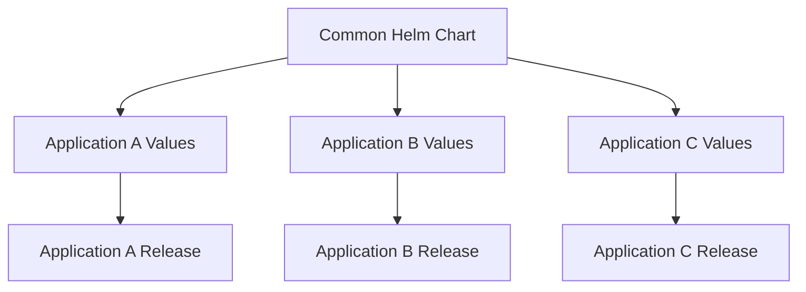

공통 Chart는 배포 표준을 일관되게 적용할 수 있다는 장점이 있다. 반면 서로 다른 요구사항을 하나의 Chart에 모두 넣으려고 하면 조건문과 Value가 지나치게 많아질 수 있다.

다음과 같은 기준으로 공통화 범위를 결정하는 것이 좋다.

- 대부분의 애플리케이션이 같은 객체 구조를 사용하는가
- 예외 조건보다 공통 조건이 많은가
- 공통 Chart 변경의 영향 범위를 테스트할 수 있는가
- Chart Version을 애플리케이션별로 독립적으로 선택할 수 있는가
- 공통 기능이 실제 배포 정책에 해당하는가

#### Helm 사용 시 발생하기 쉬운 문제

##### Template 렌더링 오류

다음과 같은 오류가 발생할 수 있다.

```text
parse error
unexpected EOF
nil pointer evaluating interface
```

주요 원인은 다음과 같다.

- `if`, `range`, `with`의 `end` 누락
- 존재하지 않는 Value 경로 참조
- 잘못된 들여쓰기
- 문자열 Quote 누락
- Template Context 변경 후 잘못된 `.` 사용

다음 명령으로 렌더링 결과를 확인한다.

```shell
helm lint ./my-app
helm template my-app-dev ./my-app \
  -n dev \
  -f ./my-app/values-dev.yaml \
  --debug
```

##### YAML은 생성되지만 객체 생성에 실패하는 경우

Helm Template 문법은 맞지만 Kubernetes API 규격에 맞지 않을 수 있다.

```text
no matches for kind
unknown field
field is immutable
```

가능한 원인은 다음과 같다.

- 잘못된 Kubernetes API 버전
- 클러스터에 없는 CRD 사용
- 변경할 수 없는 Immutable 필드 수정
- Admission Policy 위반
- 잘못된 Resource 형식

렌더링 결과를 API Server에서 검증한다.

```shell
helm template my-app-dev ./my-app \
  -n dev \
  -f ./my-app/values-dev.yaml \
  | kubectl apply --dry-run=server -f -
```

##### 수동 변경으로 Drift가 발생한 경우

Helm으로 설치한 객체를 `kubectl edit`로 직접 변경하면 Chart와 실제 클러스터 상태가 달라질 수 있다.

다음 Helm Upgrade에서 수동 변경이 덮어써지거나 예상하지 못한 결과가 발생할 수 있다.

Helm으로 관리하는 객체는 다음 경로에서 변경하는 것이 좋다.

```text
Template 수정
또는
Value 수정
-> 검증
-> Helm Upgrade
```

긴급한 수동 변경을 수행했다면 해당 내용을 Chart나 Value에 반영해 선언 상태와 실제 상태를 다시 일치시켜야 한다.

##### Value 유형이 잘못된 경우

다음 값은 Boolean이다.

```yaml
ingress:
  enabled: false
```

명령에서 문자열로 전달하면 Template 조건이 의도와 다르게 동작할 수 있다.

```shell
--set-string ingress.enabled="false"
```

Boolean은 다음과 같이 전달해야 한다.

```shell
--set ingress.enabled=false
```

Value의 필드와 타입을 엄격하게 검증하려면 `values.schema.json`을 추가할 수 있다.

##### Release 이름과 Namespace가 다른 경우

Helm Release는 이름뿐 아니라 Namespace 범위로 관리된다.

```shell
helm list -n dev
helm list -n prod
```

`dev` Namespace의 `my-app`과 `prod` Namespace의 `my-app`은 서로 다른 Release다.

명령에서 Namespace를 생략하면 Release를 찾지 못하거나 다른 환경을 대상으로 작업할 수 있으므로 운영 명령에는 `-n`을 명시하는 것이 안전하다.

#### CI/CD Pipeline에서의 Helm

Helm은 Jenkins, GitLab CI, Argo CD 같은 배포 체계와 함께 사용할 수 있다.

일반적인 Pipeline 흐름은 다음과 같다.

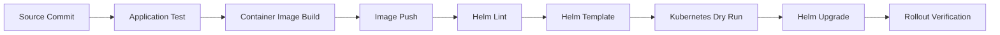

배포 명령은 다음과 같이 구성할 수 있다.

```shell
helm upgrade --install my-app-prod ./my-app \
  -n prod \
  --create-namespace \
  -f ./my-app/values-prod.yaml \
  --set image.tag="${IMAGE_TAG}" \
  --atomic \
  --timeout 10m
```

Pipeline에서 동적으로 변경되는 값은 최소화하는 것이 좋다. 이미지 Tag처럼 배포 결과를 식별하는 값은 전달할 수 있지만, 운영 설정 전체를 여러 `--set` 옵션으로 구성하면 어떤 값으로 배포했는지 추적하기 어려워진다.

환경 설정은 Version Control에서 관리되는 Value 파일에 두고, 민감 정보는 별도 Secret 관리 시스템에서 제공하는 구조가 적합하다.

#### Helm과 애플리케이션 설정 외부화

Helm의 Value와 Template 구조는 애플리케이션 설정을 빌드 결과물과 분리하는 데 유용하다.

동일한 컨테이너 이미지를 여러 환경에서 사용하면서 Value만 다르게 전달할 수 있다.

```text
Container Image: my-app:1.0.0

Development Release:
  replicaCount: 1
  profile: dev
  ingress.enabled: false

Production Release:
  replicaCount: 3
  profile: prod
  ingress.enabled: true
```

개발과 운영마다 다른 이미지를 다시 빌드하기보다 하나의 이미지에 환경별 ConfigMap, Secret, Resource, Ingress 설정을 결합하는 방식이 배포 결과를 더 명확하게 관리할 수 있다.

#### 실무 관점에서 확인할 핵심 포인트

Helm Chart를 운영에 적용하기 전에 다음 내용을 확인해야 한다.

- `Chart.yaml`의 Chart Version과 App Version을 구분했는가
- 환경별 차이를 Value 파일로 분리했는가
- Secret 값을 평문 Value에 저장하지 않았는가
- Service Selector와 Pod Label이 일치하는가
- ConfigMap 변경 시 Pod 재시작 전략이 있는가
- Request와 Limit이 설정되어 있는가
- Probe가 실제 애플리케이션 상태를 확인하는가
- `helm lint`와 `helm template` 검증을 수행했는가
- API Server의 Dry Run을 통과했는가
- `--wait`, `--atomic`, `--timeout` 정책을 결정했는가
- Chart Upgrade와 데이터베이스 변경 순서를 검토했는가
- 롤백으로 복구되지 않는 외부 상태를 파악했는가
- Helm으로 관리하는 객체를 수동으로 변경하지 않는가
- Release 이름과 Namespace를 명령에 명시했는가

### 정리

Helm은 Kubernetes 애플리케이션을 구성하는 Deployment, Service, ConfigMap, Ingress 등의 객체를 하나의 Chart로 패키징하고 관리하는 도구다.

Chart는 `Chart.yaml`, `values.yaml`, `templates`, `charts` 등의 요소로 구성된다. Template은 Kubernetes 객체의 구조를 정의하고, Value는 환경에 따라 달라지는 실제 값을 제공한다. 두 요소를 결합하면 최종 Kubernetes Manifest가 생성된다.

Chart를 클러스터에 설치하면 Release가 만들어진다. 하나의 Release를 업그레이드하거나 롤백할 때마다 새로운 Revision이 생성되며, Helm은 연관된 여러 Kubernetes 객체의 변경 이력을 하나의 배포 단위로 관리한다.

Helm은 컨테이너 이미지를 빌드하는 도구가 아니며 Kubernetes 객체를 대신하는 기술도 아니다. 최종 결과는 일반적인 Kubernetes 객체이므로 Deployment, Service, ConfigMap, Secret, Ingress의 동작 원리를 이해한 상태에서 사용해야 한다.

안전한 배포를 위해서는 `helm lint`, `helm template`, Kubernetes API Dry Run으로 결과를 검증하고, 환경별 Value 파일과 Secret 관리 체계를 분리해야 한다. Helm으로 관리되는 객체는 Template과 Value를 통해 변경하여 Chart의 선언 상태와 실제 클러스터 상태가 어긋나지 않도록 관리하는 것이 중요하다.

## 02. Jenkins를 이용한 Kubernetes 빌드와 배포

Jenkins는 소스 코드 빌드, 테스트, 패키징, 배포와 같은 반복 작업을 자동화하는 CI/CD 도구다. 다양한 플러그인과 Pipeline 스크립트를 지원하기 때문에 기존 프로젝트에서 오랫동안 사용되어 왔으며, Kubernetes 환경에서도 충분히 활용할 수 있다.

다만 기존 서버에 JAR 파일을 복사하던 배포 방식과 달리 Kubernetes에서는 다음 과정이 추가된다.

1. 소스 코드를 JAR 파일로 빌드한다.
2. JAR 파일을 포함하는 컨테이너 이미지를 생성한다.
3. 이미지를 원격 Container Registry에 푸시한다.
4. Deployment가 새 이미지를 사용하도록 변경한다.
5. Kubernetes가 새로운 Pod를 생성하고 기존 Pod를 교체한다.

```mermaid
flowchart LR
    A["Git 저장소"] --> B["Jenkins Pipeline"]
    B --> C["Gradle 또는 Maven 빌드"]
    C --> D["컨테이너 이미지 생성"]
    D --> E["Container Registry Push"]
    E --> F["Helm Upgrade"]
    F --> G["Kubernetes API Server"]
    G --> H["Deployment 변경"]
    H --> I["새로운 ReplicaSet 생성"]
    I --> J["새로운 Pod 실행"]
```

#### Jenkins, Helm, Kubernetes의 역할

Jenkins가 전체 작업을 실행하더라도 실제 빌드와 배포는 여러 도구가 역할을 나누어 수행한다.

| 구성 요소 | 역할 |
|---|---|
| Git 저장소 | 애플리케이션 코드와 배포 설정을 관리한다. |
| Jenkins | 빌드, 테스트, 이미지 푸시, 배포 명령을 순서대로 실행한다. |
| Gradle 또는 Maven | Java 소스 코드를 컴파일하고 테스트한 뒤 JAR 파일을 만든다. |
| Docker 또는 Jib | 애플리케이션을 컨테이너 이미지로 만든다. |
| Container Registry | 빌드된 이미지를 저장하고 Kubernetes Node에 제공한다. |
| Helm | 여러 Kubernetes 객체와 설정값을 하나의 Release로 관리한다. |
| Kubernetes | 선언된 Deployment 상태에 맞게 Pod를 생성하고 교체한다. |

Jenkins는 자동화 서버이며, Helm은 Kubernetes 패키지 및 Release 관리 도구다. Helm 자체가 지속적 배포 시스템은 아니지만 Jenkins Pipeline에서 `helm upgrade`를 실행하면 애플리케이션 이미지와 Kubernetes 객체 변경을 하나의 배포 단위로 관리할 수 있다.

#### Kubernetes 배포 과정에서 추가되는 작업

일반적인 Spring Boot 애플리케이션의 빌드는 다음 명령으로 수행할 수 있다.

```bash
./gradlew clean test bootJar
```

이 명령은 소스 코드를 컴파일하고 테스트한 뒤 실행 가능한 JAR 파일을 생성한다. Kubernetes에 배포하려면 여기서 끝나는 것이 아니라 컨테이너 이미지 생성과 Registry 푸시가 추가로 필요하다.

```bash
docker build -t registry.example.com/team/my-app:1.0.1 .
docker push registry.example.com/team/my-app:1.0.1
```

마지막으로 Deployment가 새 이미지 태그를 사용하도록 변경해야 한다.

```bash
kubectl set image deployment/my-app \
  my-app=registry.example.com/team/my-app:1.0.1 \
  --namespace my-app-prod
```

`kubectl set image`는 Deployment의 Pod Template에 선언된 컨테이너 이미지를 변경한다. Pod Template이 변경되면 Deployment Controller가 새로운 ReplicaSet을 생성하고 Rolling Update를 시작한다.

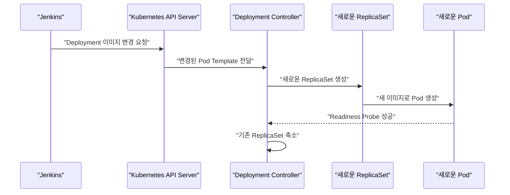

이 방식은 이미지 하나만 빠르게 교체할 때는 간단하다. 하지만 Service, ConfigMap, Ingress, 리소스 설정, Probe와 같은 여러 스펙을 함께 변경해야 한다면 관리가 복잡해진다.

#### 직접 배포 명령만 사용할 때의 한계

Jenkins Pipeline에서 `kubectl set image`나 `kubectl apply`를 직접 실행할 수도 있지만 규모가 커질수록 다음 문제가 나타난다.

- 어떤 이미지와 Kubernetes 설정이 함께 배포되었는지 추적하기 어렵다.
- Deployment 외에 Service, ConfigMap, Ingress 변경을 하나의 버전으로 관리하기 어렵다.
- 배포 실패 시 여러 객체를 이전 상태로 되돌리기 어렵다.
- Jenkins 스크립트에 배포 로직이 과도하게 집중된다.
- 환경별 설정 차이가 여러 명령어와 파일에 흩어질 수 있다.

배포 방법에 따른 차이는 다음과 같다.

| 배포 방식 | 장점 | 한계 |
|---|---|---|
| `kubectl set image` | 이미지 교체가 단순하고 빠르다. | Deployment 이미지 외의 변경을 관리하기 어렵다. |
| `kubectl apply` | 선언형 YAML을 그대로 적용할 수 있다. | 여러 객체의 버전과 롤백을 별도로 관리해야 한다. |
| `helm upgrade` | 객체와 설정을 Release 단위로 관리한다. | Chart 설계와 값 관리가 필요하다. |
| GitOps | Git의 선언 상태를 기준으로 지속적으로 동기화한다. | 별도의 GitOps 운영 체계가 필요하다. |

#### Helm을 이용한 배포 관리

Helm Chart에서는 환경별로 변경되는 값을 `values.yaml`로 분리할 수 있다.

```yaml
replicaCount: 2

image:
  repository: registry.example.com/team/my-app
  tag: "dev"
  pullPolicy: IfNotPresent

service:
  type: ClusterIP
  port: 8080

resources:
  requests:
    cpu: 200m
    memory: 256Mi
  limits:
    cpu: 500m
    memory: 512Mi
```

Deployment 템플릿에서는 이 값을 사용해 컨테이너 이미지를 구성한다.

```yaml
apiVersion: apps/v1
kind: Deployment
metadata:
  name: {{ include "my-app.fullname" . }}
  labels:
    {{- include "my-app.labels" . | nindent 4 }}
spec:
  replicas: {{ .Values.replicaCount }}
  selector:
    matchLabels:
      {{- include "my-app.selectorLabels" . | nindent 6 }}
  template:
    metadata:
      labels:
        {{- include "my-app.selectorLabels" . | nindent 8 }}
    spec:
      containers:
        - name: my-app
          image: "{{ .Values.image.repository }}:{{ .Values.image.tag }}"
          imagePullPolicy: {{ .Values.image.pullPolicy }}
          ports:
            - name: http
              containerPort: 8080
          readinessProbe:
            httpGet:
              path: /actuator/health/readiness
              port: http
            initialDelaySeconds: 10
            periodSeconds: 5
          livenessProbe:
            httpGet:
              path: /actuator/health/liveness
              port: http
            initialDelaySeconds: 30
            periodSeconds: 10
          resources:
            {{- toYaml .Values.resources | nindent 12 }}
```

주요 필드는 다음과 같은 의미를 가진다.

- `replicas`는 유지할 Pod 개수를 지정한다.
- `selector`는 Deployment가 관리할 Pod를 식별한다.
- `template`은 새로 생성할 Pod의 명세다.
- `image`는 실행할 컨테이너 이미지와 태그를 지정한다.
- `readinessProbe`는 Pod가 트래픽을 받을 준비가 되었는지 판단한다.
- `livenessProbe`는 컨테이너를 재시작해야 할 정도로 애플리케이션이 비정상인지 판단한다.
- `resources.requests`는 스케줄링에 필요한 최소 자원 기준이다.
- `resources.limits`는 컨테이너가 사용할 수 있는 자원의 상한이다.

Jenkins에서는 이미지 태그만 덮어써서 배포할 수 있다.

```bash
helm upgrade --install my-app ./deploy/helm/my-app \
  --namespace my-app-prod \
  --set-string image.repository=registry.example.com/team/my-app \
  --set-string image.tag=8f12ac419de3-104 \
  --atomic \
  --wait \
  --timeout 10m
```

`--install`은 Release가 없으면 새로 설치하고, 있으면 업그레이드한다. `--set-string`은 숫자처럼 보이는 이미지 태그가 다른 YAML 타입으로 해석되는 것을 방지한다.

`--wait`는 Deployment와 Pod가 준비될 때까지 기다리며, `--atomic`은 배포가 제한 시간 안에 성공하지 못하면 업그레이드를 실패 처리하고 이전 Release로 되돌린다.

#### 변경되지 않는 이미지 태그 사용

Kubernetes 배포에서 가장 중요한 원칙 중 하나는 한 번 사용한 이미지 태그의 내용을 다시 덮어쓰지 않는 것이다. 이러한 태그를 변경 불가능한 태그, 즉 Immutable Tag라고 한다.

다음과 같이 항상 `latest`를 사용하는 방식은 피해야 한다.

```yaml
image:
  repository: registry.example.com/team/my-app
  tag: latest
```

동일한 `latest` 태그에 새로운 이미지를 푸시해도 Deployment의 Pod Template 문자열은 변경되지 않는다. 따라서 Kubernetes가 새로운 배포로 인식하지 않을 수 있다.

`imagePullPolicy: Always`를 사용하면 Pod가 생성될 때 Registry를 다시 확인하지만, 다음 문제는 여전히 남는다.

- 어떤 소스 코드가 배포되었는지 태그만으로 확인할 수 없다.
- 같은 태그가 시점에 따라 다른 이미지를 가리킨다.
- 장애가 발생했을 때 이전 이미지를 정확히 선택하기 어렵다.
- Node와 Registry의 캐시 상태에 따라 분석이 복잡해진다.

이미지 태그에는 Git Commit SHA와 Jenkins Build Number를 조합하는 방법이 실용적이다.

```text
registry.example.com/team/my-app:8f12ac419de3-104
```

더 강한 재현성이 필요하다면 이미지 Digest를 사용할 수 있다.

```text
registry.example.com/team/my-app@sha256:4b5f...
```

태그는 사람이 버전을 식별하기 편하고, Digest는 정확히 동일한 이미지임을 보장하는 데 유리하다. 운영 환경에서는 고유 태그를 생성한 뒤 Registry에서 태그 덮어쓰기를 차단하는 정책을 함께 적용하는 것이 좋다.

#### 컨테이너 이미지 생성

Spring Boot 애플리케이션을 컨테이너화하기 위한 간단한 Dockerfile은 다음과 같다.

```dockerfile
FROM eclipse-temurin:21-jre

WORKDIR /app

COPY build/libs/app.jar app.jar

USER 10001

ENTRYPOINT ["java", "-jar", "/app/app.jar"]
```

Gradle에서는 결과 파일명을 고정하면 Dockerfile에서 파일을 명확하게 복사할 수 있다.

```groovy
tasks.named("bootJar") {
    archiveFileName = "app.jar"
}
```

`USER 10001`은 애플리케이션을 root 사용자가 아닌 일반 사용자로 실행하기 위한 설정이다. 이미지 내부에 쓰기 권한이 필요한 경로가 있다면 해당 사용자에게 필요한 최소 권한만 제공해야 한다.

Docker 데몬을 Jenkins Agent에 제공하는 방식은 구성이 단순하지만, Docker 소켓 접근 권한은 호스트의 높은 권한과 연결될 수 있다. 운영 환경에서는 Jib, BuildKit, Kaniko와 같이 빌드 환경의 보안 요구사항에 맞는 이미지 빌드 도구도 검토할 수 있다.

#### Jenkins Pipeline 작성

다음은 Gradle 빌드, Docker 이미지 푸시, Helm 배포를 하나의 Pipeline으로 구성한 예제다.

```groovy
pipeline {
    agent {
        label 'docker'
    }

    options {
        disableConcurrentBuilds()
        timestamps()
        buildDiscarder(logRotator(numToKeepStr: '30'))
    }

    environment {
        REGISTRY_HOST = 'registry.example.com'
        IMAGE_REPOSITORY = 'registry.example.com/team/my-app'
        RELEASE_NAME = 'my-app'
        KUBE_NAMESPACE = 'my-app-prod'
        CHART_PATH = 'deploy/helm/my-app'
    }

    stages {
        stage('Checkout') {
            steps {
                checkout scm

                script {
                    env.SHORT_COMMIT = sh(
                        script: 'git rev-parse --short=12 HEAD',
                        returnStdout: true
                    ).trim()

                    env.IMAGE_TAG = "${env.SHORT_COMMIT}-${env.BUILD_NUMBER}"
                }
            }
        }

        stage('Test and Build') {
            steps {
                sh './gradlew clean test bootJar'
            }
        }

        stage('Build Image') {
            steps {
                sh '''
                    set -eu
                    docker build \
                      -t "$IMAGE_REPOSITORY:$IMAGE_TAG" \
                      .
                '''
            }
        }

        stage('Push Image') {
            steps {
                withCredentials([
                    usernamePassword(
                        credentialsId: 'container-registry',
                        usernameVariable: 'REGISTRY_USER',
                        passwordVariable: 'REGISTRY_PASSWORD'
                    )
                ]) {
                    sh '''
                        set +x
                        echo "$REGISTRY_PASSWORD" |
                          docker login "$REGISTRY_HOST" \
                            --username "$REGISTRY_USER" \
                            --password-stdin

                        docker push "$IMAGE_REPOSITORY:$IMAGE_TAG"
                    '''
                }
            }
        }

        stage('Validate Chart') {
            steps {
                sh '''
                    set -eu
                    helm lint "$CHART_PATH"

                    helm template "$RELEASE_NAME" "$CHART_PATH" \
                      --namespace "$KUBE_NAMESPACE" \
                      --set-string image.repository="$IMAGE_REPOSITORY" \
                      --set-string image.tag="$IMAGE_TAG" \
                      > rendered.yaml
                '''
            }
        }

        stage('Deploy') {
            steps {
                withCredentials([
                    file(
                        credentialsId: 'production-kubeconfig',
                        variable: 'KUBECONFIG_FILE'
                    )
                ]) {
                    sh '''
                        set -eu
                        export KUBECONFIG="$KUBECONFIG_FILE"

                        kubectl apply \
                          --dry-run=server \
                          -f rendered.yaml

                        helm upgrade --install "$RELEASE_NAME" "$CHART_PATH" \
                          --namespace "$KUBE_NAMESPACE" \
                          --set-string image.repository="$IMAGE_REPOSITORY" \
                          --set-string image.tag="$IMAGE_TAG" \
                          --atomic \
                          --wait \
                          --timeout 10m

                        kubectl wait \
                          --namespace "$KUBE_NAMESPACE" \
                          --for=condition=Available \
                          deployment \
                          --selector="app.kubernetes.io/instance=$RELEASE_NAME" \
                          --timeout=5m
                    '''
                }
            }
        }
    }

    post {
        always {
            sh '''
                docker logout "$REGISTRY_HOST" || true
                docker image rm "$IMAGE_REPOSITORY:$IMAGE_TAG" || true
            '''
        }

        success {
            echo "배포가 완료되었습니다: ${IMAGE_REPOSITORY}:${IMAGE_TAG}"
        }

        failure {
            echo 'Pipeline이 실패했습니다. 실패한 Stage와 Helm 상태를 확인해야 합니다.'
        }
    }
}
```

##### Checkout 단계

Git 저장소에서 소스 코드를 가져온 후 Commit SHA와 Jenkins Build Number를 조합해 이미지 태그를 생성한다.

```groovy
env.IMAGE_TAG = "${env.SHORT_COMMIT}-${env.BUILD_NUMBER}"
```

이를 통해 Jenkins 실행 기록, Git Commit, 컨테이너 이미지를 서로 연결할 수 있다.

##### Test and Build 단계

```bash
./gradlew clean test bootJar
```

테스트가 실패하면 이미지 생성과 배포를 진행하지 않는다. 운영 배포 Pipeline에서는 단위 테스트뿐 아니라 정적 분석, 통합 테스트, 취약점 검사 등을 배포 전에 추가할 수 있다.

##### Build와 Push 단계

Dockerfile을 기반으로 이미지를 만들고 Registry에 푸시한다. Registry 비밀번호는 Jenkins Credentials에 저장하며 Jenkinsfile에 평문으로 작성하지 않는다.

`docker login`에는 `--password-stdin`을 사용해 비밀번호가 명령 인자나 로그에 직접 노출되는 위험을 줄인다.

##### Validate Chart 단계

`helm lint`는 Chart 구조와 템플릿의 기본 오류를 검사한다. `helm template`은 실제 Kubernetes 객체로 렌더링된 YAML을 생성한다.

다만 로컬 렌더링만으로는 다음 문제를 모두 발견할 수 없다.

- 클러스터에 설치된 CRD의 존재 여부
- 현재 Kubernetes API 버전과의 호환성
- Admission Controller의 정책 위반
- RBAC 권한 부족
- ResourceQuota와 LimitRange 위반

따라서 클러스터 연결이 가능한 시점에 `kubectl apply --dry-run=server`를 실행해 서버 측 검증도 수행한다.

##### Deploy 단계

`helm upgrade --install`이 실행되면 Helm은 기존 Release와 새로운 Chart를 비교해 변경된 Kubernetes 객체를 적용한다.

Deployment의 Pod Template이 변경되면 새로운 ReplicaSet이 생성되고, Readiness Probe를 통과한 Pod부터 Service의 트래픽을 받을 수 있다. `--atomic`을 사용하면 준비 상태에 도달하지 못한 배포가 자동으로 실패 처리되므로 Jenkins가 성공으로 오판하는 것을 줄일 수 있다.

#### Jenkins의 Kubernetes 접근 권한

Jenkins에 관리자용 `kubeconfig`나 `cluster-admin` 권한을 제공하는 것은 피해야 한다. Credential이 노출되면 클러스터 전체가 영향을 받을 수 있기 때문이다.

Jenkins 배포 계정은 대상 Namespace 안에서 필요한 객체만 관리하도록 제한하는 것이 좋다.

```yaml
apiVersion: v1
kind: ServiceAccount
metadata:
  name: jenkins-deployer
  namespace: my-app-prod
---
apiVersion: rbac.authorization.k8s.io/v1
kind: Role
metadata:
  name: jenkins-deployer
  namespace: my-app-prod
rules:
  - apiGroups:
      - ""
    resources:
      - configmaps
      - secrets
      - services
      - serviceaccounts
    verbs:
      - get
      - list
      - watch
      - create
      - update
      - patch
      - delete
  - apiGroups:
      - apps
    resources:
      - deployments
      - replicasets
    verbs:
      - get
      - list
      - watch
      - create
      - update
      - patch
      - delete
  - apiGroups:
      - networking.k8s.io
    resources:
      - ingresses
    verbs:
      - get
      - list
      - watch
      - create
      - update
      - patch
      - delete
---
apiVersion: rbac.authorization.k8s.io/v1
kind: RoleBinding
metadata:
  name: jenkins-deployer
  namespace: my-app-prod
subjects:
  - kind: ServiceAccount
    name: jenkins-deployer
    namespace: my-app-prod
roleRef:
  apiGroup: rbac.authorization.k8s.io
  kind: Role
  name: jenkins-deployer
```

Helm 3는 기본적으로 Release 정보를 Kubernetes Secret에 저장하므로 Helm을 직접 실행하는 계정에는 Secret 관리 권한이 필요할 수 있다. 실제 권한은 Chart가 생성하는 객체 종류에 맞추어 더 좁게 조정해야 한다.

Namespace 생성은 클러스터 범위 권한이 필요한 작업이다. 운영 환경에서는 Jenkins가 임의로 Namespace를 생성하게 하기보다 관리자가 대상 Namespace와 기본 보안 정책을 미리 준비하는 편이 안전하다.

#### 배포 상태 확인

Pipeline이 성공했더라도 Kubernetes 객체와 애플리케이션 상태를 함께 확인해야 한다.

```bash
helm status my-app --namespace my-app-prod
```

```bash
helm history my-app --namespace my-app-prod
```

```bash
kubectl get deployment,replicaset,pod \
  --namespace my-app-prod \
  --selector app.kubernetes.io/instance=my-app
```

```bash
kubectl describe deployment my-app \
  --namespace my-app-prod
```

```bash
kubectl get events \
  --namespace my-app-prod \
  --sort-by=.metadata.creationTimestamp
```

정상적으로 배포되었다면 다음 상태를 확인할 수 있다.

- Helm Release 상태가 `deployed`로 표시된다.
- Deployment의 `AVAILABLE` 개수가 원하는 레플리카 수와 일치한다.
- 새로운 이미지 태그를 사용하는 Pod가 `Running` 상태가 된다.
- 모든 컨테이너의 `READY` 값이 `1/1`로 표시된다.
- 기존 ReplicaSet은 순차적으로 축소된다.
- Service 요청이 새로운 Pod로 전달된다.

#### 빠른 롤백 준비

배포 장애가 발생한 뒤 이전 소스를 다시 빌드해 이미지를 생성하는 방식은 시간이 오래 걸리고 재현성도 떨어진다. 이전 배포에 사용한 이미지를 Registry에 보존하고, 해당 이미지와 Kubernetes 설정을 즉시 다시 선택할 수 있어야 한다.

Helm의 Release 이력은 다음 명령으로 확인한다.

```bash
helm history my-app --namespace my-app-prod
```

특정 Revision으로 롤백하려면 다음과 같이 실행한다.

```bash
helm rollback my-app 3 \
  --namespace my-app-prod \
  --wait \
  --timeout 10m
```

Helm 롤백은 이전 Revision의 Kubernetes 매니페스트와 설정값을 다시 적용한다. 다만 다음 항목까지 자동으로 복구하는 것은 아니다.

- 데이터베이스 스키마와 저장된 데이터
- 외부 메시지 큐에 이미 발행된 이벤트
- 외부 시스템 설정
- 삭제된 PersistentVolume 데이터
- 애플리케이션에서 이미 수행한 비가역 작업

따라서 데이터베이스 변경은 이전 애플리케이션과도 호환되는 방식으로 단계적으로 배포하는 것이 좋다. 예를 들어 컬럼을 즉시 삭제하기보다 새 컬럼 추가, 애플리케이션 전환, 기존 컬럼 제거 순서로 진행할 수 있다.

#### Rolling Update와 Blue-Green 배포의 차이

기본 Deployment의 `RollingUpdate`는 새로운 Pod를 점진적으로 추가하고 준비된 만큼 기존 Pod를 제거한다.

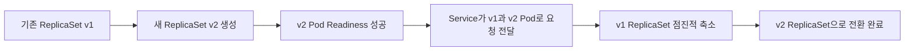

Rolling Update가 완료되면 이전 ReplicaSet 메타데이터는 롤백을 위해 남을 수 있지만, 이전 버전의 실행 중인 Pod를 별도의 대기 환경으로 계속 보존하는 것은 아니다.

이전 버전을 실행 상태로 유지한 채 Service의 연결 대상만 바꾸려면 Blue-Green 배포 구조가 필요하다.

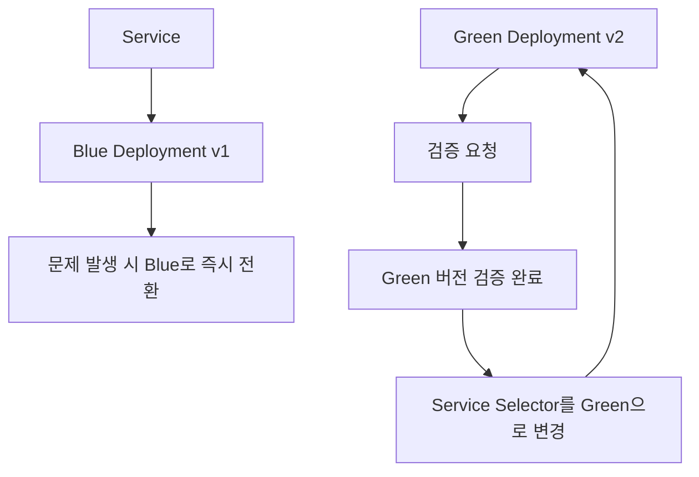

Canary 배포나 Blue-Green 배포를 Jenkins와 Helm 스크립트만으로 구현할 수도 있다. 하지만 트래픽 비율 조절, 자동 분석, 중단과 재개, 자동 롤백이 필요하다면 Argo Rollouts나 별도의 배포 관리 도구를 사용하는 편이 운영하기 쉽다.

#### Jenkins와 GitOps의 역할 구분

Jenkins가 Kubernetes API에 직접 배포하는 방식은 Jenkins가 원하는 상태를 클러스터로 밀어 넣는 Push 방식이다.

GitOps에서는 Jenkins가 이미지를 빌드한 뒤 배포 저장소의 이미지 태그를 변경하고, Argo CD 같은 도구가 Git의 선언 상태를 클러스터에 반영한다.

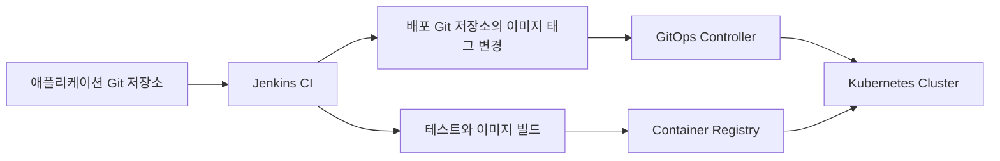

| 구분 | Jenkins 직접 배포 | GitOps 배포 |
|---|---|---|
| 배포 주체 | Jenkins | 클러스터 내부 GitOps Controller |
| Kubernetes 자격 증명 | Jenkins에 필요 | 일반적으로 Jenkins에 불필요 |
| 원하는 상태의 기준 | Pipeline 실행과 Helm 명령 | Git 저장소 |
| Drift 감지 | 별도 구현 필요 | 지속적인 비교와 동기화 가능 |
| 감사 추적 | Jenkins 기록과 Helm 이력 | Git 변경 이력 중심 |
| 적합한 환경 | 기존 Jenkins 중심의 단순한 배포 | 여러 클러스터와 엄격한 변경 관리 |

Jenkins는 빌드와 테스트를 담당하고, GitOps 도구는 배포와 상태 동기화를 담당하는 혼합 구성이 실무에서 자주 사용된다.

#### 자주 발생하는 문제

##### 새로운 Pod가 생성되지 않는 경우

같은 이미지 태그를 반복해서 사용하면 Deployment의 Pod Template이 변경되지 않는다. 빌드마다 고유한 이미지 태그를 생성해야 한다.

##### `ImagePullBackOff`가 발생하는 경우

다음 항목을 확인한다.

- 이미지 Repository와 태그가 정확한가
- 이미지 푸시가 실제로 완료되었는가
- Private Registry 인증 정보가 존재하는가
- Pod의 `imagePullSecrets` 설정이 올바른가
- Node에서 Registry에 네트워크로 접근할 수 있는가

##### `Forbidden` 오류가 발생하는 경우

Jenkins가 사용하는 계정에 대상 Namespace나 Kubernetes 객체를 관리할 RBAC 권한이 부족한 상태다.

```bash
kubectl auth can-i update deployments \
  --namespace my-app-prod \
  --as system:serviceaccount:my-app-prod:jenkins-deployer
```

##### Helm 배포가 시간 초과되는 경우

주요 원인은 다음과 같다.

- Readiness Probe가 계속 실패한다.
- 컨테이너가 시작 직후 종료된다.
- 이미지 다운로드에 실패한다.
- 필요한 ConfigMap이나 Secret이 없다.
- ResourceQuota 또는 LimitRange 조건을 위반한다.
- Node에 Pod를 배치할 CPU나 Memory가 부족하다.

##### 동시에 여러 배포가 실행되는 경우

같은 환경에 여러 Jenkins Build가 동시에 배포되면 늦게 시작한 빌드보다 먼저 시작한 빌드가 나중에 적용되는 역전 현상이 발생할 수 있다.

예제의 `disableConcurrentBuilds()`는 동일한 Jenkins Job의 동시 실행을 방지한다. 여러 Job이 같은 Release를 배포한다면 환경 단위 Lock이나 별도의 배포 큐가 필요하다.

#### 실무 적용 시 확인할 기준

- 빌드마다 고유하고 변경되지 않는 이미지 태그를 생성한다.
- 이미지 태그를 Git Commit 및 Jenkins Build와 연결한다.
- 배포 전에 테스트와 Helm 템플릿 검증을 수행한다.
- Jenkins Credential에 Registry와 Kubernetes 인증 정보를 보관한다.
- Jenkins에 `cluster-admin` 권한을 제공하지 않는다.
- `--wait`, `--atomic`, `--timeout`을 이용해 배포 성공 기준을 명확히 한다.
- Readiness Probe가 성공한 Pod에만 트래픽이 전달되도록 구성한다.
- 이전 이미지를 Registry에 보존해 재빌드 없이 롤백할 수 있게 한다.
- 데이터베이스 변경은 애플리케이션 롤백 가능성을 고려한다.
- 복잡한 Canary 및 Blue-Green 배포에는 전용 배포 도구를 검토한다.
- 여러 환경이나 클러스터를 운영한다면 GitOps 구조를 검토한다.

### 정리

Jenkins를 Kubernetes 환경에서 사용하면 소스 코드 빌드부터 컨테이너 이미지 생성, Registry 푸시, Helm 배포까지의 전체 과정을 자동화할 수 있다.

단순히 `kubectl set image`를 실행하는 방식은 빠르게 시작할 수 있지만, 애플리케이션 규모가 커지면 여러 Kubernetes 객체의 버전과 롤백을 함께 관리하기 어렵다. Helm을 사용하면 Deployment, Service, ConfigMap, Ingress 등의 변경을 Release 단위로 관리하고 이전 Revision으로 되돌릴 수 있다.

안정적인 배포를 위해서는 모든 이미지에 고유한 태그를 부여하고, 이전 이미지를 보존하며, 배포 성공 여부를 Readiness Probe와 실제 Kubernetes 상태로 검증해야 한다. Jenkins에는 최소한의 배포 권한만 제공하고 Registry 및 클러스터 인증 정보는 Credentials로 관리해야 한다.

Jenkins와 Helm만으로도 충분한 배포 자동화를 구성할 수 있지만, 여러 클러스터의 상태 동기화나 정교한 Canary 및 Blue-Green 배포가 필요해지면 GitOps와 전용 배포 관리 도구를 함께 사용하는 것이 더 적합하다.

## 03. Helm을 이용한 스프링 애플리케이션 배포 실습

### Helm을 이용한 애플리케이션 패키징 실습

Helm을 사용하면 Deployment, Service, ConfigMap, Ingress, HPA와 같이 애플리케이션에 필요한 여러 Kubernetes 객체를 하나의 Chart로 패키징할 수 있다.

기존에는 객체별 YAML을 수정한 뒤 `kubectl apply`를 반복해서 실행했다면, Helm에서는 공통 구조를 Template으로 정의하고 환경이나 애플리케이션마다 달라지는 값을 `values.yaml`로 분리한다.

이번 실습에서는 Factorial Spring Boot 애플리케이션을 위한 Helm Chart를 생성하고 다음 과정을 진행한다.

1. Helm Chart를 생성한다.
2. `Chart.yaml`과 `values.yaml`을 수정한다.
3. Deployment와 Service Template을 애플리케이션에 맞게 변경한다.
4. Probe와 리소스 설정을 추가한다.
5. Chart를 검증하고 Kubernetes에 설치한다.
6. Service 포트를 변경해 Release를 업그레이드한다.
7. Helm 이력을 확인하고 이전 Revision으로 롤백한다.
8. 실습이 끝난 Release를 제거한다.

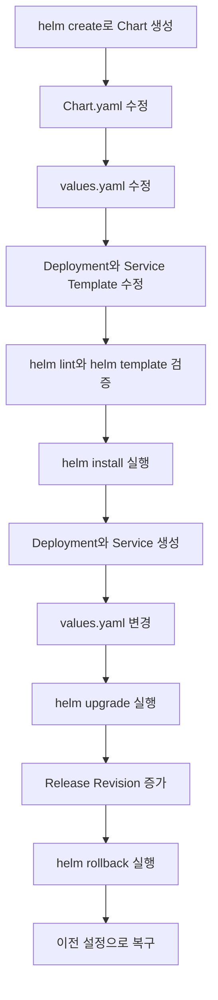

#### 실습 목표

이번 실습의 핵심은 단순히 Helm 명령어를 실행하는 것이 아니라 다음 구조를 이해하는 것이다.

- Chart는 Kubernetes 애플리케이션을 구성하는 패키지다.
- Template은 Kubernetes 객체의 공통 구조를 정의한다.
- `values.yaml`은 Template에 주입할 기본값을 정의한다.
- Release는 Chart를 Kubernetes 클러스터에 설치한 실행 단위다.
- Revision은 Release가 설치, 업그레이드, 롤백될 때 생성되는 변경 이력이다.
- Helm Rollback은 기존 Revision을 제거하는 것이 아니라 이전 설정을 바탕으로 새로운 Revision을 만든다.

#### 전체 구성

실습에서는 다음과 같은 구조로 애플리케이션을 배포한다.

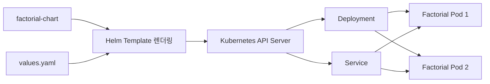

#### 사전 조건

다음 환경이 준비되어 있어야 한다.

- Kubernetes 클러스터
- `kubectl`
- Helm 3
- Kubernetes에 접근할 수 있는 `kubeconfig`
- Registry에 푸시된 Factorial 애플리케이션 이미지
- Spring Boot Actuator가 적용된 애플리케이션

설치된 Helm 버전은 다음 명령으로 확인한다.

```bash
helm version
```

Kubernetes 연결 상태도 확인한다.

```bash
kubectl cluster-info
```

```bash
kubectl get nodes
```

실습에서는 `factorial` Namespace를 사용한다.

```bash
kubectl create namespace factorial
```

이미 존재한다면 다음과 같은 오류가 발생할 수 있다.

```text
Error from server (AlreadyExists): namespaces "factorial" already exists
```

이 경우에는 새로 생성하지 않고 기존 Namespace를 사용하면 된다.

#### Helm Chart 생성

`helm create` 명령을 사용하면 기본 Chart 구조를 자동으로 생성할 수 있다.

```bash
helm create factorial-chart
```

명령을 실행하면 현재 디렉터리 아래에 다음과 같은 구조가 생성된다.

```text
factorial-chart/
├── Chart.yaml
├── values.yaml
├── charts/
└── templates/
    ├── NOTES.txt
    ├── _helpers.tpl
    ├── deployment.yaml
    ├── hpa.yaml
    ├── ingress.yaml
    ├── service.yaml
    ├── serviceaccount.yaml
    └── tests/
        └── test-connection.yaml
```

각 파일과 디렉터리의 역할은 다음과 같다.

| 항목 | 역할 |
|---|---|
| `Chart.yaml` | Chart 이름, 버전, 애플리케이션 버전과 같은 메타데이터를 정의한다. |
| `values.yaml` | Template에서 사용할 기본 설정값을 정의한다. |
| `templates/` | Deployment, Service와 같은 Kubernetes 객체 Template을 저장한다. |
| `_helpers.tpl` | 객체 이름과 공통 Label을 생성하는 재사용 Template을 정의한다. |
| `charts/` | 의존하는 하위 Chart를 저장한다. |
| `NOTES.txt` | 설치가 완료된 뒤 사용자에게 보여줄 안내 문구를 정의한다. |

#### Chart.yaml 설정

생성된 `Chart.yaml`을 Factorial 애플리케이션에 맞게 수정한다.

```yaml
apiVersion: v2
name: factorial-chart
description: A Helm chart for the Factorial Spring Boot application
type: application
version: 0.1.0
appVersion: "0.0.7"
```

각 필드의 의미는 다음과 같다.

- `apiVersion: v2`는 Helm 3에서 사용하는 Chart API 버전이다.
- `name`은 Chart의 이름이다.
- `description`은 Chart의 목적을 설명한다.
- `type: application`은 배포 가능한 애플리케이션 Chart임을 의미한다.
- `version`은 Chart 자체의 버전이다.
- `appVersion`은 Chart가 배포하는 애플리케이션 버전을 표현하는 정보다.

`version`과 `appVersion`은 서로 다른 의미를 가진다.

| 구분 | 의미 | 변경 시점 |
|---|---|---|
| `version` | Template과 기본 설정을 포함한 Chart 버전 | Chart 구조나 기본값이 변경될 때 |
| `appVersion` | 배포 대상 애플리케이션 버전 | 애플리케이션 버전이 변경될 때 |
| `image.tag` | 실제 Pod가 실행할 이미지 태그 | 배포할 컨테이너 이미지가 변경될 때 |

`appVersion`을 변경한다고 해서 이미지 태그가 자동으로 바뀌는 것은 아니다. Deployment Template에서 `appVersion`을 기본 이미지 태그로 사용하도록 작성했을 때만 해당 값이 이미지에 반영된다.

#### values.yaml 작성

기본으로 생성된 `values.yaml`을 Factorial 애플리케이션에 맞게 수정한다.

아래 예제의 이미지 Repository는 실제 Registry 주소로 변경해야 한다.

```yaml
replicaCount: 2

image:
  repository: your-dockerhub-id/factorial-app
  pullPolicy: IfNotPresent
  tag: "0.0.7"

imagePullSecrets: []

nameOverride: ""
fullnameOverride: ""

serviceAccount:
  create: false
  automount: false
  annotations: {}
  name: ""

podAnnotations: {}

podLabels: {}

podSecurityContext:
  runAsNonRoot: true
  seccompProfile:
    type: RuntimeDefault

securityContext:
  allowPrivilegeEscalation: false
  capabilities:
    drop:
      - ALL
  readOnlyRootFilesystem: false
  runAsUser: 10001

container:
  port: 8080

service:
  type: ClusterIP
  port: 8080

ingress:
  enabled: false
  className: ""
  annotations: {}
  hosts: []
  tls: []

resources:
  requests:
    cpu: 200m
    memory: 256Mi
  limits:
    cpu: 500m
    memory: 512Mi

startupProbe:
  httpGet:
    path: /actuator/health/liveness
    port: http
  initialDelaySeconds: 10
  periodSeconds: 5
  timeoutSeconds: 2
  failureThreshold: 12
  successThreshold: 1

livenessProbe:
  httpGet:
    path: /actuator/health/liveness
    port: http
  initialDelaySeconds: 45
  periodSeconds: 10
  timeoutSeconds: 2
  failureThreshold: 3
  successThreshold: 1

readinessProbe:
  httpGet:
    path: /actuator/health/readiness
    port: http
  initialDelaySeconds: 10
  periodSeconds: 5
  timeoutSeconds: 2
  failureThreshold: 3
  successThreshold: 1

autoscaling:
  enabled: false
  minReplicas: 2
  maxReplicas: 5
  targetCPUUtilizationPercentage: 70

volumes: []

volumeMounts: []

nodeSelector: {}

tolerations: []

affinity: {}
```

##### Replica 설정

```yaml
replicaCount: 2
```

Deployment가 유지할 Pod 개수를 두 개로 지정한다. HPA를 활성화하면 고정된 `replicaCount` 대신 HPA가 부하에 따라 레플리카 수를 조정한다.

##### 이미지 설정

```yaml
image:
  repository: your-dockerhub-id/factorial-app
  pullPolicy: IfNotPresent
  tag: "0.0.7"
```

- `repository`는 Container Registry의 이미지 경로다.
- `tag`는 실제 실행할 이미지 버전이다.
- `pullPolicy`는 Node가 이미지를 내려받는 기준이다.

운영 환경에서는 `latest`와 같은 변경 가능한 태그보다 Git Commit SHA나 Build Number가 포함된 고유 태그를 사용하는 것이 좋다.

##### ServiceAccount 설정

```yaml
serviceAccount:
  create: false
```

애플리케이션 전용 ServiceAccount를 생성하지 않도록 설정한다. 애플리케이션이 Kubernetes API에 접근해야 한다면 ServiceAccount와 RBAC 권한을 별도로 정의해야 한다.

ServiceAccount를 생성하지 않는다고 해서 보안 고려가 사라지는 것은 아니다. Pod에서 Kubernetes API 인증 정보가 필요하지 않다면 ServiceAccount Token 자동 마운트도 비활성화하는 것이 좋다.

##### 컨테이너 포트와 Service 포트

```yaml
container:
  port: 8080

service:
  type: ClusterIP
  port: 8080
```

컨테이너가 실제로 요청을 받는 포트와 Service가 클러스터 내부에 공개하는 포트를 분리했다.

이렇게 분리하면 Service 포트를 `8090`으로 변경하더라도 애플리케이션은 계속 컨테이너의 `8080` 포트에서 요청을 받을 수 있다.

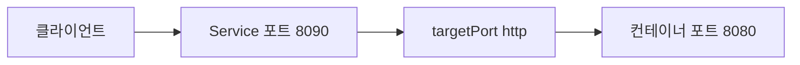

컨테이너 포트까지 Service 포트와 동일한 값으로 묶으면 Service 포트 변경 시 실제 애플리케이션이 수신하지 않는 포트로 트래픽이 전달될 수 있으므로 주의해야 한다.

##### Ingress와 HPA 설정

이번 실습에서는 Ingress와 HPA를 생성하지 않는다.

```yaml
ingress:
  enabled: false

autoscaling:
  enabled: false
```

`enabled` 값이 `false`이면 `templates/ingress.yaml`과 `templates/hpa.yaml`의 조건문에 의해 해당 객체가 생성되지 않는다.

##### 리소스 설정

```yaml
resources:
  requests:
    cpu: 200m
    memory: 256Mi
  limits:
    cpu: 500m
    memory: 512Mi
```

- `requests`는 Scheduler가 Pod를 Node에 배치할 때 사용하는 최소 자원 기준이다.
- `limits`는 컨테이너가 사용할 수 있는 자원의 상한이다.

CPU Limit을 초과하면 컨테이너가 즉시 종료되는 것이 아니라 CPU 사용이 제한될 수 있다. Memory Limit을 초과하면 컨테이너 프로세스가 OOMKilled로 종료될 수 있다.

#### Spring Boot Actuator 설정

Probe 경로가 정상적으로 동작하려면 Spring Boot Actuator 의존성이 필요하다.

```groovy
dependencies {
    implementation 'org.springframework.boot:spring-boot-starter-actuator'
}
```

`application.yaml`에는 Kubernetes Probe 경로를 활성화한다.

```yaml
management:
  endpoint:
    health:
      probes:
        enabled: true
  endpoints:
    web:
      exposure:
        include:
          - health
          - info
```

다음 엔드포인트가 HTTP 200 상태를 반환하는지 애플리케이션 실행 환경에서 먼저 확인하는 것이 좋다.

```bash
curl http://localhost:8080/actuator/health/liveness
```

```bash
curl http://localhost:8080/actuator/health/readiness
```

Probe 경로가 존재하지 않거나 인증으로 차단되면 Pod가 정상적으로 실행되더라도 Kubernetes에서는 준비되지 않은 Pod로 판단할 수 있다.

#### Deployment Template 수정

`templates/deployment.yaml`에서 `values.yaml`의 설정을 참조하도록 수정한다.

```yaml
apiVersion: apps/v1
kind: Deployment
metadata:
  name: {{ include "factorial-chart.fullname" . }}
  labels:
    {{- include "factorial-chart.labels" . | nindent 4 }}
spec:
  {{- if not .Values.autoscaling.enabled }}
  replicas: {{ .Values.replicaCount }}
  {{- end }}
  selector:
    matchLabels:
      {{- include "factorial-chart.selectorLabels" . | nindent 6 }}
  template:
    metadata:
      {{- with .Values.podAnnotations }}
      annotations:
        {{- toYaml . | nindent 8 }}
      {{- end }}
      labels:
        {{- include "factorial-chart.selectorLabels" . | nindent 8 }}
        {{- with .Values.podLabels }}
        {{- toYaml . | nindent 8 }}
        {{- end }}
    spec:
      {{- with .Values.imagePullSecrets }}
      imagePullSecrets:
        {{- toYaml . | nindent 8 }}
      {{- end }}
      serviceAccountName: {{ include "factorial-chart.serviceAccountName" . }}
      securityContext:
        {{- toYaml .Values.podSecurityContext | nindent 8 }}
      containers:
        - name: {{ .Chart.Name }}
          securityContext:
            {{- toYaml .Values.securityContext | nindent 12 }}
          image: "{{ .Values.image.repository }}:{{ .Values.image.tag | default .Chart.AppVersion }}"
          imagePullPolicy: {{ .Values.image.pullPolicy }}
          ports:
            - name: http
              containerPort: {{ .Values.container.port }}
              protocol: TCP
          startupProbe:
            {{- toYaml .Values.startupProbe | nindent 12 }}
          livenessProbe:
            {{- toYaml .Values.livenessProbe | nindent 12 }}
          readinessProbe:
            {{- toYaml .Values.readinessProbe | nindent 12 }}
          resources:
            {{- toYaml .Values.resources | nindent 12 }}
          {{- with .Values.volumeMounts }}
          volumeMounts:
            {{- toYaml . | nindent 12 }}
          {{- end }}
      {{- with .Values.volumes }}
      volumes:
        {{- toYaml . | nindent 8 }}
      {{- end }}
      {{- with .Values.nodeSelector }}
      nodeSelector:
        {{- toYaml . | nindent 8 }}
      {{- end }}
      {{- with .Values.affinity }}
      affinity:
        {{- toYaml . | nindent 8 }}
      {{- end }}
      {{- with .Values.tolerations }}
      tolerations:
        {{- toYaml . | nindent 8 }}
      {{- end }}
```

##### 이미지 태그 기본값

```yaml
image: "{{ .Values.image.repository }}:{{ .Values.image.tag | default .Chart.AppVersion }}"
```

`values.yaml`에 `image.tag`가 있으면 해당 값을 사용하고, 비어 있으면 `Chart.yaml`의 `appVersion`을 사용한다.

배포 환경에서 이미지 태그를 명시적으로 관리하려면 `values.yaml` 또는 `--set-string image.tag=...` 방식으로 지정하는 것이 더 명확하다.

##### Probe 설정

Probe 설정을 Template에 고정하지 않고 `values.yaml`에서 가져오도록 구성했다.

```yaml
startupProbe:
  {{- toYaml .Values.startupProbe | nindent 12 }}
```

애플리케이션마다 시작 시간과 Health Check 경로가 다를 수 있기 때문에 Probe 설정은 변경 가능한 값으로 분리하는 편이 재사용에 유리하다.

Probe의 역할은 다음과 같이 구분해야 한다.

| Probe | 역할 | 실패 시 동작 |
|---|---|---|
| Startup Probe | 애플리케이션 초기 기동 완료 여부 확인 | 성공 전까지 다른 Probe의 실행을 억제한다. |
| Readiness Probe | 트래픽을 받을 준비가 되었는지 확인 | Service Endpoint에서 Pod를 제외한다. |
| Liveness Probe | 컨테이너를 재시작해야 할 상태인지 확인 | kubelet이 컨테이너를 재시작한다. |

Spring Boot처럼 시작 시간이 길어질 수 있는 애플리케이션은 Liveness Probe의 `initialDelaySeconds`만 크게 설정하는 것보다 Startup Probe를 함께 사용하는 것이 안전하다.

#### Service Template 수정

`templates/service.yaml`에서는 Service 포트와 컨테이너 포트를 분리한다.

```yaml
apiVersion: v1
kind: Service
metadata:
  name: {{ include "factorial-chart.fullname" . }}
  labels:
    {{- include "factorial-chart.labels" . | nindent 4 }}
spec:
  type: {{ .Values.service.type }}
  ports:
    - name: http
      port: {{ .Values.service.port }}
      targetPort: http
      protocol: TCP
  selector:
    {{- include "factorial-chart.selectorLabels" . | nindent 4 }}
```

`targetPort: http`는 Deployment의 다음 이름을 가진 컨테이너 포트를 참조한다.

```yaml
ports:
  - name: http
    containerPort: 8080
```

따라서 Service의 외부 노출 포트를 변경해도 컨테이너가 실제로 수신하는 포트는 유지할 수 있다.

#### Template과 values.yaml의 구분 기준

Template에는 객체의 구조와 같이 자주 바뀌지 않는 내용을 정의하고, `values.yaml`에는 환경이나 애플리케이션에 따라 달라지는 값을 정의한다.

| Template에 적합한 항목 | values.yaml에 적합한 항목 |
|---|---|
| Deployment 구조 | 레플리카 수 |
| Label과 Selector 연결 구조 | 이미지 Repository와 태그 |
| Service와 Pod 연결 방식 | Service 포트 |
| Probe 필드를 배치하는 구조 | Probe 경로와 주기 |
| 조건부 객체 생성 로직 | Ingress와 HPA 활성화 여부 |
| 공통 보안 구조 | CPU와 Memory 설정 |

여러 프로젝트가 같은 Chart를 사용하더라도 Probe 경로, 이미지 태그, 리소스 설정이 다를 수 있다. 이러한 값은 Template에 고정하기보다 `values.yaml`에서 조정할 수 있도록 만드는 것이 좋다.

반대로 모든 값을 `values.yaml`로 노출하면 Chart가 지나치게 복잡해질 수 있다. 실제로 환경별 변경 가능성이 있는 값만 외부 설정으로 분리해야 한다.

#### Chart 검증

클러스터에 설치하기 전에 Chart의 문법과 렌더링 결과를 확인한다.

##### Helm Lint 실행

```bash
helm lint ./factorial-chart
```

정상적인 경우 다음과 유사한 결과가 나타난다.

```text
1 chart(s) linted, 0 chart(s) failed
```

`helm lint`는 Chart 구조와 Template 문법을 확인하지만 실제 클러스터의 API 지원 여부나 Admission Policy까지 검증하지는 않는다.

##### Template 렌더링 확인

```bash
helm template my-test-app ./factorial-chart \
  --namespace factorial
```

`helm template`은 Chart를 실제 Kubernetes YAML로 렌더링하지만 클러스터에는 적용하지 않는다.

렌더링 결과에서 다음 항목을 확인한다.

- Deployment의 이미지와 태그
- 레플리카 수
- 컨테이너 포트
- Service 포트와 `targetPort`
- Probe 경로
- CPU와 Memory 설정
- Label과 Selector 일치 여부
- Ingress와 HPA의 생성 여부

##### Dry Run 실행

```bash
helm install my-test-app ./factorial-chart \
  --namespace factorial \
  --dry-run \
  --debug
```

`--dry-run`은 설치 결과를 미리 확인하는 용도로 사용할 수 있다. 클러스터 측 검증까지 필요하다면 Kubernetes 연결과 권한을 준비한 뒤 서버 측 Dry Run도 함께 활용할 수 있다.

#### Chart 패키징

Helm은 Chart 디렉터리를 직접 설치할 수도 있지만 `.tgz` 파일로 패키징하여 저장소나 CI/CD 시스템에서 관리할 수도 있다.

```bash
mkdir -p dist
```

```bash
helm package ./factorial-chart \
  --destination ./dist
```

정상적으로 패키징되면 `Chart.yaml`의 `version`을 사용한 파일이 생성된다.

```text
dist/factorial-chart-0.1.0.tgz
```

패키징된 Chart는 다음과 같이 검사할 수 있다.

```bash
helm show chart ./dist/factorial-chart-0.1.0.tgz
```

이번 실습에서는 수정 내용을 바로 확인하기 위해 Chart 디렉터리를 직접 설치한다.

#### Helm Release 설치

다음 명령으로 Chart를 `factorial` Namespace에 설치한다.

```bash
helm install my-test-app ./factorial-chart \
  --namespace factorial
```

여기서 각 값의 의미는 다음과 같다.

- `my-test-app`은 Helm Release 이름이다.
- `./factorial-chart`는 설치할 Chart 경로다.
- `--namespace factorial`은 객체를 생성할 Namespace다.

Namespace까지 함께 생성하려면 `--create-namespace`를 사용할 수 있다.

```bash
helm install my-test-app ./factorial-chart \
  --namespace factorial \
  --create-namespace
```

설치가 완료되면 Helm Release를 확인한다.

```bash
helm list --namespace factorial
```

```bash
helm status my-test-app --namespace factorial
```

Kubernetes 객체도 확인한다.

```bash
kubectl get deployment \
  --namespace factorial \
  --selector app.kubernetes.io/instance=my-test-app
```

```bash
kubectl get pods \
  --namespace factorial \
  --selector app.kubernetes.io/instance=my-test-app
```

```bash
kubectl get services \
  --namespace factorial \
  --selector app.kubernetes.io/instance=my-test-app
```

정상적으로 설치되었다면 다음 상태를 확인할 수 있다.

- Helm Release 상태가 `deployed`로 표시된다.
- Deployment가 생성된다.
- 두 개의 Pod가 실행된다.
- Pod가 Readiness Probe를 통과해 `READY 1/1` 상태가 된다.
- ClusterIP Service가 생성된다.
- Ingress와 HPA는 생성되지 않는다.

#### 애플리케이션 테스트

생성된 Service 이름을 확인한다.

```bash
kubectl get service \
  --namespace factorial \
  --selector app.kubernetes.io/instance=my-test-app
```

Service 이름이 `my-test-app-factorial-chart`라면 Port Forwarding으로 테스트할 수 있다.

```bash
kubectl port-forward \
  service/my-test-app-factorial-chart \
  8080:8080 \
  --namespace factorial
```

다른 터미널에서 애플리케이션을 호출한다.

```bash
curl http://localhost:8080/actuator/health/readiness
```

Factorial API가 `/factorial` 경로와 `number` 파라미터를 사용한다면 다음과 같이 테스트할 수 있다.

```bash
curl "http://localhost:8080/factorial?number=5"
```

정상적으로 동작하면 애플리케이션의 정의에 따라 `120`과 같은 계산 결과를 확인할 수 있다.

#### Helm Release 업그레이드

Helm으로 설치한 객체의 설정을 변경하려면 `values.yaml`을 수정한 뒤 `helm upgrade`를 실행한다.

이번에는 Service 포트를 `8080`에서 `8090`으로 변경한다.

```yaml
service:
  type: ClusterIP
  port: 8090
```

컨테이너 포트는 변경하지 않는다.

```yaml
container:
  port: 8080
```

변경된 설정으로 Release를 업그레이드한다.

```bash
helm upgrade my-test-app ./factorial-chart \
  --namespace factorial \
  --values ./factorial-chart/values.yaml \
  --wait \
  --timeout 5m
```

설정 파일을 수정하지 않고 명령어에서 값을 덮어쓸 수도 있다.

```bash
helm upgrade my-test-app ./factorial-chart \
  --namespace factorial \
  --set service.port=8090 \
  --wait \
  --timeout 5m
```

Helm 설정값의 일반적인 우선순위는 다음과 같다.

```text
Chart 기본 values.yaml
< --values 또는 -f로 지정한 파일
< --set 및 --set-string으로 지정한 값
```

업그레이드된 Service를 확인한다.

```bash
kubectl get service \
  --namespace factorial \
  --selector app.kubernetes.io/instance=my-test-app
```

Service 포트는 `8090`으로 변경되지만 `targetPort`는 이름이 `http`인 컨테이너 포트, 즉 `8080`을 가리킨다.

#### Release 이력 확인

Release의 변경 이력은 다음 명령으로 조회한다.

```bash
helm history my-test-app \
  --namespace factorial
```

최초 설치 후 한 번 업그레이드했다면 다음과 같은 Revision을 확인할 수 있다.

```text
REVISION  STATUS      DESCRIPTION
1         superseded  Install complete
2         deployed    Upgrade complete
```

- Revision 1은 최초 설치 상태다.
- Revision 2는 Service 포트를 변경한 상태다.
- 현재 적용 중인 Revision은 `deployed`로 표시된다.
- 이전 Revision은 `superseded`로 표시된다.

Chart 버전과 애플리케이션 버전이 같더라도 `values.yaml`이나 `--set` 값이 변경되면 새로운 Revision이 생성될 수 있다.

#### 이전 Revision으로 롤백

Service 포트를 `8090`으로 변경한 것이 잘못된 배포라고 가정하고 Revision 1로 롤백한다.

```bash
helm rollback my-test-app 1 \
  --namespace factorial \
  --wait \
  --timeout 5m
```

Service를 다시 조회한다.

```bash
kubectl get service \
  --namespace factorial \
  --selector app.kubernetes.io/instance=my-test-app
```

정상적으로 롤백되었다면 Service 포트가 다시 `8080`으로 변경된다.

Helm 이력을 다시 확인한다.

```bash
helm history my-test-app \
  --namespace factorial
```

롤백은 Revision 2를 삭제하고 Revision 1을 현재 상태로 되돌리는 방식이 아니다. Revision 1의 설정을 사용한 새로운 Revision 3을 생성한다.

```text
REVISION  STATUS      DESCRIPTION
1         superseded  Install complete
2         superseded  Upgrade complete
3         deployed    Rollback to 1
```

이 구조 덕분에 설치, 업그레이드, 롤백 과정을 모두 이력으로 추적할 수 있다.

다만 Helm Rollback이 데이터베이스 데이터나 외부 시스템의 상태까지 복원하는 것은 아니다. Chart가 관리하는 Kubernetes 객체를 이전 Revision의 선언 상태로 되돌리는 기능이라는 점을 구분해야 한다.

#### Release 제거

실습이 끝나면 다음 명령으로 Release를 제거한다.

```bash
helm uninstall my-test-app \
  --namespace factorial
```

`helm uninstall`은 해당 Release에서 관리하던 Deployment, Service 등의 Kubernetes 객체를 삭제한다.

삭제 결과를 확인한다.

```bash
helm list --namespace factorial
```

```bash
kubectl get all \
  --namespace factorial \
  --selector app.kubernetes.io/instance=my-test-app
```

정상적으로 제거되었다면 Release와 관련 객체가 더 이상 조회되지 않는다.

기본적으로 `helm uninstall`은 Release 이력도 제거한다. 이력을 보존해야 한다면 다음 옵션을 사용할 수 있다.

```bash
helm uninstall my-test-app \
  --namespace factorial \
  --keep-history
```

#### 자주 발생하는 문제

##### Chart 설치 시 Namespace를 찾지 못하는 경우

```text
Error: INSTALLATION FAILED: create: failed to create: namespaces "factorial" not found
```

Namespace를 먼저 생성하거나 `--create-namespace` 옵션을 사용한다.

```bash
helm install my-test-app ./factorial-chart \
  --namespace factorial \
  --create-namespace
```

##### Pod가 `ImagePullBackOff` 상태가 되는 경우

다음 항목을 확인한다.

- 이미지 Repository가 정확한가
- 이미지 태그 `0.0.7`이 Registry에 존재하는가
- Private Registry 인증을 위한 `imagePullSecrets`가 설정되었는가
- Kubernetes Node에서 Registry에 접근할 수 있는가

##### Readiness Probe가 실패하는 경우

```bash
kubectl describe pod <pod-name> \
  --namespace factorial
```

```bash
kubectl logs <pod-name> \
  --namespace factorial
```

다음 항목을 확인해야 한다.

- Spring Boot Actuator 의존성이 포함되어 있는가
- `/actuator/health/readiness` 경로가 활성화되어 있는가
- 보안 설정이 Health Check 요청을 차단하지 않는가
- 애플리케이션이 실제로 `8080` 포트에서 실행되는가
- 애플리케이션의 시작 시간이 Probe 허용 시간보다 길지 않은가

##### Upgrade 후 Service 요청이 실패하는 경우

Service 포트와 컨테이너 포트를 같은 값으로 묶어 두었다면 Service 포트 변경이 컨테이너의 `targetPort`까지 변경했을 가능성이 있다.

Service 공개 포트와 애플리케이션의 실제 수신 포트는 별도의 값으로 관리해야 한다.

##### Template 렌더링 오류가 발생하는 경우

```bash
helm lint ./factorial-chart
```

```bash
helm template my-test-app ./factorial-chart \
  --namespace factorial \
  --debug
```

들여쓰기 오류, 존재하지 않는 Values 경로, 잘못된 조건문을 확인한다. Helm Template은 공백과 들여쓰기에 민감하므로 `nindent`와 `toYaml` 사용 위치를 주의해야 한다.

#### 실무적인 Chart 관리 기준

##### 환경별 Values 파일 분리

개발, 스테이지, 운영 환경의 설정이 다르다면 파일을 분리한다.

```text
factorial-chart/
├── Chart.yaml
├── values.yaml
├── values-dev.yaml
├── values-stage.yaml
├── values-prod.yaml
└── templates/
```

운영 환경 설정은 다음과 같이 적용할 수 있다.

```bash
helm upgrade --install factorial-prod ./factorial-chart \
  --namespace factorial-prod \
  --values ./factorial-chart/values-prod.yaml
```

##### Secret 평문 저장 금지

데이터베이스 비밀번호나 API Key를 `values.yaml`에 평문으로 커밋하면 안 된다. External Secrets, Secret Store CSI Driver, SOPS와 같은 별도의 비밀 관리 방식을 검토해야 한다.

##### Chart 버전 증가

Chart의 Template이나 기본값을 변경해 패키징한다면 `Chart.yaml`의 `version`도 증가시켜야 한다.

```yaml
version: 0.1.1
```

동일한 버전의 Chart 패키지를 덮어쓰면 어떤 내용이 배포되었는지 추적하기 어려워진다.

##### 배포 전 검증 자동화

CI/CD Pipeline에서는 최소한 다음 검증을 수행하는 것이 좋다.

```bash
helm lint ./factorial-chart
```

```bash
helm template my-test-app ./factorial-chart \
  --namespace factorial \
  --values ./factorial-chart/values-prod.yaml
```

필요하다면 렌더링된 YAML에 Kubernetes 스키마 검사와 정책 검사를 추가할 수 있다.

### 정리

Helm Chart는 애플리케이션과 관련된 Deployment, Service, ConfigMap, Ingress, HPA 등의 Kubernetes 객체를 하나의 패키지로 관리하기 위한 구조다.

`helm create`를 사용하면 기본 Chart 구조를 빠르게 생성할 수 있으며, 객체의 공통 구조는 Template에 작성하고 환경별로 달라지는 이미지, 레플리카, 포트, Probe, 리소스 설정은 `values.yaml`로 분리할 수 있다.

`helm install`은 Chart를 새로운 Release로 설치하고, `helm upgrade`는 기존 Release의 설정을 변경한다. 각 변경은 Revision으로 기록되며 `helm history`로 조회할 수 있다. 잘못된 변경은 `helm rollback`으로 이전 Revision의 상태를 바탕으로 복구할 수 있다.

이때 롤백은 기존 이력을 지우는 것이 아니라 새로운 Revision을 생성하며, Kubernetes 객체만 이전 선언 상태로 되돌린다. 데이터베이스나 외부 시스템의 상태까지 자동으로 복원하지는 않는다.

마지막으로 `helm uninstall`을 사용하면 Release가 관리하던 여러 Kubernetes 객체를 한 번에 제거할 수 있다. 이러한 설치, 업그레이드, 이력 관리, 롤백, 삭제 기능을 통해 Helm은 여러 Kubernetes YAML을 개별적으로 관리할 때 발생하는 복잡성을 줄여준다.



