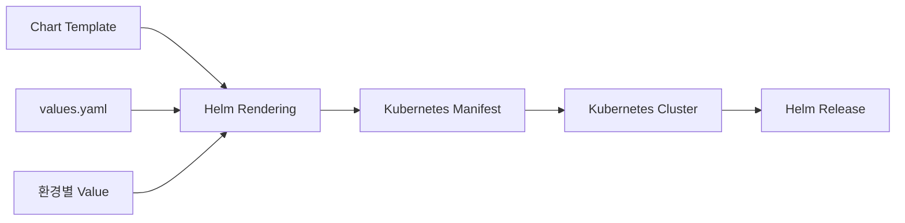
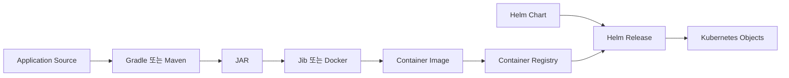
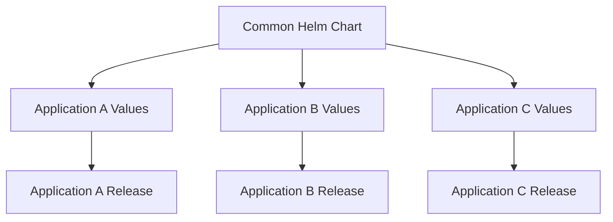
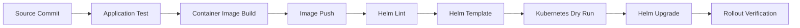

# Ch 10. Helm 템플릿과 Kubernetes 객체 생성

# Ch 10. Helm 템플릿과 Kubernetes 객체 생성
* toc
{:toc}

---

## 01. Helm 템플릿과 Kubernetes 객체 생성

Kubernetes에 애플리케이션 하나를 배포하려면 Deployment만 작성해서 끝나는 경우는 많지 않다. 실제 애플리케이션은 Service, ConfigMap, Secret, Ingress, ServiceAccount, PersistentVolumeClaim처럼 서로 연관된 여러 객체로 구성된다.

초기에는 각 YAML을 직접 작성하고 다음과 같이 적용할 수 있다.

```shell
kubectl apply -f deployment.yaml
kubectl apply -f service.yaml
kubectl apply -f configmap.yaml
kubectl apply -f ingress.yaml
```

혼자 진행하는 간단한 실습에서는 충분하지만, 애플리케이션과 환경이 늘어나면 다음과 같은 문제가 발생한다.

- 객체별 YAML 파일이 계속 늘어난다.
- 개발과 운영 환경마다 거의 동일한 YAML을 복사하게 된다.
- 이미지 Tag, 레플리카 수, Service 유형 등을 여러 파일에서 수정해야 한다.
- 서로 연관된 객체를 하나의 배포 단위로 관리하기 어렵다.
- Deployment 이외 객체의 변경 이력을 함께 관리하기 어렵다.
- 이전 배포 상태로 되돌릴 때 여러 객체를 개별적으로 복구해야 한다.
- 개발자마다 서로 다른 옵션으로 `kubectl apply`를 실행할 수 있다.

Helm은 Kubernetes 객체 정의를 하나의 Chart로 패키징하고, 환경별 값과 템플릿을 결합해 일관된 Kubernetes 객체를 생성하도록 도와주는 패키지 관리자다.

#### Helm이 필요한 이유

Kubernetes에는 Deployment, Service, ConfigMap처럼 개별 객체의 종류는 있지만, 여러 객체를 하나의 애플리케이션으로 묶어 관리하는 기본 단위는 명확하지 않다.

Helm은 Chart와 Release를 통해 이러한 애플리케이션 단위를 제공한다.



Helm을 사용하면 다음 작업을 수행할 수 있다.

- 여러 Kubernetes 객체를 하나의 Chart로 관리
- Template과 Value를 이용한 환경별 YAML 생성
- Chart 설치와 업그레이드
- 배포 Revision 이력 관리
- 이전 Revision을 기준으로 한 롤백
- Chart Dependency 관리
- Chart 패키징과 Registry 배포
- 공통 Template을 이용한 여러 애플리케이션 관리

Helm은 애플리케이션 소스 코드를 컴파일하거나 컨테이너 이미지를 빌드하는 도구는 아니다. Java 애플리케이션의 빌드와 컨테이너 이미지 생성은 Gradle, Maven, Jib, Docker와 같은 도구가 담당하고, Helm은 만들어진 이미지를 Kubernetes에 어떤 설정으로 배포할지 관리한다.



#### Helm과 kubectl의 관계

Helm을 사용한다고 해서 Kubernetes 객체나 `kubectl`에 대한 이해가 필요 없어지는 것은 아니다.

Helm Template의 최종 결과는 일반적인 Kubernetes YAML이다. Helm은 해당 YAML을 Kubernetes API Server에 적용하고 Release 상태를 관리한다.

| 구분 | kubectl | Helm |
|---|---|---|
| 주요 관리 단위 | 개별 Kubernetes 객체 | Chart와 Release |
| 설정 재사용 | 직접 파일을 분리하거나 Kustomize 사용 | Template과 Value 사용 |
| 환경별 설정 | YAML 복사 또는 Overlay | 환경별 Value 파일 |
| 배포 이력 | 객체별로 확인 | Release Revision으로 관리 |
| 롤백 | 객체 종류에 따라 직접 처리 | Release Revision 기준 롤백 |
| Dependency | 별도 관리 | Chart Dependency 지원 |
| 최종 처리 대상 | Kubernetes 객체 | Kubernetes 객체 |

Helm을 사용하더라도 최종적으로 어떤 Deployment와 Service가 생성되는지 이해해야 한다. Value만 변경하고 결과 YAML을 확인하지 않으면 잘못된 Selector, Service Port, Resource 설정이 그대로 배포될 수 있다.

#### Helm의 핵심 개념

Helm을 사용할 때는 Chart, Template, Value, Release, Revision을 명확하게 구분해야 한다.

##### Chart

Chart는 Kubernetes 애플리케이션을 배포하기 위한 패키지다.

Chart에는 다음 요소가 포함될 수 있다.

- Chart 메타데이터
- Kubernetes 객체 Template
- 기본 Value
- Chart Dependency
- 사용자 안내 문서
- Value 검증 스키마

##### Template

Template은 Kubernetes 객체를 생성하기 위한 원형이다.

일반적인 Kubernetes YAML에 Go Template 문법을 추가해 동적으로 값을 삽입하거나 조건에 따라 객체를 생성한다.

```yaml
spec:
  replicas: {{ .Values.replicaCount }}
```

##### Value

Value는 Template에 전달할 실제 설정값이다.

```yaml
replicaCount: 2
```

같은 Template에 개발용 Value와 운영용 Value를 다르게 전달하면 환경별 Kubernetes 객체를 생성할 수 있다.

##### Release

Release는 Chart를 Kubernetes 클러스터에 설치한 하나의 인스턴스다.

같은 Chart라도 Release 이름이나 Namespace가 다르면 서로 독립된 애플리케이션으로 설치할 수 있다.

```shell
helm install my-app-dev ./my-app -n dev
helm install my-app-prod ./my-app -n prod
```

##### Revision

하나의 Release를 설치하거나 업그레이드하거나 롤백할 때마다 Revision이 증가한다.

```text
Release: my-app-prod

Revision 1: 최초 설치
Revision 2: 이미지 Tag 변경
Revision 3: 레플리카 수 변경
Revision 4: Revision 2의 상태를 기준으로 롤백
```

업그레이드할 때마다 새로운 Release가 생기는 것이 아니라, 기존 Release에 새로운 Revision이 추가된다. 롤백도 과거 Revision을 그대로 다시 사용하는 것이 아니라 과거 설정을 기준으로 새로운 Revision을 생성한다.

#### Helm Chart 기본 구조

`helm create` 명령으로 기본 Chart를 생성할 수 있다.

```shell
helm create my-app
```

생성되는 기본 구조는 다음과 같다.

```text
my-app
├── Chart.yaml
├── values.yaml
├── charts
├── templates
│   ├── _helpers.tpl
│   ├── deployment.yaml
│   ├── hpa.yaml
│   ├── ingress.yaml
│   ├── service.yaml
│   ├── serviceaccount.yaml
│   ├── NOTES.txt
│   └── tests
└── .helmignore
```

실제 프로젝트에서는 필요하지 않은 Template을 제거하고 애플리케이션에 필요한 객체만 유지할 수 있다.

```text
my-app
├── Chart.yaml
├── values.yaml
├── values-dev.yaml
├── values-prod.yaml
├── templates
│   ├── _helpers.tpl
│   ├── deployment.yaml
│   ├── service.yaml
│   ├── configmap.yaml
│   └── ingress.yaml
└── .helmignore
```

#### Chart.yaml 작성

`Chart.yaml`은 Chart의 메타데이터를 정의하는 필수 파일이다.

```yaml
apiVersion: v2
name: my-app
description: Helm chart for my-app
type: application
version: 0.1.0
appVersion: "1.0.0"
```

##### apiVersion

Helm 3 Chart는 일반적으로 `apiVersion: v2`를 사용한다.

이 값은 Kubernetes 객체의 `apiVersion`이 아니라 Chart 형식의 API 버전이다.

##### name

Chart의 이름이다.

```yaml
name: my-app
```

Chart Repository나 OCI Registry에서 Chart를 식별할 때 사용한다.

##### description

Chart의 목적과 내용을 설명한다.

```yaml
description: Helm chart for my-app
```

Chart를 여러 프로젝트에서 공유한다면 검색과 관리에 도움이 되도록 구체적으로 작성하는 것이 좋다.

##### type

Chart 유형을 지정한다.

```yaml
type: application
```

일반적인 애플리케이션 배포 Chart는 `application`을 사용한다. 다른 Chart에서 공통 Template 함수만 제공하는 Chart는 `library` 유형을 사용할 수 있다.

##### version

Chart 자체의 버전이다.

```yaml
version: 0.1.0
```

Template, 기본 Value, Dependency와 같은 Chart 구성의 변경 버전을 의미한다. Chart를 패키징해 배포할 때 중요한 식별자로 사용된다.

##### appVersion

Chart가 배포하는 애플리케이션의 버전이다.

```yaml
appVersion: "1.0.0"
```

`version`과 `appVersion`은 서로 다른 값이다.

| 필드 | 의미 |
|---|---|
| `version` | Helm Chart의 버전 |
| `appVersion` | 배포할 애플리케이션의 버전 |

애플리케이션 이미지가 `1.1.0`으로 변경되었지만 Template 구조가 같더라도 Value 또는 `appVersion`이 변경될 수 있다. 반대로 Template만 변경했다면 Chart Version은 올라가지만 애플리케이션 버전은 그대로일 수 있다.

#### values.yaml 작성

`values.yaml`은 Chart의 기본 설정을 정의한다.

```yaml
replicaCount: 2

image:
  repository: docker.io/<dockerhub-username>/my-app
  pullPolicy: IfNotPresent
  tag: ""

nameOverride: ""
fullnameOverride: ""

service:
  type: ClusterIP
  port: 80
  targetPort: 8080

config:
  springProfilesActive: dev
  greetingMessage: Hello from Helm

existingSecret: my-app-secret

ingress:
  enabled: false
  className: nginx
  host: my-app.example.com
  path: /
  pathType: Prefix

resources:
  requests:
    cpu: 100m
    memory: 128Mi
  limits:
    cpu: 500m
    memory: 512Mi

probes:
  readiness:
    path: /actuator/health/readiness
    initialDelaySeconds: 10
    periodSeconds: 5
  liveness:
    path: /actuator/health/liveness
    initialDelaySeconds: 30
    periodSeconds: 10
```

Value에는 환경에 따라 변경될 가능성이 있는 값을 배치한다.

- 컨테이너 이미지
- 이미지 Tag
- 레플리카 수
- Service 유형과 Port
- Ingress 활성화 여부
- 애플리케이션 설정
- Resource Request와 Limit
- Probe 설정
- 기존 Secret 이름

반대로 `apiVersion`, `kind`, Label Key처럼 모든 환경에서 동일해야 하는 구조까지 Value로 분리하면 Chart 사용이 지나치게 복잡해질 수 있다.

#### 환경별 Value 파일 작성

개발과 운영 환경은 기본 Template을 공유하고 서로 다른 Value 파일을 사용할 수 있다.

`values-dev.yaml`은 다음과 같이 작성한다.

```yaml
replicaCount: 1

image:
  tag: "1.0.0-dev"

config:
  springProfilesActive: dev
  greetingMessage: Hello from development

ingress:
  enabled: false

resources:
  requests:
    cpu: 50m
    memory: 128Mi
  limits:
    cpu: 300m
    memory: 256Mi
```

`values-prod.yaml`은 다음과 같이 작성한다.

```yaml
replicaCount: 3

image:
  tag: "1.0.0"

config:
  springProfilesActive: prod
  greetingMessage: Hello from production

ingress:
  enabled: true
  className: nginx
  host: my-app.example.com
  path: /
  pathType: Prefix

resources:
  requests:
    cpu: 500m
    memory: 512Mi
  limits:
    cpu: "1"
    memory: 1Gi
```

환경별 차이는 Value 파일에 두고, Deployment와 Service의 공통 구조는 Template에서 관리한다.

#### Helm Value 적용 우선순위

동일한 Value가 여러 위치에서 지정되면 우선순위가 높은 값이 최종적으로 사용된다.

일반적인 우선순위는 다음과 같다.

```text
Chart의 values.yaml
< 앞쪽 -f 파일
< 뒤쪽 -f 파일
< --set 또는 --set-string
```

다음 명령에서는 `values-prod.yaml`이 기본 `values.yaml`을 덮어쓰고, `--set`이 다시 이미지 Tag를 덮어쓴다.

```shell
helm upgrade --install my-app-prod ./my-app \
  -n prod \
  -f values-prod.yaml \
  --set image.tag=1.0.1
```

자주 사용하는 환경 설정은 파일로 관리하고, 빌드 번호나 이미지 Tag처럼 배포 시점에 결정되는 값만 `--set`으로 전달하는 것이 관리하기 쉽다.

숫자처럼 보이는 문자열이나 앞에 0이 포함된 값은 `--set-string`을 사용하는 것이 안전하다.

```shell
helm upgrade --install my-app-prod ./my-app \
  -n prod \
  --set-string image.tag="001"
```

#### 공통 Template 함수 작성

`templates/_helpers.tpl`은 여러 Template에서 반복되는 이름과 Label을 함수로 정의하는 파일이다.

```gotemplate
{{- define "my-app.name" -}}
{{- default .Chart.Name .Values.nameOverride | trunc 63 | trimSuffix "-" }}
{{- end }}

{{- define "my-app.fullname" -}}
{{- if .Values.fullnameOverride }}
{{- .Values.fullnameOverride | trunc 63 | trimSuffix "-" }}
{{- else }}
{{- $name := default .Chart.Name .Values.nameOverride }}
{{- if contains $name .Release.Name }}
{{- .Release.Name | trunc 63 | trimSuffix "-" }}
{{- else }}
{{- printf "%s-%s" .Release.Name $name | trunc 63 | trimSuffix "-" }}
{{- end }}
{{- end }}
{{- end }}

{{- define "my-app.chart" -}}
{{- printf "%s-%s" .Chart.Name .Chart.Version | replace "+" "_" | trunc 63 | trimSuffix "-" }}
{{- end }}

{{- define "my-app.selectorLabels" -}}
app.kubernetes.io/name: {{ include "my-app.name" . }}
app.kubernetes.io/instance: {{ .Release.Name }}
{{- end }}

{{- define "my-app.labels" -}}
helm.sh/chart: {{ include "my-app.chart" . }}
{{ include "my-app.selectorLabels" . }}
app.kubernetes.io/version: {{ .Chart.AppVersion | quote }}
app.kubernetes.io/managed-by: {{ .Release.Service }}
{{- end }}
```

파일 이름이 `_`로 시작하면 Kubernetes 객체로 출력되지 않고 다른 Template에서 호출할 수 있는 Helper로 사용된다.

`include`는 정의된 Template 함수를 호출한다.

```gotemplate
{{ include "my-app.fullname" . }}
```

마지막의 `.`은 현재 Template Context를 함수에 전달한다는 의미다.

#### ConfigMap Template 작성

`templates/configmap.yaml`을 작성한다.

```yaml
apiVersion: v1
kind: ConfigMap
metadata:
  name: {{ include "my-app.fullname" . }}
  labels:
    {{- include "my-app.labels" . | nindent 4 }}
data:
  SPRING_PROFILES_ACTIVE: {{ .Values.config.springProfilesActive | quote }}
  GREETING_MESSAGE: {{ .Values.config.greetingMessage | quote }}
```

`.Values`는 Value 파일의 루트 객체다.

다음 표현식은 `values.yaml`의 `config.springProfilesActive` 값을 가져온다.

```gotemplate
{{ .Values.config.springProfilesActive }}
```

문자열은 YAML 파싱 문제를 줄이기 위해 `quote` 함수를 적용하는 것이 좋다.

```gotemplate
{{ .Values.config.springProfilesActive | quote }}
```

`nindent 4`는 생성된 내용을 줄바꿈한 뒤 네 칸 들여쓰기한다. Helm Template에서는 들여쓰기가 잘못되면 최종 YAML이 유효하지 않으므로 `indent`와 `nindent`를 적절히 사용해야 한다.

#### Deployment Template 작성

`templates/deployment.yaml`을 작성한다.

```yaml
apiVersion: apps/v1
kind: Deployment
metadata:
  name: {{ include "my-app.fullname" . }}
  labels:
    {{- include "my-app.labels" . | nindent 4 }}
spec:
  replicas: {{ .Values.replicaCount }}
  selector:
    matchLabels:
      {{- include "my-app.selectorLabels" . | nindent 6 }}
  template:
    metadata:
      annotations:
        checksum/config: {{ include (print $.Template.BasePath "/configmap.yaml") . | sha256sum }}
      labels:
        {{- include "my-app.selectorLabels" . | nindent 8 }}
    spec:
      containers:
        - name: {{ .Chart.Name }}
          image: "{{ .Values.image.repository }}:{{ .Values.image.tag | default .Chart.AppVersion }}"
          imagePullPolicy: {{ .Values.image.pullPolicy }}
          ports:
            - name: http
              containerPort: {{ .Values.service.targetPort }}
              protocol: TCP
          env:
            - name: SPRING_PROFILES_ACTIVE
              valueFrom:
                configMapKeyRef:
                  name: {{ include "my-app.fullname" . }}
                  key: SPRING_PROFILES_ACTIVE
            - name: GREETING_MESSAGE
              valueFrom:
                configMapKeyRef:
                  name: {{ include "my-app.fullname" . }}
                  key: GREETING_MESSAGE
            - name: DB_PASSWORD
              valueFrom:
                secretKeyRef:
                  name: {{ required "existingSecret must be set" .Values.existingSecret }}
                  key: DB_PASSWORD
          readinessProbe:
            httpGet:
              path: {{ .Values.probes.readiness.path }}
              port: http
            initialDelaySeconds: {{ .Values.probes.readiness.initialDelaySeconds }}
            periodSeconds: {{ .Values.probes.readiness.periodSeconds }}
          livenessProbe:
            httpGet:
              path: {{ .Values.probes.liveness.path }}
              port: http
            initialDelaySeconds: {{ .Values.probes.liveness.initialDelaySeconds }}
            periodSeconds: {{ .Values.probes.liveness.periodSeconds }}
          resources:
            {{- toYaml .Values.resources | nindent 12 }}
```

##### replicas

```gotemplate
replicas: {{ .Values.replicaCount }}
```

환경별 Value에 따라 Deployment의 레플리카 수가 결정된다.

##### image

```gotemplate
image: "{{ .Values.image.repository }}:{{ .Values.image.tag | default .Chart.AppVersion }}"
```

`image.tag`가 지정되어 있으면 해당 값을 사용하고, 비어 있으면 `Chart.yaml`의 `appVersion`을 사용한다.

##### checksum annotation

```gotemplate
checksum/config: {{ include (print $.Template.BasePath "/configmap.yaml") . | sha256sum }}
```

ConfigMap 내용의 Hash를 Pod Template Annotation에 기록한다.

ConfigMap만 변경하면 Deployment의 Pod Template은 기본적으로 바뀌지 않으므로 기존 Pod가 자동으로 재생성되지 않을 수 있다. ConfigMap 내용이 변경될 때 Checksum도 바뀌게 하면 Deployment Rolling Update가 발생한다.

##### required

```gotemplate
{{ required "existingSecret must be set" .Values.existingSecret }}
```

`existingSecret` 값이 없으면 Template 생성을 실패시킨다. 필수 설정이 빠진 상태로 배포되는 것을 방지할 수 있다.

##### toYaml

```gotemplate
{{- toYaml .Values.resources | nindent 12 }}
```

Map 형태의 Value를 YAML로 변환하고 현재 위치에 맞춰 들여쓰기한다.

#### Secret 처리

비밀번호, Token, 인증서와 같은 민감 정보는 `values.yaml`에 평문으로 저장하지 않는 것이 좋다.

이번 Chart는 Secret을 직접 생성하지 않고 기존 Secret의 이름만 전달받는다.

```yaml
existingSecret: my-app-secret
```

Secret은 배포 전에 별도로 생성할 수 있다.

```shell
kubectl create secret generic my-app-secret \
  -n dev \
  --from-literal=DB_PASSWORD='<password>'
```

운영 환경에서는 다음과 같은 외부 Secret 관리 체계를 검토할 수 있다.

- External Secrets Operator
- Sealed Secrets
- Vault
- 클라우드 Secret Manager
- GitOps 도구의 암호화 기능

Helm 명령의 `--set`으로 민감 정보를 전달하면 Shell History, 프로세스 목록, CI 로그, Release 메타데이터에 값이 남을 수 있으므로 주의해야 한다.

#### Service Template 작성

`templates/service.yaml`을 작성한다.

```yaml
apiVersion: v1
kind: Service
metadata:
  name: {{ include "my-app.fullname" . }}
  labels:
    {{- include "my-app.labels" . | nindent 4 }}
spec:
  type: {{ .Values.service.type }}
  selector:
    {{- include "my-app.selectorLabels" . | nindent 4 }}
  ports:
    - name: http
      port: {{ .Values.service.port }}
      targetPort: http
      protocol: TCP
```

Template과 Value를 결합하면 다음과 같은 일반 Kubernetes Service YAML이 만들어진다.

```yaml
apiVersion: v1
kind: Service
metadata:
  name: my-app-dev-my-app
spec:
  type: ClusterIP
  selector:
    app.kubernetes.io/name: my-app
    app.kubernetes.io/instance: my-app-dev
  ports:
    - name: http
      port: 80
      targetPort: http
      protocol: TCP
```

Service의 Selector와 Deployment Pod Label이 정확하게 일치해야 한다. Helm이 YAML을 생성해 주더라도 객체 간 연결이 올바른지 자동으로 보장하는 것은 아니다.

#### 조건부 Ingress Template 작성

환경에 따라 Ingress가 필요하지 않을 수 있다. `if` 문을 사용하면 Value에 따라 객체 생성 여부를 결정할 수 있다.

`templates/ingress.yaml`을 작성한다.

```yaml
{{- if .Values.ingress.enabled }}
apiVersion: networking.k8s.io/v1
kind: Ingress
metadata:
  name: {{ include "my-app.fullname" . }}
  labels:
    {{- include "my-app.labels" . | nindent 4 }}
spec:
  ingressClassName: {{ .Values.ingress.className }}
  rules:
    - host: {{ .Values.ingress.host | quote }}
      http:
        paths:
          - path: {{ .Values.ingress.path }}
            pathType: {{ .Values.ingress.pathType }}
            backend:
              service:
                name: {{ include "my-app.fullname" . }}
                port:
                  number: {{ .Values.service.port }}
{{- end }}
```

개발 환경에서는 다음 설정으로 Ingress를 생성하지 않는다.

```yaml
ingress:
  enabled: false
```

운영 환경에서는 다음 설정으로 Ingress를 생성한다.

```yaml
ingress:
  enabled: true
```

Helm의 조건문은 다음 형식을 사용한다.

```gotemplate
{{- if 조건 }}
...
{{- end }}
```

`{{-`와 `-}}`의 하이픈은 Template 주변의 불필요한 공백과 줄바꿈을 제거한다.

#### range를 이용한 반복 처리

여러 환경 변수를 반복해서 생성하려면 `range`를 사용할 수 있다.

`values.yaml`에 다음 값을 추가한다고 가정한다.

```yaml
extraEnv:
  - name: JAVA_TOOL_OPTIONS
    value: "-XX:MaxRAMPercentage=75.0"
  - name: TZ
    value: Asia/Seoul
```

Deployment Template에서는 다음과 같이 반복할 수 있다.

```yaml
env:
  {{- range .Values.extraEnv }}
  - name: {{ .name }}
    value: {{ .value | quote }}
  {{- end }}
```

Template 결과는 다음과 같다.

```yaml
env:
  - name: JAVA_TOOL_OPTIONS
    value: "-XX:MaxRAMPercentage=75.0"
  - name: TZ
    value: "Asia/Seoul"
```

조건문과 반복문을 사용하면 여러 애플리케이션이 공통 Chart를 사용할 수 있다. 다만 조건문이 지나치게 많아지면 Chart를 이해하고 테스트하기 어려워질 수 있으므로 공통화 범위를 신중하게 결정해야 한다.

#### Chart Template 검증

Chart를 클러스터에 설치하기 전에 문법과 렌더링 결과를 확인해야 한다.

##### helm lint

Chart 구조와 기본적인 문법을 검사한다.

```shell
helm lint ./my-app
```

정상적인 경우 다음과 유사한 결과가 출력된다.

```text
1 chart(s) linted, 0 chart(s) failed
```

환경별 Value도 함께 검사한다.

```shell
helm lint ./my-app -f ./my-app/values-dev.yaml
helm lint ./my-app -f ./my-app/values-prod.yaml
```

##### helm template

Template과 Value를 결합한 최종 Kubernetes YAML을 출력한다.

```shell
helm template my-app-dev ./my-app \
  -n dev \
  -f ./my-app/values-dev.yaml
```

파일로 저장하지 않고 화면에서 확인할 수 있으며, 이 명령만으로는 클러스터에 객체가 생성되지 않는다.

특정 Template만 확인할 수도 있다.

```shell
helm template my-app-dev ./my-app \
  -n dev \
  -f ./my-app/values-dev.yaml \
  --show-only templates/service.yaml
```

##### Kubernetes API 검증

렌더링한 YAML을 API Server의 Dry Run으로 검증할 수 있다.

먼저 Namespace를 생성한다.

```shell
kubectl create namespace dev
```

렌더링 결과를 API Server에 전달한다.

```shell
helm template my-app-dev ./my-app \
  -n dev \
  -f ./my-app/values-dev.yaml \
  | kubectl apply --dry-run=server -f -
```

`helm lint`는 Chart와 Template 수준의 검사를 수행하고, `kubectl apply --dry-run=server`는 현재 클러스터의 API와 Admission 정책을 기준으로 검사한다.

둘 중 하나만 실행하기보다 두 단계를 함께 사용하는 것이 안전하다.

#### Helm Dry Run

실제 설치 과정에 가까운 결과를 확인하려면 `--dry-run`을 사용할 수 있다.

```shell
helm install my-app-dev ./my-app \
  -n dev \
  -f ./my-app/values-dev.yaml \
  --dry-run \
  --debug
```

이 명령은 적용될 Value와 생성되는 Manifest를 출력하지만 실제 Release를 설치하지 않는다.

`helm template`은 렌더링 결과 확인에 적합하고, `helm install --dry-run --debug`는 설치 Context와 Release 정보를 포함한 검증에 적합하다.

#### Chart 설치

검증이 끝났다면 Chart를 설치한다.

```shell
helm install my-app-dev ./my-app \
  -n dev \
  -f ./my-app/values-dev.yaml
```

Namespace까지 함께 생성하려면 다음 옵션을 사용할 수 있다.

```shell
helm install my-app-dev ./my-app \
  -n dev \
  --create-namespace \
  -f ./my-app/values-dev.yaml
```

명령 구성은 다음과 같다.

```text
helm install <Release 이름> <Chart 경로>
```

`my-app-dev`는 Release 이름이고 `./my-app`은 Chart 경로다.

#### 설치 결과 확인

Release 목록을 확인한다.

```shell
helm list -n dev
```

Release 상태를 확인한다.

```shell
helm status my-app-dev -n dev
```

Release에 적용된 Value를 확인한다.

```shell
helm get values my-app-dev -n dev
```

기본값을 포함한 전체 계산 결과를 확인하려면 `--all`을 사용한다.

```shell
helm get values my-app-dev -n dev --all
```

Release가 생성한 Manifest를 확인한다.

```shell
helm get manifest my-app-dev -n dev
```

실제 Kubernetes 객체를 확인한다.

```shell
kubectl get deployment,service,configmap,pods \
  -n dev
```

Pod와 Service 연결 상태를 확인한다.

```shell
kubectl get endpointslice \
  -n dev \
  -l kubernetes.io/service-name=my-app-dev-my-app
```

Service에 연결된 Endpoint가 없다면 Deployment의 Pod Label과 Service Selector가 일치하는지 확인해야 한다.

#### Chart 업그레이드

이미 설치된 Release의 이미지 Tag와 레플리카 수를 변경할 수 있다.

```shell
helm upgrade my-app-dev ./my-app \
  -n dev \
  -f ./my-app/values-dev.yaml \
  --set image.tag=1.0.1 \
  --set replicaCount=2
```

설치 여부와 상관없이 같은 명령을 사용하려면 `--install`을 추가한다.

```shell
helm upgrade --install my-app-dev ./my-app \
  -n dev \
  --create-namespace \
  -f ./my-app/values-dev.yaml \
  --set image.tag=1.0.1 \
  --wait \
  --timeout 5m
```

`--wait`는 주요 Kubernetes 객체가 준비 상태가 될 때까지 기다린다.

`--timeout`은 대기 시간을 제한한다.

배포 실패 시 이전 상태로 자동 복구하려면 `--atomic`을 사용할 수 있다.

```shell
helm upgrade --install my-app-dev ./my-app \
  -n dev \
  -f ./my-app/values-dev.yaml \
  --set image.tag=1.0.1 \
  --atomic \
  --timeout 5m
```

`--atomic`은 배포 성공 여부를 명확하게 판단해야 하는 CI/CD Pipeline에서 유용하다. 하지만 애플리케이션이 정상적으로 준비 상태가 되도록 Readiness Probe가 정확하게 구성되어 있어야 한다.

#### Release 이력 확인

Release의 Revision 이력을 확인한다.

```shell
helm history my-app-dev -n dev
```

예상 결과는 다음과 같다.

```text
REVISION  STATUS      CHART         APP VERSION  DESCRIPTION
1         superseded  my-app-0.1.0  1.0.0        Install complete
2         deployed    my-app-0.1.0  1.0.0        Upgrade complete
```

현재 적용된 Revision은 `deployed`, 이전 Revision은 `superseded` 상태로 표시될 수 있다.

Helm의 Revision은 Deployment만이 아니라 Release가 관리하는 Service, ConfigMap, Ingress 등의 Manifest를 하나의 변경 단위로 기록한다.

#### Release 롤백

Revision 1을 기준으로 롤백하려면 다음 명령을 실행한다.

```shell
helm rollback my-app-dev 1 \
  -n dev \
  --wait \
  --timeout 5m
```

롤백 후 이력을 다시 확인한다.

```shell
helm history my-app-dev -n dev
```

Revision 1이 현재 Revision으로 되돌아가는 것이 아니라, Revision 1의 설정을 기준으로 새로운 Revision이 생성된다.

```text
Revision 1: 최초 설치
Revision 2: 업그레이드
Revision 3: Revision 1 기준 롤백
```

롤백은 Kubernetes 외부 상태까지 되돌리지 않는다.

다음 항목은 별도의 복구 전략이 필요하다.

- 데이터베이스 Schema
- 외부 메시지 큐의 데이터
- PersistentVolume의 데이터
- 외부 API에 반영된 상태
- Job과 Batch 처리 결과

Helm 롤백은 Kubernetes 객체 Manifest의 복구 수단이지 애플리케이션 데이터 전체를 복구하는 기능은 아니다.

#### Release 삭제

Release를 삭제한다.

```shell
helm uninstall my-app-dev -n dev
```

Helm이 관리하던 Kubernetes 객체와 Release 기록이 삭제된다.

다음과 같은 객체는 Chart 구성과 Annotation 또는 Lifecycle에 따라 남을 수 있으므로 별도로 확인해야 한다.

- PersistentVolume
- 일부 PersistentVolumeClaim
- Helm Hook으로 생성한 객체
- 보존 정책이 적용된 객체
- Chart의 `crds` 디렉터리로 설치한 CRD
- 애플리케이션 외부에서 미리 생성한 Secret

삭제 후 Namespace를 확인한다.

```shell
kubectl get all -n dev
kubectl get configmap,secret,pvc -n dev
```

#### Chart Dependency와 Subchart

복잡한 시스템은 다른 Chart를 Dependency로 포함할 수 있다.

예를 들어 애플리케이션 Chart가 Redis Chart를 Dependency로 사용한다고 가정한다.

`Chart.yaml`에 Dependency를 정의한다.

```yaml
apiVersion: v2
name: my-app
description: Helm chart for my-app
type: application
version: 0.2.0
appVersion: "1.0.0"

dependencies:
  - name: redis
    version: 20.6.0
    repository: https://charts.bitnami.com/bitnami
    condition: redis.enabled
```

`values.yaml`에서 활성화 여부와 Subchart Value를 지정한다.

```yaml
redis:
  enabled: true
  architecture: standalone
```

Dependency를 내려받는다.

```shell
helm dependency update ./my-app
```

Dependency Chart는 `charts` 디렉터리에 저장되고, 해결된 버전 정보는 `Chart.lock`에 기록된다.

Subchart가 Parent Chart의 모든 Value를 자동으로 상속하는 것은 아니다. Parent Chart는 일반적으로 Subchart 이름 아래에 값을 정의해 해당 Subchart의 Value를 덮어쓴다.

```yaml
redis:
  architecture: standalone
```

여러 Chart가 공통으로 사용할 값은 `global` 영역을 사용할 수 있다.

```yaml
global:
  environment: prod
  imageRegistry: registry.example.com
```

Dependency를 애플리케이션마다 함께 설치하는 것이 항상 좋은 것은 아니다. 운영 데이터 저장소처럼 수명 주기와 관리 주체가 다른 시스템은 애플리케이션 Release와 분리하는 편이 안전할 수 있다.

#### Chart 패키징

작성한 Chart를 압축 패키지로 만들 수 있다.

```shell
helm package ./my-app
```

다음과 같은 파일이 생성된다.

```text
my-app-0.2.0.tgz
```

파일 이름의 버전은 `Chart.yaml`의 `version`을 기준으로 한다.

패키징 전에 Dependency와 문법을 검증한다.

```shell
helm dependency update ./my-app
helm lint ./my-app
helm package ./my-app
```

패키징한 Chart도 직접 설치할 수 있다.

```shell
helm install my-app-dev ./my-app-0.2.0.tgz \
  -n dev \
  --create-namespace \
  -f ./my-app/values-dev.yaml
```

Chart Package는 일반 HTTP Chart Repository나 OCI를 지원하는 Container Registry에 배포할 수 있다.

#### 공통 Chart 운영

애플리케이션마다 Chart를 완전히 별도로 작성하면 초기에는 단순하지만, 공통 정책을 변경할 때 모든 Chart를 수정해야 한다.

예를 들어 다음 항목을 모든 애플리케이션에 적용해야 할 수 있다.

- 공통 Label
- Resource Request와 Limit
- Readiness Probe와 Liveness Probe
- Pod SecurityContext
- ServiceAccount
- PodDisruptionBudget
- Topology Spread Constraint
- Monitoring Annotation
- ConfigMap 변경 시 Rolling Update
- 공통 Ingress 정책

이런 경우 조직 공통 Chart나 Library Chart를 만들고 각 애플리케이션이 동일한 구조를 재사용할 수 있다.



공통 Chart는 배포 표준을 일관되게 적용할 수 있다는 장점이 있다. 반면 서로 다른 요구사항을 하나의 Chart에 모두 넣으려고 하면 조건문과 Value가 지나치게 많아질 수 있다.

다음과 같은 기준으로 공통화 범위를 결정하는 것이 좋다.

- 대부분의 애플리케이션이 같은 객체 구조를 사용하는가
- 예외 조건보다 공통 조건이 많은가
- 공통 Chart 변경의 영향 범위를 테스트할 수 있는가
- Chart Version을 애플리케이션별로 독립적으로 선택할 수 있는가
- 공통 기능이 실제 배포 정책에 해당하는가

#### Helm 사용 시 발생하기 쉬운 문제

##### Template 렌더링 오류

다음과 같은 오류가 발생할 수 있다.

```text
parse error
unexpected EOF
nil pointer evaluating interface
```

주요 원인은 다음과 같다.

- `if`, `range`, `with`의 `end` 누락
- 존재하지 않는 Value 경로 참조
- 잘못된 들여쓰기
- 문자열 Quote 누락
- Template Context 변경 후 잘못된 `.` 사용

다음 명령으로 렌더링 결과를 확인한다.

```shell
helm lint ./my-app
helm template my-app-dev ./my-app \
  -n dev \
  -f ./my-app/values-dev.yaml \
  --debug
```

##### YAML은 생성되지만 객체 생성에 실패하는 경우

Helm Template 문법은 맞지만 Kubernetes API 규격에 맞지 않을 수 있다.

```text
no matches for kind
unknown field
field is immutable
```

가능한 원인은 다음과 같다.

- 잘못된 Kubernetes API 버전
- 클러스터에 없는 CRD 사용
- 변경할 수 없는 Immutable 필드 수정
- Admission Policy 위반
- 잘못된 Resource 형식

렌더링 결과를 API Server에서 검증한다.

```shell
helm template my-app-dev ./my-app \
  -n dev \
  -f ./my-app/values-dev.yaml \
  | kubectl apply --dry-run=server -f -
```

##### 수동 변경으로 Drift가 발생한 경우

Helm으로 설치한 객체를 `kubectl edit`로 직접 변경하면 Chart와 실제 클러스터 상태가 달라질 수 있다.

다음 Helm Upgrade에서 수동 변경이 덮어써지거나 예상하지 못한 결과가 발생할 수 있다.

Helm으로 관리하는 객체는 다음 경로에서 변경하는 것이 좋다.

```text
Template 수정
또는
Value 수정
-> 검증
-> Helm Upgrade
```

긴급한 수동 변경을 수행했다면 해당 내용을 Chart나 Value에 반영해 선언 상태와 실제 상태를 다시 일치시켜야 한다.

##### Value 유형이 잘못된 경우

다음 값은 Boolean이다.

```yaml
ingress:
  enabled: false
```

명령에서 문자열로 전달하면 Template 조건이 의도와 다르게 동작할 수 있다.

```shell
--set-string ingress.enabled="false"
```

Boolean은 다음과 같이 전달해야 한다.

```shell
--set ingress.enabled=false
```

Value의 필드와 타입을 엄격하게 검증하려면 `values.schema.json`을 추가할 수 있다.

##### Release 이름과 Namespace가 다른 경우

Helm Release는 이름뿐 아니라 Namespace 범위로 관리된다.

```shell
helm list -n dev
helm list -n prod
```

`dev` Namespace의 `my-app`과 `prod` Namespace의 `my-app`은 서로 다른 Release다.

명령에서 Namespace를 생략하면 Release를 찾지 못하거나 다른 환경을 대상으로 작업할 수 있으므로 운영 명령에는 `-n`을 명시하는 것이 안전하다.

#### CI/CD Pipeline에서의 Helm

Helm은 Jenkins, GitLab CI, Argo CD 같은 배포 체계와 함께 사용할 수 있다.

일반적인 Pipeline 흐름은 다음과 같다.



배포 명령은 다음과 같이 구성할 수 있다.

```shell
helm upgrade --install my-app-prod ./my-app \
  -n prod \
  --create-namespace \
  -f ./my-app/values-prod.yaml \
  --set image.tag="${IMAGE_TAG}" \
  --atomic \
  --timeout 10m
```

Pipeline에서 동적으로 변경되는 값은 최소화하는 것이 좋다. 이미지 Tag처럼 배포 결과를 식별하는 값은 전달할 수 있지만, 운영 설정 전체를 여러 `--set` 옵션으로 구성하면 어떤 값으로 배포했는지 추적하기 어려워진다.

환경 설정은 Version Control에서 관리되는 Value 파일에 두고, 민감 정보는 별도 Secret 관리 시스템에서 제공하는 구조가 적합하다.

#### Helm과 애플리케이션 설정 외부화

Helm의 Value와 Template 구조는 애플리케이션 설정을 빌드 결과물과 분리하는 데 유용하다.

동일한 컨테이너 이미지를 여러 환경에서 사용하면서 Value만 다르게 전달할 수 있다.

```text
Container Image: my-app:1.0.0

Development Release:
  replicaCount: 1
  profile: dev
  ingress.enabled: false

Production Release:
  replicaCount: 3
  profile: prod
  ingress.enabled: true
```

개발과 운영마다 다른 이미지를 다시 빌드하기보다 하나의 이미지에 환경별 ConfigMap, Secret, Resource, Ingress 설정을 결합하는 방식이 배포 결과를 더 명확하게 관리할 수 있다.

#### 실무 관점에서 확인할 핵심 포인트

Helm Chart를 운영에 적용하기 전에 다음 내용을 확인해야 한다.

- `Chart.yaml`의 Chart Version과 App Version을 구분했는가
- 환경별 차이를 Value 파일로 분리했는가
- Secret 값을 평문 Value에 저장하지 않았는가
- Service Selector와 Pod Label이 일치하는가
- ConfigMap 변경 시 Pod 재시작 전략이 있는가
- Request와 Limit이 설정되어 있는가
- Probe가 실제 애플리케이션 상태를 확인하는가
- `helm lint`와 `helm template` 검증을 수행했는가
- API Server의 Dry Run을 통과했는가
- `--wait`, `--atomic`, `--timeout` 정책을 결정했는가
- Chart Upgrade와 데이터베이스 변경 순서를 검토했는가
- 롤백으로 복구되지 않는 외부 상태를 파악했는가
- Helm으로 관리하는 객체를 수동으로 변경하지 않는가
- Release 이름과 Namespace를 명령에 명시했는가

### 정리

Helm은 Kubernetes 애플리케이션을 구성하는 Deployment, Service, ConfigMap, Ingress 등의 객체를 하나의 Chart로 패키징하고 관리하는 도구다.

Chart는 `Chart.yaml`, `values.yaml`, `templates`, `charts` 등의 요소로 구성된다. Template은 Kubernetes 객체의 구조를 정의하고, Value는 환경에 따라 달라지는 실제 값을 제공한다. 두 요소를 결합하면 최종 Kubernetes Manifest가 생성된다.

Chart를 클러스터에 설치하면 Release가 만들어진다. 하나의 Release를 업그레이드하거나 롤백할 때마다 새로운 Revision이 생성되며, Helm은 연관된 여러 Kubernetes 객체의 변경 이력을 하나의 배포 단위로 관리한다.

Helm은 컨테이너 이미지를 빌드하는 도구가 아니며 Kubernetes 객체를 대신하는 기술도 아니다. 최종 결과는 일반적인 Kubernetes 객체이므로 Deployment, Service, ConfigMap, Secret, Ingress의 동작 원리를 이해한 상태에서 사용해야 한다.

안전한 배포를 위해서는 `helm lint`, `helm template`, Kubernetes API Dry Run으로 결과를 검증하고, 환경별 Value 파일과 Secret 관리 체계를 분리해야 한다. Helm으로 관리되는 객체는 Template과 Value를 통해 변경하여 Chart의 선언 상태와 실제 클러스터 상태가 어긋나지 않도록 관리하는 것이 중요하다.
