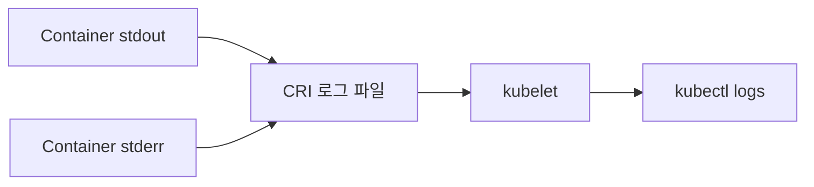
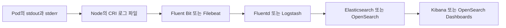
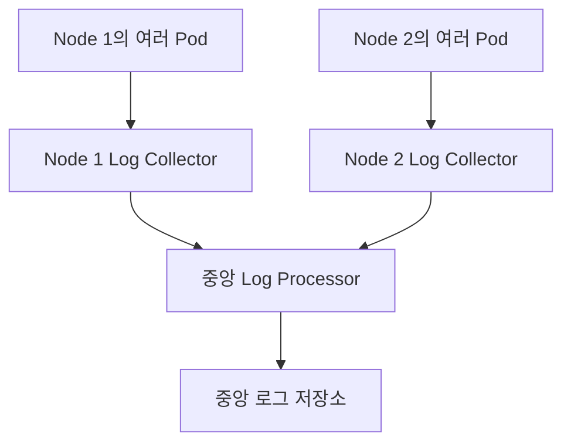
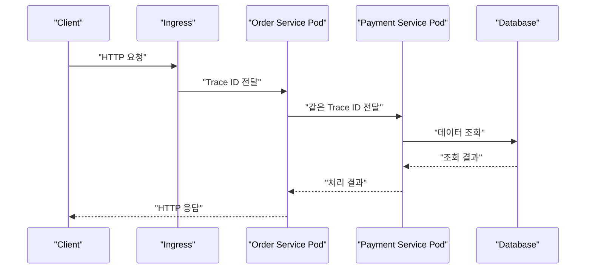

# Ch 11. 컨테이너와 Kubernetes 환경의 로그 관리

# Ch 11. 컨테이너와 Kubernetes 환경의 로그 관리
* toc
{:toc}

---

## 01. 컨테이너와 Kubernetes 환경의 로그 관리

로그는 애플리케이션의 동작 상태를 확인하고 장애 원인을 분석하기 위한 핵심 데이터다. 개발 환경에서는 기능이 의도대로 실행되는지 확인하는 데 사용하고, 운영 환경에서는 요청 처리 과정과 오류 발생 시점을 추적하는 데 사용한다.

기존 서버 환경에서는 애플리케이션 인스턴스 수가 적고 실행 위치가 고정되어 있어 서버에 접속한 뒤 로그 파일을 직접 확인하는 방식도 사용할 수 있었다. 그러나 Kubernetes에서는 Pod와 컨테이너가 수시로 생성되고 제거되며, 하나의 애플리케이션도 여러 Pod에 분산되어 실행된다.

따라서 Kubernetes의 로그는 특정 서버에 접속해 파일을 찾는 방식이 아니라 다음과 같은 중앙 집중형 구조로 관리하는 것이 일반적이다.

1. 애플리케이션이 표준 출력과 표준 에러로 로그를 출력한다.
2. 컨테이너 런타임과 kubelet이 로그를 Node에 기록한다.
3. Node마다 실행되는 Log Collector가 로그를 수집한다.
4. Log Processor가 형식을 정규화하고 Kubernetes 메타데이터를 추가한다.
5. 중앙 저장소에 로그를 보관한다.
6. 검색 및 시각화 도구에서 로그를 조회한다.


#### Kubernetes에서 로그 관리가 어려운 이유

Kubernetes 환경에서는 다음과 같은 특성 때문에 로그 관리가 더 복잡해진다.

- Pod가 장애 복구나 스케일링 과정에서 자주 교체된다.
- 하나의 Deployment가 여러 Pod를 실행한다.
- 하나의 Pod 안에 여러 컨테이너가 존재할 수 있다.
- 요청 하나가 여러 Service와 Pod를 거쳐 처리될 수 있다.
- Pod가 삭제되면 해당 Pod를 기준으로 로그를 조회하기 어렵다.
- Node의 로컬 로그는 보관 기간과 저장 공간이 제한된다.
- 클러스터 외부 시스템의 로그도 함께 확인해야 할 수 있다.

Pod 재생성과 컨테이너 재시작도 구분해야 한다. 컨테이너 프로세스가 종료되어 같은 Pod 안에서 재시작될 수도 있고, 기존 Pod 자체가 삭제된 뒤 새로운 이름과 IP를 가진 Pod가 생성될 수도 있다.

로컬 로그만 사용하면 이전 컨테이너의 일부 로그는 확인할 수 있어도 이미 삭제된 Pod나 오래전에 회전된 로그까지 안정적으로 조회할 수는 없다.

#### 컨테이너의 기본 로그 처리 구조

컨테이너 애플리케이션은 일반적으로 로그 파일을 직접 관리하기보다 표준 출력인 `stdout`과 표준 에러인 `stderr`로 로그를 출력한다.



Kubernetes Node에서 kubelet과 Container Runtime Interface를 지원하는 런타임은 컨테이너의 표준 출력과 표준 에러를 CRI 로그 형식으로 기록한다. 일반적인 Linux Node에서는 `/var/log/pods` 아래에 실제 로그가 저장되고 `/var/log/containers`에 이를 가리키는 링크가 구성될 수 있다.

구체적인 경로와 관리 방식은 Kubernetes 배포 환경과 Container Runtime 설정에 따라 달라질 수 있다.

Docker는 익숙한 컨테이너 도구지만 현재 Kubernetes에서는 containerd나 CRI-O 같은 CRI 호환 런타임을 주로 사용한다. Docker Engine을 사용하는 환경도 별도 CRI 연동 계층이 필요하므로 Docker를 Kubernetes의 기본 런타임이라고 단정해서는 안 된다.

#### kubectl logs를 이용한 로그 확인

가장 기본적인 로그 조회 명령은 다음과 같다.

```bash
kubectl logs my-pod
```

Namespace를 명시하려면 `--namespace` 또는 `-n` 옵션을 사용한다.

```bash
kubectl logs my-pod \
  --namespace production
```

로그를 실시간으로 확인하려면 `--follow` 또는 `-f` 옵션을 사용한다.

```bash
kubectl logs my-pod \
  --namespace production \
  --follow
```

최근 10분 동안 발생한 로그만 확인할 수도 있다.

```bash
kubectl logs my-pod \
  --namespace production \
  --since=10m
```

마지막 200줄만 확인하려면 `--tail`을 사용한다.

```bash
kubectl logs my-pod \
  --namespace production \
  --tail=200
```

##### 여러 컨테이너가 있는 Pod

Pod에 컨테이너가 여러 개 있다면 컨테이너 이름을 지정해야 한다.

```bash
kubectl logs my-pod \
  --namespace production \
  --container application
```

모든 컨테이너 로그를 함께 확인하려면 다음과 같이 실행한다.

```bash
kubectl logs my-pod \
  --namespace production \
  --all-containers=true \
  --prefix=true
```

`--prefix=true`를 사용하면 각 로그가 어느 Pod와 컨테이너에서 발생했는지 구분하기 쉽다.

##### 이전 컨테이너 로그 확인

컨테이너가 같은 Pod 안에서 재시작되었다면 직전 컨테이너 인스턴스의 로그를 확인할 수 있다.

```bash
kubectl logs my-pod \
  --namespace production \
  --container application \
  --previous
```

`--previous`는 같은 Pod 안에서 직전에 종료된 컨테이너 로그를 조회하는 기능이다. 여러 세대의 로그를 계속 보존하는 기능이 아니며, Pod가 삭제되면 사용할 수 없다.

##### 여러 Pod의 로그 확인

Label Selector를 사용하면 동일한 애플리케이션에 속한 여러 Pod의 로그를 확인할 수 있다.

```bash
kubectl logs \
  --namespace production \
  --selector app=my-application \
  --all-containers=true \
  --prefix=true \
  --tail=200
```

여러 Pod의 로그를 볼 수는 있지만 장기간 검색, 필드별 필터링, 통계 분석, 대규모 로그 조회를 위한 기능은 아니다.

#### kubectl logs의 한계

`kubectl logs`는 개발과 장애 초기 분석에 유용하지만 운영 로그 저장소를 대체할 수는 없다.

첫째, 로그 보존 기간이 짧다. Node 저장 공간을 보호하기 위해 kubelet은 컨테이너 로그 파일의 크기와 개수를 제한하고 로그를 회전시킨다. 오래된 로그는 제거될 수 있다.

둘째, Pod가 삭제되면 로그 접근도 어려워진다. Deployment가 Pod를 교체하거나 Node 장애로 Pod가 다른 Node에서 다시 생성되면 새로운 Pod는 기존 Pod의 로컬 로그를 가지지 않는다.

셋째, 요청이 여러 Pod로 분산된다. 레플리카가 많아질수록 어떤 Pod가 특정 요청을 처리했는지 알기 어렵다.

넷째, 검색 기능이 제한적이다. 에러 종류, 사용자 ID, Trace ID, 응답 시간과 같은 구조화된 필드를 기준으로 장기간 검색하기 어렵다.

따라서 `kubectl logs`는 다음 용도로 사용하는 것이 적합하다.

- 배포 직후 기동 상태 확인
- 개발 환경의 간단한 디버깅
- CrashLoopBackOff 원인 확인
- Readiness Probe와 Liveness Probe 실패 확인
- 중앙 로그 시스템에 로그가 도착하지 않을 때 원본 확인

#### 중앙 집중형 로그 관리 구조

운영 환경에서는 각 Node와 Pod에서 발생한 로그를 중앙 저장소로 전송한다.



환경에 따라 중간 Log Processor를 생략하고 Collector가 저장소로 직접 전송할 수도 있다.


각 구성 요소의 역할은 다음과 같다.

| 구분 | 역할 | 대표적인 선택지 |
|---|---|---|
| Log Collector | Node 또는 Pod에서 로그를 읽어 전송한다. | Fluent Bit, Filebeat, Vector |
| Log Processor | 파싱, 필드 추가, 마스킹, 형식 변환을 수행한다. | Fluentd, Logstash |
| Log Storage | 로그를 인덱싱하거나 압축해 보관한다. | Elasticsearch, OpenSearch, Loki |
| Visualizer | 로그 검색, 대시보드, 알림 기능을 제공한다. | Kibana, OpenSearch Dashboards, Grafana |
| Managed Service | 수집부터 저장과 검색까지 관리형으로 제공한다. | CloudWatch Logs 등 |

Collector와 Processor의 역할은 제품에 따라 겹칠 수 있다. Fluent Bit이나 Vector가 로그 수집과 일부 가공을 함께 수행할 수도 있고, Logstash 없이 저장소로 직접 전송할 수도 있다.

#### 로그 수집 방식 비교

Kubernetes에서 사용할 수 있는 대표적인 로그 수집 방식은 다음과 같다.

| 방식 | 장점 | 단점 | 적합한 상황 |
|---|---|---|---|
| 표준 출력과 Node Collector | 애플리케이션과 수집기를 분리할 수 있다. | Node Collector 장애 시 해당 Node 로그 수집이 지연된다. | 일반적인 Kubernetes 애플리케이션 |
| 같은 컨테이너의 수집 프로세스 | 기존 구성을 빠르게 이전할 수 있다. | 프로세스 생명주기와 장애 처리가 복잡하다. | 레거시 마이그레이션 |
| `emptyDir`와 Sidecar | 파일 로그를 별도 컨테이너가 수집할 수 있다. | Pod마다 Sidecar 자원이 추가되고 Pod 삭제 시 파일도 사라진다. | 파일 로그만 지원하는 애플리케이션 |
| 애플리케이션 직접 전송 | 로그가 즉시 외부 시스템으로 전송될 수 있다. | 네트워크 장애와 전송 부하가 애플리케이션에 영향을 줄 수 있다. | 특수한 감사 로그나 전용 전송 요구사항 |

#### 표준 출력과 DaemonSet Collector

Kubernetes에서 가장 일반적인 방식은 애플리케이션이 표준 출력으로 로그를 기록하고, 각 Node의 Collector가 이를 수집하는 구조다.

Collector는 DaemonSet으로 배포하여 Node마다 하나씩 실행할 수 있다.



DaemonSet Collector는 일반적으로 Node의 `/var/log/containers` 또는 `/var/log/pods`를 `hostPath`로 마운트해 로그를 읽는다.

여기서 `emptyDir`와 `hostPath`를 구분해야 한다.

- `emptyDir`는 하나의 Pod에 속하며 같은 Pod의 컨테이너끼리 공유한다.
- `hostPath`는 Node 파일 시스템의 특정 경로를 Pod에 마운트한다.
- 별도 DaemonSet은 다른 Pod의 `emptyDir`에 직접 접근할 수 없다.
- Node 단위 Collector는 일반적으로 Node의 CRI 로그 경로를 `hostPath`로 읽는다.

DaemonSet Collector가 중단되면 해당 Node의 중앙 로그 전송이 지연될 수 있다. 다만 Node의 로컬 로그 파일이 바로 삭제되지 않는다면 Collector 복구 후 읽지 못한 구간을 다시 전송할 수 있다. 정확한 복구 가능 범위는 Collector의 위치 추적 방식, 로컬 로그 회전 설정, 버퍼 설정에 따라 달라진다.

#### 같은 컨테이너에 수집 프로세스를 실행하는 방식

애플리케이션 프로세스와 Log Collector를 하나의 컨테이너에서 함께 실행할 수도 있다.


이 방식은 기존 VM이나 서버 환경에서 사용하던 구성을 빠르게 Kubernetes로 이전할 때 사용할 수 있다. 하지만 다음 문제가 있다.

- 두 프로세스의 시작과 종료 순서를 관리해야 한다.
- 한 프로세스가 종료되었을 때 컨테이너 상태를 판단하기 어렵다.
- 프로세스별 Health Check를 구성하기 어렵다.
- CPU와 Memory 사용량을 프로세스별로 제한하기 어렵다.
- 수집기 변경을 위해 애플리케이션 이미지를 다시 빌드해야 할 수 있다.

컨테이너 하나에 반드시 하나의 프로세스만 실행해야 하는 강제 규칙이 있는 것은 아니다. 다만 독립적으로 배포하고 장애를 격리해야 하는 프로세스는 별도 컨테이너로 분리하는 편이 운영하기 쉽다.

표준 출력 로그라면 Container Runtime이 이미 이를 기록하므로 같은 컨테이너에 별도 Collector를 추가할 필요가 거의 없다.

#### emptyDir와 Sidecar를 이용한 파일 로그 수집

레거시 애플리케이션처럼 파일 로그만 지원한다면 애플리케이션 컨테이너와 Sidecar 컨테이너가 `emptyDir`를 공유하는 방식을 사용할 수 있다.


다음은 애플리케이션 역할의 컨테이너가 파일을 생성하고 Sidecar가 해당 파일을 표준 출력으로 전달하는 간단한 예제다.

```yaml
apiVersion: v1
kind: Pod
metadata:
  name: file-log-sidecar
  labels:
    app: file-log-example
spec:
  containers:
    - name: application
      image: busybox:1.36
      command:
        - /bin/sh
        - -c
      args:
        - |
          while true; do
            echo "$(date -u +%Y-%m-%dT%H:%M:%SZ) application log" \
              >> /var/log/application/application.log
            sleep 5
          done
      resources:
        requests:
          cpu: 10m
          memory: 16Mi
        limits:
          cpu: 100m
          memory: 64Mi
      volumeMounts:
        - name: application-logs
          mountPath: /var/log/application

    - name: log-sidecar
      image: busybox:1.36
      command:
        - /bin/sh
        - -c
      args:
        - tail -n+1 -F /var/log/application/application.log
      resources:
        requests:
          cpu: 10m
          memory: 16Mi
        limits:
          cpu: 100m
          memory: 64Mi
      volumeMounts:
        - name: application-logs
          mountPath: /var/log/application
          readOnly: true

  volumes:
    - name: application-logs
      emptyDir:
        sizeLimit: 100Mi
```

주요 설정은 다음과 같다.

- `application-logs`라는 `emptyDir` Volume을 생성한다.
- 애플리케이션 컨테이너는 파일에 로그를 기록한다.
- Sidecar는 같은 Volume을 읽기 전용으로 마운트한다.
- Sidecar는 파일 내용을 자신의 표준 출력으로 전달한다.
- Node 단위 Collector는 Sidecar의 표준 출력을 수집할 수 있다.
- `sizeLimit`은 Volume이 무제한으로 커지는 위험을 줄인다.

적용 후 Sidecar 로그를 확인한다.

```bash
kubectl apply -f file-log-sidecar.yaml
```

```bash
kubectl logs file-log-sidecar \
  --container log-sidecar \
  --follow
```

`emptyDir`는 Pod와 생명주기를 함께한다. 컨테이너가 재시작되어도 같은 Pod가 유지되는 동안에는 데이터가 남을 수 있지만, Pod가 삭제되면 Volume의 데이터도 사라진다.

파일이 일시적인 버퍼 역할을 할 수는 있지만 영구 보존 장치는 아니다. Collector가 파일을 전송하기 전에 Pod가 삭제되면 아직 전송하지 못한 로그가 유실될 수 있다.

#### 애플리케이션에서 로그를 직접 전송하는 방식

애플리케이션이 HTTP, TCP 또는 전용 프로토콜을 사용해 로그 처리 시스템으로 직접 전송할 수도 있다.


중간 파일이나 Node Collector를 생략할 수 있지만 애플리케이션이 로그 전송 상태의 영향을 직접 받게 된다.

- 동기 전송은 요청 처리 지연을 증가시킬 수 있다.
- 로그 서버 장애가 애플리케이션 장애로 전파될 수 있다.
- 비동기 버퍼는 프로세스 종료 시 로그가 유실될 수 있다.
- 대량 로그는 네트워크 대역폭을 소비한다.
- 수신 시스템이 느려지면 Backpressure 처리가 필요하다.
- 재전송 정책이 잘못되면 중복 로그가 발생할 수 있다.

로그 Processor 앞에 메시지 큐를 두면 급격한 로그 증가를 완충할 수 있지만 큐의 저장 용량, 재처리, 순서, 중복, 장애 복구까지 관리해야 한다.

일반적인 애플리케이션 로그는 표준 출력과 Node Collector 방식이 적합하다. 직접 전송은 보안 감사 로그처럼 별도의 전달 보장이 필요하거나 표준 수집 구조로 처리하기 어려운 요구사항이 있을 때 신중하게 선택해야 한다.

#### 구조화된 로그 사용

중앙 로그 시스템에서는 단순 문자열보다 JSON과 같은 구조화된 로그가 검색과 분석에 유리하다.

```json
{
  "timestamp": "2026-08-31T12:10:35.215Z",
  "level": "ERROR",
  "service": "order-service",
  "environment": "production",
  "cluster": "main-cluster",
  "namespace": "commerce-prod",
  "pod": "order-service-7b6c9ddc5f-abc12",
  "container": "application",
  "trace_id": "7ef40c5a1b414d60a128312fd15d8d42",
  "span_id": "448df2ab128be19a",
  "message": "Payment approval failed",
  "error_type": "PaymentTimeoutException"
}
```

애플리케이션이 작성해야 하는 필드와 Collector가 추가할 수 있는 필드를 구분하는 것이 좋다.

| 필드 | 주로 추가하는 위치 |
|---|---|
| 로그 레벨과 메시지 | 애플리케이션 |
| 서비스 이름 | 애플리케이션 또는 배포 설정 |
| Trace ID와 Span ID | 애플리케이션과 Tracing 도구 |
| Namespace와 Pod 이름 | Kubernetes 메타데이터를 읽는 Collector |
| Container와 Node 이름 | Collector |
| 클러스터와 환경 구분 | Collector 또는 로그 Pipeline |

모든 Kubernetes Label을 무조건 로그 필드에 복사하면 저장 용량과 인덱스 Cardinality가 지나치게 증가할 수 있다. 검색에 필요한 Label만 선별해야 한다.

Java Stack Trace처럼 여러 줄로 출력되는 로그는 Collector의 Multiline 파싱 오류를 일으킬 수 있다. 가능하면 하나의 이벤트를 한 줄의 JSON으로 출력하거나 로그 형식과 Collector 파서를 함께 표준화해야 한다.

#### 분산 환경의 요청 추적

마이크로서비스 환경에서는 하나의 요청이 여러 Service와 Pod를 거쳐 처리될 수 있다.



각 서비스가 서로 다른 Trace ID를 생성하면 하나의 요청에 속한 로그를 연결할 수 없다. 최초 요청에서 생성된 Trace Context를 후속 HTTP 요청과 메시지에 계속 전달해야 한다.

Trace ID는 다음 위치에서 생성할 수 있다.

- 외부 Load Balancer 또는 API Gateway
- Ingress Controller
- 최초 요청을 받은 애플리케이션
- OpenTelemetry와 같은 분산 추적 도구

직접 정의한 `X-Trace-Id` 헤더를 사용할 수도 있지만 가능하면 W3C Trace Context와 OpenTelemetry 기반의 표준화된 분산 추적을 사용하는 것이 좋다.

#### Spring Boot에서 Trace ID를 로그에 추가하기

간단한 실습에서는 Servlet Filter와 MDC를 사용해 요청 단위 Trace ID를 로그에 추가할 수 있다.

```java
package com.example.logging;

import java.io.IOException;
import java.util.UUID;
import java.util.regex.Pattern;

import org.slf4j.MDC;
import org.springframework.stereotype.Component;
import org.springframework.web.filter.OncePerRequestFilter;

import jakarta.servlet.FilterChain;
import jakarta.servlet.ServletException;
import jakarta.servlet.http.HttpServletRequest;
import jakarta.servlet.http.HttpServletResponse;

@Component
public class TraceIdFilter extends OncePerRequestFilter {

    private static final String TRACE_HEADER = "X-Trace-Id";
    private static final String MDC_KEY = "trace_id";
    private static final Pattern SAFE_TRACE_ID =
            Pattern.compile("[A-Za-z0-9._-]{1,64}");

    @Override
    protected void doFilterInternal(
            HttpServletRequest request,
            HttpServletResponse response,
            FilterChain filterChain
    ) throws ServletException, IOException {
        String traceId = resolveTraceId(request.getHeader(TRACE_HEADER));

        MDC.put(MDC_KEY, traceId);
        response.setHeader(TRACE_HEADER, traceId);

        try {
            filterChain.doFilter(request, response);
        } finally {
            MDC.remove(MDC_KEY);
        }
    }

    private String resolveTraceId(String requestedTraceId) {
        if (requestedTraceId != null
                && SAFE_TRACE_ID.matcher(requestedTraceId).matches()) {
            return requestedTraceId;
        }

        return UUID.randomUUID().toString();
    }
}
```

로그 출력 형식에는 MDC 값을 포함한다.

```yaml
logging:
  pattern:
    console: "%d{yyyy-MM-dd'T'HH:mm:ss.SSSXXX} level=%-5level trace_id=%X{trace_id:-} logger=%logger{36} message=%msg%n"
```

MDC는 현재 Thread에 연결되는 데이터이므로 요청 처리가 끝난 뒤 반드시 `finally`에서 제거해야 한다. 제거하지 않으면 Thread Pool에서 다음 요청이 이전 Trace ID를 사용할 수 있다.

또한 다음 사항을 주의해야 한다.

- 다른 서비스로 HTTP 요청을 보낼 때 Trace ID 헤더를 전달해야 한다.
- Kafka와 같은 메시지 시스템을 사용하면 메시지 Header에 Trace Context를 전달해야 한다.
- `@Async`나 별도 Executor에서는 MDC가 자동으로 전달되지 않을 수 있다.
- WebFlux와 같은 Reactive 환경은 ThreadLocal 기반 MDC만으로 처리하기 어렵다.
- 사용자 입력 Trace ID는 길이와 허용 문자를 검증해야 한다.

이 코드는 Trace ID 연결 원리를 확인하기 위한 예제다. 실제 분산 환경에서는 Spring Boot의 Micrometer Tracing과 OpenTelemetry를 사용해 Trace ID와 Span ID 생성 및 전파를 표준화하는 것이 더 적합하다.

#### 로그, Metric, Trace의 구분

로그 수집만으로 모든 운영 상태를 파악할 수 있는 것은 아니다.

| 데이터 | 주요 목적 | 예시 |
|---|---|---|
| Log | 개별 이벤트와 오류의 상세 내용 확인 | 예외 메시지, 요청 처리 결과 |
| Metric | 일정 시간 동안의 수치 변화 확인 | CPU 사용량, 요청 수, 오류율 |
| Trace | 분산 요청의 전체 호출 경로와 지연 분석 | Service별 처리 시간 |
| APM | 애플리케이션 내부 동작과 성능 분석 | 느린 메서드, 외부 호출 병목 |

Prometheus는 Kubernetes와 애플리케이션의 Metric을 수집하고, Grafana는 Metric과 Log를 시각화할 수 있다. OpenTelemetry는 Trace, Metric, Log를 공통 관측성 체계로 연결하는 데 사용할 수 있다.

로그에 Trace ID가 포함되어 있으면 느린 요청을 Metric이나 Trace에서 발견한 뒤 동일한 Trace ID로 상세 로그를 검색할 수 있다.

#### 클러스터 외부 로그와의 통합

실제 시스템은 Kubernetes 내부에서만 동작하지 않는다. 다음과 같은 외부 구성 요소가 함께 사용될 수 있다.

- 외부 Load Balancer
- CDN과 API Gateway
- 관리형 데이터베이스
- 메시지 브로커
- 외부 인증 시스템
- 클라우드 관리형 서비스
- 별도 VM에서 실행되는 레거시 애플리케이션

장애 분석 시 Kubernetes Pod 로그만 확인하면 전체 요청 흐름을 파악하기 어렵다. 가능하다면 외부 시스템 로그도 동일한 검색 체계에서 조회하거나 공통 Trace ID와 시간 기준으로 연결할 수 있어야 한다.

로그를 통합할 때는 각 이벤트에 다음 구분값을 포함하는 것이 좋다.

- 환경
- 클러스터
- Namespace
- 서비스
- 인스턴스 또는 Pod
- 로그 유형
- Trace ID
- 이벤트 발생 시각

개발과 운영 로그를 같은 저장소에 보관하더라도 접근 권한과 Retention 정책은 분리해야 한다. 개발자가 운영 개인정보나 보안 로그에 불필요하게 접근할 수 없도록 권한을 제한해야 한다.

#### 로그 처리 성능과 저장 공간

Kubernetes 환경에서는 Pod 수가 증가하면서 로그 발생량도 빠르게 늘어날 수 있다. Collector와 저장소가 처리할 수 있는 양보다 많은 로그가 발생하면 다음 문제가 생긴다.

- Collector의 CPU와 Memory 사용량 증가
- Node 디스크 사용량 증가
- 전송 지연과 버퍼 적체
- 저장소 인덱싱 지연
- 검색 응답 속도 저하
- 로그 유실 또는 중복 전송
- 로그 저장 비용 증가

##### Probe와 정상 요청 로그 줄이기

Liveness Probe와 Readiness Probe가 몇 초마다 호출될 때마다 INFO 로그를 기록하면 실제로 필요한 로그보다 Health Check 로그가 더 많아질 수 있다.

다음과 같은 정책을 적용할 수 있다.

- 정상 Probe 요청은 Access Log에서 제외한다.
- Probe 실패 로그는 유지한다.
- 반복되는 정상 요청은 Sampling한다.
- 정적 파일과 헬스 체크 경로의 로그 레벨을 조정한다.
- Collector에서 불필요한 로그를 필터링한다.

애플리케이션에서 모든 로그를 생성한 뒤 Collector에서 버리는 방식은 Node와 Collector 자원을 이미 사용한 뒤다. 확실히 불필요한 로그라면 가능한 한 발생 단계에서 줄이는 것이 효율적이다.

##### 로그 보존 기간 설정

모든 로그를 무기한 저장하는 것은 현실적이지 않다. 로그의 중요도와 사용 목적에 따라 보존 기간을 구분해야 한다.

| 로그 종류 | 보존 전략 |
|---|---|
| 일반 애플리케이션 INFO 로그 | 비교적 짧은 기간 보관 |
| ERROR와 장애 분석 로그 | 일반 로그보다 긴 기간 보관 |
| 보안 및 감사 로그 | 정책과 법적 요구사항에 따라 별도 보관 |
| 장기 분석용 로그 | 저비용 Object Storage로 이동 |
| 개발 환경 로그 | 운영보다 짧은 기간 보관 |

정확한 보존 기간은 서비스 특성, 장애 분석 주기, 개인정보 정책, 보안 요구사항, 비용을 함께 고려해 결정해야 한다.

##### 민감 정보 기록 금지

로그에는 다음 정보가 포함되지 않도록 주의해야 한다.

- 비밀번호
- Access Token과 Refresh Token
- 인증 Cookie
- 주민등록번호
- 결제 정보
- 전체 개인정보
- Secret과 API Key

수집 단계에서 마스킹할 수도 있지만 애플리케이션이 민감 정보를 로그로 출력하지 않는 것이 가장 안전하다.

#### 실무적인 로그 관리 기준

Kubernetes 로그 시스템을 설계할 때는 다음 항목을 확인해야 한다.

- 애플리케이션 로그를 기본적으로 `stdout`과 `stderr`로 출력한다.
- Node마다 DaemonSet Collector를 배치한다.
- Namespace, Pod, Container, Node 메타데이터를 추가한다.
- 서비스 간 Trace Context 전달 방식을 통일한다.
- 가능한 한 구조화된 JSON 로그를 사용한다.
- Java Stack Trace를 처리할 Multiline 정책을 마련한다.
- 개발, 스테이지, 운영 환경을 로그 필드로 구분한다.
- 불필요한 Probe와 정상 요청 로그를 줄인다.
- 민감 정보를 애플리케이션 로그에 남기지 않는다.
- Node 로그 회전과 Collector 버퍼 크기를 함께 관리한다.
- 저장소의 보존 기간과 삭제 정책을 정의한다.
- Collector 장애와 저장소 장애에 대한 Backpressure 정책을 마련한다.
- Log, Metric, Trace를 서로 연결할 수 있도록 구성한다.
- 클러스터 외부 시스템도 공통 시간과 Trace ID로 추적한다.
- 로그 저장소와 대시보드에 최소 권한 접근 제어를 적용한다.

### 정리

Kubernetes에서 컨테이너의 표준 출력과 표준 에러는 Container Runtime의 CRI 로그 형식으로 Node에 저장되며 `kubectl logs`를 통해 확인할 수 있다. 하지만 Node 로컬 로그는 회전되고 Pod도 수시로 교체되기 때문에 장기 보존이나 운영 검색 용도로 사용하기 어렵다.

운영 환경에서는 애플리케이션이 표준 출력으로 로그를 기록하고, Node마다 실행되는 DaemonSet Collector가 로그를 수집해 중앙 저장소로 전송하는 구성이 일반적이다. 파일 로그만 지원하는 애플리케이션은 `emptyDir`와 Sidecar를 사용할 수 있지만 Pod별 자원 비용과 로그 유실 가능성을 함께 고려해야 한다.

여러 서비스와 Pod를 거치는 요청을 분석하려면 최초 요청에서 생성한 Trace ID를 후속 호출에 전달하고 모든 로그에 포함해야 한다. 단순한 사용자 정의 헤더도 사용할 수 있지만 규모가 커지면 OpenTelemetry와 같은 표준 분산 추적 체계를 사용하는 것이 유리하다.

마지막으로 로그는 많이 수집하는 것보다 필요한 데이터를 일관된 형식으로 남기는 것이 중요하다. 구조화된 로그, 적절한 보존 기간, 민감 정보 보호, Probe 로그 제어, Collector 처리량 관리가 함께 이루어져야 안정적인 Kubernetes 로그 관리 환경을 구성할 수 있다.
