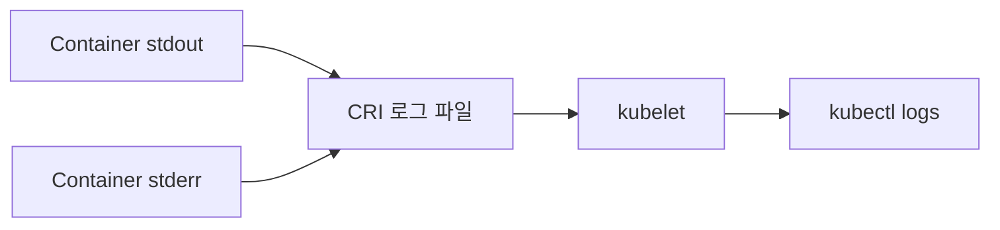
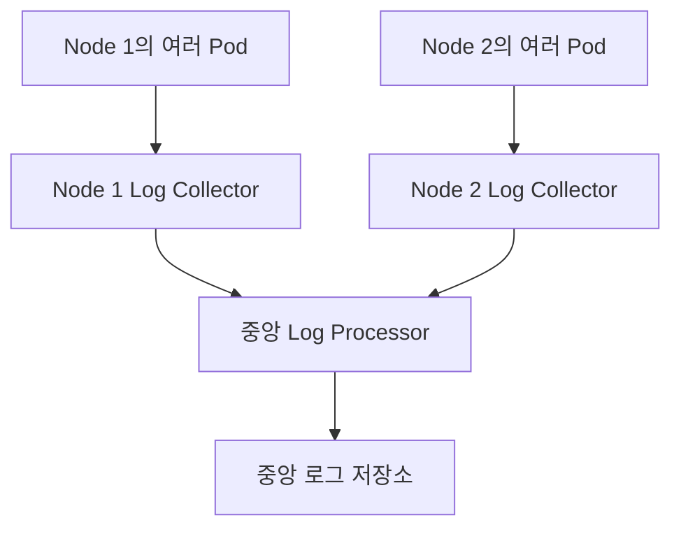
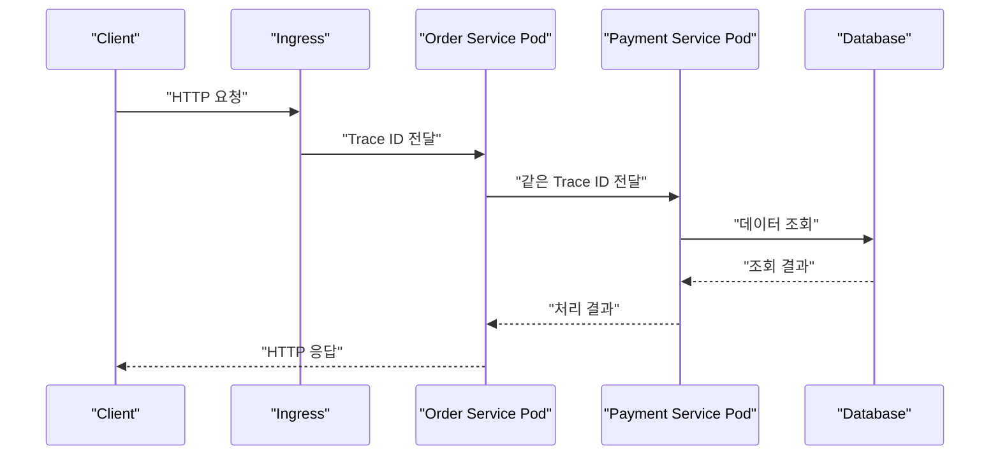
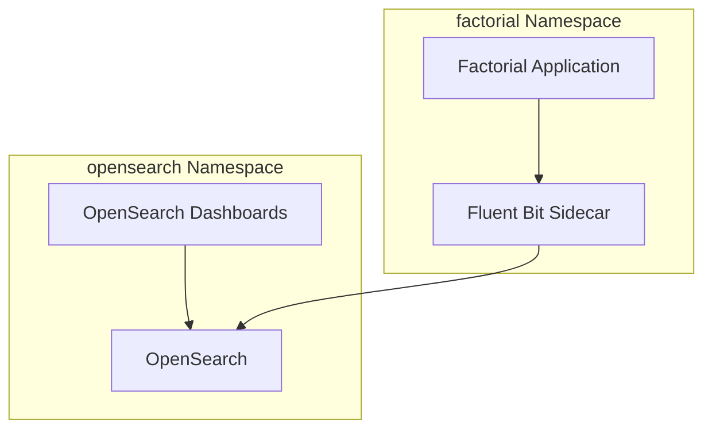

# Ch 11. 컨테이너와 Kubernetes 환경의 로그 관리

# Ch 11. 컨테이너와 Kubernetes 환경의 로그 관리
* toc
{:toc}

---

## 01. 컨테이너와 Kubernetes 환경의 로그 관리

로그는 애플리케이션의 동작 상태를 확인하고 장애 원인을 분석하기 위한 핵심 데이터다. 개발 환경에서는 기능이 의도대로 실행되는지 확인하는 데 사용하고, 운영 환경에서는 요청 처리 과정과 오류 발생 시점을 추적하는 데 사용한다.

기존 서버 환경에서는 애플리케이션 인스턴스 수가 적고 실행 위치가 고정되어 있어 서버에 접속한 뒤 로그 파일을 직접 확인하는 방식도 사용할 수 있었다. 그러나 Kubernetes에서는 Pod와 컨테이너가 수시로 생성되고 제거되며, 하나의 애플리케이션도 여러 Pod에 분산되어 실행된다.

따라서 Kubernetes의 로그는 특정 서버에 접속해 파일을 찾는 방식이 아니라 다음과 같은 중앙 집중형 구조로 관리하는 것이 일반적이다.

1. 애플리케이션이 표준 출력과 표준 에러로 로그를 출력한다.
2. 컨테이너 런타임과 kubelet이 로그를 Node에 기록한다.
3. Node마다 실행되는 Log Collector가 로그를 수집한다.
4. Log Processor가 형식을 정규화하고 Kubernetes 메타데이터를 추가한다.
5. 중앙 저장소에 로그를 보관한다.
6. 검색 및 시각화 도구에서 로그를 조회한다.


#### Kubernetes에서 로그 관리가 어려운 이유

Kubernetes 환경에서는 다음과 같은 특성 때문에 로그 관리가 더 복잡해진다.

- Pod가 장애 복구나 스케일링 과정에서 자주 교체된다.
- 하나의 Deployment가 여러 Pod를 실행한다.
- 하나의 Pod 안에 여러 컨테이너가 존재할 수 있다.
- 요청 하나가 여러 Service와 Pod를 거쳐 처리될 수 있다.
- Pod가 삭제되면 해당 Pod를 기준으로 로그를 조회하기 어렵다.
- Node의 로컬 로그는 보관 기간과 저장 공간이 제한된다.
- 클러스터 외부 시스템의 로그도 함께 확인해야 할 수 있다.

Pod 재생성과 컨테이너 재시작도 구분해야 한다. 컨테이너 프로세스가 종료되어 같은 Pod 안에서 재시작될 수도 있고, 기존 Pod 자체가 삭제된 뒤 새로운 이름과 IP를 가진 Pod가 생성될 수도 있다.

로컬 로그만 사용하면 이전 컨테이너의 일부 로그는 확인할 수 있어도 이미 삭제된 Pod나 오래전에 회전된 로그까지 안정적으로 조회할 수는 없다.

#### 컨테이너의 기본 로그 처리 구조

컨테이너 애플리케이션은 일반적으로 로그 파일을 직접 관리하기보다 표준 출력인 `stdout`과 표준 에러인 `stderr`로 로그를 출력한다.



Kubernetes Node에서 kubelet과 Container Runtime Interface를 지원하는 런타임은 컨테이너의 표준 출력과 표준 에러를 CRI 로그 형식으로 기록한다. 일반적인 Linux Node에서는 `/var/log/pods` 아래에 실제 로그가 저장되고 `/var/log/containers`에 이를 가리키는 링크가 구성될 수 있다.

구체적인 경로와 관리 방식은 Kubernetes 배포 환경과 Container Runtime 설정에 따라 달라질 수 있다.

Docker는 익숙한 컨테이너 도구지만 현재 Kubernetes에서는 containerd나 CRI-O 같은 CRI 호환 런타임을 주로 사용한다. Docker Engine을 사용하는 환경도 별도 CRI 연동 계층이 필요하므로 Docker를 Kubernetes의 기본 런타임이라고 단정해서는 안 된다.

#### kubectl logs를 이용한 로그 확인

가장 기본적인 로그 조회 명령은 다음과 같다.

```bash
kubectl logs my-pod
```

Namespace를 명시하려면 `--namespace` 또는 `-n` 옵션을 사용한다.

```bash
kubectl logs my-pod \
  --namespace production
```

로그를 실시간으로 확인하려면 `--follow` 또는 `-f` 옵션을 사용한다.

```bash
kubectl logs my-pod \
  --namespace production \
  --follow
```

최근 10분 동안 발생한 로그만 확인할 수도 있다.

```bash
kubectl logs my-pod \
  --namespace production \
  --since=10m
```

마지막 200줄만 확인하려면 `--tail`을 사용한다.

```bash
kubectl logs my-pod \
  --namespace production \
  --tail=200
```

##### 여러 컨테이너가 있는 Pod

Pod에 컨테이너가 여러 개 있다면 컨테이너 이름을 지정해야 한다.

```bash
kubectl logs my-pod \
  --namespace production \
  --container application
```

모든 컨테이너 로그를 함께 확인하려면 다음과 같이 실행한다.

```bash
kubectl logs my-pod \
  --namespace production \
  --all-containers=true \
  --prefix=true
```

`--prefix=true`를 사용하면 각 로그가 어느 Pod와 컨테이너에서 발생했는지 구분하기 쉽다.

##### 이전 컨테이너 로그 확인

컨테이너가 같은 Pod 안에서 재시작되었다면 직전 컨테이너 인스턴스의 로그를 확인할 수 있다.

```bash
kubectl logs my-pod \
  --namespace production \
  --container application \
  --previous
```

`--previous`는 같은 Pod 안에서 직전에 종료된 컨테이너 로그를 조회하는 기능이다. 여러 세대의 로그를 계속 보존하는 기능이 아니며, Pod가 삭제되면 사용할 수 없다.

##### 여러 Pod의 로그 확인

Label Selector를 사용하면 동일한 애플리케이션에 속한 여러 Pod의 로그를 확인할 수 있다.

```bash
kubectl logs \
  --namespace production \
  --selector app=my-application \
  --all-containers=true \
  --prefix=true \
  --tail=200
```

여러 Pod의 로그를 볼 수는 있지만 장기간 검색, 필드별 필터링, 통계 분석, 대규모 로그 조회를 위한 기능은 아니다.

#### kubectl logs의 한계

`kubectl logs`는 개발과 장애 초기 분석에 유용하지만 운영 로그 저장소를 대체할 수는 없다.

첫째, 로그 보존 기간이 짧다. Node 저장 공간을 보호하기 위해 kubelet은 컨테이너 로그 파일의 크기와 개수를 제한하고 로그를 회전시킨다. 오래된 로그는 제거될 수 있다.

둘째, Pod가 삭제되면 로그 접근도 어려워진다. Deployment가 Pod를 교체하거나 Node 장애로 Pod가 다른 Node에서 다시 생성되면 새로운 Pod는 기존 Pod의 로컬 로그를 가지지 않는다.

셋째, 요청이 여러 Pod로 분산된다. 레플리카가 많아질수록 어떤 Pod가 특정 요청을 처리했는지 알기 어렵다.

넷째, 검색 기능이 제한적이다. 에러 종류, 사용자 ID, Trace ID, 응답 시간과 같은 구조화된 필드를 기준으로 장기간 검색하기 어렵다.

따라서 `kubectl logs`는 다음 용도로 사용하는 것이 적합하다.

- 배포 직후 기동 상태 확인
- 개발 환경의 간단한 디버깅
- CrashLoopBackOff 원인 확인
- Readiness Probe와 Liveness Probe 실패 확인
- 중앙 로그 시스템에 로그가 도착하지 않을 때 원본 확인

#### 중앙 집중형 로그 관리 구조

운영 환경에서는 각 Node와 Pod에서 발생한 로그를 중앙 저장소로 전송한다.


환경에 따라 중간 Log Processor를 생략하고 Collector가 저장소로 직접 전송할 수도 있다.


각 구성 요소의 역할은 다음과 같다.

| 구분 | 역할 | 대표적인 선택지 |
|---|---|---|
| Log Collector | Node 또는 Pod에서 로그를 읽어 전송한다. | Fluent Bit, Filebeat, Vector |
| Log Processor | 파싱, 필드 추가, 마스킹, 형식 변환을 수행한다. | Fluentd, Logstash |
| Log Storage | 로그를 인덱싱하거나 압축해 보관한다. | Elasticsearch, OpenSearch, Loki |
| Visualizer | 로그 검색, 대시보드, 알림 기능을 제공한다. | Kibana, OpenSearch Dashboards, Grafana |
| Managed Service | 수집부터 저장과 검색까지 관리형으로 제공한다. | CloudWatch Logs 등 |

Collector와 Processor의 역할은 제품에 따라 겹칠 수 있다. Fluent Bit이나 Vector가 로그 수집과 일부 가공을 함께 수행할 수도 있고, Logstash 없이 저장소로 직접 전송할 수도 있다.

#### 로그 수집 방식 비교

Kubernetes에서 사용할 수 있는 대표적인 로그 수집 방식은 다음과 같다.

| 방식 | 장점 | 단점 | 적합한 상황 |
|---|---|---|---|
| 표준 출력과 Node Collector | 애플리케이션과 수집기를 분리할 수 있다. | Node Collector 장애 시 해당 Node 로그 수집이 지연된다. | 일반적인 Kubernetes 애플리케이션 |
| 같은 컨테이너의 수집 프로세스 | 기존 구성을 빠르게 이전할 수 있다. | 프로세스 생명주기와 장애 처리가 복잡하다. | 레거시 마이그레이션 |
| `emptyDir`와 Sidecar | 파일 로그를 별도 컨테이너가 수집할 수 있다. | Pod마다 Sidecar 자원이 추가되고 Pod 삭제 시 파일도 사라진다. | 파일 로그만 지원하는 애플리케이션 |
| 애플리케이션 직접 전송 | 로그가 즉시 외부 시스템으로 전송될 수 있다. | 네트워크 장애와 전송 부하가 애플리케이션에 영향을 줄 수 있다. | 특수한 감사 로그나 전용 전송 요구사항 |

#### 표준 출력과 DaemonSet Collector

Kubernetes에서 가장 일반적인 방식은 애플리케이션이 표준 출력으로 로그를 기록하고, 각 Node의 Collector가 이를 수집하는 구조다.

Collector는 DaemonSet으로 배포하여 Node마다 하나씩 실행할 수 있다.



DaemonSet Collector는 일반적으로 Node의 `/var/log/containers` 또는 `/var/log/pods`를 `hostPath`로 마운트해 로그를 읽는다.

여기서 `emptyDir`와 `hostPath`를 구분해야 한다.

- `emptyDir`는 하나의 Pod에 속하며 같은 Pod의 컨테이너끼리 공유한다.
- `hostPath`는 Node 파일 시스템의 특정 경로를 Pod에 마운트한다.
- 별도 DaemonSet은 다른 Pod의 `emptyDir`에 직접 접근할 수 없다.
- Node 단위 Collector는 일반적으로 Node의 CRI 로그 경로를 `hostPath`로 읽는다.

DaemonSet Collector가 중단되면 해당 Node의 중앙 로그 전송이 지연될 수 있다. 다만 Node의 로컬 로그 파일이 바로 삭제되지 않는다면 Collector 복구 후 읽지 못한 구간을 다시 전송할 수 있다. 정확한 복구 가능 범위는 Collector의 위치 추적 방식, 로컬 로그 회전 설정, 버퍼 설정에 따라 달라진다.

#### 같은 컨테이너에 수집 프로세스를 실행하는 방식

애플리케이션 프로세스와 Log Collector를 하나의 컨테이너에서 함께 실행할 수도 있다.


이 방식은 기존 VM이나 서버 환경에서 사용하던 구성을 빠르게 Kubernetes로 이전할 때 사용할 수 있다. 하지만 다음 문제가 있다.

- 두 프로세스의 시작과 종료 순서를 관리해야 한다.
- 한 프로세스가 종료되었을 때 컨테이너 상태를 판단하기 어렵다.
- 프로세스별 Health Check를 구성하기 어렵다.
- CPU와 Memory 사용량을 프로세스별로 제한하기 어렵다.
- 수집기 변경을 위해 애플리케이션 이미지를 다시 빌드해야 할 수 있다.

컨테이너 하나에 반드시 하나의 프로세스만 실행해야 하는 강제 규칙이 있는 것은 아니다. 다만 독립적으로 배포하고 장애를 격리해야 하는 프로세스는 별도 컨테이너로 분리하는 편이 운영하기 쉽다.

표준 출력 로그라면 Container Runtime이 이미 이를 기록하므로 같은 컨테이너에 별도 Collector를 추가할 필요가 거의 없다.

#### emptyDir와 Sidecar를 이용한 파일 로그 수집

레거시 애플리케이션처럼 파일 로그만 지원한다면 애플리케이션 컨테이너와 Sidecar 컨테이너가 `emptyDir`를 공유하는 방식을 사용할 수 있다.


다음은 애플리케이션 역할의 컨테이너가 파일을 생성하고 Sidecar가 해당 파일을 표준 출력으로 전달하는 간단한 예제다.

```yaml
apiVersion: v1
kind: Pod
metadata:
  name: file-log-sidecar
  labels:
    app: file-log-example
spec:
  containers:
    - name: application
      image: busybox:1.36
      command:
        - /bin/sh
        - -c
      args:
        - |
          while true; do
            echo "$(date -u +%Y-%m-%dT%H:%M:%SZ) application log" \
              >> /var/log/application/application.log
            sleep 5
          done
      resources:
        requests:
          cpu: 10m
          memory: 16Mi
        limits:
          cpu: 100m
          memory: 64Mi
      volumeMounts:
        - name: application-logs
          mountPath: /var/log/application

    - name: log-sidecar
      image: busybox:1.36
      command:
        - /bin/sh
        - -c
      args:
        - tail -n+1 -F /var/log/application/application.log
      resources:
        requests:
          cpu: 10m
          memory: 16Mi
        limits:
          cpu: 100m
          memory: 64Mi
      volumeMounts:
        - name: application-logs
          mountPath: /var/log/application
          readOnly: true

  volumes:
    - name: application-logs
      emptyDir:
        sizeLimit: 100Mi
```

주요 설정은 다음과 같다.

- `application-logs`라는 `emptyDir` Volume을 생성한다.
- 애플리케이션 컨테이너는 파일에 로그를 기록한다.
- Sidecar는 같은 Volume을 읽기 전용으로 마운트한다.
- Sidecar는 파일 내용을 자신의 표준 출력으로 전달한다.
- Node 단위 Collector는 Sidecar의 표준 출력을 수집할 수 있다.
- `sizeLimit`은 Volume이 무제한으로 커지는 위험을 줄인다.

적용 후 Sidecar 로그를 확인한다.

```bash
kubectl apply -f file-log-sidecar.yaml
```

```bash
kubectl logs file-log-sidecar \
  --container log-sidecar \
  --follow
```

`emptyDir`는 Pod와 생명주기를 함께한다. 컨테이너가 재시작되어도 같은 Pod가 유지되는 동안에는 데이터가 남을 수 있지만, Pod가 삭제되면 Volume의 데이터도 사라진다.

파일이 일시적인 버퍼 역할을 할 수는 있지만 영구 보존 장치는 아니다. Collector가 파일을 전송하기 전에 Pod가 삭제되면 아직 전송하지 못한 로그가 유실될 수 있다.

#### 애플리케이션에서 로그를 직접 전송하는 방식

애플리케이션이 HTTP, TCP 또는 전용 프로토콜을 사용해 로그 처리 시스템으로 직접 전송할 수도 있다.


중간 파일이나 Node Collector를 생략할 수 있지만 애플리케이션이 로그 전송 상태의 영향을 직접 받게 된다.

- 동기 전송은 요청 처리 지연을 증가시킬 수 있다.
- 로그 서버 장애가 애플리케이션 장애로 전파될 수 있다.
- 비동기 버퍼는 프로세스 종료 시 로그가 유실될 수 있다.
- 대량 로그는 네트워크 대역폭을 소비한다.
- 수신 시스템이 느려지면 Backpressure 처리가 필요하다.
- 재전송 정책이 잘못되면 중복 로그가 발생할 수 있다.

로그 Processor 앞에 메시지 큐를 두면 급격한 로그 증가를 완충할 수 있지만 큐의 저장 용량, 재처리, 순서, 중복, 장애 복구까지 관리해야 한다.

일반적인 애플리케이션 로그는 표준 출력과 Node Collector 방식이 적합하다. 직접 전송은 보안 감사 로그처럼 별도의 전달 보장이 필요하거나 표준 수집 구조로 처리하기 어려운 요구사항이 있을 때 신중하게 선택해야 한다.

#### 구조화된 로그 사용

중앙 로그 시스템에서는 단순 문자열보다 JSON과 같은 구조화된 로그가 검색과 분석에 유리하다.

```json
{
  "timestamp": "2026-08-31T12:10:35.215Z",
  "level": "ERROR",
  "service": "order-service",
  "environment": "production",
  "cluster": "main-cluster",
  "namespace": "commerce-prod",
  "pod": "order-service-7b6c9ddc5f-abc12",
  "container": "application",
  "trace_id": "7ef40c5a1b414d60a128312fd15d8d42",
  "span_id": "448df2ab128be19a",
  "message": "Payment approval failed",
  "error_type": "PaymentTimeoutException"
}
```

애플리케이션이 작성해야 하는 필드와 Collector가 추가할 수 있는 필드를 구분하는 것이 좋다.

| 필드 | 주로 추가하는 위치 |
|---|---|
| 로그 레벨과 메시지 | 애플리케이션 |
| 서비스 이름 | 애플리케이션 또는 배포 설정 |
| Trace ID와 Span ID | 애플리케이션과 Tracing 도구 |
| Namespace와 Pod 이름 | Kubernetes 메타데이터를 읽는 Collector |
| Container와 Node 이름 | Collector |
| 클러스터와 환경 구분 | Collector 또는 로그 Pipeline |

모든 Kubernetes Label을 무조건 로그 필드에 복사하면 저장 용량과 인덱스 Cardinality가 지나치게 증가할 수 있다. 검색에 필요한 Label만 선별해야 한다.

Java Stack Trace처럼 여러 줄로 출력되는 로그는 Collector의 Multiline 파싱 오류를 일으킬 수 있다. 가능하면 하나의 이벤트를 한 줄의 JSON으로 출력하거나 로그 형식과 Collector 파서를 함께 표준화해야 한다.

#### 분산 환경의 요청 추적

마이크로서비스 환경에서는 하나의 요청이 여러 Service와 Pod를 거쳐 처리될 수 있다.



각 서비스가 서로 다른 Trace ID를 생성하면 하나의 요청에 속한 로그를 연결할 수 없다. 최초 요청에서 생성된 Trace Context를 후속 HTTP 요청과 메시지에 계속 전달해야 한다.

Trace ID는 다음 위치에서 생성할 수 있다.

- 외부 Load Balancer 또는 API Gateway
- Ingress Controller
- 최초 요청을 받은 애플리케이션
- OpenTelemetry와 같은 분산 추적 도구

직접 정의한 `X-Trace-Id` 헤더를 사용할 수도 있지만 가능하면 W3C Trace Context와 OpenTelemetry 기반의 표준화된 분산 추적을 사용하는 것이 좋다.

#### Spring Boot에서 Trace ID를 로그에 추가하기

간단한 실습에서는 Servlet Filter와 MDC를 사용해 요청 단위 Trace ID를 로그에 추가할 수 있다.

```java
package com.example.logging;

import java.io.IOException;
import java.util.UUID;
import java.util.regex.Pattern;

import org.slf4j.MDC;
import org.springframework.stereotype.Component;
import org.springframework.web.filter.OncePerRequestFilter;

import jakarta.servlet.FilterChain;
import jakarta.servlet.ServletException;
import jakarta.servlet.http.HttpServletRequest;
import jakarta.servlet.http.HttpServletResponse;

@Component
public class TraceIdFilter extends OncePerRequestFilter {

    private static final String TRACE_HEADER = "X-Trace-Id";
    private static final String MDC_KEY = "trace_id";
    private static final Pattern SAFE_TRACE_ID =
            Pattern.compile("[A-Za-z0-9._-]{1,64}");

    @Override
    protected void doFilterInternal(
            HttpServletRequest request,
            HttpServletResponse response,
            FilterChain filterChain
    ) throws ServletException, IOException {
        String traceId = resolveTraceId(request.getHeader(TRACE_HEADER));

        MDC.put(MDC_KEY, traceId);
        response.setHeader(TRACE_HEADER, traceId);

        try {
            filterChain.doFilter(request, response);
        } finally {
            MDC.remove(MDC_KEY);
        }
    }

    private String resolveTraceId(String requestedTraceId) {
        if (requestedTraceId != null
                && SAFE_TRACE_ID.matcher(requestedTraceId).matches()) {
            return requestedTraceId;
        }

        return UUID.randomUUID().toString();
    }
}
```

로그 출력 형식에는 MDC 값을 포함한다.

```yaml
logging:
  pattern:
    console: "%d{yyyy-MM-dd'T'HH:mm:ss.SSSXXX} level=%-5level trace_id=%X{trace_id:-} logger=%logger{36} message=%msg%n"
```

MDC는 현재 Thread에 연결되는 데이터이므로 요청 처리가 끝난 뒤 반드시 `finally`에서 제거해야 한다. 제거하지 않으면 Thread Pool에서 다음 요청이 이전 Trace ID를 사용할 수 있다.

또한 다음 사항을 주의해야 한다.

- 다른 서비스로 HTTP 요청을 보낼 때 Trace ID 헤더를 전달해야 한다.
- Kafka와 같은 메시지 시스템을 사용하면 메시지 Header에 Trace Context를 전달해야 한다.
- `@Async`나 별도 Executor에서는 MDC가 자동으로 전달되지 않을 수 있다.
- WebFlux와 같은 Reactive 환경은 ThreadLocal 기반 MDC만으로 처리하기 어렵다.
- 사용자 입력 Trace ID는 길이와 허용 문자를 검증해야 한다.

이 코드는 Trace ID 연결 원리를 확인하기 위한 예제다. 실제 분산 환경에서는 Spring Boot의 Micrometer Tracing과 OpenTelemetry를 사용해 Trace ID와 Span ID 생성 및 전파를 표준화하는 것이 더 적합하다.

#### 로그, Metric, Trace의 구분

로그 수집만으로 모든 운영 상태를 파악할 수 있는 것은 아니다.

| 데이터 | 주요 목적 | 예시 |
|---|---|---|
| Log | 개별 이벤트와 오류의 상세 내용 확인 | 예외 메시지, 요청 처리 결과 |
| Metric | 일정 시간 동안의 수치 변화 확인 | CPU 사용량, 요청 수, 오류율 |
| Trace | 분산 요청의 전체 호출 경로와 지연 분석 | Service별 처리 시간 |
| APM | 애플리케이션 내부 동작과 성능 분석 | 느린 메서드, 외부 호출 병목 |

Prometheus는 Kubernetes와 애플리케이션의 Metric을 수집하고, Grafana는 Metric과 Log를 시각화할 수 있다. OpenTelemetry는 Trace, Metric, Log를 공통 관측성 체계로 연결하는 데 사용할 수 있다.

로그에 Trace ID가 포함되어 있으면 느린 요청을 Metric이나 Trace에서 발견한 뒤 동일한 Trace ID로 상세 로그를 검색할 수 있다.

#### 클러스터 외부 로그와의 통합

실제 시스템은 Kubernetes 내부에서만 동작하지 않는다. 다음과 같은 외부 구성 요소가 함께 사용될 수 있다.

- 외부 Load Balancer
- CDN과 API Gateway
- 관리형 데이터베이스
- 메시지 브로커
- 외부 인증 시스템
- 클라우드 관리형 서비스
- 별도 VM에서 실행되는 레거시 애플리케이션

장애 분석 시 Kubernetes Pod 로그만 확인하면 전체 요청 흐름을 파악하기 어렵다. 가능하다면 외부 시스템 로그도 동일한 검색 체계에서 조회하거나 공통 Trace ID와 시간 기준으로 연결할 수 있어야 한다.

로그를 통합할 때는 각 이벤트에 다음 구분값을 포함하는 것이 좋다.

- 환경
- 클러스터
- Namespace
- 서비스
- 인스턴스 또는 Pod
- 로그 유형
- Trace ID
- 이벤트 발생 시각

개발과 운영 로그를 같은 저장소에 보관하더라도 접근 권한과 Retention 정책은 분리해야 한다. 개발자가 운영 개인정보나 보안 로그에 불필요하게 접근할 수 없도록 권한을 제한해야 한다.

#### 로그 처리 성능과 저장 공간

Kubernetes 환경에서는 Pod 수가 증가하면서 로그 발생량도 빠르게 늘어날 수 있다. Collector와 저장소가 처리할 수 있는 양보다 많은 로그가 발생하면 다음 문제가 생긴다.

- Collector의 CPU와 Memory 사용량 증가
- Node 디스크 사용량 증가
- 전송 지연과 버퍼 적체
- 저장소 인덱싱 지연
- 검색 응답 속도 저하
- 로그 유실 또는 중복 전송
- 로그 저장 비용 증가

##### Probe와 정상 요청 로그 줄이기

Liveness Probe와 Readiness Probe가 몇 초마다 호출될 때마다 INFO 로그를 기록하면 실제로 필요한 로그보다 Health Check 로그가 더 많아질 수 있다.

다음과 같은 정책을 적용할 수 있다.

- 정상 Probe 요청은 Access Log에서 제외한다.
- Probe 실패 로그는 유지한다.
- 반복되는 정상 요청은 Sampling한다.
- 정적 파일과 헬스 체크 경로의 로그 레벨을 조정한다.
- Collector에서 불필요한 로그를 필터링한다.

애플리케이션에서 모든 로그를 생성한 뒤 Collector에서 버리는 방식은 Node와 Collector 자원을 이미 사용한 뒤다. 확실히 불필요한 로그라면 가능한 한 발생 단계에서 줄이는 것이 효율적이다.

##### 로그 보존 기간 설정

모든 로그를 무기한 저장하는 것은 현실적이지 않다. 로그의 중요도와 사용 목적에 따라 보존 기간을 구분해야 한다.

| 로그 종류 | 보존 전략 |
|---|---|
| 일반 애플리케이션 INFO 로그 | 비교적 짧은 기간 보관 |
| ERROR와 장애 분석 로그 | 일반 로그보다 긴 기간 보관 |
| 보안 및 감사 로그 | 정책과 법적 요구사항에 따라 별도 보관 |
| 장기 분석용 로그 | 저비용 Object Storage로 이동 |
| 개발 환경 로그 | 운영보다 짧은 기간 보관 |

정확한 보존 기간은 서비스 특성, 장애 분석 주기, 개인정보 정책, 보안 요구사항, 비용을 함께 고려해 결정해야 한다.

##### 민감 정보 기록 금지

로그에는 다음 정보가 포함되지 않도록 주의해야 한다.

- 비밀번호
- Access Token과 Refresh Token
- 인증 Cookie
- 주민등록번호
- 결제 정보
- 전체 개인정보
- Secret과 API Key

수집 단계에서 마스킹할 수도 있지만 애플리케이션이 민감 정보를 로그로 출력하지 않는 것이 가장 안전하다.

#### 실무적인 로그 관리 기준

Kubernetes 로그 시스템을 설계할 때는 다음 항목을 확인해야 한다.

- 애플리케이션 로그를 기본적으로 `stdout`과 `stderr`로 출력한다.
- Node마다 DaemonSet Collector를 배치한다.
- Namespace, Pod, Container, Node 메타데이터를 추가한다.
- 서비스 간 Trace Context 전달 방식을 통일한다.
- 가능한 한 구조화된 JSON 로그를 사용한다.
- Java Stack Trace를 처리할 Multiline 정책을 마련한다.
- 개발, 스테이지, 운영 환경을 로그 필드로 구분한다.
- 불필요한 Probe와 정상 요청 로그를 줄인다.
- 민감 정보를 애플리케이션 로그에 남기지 않는다.
- Node 로그 회전과 Collector 버퍼 크기를 함께 관리한다.
- 저장소의 보존 기간과 삭제 정책을 정의한다.
- Collector 장애와 저장소 장애에 대한 Backpressure 정책을 마련한다.
- Log, Metric, Trace를 서로 연결할 수 있도록 구성한다.
- 클러스터 외부 시스템도 공통 시간과 Trace ID로 추적한다.
- 로그 저장소와 대시보드에 최소 권한 접근 제어를 적용한다.

### 정리

Kubernetes에서 컨테이너의 표준 출력과 표준 에러는 Container Runtime의 CRI 로그 형식으로 Node에 저장되며 `kubectl logs`를 통해 확인할 수 있다. 하지만 Node 로컬 로그는 회전되고 Pod도 수시로 교체되기 때문에 장기 보존이나 운영 검색 용도로 사용하기 어렵다.

운영 환경에서는 애플리케이션이 표준 출력으로 로그를 기록하고, Node마다 실행되는 DaemonSet Collector가 로그를 수집해 중앙 저장소로 전송하는 구성이 일반적이다. 파일 로그만 지원하는 애플리케이션은 `emptyDir`와 Sidecar를 사용할 수 있지만 Pod별 자원 비용과 로그 유실 가능성을 함께 고려해야 한다.

여러 서비스와 Pod를 거치는 요청을 분석하려면 최초 요청에서 생성한 Trace ID를 후속 호출에 전달하고 모든 로그에 포함해야 한다. 단순한 사용자 정의 헤더도 사용할 수 있지만 규모가 커지면 OpenTelemetry와 같은 표준 분산 추적 체계를 사용하는 것이 유리하다.

마지막으로 로그는 많이 수집하는 것보다 필요한 데이터를 일관된 형식으로 남기는 것이 중요하다. 구조화된 로그, 적절한 보존 기간, 민감 정보 보호, Probe 로그 제어, Collector 처리량 관리가 함께 이루어져야 안정적인 Kubernetes 로그 관리 환경을 구성할 수 있다.

## 02. 컨테이너 로그 조회 및 OpenSearch를 이용한 로그 중앙화 실습

### 02. OpenSearch를 이용한 로그 중앙화 실습

이번 실습에서는 Kubernetes에서 실행되는 Spring Boot 애플리케이션의 로그를 Fluent Bit으로 수집하고 OpenSearch에 중앙화한다. 수집된 로그는 OpenSearch Dashboards의 Discover 화면에서 검색한다.

애플리케이션 Pod에는 다음 두 컨테이너를 실행한다.

- 애플리케이션 컨테이너는 로그를 `emptyDir` Volume의 파일로 기록한다.
- Fluent Bit Sidecar는 같은 파일을 읽어 OpenSearch로 전송한다.

OpenSearch와 OpenSearch Dashboards는 애플리케이션과 분리된 `opensearch` Namespace에 Helm으로 설치한다.


#### OpenSearch의 역할

OpenSearch는 로그와 검색 데이터를 저장하고 분석할 수 있는 분산 검색 엔진이다. Elasticsearch 7.10.2를 기반으로 분리된 프로젝트이므로 기본적인 Index, Document, Query 개념이 유사하다.

다만 OpenSearch와 최신 Elasticsearch는 서로 독립적으로 발전하고 있으므로 모든 플러그인과 API가 완전히 호환된다고 가정해서는 안 된다.

이번 구성에서 각 도구의 역할은 다음과 같다.

| 구성 요소 | 역할 |
|---|---|
| Spring Boot | 애플리케이션 로그를 파일에 기록한다. |
| `emptyDir` | 애플리케이션과 Fluent Bit이 로그 파일을 공유한다. |
| Fluent Bit | 로그 파일을 읽어 OpenSearch로 전송한다. |
| OpenSearch | 로그를 날짜별 Index에 저장한다. |
| OpenSearch Dashboards | 저장된 로그를 검색하고 시각화한다. |
| Helm | OpenSearch와 Dashboards의 Kubernetes 객체를 설치한다. |

#### 실습 Namespace 구성

OpenSearch와 애플리케이션은 서로 다른 Namespace에 설치한다.



Namespace를 분리하면 객체 이름과 자원 관리 범위를 구분할 수 있다. 하지만 Namespace가 다르더라도 Service의 전체 DNS 이름을 사용하면 서로 통신할 수 있다.

OpenSearch Service의 전체 DNS 이름은 다음과 같은 구조를 가진다.

```text
opensearch-cluster-master.opensearch.svc.cluster.local
```

각 항목의 의미는 다음과 같다.

```text
<Service 이름>.<Namespace>.svc.cluster.local
```

#### 사전 조건

실습 전 다음 도구와 환경이 필요하다.

- Kubernetes 클러스터
- `kubectl`
- Helm 3
- StorageClass 또는 동적 Volume 프로비저닝 환경
- Spring Boot 애플리케이션 이미지
- OpenSearch를 실행할 충분한 CPU와 Memory

OpenSearch의 기본 Helm Chart는 여러 노드로 구성된 클러스터를 생성하므로 로컬 실습 환경에서는 상당한 Memory가 필요하다. 공식 설치 안내에서도 기본 Chart가 3개 노드를 생성하며 충분한 메모리가 필요하다고 설명한다. 실습에서는 단일 노드로 축소하지만 운영 환경에 그대로 사용해서는 안 된다. [OpenSearch Helm 설치 안내](https://docs.opensearch.org/latest/install-and-configure/install-opensearch/helm/)

#### Namespace 생성

```bash
kubectl create namespace opensearch
```

```bash
kubectl create namespace factorial
```

생성 결과를 확인한다.

```bash
kubectl get namespaces
```

이미 존재하는 Namespace라면 새로 생성하지 않고 기존 Namespace를 사용하면 된다.

#### OpenSearch 관리자 인증 정보 생성

OpenSearch 2.12 이상에서는 신규 클러스터의 데모 보안 구성을 초기화할 때 강력한 관리자 비밀번호를 지정해야 한다. `admin/admin`을 기본 인증 정보로 사용하는 방식은 현재 구성에서 적합하지 않다.

먼저 Shell 환경 변수로 실습용 비밀번호를 준비한다.

```bash
export OPENSEARCH_ADMIN_PASSWORD='REPLACE_WITH_A_STRONG_PASSWORD'
```

OpenSearch와 Dashboards가 사용할 Secret을 생성한다.

```bash
kubectl create secret generic opensearch-admin-credentials \
  --namespace opensearch \
  --from-literal=username=admin \
  --from-literal=password="${OPENSEARCH_ADMIN_PASSWORD}" \
  --from-literal=cookie="$(openssl rand -hex 16)"
```

Fluent Bit은 `factorial` Namespace에서 실행된다. Kubernetes Secret은 Namespace 범위 객체이므로 `opensearch` Namespace의 Secret을 직접 참조할 수 없다.

따라서 Fluent Bit용 Secret을 `factorial` Namespace에도 생성한다.

```bash
kubectl create secret generic opensearch-log-writer \
  --namespace factorial \
  --from-literal=username=admin \
  --from-literal=password="${OPENSEARCH_ADMIN_PASSWORD}"
```

실습에서는 간단한 구성을 위해 관리자 계정을 사용하지만 운영 환경에서는 로그를 기록할 Index에만 쓰기 권한을 가진 전용 계정을 만들어야 한다.

#### Helm Repository 추가

OpenSearch Helm Repository를 추가한다.

```bash
helm repo add opensearch \
  https://opensearch-project.github.io/helm-charts/
```

Repository 정보를 갱신한다.

```bash
helm repo update
```

사용할 수 있는 Chart를 확인한다.

```bash
helm search repo opensearch
```

목록에서 다음 Chart를 확인할 수 있다.

```text
opensearch/opensearch
opensearch/opensearch-dashboards
```

#### OpenSearch values.yaml 작성

로컬 실습용 단일 노드 구성을 작성한다.

```yaml
clusterName: opensearch-cluster
nodeGroup: master

singleNode: true
replicas: 1

config:
  opensearch.yml: |-
    cluster.name: opensearch-cluster
    network.host: 0.0.0.0
    discovery.type: single-node

extraEnvs:
  - name: OPENSEARCH_INITIAL_ADMIN_PASSWORD
    valueFrom:
      secretKeyRef:
        name: opensearch-admin-credentials
        key: password

opensearchJavaOpts: "-Xms512m -Xmx512m"

resources:
  requests:
    cpu: 500m
    memory: 1Gi
  limits:
    cpu: 1
    memory: 2Gi

persistence:
  enabled: true
  size: 8Gi

service:
  type: ClusterIP
```

파일명은 `opensearch-values.yaml`로 지정한다.

주요 설정은 다음과 같다.

- `singleNode: true`는 OpenSearch를 단일 노드 모드로 실행한다.
- `replicas: 1`은 OpenSearch Pod를 하나만 생성한다.
- `discovery.type: single-node`는 다른 OpenSearch 노드를 찾지 않도록 설정한다.
- `OPENSEARCH_INITIAL_ADMIN_PASSWORD`는 Secret에서 읽는다.
- `opensearchJavaOpts`는 JVM Heap의 초기 크기와 최대 크기를 설정한다.
- `resources`는 컨테이너의 CPU와 Memory 요청 및 제한을 설정한다.
- `persistence.enabled`는 OpenSearch 데이터를 PVC에 보존한다.
- `service.type: ClusterIP`는 OpenSearch를 클러스터 내부에만 노출한다.

단일 노드 구성에서는 해당 Pod나 PVC에 문제가 생기면 로그 검색 기능이 중단될 수 있다. 운영 환경에서는 전용 Node 역할, 다중 Replica, 스냅샷, PodDisruptionBudget, Anti-Affinity를 함께 설계해야 한다.

#### OpenSearch 설치

```bash
helm install opensearch opensearch/opensearch \
  --namespace opensearch \
  --values opensearch-values.yaml \
  --wait \
  --timeout 10m
```

설치된 Release를 확인한다.

```bash
helm list --namespace opensearch
```

```bash
helm status opensearch --namespace opensearch
```

OpenSearch Pod와 Service를 확인한다.

```bash
kubectl get pods \
  --namespace opensearch \
  --watch
```

```bash
kubectl get services \
  --namespace opensearch
```

정상적으로 준비되면 다음과 같은 Service를 확인할 수 있다.

```text
opensearch-cluster-master
```

#### OpenSearch 동작 확인

OpenSearch Service의 `9200` 포트를 로컬로 전달한다.

```bash
kubectl port-forward \
  service/opensearch-cluster-master \
  9200:9200 \
  --namespace opensearch
```

다른 터미널에서 OpenSearch API를 호출한다.

```bash
curl --insecure \
  --user "admin:${OPENSEARCH_ADMIN_PASSWORD}" \
  https://localhost:9200
```

정상적으로 실행되고 있다면 클러스터 이름과 OpenSearch 버전 정보가 포함된 JSON 응답을 확인할 수 있다.

```json
{
  "name": "opensearch-cluster-master-0",
  "cluster_name": "opensearch-cluster",
  "version": {
    "distribution": "opensearch"
  }
}
```

`--insecure`는 Helm Chart의 데모 인증서가 공인 CA로 검증되지 않기 때문에 실습에서만 사용한다. 운영 환경에서는 신뢰할 수 있는 CA 인증서를 구성하고 TLS 검증을 활성화해야 한다.

#### OpenSearch Dashboards values.yaml 작성

OpenSearch Dashboards가 OpenSearch Service에 연결하도록 설정한다.

```yaml
opensearchHosts: "https://opensearch-cluster-master:9200"

replicaCount: 1

opensearchAccount:
  secret: opensearch-admin-credentials

config:
  opensearch_dashboards.yml: |-
    server.host: "0.0.0.0"
    opensearch.hosts:
      - "https://opensearch-cluster-master:9200"
    opensearch.ssl.verificationMode: none
    opensearch.requestHeadersWhitelist:
      - authorization
      - securitytenant
    opensearch_security.multitenancy.enabled: true

resources:
  requests:
    cpu: 200m
    memory: 512Mi
  limits:
    cpu: 500m
    memory: 1Gi

service:
  type: ClusterIP
  port: 5601
```

파일명은 `opensearch-dashboards-values.yaml`로 지정한다.

`opensearchHosts`에는 같은 Namespace의 OpenSearch Service 이름을 사용한다. 두 객체가 모두 `opensearch` Namespace에 있으므로 전체 DNS 이름이 없어도 Service를 찾을 수 있다.

`opensearchAccount.secret`은 Dashboards가 사용할 사용자 이름과 비밀번호를 Secret에서 가져오도록 한다. Chart는 `username`, `password`, `cookie` Key를 참조한다. [OpenSearch Dashboards Chart 설정](https://github.com/opensearch-project/helm-charts/blob/main/charts/opensearch-dashboards/values.yaml)

`opensearch.ssl.verificationMode: none`도 데모 인증서를 위한 실습 설정이다. 운영 환경에서는 OpenSearch 인증서의 CA를 Dashboards에 마운트하고 인증서 검증을 활성화해야 한다.

#### OpenSearch Dashboards 설치

```bash
helm install dashboards \
  opensearch/opensearch-dashboards \
  --namespace opensearch \
  --values opensearch-dashboards-values.yaml \
  --wait \
  --timeout 10m
```

Pod와 Service를 확인한다.

```bash
kubectl get pods \
  --namespace opensearch
```

```bash
kubectl get services \
  --namespace opensearch
```

OpenSearch Dashboards는 초기화에 시간이 걸릴 수 있다. Pod가 `Running`이더라도 Readiness Probe를 통과하지 않았다면 웹 요청을 정상적으로 처리하지 못할 수 있다.

다음 명령으로 상태를 확인한다.

```bash
kubectl describe pod \
  --namespace opensearch \
  --selector app.kubernetes.io/instance=dashboards
```

```bash
kubectl logs \
  --namespace opensearch \
  --selector app.kubernetes.io/instance=dashboards \
  --all-containers=true \
  --tail=200
```

#### OpenSearch Dashboards 접속

Pod 이름 대신 Service를 대상으로 Port Forwarding하면 Pod가 교체되어도 명령 대상을 찾기 쉽다.

먼저 Service 이름을 확인한다.

```bash
kubectl get services \
  --namespace opensearch
```

Service 이름이 `dashboards-opensearch-dashboards`라면 다음 명령을 실행한다.

```bash
kubectl port-forward \
  service/dashboards-opensearch-dashboards \
  5601:5601 \
  --namespace opensearch
```

브라우저에서 다음 주소에 접속한다.

```text
http://localhost:5601
```

로그인 정보는 다음과 같다.

```text
Username: admin
Password: OPENSEARCH_ADMIN_PASSWORD에 지정한 값
```

아직 애플리케이션 로그를 전송하지 않았으므로 Discover 화면에서 조회할 Index는 존재하지 않는다.

#### Spring Boot 파일 로그 설정

애플리케이션이 공유 Volume의 파일로 로그를 기록하도록 `application.yaml`을 수정한다.

```yaml
spring:
  application:
    name: factorial-app

server:
  port: 8080

logging:
  file:
    name: /var/log/app/factorial.log
  logback:
    rollingpolicy:
      file-name-pattern: /var/log/app/factorial.%d{yyyy-MM-dd}.%i.log.gz
      max-file-size: 10MB
      max-history: 7
      total-size-cap: 200MB
  level:
    root: INFO
    com.example: INFO

management:
  endpoint:
    health:
      probes:
        enabled: true
  endpoints:
    web:
      exposure:
        include:
          - health
          - info
```

주요 설정은 다음과 같다.

- `logging.file.name`은 로그 파일의 전체 경로를 지정한다.
- `file-name-pattern`은 회전된 로그 파일의 이름을 정의한다.
- `max-file-size`는 단일 로그 파일의 최대 크기다.
- `max-history`는 보관할 로그 파일의 기간 기준이다.
- `total-size-cap`은 파일 로그가 사용할 수 있는 전체 크기를 제한한다.

`emptyDir`에는 `sizeLimit`도 설정하므로 애플리케이션의 Logback 회전 정책과 Kubernetes Volume 제한을 함께 관리해야 한다.

Spring Boot는 파일 로그를 활성화해도 기본적으로 콘솔 로그를 함께 출력할 수 있다. 클러스터에 Node 단위 Collector가 이미 설치되어 있다면 콘솔 로그와 파일 로그가 중복 수집되지 않는지 확인해야 한다.

애플리케이션 설정이 변경되었으므로 새로운 컨테이너 이미지를 빌드하고 변경되지 않는 고유 태그로 Registry에 푸시한다.

```bash
./gradlew clean test bootJar
```

```bash
docker build \
  --tag your-dockerhub-id/factorial-app:0.0.8 \
  .
```

```bash
docker push \
  your-dockerhub-id/factorial-app:0.0.8
```

#### Fluent Bit 설정 ConfigMap 작성

Fluent Bit은 `factorial.log` 파일을 Tail 방식으로 읽고 OpenSearch로 전송한다.

다음은 Fluent Bit의 YAML 설정을 포함한 ConfigMap이다.

```yaml
apiVersion: v1
kind: ConfigMap
metadata:
  name: fluent-bit-config
  namespace: factorial
data:
  fluent-bit.yaml: |
    service:
      flush: 1
      log_level: info
      storage.path: /var/log/app/fluent-bit-storage

    pipeline:
      inputs:
        - name: tail
          tag: factorial.app
          path: /var/log/app/factorial.log
          read_from_head: true
          refresh_interval: 5
          rotate_wait: 30
          skip_long_lines: true
          mem_buf_limit: 10MB
          db: /var/log/app/fluent-bit-tail.db
          storage.type: filesystem

      outputs:
        - name: opensearch
          match: factorial.app
          host: opensearch-cluster-master.opensearch.svc.cluster.local
          port: 9200
          http_user: ${OPENSEARCH_USERNAME}
          http_passwd: ${OPENSEARCH_PASSWORD}
          logstash_format: true
          logstash_prefix: factorial-app-logs
          time_key: "@timestamp"
          suppress_type_name: true
          tls: true
          tls.verify: false
          compress: gzip
          retry_limit: false
```

##### Service 설정

```yaml
service:
  flush: 1
  log_level: info
  storage.path: /var/log/app/fluent-bit-storage
```

- `flush`는 버퍼의 로그를 Output으로 전달하려고 시도하는 주기를 지정한다.
- `log_level`은 Fluent Bit 자체 로그 레벨이다.
- `storage.path`는 파일 시스템 버퍼를 저장할 경로다.

##### Tail Input 설정

```yaml
inputs:
  - name: tail
    path: /var/log/app/factorial.log
    db: /var/log/app/fluent-bit-tail.db
```

- `name: tail`은 파일에 추가되는 내용을 계속 읽는다.
- `path`는 Spring Boot가 로그를 기록하는 경로와 일치해야 한다.
- `db`는 Fluent Bit이 어디까지 읽었는지 파일 Offset을 저장한다.
- `read_from_head: true`는 처음 발견한 파일을 처음부터 읽는다.
- `rotate_wait`는 로그 파일 회전 직후 남은 내용을 읽기 위해 기다리는 시간을 지정한다.
- `storage.type: filesystem`은 출력 지연 시 파일 시스템 버퍼를 사용한다.

DB와 버퍼도 `emptyDir`에 저장되므로 Fluent Bit 컨테이너가 재시작되더라도 같은 Pod가 유지되는 동안에는 Offset을 다시 사용할 수 있다. 그러나 Pod가 삭제되면 DB와 전송하지 못한 로그도 함께 사라질 수 있다.

##### OpenSearch Output 설정

```yaml
outputs:
  - name: opensearch
    host: opensearch-cluster-master.opensearch.svc.cluster.local
    port: 9200
```

Fluent Bit은 `factorial` Namespace에 있고 OpenSearch는 `opensearch` Namespace에 있다. 따라서 전체 Service DNS 이름을 사용한다.

```yaml
http_user: ${OPENSEARCH_USERNAME}
http_passwd: ${OPENSEARCH_PASSWORD}
```

인증 정보는 Deployment의 환경 변수로 주입하며 ConfigMap에 평문으로 저장하지 않는다.

```yaml
logstash_format: true
logstash_prefix: factorial-app-logs
```

`logstash_format`을 활성화하면 다음과 같이 날짜가 포함된 Index 이름을 생성한다.

```text
factorial-app-logs-2026.09.01
```

날짜별 Index를 사용하면 보존 기간에 따라 오래된 Index를 제거하기 쉽다. 다만 날짜별 Index를 생성하는 것만으로 자동 삭제가 설정되는 것은 아니다. OpenSearch의 Index State Management 정책을 별도로 구성해야 한다.

```yaml
suppress_type_name: true
```

OpenSearch 2.0 이상에서는 Mapping Type을 지원하지 않으므로 Fluent Bit의 `suppress_type_name`을 활성화해야 한다. 활성화하지 않으면 Bulk 요청에서 `_type` 관련 오류가 발생할 수 있다. [Fluent Bit OpenSearch Output 설정](https://docs.fluentbit.io/manual/data-pipeline/outputs/opensearch)

```yaml
tls: true
tls.verify: false
```

TLS 통신은 사용하지만 데모 인증서를 신뢰할 수 없기 때문에 인증서 검증을 비활성화했다. 운영 환경에서는 `tls.verify: true`로 변경하고 CA 인증서를 Fluent Bit 컨테이너에 마운트해야 한다.

```yaml
retry_limit: false
```

전송 실패 시 재시도를 제한하지 않는 설정이다. 로그가 장시간 전송되지 않으면 버퍼가 계속 증가할 수 있으므로 운영 환경에서는 디스크 사용량과 Backpressure 정책을 함께 설계해야 한다.

#### Fluent Bit Classic 설정을 사용하는 경우

기존 Fluent Bit에서는 `fluent-bit.conf` 형식의 Classic 설정을 많이 사용했다.

```text
[SERVICE]
    Flush        1
    Log_Level    info

[INPUT]
    Name              tail
    Path              /var/log/app/factorial.log
    Tag               factorial.app
    Read_from_Head    On
    DB                /var/log/app/fluent-bit-tail.db
    Mem_Buf_Limit     10MB
    Skip_Long_Lines   On

[OUTPUT]
    Name                opensearch
    Match               factorial.app
    Host                opensearch-cluster-master.opensearch.svc.cluster.local
    Port                9200
    HTTP_User           ${OPENSEARCH_USERNAME}
    HTTP_Passwd         ${OPENSEARCH_PASSWORD}
    Logstash_Format     On
    Logstash_Prefix     factorial-app-logs
    Suppress_Type_Name  On
    TLS                 On
    TLS.Verify          Off
    Retry_Limit         False
```

하지만 Fluent Bit Classic 설정은 폐기 방향이 안내되어 있으므로 신규 구성에서는 YAML 설정을 우선 검토하는 것이 좋다.

Classic 설정 파일 하나만 기존 경로에 덮어쓰려면 `subPath`를 사용할 수 있다.

```yaml
volumeMounts:
  - name: fluent-bit-config
    mountPath: /fluent-bit/etc/fluent-bit.conf
    subPath: fluent-bit.conf
    readOnly: true
```

`subPath` 없이 ConfigMap을 `/fluent-bit/etc` 전체에 마운트하면 이미지에 포함된 다른 기본 파일까지 가릴 수 있다.

다만 `subPath`로 마운트한 ConfigMap 파일은 ConfigMap이 변경되어도 실행 중인 컨테이너에 자동 반영되지 않을 수 있다. 설정 변경 후 Pod Rollout이 필요하다.

#### Factorial Deployment 작성

애플리케이션 컨테이너와 Fluent Bit Sidecar를 포함하는 Deployment를 작성한다.

```yaml
apiVersion: apps/v1
kind: Deployment
metadata:
  name: factorial-app
  namespace: factorial
  labels:
    app: factorial-app
spec:
  replicas: 2
  selector:
    matchLabels:
      app: factorial-app
  template:
    metadata:
      labels:
        app: factorial-app
    spec:
      automountServiceAccountToken: false
      containers:
        - name: application
          image: your-dockerhub-id/factorial-app:0.0.8
          imagePullPolicy: IfNotPresent
          ports:
            - name: http
              containerPort: 8080
              protocol: TCP
          readinessProbe:
            httpGet:
              path: /actuator/health/readiness
              port: http
            initialDelaySeconds: 10
            periodSeconds: 5
            timeoutSeconds: 2
            failureThreshold: 3
          livenessProbe:
            httpGet:
              path: /actuator/health/liveness
              port: http
            initialDelaySeconds: 45
            periodSeconds: 10
            timeoutSeconds: 2
            failureThreshold: 3
          resources:
            requests:
              cpu: 200m
              memory: 256Mi
            limits:
              cpu: 500m
              memory: 512Mi
              ephemeral-storage: 1Gi
          volumeMounts:
            - name: application-logs
              mountPath: /var/log/app

        - name: fluent-bit
          image: fluent/fluent-bit:5.0.9
          imagePullPolicy: IfNotPresent
          args:
            - --config
            - /fluent-bit/etc/custom/fluent-bit.yaml
          env:
            - name: OPENSEARCH_USERNAME
              valueFrom:
                secretKeyRef:
                  name: opensearch-log-writer
                  key: username
            - name: OPENSEARCH_PASSWORD
              valueFrom:
                secretKeyRef:
                  name: opensearch-log-writer
                  key: password
          resources:
            requests:
              cpu: 50m
              memory: 64Mi
            limits:
              cpu: 200m
              memory: 256Mi
              ephemeral-storage: 1Gi
          volumeMounts:
            - name: application-logs
              mountPath: /var/log/app
            - name: fluent-bit-config
              mountPath: /fluent-bit/etc/custom
              readOnly: true

      volumes:
        - name: application-logs
          emptyDir:
            sizeLimit: 1Gi
        - name: fluent-bit-config
          configMap:
            name: fluent-bit-config
```

##### `emptyDir` Volume

```yaml
volumes:
  - name: application-logs
    emptyDir:
      sizeLimit: 1Gi
```

`emptyDir`는 Pod가 Node에 배치될 때 생성되며 같은 Pod의 컨테이너가 공유할 수 있다.

- 애플리케이션은 `/var/log/app/factorial.log`에 로그를 기록한다.
- Fluent Bit은 같은 경로에서 로그를 읽는다.
- 컨테이너가 재시작되어도 Pod가 유지되면 Volume은 유지된다.
- Pod가 삭제되면 Volume과 전송하지 못한 로그도 삭제된다.

이 Volume은 중앙 로그 저장소를 대신하는 영구 스토리지가 아니라 일시적인 공유 공간과 버퍼다.

##### Fluent Bit ConfigMap 마운트

ConfigMap 전체를 별도 디렉터리에 마운트한다.

```yaml
volumeMounts:
  - name: fluent-bit-config
    mountPath: /fluent-bit/etc/custom
    readOnly: true
```

Fluent Bit 실행 인자에서 해당 설정 파일을 지정한다.

```yaml
args:
  - --config
  - /fluent-bit/etc/custom/fluent-bit.yaml
```

기본 설정 디렉터리를 덮어쓰지 않으므로 `subPath`를 사용하지 않아도 된다.

##### Secret 환경 변수 주입

```yaml
env:
  - name: OPENSEARCH_PASSWORD
    valueFrom:
      secretKeyRef:
        name: opensearch-log-writer
        key: password
```

ConfigMap에는 `${OPENSEARCH_PASSWORD}`만 작성하고 실제 값은 Secret에서 환경 변수로 주입한다.

Kubernetes Secret은 암호화된 비밀 관리 시스템 자체가 아니라 Base64 기반 Kubernetes 객체다. 접근 권한, etcd 암호화, Secret 외부 관리 정책을 함께 구성해야 한다.

#### Service 작성

애플리케이션을 클러스터 내부에서 호출하기 위한 Service를 작성한다.

```yaml
apiVersion: v1
kind: Service
metadata:
  name: factorial-app
  namespace: factorial
  labels:
    app: factorial-app
spec:
  type: ClusterIP
  selector:
    app: factorial-app
  ports:
    - name: http
      port: 8080
      targetPort: http
      protocol: TCP
```

#### Kubernetes 객체 적용

ConfigMap을 먼저 적용한다.

```bash
kubectl apply \
  --filename fluent-bit-config.yaml
```

Deployment와 Service를 적용한다.

```bash
kubectl apply \
  --filename factorial-deployment.yaml
```

```bash
kubectl apply \
  --filename factorial-service.yaml
```

Pod 상태를 확인한다.

```bash
kubectl get pods \
  --namespace factorial \
  --watch
```

하나의 Pod에 두 컨테이너가 있으므로 정상 상태는 다음과 같이 표시된다.

```text
NAME                             READY   STATUS    RESTARTS
factorial-app-xxxxxxxxxx-abcde   2/2     Running   0
factorial-app-xxxxxxxxxx-fghij   2/2     Running   0
```

`READY 2/2`는 애플리케이션과 Fluent Bit 컨테이너가 모두 준비되었다는 의미다.

#### ConfigMap 변경 후 Rollout

Pod Template이 변경되지 않은 상태에서 ConfigMap만 수정하면 애플리케이션 Pod가 자동으로 재생성되지 않을 수 있다.

설정 변경을 확실하게 반영하려면 Deployment를 재시작한다.

```bash
kubectl rollout restart deployment/factorial-app \
  --namespace factorial
```

Rollout 상태를 확인한다.

```bash
kubectl rollout status deployment/factorial-app \
  --namespace factorial \
  --timeout=5m
```

단순히 기존 Pod 안의 컨테이너 프로세스를 재시작하는 것이 아니라 Deployment가 새로운 Pod를 생성하고 기존 Pod를 교체한다.

#### 로그 발생 테스트

임시 Curl Pod를 사용해 Factorial Service를 반복 호출한다.

```bash
kubectl run log-test-client \
  --namespace factorial \
  --image=curlimages/curl:8.10.1 \
  --restart=Never \
  --rm \
  --stdin \
  --tty \
  --command -- \
  sh
```

Pod 내부에서 요청을 전송한다.

```bash
for number in 5 10 15 20; do
  curl "http://factorial-app:8080/factorial?number=${number}"
  echo
done
```

애플리케이션 컨테이너에서 로그 파일이 생성되었는지 확인한다.

```bash
kubectl exec \
  --namespace factorial \
  deployment/factorial-app \
  --container application \
  -- \
  ls -l /var/log/app
```

로그 내용을 확인한다.

```bash
kubectl exec \
  --namespace factorial \
  deployment/factorial-app \
  --container application \
  -- \
  tail -n 20 /var/log/app/factorial.log
```

#### Fluent Bit 상태 확인

Fluent Bit 로그를 확인한다.

```bash
kubectl logs \
  --namespace factorial \
  --selector app=factorial-app \
  --container fluent-bit \
  --prefix=true \
  --tail=200
```

정상적으로 동작한다면 Tail Input 초기화와 OpenSearch 연결 로그를 확인할 수 있다.

Fluent Bit이 읽은 Offset DB도 확인할 수 있다.

```bash
kubectl exec \
  --namespace factorial \
  deployment/factorial-app \
  --container fluent-bit \
  -- \
  ls -l /var/log/app/fluent-bit-tail.db
```

#### OpenSearch Index 확인

OpenSearch Service를 Port Forwarding한다.

```bash
kubectl port-forward \
  service/opensearch-cluster-master \
  9200:9200 \
  --namespace opensearch
```

다른 터미널에서 날짜별 Index를 조회한다.

```bash
curl --insecure \
  --user "admin:${OPENSEARCH_ADMIN_PASSWORD}" \
  "https://localhost:9200/_cat/indices/factorial-app-logs-*?v"
```

정상적으로 로그가 적재되면 다음과 같은 Index가 생성된다.

```text
factorial-app-logs-2026.09.01
```

Document 수를 확인한다.

```bash
curl --insecure \
  --user "admin:${OPENSEARCH_ADMIN_PASSWORD}" \
  "https://localhost:9200/factorial-app-logs-*/_count"
```

로그를 직접 검색한다.

```bash
curl --insecure \
  --user "admin:${OPENSEARCH_ADMIN_PASSWORD}" \
  --header "Content-Type: application/json" \
  "https://localhost:9200/factorial-app-logs-*/_search?pretty" \
  --data '
  {
    "size": 10,
    "sort": [
      {
        "@timestamp": {
          "order": "desc"
        }
      }
    ],
    "query": {
      "match_all": {}
    }
  }'
```

#### OpenSearch Dashboards에서 로그 조회

OpenSearch Dashboards에 접속한 뒤 Data View 또는 Index Pattern을 생성한다. 메뉴 이름은 Dashboards 버전에 따라 조금 다를 수 있다.

Index 이름에는 와일드카드를 사용한다.

```text
factorial-app-logs-*
```

시간 필드는 다음 값을 선택한다.

```text
@timestamp
```

Data View를 생성한 뒤 Discover 화면으로 이동하면 여러 Factorial Pod에서 전송한 로그를 한 화면에서 확인할 수 있다.

로그가 보이지 않는다면 다음 항목을 확인한다.

- Dashboards의 조회 시간 범위가 현재 시간을 포함하는가
- `factorial-app-logs-*` Index가 실제로 생성되었는가
- 시간 필드를 `@timestamp`로 선택했는가
- 브라우저와 Kubernetes Node의 시간 차이가 크지 않은가

#### 기본 구성의 한계

현재 구성은 로그 한 줄을 하나의 문자열로 OpenSearch에 저장한다. 따라서 로그 레벨, 클래스 이름, Trace ID를 개별 필드로 검색하기 어렵다.

예를 들어 다음 로그가 하나의 `log` 필드에 저장될 수 있다.

```text
2026-09-01T10:15:20.215 INFO trace_id=abc123 c.e.FactorialService - calculation completed
```

운영 환경에서는 애플리케이션 로그를 JSON으로 출력하거나 Fluent Bit Parser를 구성해 다음과 같은 구조로 저장하는 것이 좋다.

```json
{
  "@timestamp": "2026-09-01T10:15:20.215Z",
  "level": "INFO",
  "service": "factorial-app",
  "trace_id": "abc123",
  "logger": "com.example.FactorialService",
  "message": "calculation completed"
}
```

구조화된 필드를 사용하면 다음 검색이 가능해진다.

- `level: ERROR`
- `service: factorial-app`
- `trace_id: abc123`
- 특정 시간 범위의 오류 로그
- 특정 Pod에서 발생한 로그

#### 자주 발생하는 문제

##### OpenSearch Pod가 시작되지 않는 경우

OpenSearch Pod 로그를 확인한다.

```bash
kubectl logs \
  --namespace opensearch \
  opensearch-cluster-master-0 \
  --tail=200
```

주요 원인은 다음과 같다.

- 관리자 비밀번호가 설정되지 않았다.
- 비밀번호가 강도 조건을 충족하지 못했다.
- Node에 Memory가 부족하다.
- PVC를 생성할 StorageClass가 없다.
- 기존 PVC의 데이터와 현재 보안 설정이 일치하지 않는다.

##### OpenSearch Pod가 Pending 상태인 경우

```bash
kubectl describe pod \
  opensearch-cluster-master-0 \
  --namespace opensearch
```

다음 항목을 확인한다.

- CPU와 Memory 요청량을 만족하는 Node가 있는가
- PVC가 `Pending` 상태인가
- Node Selector나 Taint로 스케줄링이 차단되었는가

##### Dashboards 화면이 열리지 않는 경우

```bash
kubectl logs \
  --namespace opensearch \
  --selector app.kubernetes.io/instance=dashboards \
  --all-containers=true \
  --tail=200
```

OpenSearch가 아직 초기화 중이거나 Dashboards가 OpenSearch 인증에 실패했을 수 있다.

##### Fluent Bit에서 DNS 오류가 발생하는 경우

다음 Host 설정을 확인한다.

```text
opensearch-cluster-master.opensearch.svc.cluster.local
```

Service와 Endpoint도 확인한다.

```bash
kubectl get service,endpoints \
  --namespace opensearch
```

##### Fluent Bit에서 HTTP 401 오류가 발생하는 경우

- `opensearch-log-writer` Secret이 `factorial` Namespace에 있는지 확인한다.
- Secret의 사용자 이름과 비밀번호가 OpenSearch와 일치하는지 확인한다.
- Fluent Bit Pod가 Secret 변경 후 다시 생성되었는지 확인한다.

```bash
kubectl rollout restart deployment/factorial-app \
  --namespace factorial
```

##### `_type` 관련 오류가 발생하는 경우

Fluent Bit Output에 다음 설정이 있는지 확인한다.

```yaml
suppress_type_name: true
```

OpenSearch 2.0 이상에서는 Mapping Type이 제거되었기 때문에 필요한 설정이다.

##### Index가 생성되지 않는 경우

다음 순서로 확인한다.

1. Spring Boot가 `/var/log/app/factorial.log`를 생성했는지 확인한다.
2. 애플리케이션과 Fluent Bit이 같은 `emptyDir`를 마운트했는지 확인한다.
3. Fluent Bit의 `path`가 실제 파일 경로와 일치하는지 확인한다.
4. Fluent Bit 컨테이너 로그에서 인증 및 TLS 오류를 확인한다.
5. OpenSearch Service DNS와 포트를 확인한다.
6. OpenSearch에서 Index 목록을 직접 조회한다.

##### 로그가 중복 적재되는 경우

전송 성공 여부를 확인하기 전에 Fluent Bit이 재시도하면 동일한 이벤트가 중복 저장될 수 있다. 애플리케이션이 같은 로그를 콘솔과 파일에 동시에 출력하고 Node Collector와 Sidecar가 각각 수집하는 경우에도 중복이 발생한다.

중복 허용 범위와 이벤트 ID 생성 전략을 정하고 수집 경로를 하나로 통일해야 한다.

#### Sidecar 방식과 DaemonSet 방식 비교

이번 실습에서는 파일 로그 수집 과정을 확인하기 위해 Sidecar를 사용했다. 하지만 모든 Pod에 Fluent Bit Sidecar를 추가하면 애플리케이션 레플리카 수만큼 Collector도 증가한다.

| 구분 | Sidecar | DaemonSet |
|---|---|---|
| 배포 단위 | 애플리케이션 Pod마다 배치 | Node마다 하나씩 배치 |
| 파일 공유 | `emptyDir`로 간단하게 공유 | Node의 CRI 로그 경로를 읽는다. |
| 애플리케이션별 설정 | 세밀하게 분리 가능 | 중앙 설정으로 통일하기 쉽다. |
| 자원 사용 | Pod 수에 비례해 증가 | Node 수에 비례해 증가 |
| 적합한 상황 | 파일 로그, 특수한 파싱 요구사항 | 표준 출력 기반의 일반적인 로그 수집 |

신규 애플리케이션은 표준 출력으로 로그를 기록하고 Node마다 Fluent Bit DaemonSet을 실행하는 구성이 일반적으로 더 효율적이다.

Sidecar 방식은 다음 상황에서 고려할 수 있다.

- 애플리케이션이 파일 로그만 지원한다.
- 특정 애플리케이션에 전용 Parser가 필요하다.
- 다른 로그와 분리된 전송 경로가 필요하다.
- 레거시 애플리케이션을 빠르게 이전해야 한다.

#### 운영 환경 개선 사항

##### 관리자 계정 사용 금지

Fluent Bit에 관리자 계정을 제공하면 Credential 노출 시 전체 OpenSearch 클러스터가 영향을 받을 수 있다.

운영 환경에서는 다음 권한만 가진 전용 사용자를 생성하는 것이 좋다.

- `factorial-app-logs-*` Index 생성
- Document 쓰기
- Bulk API 사용
- 필요한 Index Template 조회

##### TLS 검증 활성화

실습에서는 다음 설정을 사용했다.

```yaml
tls.verify: false
```

운영 환경에서는 OpenSearch CA 인증서를 Secret으로 저장하고 Fluent Bit에 마운트한 뒤 검증을 활성화해야 한다.

```yaml
tls: true
tls.verify: true
tls.ca_file: /fluent-bit/certs/ca.crt
```

##### Index 보존 정책

날짜별 Index는 관리 단위를 나눌 뿐 오래된 로그를 자동으로 삭제하지 않는다. Index State Management 정책으로 다음 수명주기를 구성할 수 있다.


##### OpenSearch 데이터 보호

OpenSearch PVC만으로 충분한 백업이 되지는 않는다. 운영 환경에서는 외부 Object Storage를 사용하는 Snapshot Repository를 구성해야 한다.

##### Health Check 로그 필터링

실습에서는 Probe 요청 로그가 계속 적재될 수 있다. 정상적인 Health Check 로그가 대부분을 차지한다면 애플리케이션 또는 Fluent Bit에서 필터링해야 한다.

다만 실패한 Probe 로그까지 제거하면 장애 분석이 어려워질 수 있으므로 정상 응답만 제외하는 정책이 필요하다.

### 정리

이번 실습에서는 OpenSearch와 OpenSearch Dashboards를 Helm으로 Kubernetes에 설치하고, Spring Boot 애플리케이션의 파일 로그를 Fluent Bit Sidecar로 수집했다.

애플리케이션과 Fluent Bit은 `emptyDir` Volume을 공유한다. 애플리케이션은 `/var/log/app/factorial.log` 파일에 로그를 기록하고 Fluent Bit은 Tail Input으로 해당 파일을 읽는다. 수집한 로그는 다른 Namespace에 있는 OpenSearch Service의 전체 DNS 이름을 사용해 전송한다.

OpenSearch Output에서는 날짜별 Index를 생성하기 위해 `logstash_format`과 `logstash_prefix`를 사용하고, OpenSearch 2.0 이상과 호환되도록 `suppress_type_name`을 활성화했다. 인증 정보는 ConfigMap에 작성하지 않고 Namespace별 Secret으로 주입했다.

OpenSearch Dashboards에서는 `factorial-app-logs-*` Data View를 만들고 `@timestamp`를 시간 필드로 지정하면 여러 Pod의 로그를 한 화면에서 검색할 수 있다.

이번 Sidecar 구성은 파일 기반 로그 수집 원리를 이해하는 데 적합하지만 Pod 수만큼 Fluent Bit 컨테이너가 증가한다. 신규 Kubernetes 애플리케이션에서는 표준 출력 로그와 Node 단위 DaemonSet Collector를 우선 검토하고, 파일 로그나 애플리케이션별 특수한 파싱 요구사항이 있을 때 Sidecar 방식을 선택하는 것이 좋다.
