# Ch 1. 프로젝트 개요 및 전체 구조

# Ch 1. 프로젝트 개요 및 전체 구조
* toc
{:toc}

---

## 01. kubernetes를 이용한 MSA 기반 SNS 백엔드 개발

지금까지 살펴본 Kubernetes의 여러 기능을 실제 프로젝트에 적용하기 위해 MSA 기반 SNS 백엔드를 설계한다.

단순한 SNS 기능만 구현한다면 하나의 Spring Boot 애플리케이션으로도 충분하다. 하지만 이번 프로젝트의 목적은 기능 구현 자체보다 여러 백엔드 서비스와 데이터 저장소, 메시지 브로커, 배치 프로그램을 Kubernetes에서 어떻게 구성하고 연결하는지 이해하는 데 있다.

프로젝트에서는 다음 기능을 구현한다.

- 회원 가입과 로그인
- 사용자 조회
- 팔로우와 언팔로우
- 이미지 업로드와 조회
- 게시물 작성과 조회
- 팔로우한 사용자의 게시물을 포함하는 타임라인
- 팔로우하지 않은 사용자의 게시물을 보여주는 Random Post
- 게시물 좋아요와 좋아요 취소
- 새로운 팔로워에 대한 이메일 알림

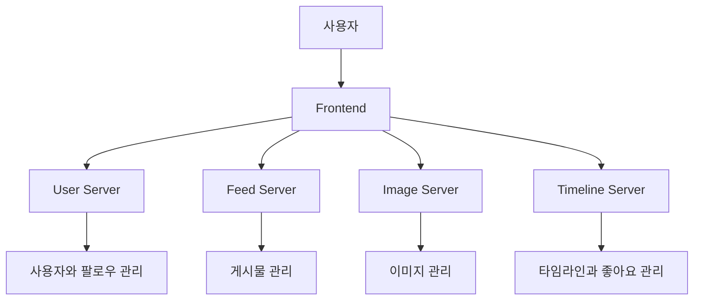

#### Kubernetes 기반 백엔드 설계에서 먼저 결정할 것

Kubernetes 기반 시스템을 설계할 때 가장 먼저 결정해야 하는 것은 모든 구성 요소를 어떤 Pod로 실행할지가 아니다.

먼저 다음 질문에 답해야 한다.

> 어떤 자원을 Kubernetes 클러스터 내부에서 운영하고, 어떤 자원을 클러스터 외부의 관리형 서비스로 사용할 것인가?

이 결정에 따라 네트워크, 보안, 장애 복구, 저장소, 배포 방법과 운영 책임이 달라진다.

검토해야 할 대표적인 구성 요소는 다음과 같다.

- MySQL과 같은 관계형 데이터베이스
- Redis와 같은 캐시 및 In-Memory Store
- Kafka와 같은 메시지 브로커
- SMTP 서버
- 이미지 저장소
- Frontend 정적 파일
- 배치 프로그램
- 로그와 모니터링 시스템

#### Kubernetes 내부와 외부 자원 구분

모든 구성 요소를 Kubernetes 내부에 설치하면 하나의 환경에서 배포 설정을 관리할 수 있고 개발 환경을 재현하기 쉽다. 반면 데이터베이스, Kafka와 같은 Stateful 시스템까지 직접 운영해야 하므로 백업, 업그레이드, 복제, 장애 복구 책임이 증가한다.

반대로 대부분의 구성 요소를 클러스터 외부의 관리형 서비스로 사용하면 운영 부담을 줄일 수 있다. 하지만 네트워크 연결, 인증, 비용, 클라우드 종속성을 추가로 고려해야 한다.

| 구분 | Kubernetes 내부 운영 | 외부 관리형 서비스 |
|---|---|---|
| 배포 관리 | Helm과 Kubernetes 객체로 통합 가능 | 서비스별 관리 화면과 API 사용 |
| 이식성 | 배포 구성을 함께 이동하기 쉽다. | 클라우드별 서비스 차이를 고려해야 한다. |
| 백업 | 직접 구성해야 한다. | 자동 백업 기능을 제공하는 경우가 많다. |
| 장애 복구 | 복제와 복구 절차를 직접 관리한다. | 관리형 고가용성 기능을 사용할 수 있다. |
| 업그레이드 | 버전과 순서를 직접 통제한다. | 자동화된 업그레이드를 사용할 수 있다. |
| 성능 | 스토리지와 네트워크 구성에 영향을 받는다. | 서비스에 최적화된 구성을 사용할 수 있다. |
| 운영 비용 | 인프라 비용과 운영 인력이 필요하다. | 사용 비용은 증가할 수 있지만 운영 부담이 감소한다. |
| 학습 목적 | Kubernetes의 Stateful 구성을 확인하기 좋다. | 애플리케이션 개발에 집중하기 좋다. |

클러스터 내부에 설치하는 구성 요소가 많다고 해서 항상 관리가 쉬워지거나 이식성이 완전히 보장되는 것은 아니다. Stateful 시스템은 StorageClass, CSI Driver, LoadBalancer, 백업 저장소와 결합되기 때문에 환경에 따라 강한 종속성을 가질 수 있다.

따라서 다음 기준으로 판단해야 한다.

- 해당 시스템을 직접 운영할 역량이 있는가
- 장애가 발생했을 때 복구할 수 있는가
- 데이터 손실 허용 범위는 어느 정도인가
- 클라우드 관리형 서비스가 필요한 기능을 제공하는가
- 개발과 운영 환경에서 동일한 구성이 필요한가
- 클러스터 외부 통신 비용과 지연 시간이 허용되는가

#### 이번 프로젝트의 배치 기준

이번 프로젝트에서는 Kubernetes의 여러 기능을 직접 활용하기 위해 다음과 같이 구성한다.

| 구성 요소 | 배치 위치 | 선택 이유 |
|---|---|---|
| Frontend | Kubernetes 내부 | 전체 요청 흐름을 클러스터에서 확인하기 위한 실습 구성 |
| User Server | Kubernetes 내부 | Spring Boot 기반 Stateless API |
| Feed Server | Kubernetes 내부 | 게시물 저장과 조회 API |
| Image Server | Kubernetes 내부 | PV와 StorageClass 연동 실습 |
| Timeline Server | Kubernetes 내부 | Redis와 Kafka를 사용하는 비동기 처리 실습 |
| Notification | Kubernetes 내부 | Job 또는 CronJob 기반 배치 실습 |
| Redis | Kubernetes 내부 | Helm과 Stateful 구성 확인 |
| Kafka | Kubernetes 내부 | 서비스 간 비동기 이벤트 처리 확인 |
| MySQL | Kubernetes 외부 | 관리형 데이터베이스 활용 |
| SMTP Server | Kubernetes 외부 | 관리형 이메일 발송 서비스 활용 |

Redis와 Kafka도 운영 환경에서는 외부 관리형 서비스를 사용하는 것이 합리적일 수 있다. 이번 프로젝트에서는 Kubernetes 내부 통신과 Helm 배포를 확인하기 위해 클러스터 내부에 설치한다.

Frontend 역시 정적 파일이라면 Object Storage와 CDN에 배포하는 것이 일반적이다. 이번에는 백엔드와 함께 Kubernetes에서 실행해 전체 요청 흐름을 단순화한다.

#### 전체 시스템 아키텍처

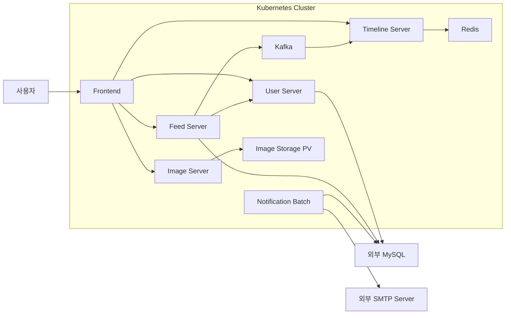

Kubernetes 내부의 애플리케이션은 Spring Boot 기반의 독립적인 서비스로 실행한다. 각 서비스는 Deployment와 Service를 통해 배포하고 필요한 외부 시스템과 연결한다.

#### 주요 서비스 구성

이번 프로젝트는 네 개의 백엔드 서버와 하나의 배치 프로그램으로 구성된다.

| 애플리케이션 | 주요 책임 |
|---|---|
| User Server | 회원 가입, 로그인, 사용자 조회, 팔로우 관계 관리 |
| Feed Server | 게시물 생성과 조회, 게시물 이벤트 발행 |
| Image Server | 이미지 업로드, 저장, 조회, 리사이징 |
| Timeline Server | 사용자별 타임라인, Random Post, 좋아요 관리 |
| Notification Batch | 새로운 팔로워 취합과 이메일 알림 |

서비스를 분리할 때는 단순히 Controller 개수나 테이블 개수로 나누기보다 다음 기준을 함께 고려해야 한다.

- 비즈니스 책임이 독립적인가
- 별도의 배포 주기를 가질 수 있는가
- 확장 기준이 다른가
- 장애를 격리할 필요가 있는가
- 사용하는 데이터 저장소의 특성이 다른가
- 다른 서비스와 동기적으로 결합되지 않는가

서비스를 지나치게 세분화하면 네트워크 호출, 분산 트랜잭션, 배포, 모니터링 복잡성이 증가한다. 이번 프로젝트의 서비스 구분은 Kubernetes와 MSA의 상호작용을 학습하기 위한 비교적 단순한 경계다.

#### User Server

User Server는 사용자와 팔로우 관계를 관리한다.

주요 기능은 다음과 같다.

- 회원 가입
- 로그인
- 사용자 정보 조회
- 팔로우
- 언팔로우
- 팔로워 목록 조회
- 팔로잉 목록 조회

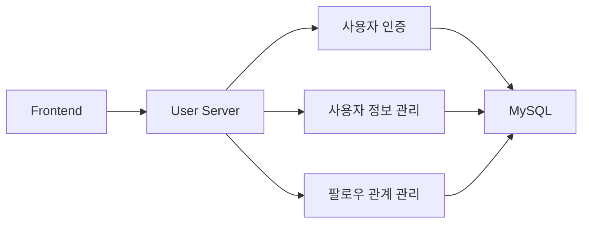

User Server가 관리하는 데이터에는 다음 정보가 포함될 수 있다.

- 사용자 ID
- 사용자 이름
- 이메일
- 암호화된 비밀번호
- 가입 일시
- 팔로워와 팔로잉 관계
- 사용자 상태

비밀번호는 평문으로 저장해서는 안 되며 단방향 Password Hash를 사용해야 한다. 로그인 성공 후에는 Session이나 Token 방식으로 인증 정보를 전달할 수 있다.

Kubernetes 환경에서는 Pod가 교체될 수 있으므로 특정 Pod Memory에 로그인 Session을 저장해서는 안 된다. Stateful Session이 필요하면 외부 Session Store를 사용하거나 Stateless Token 구조를 사용해야 한다.

#### Feed Server

Feed Server는 SNS 게시물의 저장과 조회를 담당한다.

게시물에는 다음 정보가 저장될 수 있다.

- 게시물 ID
- 작성자 ID
- 본문
- 이미지 ID
- 생성 일시
- 수정 일시
- 공개 상태

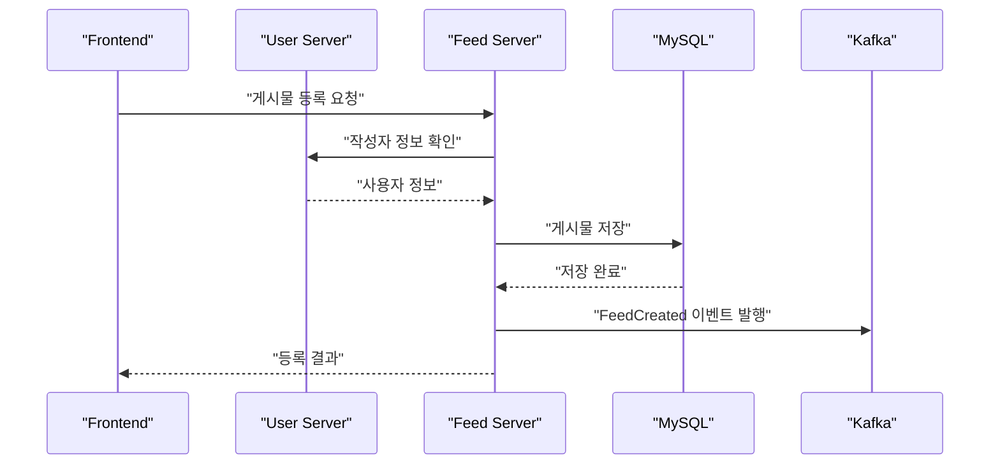

Feed Server는 Frontend에서 작성자 ID와 이미지 ID를 전달받아 게시물을 저장한다. 작성자 이름과 같은 정보가 필요하면 User Server를 호출할 수 있다.

게시물에는 이미지 파일 자체를 저장하지 않고 Image Server가 발급한 이미지 ID만 저장한다. Frontend는 게시물을 조회한 뒤 이미지 ID를 이용해 Image Server에서 실제 이미지를 가져온다.

Feed Server와 Image Server가 반드시 직접 HTTP 통신해야 하는 것은 아니다. 이미지 ID라는 참조값을 통해 간접적으로 연결할 수 있다.

##### 데이터 저장과 이벤트 발행

게시물을 MySQL에 저장한 뒤 Kafka에 이벤트를 발행하는 과정에서는 두 작업이 하나의 로컬 트랜잭션으로 묶이지 않는다.

다음과 같은 문제가 발생할 수 있다.

1. MySQL 저장은 성공했지만 Kafka 발행이 실패한다.
2. Kafka 이벤트는 발행했지만 DB 트랜잭션이 롤백된다.
3. 재시도로 같은 이벤트가 여러 번 발행된다.

단순한 실습에서는 저장 후 이벤트를 발행할 수 있지만 운영 수준에서는 Transactional Outbox Pattern을 검토해야 한다.

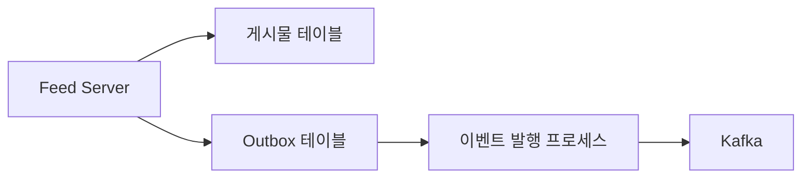

게시물과 Outbox 이벤트를 하나의 DB 트랜잭션으로 저장한 뒤 별도 프로세스가 Kafka로 전달하면 DB 저장과 이벤트 발행 사이의 불일치를 줄일 수 있다.

#### Image Server

Image Server는 이미지 업로드와 조회를 담당한다.

주요 기능은 다음과 같다.

- 이미지 파일 업로드
- 이미지 ID 발급
- 원본 이미지 저장
- 썸네일 또는 리사이징 이미지 생성
- 이미지 ID 기반 조회

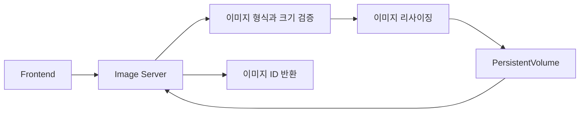

이번 프로젝트에서는 Kubernetes Volume을 학습하기 위해 이미지 파일을 PV에 저장한다.

Image Server가 여러 Pod로 확장되면 모든 Pod가 같은 이미지를 조회할 수 있어야 한다. 따라서 공유 파일 시스템을 사용한다면 `ReadWriteMany` Access Mode를 지원하는 스토리지가 필요하다.

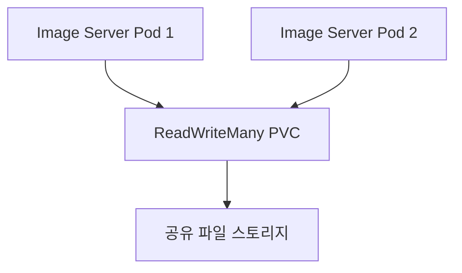

모든 StorageClass가 `ReadWriteMany`를 지원하는 것은 아니다. 실제 지원 여부는 StorageClass가 연결하는 스토리지 백엔드와 CSI Driver에 따라 결정된다.

예를 들어 블록 스토리지는 일반적으로 `ReadWriteOnce` 중심으로 사용하고, 여러 Node에서 동시에 마운트해야 한다면 NFS 계열의 공유 파일 시스템을 검토해야 한다.

운영 환경에서 사용자 이미지는 다음과 같은 이유로 Object Storage와 CDN을 사용하는 경우가 많다.

- 애플리케이션 Pod와 파일 저장소를 분리할 수 있다.
- 대용량 파일 확장이 쉽다.
- CDN 캐시를 사용할 수 있다.
- 이미지 서버를 거치지 않고 파일을 전달할 수 있다.
- 수명주기와 버전 관리 기능을 활용할 수 있다.

따라서 RWX PV 기반 이미지 저장은 Kubernetes Storage를 학습하기 위한 구성으로 이해해야 한다.

#### Timeline Server

Timeline Server는 사용자가 보는 타임라인 API를 담당한다.

주요 기능은 다음과 같다.

- 자신이 작성한 게시물 조회
- 팔로우한 사용자의 게시물 조회
- Random Post 혼합
- 좋아요
- 좋아요 취소
- 게시물별 좋아요 수 조회

초기 구현에서는 MySQL의 게시물과 팔로우 관계를 조합해 타임라인을 조회할 수 있다. 하지만 요청마다 여러 테이블을 조인하거나 서비스 간 호출을 반복하면 사용자가 증가할수록 조회 비용이 커질 수 있다.

이를 개선하기 위해 사용자별 타임라인을 Redis에 미리 구성한다.

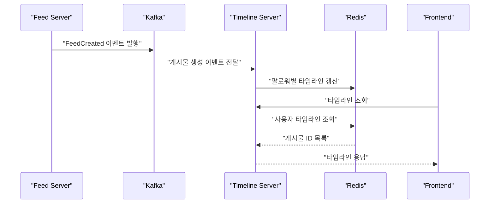

Feed Server가 새로운 게시물을 생성하면 Kafka에 이벤트를 발행한다. Timeline Server는 해당 이벤트를 소비해 Redis의 사용자별 타임라인 정보를 갱신한다.

이 구조는 Feed Server와 Timeline Server의 직접적인 동기 호출을 줄인다. Timeline Server가 잠시 중단되어도 Kafka에 이벤트가 남아 있다면 복구 후 다시 처리할 수 있다.

##### 이벤트 처리 시 고려할 사항

Kafka Consumer는 같은 이벤트를 다시 처리할 수 있으므로 Timeline Server의 이벤트 처리는 멱등성을 가져야 한다.

- 처리한 이벤트 ID를 기록한다.
- Redis Sorted Set에 동일한 게시물 ID가 중복되지 않도록 저장한다.
- 메시지 처리 완료 후 Offset을 Commit한다.
- 실패한 이벤트는 재시도하거나 별도의 Dead Letter Topic으로 이동한다.
- 이벤트 순서가 중요하다면 적절한 Partition Key를 사용한다.

##### Redis의 역할

Redis에는 다음과 같은 정보를 저장할 수 있다.

- 사용자별 타임라인 게시물 ID
- 게시물별 좋아요 수
- 사용자의 좋아요 여부
- 자주 조회되는 게시물 요약 정보

Redis는 빠른 조회를 위한 Cache 또는 Read Model로 사용하기 적합하다. 그러나 중요한 좋아요 데이터를 Redis에만 저장한다면 장애나 데이터 초기화 시 정보가 사라질 수 있다.

운영 환경에서는 다음 중 하나를 결정해야 한다.

- Redis Persistence와 복제를 통해 Redis 자체를 저장소로 운영한다.
- 좋아요 원본 데이터는 DB에 저장하고 Redis는 Cache로 사용한다.
- 이벤트를 Kafka에 기록한 뒤 Redis 상태를 다시 구성할 수 있게 한다.
- 주기적으로 Redis 데이터를 영구 저장소에 반영한다.

Self-Healing으로 Redis Pod가 다시 생성되는 것과 Redis 내부 데이터가 복구되는 것은 서로 다른 문제다. Kubernetes가 Pod를 재생성해도 데이터 복제, AOF, RDB, PVC가 올바르게 구성되지 않았다면 데이터는 복구되지 않는다.

#### Kafka를 이용한 서비스 분리

Kafka는 Feed Server와 Timeline Server 사이의 비동기 메시지 전달에 사용한다.

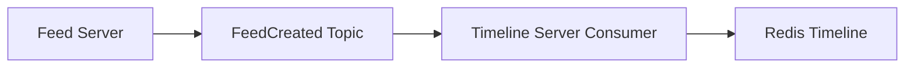

동기 HTTP 호출과 Kafka 이벤트 방식은 다음과 같은 차이가 있다.

| 구분 | 동기 HTTP 호출 | Kafka 이벤트 |
|---|---|---|
| 응답 | 호출 결과를 즉시 받는다. | 처리 완료를 즉시 알기 어렵다. |
| 결합도 | 상대 서비스의 가용성에 영향을 받는다. | Producer와 Consumer를 시간적으로 분리한다. |
| 실패 처리 | Timeout과 재시도가 필요하다. | Offset과 재처리 정책이 필요하다. |
| 데이터 일관성 | 즉시 결과를 확인하기 쉽다. | 최종적 일관성을 고려해야 한다. |
| 확장 | 호출 대상의 처리량에 영향을 받는다. | Consumer Group으로 병렬 처리할 수 있다. |

Kafka를 사용한다고 해서 자동으로 안전한 처리가 보장되는 것은 아니다. 메시지 중복, 순서, 재처리, Poison Message, Offset Commit과 같은 문제를 애플리케이션에서 고려해야 한다.

#### Notification Batch

Notification Batch는 새롭게 추가된 팔로워를 확인하고 이메일을 발송한다.

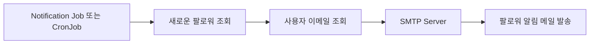

간단한 프로젝트에서는 MySQL에서 새로운 팔로워와 사용자 이메일을 조회할 수 있다. 하지만 MSA의 데이터 소유권 관점에서는 Notification이 User Server의 테이블을 직접 조회하는 구조가 강한 결합을 만든다.

운영 수준에서는 다음 방식도 고려할 수 있다.

- User Server가 팔로우 이벤트를 Kafka에 발행한다.
- Notification 서비스가 필요한 데이터를 자체 저장소에 구성한다.
- Notification이 User Server API를 통해 정보를 조회한다.
- 이메일 발송 상태와 재시도 횟수를 별도 테이블에 기록한다.

중복 실행으로 같은 이메일이 여러 번 발송되지 않도록 알림 대상에는 처리 상태나 고유한 Idempotency Key가 필요하다.

#### 배치 실행 위치 결정

배치 프로그램은 Kubernetes Job이나 CronJob으로 실행할 수도 있고 외부 배치 관리 시스템에서 실행할 수도 있다.

| 판단 기준 | Kubernetes Job 또는 CronJob | 외부 Batch Scheduler |
|---|---|---|
| 실행 주기 | 단순한 시간 기반 스케줄 | 복잡한 Workflow와 의존 관계 |
| 병렬 처리 | Job의 Parallelism 사용 | 도구별 분산 실행 기능 사용 |
| 실행 환경 | 다른 Kubernetes 서비스와 통신이 많음 | 외부 시스템과 연계가 많음 |
| 이력 관리 | Job 객체와 로그를 별도 보존해야 함 | 전용 실행 이력과 UI 제공 가능 |
| 재실행 | Job 재생성 또는 수동 처리 | 전용 재실행 기능 사용 가능 |
| 작업 의존성 | 별도 구현 필요 | DAG 기반 기능을 제공할 수 있음 |

다음과 같은 배치는 Kubernetes에서 실행하기 유리하다.

- 컨테이너 이미지로 실행할 수 있다.
- 클러스터 내부 Service를 자주 호출한다.
- 기존 백엔드 코드와 라이브러리를 공유한다.
- 일시적으로 많은 Pod를 생성해 병렬 처리한다.
- 실행 후 자원을 제거해야 한다.

반대로 여러 배치 사이의 복잡한 선후 관계와 승인, 재실행, 상세 이력 관리가 필요하다면 전용 Workflow 또는 Batch 관리 도구가 더 적합할 수 있다.

클러스터 외부의 배치가 내부 Service를 호출해야 한다면 Ingress만이 유일한 방법은 아니다. 다음 연결 방식을 검토할 수 있다.

- Ingress 또는 Gateway API
- Internal LoadBalancer
- VPN과 Private Network
- Private DNS
- API Gateway
- 메시지 브로커를 통한 비동기 요청

외부에 공개할 필요가 없는 Service를 인터넷에 노출하지 않도록 네트워크 경계를 설계해야 한다.

#### 데이터 소유권과 MySQL 구성

User Server와 Feed Server는 모두 MySQL을 사용하지만 MSA에서는 데이터 소유권을 명확히 구분해야 한다.

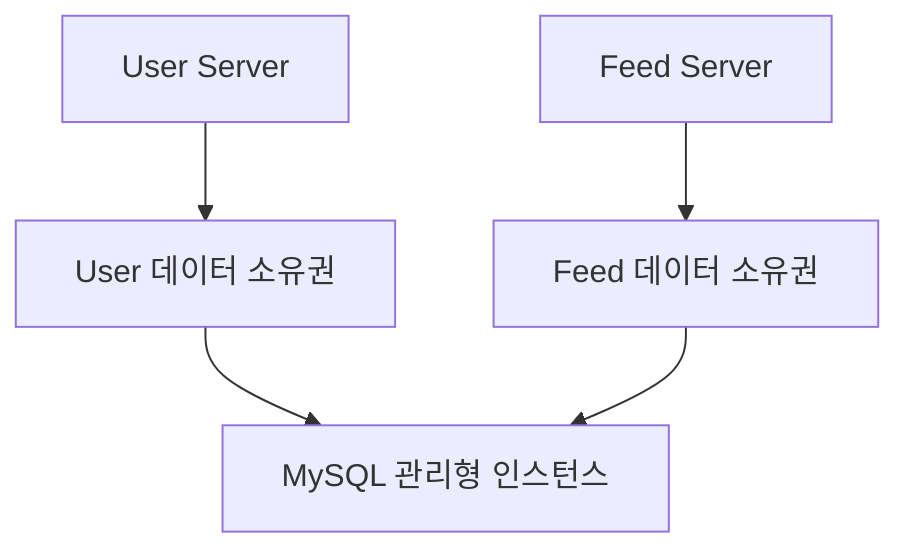

실습에서는 하나의 MySQL 인스턴스를 공유할 수 있지만 다음 원칙을 지키는 것이 좋다.

- User 테이블은 User Server만 변경한다.
- Feed 테이블은 Feed Server만 변경한다.
- 다른 서비스의 테이블을 직접 Join하지 않는다.
- 필요한 정보는 API나 이벤트로 전달한다.
- 서비스별 DB 계정을 분리한다.
- 계정마다 필요한 Schema 권한만 제공한다.

하나의 물리적 MySQL 인스턴스를 사용하더라도 Schema, 계정, Migration 경로를 서비스별로 분리하면 이후 독립 데이터베이스로 이전하기 쉽다.

#### 동기 통신에서 고려할 장애

Feed Server가 User Server를 호출하는 동안 User Server가 응답하지 않으면 Feed Server 요청도 실패하거나 지연될 수 있다.

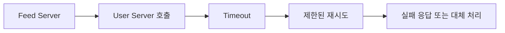

서비스 간 HTTP 통신에는 다음 설정이 필요하다.

- 연결 Timeout
- 응답 Timeout
- 제한된 재시도
- Circuit Breaker
- 재시도로 인한 중복 처리 방지
- Trace ID 전달
- 적절한 오류 응답 변환

재시도를 무조건 늘리면 장애가 발생한 서비스에 더 많은 요청을 보내는 Retry Storm이 발생할 수 있다. 멱등한 요청에만 제한적으로 재시도를 적용해야 한다.

#### Storage 설계

Kubernetes Storage는 사용 목적에 따라 구분해야 한다.

| 데이터 | 적합한 저장 방식 |
|---|---|
| 컨테이너 임시 파일 | 컨테이너 파일 시스템 |
| Pod 생명주기 동안 공유할 데이터 | `emptyDir` |
| 하나의 워크로드가 영구 보관할 데이터 | PVC와 `ReadWriteOnce` 스토리지 |
| 여러 Node의 Pod가 공유할 파일 | `ReadWriteMany` 지원 스토리지 |
| 사용자 이미지와 정적 파일 | Object Storage와 CDN |
| 관계형 데이터 | 관리형 MySQL 또는 Stateful 데이터베이스 |
| Cache와 타임라인 Read Model | Redis |
| 비동기 이벤트 | Kafka |

PV와 PVC만 작성한다고 원하는 스토리지가 자동으로 만들어지는 것은 아니다. StorageClass와 CSI Driver가 요청한 Access Mode와 Volume 크기를 지원해야 한다.

특히 Image Server를 여러 Node에 분산하고 하나의 PVC를 공유하려면 해당 스토리지 백엔드가 `ReadWriteMany`를 실제로 지원하는지 확인해야 한다.

#### 기존 시스템을 Kubernetes로 마이그레이션할 때

기존 애플리케이션을 컨테이너 이미지로 만든 뒤 Deployment로 실행한다고 해서 마이그레이션이 완료되는 것은 아니다.

다음과 같은 기존 기능은 Kubernetes 환경에서 그대로 동작하지 않을 수 있다.

- 로컬 파일 시스템에 대한 의존
- 특정 서버 IP나 Hostname에 대한 의존
- Memory 기반 Session
- 멀티캐스트 기반 Session Clustering
- 고정된 실행 순서를 가정한 기동 방식
- 종료 시간을 고려하지 않은 애플리케이션
- 서버에 직접 설치한 인증서와 설정 파일
- 수동으로 관리하던 로그 파일
- 특정 네트워크 파일 시스템에 대한 의존

##### 멀티캐스트 기반 Session Clustering

기존 WAS가 멀티캐스트로 Session을 복제한다면 Kubernetes CNI가 멀티캐스트를 지원하는지 확인해야 한다. Kubernetes Network가 모든 환경에서 멀티캐스트를 보장하는 것은 아니다.

이 기능을 유지하기 위해 클러스터 네트워크를 크게 변경하는 것보다 Session을 Redis와 같은 외부 저장소로 이동하거나 Stateless 인증 구조로 변경하는 편이 합리적일 수 있다.

##### 로컬 파일 시스템

Pod의 컨테이너 파일 시스템에 저장한 데이터는 Pod 교체 후 유지되지 않는다. 영구 데이터라면 PVC나 Object Storage로 이전해야 한다.

##### 종료 처리

Deployment Rolling Update 과정에서는 기존 Pod가 종료되기 전에 `SIGTERM`을 받는다. 애플리케이션은 새로운 요청을 중단하고 처리 중인 요청을 완료한 뒤 종료할 수 있어야 한다.

Readiness Probe, Graceful Shutdown, `terminationGracePeriodSeconds`를 함께 설계해야 한다.

#### 서비스별 Kubernetes 객체

각 구성 요소는 다음과 같은 Kubernetes 객체로 배포할 수 있다.

| 구성 요소 | 주요 Kubernetes 객체 |
|---|---|
| Frontend | Deployment, Service, Ingress |
| User Server | Deployment, Service, ConfigMap, Secret |
| Feed Server | Deployment, Service, ConfigMap, Secret |
| Image Server | Deployment, Service, PVC |
| Timeline Server | Deployment, Service, ConfigMap, Secret |
| Notification Batch | Job 또는 CronJob, ConfigMap, Secret |
| Redis | StatefulSet 또는 Helm Release, Service, PVC |
| Kafka | StatefulSet 또는 Operator, Service, PVC |
| 공통 설정 | Namespace, NetworkPolicy, ResourceQuota |
| 자동 확장 | HPA |
| 외부 노출 | Ingress 또는 Gateway API |

Stateless 애플리케이션은 Deployment가 적합하고, 안정적인 네트워크 식별자와 저장소가 필요한 Redis나 Kafka는 StatefulSet 또는 전용 Operator 기반 구성이 적합하다.

#### SNS 주요 요청 흐름

##### 게시물 등록

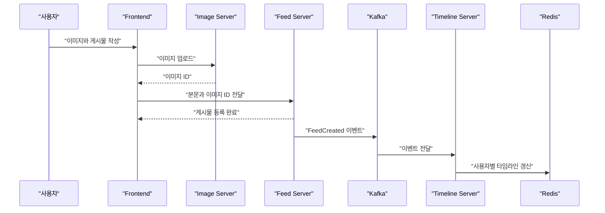

##### 타임라인 조회

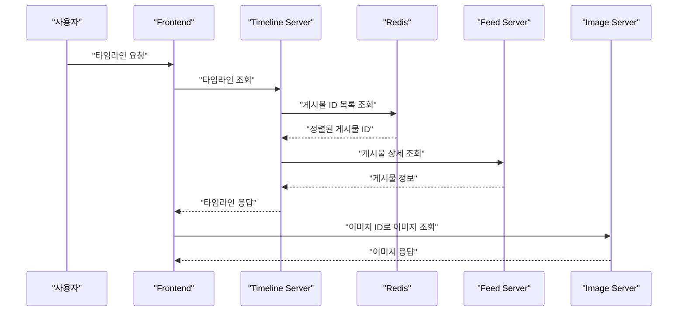

타임라인을 구성할 때 서비스별로 HTTP 요청을 한 건씩 반복하면 N+1 형태의 네트워크 호출이 발생할 수 있다. 게시물 상세 Batch API, 필요한 데이터의 비정규화, Timeline Read Model을 사용해 호출 수를 줄여야 한다.

#### 보안과 설정 관리

외부 MySQL, SMTP, Redis, Kafka의 접속 정보는 컨테이너 이미지나 Git 저장소에 평문으로 포함해서는 안 된다.

- 일반 설정은 ConfigMap으로 관리한다.
- 비밀번호와 Token은 Secret으로 관리한다.
- ServiceAccount에는 최소 RBAC 권한만 제공한다.
- NetworkPolicy로 불필요한 서비스 간 통신을 차단한다.
- 외부 관리형 서비스는 TLS 연결을 사용한다.
- 운영 환경에서는 외부 Secret 관리 시스템을 검토한다.

MySQL에 접근하는 User Server와 Feed Server가 같은 관리자 계정을 공유하지 않도록 서비스별 계정과 권한을 분리하는 것이 좋다.

#### 관측성 구성

MSA에서는 하나의 요청이 여러 Service와 Pod를 거칠 수 있으므로 애플리케이션 로그만 개별적으로 확인해서는 전체 흐름을 파악하기 어렵다.

다음 정보를 공통으로 전달해야 한다.

- Trace ID
- Span ID
- 사용자 또는 요청 식별자
- 서비스 이름
- Pod 이름
- 처리 시간
- 결과 상태

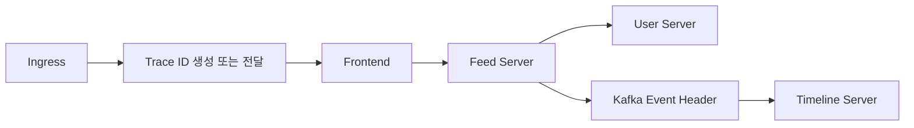

Kafka 메시지에도 Trace Context와 이벤트 ID를 포함해야 HTTP 요청과 비동기 처리를 연결할 수 있다.

로그뿐 아니라 Metric과 Trace도 함께 수집해야 한다.

- Log는 개별 이벤트와 오류 내용을 보여준다.
- Metric은 요청 수, 오류율, CPU와 Memory 변화를 보여준다.
- Trace는 서비스 간 호출 경로와 지연 구간을 보여준다.

#### 개발 환경과 기술 구성

백엔드 애플리케이션은 Java와 Spring Boot를 기반으로 개발한다.

기본 개발 환경은 다음과 같다.

```text
Java 21
Spring Boot 3.2
Gradle
MySQL
Redis
Kafka
Kubernetes
Helm
```

Java 21과 Spring Boot 3.2에만 존재하는 특수 기능을 적극적으로 사용하는 것이 목적은 아니다. 각 API는 이해하기 쉬운 구조로 구현하고 Kubernetes 배포, 서비스 연결, 비동기 메시지, Storage, Batch 처리에 집중한다.

코드를 단순하게 작성하더라도 다음 기본 원칙은 유지해야 한다.

- 요청 DTO와 응답 DTO 분리
- 입력값 검증
- 예외 처리
- Transaction 범위 관리
- 비밀번호 Hash 처리
- 동시성 고려
- 이벤트 중복 처리
- 외부 호출 Timeout
- 로그와 Trace ID 기록
- Secret 평문 저장 금지

#### 클라우드 환경에 따른 차이

프로젝트 환경은 AWS를 기준으로 구성할 수 있지만 Kubernetes 객체와 애플리케이션 코드는 특정 클라우드에만 종속되지 않도록 설계해야 한다.

다른 클라우드 환경으로 옮길 때 주로 변경되는 부분은 다음과 같다.

- StorageClass 이름과 CSI Driver
- `ReadWriteMany` 스토리지 종류
- LoadBalancer와 Ingress 설정
- DNS와 인증서 관리
- Workload Identity 또는 IAM 연동
- 관리형 MySQL 접속 정보
- Object Storage API
- SMTP 또는 이메일 발송 서비스
- Container Registry 주소

클라우드별 Annotation을 애플리케이션 코드에 넣기보다 Helm Values와 환경별 배포 설정으로 분리하면 이식성을 높일 수 있다.

#### 프로젝트에서 확인할 핵심 포인트

이번 프로젝트에서는 단순히 여러 Spring Boot 프로젝트를 만드는 것보다 다음 내용을 확인하는 것이 중요하다.

- 서비스 경계를 비즈니스 책임에 따라 나누는 방법
- Kubernetes 내부와 외부 자원을 결정하는 기준
- Deployment와 StatefulSet의 역할 구분
- Service DNS를 이용한 내부 통신
- Kafka를 이용한 비동기 이벤트 처리
- Redis를 이용한 Timeline Read Model 구성
- PVC와 StorageClass를 이용한 이미지 저장
- Job과 CronJob을 이용한 배치 실행
- ConfigMap과 Secret을 이용한 환경 설정 분리
- 장애 시 재시도와 멱등성 보장
- 로그, Metric, Trace를 이용한 분산 요청 추적
- 관리형 서비스와 Kubernetes 내부 설치의 차이

### 정리

이번 프로젝트는 Kubernetes와 MSA를 활용해 기본적인 SNS 백엔드를 구성하는 것을 목표로 한다. 기능은 회원 가입, 로그인, 팔로우, 게시물 작성, 이미지 업로드, 타임라인, 좋아요, 이메일 알림으로 구성한다.

백엔드는 User Server, Feed Server, Image Server, Timeline Server의 네 개 서비스와 Notification Batch로 분리한다. MySQL과 SMTP Server는 클러스터 외부의 관리형 서비스를 사용하고, Redis와 Kafka는 Kubernetes 내부에 설치해 서비스 간 비동기 처리와 Cache 구성을 확인한다.

Feed Server는 게시물을 저장한 뒤 Kafka에 이벤트를 발행하고 Timeline Server는 이벤트를 소비해 Redis의 사용자별 타임라인을 갱신한다. Image Server는 Kubernetes Storage 학습을 위해 `ReadWriteMany` PV를 사용하지만 실제 운영 환경에서는 Object Storage와 CDN이 더 적합할 수 있다.

Kubernetes 기반 시스템에서 중요한 것은 모든 것을 클러스터 내부에 설치하는 것이 아니다. 데이터 특성, 운영 역량, 백업, 장애 복구, 네트워크, 비용을 기준으로 클러스터 경계를 결정해야 한다.

또한 MSA에서는 서비스 분리만큼 데이터 소유권, 동기 호출 장애, 이벤트 중복, 최종적 일관성, 분산 로그 추적을 함께 고려해야 한다. 이러한 기준을 바탕으로 이후 단계에서 각 서비스와 Kubernetes 실행 환경을 순차적으로 구현한다.

## 02. 프로젝트 개발을 위한 인프라 설정 개요

### 02. 프로젝트 소스 코드와 인프라 구성 준비

MSA 기반 SNS 프로젝트를 진행하려면 여러 Spring Boot 애플리케이션을 작성하는 것뿐 아니라 Kubernetes 클러스터, Container Registry, 데이터베이스, StorageClass, Redis, Kafka와 같은 인프라 환경도 함께 구성해야 한다.

특히 User Server, Feed Server, Image Server, Timeline Server처럼 여러 서버를 만들면 프로젝트 생성, Gradle 설정, 컨테이너 이미지 설정, Deployment 작성과 같은 초기 작업이 반복된다.

이러한 반복 작업을 줄이고 단계별 결과를 확인할 수 있도록 프로젝트는 다음 두 종류의 Git Repository로 구분하여 관리한다.

- 애플리케이션별 소스 코드 Repository
- 공통 인프라 설정 Repository

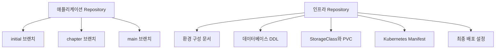

#### 프로젝트 Repository 구성

SNS 프로젝트는 여러 마이크로서비스로 분리되므로 서비스별 Repository가 존재할 수 있다.

대표적인 애플리케이션은 다음과 같다.

| Repository | 역할 |
|---|---|
| User Server | 회원 가입, 로그인, 사용자와 팔로우 관계 관리 |
| Feed Server | 게시물 생성과 조회 |
| Image Server | 이미지 업로드, 저장, 리사이징과 조회 |
| Timeline Server | 사용자별 타임라인과 좋아요 관리 |
| Notification | 신규 팔로워 이메일 알림 배치 |
| Frontend | SNS 화면과 백엔드 API 연동 |
| Infrastructure | 공통 인프라 문서와 Kubernetes 설정 관리 |

각 애플리케이션 Repository에는 초기 설정만 포함된 브랜치와 단계별 완성 브랜치가 제공될 수 있다.

#### 브랜치별 역할

##### initial 브랜치

`initial` 브랜치는 프로젝트 개발을 시작하기 위한 기본 골격을 제공한다.

다음과 같은 설정은 준비되어 있지만 실제 비즈니스 기능은 거의 구현되지 않은 상태다.

- Spring Boot 프로젝트 구조
- Gradle Wrapper
- 기본 의존성
- 컨테이너 이미지 빌드 설정
- 기본 패키지 구조
- Kubernetes Deployment 초안
- 애플리케이션 설정 파일

```bash
git clone <APPLICATION_REPOSITORY_URL>
```

```bash
cd <APPLICATION_REPOSITORY_DIRECTORY>
```

```bash
git branch --all
```

```bash
git switch initial
```

실제 개발은 `initial` 브랜치를 기준으로 별도의 작업 브랜치를 만든 뒤 진행하는 것이 좋다.

```bash
git switch -c feature/chapter-01-setup
```

##### chapter 브랜치

각 Chapter에서 완성되는 코드가 별도의 브랜치로 제공될 수 있다.

```text
chapter-3-1
chapter-3-2
chapter-7-1
```

Chapter 브랜치는 다음 용도로 활용한다.

- 현재 작성한 코드와 완성 코드 비교
- 누락된 설정 확인
- 오탈자나 들여쓰기 오류 확인
- 실행되지 않는 코드의 원인 분석
- 다음 단계에서 필요한 변경 범위 확인

현재 작업 내용을 유지하면서 특정 브랜치와 비교하려면 다음 명령을 사용할 수 있다.

```bash
git diff initial..chapter-3-1
```

특정 파일만 비교할 수도 있다.

```bash
git diff initial..chapter-3-1 -- build.gradle
```

```bash
git diff initial..chapter-3-1 -- src/main
```

완성 브랜치를 그대로 덮어쓰기보다 어떤 코드와 설정이 달라졌는지 확인하는 방식이 학습에 더 도움이 된다.

##### main 브랜치

`main` 브랜치는 프로젝트의 최종 완성 상태를 포함한다.

최종 브랜치는 전체 구성이나 완성된 API 흐름을 확인할 때 유용하지만, 프로젝트 초기부터 그대로 실행하면 각 단계에서 어떤 설정이 추가되었는지 파악하기 어려울 수 있다.

따라서 다음 순서로 활용하는 것이 좋다.

1. `initial` 브랜치에서 직접 구현한다.
2. 문제가 생기면 해당 Chapter 브랜치와 비교한다.
3. 프로젝트 전체 구성이 필요할 때 `main` 브랜치를 확인한다.

#### 로컬 변경사항 보호

다른 브랜치로 이동하기 전에는 현재 변경사항을 확인해야 한다.

```bash
git status
```

변경사항이 있는 상태에서 브랜치를 전환하면 충돌이 발생하거나 작업 내용이 다른 브랜치에 섞일 수 있다.

작성 중인 코드는 먼저 Commit하는 것이 가장 명확하다.

```bash
git add .
```

```bash
git commit -m "Implement chapter setup"
```

아직 Commit하기 어려운 임시 변경사항이라면 Stash를 사용할 수 있다.

```bash
git stash push -m "chapter setup in progress"
```

다시 적용하려면 다음 명령을 사용한다.

```bash
git stash pop
```

#### Amazon ECR 설정

각 애플리케이션을 Kubernetes에 배포하려면 컨테이너 이미지를 생성하고 Kubernetes Node가 접근할 수 있는 Registry에 푸시해야 한다.

이번 프로젝트에서는 Amazon ECR을 Container Registry로 사용한다.

ECR 이미지 주소는 일반적으로 다음 형식을 가진다.

```text
<AWS_ACCOUNT_ID>.dkr.ecr.<AWS_REGION>.amazonaws.com/<REPOSITORY_NAME>:<IMAGE_TAG>
```

예를 들면 다음과 같은 구조다.

```text
123456789012.dkr.ecr.ap-northeast-2.amazonaws.com/feed-server:0.0.1
```

실제 계정 ID, Region, Repository 이름과 이미지 태그는 자신의 환경에 맞게 변경해야 한다.

#### ECR Repository 생성

AWS CLI를 사용할 수 있다면 서비스별 ECR Repository를 생성할 수 있다.

```bash
aws ecr create-repository \
  --repository-name user-server \
  --region ap-northeast-2
```

```bash
aws ecr create-repository \
  --repository-name feed-server \
  --region ap-northeast-2
```

```bash
aws ecr create-repository \
  --repository-name image-server \
  --region ap-northeast-2
```

```bash
aws ecr create-repository \
  --repository-name timeline-server \
  --region ap-northeast-2
```

Repository가 이미 존재한다면 새로 생성할 필요가 없다.

목록은 다음 명령으로 확인한다.

```bash
aws ecr describe-repositories \
  --region ap-northeast-2
```

#### ECR 로그인

Docker를 이용해 이미지를 푸시하려면 ECR 인증이 필요하다.

```bash
aws ecr get-login-password \
  --region ap-northeast-2 \
  | docker login \
      --username AWS \
      --password-stdin \
      <AWS_ACCOUNT_ID>.dkr.ecr.ap-northeast-2.amazonaws.com
```

인증 Token은 영구적이지 않으므로 시간이 지나면 다시 로그인해야 할 수 있다.

AWS Access Key와 Secret Access Key를 `build.gradle`, Deployment YAML이나 Git Repository에 평문으로 저장해서는 안 된다. 로컬에서는 AWS CLI Profile을 사용하고, CI/CD에서는 Workload Identity나 Jenkins Credentials와 같은 별도 인증 방식을 사용해야 한다.

#### build.gradle의 이미지 주소 변경

초기 프로젝트의 `build.gradle`에는 예제 ECR 주소가 포함되어 있을 수 있다. 해당 주소를 자신이 생성한 ECR Repository 주소로 변경해야 한다.

먼저 기존 주소가 사용된 위치를 검색한다.

```bash
rg "dkr\.ecr|image|repository" build.gradle
```

프로젝트 전체에서 검색할 수도 있다.

```bash
rg "dkr\.ecr"
```

Gradle Jib를 사용하는 프로젝트라면 일반적으로 다음 정보가 이미지 생성 설정에 포함된다.

```groovy
def registry = providers.gradleProperty("ecrRegistry")
        .orElse("123456789012.dkr.ecr.ap-northeast-2.amazonaws.com")

def imageTag = providers.gradleProperty("imageTag")
        .orElse(project.version.toString())

jib {
    from {
        image = "eclipse-temurin:21-jre"
    }

    to {
        image = "${registry.get()}/feed-server:${imageTag.get()}"
    }

    container {
        ports = ["8080"]
        creationTime = "USE_CURRENT_TIMESTAMP"
    }
}
```

계정별 ECR 주소를 소스 코드에 직접 고정하기보다 Gradle Property나 환경 변수로 주입하면 개발자별, 환경별 설정을 분리할 수 있다.

```bash
./gradlew jib \
  -PecrRegistry=<AWS_ACCOUNT_ID>.dkr.ecr.ap-northeast-2.amazonaws.com \
  -PimageTag=0.0.1
```

Jib 설정이 없는 프로젝트라면 Dockerfile과 `docker build`, `docker push` 방식을 사용할 수 있다.

#### Deployment 이미지 주소 변경

Gradle에서 푸시한 이미지와 Kubernetes Deployment가 참조하는 이미지는 정확히 일치해야 한다.

다음 항목을 확인한다.

- AWS Account ID
- Region
- ECR Repository 이름
- 이미지 태그
- 컨테이너 이름
- `imagePullPolicy`

프로젝트의 Deployment 파일에서 이미지 주소를 검색한다.

```bash
rg "image:" .
```

Deployment에 설정된 이미지 주소는 다음과 같은 형태가 된다.

```text
<AWS_ACCOUNT_ID>.dkr.ecr.ap-northeast-2.amazonaws.com/feed-server:0.0.1
```

Gradle은 `feed-server:0.0.2`를 푸시했는데 Deployment가 `feed-server:0.0.1`을 참조하면 이전 버전이 실행된다.

반대로 Deployment가 아직 Registry에 없는 태그를 참조하면 Pod에서 `ImagePullBackOff` 또는 `ErrImagePull`이 발생한다.

#### 이미지 태그 관리

동일한 `latest` 태그를 반복해서 덮어쓰는 방식은 피하는 것이 좋다.

```text
feed-server:latest
```

같은 태그를 재사용하면 다음 문제가 발생한다.

- 어떤 소스 코드가 배포되었는지 추적하기 어렵다.
- Deployment의 Pod Template이 변경되지 않을 수 있다.
- Node마다 서로 다른 시점의 이미지를 사용할 가능성이 생긴다.
- 이전 이미지로 정확하게 롤백하기 어렵다.

다음과 같이 고유한 태그를 사용하는 것이 좋다.

```text
feed-server:0.0.1
feed-server:chapter-3-1
feed-server:a84b1d4c2e10
feed-server:a84b1d4c2e10-25
```

Git Commit SHA와 CI Build Number를 함께 사용하면 소스 코드, 빌드 결과와 배포 이미지를 연결하기 쉽다.

#### 빌드 설정과 Deployment 일치 여부 확인

이미지 배포 흐름은 다음과 같다.

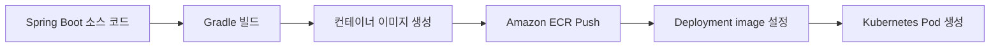

다음 명령으로 실제 Deployment에 적용된 이미지를 확인할 수 있다.

```bash
kubectl get deployment feed-server \
  --namespace sns \
  --output jsonpath="{.spec.template.spec.containers[*].image}"
```

실행 중인 Pod의 이미지도 확인한다.

```bash
kubectl get pods \
  --namespace sns \
  --selector app=feed-server \
  --output jsonpath="{range .items[*]}{.metadata.name}{'\t'}{.spec.containers[*].image}{'\n'}{end}"
```

실행 중인 이미지 Digest까지 확인하려면 다음 명령을 사용할 수 있다.

```bash
kubectl get pods \
  --namespace sns \
  --selector app=feed-server \
  --output jsonpath="{range .items[*]}{.metadata.name}{'\t'}{.status.containerStatuses[*].imageID}{'\n'}{end}"
```

#### 인프라 Repository 구성

공통 인프라 Repository에는 프로젝트 실행에 필요한 다음 자료가 포함될 수 있다.

- 클러스터 환경 구성 순서
- Namespace
- 데이터베이스 DDL
- StorageClass
- PersistentVolumeClaim
- Redis와 Kafka 설치 설정
- ConfigMap과 Secret 예제
- Deployment와 Service
- Ingress
- Job과 CronJob
- Helm Values
- 최종 배포 Manifest

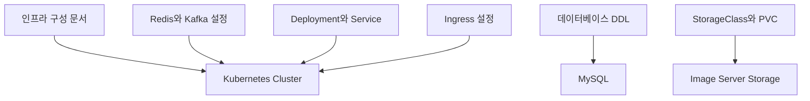

인프라 설정은 작성 순서와 의존 관계가 중요하다. 파일이 모두 존재한다고 해서 임의의 순서로 한 번에 적용해도 되는 것은 아니다.

#### 권장 인프라 구성 순서

다음 순서로 환경을 구성하는 것이 이해하기 쉽다.

1. AWS CLI와 `kubectl`, Helm을 준비한다.
2. Kubernetes 클러스터 연결을 확인한다.
3. Namespace를 생성한다.
4. ECR Repository를 생성한다.
5. 외부 MySQL과 SMTP 환경을 준비한다.
6. 데이터베이스 DDL을 적용한다.
7. StorageClass와 PVC를 생성한다.
8. Redis와 Kafka를 설치한다.
9. ConfigMap과 Secret을 생성한다.
10. 애플리케이션 이미지를 ECR에 푸시한다.
11. Deployment와 Service를 적용한다.
12. Ingress와 외부 접근 경로를 구성한다.
13. 배치 프로그램을 Job 또는 CronJob으로 배포한다.
14. 로그와 Metric을 확인한다.

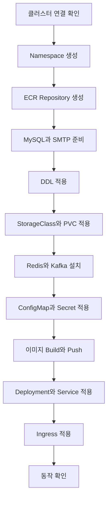

#### 데이터베이스 DDL 적용

인프라 Repository에 포함된 DDL은 User Server, Feed Server, Notification Batch에서 사용할 테이블을 생성한다.

적용 전에는 반드시 다음 항목을 확인해야 한다.

- 대상 MySQL Host
- Port
- Database 또는 Schema
- 실행 계정
- 계정 권한
- DDL의 재실행 가능 여부
- 기존 테이블과 데이터 존재 여부

다음과 같이 대상 정보를 명확하게 지정해 실행할 수 있다.

```bash
mysql \
  --host="<MYSQL_HOST>" \
  --port=3306 \
  --user="<MYSQL_USER>" \
  --password \
  "<DATABASE_NAME>" \
  < schema.sql
```

DDL은 파괴적인 변경을 포함할 수 있으므로 운영 데이터베이스에 바로 실행해서는 안 된다. 개발용 데이터베이스에서 먼저 검증하고 적용 전 백업과 복구 방법을 확인해야 한다.

#### StorageClass 확인

Image Server가 공유 파일 시스템을 사용한다면 해당 클러스터에서 `ReadWriteMany`를 지원하는 StorageClass가 필요할 수 있다.

StorageClass 목록을 확인한다.

```bash
kubectl get storageclasses
```

PVC 상태를 확인한다.

```bash
kubectl get persistentvolumeclaims \
  --all-namespaces
```

PVC가 `Pending` 상태라면 다음 내용을 확인한다.

```bash
kubectl describe persistentvolumeclaim <PVC_NAME> \
  --namespace sns
```

주요 원인은 다음과 같다.

- StorageClass 이름이 실제 환경과 다르다.
- CSI Driver가 설치되지 않았다.
- 요청한 Access Mode를 지원하지 않는다.
- 동적 프로비저닝 권한이 부족하다.
- 스토리지 백엔드의 네트워크 연결이 준비되지 않았다.

StorageClass 이름은 클라우드와 클러스터 구성에 따라 달라질 수 있으므로 제공된 값을 그대로 적용하기보다 현재 환경에 맞게 수정해야 한다.

#### Kubernetes Manifest 적용 전 확인

인프라 Repository의 Deployment나 Service 파일에는 작성자의 계정과 환경에 맞춘 값이 포함되어 있을 수 있다.

적용 전 다음 문자열을 검색한다.

```bash
rg "dkr\.ecr|amazonaws|storageClassName|host:|password|secret" .
```

특히 다음 값을 자신의 환경에 맞게 변경해야 한다.

- ECR 주소
- AWS Region
- Namespace
- StorageClass 이름
- MySQL Host
- Redis와 Kafka 주소
- SMTP Host
- Ingress Hostname
- Secret 이름
- 이미지 태그

Secret 값을 Manifest에 직접 입력해서 Git에 Commit하지 않도록 주의해야 한다.

#### Manifest 문법 검증

클러스터에 실제 반영하기 전에 Client Dry Run으로 YAML 문법을 확인한다.

```bash
kubectl apply \
  --dry-run=client \
  --filename <MANIFEST_PATH>
```

Kubernetes API Server를 통한 검증도 수행할 수 있다.

```bash
kubectl apply \
  --dry-run=server \
  --filename <MANIFEST_PATH>
```

`--dry-run=client`는 기본 YAML 구조를 확인하지만 클러스터에 설치된 CRD, Admission Policy, RBAC, 현재 API 지원 여부까지 모두 검증하지는 않는다.

#### 적용 후 상태 확인

Kubernetes 객체를 적용한 뒤에는 명령이 성공했다는 결과만 확인해서는 안 된다.

Deployment 상태를 확인한다.

```bash
kubectl get deployments \
  --namespace sns
```

Pod 상태를 확인한다.

```bash
kubectl get pods \
  --namespace sns \
  --output wide
```

Service를 확인한다.

```bash
kubectl get services \
  --namespace sns
```

Rollout 상태를 확인한다.

```bash
kubectl rollout status deployment/feed-server \
  --namespace sns \
  --timeout=5m
```

문제가 발생하면 Event와 로그를 확인한다.

```bash
kubectl get events \
  --namespace sns \
  --sort-by=.metadata.creationTimestamp
```

```bash
kubectl logs \
  --namespace sns \
  --selector app=feed-server \
  --all-containers=true \
  --prefix=true \
  --tail=200
```

#### 초기 코드 활용 시 주의사항

##### 버전 차이

완성 브랜치의 Java, Spring Boot, Gradle, 라이브러리 버전이 현재 실습 환경과 다르면 코드가 그대로 실행되지 않을 수 있다.

다음 파일을 먼저 확인한다.

```text
build.gradle
settings.gradle
gradle/wrapper/gradle-wrapper.properties
Dockerfile
application.yaml
```

##### 환경별 값 혼합

소스 코드의 기본값과 Kubernetes ConfigMap 값, 환경 변수가 서로 다르면 예상하지 못한 설정이 적용될 수 있다.

Spring Boot 설정의 일반적인 우선순위를 고려해 실제 Pod 환경 변수를 확인해야 한다.

```bash
kubectl exec \
  --namespace sns \
  deployment/feed-server \
  -- \
  printenv
```

출력에는 Credential이 포함될 수 있으므로 운영 환경에서 전체 결과를 로그나 문서에 남기지 않아야 한다.

##### 완료 브랜치의 무조건적인 사용

완성 브랜치는 참고용 결과물이다. 현재 Chapter에서 아직 생성하지 않은 Redis, Kafka, Secret이나 Service를 참조할 수 있으므로 중간 브랜치만 단독으로 실행하면 실패할 수 있다.

해당 브랜치가 요구하는 인프라 의존성을 함께 확인해야 한다.

##### 개인 환경 정보 Commit

다음 정보는 Git에 Commit하지 않는다.

- AWS Access Key
- AWS Secret Access Key
- MySQL 비밀번호
- SMTP 인증 정보
- JWT Secret
- 개인 ECR 인증 Token
- 실제 운영 도메인 인증서
- 개인 `kubeconfig`

이미 Commit했다면 파일에서 값을 삭제하는 것만으로 충분하지 않을 수 있다. Credential을 폐기하고 새로 발급해야 한다.

#### 문제 발생 시 점검 순서

인프라나 애플리케이션이 실행되지 않을 때는 다음 순서로 범위를 좁힌다.

1. 현재 Git 브랜치가 올바른지 확인한다.
2. 로컬 변경사항과 완성 브랜치의 차이를 확인한다.
3. ECR Repository와 이미지 태그를 확인한다.
4. Kubernetes Deployment의 이미지 주소를 확인한다.
5. ConfigMap과 Secret 이름을 확인한다.
6. Service DNS와 Namespace를 확인한다.
7. PVC와 StorageClass 상태를 확인한다.
8. Pod Event를 확인한다.
9. 애플리케이션과 Sidecar 로그를 확인한다.
10. 외부 MySQL, SMTP 네트워크 연결을 확인한다.

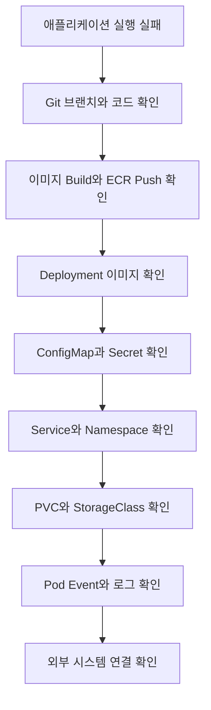

#### 프로젝트 시작 전 체크리스트

- 애플리케이션 Repository를 Clone했다.
- `initial` 브랜치에서 개발을 시작했다.
- 단계별 `chapter` 브랜치와 `main` 브랜치의 역할을 확인했다.
- 자신의 AWS Account와 Region을 확인했다.
- 서비스별 ECR Repository를 생성했다.
- ECR 인증이 정상적으로 동작한다.
- `build.gradle`의 이미지 주소를 변경했다.
- Deployment의 이미지 주소를 동일하게 변경했다.
- `latest` 대신 고유한 이미지 태그를 사용한다.
- 인프라 Repository의 구성 순서를 확인했다.
- DDL을 적용할 대상 데이터베이스를 확인했다.
- StorageClass와 CSI Driver 지원 여부를 확인했다.
- ConfigMap과 Secret을 구분했다.
- Credential이 Git에 포함되지 않았는지 확인했다.
- Manifest를 Dry Run으로 검증했다.
- Deployment, Pod, Service와 PVC 상태를 확인할 명령을 준비했다.

### 정리

MSA 기반 SNS 프로젝트는 여러 Spring Boot 서버와 Kubernetes 인프라를 함께 구성해야 하므로 초기 설정과 반복 작업이 많다. 이를 효율적으로 진행하기 위해 애플리케이션별 Repository와 공통 인프라 Repository를 구분해 활용한다.

애플리케이션 Repository의 `initial` 브랜치는 개발을 시작하기 위한 기본 환경을 제공하고, `chapter` 브랜치는 단계별 완성 상태를 확인하는 데 사용한다. `main` 브랜치는 전체 프로젝트의 최종 구성을 확인하기 위한 브랜치다.

프로젝트를 시작할 때는 `build.gradle`과 Kubernetes Deployment에 포함된 ECR 주소를 자신의 AWS 환경에 맞게 변경해야 한다. 두 설정의 Repository와 이미지 태그가 일치하지 않으면 이전 이미지가 실행되거나 `ImagePullBackOff`가 발생할 수 있다.

인프라 Repository에는 DDL, StorageClass, PVC, Redis, Kafka와 최종 Kubernetes Manifest가 포함될 수 있다. 이러한 파일은 그대로 적용하기보다 Namespace, ECR, StorageClass, 외부 서비스 주소와 Secret을 현재 환경에 맞게 검토해야 한다.

완성된 코드는 정답을 복사하기 위한 자료라기보다 현재 구현과 비교해 누락된 설정과 오류를 찾기 위한 기준으로 활용하는 것이 좋다. 각 단계를 직접 구성하고 문제가 발생했을 때 브랜치 차이와 인프라 문서를 함께 확인하면 프로젝트의 전체 실행 흐름을 더 정확하게 이해할 수 있다.
