# Ch 2. Social Feed 서버 개발

# Ch 2. Social Feed 서버 개발
* toc
{:toc}

---

## 01. 스프링 프로젝트 구성

### 06. Spring Boot 소셜 피드 서버 프로젝트 생성과 데이터베이스 설정

SNS 백엔드의 첫 번째 마이크로서비스로 소셜 피드 서버를 구성한다. 소셜 피드 서버는 사용자가 작성한 게시글을 저장하고 조회하는 역할을 담당한다.

이미지 파일 자체는 이후에 구현할 이미지 서버가 관리한다. 피드 서버는 게시글 작성자 ID, 본문, 이미지 ID와 같은 메타데이터만 저장한다. 서비스의 책임을 이렇게 분리하면 게시글 처리와 이미지 저장 방식을 독립적으로 변경하고 확장할 수 있다.

#### 소셜 피드 서버의 책임

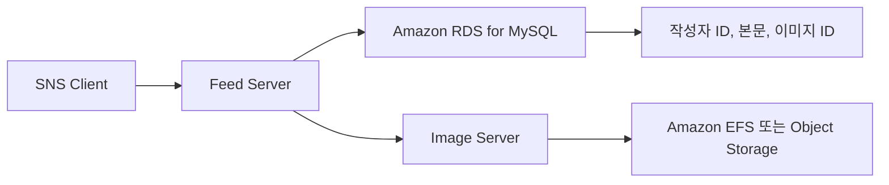

| 데이터 | 관리 주체 |
|---|---|
| 게시글 본문 | Feed Server |
| 작성자 ID | Feed Server가 참조 |
| 이미지 ID | Feed Server가 참조 |
| 이미지 파일 | Image Server |
| 사용자 상세 정보 | User Server |

MSA에서는 다른 서비스의 데이터를 직접 수정하지 않는 것이 중요하다. 피드 서버가 보관하는 작성자 ID와 이미지 ID는 다른 서비스의 데이터를 가리키는 논리적 참조다. 각 서비스가 데이터베이스를 분리한다면 일반적인 외래 키로 서비스 간 정합성을 강제할 수 없으므로 API 호출이나 이벤트를 이용한 검증과 보상 처리가 필요하다.

#### 전체 구성 흐름

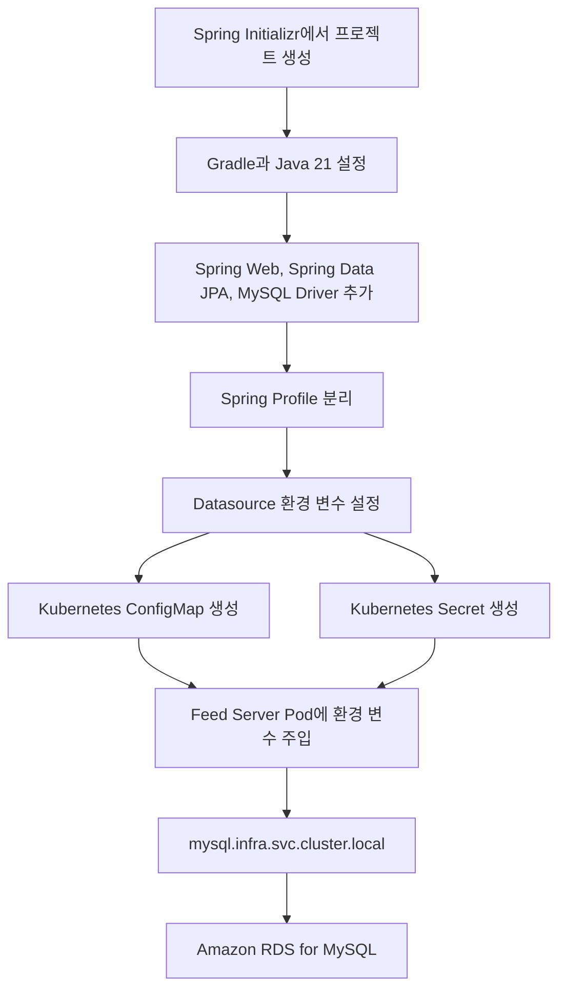

#### Spring Boot 프로젝트 생성

Spring Initializr에서 다음과 같이 프로젝트를 생성한다.

| 항목 | 설정 |
|---|---|
| Project | Gradle - Groovy |
| Language | Java |
| Spring Boot | 유지보수 중인 안정 버전 |
| Group | `com.sns` |
| Artifact | `feed-server` |
| Name | `feed-server` |
| Package name | `com.sns.feed` |
| Packaging | Jar |
| Java | 21 |

새 프로젝트라면 유지보수 중인 Spring Boot 버전을 선택해야 한다. 기존 프로젝트가 Spring Boot 3.2.1처럼 특정 버전에 맞춰 작성되어 있다면 개별 서비스 하나만 임의로 업그레이드하지 말고 Spring Cloud, Gradle, 테스트 환경의 호환성을 함께 확인해야 한다. 현재 안정 버전 목록과 Java 요구사항은 [Spring Boot 공식 문서](https://docs.spring.io/spring-boot/)에서 확인할 수 있다.

다음 의존성을 추가한다.

- Spring Web
- Spring Data JPA
- MySQL Driver
- Validation
- Spring Boot Actuator

#### Gradle 설정

Spring Boot 3.x와 Java 21을 사용하는 예시는 다음과 같다.

```groovy
plugins {
    id 'java'
    id 'org.springframework.boot' version '3.5.16'
    id 'io.spring.dependency-management' version '1.1.7'
}

group = 'com.sns'
version = '0.0.1-SNAPSHOT'

java {
    toolchain {
        languageVersion = JavaLanguageVersion.of(21)
    }
}

repositories {
    mavenCentral()
}

dependencies {
    implementation 'org.springframework.boot:spring-boot-starter-web'
    implementation 'org.springframework.boot:spring-boot-starter-data-jpa'
    implementation 'org.springframework.boot:spring-boot-starter-validation'
    implementation 'org.springframework.boot:spring-boot-starter-actuator'

    runtimeOnly 'com.mysql:mysql-connector-j'

    testImplementation 'org.springframework.boot:spring-boot-starter-test'
    testRuntimeOnly 'org.junit.platform:junit-platform-launcher'
}

tasks.named('test') {
    useJUnitPlatform()
}
```

- `spring-boot-starter-web`은 REST API와 내장 Tomcat을 제공한다.
- `spring-boot-starter-data-jpa`는 JPA와 Hibernate 기반 데이터 접근을 제공한다.
- `mysql-connector-j`는 MySQL JDBC Driver다.
- `spring-boot-starter-validation`은 요청 객체의 입력값을 검증할 때 사용한다.
- `spring-boot-starter-actuator`는 상태 확인과 Kubernetes Probe 구성에 활용할 수 있다.
- Java Toolchain은 빌드 환경이 Java 21을 사용하도록 명시한다.

#### 애플리케이션 진입점

```java
package com.sns.feed;

import org.springframework.boot.SpringApplication;
import org.springframework.boot.autoconfigure.SpringBootApplication;

@SpringBootApplication
public class FeedServerApplication {

    public static void main(String[] args) {
        SpringApplication.run(FeedServerApplication.class, args);
    }
}
```

`@SpringBootApplication`은 자동 구성, Component Scan, Java Config 기능을 함께 활성화한다. 기본 패키지인 `com.sns.feed` 아래에 Controller, Service, Repository, Entity를 배치하면 별도의 Component Scan 설정 없이 Spring Bean으로 등록된다.

#### Spring Profile 분리

로컬 환경과 EKS 개발 환경은 데이터베이스 주소와 자격 증명이 다르다. 설정값을 소스 코드에 고정하지 않고 Spring Profile과 환경 변수로 분리한다.

`application.yml`에는 공통 설정을 작성한다.

```yaml
spring:
  application:
    name: feed-server
  profiles:
    default: local
  jpa:
    open-in-view: false
    properties:
      hibernate:
        jdbc:
          time_zone: UTC

server:
  port: 8080
  shutdown: graceful

management:
  endpoints:
    web:
      exposure:
        include:
          - health
          - info
  endpoint:
    health:
      probes:
        enabled: true
  health:
    livenessstate:
      enabled: true
    readinessstate:
      enabled: true
```

`open-in-view: false`는 Controller까지 영속성 컨텍스트를 유지하지 않도록 한다. 필요한 연관 데이터는 Service의 트랜잭션 안에서 명확하게 조회해야 한다.

#### 로컬 환경 설정

`application-local.yml`을 작성한다.

```yaml
spring:
  config:
    activate:
      on-profile: local
  datasource:
    driver-class-name: com.mysql.cj.jdbc.Driver
    url: jdbc:mysql://${MYSQL_HOST:localhost}:${MYSQL_PORT:3306}/${MYSQL_DATABASE:sns}?serverTimezone=UTC&characterEncoding=UTF-8&sslMode=DISABLED
    username: ${MYSQL_USER:sns_server}
    password: ${MYSQL_PASSWORD:local-password}
    hikari:
      maximum-pool-size: 5
      minimum-idle: 1
      connection-timeout: 3000
  jpa:
    hibernate:
      ddl-auto: none
    show-sql: true
```

MySQL Connector/J의 올바른 Driver 클래스는 `com.mysql.cj.jdbc.Driver`다. 과거에 사용하던 `com.mysql.jdbc.Driver`는 더 이상 사용하지 않는다. Spring Boot가 JDBC URL을 통해 Driver를 자동으로 판단할 수 있으므로 `driver-class-name`을 생략하는 것도 가능하다.

#### EKS 개발 환경 설정

`application-dev.yml`을 작성한다.

```yaml
spring:
  config:
    activate:
      on-profile: dev
  datasource:
    driver-class-name: com.mysql.cj.jdbc.Driver
    url: jdbc:mysql://${MYSQL_HOST}:${MYSQL_PORT:3306}/${MYSQL_DATABASE:sns}?serverTimezone=UTC&characterEncoding=UTF-8&sslMode=REQUIRED
    username: ${MYSQL_USER}
    password: ${MYSQL_PASSWORD}
    hikari:
      maximum-pool-size: 10
      minimum-idle: 2
      connection-timeout: 3000
      validation-timeout: 1000
  jpa:
    hibernate:
      ddl-auto: validate
    show-sql: false
```

- `MYSQL_HOST`와 `MYSQL_PORT`는 ConfigMap에서 주입한다.
- `MYSQL_USER`와 `MYSQL_PASSWORD`는 Secret에서 주입한다.
- `sslMode=REQUIRED`는 RDS와의 통신을 TLS로 암호화한다.
- `ddl-auto: validate`는 애플리케이션 시작 시 Entity와 테이블 구조가 일치하는지 검사한다.
- 운영 환경에서 `ddl-auto: update`를 사용하면 애플리케이션 시작 시 의도하지 않은 스키마 변경이 발생할 수 있으므로 Flyway나 Liquibase로 마이그레이션을 관리하는 것이 좋다.
- HikariCP 크기는 Pod 수와 RDS의 최대 연결 수를 함께 고려해야 한다. Pod가 10개이고 각 Pod의 최대 Pool 크기가 10이면 애플리케이션에서 최대 100개의 연결을 생성할 수 있다.

#### 설정 파일 우선순위

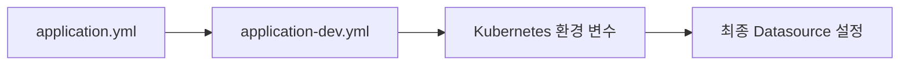

Spring Boot에서는 환경 변수로 전달된 값이 YAML의 기본값보다 높은 우선순위를 가진다. 따라서 동일한 컨테이너 이미지를 사용하더라도 Namespace와 배포 환경에 따라 다른 데이터베이스 설정을 주입할 수 있다.

#### Kubernetes Namespace 생성

애플리케이션 리소스는 `sns` Namespace에 배치한다.

`sns-namespace.yaml`을 작성한다.

```yaml
apiVersion: v1
kind: Namespace
metadata:
  name: sns
  labels:
    app.kubernetes.io/part-of: sns
    environment: dev
```

```shell
kubectl apply -f sns-namespace.yaml
kubectl get namespace sns
```

Redis, Kafka, MySQL ExternalName Service는 `infra` Namespace에 있고 애플리케이션은 `sns` Namespace에 있다. Namespace가 달라도 Service의 전체 DNS 이름을 사용하면 접근할 수 있다. 네트워크 통신까지 차단하려면 별도의 NetworkPolicy가 필요하다.

#### MySQL ConfigMap 작성

`mysql-configmap.yaml`을 작성한다.

```yaml
apiVersion: v1
kind: ConfigMap
metadata:
  name: mysql-config
  namespace: sns
  labels:
    app.kubernetes.io/part-of: sns
    app.kubernetes.io/component: database-config
data:
  MYSQL_HOST: mysql.infra.svc.cluster.local
  MYSQL_PORT: "3306"
  MYSQL_DATABASE: sns
```

- `apiVersion: v1`은 ConfigMap이 Kubernetes Core API 객체임을 의미한다.
- `metadata.name`은 Deployment에서 참조할 ConfigMap 이름이다.
- ConfigMap은 자신을 사용하는 Pod와 같은 `sns` Namespace에 있어야 한다.
- `MYSQL_HOST`는 `infra` Namespace의 ExternalName Service를 가리킨다.
- ConfigMap의 `data` 값은 문자열이어야 하므로 포트도 `"3306"`으로 작성한다.

Kubernetes Service의 전체 DNS 형식은 다음과 같다.

```text
<SERVICE_NAME>.<NAMESPACE>.svc.cluster.local
```

따라서 `mysql.infra.svc.cluster.local`은 `infra` Namespace에 있는 `mysql` Service를 의미한다.

#### MySQL Secret 작성

`mysql-secret.yaml`을 작성한다.

```yaml
apiVersion: v1
kind: Secret
metadata:
  name: mysql-secret
  namespace: sns
  labels:
    app.kubernetes.io/part-of: sns
    app.kubernetes.io/component: database-credentials
type: Opaque
stringData:
  MYSQL_USER: sns_server
  MYSQL_PASSWORD: CHANGE_ME_STRONG_PASSWORD
```

- `type: Opaque`는 일반적인 Key-Value 형식의 Secret을 의미한다.
- `stringData`는 평문을 입력받아 Kubernetes API Server가 Base64 형식의 `data`로 변환한다.
- `MYSQL_PASSWORD`는 RDS에서 생성한 `sns_server` 계정의 실제 비밀번호로 변경해야 한다.
- 이 파일에 실제 비밀번호를 입력했다면 Git에 Commit해서는 안 된다.

Base64는 암호화가 아니라 인코딩이다. Secret을 Base64로 변환했다고 해서 안전하게 보호되는 것은 아니다. 실무에서는 RBAC으로 Secret 조회 권한을 제한하고 AWS Secrets Manager, External Secrets Operator, Secrets Store CSI Driver 같은 외부 비밀 관리 방식을 고려해야 한다.

명령어로 Secret을 직접 생성하면 평문 비밀번호가 포함된 YAML 파일을 만들지 않을 수 있다.

```shell
kubectl create secret generic mysql-secret \
  --namespace sns \
  --from-literal=MYSQL_USER=sns_server \
  --from-literal=MYSQL_PASSWORD='<MYSQL_PASSWORD>'
```

다만 명령 기록에 비밀번호가 남을 수 있으므로 운영 환경에서는 CI/CD Secret이나 외부 Secret Manager를 통해 생성하는 것이 좋다.

#### ConfigMap과 Secret 적용

```shell
kubectl apply -f mysql-configmap.yaml
kubectl apply -f mysql-secret.yaml
```

생성 결과를 확인한다.

```shell
kubectl get configmap mysql-config -n sns
kubectl describe configmap mysql-config -n sns
kubectl get secret mysql-secret -n sns
kubectl describe secret mysql-secret -n sns
```

`kubectl describe secret`은 일반적으로 실제 값을 출력하지 않고 Key와 바이트 크기만 보여준다. 확인을 위해 Secret 값을 터미널에 출력하는 방식은 로그와 화면 기록에 비밀번호가 남을 수 있으므로 피해야 한다.

#### ConfigMap과 Secret 주입 구조

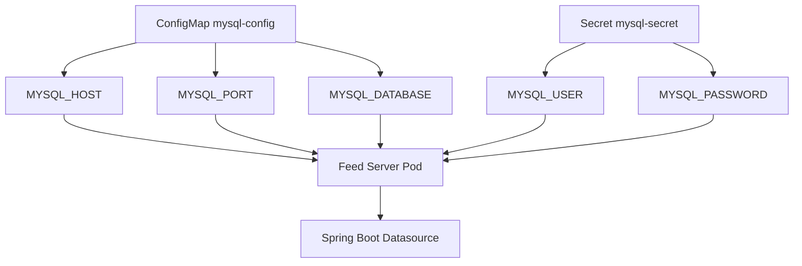

다음 단계에서 Deployment의 `envFrom` 또는 개별 `env.valueFrom` 설정을 이용해 ConfigMap과 Secret을 컨테이너 환경 변수로 주입할 수 있다.

환경 변수로 주입된 ConfigMap과 Secret은 원본 객체를 수정하더라도 실행 중인 컨테이너에서 자동으로 변경되지 않는다. 새로운 값을 적용하려면 Deployment의 Pod를 Rolling Update 방식으로 다시 생성해야 한다.

#### MySQL Service DNS 확인

`sns` Namespace에서 `infra` Namespace의 MySQL Service가 조회되는지 테스트한다.

```shell
kubectl run dns-test \
  --namespace sns \
  --rm \
  --interactive \
  --tty \
  --restart=Never \
  --image=busybox:1.36 \
  -- nslookup mysql.infra.svc.cluster.local
```

정상적인 경우 ExternalName Service가 가리키는 RDS Endpoint가 출력된다.

DNS 조회가 성공했다고 데이터베이스 연결까지 성공한 것은 아니다. MySQL TCP 3306 연결, RDS Security Group, 사용자 인증, TLS 설정은 별도로 검증해야 한다.

#### 로컬 실행

로컬 MySQL 또는 접근 가능한 개발 데이터베이스를 준비한 뒤 환경 변수를 설정한다.

```powershell
$env:MYSQL_HOST = "localhost"
$env:MYSQL_PORT = "3306"
$env:MYSQL_DATABASE = "sns"
$env:MYSQL_USER = "sns_server"
$env:MYSQL_PASSWORD = "local-password"

.\gradlew.bat bootRun --args="--spring.profiles.active=local"
```

애플리케이션이 기동되면 Actuator Health Endpoint를 확인한다.

```shell
curl http://localhost:8080/actuator/health
```

정상적인 경우 다음과 같은 응답을 확인할 수 있다.

```json
{
  "status": "UP"
}
```

`UP`은 애플리케이션과 등록된 HealthIndicator가 정상이라는 의미다. 비즈니스 API 전체가 정상 동작하거나 실제 운영 트래픽을 처리할 수 있다는 의미까지 보장하지는 않는다.

#### 빌드와 테스트

```powershell
.\gradlew.bat clean test
.\gradlew.bat bootJar
```

빌드가 성공하면 다음 위치에 실행 가능한 Jar가 생성된다.

```text
build/libs/feed-server-0.0.1-SNAPSHOT.jar
```

직접 실행할 수도 있다.

```powershell
java -jar build/libs/feed-server-0.0.1-SNAPSHOT.jar --spring.profiles.active=local
```

#### 자주 발생하는 문제

| 현상 | 주요 원인 | 해결 방법 |
|---|---|---|
| `Failed to determine a suitable driver class` | MySQL Driver 누락 | `mysql-connector-j` 의존성 확인 |
| Driver 클래스를 찾지 못함 | 이전 Driver 이름 사용 | `com.mysql.cj.jdbc.Driver` 사용 |
| `Communications link failure` | Host, Port, Security Group 오류 | RDS Endpoint와 TCP 3306 확인 |
| `Access denied for user` | 사용자명, 비밀번호, 권한 오류 | `SHOW GRANTS`와 Secret 값 확인 |
| `UnknownHostException` | Service 이름 또는 Namespace 오타 | `mysql.infra.svc.cluster.local` 확인 |
| 애플리케이션 시작 실패 | 환경 변수 누락 | ConfigMap과 Secret Key 이름 확인 |
| Hibernate 검증 실패 | Entity와 DB Schema 불일치 | 마이그레이션 상태와 `ddl-auto` 확인 |
| Pod가 `CreateContainerConfigError` | ConfigMap 또는 Secret이 같은 Namespace에 없음 | `sns` Namespace의 객체 확인 |

#### 실무적인 구성 기준

ConfigMap과 Secret은 피드 서버만의 리소스처럼 보이지만 실제로는 여러 마이크로서비스가 공유할 수 있는 인프라 설정이다. 초기 실습에서는 피드 서버 프로젝트에 둘 수 있지만, 프로젝트가 커지면 공통 Helm Chart나 별도의 인프라 Repository에서 관리하는 편이 적절하다.

또한 모든 마이크로서비스가 하나의 데이터베이스 계정을 공유하면 특정 서비스의 권한이 전체 테이블로 확장된다. 운영 환경에서는 서비스별 Database 또는 Schema와 전용 계정을 생성하고 필요한 테이블에만 최소 권한을 부여해야 한다.

### 정리

소셜 피드 서버는 게시글 작성자 ID, 본문, 이미지 ID를 관리하며 이미지 파일 자체는 이미지 서버에 위임한다. 이러한 책임 분리는 서비스를 독립적으로 개발하고 확장하기 위한 MSA의 기본 구조다.

Spring Boot 프로젝트는 Java 21, Spring Web, Spring Data JPA, MySQL Driver를 기반으로 생성하고 로컬 환경과 EKS 개발 환경을 Spring Profile로 분리했다. 데이터베이스 주소와 포트는 ConfigMap으로, 사용자명과 비밀번호는 Secret으로 관리하도록 구성했다.

애플리케이션은 `mysql.infra.svc.cluster.local`을 통해 `infra` Namespace의 ExternalName Service를 조회하고 최종적으로 Amazon RDS에 연결한다. ConfigMap과 Secret은 같은 Namespace의 Pod에서만 직접 참조할 수 있지만 Service DNS를 통한 네트워크 호출은 Namespace를 넘어서 수행할 수 있다.

다음 단계에서는 이 설정을 Feed Server Deployment에 주입하고, 컨테이너 이미지와 Resource, Probe, Service를 구성하여 EKS 클러스터에 실제 애플리케이션을 배포할 수 있다.

## 02. Kubernetes를 위한 기본 스프링 설정 및 EKS 배포

### Spring Boot Feed Server를 Kubernetes에 배포하기

이번 단계에서는 Feed Server를 컨테이너 이미지로 빌드해 Amazon ECR에 Push하고, Deployment와 Service를 이용해 EKS 클러스터에 배포한다.

애플리케이션이 정상적으로 시작됐는지 판단할 Health Check Endpoint를 추가하고, Rolling Update 중 처리 중인 요청을 보호하기 위한 Graceful Shutdown도 함께 설정한다.

#### 실습 목표

- Readiness와 Liveness Endpoint 구현
- Spring Boot Graceful Shutdown 설정
- Jib을 이용한 컨테이너 이미지 빌드
- Amazon ECR에 이미지 Push
- Feed Server Deployment와 Service 작성
- ConfigMap과 Secret을 환경 변수로 주입
- CPU와 Memory의 `requests`, `limits` 설정
- Readiness Probe와 Liveness Probe 설정
- EKS 배포 및 Rolling Update 확인

#### 전체 배포 흐름

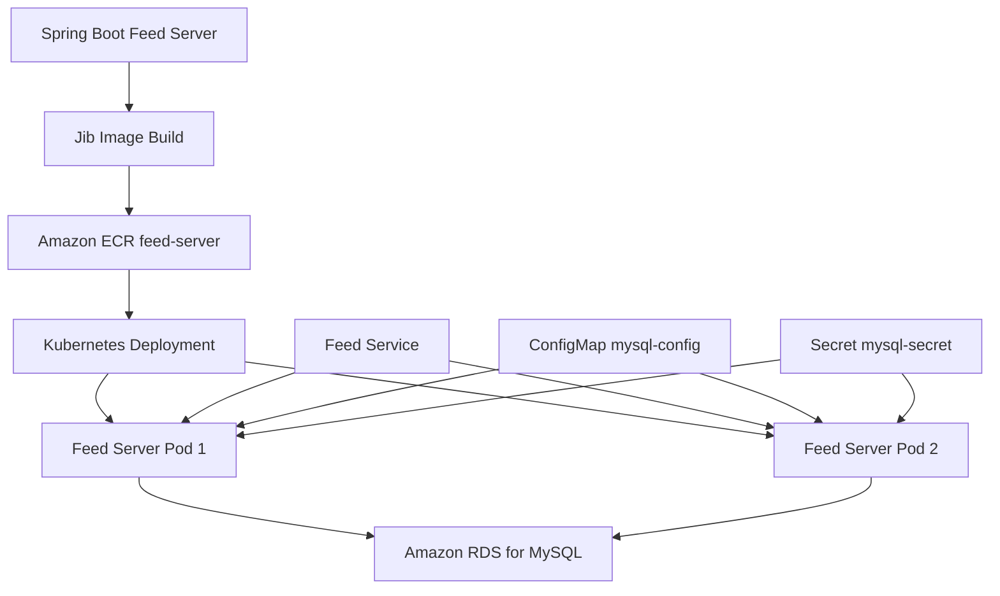

#### Health Check Endpoint 구현

Kubernetes의 Probe는 목적에 따라 구분해야 한다.

| Probe | 확인 대상 | 실패 시 동작 |
|---|---|---|
| Startup Probe | 애플리케이션 시작 완료 여부 | Container 재시작 |
| Readiness Probe | 요청 처리 가능 여부 | Service Endpoint에서 제외 |
| Liveness Probe | 애플리케이션이 복구 불가능한 상태인지 | Container 재시작 |

Readiness Probe가 실패해도 Pod나 Container가 재시작되는 것은 아니다. Kubernetes는 해당 Pod를 Service의 요청 대상에서 제외한다.

Liveness Probe가 연속해서 실패하면 kubelet은 해당 Pod 안의 Container를 재시작한다. Deployment가 Pod를 삭제하고 새 Pod를 만드는 동작과는 다르다.

##### 간단한 Health Check Controller

```java
package com.sns.feed.healthcheck;

import org.springframework.http.ResponseEntity;
import org.springframework.web.bind.annotation.GetMapping;
import org.springframework.web.bind.annotation.RequestMapping;
import org.springframework.web.bind.annotation.RestController;

@RestController
@RequestMapping("/health-check")
public class HealthCheckController {

    @GetMapping("/readiness")
    public ResponseEntity<String> readiness() {
        return ResponseEntity.ok("READY");
    }

    @GetMapping("/liveness")
    public ResponseEntity<String> liveness() {
        return ResponseEntity.ok("LIVE");
    }
}
```

두 Endpoint는 정상일 때 HTTP `200 OK`를 반환한다. HTTP 205는 Reset Content를 의미하므로 일반적인 Health Check 성공 응답으로 사용하지 않는다.

현재 코드는 애플리케이션 프로세스가 HTTP 요청에 응답할 수 있는지만 확인한다. Readiness와 Liveness의 동작 차이를 확인하기에는 충분하지만 실제 운영 상태를 자세히 반영하지는 않는다.

Liveness Probe에는 일반적으로 MySQL이나 Kafka 같은 외부 시스템 상태를 포함하지 않는다. 외부 시스템 장애 때문에 모든 애플리케이션 Container가 반복적으로 재시작되면 장애가 더 커질 수 있기 때문이다.

Spring Boot Actuator를 사용하고 있다면 다음 Endpoint를 사용하는 것이 더 적절하다.

```text
/actuator/health/readiness
/actuator/health/liveness
```

#### Graceful Shutdown 설정

Rolling Update나 Pod 종료 과정에서 Spring Boot는 `SIGTERM`을 전달받는다. Graceful Shutdown을 사용하면 진행 중인 요청이 끝날 시간을 확보한 뒤 애플리케이션을 종료할 수 있다.

`application.yml`에 다음 설정을 추가한다.

```yaml
server:
  port: 8080
  shutdown: graceful

spring:
  lifecycle:
    timeout-per-shutdown-phase: 20s
```

- `server.shutdown: graceful`은 즉시 종료하지 않고 처리 중인 요청을 기다린다.
- `timeout-per-shutdown-phase`는 각 종료 단계가 기다릴 수 있는 시간을 제한한다.
- Kubernetes의 `terminationGracePeriodSeconds`는 이 값과 `preStop` 실행 시간을 모두 수용할 수 있어야 한다.

Spring Boot의 Graceful Shutdown은 새 요청 수락을 중단하고 기존 요청을 처리할 시간을 제공한다. [Spring Boot Graceful Shutdown](https://docs.spring.io/spring-boot/reference/web/graceful-shutdown.html)

로컬 개발 환경에서는 즉시 종료하는 편이 편리하다면 `application-local.yml`에서 재정의한다.

```yaml
server:
  shutdown: immediate
```

IDE의 Stop 버튼은 정상적인 `SIGTERM` 종료가 아니라 프로세스를 즉시 중단할 수 있으므로 로컬에서 Graceful Shutdown이 항상 동일하게 동작한다고 가정해서는 안 된다.

#### Jib을 이용한 컨테이너 이미지 빌드

Jib은 Dockerfile 없이 Java 애플리케이션을 OCI 컨테이너 이미지로 빌드할 수 있는 도구다. 애플리케이션 의존성, 리소스, 클래스 파일을 Layer로 분리하므로 변경되지 않은 Layer를 재사용할 수 있다.

`build.gradle`의 `plugins`에 Jib을 추가한다.

```groovy
plugins {
    id 'java'
    id 'org.springframework.boot' version '3.5.16'
    id 'io.spring.dependency-management' version '1.1.7'
    id 'com.google.cloud.tools.jib' version '3.5.4'
}
```

ECR Registry와 이미지 태그를 Gradle Property로 받도록 설정한다.

```groovy
def ecrRegistry = providers.gradleProperty('ecrRegistry')
    .orElse('<ACCOUNT_ID>.dkr.ecr.ap-northeast-2.amazonaws.com')

def imageTag = providers.gradleProperty('imageTag')
    .orElse(project.version.toString())

jib {
    from {
        image = 'eclipse-temurin:21-jre'
    }

    to {
        image = "${ecrRegistry.get()}/feed-server:${imageTag.get()}"
    }

    container {
        mainClass = 'com.sns.feed.FeedServerApplication'
        ports = ['8080']

        jvmFlags = [
            '-XX:InitialRAMPercentage=30.0',
            '-XX:MaxRAMPercentage=70.0',
            '-XX:+ExitOnOutOfMemoryError',
            '-Djava.security.egd=file:/dev/./urandom'
        ]
    }
}
```

- `from.image`는 애플리케이션 실행에 사용할 Java 21 Runtime Image다.
- `to.image`는 ECR Repository와 이미지 태그를 지정한다.
- `mainClass`는 Spring Boot 진입점이다.
- `ports`는 컨테이너가 사용하는 포트를 이미지 Metadata에 기록한다.
- `MaxRAMPercentage`는 Container Memory Limit 전체를 JVM Heap으로 사용하지 않도록 제한한다.

Container Memory에는 Heap뿐 아니라 Metaspace, Thread Stack, Direct Memory와 Native Memory도 포함된다. 따라서 Heap 최대 크기를 Memory Limit과 동일하게 설정하면 `OOMKilled`가 발생할 수 있다.

Jib은 기본적으로 재현 가능한 이미지를 만들기 위해 생성 시간을 고정한다. `creationTime = 'USE_CURRENT_TIMESTAMP'`를 지정할 수도 있지만 빌드마다 이미지 Digest가 달라질 수 있으므로 특별한 이유가 없다면 기본값을 유지하는 것이 좋다. [Jib Gradle Plugin](https://github.com/GoogleContainerTools/jib/blob/master/jib-gradle-plugin/README.md)

#### Amazon ECR 로그인

ECR 인증 토큰은 영구적으로 유지되지 않는다. 인증이 만료되어 Push가 실패하면 다시 로그인해야 한다.

```shell
aws ecr get-login-password \
  --region ap-northeast-2 \
  --profile sns-admin \
  | docker login \
  --username AWS \
  --password-stdin <ACCOUNT_ID>.dkr.ecr.ap-northeast-2.amazonaws.com
```

Docker 설정 파일에서 ECR 인증 정보를 확인할 수 있으면 Jib도 해당 인증 정보를 사용해 이미지를 Push할 수 있다.

#### 이미지 빌드와 Push

Windows PowerShell에서는 다음 명령을 실행한다.

```powershell
.\gradlew.bat clean test

.\gradlew.bat jib `
  -PecrRegistry=<ACCOUNT_ID>.dkr.ecr.ap-northeast-2.amazonaws.com `
  -PimageTag=0.0.1
```

Linux나 macOS에서는 다음과 같이 실행한다.

```shell
./gradlew clean test

./gradlew jib \
  -PecrRegistry=<ACCOUNT_ID>.dkr.ecr.ap-northeast-2.amazonaws.com \
  -PimageTag=0.0.1
```

Push된 이미지를 확인한다.

```shell
aws ecr list-images \
  --repository-name feed-server \
  --region ap-northeast-2 \
  --profile sns-admin
```

#### Feed Server Deployment 작성

`feed-deployment.yaml`을 작성한다.

```yaml
apiVersion: apps/v1
kind: Deployment
metadata:
  name: feed-server
  namespace: sns
  labels:
    app.kubernetes.io/name: feed-server
    app.kubernetes.io/part-of: sns
spec:
  replicas: 2
  revisionHistoryLimit: 3
  progressDeadlineSeconds: 600
  strategy:
    type: RollingUpdate
    rollingUpdate:
      maxSurge: 1
      maxUnavailable: 0
  selector:
    matchLabels:
      app.kubernetes.io/name: feed-server
  template:
    metadata:
      labels:
        app.kubernetes.io/name: feed-server
        app.kubernetes.io/part-of: sns
    spec:
      terminationGracePeriodSeconds: 40
      containers:
        - name: feed-server
          image: <ACCOUNT_ID>.dkr.ecr.ap-northeast-2.amazonaws.com/feed-server:0.0.1
          imagePullPolicy: IfNotPresent
          ports:
            - name: http
              containerPort: 8080
              protocol: TCP
          env:
            - name: SPRING_PROFILES_ACTIVE
              value: dev
          envFrom:
            - configMapRef:
                name: mysql-config
            - secretRef:
                name: mysql-secret
          resources:
            requests:
              cpu: 500m
              memory: 512Mi
            limits:
              cpu: "1"
              memory: 1Gi
          lifecycle:
            preStop:
              exec:
                command:
                  - sh
                  - -c
                  - sleep 10
          readinessProbe:
            httpGet:
              path: /health-check/readiness
              port: http
            initialDelaySeconds: 30
            periodSeconds: 5
            timeoutSeconds: 2
            successThreshold: 1
            failureThreshold: 3
          livenessProbe:
            httpGet:
              path: /health-check/liveness
              port: http
            initialDelaySeconds: 30
            periodSeconds: 5
            timeoutSeconds: 2
            failureThreshold: 7
```

##### Deployment 주요 필드

| 필드 | 설명 |
|---|---|
| `replicas` | 유지할 Feed Server Pod 수 |
| `strategy.type` | Rolling Update 방식으로 교체 |
| `maxSurge` | 업데이트 중 추가로 생성할 수 있는 Pod 수 |
| `maxUnavailable` | 업데이트 중 허용할 수 있는 비가용 Pod 수 |
| `selector` | Deployment가 관리할 Pod 선택 |
| `template.metadata.labels` | 새로 생성되는 Pod의 Label |
| `terminationGracePeriodSeconds` | 강제 종료 전까지 기다리는 전체 시간 |
| `image` | ECR에 Push한 컨테이너 이미지 |
| `envFrom` | ConfigMap과 Secret의 모든 Key를 환경 변수로 주입 |
| `resources.requests` | 스케줄링 시 보장받기 위해 요청하는 자원 |
| `resources.limits` | Container가 사용할 수 있는 최대 자원 |
| `preStop` | Container 종료 직전에 실행할 Hook |
| `readinessProbe` | 요청을 받을 준비가 됐는지 확인 |
| `livenessProbe` | Container를 재시작해야 하는지 확인 |

Deployment의 `selector.matchLabels`와 Pod Template의 Label은 일치해야 한다. 일치하지 않으면 API Server가 Deployment 생성을 거부하거나 의도한 Pod를 관리하지 못한다.

#### `requests`와 `limits`

`requests`는 Scheduler가 Pod를 배치할 Node를 결정할 때 사용한다. `limits`는 Container가 사용할 수 있는 최대 자원이다.

- CPU `500m`은 0.5 Core에 해당한다.
- CPU Limit을 넘으면 Container가 종료되는 것이 아니라 CPU 사용이 Throttling된다.
- Memory Limit을 넘으면 Container 프로세스가 `OOMKilled`될 수 있다.
- Memory `requests`가 너무 작으면 Node에 Pod가 과도하게 배치될 수 있다.
- `requests`와 `limits`의 차이가 지나치게 크면 Node 자원 경합 시 성능이 불안정해질 수 있다.

초기 값은 정답이 아니다. 부하 테스트와 Metric을 확인하면서 JVM Heap, CPU Throttling, GC 시간, 응답 시간, OOM 발생 여부를 기준으로 조정해야 한다.

#### Probe 설정 해석

현재 Readiness Probe는 30초 뒤부터 5초마다 실행한다. 3번 연속 실패하면 약 15초 뒤 Pod가 NotReady 상태가 되어 Service 트래픽 대상에서 제외된다.

Liveness Probe는 7번 연속 실패해야 Container를 재시작하므로 일시적인 지연 때문에 재시작되는 가능성을 줄인다. Kubernetes Probe의 구체적인 실패 동작은 [Kubernetes Probe 공식 문서](https://kubernetes.io/docs/tasks/configure-pod-container/configure-liveness-readiness-probes/)에서 확인할 수 있다.

애플리케이션 시작 시간이 환경에 따라 크게 달라진다면 긴 `initialDelaySeconds`보다 Startup Probe를 추가하는 것이 적합하다. Startup Probe가 성공하기 전에는 Readiness와 Liveness 검사를 시작하지 않으므로 느린 시작과 실제 장애를 명확하게 구분할 수 있다.

#### Graceful Shutdown 동작 과정

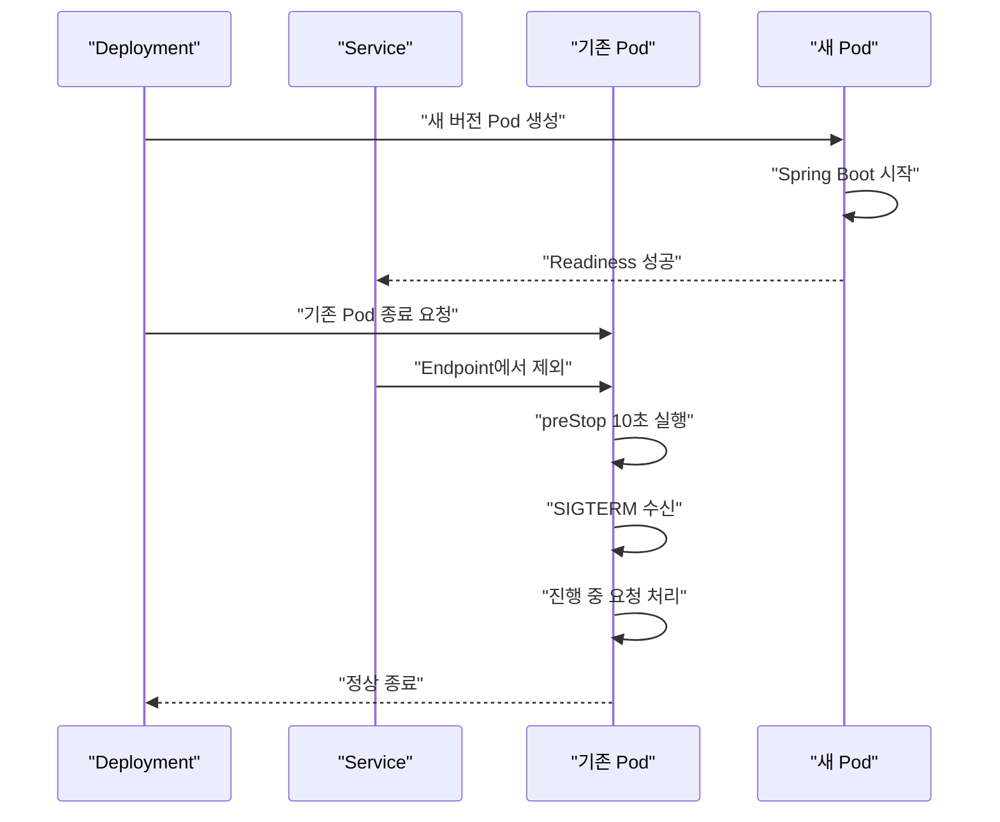

`preStop`의 10초 대기는 Service와 외부 Load Balancer가 기존 Endpoint 변경을 반영할 시간을 확보하기 위한 완충 장치다. 무조건 긴 대기 시간을 설정하는 것이 좋은 것은 아니며 실제 Load Balancer와 요청 종료 시간을 확인해 조정해야 한다.

`terminationGracePeriodSeconds: 40`에는 `preStop` 실행 시간과 Spring Boot 종료 시간이 모두 포함된다. 이 시간이 끝나면 kubelet은 Container를 강제로 종료할 수 있다.

#### Feed Server Service 작성

`feed-service.yaml`을 작성한다.

```yaml
apiVersion: v1
kind: Service
metadata:
  name: feed-service
  namespace: sns
  labels:
    app.kubernetes.io/name: feed-server
    app.kubernetes.io/part-of: sns
spec:
  type: ClusterIP
  selector:
    app.kubernetes.io/name: feed-server
  ports:
    - name: http
      protocol: TCP
      port: 8080
      targetPort: http
```

Service의 Selector는 Deployment가 아니라 Pod의 Label을 선택한다. Readiness Probe에 성공한 Pod만 일반적인 Service 트래픽을 받을 수 있다.

- `type: ClusterIP`는 클러스터 내부에서만 접근 가능한 Service를 생성한다.
- `port`는 Service가 제공하는 포트다.
- `targetPort`는 Pod의 이름 있는 Container Port인 `http`를 참조한다.
- 같은 Namespace에서는 `feed-service:8080`으로 접근할 수 있다.
- 다른 Namespace에서는 `feed-service.sns.svc.cluster.local:8080`을 사용한다.

#### Kubernetes 객체 적용

Namespace와 데이터베이스 설정을 먼저 적용한다.

```shell
kubectl apply -f sns-namespace.yaml
kubectl apply -f mysql-configmap.yaml
kubectl apply -f mysql-secret.yaml
```

Deployment와 Service를 적용한다.

```shell
kubectl apply -f feed-deployment.yaml
kubectl apply -f feed-service.yaml
```

적용 상태를 확인한다.

```shell
kubectl rollout status deployment/feed-server -n sns --timeout=5m
kubectl get deployment,pods,service -n sns -o wide
kubectl get endpointslice -n sns \
  -l kubernetes.io/service-name=feed-service
```

정상적인 경우 Deployment는 `2/2` Ready 상태가 되고 두 Pod 모두 `Running`으로 표시된다.

```text
NAME                          READY   UP-TO-DATE   AVAILABLE
deployment.apps/feed-server   2/2     2            2
```

Pod 상태가 `Running`이어도 `READY`가 `0/1`이면 Readiness Probe가 아직 성공하지 않은 상태다. 실제 요청 가능 여부는 `Running`만 보지 말고 Ready 상태와 EndpointSlice를 함께 확인해야 한다.

#### Service 호출 테스트

클러스터 내부에서 Health Check Endpoint를 호출한다.

```shell
kubectl run curl-client \
  --namespace sns \
  --rm \
  --interactive \
  --tty \
  --restart=Never \
  --image=curlimages/curl:8.12.1 \
  -- curl \
  --fail \
  --silent \
  http://feed-service.sns.svc.cluster.local:8080/health-check/readiness
```

정상적인 결과는 다음과 같다.

```text
READY
```

로컬 PC에서 확인하려면 Port Forward를 사용한다.

```shell
kubectl port-forward service/feed-service 8080:8080 -n sns
```

다른 터미널에서 호출한다.

```shell
curl http://localhost:8080/health-check/readiness
curl http://localhost:8080/health-check/liveness
```

#### 로그와 장애 원인 확인

```shell
kubectl logs -n sns deployment/feed-server --all-pods=true --tail=200
kubectl describe pod -n sns <POD_NAME>
kubectl get events -n sns --sort-by=.metadata.creationTimestamp
```

| 현상 | 주요 원인 | 확인 항목 |
|---|---|---|
| `ImagePullBackOff` | ECR 주소, 태그 또는 IAM 권한 오류 | ECR 이미지와 Node IAM Role |
| `CreateContainerConfigError` | ConfigMap 또는 Secret 누락 | 객체 이름과 Namespace |
| `CrashLoopBackOff` | Spring Boot 시작 실패 | Application Log |
| `OOMKilled` | Memory Limit 초과 | JVM Heap과 Native Memory |
| Pod가 `Pending` | Node의 가용 CPU 또는 Memory 부족 | `requests`와 Node Allocatable |
| `Running`이지만 `0/1` | Readiness Probe 실패 | Endpoint 경로와 응답 코드 |
| 반복적인 Container Restart | Liveness Probe가 지나치게 민감 | 초기 지연과 실패 기준 |
| Service 연결 실패 | Selector와 Pod Label 불일치 | Service EndpointSlice |

#### Rolling Update 확인

새 버전 이미지를 Push한다.

```powershell
.\gradlew.bat jib `
  -PecrRegistry=<ACCOUNT_ID>.dkr.ecr.ap-northeast-2.amazonaws.com `
  -PimageTag=0.0.2
```

Deployment의 이미지를 변경한다.

```shell
kubectl set image \
  deployment/feed-server \
  feed-server=<ACCOUNT_ID>.dkr.ecr.ap-northeast-2.amazonaws.com/feed-server:0.0.2 \
  -n sns
```

진행 상황을 확인한다.

```shell
kubectl rollout status deployment/feed-server -n sns
kubectl rollout history deployment/feed-server -n sns
kubectl get pods -n sns --watch
```

새 Pod의 Readiness Probe가 성공해야 기존 Pod가 종료된다. 배포에 문제가 있다면 이전 Revision으로 되돌릴 수 있다.

```shell
kubectl rollout undo deployment/feed-server -n sns
```

Rollback은 컨테이너 이미지와 Pod Template 설정을 이전 Revision으로 되돌리는 기능이다. 데이터베이스 스키마까지 자동으로 되돌리지는 않으므로 애플리케이션과 DB Migration은 하위 호환성을 고려해야 한다.

### 정리

Feed Server에 Readiness와 Liveness Endpoint를 추가하고 Graceful Shutdown을 설정했다. Readiness 실패는 Pod를 Service 트래픽에서 제외하고, Liveness 실패는 해당 Pod 안의 Container를 재시작한다.

Jib을 이용하면 Dockerfile 없이 Spring Boot 애플리케이션을 컨테이너 이미지로 빌드해 ECR에 Push할 수 있다. 이미지 태그는 `latest`보다 버전이나 Git Commit SHA처럼 변경되지 않는 값을 사용하는 것이 배포와 Rollback 추적에 유리하다.

Deployment는 Feed Server Pod 두 개를 유지하며 Rolling Update로 버전을 교체한다. ConfigMap과 Secret은 `envFrom`을 통해 환경 변수로 주입하고, Service는 Label Selector로 Ready 상태의 Pod에 요청을 전달한다.

Resource와 Probe 설정은 고정된 정답이 아니다. 실제 CPU, JVM Memory, 시작 시간, 응답 지연과 장애 상황을 관찰하면서 조정해야 한다. Graceful Shutdown, `preStop`, `terminationGracePeriodSeconds`도 하나의 종료 흐름으로 설계해야 Rolling Update 중 요청 손실을 줄일 수 있다.

## 03. Social Feed 기능 개발

### Spring Data JPA로 Feed CRUD API 구현하기

SNS의 핵심 기능은 사용자가 작성한 게시물을 저장하고 다시 조회하는 것이다. 이번 실습에서는 Feed Server에 Spring Data JPA를 적용하여 다음 기능을 구현한다.

- Feed 전체 목록 조회
- 특정 사용자가 작성한 Feed 조회
- Feed 단건 조회
- Feed 생성
- Feed 삭제
- 존재하지 않는 Feed 요청에 대한 예외 처리
- Docker 이미지 빌드 및 Kubernetes 재배포
- `kubectl port-forward`를 이용한 API 테스트

Feed Server는 User Server나 Image Server의 데이터를 직접 관리하지 않는다. 사용자와 이미지의 실제 데이터 대신 식별자만 저장하여 서비스 간 결합도를 낮춘다.

#### 실습 목표

이번 실습의 전체 요청 흐름은 다음과 같다.

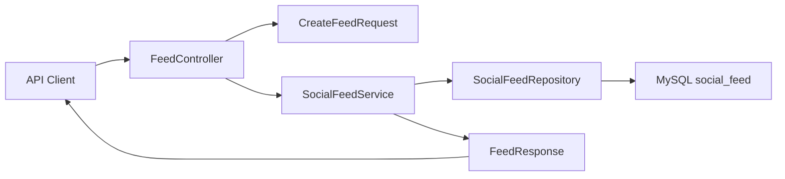

각 계층은 다음 역할을 담당한다.

| 계층 | 역할 |
|---|---|
| Controller | HTTP 요청과 응답 처리 |
| Request DTO | 클라이언트 입력값 검증 |
| Service | Feed 조회, 생성, 삭제와 트랜잭션 처리 |
| Repository | Spring Data JPA를 이용한 데이터 접근 |
| Entity | `social_feed` 테이블과 Java 객체 매핑 |
| Response DTO | 외부에 공개할 응답 구조 정의 |

#### Feed 데이터 모델 설계

Feed Server가 저장할 기본 데이터는 다음과 같다.

| 필드 | 설명 |
|---|---|
| `feed_id` | Feed를 식별하는 자동 증가 ID |
| `image_id` | Image Server에서 관리하는 이미지 식별자 |
| `uploader_id` | User Server에서 관리하는 작성자 식별자 |
| `uploaded_at` | Feed가 등록된 시각 |
| `content` | 게시물 본문 |

User와 Image가 별도 마이크로서비스에서 관리된다면 Feed 테이블에 해당 서비스의 Entity를 직접 연결하지 않는 것이 좋다. 예를 들어 `@ManyToOne User` 같은 연관관계를 만들면 Feed Server가 User Server의 데이터베이스 구조에 의존하게 된다.

따라서 Feed Server에는 `uploader_id`와 `image_id`만 저장하고, 상세 사용자나 이미지 정보가 필요할 때 해당 서비스의 API를 호출하는 방식으로 구성한다.

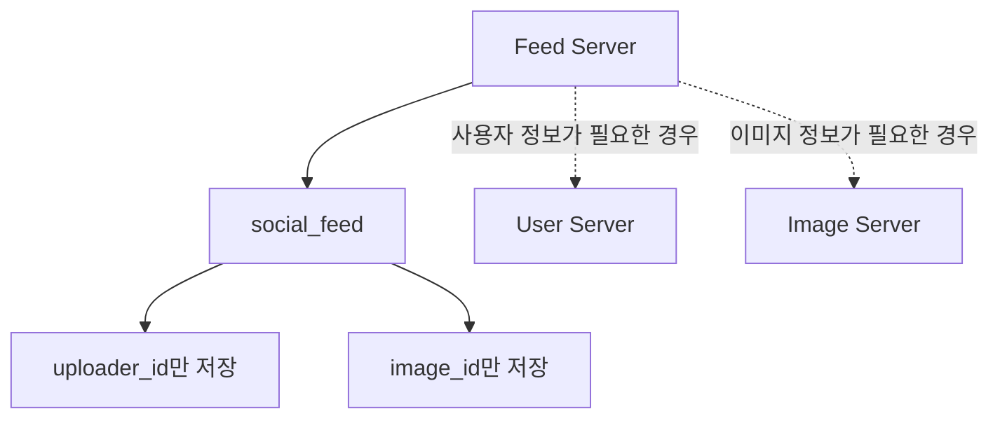

##### 테이블 생성

```sql
CREATE TABLE social_feed (
    feed_id BIGINT NOT NULL AUTO_INCREMENT,
    image_id VARCHAR(100) NULL,
    uploader_id BIGINT NOT NULL,
    uploaded_at DATETIME(6) NOT NULL,
    content VARCHAR(2000) NOT NULL,
    PRIMARY KEY (feed_id),
    INDEX idx_social_feed_uploader_uploaded_at (
        uploader_id,
        uploaded_at
    )
) ENGINE=InnoDB
  DEFAULT CHARSET=utf8mb4
  COLLATE=utf8mb4_unicode_ci;
```

`idx_social_feed_uploader_uploaded_at` 인덱스는 특정 사용자의 Feed를 최신순으로 조회할 때 사용된다.

실제 SNS에서는 이미지가 없는 텍스트 게시물도 존재할 수 있으므로 `image_id`는 `NULL`을 허용했다. 한 게시물에 여러 이미지를 연결해야 한다면 이미지 ID를 쉼표로 연결해 저장하기보다 별도의 `feed_image` 테이블을 사용하는 편이 적절하다.

#### SocialFeed Entity 작성

```java
package com.sns.feed.domain.feed;

import jakarta.persistence.Column;
import jakarta.persistence.Entity;
import jakarta.persistence.GeneratedValue;
import jakarta.persistence.GenerationType;
import jakarta.persistence.Id;
import jakarta.persistence.Index;
import jakarta.persistence.PrePersist;
import jakarta.persistence.Table;

import java.time.Instant;

@Entity
@Table(
    name = "social_feed",
    indexes = {
        @Index(
            name = "idx_social_feed_uploader_uploaded_at",
            columnList = "uploader_id, uploaded_at"
        )
    }
)
public class SocialFeed {

    @Id
    @GeneratedValue(strategy = GenerationType.IDENTITY)
    @Column(name = "feed_id")
    private Long id;

    @Column(name = "image_id", length = 100)
    private String imageId;

    @Column(name = "uploader_id", nullable = false)
    private Long uploaderId;

    @Column(name = "uploaded_at", nullable = false, updatable = false)
    private Instant uploadedAt;

    @Column(name = "content", nullable = false, length = 2000)
    private String content;

    protected SocialFeed() {
    }

    private SocialFeed(String imageId, Long uploaderId, String content) {
        this.imageId = imageId;
        this.uploaderId = uploaderId;
        this.content = content;
    }

    public static SocialFeed create(
        String imageId,
        Long uploaderId,
        String content
    ) {
        return new SocialFeed(imageId, uploaderId, content);
    }

    @PrePersist
    private void initializeUploadedAt() {
        if (uploadedAt == null) {
            uploadedAt = Instant.now();
        }
    }

    public Long getId() {
        return id;
    }

    public String getImageId() {
        return imageId;
    }

    public Long getUploaderId() {
        return uploaderId;
    }

    public Instant getUploadedAt() {
        return uploadedAt;
    }

    public String getContent() {
        return content;
    }
}
```

##### 주요 JPA 설정

- `@Entity`: 해당 클래스를 JPA Entity로 등록한다.
- `@Table`: Entity가 사용할 테이블과 인덱스를 지정한다.
- `@Id`: Entity의 기본 키를 지정한다.
- `GenerationType.IDENTITY`: MySQL의 `AUTO_INCREMENT`를 사용한다.
- `nullable = false`: 데이터베이스의 `NOT NULL` 제약 조건과 일치시킨다.
- `updatable = false`: 생성 시각이 UPDATE SQL에 포함되지 않도록 한다.
- `@PrePersist`: INSERT가 실행되기 직전에 등록 시각을 초기화한다.

`Instant`는 특정 시점을 UTC 기준으로 표현하기 때문에 여러 지역이나 여러 Node에 애플리케이션이 분산된 환경에서 사용하기 좋다.

`java.util.Date`나 `Calendar`에 사용하던 `@Temporal`은 `Instant`, `LocalDateTime`, `OffsetDateTime`과 같은 `java.time` 타입에는 사용하지 않는다.

애플리케이션에서 시간을 생성한다면 모든 Pod와 데이터베이스가 UTC를 기준으로 처리하도록 다음과 같은 설정을 유지하는 것이 좋다.

```yaml
spring:
  jpa:
    properties:
      hibernate:
        jdbc:
          time_zone: UTC
```

#### Repository 작성

```java
package com.sns.feed.domain.feed;

import org.springframework.data.domain.Page;
import org.springframework.data.domain.Pageable;
import org.springframework.data.jpa.repository.JpaRepository;

public interface SocialFeedRepository
    extends JpaRepository<SocialFeed, Long> {

    Page<SocialFeed> findAllByOrderByUploadedAtDesc(Pageable pageable);

    Page<SocialFeed> findAllByUploaderIdOrderByUploadedAtDesc(
        Long uploaderId,
        Pageable pageable
    );
}
```

`JpaRepository<SocialFeed, Long>`의 첫 번째 타입은 Entity, 두 번째 타입은 기본 키 타입이다.

Feed 목록은 데이터가 계속 증가하기 때문에 `List`로 전체 데이터를 한 번에 반환하지 않고 `Pageable`을 사용한다. 전체 Feed와 사용자별 Feed는 모두 최신 게시물이 먼저 노출되도록 `uploadedAt DESC` 조건을 적용했다.

#### 요청 DTO 작성

Entity를 HTTP 요청 객체로 직접 사용하면 클라이언트가 `feedId`, `uploadedAt`처럼 서버가 관리해야 하는 값까지 전달할 수 있다. Entity 구조의 변경이 API 계약 변경으로 이어지는 문제도 발생한다.

따라서 Feed 생성 요청에는 별도의 DTO를 사용한다.

```java
package com.sns.feed.api.dto;

import jakarta.validation.constraints.NotBlank;
import jakarta.validation.constraints.NotNull;
import jakarta.validation.constraints.Positive;
import jakarta.validation.constraints.Size;

public record CreateFeedRequest(

    @Size(max = 100)
    String imageId,

    @NotNull
    @Positive
    Long uploaderId,

    @NotBlank
    @Size(max = 2000)
    String content
) {
}
```

- `imageId`: 이미지가 없는 게시물을 허용하므로 필수값으로 지정하지 않는다.
- `uploaderId`: 식별자로 사용할 양수만 허용한다.
- `content`: 공백만 전달되는 요청을 차단하고 최대 길이를 제한한다.

이번 실습에서는 요청으로 `uploaderId`를 받는다. 그러나 인증이 적용된 운영 환경에서는 요청 본문의 작성자 ID를 신뢰하면 안 된다. 클라이언트가 다른 사용자의 ID를 전달해 게시물을 등록할 수 있기 때문이다.

운영 환경에서는 JWT나 인증 세션에서 사용자 ID를 가져와야 한다.

#### 응답 DTO 작성

```java
package com.sns.feed.api.dto;

import com.sns.feed.domain.feed.SocialFeed;

import java.time.Instant;

public record FeedResponse(
    Long feedId,
    String imageId,
    Long uploaderId,
    Instant uploadedAt,
    String content
) {

    public static FeedResponse from(SocialFeed feed) {
        return new FeedResponse(
            feed.getId(),
            feed.getImageId(),
            feed.getUploaderId(),
            feed.getUploadedAt(),
            feed.getContent()
        );
    }
}
```

응답 DTO를 별도로 만들면 Entity에 내부 관리 필드가 추가되더라도 API 응답에 자동으로 노출되지 않는다. 지연 로딩 연관관계가 추가됐을 때 JSON 직렬화 과정에서 발생할 수 있는 문제도 줄일 수 있다.

#### Feed를 찾을 수 없는 경우의 예외 처리

Feed가 존재하지 않을 때 `null`을 반환하면 Controller에서 누락하기 쉽고, 잘못하면 상태 코드 `200 OK`와 함께 빈 응답이 반환될 수 있다.

존재하지 않는 리소스는 명시적인 예외로 처리한다.

```java
package com.sns.feed.domain.feed;

public class FeedNotFoundException extends RuntimeException {

    public FeedNotFoundException(Long feedId) {
        super("Feed를 찾을 수 없습니다. feedId=" + feedId);
    }
}
```

Spring Boot 3와 Spring Framework 6에서는 `ProblemDetail`을 사용해 표준화된 오류 응답을 만들 수 있다.

```java
package com.sns.feed.api;

import com.sns.feed.domain.feed.FeedNotFoundException;
import org.springframework.http.HttpStatus;
import org.springframework.http.ProblemDetail;
import org.springframework.web.bind.annotation.ExceptionHandler;
import org.springframework.web.bind.annotation.RestControllerAdvice;

@RestControllerAdvice
public class ApiExceptionHandler {

    @ExceptionHandler(FeedNotFoundException.class)
    public ProblemDetail handleFeedNotFound(
        FeedNotFoundException exception
    ) {
        ProblemDetail problem = ProblemDetail.forStatusAndDetail(
            HttpStatus.NOT_FOUND,
            exception.getMessage()
        );
        problem.setTitle("Feed Not Found");
        return problem;
    }
}
```

#### Service 작성

```java
package com.sns.feed.domain.feed;

import com.sns.feed.api.dto.CreateFeedRequest;
import com.sns.feed.api.dto.FeedResponse;
import org.springframework.data.domain.Page;
import org.springframework.data.domain.Pageable;
import org.springframework.stereotype.Service;
import org.springframework.transaction.annotation.Transactional;

@Service
@Transactional(readOnly = true)
public class SocialFeedService {

    private final SocialFeedRepository socialFeedRepository;

    public SocialFeedService(
        SocialFeedRepository socialFeedRepository
    ) {
        this.socialFeedRepository = socialFeedRepository;
    }

    public Page<FeedResponse> getFeeds(Pageable pageable) {
        return socialFeedRepository
            .findAllByOrderByUploadedAtDesc(pageable)
            .map(FeedResponse::from);
    }

    public Page<FeedResponse> getFeedsByUploader(
        Long uploaderId,
        Pageable pageable
    ) {
        return socialFeedRepository
            .findAllByUploaderIdOrderByUploadedAtDesc(
                uploaderId,
                pageable
            )
            .map(FeedResponse::from);
    }

    public FeedResponse getFeed(Long feedId) {
        return FeedResponse.from(findFeed(feedId));
    }

    @Transactional
    public FeedResponse createFeed(CreateFeedRequest request) {
        SocialFeed feed = SocialFeed.create(
            request.imageId(),
            request.uploaderId(),
            request.content()
        );

        SocialFeed savedFeed = socialFeedRepository.save(feed);
        return FeedResponse.from(savedFeed);
    }

    @Transactional
    public void deleteFeed(Long feedId) {
        SocialFeed feed = findFeed(feedId);
        socialFeedRepository.delete(feed);
    }

    private SocialFeed findFeed(Long feedId) {
        return socialFeedRepository.findById(feedId)
            .orElseThrow(() -> new FeedNotFoundException(feedId));
    }
}
```

클래스에는 `@Transactional(readOnly = true)`를 적용하여 조회 메서드를 읽기 전용으로 처리한다. 데이터를 변경하는 생성 및 삭제 메서드에는 별도로 `@Transactional`을 선언한다.

삭제할 때는 바로 `deleteById()`를 호출하지 않고 먼저 Entity의 존재 여부를 확인한다. 이를 통해 존재하지 않는 Feed 삭제 요청에 `404 Not Found`를 일관되게 반환할 수 있다.

#### Controller 작성

```java
package com.sns.feed.api;

import com.sns.feed.api.dto.CreateFeedRequest;
import com.sns.feed.api.dto.FeedResponse;
import com.sns.feed.domain.feed.SocialFeedService;
import jakarta.validation.Valid;
import org.springframework.data.domain.Page;
import org.springframework.data.domain.Pageable;
import org.springframework.data.web.PageableDefault;
import org.springframework.http.ResponseEntity;
import org.springframework.web.bind.annotation.DeleteMapping;
import org.springframework.web.bind.annotation.GetMapping;
import org.springframework.web.bind.annotation.PathVariable;
import org.springframework.web.bind.annotation.PostMapping;
import org.springframework.web.bind.annotation.RequestBody;
import org.springframework.web.bind.annotation.RequestMapping;
import org.springframework.web.bind.annotation.RestController;
import org.springframework.web.servlet.support.ServletUriComponentsBuilder;

import java.net.URI;

@RestController
@RequestMapping("/api/feeds")
public class FeedController {

    private final SocialFeedService socialFeedService;

    public FeedController(SocialFeedService socialFeedService) {
        this.socialFeedService = socialFeedService;
    }

    @GetMapping
    public Page<FeedResponse> getFeeds(
        @PageableDefault(size = 20)
        Pageable pageable
    ) {
        return socialFeedService.getFeeds(pageable);
    }

    @GetMapping("/users/{uploaderId}")
    public Page<FeedResponse> getFeedsByUploader(
        @PathVariable Long uploaderId,
        @PageableDefault(size = 20)
        Pageable pageable
    ) {
        return socialFeedService.getFeedsByUploader(
            uploaderId,
            pageable
        );
    }

    @GetMapping("/{feedId}")
    public FeedResponse getFeed(@PathVariable Long feedId) {
        return socialFeedService.getFeed(feedId);
    }

    @PostMapping
    public ResponseEntity<FeedResponse> createFeed(
        @Valid @RequestBody CreateFeedRequest request
    ) {
        FeedResponse response =
            socialFeedService.createFeed(request);

        URI location = ServletUriComponentsBuilder
            .fromCurrentRequest()
            .path("/{feedId}")
            .buildAndExpand(response.feedId())
            .toUri();

        return ResponseEntity.created(location).body(response);
    }

    @DeleteMapping("/{feedId}")
    public ResponseEntity<Void> deleteFeed(
        @PathVariable Long feedId
    ) {
        socialFeedService.deleteFeed(feedId);
        return ResponseEntity.noContent().build();
    }
}
```

API별 HTTP 메서드와 응답 상태는 다음과 같다.

| HTTP 요청 | 기능 | 정상 상태 코드 |
|---|---|---:|
| `GET /api/feeds` | 전체 Feed 조회 | `200 OK` |
| `GET /api/feeds/users/{uploaderId}` | 사용자별 Feed 조회 | `200 OK` |
| `GET /api/feeds/{feedId}` | Feed 단건 조회 | `200 OK` |
| `POST /api/feeds` | Feed 생성 | `201 Created` |
| `DELETE /api/feeds/{feedId}` | Feed 삭제 | `204 No Content` |

생성 API는 `201 Created`와 함께 생성된 리소스의 주소를 `Location` 헤더로 반환한다. 삭제 API는 응답 본문이 필요하지 않으므로 `204 No Content`를 반환한다.

#### 컨테이너 이미지 빌드

애플리케이션 코드가 변경됐으므로 새로운 버전의 컨테이너 이미지를 생성한다. 기존 이미지가 `0.0.1`이었다면 이번 버전은 `0.0.2`로 구분한다.

```powershell
.\gradlew.bat clean test jib `
  -Djib.to.image=<AWS_ACCOUNT_ID>.dkr.ecr.<REGION>.amazonaws.com/feed-server:0.0.2
```

Jib가 ECR에 이미지를 Push하려면 먼저 인증이 완료되어 있어야 한다.

```powershell
aws ecr get-login-password --region <REGION> |
    docker login `
        --username AWS `
        --password-stdin `
        <AWS_ACCOUNT_ID>.dkr.ecr.<REGION>.amazonaws.com
```

동일한 태그를 반복해서 덮어쓰면 어떤 소스 코드가 배포됐는지 추적하기 어렵다. 실무에서는 애플리케이션 버전이나 Git 커밋 해시를 이미지 태그로 사용하는 것이 좋다.

#### Kubernetes Deployment 이미지 변경

기존 Deployment의 컨테이너 이름이 `feed-server`라면 다음 명령으로 이미지를 변경할 수 있다.

```shell
kubectl set image deployment/feed-server \
  feed-server=<AWS_ACCOUNT_ID>.dkr.ecr.<REGION>.amazonaws.com/feed-server:0.0.2 \
  -n sns
```

배포 진행 상태를 확인한다.

```shell
kubectl rollout status deployment/feed-server -n sns
```

Pod와 이미지 버전도 함께 확인한다.

```shell
kubectl get pods -n sns -l app=feed-server
```

```shell
kubectl get deployment feed-server \
  -n sns \
  -o jsonpath="{.spec.template.spec.containers[0].image}"
```

정상적으로 배포되면 새 ReplicaSet의 Pod가 생성되고 Readiness Probe를 통과한 뒤 기존 Pod가 순차적으로 종료된다.

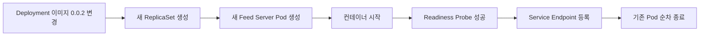

#### API 테스트

Ingress를 아직 구성하지 않았다면 `kubectl port-forward`를 사용해 로컬에서 Service에 접근할 수 있다.

```shell
kubectl port-forward service/feed-service 8080:8080 -n sns
```

##### Feed 생성

```shell
curl -i -X POST http://localhost:8080/api/feeds \
  -H "Content-Type: application/json" \
  -d '{
    "imageId": "image-20260914-001",
    "uploaderId": 1,
    "content": "Kubernetes에서 실행되는 첫 번째 Feed입니다."
  }'
```

정상적으로 생성되면 `201 Created`와 `Location` 헤더가 반환된다.

```http
HTTP/1.1 201 Created
Location: http://localhost:8080/api/feeds/1
Content-Type: application/json
```

##### 전체 Feed 조회

```shell
curl "http://localhost:8080/api/feeds?page=0&size=20"
```

응답의 `content` 배열에는 최신 Feed부터 저장된다.

##### 사용자별 Feed 조회

```shell
curl "http://localhost:8080/api/feeds/users/1?page=0&size=20"
```

##### Feed 단건 조회

```shell
curl http://localhost:8080/api/feeds/1
```

##### Feed 삭제

```shell
curl -i -X DELETE http://localhost:8080/api/feeds/1
```

정상 삭제된 경우 다음 상태 코드가 반환된다.

```http
HTTP/1.1 204 No Content
```

삭제한 Feed를 다시 조회하면 `404 Not Found`가 반환되어야 한다.

```shell
curl -i http://localhost:8080/api/feeds/1
```

#### 실패 상황과 원인 확인

##### `400 Bad Request`가 반환되는 경우

다음 요청은 `uploaderId`가 없거나 `content`가 공백이므로 검증에 실패한다.

```json
{
  "imageId": "image-001",
  "content": " "
}
```

`@Valid`와 Bean Validation이 동작하려면 다음 의존성이 필요하다.

```groovy
dependencies {
    implementation 'org.springframework.boot:spring-boot-starter-validation'
}
```

##### Feed 생성 시 `500 Internal Server Error`가 발생하는 경우

다음 항목을 확인한다.

- `social_feed` 테이블이 실제로 생성됐는지
- Entity의 컬럼명과 실제 테이블 컬럼명이 일치하는지
- 애플리케이션이 올바른 MySQL 호스트를 사용하는지
- Secret의 사용자명과 비밀번호가 정확한지
- Feed Server가 실행되는 Namespace에서 MySQL Service DNS를 조회할 수 있는지
- `uploaded_at`에 정상적인 값이 설정되는지

```shell
kubectl logs deployment/feed-server -n sns --tail=200
```

##### 변경한 API가 보이지 않는 경우

Deployment가 여전히 이전 이미지 태그를 사용하고 있을 가능성이 있다.

```shell
kubectl describe deployment feed-server -n sns
```

이미지 태그를 변경하지 않고 같은 태그를 재사용했다면 Node에 캐시된 이전 이미지가 사용될 수 있다. 이미지마다 새로운 태그를 사용하는 방식이 가장 명확하다.

##### Pod는 Running이지만 요청이 실패하는 경우

`Running`은 컨테이너 프로세스가 실행 중이라는 뜻일 뿐, 애플리케이션이 트래픽을 처리할 준비가 됐다는 의미는 아니다.

다음 항목을 함께 확인해야 한다.

```shell
kubectl get pods -n sns
kubectl get service feed-service -n sns
kubectl get endpointslice -n sns \
  -l kubernetes.io/service-name=feed-service
```

Readiness Probe가 실패하면 Pod는 실행 중이어도 Service Endpoint에 등록되지 않는다.

#### 실무에서 추가로 고려할 사항

##### 작성자 ID를 요청에서 신뢰하지 않는다

인증이 적용된 환경에서는 `uploaderId`를 요청 DTO에서 제거하고 인증 컨텍스트에서 가져와야 한다.

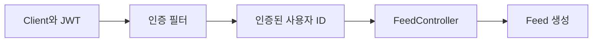

이를 통해 다른 사용자의 ID를 전달해 게시물을 생성하는 위조 요청을 방지할 수 있다.

##### 목록 API에는 페이지 크기 제한이 필요하다

클라이언트가 지나치게 큰 `size` 값을 전달하면 데이터베이스와 애플리케이션 메모리에 부담을 줄 수 있다.

```yaml
spring:
  data:
    web:
      pageable:
        default-page-size: 20
        max-page-size: 100
```

##### Feed 삭제 정책을 명확히 해야 한다

실제 SNS에서는 게시물을 즉시 물리 삭제하지 않고 삭제 상태를 기록하는 Soft Delete를 사용할 수 있다. 신고 처리, 감사 기록, 복구 요구사항이 있다면 `deleted_at` 또는 상태 컬럼을 두는 방식을 검토해야 한다.

##### 서비스 간 참조는 데이터 정합성을 별도로 관리해야 한다

마이크로서비스 간에는 데이터베이스 Foreign Key를 설정하기 어렵다. 따라서 다음 상황을 애플리케이션 수준에서 처리해야 한다.

- 존재하지 않는 `uploaderId`로 Feed가 생성되는 문제
- 삭제된 이미지의 `imageId`가 Feed에 남는 문제
- User Server 또는 Image Server 장애로 상세 정보를 가져오지 못하는 문제
- 서비스 간 이벤트 전달 지연으로 데이터가 일시적으로 불일치하는 문제

필요하다면 동기 API 검증, 이벤트 기반 동기화, Outbox Pattern, 보상 처리 등을 적용할 수 있다.

##### Feed 전체 조회는 장기적으로 별도 읽기 모델이 필요할 수 있다

초기 단계에서는 Feed Server의 데이터베이스를 직접 조회해도 충분하다. 하지만 팔로우 관계를 기준으로 개인화된 타임라인을 생성하려면 단순한 `SELECT`만으로 처리하기 어렵다.

트래픽이 증가하면 다음과 같은 구조로 발전시킬 수 있다.

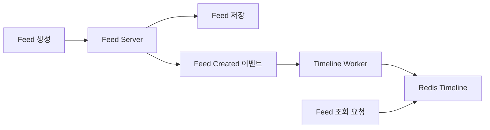

이 구조에서는 Feed 생성과 타임라인 구성을 분리하고, Redis와 비동기 Worker를 이용해 조회 성능을 개선할 수 있다.

### 정리

이번 실습에서는 Spring Data JPA를 사용하여 Feed Server의 기본 CRUD API를 구현했다.

- Feed Entity는 이미지와 사용자의 실제 데이터 대신 식별자만 저장한다.
- `Instant`와 `@PrePersist`를 사용해 Feed 생성 시각을 기록한다.
- Repository에는 전체 및 사용자별 최신 Feed 조회 기능을 정의했다.
- Request DTO와 Response DTO를 분리해 Entity가 API 계약에 직접 노출되지 않도록 구성했다.
- Service에서 조회 트랜잭션과 변경 트랜잭션을 구분했다.
- 존재하지 않는 Feed는 `null` 대신 예외를 발생시켜 `404 Not Found`로 처리했다.
- Feed 생성은 `201 Created`, 삭제는 `204 No Content`를 반환하도록 REST 원칙에 맞췄다.
- 변경된 애플리케이션을 `0.0.2` 이미지로 빌드하고 Kubernetes Deployment에 반영했다.
- 외부 Ingress가 없어도 `kubectl port-forward`를 이용해 API를 검증할 수 있다.

이 단계에서 구현한 CRUD API는 SNS Feed 기능의 출발점이다. 이후 인증된 사용자 식별, 이미지 서비스 연동, 페이지네이션 최적화, 개인화 타임라인과 이벤트 기반 처리 구조를 추가하면 실제 서비스에 가까운 Feed 시스템으로 확장할 수 있다.


## 04. Telepresence를 이용한 마이크로서비스 개발환경 구성

### 09. Telepresence를 이용한 Kubernetes 내부 API 테스트

Kubernetes에 배포한 Feed Server는 `ClusterIP` 타입의 Service를 통해 클러스터 내부에 노출되어 있다. `ClusterIP`는 기본적으로 클러스터 내부 통신을 위한 주소이므로 로컬 개발 환경에서는 `feed-service.sns.svc.cluster.local`과 같은 Service DNS를 바로 호출할 수 없다.

내부 API를 테스트하는 방법은 여러 가지다.

| 방법 | 특징 | 적합한 상황 |
|---|---|---|
| `kubectl exec` | Pod 내부에서 직접 API 호출 | 간단한 네트워크 확인 |
| `kubectl port-forward` | Service 또는 Pod의 포트를 로컬로 전달 | 단일 서비스의 임시 테스트 |
| NodePort | Node의 특정 포트를 외부에 공개 | 제한적인 테스트 환경 |
| LoadBalancer | 클라우드 Load Balancer 생성 | 외부 서비스 공개 |
| Ingress | 도메인과 경로 기반 라우팅 | 실제 외부 API 구성 |
| Telepresence | 로컬 환경을 클러스터 네트워크에 연결 | 마이크로서비스 개발과 내부 API 테스트 |

이번 실습에서는 Telepresence를 사용하여 로컬 환경에서 Kubernetes 내부 Service DNS를 직접 호출한다.

#### Telepresence란

Telepresence는 로컬 워크스테이션과 Kubernetes 클러스터 사이에 네트워크 터널을 구성하는 개발 도구다.

Telepresence에 연결하면 로컬에서 실행하는 `curl`, Postman, IDE, Spring Boot 애플리케이션 등이 Kubernetes Service DNS와 ClusterIP에 접근할 수 있다. 로컬 프로세스가 실제 Pod로 바뀌는 것은 아니지만, 네트워크 관점에서는 클러스터 내부 서비스에 접근할 수 있는 환경이 만들어진다.

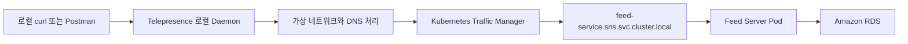

Telepresence는 로컬에 가상 네트워크 인터페이스를 만들고 Kubernetes의 Service 및 Pod 대역으로 향하는 트래픽을 클러스터로 전달한다. DNS 요청도 처리하므로 로컬에서 `*.svc.cluster.local` 형식의 Service DNS를 사용할 수 있다. [Telepresence Connection Routing](https://telepresence.io/docs/reference/routing)

#### Telepresence가 유용한 이유

마이크로서비스를 로컬에서 개발할 때는 현재 수정하는 서버 외에도 여러 의존 서비스가 필요하다.

예를 들어 Feed Server를 개발하는 경우 다음 서비스가 필요할 수 있다.

- User Server
- Image Server
- Timeline Server
- Redis
- Kafka
- MySQL
- 각 서비스가 사용하는 별도 저장소

모든 마이크로서비스와 인프라를 로컬에 실행하면 CPU와 메모리 사용량이 증가하고, 실제 Kubernetes 환경과 다른 설정 때문에 테스트 결과가 달라질 수 있다.

Telepresence를 이용하면 현재 개발 중인 애플리케이션만 로컬에서 실행하고 나머지 서비스는 Kubernetes 클러스터에 배포된 환경을 사용할 수 있다.

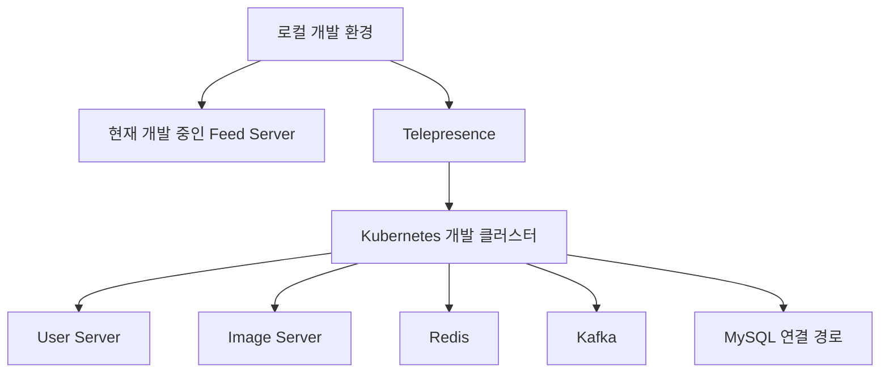

다만 이번 실습에서는 로컬 애플리케이션으로 트래픽을 전환하지 않고, 로컬에서 클러스터 내부의 Feed Server API를 호출하는 기능만 사용한다.

#### `connect`와 `intercept`의 차이

Telepresence의 `connect`와 `intercept`는 목적이 다르다.

| 명령 | 역할 |
|---|---|
| `telepresence connect` | 로컬에서 Kubernetes 내부 서비스로 접근할 수 있게 연결 |
| `telepresence intercept` | 특정 Kubernetes Workload로 들어오는 요청을 로컬 애플리케이션으로 전달 |

이번 실습에서는 이미 Kubernetes에 배포된 Feed Server를 테스트하므로 `connect`만 사용한다. `intercept`는 클러스터 트래픽을 로컬 프로세스로 전환하므로 공유 개발 환경에서는 적용 범위와 다른 개발자에게 미치는 영향을 먼저 확인해야 한다.

#### 실습 목표

이번 실습에서는 다음 작업을 수행한다.

1. 현재 `kubectl` Context와 Feed Server 상태를 확인한다.
2. 로컬 환경에 Telepresence Client를 설치한다.
3. Kubernetes 클러스터에 Traffic Manager를 설치한다.
4. 로컬 환경과 `sns` Namespace를 연결한다.
5. Service DNS로 Feed Server Health Check API를 호출한다.
6. Feed 생성, 조회, 삭제 API를 테스트한다.
7. 연결을 종료하고 장애 상황을 점검한다.

#### 사전 조건

다음 구성이 준비되어 있어야 한다.

- AWS EKS 클러스터가 실행 중이다.
- `kubectl`이 EKS 클러스터에 연결되어 있다.
- `sns` Namespace가 생성되어 있다.
- Feed Server Deployment가 정상 실행 중이다.
- `feed-service`라는 ClusterIP Service가 생성되어 있다.
- Feed Server가 MySQL에 정상적으로 연결되어 있다.
- Traffic Manager를 설치할 수 있는 Kubernetes 권한이 있다.

먼저 현재 Context를 확인한다.

```shell
kubectl config current-context
```

클러스터 연결 상태를 확인한다.

```shell
kubectl cluster-info
```

Feed Server의 Kubernetes 객체를 확인한다.

```shell
kubectl get deployment,pod,service -n sns
```

예상되는 Service 구성은 다음과 같다.

```text
NAME                   TYPE        CLUSTER-IP      PORT(S)
service/feed-service   ClusterIP   172.20.10.120   8080/TCP
```

Service가 연결할 준비가 된 Pod를 가지고 있는지도 확인한다.

```shell
kubectl get endpointslice \
  -n sns \
  -l kubernetes.io/service-name=feed-service
```

Endpoint가 비어 있다면 Telepresence를 설치해도 API를 호출할 수 없다. 이 경우 먼저 Service의 `selector`, Pod의 Label, Readiness Probe 상태를 확인해야 한다.

#### Telepresence Client 설치

Telepresence는 로컬 Client와 클러스터 내부의 Traffic Manager로 구성된다.

Windows에서는 Setup Installer를 사용하는 방식이 권장된다. 수동 설치가 필요하다면 관리자 권한 PowerShell에서 다음과 같이 최신 압축 파일을 설치할 수 있다. 설치 방식과 파일명은 버전에 따라 달라질 수 있으므로 실행 전 [Telepresence Client 설치 페이지](https://telepresence.io/docs/install/client/?os=windows)를 함께 확인하는 것이 좋다.

```powershell
$ProgressPreference = "SilentlyContinue"

Invoke-WebRequest `
  https://github.com/telepresenceio/telepresence/releases/latest/download/telepresence-windows-amd64.zip `
  -OutFile telepresence.zip

Expand-Archive `
  -Path telepresence.zip `
  -DestinationPath telepresenceInstaller/telepresence

Set-Location telepresenceInstaller/telepresence

powershell.exe `
  -ExecutionPolicy bypass `
  -Command ". '.\install-telepresence.ps1';"
```

설치가 끝나면 버전을 확인한다.

```shell
telepresence version
```

Standalone Binary 방식으로 설치하면 네트워크를 변경하는 Root Daemon 실행을 위해 관리자 권한이나 `sudo`가 요구될 수 있다.

#### Traffic Manager 설치

Telepresence Client만으로는 클러스터 내부 네트워크에 연결할 수 없다. 클러스터에는 로컬 Client와 통신할 Traffic Manager가 필요하다.

설치 전에 다시 한번 현재 Context를 확인한다.

```shell
kubectl config current-context
```

잘못된 Context가 선택된 상태에서 실행하면 의도하지 않은 클러스터에 Traffic Manager와 RBAC 객체가 생성될 수 있다.

Traffic Manager를 설치한다.

```shell
telepresence helm install
```

`telepresence helm install`은 Telepresence에 포함된 Helm Chart를 이용해 Traffic Manager를 설치한다. Traffic Manager는 클러스터마다 한 번만 설치하면 되며, 이후 각 개발자는 자신의 로컬 Client로 연결할 수 있다. [Telepresence Traffic Manager 설치](https://telepresence.io/docs/install/manager)

설치 상태를 확인한다.

```shell
kubectl get deployment,pod,service -n ambassador
```

기본 설정에서는 `ambassador` Namespace에 Traffic Manager가 설치된다. 이미 조직에서 Telepresence를 관리하고 있다면 개인이 다시 설치하지 말고 기존 Manager Namespace와 운영 정책을 확인해야 한다.

#### `sns` Namespace에 연결

로컬 환경에서 다음 명령을 실행한다.

```shell
telepresence connect \
  --namespace sns \
  --mapped-namespaces sns
```

- `--namespace sns`: 짧은 Service 이름을 해석할 기본 Namespace를 `sns`로 지정한다.
- `--mapped-namespaces sns`: DNS 및 네트워크 매핑 범위를 `sns` Namespace로 제한한다.

연결 상태를 확인한다.

```shell
telepresence status
```

정상적으로 연결되면 현재 Kubernetes Context, Namespace, Traffic Manager 연결 상태를 확인할 수 있다.

Telepresence는 현재 `kubeconfig`와 Context를 사용하므로 다른 클러스터로 연결하려면 먼저 `kubectl config use-context`로 Context를 변경하거나 `telepresence connect --context` 옵션을 사용해야 한다.

#### Service DNS 호출 확인

Feed Server는 `sns` Namespace의 `feed-service` Service를 통해 노출되어 있다.

전체 Service DNS는 다음과 같다.

```text
feed-service.sns.svc.cluster.local
```

Telepresence가 `sns` Namespace에 연결된 상태에서는 짧은 이름도 사용할 수 있다.

```text
feed-service
```

먼저 Readiness Endpoint를 호출한다.

```shell
curl -i \
  http://feed-service.sns.svc.cluster.local:8080/health-check/readiness
```

정상적으로 준비된 Feed Server라면 일반적으로 다음과 같이 `200 OK`가 반환된다.

```http
HTTP/1.1 200 OK
Content-Type: text/plain

UP
```

응답 본문의 형태는 Health Check 구현에 따라 달라질 수 있지만, 정상 상태를 판단하는 핵심은 HTTP 상태 코드 `200 OK`다. `205`는 일반적인 Health Check 성공 상태 코드가 아니다.

짧은 Service 이름으로도 호출해 볼 수 있다.

```shell
curl -i http://feed-service:8080/health-check/readiness
```

#### Feed 생성 API 테스트

현재 Image Server와 User Server가 구현되지 않았다면 `imageId`와 `uploaderId`는 테스트용 값을 사용한다.

```shell
curl -i -X POST \
  http://feed-service.sns.svc.cluster.local:8080/api/feeds \
  -H "Content-Type: application/json" \
  -d '{
    "imageId": "test-image-001",
    "uploaderId": 1,
    "content": "Telepresence를 이용한 Feed 등록 테스트"
  }'
```

정상적으로 생성되면 `201 Created`가 반환된다.

```http
HTTP/1.1 201 Created
Location: http://feed-service.sns.svc.cluster.local:8080/api/feeds/1
Content-Type: application/json
```

응답 본문에서는 데이터베이스가 생성한 `feedId`와 서버에서 설정한 `uploadedAt`을 확인할 수 있다.

```json
{
  "feedId": 1,
  "imageId": "test-image-001",
  "uploaderId": 1,
  "uploadedAt": "2026-09-16T01:20:30.123Z",
  "content": "Telepresence를 이용한 Feed 등록 테스트"
}
```

실제 생성된 `feedId`는 데이터베이스 상태에 따라 달라진다.

#### Feed 단건 조회 테스트

생성 응답에서 확인한 `feedId`를 사용한다.

```shell
curl -i \
  http://feed-service.sns.svc.cluster.local:8080/api/feeds/1
```

정상적인 경우 `200 OK`와 Feed 정보가 반환된다.

```json
{
  "feedId": 1,
  "imageId": "test-image-001",
  "uploaderId": 1,
  "uploadedAt": "2026-09-16T01:20:30.123Z",
  "content": "Telepresence를 이용한 Feed 등록 테스트"
}
```

#### 전체 Feed 조회 테스트

```shell
curl -i \
  "http://feed-service.sns.svc.cluster.local:8080/api/feeds?page=0&size=20"
```

페이지네이션을 적용했다면 Feed 배열뿐 아니라 전체 데이터 수, 전체 페이지 수, 현재 페이지 번호 등의 정보가 함께 반환된다.

#### 사용자별 Feed 조회 테스트

```shell
curl -i \
  "http://feed-service.sns.svc.cluster.local:8080/api/feeds/users/1?page=0&size=20"
```

이 요청은 `uploaderId`가 `1`인 Feed를 최신순으로 조회한다.

현재 User Server가 없으므로 `uploaderId`의 실제 사용자 존재 여부까지 검증되는 것은 아니다. 이번 단계에서는 Feed Server가 전달받은 식별자를 정상적으로 저장하고 조회하는지만 확인한다.

#### Feed 삭제 API 테스트

```shell
curl -i -X DELETE \
  http://feed-service.sns.svc.cluster.local:8080/api/feeds/1
```

정상적으로 삭제되면 응답 본문 없이 `204 No Content`가 반환된다.

```http
HTTP/1.1 204 No Content
```

삭제한 Feed를 다시 조회한다.

```shell
curl -i \
  http://feed-service.sns.svc.cluster.local:8080/api/feeds/1
```

Feed가 삭제되었다면 `404 Not Found`가 반환되어야 한다.

```json
{
  "title": "Feed Not Found",
  "status": 404,
  "detail": "Feed를 찾을 수 없습니다. feedId=1"
}
```

#### 전체 API 테스트 흐름

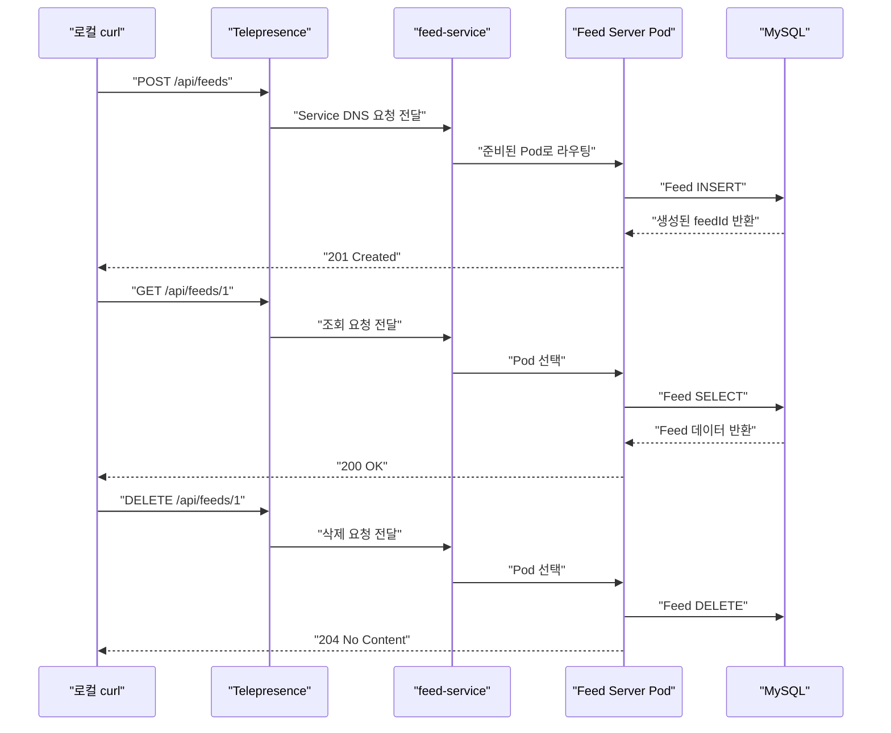

#### Telepresence 연결 종료

테스트가 끝나면 로컬 Telepresence Daemon과 연결을 종료한다.

```shell
telepresence quit
```

Traffic Manager는 클러스터에 계속 남아 있으므로 다음 연결에서는 다시 설치하지 않고 `telepresence connect`만 실행하면 된다.

Traffic Manager 자체를 제거해야 한다면 다음 명령을 사용한다.

```shell
telepresence helm uninstall
```

다만 Traffic Manager는 여러 개발자가 공유할 수 있다. 공유 클러스터에서는 다른 사용자의 연결에 영향을 줄 수 있으므로 관리자 확인 없이 제거해서는 안 된다.

#### 문제 상황과 원인 확인

##### Service DNS를 찾을 수 없는 경우

다음과 같은 오류가 발생할 수 있다.

```text
Could not resolve host: feed-service.sns.svc.cluster.local
```

다음 항목을 확인한다.

```shell
telepresence status
kubectl get service feed-service -n sns
kubectl config current-context
```

주요 원인은 다음과 같다.

- Telepresence 연결이 종료되어 있다.
- 현재 연결된 Kubernetes Context가 다르다.
- `sns` Namespace가 DNS 매핑 대상에 포함되지 않았다.
- Service 이름이나 Namespace 이름이 잘못됐다.
- VPN 또는 로컬 DNS 소프트웨어와 충돌하고 있다.

##### 연결 시간 초과가 발생하는 경우

DNS는 정상적으로 해석되지만 요청이 시간 초과된다면 Service와 Pod 연결 상태를 확인한다.

```shell
kubectl describe service feed-service -n sns
```

```shell
kubectl get endpointslice \
  -n sns \
  -l kubernetes.io/service-name=feed-service
```

```shell
kubectl get pods -n sns -l app=feed-server
```

다음과 같은 원인이 있을 수 있다.

- Service의 `selector`와 Pod Label이 일치하지 않는다.
- Feed Server Pod가 Ready 상태가 아니다.
- Service의 `targetPort`가 컨테이너 포트와 다르다.
- NetworkPolicy가 Traffic Manager의 접근을 차단한다.
- Feed Server 프로세스가 지정된 포트에서 Listen하지 않는다.

##### `404 Not Found`가 반환되는 경우

네트워크 연결 자체는 정상일 가능성이 높다. 다음 항목을 확인한다.

- 요청 경로가 실제 Controller 경로와 일치하는가
- 새 API가 포함된 이미지가 배포됐는가
- Deployment가 이전 이미지 태그를 사용하고 있지 않은가
- 요청한 `feedId`가 실제로 존재하는가

```shell
kubectl get deployment feed-server \
  -n sns \
  -o jsonpath="{.spec.template.spec.containers[0].image}"
```

##### `500 Internal Server Error`가 반환되는 경우

Feed Server까지 요청은 도착했지만 애플리케이션 내부에서 실패한 상태다.

```shell
kubectl logs deployment/feed-server -n sns --tail=200
```

다음 항목을 확인한다.

- MySQL 연결 정보
- RDS Security Group
- 데이터베이스 사용자 권한
- `social_feed` 테이블 존재 여부
- JPA Entity와 실제 컬럼 구조의 차이
- 잘못된 JSON 필드 또는 데이터 타입
- 트랜잭션 내부 예외

##### Traffic Manager 설치 권한이 없는 경우

Traffic Manager 설치에는 Deployment, Service, Webhook 및 RBAC 관련 객체를 생성할 수 있는 권한이 필요할 수 있다.

권한이 부족하다면 개인이 권한을 우회하려고 하기보다 클러스터 관리자에게 설치를 요청해야 한다. 일반 개발자는 이미 설치된 Traffic Manager에 연결할 권한만 부여받는 구성이 적절하다.

##### VPN과 네트워크 대역이 충돌하는 경우

회사 VPN, 로컬 Docker 네트워크, Kubernetes Service CIDR 또는 Pod CIDR가 겹치면 잘못된 네트워크 경로로 요청이 전달될 수 있다.

이 경우 무조건 충돌 허용 옵션을 추가하기보다 다음 항목을 먼저 확인해야 한다.

- 로컬 라우팅 테이블
- VPN이 사용하는 CIDR
- Kubernetes Service CIDR
- Kubernetes Pod CIDR
- Telepresence가 생성한 가상 네트워크 경로

충돌 허용 설정은 보안 및 라우팅 범위를 변경할 수 있으므로 원인을 확인한 뒤 제한적으로 적용해야 한다.

#### Telepresence와 `kubectl port-forward` 비교

두 방식 모두 로컬에서 Kubernetes 내부 서비스를 호출할 수 있지만 사용 목적이 다르다.

| 항목 | Telepresence | `kubectl port-forward` |
|---|---|---|
| Service DNS 사용 | 가능 | 불가능 |
| 여러 내부 서비스 접근 | 한 번의 연결로 가능 | 서비스마다 별도 실행 |
| 로컬 애플리케이션 연동 | 편리함 | 포트별 설정 필요 |
| 클러스터 구성 요소 | Traffic Manager 필요 | 추가 구성 요소 없음 |
| 설치와 권한 | Client 및 RBAC 필요 | 상대적으로 단순 |
| 단일 API 임시 확인 | 다소 무거움 | 적합 |
| MSA 통합 개발 | 적합 | 서비스가 많으면 복잡 |

한두 개의 API를 잠깐 확인한다면 `kubectl port-forward`가 더 단순하다. 여러 마이크로서비스를 호출하며 로컬 애플리케이션을 개발한다면 Telepresence가 더 편리하다.

#### 실무에서 주의할 점

##### 운영 클러스터에 무분별하게 연결하지 않는다

Telepresence를 사용하면 로컬 워크스테이션이 클러스터 내부 서비스에 접근할 수 있다. 내부 서비스가 외부 노출을 전제로 하지 않아 인증이나 접근 통제가 약하다면 더 큰 위험이 생길 수 있다.

따라서 일반적으로 다음 기준을 적용한다.

- 개발 또는 테스트 클러스터에서 사용한다.
- Namespace 매핑 범위를 필요한 범위로 제한한다.
- Kubernetes RBAC에 최소 권한을 적용한다.
- 운영 데이터베이스에 연결되는 서비스는 별도로 통제한다.
- 로컬 장비의 보안 상태와 접근 로그를 관리한다.

##### 실제 외부 요청 경로를 검증하는 도구는 아니다

Telepresence로 Feed Server API를 호출하는 데 성공해도 다음 구성이 정상이라는 의미는 아니다.

- Ingress Controller
- 외부 Load Balancer
- TLS 인증서
- DNS 레코드
- 외부 방화벽
- WAF
- 인증 Gateway

Telepresence 테스트는 로컬 환경에서 Kubernetes 내부 Service와 애플리케이션이 정상적으로 통신하는지를 검증한다. 실제 사용자 요청 경로는 Ingress나 Load Balancer를 구성한 뒤 별도로 테스트해야 한다.

##### API 테스트 데이터의 정리 기준이 필요하다

공유 개발 환경에서 테스트 데이터를 반복적으로 생성하면 실제 개발 데이터와 구분하기 어려워질 수 있다.

테스트 데이터에는 식별 가능한 Prefix를 사용하고, 생성한 `feedId`를 기록한 뒤 테스트가 끝나면 삭제하는 것이 좋다.

```json
{
  "imageId": "test-telepresence-image-001",
  "uploaderId": 1,
  "content": "[TEST] Telepresence API 호출 확인"
}
```

### 정리

Telepresence를 사용하면 Ingress나 LoadBalancer를 만들지 않아도 로컬 환경에서 Kubernetes 내부 Service를 직접 호출할 수 있다.

- `ClusterIP` Service는 일반적으로 클러스터 외부에서 직접 접근할 수 없다.
- Telepresence는 로컬 네트워크와 DNS를 Kubernetes 클러스터에 연결한다.
- Traffic Manager는 클러스터에 한 번 설치하고 각 개발자는 `telepresence connect`로 연결한다.
- `--mapped-namespaces`를 사용하면 접근 범위를 필요한 Namespace로 제한할 수 있다.
- `feed-service.sns.svc.cluster.local` 주소로 Health Check와 Feed CRUD API를 테스트할 수 있다.
- Feed 생성은 `201 Created`, 조회는 `200 OK`, 삭제는 `204 No Content`, 삭제 후 조회는 `404 Not Found`로 확인한다.
- 단순한 단일 서비스 테스트에는 `kubectl port-forward`가 더 가볍고, 여러 내부 서비스를 함께 사용하는 MSA 개발에는 Telepresence가 유용하다.
- Telepresence 연결 성공은 Kubernetes 내부 통신 검증이며 Ingress, TLS, 외부 DNS까지 검증한 것은 아니다.
- 공유 환경이나 운영 클러스터에서는 RBAC, Namespace 범위, 내부 서비스 접근 권한을 신중하게 관리해야 한다.
