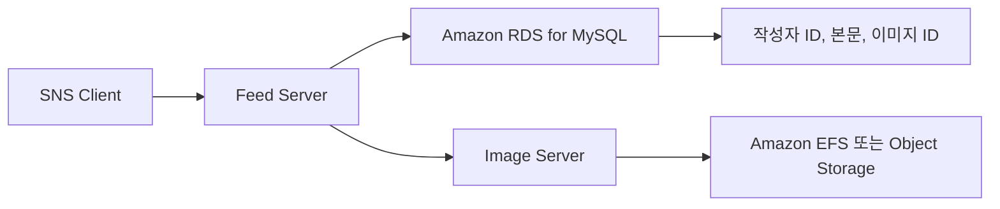
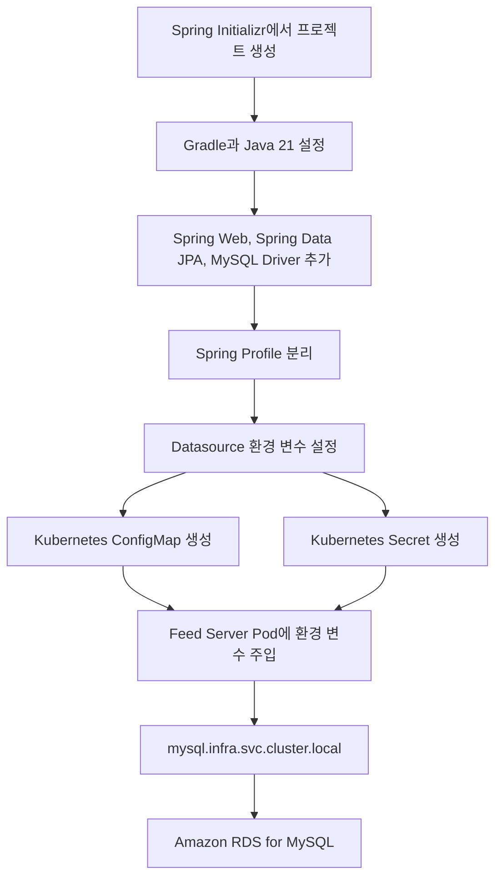
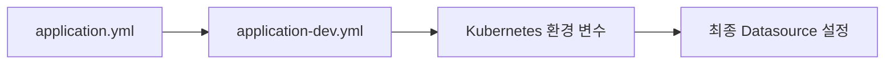
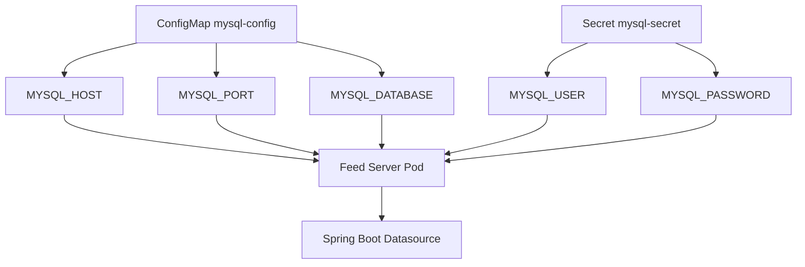

# Ch 2. Social Feed 서버 개발

# Ch 2. Social Feed 서버 개발
* toc
{:toc}

---

## 01. 스프링 프로젝트 구성

### 06. Spring Boot 소셜 피드 서버 프로젝트 생성과 데이터베이스 설정

SNS 백엔드의 첫 번째 마이크로서비스로 소셜 피드 서버를 구성한다. 소셜 피드 서버는 사용자가 작성한 게시글을 저장하고 조회하는 역할을 담당한다.

이미지 파일 자체는 이후에 구현할 이미지 서버가 관리한다. 피드 서버는 게시글 작성자 ID, 본문, 이미지 ID와 같은 메타데이터만 저장한다. 서비스의 책임을 이렇게 분리하면 게시글 처리와 이미지 저장 방식을 독립적으로 변경하고 확장할 수 있다.

#### 소셜 피드 서버의 책임



| 데이터 | 관리 주체 |
|---|---|
| 게시글 본문 | Feed Server |
| 작성자 ID | Feed Server가 참조 |
| 이미지 ID | Feed Server가 참조 |
| 이미지 파일 | Image Server |
| 사용자 상세 정보 | User Server |

MSA에서는 다른 서비스의 데이터를 직접 수정하지 않는 것이 중요하다. 피드 서버가 보관하는 작성자 ID와 이미지 ID는 다른 서비스의 데이터를 가리키는 논리적 참조다. 각 서비스가 데이터베이스를 분리한다면 일반적인 외래 키로 서비스 간 정합성을 강제할 수 없으므로 API 호출이나 이벤트를 이용한 검증과 보상 처리가 필요하다.

#### 전체 구성 흐름



#### Spring Boot 프로젝트 생성

Spring Initializr에서 다음과 같이 프로젝트를 생성한다.

| 항목 | 설정 |
|---|---|
| Project | Gradle - Groovy |
| Language | Java |
| Spring Boot | 유지보수 중인 안정 버전 |
| Group | `com.sns` |
| Artifact | `feed-server` |
| Name | `feed-server` |
| Package name | `com.sns.feed` |
| Packaging | Jar |
| Java | 21 |

새 프로젝트라면 유지보수 중인 Spring Boot 버전을 선택해야 한다. 기존 프로젝트가 Spring Boot 3.2.1처럼 특정 버전에 맞춰 작성되어 있다면 개별 서비스 하나만 임의로 업그레이드하지 말고 Spring Cloud, Gradle, 테스트 환경의 호환성을 함께 확인해야 한다. 현재 안정 버전 목록과 Java 요구사항은 [Spring Boot 공식 문서](https://docs.spring.io/spring-boot/)에서 확인할 수 있다.

다음 의존성을 추가한다.

- Spring Web
- Spring Data JPA
- MySQL Driver
- Validation
- Spring Boot Actuator

#### Gradle 설정

Spring Boot 3.x와 Java 21을 사용하는 예시는 다음과 같다.

```groovy
plugins {
    id 'java'
    id 'org.springframework.boot' version '3.5.16'
    id 'io.spring.dependency-management' version '1.1.7'
}

group = 'com.sns'
version = '0.0.1-SNAPSHOT'

java {
    toolchain {
        languageVersion = JavaLanguageVersion.of(21)
    }
}

repositories {
    mavenCentral()
}

dependencies {
    implementation 'org.springframework.boot:spring-boot-starter-web'
    implementation 'org.springframework.boot:spring-boot-starter-data-jpa'
    implementation 'org.springframework.boot:spring-boot-starter-validation'
    implementation 'org.springframework.boot:spring-boot-starter-actuator'

    runtimeOnly 'com.mysql:mysql-connector-j'

    testImplementation 'org.springframework.boot:spring-boot-starter-test'
    testRuntimeOnly 'org.junit.platform:junit-platform-launcher'
}

tasks.named('test') {
    useJUnitPlatform()
}
```

- `spring-boot-starter-web`은 REST API와 내장 Tomcat을 제공한다.
- `spring-boot-starter-data-jpa`는 JPA와 Hibernate 기반 데이터 접근을 제공한다.
- `mysql-connector-j`는 MySQL JDBC Driver다.
- `spring-boot-starter-validation`은 요청 객체의 입력값을 검증할 때 사용한다.
- `spring-boot-starter-actuator`는 상태 확인과 Kubernetes Probe 구성에 활용할 수 있다.
- Java Toolchain은 빌드 환경이 Java 21을 사용하도록 명시한다.

#### 애플리케이션 진입점

```java
package com.sns.feed;

import org.springframework.boot.SpringApplication;
import org.springframework.boot.autoconfigure.SpringBootApplication;

@SpringBootApplication
public class FeedServerApplication {

    public static void main(String[] args) {
        SpringApplication.run(FeedServerApplication.class, args);
    }
}
```

`@SpringBootApplication`은 자동 구성, Component Scan, Java Config 기능을 함께 활성화한다. 기본 패키지인 `com.sns.feed` 아래에 Controller, Service, Repository, Entity를 배치하면 별도의 Component Scan 설정 없이 Spring Bean으로 등록된다.

#### Spring Profile 분리

로컬 환경과 EKS 개발 환경은 데이터베이스 주소와 자격 증명이 다르다. 설정값을 소스 코드에 고정하지 않고 Spring Profile과 환경 변수로 분리한다.

`application.yml`에는 공통 설정을 작성한다.

```yaml
spring:
  application:
    name: feed-server
  profiles:
    default: local
  jpa:
    open-in-view: false
    properties:
      hibernate:
        jdbc:
          time_zone: UTC

server:
  port: 8080
  shutdown: graceful

management:
  endpoints:
    web:
      exposure:
        include:
          - health
          - info
  endpoint:
    health:
      probes:
        enabled: true
  health:
    livenessstate:
      enabled: true
    readinessstate:
      enabled: true
```

`open-in-view: false`는 Controller까지 영속성 컨텍스트를 유지하지 않도록 한다. 필요한 연관 데이터는 Service의 트랜잭션 안에서 명확하게 조회해야 한다.

#### 로컬 환경 설정

`application-local.yml`을 작성한다.

```yaml
spring:
  config:
    activate:
      on-profile: local
  datasource:
    driver-class-name: com.mysql.cj.jdbc.Driver
    url: jdbc:mysql://${MYSQL_HOST:localhost}:${MYSQL_PORT:3306}/${MYSQL_DATABASE:sns}?serverTimezone=UTC&characterEncoding=UTF-8&sslMode=DISABLED
    username: ${MYSQL_USER:sns_server}
    password: ${MYSQL_PASSWORD:local-password}
    hikari:
      maximum-pool-size: 5
      minimum-idle: 1
      connection-timeout: 3000
  jpa:
    hibernate:
      ddl-auto: none
    show-sql: true
```

MySQL Connector/J의 올바른 Driver 클래스는 `com.mysql.cj.jdbc.Driver`다. 과거에 사용하던 `com.mysql.jdbc.Driver`는 더 이상 사용하지 않는다. Spring Boot가 JDBC URL을 통해 Driver를 자동으로 판단할 수 있으므로 `driver-class-name`을 생략하는 것도 가능하다.

#### EKS 개발 환경 설정

`application-dev.yml`을 작성한다.

```yaml
spring:
  config:
    activate:
      on-profile: dev
  datasource:
    driver-class-name: com.mysql.cj.jdbc.Driver
    url: jdbc:mysql://${MYSQL_HOST}:${MYSQL_PORT:3306}/${MYSQL_DATABASE:sns}?serverTimezone=UTC&characterEncoding=UTF-8&sslMode=REQUIRED
    username: ${MYSQL_USER}
    password: ${MYSQL_PASSWORD}
    hikari:
      maximum-pool-size: 10
      minimum-idle: 2
      connection-timeout: 3000
      validation-timeout: 1000
  jpa:
    hibernate:
      ddl-auto: validate
    show-sql: false
```

- `MYSQL_HOST`와 `MYSQL_PORT`는 ConfigMap에서 주입한다.
- `MYSQL_USER`와 `MYSQL_PASSWORD`는 Secret에서 주입한다.
- `sslMode=REQUIRED`는 RDS와의 통신을 TLS로 암호화한다.
- `ddl-auto: validate`는 애플리케이션 시작 시 Entity와 테이블 구조가 일치하는지 검사한다.
- 운영 환경에서 `ddl-auto: update`를 사용하면 애플리케이션 시작 시 의도하지 않은 스키마 변경이 발생할 수 있으므로 Flyway나 Liquibase로 마이그레이션을 관리하는 것이 좋다.
- HikariCP 크기는 Pod 수와 RDS의 최대 연결 수를 함께 고려해야 한다. Pod가 10개이고 각 Pod의 최대 Pool 크기가 10이면 애플리케이션에서 최대 100개의 연결을 생성할 수 있다.

#### 설정 파일 우선순위



Spring Boot에서는 환경 변수로 전달된 값이 YAML의 기본값보다 높은 우선순위를 가진다. 따라서 동일한 컨테이너 이미지를 사용하더라도 Namespace와 배포 환경에 따라 다른 데이터베이스 설정을 주입할 수 있다.

#### Kubernetes Namespace 생성

애플리케이션 리소스는 `sns` Namespace에 배치한다.

`sns-namespace.yaml`을 작성한다.

```yaml
apiVersion: v1
kind: Namespace
metadata:
  name: sns
  labels:
    app.kubernetes.io/part-of: sns
    environment: dev
```

```shell
kubectl apply -f sns-namespace.yaml
kubectl get namespace sns
```

Redis, Kafka, MySQL ExternalName Service는 `infra` Namespace에 있고 애플리케이션은 `sns` Namespace에 있다. Namespace가 달라도 Service의 전체 DNS 이름을 사용하면 접근할 수 있다. 네트워크 통신까지 차단하려면 별도의 NetworkPolicy가 필요하다.

#### MySQL ConfigMap 작성

`mysql-configmap.yaml`을 작성한다.

```yaml
apiVersion: v1
kind: ConfigMap
metadata:
  name: mysql-config
  namespace: sns
  labels:
    app.kubernetes.io/part-of: sns
    app.kubernetes.io/component: database-config
data:
  MYSQL_HOST: mysql.infra.svc.cluster.local
  MYSQL_PORT: "3306"
  MYSQL_DATABASE: sns
```

- `apiVersion: v1`은 ConfigMap이 Kubernetes Core API 객체임을 의미한다.
- `metadata.name`은 Deployment에서 참조할 ConfigMap 이름이다.
- ConfigMap은 자신을 사용하는 Pod와 같은 `sns` Namespace에 있어야 한다.
- `MYSQL_HOST`는 `infra` Namespace의 ExternalName Service를 가리킨다.
- ConfigMap의 `data` 값은 문자열이어야 하므로 포트도 `"3306"`으로 작성한다.

Kubernetes Service의 전체 DNS 형식은 다음과 같다.

```text
<SERVICE_NAME>.<NAMESPACE>.svc.cluster.local
```

따라서 `mysql.infra.svc.cluster.local`은 `infra` Namespace에 있는 `mysql` Service를 의미한다.

#### MySQL Secret 작성

`mysql-secret.yaml`을 작성한다.

```yaml
apiVersion: v1
kind: Secret
metadata:
  name: mysql-secret
  namespace: sns
  labels:
    app.kubernetes.io/part-of: sns
    app.kubernetes.io/component: database-credentials
type: Opaque
stringData:
  MYSQL_USER: sns_server
  MYSQL_PASSWORD: CHANGE_ME_STRONG_PASSWORD
```

- `type: Opaque`는 일반적인 Key-Value 형식의 Secret을 의미한다.
- `stringData`는 평문을 입력받아 Kubernetes API Server가 Base64 형식의 `data`로 변환한다.
- `MYSQL_PASSWORD`는 RDS에서 생성한 `sns_server` 계정의 실제 비밀번호로 변경해야 한다.
- 이 파일에 실제 비밀번호를 입력했다면 Git에 Commit해서는 안 된다.

Base64는 암호화가 아니라 인코딩이다. Secret을 Base64로 변환했다고 해서 안전하게 보호되는 것은 아니다. 실무에서는 RBAC으로 Secret 조회 권한을 제한하고 AWS Secrets Manager, External Secrets Operator, Secrets Store CSI Driver 같은 외부 비밀 관리 방식을 고려해야 한다.

명령어로 Secret을 직접 생성하면 평문 비밀번호가 포함된 YAML 파일을 만들지 않을 수 있다.

```shell
kubectl create secret generic mysql-secret \
  --namespace sns \
  --from-literal=MYSQL_USER=sns_server \
  --from-literal=MYSQL_PASSWORD='<MYSQL_PASSWORD>'
```

다만 명령 기록에 비밀번호가 남을 수 있으므로 운영 환경에서는 CI/CD Secret이나 외부 Secret Manager를 통해 생성하는 것이 좋다.

#### ConfigMap과 Secret 적용

```shell
kubectl apply -f mysql-configmap.yaml
kubectl apply -f mysql-secret.yaml
```

생성 결과를 확인한다.

```shell
kubectl get configmap mysql-config -n sns
kubectl describe configmap mysql-config -n sns
kubectl get secret mysql-secret -n sns
kubectl describe secret mysql-secret -n sns
```

`kubectl describe secret`은 일반적으로 실제 값을 출력하지 않고 Key와 바이트 크기만 보여준다. 확인을 위해 Secret 값을 터미널에 출력하는 방식은 로그와 화면 기록에 비밀번호가 남을 수 있으므로 피해야 한다.

#### ConfigMap과 Secret 주입 구조



다음 단계에서 Deployment의 `envFrom` 또는 개별 `env.valueFrom` 설정을 이용해 ConfigMap과 Secret을 컨테이너 환경 변수로 주입할 수 있다.

환경 변수로 주입된 ConfigMap과 Secret은 원본 객체를 수정하더라도 실행 중인 컨테이너에서 자동으로 변경되지 않는다. 새로운 값을 적용하려면 Deployment의 Pod를 Rolling Update 방식으로 다시 생성해야 한다.

#### MySQL Service DNS 확인

`sns` Namespace에서 `infra` Namespace의 MySQL Service가 조회되는지 테스트한다.

```shell
kubectl run dns-test \
  --namespace sns \
  --rm \
  --interactive \
  --tty \
  --restart=Never \
  --image=busybox:1.36 \
  -- nslookup mysql.infra.svc.cluster.local
```

정상적인 경우 ExternalName Service가 가리키는 RDS Endpoint가 출력된다.

DNS 조회가 성공했다고 데이터베이스 연결까지 성공한 것은 아니다. MySQL TCP 3306 연결, RDS Security Group, 사용자 인증, TLS 설정은 별도로 검증해야 한다.

#### 로컬 실행

로컬 MySQL 또는 접근 가능한 개발 데이터베이스를 준비한 뒤 환경 변수를 설정한다.

```powershell
$env:MYSQL_HOST = "localhost"
$env:MYSQL_PORT = "3306"
$env:MYSQL_DATABASE = "sns"
$env:MYSQL_USER = "sns_server"
$env:MYSQL_PASSWORD = "local-password"

.\gradlew.bat bootRun --args="--spring.profiles.active=local"
```

애플리케이션이 기동되면 Actuator Health Endpoint를 확인한다.

```shell
curl http://localhost:8080/actuator/health
```

정상적인 경우 다음과 같은 응답을 확인할 수 있다.

```json
{
  "status": "UP"
}
```

`UP`은 애플리케이션과 등록된 HealthIndicator가 정상이라는 의미다. 비즈니스 API 전체가 정상 동작하거나 실제 운영 트래픽을 처리할 수 있다는 의미까지 보장하지는 않는다.

#### 빌드와 테스트

```powershell
.\gradlew.bat clean test
.\gradlew.bat bootJar
```

빌드가 성공하면 다음 위치에 실행 가능한 Jar가 생성된다.

```text
build/libs/feed-server-0.0.1-SNAPSHOT.jar
```

직접 실행할 수도 있다.

```powershell
java -jar build/libs/feed-server-0.0.1-SNAPSHOT.jar --spring.profiles.active=local
```

#### 자주 발생하는 문제

| 현상 | 주요 원인 | 해결 방법 |
|---|---|---|
| `Failed to determine a suitable driver class` | MySQL Driver 누락 | `mysql-connector-j` 의존성 확인 |
| Driver 클래스를 찾지 못함 | 이전 Driver 이름 사용 | `com.mysql.cj.jdbc.Driver` 사용 |
| `Communications link failure` | Host, Port, Security Group 오류 | RDS Endpoint와 TCP 3306 확인 |
| `Access denied for user` | 사용자명, 비밀번호, 권한 오류 | `SHOW GRANTS`와 Secret 값 확인 |
| `UnknownHostException` | Service 이름 또는 Namespace 오타 | `mysql.infra.svc.cluster.local` 확인 |
| 애플리케이션 시작 실패 | 환경 변수 누락 | ConfigMap과 Secret Key 이름 확인 |
| Hibernate 검증 실패 | Entity와 DB Schema 불일치 | 마이그레이션 상태와 `ddl-auto` 확인 |
| Pod가 `CreateContainerConfigError` | ConfigMap 또는 Secret이 같은 Namespace에 없음 | `sns` Namespace의 객체 확인 |

#### 실무적인 구성 기준

ConfigMap과 Secret은 피드 서버만의 리소스처럼 보이지만 실제로는 여러 마이크로서비스가 공유할 수 있는 인프라 설정이다. 초기 실습에서는 피드 서버 프로젝트에 둘 수 있지만, 프로젝트가 커지면 공통 Helm Chart나 별도의 인프라 Repository에서 관리하는 편이 적절하다.

또한 모든 마이크로서비스가 하나의 데이터베이스 계정을 공유하면 특정 서비스의 권한이 전체 테이블로 확장된다. 운영 환경에서는 서비스별 Database 또는 Schema와 전용 계정을 생성하고 필요한 테이블에만 최소 권한을 부여해야 한다.

### 정리

소셜 피드 서버는 게시글 작성자 ID, 본문, 이미지 ID를 관리하며 이미지 파일 자체는 이미지 서버에 위임한다. 이러한 책임 분리는 서비스를 독립적으로 개발하고 확장하기 위한 MSA의 기본 구조다.

Spring Boot 프로젝트는 Java 21, Spring Web, Spring Data JPA, MySQL Driver를 기반으로 생성하고 로컬 환경과 EKS 개발 환경을 Spring Profile로 분리했다. 데이터베이스 주소와 포트는 ConfigMap으로, 사용자명과 비밀번호는 Secret으로 관리하도록 구성했다.

애플리케이션은 `mysql.infra.svc.cluster.local`을 통해 `infra` Namespace의 ExternalName Service를 조회하고 최종적으로 Amazon RDS에 연결한다. ConfigMap과 Secret은 같은 Namespace의 Pod에서만 직접 참조할 수 있지만 Service DNS를 통한 네트워크 호출은 Namespace를 넘어서 수행할 수 있다.

다음 단계에서는 이 설정을 Feed Server Deployment에 주입하고, 컨테이너 이미지와 Resource, Probe, Service를 구성하여 EKS 클러스터에 실제 애플리케이션을 배포할 수 있다.
