# Ch 3. User 서버 개발

# Ch 3. User 서버 개발
* toc
{:toc}

---

## 01. 사용자 가입, 로그인 기능 개발 

### Spring Boot User Server 회원가입과 로그인 API 구현하기

User Server는 사용자 계정과 팔로우 관계를 관리하는 마이크로서비스다. SNS에서는 회원가입과 로그인뿐 아니라 사용자 조회, 팔로우, 언팔로우, 팔로워 및 팔로잉 목록 조회 등의 기능을 담당한다.

이번 실습에서는 먼저 다음과 같은 사용자 계정 기능을 구현한다.

- 회원가입
- 사용자 ID를 이용한 사용자 조회
- 사용자 이름을 이용한 사용자 조회
- 사용자 이름과 비밀번호를 이용한 로그인 검증
- BCrypt를 이용한 비밀번호 해시
- Kubernetes 배포 및 API 테스트

팔로우와 언팔로우 기능은 사용자 계정 기능이 완성된 다음 단계에서 추가한다.

#### User Server의 책임

User Server는 사용자의 인증 정보와 공개 프로필 정보를 관리한다.

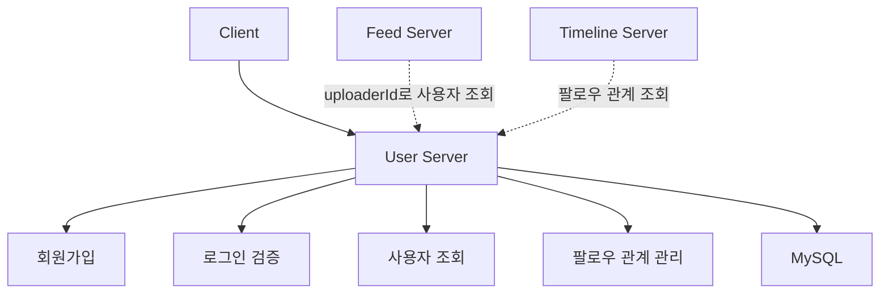

각 마이크로서비스는 사용자 상세 정보를 자체 데이터베이스에 복제하지 않고 `userId`만 저장한다. 사용자 이름이나 이메일 같은 상세 정보가 필요하면 User Server를 호출한다.

#### 전체 구현 흐름

User Server도 Feed Server와 동일한 계층 구조를 사용한다.

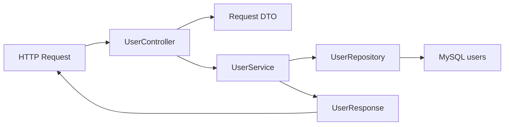

| 계층 | 역할 |
|---|---|
| Controller | HTTP 요청과 응답 상태 코드 처리 |
| Request DTO | 회원가입 및 로그인 입력값 검증 |
| Service | 비밀번호 해시, 중복 검사, 로그인 검증 |
| Repository | Spring Data JPA를 이용한 사용자 조회 및 저장 |
| Entity | `users` 테이블과 Java 객체 매핑 |
| Response DTO | 비밀번호를 제외한 사용자 정보 반환 |

#### 프로젝트 의존성 설정

User Server에는 다음 의존성이 필요하다.

```groovy
dependencies {
    implementation 'org.springframework.boot:spring-boot-starter-web'
    implementation 'org.springframework.boot:spring-boot-starter-data-jpa'
    implementation 'org.springframework.boot:spring-boot-starter-validation'
    implementation 'org.springframework.boot:spring-boot-starter-actuator'

    implementation 'org.springframework.security:spring-security-crypto'

    runtimeOnly 'com.mysql:mysql-connector-j'

    testImplementation 'org.springframework.boot:spring-boot-starter-test'
}
```

비밀번호 해시만 필요하다면 `spring-boot-starter-security` 전체를 추가하는 대신 `spring-security-crypto` 모듈만 사용하는 것이 간단하다.

`spring-boot-starter-security`를 추가하면 기본 보안 자동 설정이 활성화되어 모든 API가 인증 대상으로 바뀔 수 있다. 단순히 이를 피하기 위해 `SecurityAutoConfiguration` 전체를 제외하면 이후 실제 인증 기능을 추가할 때 구성이 혼란스러워질 수 있다.

이번 단계에서는 다음과 같이 역할을 제한한다.

- Spring Security의 웹 인증 기능은 아직 사용하지 않는다.
- `PasswordEncoder`와 BCrypt 구현만 사용한다.
- JWT 또는 Session 인증은 이후 인증 체계에서 추가한다.

#### 사용자 테이블 설계

사용자 테이블에는 다음 데이터를 저장한다.

| 컬럼 | 설명 |
|---|---|
| `user_id` | 내부에서 사용하는 자동 증가 사용자 ID |
| `username` | 로그인과 사용자 검색에 사용하는 고유 이름 |
| `email` | 사용자 이메일 |
| `password_hash` | BCrypt로 해시한 비밀번호 |
| `created_at` | 가입 시각 |

```sql
CREATE TABLE users (
    user_id BIGINT NOT NULL AUTO_INCREMENT,
    username VARCHAR(30) NOT NULL,
    email VARCHAR(255) NOT NULL,
    password_hash VARCHAR(100) NOT NULL,
    created_at DATETIME(6) NOT NULL,
    PRIMARY KEY (user_id),
    CONSTRAINT uk_users_username UNIQUE (username),
    CONSTRAINT uk_users_email UNIQUE (email)
) ENGINE=InnoDB
  DEFAULT CHARSET=utf8mb4
  COLLATE=utf8mb4_unicode_ci;
```

`USER`는 데이터베이스 제품에 따라 예약어나 시스템 객체 이름과 충돌할 수 있으므로 테이블 이름은 `users`처럼 명확하게 지정하는 편이 안전하다.

사용자 이름과 이메일에는 반드시 데이터베이스 Unique Constraint를 설정해야 한다. 애플리케이션에서 중복을 먼저 확인하더라도 동시에 두 요청이 들어오면 둘 다 중복 확인을 통과할 수 있기 때문이다.

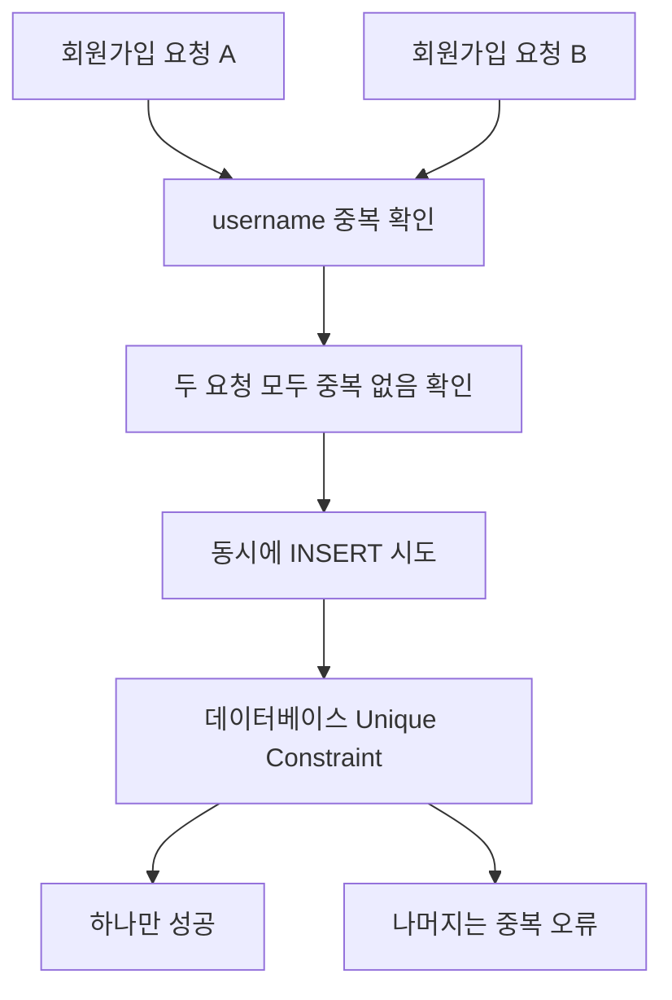

따라서 애플리케이션 중복 확인은 사용자에게 빠르고 친절한 오류를 제공하는 용도이며, 최종 데이터 정합성은 데이터베이스 제약 조건으로 보장해야 한다.

#### UserAccount Entity 작성

Spring Security에도 `User`라는 클래스가 있으므로 이름 충돌을 줄이기 위해 Entity 이름을 `UserAccount`로 정의한다.

```java
package com.sns.user.domain.user;

import jakarta.persistence.Column;
import jakarta.persistence.Entity;
import jakarta.persistence.GeneratedValue;
import jakarta.persistence.GenerationType;
import jakarta.persistence.Id;
import jakarta.persistence.PrePersist;
import jakarta.persistence.Table;
import jakarta.persistence.UniqueConstraint;
import org.springframework.security.crypto.password.PasswordEncoder;

import java.time.Instant;

@Entity
@Table(
    name = "users",
    uniqueConstraints = {
        @UniqueConstraint(
            name = "uk_users_username",
            columnNames = "username"
        ),
        @UniqueConstraint(
            name = "uk_users_email",
            columnNames = "email"
        )
    }
)
public class UserAccount {

    @Id
    @GeneratedValue(strategy = GenerationType.IDENTITY)
    @Column(name = "user_id")
    private Long id;

    @Column(
        name = "username",
        nullable = false,
        length = 30
    )
    private String username;

    @Column(
        name = "email",
        nullable = false,
        length = 255
    )
    private String email;

    @Column(
        name = "password_hash",
        nullable = false,
        length = 100
    )
    private String passwordHash;

    @Column(
        name = "created_at",
        nullable = false,
        updatable = false
    )
    private Instant createdAt;

    protected UserAccount() {
    }

    private UserAccount(
        String username,
        String email,
        String passwordHash
    ) {
        this.username = username;
        this.email = email;
        this.passwordHash = passwordHash;
    }

    public static UserAccount create(
        String username,
        String email,
        String passwordHash
    ) {
        return new UserAccount(username, email, passwordHash);
    }

    @PrePersist
    private void initializeCreatedAt() {
        if (createdAt == null) {
            createdAt = Instant.now();
        }
    }

    public boolean matchesPassword(
        String rawPassword,
        PasswordEncoder passwordEncoder
    ) {
        return passwordEncoder.matches(
            rawPassword,
            passwordHash
        );
    }

    public Long getId() {
        return id;
    }

    public String getUsername() {
        return username;
    }

    public String getEmail() {
        return email;
    }

    public Instant getCreatedAt() {
        return createdAt;
    }
}
```

외부 계층에서 해시 값을 실수로 사용하지 않도록 `passwordHash` Getter를 만들지 않았다. 로그인 검증은 Entity가 제공하는 `matchesPassword()`를 통해 수행한다.

`passwordHash`는 암호화된 비밀번호가 아니다. 암호화는 복호화를 전제로 하지만 비밀번호 해시는 원래 값을 복원하지 않고 입력값이 같은지만 검증하는 단방향 처리다.

#### BCrypt의 동작 방식

BCrypt는 비밀번호 저장을 위해 설계된 해시 알고리즘이다.

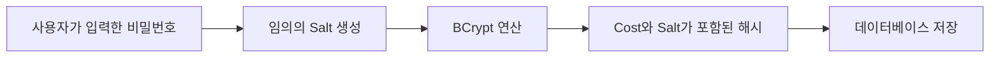

BCrypt의 주요 특징은 다음과 같다.

- 비밀번호마다 임의의 Salt를 생성한다.
- 같은 비밀번호를 여러 번 해시해도 서로 다른 결과가 생성된다.
- 연산 비용인 Cost를 조정할 수 있다.
- 저장된 해시 안에 검증에 필요한 알고리즘 정보, Cost, Salt가 포함된다.
- 로그인할 때 `matches()`를 이용해 평문 비밀번호와 저장된 해시를 비교한다.

MD5, SHA-1, SHA-256 같은 일반 해시 함수를 한 번 적용하는 방식은 비밀번호 저장에 적합하지 않다. 이러한 알고리즘은 빠르게 계산하도록 설계되어 있어 공격자가 대량의 비밀번호 후보를 빠르게 대입할 수 있기 때문이다.

BCrypt도 무조건 안전한 것은 아니다. 충분한 비밀번호 길이, 로그인 시도 제한, 다중 인증, 유출 비밀번호 검사 같은 보완책이 함께 필요하다.

#### PasswordEncoder 설정

`BCryptPasswordEncoder`를 Service 내부에서 직접 생성하지 않고 Spring Bean으로 등록한다.

```java
package com.sns.user.config;

import org.springframework.context.annotation.Bean;
import org.springframework.context.annotation.Configuration;
import org.springframework.security.crypto.bcrypt.BCryptPasswordEncoder;
import org.springframework.security.crypto.password.PasswordEncoder;

@Configuration
public class PasswordConfig {

    @Bean
    public PasswordEncoder passwordEncoder() {
        return new BCryptPasswordEncoder();
    }
}
```

Service는 구체적인 BCrypt 구현보다 `PasswordEncoder` 인터페이스에 의존한다. 이를 통해 향후 비밀번호 정책이나 구현체를 변경하기 쉬워진다.

BCrypt Cost를 무조건 높이면 보안성이 좋아지는 대신 회원가입과 로그인 요청의 CPU 사용량도 증가한다. 운영 환경에서는 실제 서버 사양과 예상 로그인 트래픽을 기준으로 부하 테스트 후 값을 결정해야 한다.

#### UserRepository 작성

```java
package com.sns.user.domain.user;

import org.springframework.data.jpa.repository.JpaRepository;

import java.util.Optional;

public interface UserRepository
    extends JpaRepository<UserAccount, Long> {

    Optional<UserAccount> findByUsername(String username);

    boolean existsByUsername(String username);

    boolean existsByEmail(String email);
}
```

사용자가 직접 입력하는 로그인 식별자는 `userId`보다 `username`인 경우가 많다.

- `userId`: 데이터베이스와 서비스 간 통신에서 사용하는 내부 식별자
- `username`: 로그인과 사용자 검색에서 사용하는 외부 식별자

조회 결과가 없을 수 있는 메서드는 `null` 대신 `Optional<UserAccount>`를 반환한다.

#### 회원가입 요청 DTO 작성

회원가입과 로그인은 필요한 필드가 다르므로 하나의 요청 DTO를 재사용하지 않는다.

```java
package com.sns.user.api.dto;

import jakarta.validation.constraints.Email;
import jakarta.validation.constraints.NotBlank;
import jakarta.validation.constraints.Pattern;
import jakarta.validation.constraints.Size;

public record SignUpRequest(

    @NotBlank
    @Size(min = 3, max = 30)
    @Pattern(regexp = "^[a-zA-Z0-9._-]+$")
    String username,

    @NotBlank
    @Email
    @Size(max = 255)
    String email,

    @NotBlank
    @Size(min = 8, max = 64)
    String password
) {
}
```

사용자 이름은 URL 경로와 검색 조건에 사용될 수 있으므로 허용 문자를 명확하게 제한한다. 비밀번호의 복잡도 규칙을 지나치게 강제하기보다는 충분한 길이를 허용하고 로그인 시도 제한이나 유출 비밀번호 검사 등을 함께 적용하는 편이 효과적이다.

BCrypt는 입력 비밀번호의 앞부분 72바이트만 처리하므로 서버에서는 UTF-8 기준 바이트 길이도 검증해야 한다.

#### 로그인 요청 DTO 작성

```java
package com.sns.user.api.dto;

import jakarta.validation.constraints.NotBlank;
import jakarta.validation.constraints.Size;

public record SignInRequest(

    @NotBlank
    String username,

    @NotBlank
    @Size(max = 64)
    String password
) {
}
```

회원가입 DTO를 로그인에 재사용하면 로그인에서 필요하지 않은 이메일까지 전달해야 하거나 검증 조건이 뒤섞인다. API의 목적에 맞게 DTO를 분리하는 것이 좋다.

#### 사용자 응답 DTO 작성

Entity를 API 응답으로 직접 반환하면 `passwordHash`가 외부에 노출될 수 있다. 해시도 민감한 인증 정보이므로 절대 응답, 로그, 예외 메시지에 포함하면 안 된다.

```java
package com.sns.user.api.dto;

import com.sns.user.domain.user.UserAccount;

import java.time.Instant;

public record UserResponse(
    Long userId,
    String username,
    String email,
    Instant createdAt
) {

    public static UserResponse from(UserAccount user) {
        return new UserResponse(
            user.getId(),
            user.getUsername(),
            user.getEmail(),
            user.getCreatedAt()
        );
    }
}
```

응답 DTO에는 클라이언트가 실제로 필요한 정보만 포함한다.

#### 예외 클래스 작성

##### 사용자를 찾을 수 없는 경우

```java
package com.sns.user.domain.user;

public class UserNotFoundException extends RuntimeException {

    public UserNotFoundException() {
        super("사용자를 찾을 수 없습니다.");
    }
}
```

##### 사용자 이름 또는 이메일이 중복된 경우

```java
package com.sns.user.domain.user;

public class DuplicateUserException extends RuntimeException {

    public DuplicateUserException() {
        super("이미 사용 중인 사용자 이름 또는 이메일입니다.");
    }
}
```

##### 로그인 정보가 올바르지 않은 경우

```java
package com.sns.user.domain.user;

public class InvalidCredentialsException
    extends RuntimeException {

    public InvalidCredentialsException() {
        super("사용자 이름 또는 비밀번호가 올바르지 않습니다.");
    }
}
```

로그인 실패 응답에서 사용자 이름이 존재하는지 구분해 알려주면 계정 존재 여부를 수집하는 데 악용될 수 있다. 사용자가 존재하지 않는 경우와 비밀번호가 틀린 경우 모두 같은 메시지와 상태 코드를 반환한다.

#### UserService 작성

```java
package com.sns.user.domain.user;

import com.sns.user.api.dto.SignInRequest;
import com.sns.user.api.dto.SignUpRequest;
import com.sns.user.api.dto.UserResponse;
import org.springframework.dao.DataIntegrityViolationException;
import org.springframework.security.crypto.password.PasswordEncoder;
import org.springframework.stereotype.Service;
import org.springframework.transaction.annotation.Transactional;

import java.nio.charset.StandardCharsets;
import java.util.Locale;

@Service
@Transactional(readOnly = true)
public class UserService {

    private static final int BCRYPT_MAX_PASSWORD_BYTES = 72;

    private final UserRepository userRepository;
    private final PasswordEncoder passwordEncoder;

    public UserService(
        UserRepository userRepository,
        PasswordEncoder passwordEncoder
    ) {
        this.userRepository = userRepository;
        this.passwordEncoder = passwordEncoder;
    }

    @Transactional
    public UserResponse signUp(SignUpRequest request) {
        String username = normalizeUsername(
            request.username()
        );
        String email = normalizeEmail(request.email());

        validatePasswordLength(request.password());

        if (userRepository.existsByUsername(username)
            || userRepository.existsByEmail(email)) {
            throw new DuplicateUserException();
        }

        String passwordHash =
            passwordEncoder.encode(request.password());

        UserAccount user = UserAccount.create(
            username,
            email,
            passwordHash
        );

        try {
            UserAccount savedUser =
                userRepository.saveAndFlush(user);

            return UserResponse.from(savedUser);
        } catch (DataIntegrityViolationException exception) {
            throw new DuplicateUserException();
        }
    }

    public UserResponse getUser(Long userId) {
        UserAccount user = userRepository.findById(userId)
            .orElseThrow(UserNotFoundException::new);

        return UserResponse.from(user);
    }

    public UserResponse getUserByUsername(String username) {
        UserAccount user = userRepository
            .findByUsername(normalizeUsername(username))
            .orElseThrow(UserNotFoundException::new);

        return UserResponse.from(user);
    }

    public UserResponse signIn(SignInRequest request) {
        validatePasswordLength(request.password());

        UserAccount user = userRepository
            .findByUsername(
                normalizeUsername(request.username())
            )
            .orElseThrow(InvalidCredentialsException::new);

        if (!user.matchesPassword(
            request.password(),
            passwordEncoder
        )) {
            throw new InvalidCredentialsException();
        }

        return UserResponse.from(user);
    }

    private String normalizeUsername(String username) {
        return username
            .trim()
            .toLowerCase(Locale.ROOT);
    }

    private String normalizeEmail(String email) {
        return email
            .trim()
            .toLowerCase(Locale.ROOT);
    }

    private void validatePasswordLength(String password) {
        int passwordBytes = password.getBytes(
            StandardCharsets.UTF_8
        ).length;

        if (passwordBytes > BCRYPT_MAX_PASSWORD_BYTES) {
            throw new IllegalArgumentException(
                "비밀번호는 UTF-8 기준 72바이트 이하여야 합니다."
            );
        }
    }
}
```

##### 회원가입 동작 과정

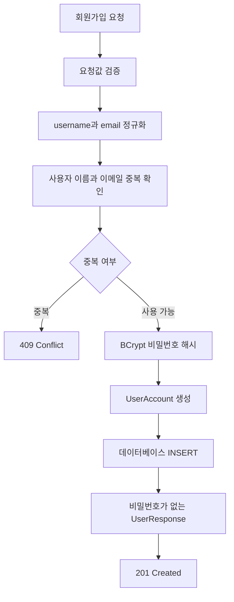

`saveAndFlush()`를 사용한 이유는 Unique Constraint 위반을 회원가입 메서드 안에서 확인하기 위해서다. 실제 운영에서는 예외 변환 정책과 트랜잭션 경계를 프로젝트 전체에서 일관되게 적용해야 한다.

##### 로그인 동작 과정

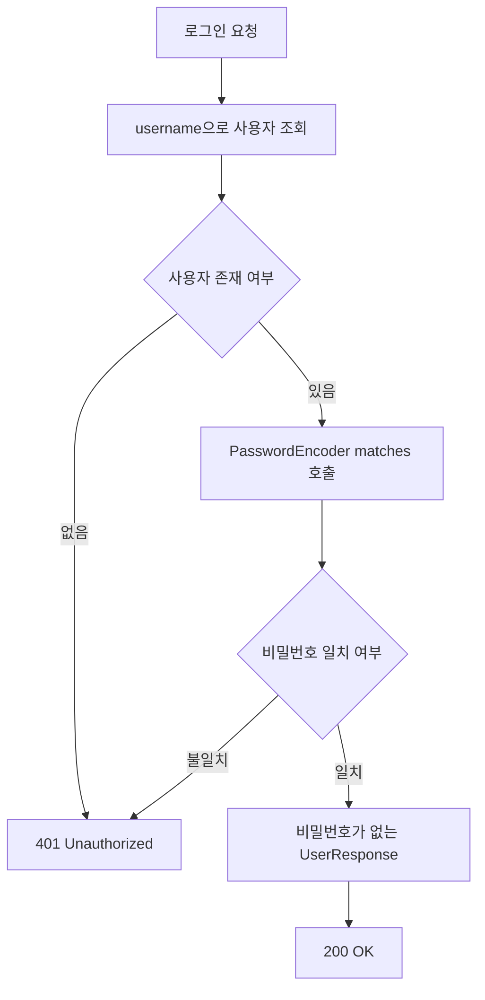

`matches()`는 입력된 평문 비밀번호를 저장된 BCrypt 해시와 비교한다. 저장된 해시를 복호화하거나 문자열끼리 직접 비교하는 것이 아니다.

#### 예외 응답 처리

```java
package com.sns.user.api;

import com.sns.user.domain.user.DuplicateUserException;
import com.sns.user.domain.user.InvalidCredentialsException;
import com.sns.user.domain.user.UserNotFoundException;
import org.springframework.http.HttpStatus;
import org.springframework.http.ProblemDetail;
import org.springframework.web.bind.annotation.ExceptionHandler;
import org.springframework.web.bind.annotation.RestControllerAdvice;

@RestControllerAdvice
public class ApiExceptionHandler {

    @ExceptionHandler(UserNotFoundException.class)
    public ProblemDetail handleUserNotFound(
        UserNotFoundException exception
    ) {
        ProblemDetail problem = ProblemDetail.forStatusAndDetail(
            HttpStatus.NOT_FOUND,
            exception.getMessage()
        );
        problem.setTitle("User Not Found");
        return problem;
    }

    @ExceptionHandler(DuplicateUserException.class)
    public ProblemDetail handleDuplicateUser(
        DuplicateUserException exception
    ) {
        ProblemDetail problem = ProblemDetail.forStatusAndDetail(
            HttpStatus.CONFLICT,
            exception.getMessage()
        );
        problem.setTitle("Duplicate User");
        return problem;
    }

    @ExceptionHandler(InvalidCredentialsException.class)
    public ProblemDetail handleInvalidCredentials(
        InvalidCredentialsException exception
    ) {
        ProblemDetail problem = ProblemDetail.forStatusAndDetail(
            HttpStatus.UNAUTHORIZED,
            exception.getMessage()
        );
        problem.setTitle("Invalid Credentials");
        return problem;
    }

    @ExceptionHandler(IllegalArgumentException.class)
    public ProblemDetail handleIllegalArgument(
        IllegalArgumentException exception
    ) {
        ProblemDetail problem = ProblemDetail.forStatusAndDetail(
            HttpStatus.BAD_REQUEST,
            exception.getMessage()
        );
        problem.setTitle("Invalid Request");
        return problem;
    }
}
```

#### UserController 작성

```java
package com.sns.user.api;

import com.sns.user.api.dto.SignInRequest;
import com.sns.user.api.dto.SignUpRequest;
import com.sns.user.api.dto.UserResponse;
import com.sns.user.domain.user.UserService;
import jakarta.validation.Valid;
import org.springframework.http.ResponseEntity;
import org.springframework.web.bind.annotation.GetMapping;
import org.springframework.web.bind.annotation.PathVariable;
import org.springframework.web.bind.annotation.PostMapping;
import org.springframework.web.bind.annotation.RequestBody;
import org.springframework.web.bind.annotation.RequestMapping;
import org.springframework.web.bind.annotation.RestController;
import org.springframework.web.servlet.support.ServletUriComponentsBuilder;

import java.net.URI;

@RestController
@RequestMapping("/api/users")
public class UserController {

    private final UserService userService;

    public UserController(UserService userService) {
        this.userService = userService;
    }

    @PostMapping
    public ResponseEntity<UserResponse> signUp(
        @Valid @RequestBody SignUpRequest request
    ) {
        UserResponse response = userService.signUp(request);

        URI location = ServletUriComponentsBuilder
            .fromCurrentRequest()
            .path("/{userId}")
            .buildAndExpand(response.userId())
            .toUri();

        return ResponseEntity
            .created(location)
            .body(response);
    }

    @GetMapping("/{userId}")
    public UserResponse getUser(
        @PathVariable Long userId
    ) {
        return userService.getUser(userId);
    }

    @GetMapping("/by-username/{username}")
    public UserResponse getUserByUsername(
        @PathVariable String username
    ) {
        return userService.getUserByUsername(username);
    }

    @PostMapping("/sign-in")
    public UserResponse signIn(
        @Valid @RequestBody SignInRequest request
    ) {
        return userService.signIn(request);
    }
}
```

API별 역할과 응답 상태는 다음과 같다.

| HTTP 요청 | 기능 | 정상 응답 |
|---|---|---:|
| `POST /api/users` | 회원가입 | `201 Created` |
| `GET /api/users/{userId}` | ID로 사용자 조회 | `200 OK` |
| `GET /api/users/by-username/{username}` | 사용자 이름으로 조회 | `200 OK` |
| `POST /api/users/sign-in` | 로그인 정보 검증 | `200 OK` |
| 중복 회원가입 | 가입 거절 | `409 Conflict` |
| 존재하지 않는 사용자 조회 | 조회 실패 | `404 Not Found` |
| 잘못된 로그인 정보 | 인증 실패 | `401 Unauthorized` |

현재 로그인 API는 사용자 이름과 비밀번호가 일치하는지만 확인한다. `200 OK`와 사용자 정보가 반환됐다고 해서 지속적인 인증 상태가 만들어지는 것은 아니다.

실제 인증 기능을 완성하려면 다음 중 하나가 추가되어야 한다.

- 서버 Session 생성 및 Session Cookie 발급
- Access Token과 Refresh Token 발급
- API Gateway 또는 인증 서버와 연동
- 이후 요청에서 Token 또는 Session 검증

#### API 테스트

Telepresence에 연결했다면 로컬에서 Kubernetes Service DNS로 User Server를 호출할 수 있다.

```shell
telepresence connect \
  --namespace sns \
  --mapped-namespaces sns
```

User Server의 Service 이름을 `user-service`라고 가정한다.

##### 회원가입

```shell
curl -i -X POST \
  http://user-service.sns.svc.cluster.local:8080/api/users \
  -H "Content-Type: application/json" \
  -d '{
    "username": "developer01",
    "email": "developer01@example.com",
    "password": "StrongPassword123!"
  }'
```

정상 응답은 다음과 같다.

```http
HTTP/1.1 201 Created
Location: http://user-service.sns.svc.cluster.local:8080/api/users/1
Content-Type: application/json
```

```json
{
  "userId": 1,
  "username": "developer01",
  "email": "developer01@example.com",
  "createdAt": "2026-09-18T01:10:20.123Z"
}
```

응답에 `password`나 `passwordHash`가 포함되지 않았는지 반드시 확인한다.

##### 사용자 ID로 조회

```shell
curl -i \
  http://user-service.sns.svc.cluster.local:8080/api/users/1
```

##### 사용자 이름으로 조회

```shell
curl -i \
  http://user-service.sns.svc.cluster.local:8080/api/users/by-username/developer01
```

##### 로그인 성공

```shell
curl -i -X POST \
  http://user-service.sns.svc.cluster.local:8080/api/users/sign-in \
  -H "Content-Type: application/json" \
  -d '{
    "username": "developer01",
    "password": "StrongPassword123!"
  }'
```

사용자 이름과 비밀번호가 일치하면 `200 OK`와 사용자 정보가 반환된다.

##### 로그인 실패

```shell
curl -i -X POST \
  http://user-service.sns.svc.cluster.local:8080/api/users/sign-in \
  -H "Content-Type: application/json" \
  -d '{
    "username": "developer01",
    "password": "WrongPassword"
  }'
```

비밀번호가 일치하지 않으면 `401 Unauthorized`가 반환된다.

```json
{
  "title": "Invalid Credentials",
  "status": 401,
  "detail": "사용자 이름 또는 비밀번호가 올바르지 않습니다."
}
```

##### 중복 회원가입

동일한 사용자 이름이나 이메일로 다시 가입을 요청한다.

```shell
curl -i -X POST \
  http://user-service.sns.svc.cluster.local:8080/api/users \
  -H "Content-Type: application/json" \
  -d '{
    "username": "developer01",
    "email": "developer01@example.com",
    "password": "AnotherPassword123!"
  }'
```

정상적으로 중복이 차단되면 `409 Conflict`가 반환된다.

#### 데이터베이스의 비밀번호 저장 상태 확인

테스트 환경에서 다음 SQL로 저장된 데이터를 확인할 수 있다.

```sql
SELECT
    user_id,
    username,
    email,
    password_hash,
    created_at
FROM users;
```

`password_hash`에는 요청에서 전달한 평문 비밀번호가 저장되면 안 된다.

동일한 비밀번호로 서로 다른 계정을 생성하더라도 BCrypt가 사용자마다 다른 Salt를 사용하기 때문에 해시 결과는 달라진다. 애플리케이션이나 로그에는 평문 비밀번호와 전체 해시 값을 출력하지 않아야 한다.

#### 컨테이너 이미지 빌드

초기 이미지가 `0.0.1`이라면 사용자 기능을 포함한 이미지는 `0.0.2`로 빌드한다.

```powershell
.\gradlew.bat clean test jib `
  -Djib.to.image=<AWS_ACCOUNT_ID>.dkr.ecr.<REGION>.amazonaws.com/user-server:0.0.2
```

ECR 인증이 만료됐다면 다시 로그인한다.

```powershell
aws ecr get-login-password --region <REGION> |
    docker login `
        --username AWS `
        --password-stdin `
        <AWS_ACCOUNT_ID>.dkr.ecr.<REGION>.amazonaws.com
```

#### Kubernetes Deployment 업데이트

Deployment의 컨테이너 이름이 `user-server`라고 가정하면 다음 명령으로 이미지를 변경할 수 있다.

```shell
kubectl set image deployment/user-server \
  user-server=<AWS_ACCOUNT_ID>.dkr.ecr.<REGION>.amazonaws.com/user-server:0.0.2 \
  -n sns
```

Rollout 상태를 확인한다.

```shell
kubectl rollout status deployment/user-server -n sns
```

실제 적용된 이미지도 확인한다.

```shell
kubectl get deployment user-server \
  -n sns \
  -o jsonpath="{.spec.template.spec.containers[0].image}"
```

Pod와 EndpointSlice 상태를 확인한다.

```shell
kubectl get pods -n sns -l app=user-server
```

```shell
kubectl get endpointslice \
  -n sns \
  -l kubernetes.io/service-name=user-service
```

#### 실패 상황과 원인

##### 모든 API가 `401 Unauthorized`를 반환하는 경우

`spring-boot-starter-security`를 추가하면서 기본 보안 자동 설정이 활성화됐을 가능성이 있다.

비밀번호 해시만 사용한다면 다음 의존성을 사용했는지 확인한다.

```groovy
implementation 'org.springframework.security:spring-security-crypto'
```

Starter 전체가 필요한 프로젝트라면 `SecurityFilterChain`을 명시적으로 구성해야 한다. 다만 모든 요청을 무조건 `permitAll()`로 열어두는 설정은 초기 개발 단계에만 사용하고 실제 인증 기능을 구현할 때 반드시 변경해야 한다.

##### 평문 비밀번호가 데이터베이스에 저장되는 경우

다음과 같은 코드는 사용하면 안 된다.

```java
UserAccount user = UserAccount.create(
    request.username(),
    request.email(),
    request.password()
);
```

반드시 `PasswordEncoder.encode()` 결과를 저장해야 한다.

```java
String passwordHash =
    passwordEncoder.encode(request.password());
```

##### 사용자 이름 중복 데이터가 저장되는 경우

Service의 `existsByUsername()`만으로는 동시 요청을 완전히 차단할 수 없다. 데이터베이스에 Unique Constraint가 적용됐는지 확인한다.

```sql
SHOW INDEX FROM users;
```

##### 로그인 API가 항상 실패하는 경우

다음 항목을 확인한다.

- 회원가입 시 평문 비밀번호가 아니라 해시 값이 저장됐는가
- `matches()`의 첫 번째 인자로 평문, 두 번째 인자로 해시를 전달했는가
- 로그인 전에 비밀번호를 다시 `encode()`해서 문자열끼리 비교하지 않았는가
- 사용자 이름 정규화 정책이 가입과 로그인에서 동일한가

다음 비교 방식은 잘못된 구현이다.

```java
passwordEncoder.encode(request.password())
    .equals(userPasswordHash);
```

BCrypt는 호출할 때마다 새로운 Salt를 사용하므로 같은 비밀번호도 다른 해시가 생성될 수 있다. 반드시 다음 방식으로 비교한다.

```java
passwordEncoder.matches(
    request.password(),
    userPasswordHash
);
```

##### 존재하지 않는 사용자 조회에서 `200 OK`와 `null`이 반환되는 경우

Service에서 조회 실패 시 `null`을 반환하지 말고 예외를 발생시켜야 한다.

```java
return userRepository.findById(userId)
    .orElseThrow(UserNotFoundException::new);
```

존재하지 않는 리소스 조회는 `404 Not Found`로 응답하는 것이 명확하다.

#### 실무에서 추가로 고려할 사항

##### 로그인 시도 제한

BCrypt를 사용해도 공격자가 반복적으로 로그인을 시도하는 것은 막을 수 없다. 운영 환경에서는 다음 정책이 필요하다.

- 사용자 및 IP별 요청 제한
- 일정 횟수 이상 실패 시 일시 잠금
- 의심스러운 로그인 감지
- 다중 인증
- 로그인 감사 로그

비밀번호 자체는 로그에 남기지 않아야 한다.

##### HTTPS 사용

회원가입과 로그인 요청의 비밀번호는 서버에서 해시되기 전까지 평문 상태다. 따라서 외부 네트워크에서는 반드시 HTTPS를 사용해야 한다.

비밀번호 해시는 데이터베이스 유출에 대비한 저장 방식이며 네트워크 전송을 보호하지는 않는다.

##### 이메일 인증

이번 구현은 이메일 형식만 검증한다. 해당 이메일을 실제 사용자가 소유했는지는 확인하지 않는다.

운영 서비스에서는 이메일 인증 토큰, 만료 시간, 재발급 제한 등을 추가해야 한다.

##### 사용자 정보 공개 범위

이메일은 개인정보이므로 모든 사용자 조회 API에서 무조건 반환하는 것이 적절한지 검토해야 한다.

공개 사용자 조회와 본인 정보 조회의 응답을 분리할 수 있다.

| 응답 | 포함 가능한 정보 |
|---|---|
| 공개 프로필 | `userId`, `username`, 프로필 이미지 |
| 본인 프로필 | 공개 정보, 이메일, 계정 설정 |
| 내부 서비스 응답 | 서비스 간 통신에 필요한 최소 정보 |

##### 로그인 성공 응답

현재 API는 로그인 성공 시 `UserResponse`만 반환한다. 이는 비밀번호 검증 실습에는 충분하지만 인증 시스템으로는 완성되지 않았다.

다음 단계에서는 인증 성공 후 JWT 또는 Session을 발급하고 이후 요청에서 인증 정보를 검증해야 한다.

### 정리

User Server의 첫 단계로 회원가입, 사용자 조회, 로그인 검증 기능을 구현했다.

- User Server는 사용자 계정과 팔로우 관계를 관리한다.
- 내부 식별자인 `userId`와 외부 로그인 식별자인 `username`을 구분했다.
- 사용자 이름과 이메일에는 데이터베이스 Unique Constraint를 적용했다.
- 회원가입과 로그인 요청 DTO를 분리해 목적에 맞는 검증을 적용했다.
- 비밀번호는 평문으로 저장하지 않고 BCrypt로 해시했다.
- BCrypt 해시는 복호화하지 않고 `PasswordEncoder.matches()`로 검증한다.
- Entity를 API 응답으로 직접 반환하지 않고 `UserResponse`를 사용했다.
- 사용자 조회 실패는 `404 Not Found`, 중복 가입은 `409 Conflict`, 로그인 실패는 `401 Unauthorized`로 처리했다.
- 현재 로그인 API는 자격 증명만 검증하며 실제 인증 상태를 유지하려면 JWT 또는 Session이 추가로 필요하다.
- 변경된 애플리케이션을 새 이미지 태그로 빌드하고 Kubernetes Deployment에 반영했다.

사용자 계정 기능이 준비됐으므로 다음 단계에서는 사용자 간 팔로우 관계를 저장하고, 팔로우와 언팔로우 및 팔로워 목록 조회 기능을 구현할 수 있다.

## 02. Follow, Unfollow 기능 개발

### User Server 팔로우와 언팔로우 기능 구현하기

앞에서는 User Server에 회원가입, 로그인 검증, 사용자 조회 기능을 구현했다. 이번에는 SNS의 핵심 기능인 팔로우 관계를 추가한다.

팔로우 관계는 다음 두 방향으로 조회할 수 있어야 한다.

- 팔로워: 특정 사용자를 팔로우하는 사용자
- 팔로잉: 특정 사용자가 팔로우하고 있는 사용자

예를 들어 사용자 A가 사용자 B를 팔로우한다면 A는 팔로워이고 B는 팔로우 대상이다.

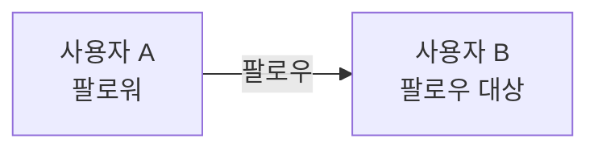

이번 실습에서는 다음 기능을 구현한다.

- 사용자 팔로우
- 사용자 언팔로우
- 팔로우 여부 확인
- 특정 사용자의 팔로워 목록 조회
- 특정 사용자의 팔로잉 목록 조회
- 중복 팔로우와 자기 자신 팔로우 방지
- User Server 컨테이너 이미지 재배포

#### 팔로우 관계의 방향 이해하기

팔로우 테이블을 설계할 때 가장 주의해야 하는 부분은 두 사용자 ID의 역할이다.

| 필드 | 의미 |
|---|---|
| `follower_user_id` | 팔로우 버튼을 누른 사용자 |
| `following_user_id` | 팔로우 대상이 된 사용자 |

사용자 1이 사용자 2를 팔로우한다면 다음과 같이 저장된다.

| `follower_user_id` | `following_user_id` | 의미 |
|---:|---:|---|
| 1 | 2 | 사용자 1이 사용자 2를 팔로우함 |

사용자 2의 팔로워 목록을 조회하면 사용자 1이 나오고, 사용자 1의 팔로잉 목록을 조회하면 사용자 2가 나온다.

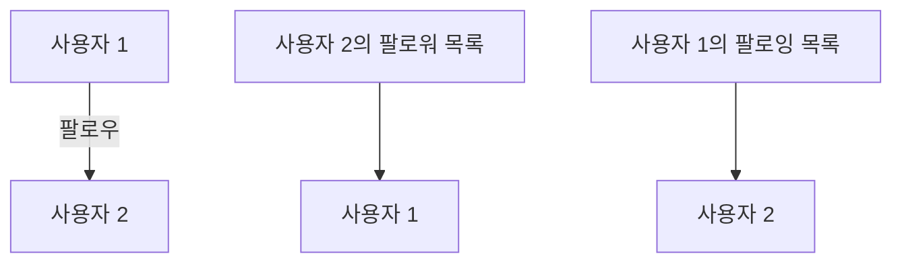

`userId`, `followId`, `followerId`처럼 의미가 불분명한 이름을 혼합하면 조회 조건이 쉽게 반대로 구현된다. 코드에서는 `followerUserId`와 `followingUserId`처럼 역할이 드러나는 이름을 사용하는 것이 좋다.

#### 팔로우 테이블 설계

팔로우 관계를 저장할 `user_follow` 테이블을 생성한다.

```sql
CREATE TABLE user_follow (
    follow_id BIGINT NOT NULL AUTO_INCREMENT,
    follower_user_id BIGINT NOT NULL,
    following_user_id BIGINT NOT NULL,
    followed_at DATETIME(6) NOT NULL,
    notification_sent_at DATETIME(6) NULL,
    PRIMARY KEY (follow_id),
    CONSTRAINT uk_user_follow_relation
        UNIQUE (follower_user_id, following_user_id),
    CONSTRAINT fk_user_follow_follower
        FOREIGN KEY (follower_user_id)
        REFERENCES users (user_id),
    CONSTRAINT fk_user_follow_following
        FOREIGN KEY (following_user_id)
        REFERENCES users (user_id),
    INDEX idx_user_follow_follower_time (
        follower_user_id,
        followed_at
    ),
    INDEX idx_user_follow_following_time (
        following_user_id,
        followed_at
    )
) ENGINE=InnoDB
  DEFAULT CHARSET=utf8mb4
  COLLATE=utf8mb4_unicode_ci;
```

##### 주요 컬럼과 제약 조건

- `follow_id`: 내부 관리를 위한 자동 증가 기본 키다.
- `follower_user_id`: 팔로우를 요청한 사용자 ID다.
- `following_user_id`: 팔로우 대상 사용자 ID다.
- `followed_at`: 팔로우 관계가 생성된 시각이다.
- `notification_sent_at`: 팔로우 알림 전송 완료 시각이다.
- `uk_user_follow_relation`: 같은 관계가 두 번 생성되는 것을 방지한다.
- Foreign Key: 존재하지 않는 사용자 간의 팔로우 관계가 저장되는 것을 방지한다.

`notification_sent_at`은 이후 Notification Batch에서 사용할 수 있다. User Server에서 이 컬럼을 직접 사용하지 않는다면 JPA Entity에 매핑하지 않아도 된다. 다만 Entity에서 값을 설정하지 않으므로 데이터베이스 컬럼은 `NULL`을 허용하거나 기본값을 가져야 한다.

#### Unique Constraint가 필요한 이유

Service에서 팔로우 여부를 먼저 확인하더라도 동시에 여러 요청이 들어오면 중복 데이터가 생성될 수 있다.

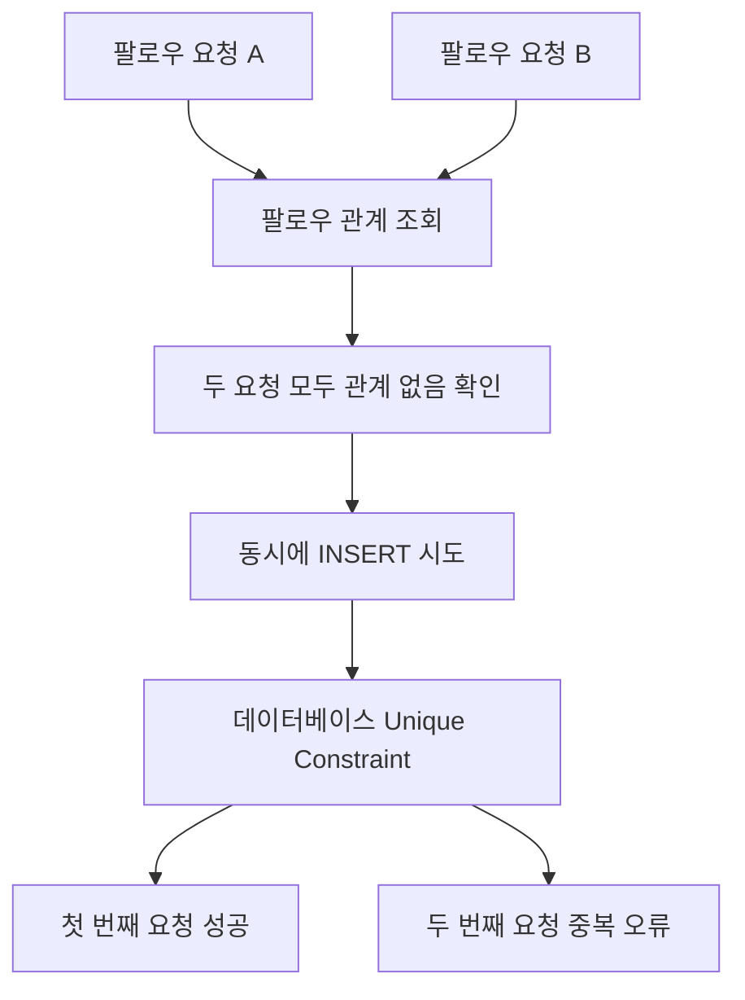

애플리케이션의 중복 검사는 친절한 오류 처리를 위한 것이고, 동시 요청까지 포함한 최종 정합성은 데이터베이스 Unique Constraint가 보장한다.

#### Follow Entity 작성

```java
package com.sns.user.domain.follow;

import jakarta.persistence.Column;
import jakarta.persistence.Entity;
import jakarta.persistence.GeneratedValue;
import jakarta.persistence.GenerationType;
import jakarta.persistence.Id;
import jakarta.persistence.Index;
import jakarta.persistence.PrePersist;
import jakarta.persistence.Table;
import jakarta.persistence.UniqueConstraint;

import java.time.Instant;

@Entity
@Table(
    name = "user_follow",
    uniqueConstraints = {
        @UniqueConstraint(
            name = "uk_user_follow_relation",
            columnNames = {
                "follower_user_id",
                "following_user_id"
            }
        )
    },
    indexes = {
        @Index(
            name = "idx_user_follow_follower_time",
            columnList = "follower_user_id, followed_at"
        ),
        @Index(
            name = "idx_user_follow_following_time",
            columnList = "following_user_id, followed_at"
        )
    }
)
public class Follow {

    @Id
    @GeneratedValue(strategy = GenerationType.IDENTITY)
    @Column(name = "follow_id")
    private Long id;

    @Column(
        name = "follower_user_id",
        nullable = false
    )
    private Long followerUserId;

    @Column(
        name = "following_user_id",
        nullable = false
    )
    private Long followingUserId;

    @Column(
        name = "followed_at",
        nullable = false,
        updatable = false
    )
    private Instant followedAt;

    protected Follow() {
    }

    private Follow(
        Long followerUserId,
        Long followingUserId
    ) {
        this.followerUserId = followerUserId;
        this.followingUserId = followingUserId;
    }

    public static Follow create(
        Long followerUserId,
        Long followingUserId
    ) {
        return new Follow(
            followerUserId,
            followingUserId
        );
    }

    @PrePersist
    private void initializeFollowedAt() {
        if (followedAt == null) {
            followedAt = Instant.now();
        }
    }

    public Long getId() {
        return id;
    }

    public Long getFollowerUserId() {
        return followerUserId;
    }

    public Long getFollowingUserId() {
        return followingUserId;
    }

    public Instant getFollowedAt() {
        return followedAt;
    }
}
```

이번 구현에서는 사용자 Entity와 `@ManyToOne` 관계를 만들지 않고 ID만 저장한다. User Server 내부에서 관리되는 같은 데이터베이스이므로 JPA 연관관계를 사용할 수도 있지만, ID 중심으로 모델링하면 팔로우 관계의 방향과 조회 쿼리를 명시적으로 관리할 수 있다.

#### 팔로우 목록 응답 DTO 작성

앞서 만든 `UserResponse`에는 이메일이 포함되어 있다. 팔로워와 팔로잉 목록은 다른 사용자에게 공개될 가능성이 높으므로 이메일을 반환하지 않는 별도의 DTO를 사용한다.

```java
package com.sns.user.api.dto;

public record UserSummaryResponse(
    Long userId,
    String username
) {
}
```

사용 목적에 따라 응답 DTO를 분리하면 개인정보가 의도하지 않은 API에서 노출되는 것을 방지할 수 있다.

#### 팔로우 요청 DTO 작성

```java
package com.sns.user.api.dto;

import jakarta.validation.constraints.NotNull;
import jakarta.validation.constraints.Positive;

public record FollowRequest(

    @NotNull
    @Positive
    Long followerUserId,

    @NotNull
    @Positive
    Long followingUserId
) {
}
```

- `followerUserId`: 팔로우를 요청한 사용자
- `followingUserId`: 팔로우 대상 사용자

인증이 구현된 운영 환경에서는 `followerUserId`를 요청 본문에서 받아서는 안 된다. 클라이언트가 다른 사용자의 ID를 전달할 수 있기 때문이다. 실제 팔로우 요청자는 JWT 또는 Session의 인증 정보에서 가져와야 한다.

#### 팔로우 응답 DTO 작성

```java
package com.sns.user.api.dto;

import com.sns.user.domain.follow.Follow;

import java.time.Instant;

public record FollowResponse(
    Long followId,
    Long followerUserId,
    Long followingUserId,
    Instant followedAt
) {

    public static FollowResponse from(Follow follow) {
        return new FollowResponse(
            follow.getId(),
            follow.getFollowerUserId(),
            follow.getFollowingUserId(),
            follow.getFollowedAt()
        );
    }
}
```

팔로우 여부 확인 API에는 별도의 응답을 사용한다.

```java
package com.sns.user.api.dto;

public record FollowStatusResponse(
    Long followerUserId,
    Long followingUserId,
    boolean following
) {
}
```

#### FollowRepository 작성

```java
package com.sns.user.domain.follow;

import com.sns.user.api.dto.UserSummaryResponse;
import org.springframework.data.domain.Page;
import org.springframework.data.domain.Pageable;
import org.springframework.data.jpa.repository.JpaRepository;
import org.springframework.data.jpa.repository.Query;
import org.springframework.data.repository.query.Param;

import java.util.Optional;

public interface FollowRepository
    extends JpaRepository<Follow, Long> {

    Optional<Follow>
    findByFollowerUserIdAndFollowingUserId(
        Long followerUserId,
        Long followingUserId
    );

    boolean existsByFollowerUserIdAndFollowingUserId(
        Long followerUserId,
        Long followingUserId
    );

    @Query("""
        select new com.sns.user.api.dto.UserSummaryResponse(
            u.id,
            u.username
        )
        from Follow f
        join UserAccount u
          on u.id = f.followerUserId
        where f.followingUserId = :userId
        order by f.followedAt desc
        """)
    Page<UserSummaryResponse> findFollowers(
        @Param("userId") Long userId,
        Pageable pageable
    );

    @Query("""
        select new com.sns.user.api.dto.UserSummaryResponse(
            u.id,
            u.username
        )
        from Follow f
        join UserAccount u
          on u.id = f.followingUserId
        where f.followerUserId = :userId
        order by f.followedAt desc
        """)
    Page<UserSummaryResponse> findFollowing(
        @Param("userId") Long userId,
        Pageable pageable
    );
}
```

##### 팔로워 조회 쿼리

팔로워 목록은 나를 팔로우한 사용자 목록이다.

```text
following_user_id = 조회 대상 사용자
follower_user_id = 결과로 반환할 사용자
```

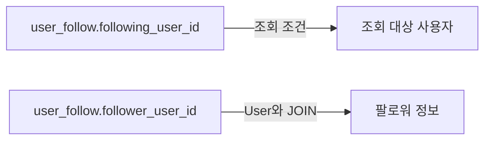

##### 팔로잉 조회 쿼리

팔로잉 목록은 내가 팔로우한 사용자 목록이다.

```text
follower_user_id = 조회 대상 사용자
following_user_id = 결과로 반환할 사용자
```

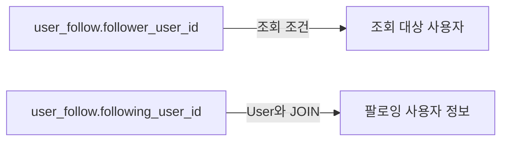

목록 조회는 데이터가 계속 증가할 수 있으므로 `List`로 전체 데이터를 한 번에 반환하지 않고 `Pageable`을 사용한다.

#### 팔로우 예외 정의

##### 이미 팔로우 중인 경우

```java
package com.sns.user.domain.follow;

public class AlreadyFollowingException
    extends RuntimeException {

    public AlreadyFollowingException() {
        super("이미 팔로우 중인 사용자입니다.");
    }
}
```

##### 자기 자신을 팔로우한 경우

```java
package com.sns.user.domain.follow;

public class SelfFollowNotAllowedException
    extends RuntimeException {

    public SelfFollowNotAllowedException() {
        super("자기 자신은 팔로우할 수 없습니다.");
    }
}
```

#### FollowService 작성

```java
package com.sns.user.domain.follow;

import com.sns.user.api.dto.FollowRequest;
import com.sns.user.api.dto.FollowResponse;
import com.sns.user.api.dto.FollowStatusResponse;
import com.sns.user.api.dto.UserSummaryResponse;
import com.sns.user.domain.user.UserNotFoundException;
import com.sns.user.domain.user.UserRepository;
import org.springframework.dao.DataIntegrityViolationException;
import org.springframework.data.domain.Page;
import org.springframework.data.domain.Pageable;
import org.springframework.stereotype.Service;
import org.springframework.transaction.annotation.Transactional;

@Service
@Transactional(readOnly = true)
public class FollowService {

    private final FollowRepository followRepository;
    private final UserRepository userRepository;

    public FollowService(
        FollowRepository followRepository,
        UserRepository userRepository
    ) {
        this.followRepository = followRepository;
        this.userRepository = userRepository;
    }

    public FollowStatusResponse getFollowStatus(
        Long followerUserId,
        Long followingUserId
    ) {
        boolean following = followRepository
            .existsByFollowerUserIdAndFollowingUserId(
                followerUserId,
                followingUserId
            );

        return new FollowStatusResponse(
            followerUserId,
            followingUserId,
            following
        );
    }

    @Transactional
    public FollowResponse follow(FollowRequest request) {
        Long followerUserId = request.followerUserId();
        Long followingUserId = request.followingUserId();

        validateFollowRequest(
            followerUserId,
            followingUserId
        );

        boolean alreadyFollowing = followRepository
            .existsByFollowerUserIdAndFollowingUserId(
                followerUserId,
                followingUserId
            );

        if (alreadyFollowing) {
            throw new AlreadyFollowingException();
        }

        Follow follow = Follow.create(
            followerUserId,
            followingUserId
        );

        try {
            Follow savedFollow =
                followRepository.saveAndFlush(follow);

            return FollowResponse.from(savedFollow);
        } catch (DataIntegrityViolationException exception) {
            throw new AlreadyFollowingException();
        }
    }

    @Transactional
    public void unfollow(
        Long followerUserId,
        Long followingUserId
    ) {
        followRepository
            .findByFollowerUserIdAndFollowingUserId(
                followerUserId,
                followingUserId
            )
            .ifPresent(followRepository::delete);
    }

    public Page<UserSummaryResponse> getFollowers(
        Long userId,
        Pageable pageable
    ) {
        validateUserExists(userId);
        return followRepository.findFollowers(
            userId,
            pageable
        );
    }

    public Page<UserSummaryResponse> getFollowing(
        Long userId,
        Pageable pageable
    ) {
        validateUserExists(userId);
        return followRepository.findFollowing(
            userId,
            pageable
        );
    }

    private void validateFollowRequest(
        Long followerUserId,
        Long followingUserId
    ) {
        if (followerUserId.equals(followingUserId)) {
            throw new SelfFollowNotAllowedException();
        }

        validateUserExists(followerUserId);
        validateUserExists(followingUserId);
    }

    private void validateUserExists(Long userId) {
        if (!userRepository.existsById(userId)) {
            throw new UserNotFoundException();
        }
    }
}
```

##### 팔로우 처리 과정

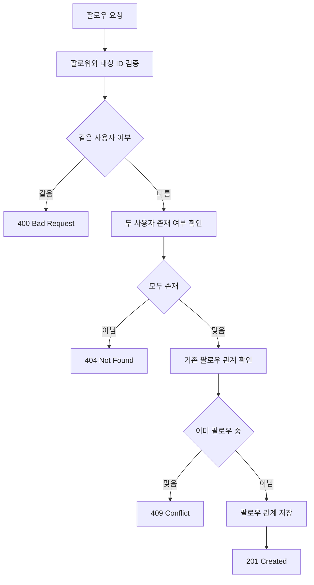

##### 언팔로우 처리 과정

언팔로우는 팔로우 관계를 데이터베이스에서 삭제하는 Hard Delete 방식으로 구현한다.

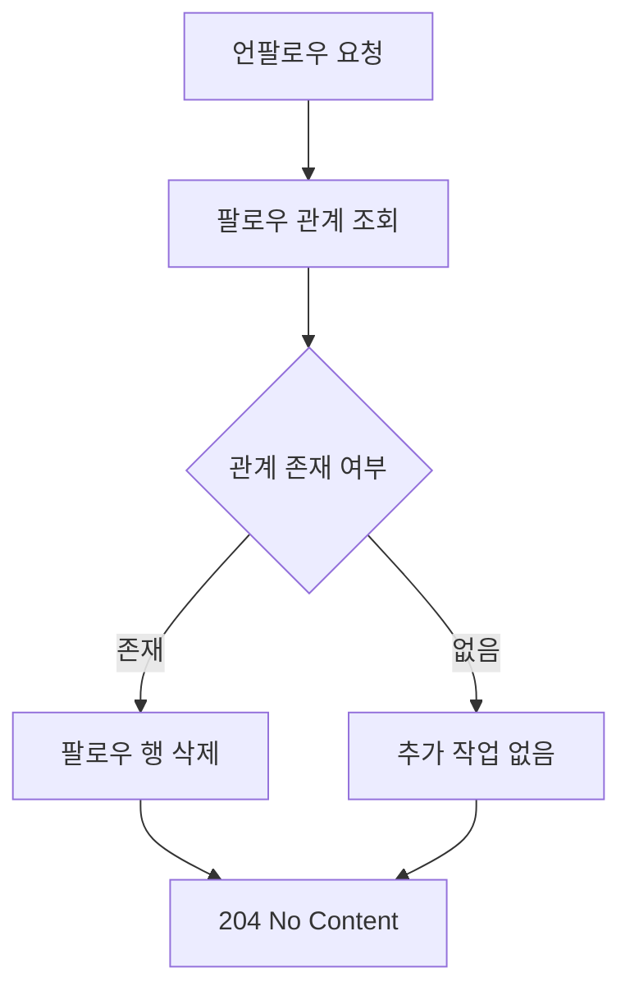

존재하지 않는 관계에 대한 언팔로우도 `204 No Content`를 반환하도록 만들면 같은 요청을 여러 번 보내도 결과가 달라지지 않는 멱등성을 확보할 수 있다.

#### Hard Delete 사용 시 주의사항

Hard Delete는 현재 팔로우 상태를 판단하기에는 단순하고 효율적이다. 하지만 다음 정보는 남지 않는다.

- 과거에 팔로우했던 시각
- 언팔로우한 시각
- 팔로우와 언팔로우 반복 이력
- 과거 알림 전송 기록

감사 기록이나 통계가 필요하다면 다음과 같은 대안을 고려할 수 있다.

- `status`와 `unfollowed_at` 컬럼을 사용하는 Soft Delete
- 팔로우 상태 테이블과 이벤트 이력 테이블 분리
- 팔로우 및 언팔로우 이벤트를 Kafka에 발행
- 별도의 감사 로그 저장소 사용

이번 실습에서는 현재 관계만 필요하므로 Hard Delete를 사용한다.

#### FollowController 작성

```java
package com.sns.user.api;

import com.sns.user.api.dto.FollowRequest;
import com.sns.user.api.dto.FollowResponse;
import com.sns.user.api.dto.FollowStatusResponse;
import com.sns.user.api.dto.UserSummaryResponse;
import com.sns.user.domain.follow.FollowService;
import jakarta.validation.Valid;
import org.springframework.data.domain.Page;
import org.springframework.data.domain.Pageable;
import org.springframework.data.web.PageableDefault;
import org.springframework.http.ResponseEntity;
import org.springframework.web.bind.annotation.DeleteMapping;
import org.springframework.web.bind.annotation.GetMapping;
import org.springframework.web.bind.annotation.PathVariable;
import org.springframework.web.bind.annotation.PostMapping;
import org.springframework.web.bind.annotation.RequestBody;
import org.springframework.web.bind.annotation.RequestMapping;
import org.springframework.web.bind.annotation.RestController;
import org.springframework.web.servlet.support.ServletUriComponentsBuilder;

import java.net.URI;

@RestController
@RequestMapping("/api/follows")
public class FollowController {

    private final FollowService followService;

    public FollowController(FollowService followService) {
        this.followService = followService;
    }

    @PostMapping
    public ResponseEntity<FollowResponse> follow(
        @Valid @RequestBody FollowRequest request
    ) {
        FollowResponse response =
            followService.follow(request);

        URI location = ServletUriComponentsBuilder
            .fromCurrentRequest()
            .path("/{followId}")
            .buildAndExpand(response.followId())
            .toUri();

        return ResponseEntity
            .created(location)
            .body(response);
    }

    @DeleteMapping(
        "/{followerUserId}/{followingUserId}"
    )
    public ResponseEntity<Void> unfollow(
        @PathVariable Long followerUserId,
        @PathVariable Long followingUserId
    ) {
        followService.unfollow(
            followerUserId,
            followingUserId
        );

        return ResponseEntity.noContent().build();
    }

    @GetMapping(
        "/{followerUserId}/{followingUserId}"
    )
    public FollowStatusResponse getFollowStatus(
        @PathVariable Long followerUserId,
        @PathVariable Long followingUserId
    ) {
        return followService.getFollowStatus(
            followerUserId,
            followingUserId
        );
    }

    @GetMapping("/{userId}/followers")
    public Page<UserSummaryResponse> getFollowers(
        @PathVariable Long userId,
        @PageableDefault(size = 20)
        Pageable pageable
    ) {
        return followService.getFollowers(
            userId,
            pageable
        );
    }

    @GetMapping("/{userId}/following")
    public Page<UserSummaryResponse> getFollowing(
        @PathVariable Long userId,
        @PageableDefault(size = 20)
        Pageable pageable
    ) {
        return followService.getFollowing(
            userId,
            pageable
        );
    }
}
```

API 구성은 다음과 같다.

| HTTP 요청 | 기능 | 정상 응답 |
|---|---|---:|
| `POST /api/follows` | 새로운 팔로우 관계 생성 | `201 Created` |
| `DELETE /api/follows/{followerId}/{followingId}` | 언팔로우 | `204 No Content` |
| `GET /api/follows/{followerId}/{followingId}` | 팔로우 여부 확인 | `200 OK` |
| `GET /api/follows/{userId}/followers` | 팔로워 목록 조회 | `200 OK` |
| `GET /api/follows/{userId}/following` | 팔로잉 목록 조회 | `200 OK` |

#### 예외 응답 처리 추가

기존 `ApiExceptionHandler`에 팔로우 예외 처리를 추가한다.

```java
@ExceptionHandler(AlreadyFollowingException.class)
public ProblemDetail handleAlreadyFollowing(
    AlreadyFollowingException exception
) {
    ProblemDetail problem = ProblemDetail.forStatusAndDetail(
        HttpStatus.CONFLICT,
        exception.getMessage()
    );
    problem.setTitle("Already Following");
    return problem;
}

@ExceptionHandler(SelfFollowNotAllowedException.class)
public ProblemDetail handleSelfFollow(
    SelfFollowNotAllowedException exception
) {
    ProblemDetail problem = ProblemDetail.forStatusAndDetail(
        HttpStatus.BAD_REQUEST,
        exception.getMessage()
    );
    problem.setTitle("Self Follow Not Allowed");
    return problem;
}
```

중복 팔로우 요청에 `null`이나 `200 OK`를 반환하면 요청이 성공했는지 판단하기 어렵다. 따라서 중복 상태를 명확하게 나타내는 `409 Conflict`를 사용한다.

#### API 테스트를 위한 사용자 생성

팔로우 기능을 테스트하려면 최소 두 명의 사용자가 필요하다.

##### 첫 번째 사용자 생성

```shell
curl -i -X POST \
  http://user-service.sns.svc.cluster.local:8080/api/users \
  -H "Content-Type: application/json" \
  -d '{
    "username": "user01",
    "email": "user01@example.com",
    "password": "StrongPassword123!"
  }'
```

##### 두 번째 사용자 생성

```shell
curl -i -X POST \
  http://user-service.sns.svc.cluster.local:8080/api/users \
  -H "Content-Type: application/json" \
  -d '{
    "username": "user02",
    "email": "user02@example.com",
    "password": "StrongPassword123!"
  }'
```

다음 테스트에서는 `user01`의 ID를 `1`, `user02`의 ID를 `2`라고 가정한다. 실제 테스트에서는 회원가입 응답으로 반환된 `userId`를 사용해야 한다.

#### 팔로우 API 테스트

사용자 1이 사용자 2를 팔로우한다.

```shell
curl -i -X POST \
  http://user-service.sns.svc.cluster.local:8080/api/follows \
  -H "Content-Type: application/json" \
  -d '{
    "followerUserId": 1,
    "followingUserId": 2
  }'
```

정상 응답은 `201 Created`다.

```json
{
  "followId": 1,
  "followerUserId": 1,
  "followingUserId": 2,
  "followedAt": "2026-09-22T01:20:30.123Z"
}
```

#### 팔로우 여부 확인

```shell
curl -i \
  http://user-service.sns.svc.cluster.local:8080/api/follows/1/2
```

```json
{
  "followerUserId": 1,
  "followingUserId": 2,
  "following": true
}
```

ID의 순서를 반대로 전달하면 의미도 반대가 된다.

```shell
curl \
  http://user-service.sns.svc.cluster.local:8080/api/follows/2/1
```

사용자 2가 사용자 1을 팔로우하지 않았다면 다음 결과가 반환된다.

```json
{
  "followerUserId": 2,
  "followingUserId": 1,
  "following": false
}
```

#### 팔로워 목록 조회

사용자 2를 팔로우하는 사용자 목록을 조회한다.

```shell
curl \
  "http://user-service.sns.svc.cluster.local:8080/api/follows/2/followers?page=0&size=20"
```

결과에는 사용자 1이 포함되어야 한다.

```json
{
  "content": [
    {
      "userId": 1,
      "username": "user01"
    }
  ]
}
```

#### 팔로잉 목록 조회

사용자 1이 팔로우하는 사용자 목록을 조회한다.

```shell
curl \
  "http://user-service.sns.svc.cluster.local:8080/api/follows/1/following?page=0&size=20"
```

결과에는 사용자 2가 포함되어야 한다.

```json
{
  "content": [
    {
      "userId": 2,
      "username": "user02"
    }
  ]
}
```

#### 언팔로우 API 테스트

```shell
curl -i -X DELETE \
  http://user-service.sns.svc.cluster.local:8080/api/follows/1/2
```

정상적으로 처리되면 다음 상태 코드가 반환된다.

```http
HTTP/1.1 204 No Content
```

다시 팔로우 여부를 조회한다.

```shell
curl \
  http://user-service.sns.svc.cluster.local:8080/api/follows/1/2
```

```json
{
  "followerUserId": 1,
  "followingUserId": 2,
  "following": false
}
```

#### 잘못된 요청 테스트

##### 자기 자신 팔로우

```shell
curl -i -X POST \
  http://user-service.sns.svc.cluster.local:8080/api/follows \
  -H "Content-Type: application/json" \
  -d '{
    "followerUserId": 1,
    "followingUserId": 1
  }'
```

`400 Bad Request`가 반환되어야 한다.

##### 중복 팔로우

이미 사용자 1이 사용자 2를 팔로우하는 상태에서 같은 요청을 다시 전달하면 `409 Conflict`가 반환되어야 한다.

##### 존재하지 않는 사용자 팔로우

```shell
curl -i -X POST \
  http://user-service.sns.svc.cluster.local:8080/api/follows \
  -H "Content-Type: application/json" \
  -d '{
    "followerUserId": 1,
    "followingUserId": 999999
  }'
```

존재하지 않는 사용자를 팔로우할 수 없으므로 `404 Not Found`가 반환되어야 한다.

#### 데이터베이스에서 관계 확인

```sql
SELECT
    f.follow_id,
    f.follower_user_id,
    follower.username AS follower_username,
    f.following_user_id,
    following_user.username AS following_username,
    f.followed_at,
    f.notification_sent_at
FROM user_follow f
JOIN users follower
  ON follower.user_id = f.follower_user_id
JOIN users following
  ON following.user_id = f.following_user_id
ORDER BY f.followed_at DESC;
```

이 쿼리를 통해 팔로우를 요청한 사용자와 팔로우 대상 사용자를 함께 확인할 수 있다.

#### 컨테이너 이미지 빌드

팔로우 기능을 추가했으므로 User Server 이미지 버전을 `0.0.3`으로 변경한다.

```powershell
.\gradlew.bat clean test jib `
  -Djib.to.image=<AWS_ACCOUNT_ID>.dkr.ecr.<REGION>.amazonaws.com/user-server:0.0.3
```

ECR 인증이 만료됐다면 다시 로그인한다.

```powershell
aws ecr get-login-password --region <REGION> |
    docker login `
        --username AWS `
        --password-stdin `
        <AWS_ACCOUNT_ID>.dkr.ecr.<REGION>.amazonaws.com
```

#### Kubernetes Deployment 업데이트

```shell
kubectl set image deployment/user-server \
  user-server=<AWS_ACCOUNT_ID>.dkr.ecr.<REGION>.amazonaws.com/user-server:0.0.3 \
  -n sns
```

Rollout 상태를 확인한다.

```shell
kubectl rollout status deployment/user-server -n sns
```

실제 이미지와 Pod 상태도 확인한다.

```shell
kubectl get deployment user-server \
  -n sns \
  -o jsonpath="{.spec.template.spec.containers[0].image}"
```

```shell
kubectl get pods -n sns -l app=user-server
```

```shell
kubectl get endpointslice \
  -n sns \
  -l kubernetes.io/service-name=user-service
```

#### 실패 상황과 원인

##### 팔로워와 팔로잉 결과가 반대로 나오는 경우

`followerUserId`와 `followingUserId`의 의미가 쿼리에서 뒤바뀌었을 가능성이 크다.

- 팔로워 조회: `followingUserId`가 조회 대상이고 `followerUserId`를 반환한다.
- 팔로잉 조회: `followerUserId`가 조회 대상이고 `followingUserId`를 반환한다.

테스트 데이터를 한 건만 넣고 SQL 결과와 API 결과를 비교하면 방향 오류를 쉽게 확인할 수 있다.

##### 중복 팔로우 데이터가 저장되는 경우

다음 Unique Constraint가 실제 데이터베이스에 생성됐는지 확인한다.

```sql
SHOW INDEX FROM user_follow;
```

애플리케이션의 `existsBy...` 검사만으로는 동시 요청을 완전히 막을 수 없다.

##### 팔로우 생성 시 Foreign Key 오류가 발생하는 경우

`followerUserId` 또는 `followingUserId`에 해당하는 사용자가 `users` 테이블에 존재하지 않는 상태다.

API 테스트 전에 회원가입 응답에서 실제 `userId`를 확인해야 한다.

##### 목록 조회에서 이메일이 노출되는 경우

팔로워 목록이 `UserResponse`를 반환하고 있을 가능성이 있다. 공개 목록에는 이메일을 제외한 `UserSummaryResponse`를 사용해야 한다.

##### 목록 조회가 느려지는 경우

다음 인덱스가 존재하는지 확인한다.

```sql
SHOW INDEX FROM user_follow;
```

팔로워 조회에는 `following_user_id`, 팔로잉 조회에는 `follower_user_id` 인덱스가 필요하다. 목록 데이터가 많다면 반드시 페이지네이션을 적용해야 한다.

#### 실무에서 추가로 고려할 사항

##### 팔로우 요청자는 인증 정보에서 가져온다

이번 실습에서는 테스트를 위해 `followerUserId`를 요청 본문으로 전달했다. 하지만 운영 환경에서는 다음과 같이 인증 정보에서 가져와야 한다.

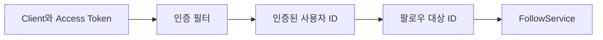

클라이언트는 팔로우 대상 ID만 전달하고, 팔로우 요청자 ID는 서버가 JWT 또는 Session에서 결정해야 한다.

##### 사용자 차단 기능

한 사용자가 다른 사용자를 차단한 경우에는 팔로우 생성뿐 아니라 기존 관계와 목록 노출 정책도 함께 정의해야 한다.

- 차단 시 기존 팔로우 관계 제거
- 차단 사용자에 대한 팔로우 요청 거부
- 팔로워 및 팔로잉 목록에서 숨김 처리
- Feed와 Timeline에서도 차단 관계 반영

##### 팔로우 수 캐시

사용자가 많아지면 프로필을 조회할 때마다 팔로워 수와 팔로잉 수를 `COUNT`하는 비용이 증가한다.

다음 방식을 검토할 수 있다.

- User 테이블에 카운트 컬럼 저장
- Redis에 카운트 캐시
- 팔로우 이벤트 기반 비동기 집계
- 주기적인 정합성 보정 Batch

카운트를 별도로 저장하면 실제 관계 테이블과 값이 달라질 수 있으므로 재계산과 복구 방법도 마련해야 한다.

##### 팔로우 이벤트와 알림 처리

팔로우가 생성됐을 때 User Server가 직접 이메일이나 Push 알림을 전송하면 외부 알림 시스템 장애가 팔로우 API에 영향을 줄 수 있다.

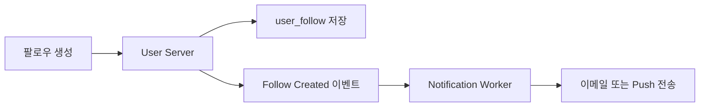

이벤트 발행의 신뢰성이 중요하다면 Outbox Pattern이나 재시도 가능한 메시지 브로커를 적용할 수 있다. `notification_sent_at`을 이용한 Batch 방식도 가능하지만 중복 전송 방지와 실패 재시도 정책을 함께 설계해야 한다.

### 정리

User Server에 팔로우 관계를 관리하는 기능을 구현했다.

- `followerUserId`는 팔로우를 요청한 사용자다.
- `followingUserId`는 팔로우 대상 사용자다.
- 팔로워와 팔로잉은 같은 테이블에서 방향을 반대로 조회한다.
- 데이터베이스 Unique Constraint로 중복 팔로우를 방지했다.
- 자기 자신과 존재하지 않는 사용자를 팔로우할 수 없도록 검증했다.
- 팔로워와 팔로잉 목록에는 이메일을 제외한 공개 사용자 정보만 반환했다.
- 목록이 계속 증가할 수 있으므로 페이지네이션을 적용했다.
- 언팔로우는 관계가 없어도 `204 No Content`를 반환하는 멱등 연산으로 구성했다.
- Hard Delete는 단순하지만 과거 팔로우 이력을 보존하지 않는다는 점을 고려해야 한다.
- 운영 환경에서는 팔로우 요청자 ID를 요청 본문이 아니라 인증 정보에서 가져와야 한다.
- 기능이 추가된 User Server를 `0.0.3` 이미지로 빌드하고 Kubernetes Deployment에 적용했다.

이제 User Server는 사용자 계정과 팔로우 관계를 제공할 수 있다. 다음 단계에서는 Feed Server가 `uploaderId`를 이용해 User Server의 사용자 정보를 조회하도록 서비스 간 통신을 구성할 수 있다.
