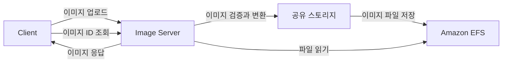
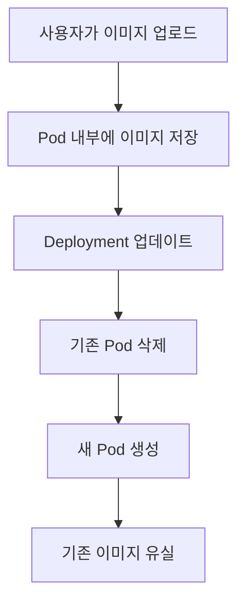
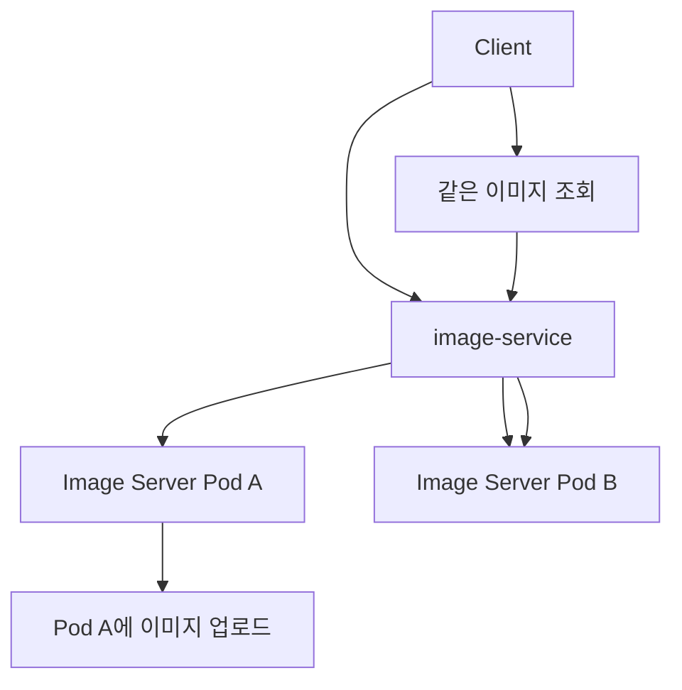
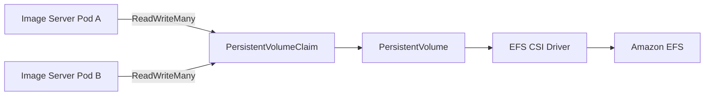
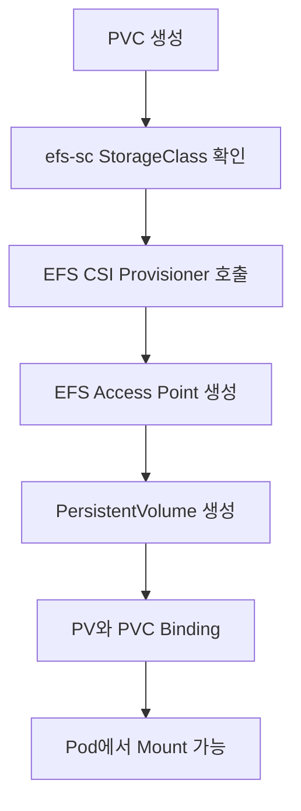
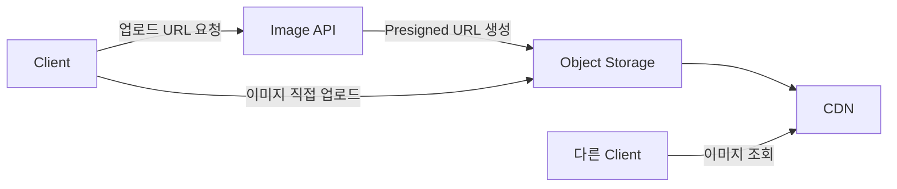
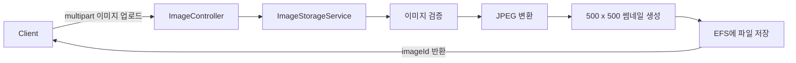
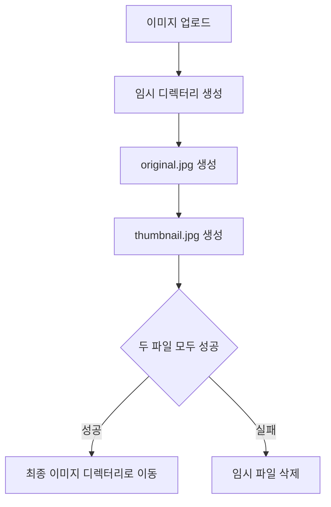
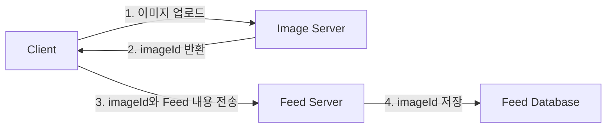
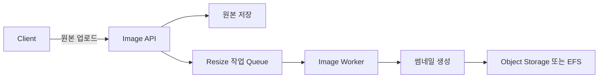

# Ch 4. Image 서버 개발

# Ch 4. Image 서버 개발
* toc
{:toc}

---

## 01. 이미지 서버를 위한 볼륨 구성

### Kubernetes EFS로 Image Server 공유 스토리지 구성하기

SNS에서는 게시물 이미지, 프로필 이미지, 썸네일처럼 파일 형태의 데이터를 다뤄야 한다. 이번에는 사용자가 업로드한 이미지를 저장하고, 이미지 ID를 이용해 다시 조회할 수 있는 Image Server의 기본 환경을 구성한다.

일반적인 운영 환경이라면 이미지 파일은 Amazon S3 같은 Object Storage에 저장하고 CloudFront 같은 CDN을 통해 전달하는 방식이 더 적합하다. 이번 구성에서는 Kubernetes의 Storage 기능을 직접 활용하기 위해 Amazon EFS를 공유 파일 시스템으로 사용한다.

#### Image Server의 역할

Image Server는 다음과 같은 책임을 가진다.

- `multipart/form-data` 형식의 이미지 업로드 처리
- 업로드 파일 검증
- 고유한 이미지 ID 생성
- 원본 이미지 저장
- 이미지 크기와 Format 변환
- 썸네일 생성
- 이미지 ID를 이용한 파일 조회
- 올바른 `Content-Type`으로 이미지 반환



Image Server는 이미지 파일 자체를 저장하므로 데이터베이스를 사용하는 User Server나 Feed Server와는 저장 방식이 다르다.

#### Pod 내부에 이미지를 저장하면 안 되는 이유

컨테이너 내부 파일 시스템이나 `emptyDir`에 이미지를 저장하는 방법은 간단하지만 영구 저장소로 사용할 수 없다.

Pod가 재생성되면 다음과 같은 문제가 발생한다.



`emptyDir`도 Pod가 살아 있는 동안에는 컨테이너 재시작과 관계없이 유지될 수 있지만 Pod 자체가 삭제되면 함께 제거된다. Deployment의 Rolling Update, Node 장애, Eviction 같은 상황에서도 파일을 보존해야 한다면 Persistent Volume이 필요하다.

#### 여러 Image Server Pod가 같은 파일을 봐야 하는 이유

Image Server를 2개 이상으로 확장하면 업로드 요청과 조회 요청이 서로 다른 Pod로 전달될 수 있다.



Pod A의 로컬 파일 시스템에만 이미지가 저장되어 있다면 Pod B에서는 해당 파일을 찾을 수 없다. 어느 Pod로 요청하더라도 같은 이미지를 반환하려면 모든 Image Server Pod가 동일한 저장소를 사용해야 한다.

이번 구성에서 필요한 조건은 다음과 같다.

- Pod가 교체되어도 파일이 유지되어야 한다.
- 여러 Pod가 동시에 파일을 읽고 쓸 수 있어야 한다.
- 여러 가용 영역에 배치된 Pod에서도 접근할 수 있어야 한다.
- Deployment를 자유롭게 Scale Out할 수 있어야 한다.

이 요구사항에는 EFS와 `ReadWriteMany` 접근 모드가 잘 맞는다.

#### EFS를 이용한 공유 스토리지 구조



각 Kubernetes 객체의 역할은 다음과 같다.

| 구성 요소 | 역할 |
|---|---|
| StorageClass | 어떤 Provisioner와 설정으로 볼륨을 만들지 정의 |
| PVC | 애플리케이션이 필요한 저장소를 요청 |
| PV | 실제 스토리지와 Kubernetes를 연결 |
| EFS CSI Driver | Kubernetes와 Amazon EFS 연결 |
| EFS | 여러 Pod가 함께 사용하는 Network File System |

이번 환경에는 `efs-sc`라는 StorageClass가 이미 구성되어 있다고 가정한다. PVC에서 해당 StorageClass를 지정하면 EFS CSI Driver가 PV를 동적으로 Provisioning한다.

#### 스토리지 선택 기준

Kubernetes Volume은 단순히 용량만 보고 선택하면 안 된다. 데이터와 애플리케이션의 특성을 함께 봐야 한다.

| 판단 항목 | Image Server 요구사항 |
|---|---|
| Pod 삭제 후 데이터 보존 | 필요 |
| 여러 Pod의 동시 접근 | 필요 |
| 파일 시스템 인터페이스 | 필요 |
| 접근 모드 | `ReadWriteMany` |
| 여러 가용 영역 접근 | 필요 |
| 임시 데이터 여부 | 영구 데이터 |
| 백업과 복구 | 별도 정책 필요 |

`ReadWriteOnce`는 일반적으로 하나의 Node에서 읽기와 쓰기가 필요한 Workload에 사용한다. 여러 Node에 배치될 수 있는 Image Server Pod가 같은 파일을 사용하려면 `ReadWriteMany`를 지원하는 스토리지가 필요하다.

#### Image Server 프로젝트 의존성

Image Server는 데이터베이스를 사용하지 않으므로 JPA나 MySQL Driver가 필요하지 않다.

```groovy
dependencies {
    implementation 'org.springframework.boot:spring-boot-starter-web'
    implementation 'org.springframework.boot:spring-boot-starter-validation'
    implementation 'org.springframework.boot:spring-boot-starter-actuator'

    implementation 'net.coobird:thumbnailator:0.4.20'

    testImplementation 'org.springframework.boot:spring-boot-starter-test'
}
```

Thumbnailator는 이미지 크기 변경, Format 변환, 썸네일 생성 같은 작업을 단순하게 구현할 수 있게 해준다.

이미지 처리 라이브러리는 입력 파일을 실제 이미지로 해석하므로 단순히 확장자만 확인해서는 안 된다. MIME Type, 이미지 Decode 가능 여부, 크기, 픽셀 수를 함께 검증해야 한다.

#### Multipart 업로드 설정

이미지는 JSON이 아니라 `multipart/form-data` 요청으로 업로드한다. Spring Boot의 기본 업로드 제한보다 큰 이미지를 처리해야 한다면 파일과 전체 요청의 최대 크기를 명시한다.

```yaml
server:
  port: 8080
  shutdown: graceful

spring:
  application:
    name: image-server
  lifecycle:
    timeout-per-shutdown-phase: 30s
  servlet:
    multipart:
      max-file-size: 10MB
      max-request-size: 12MB

app:
  image:
    storage-root: ${IMAGE_STORAGE_PATH:/images}

management:
  endpoint:
    health:
      probes:
        enabled: true
  endpoints:
    web:
      exposure:
        include: health
```

- `max-file-size`: 이미지 파일 한 개의 최대 크기다.
- `max-request-size`: Multipart 요청 전체의 최대 크기다.
- `storage-root`: 이미지가 저장될 디렉터리다.
- `IMAGE_STORAGE_PATH`: Kubernetes에서 주입할 환경 변수다.
- `/images`: 환경 변수가 없을 때 사용하는 기본 경로다.

요청 크기 제한을 크게 설정한다고 해서 큰 이미지가 안전하게 처리되는 것은 아니다. 압축된 파일의 크기는 작지만 Decode 후 픽셀 수가 지나치게 큰 이미지도 있을 수 있으므로 이미지 가로, 세로와 전체 픽셀 수에도 제한이 필요하다.

#### 이미지 저장 경로 설정 클래스

문자열 경로를 여러 Component에서 직접 읽기보다 전용 설정 객체로 관리한다.

```java
package com.sns.image.config;

import jakarta.validation.constraints.NotNull;
import org.springframework.boot.context.properties.ConfigurationProperties;
import org.springframework.validation.annotation.Validated;

import java.nio.file.Path;

@Validated
@ConfigurationProperties(prefix = "app.image")
public record ImageStorageProperties(

    @NotNull
    Path storageRoot
) {
}
```

애플리케이션 진입점에서 Configuration Properties Scan을 활성화한다.

```java
package com.sns.image;

import org.springframework.boot.SpringApplication;
import org.springframework.boot.autoconfigure.SpringBootApplication;
import org.springframework.boot.context.properties.ConfigurationPropertiesScan;

@ConfigurationPropertiesScan
@SpringBootApplication
public class ImageServerApplication {

    public static void main(String[] args) {
        SpringApplication.run(
            ImageServerApplication.class,
            args
        );
    }
}
```

#### PVC 작성

`image-volume-claim.yaml`을 작성한다.

```yaml
apiVersion: v1
kind: PersistentVolumeClaim
metadata:
  name: image-volume-claim
  namespace: sns
  labels:
    app: image-server
spec:
  accessModes:
    - ReadWriteMany
  volumeMode: Filesystem
  storageClassName: efs-sc
  resources:
    requests:
      storage: 5Gi
```

##### `accessModes`

```yaml
accessModes:
  - ReadWriteMany
```

`ReadWriteMany`는 여러 Node의 Pod가 같은 볼륨을 읽고 쓸 수 있는 접근 모드다. EFS는 Network File System이므로 이 방식으로 여러 Image Server Pod가 파일을 공유할 수 있다.

##### `storageClassName`

```yaml
storageClassName: efs-sc
```

PVC를 처리할 StorageClass를 지정한다. 이름이 실제 Cluster에 등록된 StorageClass와 정확하게 일치해야 한다.

```shell
kubectl get storageclass
```

##### `resources.requests.storage`

```yaml
resources:
  requests:
    storage: 5Gi
```

PVC가 요청하는 논리적인 저장 용량이다.

EFS는 사용량에 따라 확장되는 파일 시스템이므로 이 값이 Block Storage처럼 실제 사용량을 5Gi로 강제 제한하지 않을 수 있다. EFS CSI Driver와 StorageClass의 구성에 따라 PVC 용량은 스케줄링과 선언 목적의 값으로 사용될 수 있다.

실제 저장 용량 제한이 필요하다면 애플리케이션 정책, 사용자별 Quota, Monitoring과 별도 정리 작업이 필요하다.

#### PVC 적용

```shell
kubectl apply -f image-volume-claim.yaml
```

PVC 상태를 확인한다.

```shell
kubectl get pvc -n sns
```

정상적으로 Provisioning되면 다음과 같이 `Bound` 상태가 된다.

```text
NAME                 STATUS   VOLUME          CAPACITY   ACCESS MODES
image-volume-claim   Bound    pvc-xxxxxxxx    5Gi        RWX
```

상세 정보와 Event도 확인한다.

```shell
kubectl describe pvc image-volume-claim -n sns
```

StorageClass가 `WaitForFirstConsumer` 방식을 사용한다면 PVC를 사용하는 Pod가 생성되기 전까지 `Pending` 상태일 수도 있다. PVC가 즉시 `Bound`되지 않았다고 해서 반드시 오류인 것은 아니다.

#### 동적 Provisioning 과정



StorageClass를 이용한 동적 Provisioning에서는 PV YAML을 직접 만들 필요가 없다. PVC가 생성되면 CSI Driver가 필요한 PV를 자동으로 준비한다.

#### Image Server Deployment와 Service 작성

`image-deployment.yaml`을 작성한다.

```yaml
apiVersion: apps/v1
kind: Deployment
metadata:
  name: image-server
  namespace: sns
  labels:
    app: image-server
spec:
  replicas: 2
  strategy:
    type: RollingUpdate
    rollingUpdate:
      maxSurge: 1
      maxUnavailable: 0
  selector:
    matchLabels:
      app: image-server
  template:
    metadata:
      labels:
        app: image-server
    spec:
      securityContext:
        runAsNonRoot: true
        runAsUser: 1000
        runAsGroup: 1000
        fsGroup: 1000
        seccompProfile:
          type: RuntimeDefault
      terminationGracePeriodSeconds: 40
      containers:
        - name: image-server
          image: <AWS_ACCOUNT_ID>.dkr.ecr.<REGION>.amazonaws.com/image-server:0.0.1
          imagePullPolicy: IfNotPresent
          ports:
            - name: http
              containerPort: 8080
          env:
            - name: IMAGE_STORAGE_PATH
              value: /images
          resources:
            requests:
              cpu: 250m
              memory: 512Mi
            limits:
              cpu: "1"
              memory: 1Gi
          readinessProbe:
            httpGet:
              path: /actuator/health/readiness
              port: http
            initialDelaySeconds: 10
            periodSeconds: 5
            timeoutSeconds: 2
            failureThreshold: 3
          livenessProbe:
            httpGet:
              path: /actuator/health/liveness
              port: http
            initialDelaySeconds: 30
            periodSeconds: 10
            timeoutSeconds: 2
            failureThreshold: 3
          volumeMounts:
            - name: image-volume
              mountPath: /images
            - name: temporary-volume
              mountPath: /tmp
          securityContext:
            allowPrivilegeEscalation: false
            readOnlyRootFilesystem: true
            capabilities:
              drop:
                - ALL
          lifecycle:
            preStop:
              exec:
                command:
                  - sh
                  - -c
                  - sleep 10
      volumes:
        - name: image-volume
          persistentVolumeClaim:
            claimName: image-volume-claim
        - name: temporary-volume
          emptyDir:
            sizeLimit: 1Gi
---
apiVersion: v1
kind: Service
metadata:
  name: image-service
  namespace: sns
  labels:
    app: image-server
spec:
  type: ClusterIP
  selector:
    app: image-server
  ports:
    - name: http
      port: 8080
      targetPort: http
```

#### Deployment의 Volume 설정

##### PVC를 Pod Volume으로 연결

```yaml
volumes:
  - name: image-volume
    persistentVolumeClaim:
      claimName: image-volume-claim
```

`image-volume-claim` PVC를 Pod가 사용할 `image-volume`으로 연결한다.

PVC와 Pod는 같은 Namespace에 있어야 한다. `sns` Namespace의 Pod는 다른 Namespace에 있는 PVC를 직접 Mount할 수 없다.

##### 컨테이너에 Volume Mount

```yaml
volumeMounts:
  - name: image-volume
    mountPath: /images
```

EFS 볼륨이 컨테이너의 `/images` 경로에 Mount된다. 애플리케이션이 `/images` 아래에 파일을 저장하면 실제 데이터는 EFS에 기록된다.

##### 환경 변수와 Mount 경로 일치

```yaml
env:
  - name: IMAGE_STORAGE_PATH
    value: /images
```

환경 변수의 경로와 `mountPath`가 일치해야 한다.

경로가 다르면 애플리케이션이 EFS가 아닌 컨테이너 내부 파일 시스템에 이미지를 저장할 수 있다. 업로드는 성공한 것처럼 보여도 Pod 교체 후 파일이 사라지는 원인이 된다.

##### 임시 디렉터리 분리

Multipart 업로드와 이미지 처리 과정에서는 임시 파일이 생성될 수 있다.

```yaml
- name: temporary-volume
  mountPath: /tmp
```

컨테이너의 Root File System을 읽기 전용으로 설정했기 때문에 `/tmp`에는 별도의 `emptyDir`를 Mount했다.

`/tmp`의 파일은 처리 중에만 사용하는 임시 데이터이므로 Pod와 함께 삭제되어도 괜찮다. 최종 이미지 파일만 `/images`에 저장해야 한다.

#### EFS 파일 권한

컨테이너를 Root가 아닌 사용자로 실행하면 `/images`에 쓰기 권한이 있어야 한다.

```yaml
securityContext:
  runAsUser: 1000
  runAsGroup: 1000
  fsGroup: 1000
```

EFS Access Point가 강제하는 UID와 GID가 있다면 Deployment의 `runAsUser`, `runAsGroup`, `fsGroup`과 일치시켜야 한다.

권한이 맞지 않으면 애플리케이션 로그에 다음과 같은 오류가 발생할 수 있다.

```text
java.nio.file.AccessDeniedException: /images
```

단순히 컨테이너를 Root로 실행해 해결하기보다는 EFS Access Point와 Pod Security Context를 올바르게 맞추는 것이 좋다.

#### Deployment 적용

```shell
kubectl apply -f image-deployment.yaml
```

Rollout 상태를 확인한다.

```shell
kubectl rollout status \
  deployment/image-server \
  -n sns
```

Pod와 Service를 확인한다.

```shell
kubectl get pods \
  -n sns \
  -l app=image-server
```

```shell
kubectl get service image-service -n sns
```

EndpointSlice도 확인한다.

```shell
kubectl get endpointslice \
  -n sns \
  -l kubernetes.io/service-name=image-service
```

#### Volume Mount 확인

Pod 이름을 조회한다.

```shell
kubectl get pods \
  -n sns \
  -l app=image-server
```

컨테이너 안에서 Mount 상태를 확인한다.

```shell
kubectl exec <IMAGE_SERVER_POD_NAME> \
  -n sns \
  -- mount
```

`/images` 디렉터리 권한도 확인한다.

```shell
kubectl exec <IMAGE_SERVER_POD_NAME> \
  -n sns \
  -- ls -ld /images
```

Jib 이미지의 Base Image에 `sh`, `mount`, `ls` 같은 명령이 없다면 `kubectl exec` 진단이 실패할 수 있다. 이 경우 애플리케이션의 저장 테스트 API나 별도의 Debug Pod를 사용해 확인한다.

#### 여러 Pod의 공유 파일 확인

첫 번째 Pod에서 테스트 파일을 생성한다.

```shell
kubectl exec <FIRST_IMAGE_POD> \
  -n sns \
  -- sh -c \
  "echo shared-storage-test > /images/storage-test.txt"
```

두 번째 Pod에서 같은 파일을 읽는다.

```shell
kubectl exec <SECOND_IMAGE_POD> \
  -n sns \
  -- cat /images/storage-test.txt
```

다음 결과가 나오면 두 Pod가 같은 EFS 볼륨을 사용하고 있는 것이다.

```text
shared-storage-test
```

확인이 끝나면 테스트 파일을 삭제한다.

```shell
kubectl exec <FIRST_IMAGE_POD> \
  -n sns \
  -- rm /images/storage-test.txt
```

#### 파일 저장 시 동시성 문제

여러 Pod가 같은 디렉터리에 동시에 파일을 저장하기 때문에 파일 이름이 충돌하지 않도록 해야 한다.

원본 파일명을 그대로 저장하면 다음과 같은 문제가 발생할 수 있다.

```text
profile.jpg
profile.jpg
```

서로 다른 사용자가 같은 파일명으로 업로드하면 기존 파일을 덮어쓸 수 있다. 서버에서 UUID 같은 고유 ID를 생성해 저장 경로로 사용해야 한다.

```text
/images/9f7f3ea8-3864-4cb8-a9f8-41f132243abc.jpg
```

파일 저장 중 조회 요청이 들어오는 문제도 고려해야 한다. 바로 최종 경로에 쓰는 대신 임시 파일에 저장을 완료한 뒤 원자적으로 이동하는 방식이 안전하다.


#### 파일명과 경로 검증

클라이언트가 전달한 파일명을 저장 경로에 직접 연결하면 Path Traversal 공격에 노출될 수 있다.

```text
../../etc/passwd
```

안전한 저장 방식은 다음과 같다.

- 클라이언트 파일명을 저장 경로로 사용하지 않는다.
- 서버에서 UUID를 생성한다.
- 허용한 이미지 Format만 저장한다.
- 저장 경로를 `normalize()`한 뒤 Root Directory 내부인지 확인한다.
- Symbolic Link를 따라가지 않는다.
- 확장자와 실제 이미지 Format을 함께 확인한다.

원본 파일명은 필요하다면 별도 Metadata로만 관리한다.

#### 이미지 업로드 제한

이미지 업로드 기능에서는 다음 항목을 검증해야 한다.

- 파일이 비어 있지 않은가
- 허용된 MIME Type인가
- 실제로 Decode할 수 있는 이미지인가
- 파일 크기가 제한 이내인가
- 가로와 세로 크기가 허용 범위인가
- 전체 픽셀 수가 지나치게 크지 않은가
- 애니메이션 이미지 처리를 허용할 것인가
- Metadata를 제거할 것인가
- 업로드 파일에 악성 Payload가 포함되지 않았는가

`Content-Type: image/jpeg` 헤더만 믿어서는 안 된다. 클라이언트가 임의로 지정할 수 있기 때문이다.

#### EFS를 이미지 저장소로 사용할 때의 한계

EFS는 여러 Pod가 공유할 수 있는 POSIX 파일 시스템이 필요할 때 유용하다. 하지만 대규모 이미지 서비스의 최종 형태로 항상 적합한 것은 아니다.

##### 네트워크 파일 시스템 지연

모든 파일 읽기와 쓰기가 네트워크를 통해 처리된다. 작은 파일을 매우 자주 읽거나 이미지 요청량이 많으면 지연과 처리량을 확인해야 한다.

##### 애플리케이션이 이미지 전송을 담당

Image Server가 매번 EFS에서 파일을 읽어 HTTP 응답으로 전송하면 애플리케이션 Pod의 CPU, Memory, Network를 사용한다.

##### CDN 연동의 어려움

Object Storage는 CDN과 연결하기 쉽지만 EFS 파일을 외부 사용자에게 효율적으로 전달하려면 별도 HTTP 계층이 필요하다.

##### 파일 수명 주기 관리

임시 이미지, 사용하지 않는 이미지, 삭제된 게시물의 이미지를 정리하는 별도 작업이 필요하다.

##### 백업은 별도 구성

PVC를 사용한다고 해서 자동으로 백업되는 것은 아니다. EFS Backup, Snapshot에 해당하는 복구 정책, 다른 Region 복제 등을 별도로 설계해야 한다.

#### EFS와 Object Storage 비교

| 항목 | EFS | Object Storage |
|---|---|---|
| 접근 방식 | 파일 시스템 | HTTP API |
| 여러 Pod 공유 | 가능 | 가능 |
| `ReadWriteMany` | 지원 | 해당 개념 없음 |
| 파일 수정 | 일반 파일처럼 가능 | 객체 단위 처리 |
| CDN 연동 | 별도 구성 필요 | 비교적 쉬움 |
| 대규모 이미지 제공 | 애플리케이션 구성 필요 | 적합 |
| Kubernetes Mount | 가능 | 일반적으로 SDK 사용 |
| 활용 사례 | 공유 POSIX 파일 시스템 | 이미지, 영상, 정적 파일 |

실제 SNS 서비스에서는 다음과 같은 구조가 일반적이다.



이 구조에서는 큰 이미지 파일이 애플리케이션 서버를 거치지 않으므로 Image Server의 Network와 Memory 부담을 줄일 수 있다.

#### 장애 상황과 확인 방법

##### PVC가 `Pending` 상태인 경우

```shell
kubectl describe pvc image-volume-claim -n sns
```

다음 항목을 확인한다.

- `efs-sc` StorageClass가 존재하는가
- EFS CSI Driver가 실행 중인가
- CSI Controller의 IAM 권한이 올바른가
- EFS File System ID가 정확한가
- 동적 Provisioning 설정이 올바른가
- `WaitForFirstConsumer` 방식인지 확인했는가

EFS CSI Driver Pod 상태도 확인한다.

```shell
kubectl get pods \
  -n kube-system \
  -l app.kubernetes.io/name=aws-efs-csi-driver
```

##### Pod가 `ContainerCreating`에 머무는 경우

```shell
kubectl describe pod <IMAGE_SERVER_POD_NAME> -n sns
```

주요 원인은 다음과 같다.

- EFS Mount Target이 없는 가용 영역
- Worker Node에서 EFS로 연결할 수 없음
- Security Group에서 NFS 포트가 차단됨
- EFS CSI Node Plugin 문제
- PVC 또는 PV 연결 오류

EFS는 NFS 통신에 TCP 2049 포트를 사용하므로 Worker Node와 EFS Mount Target 사이의 Security Group을 확인해야 한다.

##### 애플리케이션에서 파일 쓰기가 실패하는 경우

```shell
kubectl logs deployment/image-server \
  -n sns \
  --tail=200
```

다음 항목을 확인한다.

- `/images`가 실제로 Mount됐는가
- `IMAGE_STORAGE_PATH`가 `/images`인가
- 컨테이너 UID와 EFS Access Point 권한이 일치하는가
- 파일명이 충돌하지 않는가
- EFS가 읽기 전용으로 Mount되지 않았는가

##### 한 Pod에서만 이미지가 보이는 경우

실제 저장 경로가 `/images`가 아니라 컨테이너 내부의 다른 경로일 가능성이 있다.

Pod별로 환경 변수를 확인한다.

```shell
kubectl exec <IMAGE_SERVER_POD_NAME> \
  -n sns \
  -- printenv IMAGE_STORAGE_PATH
```

Deployment의 `volumeMounts.mountPath`와 애플리케이션 저장 경로가 정확히 같은지 확인해야 한다.

##### Multipart 요청이 거절되는 경우

설정한 크기보다 큰 파일을 업로드하면 `MaxUploadSizeExceededException`이 발생할 수 있다.

다음 항목을 함께 확인한다.

- Spring Boot Multipart 제한
- Ingress Controller 요청 크기 제한
- API Gateway 또는 Load Balancer 제한
- Reverse Proxy 제한
- Client Timeout

애플리케이션 설정만 늘려도 앞단의 Ingress가 더 작은 요청 크기 제한을 가지고 있다면 업로드는 실패한다.

### 정리

Image Server가 사용할 공유 스토리지를 Amazon EFS와 Kubernetes PVC로 구성했다.

- 컨테이너 내부 파일 시스템과 `emptyDir`는 Pod 삭제 후 데이터를 보존하지 못한다.
- 여러 Image Server Pod가 같은 파일을 읽으려면 공유 영구 저장소가 필요하다.
- EFS는 여러 Pod가 동시에 접근할 수 있는 `ReadWriteMany`를 지원한다.
- `efs-sc` StorageClass를 이용해 PVC와 PV를 동적으로 Provisioning했다.
- PVC를 Image Server Pod의 `/images`에 Mount했다.
- `IMAGE_STORAGE_PATH` 환경 변수와 실제 `mountPath`를 일치시켰다.
- Multipart 처리에 필요한 `/tmp`는 별도의 `emptyDir`로 분리했다.
- EFS Access Point와 Pod의 UID, GID가 맞아야 파일을 정상적으로 저장할 수 있다.
- 여러 Pod가 동시에 파일을 쓰므로 UUID 파일명과 원자적 저장 방식이 필요하다.
- PVC는 영구 저장소를 연결하지만 백업과 복구까지 자동으로 보장하지 않는다.
- 학습 환경에서는 EFS를 활용할 수 있지만 대규모 이미지 서비스에서는 Object Storage와 CDN 구성을 우선 검토하는 것이 좋다.

공유 Volume 구성이 끝났으므로 다음 단계에서는 Multipart 이미지 업로드, Thumbnailator를 이용한 이미지 변환, 파일 저장과 이미지 조회 API를 구현할 수 있다.

## 02. 사진 업로드, 리사이즈 및 조회 기능 개발

### Image Server 업로드, 썸네일 생성, 조회 API 구현하기

앞에서는 Amazon EFS를 Image Server의 `/images` 경로에 Mount하고, 여러 Pod가 같은 파일을 읽고 쓸 수 있는 환경을 구성했다. 이제 실제로 이미지를 업로드하고 원본과 썸네일을 저장한 뒤, 이미지 ID로 조회하는 API를 구현한다.

Image Server가 제공할 기능은 단순하다.

- `multipart/form-data` 형식으로 이미지 업로드
- 이미지 형식과 크기 검증
- UUID 기반 이미지 ID 생성
- 업로드 이미지를 JPEG로 변환
- 500×500 크기의 정사각형 썸네일 생성
- 원본 크기 이미지 조회
- 썸네일 이미지 조회



#### 데이터베이스 없이 이미지를 관리하는 방법

이번 Image Server는 데이터베이스를 사용하지 않는다. 이미지 ID와 파일 경로 사이의 규칙을 정해 놓고, 해당 규칙에 따라 파일을 저장하고 조회한다.

이미지 ID가 다음과 같다고 가정한다.

```text
9f7f3ea8-3864-4cb8-a9f8-41f132243abc
```

EFS에는 다음 구조로 저장한다.

```text
/images/
└── 9f7f3ea8-3864-4cb8-a9f8-41f132243abc/
    ├── original.jpg
    └── thumbnail.jpg
```

원본 파일명을 그대로 사용하지 않는 이유는 파일명 충돌과 Path Traversal을 막기 위해서다. 서버에서 UUID를 생성하면 서로 다른 사용자가 같은 이름의 파일을 올려도 덮어쓰지 않는다.

여기서 `original.jpg`는 사용자가 올린 파일을 그대로 보관한 원본이 아니다. 해상도는 유지하지만 JPEG로 다시 Encoding한 정규화 이미지다. PNG의 투명도, EXIF Metadata, Animation 정보는 보존되지 않을 수 있다.

#### API 구성

| HTTP 요청 | 기능 | 정상 응답 |
|---|---|---:|
| `POST /api/images/upload` | 이미지 업로드 | `201 Created` |
| `GET /api/images/view/{imageId}` | 원본 크기 이미지 조회 | `200 OK` |
| `GET /api/images/view/{imageId}?thumbnail=true` | 썸네일 조회 | `200 OK` |
| 존재하지 않는 이미지 조회 | 조회 실패 | `404 Not Found` |
| 올바르지 않은 이미지 업로드 | 업로드 거절 | `400 Bad Request` |
| 업로드 크기 초과 | 업로드 거절 | `413 Payload Too Large` |

#### 업로드 응답 DTO 작성

이미지 업로드가 끝나면 이미지 ID와 조회 경로를 함께 반환한다.

```java
package com.sns.image.api.dto;

public record ImageUploadResponse(
    String imageId,
    String originalUrl,
    String thumbnailUrl
) {
}
```

단순 문자열로 이미지 ID만 반환해도 되지만, 조회 경로까지 포함하면 클라이언트가 API 사용법을 추측하지 않아도 된다.

#### 저장된 이미지 응답 모델

Controller가 파일 길이와 `Resource`를 함께 사용할 수 있도록 내부 응답 객체를 만든다.

```java
package com.sns.image.domain;

import org.springframework.core.io.Resource;
import org.springframework.http.MediaType;

public record StoredImageResource(
    Resource resource,
    long contentLength,
    MediaType mediaType
) {
}
```

#### 이미지 예외 정의

##### 올바르지 않은 이미지

```java
package com.sns.image.domain;

public class InvalidImageException
    extends RuntimeException {

    public InvalidImageException(String message) {
        super(message);
    }
}
```

##### 이미지를 찾을 수 없는 경우

```java
package com.sns.image.domain;

public class ImageNotFoundException
    extends RuntimeException {

    public ImageNotFoundException(String imageId) {
        super(
            "이미지를 찾을 수 없습니다. imageId="
                + imageId
        );
    }
}
```

##### 파일 저장 실패

```java
package com.sns.image.domain;

public class ImageStorageException
    extends RuntimeException {

    public ImageStorageException(Throwable cause) {
        super("이미지 저장 중 오류가 발생했습니다.", cause);
    }
}
```

#### ImageStorageService 구현

이미지 저장, Format 변환, 썸네일 생성, 파일 조회는 Service에서 처리한다.

```java
package com.sns.image.domain;

import com.sns.image.config.ImageStorageProperties;
import jakarta.annotation.PostConstruct;
import net.coobird.thumbnailator.Thumbnails;
import net.coobird.thumbnailator.geometry.Positions;
import org.springframework.core.io.FileSystemResource;
import org.springframework.core.io.Resource;
import org.springframework.http.MediaType;
import org.springframework.stereotype.Service;
import org.springframework.web.multipart.MultipartFile;

import javax.imageio.ImageIO;
import java.awt.Color;
import java.awt.Graphics2D;
import java.awt.image.BufferedImage;
import java.io.IOException;
import java.io.InputStream;
import java.nio.file.AtomicMoveNotSupportedException;
import java.nio.file.Files;
import java.nio.file.LinkOption;
import java.nio.file.Path;
import java.nio.file.StandardCopyOption;
import java.util.Comparator;
import java.util.UUID;
import java.util.stream.Stream;

@Service
public class ImageStorageService {

    private static final String ORIGINAL_FILE_NAME =
        "original.jpg";

    private static final String THUMBNAIL_FILE_NAME =
        "thumbnail.jpg";

    private static final int THUMBNAIL_WIDTH = 500;
    private static final int THUMBNAIL_HEIGHT = 500;

    private static final long MAX_IMAGE_PIXELS =
        40_000_000L;

    private static final double ORIGINAL_QUALITY = 0.9;
    private static final double THUMBNAIL_QUALITY = 0.85;

    private final Path storageRoot;
    private final Path temporaryRoot;

    public ImageStorageService(
        ImageStorageProperties properties
    ) {
        this.storageRoot = properties
            .storageRoot()
            .toAbsolutePath()
            .normalize();

        this.temporaryRoot = storageRoot
            .resolve(".tmp")
            .normalize();
    }

    @PostConstruct
    public void initializeStorage() {
        try {
            Files.createDirectories(storageRoot);
            Files.createDirectories(temporaryRoot);
        } catch (IOException exception) {
            throw new ImageStorageException(exception);
        }
    }

    public String store(MultipartFile multipartFile) {
        validateMultipartFile(multipartFile);

        UUID imageId = UUID.randomUUID();

        Path temporaryDirectory = temporaryRoot
            .resolve(imageId + "-" + UUID.randomUUID())
            .normalize();

        Path finalDirectory = resolveImageDirectory(
            imageId
        );

        try {
            Files.createDirectories(temporaryDirectory);

            BufferedImage uploadedImage;

            try (InputStream inputStream =
                     multipartFile.getInputStream()) {
                uploadedImage = ImageIO.read(inputStream);
            }

            if (uploadedImage == null) {
                throw new InvalidImageException(
                    "지원하지 않거나 손상된 이미지입니다."
                );
            }

            validateDimensions(uploadedImage);

            BufferedImage normalizedImage =
                convertToRgb(uploadedImage);

            Path originalPath = temporaryDirectory
                .resolve(ORIGINAL_FILE_NAME);

            Path thumbnailPath = temporaryDirectory
                .resolve(THUMBNAIL_FILE_NAME);

            writeOriginal(
                normalizedImage,
                originalPath
            );

            writeThumbnail(
                normalizedImage,
                thumbnailPath
            );

            publishDirectory(
                temporaryDirectory,
                finalDirectory
            );

            return imageId.toString();
        } catch (InvalidImageException exception) {
            deleteRecursively(temporaryDirectory);
            throw exception;
        } catch (IOException exception) {
            deleteRecursively(temporaryDirectory);
            throw new ImageStorageException(exception);
        } catch (RuntimeException exception) {
            deleteRecursively(temporaryDirectory);
            throw exception;
        }
    }

    public StoredImageResource getImage(
        String imageId,
        boolean thumbnail
    ) {
        UUID parsedImageId;

        try {
            parsedImageId = UUID.fromString(imageId);
        } catch (IllegalArgumentException exception) {
            throw new ImageNotFoundException(imageId);
        }

        Path imageDirectory = resolveImageDirectory(
            parsedImageId
        );

        String fileName = thumbnail
            ? THUMBNAIL_FILE_NAME
            : ORIGINAL_FILE_NAME;

        Path imagePath = imageDirectory
            .resolve(fileName)
            .normalize();

        if (!imagePath.startsWith(storageRoot)
            || !Files.isRegularFile(
                imagePath,
                LinkOption.NOFOLLOW_LINKS
            )
            || !Files.isReadable(imagePath)) {
            throw new ImageNotFoundException(imageId);
        }

        try {
            Resource resource =
                new FileSystemResource(imagePath);

            return new StoredImageResource(
                resource,
                Files.size(imagePath),
                MediaType.IMAGE_JPEG
            );
        } catch (IOException exception) {
            throw new ImageStorageException(exception);
        }
    }

    private void validateMultipartFile(
        MultipartFile multipartFile
    ) {
        if (multipartFile == null
            || multipartFile.isEmpty()) {
            throw new InvalidImageException(
                "업로드할 이미지가 비어 있습니다."
            );
        }
    }

    private void validateDimensions(
        BufferedImage image
    ) {
        int width = image.getWidth();
        int height = image.getHeight();

        if (width <= 0 || height <= 0) {
            throw new InvalidImageException(
                "이미지 크기가 올바르지 않습니다."
            );
        }

        long pixels = (long) width * height;

        if (pixels > MAX_IMAGE_PIXELS) {
            throw new InvalidImageException(
                "이미지 해상도가 허용 범위를 초과했습니다."
            );
        }
    }

    private BufferedImage convertToRgb(
        BufferedImage source
    ) {
        BufferedImage rgbImage = new BufferedImage(
            source.getWidth(),
            source.getHeight(),
            BufferedImage.TYPE_INT_RGB
        );

        Graphics2D graphics = rgbImage.createGraphics();

        try {
            graphics.setColor(Color.WHITE);
            graphics.fillRect(
                0,
                0,
                source.getWidth(),
                source.getHeight()
            );
            graphics.drawImage(source, 0, 0, null);
        } finally {
            graphics.dispose();
        }

        return rgbImage;
    }

    private void writeOriginal(
        BufferedImage image,
        Path targetPath
    ) throws IOException {
        Thumbnails.of(image)
            .scale(1.0)
            .outputFormat("jpg")
            .outputQuality(ORIGINAL_QUALITY)
            .toFile(targetPath.toFile());
    }

    private void writeThumbnail(
        BufferedImage image,
        Path targetPath
    ) throws IOException {
        Thumbnails.of(image)
            .size(
                THUMBNAIL_WIDTH,
                THUMBNAIL_HEIGHT
            )
            .crop(Positions.CENTER)
            .outputFormat("jpg")
            .outputQuality(THUMBNAIL_QUALITY)
            .toFile(targetPath.toFile());
    }

    private Path resolveImageDirectory(
        UUID imageId
    ) {
        Path resolvedPath = storageRoot
            .resolve(imageId.toString())
            .normalize();

        if (!resolvedPath.startsWith(storageRoot)) {
            throw new InvalidImageException(
                "올바르지 않은 이미지 경로입니다."
            );
        }

        return resolvedPath;
    }

    private void publishDirectory(
        Path temporaryDirectory,
        Path finalDirectory
    ) throws IOException {
        try {
            Files.move(
                temporaryDirectory,
                finalDirectory,
                StandardCopyOption.ATOMIC_MOVE
            );
        } catch (
            AtomicMoveNotSupportedException exception
        ) {
            Files.move(
                temporaryDirectory,
                finalDirectory
            );
        }
    }

    private void deleteRecursively(Path path) {
        if (path == null || Files.notExists(path)) {
            return;
        }

        try (Stream<Path> paths = Files.walk(path)) {
            paths
                .sorted(Comparator.reverseOrder())
                .forEach(this::deleteQuietly);
        } catch (IOException ignored) {
        }
    }

    private void deleteQuietly(Path path) {
        try {
            Files.deleteIfExists(path);
        } catch (IOException ignored) {
        }
    }
}
```

#### 임시 디렉터리를 사용하는 이유

원본 변환이 성공한 뒤 썸네일 생성에서 실패할 수 있다. 처음부터 최종 경로에 파일을 저장하면 원본만 존재하고 썸네일은 없는 불완전한 상태가 남는다.

이번 구현은 먼저 임시 디렉터리에 두 파일을 모두 생성한다.



두 파일 생성이 끝나면 이미지 ID를 이름으로 사용하는 최종 디렉터리로 이동한다. 같은 EFS 파일 시스템 안에서 디렉터리를 이동하므로 클라이언트가 파일 생성 중간 상태를 볼 가능성을 줄일 수 있다.

파일 시스템이 `ATOMIC_MOVE`를 지원하지 않으면 일반 이동 방식으로 처리한다. 이 경우 완전한 원자성은 보장되지 않으므로 운영 환경에서는 Storage 특성에 맞는 검증이 필요하다.

#### PNG 투명도 처리

PNG처럼 투명 영역이 있는 이미지를 바로 JPEG로 변환하면 투명 영역이 검은색으로 바뀌거나 Encoding에 실패할 수 있다.

`convertToRgb()`는 흰색 배경을 먼저 그리고 그 위에 원본 이미지를 합성한다.

```java
graphics.setColor(Color.WHITE);
graphics.fillRect(
    0,
    0,
    source.getWidth(),
    source.getHeight()
);
graphics.drawImage(source, 0, 0, null);
```

서비스 정책에 따라 흰색 대신 검은색이나 별도의 브랜드 배경색을 사용할 수도 있다.

#### 썸네일 생성 방식

썸네일은 500×500 크기의 정사각형으로 생성한다.

```java
Thumbnails.of(image)
    .size(500, 500)
    .crop(Positions.CENTER)
    .outputFormat("jpg")
    .outputQuality(0.85)
    .toFile(targetPath.toFile());
```

단순히 가로와 세로를 500으로 강제하면 이미지 비율이 깨질 수 있다. `crop(Positions.CENTER)`를 사용하면 원본 비율을 유지한 채 중앙을 기준으로 정사각형 영역을 잘라낸다.

중앙에 피사체가 있다는 보장은 없으므로 실제 서비스에서는 얼굴이나 주요 객체를 인식해 Crop 위치를 결정할 수도 있다.

#### ImageController 구현

```java
package com.sns.image.api;

import com.sns.image.api.dto.ImageUploadResponse;
import com.sns.image.domain.ImageStorageService;
import com.sns.image.domain.StoredImageResource;
import org.springframework.core.io.Resource;
import org.springframework.http.CacheControl;
import org.springframework.http.ContentDisposition;
import org.springframework.http.HttpHeaders;
import org.springframework.http.MediaType;
import org.springframework.http.ResponseEntity;
import org.springframework.web.bind.annotation.GetMapping;
import org.springframework.web.bind.annotation.PathVariable;
import org.springframework.web.bind.annotation.PostMapping;
import org.springframework.web.bind.annotation.RequestMapping;
import org.springframework.web.bind.annotation.RequestParam;
import org.springframework.web.bind.annotation.RequestPart;
import org.springframework.web.bind.annotation.RestController;
import org.springframework.web.multipart.MultipartFile;
import org.springframework.web.servlet.support.ServletUriComponentsBuilder;

import java.net.URI;
import java.time.Duration;

@RestController
@RequestMapping("/api/images")
public class ImageController {

    private final ImageStorageService imageStorageService;

    public ImageController(
        ImageStorageService imageStorageService
    ) {
        this.imageStorageService = imageStorageService;
    }

    @PostMapping(
        value = "/upload",
        consumes = MediaType.MULTIPART_FORM_DATA_VALUE
    )
    public ResponseEntity<ImageUploadResponse> upload(
        @RequestPart("image") MultipartFile image
    ) {
        String imageId = imageStorageService.store(image);

        URI originalUri = ServletUriComponentsBuilder
            .fromCurrentContextPath()
            .path("/api/images/view/{imageId}")
            .buildAndExpand(imageId)
            .toUri();

        String thumbnailUrl = ServletUriComponentsBuilder
            .fromCurrentContextPath()
            .path("/api/images/view/{imageId}")
            .queryParam("thumbnail", true)
            .buildAndExpand(imageId)
            .toUriString();

        ImageUploadResponse response =
            new ImageUploadResponse(
                imageId,
                originalUri.toString(),
                thumbnailUrl
            );

        return ResponseEntity
            .created(originalUri)
            .body(response);
    }

    @GetMapping(
        value = "/view/{imageId}",
        produces = MediaType.IMAGE_JPEG_VALUE
    )
    public ResponseEntity<Resource> getImage(
        @PathVariable String imageId,
        @RequestParam(
            name = "thumbnail",
            defaultValue = "false"
        )
        boolean thumbnail
    ) {
        StoredImageResource storedImage =
            imageStorageService.getImage(
                imageId,
                thumbnail
            );

        String downloadFileName = imageId
            + (thumbnail ? "-thumbnail" : "")
            + ".jpg";

        ContentDisposition contentDisposition =
            ContentDisposition
                .inline()
                .filename(downloadFileName)
                .build();

        return ResponseEntity.ok()
            .contentType(storedImage.mediaType())
            .contentLength(storedImage.contentLength())
            .cacheControl(
                CacheControl
                    .maxAge(Duration.ofDays(365))
                    .cachePublic()
                    .immutable()
            )
            .header(
                HttpHeaders.CONTENT_DISPOSITION,
                contentDisposition.toString()
            )
            .body(storedImage.resource());
    }
}
```

업로드 성공 시 단순 `200 OK`보다 `201 Created`가 적절하다. `Location` 헤더에는 생성된 이미지의 조회 주소가 들어간다.

조회 API는 파일 전체를 `byte[]`로 읽어 Heap Memory에 올리지 않고 `Resource`를 반환한다. Spring의 HTTP Message Converter가 파일 내용을 응답 Stream으로 전달한다.

#### Cache-Control 설정

이미지 ID로 UUID를 사용하고 같은 ID의 파일을 덮어쓰지 않는다면 긴 Cache 시간을 적용할 수 있다.

```http
Cache-Control: max-age=31536000, public, immutable
```

같은 이미지 ID의 내용을 변경해야 한다면 긴 Cache 정책을 사용하면 안 된다. 기존 파일을 덮어쓰기보다 새로운 이미지 ID를 발급하는 방식이 Cache 관리에 유리하다.

#### 예외 처리

```java
package com.sns.image.api;

import com.sns.image.domain.ImageNotFoundException;
import com.sns.image.domain.ImageStorageException;
import com.sns.image.domain.InvalidImageException;
import org.springframework.http.HttpStatus;
import org.springframework.http.ProblemDetail;
import org.springframework.web.bind.MaxUploadSizeExceededException;
import org.springframework.web.bind.annotation.ExceptionHandler;
import org.springframework.web.bind.annotation.RestControllerAdvice;

@RestControllerAdvice
public class ImageExceptionHandler {

    @ExceptionHandler(InvalidImageException.class)
    public ProblemDetail handleInvalidImage(
        InvalidImageException exception
    ) {
        ProblemDetail problem = ProblemDetail
            .forStatusAndDetail(
                HttpStatus.BAD_REQUEST,
                exception.getMessage()
            );

        problem.setTitle("Invalid Image");
        return problem;
    }

    @ExceptionHandler(ImageNotFoundException.class)
    public ProblemDetail handleImageNotFound(
        ImageNotFoundException exception
    ) {
        ProblemDetail problem = ProblemDetail
            .forStatusAndDetail(
                HttpStatus.NOT_FOUND,
                exception.getMessage()
            );

        problem.setTitle("Image Not Found");
        return problem;
    }

    @ExceptionHandler(
        MaxUploadSizeExceededException.class
    )
    public ProblemDetail handleMaxUploadSize() {
        ProblemDetail problem = ProblemDetail
            .forStatusAndDetail(
                HttpStatus.PAYLOAD_TOO_LARGE,
                "업로드 가능한 이미지 크기를 초과했습니다."
            );

        problem.setTitle("Image Too Large");
        return problem;
    }

    @ExceptionHandler(ImageStorageException.class)
    public ProblemDetail handleStorageError() {
        ProblemDetail problem = ProblemDetail
            .forStatusAndDetail(
                HttpStatus.INTERNAL_SERVER_ERROR,
                "이미지 처리 중 오류가 발생했습니다."
            );

        problem.setTitle("Image Storage Error");
        return problem;
    }
}
```

파일 처리 중 발생한 `IOException` 메시지를 그대로 API 응답에 포함하면 서버 내부 경로나 파일 시스템 정보가 노출될 수 있다. 상세 원인은 서버 로그에 남기고 클라이언트에는 정리된 메시지만 반환하는 것이 좋다.

#### Content-Type만 믿으면 안 되는 이유

클라이언트는 이미지가 아닌 파일에도 다음 Header를 붙일 수 있다.

```http
Content-Type: image/jpeg
```

따라서 다음 값만으로 이미지 여부를 판단하면 안 된다.

```java
multipartFile.getContentType()
```

이번 구현에서는 `ImageIO.read()`가 실제 파일을 Decode할 수 있는지 확인한다.

```java
BufferedImage uploadedImage =
    ImageIO.read(inputStream);

if (uploadedImage == null) {
    throw new InvalidImageException(
        "지원하지 않거나 손상된 이미지입니다."
    );
}
```

운영 환경에서는 파일 Signature 검사, 악성 파일 검사, 이미지 Decoder 격리 등 추가 방어가 필요할 수 있다.

#### 대용량 이미지와 메모리 사용량

10MB 이미지라고 해서 Java Heap도 10MB만 사용하는 것은 아니다. 압축된 이미지를 `BufferedImage`로 Decode하면 메모리 사용량은 픽셀 수에 따라 커진다.

예를 들어 10,000×10,000 이미지는 1억 픽셀이다. 픽셀당 4바이트만 계산해도 약 400MB가 필요하다.

```text
10,000 × 10,000 × 4 bytes = 약 400MB
```

여러 요청이 동시에 처리되면 Pod의 Memory Limit을 빠르게 초과할 수 있다. 이 때문에 파일 크기뿐 아니라 이미지의 가로, 세로와 전체 픽셀 수를 함께 제한해야 한다.

보다 엄격한 환경에서는 전체 이미지를 Decode하기 전에 ImageReader로 Header의 크기를 먼저 읽고 제한을 검사하는 방식을 적용할 수 있다.

#### 이미지 방향과 Metadata

스마트폰 이미지에는 실제 픽셀 방향과 별도로 EXIF Orientation 정보가 포함될 수 있다. 기본 `ImageIO`만 사용하면 회전 정보가 적용되지 않아 이미지가 옆으로 누워 보일 수 있다.

실제 서비스에서는 다음 처리를 검토해야 한다.

- EXIF Orientation 적용
- GPS Metadata 제거
- 촬영 기기 정보 제거
- Color Profile 처리
- Animation 이미지 지원 여부 결정

다시 Encoding하면 많은 Metadata가 제거되지만 모든 Format과 Library에서 동일하게 동작한다고 가정해서는 안 된다.

#### 이미지 서버 빌드

이미지 처리 기능을 포함한 버전을 `0.0.2`로 빌드한다.

```powershell
.\gradlew.bat clean test jib `
  -Djib.to.image=<AWS_ACCOUNT_ID>.dkr.ecr.<REGION>.amazonaws.com/image-server:0.0.2
```

ECR 인증이 만료됐다면 다시 로그인한다.

```powershell
aws ecr get-login-password --region <REGION> |
    docker login `
        --username AWS `
        --password-stdin `
        <AWS_ACCOUNT_ID>.dkr.ecr.<REGION>.amazonaws.com
```

#### Kubernetes Deployment 업데이트

```shell
kubectl set image deployment/image-server \
  image-server=<AWS_ACCOUNT_ID>.dkr.ecr.<REGION>.amazonaws.com/image-server:0.0.2 \
  -n sns
```

Rollout 상태를 확인한다.

```shell
kubectl rollout status \
  deployment/image-server \
  -n sns
```

Pod와 Service 상태도 확인한다.

```shell
kubectl get pods \
  -n sns \
  -l app=image-server
```

```shell
kubectl get endpointslice \
  -n sns \
  -l kubernetes.io/service-name=image-service
```

PVC가 정상적으로 Mount됐는지 확인한다.

```shell
kubectl describe pod \
  -n sns \
  -l app=image-server
```

#### 이미지 업로드 테스트

로컬 이미지 경로를 지정해 Multipart 요청을 전송한다.

```shell
curl -i -X POST \
  http://image-service.sns.svc.cluster.local:8080/api/images/upload \
  -F "image=@<LOCAL_IMAGE_PATH>"
```

PNG 파일임을 명시하려면 다음과 같이 호출할 수 있다.

```shell
curl -i -X POST \
  http://image-service.sns.svc.cluster.local:8080/api/images/upload \
  -F "image=@<LOCAL_IMAGE_PATH>;type=image/png"
```

정상적으로 처리되면 `201 Created`와 이미지 ID가 반환된다.

```json
{
  "imageId": "9f7f3ea8-3864-4cb8-a9f8-41f132243abc",
  "originalUrl": "http://image-service.sns.svc.cluster.local:8080/api/images/view/9f7f3ea8-3864-4cb8-a9f8-41f132243abc",
  "thumbnailUrl": "http://image-service.sns.svc.cluster.local:8080/api/images/view/9f7f3ea8-3864-4cb8-a9f8-41f132243abc?thumbnail=true"
}
```

#### 원본 크기 이미지 조회

```shell
curl -i \
  http://image-service.sns.svc.cluster.local:8080/api/images/view/9f7f3ea8-3864-4cb8-a9f8-41f132243abc
```

파일로 저장하려면 `-o` 옵션을 사용한다.

```shell
curl -sS \
  http://image-service.sns.svc.cluster.local:8080/api/images/view/9f7f3ea8-3864-4cb8-a9f8-41f132243abc \
  -o downloaded-original.jpg
```

브라우저에서 URL을 열어 확인할 수도 있다. `*.svc.cluster.local` 주소를 로컬 브라우저에서 사용하려면 Telepresence가 연결되어 있어야 한다.

#### 썸네일 이미지 조회

```shell
curl -sS \
  "http://image-service.sns.svc.cluster.local:8080/api/images/view/9f7f3ea8-3864-4cb8-a9f8-41f132243abc?thumbnail=true" \
  -o downloaded-thumbnail.jpg
```

썸네일은 중앙을 기준으로 잘라낸 500×500 JPEG 이미지다.

#### EFS에 저장된 파일 확인

Image Server Pod를 하나 선택한다.

```shell
kubectl get pods \
  -n sns \
  -l app=image-server
```

저장 디렉터리를 확인한다.

```shell
kubectl exec <IMAGE_SERVER_POD_NAME> \
  -n sns \
  -- find /images -maxdepth 2 -type f
```

다음과 같은 구조가 확인되어야 한다.

```text
/images/9f7f3ea8-3864-4cb8-a9f8-41f132243abc/original.jpg
/images/9f7f3ea8-3864-4cb8-a9f8-41f132243abc/thumbnail.jpg
```

다른 Image Server Pod에서도 같은 파일을 조회할 수 있는지 확인한다.

```shell
kubectl exec <ANOTHER_IMAGE_SERVER_POD_NAME> \
  -n sns \
  -- find /images/9f7f3ea8-3864-4cb8-a9f8-41f132243abc \
  -maxdepth 1 \
  -type f
```

두 Pod에서 같은 파일이 보이면 `ReadWriteMany` EFS 볼륨이 정상적으로 공유되고 있는 것이다.

#### Feed 생성에 이미지 ID 사용

이미지 업로드 응답에서 받은 `imageId`를 Feed 생성 요청에 전달한다.

```shell
curl -i -X POST \
  http://feed-service.sns.svc.cluster.local:8080/api/feeds \
  -H "Content-Type: application/json" \
  -d '{
    "imageId": "9f7f3ea8-3864-4cb8-a9f8-41f132243abc",
    "uploaderId": 1,
    "content": "이미지가 포함된 Feed"
  }'
```

Feed Server에는 실제 이미지 파일이나 전체 URL 대신 이미지 ID만 저장한다.



Feed를 표시할 때 클라이언트는 Feed 응답의 `imageId`로 Image Server의 조회 URL을 구성할 수 있다.

#### 이미지 삭제 정책

현재 구현에는 이미지 삭제 API가 없다. Feed 생성 전에 이미지를 업로드한 뒤 사용자가 작성을 취소하면 EFS에 사용되지 않는 이미지가 남을 수 있다.

이를 방치하면 고아 파일이 계속 쌓인다.

실무에서는 다음 방식을 고려할 수 있다.

- 업로드 직후 이미지를 임시 상태로 관리
- Feed 생성 완료 시 이미지 사용 상태 확정
- 일정 시간 동안 연결되지 않은 이미지 삭제
- Feed 삭제 이벤트를 받아 이미지 정리
- 이미지 참조 횟수 관리
- 정기적인 정리 Batch 실행

데이터베이스 없이 파일만 관리한다면 어떤 이미지가 실제 Feed에서 사용 중인지 판단하기 어렵다. 삭제와 수명 주기가 중요해지면 이미지 Metadata 저장소가 필요하다.

#### 여러 Pod에서 동시에 업로드할 때

UUID 충돌 가능성은 현실적으로 매우 낮지만, 저장 과정에서는 다음 사항을 고려해야 한다.

- 클라이언트 파일명을 저장 경로로 사용하지 않는다.
- 각 업로드에 고유한 UUID를 생성한다.
- 임시 디렉터리도 고유하게 만든다.
- 처리 완료 전에는 최종 경로에 노출하지 않는다.
- 같은 이미지 ID의 파일을 덮어쓰지 않는다.
- 실패 시 임시 파일을 정리한다.

EFS를 사용한다고 해서 파일 처리의 동시성 문제가 자동으로 해결되는 것은 아니다. 공유 파일 시스템은 모든 Pod가 같은 데이터를 볼 수 있게 할 뿐, 애플리케이션 수준의 파일명 충돌과 처리 순서는 직접 관리해야 한다.

#### 실패 상황과 원인

##### `413 Payload Too Large`

업로드 파일이 설정된 크기를 초과한 경우다.

```yaml
spring:
  servlet:
    multipart:
      max-file-size: 10MB
      max-request-size: 12MB
```

Ingress를 사용한다면 Ingress Controller의 요청 크기 제한도 함께 확인해야 한다.

##### `400 Invalid Image`

다음 경우에 발생할 수 있다.

- 빈 파일
- 손상된 이미지
- `ImageIO`가 지원하지 않는 Format
- 허용 범위를 넘는 이미지 해상도
- 이미지가 아닌 파일

확장자가 `.jpg`라고 해서 실제 JPEG라는 의미는 아니다.

##### `500 Image Storage Error`

다음 항목을 확인한다.

```shell
kubectl logs deployment/image-server \
  -n sns \
  --tail=200
```

- EFS가 `/images`에 Mount됐는가
- `IMAGE_STORAGE_PATH`가 `/images`인가
- 컨테이너 사용자에게 쓰기 권한이 있는가
- EFS 연결이 정상인가
- Node와 EFS 사이의 NFS 통신이 가능한가
- Pod의 Memory Limit을 초과하지 않았는가
- 디스크 또는 파일 시스템 오류가 발생하지 않았는가

##### 업로드는 성공했지만 조회되지 않는 경우

- 임시 디렉터리에서 최종 디렉터리로 이동됐는지 확인한다.
- 업로드와 조회가 동일한 PVC를 사용하고 있는지 확인한다.
- 원본과 썸네일 파일명이 코드와 일치하는지 확인한다.
- 이미지 ID 앞뒤에 공백이 포함되지 않았는지 확인한다.
- 다른 Image Server Pod에서도 파일이 보이는지 확인한다.

##### PNG의 투명 영역이 이상하게 보이는 경우

JPEG는 투명도를 지원하지 않는다. 이번 구현에서는 투명 영역을 흰색으로 채운다.

투명도를 유지해야 한다면 PNG나 WebP처럼 Alpha Channel을 지원하는 Format으로 저장해야 한다.

#### 운영 환경에서 보완할 사항

이번 구현은 이미지 처리 흐름을 이해하기에는 충분하지만 실제 대규모 서비스에서는 다음 항목을 추가로 검토해야 한다.

- Object Storage와 CDN 사용
- Presigned URL 기반 직접 업로드
- 이미지 처리 비동기화
- 원본 보존 정책
- WebP 또는 AVIF 변환
- 사용자별 저장 용량 제한
- 악성 파일 검사
- EXIF Orientation 보정
- GPS Metadata 제거
- 이미지 삭제와 정리 Batch
- 요청별 인증과 소유권 검증
- Rate Limit
- Monitoring과 처리 시간 측정
- 실패한 임시 파일 정리
- 백업과 복구 정책

특히 이미지 Resize는 CPU와 Memory 사용량이 큰 작업이다. 업로드 트래픽이 많아지면 HTTP 요청 안에서 모든 변환을 끝내기보다 원본을 먼저 저장하고 Queue와 Worker를 이용해 썸네일을 비동기로 생성하는 구조가 더 적합할 수 있다.



### 정리

Image Server에 이미지 업로드와 조회 기능을 구현했다.

- 이미지는 `multipart/form-data` 요청으로 전달받는다.
- 서버에서 UUID를 생성해 이미지 ID로 사용한다.
- 클라이언트가 전달한 원본 파일명은 저장 경로로 사용하지 않는다.
- 업로드 이미지는 JPEG로 다시 Encoding해 Format을 통일한다.
- 투명 이미지의 배경은 흰색으로 합성한다.
- 업로드 시 원본 크기 이미지와 500×500 썸네일을 함께 생성한다.
- 임시 디렉터리에서 처리를 완료한 뒤 최종 디렉터리로 이동한다.
- 조회 API는 `Resource`를 반환해 이미지 전체를 한 번에 Heap에 올리지 않는다.
- 이미지 ID는 UUID로 검증하고 정규화된 경로가 Storage Root 내부인지 확인한다.
- 존재하지 않는 이미지는 `404 Not Found`, 잘못된 이미지는 `400 Bad Request`로 처리한다.
- 이미지 파일 크기뿐 아니라 해상도와 전체 픽셀 수도 제한해야 한다.
- 업로드 응답의 `imageId`는 Feed 생성 요청에 사용할 수 있다.
- 데이터베이스 없이 파일만 관리하면 고아 이미지 정리가 어려우므로 별도의 수명 주기 정책이 필요하다.

Image Server까지 준비되면서 사용자, Feed, 이미지에 대한 기본 기능이 갖춰졌다. 다음 단계에서는 팔로우 알림을 처리하는 Notification Batch를 구성할 수 있다.
