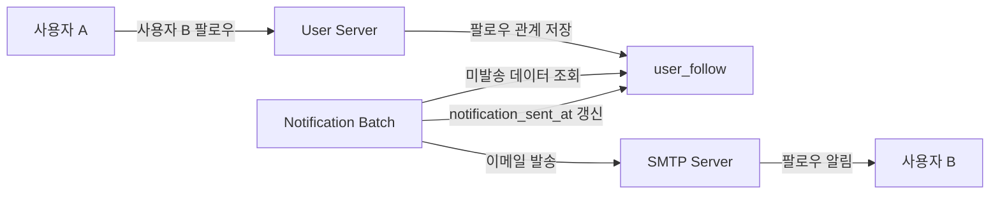
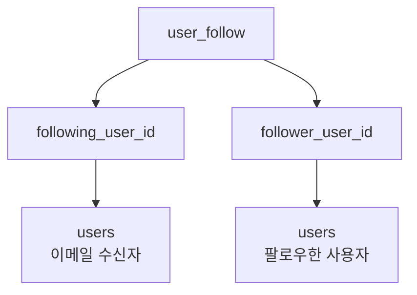
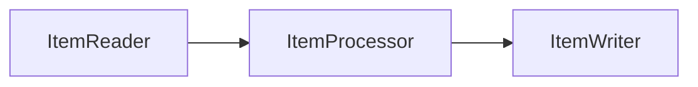
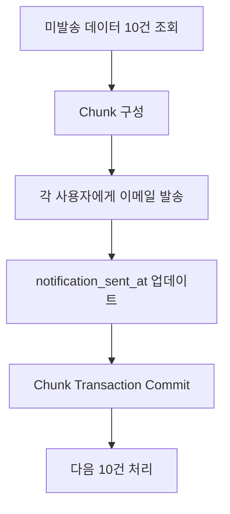
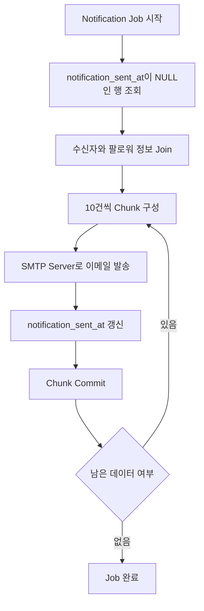
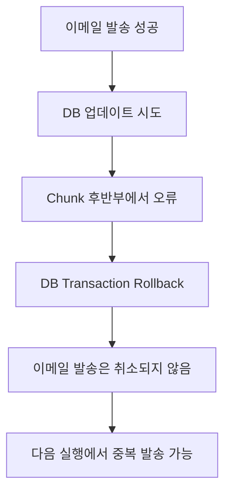
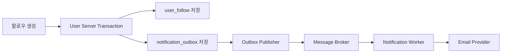

# Ch 5. Notification Batch 개발

# Ch 5. Notification Batch 개발
* toc
{:toc}

---

## 01. Follower 메일 알림 기능 개발 

### Spring Batch로 팔로우 이메일 알림 처리하기

사용자가 다른 사용자를 팔로우하면 팔로우 대상에게 알림을 전달할 수 있다. 이번에는 아직 알림이 전송되지 않은 팔로우 관계를 주기적으로 조회하고, 이메일을 보낸 뒤 처리 시각을 기록하는 Batch 애플리케이션을 만든다.

알림을 사용자 요청 안에서 바로 전송하지 않고 Batch로 분리하면 User Server는 팔로우 관계 저장에만 집중할 수 있다. SMTP Server가 느리거나 일시적으로 응답하지 않아도 팔로우 API의 응답 시간이 직접 영향을 받지 않는다는 장점도 있다.



#### 처리 대상 데이터

앞에서 만든 `user_follow` 테이블에는 다음 정보가 저장되어 있다.

| 컬럼 | 의미 |
|---|---|
| `follow_id` | 팔로우 관계의 기본 키 |
| `follower_user_id` | 팔로우를 요청한 사용자 |
| `following_user_id` | 팔로우 대상 사용자 |
| `followed_at` | 팔로우가 시작된 시각 |
| `notification_sent_at` | 알림 메일 전송 완료 시각 |

사용자 1이 사용자 2를 팔로우했다면 사용자 2가 이메일 수신자이고 사용자 1은 이메일 본문에 표시할 팔로워다.

```text
follower_user_id = 1
following_user_id = 2
```

Batch는 `notification_sent_at IS NULL`인 행만 조회한다. 메일 전송 후 해당 컬럼에 시간을 기록하면 다음 실행에서는 조회 대상에서 제외된다.

#### 테이블과 인덱스 확인

`notification_sent_at` 컬럼이 없다면 다음과 같이 추가한다.

```sql
ALTER TABLE user_follow
    ADD COLUMN notification_sent_at DATETIME(6) NULL;
```

미처리 데이터를 효율적으로 찾을 수 있도록 인덱스도 추가한다.

```sql
CREATE INDEX idx_user_follow_notification
    ON user_follow (
        notification_sent_at,
        follow_id
    );
```

Batch가 사용할 조회 쿼리는 다음과 같은 형태다.

```sql
SELECT
    f.follow_id,
    recipient.email AS recipient_email,
    recipient.username AS recipient_username,
    follower.user_id AS follower_user_id,
    follower.username AS follower_username,
    f.followed_at
FROM user_follow f
JOIN users recipient
  ON recipient.user_id = f.following_user_id
JOIN users follower
  ON follower.user_id = f.follower_user_id
WHERE f.notification_sent_at IS NULL
ORDER BY f.follow_id;
```

같은 `users` 테이블을 두 번 Join하는 이유는 수신자와 팔로워가 서로 다른 사용자이기 때문이다.



#### Notification Batch 프로젝트 의존성

Notification Batch는 JPA 대신 JDBC로 데이터를 조회하고 수정한다.

```groovy
dependencies {
    implementation 'org.springframework.boot:spring-boot-starter-batch'
    implementation 'org.springframework.boot:spring-boot-starter-jdbc'
    implementation 'org.springframework.boot:spring-boot-starter-mail'
    implementation 'org.springframework.boot:spring-boot-starter-validation'

    runtimeOnly 'com.mysql:mysql-connector-j'

    testImplementation 'org.springframework.boot:spring-boot-starter-test'
    testImplementation 'org.springframework.batch:spring-batch-test'
}
```

각 의존성의 역할은 다음과 같다.

| 의존성 | 역할 |
|---|---|
| Spring Batch | Job, Step, ItemReader, ItemWriter 실행 |
| Spring JDBC | `JdbcTemplate`과 `DataSource` 제공 |
| Spring Mail | `JavaMailSender`를 이용한 SMTP 전송 |
| MySQL Driver | MySQL 연결 |
| Spring Batch Test | Job과 Step 테스트 지원 |

#### 애플리케이션 설정

Batch는 HTTP 요청을 처리하는 서버가 아니므로 Web Application으로 실행할 필요가 없다.

```yaml
spring:
  application:
    name: notification-batch
  main:
    web-application-type: none
  datasource:
    url: ${DB_URL}
    username: ${DB_USERNAME}
    password: ${DB_PASSWORD}
    driver-class-name: com.mysql.cj.jdbc.Driver
  batch:
    job:
      enabled: true
    jdbc:
      initialize-schema: ${BATCH_INITIALIZE_SCHEMA:never}
  mail:
    host: ${SMTP_HOST}
    port: ${SMTP_PORT:587}
    username: ${SMTP_USERNAME}
    password: ${SMTP_PASSWORD}
    properties:
      mail:
        smtp:
          auth: true
          starttls:
            enable: true
            required: true
          connectiontimeout: 5000
          timeout: 5000
          writetimeout: 5000

app:
  notification:
    mail:
      from-address: ${MAIL_FROM_ADDRESS}
```

SMTP 비밀번호와 데이터베이스 비밀번호는 Kubernetes Secret으로 관리해야 한다. `application.yml`이나 Git 저장소에 실제 값을 작성하면 안 된다.

##### Spring Batch Metadata Table

Spring Batch는 Job 실행 이력을 다음과 같은 Metadata Table에 저장한다.

- `BATCH_JOB_INSTANCE`
- `BATCH_JOB_EXECUTION`
- `BATCH_JOB_EXECUTION_PARAMS`
- `BATCH_STEP_EXECUTION`
- `BATCH_JOB_EXECUTION_CONTEXT`
- `BATCH_STEP_EXECUTION_CONTEXT`

개발 환경에서 최초 실행할 때만 다음 환경 변수를 사용할 수 있다.

```text
BATCH_INITIALIZE_SCHEMA=always
```

운영 환경에서 `always`를 계속 사용하기보다 Flyway나 Liquibase로 Metadata Table을 명시적으로 관리하는 편이 안전하다.

#### SMTP Server 선택

메일 발송에는 SMTP Server가 필요하다. 직접 구축한 SMTP Server나 Gmail SMTP를 사용할 수도 있지만, AWS 환경에서는 Amazon SES를 사용할 수 있다.

Amazon SES를 사용할 때는 다음 정보가 필요하다.

- SMTP Endpoint
- SMTP Port
- SMTP Username
- SMTP Password
- 인증된 발신자 주소
- 사용 Region
- Sandbox 여부

SES SMTP 자격 증명은 일반 AWS Access Key와 동일하지 않다. SES에서 별도로 SMTP 자격 증명을 생성해 사용해야 한다.

Sandbox 환경에서는 발신자뿐 아니라 수신자 주소도 인증이 필요할 수 있다. 실제 사용자에게 메일을 보내려면 운영 사용 승인을 받아야 한다.

#### 발신자 설정 클래스

발신자 주소를 Java 코드에 직접 작성하지 않고 외부 설정으로 분리한다.

```java
package com.sns.notification.config;

import jakarta.validation.constraints.Email;
import jakarta.validation.constraints.NotBlank;
import org.springframework.boot.context.properties.ConfigurationProperties;
import org.springframework.validation.annotation.Validated;

@Validated
@ConfigurationProperties(
    prefix = "app.notification.mail"
)
public record NotificationMailProperties(

    @NotBlank
    @Email
    String fromAddress
) {
}
```

애플리케이션 진입점에서 Configuration Properties Scan을 활성화한다.

```java
package com.sns.notification;

import org.springframework.batch.core.configuration.annotation.EnableBatchProcessing;
import org.springframework.boot.SpringApplication;
import org.springframework.boot.autoconfigure.SpringBootApplication;
import org.springframework.boot.context.properties.ConfigurationPropertiesScan;

@ConfigurationPropertiesScan
@EnableBatchProcessing
@SpringBootApplication
public class NotificationBatchApplication {

    public static void main(String[] args) {
        SpringApplication.run(
            NotificationBatchApplication.class,
            args
        );
    }
}
```

프로젝트의 Spring Boot와 Spring Batch 구성에 따라 `@EnableBatchProcessing` 없이 자동 설정을 사용할 수도 있다. 직접 Batch Infrastructure를 구성하지 않는다면 Spring Boot 자동 설정을 우선 사용하는 편이 단순하다.

#### NotificationInfo 작성

Reader가 조회한 한 건의 알림 대상 데이터를 표현한다.

```java
package com.sns.notification.batch;

import java.time.Instant;

public record NotificationInfo(
    Long followId,
    String recipientEmail,
    String recipientUsername,
    Long followerUserId,
    String followerUsername,
    Instant followedAt
) {
}
```

- `recipientEmail`: 메일을 받을 사용자의 주소
- `recipientUsername`: 메일을 받을 사용자의 이름
- `followerUsername`: 새롭게 팔로우한 사용자의 이름
- `followId`: 발송 완료 후 업데이트할 팔로우 관계 ID

#### JdbcCursorItemReader 작성

```java
package com.sns.notification.batch;

import org.springframework.batch.item.database.JdbcCursorItemReader;
import org.springframework.batch.item.database.builder.JdbcCursorItemReaderBuilder;
import org.springframework.context.annotation.Bean;
import org.springframework.context.annotation.Configuration;

import javax.sql.DataSource;
import java.sql.Timestamp;

@Configuration
public class NotificationBatchConfig {

    @Bean
    public JdbcCursorItemReader<NotificationInfo>
    notificationReader(DataSource dataSource) {
        String sql = """
            SELECT
                f.follow_id,
                recipient.email
                    AS recipient_email,
                recipient.username
                    AS recipient_username,
                follower.user_id
                    AS follower_user_id,
                follower.username
                    AS follower_username,
                f.followed_at
            FROM user_follow f
            JOIN users recipient
              ON recipient.user_id =
                 f.following_user_id
            JOIN users follower
              ON follower.user_id =
                 f.follower_user_id
            WHERE f.notification_sent_at IS NULL
            ORDER BY f.follow_id
            """;

        return new JdbcCursorItemReaderBuilder
            <NotificationInfo>()
            .name("notificationReader")
            .dataSource(dataSource)
            .sql(sql)
            .fetchSize(100)
            .rowMapper((resultSet, rowNumber) -> {
                Timestamp followedAt = resultSet
                    .getTimestamp("followed_at");

                return new NotificationInfo(
                    resultSet.getLong("follow_id"),
                    resultSet.getString(
                        "recipient_email"
                    ),
                    resultSet.getString(
                        "recipient_username"
                    ),
                    resultSet.getLong(
                        "follower_user_id"
                    ),
                    resultSet.getString(
                        "follower_username"
                    ),
                    followedAt.toInstant()
                );
            })
            .saveState(true)
            .build();
    }
}
```

`BeanPropertyRowMapper`를 사용할 수도 있지만 SQL Alias와 Java 필드 이름이 조금만 달라도 Mapping 오류가 발생할 수 있다. Batch 데이터는 명시적인 `RowMapper`로 변환하면 어떤 컬럼이 어떤 필드로 들어가는지 확인하기 쉽다.

##### Cursor Reader의 특징

`JdbcCursorItemReader`는 데이터베이스 Cursor를 열어 두고 행을 순차적으로 읽는다.

장점은 구현이 단순하고 순차 처리에 적합하다는 것이다. 반면 Batch 처리 시간이 길어지면 데이터베이스 Connection을 오래 점유할 수 있다.

처리 대상이 많아지면 다음 대안을 검토할 수 있다.

- `JdbcPagingItemReader`
- 일정 범위의 `follow_id`를 이용한 Keyset Paging
- 미처리 데이터를 Queue로 전달
- 팔로우 생성 이벤트 기반 처리

#### ItemWriter 작성

Writer는 이메일을 발송하고, 성공한 데이터의 `notification_sent_at`을 갱신한다.

```java
package com.sns.notification.batch;

import com.sns.notification.config.NotificationMailProperties;
import org.springframework.batch.item.ItemWriter;
import org.springframework.context.annotation.Bean;
import org.springframework.jdbc.core.JdbcTemplate;
import org.springframework.mail.SimpleMailMessage;
import org.springframework.mail.javamail.JavaMailSender;
import org.springframework.stereotype.Component;

import java.sql.Timestamp;
import java.time.Instant;

@Component
public class NotificationWriterConfig {

    @Bean
    public ItemWriter<NotificationInfo>
    notificationWriter(
        JavaMailSender mailSender,
        JdbcTemplate jdbcTemplate,
        NotificationMailProperties mailProperties
    ) {
        return chunk -> {
            for (NotificationInfo item : chunk) {
                SimpleMailMessage message =
                    createMessage(item, mailProperties);

                mailSender.send(message);

                int updatedRows = jdbcTemplate.update(
                    """
                    UPDATE user_follow
                    SET notification_sent_at = ?
                    WHERE follow_id = ?
                      AND notification_sent_at IS NULL
                    """,
                    Timestamp.from(Instant.now()),
                    item.followId()
                );

                if (updatedRows != 1) {
                    throw new IllegalStateException(
                        "알림 처리 상태를 갱신하지 못했습니다. "
                            + "followId="
                            + item.followId()
                    );
                }
            }
        };
    }

    private SimpleMailMessage createMessage(
        NotificationInfo item,
        NotificationMailProperties properties
    ) {
        SimpleMailMessage message =
            new SimpleMailMessage();

        message.setFrom(properties.fromAddress());
        message.setTo(item.recipientEmail());
        message.setSubject("새로운 팔로워가 생겼습니다.");
        message.setText(
            item.recipientUsername()
                + "님, "
                + item.followerUsername()
                + "님이 회원님을 팔로우하기 "
                + "시작했습니다."
        );

        return message;
    }
}
```

메일 발송에 성공한 뒤에만 `notification_sent_at`을 기록한다. SMTP 전송 과정에서 예외가 발생하면 해당 업데이트는 실행되지 않고 Step이 실패한다.

발신자 주소는 SES에서 인증된 주소여야 한다. 코드에 이메일 주소를 직접 작성하지 않고 환경 변수로 전달한다.

#### ItemProcessor를 생략한 이유

Spring Batch의 일반적인 Chunk 처리 구조는 다음과 같다.



이번 작업은 Reader에서 이메일 발송에 필요한 데이터를 모두 구성하고 별도의 변환도 필요하지 않다. 따라서 ItemProcessor 없이 Reader와 Writer만 연결한다.

처리 과정에서 다음 기능이 필요해지면 Processor를 추가할 수 있다.

- 알림 수신 동의 확인
- 이메일 주소 Masking 또는 검증
- 알림 Template 선택
- 언어별 메시지 구성
- 차단 사용자 필터링
- 중복 알림 병합

#### Step 작성

```java
package com.sns.notification.batch;

import org.springframework.batch.core.Step;
import org.springframework.batch.core.repository.JobRepository;
import org.springframework.batch.core.step.builder.StepBuilder;
import org.springframework.batch.item.ItemReader;
import org.springframework.batch.item.ItemWriter;
import org.springframework.beans.factory.annotation.Qualifier;
import org.springframework.context.annotation.Bean;
import org.springframework.context.annotation.Configuration;
import org.springframework.transaction.PlatformTransactionManager;

@Configuration
public class NotificationStepConfig {

    @Bean
    public Step notificationStep(
        JobRepository jobRepository,
        PlatformTransactionManager transactionManager,
        @Qualifier("notificationReader")
        ItemReader<NotificationInfo> reader,
        @Qualifier("notificationWriter")
        ItemWriter<NotificationInfo> writer
    ) {
        return new StepBuilder(
            "notificationStep",
            jobRepository
        )
            .<NotificationInfo, NotificationInfo>chunk(
                10,
                transactionManager
            )
            .reader(reader)
            .writer(writer)
            .build();
    }
}
```

Chunk 크기를 10으로 설정했으므로 다음 순서로 동작한다.



Chunk 크기가 크면 Commit 횟수가 줄어들지만 한 Chunk가 실패했을 때 다시 처리해야 하는 범위가 커진다. 이메일처럼 외부 시스템에 부수 효과를 만드는 작업은 일반적인 데이터베이스 Batch와 다르게 봐야 한다.

#### Job 작성

```java
package com.sns.notification.batch;

import org.springframework.batch.core.Job;
import org.springframework.batch.core.Step;
import org.springframework.batch.core.job.builder.JobBuilder;
import org.springframework.batch.core.launch.support.RunIdIncrementer;
import org.springframework.batch.core.repository.JobRepository;
import org.springframework.beans.factory.annotation.Qualifier;
import org.springframework.context.annotation.Bean;
import org.springframework.context.annotation.Configuration;

@Configuration
public class NotificationJobConfig {

    @Bean
    public Job notificationJob(
        JobRepository jobRepository,
        @Qualifier("notificationStep")
        Step notificationStep
    ) {
        return new JobBuilder(
            "notificationJob",
            jobRepository
        )
            .incrementer(new RunIdIncrementer())
            .start(notificationStep)
            .build();
    }
}
```

Spring Batch는 Job 이름과 Job Parameter 조합으로 JobInstance를 식별한다.

매번 같은 Parameter로 실행하면 이미 완료된 JobInstance라는 이유로 다시 실행되지 않을 수 있다. `RunIdIncrementer`는 실행할 때마다 증가하는 `run.id`를 추가해 새로운 JobInstance로 처리할 수 있게 한다.

단, `RunIdIncrementer`가 메일 중복 발송을 막아주는 것은 아니다. 메일 발송 대상은 `notification_sent_at IS NULL` 조건으로 구분한다.

#### Batch 전체 실행 흐름



#### 이메일과 데이터베이스 Transaction의 차이

메일 발송과 데이터베이스 업데이트는 하나의 원자적 Transaction으로 묶이지 않는다.

다음 상황을 가정할 수 있다.

1. Chunk에 10건이 포함된다.
2. 앞의 9건은 이메일 발송에 성공한다.
3. 10번째 이메일 발송에서 오류가 발생한다.
4. Chunk의 데이터베이스 Transaction이 Rollback된다.
5. 앞의 9건에 대한 `notification_sent_at`도 다시 `NULL`이 된다.
6. 다음 실행에서 앞의 9건에 이메일이 다시 발송될 수 있다.



SMTP 전송은 데이터베이스 Transaction이 Rollback돼도 취소되지 않는다. 따라서 `notification_sent_at`만으로 정확히 한 번 전송을 보장할 수는 없다.

이번 구현은 학습을 위한 단순한 구조이며, 실질적으로는 최소 한 번 전송에 가까운 동작을 한다.

#### 중복 발송을 줄이는 방법

##### Chunk 크기를 1로 설정

```java
.<NotificationInfo, NotificationInfo>chunk(
    1,
    transactionManager
)
```

한 건 실패했을 때 다른 데이터베이스 업데이트가 함께 Rollback되는 범위를 줄일 수 있다. 다만 메일 전송 직후 프로세스가 종료되는 짧은 구간의 중복 가능성까지 없애지는 못한다.

##### 처리 상태 추가

다음과 같은 상태 컬럼을 둘 수 있다.

```text
PENDING
PROCESSING
SENT
FAILED
```

Worker가 데이터를 가져갈 때 `PROCESSING` 상태로 선점하고 처리 결과에 따라 `SENT` 또는 `FAILED`로 변경한다.

이 경우에도 SMTP 전송 성공 직후 상태 변경 전에 장애가 나면 중복 가능성이 남는다.

##### Idempotency Key 지원

메일 발송 Provider가 Idempotency Key를 지원한다면 `follow_id`를 Key로 사용해 같은 알림이 두 번 처리되지 않게 할 수 있다.

SMTP 자체에는 일반적인 HTTP API와 같은 Idempotency 보장이 없으므로 사용하는 Provider의 기능을 확인해야 한다.

##### Outbox Pattern

User Server의 팔로우 관계 저장 Transaction 안에서 Outbox Event를 함께 저장하고, 별도 Worker가 이벤트를 발행하도록 구성할 수 있다.



이 구조는 팔로우 저장과 알림 작업 생성 사이의 누락을 줄일 수 있다. 그래도 최종 이메일 전송의 중복 가능성은 Consumer와 Provider 수준에서 별도로 다뤄야 한다.

#### Batch 중복 실행 문제

두 개의 Notification Batch가 동시에 실행되면 둘 다 같은 `notification_sent_at IS NULL` 데이터를 읽고 같은 이메일을 보낼 수 있다.

Kubernetes CronJob을 사용할 때는 다음 설정이 중요하다.

```yaml
concurrencyPolicy: Forbid
```

이 설정은 이전 Job이 아직 실행 중일 때 새로운 Job이 겹쳐 실행되는 것을 막는다.

다만 Cluster 장애나 수동 실행까지 포함한 완전한 동시성 제어가 필요하다면 데이터베이스 선점 상태, Lock 또는 Queue 기반 처리가 추가로 필요하다.

#### 데이터 소유권 관점

이번 Batch는 `user_follow`와 `users` 테이블을 직접 조회한다. 구현은 단순하지만 Notification Batch가 User Server의 테이블 구조에 의존하게 된다.

User Server가 테이블명이나 컬럼을 변경하면 Notification Batch도 함께 수정해야 한다.

보다 독립적인 구조가 필요하다면 다음 방식을 고려할 수 있다.

- User Server가 팔로우 이벤트를 발행
- Notification Service가 이벤트 구독
- 알림 전용 데이터 저장소 사용
- Outbox Pattern 적용
- 서비스 간 API를 통한 데이터 조회

학습 단계에서는 같은 데이터베이스를 직접 읽지만, 서비스 경계가 중요한 환경이라면 이벤트 기반 구성이 더 자연스럽다.

#### 빌드 확인

```powershell
.\gradlew.bat clean test
```

Spring Batch Bean 구성이 정상인지 확인한다.

```powershell
.\gradlew.bat bootRun
```

SMTP 설정이 아직 준비되지 않았다면 `JavaMailSender` 호출 단계에서 실패할 수 있다. 이 단계에서는 애플리케이션 Context 생성, Metadata Table 초기화, Reader SQL 문법 등을 먼저 확인할 수 있다.

#### 테스트 데이터 확인

알림 발송 대상이 있는지 확인한다.

```sql
SELECT
    follow_id,
    follower_user_id,
    following_user_id,
    followed_at,
    notification_sent_at
FROM user_follow
WHERE notification_sent_at IS NULL
ORDER BY follow_id;
```

수신자 이메일도 함께 확인한다.

```sql
SELECT
    f.follow_id,
    recipient.username AS recipient_username,
    recipient.email AS recipient_email,
    follower.username AS follower_username,
    f.followed_at
FROM user_follow f
JOIN users recipient
  ON recipient.user_id = f.following_user_id
JOIN users follower
  ON follower.user_id = f.follower_user_id
WHERE f.notification_sent_at IS NULL
ORDER BY f.follow_id;
```

테스트용 이메일 주소가 실제 수신 가능한 주소인지 확인해야 한다. 운영 사용자에게 실수로 테스트 메일을 발송하지 않도록 개발 환경에서는 수신자 Allowlist나 별도 SES Sandbox를 사용하는 것이 좋다.

#### 발송 완료 데이터 확인

메일 발송과 상태 업데이트가 정상적으로 처리되면 다음 쿼리에서 `notification_sent_at` 값이 채워진다.

```sql
SELECT
    follow_id,
    notification_sent_at
FROM user_follow
ORDER BY follow_id;
```

같은 Batch를 다시 실행했을 때 이미 처리된 행이 조회되지 않는지도 확인한다.

#### 컨테이너 이미지 빌드

Notification Batch의 첫 번째 이미지를 `0.0.1`로 빌드한다.

```powershell
.\gradlew.bat clean test jib `
  -Djib.to.image=<AWS_ACCOUNT_ID>.dkr.ecr.<REGION>.amazonaws.com/notification-batch:0.0.1
```

ECR 인증이 만료됐다면 다시 로그인한다.

```powershell
aws ecr get-login-password --region <REGION> |
    docker login `
        --username AWS `
        --password-stdin `
        <AWS_ACCOUNT_ID>.dkr.ecr.<REGION>.amazonaws.com
```

이미지 Push가 끝나면 다음 단계에서 SMTP 설정을 ConfigMap과 Secret으로 분리하고, Kubernetes CronJob을 이용해 주기적으로 실행할 수 있다.

#### 실패 상황과 원인

##### Batch Metadata Table이 없다는 오류

```text
Table 'BATCH_JOB_INSTANCE' doesn't exist
```

개발 환경에서 Schema 초기화 설정을 확인한다.

```text
BATCH_INITIALIZE_SCHEMA=always
```

운영 환경에서는 자동 생성을 반복해서 사용하는 대신 Migration 도구로 Metadata Table을 관리한다.

##### Reader SQL에서 컬럼 오류가 발생하는 경우

```text
Unknown column
```

다음 항목을 확인한다.

- 실제 테이블명이 `user_follow`인가
- 사용자 테이블명이 `users`인가
- `follower_user_id`와 `following_user_id`가 반대로 사용되지 않았는가
- `notification_sent_at` 컬럼이 생성되어 있는가
- SQL Alias와 RowMapper의 컬럼명이 일치하는가

##### SMTP 인증에 실패하는 경우

```text
Authentication failed
```

다음 항목을 확인한다.

- SMTP Username과 Password가 올바른가
- 일반 AWS Access Key를 사용하지 않았는가
- SES SMTP 자격 증명을 사용했는가
- SMTP Endpoint의 Region이 맞는가
- TLS 설정과 Port가 맞는가
- Secret 값에 불필요한 줄바꿈이 포함되지 않았는가

##### 발신자 주소 오류

SES에서 인증되지 않은 주소를 `From`으로 사용하면 메일 발송이 거절될 수 있다.

`MAIL_FROM_ADDRESS`에는 실제로 인증된 주소를 지정해야 한다.

##### 메일은 왔지만 `notification_sent_at`이 비어 있는 경우

메일 전송 후 데이터베이스 업데이트 과정에서 오류가 발생했을 가능성이 있다. 다음 실행에서 같은 메일이 다시 발송될 수 있으므로 원인을 확인한 뒤 재실행해야 한다.

##### Batch가 두 번 실행되는 경우

Kubernetes CronJob의 동시 실행 정책과 현재 실행 중인 Job을 확인해야 한다.

```shell
kubectl get cronjob,job,pod -n sns
```

수동 실행과 예약 실행이 겹치지 않았는지도 함께 확인한다.

### 정리

새로운 팔로워가 생겼을 때 이메일을 발송하는 Notification Batch의 기본 구조를 구현했다.

- `notification_sent_at IS NULL`인 팔로우 관계를 알림 대상으로 조회했다.
- 팔로우 대상 사용자와 팔로우한 사용자를 `users` 테이블에서 각각 Join했다.
- `JdbcCursorItemReader`를 이용해 데이터를 순차적으로 읽었다.
- `JavaMailSender`와 `SimpleMailMessage`로 이메일을 발송했다.
- 이메일 발송 후 `JdbcTemplate`으로 `notification_sent_at`을 갱신했다.
- Step은 10건 단위의 Chunk로 구성했다.
- `RunIdIncrementer`를 이용해 Job을 반복 실행할 수 있게 했다.
- Spring Batch Metadata Table은 실행 이력과 재시작 상태를 관리한다.
- SMTP 전송은 데이터베이스 Transaction에 포함되지 않으므로 중복 발송 가능성이 남는다는 점을 확인했다.
- 운영 환경에서는 동시 실행 방지, 재시도, 실패 상태, Idempotency와 Outbox Pattern을 함께 검토해야 한다.
- Notification Batch의 첫 번째 이미지는 `0.0.1`로 빌드해 ECR에 Push할 수 있다.

다음 단계에서는 Amazon SES SMTP 자격 증명을 Kubernetes ConfigMap과 Secret으로 주입하고, CronJob으로 Notification Batch를 주기적으로 실행한다.
