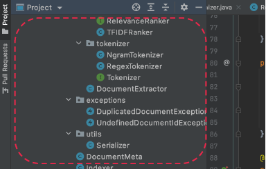
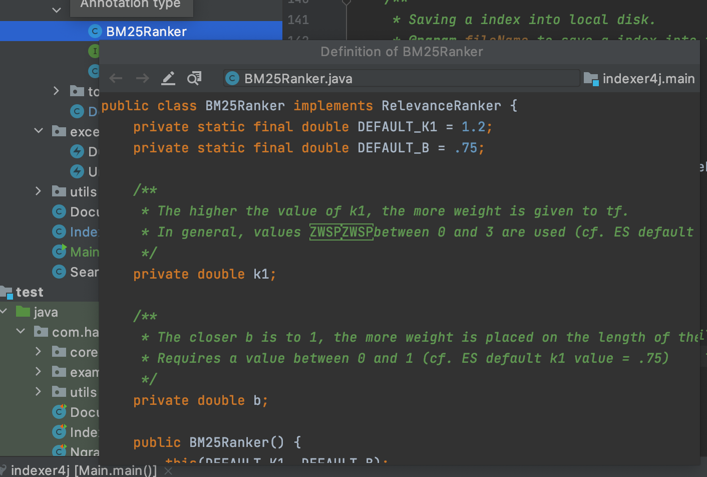
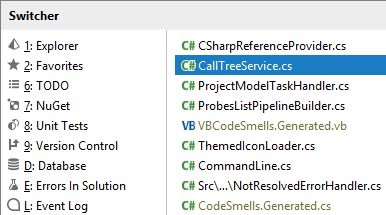
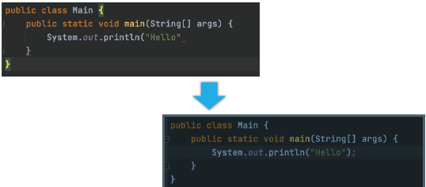

# IntelliJ 가이드

# IntelliJ 가이드
* toc
{:toc}

## 인텔리제이 단축키

### 01. 단축키 기본 I
+ 프로젝트 창 포커스

| 맥   | 윈도우    |
|-----|--------|
| ⌘1  | Alt+1  |

+ 에디터 창으로 돌아오기
  + ESC

+ 프로젝트 창 미리보기
  + Space
  

+ 에디터 창 키우기

| 맥     | 윈도우                |
|-------|--------------------|
| ⇧⌘F12 | ctrl + shift + F12 |

+ 에디터 창 이동

| 맥    | 윈도우        |
|------|------------|
| ⌃tab | ctrl + tab |
  

+ 새 파일 생성

|          | 맥   | 윈도우                 |
|----------|-----|---------------------|
| 에디터에서    | ⌃⌥N | ctrl + alt + Insert |
| 프로젝트 창에서 | ⌘N  | alt + Insert        |

+ 커서 이동

|            | 맥        | 윈도우                |
|------------|----------|--------------------|
| 단어별 이동     | ⌥ + ← →  | ctrl + ← →         |
| 라인 시작/끝 이동 | fn + ← → | home, end          |
| 패이지 위/아래   | fn + ↑ ↓ | page up, page down |

+ 선택 확장/축소

| 맥      | 윈도우                        |
|--------|----------------------------|
| ⌥↑, ⌥↓ | ctrl + W, ctrl + shift + W |

+ 자동 인덴트

| 맥   | 윈도우            |
|-----|----------------|
| ⌃⌥I | ctrl + alt + I |

+ 사용처 찾기

|      | 맥   | 윈도우      |
|------|-----|----------|
| 찾기   | ⌥F7 | alt + F7 |
| 빠른찾기 | ⌘B  | ctrl + B |

+ 파일 검색

|          | 맥       | 윈도우            |
|----------|---------|----------------|
| 찾기       | ⌘F      | ctrl + F       |
| 찾은 결과 이동 | ⌘G, ⌘⇧G | F3, shift + F3 |

+ 경로내 검색

| 맥   | 윈도우              |
|-----|------------------|
| ⌘⇧F | ctrl + shift + F |

+ 전체 검색

| 맥    | 윈도우      |
|------|----------|
| ⇧ 2번 | shift 2번 |

+ 최근 파일 열기

| 맥   | 윈도우      |
|-----|----------|
| ⌘E  | ctrl + E |

### 02. 단축키 기본 II

+ Live template
  + psvm
  + sout
  
| 맥   | 윈도우      |
|-----|----------|
| ⌘J  | ctrl + J |

+ 퀵픽스

| 맥      | 윈도우         |
|--------|-------------|
| ⌘Enter | alt + enter |

+ 코드 이슈 별로 이동

| 맥       | 윈도우          |
|---------|--------------|
| F2, ⇧F2 | F2, Shift+F2 |

+ Import 최적화

| 맥   | 윈도우            |
|-----|----------------|
| ⌃⌥O | ctrl + alt + O |

+ 코드 생성

 | 맥      | 윈도우           |
|--------|---------------|
| ⌘N     | alt + Ins     |

+ 메소드 자동완성

|              | 맥      | 윈도우          |
|--------------|--------|--------------|
| override     | ⌃O     | ctrl + o     |
| implement    | ⌃I     | ctrl + I     |

+ 터미널 창

| 맥        | 윈도우         |
|----------|-------------|
| ⌥F12     | Alt+F12     |

+ 구문 완성

| 맥           | 윈도우                       |
|-------------|---------------------------|
| ⇧⌘Enter     | shift + ctrl + enter      |

+ 대체하기

|          | 맥        | 윈도우                   |
|----------|----------|-----------------------|
| 파일 내 대체  | ⌘R       | ctrl + R              |
| 경로 내 대체  | ⌘⇧R      | ctrl + shift + R      |

+ Run anything

| 맥         | 윈도우           |
|-----------|---------------|
| ⌃ 2번      | ctrl 2번       |

+ 실행

|        | 맥   | 윈도우                |
|--------|-----|--------------------|
| 에디터 실행 | ⌃⇧R | ctrl + shift + F10 |
| 실행     | ⌃R  | shift + F10        |

+ 종료

| 맥   | 윈도우       |
|-----|-----------|
| ⌘F2 | ctrl + F2 |

+ 라인 수정

|     | 맥             | 윈도우               |
|-----|---------------|-------------------|
| 복사  | ⌘D            | ctrl + D          |
| 삭제  | ⌘delete       | ctrl + y          |

+ 파라미터 정보

| 맥       | 윈도우            |
|---------|----------------|
| ⌘P      | ctrl + P       |

+ Quick Definition

| 맥            | 윈도우                     |
|--------------|-------------------------|
| ⌥space       | ctrl + shift + I        |

+ Quick Document

| 맥   | 윈도우        |
|-----|------------|
| F1  | ctrl + Q   |

+ 기능(action) 찾기

| 맥      | 윈도우               |
|--------|-------------------|
| ⇧⌘A    | shift + ctrl + A  |
  
### 단축키 응용
+ 테스트 코드 

|               | 맥    | 윈도우                       |
|---------------|------|---------------------------|
| 생성            | ⌥⏎   | alt + enter               |
| 테스트 코드 이동     | ⇧⌘T  | ctrl + shift + T          |
| 선택된 테스트 실행    | ⌃⇧R  | Ctrl+Shift+F10            |
| 정지            | ⌘F2  | Ctrl+F2                   |

+ 리팩토링

|                | 맥    | 윈도우                    |
|----------------|------|------------------------|
| 클래스 이동         | F6   | F6                     |
| 타입 변경          | ⇧⌘F6 | ctrl + shift + F6      |
| 시그니처 변경        | ⌘F6  | ctrl + F6              |
| 이름 변경          | ⇧F6  | shift + F6             |
| 사용 가능한 리팩토링 옵션 | ⌃T   | ctrl + alt + shift + T |

+ 디버깅

|                      | 맥    | 윈도우               |
|----------------------|------|-------------------|
| 브레이크 포인트 설정          | ⌘F8  | ctrl + F8         |
| 브레이크 포인트 보기          | ⌘⇧F8 | ctrl + shift + F8 |
| 디버깅 모드 실행            | ⌃D   | shift + F9        |
| 에디터 실행               | ⌃⇧D  | 없음                |
| step into (실행 라인 이동) | F7   | F8                |
| step over (다음 라인 이동) | F7   | F8                |
| Resume Program       | ⌘⌥R  | F9                |

+ Git

| 맥   | 윈도우     |
|-----|---------|
| ⌃V  | alt + ` |

