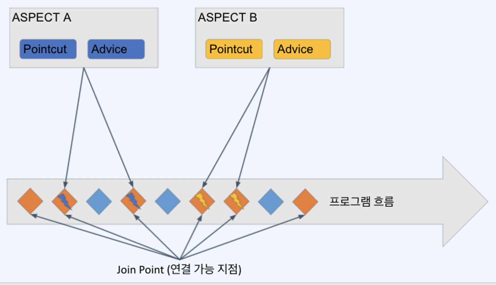

# Part 1. Spring Framework

# Part 1. Spring Framework
* toc
{:toc}

## Ch 01. 강의소개, 프로개발자로 성장하는 법

### 개발자의 소프트 스킬
+ 취직, 이직을 위한 짧은 팁
  + 애매하게 아는 것을 항상 경계해야 한다.
  + 자신이 했던 업무, 프로젝트, 성과를 해당 분야를 전혀 모르는 사람에게 설명할 줄 알아야 한다.
+ 원활한 협업을 위한 업무 스킬
  + 애매하게 아는 것은 물어본다.
  + 질문이 오면 최선을 다해 설명한다.
  + 끊임없이 일정을 확인하고, 다듬어야 한다.

### 개발자의 기초 체력을 키우는 방법
+ 검색을 잘하는 방법
  + 신뢰할 수 있는 사이트: baeldung, medium, github
  + Reference site: spring.io, kotlinlang.org
  + 질의 응답: stackoverflow
  + 조금 더 다양한 토론: reddit
  + google.com
    + 검색도구 사용법(site, filetype), 도구를 활용해서 기간을 확인
+ 에러 코드를 읽는 방법
  + 에러 검색 방법
    + 가장 아래 또는 가장 위 에러부터 천천히 읽어본다.
    + 바로 해결하거나 혹은 구글에 검색해본다. 

### Intellij 소개 및 스프링 프로젝트 살펴보기
+ Intellij 소개
  + 강력한 검색 성능
  + 잘 관리되는 플러그인
  + 유료
+ Spring 프로젝트 살펴보기, 동작시키기
  + src/main/java : 우리가 만들어야할 Java 코드
  + src/main/resources : java코드가 아닌 기타 프로젝트 관련 자료
  + src/test : 테스트 관련된 것들이 main과 동일한 구조로 위치
  + build.gradle : 이 프로젝트가 사용하는 프레임워크와 라이브러리가 버전정보와 함께 포함

## Ch 02. 스프링의 핵심 기술 익히기
[노션으로 이동](https://productive-pullover-f3e.notion.site/6a09636c5dd942a6bb1d8574768e2593?v=b1bc50f032174c10a3c845c2c7ba09ec)

### 자바, 그리고 스프링, 스프링 부트

#### JAVA: 객체지향적 프로그래밍 언어 
+ 우리가 배우게 될 스프링의 근간이 되는 언어
+ 스프링은 자바 뿐 아니라 코틀린, 그루비로도 사용할 수 있다.
+ 스프링 자체는 거의 대부분 자바로 만들어져 있다.
+ [https://github.com/spring-projects/spring-framework](https://github.com/spring-projects/spring-framework)

#### Spring Framework : 기업용 어플리케이션을 만드는데 사용 가능한 오픈소스 프레임워크
+ 자바를 이용해서 어플리케이션을 만들기 위해 활용하는 프레임워크
+ 자바, 서블릿, J2EE >>>>> 스프링 프레임워크
+ 
+ 스프링 내에는 동일한 역할을 하는 다양한 기능이 있으며, 그 중에서 적합한 툴을 선택할 수 있어야한다.

#### Spring boot : 스프링 기반으로 자주 사용되는 설정으로 손쉽게 개발할 수 있게 해주는 상위 프레임워크
+ 스프링(각종 도구가 있는 템플릿)보다 한층 더 편리한 프레임워크
+ 웹 어플리케이션(톰캣 등) 서버 내장
+ 자동 설정, 설정 표준화
+ 원한다면 마음대로 설정할 수 있다.

### 스프링의 Core Technology

#### 스프링 프레임워크 핵심기술
+ 
+ Core (DI, IoC)
  + 스프링의 근간, 내가 만든 클래스를 스프링이 직접 관리하여 어플리케이션을 동작하게 한다.
+ AOP(Aspect Oriented Programming)
  + 공통적인 코드를 프레임워크 레벨에서 지원해주는 방법
+ Validation, Data binding
  + 검증 그리고 외부에서 받은 데이터를 담아내는 방법
+ Resource
  + 스프링 내부에서 설정이 들어있는 파일들에 접근하는 동작 원리
+ SpEL
  + 짧은 표현식을 통해 필요한 데이터나 설정 값을 얻어올 수 있게 하는 특별한 형태의 표현식에 가까운 간편한 언어
+ Null-Safety

#### 스프링의 디자인 철학 
+ 모든 기능에서 다양한 가능성(다양한 모듈)을 사용 가능, 심지어 외부 모듈을 활용 가능
  + 너무 높은 자유도 어떤 점에서는 스프링을 어렵게 하는 요소 
+ 유연하게 계속 추가 개발을 하고 있는 프레임워크
+ 이전 버전과의 강력한 호환성
  + 너무 많은 레거시 때문에 코드의 복잡성이 높아지긴 하다.
+ API 디자인을 섬세하게 노력한다
  + 스프링 코드 자체가 하나의 좋은 참고 소스
+ 높은 코드 품질을 유지하려 한다.
  + 스프링 프로젝트 github은 아주 좋은 참고 소스이자 PR과 이슈 관리도 좋은 프로세스 참고용
+ 한마디로 높은 자유도를 주고 계속 발전하는 고품질의 다양성이 있는 프로젝트, 그런데 너무 자유로워서 때론 어렵다.

### DI - Dependency Injection

#### IoC(Inversion of Control), DI(Dependency Injection)
+ IoC나 DI는 레고와 같은것
  + 스프링이 바닥판처럼 깔려있고, 우리는 그 위에서 멋진 조립(어플리케이션)을 만들면 된다.

#### Bean이란?
+ 자바에서의 javaBean
+ 데이터를 저장하기 위한 구조체로 자바 빈 규약이라는 것을 따르는 구조체
+ private 프로퍼티와 getter/setter로만 데이터를 접근한다.
+ 인수(argument)가 없는 기본 생성자가 있다.

~~~java

public class JavaBean {
  private String id;
  private Integer count;
  public JavaBean(){}
  public String getId() {
    return id;
  }
  public void setId(String id) {
    this.id = id;
  }
  public Integer getCount() {
    return count;
  }
  public void setCount(Integer count) {
    this.count = count;
  }
} 

~~~

#### 스프링에서의 Bean
  + 스프링 IoC 컨테이너에 의해 생성되고 관리되는 객체
  + 자바에서처럼 new Object(); 로 생성하지 않는다
  + 각각의 Bean들 끼리는 서로 편리하게 의존(사용)할 수 있다.
  + 
+ 스프링 컨테이너 개요
  + ApplicationContext 인터페이스를 통해 제공되는 스프링 컨테이너는 Bean 객체의 생성 및 Bean들의 조립(상호 의존성 관리)을 담당한다.
+ Bean의 등록
  + 과거에는 xml로 설정을 따로 관리하여 등록(불편)
  + 현재는 annotation 기반으로 Bean 등록
    + @Bean, @Controller, @Service
+ Bean 등록 시 정보
  + Class 경로
  + Bean 이름
    + 기본적으로는 원 Class 이름에서 첫 문자만 소문자로 변경 
    + 원하는 경우 변경 가능
  + Scope: Bean을 생성하는 규칙
    + singleton: 컨테이너에 단일로 생성
    + prototype: 작업 시마다 Bean을 새로 생성하고 싶을 경우
    + request: http 요청마다 새롭게 Bean을 생성하고 싶은 경우
+ Bean LifeCycle callback(빈 생명주기 콜백함수)
  + callback: 어떤 이벤트가 발생하는 경우 호출되는 메서드 
  + lifecycle callback
    + Bean을 생성하고 초기화하고 파괴하는 등 특정 시점에 호출되도록 정의된 함수
  + 주로 많이 사용되는 콜백
    + @PostConstruct: 빈 생성 시점에 필요한 작업을 수행
    + @PreDestory: 빈 파괴(주로 어플리케이션 종료) 시점에 필요한 작업을 수행

#### References
+ [https://docs.spring.io/spring-framework/docs/current/reference/html/core.html#beans](https://docs.spring.io/spring-framework/docs/current/reference/html/core.html#beans)
+ [https://en.wikipedia.org/wiki/JavaBeans](https://en.wikipedia.org/wiki/JavaBeans)

### AOP

#### 관점 지향 프로그래밍 - Aspect Oriented Programming
+ 특정한 함수 호출 전이나 후에 공통적인 처리가 필요하다면 -> AOP
  + 로깅
  + 트랜젝션
  + 인증
+ OOP로 처리하기에는 다소 까다로운 부분을 AOP라는 처리 방식을 도입하여 손쉽게 공통 기능을 추가/수정/삭제 할 수 있도록 했다.

#### AOP의 기본 개념들
+ Aspect
  + 여러 클래스나 기능에 걸쳐서 있는 관심사, 그리고 그것들을 모듈화 한 것
  + AOP 중에서 가장 많이 활용되는 부분은 @Transactional (트랜젝션 관리) 기능
+ Advice
  + 조언, AOP에서 실제로 적용하는 기능(로깅, 트랜젝션, 인증 등)을 뜻한다.
+ Join point
  + 모듈화된 특정 기능이 실행될 수 있는 연결 포인트
+ Pointcut
  + Join point 중에서 해당 Aspect를 정요할 대상을 뽑을 조건식
+ Target Object
  + Advice가 적용될 대상 오브젝트
+ AOP Proxy
  + 대상 오브젝트에 Aspect를 적용하는 경우 Advice를 덧붙이기 위해 하는 작업을 AOP Porxy라고 한다.
  + 주로 CGLIB(Code Generation Library, 실행 중에 실시간으로 코드를 생성하는 라이브러리) 프록시를 사용하여 프록싱 처리를 한다.
+ Weaving
  + Advice를 비즈니스 로직 코드에 삽입하는 것을 말한다.
  + 

#### AspectJ 지원
+ AspectJ는 AOP를 제대로 사용하기 위해 꼭 필요한 라이브러리
+ 기본적으로 제공되는 Spring AOP로는 다양한 기법(Pointcut 등)의 AOP를 사용할 수 없다.
+ Aspect의 생성
    
~~~java
  
package org.xyz;
import org.aspectj.lang.annotation.Aspect;

@Aspect
@Component  // Component를 붙인 것은 해당 Aspect를 스프링의 Bean으로 등록해서 사용하기 위함
public class UsefulAspect {

}
  
~~~
  
+ Pointcut 선언
  + 해당 Aspect의 Advice(실행할 액션)이 적용될 Join point를 찾기 위한 패턴 또는 조건 생성
  + 포인트 컷 표현식이라고 부른다.
  
~~~java

package org.xyz;
import org.aspectj.lang.annotation.Aspect;

@Aspect
@Component  // Component를 붙인 것은 해당 Aspect를 스프링의 Bean으로 등록해서 사용하기 위함
public class UsefulAspect {
    @Pointcut("execution(* transfer(..))")
    private void anyOldTransfer() {}
}

~~~

+ Pointcut 결합

~~~java

package org.xyz;
import org.aspectj.lang.annotation.Aspect;

@Aspect
@Component  // Component를 붙인 것은 해당 Aspect를 스프링의 Bean으로 등록해서 사용하기 위함
public class UsefulAspect {

    @Pointcut("execution(public * *(..))")
    private void anyPublicOperation() {} //public 메서드 대상 포인트 컷

    @Pointcut("within(com.xyz.myapp.trading..*)")
    private void inTrading() {} // 특정 패키지 대상 포인트 컷
    
    @Pointcut("anyPublicOperation() && inTrading()")
    private void tradingOperation() {} // 위의 두 조건을 and(&&) 조건으로 결합한 포인트 컷
}

~~~
  
#### Advice 정의
+ 포인트컷들을 활용하여 포인트컷의 전/후/주변에서 실행될 액션을 정의한다.
+ Before Advice
  + dataAccessOperation()이라는 미리 정의된 포인트 컷의 바로 전에 doAccessCheck가 실행

~~~java

import org.aspectj.lang.annotation.Aspect;
import org.aspectj.lang.annotation.Before;

@Aspect
public class BeforeExample {

    @Before("com.xyz.myapp.CommonPointcuts.dataAccessOperation()")
    public void doAccessCheck() {
        
    }
}

~~~

+ After Returning Advice
  + dataAccessOperation()라는 미리 정의된 포인트컷에서 return이 발생된 후 실행

~~~java

import org.aspectj.lang.annotation.Aspect;
import org.aspectj.lang.annotation.AfterReturning;

@Aspect
public class AfterReturningExample {

    @AfterReturning("com.xyz.myapp.CommonPointcuts.dataAccessOperation()")
    public void doAccessCheck() {
        
    }
}

~~~
  
+ Around Advice
  + businessService()라는 포인트컷의 전/후에 필요한 동작을 추가

~~~java

import org.aspectj.lang.annotation.Aspect;
import org.aspectj.lang.annotation.Around;
import org.aspectj.lang.ProceedingJoinPoint;

@Aspect
public class AroundExample {

    @Around("com.xyz.myapp.CommonPointcuts.businessService()")
    public Object doBasicProfiling(ProceedingJoinPoint pjp) throws Throwable {
        // start stopwatch
        Object retVal = pjp.proceed();
        // stop stopwatch
        return retVal;
    }
}

~~~

#### References
+ [https://docs.spring.io/spring-framework/docs/current/reference/html/core.html#aop](https://docs.spring.io/spring-framework/docs/current/reference/html/core.html#aop)

### Validation, Data binding

#### Validation in spring

##### Validation 이란?
+ 한국말로는 유효성 검증
+ 주로 사용자 또는 서버의 요쳥(http request) 내용에서 잘못된 내용이 있는지 확인하는 단계를 뜻한다.

##### Validation 종류
+ 학문적으로 여러 세부적인 단계들이 있기도 하지만 실제로 개발자가 주로 챙겨야 하는 검증은 크게 두 종류로 나뉜다.
+ 데이터 검증
  + 필수 데이터의 존재 유무
  + 문자열의 길이나 숫자형 데이터의 경우 값의 범위 
  + email, 신용카드 번호 등 특정 형식에 맞춘 데이터
+ 비즈니스 검증
  + 서비스 정책에 따라 데이터를 확인하여 검증
  + 경우에 따라 외부 API를 호출하거나 DB의 데이터까지 조회하여 검증하는 경우도 존재

##### Spring의 Validation
+ 스프링은 웹 레이어에 종속적이지 않는 방법으로 벨리데이션을 하려고 의도하고 있으면 주로 아래 두가지 방법을 활용하여 밸리데이션 진행(둘다 데이터 검증에 가깝다)
+ Java Bean Validation
  + JavaBean 기반으로 간편하게 개별 데이터를 검증
  + 요즘에 가장 많이 활용되는 방법 중 하나이며, 아래 코드처럼 JavaBean 내에 애노테이션으로 검증방법을 명시한다.
    
~~~java
  
public class MemberCreationRequest {
    @NotBlank(message="이름을 입력해주세요.")
    @Size(max=64, message="이름의 최대 길이는 64자 입니다.")
    private String name;
    @Min(0, "나이는 0보다 커야 합니다.")
    private int age;
    @Email("이메일 형식이 잘못되었습니다.")
    private int email;
  
    // the usual getters and setters...
}
  
~~~
    
+ @Vaild 어노테이션을 해당 @RequestBody에 달게 되면, Java Bean Validation을 수행한 후 문제가 없을 때문 메서드 내부로 진입이 된다.
  + 검증 중 실패가 발생하면 : MehodArgumentNotVaildException 발생
      
+ Spring validator 인터페이스 구현을 통한 validation

~~~java

public class Person {

    private String name;
    private int age;

    // the usual getters and setters...
}

~~~
  
+ Person이라는 javaBean 객체가 있을 때, 아래는 해당 인터페이스에서만 활용되는 validator이다.
+ 인터페이스에 있는 두개의 메서드는 아래와 같은 역활을 한다.
  + supports: 이 validator가 동작할 조건을 정의, 주로 class의 타입을 비교
  + validate: 원하는 검증을 진행한다.

~~~java

public class PersonValidator implements Validator {

    /**
     * This Validator validates only Person instances
     */
    public boolean supports(Class clazz) {
        return Person.class.equals(clazz);
    }

    public void validate(Object obj, Errors e) {
        ValidationUtils.rejectIfEmpty(e, "name", "name.empty");
        Person p = (Person) obj;
        if (p.getAge() < 0) {
            e.rejectValue("age", "negativevalue");
        } else if (p.getAge() > 110) {
            e.rejectValue("age", "too.darn.old");
        }
    }
}

~~~
  
##### Validation 수행 시 주의사항 및 패턴
+ 주의사항
  + validation이 너무 여러 군대에 흩어져있으면 테스트 및 유지보수성이 떨어진다.
    + 중복된 검증: 정책 변경 시에 모든 중복 코드를 수정해야한다.
    + 다른 검증: 여러 군데서 다른 정책을 따르는 검증이 수행될 수 있다.
  + 가능한 validation은 로직 초기에 수행 후 실패 시에는 exception을 던지는 편이 처리가 편리하다.
+ 실무 활용 패턴
  + 강사의 주 사용 패턴
    + 요청 dto에서 Java Bean Validation으로 단순 데이터(유무, 범위, 형식 등)를 1차 검증
    + 로직 초기에 2차로 비즈니스 검증 수행 후 실패 시에는 CustomException(ErrorCode, ErrorMessage를 입력)해서 예외를 던지도록 하고 예외 처리하여 응답 생성
+ Spring validator의 (강사가 생각하는) 장단점
  + 장점: Java Bean Validation에 비해 조금 더 복잡한 검증이 가능
  + 단점
    + Validation을 수행하는 코드를 찾기가 (상대적으로) 어렵다.
    + 완전히 데이터만 검증하는 것이 아니기 때문에 일부 비즈니스적인 검증이 들어가는 경우가 있다.
      + 이 경우 비즈니스 검증 로직이 여러 군대로 흩어지기 때문에 잘못된 검증(중복 검증, 다른 정책을 따르는 검증)을 수행할 가능성이 높아진다.

#### Data Binding
+ 사용자나 외부 서버의 요청 데이터를 특정 도메인 객체에 저장해서 우리 프로그램에 Request에 담아주는 것을 뜻한다.

##### Converter(S, T) Interface
+ S(Source)라는 타입을 받아서 T(Target)이라는 타입으로 변환해주는 Interface

~~~java

package org.springframework.core.convert.converter;

public interface Converter<S, T> {

    T convert(S source);
}

~~~
  
+ 강사가 활용해봤던 경험으로는 파라미터에 json 형식 문자열이 담겨오는 경우 해당 문자열을 곧바로 특정 dto에 담고 싶을 때 사용

~~~java

// 요청
GET /user-info
x-auth-user : {"id":123, "name":"Paul"}

// 유저 객체
public class XAuthUser {
    private int id;
    private String name;

    // the usual getters and setters...
}

@GetMapping("/user-info")
public UserInfoResponse getUserInfo(
    @RequestHeader("x-auth-user") XAuthUser xAuthUser){

    // get User Info logic here...
}

~~~
  
+ 위처럼 헤더에 담긴 json 형식 문제열을 XAuthUser에 바로 담고 싶은 경우 아래와 같이 Converter를 Bean으로 등록하면 된다.

~~~java

@Component
public class XAuthUserConverter implements Converter<String, XAuthUser> {
    @Override
    public XAuthUser convert(String source) {
        return objectMapper.readValue(source, XAuthUser.class);
    }
}

~~~

+ 이와 비슷하게 PathParamter나 기타 특수한 경우의 데이터를 특정 객체에 담고 싶은 경우
  + Converter를 만들어 Spring에 Bean으로 등록
  + 스프링 내에 ConversionService라는 내장된 서비스에서 Converter 구현체 Bean들을 Converter 리스트에 등록
  + 외부데이터가 들어오고 Source Class Type -> Target Class Type이 Converter에 등록된 형식과 일치하면 해당 Converter가 동작하는 원리

##### Formatter
+ 특정 객체 <-> String간의 변환을 담당
+ 아래 샘플 코드는 Date <-> String 간의 변환을 수행하는 Formatter이다.
  + print: API 요청에 대한 응답을 줄 때, Date형식으로 된 데이터를 특정 locale에 맞춘 String으로 변환
  + parse: API 요청을 받아올 때, String으로 된 "2022-11-22 12:15:00" 같은 날짜 형식의 데이터를 Date로 변환
  
~~~java

package org.springframework.format.datetime;

public final class DateFormatter implements Formatter<Date> {
    public String print(Date date, Locale locale) {
        return getDateFormat(locale).format(date);
    }

    public Date parse(String formatted, Locale locale) throws ParseException {
        return getDateFormat(locale).parse(formatted);
    }
        // getDateFormat 등 일부 구현은 핵심에 집중하기 위해 생략... 
}

~~~
  
+ Formatter도 Converter와 마찬가지로 Spring Bean으로 등록하면 자동으로 ConversionService에 등록시켜주기 때문에 필요(요청/응답 시 해당 데이터 타입이 있는 경우)에 따라 자동으로 동작하게 된다. 

#### References
  + [https://docs.spring.io/spring-framework/docs/current/reference/html/core.html#validation](https://docs.spring.io/spring-framework/docs/current/reference/html/core.html#validation)

### Resource

#### Spring Resource
  + java.net.URL의 한계(classpath 내부 접근이나 상대경로 등)를 넘어서기 위해 스프링에서 추가로 구현
  + 업무에서는 많이 사용되는 부분은 아니지만, 스프링의 내부 동작을 이해하기 위해서 필요한 부분

##### Resource Interface와 그 구현체들

~~~java

public interface Resource extends InputStreamSource {

    boolean exists();

    boolean isReadable();

    boolean isOpen();

    boolean isFile();

    URL getURL() throws IOException;

    URI getURI() throws IOException;

    File getFile() throws IOException;

    ReadableByteChannel readableChannel() throws IOException;

    long contentLength() throws IOException;

    long lastModified() throws IOException;

    Resource createRelative(String relativePath) throws IOException;

    String getFilename();

    String getDescription();
}

~~~

+ Resource 구현체 목록
  + Spring 내부 Resource 구현체 중 대표적인 몇가지
  + UrlResource
    + java.net.URL을 래핑한 버전, 다양한 종류
  + ClassPathResource
    + classpath(소스코드를 빌드한 결과(기본적으로 target/classes 폴더))하위의 리소스 접근 시 사용
  + FileSystemResource
    + 이름과 같이 File을 다루기 위한 리소스 구현체
  + SevletContextResource, InputStreamResource, ByteArrayResource
    + Sevlet 어플리케이션 루트 하위 파일, InputStream, ByteArrayInput 스트림을 가져오기 위한 구현체
+ Spring ResourceLoader
  + 스프링 프로젝트 내 Resource(파일 등)에 접근할 때 사용하는 기능
  + 기본적으로 applicationContext에서 구현이 되어 있다.
  + 프로젝트 내 파일(주로 classpath 하위 파일)에 접근할 일이 있을 경우 활용
  + 대부분의 사전정의된 파일들은 자동으로 로딩되도록 되어 있으나, 추가로 필요한 파일이 있을 때 이 부분 활용 가능
  
~~~java

@Service
public class ResourceService {
	@Autowired
	ApplicationContext ctx;

	public void setResource() {
		Resource myTemplate = 
			ctx.getResource("classpath:some/resource/path/myTemplate.txt");
			// ctx.getResource("file:/some/resource/path/myTemplate.txt");
			// ctx.getResource("http://myhost.com/resource/path/myTemplate.txt");
		// use myTemplate...
	}
}

~~~

+ ResourcePatternResolver
  + 스프링 ApplicationContext에서 ResourceLoader를 불러올 때 사용하는 Interface
  + 위치 지정자 패턴("classpath:***", "file:***", "http:")에 따라 자동으로 Resource 로더 구현체를 선택

~~~java

public interface ApplicationContext extends EnvironmentCapable, 
		ListableBeanFactory, HierarchicalBeanFactory,
		MessageSource, ApplicationEventPublisher, ResourcePatternResolver {
		// Spring ApplicationContext interface
}

~~~

+ Application Contexts & Resource Paths
  + applicationContext(스프링의 핵심설정)을 이루는 설정값을 가져오는 방법들

~~~java

// let's create an applicationContext
ApplicationContext ctx = new ClassPathXmlApplicationContext("conf/appContext.xml");

ApplicationContext ctx =
    new FileSystemXmlApplicationContext("conf/appContext.xml");

ApplicationContext ctx =
    new FileSystemXmlApplicationContext("classpath:conf/appContext.xml");

// then you can use ctx as a Spring
Bear bear = (Bear) ctx.getBean("bear");

~~~

#### References
+ [https://docs.spring.io/spring-framework/docs/current/reference/html/core.html#resources](https://docs.spring.io/spring-framework/docs/current/reference/html/core.html#resources)

### Spring Expression Language(SpEL)
Expression Language(표현언어)는 짧고 간단한 문법을 통해 필요한 데이터나 설정 값을 얻어올 수 있게 하는 특별한 형태의 표현식에 가까운 간편한 언어(그래프 접근 등 가능)  
SpEl은 그 중에서도 스프링 모든 영역에서 사용 가능한 언어형식이다.
+ 주로 @Value("${config.value}")와 같은 방식으로 설정값을 주입 받는데 활용

#### SpEL의 값 평가(evaluation)

~~~java

ExpressionParser parser = new SpelExpressionParser();
Expression exp = parser.parseExpression("'Hello World'"); 
String message = (String) exp.getValue();  // "Hello World"

Expression expWow = parser.parseExpression("'Hello World'.concat('!')"); 
String messageWow = (String) expWow.getValue();  // "Hello World!"

Expression expString = 
	parser.parseExpression("new String('hello world').toUpperCase()"); 
String messageString = expString.getValue(String.class); // "HELLO WORLD"

~~~

+ SpelParser는 "" 안에 들어있는 문자열을 평가(evaluation)해서 결과값을 만들어 낸다.
+ 'Hello World'는 문자열 리터럴이 되며, concat이라는 메서드도 호출할 수 있다.
+ String 객체를 new로 생성해서 사용도 가능

#### Bean의 Property를 설정할 때 사용하는 방식

~~~java

@Component
public class SimpleComponent {
	@Value("#{ 1+1 }")
	int two; // 2

	@Value("#{ 2 eq 2 }")
	boolean isTrue; // true

	@Value("${ server.hostname }")
	String hostName; // www.server.com

	@Value("#{ ${ server.hostname } eq 'www.server.com'}")
	boolean isHostSame; // true
}

~~~

+ 기본적으로 #{<expression string>} 방식으로 property를 설정
+ application.properties(또는 application.yml)의 값을 가져올 때는 ${ <property name> } 방식으로 가져온다.

#### References
+ [https://docs.spring.io/spring-framework/docs/current/reference/html/core.html#expressions](https://docs.spring.io/spring-framework/docs/current/reference/html/core.html#expressions)

### Null-safety
널 안정성을 높이는 방법
+ 아래와 같은 코드를 만들지 않는 방법
+ 혹은 아래와 같은 널체크를 하지 않아서 발생하는 NPE(Null Pointer Exception)을 방지하는 방법
+ 완벽한 방법은 아니지만 IDE(Intellij, Eclipse)에서 경고를 표시함으로써 1차적인 문제를 방지하고, 정확한 위치를 확인할 수 있도록 도운다.

~~~java

public void method(String request) {
	if(request == null) return;

	// normal process
	System.out.println(request.toUpperCase());
}

~~~

#### @NonNull Annotation
+ 해당 값이나 함수 등이 Null이 아님을 나타내는 어노테이션
+ org.springframework.lang.NonNull 사용
+ 메서드 파라미터에 붙이는 경우: null이라는 데이터가 들어오는 것을 사전에 방지한다.
+ 프로퍼티에 붙이는 경우: null을 저장하는 경우 경고
+ 메서드에 붙이는 경우: null을 리턴하는 경우 경고, 응답값을 저장하거나 활용하는 쪽도 NonNull이라고 신뢰하고 사용

#### @Nullable Annotation
+ @NonNull과 반대로 해당 데이터가 null일 수 있음을 명시한다.
+ 당 어노테이션이 붙은 값을 사용하는 경우 null check를 항상 수행하도록 경고

#### Null 관련 어노테이션 참고
+ [jetbrain(intellij 개발회사)](https://www.jetbrains.com/help/idea/nullable-and-notnull-annotations.html)
+ [lombok](https://projectlombok.org/features/NonNull)

## Ch 03. 예제를 만들며 이해하는 스프링 웹 어플리케이션 핵심 기술

### 롬복 설명
+ 자바 스프링에서 반복적으로 계속 타이핑 해야하는 부분을 간편하게 생성 
+ @Getter: Getter 생성
+ @Setter: Setter 생성
+ @ToString: ToString 생성 
+ @NoArgsConstructor: 아무 argument 가 없는 생성자 생성
+ @AllArgsConstructor: 모든 argument 가 있는 생성자 생성
+ @RequiredArgsConstructor: 필수적인 데이터 argument 가 있는 생성자 생성
  + @NonNull 필드나 final 필드
+ @Data: @Getter @Setter @RequiredArgsConstructor @ToString @EqualsAndHashCode 를 합친거다.
  + 양날의 검 같은 어노테이션 실무에서 잘 사용하지 않는다.
  + 원치 않는 @ToString를 생성할 수도 있다(개인정보)  
+ @Builder: 빌더 패턴을 쉽게 구현해준다.
  + 아토믹하게 객체를 생성해준다. 
+ @Slf4j: 간편하게 로거 사용
+ @UtilityClass: 유틸리티 클래스들은 상속이 불가능해야 한다. 그래서 해당 클래스를 final 클래스로 만들어 주고 그리고 생성자를 private로 만들어준다.

### Http 스펙에 대한 설명

#### HTTP(Hyper Text Transfer Protocol)
+ 그냥 문자가 아닌 Hyper 텍스트를 전송하는데 활용하는 프로토콜(약속된 정의)
+ 요청과 응답의 정의에 대해서만 간략 설명 

#### HTTP Request 메세지 스펙

~~~json

POST /create-developer HTTP/1.1
Content-Type: application/json
Accept: application/json

{
  "developerLevel": "JUNIOR",
  "developerSkillType": "FULL_STACK",
  "experienceYears": 2,
  "memberId": "sunny.flower",
  "name": "sun",
  "age": 36
}

~~~

+ 첫째줄: 요청라인(HTTP 메서드(GET,PUT,POST))
+ 두번째줄부터 줄바꿈 나오기 전까지: Header(User-Agent, Accept 등)
+ 헤더에서 줄바꿈 이후: Request Body

#### HTTP Response 메세지 스펙

~~~json

HTTP/1.1 200 OK
Content-Type: application/json
Transfer-Encoding: chunked
Date: Sat, 17 Jul 2021 15:33:34 GMT
Keep-Alive: timeout=60
Connection: keep-alive

{
  "developerLevel": "JUNIOR",
  "developerSkillType": "FULL_STACK",
  "experienceYears": 2,
  "memberId": "sunny.flo1wer",
  "name": "sun",
  "age": 36
}

~~~

+ 첫째줄: 상태라인(200, 500, 등)
+ 두 번째줄부터 줄바꿈 나오기 전까지: Header
+ 헤더에서 줄바꿈 이후: Request Body

#### Refernce
+ [https://en.wikipedia.org/wiki/Hypertext_Transfer_Protocol](https://en.wikipedia.org/wiki/Hypertext_Transfer_Protocol)
+ [https://developer.mozilla.org/ko/docs/Web/HTTP/Messages](https://developer.mozilla.org/ko/docs/Web/HTTP/Messages)

### 아주 단순한 구조(1 Layer)의 어플리케이션
+ Dependencies
  + Lombok
  + Spring Web
  + H2 Database
  + Spring Data JPA
  + Validation
+ 패키지 구조
  + 회사랑 사람마다 차이가 있을수 있다. 
+ @RestController
  + @Controller 인데 @ResponseBody 를 붙인 컨트롤러

### H2 DB 설명, 간단한 DB 저장 기능 구현
+ H2 DB
  + 메모리 DB로 주로 사용, 파일로도 가능하다. 
  + 편리하게 테스트 가능하다. 
  + 어플리케이션이 죽을때 데이터가 가치 삭제된다. 
  + 간단하게 테스트용으로 사용한다.
+ application.yml h2 console 츨력 설정

~~~yaml

spring:
  h2:
    console:
      enabled: true

~~~

+ JPA의 @CreatedDate, @LastModifiedDate로 등록일 수정일 자동 생성 가능하다.
  + @EnableJpaAuditing 설정해야 한다. 
  + @EntityListeners(AuditingEntityListener.class) 엔티티에 위의 정보를 설정해야한다.
+ 의존성 주입 시 @RequiredArgsConstructor를 사용해서 의존성 주입 시에 생성자로 주입 시 편리하게 사용 가능하다. 
  + @Autowired 보다 테스트가 편리하다.
  + 생성자를 직접 코드를 적어서 주입 시에 코드를 수정해야 하지만 @RequiredArgsConstructor 사용하면 수정하지 않아도 된다. 

### 트랜잭션의 개념
+ ACID
  + Atomic(원자성)
    + 작업이 모두 성공하거나 모두 실패해야 한다. 
  + Consistency(일관성)
    + 모든 DB 테이블의 자료들은 항상 정해진 규칙에 맞춰서 자료가 저장이 되어있어야 하고 트랜잭션이 종료된 시점에는 일괄성이 맞춰 저 있어야 한다.
  + Isolation(고립성)
    + 성능과 TRADE-OFF 하다.
    + 고립이 잘 된 상태로 두게 되면은 서버에서 많은 요청을 받을 수 없다
    + 고립이 떨어진 상태면 성능은 좋아지지만 데이터의 정합성이 떨어진다.
  + Durability(지속성)
    + 커밋이 되는 시점에는 무조건 커밋 된 이력은 무조건 남아 있어야 한다.

### AOP,Transactional