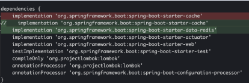

# Part 2. Spring Boot

# Part 2. Spring Boot
* toc
{:toc}

## Start with Boot!

### 프로젝트 셋업
+ git 변경
  + master -> main
+ gitignore.io 에서 gitignore 설정

### OOP로 만든 정렬 구현체 3종
+ 소프트웨어를 OOP로 설계하는 것
  + 소프트웨어를 기능, 논리보다는 데이터, 객체로 설계하는 것
+ 객체 지향 설계 (SOLID)
  + SRP: 한 클래스는 하나의 책임만 가져야 한다.
  + OCP: 소프트웨어 요소는 확장에는 열려 있으나 변경에는 닫혀 있어야 한다.
  + LSP: 프로그램의 객체는 프로그램의 정확성을 깨뜨리지 않으면서 하위 타입의 인스턴스로 바꿀 수 있어야 한다.
  + ISP: 특정 클라이언트를 위한 인터페이스 여러 개가 범용 인터페이스 하나보다 낫다.
  + DIP: 프로그래머는 추상화에 의존해야지, 구체화에 의존하면 안된다.

### Spring의 적용
+ Spring 핵심 기능
  + The IoC Container
  + Resources
  + Validation, Data Binding, and Type Conversion
  + Spring Expression Language (SpEL)
  + Aspect Oriented Programming with Spring
  + Null-safety
  + Logging
+ IoC (Inversion of Control)
  + 전통적인 제어 흐름에 비추어 볼 때, 제어 흐름을 반대로 뒤집은 것 - Wikipedia
  + 라이브러리를 사용할 때는 내 코드가 라이브러리 코드를 호출하지만 프레임워크를 사용할 때는 프레임워크가 내 코드를 호출한다. 
+ Resource
  + low-level resource 에 접근할 수 있는 보다 폭넓은 기능을 제공
  + UrlResource
  + ClassPathResource
  + FileSystemResource
  + PathResource
  + ServletContextResource
  + InputStreamResource
  + ByteArrayResource
+ Validation, Data Binding, Type Conversion
  + 데이터의 검증
  + 데이터를 인식하고 자료형에 할당
  + 데이터 자료형의 변환
+ SpEL
  + 스플링 애플리케이션의 런타임에 다양한 데이터에 접근하기 위한 언어
  + JSP Unified EL 과 유사하지만 스프링에 특화되어 더 다양한 기능을 제공
+ Aspect Oriented Programming with Spring
  + AOP: 관전 지향 프로그래밍 - 공통 기능을 개발자의 코드 밖에서 필요한 시점에 적용 가능
  + AOP 를 적극적으로 사용하고 지원하는 프레임워크
  + Proxy, Aspect, Join Point, Advice, Pointcut, Weaving
  + CGLib, AspectJ
  + AOP 를 사용하지 않아도, 심지어 몰라도 여전히 프레임워크를 사용 가능 
+ Null-safety
  + @Nullable
  + @NonNull
  + @NonNullApi
  + @NonNullFields
+ Logging
  + 별도의 외부 설정 없이 로깅 구현체 사용 가능
  + SLF4J + Logback
  + Log4j 2
  + JUL (java.util.logging)
+ 그 밖에...
  + Testing
  + Data Access
  + Web Servlet
  + Web Reactive
  + Integration: REST endpoints, email, scheduling, cache, ...
+ 종합
  + 스프링은 엔터프라이즈 애플리케이션을 만드는데 필요한 거의 모든 요소를 지원해주는 프레임워크

### Spring Boot의 적용
+ 주요 기능
  + Stand-alone 스프링 어플리케이션
  + 임베디드 톰캣 내장 (WAR 파일 배포 필요 없다.)
  + 빌드 설정을 단순화해줄 기초 세팅과 의존성
  + 스프링 및 서드 파티 라이브러리의 자동 설정
  + 제품 레벨로 사용할 수 있는 각종 기능들 
  + XML 설정 필요 없다
+ 요점
  + 스프링이 할 일과 작성할 코드를 줄여주고 (강력한 프레임워크) 스프링 부트가 그것을 더 줄여주었다 (굿 프랙티스)
+ Spring Boot 이 어울리지 않는 경우
  + 프르그램의 세세한 설정과 설계를 내 손으로 일일이 만져야 한다면
  + 실행 중이 애플리케이션 기저에서 무슨 일이 일어나는지 모조리 알아야 한다면
  + 내가 사용하지 않는 기능은 단 하나라도 프로젝트에 남겨두지 않는 최적화를 원한다면 
  
## 버전별 변천사

### 버전별 변천사 훑어보기: 1 vs 2
+ 주요 변경 사항을 체크하는 경로
  + [Spring Official Blog](https://spring.io/blog/category/releases)
  + [Spring Boot Github](https://github.com/spring-projects/spring-boot/wiki/Spring-Boot-2.0-Release-Notes)
  + [SpringOne Platform Presentation, 2017](https://youtu.be/TasMZsZxLCA)
  + [Baeldung](https://www.baeldung.com/new-spring-boot-2)
  + Quora
  + StackOverflow
  + 각종 기술 블로그들
+ 주요 변경 사항
  + Java 8 (+Java 9) + Spring Framework 5
  + 써드파티 라이브러리 업그레이드 
  + Reactive Spring 
  + Functional APIs 
  + Kotlin 지원 
  + Configuration properties 
  + Gradle 플러그인 
  + Actuator 변경점 
  + Spring Security
+ 기타 변경 사항
  + Spring Boot Properties 변경사항 
  + Jackson 시간 표시 기본값 
  + MySQL auto_increment 
  + HikariCP 
  + JOOQ 
  + GIF banner

#### 주요 변경 사항
+ Java 8 (+ Java 9) + Spring Framework 5
  + Java 8 이 이제 최소 사양
  + Java 9 공식 최초 지원 - 부트 1.x 는 미지원
  + Spring Framework 5
+ 써드파티 라이브러리 업그레이드
  + Tomcat 8.5
  + Flyway 5
  + Hibernate 5.2
  + Thymeleaf 3
  + Elasticsearch 5.6
  + Gradle 4
  + Jetty 9.4
  + Mockito 2.x
+ Reactive Spring 
  + 무엇을 위해 존재하는가?
    + 한정된 자원 (thread pool) 으로
    + 비동기(asynchronous) 넌블록킹(non-blocking) 알고리즘을 이용해
    + 다수의 요청에도 빠르고 예측 가능한 응답 성능(반응)을 실현
  + 리엑티브 지원 모듈
    + Spring WebFlux 
    + Reactive Spring Data
    + Reactive Spring Security
    + Embedded Netty Server
+ Functional APIs
  + WebFlux.fn
  + WebMvc.fn (Spring Framework 5.2)
  + 기존의 스프링 웹애플리케이션을 함수형 스타일로 작성 가능
  + 스프링 기술과 애노테이션에서 분리된 코드
  + 자바 코드 레벨에서 분석 가능
  + 독립적인 유닛 테스트 가능
  + 스프링 컨테이너에서 독립
+ Kotlin 지원
  + 코틀린으로 본격적인 스프링 부트 프로그래밍을 시작
+ Configuration properties
  + 프로퍼티를 쓸 때: Relaxed binding 은 여전히 지원
  + 프로퍼티를 읽을 때: 양식이 통일
    + 엘리먼트 구분: "."
    + 영어 소문자 + 숫자
    + 단어 구분자로 "-" 사용 가능
  + 환경변수(environment variables)에서 컬렉션 데이터의 인덱스 표현 가능
    + MY_VAR_1= a -> my.var[1] = "a"
    + MY_VAR_1_2= b -> my.var[1][2] = "b"
  + 더 편리한 자료형 인식 (ex: java.time.Duration -> "1s", "2m", "5d")
  + Origin 지원: 스프링 부트가 읽은 프로퍼티의 위치를 기억하고, 에러가 나면 알려준다
    + ex: "origin": "class path resource [application.properties]:1:27"
+ Gradle 플러그인
  + 최소 버전: 4.x
  + bootRepackage -> bootJar & bootWar
  + dependency management 기능을 사용하려면, 플러그인을 명시해야 한다
+ Actuator 변경점
  + 보안성 강화: 1.5 에서 기본으로 보여주던 endpoint 를 더이상 보여주지 않음
  + @Endpoints: 커스텀 endpoint 를 환경(MVC, JMX, Jersey..)에 상관 없이 편하게 구현
  + 이름 변화
    + /autoconfig -> /conditions
    + /trace -> /httptrace
+ Spring Security
  + OAuth 2.0 통합
  + 커스텀 설정이 더 쉬워졌다
  + WebSecurityConfigurerAdapter 순서 문제 해결
    + 기본 설정이 하나로 통합됬다
    + WebSecurityConfigurerAdapter 를 추가하면 기본 설정이 꺼진다.
    + 보안이 중요한 기능들은 명시적으로 작성하게끔 변경 (ex: actuator)

#### 기타 변경 사항
+ Spring Boot Properties 변경사항
  + 이름과 구성에 변화
  + spring-boot-properties-migrator
  + JdbcTemplate 제어 옵션 추가: spring.jdbc.template.*
  + Redis 제어 옵션 추가: spring.cache.redis.*
+ MySQL auto_increment
  + Spring Data JPA, @GeneratedValue strategy 기본 동작이 바뀜
  + 기본값: GenerationType.AUTO
    + Spring Boot 1.5: MySQL AUTO == IDENTITY
    + Spring Boot 2.0: MySQL AUTO == TABLE
+ HikariCP
  + Database 커넥션 풀 관리 프레임워크
  + Tomcat Pool -> HikariCP
+ JOOQ
  + Java Object Oriented Querying
  + Datasource 에 맞게 JOOQ dialect 자동 설정
  + @JooqTest 지원
  + 국내에서는 QueryDSL 에 밀리는 분위기
+ GIF banner
  + gif 지원

### 버전별 변천사 훑어보기: 2.1 ~ 2.3

#### Spring Boot 2.1
> + 성능 향상
> + Spring Data JPA: bootstrap-mode
> + JDK 11 + Spring Framework 5.1
> + 주요 버전 업그레이드
> + Deprecations from 2.0
> + New Spring Actuator Endpoints
> + Logging Refinements
> + JUnit
> + Bean Overriding

+ 성능 향상
  + [https://spring.io/blog/2018/12/12/how-fast-is-spring](https://spring.io/blog/2018/12/12/how-fast-is-spring)
  + GC 속도 향상 - 더 빠른 시작 
  + 더 적은 heap 사용
+ Spring Data JPA: bootstrap-mode
  + Spring Data Lovelace
  + lazy initialization
  + spring.data.jpa.repositories.bootstrap-mode=deferred(or lazy)
+ JDK 11 + Spring Framework 5.1
  + Java 11
  + Spring Framework 5.1
+ 주요 버전 업그레이드
  + Tomcat 9
  + Undertow 2
  + Hibernate 5.3
  + JUnit 5.2
  + Micrometer 1.1
+ Deprecations from 2.0
  + setConnectTimeout(int), setReadTimeout(int)
  + data size 를 int 입력 인자로 받던 메소드들은 Datasize 로 변경 및 deprecated
  + management.endpoints.jmx.unique-names -> spring.jmx.unique-names
  + @AutoConfigureMockMvc 의 secure 속성 -> @WithMockUser
  + RestTemplateBuilder.basicAuthorization -> basicAuthentication
  + AbstractFilterRegistrationBean, FilterRegistrationBean
    + as-is: REQUEST_WRAPPER_FILTER_MAX_ORDER
    + to-be: OrderedFilter.REQUEST_WRAPPER_FILTER_MAX_ORDER
+ New Spring Actuator Endpoints
  + /actuator/caches 추가
  + /actuator/integrationgraph 추가
  + /actuator/health 기능 업데이트
    + HealthIndicator 를 런타임에 추가, 삭제 가능
    + 특정 인디케이터만 관찰 가능 (ex: /actuator/health/db)
+ Logging Refinements 
  + logging.level.web=debug
  + spring.http.log-request-details=true
+ JUnit
  + JUnit 5 사용 가능
  + spring-boot-test -> 5.3.1
  + 그러나 기본 세팅은 JUnit 4
  + JUnit 5로 바꾸려면 빌드 설정에 명시해야 함
  + @ExtendWith(SpringExtension.class) 을 모든 부트 @-Test 애노테이션에 내재화
+ Bean Overriding
  + 사용자가 모르게 빈이 오버라이드 되지 않도록, 기본 동작 false
    + 오버라이드가 감지되면: BeanDefinitionOverrideException
  + spring.main.allow-bean-definition-overriding=true

#### Spring Boot 2.2
> + 성능 향상
> + Java 13 + Spring Framework 5.2
> + 주요 버전 업그레이드
> + Deprecations from 2.1
> + Jakarta EE
> + Junit 5
> + Gradle 4.10

+ 성능 향상
  + 시작 시간과 메모리 사용이 더욱 감소
  + 새 속성 추가: proxyBeanMethods=false
    + @Configuration
    + @SpringBootApplication
    + @SpringBootConfiguration
  + spring-boot:run, bootRun -> -Xverify:none -XX:TieredStopAtLevel=1
    + JDK 13 쓸 경우: -Xverify:none 가 deprecated 되었기 때문에 빠졌다
  + spring.main.lazy-initialization
    + 부작용 1: http request 핸들링 속도가 조금 더 길어졌다
    + 부작용 2: 시작할 때 문제가 있다면 보여주던 실패를 더이상 보여주지 않는다.
+ Java 13 + Spring Framework 5.2
  + Java 13 지원 추가
  + Spring Framework 5.2
+ 주요 버전 업그레이드
  + Spring HATEOAS 1.0 
  + Spring Kafka 2.3 
  + Spring Security 5.2
  + Hamcrest 2.1
  + Mockito 3.1
  + AssertJ 3.12
  + Elasticsearch 6.7
  + Git Commit ID Plugin 3.0
  + Hazelcast 3.12
  + Jackson 2.10
  + Jedis 3.1
  + Lettuce 5.2
+ Deprecations from 2.1 
  + 스프링 부트 2.1 에서 deprecated 된 클래스, 메소드, 프로퍼티들이 삭제됬다.
  + [https://github.com/spring-projects/spring-boot/wiki/Spring-Boot-2.1-Release-Notes#deprecations-in-spring-boot-21](https://github.com/spring-projects/spring-boot/wiki/Spring-Boot-2.1-Release-Notes#deprecations-in-spring-boot-21)
+ Jakarta EE
  + javax. group ID -> jakarta. 로 이동
  + com.sun.mail:javax.mail -> com.sun.mail:jakarta.mail
  + org.glassfish:javax.el -> org.glassfish:jakarta.el
+ Junit 5
  + JUnit 5 기본 제공
+ Gradle 4.10
  + 버전의 최소 조건이 4.10 으로 변경

#### Spring Boot 2.3
> + 새 버전의 배포 주기 계획 발표
> + Java 14, Gradle 5.6.x ~ 6.3, developmentOnly Gradle 설정 자동 생성
> + 주요 버전 업그레이드 (R2DBC 지원)
> + 도커 지원
> + Validation Starter 를 web starter 에서 제외
> + Graceful shutdown
> + Jackson 2.11
> + Actuator 향상점
> + 기본 에러 페이지 내용 변화
> + @ActiveProfiles 에 여러 개의 프로파일 설정하기

+ 새 버전의 배포 주기 계획 발표
  + 앞으로 스프링 부트 새 버전은 6개월 주기로 배포하기로 했다.
  + 배포를 예상 가능, 업그레이드 주기를 계획할 수 있다
  + 실제로
    + 2.3: 2020. 5. 15
    + 2.4: 2020. 11. 12
    + 2.5: 2021. 5. 25
    + 2.6: 2021.11. ?? (2.6.0.SNAPSHOT 현재 이용 가능)
  + Spring Framework 는 feature-based 배포 전략을 유지 "준비되면 나가겠다"
+ Java 14, Gradle 5.6.x ~ 6.3, developmentOnly Gradle 설정 자동 생성
  + Java 14 지원, 8과 11도 지원
  + Gradle 6.3 필요 (5.6.x 은 지원하지만 deprecated 형태)
  + developmentOnly 가 스프링 부트 플러그인에 의해 자동 생성됨
    + developmentOnly 에 추가 설정을 수동으로 구성한 코드는 모두 삭제해야 함
    + 그러지 않을 경우: "cannot add a configuration with name 'developmentOnly' as a configuration with that name already exists."
+ 주요 버전 업그레이드 (R2DBC 지원)
  + Spring Data Neumann -> R2DBC 지원
    + R2DBC ConnectionFactory 자동 설정, health indicator, metrics, @DataR2dbcTest
  + Spring HATEOAS 1.1
  + Spring Integration 5.3
  + Spring Kafka 2.5
  + Spring Security 5.3
  + AssertJ 3.16, JUnit Jupiter 5.6, Mockito 3.3
  + Elasticsearch 7.6
  + Hibernate Validator 6.1
  + Jackson 2.11
  + QueryDSL 4.3
  + MongoDB 4.0
+ 도커 지원
  + Cloud Native Buildpacks
    + Maven: spring-boot:build-image
    + Gradle: bootBuildImage
    + Default Java buildpack: Paketo
  + layered jars
    + jar 내용물을 나눠서, 업데이트가 있는 이미지만 빌드하는 방식
    + 도커 이미지를 더 효율적으로 작성하는데 도움
+ Validation Starter 를 web starter 에서 제외
  + javax.validation.* 이 기본으로 포함되지 않게 됨
    + ex: @Valid, @NotNull, @Min, @Max, @Email, ...
  + 이유: 검증 기능이 모든 서비스에서 필요한 것은 아닌데, 디펜던시가 부피를 꽤 차지함
  + implementation 'org.springframework.boot:spring-boot-starter-validation'
+ Graceful shutdown
  + 4가지 임베디드 웹 서버에 이 기능을 제공
    + Jetty, Reactor Netty, Tomcat, Undertow
  + server.shutdown=graceful
  + shutdown 실행되면, 바로 죽지 않고 모든 새로운 요청을 거부, 남은 요청들이 처리되기를 기다림
  + spring.lifecycle.timeout-per-shutdown-phase: grace period 설정
    + 남은 요청이 처리되기를 기다리는 시간 (default: 30s)
+ Jackson 2.11
  + java.util.Date, java.util.Calendar 기본 포매팅에 변화
  + 의도: 정확한 ISO-8601 확장 규격을 준수
    + as-is: "2021-01-02T03:04:56.789+0000"
    + to-be: "2021-01-02T03:04:56.789+00:00"
+ Actuator 향상점
  + /actuator/configprops 가 end-to-end 정보를 추적하여 제공
  + /actuator/metrics: 이름들이 알파벳 순 보기좋게 정렬됨
  + 기타 등등
+ 기본 에러 페이지 내용 변화 
  + 에러 메시지, 바인딩 에러가 기본 에러 페이지에 노출되지 않음
  + 클라이언트에 정보 유출을 방지
  + server.error.include-message
  + server.error.include-binding-errors
+ @ActiveProfiles 에 여러 개의 프로파일 설정하기
  + @ActiveProfiles({"p1","p2"})
  + 이제 이러면 안됨: @ActiveProfiles("p1,p2")

### 버전별 변천사 훑어보기: 2.4

+ 참고 자료
  + [https://github.com/spring-projects/spring-boot/wiki/Spring-Boot-2.4-Release-Notes](https://github.com/spring-projects/spring-boot/wiki/Spring-Boot-2.4-Release-Notes)
  + [https://youtu.be/lgyO9C9zdrg](https://youtu.be/lgyO9C9zdrg)
  + [https://spring.io/blog/2020/11/12/spring-boot-2-4-0-available-now](https://spring.io/blog/2020/11/12/spring-boot-2-4-0-available-now)
  
> + 버전 네이밍 변화
> + Java 15, Startup Logging
> + Jar Optimizations
> + JUnit Vintage Engine
> + 설정 파일 처리 기능 변화 (.properties, .yaml)
> + Logback 설정 변경, Property Migrator
> + @ConstructorBinding (in 2.2) 과 발전사항
> + Origin chains
> + Docker, Buildpack 지원 내용 업데이트

+ 버전 네이밍 변화
  + as-is: 2.3.0.RELEASE
  + to-be:2.4.0
+ Java 15, Startup Logging
  + Java 15 공식 지원
  + JVM 버전이 애플리케이션 시작할 때 로그에 추가됨
+ Jar Optimizations
  + 비어있는 starter 의존성들이 jar 패키징할 때 자동으로 제외됨
  + annotation processor 도 자동 제외됨
    + spring-boot-autoconfigure-processor
    + spring-boot-configuration-processor
  + Layered jar 기본 동작, layertools 자동 포함
+ JUnit Vintage Engine
  + junit-vintage-engine 이 spring-boor-starter-test 에서 빠짐
  + JUnit 4 를 계속 사용하고 싶은 경우 직접 넣어줘야 함
+ 설정 파일 처리 기능 변화 (.properties, .yaml) 
  + __properties 에서 yaml 처럼 document 구분하기__
  + 프로퍼티 파일에서 yaml 처럼 document 구분하기 가능: #---
  + 일관된 우선 순위: 나중에 읽힌 document, 아래쪽 document
  + spring.config.import: 다른 프로퍼티 파일을 삽입 가능
    + "optional:"
    + application[.properties]
  + Config Tree
    + 버그! -> 2.4.1 [https://github.com/spring-projects/spring-boot/issues/24171](https://github.com/spring-projects/spring-boot/issues/24171)
+ Logback 설정 변경, Property Migrator
  + [https://github.com/spring-projects/spring-boot/wiki/Spring-Boot-2.4-Release-Notes#logback-configuration-properties](https://github.com/spring-projects/spring-boot/wiki/Spring-Boot-2.4-Release-Notes#logback-configuration-properties)
  + spring-boot-properties-migrator 도움을 받자
    + 성능에 영향을 미치니까 다 고친 뒤엔 삭제하는 것 잊지 않기
+ @ConstructorBinding (in 2.2) 과 발전사항
  + 2.2 에서 처음 지원한 기능
    + @ConstructorBinding
    + @DefaultValue
  + 2.4 에서 발전된 기능
    + @DurationUnit, @DataSizeUnit, @PeriodUnit
    + @Name
+ Origin chains 
  + 버전 네이밍 변화
  + Java 15, Startup Logging
  + JUnit Vintage Engine
  + 설정 파일 처리 기능 변화 (.properties, .yaml)
  + Logback 설정 변경, Property Migrator
  + @ConstructorBinding (in 2.2) 과 발전사항
  + Origin chains
  + Docker, Buildpack 지원 내용 업데이트
+ Docker, Buildpack 지원 내용 업데이트
  + Publishing Images: 생성된 image를 docker registry에 업로드
  + Authentication
    + buildpack support를 통해 private docker registry를 사용
    + username/password 방식과 token 기반 인증 지원
  + Paketo Buildpack Defaults: 최신 Paketo images를 기본으로 사용
    + Paketo image registry: GCR -> Docker Hub
  + Buildpack Support
    + 모든 project module 의존성을 "application" layer에 포함
    + multiple project module로 구성할 경우 모두 같은 layer에 담김
    + Maven: spring-boot:build-image
    + Gradle: bootBuildImage

### 버전별 변천사 훑어보기: 2.5
+ 참고 자료 
  + [https://github.com/spring-projects/spring-boot/wiki/Spring-Boot-2.5-Release-Notes](https://github.com/spring-projects/spring-boot/wiki/Spring-Boot-2.5-Release-Notes)
  + [https://spring.io/blog/2021/05/20/spring-boot-2-5-is-now-ga](https://spring.io/blog/2021/05/20/spring-boot-2-5-is-now-ga)

> + Java 16, Gradle 7, Jetty 10, Kotlin 1.5, Groovy 3
> + 디펜던시 업그레이드
> + Deprecations from Spring Boot 2.3, 2.4, 2.5
> + SQL Script DataSource Initialization
> + 기본 에러 뷰의 메시지
> + Logging Shutdown Hooks
> + HTTP/2 over TCP (h2c)
> + R2DBC DB 초기화
> + Layered WARs, Docker Image Building Support
> + GET requests to actuator/startup

+ Java 16, Gradle 7, Jetty 10, Kotlin 1.5, Groovy 3
  + Java 16 정식 지원
  + Gradle 7 지원
    + 빌드, 테스트가 더 빨라졌다
    + 자바 16, 최신 코틀린 지원
    + [https://gradle.org/whats-new/gradle-7/](https://gradle.org/whats-new/gradle-7/)
  + Jetty 10
  + Kotlin 1.5
  + Groovy 3 
+ 디펜던시 업그레이드
  + Spring Data 2021.0
    + CrudRepository, ReactiveCrudRepository: deleteAllById() 가 새로 생김
  + Spring HATEOAS 1.3
  + Spring Integration 5.5
  + Spring Kafka 2.7
  + Spring Retry 1.3
  + Spring Security 5.5
  + Spring Session 2021.0
  + Jackson 2.12
  + Mockito 3.7
  + JUnit Jupiter 5.7
  + Elasticsearch 7.12
+ Deprecations from Spring Boot 2.3, 2.4, 2.5
  + 릴리즈 호환성 정책: deprecated 내용들은 최소 2개 minor release 동안 살아있음
  + 2.3 에서 deprecated 된 것들은 삭제
  + 2.4 deprecated 내용은 아직 유지, 2.6 에서 삭제 예정
  + 2.5 에서 deprecated 되는 내용
    + ActuatorMediaType, ApiVersion
    + jOOQ *Provider, Settings
    + EntityManagerFactoryDependsOnPostProcessor
+ SQL Script DataSource Initialization
  + schema.sql, data.sql 지원 방식이 재설계됨
  + 스프링 부트 프로퍼티: spring.datasource.* -> spring.sql.init.*
  + R2DBC 설정 가능
  + JDBC & R2DBC embedded datasources 지원
  + sql 기반 db 초기화: 인메모리 임베디드 db를 쓸 때만 (기본값)
    + 제어: spring.sql.init.mode
  + data.sql 은 하이버네이트 초기화하기 전에 실행됨: Flyway, Liquibase 의 스크립트 방식 초기화 작업의 기본 동작과 맞추기 위함
+ 기본 에러 뷰의 메시지
  + 기본 에러 뷰의 message 어트리뷰트가 기존 빈칸 처리에서 아예 사라짐
  + json 파싱한다면 주의
  + server.error.include-message
+ Logging Shutdown Hooks
  + JVM 종료 시 로깅 리소스가 잘 반환되도록 shutdown hook 등록하는 동작이 기본 true가 됨
    + logging.register-shutdown-hook
    + 부트 프로퍼티 최초 등장: 1.3
+ HTTP/2 over TCP (h2c)
  + 임베디드 웹 컨테이너들(Tomcat, Jetty, Reactor Netty, Undertow) HTTP/2 over TCP 지원
  + 수동 설정 필요없음
  + H2C 활성화 하려면
    + server.http2.enabled=true (default: false)
    + server.ssl.enabled=false (default: true)
  + 사용하는 임베디드 서버에 따라 H2C가 추가 디펜던시를 불러올 수 있음
+ R2DBC DB 초기화
  + R2DBC DB 를 스크립트 기반으로 초기화 가능
  + shema.sql, data.sql 자동 적용
  + spring.sql.init.* 로 제어
+ Layered WARs, Docker Image Building Support
  + Layered WARs: Layered JARs 와 매우 유사, 도커 빌드에 효과적
  + Docker Image Building Support
    + 커스텀 빌드팩 사용 지원
    + volume binding 지원
    + war 지원
+ GET requests to actuator/startup
  + actuator/startup 을 이제 GET 요청으로 조회 가능
  + startup 이벤트 버퍼가 사라지지 않고 메모리에 남아있게 되는 것이 차이점

## Boot의 기본기

### Spring Boot Properties
+ 스프링 부트의 기본 기능 전체를 튜닝하는 부트 전용 설정 프로퍼티
+ classpath:application.properties, application.yml 로 제어 가능
+ [https://docs.spring.io/spring-boot/docs/current/reference/html/application-properties.html](https://docs.spring.io/spring-boot/docs/current/reference/html/application-properties.html)
+ 부트의 기능 거의 대부분을 제어 가능
+ 기본값이 세팅되어 있어서 심지어 아무 것도 쓰지 않아도 작동한다.

### @SpringBootApplication
+ 스프링 부트 애플리케이션의 시작점
+ @SpringBootConfiguration: 스프링 부트용 @Configuration
+ @EnableAutoConfiguration: 사전에 정의한 라이브러리 빈을 등록
+ @ComponentScan: 각종 스프링 빈 애노테이션을 베이스 패키지에서부터 스캔하여 스프링 빈으로 스프링 IoC 컨테이너에 등록

#### @SpringBootApplication 의 속성(attribute)들
+ exclude: 클래스로 AutoConfiguration을 제외시킨다.
+ excludeName: 이름(풀 패키지)으로 AutoConfiguration을 제외시킨다.
  + 해당 클래스에 접근할 수 없을때 사용하면 유용하다.
+ scanBasePackages
+ scanBasePackageClasses
+ nameGenerator
+ proxyBeanMethods
+ 

#### Spring Application 에 고급 설정 추가하기
+ SpringApplication 인스턴스를 만들어 run() 전에 각종 설정 가능
+ 

#### 프로젝트 코드 구조 만들기
+ 메인 애플리케이션 클래스는 루트 패키지에 놓는 것을 권장
+ [https://docs.spring.io/spring-boot/docs/current/reference/html/using.html#using.structuring-your-code](https://docs.spring.io/spring-boot/docs/current/reference/html/using.html#using.structuring-your-code)

### @Component vs. @Configuration

#### @Component
+ 이 클래스는 커스텀 빈이다.
  1. @ComponentScan -> base package 에서부터 모든 @Component 검색
  2. 인스턴스화: 필요한 의존성을 모두 주입
  3. 스프링 컨테이너에 등록: 필요한 곳에 주입
  
#### 빈을 만드는 방법 2+1 가지
+ @Component
  + 
+ @Bean (in @Configuration)
  + 프록시 빈 형식 
  + 
+ @Bean (in @Component): Lite Mode
  + 프록시 빈 형식이 아니다 팩토리 메소드에 가깝다 
  + 프록시 빈을 만들지 않아서 가볍다
  + 프록시 빈이 가지고 있는 기능들을 사용할 수 없다.
  + 
+ [https://docs.spring.io/spring-framework/docs/current/reference/html/core.html#beans-java-basic-concepts](https://docs.spring.io/spring-framework/docs/current/reference/html/core.html#beans-java-basic-concepts)
+ 

#### @Component vs. @Bean
+ @Component
  + Class-level annotation
  + 등록하려는 빈의 클래스 소스가 편집 가능한 경우 사용
  + auto-detection에 걸린다
+ @Bean
  + method-level annotation
  + 좀 더 읽기 쉽다
  + 인스턴스화 하는 코드가 수동으로 작성된다
  + 빈의 인스턴스 코드와 클래스 정의가 분리된 구조 
  + 따라서 외부 라이브러리, 써드 파티 클래스도 빈으로 등록 가능하다

#### @Component: Stereotype Annotations
+ 컴포넌트에 해당하는 스테레오 타입 애노테이션
  + @Controller
  + @Service
  + @Repository
+ 컴포넌트는 빈이다.

#### @Configuration
+ 이 클래스는 각종 빈 설정을 담고 있다.

1. @SpringBootApplication이 컴포넌트 스캔을 통해 @Configuration을 찾아낸다.
2. 안의 빈 설정(메소드)을 읽어서 스프링 컨테이너에 등록
3. 필요한 곳에 주입
4. 또는 각종 스프링 인터페이스의 구현에 함께 활용

+ 
+ 

#### 결론
+ 애노테이션이 의도에 맞게 사용되었는지 잘 봐주자 
+ 빈 설정은 @Configuration, 클래스 빈 등록은 @Component
+ 정확한 목적을 모르고 쓰면 "잘 모르겠는데 어쨋든 돌아가요" 운영의 시한폭탄
 
### Configuration Properties

#### Externalized Configuration
+ 서로 다른 환경에서도 사용할 수 있다.
+ 애플리케이션을 새로 컴파일하지 않고 설정값을 바꿀 수 있다.
+ 종류
  + Java properties file
  + YAML
  + environment variable
  + command-line argument

#### 외부 설정의 우선 순위
+ 외부 설정을 읽어들이는 순서: 아래 설정이 위에서 읽은 것을 덮어쓴다.

1. 디폴트 프로퍼티
2. @Configuration 클래스에 @PropertySource 로 정의된 것
3. 설정 파일: application.properties
4. RandomValuePropertySource
5. OS 환경변수
6. 자바 시스템 프로퍼티: System.getProperties()
7. JNDI 속성: java:comp/env
8. ServletContext - 초기 파라미터
9. ServletConfig - 초기 파라미터
10. SPRING_APPLICATION_JSON 안의 프로퍼티들
11. Command-line arguments
12. 테스트에 사용된 프로퍼티들
13. @TestPropertySource
14. Devtools 글로벌 세팅: $HOME/.config/spring-boot

#### 설정 파일(Config data)의 우선 순위
1. JAR 패키지 안의 application.properties, application.yaml
2. JAR 패키지 안의, 프로파일이 지정된 파일: application-[profile].properties
3. JAR 패키지 밖의 파일
4. JAR 패키지 밖의 프로파일이 지정된 파일

#### 설정 파일(Config data)의 위치
+ classpath
  + classpath:/
  + classpath:/config
+ 현재 디렉토리
  + ./
  + ./config
  + ./config/child

#### 설정 파일(Config data)을 읽는 방법
+ @value
  + SpEL로 프로퍼티명을 표현
  + type-safe 하지 않다.
  + 필드 주입 방식을 사용할 경우
    + 인스턴스화 이후에 주입하므로, final 쓸 수 없다.
    + 생성자 안에서 보이지 않는다(대안: @PostConstruct)
  + Relaxed binding 지원 (kebab-case only)
  + meta-data 없다(javadoc은 적용 가능) 
+ Environment
  + 애플리케이션 컨텍스트에서 꺼내오는 방법
  + Environment 빈을 가져오는 방법
  + 눈에 잘 안 들어온다.
+ @ConfigurationProperties
  + 자바 클래스로 매핑하므로 type-safe
  + 각 프로퍼티에 대응하는 meta-data 작성 가능
  + Relaxed binding 지원
  + 작성하는 방법
    + 기본
      + 
    + @Configuration 생략
      + 
      + 
    + @Bean 메소드
      + 
    + @ConstructorBinding
      + Immutable한 프로퍼티를 구현할 수 있는 방법 - 추천
      + 
+ 결론 
  + @ConstructorBinding 를 이용해서 
  + 상수처럼 immutable하고 type-safe 하고 명확한 프로퍼티를 만들어 사용하자

## 실무를 고급지게 만들어주는 기능들

### Lombok
+ "Never write another getter or equals method again"
+ Boilerplate code 를 줄여주는 도구
+ 생산성 향상에 기여
+ [https://projectlombok.org/](https://projectlombok.org/)

#### Lombok & Spring Boo
+ Spring initializr 지원
+ 의존성 추가, 버전 관리 등 빌드 도구 설정에 큰 신경을 쓰지 않아도 된다.

#### Lombok 에서 제일 인기 있는 기능들
+ @Data
  + @Getter + @Setter + @RequiredArgsConstructor + @ToString + @EqualsAndHashCode
  + 편하다
  + 조심해야 한다
+ @Value
  + 불변 객체를 만들때 쓴다.
  + • @Getter @FieldDefaults(makeFinal=true, level=AccessLevel.PRIVATE) @AllArgsConstructor @ToString @EqualsAndHashCode.
+ @RequiredArgsConstructor
  + 스프링 생성자 주입에 잘 어울려서 애용된다.

#### Lombok의 위기?
+ 각종 예상치 못한 동작
+ 과도한 애노테이션, 관례 기반 코드 스타일: 동작 예측이 어렵다는 지적
+ 명시적이고 테스트가 쉬운 코드로 회귀하려는 움직임
+ 사용자의 의도와 컴파일러의 눈을 피해가는 동작
+ @ToString 순환 참조 문제
+ Kotlin: data class 등장
+ Java 14: record 등장

#### Java Records
+ record + static factory method

#### 자잘한 팁과 정리
+ Java 16 과 호환성 문제가 있다 -> 버전 1.18.20 해결
  + Spring Boot 2.4.4 이하는 버전 수동으로 입력해줄 것
  + [https://github.com/projectlombok/lombok/issues/2681](https://github.com/projectlombok/lombok/issues/2681)
+ Intellij Lombok plugin -> "Enable annotation processor" 자동 적용이라 안 해도 된다
+ 자동으로 다 해준다 vs. 디테일을 나도 모르게 바꾼다

### Spring Configuration Processor
+ 외부 설정의 문서화

#### spring-boot-configuration-processor 
+ application.properties/.yml 파일에 넣는 커스텀 설정의 자동 완성, 도움말 등을 지원
+ [https://docs.spring.io/spring-boot/docs/current/reference/html/configuration-metadata.html](https://docs.spring.io/spring-boot/docs/current/reference/html/configuration-metadata.html)
+ 
 
### Spring Cache Abstraction
+ 애플리케이션에 "투명하게(transparently)" 캐시를 넣어주는 기능
+ 메소드, 클래스에 적용 가능
+ 캐시 인프라는 스프링 부트 자동 설정으로 세팅되고, 프로퍼티로 관리 가능

#### Transparently?
캐시가 시스템, 애플리케이션에 투명하게 자리 잡는다
+ 데이터를 통신하는 시스템은 쌍방이 캐시의 존재를 모른다는 의미
+ "캐시가 있건 없건, 시스템의 기대 동작은 동일해야 한다."
+ 캐시의 목표: 성능
+ 캐시의 개념과 목적에 부합하는 성질이자, 조건

#### 캐시를 왜 쓸까?
반복 작업이라면 고려해 봐야한다.
+ 잘 바뀌지 않는 정보를 외부 저장소에 반복적으로 읽어온다면
+ 기대값이 어차피 같다면
+ 캐싱해서 성능 향상, I/O 감소

#### Spring Boot Starter Cache - 너무 쉬운 방법
+ 

#### 캐싱에서 생각해야 하는 것들
+ 무엇을 캐시할까?
+ 얼마나 오렛동안 캐시할까?
+ 언제 캐시를 갱신할까?

#### 주요 기능들
+ @EnableCaching: 캐시 활성화
+ @Cacheable: 캐시 등록
+ @CacheEvict: 캐시 삭제 
+ @CachePut: 캐시 갱신

#### Redis - 설정
+ 
+ 프로퍼티와 자바 코드를 이용한 설정
+ 

#### Reference
+ [https://docs.spring.io/spring-boot/docs/current/reference/html/features.html#features.caching](https://docs.spring.io/spring-boot/docs/current/reference/html/features.html#features.caching)
+ [https://spring.io/guides/gs/caching/](https://spring.io/guides/gs/caching/)

### Vault Configuration

#### 암호를 관리하는 법
+ DB 접근 암호를 어디에 관리할까?
  + DB 접속 코드에 직접 입력한다.
  + properties에 입력한다.
  + properties에 암호화하여 입력한다.
  + 별도 DB에 저장한다.
  + 배포 서버에 저장한다.

#### Hashicorp Vault
+ 민감 정보 관리에 사용하는 오픈소스 도구
+ [https://www.vaultproject.io/](https://www.vaultproject.io/)
+ 민감 정보의 저장, 관리
+ 민감 정보에 접근하는 인증/권한 관리
+ 데이터 암호화
+ 오픈소스: [https://github.com/hashicorp/vault](https://github.com/hashicorp/vault)
+ 장점
  + 프로젝트와 민감 정보가 완전히 분리
  + 보안성 강화
  + 민감 정보에 접근하고 고객과 공유할 수 있는 다양한 방법을 사용할 수 있다
  + 민감 정보에 접근할 수 있는 권한 관리 기능
+ 단점
  + 설계에 따라 Vault 서버가 죽으면 인증이 안되어 서비스가 중단되는 문제 발생 (SPoF)
  + 초기 러닝 커브
  + Vault 서버를 별도 운영해야 한다
+ Spring Vault Configuration
  + 스프링 부트 Vault 사용 지원
  + Spring Vault: Vault 연동을 위한 기본 기능 지원
    + [https://spring.io/projects/spring-vault](https://spring.io/projects/spring-vault)
    + spring-vault-core
  + Spring Cloud Vault: Vault가 외부 환경(Cloud)에 있는 경우를 위한 추가적인 지원
    + Vault 각종 설정을 properties 기반으로 조작 가능
    + [https://spring.io/projects/spring-cloud-vault](https://spring.io/projects/spring-cloud-vault)
    + spring-cloud-start-vault-config
    + 이거 사용하면 된다
  + 설정과 사용: 이걸로 끝
    + 

#### 결론
도입을 검토해 보세요
+ 프로젝트를 오픈소스로 공개하고자 하는 경우
+ 금융, 상거래 관련 서비스를 하면서 민감 정보를 다룰 때 (고객 개인정보 등)
+ 기타 서비스 도메인이 법에 민감한 분야라고 판단될 때
+ 제품 코드와 민감 정보를 분리하고자 할 때

#### Reference
+ [https://learn.hashicorp.com/collections/vault/getting-started](https://learn.hashicorp.com/collections/vault/getting-started)
+ [https://docs.spring.io/spring-cloud-vault/docs/current/reference/html/](https://docs.spring.io/spring-cloud-vault/docs/current/reference/html/)
+ [https://spring.io/guides/gs/accessing-vault/](https://spring.io/guides/gs/accessing-vault/)
+ [https://spring.io/guides/gs/vault-config/](https://spring.io/guides/gs/vault-config/)
+ [https://spring.io/projects/spring-cloud-vault#overview](https://spring.io/projects/spring-cloud-vault#overview)
  
## 아는 사람만 아는 Boot 기능

### Spring Native [Experimental]
Native?
+ GraalVM
+ AOT
+ High performance - 고성능
+ Reduced memory consumption - 메모리 소비 감소

#### GraalVM
"Run Programs Faster Anywhere"
+ Oracle Labs + 여러 협력사, 대학 연국실 협력 개발
+ 2012년 처음 세상에 공개, 2019.5.9. 첫GA
+ 기존 C++로 만든 Hotspot JVM의 개발 한계를 극복하기 위한 Meta-circular JVM
+ 성능, 클라우드 환경, 다양성을 고려
+ [https://www.graalvm.org/](https://www.graalvm.org/)
+ 

#### AOT: ahead-of-time compile
"미리 기계어로 번역한다"
+ vs. JIT(just-in-time) - 기계어 번역 시점이 언제인가?
  + JIT: 중간 언어(바이트코드) -> 기계어 (runtime)
  + AOT: 중간 언어(바이트코드) -> 기계어 (compile time)
+ vs. Static Compiler - 무엇을 기계어로 번역하는가?
  + Static Compiler: 소스 코드 -> 기계어 (compile time)
  + AOT: 중간 언어 -> 기계어 (compile time)
+ 기계어가 번역이 끝나 있으므로 속도가 더 빠르다
+ 런타임에서 컴파일러를 필요로 하지 않아 더 가볍다

#### Native Image
+ AOT compiler를 이용해 native image 빌드 
+ 정적 분석 과정을 포함
+ 네이티브 바이너리 결과물은 즉시 실행 가능한 기계 코드 전체를 포함 - JVM 불필요
+ 다른 네이티브 이미지와 링크 가능
+ 더 빠른 성능, 적은 메모리 소모
+ 클라우드 네이티브 애플리케이션 배포에 효과적일 것으로 기대 

#### Spring Native
+ Spring Native로 할 수 있는 일
  + lightweight docker container containing a native executable (by default) 
    + 네이티브 실행 파일을 포함하는 경량 도커 컨테이너
  + a native executable (using maven plugin)
    + 네이티브 실행 파일
+ Spring Native: 준비물
  + sdkman
    + curl -s "https://get.sdkman.io" | bash
    + source "~/.sdkman/bin/sdkman-init.sh"
    + sdk help
  + GraalVM
    + sdk list java | grep GraalVM
    + sdk install java 21.1.0.r${JAVA_VERSION}-grl (ex: java 21.1.0.r16-grl)
  + docker
    + docker run hello-world
    + rootless mode 로 되어야 함 (위 명령어가 sudo 없이 되어야 함) (macOS 는 되어 있음)
+ Spring Native: 셋업 주의사항
  + Spring Boot 2.5.2 부터 지원
  + 이미지 빌드는 매우 오래 걸린다
  + macOS 에서 docker로 실행할 경우, 최소 8G의 넉넉한 램을 할당해줄 것
  + docker 커맨드가 rootless 하게 실행되도록 준비할 것 (macOS는 해당 없다)
  + 안 되는 기능이 있을 수 있으나 사전에 정확히 파악이 어렵다
  + Java 16 지원 안 한다 (21.1.0.r16-grl 을 써도)
  + 한글 출력에 문제가 있다 

#### Reference
+ [https://docs.spring.io/spring-native/docs/current/reference/htmlsingle/](https://docs.spring.io/spring-native/docs/current/reference/htmlsingle/)

### Testcontainers

#### 외부 장치와 연결된 기능의 통합 테스트
+ H2 이용: 편하지만 MySQL 과 동일한 환경은 아니다 (예상 못한 문제 발생)
+ Mocking: 테스트 가능해 지지만, 이것도 MySQL 로 인해 발생하는 문제를 감지 못한다.
+ 로컬에 프로젝트가 필요한 것과 동일한 셋팅으로 MySQL 설치
  + 번거롭다, 리소스를 잡아먹는다
  + 새로 셋업하는 개발 컴퓨터에서는 실패하는 테스트 (MySQL 존재를 몰랐기 때문에)
+ MySQL 을 docker에 올린다.
  + 테스트를 실행할 때마다 docker를 올리고, 내리는 작업을 따로 해줘야 한다.

#### Testcontainers
도커를 활용할 수 있는 또 한가지 방법
+ DB 등의 외부 장치를 코드로 표현하고, 자동으로 docker 이미지로 만들고 등록/해제
+ 외부 장치와 연관이 있는 부분의 통합 테스트를 용이하게 
+ 자바 라이브러리, JUnit 호환
+ [https://www.testcontainers.org/](https://www.testcontainers.org/)
+ 정리
  + redis 를 컨테이너로 만들고 소스코드로 표현이 가능해졌다 (단 docker는 설치)
  + 테스트용 컨테이너가 자동으로 올라가고 내려가서 편리하다 - 그만큼 테스트 속도는 느려진다
  + 컨테이너로 등록하여 동적으로 변하는 설정 - @DynamicPropertySource
  + Logger 를 주입하면 컨테이너 내부에서 일어나는 일을 관찰 가능
  + 잘 안되는 경우도 있다 (ex: VaultContainer 이용한 Vault 연동)
  + 문서와 참고자료가 부족한 편
    + 대부분의 공식 예제 코드가 JUnit4로 작성되었다
    + 새롭게 소개된 메소드의 사용법 등 자료가 부족하다
    + deprecated 된 기능의 이유와 대안이 문서화 되어있지 않다

#### Reference
+ [https://www.testcontainers.org/](https://www.testcontainers.org/)
+ [https://hub.docker.com/search](https://hub.docker.com/search)
+ [https://docs.spring.io/spring-boot/docs/current/reference/html/howto.html#howto.testing.testcontainers](https://docs.spring.io/spring-boot/docs/current/reference/html/howto.html#howto.testing.testcontainers)

### Config Server

#### 설정값을 관리하는 방법
+ 소스 코드 안에 삽입
  + 설정값이 소스 코드에 노출된다.
  + 설정을 바꾸고 싶으면 빌드/배포 해야한다.
+ 외부 설정 파일 (*.properties)
  + 좀 나은 방법, 설정값을 덮어쓸 수 있는 방법이 존재 (ex: command line argument)
  + 패키징 되어 있기 때문에, 변경점을 확정하면 결국 빌드 / 배포
+ DB에 관리
  + 설정을 바꾸고 싶으면 DB값을 update
  + 설정값이 몇 개 없는데 테이블 설계하기 애매하다.

#### Spring Cloud Config
+ 설정을 바꾸고 싶으면 파일 내용만 바꾸면 끝
+ git repository 지원
+ 분산 환경에서 다양한 스프링 부트 애플리케이션이 접근하기 용이
+ Spring Cloud Config: 사용
  + application.properties 에 설정 파일을 저장하는 git repository 등록
+ properties endpoint
  + /{application}/{profile}[/{label}]
  + /{application}-{profile}.yml
  + /{label}/{application}-{profile}.yml
  + /{application}-{profile}.properties
  + /{label}/{application}-{profile}.properties
+ endpoint 설명
  + application: 스프링 부트 앱 이름 (spring.config.name) (default:application)
  + profile: 스프링 부트 프로파일 (ex: alpha, beta, real, test, ...)
  + label: git 브랜치명 (default: master)

#### Reference
+ [https://cloud.spring.io/spring-cloud-config/reference/html/](https://cloud.spring.io/spring-cloud-config/reference/html/)

### Config Client

#### Spring Config Client
Spring Config Server 로부터 설정값을 일거오려면
+ 간단하다.
+ spring-cloud-start-config
  + 테스트 중인 경우, spring-cloud-config-server 는 의존성에서 제거할 것 
+ configserver
+ 알맞은 application name (프로퍼티 파일명), label (git branch) 설정
+ 좀 더 나아가면
  + /refresh 때문에 actuator와 뗄 수 없는 관계 ?
    + ContextRefresher
  + 설정이 바뀔 때마다 모든 서비스들의 /refresh 를 호출하는 것은 불편
    + Spring Cloud Bus

#### Reference
+ [https://cloud.spring.io/spring-cloud-config/reference/html/](https://cloud.spring.io/spring-cloud-config/reference/html/)
+ [https://spring.io/guides/gs/centralized-configuration/](https://spring.io/guides/gs/centralized-configuration/)