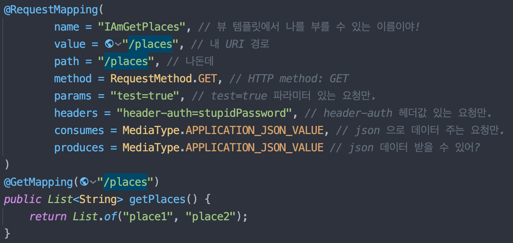
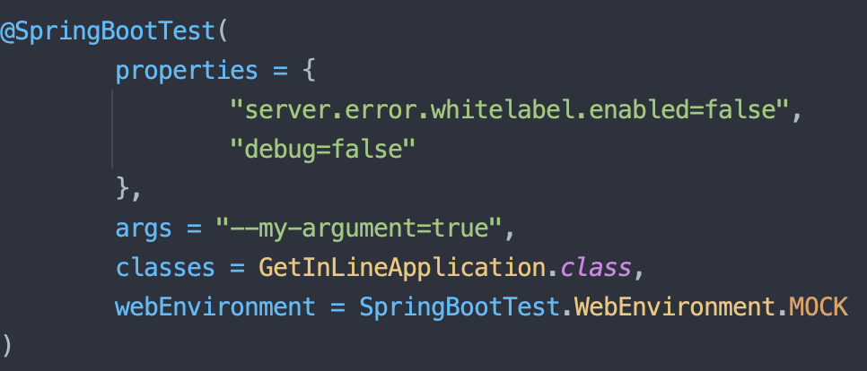
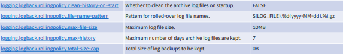
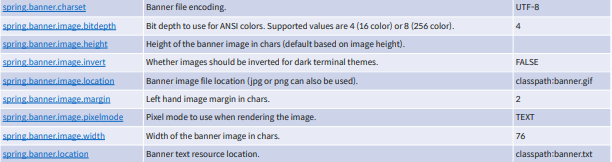
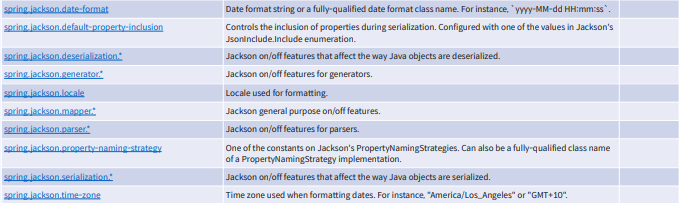
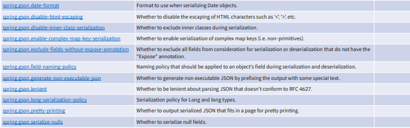
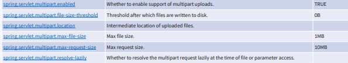

# Part 3. Spring Web MVC

# Part 3. Spring Web MVC
* toc
{:toc}

## API 설계

### 어노테이션 기반 설계 - @Controller, @RestController
+ 컨트롤러 클래스 
  + MVC 패턴 중 핸들러 메소드를 포함하는 컨트롤러 빈을 만드는 과정
  + @Controller
  + @RestController = @ResponseBody + @Controller
+ 핸들러 메소드 (Handler Method)
  + 스프링 웹서비스가 받는 URI 요청을 컨트롤러 클래스의 특정 메소드에 매핑하는 과정
  + @RequestMapping
  + @GetMapping
  + @PostMapping
  + @PutMapping
  + @DeleteMapping
  + @PatchMapping
+ 자동 에러페이지 제거: server.error.whitelabel.enabled=false 
+ 에러 컨트롤러 구현시 implements ErrorController

~~~java

@Controller
public class BaseController implements ErrorController {

    @GetMapping("/")
    public String root() {
        return "index";
    }

    @RequestMapping("/error")
    public String error() {
        return "error";
    }

}

~~~

+ __management.endpoints.web.exposure.include=*__ 같은 경우에는 실제 배포시 성능과 보안 때문에 정리 해주어야 한다.

### 함수 기반 설계

#### 함수형 프로그래밍
+ 함수형 프로그래밍?
  + 함수형 프로그래밍(函數型 프로그래밍, 영어: functional programming)은 자료 처리를 수학적 함수의 계산으로 취급하고 상태와 가변 데이터를 멀리하는 프로그래밍 패러다임의 하나이다.
  + Functional programming is programming without assignment statements.
    + 함수형 프로그래밍은 대입문 없이 프로그래밍하는 것입니다.
  + 특징
    + 상태가 없다.
    + 대입문이 없다.
    + 부작용(side effect)이 없는 순수 함수
    + 불변성(immutability)
  + 역사: 오래되었다
    + 1930 람다 대수
    + 1954 IPL
    + 1958 LISP
    + 1990 Haskell
    
#### 함수 기반 설계
+ 함수형 엔드포인트
  + Spring Web 의 엔드포인트를 함수형 스타일로 작성하는 방법 제공
  + WebMvc.fn
  + routing, request handling
  + 불변성을 고려하여 설계되었다.
  + 기존의 DispatcherServlet 위에서 동작
  + 애노테이션 스타일과 함께 사용 가능
+ 주요 키워드
  + HandlerFunction == @RequestMapping
    + 입력: ServerRequest
    + 출력: ServerResponse
  + RouterFunction == @RequestMapping
    + 입력: ServerRequest
    + 출력: Optional<HandlerFunction>
  + HandlerFunction VS RouterFunction
    + HandlerFunction의 결과: data
    + RouterFunction의 결과: data + behavior (ex: url mapping)
  + 기타 세부 키워드
    + RequestPredicates
    + RouterFunctions.route().nest()
    + RouterFunctions.route().before()
    + RouterFunctions.route().after()
    + RouterFunctions.Builder.onError()
    + RouterFunctions.Builder.filter()

#### Reference
+ [https://ko.wikipedia.org/wiki/%ED%95%A8%EC%88%98%ED%98%95_%ED%94%84%EB%A1%9C%EA%B7%B8%EB%9E%98%EB%B0%8D](https://ko.wikipedia.org/wiki/%ED%95%A8%EC%88%98%ED%98%95_%ED%94%84%EB%A1%9C%EA%B7%B8%EB%9E%98%EB%B0%8D)
+ [https://en.wikipedia.org/wiki/Functional_programming](https://en.wikipedia.org/wiki/Functional_programming)
+ [https://blog.cleancoder.com/uncle-bob/2012/12/22/FPBE1-Whats-it-all-about.html](https://blog.cleancoder.com/uncle-bob/2012/12/22/FPBE1-Whats-it-all-about.html)
+ [https://docs.spring.io/spring-framework/docs/current/reference/html/web.html#webmvc-fn](https://docs.spring.io/spring-framework/docs/current/reference/html/web.html#webmvc-fn)

### 요청, 응답 설계

#### Handler Methods
+ 핸들러 메소드란
  + Spring Web 에서 사용자의 요청(request)을 받아 응답(response)을 리턴하는 메소드
+ 매핑 정보
  + @RequestMapping
    + name: 뷰 템플릿에서 식별할 때 쓰는 이름
    + value, path: URI
    + method: HTTP method(ex: GET, POST, ...)
    + params: 파라미터 검사
    + headers: 헤더 검사
    + consumes: 헤더의 Content-Type 검사
    + produces: 헤더의 Accept 검사
    + 
  + @RequestMapping shortcuts
    + @GetMapping
    + @PostMapping
    + @PutMapping
    + @DeleteMapping
    + @PatchMapping
+ 요청
  + 핸들러 메소드가 받을 수 있는 요청들
    + 메소드 파라미터로 적어 넣을 수 있는 타입들
    + ServletRequest, ServletResponse, HttpSession
    + WebRequest, NativeWebRequest
    + @RequestParam, @PathVariable
    + @RequestBody, HttpEntity<B>
    + @ModelAttribute, @SessionAttribute, Model, ModelMap
    + @RequestHeader, @CookieValue
    + Principal, Locale, TimeZone, InputStream, OutputStream, Reader, Writer, ....
    + 많이 있다.
+ 응답
  + 핸들러 메소드가 내보낼 수 있는 응답들
    + 메소드가 리턴할 수 있는 타입들
    + ModelAndView
    + String, View
    + @ModelAttribute, Map, Model
    + @ResponseBody
    + HttpEntity<B>, ResponseEntity<B>
    + HttpHeaders
    + void
    + 등등

#### Reference
+ [https://docs.spring.io/spring-framework/docs/current/reference/html/web.html#mvc-ann-methods](https://docs.spring.io/spring-framework/docs/current/reference/html/web.html#mvc-ann-methods)

### @ControllerAdvice

#### 스프링 부트 기본 에러 응답의 응용
__BasicErrorController__
+ 스프링 부트의 기본 응답이 마음에 든다면
+ BasicErrorController 를 상속 받아서 
  + 특정 메소드만 오버라이드 하거나
  + 특정 핸들러 메소드를 추가하는 식으로 응용
+ BasicErrorController 의 핸들러 메소드
  + BasicErrorController.errorHtml() -> 뷰 응답
  + BasicErrorController.error() -> json body 응답

#### 커스텀 에러 페이지: 기본
+ 간단히 static html 이나 template 파일을 추가해서 커스텀 페이지를 등록하는 법
+ 단일 기본 페이지
  + /resources/static/error.html
  + /resources/public/error.html
  + /resources/template/error.[템플릿 확장자]
+ html status 별 기본 페이지
  + /resources/[static|public|template]/error/{http status 번호}.[html|템플릿확장자]
  + /resources/[static|public|template]/error/4xx.[html|템플릿확장자]
  + /resources/[static|public|template]/error/5xx.[html|템플릿확장자]

#### @ExceptionHandler
+ 비즈니스 로직이 던진 예외에 반응하는 핸들러 메소드
+ 위치: 특정 컨트롤러 클래스 내부 or @ControllerAdvice 컴포넌트 내부
+ 특정 예외에 반응
+ 예외 처리 범위
  + 컨트롤러 안에 작성했을 경우: 해당 컨트롤러만
  + @ControllerAdvice 에 작성했을 경우: 프로젝트 전체
+ 핸들러 메소드에 속하기 때문에 입출력 자료형도 핸들러 메소드와 유사하지만, 예외를 입력 인자로 다룰 수 있다는 점이 차이점
+ [https://docs.spring.io/spring-framework/docs/current/reference/html/web.html#mvc-ann-exceptionhandler-args](https://docs.spring.io/spring-framework/docs/current/reference/html/web.html#mvc-ann-exceptionhandler-args)
+ [https://docs.spring.io/spring-framework/docs/current/reference/html/web.html#mvc-ann-exceptionhandler-return-values](https://docs.spring.io/spring-framework/docs/current/reference/html/web.html#mvc-ann-exceptionhandler-return-values)

#### @ControllerAdvice
+ @ExceptionHandler 를 모아서 글로벌하게 적용할 때 쓰는 애노테이션
+ 종류
  + @ControllerAdvice
  + @RestControllerAdvice
+ 속성
  + value == basePackages
  + basePackages: 적용 범위를 문자열을 이용해 특정 패키지로 지정
  + basePackagesClasses: 적용 범위를 대표 클래스 한개를 이용해 특정 패키지로 지정
    + basePackages 를 type-safe 하게 사용하기 위해 제공하는 옵션
  + assignableTypes: 적용 범위를 특정 클래스에 할당할 수 있는 컨트롤러로 지정
  + annotations: 적용 범위를 특정 애노테이션을 사용한 컨트롤러로 지정
+ ResponseEntityExceptionHandler
  + Spring MVC 에서 내부적으로 발생하는 예외들을 처리하는 클래스
  + API 예외 처리를 담당하는 @ControllerAdvice 클래스에서 상속 받아 사용
  + 커스트마이징을 원하는 특정 메소드 오버라이드 

#### Reference
+ [https://docs.spring.io/spring-framework/docs/current/reference/html/web.html#mvc-exceptionhandlers](https://docs.spring.io/spring-framework/docs/current/reference/html/web.html#mvc-exceptionhandlers)
+ [https://docs.spring.io/spring-framework/docs/current/reference/html/web.html#mvc-ann-controller-advice](https://docs.spring.io/spring-framework/docs/current/reference/html/web.html#mvc-ann-controller-advice)

### 컨트롤러 테스트
+ @TestConstructor(autowireMode = TestConstructor.AutowireMode.ALL)
  + 어노테션을 붙이면 생성자의 모든 의존성 주입

#### 스프링 부트 테스트
+ @SpringBootTest 기본 구성
  + 일딴 스프링 컨테이너와 스프링 부트 환경을 포함하는 테스트는 이것으로 다 작성가능
  + 통합 테스트를 할 때 적절한 선택
  + 애플리케이션 컨텍스트를 로드하는데 시간이 걸리므로 테스트가 다소 무거운 편
  + @SpringBootTest
    + 포함한 애노테이션: @BootstrapWith + @ExtendWith
      + 흔한 실수: JUnit 5 쓸 때 @ExtendWith(SpringExtension.class) 쓰지 않기
  + @Test
    + JUnit 5 애노테이션
    + 단위 테스트 메소드를 지정
+ @SpringBootTest
  + 
  + value, properties: 프로퍼티 설정
  + args: 애플리케이션 실행 시 커맨드라인으로 입력하는 인자(옵션) 설정
  + classes: ApplicationContext 로딩을 위한 설정 클래스를 직접 지정
  + webEnvironment: ApplicationContext 의 웹 환경 설정
    + WebEnvironment.MOCK: mock servlet, embedded server 동작 x
      + @AutoConfigureMockMvc, @AutoConfigureWebTestClient 와 함께 써서 mock test 가능
    + WebEnvironment.RANDOM_PORT: 랜덤 포트, embedded server 동작
    + WebEnvironment.DEFINED_PORT: 포트 지정(server.port), embedded server 동작
    + WebEnvironment.NONE: 웹 환경 구성 안 함, embedded server 동작 x

#### 스프링 부트 테스트: Slice Test
__Auto-configured Test (Slice Test)__
+ 스프링 애플리케이션에서 내가 필요한 일부분(slice)의 자동 설정만 불러오는 방법
+ @DataCassandraTest
+ @DataJdbcTest
+ @DataJpaTest
+ @DataLdapTest
+ @DataMongoTest
+ @DataNeo4jTest
+ @DataR2dbcTest
+ @DataRedisTest
+ @JdbcTest
+ @JooqTest
+ @JsonTest
+ @RestClientTest
+ @WebFluxTest
+ @WebMvcTest
+ @WebServiceClientTes

#### 스프링 부트 테스트: @WebMvcTest
Spring MVC 컨트롤러 레이어를 슬라이스 테스트할 때 사용
+ MockMvc 빈을 자동 설정하고 테스트에 사용
+ 로드할 컨트롤러 클래스를 지정 가능 (기본 동작: 전체 컨트롤러 로드)

#### Reference
+ [https://docs.spring.io/spring-boot/docs/current/reference/html/features.html#features.testing.spring-boot-applications](https://docs.spring.io/spring-boot/docs/current/reference/html/features.html#features.testing.spring-boot-applications)
+ [https://docs.spring.io/spring-boot/docs/current/reference/html/test-auto-configuration.html#test-auto-configuration](https://docs.spring.io/spring-boot/docs/current/reference/html/test-auto-configuration.html#test-auto-configuration)
+ [https://github.com/json-path/JsonPath](https://github.com/json-path/JsonPath)

### TDD 방식으로 복습하기

#### TDD
Test Driven Development (TDD)
+ 테스트 주고 개발 기법
+ 프로그램의 설계와 구현, 사고의 흐름을 테스트 중심으로 생각하는 개발 방법
+ 개발 순서의 변화
  + as-is: 구현한다 -> 테스트한다
  + to-be: 테스트를 만든다 -> 구현한다
+ 주요 키워드: 익스트림 프로그래밍 (XP), 애자일, 폭포수 모델, Test-First Programming

#### RED - GREEN- REFACTOR
TDD 개발 사이클
1. RED: (실패하는) 테스트를 짠다. (요구 사항의 명세)
2. GREEN: 테스트를 성공시킨다.(구현)
3. REFACTOR: 구현 코드를 고도화(리팩토링)한다.

#### Given - When - Then
테스트의 구조를 표현하는 방법(a.k.a. 3A, Arrange - Act - Assert)
+ Given (Arrange): 상태(state)의 정의 - 테스트를 수행할 때 전제 조건
+ When (Act): 동작 - 테스트 실행
+ Then (Assert): 검증 - 동작의 결과(actual) vs 예상값(expected)

#### Reference
+ [https://en.wikipedia.org/wiki/Test-driven_development](https://en.wikipedia.org/wiki/Test-driven_development)
+ [https://ko.wikipedia.org/wiki/%ED%85%8C%EC%8A%A4%ED%8A%B8_%EC%A3%BC%EB%8F%84_%EA%B0%9C%EB%B0%9C](https://ko.wikipedia.org/wiki/%ED%85%8C%EC%8A%A4%ED%8A%B8_%EC%A3%BC%EB%8F%84_%EA%B0%9C%EB%B0%9C)
+ [https://martinfowler.com/bliki/TestDrivenDevelopment.html](https://martinfowler.com/bliki/TestDrivenDevelopment.html)
+ [https://martinfowler.com/bliki/GivenWhenThen.html](https://martinfowler.com/bliki/GivenWhenThen.html)

## 비즈니스 로직 구현

### @Service 이해
비즈니스 로직을 담당하는 컴포넌트
+ 도메인 모델(데이터)과 컨트롤러 사이에 위치
+ 클래스 네이빙을 반드시 '-Service'로 할 필요 없다
  + 하지만 관례적으로 실무에서 즐겨 사용되는 네이밍
+ 구현방식
  + 인터페이스 + 클래스: 정석
    + 인터페이스를 요구사항에 따른 기능 문서(ex: javadoc)로 작성
    + 같은 기능을 하는 다양한 구현체를 작성할 니즈가 예상될 때 적합
  + 클래스
    + 실무에서는 즐겨 사용되기도 하는 방식
    + 인터페이스를 추가로 작성하는 수고를 덜게 된다
    + 컨트롤러 레이어와 결합도는 증가한다

#### Reference
+ [https://docs.spring.io/spring-framework/docs/current/reference/html/core.html#beans-scanning-name-generator](https://docs.spring.io/spring-framework/docs/current/reference/html/core.html#beans-scanning-name-generator)

### Validation
+ 사용자 입력값에 있을지 모르는 오류를 처리하려면?
  + 모든 입력단 앞에 방어 코드가 추가된다.
  + 방어 코드는 복잡하고 반복적인 대표적인 boilerplate code(상용구 코드) 
+ 애노테이션 기반으로 데이터 검증을 돕는 JSR-303, JSR-380 표준이 도입
  + 검즉 구현과 비즈니스 로직을 분리하고, 비즈니스 로직에 더 집중 가능
  + 간결한 코드 표현, 더 나은 가독성

#### Validation in Boot
build.gradle 에 spring-boot-starter-validation 의존성 추가
+ Spring Boot 2.3 이전: spring-boot-starter-web 에 기본 포함
+ Spring Boot 2.3 이후: 직접 넣어줘야 한다
+ 사용 패턴
  + @Validated + 메소드 파라미터 검증
    + 메소드 파라미터에 validation annotation 을 직접 사용해서 검증하는 방법
    + 클래스에 @Validated 필요
    + 발생 예외: ConstraintViolationException, 직접 처리해 줘야 하는 예외
    + ConfigurationProperties 클래스에도 적용 가능
  + @Valid + Data Object
    + 검증하려는 데이터 오브젝트에만 검증 로직을 적용할 때
    + @Validated 필요하지 않다
    + 발생 예외: MethodArgumentNotValidException
      + ResponseEntityExceptionHandler 지원을 받을 수 있다
  
#### Reference
+ [https://docs.spring.io/spring-boot/docs/current/reference/html/features.html#features.validation](https://docs.spring.io/spring-boot/docs/current/reference/html/features.html#features.validation)
+ [https://spring.io/guides/gs/validating-form-input/](https://spring.io/guides/gs/validating-form-input/)
+ [https://beanvalidation.org/2.0/spec/#builtinconstraints](https://beanvalidation.org/2.0/spec/#builtinconstraints)

### Spring Boot Properties
+ logging
  + debug
  + trace
  + logging.level.원하는.패키지.이름
  + 
+ banner
  + 
+ config
  + spring.config.activate.on-profile
  + spring.profiles 가 deprecated 되었으니 주의
  + spring.config.import
  + spring.config.use-legacy-processing
+ main
  + spring.main.banner-mode
  + spring.main.lazy-initialization
+ json
  + 
  + 
+ web
  + spring.hateoas.use-hal-as-default-json-media-type
  + spring.mvc.converters.preferred-json-mapper
  + spring.mvc.format.date
  + spring.mvc.format.date-time
  + spring.mvc.format.time
  + spring.mvc.view.prefix
  + spring.mvc.view.suffix
+ web (servlet.multipart)
  + 
+ server
  + server.error.whitelabel.enabled
  + server.port
  + http encoding, session, ssl, tomcat ...
+ 그 밖에
  + security
  + actuator
  + devtools

#### Reference
+[https://docs.spring.io/spring-boot/docs/current/reference/html/application-properties.html](https://docs.spring.io/spring-boot/docs/current/reference/html/application-properties.html)

### 비즈니스 로직의 테스트
비즈니스 로직을 테스트하는 방법
+ unit test, solitary test -> 필요로 하는 것들만 사용하거나 mocking, slice test
  + 컨트롤러 입출력의 확인
  + 에러의 검증
  + 비즈니스 로직의 동작
+ integration test, sociable test -> @SpringBootTest
  + 인증 + api 호출
  + api 호출 -> 비즈니스 -> 데이터 접근 -> 응답 까지

#### Reference
+ [https://docs.spring.io/spring-boot/docs/current/reference/html/features.html#features.testing](https://docs.spring.io/spring-boot/docs/current/reference/html/features.html#features.testing)