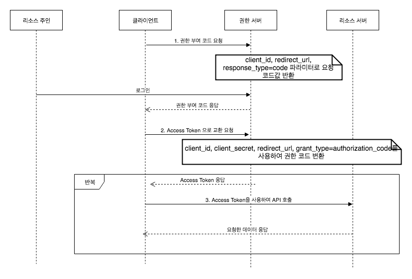
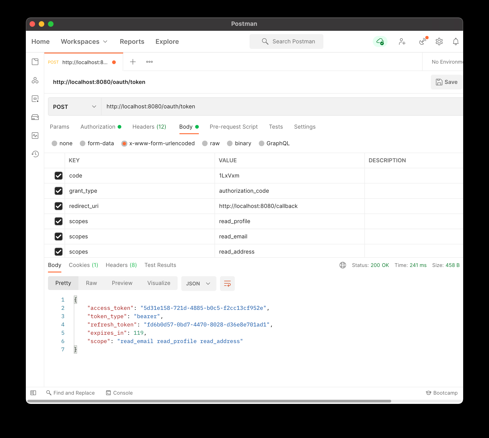
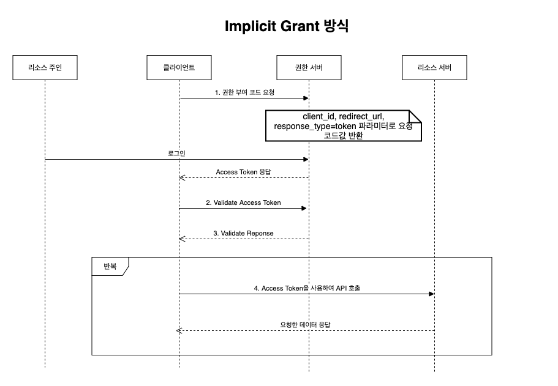
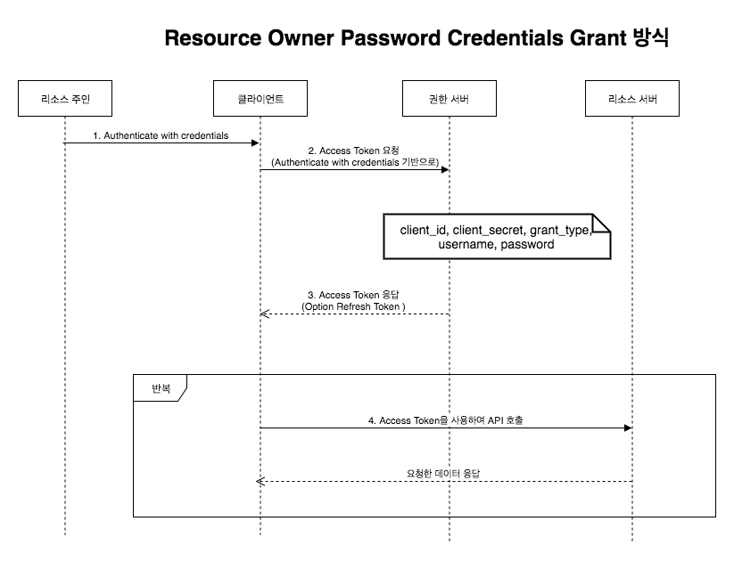
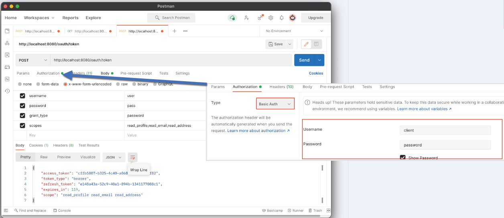
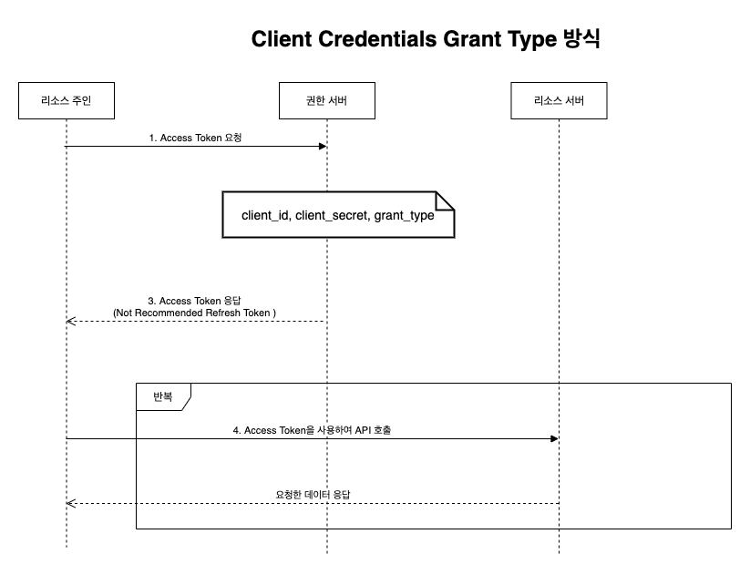
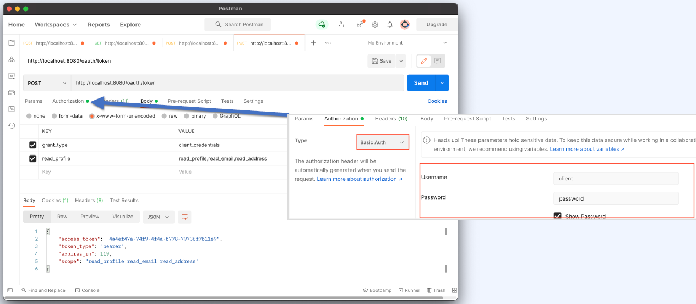

# Part 6. Spring OAuth2 Social

# Part 6. Spring OAuth2 Social

* toc
{:toc}

## OAuth2 이론 이해

### OAuth2 간단 개념정리

| 용어                           | 설명                                                                                                                     |
|------------------------------|------------------------------------------------------------------------------------------------------------------------|
| Authorization Server (권한 서버) | 권한을 관리하는 서버로 Access Token, Refresh Token을 발급 및 관리한다. 배달의 민족을 구글 아이디로 가입했다면 해당 구글 계정에 대한 인증과 토큰 발급을 담당하는 서버로 이해할 수 있습니다 |
| Resource Server (리소스 서버)     | 서비스를 제공하는 서버 배달의 민족을 구글 아이디로 가입했다면, 권한 서버는 구글 서버, 리소스 서버는 배민 서버에 해당한다                                                  |
| Resource Owner (리소스 주인)      | 해당 리소스(계정)의 주인으로, 일반 사용자의 경우 계정의 소유자에 해당한다                                                                             |
| Client                       | Resource Owner를 대리하여 리소스 요청을 하는 애플리케이션 규모가 작은 프로젝트에서는 Resource Server와 같은 애플리케이션일 수 있다                                 |
| Access Token                 | Authorization Server가 Resource Owner를 식별하여 발급받은 키                                                                      |
| Refresh Token                | Access Token를 재발급 받을 때 사용하는 키                                                                                          |

### OAuth2 네 가지 인증 방식
+ Authorization Code Grant Type
  + 권한 부여 코드 승인 타입
+ Implicit Grant Type
  + 암시적 승인 타입
+ Resource Owner Password Credentials Grant Type
  + 리소스 소유자 암호화 자격 증명 타입
+ Client Credentials Grant Type
  + 클라이언트 자격 증명 타입

### Authorization Code Grant Type
+ 
+ [http://localhost:8080/oauth/authorize?client_id=client&redirect_uri=http://localhost:8080/callback&response_type=code&scopes=read_profile,read_email,read_address](http://localhost:8080/oauth/authorize?client_id=client&redirect_uri=http://localhost:8080/callback&response_type=code&scopes=read_profile,read_email,read_address)

+ 

### Implicit Grant Type
+ 
+ [http://localhost:8080/oauth/authorize?client_id=client&redirect_uri=http://localhost:8080/callback&response_type=token&scopes=read_profile,read_email,read_address&state=test](http://localhost:8080/oauth/authorize?client_id=client&redirect_uri=http://localhost:8080/callback&response_type=token&scopes=read_profile,read_email,read_address&state=test)
+ 권한을 승인하면 해당 주소로 리다이렉트
  + [http://localhost:8080/callback#access_token=79c7676d-f146-4361-870c-876c2ed6ccc2&token_type=bearer&state=test&expires_in=119&scope=read_email%20read_profile%20read_address](http://localhost:8080/callback#access_token=79c7676d-f146-4361-870c-876c2ed6ccc2&token_type=bearer&state=test&expires_in=119&scope=read_email%20read_profile%20read_address)

| Key           | Value                                | Description                              |
|---------------|--------------------------------------|------------------------------------------|
| access_token  | 79c7676d-f146-4361-870c-876c2ed6ccc2 | Implicit Grant 방식에서는 Token 정보를 바로 응답 합니다 |
| token_type    | bearer                               | Token의 type                              |
| state         | test                                 | 서버 인가 엔드포인트로 리다이렉트 될때 전달 받을 수 있습니다.      |
| expires_in    | 119                                  | 토근 만료시간초입니다.                             |
| scope         | ead_profile,read_email,read_address  | 승인 받은 scope                              |
| refresh_token | 없음                                   | Implicit Grant Type은 리프레시를 하지 않음         |

### Resource Owner Password Credentials Grant Type
+ 
+ 
  + password 기반으로 token 정보를 요청한다. 유저의 비밀번호 인증이 완료되면 응답 받는다

### Client Credentials Grant Type
+ 
+ 
  + Basic Auth 인증을 통해서 Access Token 정보를 획득한다
  + 리소스 주인이 어떤 권한 인증을 하지 않기 때문에 Refresh Token을 넘겨주지 않는 것이 바람직하다

### OAuth2 인증 방식 최종 정리

#### Authorization Code Grant Type
+ 소셜 로그인에 사용되는 인증 방식
+ 권한 서버의 Code(권한 부여 코드)를 내려주며 해당 값으로 다시 검증을 진행한다. 이러한 진행 방식 때문에 Authorization Code(권한 부여 코드) Grant Type이라고 한다
+ 네 가지 인증 방식중 가장 복잡한 구조이다

#### Implicit Grant Type
+ Authorization Code Grant Type와 거의 동일하다 
+ 다른 점은 Authorization Code를 사용하지 않는 것이며, 이를 묵시적으로 승인을 받았다고하여 Implicit Grant Type이라고 한다
+ 권한 서버가 Authorization Code를 생략하고 바로 Access Token을 응답한다
+ 해당 Access Token이 유효한지 권한 서버가 한 번 더 검증한다
+ Refresh Token은 넘겨주지 않는다 

#### Resource Owner Password Credentials Grant Type
+ Resource Owner의 계정 정보를 기반으로 인증 처리를 한다
+ ID, PW 기반으로 진행하는 만큼 직관적인 인증 방법이다 
+ Refresh Token 정보는 정책을 결정해서 내려줄지 안 내려줄지 정할 수 있다 

#### Client Credentials Grant Type
+ Resource Owner에 대한 자격 증명은 하지 않는 유일한 방식이다
+ client_id, client_secret으로만 자격 증명을 진행한다
+ Refresh Token 정보는 내려주지 않는다

## OAuth2 Social 인증 App 등록

### Facbook App 등록
1. [https://developers.facebook.com/](https://developers.facebook.com/) 이동
2. 로그인 이동
3. 로그인 진행
4. 내 앱 이동 
5. 앱 만들기 클릭