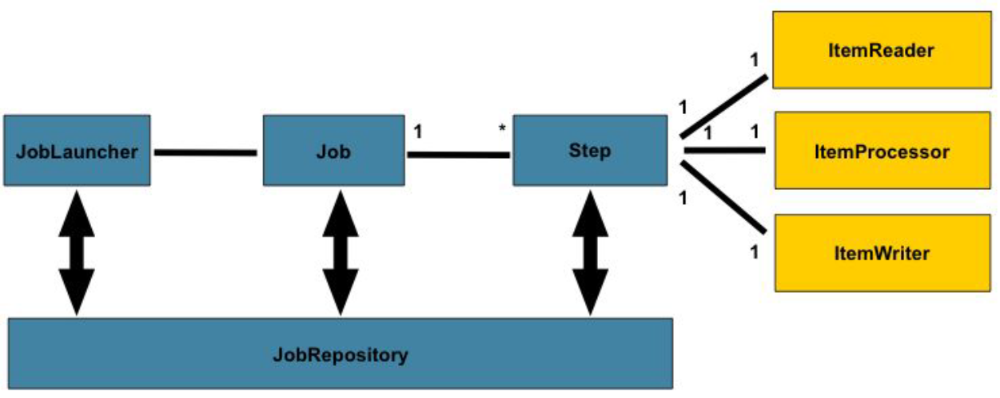
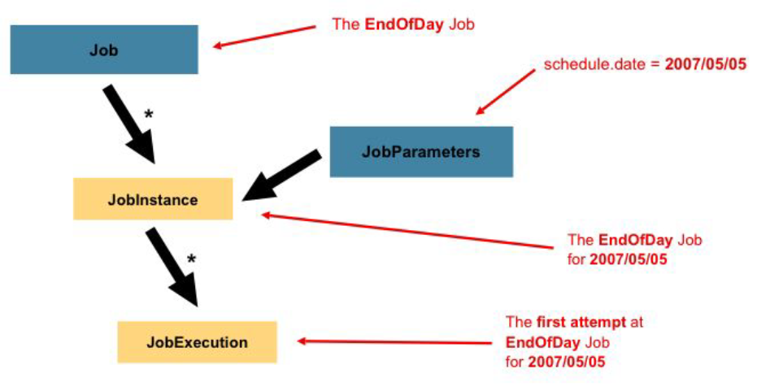
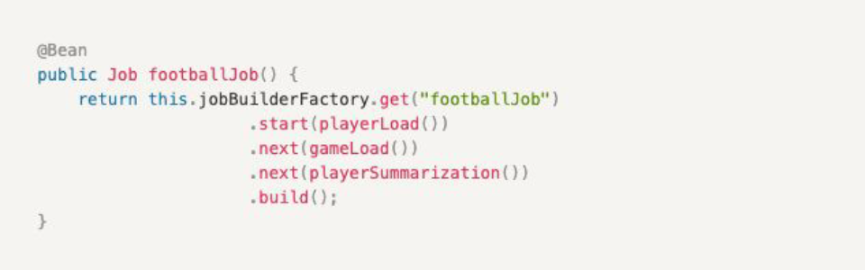
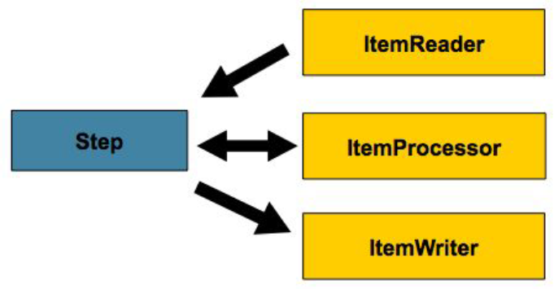
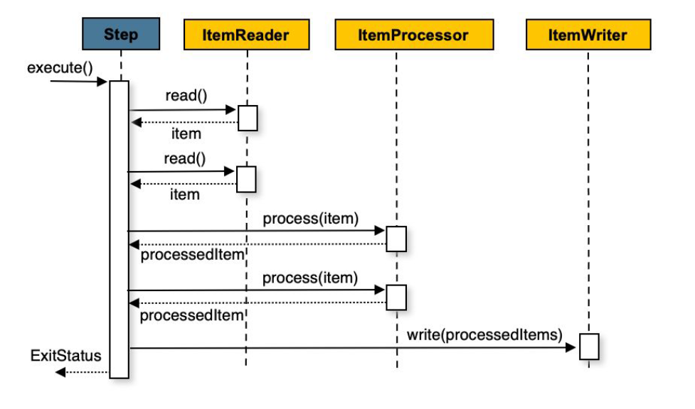
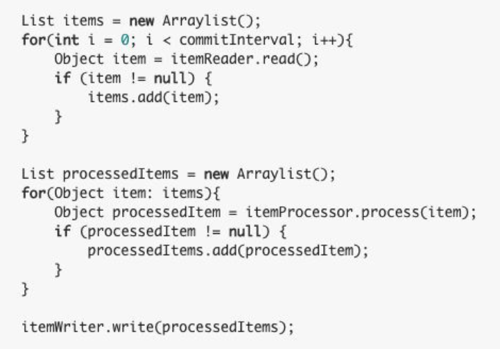
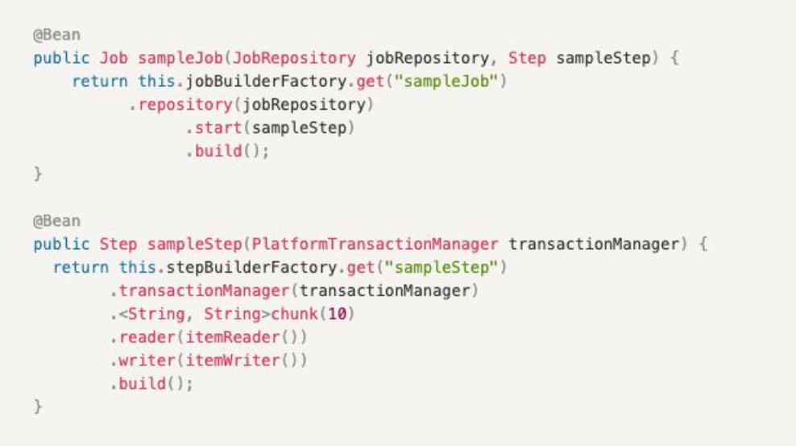
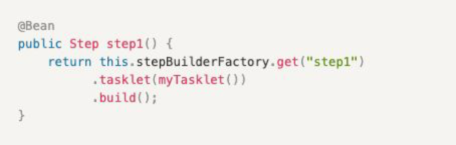
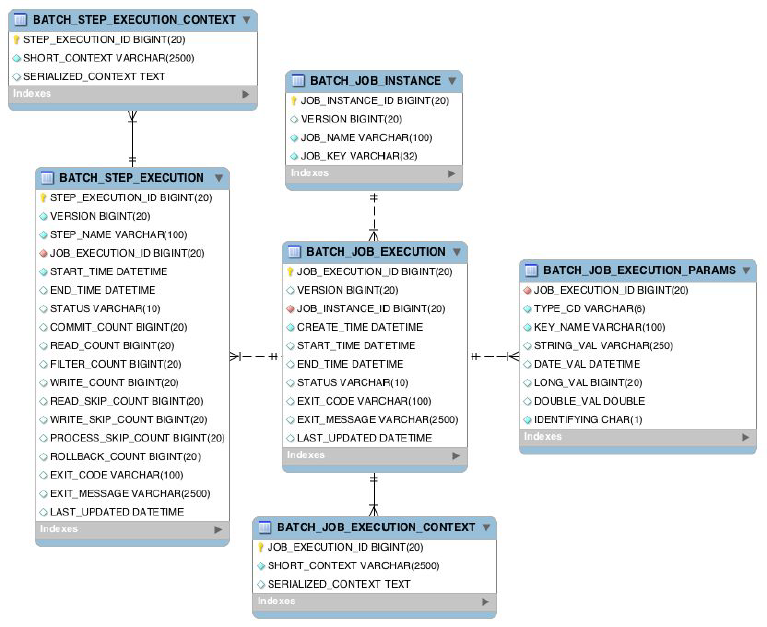
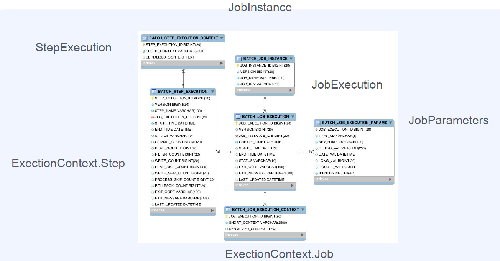

# Part 7. Spring Batch

# Part 7. Spring Batch

* toc
{:toc}

## Batch 프로그램

### 현업에서의 배치 프로그램
+ 배치 프로그램
  + 정해진 시간에 일괄적으로 작업을 처리한다 (대체로 대용량 데이터)
  + 배치 프로그램은 보이지 않지만 늘 존재한다
  + 서비스를 운영하는 관점에서 주기적으로 작업을 처리하려면 배치 프로그램을 사용해야 한다
+ 배치 프로그램이 필요한 상황
  + 필요한 데이터를 모아서 처리해야할 때
    + (ex. 월별 거래 명세서 생성)
  + 일부러 지연시켜 처리 할때
    + (ex. 주문한 상품을 바로 배송 처리 하지 않고, 일정 시간 뒤 처리)
  + 자원을 효율적으로 활용하기 위해 
    + (ex. 트래픽이 적은 시간 대에 서버 리소스를 활용)
+ 데이터 처리 배치 프로그램 살펴보기
  + 각 서비스의 데이터를 데이터 웨어하우스에 저장할 때
    + ETL(Extract-Transform-Load)
  + 아마존에서 연관 상품을 추천하는 데이터 모델을 만들 때
  + 유저 리텐션 등 마케팅에 참고할 데이터 지표를 집계할 때 
+ 서비스 배치 프로그램 살펴보기
  + 메시지, 이메일, 푸시 등을 발송할 때
  + 데이터를 마이그레이션 할 때
  + 실패한 트랜잭션을 재처리할 때
  + 쿠폰, 포인트 등이 만료되었을 때 소진시키는 처리를 할 때
  + 월말 또는 월초에 특정 데이터를 생성할 때 - 월별 거래 명세서 

### Spring Batch를 쓰는 이유
+ Spring Batch란?
  + A lightweight, comprehensive batch framework
    designed to enable the development of robust batch applications
    vital for the daily operations of enterprise systems.
  + (Spring 기반) 가볍고 다양한 기능을 가진 배치 프레임 워크
    견고한 배치 어플리케이션 개발이 가능하도록 디자인 되어있다.
    기업 시스템의 매일 운영에 필수적인 수준
+ Spring 기반이다
  + 스프링으로 작성된 코드를 재활용할 수 있다. 기존 Spring 프로젝트의 코드를 활용하거나 모듈을 이용할 수 있다
  + 만약 배치용 코드를 새로 작성한다면 Python, Shell script, Go 등 다른 언어로 비슷한 처리를 새로 구현해야 한다
  + 배치 처리를 위한 로직을 새로 만드는 것보다 스프링 배치에서 제공하는 기능을 이용하는게 생산성 있는 방법이다
+ 다양한 기능을 제공한다
  + 로깅/추적, 트랜잭션 관리, 작업 처리 통계, 재시작, 건너뛰기 등 대용량 처리에 필수적인 기능들을 제공
  + 멀티 코어 또는 멀티 서버에서 처리를 분산하는 기능을 제공한다
  + 프레임워크가 제공하는 기능들을 이해하고 잘 사용하면 된다

## Spring Batch 아키텍처

### Spring Batch 도메인 언어

+ JobLauncher는 Job을 실행시키는 컴포넌트
+ Job은 배치 작업, JobRepository는 Job 실행과 Job, Step을 저장 
+ Step은 배치 작업의 단계, ItemReader, ItemProcessor, ItemWriter는 데이터를 읽고 처리하고 쓰는 구성

### Spring Batch 아키텍처
+ Application Layer
  + 사용자(=우리) 코드와 구성
  + 비즈니스, 서비스 로직
  + Core, Infrastructure를 이용해 배치의 기능을 만든다 
+ Core Layer
  + 배치 작업을 시작하고 제어하는데 필수적인 클래스
  + Job, Step, JobLaucher
+ Infrastructure Layer
  + 외부와 상호작용
  + ItemReader, ItemWriter, RetryTemplate
+ Spring Batch가 제공하는 Core와 Infrastructure를 활용해 Application을 구현한다

### Job
+ 
+ 전체 배치 프로세스를 캡슐화한 도메인
+ Step의 순서를 정의한다
+ JopParameters 받는다
+ 

### Step
+ 
+ 작업 처리의 단위
+ Chuck 기반 스텝, Tasklet 스텝 2가지로 나뉜다 

#### Chunk-oriented Processing Step
+ 
  + chunk 기반으로 하나의 트랜잭션에서 데이터를 처리한다 
  + commitInterval만큼 데이터를 읽고 트랜잭션 경계 내에서 chunkSize 만큼 write를 한다
+ 
  + chunkSize: 한 트랜잭션에서 쓸 아이템의 갯수
  + commitInterval: reader가 한번에 읽을 아이템의 갯수
  + chunkSize >= commitInterval 하지만 보통 같게 맞춰서 사용하는 것이 좋다
+ 
  + ItemReader, ItemProcessor, ItemWriter 구현체를 설정한다
  + ItemProcessor는 생략할 수 있다

#### TaskletStep 
+ 
  + 하나의 트랜잭션에서 데이터를 처리한다 
  + 단순한 처리를 할 때 사용한다
+ 
  + Tasklet 구현체를 설정한다. 내부에 단순한 읽기, 쓰기, 처리 로직을 모두 넣는다
  + RepeatStatus(반복 상태)를 설정한다. RepeatStatus.FINISHED

### Spring Batch 스키마 구조
__Meta Data Schema__
+ 
+ 배치 실행하고 관리하기 위한 메타 데이터가 저장된다
+ 
+ Meta Data 스키마 활용하기
  + Spring Batch Framework가 실행 시 meta data 테이블들을 사용하므로 초기 설정이 필요하다
  + Spring Batch Framework가 속하는 부분이므로 수정하지 않고 조회만 한다
  + Job의 이력, 파라미트 등 실행 결과를 조회할 수 있다 
  + 배치 결과에 대해서 로그, 별도의 실행 이력을 남기는 경우가 대부분이므로 조회할 일이 많지 않다

## Spring Batch 기본 프로젝트

### Spring Batch 실행 환경 - Batch 스케줄링
+ ./gradlew bootJar java -jar ${빌드한파일}.jar --spring.batch.job.names=${잡이름}
+ 윈도우/맥에서 빌드한 파일이 있는 곳까지 명령프롬프트/터미널을 통해 접근해서 실행
+ Batch 실행 방식 - OS 스케줄러 이용
  + 한 머신 내부에서 스케줄러를 통해 Batch 프로그램을 실행한다 - 리눅스
  + crontab -실행 결과를 log파일을 남겨 확인한다
+ Batch 실행 방식 - Quartz Scheduler 이용
  + Quartz + Spring Batch 프레임워크를 함께 사용해 어플리케이션을 개발한다.
    + 어플리케이션 내무에서 스케줄링하므로 Batch 실행이 빠르다
    + 스케줄링 데이터가 DB에 저장되어 Admin을 따로 만들어야한다 
+ Batch 실행 방식 - CI 프로그램 이용
  + 마스터에서 슬레이브로 명령을 전달해 배치 프로그램을 실행시킨다 - 젠킨스
    + 젠킨스에서 지원하는 스케줄링 기능을 통해 배치 프로그램을 실행시킬 수 있다
+ Batch 실행 방식 - Spring Cloud Data Flow
  + Spring Cloud Data Flow를 활용해 잡을 실행시킨다.
    + Kubernetes 클러스터를 구축해야 한다.
    + Admin이 제공되고, 잡의 실행을 연결할 수 있는 등 다양한 기능을 제공한다.