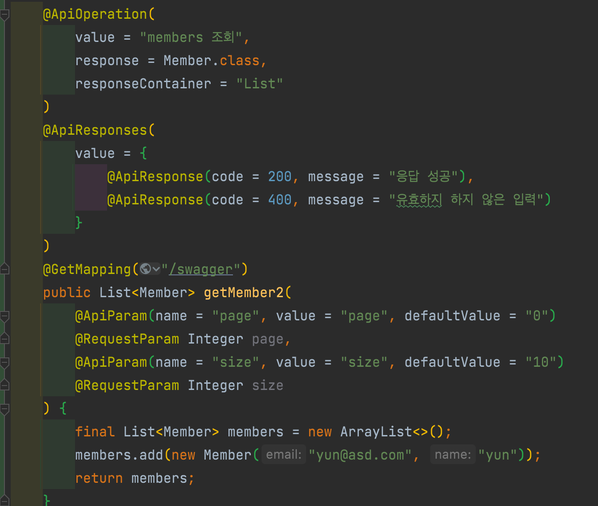
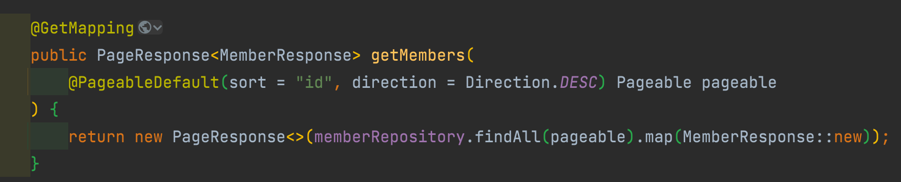

# Part 8. Spring REST Docs

# Part 8. Spring REST Docs

* toc
{:toc}

## REST Docs 문서 만들기

### REST Docs 살펴보기

#### RestDocs 간단 소개
  + Rest Docs는 테스트 코드 기반으로 Restfull API 문서를 돕는 도구이다.
  + Asciidoctor를 이용해서 HTML 등등 다양한 포맷으로 문서를 자동으로 출력할 수 있다.
  + RestDocs의 가장 큰 장점이자 다른 문서화 도구의 차이점은 테스트 코드 기반으로 문서를 작성한다는 것이다.
  + API Spec과 문서화를 위한 테스트 코드가 일치하지 않으면 테스트 빌드를 실패하게 되어 테스트 코드로 검증된 문서를 보장할 수 있다.

#### RestDocs VS Swagger
+ 
  + Swagger
+ 
  + REST Docs Code

### 문서화에 필요한 API만들기
+ 자동으로 생성되는 Snippets
  + curl-request.adoc
  + http-request.adoc
  + http-response.adoc
  + httpie-request.adoc
  + request-body.adoc
  + response-body.adoc
