# Part 9. 실무 밀착 프로젝트

# Part 9. 실무 밀착 프로젝트

* toc
{:toc}

## P1. 코로나 줄서기 서비스

### 뷰 디자인
+ Tailwind CSS
  + CSS 작성 없이 반응현 웹 디자인을 입힐 수 있는 다재다능한 CSS 프레임워크
  + class 에 정해진 값을 입력하면 css 로 동작
  + css 파일 별도 작성이 줄고 생산성 증가
  + 최근 트랜드에 맞는 디자인
  + CDN css 파일 사이즈가 2.8MB 로 매우 크다 - purge 등 최적화 필요
  + class 를 외우고 적응하는데 시간이 걸린다 

#### Reference
+ [https://tailwindcss.com/](https://tailwindcss.com/)
+ [https://tailwindui.com/components/application-ui/lists/tables](https://tailwindui.com/components/application-ui/lists/tables)
+ [https://v1.tailwindcss.com/components/forms](https://v1.tailwindcss.com/components/forms)

### Thymeleaf 데이터 전달 테크닉 
타임리프의 몇 가지 유용한 데이터 전달 방법을 정리
+ th:text 와 th:value 를 잘 구분하자
  + input -> th:value, textarea 및 각종 inline element -> th:text
+ ?.: safe navigation operator (groovy 문법) - object 가 null 인 경우, 에러 없이 null 리턴
  + ex: ${place?.placeName}
+ 링크 표현식 안에 변수 넣는 법
  + @{/admin/places/{placeId}/newEvent(placeId=${place.id})
+ script 엘리먼트 안에 자바스크립트 평문으로 주입하기 (decoupled logic)
  +<attr sel="script" th:inline="javascript" th:utext="'window.onload = (event) =>
  { setTimeout(() => window.location.replace(\'' + ${redirectUrl ?: ''} + '\'), 5000); };'" />
+ CSRF 토큰 가져오기
  + <input type="hidden" th:value="${ _csrf.token }" th name="${ _csrf.parameterName }" \> 

#### Reference
+ [https://www.thymeleaf.org/doc/tutorials/3.0/usingthymeleaf.html](https://www.thymeleaf.org/doc/tutorials/3.0/usingthymeleaf.html)
+ [https://www.thymeleaf.org/doc/tutorials/3.0/thymeleafspring.html](https://www.thymeleaf.org/doc/tutorials/3.0/thymeleafspring.html)

### 헤로쿠에 배포하기
+ Heroku
  + 무료로 사용해볼 수 있는 클라우드 컴퓨팅 플랫폼
  + git과 연동이 잘 되어 있다
  + push를 감지하는 자동 빌드, 배포 기능을 사용가능
  + 제약은 있지만 무료로 목업을 만들어 웹 배포하기에는 충분하다
  + 접근이 없는 채로 30분이 지나면 시스템이 잠든다 - 큰 문제는 없다
    + 카페인: 30분마다 자동으로 ping을 날려서 헤로쿠가 잠들지 않게 해주는 서비스 

#### Reference
+ [https://www.heroku.com/](https://www.heroku.com/)
+ [https://kaffeine.herokuapp.com/](https://kaffeine.herokuapp.com/)

### 깃헙 자동화
+ GitHub Actions
  + 깃헙의 작업 흐름을 자동화해주는 기능
  + yaml 스크립트로 동작
  + 깃헙 자체적으로 CD/CI 구축이 어느 정도 가능
  + 다양한 시나리오에서 워크플로우를 자동화
    + 푸시를 날리면 테스트 실행
    + Pull Request 만들어지면 테스트, 빌드 실행
    + 머지되면 빌드, 배포
    + 오래된 이슈 자동 정리 
  + 마켓플레이스를 통해 이미 잘 만들어진 다양한 환경의 유용한 액션을 공유 

## P2. 패스트캠퍼스 포인트 관리하기

### Spring Batch의 구조
+ Batch란 일괄 처리라는 뜻을 가지고 있다
+ 데이터를 실시간으로 처리하지 않고 일괄적으로 모아서 한번에 처리하는 방식을 말한다
+ 공식 문서 [https://spring.io/projects/spring-batch](https://spring.io/projects/spring-batch)
+ 가볍고 포괄적인 배치 프레임워크
+ 로깅, 추적, 트랜젝션 관리, 작업처리통계, 재시작, 건너뛰기, 리소스 관리 등 대량의 레코드 처리에 필수적인 재사용 가능한 기능을 제공
+ 최적화, 파티셔닝 기술로 대용량 고성능 배치 작업 가능
+ 확장성이 매우 뛰어나다

#### 다양한 데이터 처리 방식

|              | Batch-Processing                           | Real-Time                      | Stream-Processing                                                             |
|--------------|--------------------------------------------|--------------------------------|-------------------------------------------------------------------------------|
| 데이터 처리시간     | 정해진 시간에 일괄 처리한다                            | 실시간으로 반응이 일어남 요청이 일어나면 즉시 처리한다 | 준실시간으로 반응이 일어난다                                                               |
| 데이터 처리량      | 정해진 때에 정해진 양의 데이터를 한 번에 처리한다               | 요청을 개별적으로 처리한다                 | Stream을 통해 데이터가 들어오면 처리하기 시작한다                                                |
| 구현 특징        | 데이터를 처리할 때만 애플리케이션이 Running 하도록 구현한다       | Web Container에서 동작하도록 구현한다     | 제 3의 도구를 사용하는 경우가 많다 (Kafka, RabbitMQ 등)                                      |
| 데이터 처리 시 어려움 | 데이터 볼륨이 너무 큰 경우에 처리가 어렵다, 처리가 특정한 시간에 집중된다 | 동시에 많은 요청이 일어나는 경우에 대체가 어렵다    | Stream의 input과 output의 flow를 컨트롤하기 어렵다 제, 6의 도구와 다수의 stream으로 인해 Fail 처리가 어렵다 |

#### Job
+ 잡이란 무엇일까?
  + 1개의 작업에 대한 명세이다
  + 어디까지나 1개 작업으로 봐야할지 기준이 애매할 수 있다 그러나 그 기준은 상황별로 재량껏 판단할 수 있다
+ Job의 특징
  + 1개의 Job은 여러개의 Step을 포함할 수 있다
  + Job name을 통해 Job을 구분할 수 있다
  + Job name으로 Job을 실행시킬 수 있다
  + Job을 만드는 빌더는 많지만 JobBuilderFactory로 쉽게 Job을 만들수 있다 
  + 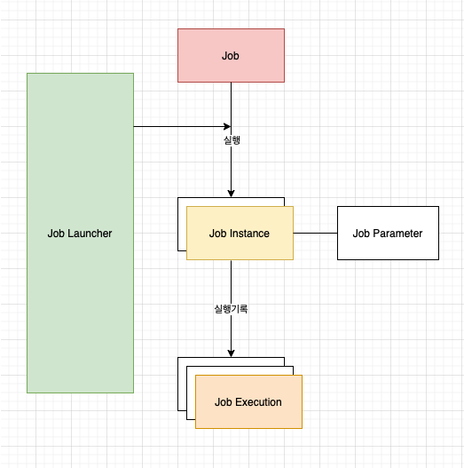

##### JobInstance
+ Job이 명세라면 JobInstance는 Job이 실행되어 실체화된 것이다.
+ JobInstance는 배치 처리에서 Job이 실행될 때 하나의 Job 실행 단위이다 
+ 같은 Job에 같은 조건(Job Parameters)이면 JobInstance는 동일한다고 판단한다
+ 혹시 Job이 실패해서 다시 같은 조건으로 Job을 실행한다면 같은 JobInstance라고 할 수 있다

~~~java

/**
 * job Instance
 */
JobInstance jobInstance = jobExecution.getJobInstance();
// job 이름
jobInstance.getJobName();
// job instance의 ID
jobInstance.getInstanceId();

~~~

##### JobExecution
+ JobExecution은 JobInstance의 한번 실행을 뜻한다
+ 어떤 Job이 같은 조건으로 1번 실패하고 1번 성공한다면 JobInstance는 1개고 JobExcution은 2개로 다르다
+ JobExcution은 실패했던지 성공했든지 간에 실제로 실행시킨 사실과 동일한 의미이기 때문에 배치 실행과 관련된 정보를 포함하고 있다

~~~java

/**
 * job Execution
 * 1개의 Job Instance는 여러개의 Job Execution을 가질 수 있다.
 */
// jobExecution의 Job Instance
jobExecution.getJobInstance();
// jobExecution 에서 사용한 Job Parameters
jobExecution.getJobParameters();
// job 시작시간과 종료시간
jobExecution.getStartTime();
jobExecution.getEndTime();
// job의 실행결과 (exit code)
jobExecution.getExitStatus();
// job의 현재상태 (Batch Status)
jobExecution.getStatus();
// job execution context
jobExecution.getExecutionContext();

~~~

##### JobExecutionContext
+ 1개의 Job내에서 공유하는 공간(context)이다
+ 1개의 Job의 여러개의 Step이 있다면 그 Step들은 해당 공간을 공유할 수 있다

~~~java

Map<String, Object> executionContextMap = new HashMap<>();
executionContextMap.put("name", "홍길동");
executionContextMap.put("birth", LocalDate.of(1998, 1, 2));
jobExecution.setExecutionContext(new ExecutionContext(executionContextMap));

~~~

##### JobParameters
+ Job이 시작할 때 필요한 시작 조건을 JobParameters에 넣는다 
+ 동일한 Job에 JobParameters까지 동일하면 같은 JobInstance이다

##### Job 구현 예시
+ 예약이 가능한 한식 레스토랑을 우선적으로 찾아서 예약
+ 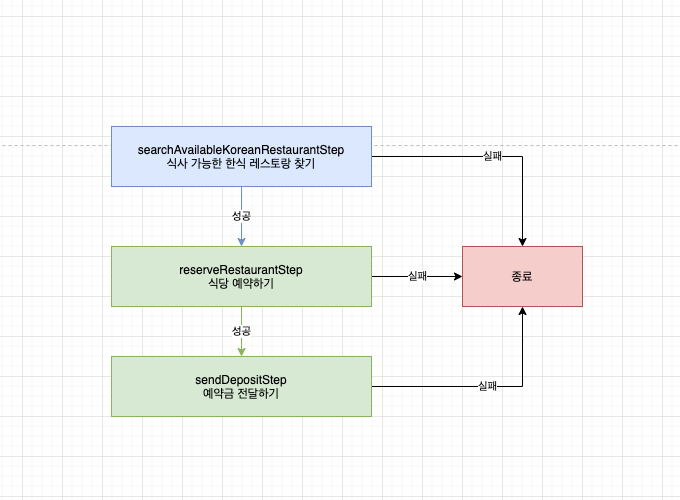

~~~java

/**
 * 예약 가능한 식당을 자동으로 예약해주는 서비스
 * 단, 외국인 관광객들을 위하여 예약하다보니 한식 레스토랑만 예약한다.
 **/
@Bean
public Job reserveRestaurantJob(
 JobBuilderFactory jobBuilderFactory,
 Step searchAvailableKoreanRestaurantStep,
 Step reserveRestaurantStep,
 Step sendDepositStep
){
        return jobBuilderFactory
        .get("reserveRestaurantJob") // job name
        .start(searchAvailableKoreanRestaurantStep) // step 1
        .next(reserveRestaurantStep) // step 2
        .next(sendDepositStep) // step 3
        .build();
        
        }

~~~

+ 식사 가능한 한식 레스토랑이 없으면 식사 가능한 아시안 레스토랑을 찾는다
+ 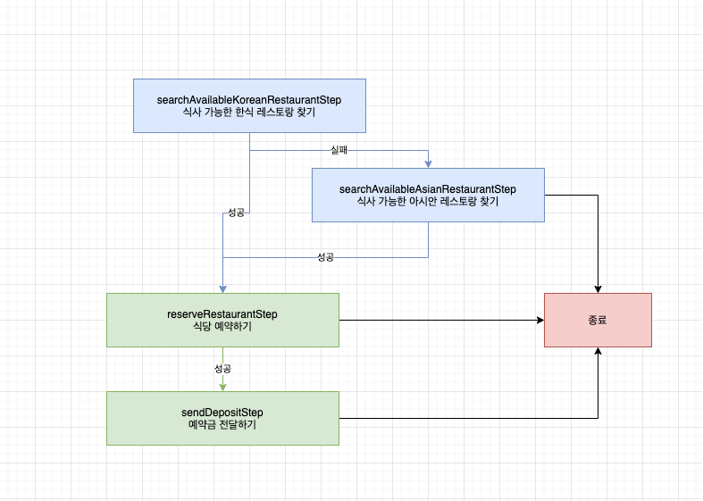

~~~java

@Bean
public Job reserveRestaurantJob(
        // 생략
        ) {
        return jobBuilderFactory
        .get("reserveRestaurantJob")
        .start(searchAvailableKoreanRestaurantStep)
        .on("FAILED") // searchAvailableKoreanRestaurantStep가 FAILED인 경우
        .to(searchAvailableAsianRestaurantStep) // searchAvailableAsianRestaurantStep 실행
        .on("FAILED") // searchAvailableAsianRestaurantStep가 FAILED인 경우
        .end() // 아무것도 하지않고 flow 종료
        .from(searchAvailableKoreanRestaurantStep)
        .on("*") // searchAvailableKoreanRestaurantStep가 FAILED가 아니라면
        .to(reserveRestaurantStep) // reserveRestaurantStep 실행
        .next(sendDepositStep) // sendDepositStep 실행
        .from(searchAvailableAsianRestaurantStep)
        .on("*") // searchAvailableAsianRestaurantStep가 FAILED가 아니라면
        .to(reserveRestaurantStep) // reserveRestaurantStep 실행
        .next(sendDepositStep) // sendDepositStep 실행
        .end() // job 종료
        .build();
        }

~~~

##### JobBuilderFactory를 가져올 수 없다면?
+ SpringBatch에서는 EnableBatchProcessing 어노테이션을 달면 아래 bean들을 사용할수 있도록 미리 구현되어있다
+ SpringBatch 프로젝트를 만들게 된다면 필수적으로 EnableBatchProcessing를 추가해주어야한다

~~~java

@EnableBatchProcessing
@SpringBootApplication
public class SpringBatchPracticeApplication {
 public static void main(String[] args) {
 SpringApplication.run(SpringBatchPracticeApplication.class);
 }
}

~~~
+ EnableBatchProcessing로 사용할 수 있게 되는 Bean들
  + JobRepository (bean name "jobRepository")
  + JobLauncher (bean name "jobLauncher")
  + JobRegistry (bean name "jobRegistry")
  + JobExplorer (bean name "jobExplorer")
  + PlatformTransactionManager (bean name "transactionManager")
  + JobBuilderFactory (bean name "jobBuilders")
  + StepBuilderFactory (bean name "stepBuilders")

#### Step
+ 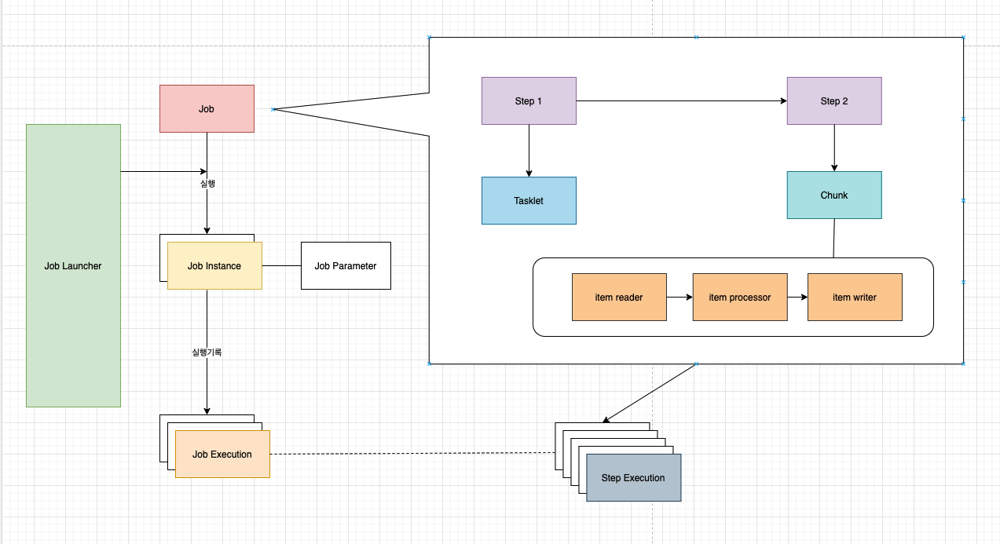
+ 실질적으로 요청을 처리하는 객체이다
+ Step은 Job과 마찬가지로 행위에 대한 명세서이다
+ 1개의 Job에 여러개의 Step을 포함할 수 있다
+ 따라서 1개의 JobExecution에 여러개의 StepExecution을 포함할 수 있다

##### StepExcution
+ Step이라는 명세서를 실행시켜 실행된 기록이다
+ JobExecution가 Job의 실행 정보를 가지고 있는 것 처럼 StepExecution은 Step의 실행정보를 가지고 있다

~~~java

// Step의 이름
stepExecution.getStepName();
// JobExecution
stepExecution.getJobExecution();
// Step의 시작시간, 종료시간
stepExecution.getStartTime();
stepExecution.getEndTime();
// Execution Context
stepExecution.getExecutionContext();
// Step의 실행 결과
stepExecution.getExitStatus();
// Step의 현재 실행 상태 (Batch Status)
stepExecution.getStatus();

~~~

##### StepExecutionContext
+ JobExcutioniContext가 1개의 Job에서 공유하는 공간이면 StepExecutionContext는 1개의 Step내에서 공유하는 공간(Context)이다 

##### PlatformTransactionManager
+ StepBuilderFactory로 Step을 정의할 때 transactionManager를 받을 수 있다
+ EnableBatchProcessing를 추가하면 기본 transactionManager를 사용할 수 있다
  (다만, 프로젝트에서 datasource가 여러개인 경우에는 직접 별도로 transactionManager를 만들어 사용해야 한다)

~~~java

@Autowired
PlatformTransactionManager transactionManager;

~~~

+ transactionManager를 StepBuilderFactory에 추가하면 해당 Step은 transactionManager를 사용해서 내부의 transaction을 관리한다

##### JobScope
+ 일반적으로 Scope을 지정하지 않는다면 처음 스프링부트가 시작될 때 모든 bean이 생성된다
+ Step을 생성하는 코드에 JopScope 어노테이션을 달면 Step을 스프링 부트가 시작될 때 바로 만들지 않고 lazy하게(늦게) 연관된 Job이 Step을 실행하는 시점에 만들어진다 

#### Tasklet
+ Step을 구현할 때 구현방법에는 크게 Tasklet 방식이 있고 Chunk 방식이 있다
+ Tasklet은 Chunk보다 단순한 방식으로 단일 작업을 구현한다
+ Tasklet Interface는 execute를 구현해야한다

~~~java

public interface Tasklet {
    @Nullable
    RepeatStatus execute(StepContribution contribution, ChunkContext chunkContext) throws Exception;
}

~~~

+ StepBuilderFactory로 Step을 만들 때 tasklet()안에다가 구현한 Tasklet을 넣어주면 된다

~~~java

return stepBuilderFactory
 .get("sampleStep")
 .transactionManager(transactionManager)
 .tasklet(sampleTasklet)
 .build();

~~~

##### Tasklet의 상태
+ Tasklet의 상태는 계속 진행할지, 끝낼지 두가지로만 표현된다
+ RepeatStatus.FINISHED가 반환되면 tasklet이 바로 끝나고 RepeatStatus.CONTINUABLE이 반환되면 Tasklet을 다시 실행한다
+ null을 반환하면 FINISHED와 동일하게 인지한다

~~~java

/**
 * 무한히 종료되지 않는 Tasklet이다.
 * 아래와 같이 구현하면 안된다.
 **/
@Bean
@StepScope
public Tasklet sampleTasklet() {
 return (contribution, chunkContext) -> {
 log.info("never ending tasklet");
 return RepeatStatus.CONTINUABLE;
 };
}

~~~

~~~java

/**
 * finish를 log에 찍고 종료하는 Tasklet이다.
 **/
@Bean
@StepScope
public Tasklet sampleTasklet() {
 return (contribution, chunkContext) -> {
 log.info("finish");
 return RepeatStatus.FINISHED;
 };
}

~~~

##### Tasklet을 만들 때 주의할점

~~~java

@Bean
@StepScope
public Tasklet hugeReadTasklet(
 PriceRepository priceRepository
) {
 return (contribution, chunkContext) -> {
 // findByDate로 조회된 데이터가 1천만개 입니다.
 List<Price> prices = priceRepository.findByDate(LocalDate.now());
 // price를 모두 0으로 초기화합니다.
 prices.forEach(price -> price.setAmount(0L));
 // 1천만개의 데이터를 저장합니다.
 priceRepository.saveAll(prices);
 return RepeatStatus.FINISHED;
 };
}

~~~

+ priceRepository.findByDate를 통해서 얼마나 많은
  데이터를 가져올지 예측이 불가하다.
  데이터가 너무 많다면 천만개의 데이터를 조회할 수도
  있다. 천만개의 데이터를 한번에 가져온다면 메모
  리 이슈로 인해 처리가 불가해지고 OOM이 발생할 수
  도 있다.
+ Tasklet 형식의 Step에 transactionManager를 추
  가하게 되면 해당 Tasklet은 Transaction에 묶이게
  됩니다. 이때 Tasklet에서 너무 많은 데이터를 불러오
  고 쓰게 되면 Tasklet의 Transaction은 너무 거대해
  지게되어 Database Transaction 1개가 처리해야할
  일이 너무 많아지게 된다
+ 대부분 이런 경우에는 Chunk Processing 을 사용하게 되면 해결된다

#### Chunk Processing

##### 일반적인 Chunk 기반 Step 흐름 이해하기
1. 트랜잭션 시작
2. Item Reader가 데이터 1개 제공하기
3. Item Processor를 통해 데이터 1개를 가공하기
4. chunk size만큼 데이터가 쌓일때 까지 2~3를 반복한다
5. Writer에게 데이터 전달하기 (보통의 경우 Database에 저장)
6. 트랜잭션 종료
7. 2이 더이상 진행될수 없을때까지 1~6를 계속 해서 반복

+ 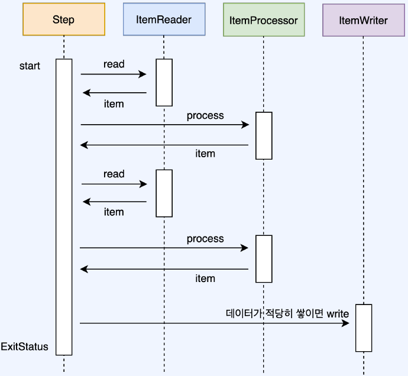

##### Chunk Processing 구현방법
+ Step을 Chunk방식으로 구현하기 위해서는 StepBuilderFactory에서 <A,B>chunk(100)를 사용하면된다.
+ 그리고 reader, processor, writer를 넣어주면 된다.
+ Chunk processing을 구현할 때는 ItemReader, ItemProcessor, ItemWriter를 구현해야 하지만 3가지 모두가 필수는 아니다
+ temReader와 ItemWriter만 필수이고 ItemProcessor는 구현 하지 않아도 상관 없다.
+ Chunk Processing와 ItemReader, ItemProcessor, ItemWriter는 제네릭 Type이 일치해야 합니다.

~~~java

@Bean
@JobScope
public Step saveOrderedPriceStep(
 StepBuilderFactory stepBuilderFactory,
 PlatformTransactionManager transactionManager,
 JpaPagingItemReader<Order> orderReader,
 ItemProcessor<Order, Price> orderToPriceProcessor,
 ItemWriter<Price> priceWriter
) {
 return stepBuilderFactory.get("saveOrderedPriceStep")
 .transactionManager(transactionManager)
 // Order를 read해서 Price로 process한뒤 Price를 Write한다.
 .<Order, Price>chunk(1000)
 // 주문된 데이터 read하기
 .reader(orderReader)
 // 주문정보에서 가격으로 변환
 .processor(orderToPriceProcessor)
 // 가격을 write
 .writer(priceWriter)
 .build();
}

~~~

#### ItemReader
+ chunk 프로세싱에서 데이터를 제공하는 interface이다 
+ ItemReader는 반드시 read메소드를 구현해야한다
+ read메소드를 통해서 ItemProcessor 또는 ItemWriter에게 데이터를 제공한다
+ read메소드가 null을 반환하면 더이상 데이터가 없고 step을 끝내겠다고 판단한다
+ 그렇기 때문에 처음부터 null을 반환했다고 하더라도 에러가 나지 않는다.(단, 데이터가 없으니 Step은 바로 종료)

~~~java

public interface ItemReader<T> {
    @Nullable
    T read() throws Exception, UnexpectedInputException, ParseException, NonTransientResourceException;
}

~~~

##### ItemReader가 데이터를 가져오는 방법
+ ItemReader의 read를 보면 1개를 반환한다
+ 1개씩 계속해서 읽고 더이상 읽을수 없을 때 까지 (null이 나올때까지) 반복한다. 그렇다고 해서 ItemReader가 데이터를 반드시 1개씩 조회한다는 뜻은 아니다.
+ ItemReader의 데이터 조회 방식을 크게 두가지로 나눌수 있다
  1. 정말 1개씩 데이터를 가져와서 read의 결과로 주는 방식
  2. 한번에 대량으로 가져오고 가져온 데이터에서 하나씩 빼주는 방식(단, 대량으로 가져올때 최대 가져올수 있는 개수는 정해져있어야한다.)

##### ItemReader가 데이터를 가져오는 대상
+ ItemReader가 데이터를 가져오는 대상은 정말 다양할 수 있다.
+ 그리고 원하면 얼마든지 어느곳에서든 데이터를 가져올 수 있는 ItemReader를 만들 수 있다.
+ 보통은 file과 database에서 데이터를 가져오는 경우가 대부분이다.

###### Flat File
+ 보통 구분자로 나누어져 있는 파일을 읽는다. 
+ 그 예로 csv(comma-separated values) 파일이 있다

~~~java

@Bean
@StepScope
public FlatFileItemReader<Point> pointFlatFileItemReader(){
        return new FlatFileItemReaderBuilder<Point>()
        .name("pointFlatFileItemReader")
        .resource(new FileSystemResource(filePath))
        .delimited()
        .delimiter(",")
        .names("id","amount")
        .targetType(Point.class)
        .recordSeparatorPolicy(
        new SimpleRecordSeparatorPolicy(){
@Override
public String postProcess(String record){
        return record.trim();
        }
        }
        )
        .build();
        }

~~~

###### 데이터베이스 - JdbcCursorItemReader
+ JdbcCursorItemReader
+ Jdbc Cursor로 조회하여 결과를 Object에 Mapping해 서 넣어주는 방식입

~~~java

@Bean
@StepScope
public JdbcCursorItemReader<Point> pointJdbcCursorItemReader() {
 return new JdbcCursorItemReaderBuilder<Point>()
 .fetchSize(1000)
 .dataSource(dataSource)
 .rowMapper(new BeanPropertyRowMapper<>(Point.class))
 .sql("SELECT id, amount FROM point")
 .name("pointJdbcCursorItemReader")
 .build();
}

~~~

###### 데이터베이스 - JdbcPagingItemReader

~~~java

@Bean
@StepScope
public JdbcPagingItemReader<Point> pointJdbcPagingItemReader(
 PagingQueryProvider pointQueryProvider
) throws Exception {
 Map<String, Object> parameterValues = new HashMap<>();
 parameterValues.put("amount", 100);
 return new JdbcPagingItemReaderBuilder<Point>()
 .name("pointJdbcPagingItemReader")
 .pageSize(chunkSize)
 .fetchSize(chunkSize)
 .dataSource(dataSource)
 .rowMapper(new BeanPropertyRowMapper<>(Point.class))
 .queryProvider(createQueryProvider)
 .parameterValues(parameterValues)
 .build();
}

~~~

~~~java

@Bean
@StepScope
public PagingQueryProvider pointQueryProvider() throws Exception {
 SqlPagingQueryProviderFactoryBean queryProvider =
 new SqlPagingQueryProviderFactoryBean();
 queryProvider.setDataSource(dataSource);
// Database에 맞는 PagingQueryProvider를 선택하기 위해
 queryProvider.setSelectClause("id, amount");
 queryProvider.setFromClause("from point");
 queryProvider.setWhereClause("where amount >= :amount");
 Map<String, Order> sortKeys = new HashMap<>(1);
 sortKeys.put("id", Order.ASCENDING);
 queryProvider.setSortKeys(sortKeys);
 return queryProvider.getObject();
}

~~~

###### 데이터베이스 - JpaPagingItemReader
+ Jpa Pagination을 사용하여 데이터를 조회
+ 실제 Database에 조회하는 쿼리에 추가적인 조건이 붙는다
+ MySQL의 경우에는 limit 조건이 붙고 Oracle의 경우에는 rownum 조건이 붙는다.

~~~java

@Bean
@StepScope
public JpaPagingItemReader pointJpaPagingItemReader() {
 return new JpaPagingItemReaderBuilder<Point>()
 .name("pointJpaPagingItemReader")
 .entityManagerFactory(entityManagerFactory())
 .queryString("select p from Point p")
 .pageSize(1000)
 .build();
}

~~~

###### 데이터베이스 - RepositoryItemReader
+ Repository에서 구현한 메소드의 이름을 넣는 방식
+ 주의할 점은 이 메소드의 인자에 pageable이 포함되어있어서 Pagination을 지원하는 상황이여야한다

~~~java

@Bean
@StepScope
public RepositoryItemReader<Point> pointRepositoryItemReader(
 PointRepository pointRepository
) {
 return new RepositoryItemReaderBuilder()
 .repository(pointRepository)
 .methodName("findByAmountGreaterThan")
 .pageSize(1000)
 .maxItemCount(1000)
 .arguments(Arrays.asList(BigInteger.valueOf(100)))
 .sorts(Collections.singletonMap("id", Sort.Direction.ASC))
 .name("pointRepositoryItemReader")
 .build();
}

~~~

~~~java

public interface PointRepository extends JpaRepository<Point, Long> {
  Page<Point> findByAmountGreaterThan(Long amount, Pageable pageable);
}

~~~

#### ItemProcessor
+ ItemProcessor는 ItemReader에서 read()로 넘겨준 데이터를 개별로 가공
+ ItemProcessor는 언제 사용할까? 
  + 대부분 ItemProcessor는 두가지 이유로 사용
  + ItemReader가 넘겨준 데이터를 가공하려고 할때
  + 데이터를 Writer로 넘길지 말지 결정할때 (null을 return하면 writer에 전달하지 않는다)
+ ItemProcessor는 필수가 아니다.
  + 정말 ItemProcessor가 필요 없는 경우
  + ItemReader나 ItemWriter에서 데이터를 직접 가공까지하는 경우

##### ItemProcessor는 어떻게 구현할까?
+ ItemProcessor는 process를 구현하면 된다.
+ ItemProcessor는 Input과 Output이 있으며 Input(item)을 받아서 Output형식으로 변환한뒤 반환해야한다. 이때 Input과 Output의 type은 같을 수도 있고 다를 수도 있다.

~~~java

public interface ItemProcessor<I, O> {
  @Nullable
  O process(@NonNull I item) throws Exception;
}

~~~

~~~java

/**
 * 주문정보(Order)로 10000원이 넘는 가격(Price)을 찾는 Processor
 **/
@Bean
@StepScope
public ItemProcessor<Order, Price> findExpensivePriceProcessor(
 PriceRepository priceRepository
) {
 return order -> {
 Price price = priceRepository.findByProductId(order.productId);
 if (price.amount > 10000)
 return price
 else
 return null // writer에 데이터를 넘기지 않는다.
 };
}

~~~

##### CompositeItemProcessor
+ ItemProcessor 여러개를 체인처럼 연결할 때 사용
+ read를 통해 나온 item은 processor1 → processor2 를 연속적으로 통과
+ processor의 코드와 역할을 나누고자 할 때 사용

~~~java

@Bean
@StepScope
public CompositeItemProcessor compositeProcessor(
 ItemProcessor<Order, Order> processor1,
 ItemProcessor<Order, Price> processor2
) {
 List<ItemProcessor> delegates = List.of(processor1, processor2);
 CompositeItemProcessor processor = new CompositeItemProcessor<>();
 processor.setDelegates(delegates);
 return processor;
}

~~~

#### ItemWriter
+ Chunk Processing의 마지막 단계로 Item을 쓰는 단계
+ ItemReader와 ItemProcessor를 거쳐 처리된 Item을 Chunk 단위 만큼 처리한 뒤 이를 ItemWriter에 전달한
+ ItemWriter는 item 1개가 아니라 데이터의 묶음인 Item List를 처리한다.
+ ItemWriter가 쓰기를 하는 대상은 그 어떤것도 될수 있다.
+ 파일이나 RDBMS, NoSQL에 데이터를 쓸수도 있고 다른 API 호출을 할수도 있다.

~~~java

public interface ItemWriter<T> {
    void write(List<? extends T> items) throws Exception;
}

~~~

##### JdbcBatchItemWriter

~~~java

public JdbcBatchItemWriter<Point> jdbcBatchItemWriter() {
 return new JdbcBatchItemWriterBuilder<Point>()
 .dataSource(dataSource)
 .sql("insert into point(point_wallet_id, amount) values (:point_wallet_id, :amount)")
 .beanMapped()
 .build();
}

~~~

##### JpaItemWriter

~~~java

@Bean
public JpaItemWriter<Point> jpaItemWriter() {
 JpaItemWriter<Point> jpaItemWriter = new JpaItemWriter<>();
 jpaItemWriter.setEntityManagerFactory(entityManagerFactory);
 return jpaItemWriter;
}

~~~

##### ItemWriter 커스텀

~~~java

public interface ItemWriter<T> {
    void write(List<? extends T> items) throws Exception;
}

~~~

~~~java

@Bean
@StepScope
public ItemWriter<Point> expirePointWriter(
 PointRepository pointRepository
) {
 return points -> {
 pointRepository.saveAll(points);
 };
}

~~~

##### 왜 ItemWriter는 List로 처리할까?
+ ItemReader의 read와 ItemProcessor를 보면 1개를 반환한다다. 그러나 ItemWriter는 List로 처리한다
+ ItemWriter에서는 대부분 쓰기작업이 일어난다. 이런 쓰기 작업을 건별로 처리하면 효율이 떨어지고 성능에 문제가 되는 경우가 많다.
+ 예를 들어 ItemWriter에서 Database에 insert한다고 하면 1000개의 데이터를 한번에 저장하는 것과 개별 트랜잭션으로 1개씩 저장하는 것은 많은 성능 차이를 만든다
+ 그럼에도 불구하고 건별로 처리하고자 한다면 items를 받아서 element를 건별로 처리하도록 ItemWriter를 구현하면 된다

#### Listener
+ Spring Batch에서는 메인 로직 외에 구간 사이사이에 어떤 일을 처리하고자 할때 Listener를 사용
+ 예를 들면 Job, Step, chunk, ItemReader, ItemWriter, ItemProcessor의 실행 직전과 직후에 어떤 행위를 할지 정의할 수 있다.

##### Listener의 종류
+ JobExecutionListener
+ StepExecutionListener
+ ChunkListener
+ ItemReadListener
+ ItemProcessListener
+ ItemWriteListener

##### JobExecutionListener
+ Job의 실행 전 beforeJob / 실행 후 afterJob을 구현한다.
+ 인자로 JobExecution을 넘겨준다
+ 구현된 JobExecutionListener는 아래처럼 jobBuilderFactory에서 Job을 만들 때 listerner()에 포함시켜주면 된다

~~~java

public interface JobExecutionListener {
  void beforeJob(JobExecution jobExecution);
  void afterJob(JobExecution jobExecution);
}

~~~

~~~java

@Bean
public Job sampleJob(
 JobBuilderFactory jobBuilderFactory,
 JobListener jobListener,
 Step sampleStep
) {
 return jobBuilderFactory.get("sampleJob")
 .listener(jobListener)
 .start(sampleStep)
 .build();
}

~~~

+ 여기서 jobExecution을 인자로 주는데 job의 상태를 확인하고 관리할 수 있고 jobExecutionContext도 수정할수 있다.

~~~java

public class JobListener implements JobExecutionListener {
 @Override
 public void afterJob(JobExecution jobExecution) {
 // jobExecution의 Job Instance
 jobExecution.getJobInstance();
 // jobExecution 에서 사용한 Job Parameters
 jobExecution.getJobParameters();
 // job 시작시간과 종료시간
 jobExecution.getStartTime();
 jobExecution.getEndTime();
 // job의 실행결과 (exit code)
 jobExecution.getExitStatus();
 // job의 현재상태 (Batch Status)
 jobExecution.getStatus();
 // job execution context
 jobExecution.getExecutionContext();
 }
}

~~~

~~~java

public class JobListener implements JobExecutionListener {
 @Override
 public void beforeJob(JobExecution jobExecution) {
 // job execution context
 jobExecution.getExecutionContext();
 Map<String, Object> executionContextMap = new HashMap<>();
 executionContextMap.put("name", "홍길동");
 executionContextMap.put("birth", LocalDate.of(1998, 1, 2));
 jobExecution.setExecutionContext(
 new ExecutionContext(executionContextMap)
 );
 }
}

~~~

##### StepExecutionListener
+ StepExecution을 인자로 주는데 step의 상태를 확인하고 관리할 수 있고 stepExecutionContext도 수정할 수 있다.

~~~java

public class StepListener implements StepExecutionListener {
  @Override
  public void afterStep(StepExecution stepExecution) {
    // Step의 이름
    stepExecution.getStepName();
    // JobExecution
    stepExecution.getJobExecution();
    // Step의 시작시간, 종료시간
    stepExecution.getStartTime();
    stepExecution.getEndTime();
    // Execution Context
    stepExecution.getExecutionContext();
    // Step의 실행 결과
    stepExecution.getExitStatus();
    // Step의 현재 실행 상태 (Batch Status)
    stepExecution.getStatus();
  }
}

~~~

##### ChunkListener
+ 1개의 chunk가 돌기 전, 후 그리고 에러 발생시 어떤 행위를 할 수 있는지 정의할 수 있다.

~~~java

public interface ChunkListener extends StepListener {
  static final String ROLLBACK_EXCEPTION_KEY = "sb_rollback_exception";
  void beforeChunk(ChunkContext context);
  void afterChunk(ChunkContext context);
  void afterChunkError(ChunkContext context);
}

~~~

##### ItemReadListener
+ ItemReader가 1개의 Item을 read를 하기 전, 후 그리고 에러발생시 어떤 행위를 할 수 있는지 정의할 수 있다.

~~~java

public interface ItemReadListener<T> extends StepListener {
  void beforeRead();
  void afterRead(T item);
  void onReadError(Exception ex);
}

~~~

##### ItemProcessListener
+ ItemProcessor가 1개의 Item을 process 하기 전, 후 그리고 에러발생시 어떤 행위를 할 수 있는지 정의할 수 있다.

~~~java

public interface ItemProcessListener<T, S> extends StepListener {
  void beforeProcess(T item);
  void afterProcess(T item, @Nullable S result);
  void onProcessError(T item, Exception e);
}

~~~

##### ItemWriteListener
+ ItemWriter가 item List를 처리하기 전, 후 그리고 에러발생시 어떤 행위를 할 수 있는지 정의할 수 있다.

~~~java

public interface ItemWriteListener<S> extends StepListener {
  void beforeWrite(List<? extends S> items);
  void afterWrite(List<? extends S> items);
  void onWriteError(Exception exception, List<? extends S> items);
}

~~~

#### SpringBatchTest

##### JobLauncherTestUtils
+ SpringBatch를 테스트 할 때는 JobLauncherTestUtils를 사용한다
+ launchJob을 하게되면 job이 실행된다.

~~~java

JobLauncherTestUtils jobLauncherTestUtils = new JobLauncherTestUtils();
jobLauncherTestUtils.setJob(job);
jobLauncherTestUtils.setJobLauncher(jobLauncher);
jobLauncherTestUtils.setJobRepository(jobRepository);
jobLauncherTestUtils.launchJob(jobParameters)

~~~

+ JobLauncherTestUtils는 spring-batch-test 의존성을 추가하면 사용할 수 있다
  + testImplementation 'org.springframework.batch:spring-batch-test'
+ JobLauncherTestUtils.launchJob을 통해 반환되는 값은 JobExecution이다.
+ JobExecution의 ExitStatus를 확인함으로써 Job이 성공적으로 끝났는지 확인할 수 있다.

~~~java

JobExecution launchJob(Job job, JobParameters jobParameters) throws Exception {
 JobLauncherTestUtils jobLauncherTestUtils = new JobLauncherTestUtils();
 jobLauncherTestUtils.setJob(job);
 jobLauncherTestUtils.setJobLauncher(jobLauncher);
 jobLauncherTestUtils.setJobRepository(jobRepository);
 return jobLauncherTestUtils.launchJob(jobParameters == null ? new JobParametersBuilder().toJobParameters() : jobParameters);
}

JobExecution execution = launchJob(messageExpiredPointJob, jobParameters);
// then
then(execution.getExitStatus()).isEqualTo(ExitStatus.COMPLETED);

~~~

##### SpringBatchTest
+ SpringBatchTest 어노테이션은 Spring 4.1 이후부터 추가되었다.
+ @SpringBatchTest를 테스트 클래스 위에 달게되면 테스트하기전에 필요한 수많은 작업들을 미리 해준다.
+ JobLauncherTestUtils도 자동으로 만들어주기 때문에 그냥 Bean으로 가져다 쓰면된다.

~~~java

@RunWith(SpringRunner.class)
@SpringBatchTest
@ContextConfiguration(classes = {SampleJobConfiguration.class})
@ActiveProfiles("test")
public class SampleBatchTest {
  @Autowired
  private JobLauncherTestUtils jobLauncherTestUtils;

  @Test
  void launchJobTest() throws Exception {
    JobExecution jobExecution = jobLauncherTestUtils.launchJob(jobParameters);
    then(execution.getExitStatus()).isEqualTo(ExitStatus.COMPLETED);
  }
}

~~~

##### @SpringBatchTest를 사용할까요?
+ @SpringBatchTest에 있는 JobLauncherTestUtils를 사용하기 위해서는 테스트가 Scan하는 범위내에 단 1개의 Job만 Bean으로 등록이 되 어있어야한다.
+ 1개의 Job만 Bean으로 등록하는 것은 테스트할 때 @ContextConfiguration(classes=SampleJobConfiguration.class)와 같이 테스트 하고 싶은 Job만 scan범위를 제한하면 된다.
+ 그러나 우리가 테스트 코드를 만들다보면 편의상 어떤 Bean이 필요한지 선택하기가 어려워서 @SpringBootTest로 모든 Job을 생성하는 경우가 많다. (Bean의 관계가 복잡한 경우에는 더더욱 그렇다)
+ 이렇게 되면 @SpringBatchTest를 사용할 수 없기 때문에 선택의 기로에 서게 된다.

### 프로젝트 구현 

#### Batch Application 만들기 

##### BatchConfig

~~~java

@EnableBatchProcessing
@Configuration
public class BatchConfig {
}

~~~

+ EnableBatchProcessing를 추가하면 사용할 수 있게 되는 Bean들
  + JobRepository (bean name "jobRepository")
  + JobLauncher (bean name "jobLauncher")
  + JobRegistry (bean name "jobRegistry")
  + JobExplorer (bean name "jobExplorer")
  + PlatformTransactionManager (bean name "transactionManager")
  + JobBuilderFactory (bean name "jobBuilders")
  + StepBuilderFactory (bean name "stepBuilders")

##### application.yml

~~~yaml

spring:
 batch:
    job:
      names: ${job.name:NONE} # spring.batch.job.names를 job.name으로 치환
    jdbc:
      initialize-schema: always # batch에서 사용하는 스키마 생성여부를 always로 변경
 jpa:
   show-sql: true # sql 로그로 남기기를 true로 변경
   hibernate:
    ddl-auto: validate # entity를 보고 자동으로 데이터베이스 생성 여부를 validate (생성은 안하고 검증만)로 변경

~~~

+ spring.batch.job.names: ${job.name:NONE}
  + job이름을 넣어주면 그 Job이름을 보고 job을 실행
  + 원래 대로라면 job 이름을 줄때 아래와 같이 줄수 있다.
    + java -jar batch.jar --spring.batch.job.names=expirePointJob
  + 이 설정을 넣어주면 spring.batch.job.names를 job.name으로 치환해서 넣을 수 있게 된다
  + 원래는 Job 이름을 넣지 않고 프로젝트를 실행시키면 모든 Job이 실행
  + 기본 Job이름을 NONE으로 설정해두면 job이름을 주지 않고 프로젝트를 실행시키면 그냥 아무런 Job도 실행시키지 않는다.
    + java -jar batch.jar --job.name=expirePointJob
+ spring.batch.jdbc.initialize-schema: always
  + Spring Batch는 배치의 중간 상태나 결과를 데이터베이스에 남길 수 있다.
  + 따라서 데이터베이스에 기록 저장용 스키마와 데이블이 있어야한다
  + 이 테이블을 서버가 뜰때 확인해서 없으면 자동으로 만들어 줄 것인지 물어보는 거다.
  + 만약에 테이블이 없다면 자동으로 만들어 줄거다.
+ spring.jpa.show-sql : true
  + jpa가 Database에 요청하는 쿼리를 보여줄 것인지 아닌지 결정하는 값
  + true이면 쿼리를 보여준다
  + 다만, 쿼리가 너무 많이 찍히게 되면 로그파일의 크기가 커지고 로그를 보기 어려워질 수도 있어서 상황에 맞게 사용해야한다
+ spring.jpa.hibernate.ddl-auto: validate
  + 코드에서 선언한 Entity를 보고 실제 database에 DDL을 반영할지 선택하는 값이다
  + none: 아무런 행동도 하지 않는다.
  + update: Database와 다른점이 있는지 확인하고 다른 부분만 변경한다.
  + validate: Database와 코드가 다른지 확인합니다. 다르면 에러가 발생되고 종료된다.
  + create: 프로그램이 시작할 때 모든 Database를 드랍하고 코드를 보고 새로 만든다.
  + create-drop: 프로그램이 시작할 때 모든 Database를 드랍하고 코드를 보고 새로 만든다. 그리고 프로그램이 종료되면 다시 Database를 드랍한다.

#### docker mysql 연동하기
+ Docker로 MySQL을 설치한다고?
  + 실제로 운영환경에서 데이터 베이스(MySQL)를 도커에 설치하는 경우는 없다
  + 그러나 많은 개발자들은 개발을 위해서 개인 PC환경에 MySQL를 설치하고 싶어하지 않는다
  + 그 이유는 데이터 베이스를 설치하게되면 PC의 많은 리소스를 소모하게 되어 개인 PC의 성능저하를 일으킬 수 있기 때문이다.
  + 또한, 데이터베이스가 불필요해져서 설치 후 삭제를 할 때 귀찮은 과정이 많고 삭제가 정말 올바르게 되었는지 찝찝하다.
  + 그래서 도커를 설치하여 MySQL를 도커 컨테이너로 사용하고 불필요해지면 컨테이너만 삭제하면 되는 깔끔한 방식을 사용
    + 개발환경을 위한 별도의 MySQL 서버가 준비되어있거나 개인PC에 그냥 설치해서 쓰시겠다고 해도 전혀 문제가 없다
+ Docker 설치
  + [https://www.docker.com/get-started](https://www.docker.com/get-started)
+ Docker Image & Container
  + 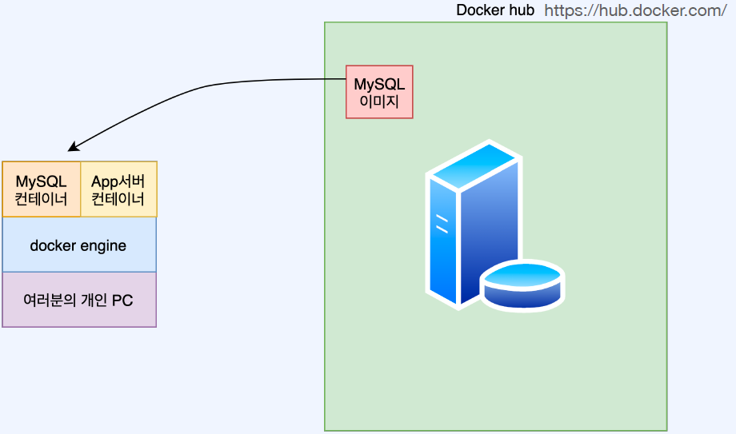
  + [Docker hub](https://hub.docker.com/)
+ Docker MySQL RUN
  + docker run : 도커 컨테이너 실행
  + -p 33060:3306 : 포트 파인딩 컨테이너 내부의 3306포트를 외부의 33060와 연결한다.
  + --name : 컨테이너 이름
  + -e : 컨테이너의 환경변수 지정 (MYSQL_ROOT_PASSWORD=password 을 통해 password를 password로 지정한다)
  + -d : 컨테이너 실행은 백그라운드에서 진행
  + 애플실리콘
    + docker run -p 33060:3306 --name point-mysql -e MYSQL_ROOT_PASSWORD=password --platform linux/amd64 -d mysql:8.0.26
  + 그외 
    + docker run -p 33060:3306 --name point-mysql -e MYSQL_ROOT_PASSWORD=password -d mysql:8.0.26
+ Docker MySQL 접속해보기
  + 컨테이너 bash 실행
    + docker exec -i -t <container Id> /bin/bash
    + 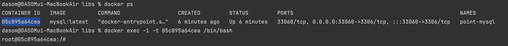
  + mysql 을 실행시킵니다. (password를 물어보면 'password'를 입력)
    + mysql -u root -p
  + root의 password를 초기화
    + alter user 'root'@'%' identified with mysql_native_password by 'password';
+ Docker MySQL 컨테이너 삭제하기
  + MySQL를 삭제하려고 한다면 간단하게 MySQL 컨테이너를 삭제하면 된다
  + 컨테이너 조회
    + docker ps
    + 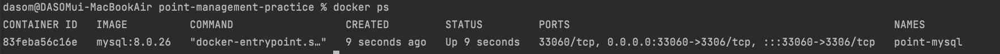
  + 컨테이너 Stop
    + docker stop <container Id>
  + 컨테이너 삭제
    + docker rm <container Id>
    + 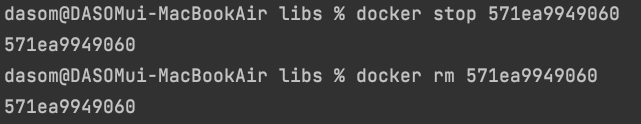
+ Docker MySQL 이미지 삭제하기
  + MySQL를 삭제하려고 한다면 간단하게 MySQL 컨테이너를 삭제하면 됩니다.
  + 이미지 가져오기
    + docker pull <image이름:버전>
  + 이미지 조회
    + docker images
    + 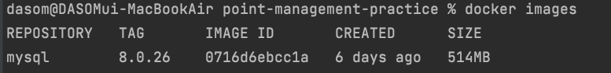
  + 이미지 삭제
    + docker rmi <image Id>
    + 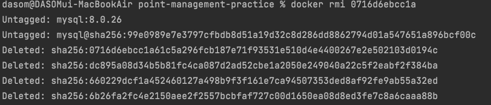
    
#### MySQL Table 생성하기
+ Database 생성
  + MySQL 실행
    + docker exec -i -t <container Id> /bin/bash
    + mysql -u root -p
  + Database 생성
    + create database point;
  + Database 사용
    + use point;
+ Application의 datasource 설정
  
~~~yaml

datasource: # datasource 정의
  url: jdbc:mysql://127.0.0.1:33060/point?useUnicode=true&characterEncoding=utf8
  driver-class-name: com.mysql.cj.jdbc.Driver # 드라이버 클래스명을 mysql로 지정
  username: root
  password: password

~~~

#### 테스트 구현하기
+ 테스트 기초 
  + Test는 given when then 절로 구분해서 구현한다.
  + 이런 구분을 명시적으로 해주는 테스트 툴도 있지만 대부분은 개발자가 자체적으로 구분해서 처리
  + given : 테스트를 하기 위한 조건을 세팅합니다.
  + when : 테스트하고자 하는 메소드나 대상을 실행합니다.
  + then : 테스트 결과를 검증합니다.

~~~java

@Test
void 더하기_테스트() {
 // given
 int firstNum = 1;
 int secondNum = 2;
 // when
 int result = firstNum + secondNum;
 //then
 assertEquals(3, result);
}

~~~

+ assertj
  + then 절의 검증 코드를 더 쉽게 구현해주는 라이브러리 
  + 필요하다고 생각하는 모든 검증 메소드가 포함

~~~java

then(3).isEqualTo(3); // 3 = 3
then(List.of(1,2,3,4)).hasSize(4); // 리스트의 길이는 4
then("abcdef").startsWith("abc"); // 문자열은 abc로 시작
then(BigInteger.valueOf(1000)).isEqualByComparingTo(BigInteger.valueOf(1000)); // BigInteger 1000은 BigInteger 1000
then(LocalDate.of(2020, 5, 5)).isAfter(LocalDate.of(1999, 4, 3)); // 2020-05-05 > 1999-04-03
then(1 + 2).isEqualTo(3);
~~~

+ BatchTestSupport
  + 단위테스트가 아닌 Batch Test를 할 때는 여러가지 설정을 해줘야한다.

~~~java

@SpringBootTest // 스프링의 통합 테스트를 제공
@ActiveProfiles("test") // 프로파일(구동환경)이 test
public abstract class BatchTestSupport {
 protected JobExecution launchJob(Job job, JobParameters jobParameters) throws Exception {
 }
 @AfterEach // 매번 테스트가 끝난 뒤에 할 일 명시
 protected void deleteAll() { // Job테스트는 자동으로 rollback되지 않아서 임의로 데이터를 삭제해줘야한다.
 }
}

class SampleJobConfigurationTest extends BatchTestSupport {
  @Autowired
  Job sampleJob;

  @Test
  void sampleJob_success() throws Exception {
    JobExecution execution = launchJob(sampleJob, jobParameters); // Job을 실행시킵니다.
    then(execution.getExitStatus()).isEqualTo(ExitStatus.COMPLETED); // Job의 실행 결과를 확인합니다
  }
}

~~~

+ 테스트 application.yml 설정

~~~yaml

spring:
 batch:
  job:
   names: ${job.name:NONE}
  jdbc:
    initialize-schema: always
 jpa:
  show-sql: true
  hibernate:
    ddl-auto: create-drop

~~~

#### 프로젝트 빌드, 실행시키기
+ Intellij에서 실행하기
  + Program Arguments
    + Job 이름 넣기
    + --job.names=expirePointJob
  + Job Parameter 넣기
    + today=2021-09-01
+ Jar로 만들어서 실행시키기
  + java -jar point-management-practice-copy-1.0-SNAPSHOT.jar --job.name=expirePointJob today=2021-09-03

### 프로젝트 업그레이드

#### 문제점 1 
+ 언제 발생할 까?
  + 처리할 데이터 개수 > Page Size 인 경우
  + Reader의 조건으로 사용하는 필드와 Processor에서 수정하는 필드가 동일한 경우
  + 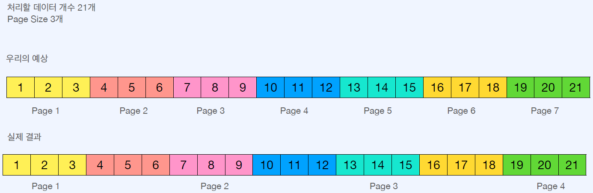
  + 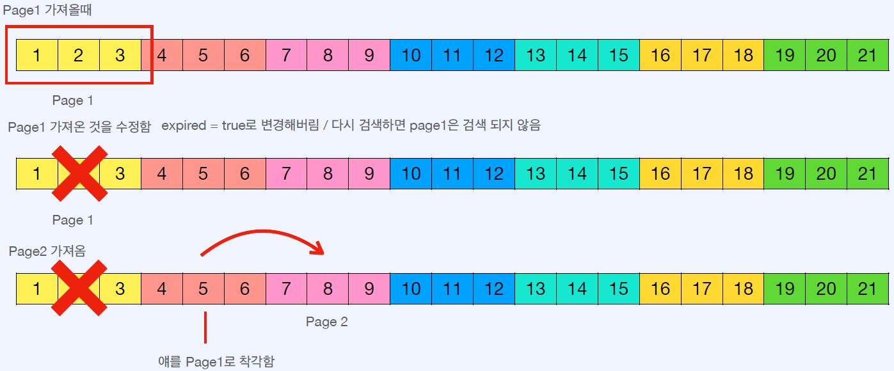
+ 해결방법
  + 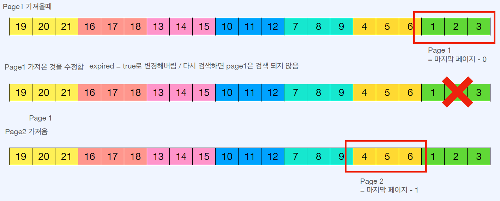

#### 문제점 2
+ 대량 처리 테스트, 성능 측정을 하지 않았다
+ 해결방법
  + 배치 대량 처리 테스트해보기
    + 실제로 배치 대량 처리 테스트를 통해 프로젝트의 안전성을 확보해야한다.
  + 쿼리 튜닝하기
    + 스프링 배치의 경우에는 유독 쿼리 튜닝이 필요하다.
    + 튜닝된 select 쿼리를 사용하면 그렇지 않은 쿼리보다 수천배정도 차이가 난다.
  + 파티셔닝 하기
    + 병렬로 데이터를 처리한다면 처리 속도가 증가될 것이다.
    + 병렬 처리라는 것은 성능 개선에 도움을 주지만 동시성 처리를 해야하기 때문에 함부로 사용할 수 없고 에러처리와 동작을 이해하는데 어려움이 생긴다.
    + 위의 두가지를 먼저 시도해보고 그럼에도 개선점이 없어보인다면 파티셔닝을 시도하는 것이 좋다.

#### ReverseJpaPagingItemReader 구현하기
+ 기존 코드

~~~java

@Bean
@StepScope
public JpaPagingItemReader<Point> expirePointItemReader(
 EntityManagerFactory entityManagerFactory,
 @Value("#{T(java.time.LocalDate).parse(jobParameters[today])}")
 LocalDate today
) {
 return new JpaPagingItemReaderBuilder<Point>()
 .name("expirePointItemReader")
 .entityManagerFactory(entityManagerFactory)
 .queryString("select p from Point p where p.expireDate < :today and used = false and expired = false")
 .parameterValues(Map.of("today", today))
 .pageSize(1000)
 .build();
}

~~~

+ 수정된 코드

~~~java

@Bean
@StepScope
public ReverseJpaPagingItemReader<Point> expirePointItemReader(
 PointRepository pointRepository,
 @Value("#{T(java.time.LocalDate).parse(jobParameters[today])}")
 LocalDate today
) {
 return new ReverseJpaPagingItemReaderBuilder<Point>()
 .name("messageExpireSoonPointItemReader")
 .query(
 pageable -> pointRepository.findPointToExpire(today, pageable) // Repository에 Page를 반환하는 메소드를구현한 다음에 여기다 넣으면 된다.
 )
 .pageSize(1000)
 .sort(Sort.by(Sort.Direction.ASC, "id")) // 제 내부에서는 id를 DESC로 나열하고 뒤에서부터 데이터를 읽어서순서에는 변함이 없습니다.
 .build();
}

~~~

+ 새로운 ItemReader 만들기

~~~java

package me.benny.fcp.job.reader;

import com.google.common.collect.Lists;
import org.springframework.batch.core.annotation.AfterRead;
import org.springframework.batch.core.annotation.BeforeRead;
import org.springframework.batch.core.annotation.BeforeStep;
import org.springframework.batch.item.ItemReader;
import org.springframework.batch.item.ItemStreamSupport;
import org.springframework.data.domain.Page;
import org.springframework.data.domain.PageRequest;
import org.springframework.data.domain.Pageable;
import org.springframework.data.domain.Sort;

import java.util.Iterator;
import java.util.List;
import java.util.Objects;
import java.util.function.Function;

public class ReverseJpaPagingItemReader<T> extends ItemStreamSupport implements ItemReader<T> {
    private static final int DEFAULT_PAGE_SIZE = 100;

    private int page = 0;
    private int totalPage = 0;
    private List<T> readRows = Lists.newArrayList();

    private int pageSize = DEFAULT_PAGE_SIZE;
    private Function<Pageable, Page<T>> query;
    private Sort sort = Sort.unsorted();

    ReverseJpaPagingItemReader() {}

    public void setPageSize(int pageSize) {
        this.pageSize = (pageSize > 0) ? pageSize : DEFAULT_PAGE_SIZE;
    }

    public void setQuery(Function<Pageable, Page<T>> query) {
        this.query = query;
    }

    public void setSort(Sort sort) {
        if (!Objects.isNull(sort)) {
            // pagination을 마지막 페이지부터 하기때문에 sort direction를 모두 reverse한다.
            // ASC <-> DESC
            Iterator<Sort.Order> orderIterator = sort.iterator();
            final List<Sort.Order> reverseOrders = Lists.newLinkedList();
            while (orderIterator.hasNext()) {
                Sort.Order prev = orderIterator.next();
                reverseOrders.add(
                        new Sort.Order(
                                prev.getDirection().isAscending() ? Sort.Direction.DESC : Sort.Direction.ASC,
                                prev.getProperty()
                        )
                );
            }
            this.sort = Sort.by(reverseOrders);
        }
    }

    /**
     * 스텝 실행 전에 동작함
     */
    @BeforeStep
    public void beforeStep() {
        // 우리는 뒤에서부터 읽을 것이기 때문에 마지막 페이지 번호를 구해서 page에 넣어줍니다.
        totalPage = getTargetData(0).getTotalPages();
        page = totalPage - 1;
    }

    /**
     * read() 함수가 실행되기 전에 동작함
     */
    @BeforeRead
    public void beforeRead() {
        if (page < 0)
            return;
        if (readRows.isEmpty()) // 읽은 데이터를 모두 소진하면 db로 부터 데이터를 가져와서 채워놓는다.
            readRows = Lists.newArrayList(getTargetData(page).getContent());
    }

    @Override
    public T read() {
        // null을 반환하면 Reader는 모든 데이터를 소진한걸로 인지하고 종료합니다.
        // 데이터를 리스트에서 거꾸로 (readRows.size() - 1) 뒤에서부터 빼줍니다.
        return readRows.isEmpty() ? null : readRows.remove(readRows.size() - 1);
    }

    /**
     * read() 이후에 동작함
     */
    @AfterRead
    public void afterRead() {
        // 데이터가 없다면 page를 1 차감합니다.
        if (readRows.isEmpty()) {
            this.page--;
        }
    }

    /**
     * page 번호에 해당하는 데이터를 가져와서 Page 형식으로 반환합니다.
     */
    private Page<T> getTargetData(int readPage) {
        return Objects.isNull(query)?Page.empty():query.apply(PageRequest.of(readPage, pageSize, sort));
    }
}

~~~

#### 데이터 대량처리 테스트
+ 일단 대량으로 데이터를 넣어보자
+ 일단 포인트 지갑 2개 생성

~~~sql

INSERT INTO `point_wallet`
(user_id, amount)
VALUES ('user1', 0);
INSERT INTO `point_wallet`
(user_id, amount)
VALUES ('user2', 0);

~~~

+ 포인트 예약적립 건 데이터 대량 insert 프로시저 생성
  + 프로시저를 사용하지 않고 그 어떤 방법으로도 데이터를 대량으로 만들수만 있으면 상관없다

~~~sql

DELIMITER //
CREATE PROCEDURE bulkInsert()
BEGIN
DECLARE i INT DEFAULT 1;
DECLARE random_amount bigint DEFAULT 1;
WHILE (i <= 10000) DO  -- 10000개를 insert.
SET random_amount = FLOOR(1000 + (RAND() * 9000)); -- 1000원 부터 10000원까지 랜덤금액을 넣음
INSERT INTO `point_reservation`
(point_wallet_id, amount, earned_date, available_days, is_executed)
VALUES (1, random_amount, '2021-09-13', 10, 0); -- point_wallet Id와 적립일자확인 필수
SET i = i+1;
END WHILE;
END;
//
DELIMITER ;

~~~

+ 프로시저 실행하는 방법
  + call bulkInsert();
+ bulkInsert 프로시저 삭제하는 방법
  + drop procedure if exists bulkInsert;
+ 배치 스트레스 테스트 변수 파악하기
  + Docker MySQL
    + 실제 운영 환경에서는 도커 MySQL을 사용하지 않을 것이기 때문에 환경이 다르다
    + Docker MySQL은 적은 리소스로 동작하기 때문에 실제 운영환경과 같은 환경에서의 테스트라고 보기 어렵다.
  + 네트워크
    + Docker MySQL은 네트워크 비용이 거의 들지 않는다
    + 바로 로컬에 있는 Database에 접근하여 데이터를 가져오고 쓰기 때문이다.
    + 이 또한, 실제 운영환경과 같은 환경에서의 테스트라고 보기 어렵다
  + 데이터 개수
    + 사업이 얼마나 잘되고 있는지에 따라 다르겠지만 애초에 100만개라는 데이터가 많은 데이터는 아니다.
  + 데이터 분포도
    + 데이터 분포도 즉, 카티널리티가 운영환경과 스트레스테스트 환경이 다르다.
    + 운영 환경에서는 훨씬 더 다양한 케이스 별로 데이터가 분포되어있을 것이다.
    + 스트레스 테스트 환경에서는 그런 다양한 케이스를 만들기가 어렵다.

#### 쿼리 튜닝하기
+ 배치 성능에 가장 큰 영향을 미치는 것 중에 하나가 바로 ItemReader의 조회성능이다.
+ 프로젝트마다 특징이 다르기 때문에 반드시 그런것은 아니지만 대부분의 경우에는 ItemReader에서 가져온 데이터를 수정하거나 변환해서 데이터베이스에 저장한.
+ 수정하거나 변환하는 부분, 그리고 데이터베이스에 저장하는 부분은 눈에 띄는 개선이 있기 어려운 부분이다. (물론 JPA를 쓰지 않고 다른 방식을 사용한다면 크게 개선될 수 있습니다.)
+ 하지만 Reader의 조회 쿼리 성능은 배치 성능에 매우 큰 영향을 준다.
+ 특히나, group by하고 sum하는 복잡한 쿼리의 경우에는 조회 성능이 압도적으로 중하다.
+ 쿼리 튜닝 어떻게 하나요?
  + 쿼리를 튜닝하기 위해서는 explain을 통한 확인이 필요하다.
+ 쿼리 튜닝 주의할 점
  + Index 마구 추가 하지 않기
    + Index가 많아지면 그 테이블에 데이터를 Insert할 때 시간이 증가된다.
    + 인덱스를 마구 추가하게 되면 원래 계획했던 대로 쿼리가 동작하지 않을 수도 있다.
      + 결과는 동일하겠지만 빠른 방법을 두고 굳이 어려운 방법으로 동작할 수도 있다.
    + 데이터 분포도에 따라 의미있던 Index가 의미가 없어지기도 한다.
    + 서비스가 진행됨에 따라 데이터들의 분포도가 바뀔수 있기 때문이다.
    + 따라서 섣불리 인덱스를 추가하지 않고 꼼꼼하게 확인하거나 DB전문가의 도움을 받는게 좋다
  + Index 추가 보다 조회 쿼리 자체를 수정해보기
    + 인덱스로 모든 것을 해결하려고 하기 보다는 쿼리 자체를 수정하는 것이 더 효율적인 경우가 많다
    + 예를 들면 orderby 대상을 변경해본다던가 또는 join을 subquery로 변경해보기

#### 파티셔닝
+ 파티셔닝이란
  1. Master Step을 이용해 처리할 데이터를 더 작게 나눈다
  2. Worker Step을 통해 나눈 데이터를 처리하도록 한다.
  3. Local에서 처리하면 Multi Thread로 처리한다
  4. Remote로 처리하면 여러 서버가 동시에 처리한다.

+ 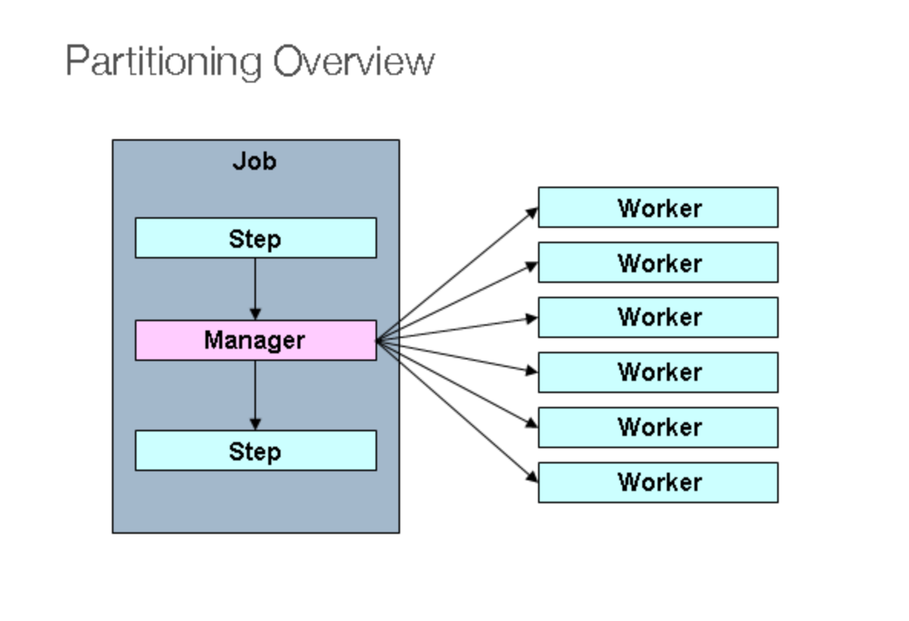

##### 파티셔닝 구현하는 방법
+ Partitioner를 구현

~~~java

public interface Partitioner {
    Map<String, ExecutionContext> partition(int gridSize); //gridSize: StepExecution 생성 개수
}

~~~

+ PartitionHandler를 구현
  + Master 스텝이 Worker 스텝을 어떻게 관리하는 지를 결정하는 부분이다. 크게 두가지 중에 하나를 사용한다.
    + TaskExecutorPartitionHandler
      + 로컬에서 Thread로 분할
    + MessageChannelPartitionHandler
      + 원격으로 메타 데이터 전송
+ 파티셔닝 구현 코드

~~~java

package me.benny.fcp.job.reservation;

import lombok.RequiredArgsConstructor;
import me.benny.fcp.point.reservation.PointReservationRepository;
import org.springframework.batch.core.partition.support.Partitioner;
import org.springframework.batch.item.ExecutionContext;

import java.time.LocalDate;
import java.util.HashMap;
import java.util.Map;

@RequiredArgsConstructor
public class ExecutePointReservationStepPartitioner implements Partitioner {
    private final PointReservationRepository pointReservationRepository;
    private final LocalDate today;

    @Override
    public Map<String, ExecutionContext> partition(int gridSize) {
        //오늘 처리할 예약건의 최소Id와 최대Id를 구함
        long min = pointReservationRepository.findMinId(today); 
        long max = pointReservationRepository.findMaxId(today);
        long targetSize = (max - min) / gridSize + 1; //gridSize 로 Id를 분할합니다. gridSize: 4 / min : 1 / max : 20 이면  1~5 / 6~10 / 11~15 / 16~20 분할

        Map<String, ExecutionContext> result = new HashMap<>();
        long number = 0;
        long start = min;
        long end = start + targetSize - 1;

        while (start <= max) {
            ExecutionContext value = new ExecutionContext();
            if (end >= max) {
                end = max;
            }
            // minId와 maxId를 StepExectuionContext에 넣음
            value.putLong("minId", start);
            value.putLong("maxId", end);
            result.put("partition" + number, value); // 파티션이름, StepExecutionContext를 반환 데이터에 넣는다.
            start += targetSize;
            end += targetSize;
            number++;
        }
        return result;
    }
}

~~~

~~~java

package me.benny.fcp.job.reservation;

import me.benny.fcp.job.reader.ReverseJpaPagingItemReader;
import me.benny.fcp.job.reader.ReverseJpaPagingItemReaderBuilder;
import me.benny.fcp.point.Point;
import me.benny.fcp.point.PointRepository;
import me.benny.fcp.point.reservation.PointReservation;
import me.benny.fcp.point.reservation.PointReservationRepository;
import me.benny.fcp.point.wallet.PointWallet;
import me.benny.fcp.point.wallet.PointWalletRepository;
import org.springframework.batch.core.Step;
import org.springframework.batch.core.configuration.annotation.JobScope;
import org.springframework.batch.core.configuration.annotation.StepBuilderFactory;
import org.springframework.batch.core.configuration.annotation.StepScope;
import org.springframework.batch.core.partition.support.TaskExecutorPartitionHandler;
import org.springframework.batch.item.ItemProcessor;
import org.springframework.batch.item.ItemWriter;
import org.springframework.beans.factory.annotation.Value;
import org.springframework.context.annotation.Bean;
import org.springframework.context.annotation.Configuration;
import org.springframework.core.task.TaskExecutor;
import org.springframework.data.domain.Sort;
import org.springframework.data.util.Pair;
import org.springframework.transaction.PlatformTransactionManager;

import java.time.LocalDate;

@Configuration
public class ExecutePointReservationStepConfiguration {

  /**
   * 파티셔닝 사용
   * 단, 동시성 문제가 있어서 사용이 불가합니다.
   */
  @Bean
  @JobScope
  public Step executePointReservationMasterStep(
          StepBuilderFactory stepBuilderFactory,
          TaskExecutorPartitionHandler partitionHandler,
          PointReservationRepository pointReservationRepository,
          @Value("#{T(java.time.LocalDate).parse(jobParameters[today])}")
          LocalDate today
  ) {
    return stepBuilderFactory
            .get("executePointReservationMasterStep")
            .partitioner(
                    "executePointReservationStep", // Worker Step이 될 Step 이름 추가
                    new ExecutePointReservationStepPartitioner(pointReservationRepository, today) // Partitioner 추가
            )
            .partitionHandler(partitionHandler) // PartitionHandler추가
            .build();
  }

  // 로컬에서 Thread로 파티셔닝 진행
  @Bean
  public TaskExecutorPartitionHandler partitionHandler(
          Step executePointReservationStep,
          TaskExecutor taskExecutor
  ) {
    TaskExecutorPartitionHandler partitionHandler = new TaskExecutorPartitionHandler();
    partitionHandler.setStep(executePointReservationStep);
    partitionHandler.setGridSize(8);
    partitionHandler.setTaskExecutor(taskExecutor);
    return partitionHandler;
  }

  @Bean
  public Step executePointReservationStep(
          StepBuilderFactory stepBuilderFactory,
          PlatformTransactionManager platformTransactionManager,
          ReverseJpaPagingItemReader<PointReservation> executePointReservationItemReader,
          ItemProcessor<PointReservation, Pair<PointReservation, Point>> executePointReservationItemProcessor,
          ItemWriter<Pair<PointReservation, Point>> executePointReservationItemWriter
  ) {
    return stepBuilderFactory
            .get("executePointReservationStep")
            .allowStartIfComplete(true)
            .transactionManager(platformTransactionManager)
            .<PointReservation, Pair<PointReservation, Point>>chunk(1000)
            .reader(executePointReservationItemReader)
            .processor(executePointReservationItemProcessor)
            .writer(executePointReservationItemWriter)
            .build();
  }

  @Bean
  @StepScope
  public ReverseJpaPagingItemReader<PointReservation> executePointReservationItemReader(
          PointReservationRepository pointReservationRepository,
          @Value("#{T(java.time.LocalDate).parse(jobParameters[today])}") LocalDate today,
          // StepExecutionContext로 minId, maxId 사용가능
          @Value("#{stepExecutionContext[minId]}") Long minId,
          @Value("#{stepExecutionContext[maxId]}") Long maxId
  ) {
    return new ReverseJpaPagingItemReaderBuilder<PointReservation>()
            .name("messageExpireSoonPointItemReader")
            .query(
                    pageable -> pointReservationRepository.findPointReservationToExecute(today, minId, maxId, pageable) //minId, maxId를 추가해서 WorkerStep이 맡아야할 8등분 되어 감소함
            )
            .pageSize(1000)
            .sort(Sort.by(Sort.Direction.ASC, "id"))
            .build();
  }

  @Bean
  @StepScope
  public ItemProcessor<PointReservation, Pair<PointReservation, Point>> executePointReservationItemProcessor() {
    return reservation -> {
      reservation.setExecuted(true);
      Point earnedPoint = new Point(
              reservation.getPointWallet(),
              reservation.getAmount(),
              reservation.getEarnedDate(),
              reservation.getExpireDate()
      );
      PointWallet wallet = earnedPoint.getPointWallet();
      wallet.setAmount(wallet.getAmount().add(earnedPoint.getAmount()));
      return Pair.of(reservation, earnedPoint);
    };
  }

  @Bean
  @StepScope
  public ItemWriter<Pair<PointReservation, Point>> executePointReservationItemWriter(
          PointReservationRepository pointReservationRepository,
          PointRepository pointRepository,
          PointWalletRepository pointWalletRepository
  ) {
    return reservationAndPoints -> {
      for (Pair<PointReservation, Point> pair : reservationAndPoints) {
        PointReservation reservation = pair.getFirst();
        Point point = pair.getSecond();
        pointReservationRepository.save(reservation);
        pointRepository.save(point);
        pointWalletRepository.save(reservation.getPointWallet());
      }
    };
  }
}

~~~

##### 파티셔닝 주의 사항
+ 파티셔닝 하기 전에…
  + 배치 성능을 개선하려고 한다면 중요한 선택지 중에 하나가 바로 파티셔닝이다.
  + 상황만 잘 맞는다면 당연히 눈에 띄는 개선을 이룰수 있다.
  + 그러나 파티셔닝을 하기에 앞서 자신의 코드와 코드에서 사용하는 쿼리를 개선해서 성능을 개선하는 것을 먼저 해보는 걸 추천한다.
  + 문제 있는 코드가 있다면 아무리 스레드를 늘린다고 하더라도 근본적으로 개선되기는 어렵다.
+ 동시성 처리
  + 파티셔닝을 하게되면 병렬처리를 한다.
  + 즉, 동시성 문제를 겪게 된다.
  + 배치 Job의 절반 이상은 이런 동시성 문제때문에 파티셔닝이 불가한 상태이다.
  + 만약에 중간에 동시성 문제를 해결하기 위해 Lock을 걸게 되면 병렬처리는 하는 의미가 없어져 오히려 성능이 저하될 수도 있다.

## P3. 유지보수하기 좋은 코드 디자인 

### Part 2. 프로젝트 Setting
+ IntelliJ 사용법
  + [https://github.com/cheese10yun/code-design/blob/master/ch2/README.md](https://github.com/cheese10yun/code-design/blob/master/ch2/README.md)

#### 패키기 구조
+ Layer VS Domain
  + Layer
    + 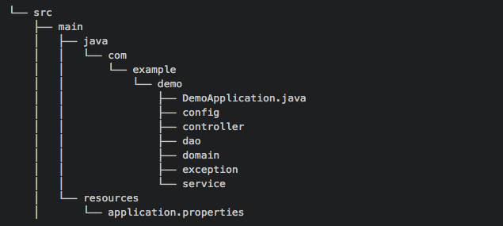
  + Domain
    + 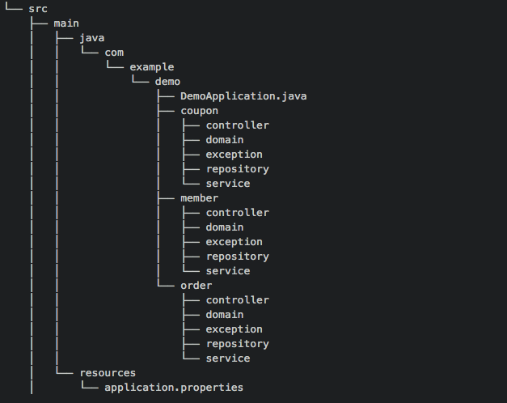
+ Layer 장단점
  + 
   + 장점
      + 프로젝트 이해가 낮아도 전체적인 구조를 빠르게 파악 가능
      + 작성 하고자하는 계층이 명확할 경우 빠르게 개발 가능
  + 단점
    + 각 레이어별로 수십개의 클래스들이 존재하여 코드 파악이 어렵다
    + Layer를 기준으로 분리했기 때문에 코드의 응집력이 떨어진다
+ Domain 장단점
  + 
  + 장점
    + 관련된 코드들이 응집해 있다
    + 디렉토리 구조를 통해 도메인을 이해할 수 있다
  + 단점
    + 도메인 지식없이 이해하기 어렵다
    + 각 계층을 구분하기 위한 논의가 필요하다
+ __권장하는 도메인__
  + 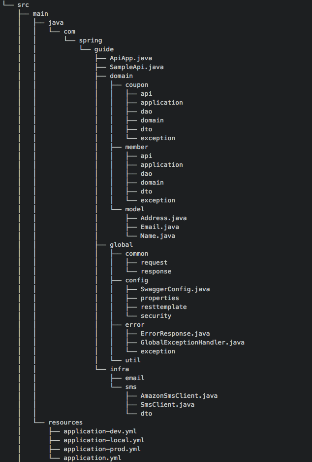
    + domain: 도메인을 담당
    + global: 프로젝트의 전체담당
    + Infra: 외부 인프라스트럭처 담당 
  + domain
    + 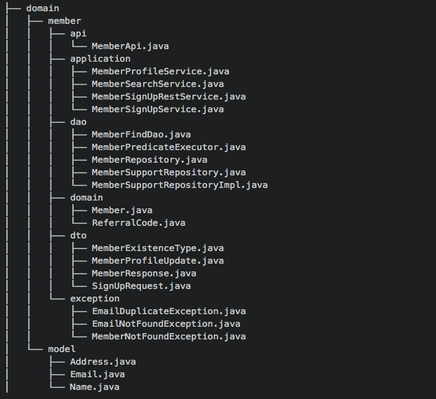
    + api: 컨트롤러 클래스들이 존재한다.
    + domain : 도메인 엔티티에 대한 클래스로 구성된다. 특정 도메인에만 속하는 Embeddable, Enum 같은 클래스도 구성된다.
    + dto : 주로 Request, Response 객체들로 구성된다.
    + exception : 해당 도메인이 발생시키는 Exception으로 구성된다.
  + global
    + 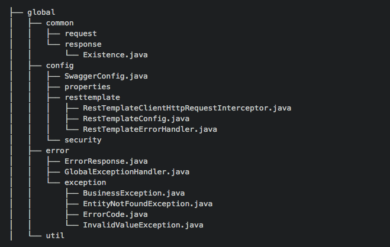
    + global은 프로젝트 전방위적으로 시용되는 객체들로 구성된다.
    + common : 공통으로 사용되는 Value 객체들로 구성된다. 페이징 처리를 위한 Request, 공통된 응답을 주는 Response 객체들이 있다.
    + config : 스프링 각종 설정들로 구성된다.
    + error : 예외 핸들링을 담당하는 클래스로 구성됩니다.
    + util : 유틸성 클래스들이 위치한다.
  + infra
    + 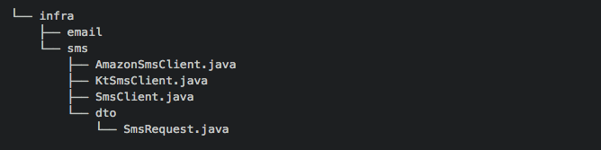
    + infra 디렉터리는 인프라스트럭처 관련된 코드들로 구성된다.
+ 구조 예시
  + 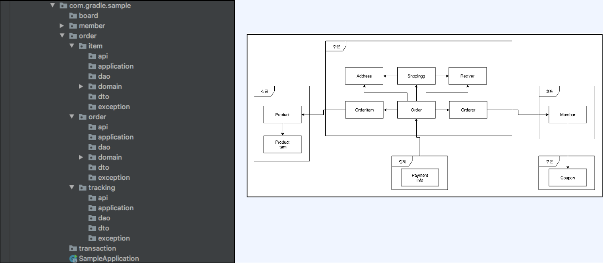

### Part 3. 객체를 풍부하게 표현하기

#### Lombok을 잘 사용해야 객체 디지인을 망치지 않는다
+ @Data는 지양하자
  + 무분별한 @Setter 남용
    + Setter는 그 의도가 분명하지 않고 객체를 언제든지 변경할 수 있는 상태가되어서 객체의 안전성이 보장받기 힘들다
  + ToString 양방향 순환 참조 문제
  + @EqualsAndHashCode 의 남발
+ 클래스 상단의 @Builder는 지양 하자
  + Student 자기 자신의 객체가, 본인의 생성되는 플로우에서 보다 명확하게 필요한 값과 필요하지 않은 값을 구분해서 받게 해야한다.
+ lombok.config 설정을 통해서 제한 하자

~~~properties

lombak.Setter.flagUsage = error
lombak.AllArgsConstuctor.flagUsage = error
lombak.data.flagUsage = error
lombak.addLombokGeneratedAnnotation = true
lombok.toString.flagUsage=WARNING

~~~

### Part 4. Exception 처리 방법

#### 오류 코드 코드보다 예외를 사용하라
+ 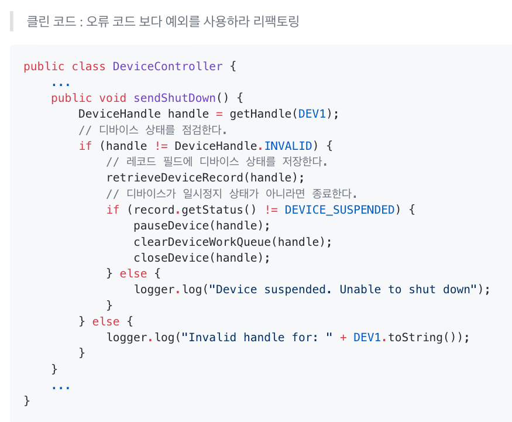
+ 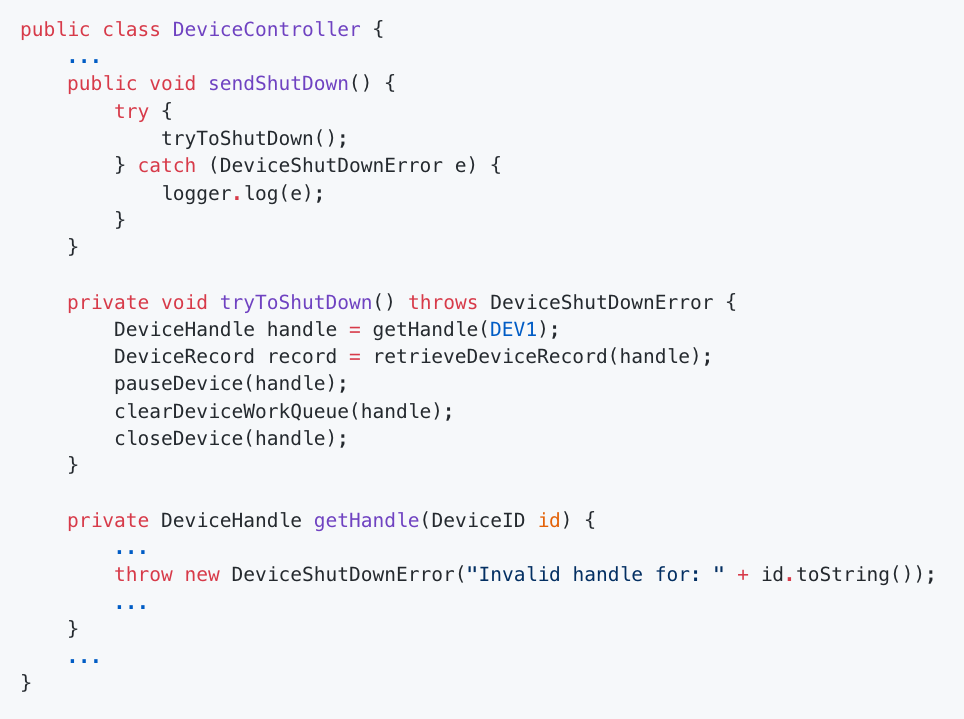

1. try catch를 최대한 지양해라.(로직으로 예외 처리가 가능하다면)
2. try catch를 하는데 아무런 처리가 없다면 로그라도 추가하자
3. try catch를 사용하게 된다면, 더 구체적인 예외를 발생시키는것이 좋다. (Exception 직접 정의 or Error Message를 명확하게)

#### Check Exception VS UnChecked Exception
+ 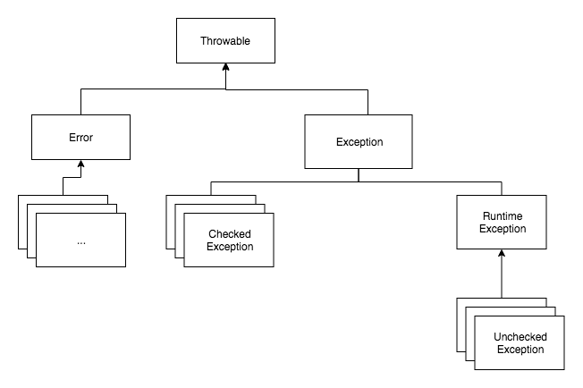
+ 
+ 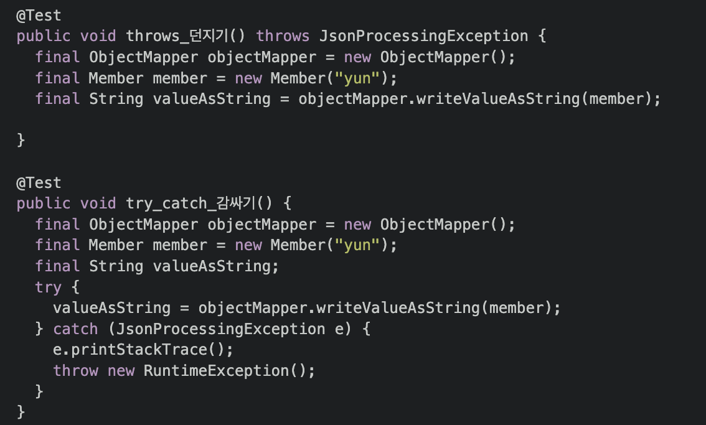

### Part 5. API Server Error 처리

#### 통일된 Error Response를 가져야하는 이유
+ Error Response
  + 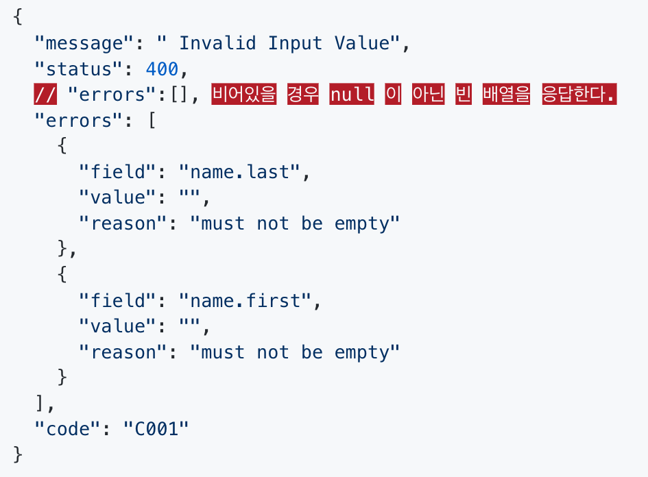
+ Error Response 객체
  + 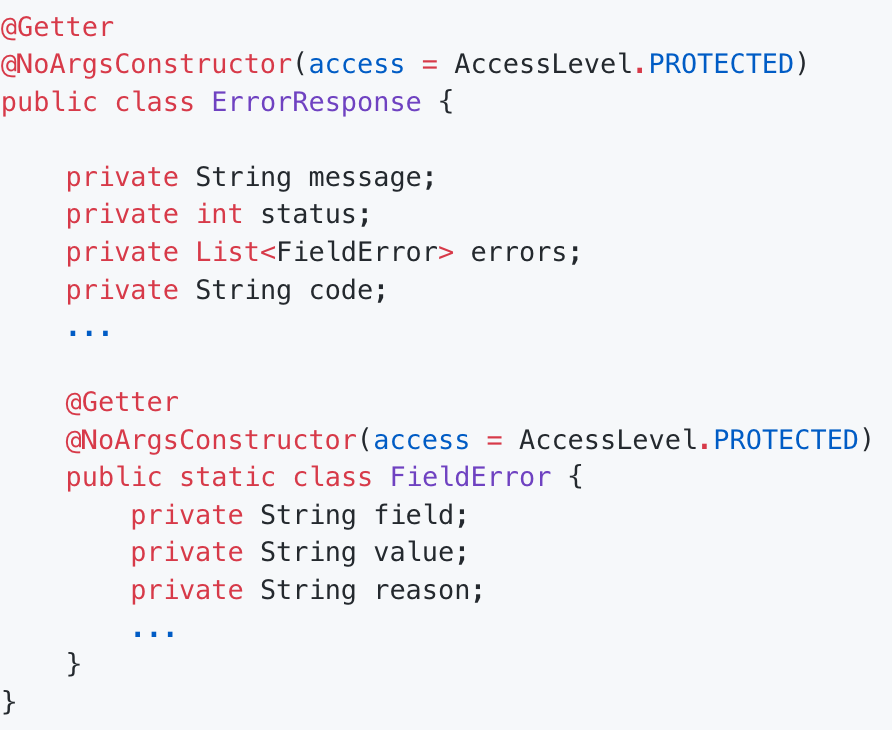
+ Error Code
  + 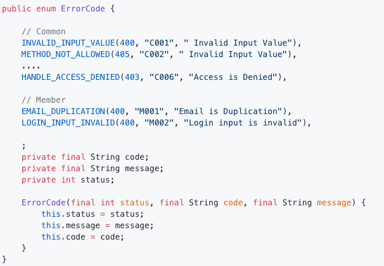

#### @ControllerAdvice를 활용한 일관된 예외 핸들링
+ 컨트롤러 예외 처리
  + 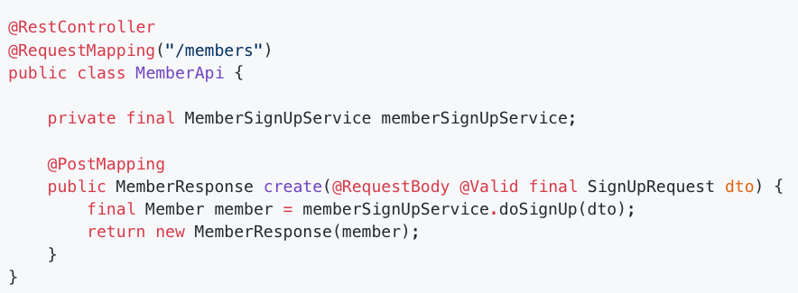
    + 컨틀롤러에서 모든 요청에 대한 값 검증을 진행하고 이상이 없을 시에 서비스 레이어를 호출해야 한다.
    + 컨트롤러의 중요한 책임 중의 하나는 요청에 대한 값 검증이 있다. 스프링은 Bean Validation 검증
      을 쉽고 일관성 있게 처리할 수 있도록 도와준다. 모든 예외는 @ControllerAdvice 선언된 객체에서
      핸들링 된다.
+ Error Response 객체
  + 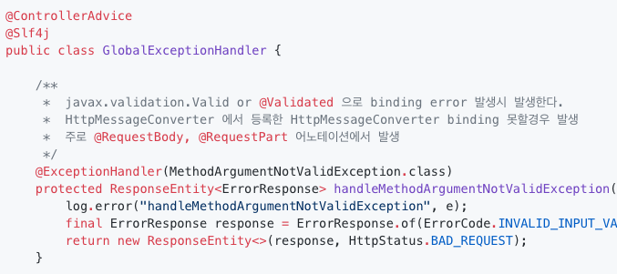

#### 계층화를 통한 Business Exception 처리 방법
+ 비지니스 예외를 위한 최상위 BusinessException 클래스
  + 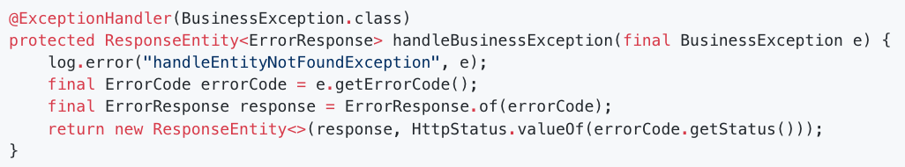
    + 최상위 BusinessException을 기준으로 예외를 발생시키면 통일감 있는 예외 처리를 가질 수 있다.
      비니지스 로직을 수행하는 코드 흐름에서 로직의 흐름을 진행할 수 없는 상태인 경우에는 적절한
      BusinessException 중에 하나를 예외를 발생 시키거나 직접 정의하게 된다.
    + 이렇게 발생하는 모든 예외는 handleBusinessException 에서 동일하게 핸들링 된다. 예외 발생시
      알람을 받는 등의 추가적인 행위도 손쉽게 가능하다. 또 BusinessException 클래스의 하위 클래스
      중에서 특정 예외에 대해서 다른 알람을 받는 등의 더 디테일한 핸들링도 가능해진다.
+ Business Exception 처리
  + 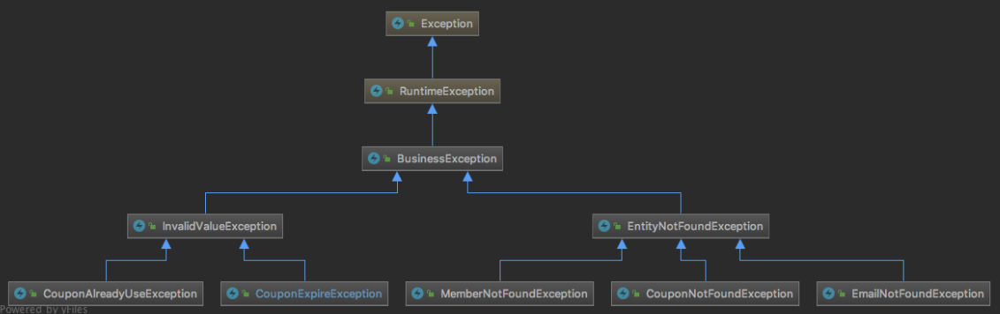

#### 효율적인 Validation
+ Custom Validation 어노테이션 만들기
  + 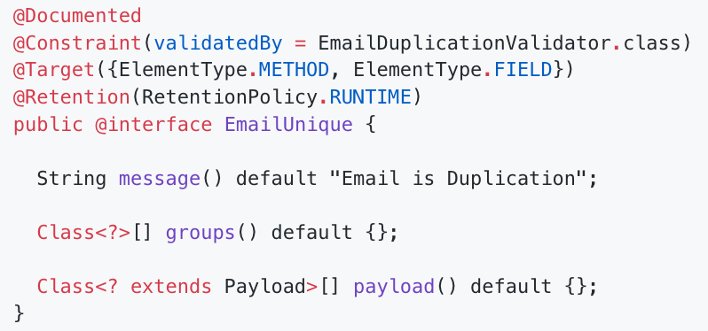
  + 
  + 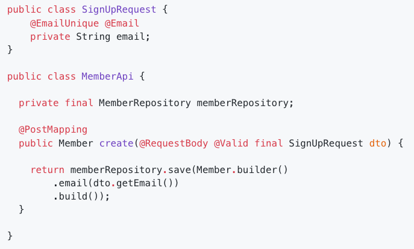
+ ConstraintValidator 사용법
  + 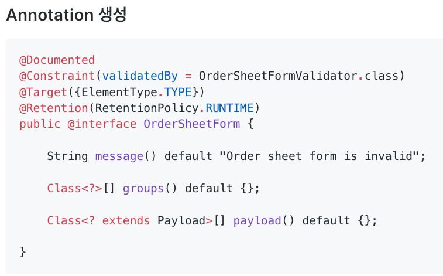
  + 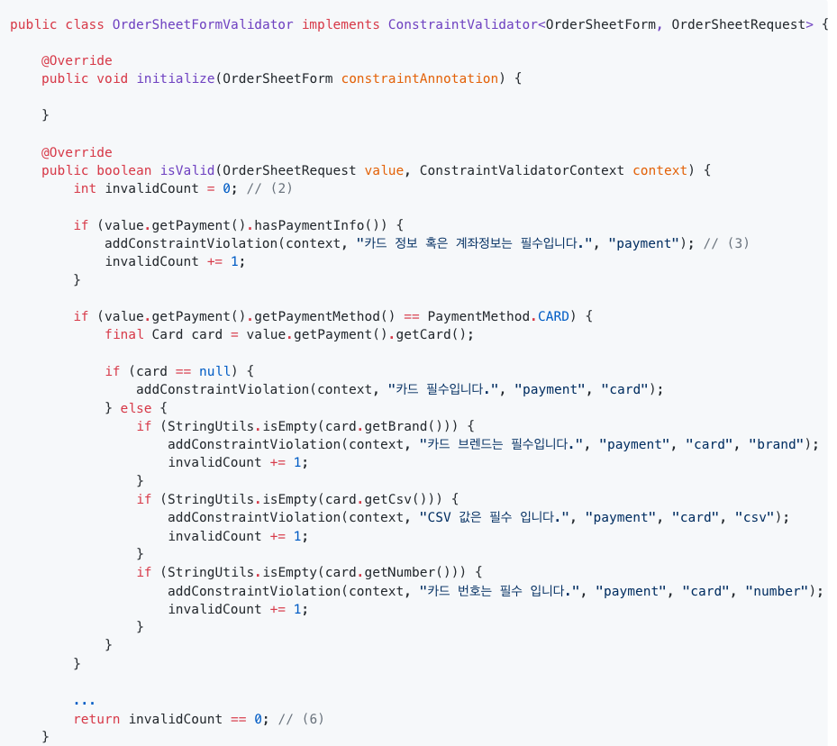

### Part 6. 자신의 책임과 의도가 명확한 객체 디자인

#### 적절한 객체의 크기를 찾아가는 여정
+ 인터페이스 이유
  + 세부 구현체를 숨기고 인터페이스를 바라보게 함으로써 클래스 간의 의존관계를 줄이는 것
  + 인터페이스를 구현하는 여러 구현체가 있고 기능에 따라 적절한 구현체가 들어가서 다형성을 주기 위함

#### 묻지 말고 시켜라!
+ 객체는 충분히 협력적이어야 한다.
  + 객체간의 협력관계에서 상대 객체에 대한 정보를 꼬치꼬치 묻는 않고는다, 묻지 말고 시켜라 Tell, Don’t Ask
  + 객체는 충분히 협럭적이고 자율적인 관계를 유지 해야한다. 객체의 관계는 복종하는 관계가 아니다

### Part 7. 시스템 내 강결합 문제 해결

#### ApplicationEventPublisher를 이용한 시스템 내의 강결합 문제 해결
+ 회원 가입 시나리오
  + 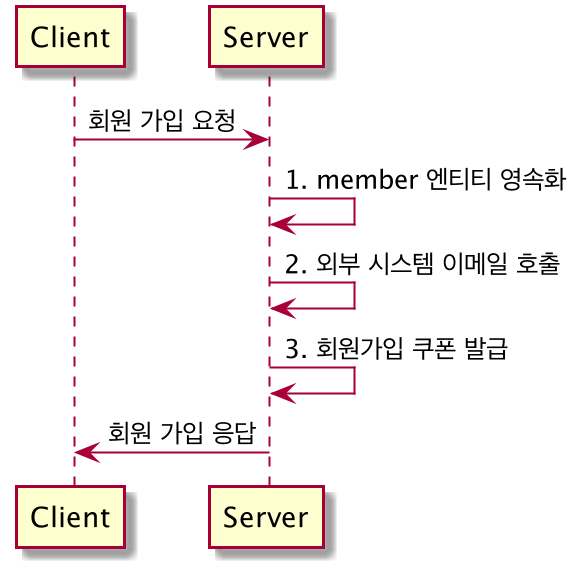
+ 시스템의 강결한 결합문제 
  + 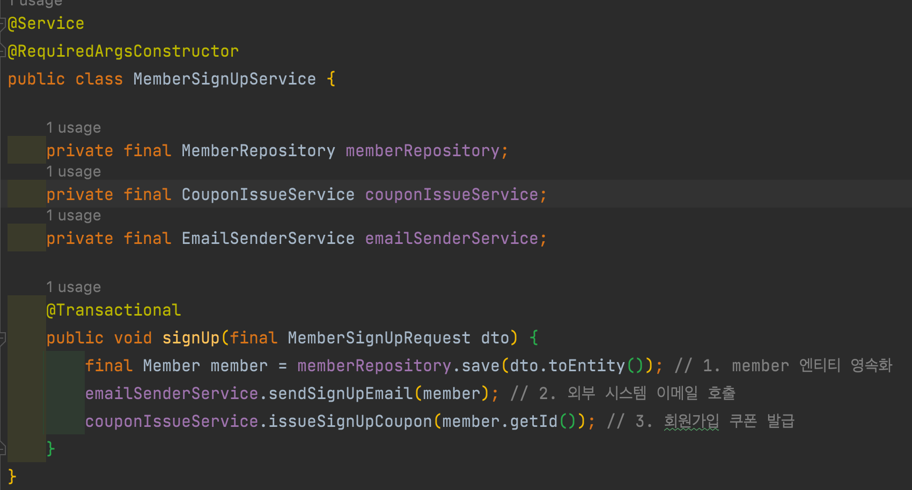
+ 트랜잭션의 문제
  + 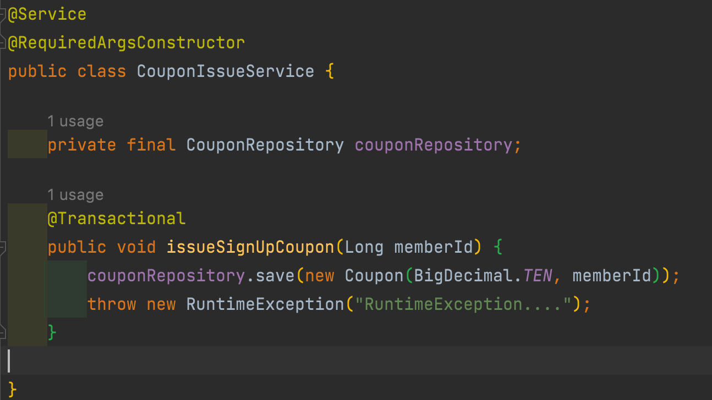
  + 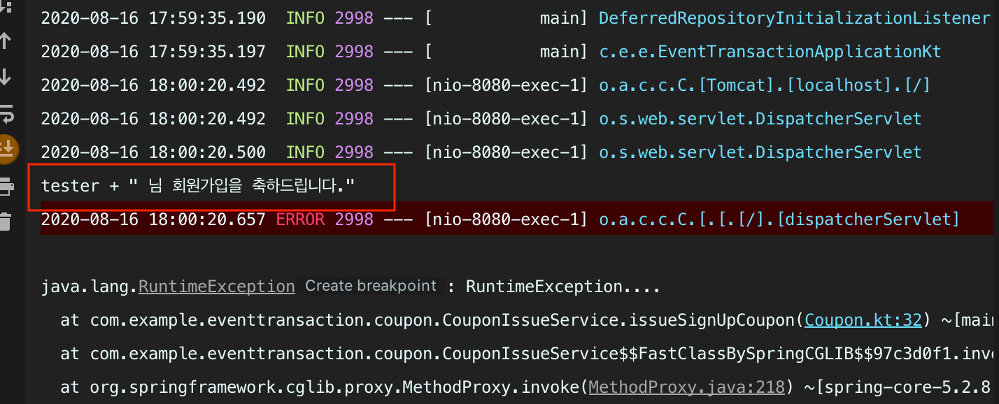
+ 시스템의 강결한 결합 문제 해결
  + 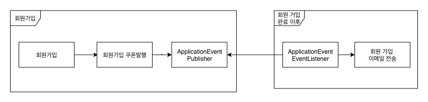
  + 회원 가입 -> 회원 가입 쿠폰 발행 -> 회원 가입 완료 이벤트 발행 -> 회원 가입 이벤트 리스너 동작 -> 회원 가입 이메일 전송
+ 트랜잭션의 문제 해결
  + 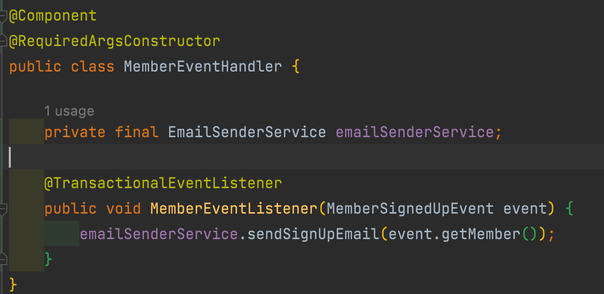
  + @TransactionalEventListener으로 리스너를 등록하는 경우 해당 트랜잭션이 Commit된 이후에 리스너가 동작하게 됩니다
  + 위처럼 동일하게 회원 가입 쿠폰에서 예외가 발생하게 된다면 트랜잭션 Commit이 진행되지 않기 때문에 해당 리스너가 동작하지 않게 되어 트랜잭션 문제를 해결할 수 있습니다
+ 주문 시나리오
  + 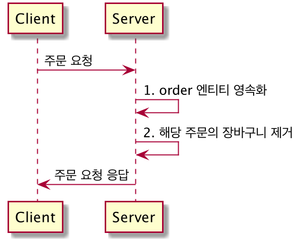
+ 장바구니 삭제시 트랜잭션 문제
  + 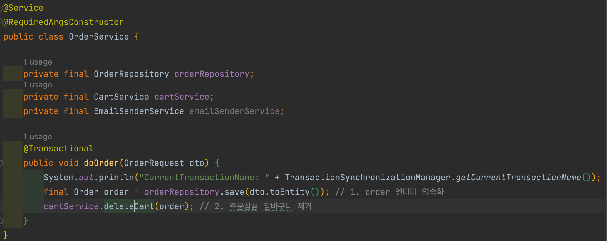
+ 성능 문제
  + 
+ 장바구니 삭제시 트랜잭션 문제, 성능 문제 해결
  + 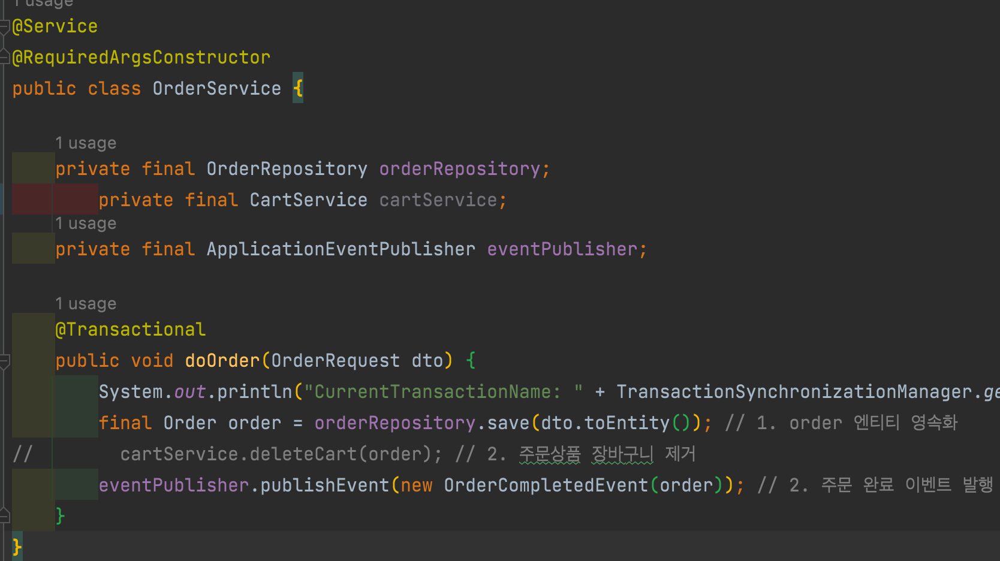
  + 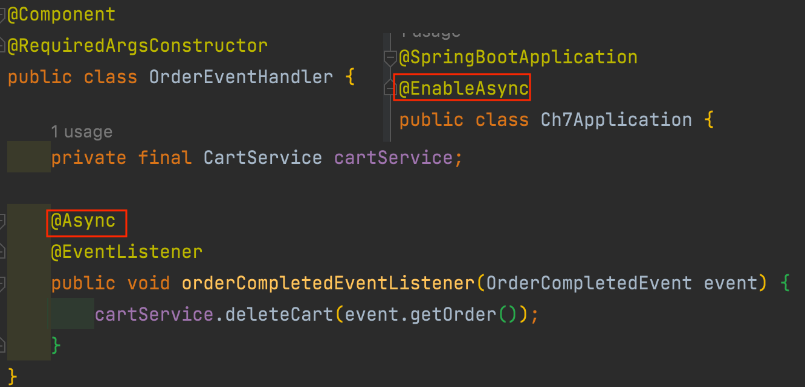
  + 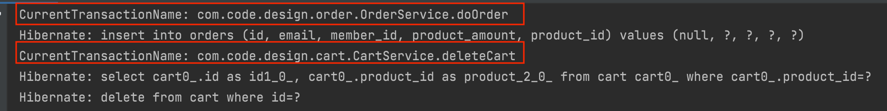
    + 트랜잭션이 다르기 때문에 Cart 제거시 문제가 생겨도 Order Insert의 영향을 주지 않는다

### Part 8. 테스팅 방법 및 전략

#### Junit5 특징
+ Junit5 기본설정은 테스트 메서드 마다 인스턴스를 생성한다
  + 테스트 코드간의 디펜던시를 줄이기 위함
+ Junit5 인스턴스를 공유해서 사용할 수 있는 설정이 있다
  + 인스턴스 변수에 static 키워드 추가 
  + @TestInstance(Lifecycle.PER_CLASS) 추가
+ 전처리 후처리 기능을 통해서 테스트 메서드 사후 동작에 작업을 할 수 있다

~~~java

public class Junit5_2 {

    /**
     * @BeforeAll 테스트 실행되기 전 한번 실행됨
     * @BeforeEach 모든 테스트 마다 실행되기 전에 실행됨
     * @AfterEach 모든 테스트 마다 실행된후 전에 실행됨
     * @AfterAll 테스트 실행된 후 한 번 실행됨
     */

    @BeforeAll
    static void beforeAll() {
        System.out.println("BeforeAll : 테스트 실행되기 이전 단 한 번만 실행");
    }

    @AfterAll
    static void afterAll() {
        System.out.println("AfterAll : 테스트 실행되기 이전 단 한 번만 실행");
    }

    @BeforeEach
    void beforeEach() {
        System.out.println("BeforeEach: 모든 테스트 마다 실행되기 이전 실행 ");
    }

    @AfterEach
    void afterEach() {
        System.out.println("AfterEach : 모든 테스트 마다 실행 이후 실행");
    }

    @Test
    void test_1() {
        System.out.println("test_1");
    }

    @Test
    void test_2() {
        System.out.println("test_2");
    }
}

~~~

+ Junit5 기본 설정은 테스트 코드의 순서를 보장하지 않지만 특정 설정을 통해서 보장받을 수 있다

~~~java

@TestInstance(Lifecycle.PER_CLASS)
@TestMethodOrder(MethodOrderer.OrderAnnotation.class)
public class Junit5_3 {

    @Test
    @Order(2)
    void test_1() {
        System.out.println("test_1");
    }

    @Test
    @Order(1)
    void test_2() {
        System.out.println("test_2");
    }

    @Test
    @Order(99)
    void test_3() {
        System.out.println("test_3");
    }
}

~~~

#### Junit5 @ParameterizedTest 사용법
+ @ParameterizedTest를 통해서 다양한 파라미터를 편리하기 테스트 할 수 있다.
+ @ValueSource, @EnumSource, @CsvSource, @MethodSource

~~~java

public class Junit5 {

    @ParameterizedTest
    @ValueSource(strings = {"1", "2"})
    void valueSource_1(String value) {
        System.out.println(value);
    }

    @ParameterizedTest
    @ValueSource(booleans = {true, false, false})
    void valueSource_2(boolean value) {
        System.out.println(value);
    }

    @ParameterizedTest
    @EnumSource(Quarter.class)
    void enumSource_1(Quarter quarter) {
        then(quarter.getValue()).isIn(1, 2, 3, 4);
    }

    @ParameterizedTest
    @EnumSource(value = Quarter.class, names = {"Q1", "Q2"})
    void enumSource_2(Quarter quarter) {
        then(quarter.getValue()).isIn(1, 2);
        then(quarter.getValue()).isNotIn(3, 4);
    }

    @ParameterizedTest
    @CsvSource(
        value = {
            "010-1234-1234,01012341234",
            "010-2333-2333,01023332333",
            "02-223-1232,022231232"
        }
    )
    void csvSource(String value, String expected) {
        final String number = value.replace("-", "");
        then(number).isEqualTo(expected);
    }

    @ParameterizedTest
    @MethodSource("providerOrder")
    void methodSource(Order order, int expectedTotalPrice) {
        then(order.getTotalPrice()).isEqualTo(expectedTotalPrice);
    }

    static List<Arguments> providerOrder() {
        final List<Arguments> arguments = new ArrayList<>();

        arguments.add(Arguments.of(new Order(100, 2), 200));
        arguments.add(Arguments.of(new Order(100, 3), 300));

        return arguments;
    }
}

enum Quarter {
    Q1(1, "1분기"),
    Q2(2, "2분기"),
    Q3(3, "3분기"),
    Q4(4, "4분기");

    private final int value;
    private final String description;

    Quarter(int value, String description) {
        this.value = value;
        this.description = description;
    }

    public int getValue() {
        return value;
    }

    public String getDescription() {
        return description;
    }
}

class Order {

    private int price;
    private int quantity;

    public Order(int price, int quantity) {
        this.price = price;
        this.quantity = quantity;
    }

    public int getTotalPrice() {
        return price * quantity;
    }

    public int getPrice() {
        return price;
    }

    public int getQuantity() {
        return quantity;
    }
}

~~~

#### Junit5 AssertJ 사용 방법
+ [https://assertj.github.io/doc/](https://assertj.github.io/doc/)
+ 자동 완성 기능이 있어 편리하게 테스트 코드 작성
+ 강력한 검증 기능
+ BDD 스타일 지원

~~~java

public class Test_2 {

    @Test
    public void 기존_matcher_불편한점() {
//        org.hamcrest.MatcherAssert.assertThat("aa", org.hamcrest.Matchers.is("aa"));

    }

    @Test
    public void 문장_검사() {
        final String title = "AssertJ is best matcher";
        then(title)
            .isNotNull()
            .startsWith("AssertJ")
            .contains(" ")
            .endsWith("matcher")
        ;
    }

    @Test
    public void 다양한_기능_제공() {
        then(BigDecimal.ZERO).isEqualByComparingTo(BigDecimal.valueOf(0));
        then(" ").isBlank();
        then("").isEmpty();
        then("YWJjZGVmZw==").isBase64();
        then("AA").isIn("AA", "BB", "CC");

        final LocalDate targetDate = LocalDate.of(2020, 5, 5);
        then(targetDate).isBetween(LocalDate.of(2020, 1, 1), LocalDate.of(2020, 12, 12));
    }

    @Test
    public void collection_검증() {
        final List<Member> members = new ArrayList<>();
        members.add(new Member("Kim"));
        members.add(new Member("Joo"));
        members.add(new Member("Jin"));

        then(members).hasSize(3);
        then(members).allSatisfy(member -> {
                System.out.println(member);
                then(member.getName()).isIn("Kim", "Joo", "Jin");
                then(member.getId()).isNull();
            }
        );
    }

    @Test
    public void thenThrownBy_사용법() {
        thenThrownBy(() -> new Member(""))
            .isInstanceOf(IllegalArgumentException.class);
    }

    @Test
    public void BDD_Style() {
        assertThat(10).isEqualTo(10);
        assertThat(true).isTrue();

        then(10).isEqualTo(10);
        then(true).isTrue();
    }
}

~~~

#### 스프링의 다양한 테스트 종류
+ 통합 테스트
+ 단위 테스트, JPA, MVC (Slice Test)
+ 단위 테스트, Service Mock 테스트
+ POJO, 도메인 테스트

~~~java

@TestConstructor(autowireMode = TestConstructor.AutowireMode.ALL)
@ActiveProfiles("test")
@DataJpaTest
public class RepositoryTest {

    private final MemberRepository memberRepository;

    public RepositoryTest(MemberRepository memberRepository) {
        this.memberRepository = memberRepository;
    }

    @Test
    public void member_test() {
        //given
        memberRepository.save(new Member("yun"));

        //when
        final Member findMember = memberRepository.findByName("yun");

        //then
        then(findMember.getName()).isEqualTo("yun");
    }

    @Test
    @Sql("/member-set-up.sql")
    public void sql_test() {
        final List<Member> members = memberRepository.findAll();
        then(members).hasSize(7);
    }
}

~~~

#### Pull Request & Test build
+ [Travis CI](https://travis-ci.org/)
+ [Codecov](https://about.codecov.io/)
+ CI & Test Report
  + [https://github.com/cheese10yun/jacoco/pull/1](https://github.com/cheese10yun/jacoco/pull/1)

#### Test Coverage 룰적용
+ Jacoco Coverage Rule 적용
  + Jacoco를 통해 Coverage Rule을 적용
  + 특정 커버리지에 도달하지 못하면 Build Failed
  + Test Build시 Test Coverage Report 전달받기
+ Jacoco Test Coverage Report
  + 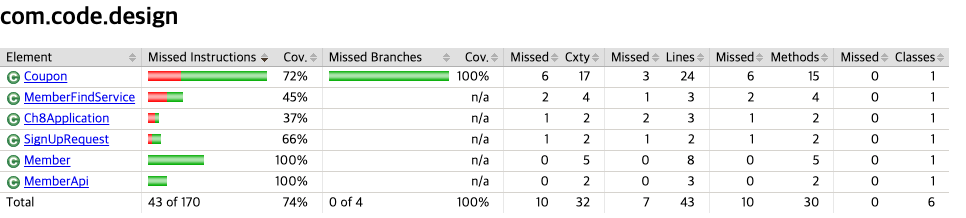
