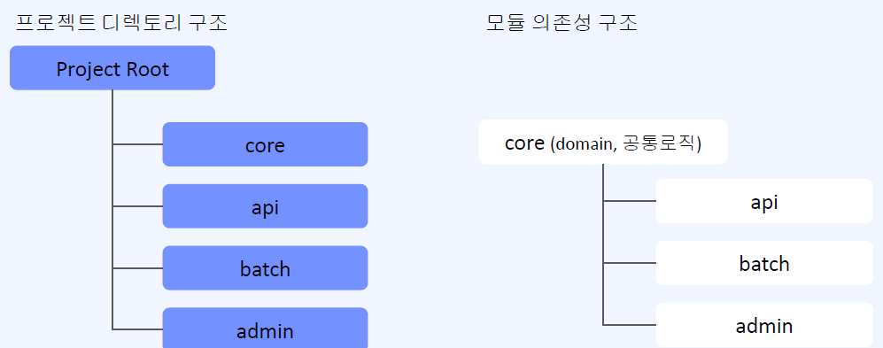
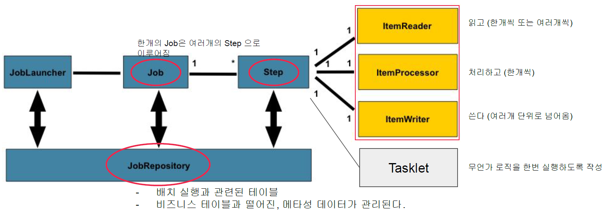
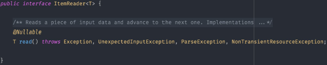
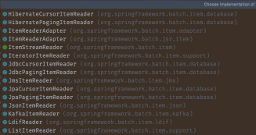
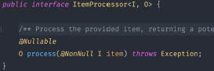
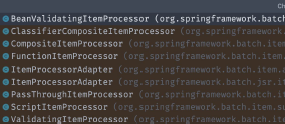
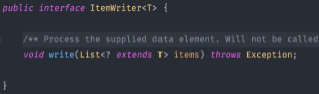
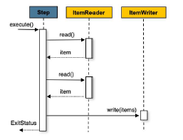
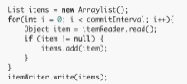
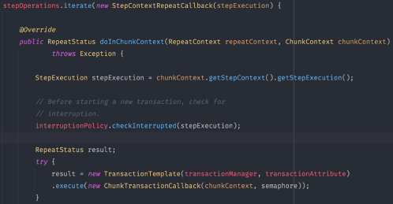

# Part 10. Final 프로젝트

# Part 10. Final 프로젝트

* toc
{:toc}

## 프로젝트 셋팅
+ Gradle multi module
  + 멀티 모듈을 만드는 이유
    + 라이브러리를 가져다 쓰는 것처럼 우리가 만든 소스를 레고처럼 조립하며 써야 할때 여러개 모듈을 만들면 좋다. 모듈(프로젝트)의 상위, 하위 관계를 맺어줄 수 있다
    + 

## 도메인 설계
1. 도메인(객체) 관계를 파악(정의) : 그림 등으로
2. 요구사항에 기반한 erd 를 설계를 먼저 하거나 도메인(객체) 관계를 먼저 그려보고, 코드로 짜보고 erd 설계
3. 정규화, 비정규화 장단점 파악 후 보완

+ ORM을 사용한다면 두 가지를 복합적으로 생각할 수 있어야 한다.
  + ERD 위주의 모델링을 하게 되면 ORM을 사용하는 장점을 활용하기 어려울 수도 있다
  + 객체 관계에만 집중하다보면 서비스가 커졌을 때 도메인 간 의존성 관리가 어려워 질 수도 있다
+ ManyToMany 관계는 중간에 조인테이블을 추가하여, 일대다 + 다대일 관계 로 설계한다.

## 엔티티 간의 데이터 중복
+ 타입 속성을 추가하여 events 테이블을 확장해서 사용한다.
  + 장점 
    + 테이블을 하나로 관리
  + 단점 
    + notifyAt, taskAt 과 같은 도메인 변수명 사용 불가능
    + 할일, 알림의 경우 불필요한 null 속성 다수 존재
    + 로직 내에서 타입체크가 필수적이다
+ events 테이블을 확장하되, 공통 속성을 부모 클래스로 분리하는 구조를 적용해본다
  + 상속 관계 맵핑 전략
  + 장점
    + JPA가 해당 기능을 제공해준다.
  + 단점
    + 편리하지만, JPA 의존도가 상당히 높아진다고 생각
+ 순수하게 코드로 해결해볼 수도 있다.
  + 장점
    + 테이블을 하나로 둔다 
  + 단점
    + 구현의 복잡도가 생길 수도 있다
+ JPA Auditing 이란?
  + 엔티티의 각종 이벤트(엔티티 생명주기 그림..) 시점에 미리 등록해둔 Listener를 통해 특정 로직을 수행할 수 있는 기능이다
  + 예를들어 @PrePersist, @PreUpdate, @PreRemove
  + 위 어노테이션을 이용하여 더 다양한 Auditing 기능을 추가할 수 있다.

## API 스펙 설계

### API 스펙 관리에 대해
+ 코드로 관리
  + Swagger (자바 어노테이션 기반)
  + Spring Rest Docs (스프링 테스트 코드 기반)
+ Rest Client Tool 이용
  + Postman 등
+ 문서로 관리
  + 스프레드 시트
  + 어떤 표 형식
+ 모든 경우 장단점이 존재한다.
  + 복잡하거나, 간단하거나
  + 빠르거나, 오래걸리거나
  + 상황에 맞게 진행하되 지속적으로 개선해나가는게중요

### RESTful API 에 대해
+ REST API 를 구성하는 요소가 정말 많다
  + 그것들을 모두 적용해야 할지는 실무 상황에 따라 많이 달라진다
+ 몇가지 특징을 가지도록 설계하기도 한다.
  + 한 리소스의 CRUD 에 대한 http method, path 를 정의하는 컨벤션을 따라 하겠다

## 상세 기능 구현

### 패스워드 암호화 적용
+ 암호화 간단 개념
  + 평문을 알아볼 수 없게 바꿔 놓음
  + 양방향, 단방향의 개념이 있다
    + 양방향 : 복호화 가능 (대칭키, 공개키 방식)
    + 단방향 : 복호화 불가능 (해시함수)
+ 패스워드 암호화 요구조건
  + 복호화 불가능
    + 해시함수 사용
  + 특정 패스워드의 해시값이 노출되어도, 같은 패스워드인 다른 계정도 탈취당하면 안된다
    + salt 필요
  + Brute-force 공격에 대비가 가능해야 한다. (연산속도가 너무 빠르면 안된다.)
  + BCrypt 알고리즘을 많이 사용한다.

## 이메일 발송 기능 개발

### gmail smtp 서버를 이용하기 위한 등록 절차
+ 메일 발송에 필요한 준비불
  + Gmail SMTP 접속용 계정 생성
  + 테스트를 위한 실제 이메일 준비 (1~3개)
+ 대략적인 개발 순서 
  + gmail smtp 계성 생성 및 메링 전송을 위한 앱등록
  + spring mail starter 의존성 추가
  + 스프링 설정에 smtp 추가
  + 이메일 발송 기능 개발 

### Gmail SMTP 용 설정하기
+ 구글 계정의 보안 설정 접속 후 2단계 인증 진행
  + [https://myaccount.google.com/u/2/security](https://myaccount.google.com/u/2/security)
+ 앱 비밀번호 클릭
+ 앱 비밀번호 설정
  + 앱설정 -> 메일
  + 기타 설정 -> 기타(맞춤 이름)
+ 앱 이름 추가 후 생성
+ 앱 비밀번호 확인
  + 스프링 설정에 추가

## 알람 배치 시스템 개발

### 배치 아키텍쳐 설명

+ 스프링 배치 구조 
  + 
+ ItemReader
  + 
  + 
  + 단순하게 아이템 하나를 읽는 Strategy 이다.
  + 배치 어플리케이션은 데이터를 읽는 것으로 시작하기 때문에, 다양한 데이터 소스 (꼭 db를 말하는 것은 아니다) 로부터 데이터를 읽을 수 있는 구현체를 잘 정의하는게 중요하다.
+ ItemProcessor
  + 
  + 
  + Reader 로부터 받아온 Item을 가공하는 담당.
  + Item이 <I> 타입이었다면 <O> 타입으로 변경해서 넘길 수 있다.
  + 배치 어플리케이션의 핵심 비즈니스 로직이 들어가게 된다
  + 하지만 따로 가공할 로직이 없다면 Processor 는 만들지 않아도 된다.(Optional)
  + 프로세서는 개발자가 직접 구현하는 영역이기 때문에 제공되는 구현체의 종류도 Reader에 비해 별로 없다.
+ ItemWriter
  + 
  + Reader, Processor 로부터 받아온 Item 에 대한 마지막 처리 단계 (마지막이니 void)
    + db에 저장하거나, 파일로 쓰거나, 이벤트를 발행하거나 등등
  + Step 을 만들 때 지정하는 Chunk 갯수만큼의 인자로 받게된다. 
  + ex)
    + Paging Reader의 page_size = 10, Chunk = 100 이라면
    + Reader가 10번 Page Read 를 하고
    + Processor 100번 처리할 때마다
    + Writer를 실행한다
+ Chunk Orientation, Batch Transaction 에 대해
  + 
  + 스프링배치는 Chunk 지향 프로세싱
    + 읽어야 할 또는, 처리할 아이템이 굉장히 많을때 트랜잭션을한번에 이어가는 것 보다 일정 주기로 여러번 실행하는 것이 안정적이다.
    + 
    + 안정적?
    + Fault Tolerant (장애 허용)
    + 실패 시 다양한 처리를 할 수 있게 해준다. 
  + [https://docs.spring.io/spring-batch/docs/current/reference/html/step.html#chunkOrientedProcessing](https://docs.spring.io/spring-batch/docs/current/reference/html/step.html#chunkOrientedProcessing)
  + TaskletStep.doExecution(StepExecution stepExecution)
    + 

