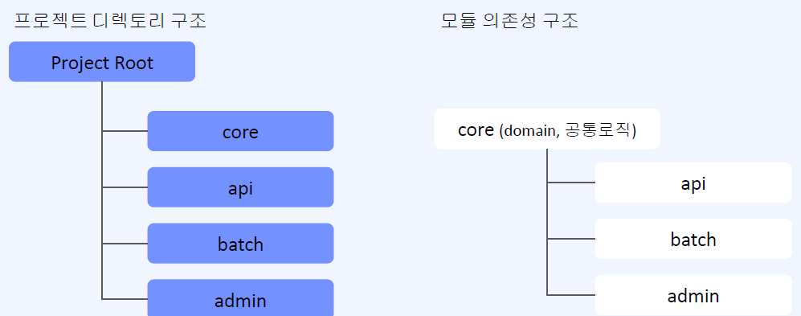

# Part 10. Final 프로젝트

# Part 10. Final 프로젝트

* toc
{:toc}

## 프로젝트 셋팅
+ Gradle multi module
  + 멀티 모듈을 만드는 이유
    + 라이브러리를 가져다 쓰는 것처럼 우리가 만든 소스를 레고처럼 조립하며 써야 할때 여러개 모듈을 만들면 좋다. 모듈(프로젝트)의 상위, 하위 관계를 맺어줄 수 있다
    + 

