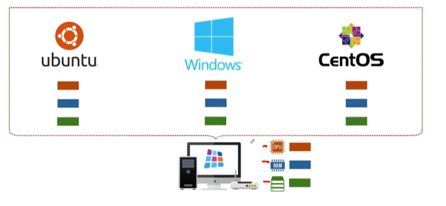
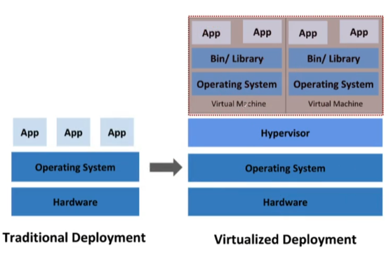
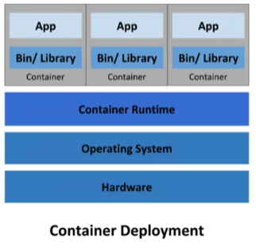

# Virtulization 이란?

# Virtulization 이란?

* toc
{:toc}

## Virtualization이란?
+ 가상화(Virtualization)
  + 하나의 물리적인 머신에서 여러 개의 운영 체제를 실행
+ 클라우드 컴퓨팅에서의 가상화
  + 운영 체제(OS) 내에 가상 머신을 생성하는 하드웨어 가상화
+ 가상화의 장점 
  + 유연성: 동일한 하드웨어서 여러 운영 체제를 동시에 실행
  + 민첩성: 여러 운영체제 간의 파일 이동 가능
  + 내결함성: 서버에 장애가 발생할 경우 서비스 및 소프트웨어는 이용 가능한 다른 서버로 이전 가능
  + 비용절감: 물리적 서버의 수를 줄이고, 서버의 자원을 재분배 및 재사용 가능 
+ 
  + 물리적인 PC가 가지고 있는 그 리소스를 각각의 가상화 운영체제들이 이렇게 공유해서 쓰고있는 개념
  + 물리적인 PC가 성능적인 측면에서 손해 그래서 가상화를 사용하게 되면 물리적인 PC가 가지고 있었던 성능은 줄어들 수밖에 없다 자기가 가지고 있는 리소스를 쪼개서 분할해서 쓰는 것이기 때문에 
  + 이 얘기는 사용하지 않는 여유로운 공간을 나눠 쓰는 게 제일 적합하겠다는 얘기로 바꿔 해석하면 된다
  + 가상화 환경을 쓰는 것은 여러가지 장점도 있지만 물리적인 PC의 리소스를 좀 더 줄여서 쓸 수 밖에 없는 환경이기 때문에 그것도 고려하셔서 계획하시는 게 필요하다
+ 
  + 가상화 방식이라는 것은 전통적으로 하드웨어 위에다가 어플리케이션을 설치했던 방식에 더해서 하이퍼바이저라는 새로운 개념이 나왔고, 기본적인 물리적인 PC가 가지고 있었던 운영 제재 위에다가 가상 머신이 가지고 있어야 될 별도의 운영 머신을
    설치해서 필요한 어플리케이션 설치해서 독립적으로 실행하는 것이다
  + 하드웨어가 필요하고, 그 하드웨어를 작동하기 위한 기본적인 운영체제가 필요한데, 이런 것들을 호스트 운영체제, 호스트 pc 라고 부른다고 치면 그 위에 설치되어 있는 가상화 머신의 운영체제, 가상화 머신 이런 것들로 인한 게스트 os 또는 게스트 pc 라고 생각하면 된다
  + host OS가 가지고 있는 리소스를 쪼개서 guest OS가 쓰고 있는 것이기 때문에 예를 들어서 host OS의 메모리가 32GB였다고 가정을 했을 때 guest OS 첫번째에 4GB를 나눠주고 두번째 guest OS에 8GB를 나눠줬다고 하면 4를 빼고 8을 뺐을 때 호스트 pc가 사용할 수 있는 현재 메모리의 용량은 20기가
    정도 딱 이렇게 수치상으로 떨어지진 않지만 대략 이런 구조를 가지고 리소스를 분배해서 쓰는 거다 라고 보면 된다
  + 하이퍼바이저라는 개념이 있는데 이 하이퍼바이저는 다른 말로 버츄얼 머신 모니터라고 생각면 된다 가상 머신을 운영하기 위한 플랫폼이라고 보면 된다
+ 
  + 비교적 최근에는 이 가상화 방식이 컨테이너 형식 형태로 변경이 돼서 사용되고 있다.
  + Virtualized Deployment 방식은 버츄얼 머신 위에 운영체제가 설치되어 있고 바이너리라던가 라이브러리들이 각각 필요하고 우리가 사용하려고 하는 어플리케이션들이 설치된다
  + Container Deployment 방식에서는 Hypervisor 라는 것이 빠지고 대신에 컨테이너 런타임이라는 것이 들어왔다
  + 어떻게 보면 하이퍼바이저 역할을 컨테이너 런타임이라는 것이 대신해 주는데 차이점이 있다. 컨테이너 런타임을 자세히 봤더니 여기에는 운영체제라는 개념이 많이 없다.
  + 이 컨테이너 런타임 자체로 시행될 수 있는 각각의 독립적인 환경을 앞에도 써있지만 컨테이너라고 부르는데 컨테이너는 운영체제가 될 수가 있고 컨테이너는 미들웨어가 될 수 있고 다시 말해서 데이터베이스가 될 수 있고 또는 프로그램을 하기 위한 환경
    Java 환경이던 Python 환경이던 Node 환경이던 프로그램 환경이 될 수도 있다는 게 특징이다
  + 컨테이너 가상화를 사용하시게 되면 불필요한 중복적인 파일을 사용하지 않고 공유할 수 있는 레이어를 최대한 공유하고 있기 때문에 최소한의 공간을 가지고 가상화를 꾸밀 수 있다는 장점을 가지고 있다
+ 전통적인 방법, 아무것도 설치하지 않은 상태에서 그냥 사용하는 게 전통적인 방법이었다고 하면 그 위에 하이퍼바이저 기술을 넣고 각각의 운영체제를 별도로 설치해서 쓰는 방법, 이게 지금 말씀드리는 가상화 방식이고 서버 가상화 방식이고,
  세 번째는 컨테이너 가상화 방식이라는 것은 하이퍼바이저를 사용하지 않는 대신에 컨테이너 런타임이라는 것이 우리가 사용하고자 하는 운영체제라던가 미드웨어를 가상화 시켜 놓고 쓰는 방식이다
