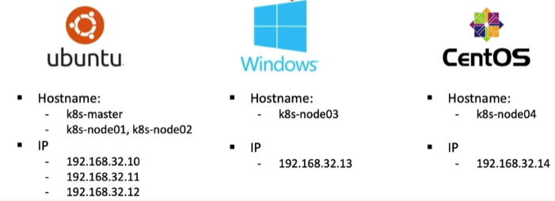
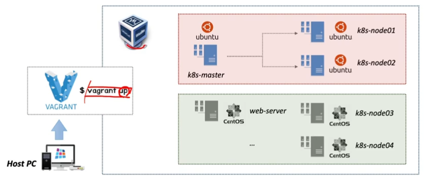

# Vagrant를 이용한 가상화 환경 구성 

# Vagrant를 이용한 가상화 환경 구성

* toc
{:toc}

## Vagrant란?
+ Virtual Box 설치 [https://www.virtualbox.org/](https://www.virtualbox.org/)
+ Vagrant 설치: [https://www.vagrantup.com/](https://www.vagrantup.com/)
+ 오라클사의 버처박스를 이용해서 가상화를 구축할 건데 그자체로만으로도 우리가 필요로 하는 게스트OS로 설치하는 것은 가능하지만 조금 더 쉽게 이미지 관리를 하고 설치를 할 수 있는 베이그란트라는 툴을 설치해서 사용
+ 2010.03 Mitchell Hashimoto, Opensource Project -> HashiCorp
  + 하시코프에서 만든 이 베이그란트 툴을 사용하시게 되면 간단하게 이러한 작업들이 가능하다
  + 설정 스크립트를 기반으로 특정 환경의 가상머신을 생성
    + 스크립트 기반이라는 것은 일종의 코드로 되어 있고, 그러한 코드에서 우리가 사용하고자 하는 인스턴스의 이름이라든가, 네트워크의 환경이라든가, 메모리의 크기라든가 이런 것들을 지정해 놓을 수가 있고, 해당하는 스크립트를 가지고 있다는 것은 버전 관리도 가능하고 그런
      스크립트를 여러 인스턴스, 여러 pc에서 배포를 함으로써 같이 사용할 수 있다는 장점도 생긴다
  + 개발 환경 공유
    + 사용하지 않더라도 버처박스라든가 VMware 같은 것들을 이용을 해서 가상화를 구축할 수가 있는데 필요에 따라서는 그렇게 만들었던 가상화를 개별적으로 만들거나 복사해서 사용하거나 했지만 Vagrant 같은 툴을 사용하면 스크립트 해가지고 생성하고 수정하고 하는 것들이 가능하다
  + Ruby로 개발되었으면 Linux, FreeBDS, OSX, Windows 지원 
+ 가상화 인스턴스 관리 SW -> Provisioning
  + VirtualBox (기본 프로바이더)
  + VMware
  + Hyper-V

### Provisioning
+ IT 인프라를 생성하고 설정하는 프로세스
+ 다양한 리소스에 대해서 사용자라든가 시스템 액세스를 관리하는 데 필요한 여러가지 단계 설정하고 거기에 대해서 제어할 수 있는 것
+ 사용자, 개발자 요구에 맞춰서 시스템에 필요한 자원을 할당하거나 배치하거나 재배포 가능 그리고 필요에 따라서 즉시 사용할 수 있는 상태로 만들어주는 역할을 하는 것이 프로비저닝이라고 보면 된다 
+ 
  + Vagrant 그 다음에 Virtual Box라는 두 가지 소프트웨어를 조합을 해서 사용할 수 있는 가상화 환경은 우분투 환경, 그 다음에 윈도우즈 환경, 그 다음에 CentOS 환경 이런 것들을 조합해서 설치할 수가 있다.

### 실습 환경 구성
+ 
+ 호스트 pc를 가지고 있는 상태에서 버츄얼 박스하고 그리고 베이그란트 두가지를 설치해서 전체의 가상환경이 필요한 내용들을 설치
+ Vagrant가 먼저 호스트 pc 위에 설치가 되고 이 Vagrant를 통해서 Virtual Box를 관리
+ Vagrant라는 툴이 없다 하더라도 하이퍼바이저를 지원해주는 솔루션만 있다고 하면 가상화 구축하시는데 문제는 없다. 그런데 그 관리하는 측면을 조금 더 수월하게 하기 위해서 베이그란트라는 도구를 설치할 거다

## Vagrant를 이용하여 VM 제어하기
+ Vagrant: 버츄얼 박스와 같이 가상환경을 구축할 수 있고 다룰 수 있도록 지원되는 어플리케이션을 조금은 더 편하게 사용할 수 있도록 조금은 다룰 수 있도록 도와주는 어플리케이션
+ 베이그란트는 이 자체만으로는 가상화 환경을 구축할 수는 없고 버처박스라든가 VM웨어가 있어야지만 그것 둘과 조합을 해서 사용할 수 있다

### Vagrant 동작
+ Box 이미지 다운로드 -> Box 이미지를 이용하여 프로젝트 생성
+ 프로젝트 최상위 디렉토리에 Vagrantfile 파일 생성/수정
+ 프로젝트를 위한 Vagrant 가상 인스턴스(VM) 시작
+ 가상 인스턴스 접속 및 작업
+ 가상 인스턴스 종료

### Box 이미지
+ Box 파일 조회 [https://app.vagrantup.com/boxes/search](https://app.vagrantup.com/boxes/search)ㅏ

### Box 다운로드
+ [https://app.vagrantup.com/boxes/search](https://app.vagrantup.com/boxes/search) 에서 사용할 이미지 검색
+ 작업 디렉토리) vagrant init

### Vagrantfile
+ Rudy 언어로 작성 된 Vagrant 설정 스크립트
+ Vagrant 인스턴스로 생성 될 내용(설정) 등의 내용을 작성
+ vagrant init 명령어 실행 시 기본 Vagrantfile 생성 
