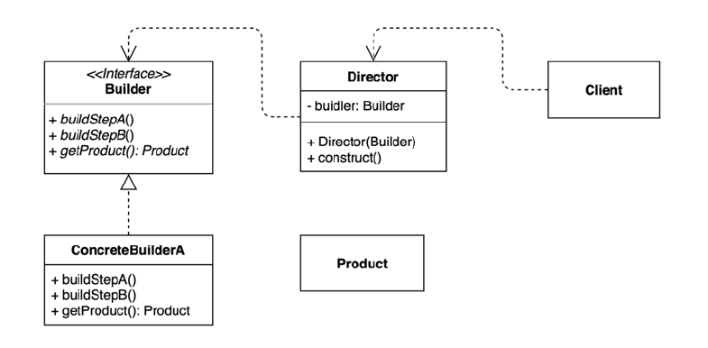
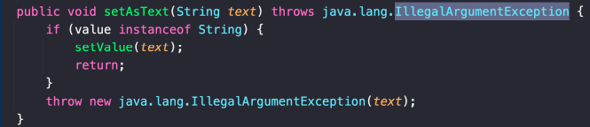
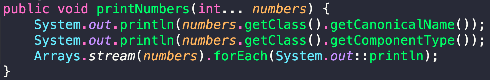

# 아이템 2. 생성자에 매개변수가 많다면 빌더를 고려하라

# 아이템 2. 생성자에 매개변수가 많다면 빌더를 고려하라

* toc
{:toc}

## 핵심 정리
+ 정적 팩터리와 생성자에 선택적 매개변수가 많을 때 고려할 수 있는 방안
  + 대안1: 점층적 생성자 패턴 또는 생성자 체이닝
    + 매개변수가 늘어나면 클라이언트 코드를 작성하거나 읽기 어렵다
  + 대안2: 자바빈즈 패턴
    + 완전한 객체를 만들려면 메서드를 여러번 호출해야 한다. (일관성이 무너진 상태가 될 수도 있다.)
    + 클래스를 불변으로 만들 수 없다.
+ 권장하는 방법: 빌더 패턴
  + 플루언트 API 또는 메서드 체이닝을 한다
  + 계층적으로 설계된 클래스와 함께 사용하기 좋다. (계층형 빌더) 
    + **self 매커니즘을 사용해서 타입 변환 없이 하위 객체를 반환할 수 있다** 
  + 점층적 생성자보다 클라이언트 코드를 읽고 쓰기가 훨씬 간결하고, 자바빈즈 보다 훨씬 안전하다.

## 완벽 공략
+ p15, 자바빈즈, 게터, 세터
+ p17, 객체 얼리기 (freezing)
+ p17, 빌더 패턴
+ p19, IllegalArgumentException
+ p21, 가변인수 (varargs) 매개변수를 여러 개 사용할 수 있다

## 아이템 2. 완벽 공략 6 - 자바빈
(주로 GUI에서) 재사용 가능한 소프트웨어 컴포넌트
  + [https://download.oracle.com/otndocs/jcp/7224-javabeans-1.01-fr-spec-oth-JSpec/](https://download.oracle.com/otndocs/jcp/7224-javabeans-1.01-fr-spec-oth-JSpec/)
+ java.beans 패키지 안에 있는 모든 것
+ 그 중에서도 자바빈이 지켜야 할 규약
  + 아규먼트 없는 기본 생성자
    + 객체를 만들기 편하기 때문에 리플렉션을 통해서 특정 객체들을 만들고 값대를 주입 근데 이때 리플렉션으로 어떠한 인스턴스를 만들려면 생성자를 통해서 만들어야 하는데
      생성자의 아귀먼트가 있으면 만들기가 굉장히 번거롭다 기본 생성자가 있으면 쉽게 만들 수 있기 때문에 기본 생성자를 제공하도록 규약을 정해놓은 거다
  + getter와 setter 메소드 이름 규약
  + Serializable 인터페이스 구현
    + 시리얼라이저블은 직렬화 기능이다 객체를 직렬화하고 객체를 역직렬화한다는 것은 객체를 직렬화해서 어딘가에 저장을 해놓고 나중에 다시 읽어서 쓸 수 있게끔 만들겠다는 그런 의도가
      있는 거다 우리가 어떤 객체를 여기서 만들겠지만 그 객체를 한 번 만들고 끝나는 게 아니라 나중에 다시 읽어서 수정을 하거나 재사용할 수가 있다 그러려면 객체를 저장 가능한 형태로 만들어야 된다 
    + 즉 객체가 가지고 있는 모든 값들을 어딘가에 잘 그 객체 그 상태 그대로 저장을 했다가 그 상태 그대로 모든 필드가 원래 가지고 있던 값 그대로 복원이 되는 그런 기능이 필요할거다
      시리얼라이저블을 구현해놔야 언젠가는 그 객체를 증여라로 저장했다가 복원할 수 있으니까 그래서 이런 세 가지 규약을 강제는 아니고 규약을 지키도록 권장하고 있다
+ 하지만 실제로 오늘날 자바빈 스팩 중에서도 getter와 setter가 주로 쓰는 이유는?
  + JPA나 스프링과 같은 여러 프레임워크에서 리플렉션을 통해 특정 객체의 값을 조회하거나 설정하기 때문이다.
  + 실제로 오늘 우리가 개발하는 모든 애플리케이션은 GUI 툴을 통해서 빈드를 접근하려고 만드는 게 아니라 우리가 만드는 클래스들에 있는 특정 프로퍼티에 접근하는 여러 프레임워크들이 있다
  + GUI 툴이 아니라 오늘날에는 여러가지 프레임워크, JPA나 스프링이나 타임리프나 뷰와 관련된 것도 마찬가지다
  + GUI 툴이 아니지만 도메인 객체를 HTML에 정보를 보여준다거나 JSON 스펙의 문자열로 변환을 한다거나 그럴 때는 프로퍼티에 있는 모든 값들을 꺼내서 옮겨야 하는 과정이 필요하다 
  + 그럼 GUI 툴과 마찬가지로 이러한 필드들에 접근하는 일반적인 방법이 필요한 것이다 어떤 메소드를 통해서 접근할 것인가 잡아빈 스펙에 정해져 있는 게 있으니까 그런 규약들을 따라서 사용해서 JPA , Spring, Time 타임리프 등을 리플렉션 통해서 값들을 가져다가 원하는 대로 쓰는 것이다
  
## 아이템 2. 완벽 공략 7 - 객체 프리징
임의의 객체를 불변 객체로 만들어주는 기능.
+ 객체 프리징은 자바가 제공하는 기능은아니다 자바스크립트가 제공하는 프리징 기능을 통해서 저자가 어떠한 것을 이야기하려고 했는지 엿볼 수 있다
+ 자바스크립트에는 var, const가 있는데 베리어블이라고 정의하고 객체를 만들었느데 이 객체는 자바 개발자가 생각하기엔 색다르게 프로퍼티를 추가하거나 삭제하는게 가능하다 
+ 자바에서 어떻게 이런 프로퍼티를 빼고 새로운 멤버를 추가하지? 약간 애매하다 그런데 자바스크립트에는 그런 게 가능하다
+ const라고 바꾸면은 우리가 알고 있는 건 상수 개념이니까 이게 바꾸지 못하지 않을까 싶지만 바뀐다 아무리 객체 자체가 Const라지만 객체 자체는 안 바뀌었으니깐 객체가 가지고 있는 Property에 값은 여전히 변경할 수가 있다
  const를 줬으니까 무엇을 못하는 거냐면 아까 variable일 때는 새로운 객체를 만들어서 대입하는 게 기선에다 할당하는 게 가능했는데 하지만 const일 때는 이런 게 불가능하다
+ JavaScript에 있는 Freezing을 쓰면 Const일 때도 새로운 Property를 추가하는 것도 가능하고 기존에 있는 Property를 빼는 것도 가능하고, 기존의 Property에 있는 값을 변경하는 것도 가능해다
  그런데 Object에 있는 Freeze로 객체를 얼린다고 하면 더이상 객체를 얼리지 못한다 프로퍼티를 추가하거나 삭제하거나, 값을 변경하거나 프로토타입을 변경하는 것도 다 막힌다 프리징이라는 기능은 스트릭트 모드에서만 동작을 한다 그래서 Strict를 추가해야 한다
+ [Object.freeze()](https://developer.mozilla.org/en-US/docs/Web/JavaScript/Reference/Global_Objects/Object/freeze) 에 전달한 객체는 그뒤로 변경될 수 없다.
  + 새 프로퍼티를 추가하지 못함
  + 기존 프로퍼티를 제거하지 못함
  + 기존 프로퍼티 값을 변경하지 못함
  + [프로토타입](https://developer.mozilla.org/en-US/docs/Learn/JavaScript/Objects/Object_prototypes) 을 변경하지 못함
+ [strict 모드](https://developer.mozilla.org/en-US/docs/Web/JavaScript/Reference/Strict_mode) 에서만 동작함
+ 비슷한 류의 펑션으로 Object.seal()과 Object.preverntExtensions()가 있다.
  + Object.seal()라는 것은 Property 추가나 삭제하는 걸 막아주고 대신에 값은 계속해서 변경할 수 있다
  + Object-PreventExtensions는 새로운 프로퍼티를 추가하는 것만 막아준다 
+ 그런데 이걸 만약에 Java에서 구현해야 된다면 어떻게 구현해야 되냐면 뭔가 마커가 있어야 된다 객체가 프리징이 됐다는 마커가 있어야 되고 그 다음에 어떤 객체에 대한 변경이
  일어나려고 할 때 세터나 기존에 있는 프로퍼티를 변경하는 모든 오퍼레이션에는 그 플래그 값을 체크하는 기능이 들어간다
+ 중요한 점은 불변인데 리스트 같은 이미 할당된 거에는 새로운 걸 할당하지 못한다는 거지 리스트를 못 바꾼다는 건 아니다 레퍼런스 자체를 인뮤터블하게 유지하는 거지 이 안에 있는 인스턴스 자체가 인뮤터블 해지는 건 아니다
+ Property를 바꾸는 게 아니라 상속을 막고 싶다면 더이상 클래스가 변경되는 걸 원치 않는다라고 하면 클래스 앞에도 Final을 붙인다 이렇게 상속을 막는 방법도 있다

## 아이템 2. 완벽 공략 8 - 빌더 패턴
동일한 프로세스를 거쳐 다양한 구성의 인스턴스를 만드는 방법.
+ 복잡한 객체를 만드는 프로세스를 독립적으로 분리할 수 있다
  + 
+ 원래 가지고 있던 코드의 양도 분리해서 줄일 수 있고 단일 책임 원칙을 적용해서 객체를 생성하는 과정을 별도의 클래스로 분리시킬 수 있는 장점이 있는 패턴이다
+ 디자인 패턴의 주요한 구성 요소로는 Builder Interface가 있고 Builder Interface의 구현체인 Concrete Builder가 있을 수 있다 그리고 디렉터라는 개념이 하나 더 있을 수 있는데 디렉터는 Builder를 통해서
  만들어지는 객체들 중에 자주 만들어지는 형태의 객체가 있다면 그걸 디렉터의 위임을 해서 디렉터가 Builder를 사용해서 만들 수 있게끔 그러한 구조를 만들 수 있는데 반드시 이런 디렉터가 있어야지만 빌더 패턴인 건 아니다.
+ [https://ysiksik.github.io/gof-design-pattern/2022-10-03-Creational-Patterns/#%EB%B9%8C%EB%8D%94-builder-%ED%8C%A8%ED%84%B4](https://ysiksik.github.io/gof-design-pattern/2022-10-03-Creational-Patterns/#%EB%B9%8C%EB%8D%94-builder-%ED%8C%A8%ED%84%B4)

## 아이템 2. 완벽 공략 9 - IllegalArgumentException
잘못된 인자를 넘겨 받았을 때 사용할 수 있는 기본 런타임 예외
+ 
+ 이 예외는 프로그래밍적인 에러고 그리고 복구할 수 있는 방법이 없기 때문에 Checked Exception이 아니다
+ IllegalArgumentException은 최소한 어떤 필드가 잘못되었는지를 알려주는게 좋다
+ checked exception과 unchecked exception의 차이?
  + Checked Exception 같은 경우는 Checked Exception 이 발생했을 때 Checked Exception을 던지거나 또는 예외를 처리해야 한다
    + 컴파일 타임에 체크를 해 주기 때문에 그렇게 하지 않으면 컴파일 할 수가 없다
  + Unchecked Exception 는 try-catch block으로 잡지 않아도 되고 method 다시 던지지 않아도 된다
  + Checked Exception은 복구가 가능한 상황에서 던지고 복구가 가능하지 않은 상황이라면 그 예외를 던져서 받게 되는 클라이언트 코드가 예외가
    발생했을 때 뭔가를 할 수 없는 상황이라면 Unchecked Exception을 사용한다 
+ 간혹 메소드 선언부에 unchecked exception을 선언하는 이유는?
  + 클라이언트한테 명시적으로 알려주고 싶을 때 이게 비록 Unchecked Exception이긴 하지만 선언을 안 해도 되지만 그럼에도 불구하고 클라이언트한테 직접 알려주고 싶을 때 너가 이런 파라미터를 이런 값으로 넘기면 이런
    익셉션이 발생할 수 있어 라고 명시적으로 알려주고 싶을 때는 이렇게 Unchecked Exception임에도 선언을 안 해도 됨에도 불구하고 선언을 할 수도 있다
  + 그런데 대부분 그 많은 여러 Unchecked exception 계열의 예외를 선언하지 않는 이유는 너무 많은 Unchecked exception이 발생할 수 있는 경우에는 그 모든 것들을 선언하는 것 자체가 코드의 가독성을 떨어뜨리기 때문에 Checked
    exception만 보통 표기를 한다 명시적으로 이런 예외가 발생했을 때는 클라이언트가 후속 작업을 할 수 있게끔 프로그래밍적인 장치를 마련하는 것이다
+ checked exception은 왜 사용할까?
  + unchecked exception이 아니라 checked exception을 써야 하는 경우에는 그 에러가 발생했을 때 클라이언트 코드가 어떤 후속 작업을 해주길 바라는 경우 그 경우에는 checked exception을 쓰는 게 맞다
  + checked exception을 던지는 코드의 클라이언트에게 어떤 액션을 강요하는 것이다  
  + 예외가 발생했을 때 부가적인 작업을 할 수 있게끔
+ [자바의 모든 RuntimeException 클래스](https://docs.oracle.com/en/java/javase/11/docs/api/java.base/java/lang/RuntimeException.html)
+ [https://docs.oracle.com/javase/tutorial/essential/exceptions/runtime.html](https://docs.oracle.com/javase/tutorial/essential/exceptions/runtime.html)

## 아이템 2. 완벽 공략 10 - 가변 인수
여러 인자를 받을 수 있는 가변적인 argument (Var+args)
+ 가변인수는 메소드에 오직 하나만 선언할 수 있다.
+ 가변인수는 메소드의 가장 마지막 매개변수가 되어야 한다.
+ 
+ 빌더를 이용하면 가변인수 매개변수를 여러 개 사용할 수 있다 각각을 적절한 메소드로 나눠서 쓰면 된다

