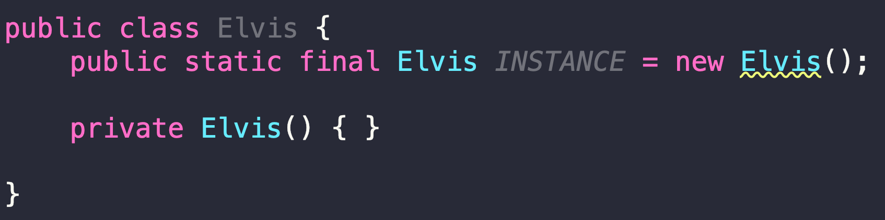

# 아이템 3. 생성자나 열거 타입으로 싱글턴임을 보증하라.

# 아이템 3. 생성자나 열거 타입으로 싱글턴임을 보증하라.

* toc
{:toc}

## 아이템 3. 핵심 정리 1 - 생성자를 사용하는 방법 1
첫번째 방법: private 생성자 + public static final 필드
+ 
  + Static Final로 선언을 해두면 자바 도큐먼트를 만들 때 별도의 필드로 보여준다
+ 장점, 간결하고 싱글턴임을 API에 들어낼 수 있다
+ 단점 1, 싱글톤을 사용하는 클라이언트 테스트하기 어려워진다.
  + 인터페이스가 없는 경우 목 객체를 만들수 없어 테스트하기 어려워진다
+ 단점 2, 리플렉션으로 private 생성자를 호출할 수 있다
+ 단점 3, 역직렬화 할 때 새로운 인스턴스가 생길 수 있다
