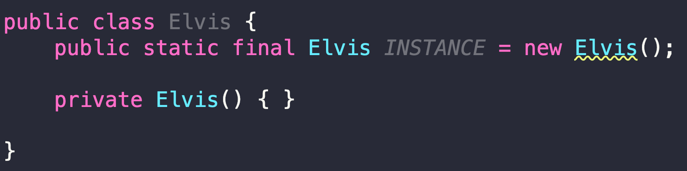
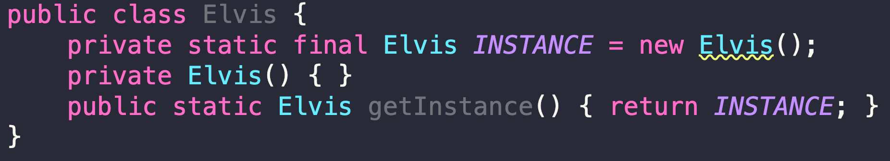
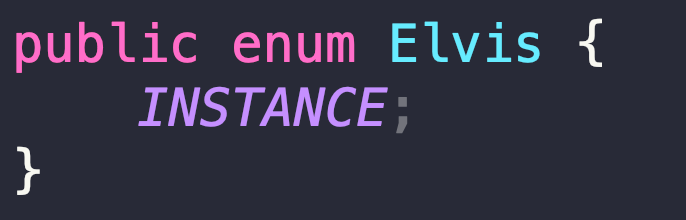

# 아이템 3. 생성자나 열거 타입으로 싱글턴임을 보증하라.

# 아이템 3. 생성자나 열거 타입으로 싱글턴임을 보증하라.

* toc
{:toc}

## 아이템 3. 핵심 정리 1 - 생성자를 사용하는 방법 1
첫번째 방법: private 생성자 + public static final 필드
+ 
  
+ 장점, 간결하고 싱글턴임을 API에 들어낼 수 있다
  + Static Final로 선언을 해두면 자바 도큐먼트를 만들 때 별도의 필드로 보여준다
  
~~~java

public class Elvis implements IElvis, Serializable {

    /**
     * 싱글톤 오브젝트
     */
    public static final Elvis INSTANCE = new Elvis();
    private static boolean created;

    private Elvis() {
        if (created) {
            throw new UnsupportedOperationException("can't be created by constructor.");
        }

        created = true;
    }

    public void leaveTheBuilding() {
        System.out.println("Whoa baby, I'm outta here!");
    }

    public void sing() {
        System.out.println("I'll have a blue~ Christmas without you~");
    }

    // 이 메서드는 보통 클래스 바깥(다른 클래스)에 작성해야 한다!
    public static void main(String[] args) {
        Elvis elvis = Elvis.INSTANCE;
        elvis.leaveTheBuilding();
    }

    private Object readResolve() {
        return INSTANCE;
    }

}

~~~

+ 단점 1, 싱글톤을 사용하는 클라이언트 테스트하기 어려워진다.
  + 인터페이스가 없는 경우 목 객체를 만들수 없어 테스트하기 어려워진다
+ 단점 2, 리플렉션으로 private 생성자를 호출할 수 있다

~~~java

public class ElvisReflection {

    public static void main(String[] args) {
        try {
            Constructor<Elvis> defaultConstructor = Elvis.class.getDeclaredConstructor();
            defaultConstructor.setAccessible(true);
            Elvis elvis1 = defaultConstructor.newInstance();
            Elvis elvis2 = defaultConstructor.newInstance();
            Elvis.INSTANCE.sing();
        } catch (InvocationTargetException | NoSuchMethodException | InstantiationException | IllegalAccessException e) {
            e.printStackTrace();
        }
    }

}


~~~

+ 단점 3, 역직렬화 할 때 새로운 인스턴스가 생길 수 있다

~~~java

public class ElvisSerialization {

    public static void main(String[] args) {
        try (ObjectOutput out = new ObjectOutputStream(new FileOutputStream("elvis.obj"))) {
            out.writeObject(Elvis.INSTANCE);
        } catch (IOException e) {
            e.printStackTrace();
        }

        try (ObjectInput in = new ObjectInputStream(new FileInputStream("elvis.obj"))) {
            Elvis elvis3 = (Elvis) in.readObject();
            System.out.println(elvis3 == Elvis.INSTANCE);
        } catch (IOException | ClassNotFoundException e) {
            e.printStackTrace();
        }
    }

}

~~~

## 아이템 3. 핵심 정리 2 - 생성자를 사용하는 방법 2
두번째 방법: private 생성자 + 정적 팩터리 메서드
+ 
+ 장점 1. API를 바꾸지 않고도 싱글턴이 아니게 변경할 수 있다.
  + 클라이언트 코드는 계속해서 동일하게 get 인스턴스를 쓰니까 클라이언트 코드가 변경되지 않으면서 우리가 원하는 대로 동작을 바꿀 수 있게 된다

~~~java

public class Elvis {
    private static final Elvis INSTANCE = new Elvis();
    private Elvis() { }
    public static Elvis getInstance() { return INSTANCE; }

    public void leaveTheBuilding() {
        System.out.println("Whoa baby, I'm outta here!");
    }

    // 이 메서드는 보통 클래스 바깥(다른 클래스)에 작성해야 한다!
    public static void main(String[] args) {
        Elvis elvis = Elvis.getInstance();
        elvis.leaveTheBuilding();

        System.out.println(Elvis.getInstance());
        System.out.println(Elvis.getInstance());
    }
    
}


~~~

+ 장점 2. 정적 팩터리를 제네릭 싱글턴 팩터리로 만들 수 있다
  + Generic한 타입으로 동일한 Singleton Instance를 사용하고 싶을 때 Generic Singleton Factory를 만들어 사용할 수 있다
  + Generic한 타입을 쓸 때 인스턴스는 동일하지만 각각이 원하는 타입으로 바꿔서 쓸 수 있다
  + equals로는 비교가 가능한데 type 자체가 다르기 때문에 ```==```  비교는 안된다
  + 제네릭 싱글턴 팩토리에서 해주는 일은 단순하게 가지고 있는 원래 싱글턴 인스턴스를 원하는 타입으로 변환해주는 일만 하는 것이다

~~~java

public class MetaElvis<T> {

    private static final MetaElvis<Object> INSTANCE = new MetaElvis<>();

    private MetaElvis() { }

    @SuppressWarnings("unchecked")
    public static <E> MetaElvis<E> getInstance() { return (MetaElvis<E>) INSTANCE; }

    public void say(T t) {
        System.out.println(t);
    }

    public void leaveTheBuilding() {
        System.out.println("Whoa baby, I'm outta here!");
    }

    public static void main(String[] args) {
        MetaElvis<String> elvis1 = MetaElvis.getInstance();
        MetaElvis<Integer> elvis2 = MetaElvis.getInstance();
        System.out.println(elvis1);
        System.out.println(elvis2);
        elvis1.say("hello");
        elvis2.say(100);
    }

}

~~~

+ 장점 3. 정적 팩터리의 메서드 참조를 공급자(Supplier)로 사용할 수 있다.
  + 책에서 말하는 공급자, Supplier는 Java 8에 들어간 Functional Interface 를 이야기하는 것이다 Java 8에는 ```@FunctionalInterface``` 라는 애노테이션이 붙어 있는 기본적인 Function들을 제공한다
  + Supplier 인터페이스만 만족하면 어떤 메소드든 서플라이어 Functional 타입으로 우리가 사용할 수 있다.


~~~java

public interface Singer {

    void sing();
}


~~~

~~~java

public class Elvis implements Singer {
    private static final Elvis INSTANCE = new Elvis();
    private Elvis() { }
    public static Elvis getInstance() { return INSTANCE; }

    public void leaveTheBuilding() {
        System.out.println("Whoa baby, I'm outta here!");
    }

    // 이 메서드는 보통 클래스 바깥(다른 클래스)에 작성해야 한다!
    public static void main(String[] args) {
        Elvis elvis = Elvis.getInstance();
        elvis.leaveTheBuilding();

        System.out.println(Elvis.getInstance());
        System.out.println(Elvis.getInstance());
    }

    @Override
    public void sing() {
        System.out.println("my way~~~");
    }
}

~~~

~~~java

public class Concert {

    public void start(Supplier<Singer> singerSupplier) {
        Singer singer = singerSupplier.get();
        singer.sing();
    }

    public static void main(String[] args) {
        Concert concert = new Concert();
        concert.start(Elvis::getInstance);
    }
}


~~~

+ 단점은 리플렉션에 대한 문제, 테스트에 대한 문제, 직렬화, 역직렬화 문제 그대로 다 가지고있다

## 아이템 3. 핵심 정리 4 - 열거 타입
세번째 방법: 열거 타입
+ 
+ 가장 간결한 방법이며 직렬화와 리플렉션에도 안전하다
+ 대부분의 상황에서는 원소가 하나뿐인 열거 타입이 싱글턴을 만드는 가장 좋은 방법이다.

## 완벽 공략
+ p23, 리플렉션 API로 private 생성자 호출하기
+ p24, 메서드 참조를 공급자로 사용할 수 있다
+ p24, Supplier<T>, 함수형 인터페이스
+ p24, 직렬화, 역직렬화, Serializable, transient

## 아이템 3. 완벽 공략 11 - 메서드 참조
메소드 하나만 호출하는 람다 표현식을 줄여쓰는 방법
+ 스태틱 메소드 레퍼런스

~~~java

public class Person {

    LocalDate birthday;

    public Person() {

    }

    public Person(LocalDate birthday) {
        this.birthday = birthday;
    }

    public static int compareByAge(Person a, Person b) {
        return a.birthday.compareTo(b.birthday);
    }

    public static void main(String[] args) {
        List<Person> people = new ArrayList<>();
        people.add(new Person(LocalDate.of(1982, 7, 15)));
        people.add(new Person(LocalDate.of(2011, 3, 2)));
        people.add(new Person(LocalDate.of(2013, 1, 28)));

        people.sort(Person::compareByAge);
    }

    public int getAge() {
        return LocalDate.now().getYear() - birthday.getYear();
    }

}


~~~

+ 인스턴스 메소드 레퍼런스

~~~java

public class Person {

    LocalDate birthday;

    public Person() {

    }

    public Person(LocalDate birthday) {
        this.birthday = birthday;
    }

    public int compareByAge(Person a, Person b) {
        return a.birthday.compareTo(b.birthday);
    }

    public static void main(String[] args) {
        List<Person> people = new ArrayList<>();
        people.add(new Person(LocalDate.of(1982, 7, 15)));
        people.add(new Person(LocalDate.of(2011, 3, 2)));
        people.add(new Person(LocalDate.of(2013, 1, 28)));

        Person person = new Person(null);

        people.sort(person::compareByAge);
    }

    public int getAge() {
        return LocalDate.now().getYear() - birthday.getYear();
    }

}

~~~

+ 임의 객체의 인스턴스 메소드 레퍼런스

~~~java

public class Person {

  LocalDate birthday;

  public Person() {

  }

  public Person(LocalDate birthday) {
    this.birthday = birthday;
  }

  public int compareByAge(Person b) {
    return this.birthday.compareTo(b.birthday);
  }

  public static void main(String[] args) {
    List<Person> people = new ArrayList<>();
    people.add(new Person(LocalDate.of(1982, 7, 15)));
    people.add(new Person(LocalDate.of(2011, 3, 2)));
    people.add(new Person(LocalDate.of(2013, 1, 28)));

    people.sort(Person::compareByAge);
  }

  public int getAge() {
    return LocalDate.now().getYear() - birthday.getYear();
  }

}

~~~


+ 생성자 레퍼런스

~~~java

public class Person {

    LocalDate birthday;

    public Person() {

    }

    public Person(LocalDate birthday) {
        this.birthday = birthday;
    }

    public int compareByAge(Person b) {
        return this.birthday.compareTo(b.birthday);
    }

    public static void main(String[] args) {
        List<LocalDate> datas = new ArrayList<>();
        datas.add(LocalDate.of(1982, 7, 15));
        datas.add(LocalDate.of(2011, 3, 2));
        datas.add(LocalDate.of(2013, 1, 28));

        datas.stream().map(Person::new).collect(Collectors.toList());
        
    }

    public int getAge() {
        return LocalDate.now().getYear() - birthday.getYear();
    }

}

~~~

+ [https://docs.oracle.com/javase/tutorial/java/javaOO/methodreferences.html](https://docs.oracle.com/javase/tutorial/java/javaOO/methodreferences.html)

## 아이템 3. 완벽 공략 12 - 함수형 인터페이스
자바가 제공하는 기본 함수형 인터페이스
+ 함수형 인터페이스는 람다 표현식과 메소드 참조에 대한 “타겟 타입”을 제공한다
  + 함수형 인터페이스라는 것은 우리가 어떤 타겟 타입을 정의할 수 있다 람다 표현칙이나 메소드 레퍼런스에 해당하는 타입을 정의할 수 있다
+ 타겟 타입은 변수 할당, 메소드 호출, 타입 변환에 활용할 수 있다
+ 자바에서 제공하는 기본 함수형 인터페이스 익혀 둘 것. [(java.util.function 패키지](https://docs.oracle.com/javase/8/docs/api/java/util/function/package-summary.html)
  + 기본으로 제공해주는 함수형 인터페이스에는 어떤 것들이 있는가 그걸 알아야 제공해주지 않는, 커버해주지 않는 인터페이스를 만들 수 있다
+ 심화 학습 1) [Understanding Java method invocation with invokedynamic](https://blogs.oracle.com/javamagazine/post/understanding-java-method-invocation-with-invokedynamic)
+ 심화 학습 2) [LambdaMetaFactory](https://docs.oracle.com/javase/8/docs/api/java/lang/invoke/LambdaMetafactory.html)

## 아이템 3. 완벽 공략 13 - 객체 직렬화
객체를 바이트스트림으로 상호 변환하는 기술
+ 바이트스트림으로 변환한 객체를 파일로 저장하거나 네트워트를 통해 다른 시스템 으로 전송할 수 있다.
  + 객체의 직렬화라는 기능은 아주 자발한 언어를 만들 초창기에 그 당시에 메모리에 올라와 있는 객체, 오브젝트를 다른 자바 시스템으로 옮기고 싶은 경우가 있었다고 가정하고 네트워크를 통해서 전송해서 다른 시스템에서 그 오브젝트를 그대로 복원하고 싶은 것
    마치 우리가 일상적으로 비유를 들면 이사를 가는 거랑 비슷하다 이사를 가려면 집을 그대로 들어서 옮기지 못한다 오브젝트는 메모리 안에 있는 데이터이기 때문에 그대로 전송하지 못한다 그래서 마치 이사를 갈 때 집에 있는 모든 짐들을 박스에 포장을 해서 트럭에 실을 수 있는 형태로 만드는 거랑 비슷하다.
  + 그래서 오브젝트를 바이트 스트림으로 만들어주는 것이다 그게 직렬화고 바이트 스트림으로 되어 있는 바이트 스트림을 객체로 복원하는 과정이 역직렬화라고 보면 된다 이사를 갈 때 짐을 포장하는 과정이 직렬화 짐을 풀어서 새 집에다가 짐을 풀어놓는 과정이 역직렬화가 된다.
  + 전송했을 때 유용한 포맷이 어떤 거냐는 받아서 처리할 곳이 JVM이라면 객체 직렬화도 유용한 포맷이 될 수 있다 그게 아니라 타 시스템이라면 바이트 스트림을 보내는 건 무의미하다.
+ Serializable 인터페이스 구현
  + Serializable 인터페이스를 선언해 줘야 제대로 직렬화, 역직렬화가 될 수 있다.

~~~java

public class Book implements Serializable {

    private static final long serialVersionUID = 1L;

    private String isbn;

    private String title;

    private LocalDate published;

    private String name;

    private transient int numberOfSold;

    public Book(String isbn, String title, String author, LocalDate published) {
        this.isbn = isbn;
        this.title = title;
        this.published = published;
    }

    @Override
    public String toString() {
        return "Book{" +
                "isbn='" + isbn + '\'' +
                ", title='" + title + '\'' +
                ", published=" + published +
                ", numberOfSold=" + numberOfSold +
                '}';
    }

    public String getIsbn() {
        return isbn;
    }

    public void setIsbn(String isbn) {
        this.isbn = isbn;
    }

    public String getTitle() {
        return title;
    }

    public void setTitle(String title) {
        this.title = title;
    }

    public LocalDate getPublished() {
        return published;
    }

    public void setPublished(LocalDate published) {
        this.published = published;
    }

    public int getNumberOfSold() {
        return numberOfSold;
    }

    public void setNumberOfSold(int numberOfSold) {
        this.numberOfSold = numberOfSold;
    }
}

~~~

~~~java

public class SerializationExample {

    private void serialize(Book book) {
        try (ObjectOutput out = new ObjectOutputStream(new FileOutputStream("book.obj"))) {
            out.writeObject(book);
        } catch (IOException e) {
            throw new RuntimeException(e);
        }
    }

    private Book deserialize() {
        try (ObjectInput in = new ObjectInputStream(new FileInputStream("book.obj"))) {
            return (Book) in.readObject();
        } catch (IOException | ClassNotFoundException e) {
            throw new RuntimeException(e);
        }
    }

    public static void main(String[] args) {
//        Book book = new Book("12345", "이팩티브 자바 완벽 공략", "백기선",
//                LocalDate.of(2022, 3, 21));
//        book.setNumberOfSold(200);

        SerializationExample example = new SerializationExample();
//        example.serialize(book);
        Book deserializedBook = example.deserialize();

//        System.out.println(book);
        System.out.println(deserializedBook);
    }
}


~~~

+ transient를 사용해서 직렬화 하지 않을 필드 선언하기

~~~java

private transient int numberOfSold;

~~~

+ static 한 값은 클래스에 할당되는 값이지 인스턴스에 할당되는 값이 아니라서 직렬화가 되지 않는다 

+ serialVersionUID는 언제 왜 사용하는가?
  + 직렬화를 한 다음에 클래스가 바뀌면 역직렬화가 클래스가 바뀌었기 때문에 역직렬화를 할 때 문제가 생긴다. serialVersionUID가 맞지 않다고 한다 
  + serialVersionUID 런타임 중에 자동으로 생성을 해준다 
  + 명시를 하지 않으면 Serializable 인터페이스를 구현한 클래스에 명시적으로 serialVersionUID를 선언해 주지 않으면 JVM이 런타임 중에 임의대로 만들어준다
  + 클래스가 바뀌면 그 이후에 serialVersionUID를 새로 만들어 준다 클래스가 바뀌지 않으면 동일한 serialVersionUID를 유지하기 때문에 직렬화 역직렬화가 된다 
  + 필드가 좀 달라졌다 하더라도 역직열화를 하겠다 그러면 같은 serialVersionUID를 유지하면 된다
+ 심화 학습) [객체 직렬화 스팩](https://docs.oracle.com/javase/8/docs/platform/serialization/spec/serialTOC.html)
