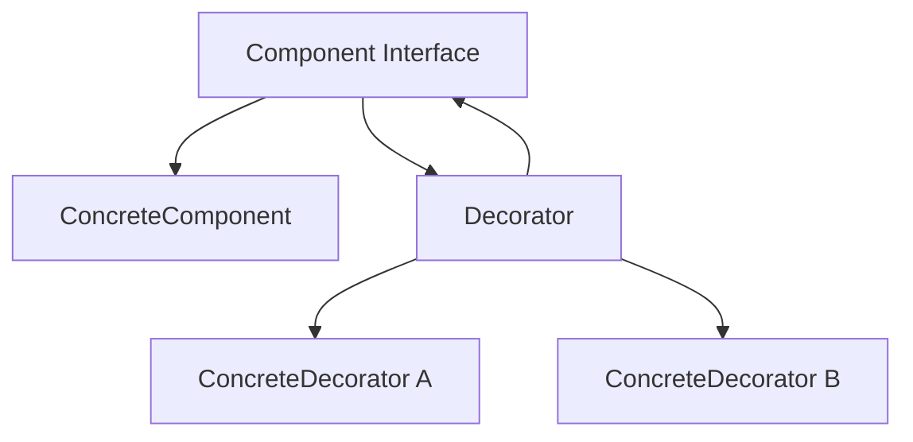
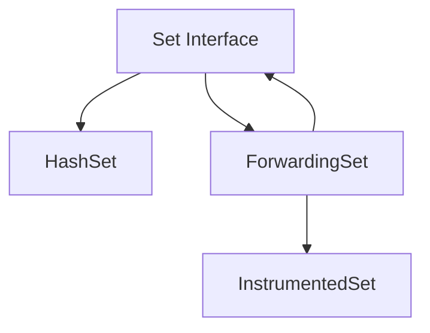

# 아이템 18. 상속보다는 컴포지션을 사용하라

# 아이템 18. 상속보다는 컴포지션을 사용하라

* toc
{:toc}

---

## 아이템 18. 핵심 정리

### 아이템 18. 상속보다는 합성을 사용하라 

이번 아이템에서는 객체지향 설계에서 가장 많이 들어본 원칙 중 하나인 **"상속(Inheritance)보다는 합성(Composition)을 사용하라"**를 다룬다.

이 문장은 많이 들어봤지만 **왜 상속이 문제가 되고, 합성이 어떻게 그 문제를 해결하는지**를 제대로 이해하는 것이 중요하다.

이 아이템은 단순히 "상속을 쓰지 말라"는 이야기가 아니다.

**구현 상속(Implementation Inheritance)** 이 가지는 구조적인 문제를 설명하고, 그 대안으로 **합성(Composition)** 과 **위임(Delegation)** 을 사용하는 설계를 소개한다.

---

### 구현 상속과 인터페이스 상속은 다르다

먼저 이 아이템에서 말하는 상속은 **구현 상속**이다.

즉, 구체적인 클래스를 `extends` 하는 경우를 의미한다.

```java
class InstrumentedHashSet extends HashSet<E> {
}
```

반면 인터페이스를 구현하는 것은 이 아이템에서 말하는 상속 문제가 아니다.

```java
class MemberServiceImpl implements MemberService {
}
```

또는

```java
interface B extends A {
}
```

처럼 인터페이스를 구현하거나 인터페이스끼리 상속하는 것은 별개의 이야기이다.

따라서 이 아이템은 **구현 클래스를 상속할 때 발생하는 문제점**을 설명하는 내용이라고 이해하면 된다.

---

### 구현 상속이 문제가 되는 이유

구현 상속의 가장 큰 문제는 **상위 클래스의 내부 구현에 하위 클래스가 의존하게 된다는 것**이다.

즉,

* 상위 클래스의 내부 구현을 알아야 하고
* 내부 구현이 변경되면 하위 클래스도 영향을 받는다.

결국 **캡슐화가 깨지게 된다.**

---

### 예제 : InstrumentedHashSet

책에서는 다음과 같은 예제를 사용한다.

```java
class InstrumentedHashSet<E> extends HashSet<E> {

    private int addCount = 0;

    @Override
    public boolean add(E e) {
        addCount++;
        return super.add(e);
    }

    @Override
    public boolean addAll(Collection<? extends E> c) {
        addCount += c.size();
        return super.addAll(c);
    }
}
```

의도는 단순하다.

요소가 추가될 때마다 개수를 세고 싶은 것이다.

---

### 예상한 결과

예를 들어

```java
set.addAll(List.of("A", "B", "C"));
```

를 호출했다면

추가된 요소는

```text
3개
```

이므로

```text
addCount = 3
```

이 되어야 할 것 같다.

---

### 실제 결과

하지만 실제 결과는

```text
6
```

이 나온다.

왜 그럴까?

---

### HashSet 내부 구현 때문이다

원인은 `HashSet` 내부 구현에 있다.

`addAll()` 내부에서는

```text
add()
```

를 반복 호출한다.

즉,

```text
addAll()

↓

add()

↓

add()

↓

add()
```

라는 구조인 것이다.

---

### 상속 때문에 내부 구현을 알게 된다

우리는 단순히

```java
super.addAll(c);
```

만 호출했을 뿐인데

실제로는

```text
super.addAll()

↓

add()

↓

오버라이딩된 add()

↓

addCount++
```

가 다시 실행된다.

결국

```text
addAll()

↓

+3

↓

add() 3번

↓

+3
```

이 되어

```text
6
```

이 출력된다.

---

### 캡슐화가 깨진 것이다

이 문제의 핵심은

> **상위 클래스의 내부 구현을 알아야 한다는 것**

이다.

즉,

```text
HashSet.addAll()

↓

내부적으로 add()를 호출한다.
```

는 사실을 알아야 올바르게 구현할 수 있다.

이것은 상위 클래스의 **내부 구현이 외부에 노출된 것**과 다름없다.

즉,

**캡슐화가 깨진 것이다.**

---

### 상위 클래스 구현이 변경되면?

더 큰 문제는 미래에 발생한다.

예를 들어 `HashSet`의 내부 구현이 변경되어

```text
add()
```

를 사용하지 않고

새로운 방식으로 구현되었다고 가정해 보자.

그러면

```java
InstrumentedHashSet
```

도 함께 수정해야 한다.

즉,

상위 클래스의 내부 구현 변경이

하위 클래스의 수정으로 이어진다.

---

### 새로운 메서드가 추가되면?

또 다른 문제도 있다.

우리는

```text
모든 요소 추가
```

를 카운트하고 싶다.

그래서

```java
add()

addAll()
```

을 모두 오버라이딩했다.

그런데 미래에 `HashSet`에

```java
addRange()
```

같은 메서드가 새로 생겼다고 해보자.

그러면 어떻게 될까?

우리는 그것도 오버라이딩해야 한다.

하지만 그 사실을 모를 수도 있다.

---

### 기능 누락이 발생할 수 있다

새로운 메서드를 오버라이딩하지 않았다면

```text
add()

↓

카운트 증가
```

는 되지만

```text
addRange()
```

에서는

카운트가 증가하지 않는다.

즉,

일부 경로에서만 부가 기능이 수행되는

버그가 생길 수 있다.

---

### 메서드 이름 충돌 문제

또 다른 문제도 있다.

하위 클래스에서

```java
private int getAddCount()
```

같은 메서드를 만들었다고 해보자.

그런데 미래에

상위 클래스에도

```java
public int getAddCount()
```

가 추가되었다면?

메서드 충돌이 발생할 수 있으며,

접근 제한자 문제나 API 변경으로 인해 코드가 깨질 수도 있다.

---

### 이러한 문제의 원인

결국 모든 문제는 하나의 원인에서 시작된다.

```text
하위 클래스가
상위 클래스의 구현에 의존하기 때문
```

이다.

상속은

API뿐 아니라

**구현까지 함께 물려받는다.**

그래서

상위 클래스 내부 구현 변경이

하위 클래스에 영향을 준다.

---

### 해결책은 합성(Composition)

이 문제를 해결하기 위해 Effective Java는

**합성(Composition)** 을 권장한다.

상속 대신

필드로 객체를 보관하는 것이다.

```java
class ForwardingSet<E> {

    private final Set<E> set;

    public ForwardingSet(Set<E> set) {
        this.set = set;
    }
}
```

즉,

기존 클래스를 상속하는 것이 아니라

**멤버 변수로 가지고 있는 것**이다.

---

### 모든 기능을 위임한다

ForwardingSet은

자신이 직접 구현하지 않고

모든 기능을 내부 객체에 전달한다.

```java
public boolean add(E e) {
    return set.add(e);
}
```

```java
public boolean addAll(Collection<? extends E> c) {
    return set.addAll(c);
}
```

이처럼

모든 메서드를

내부 객체에게 **위임(Delegation)** 한다.

---

### ForwardingSet의 역할

이 클래스는 흔히

* Forwarding Class
* Wrapper Class

라고 부른다.

또한 디자인 패턴에서는

**Decorator Pattern**의 대표적인 형태이기도 하다.

---

### InstrumentedSet은 ForwardingSet을 상속한다

이제 InstrumentedSet은

HashSet을 상속하지 않는다.

대신

ForwardingSet을 상속한다.

```java
class InstrumentedSet<E> extends ForwardingSet<E> {

    private int addCount;

    @Override
    public boolean add(E e) {
        addCount++;
        return super.add(e);
    }

    @Override
    public boolean addAll(Collection<? extends E> c) {
        addCount += c.size();
        return super.addAll(c);
    }
}
```

여기서

```java
super.addAll()
```

은

HashSet의 구현을 호출하는 것이 아니라

ForwardingSet의 메서드를 호출한다.

---

### 왜 이제는 3이 나올까?

호출 구조가 완전히 달라졌기 때문이다.

```text
InstrumentedSet

↓

ForwardingSet

↓

HashSet
```

`addAll()`은

```text
ForwardingSet

↓

HashSet.addAll()
```

로 전달된다.

더 이상

오버라이딩된 `add()`를 다시 호출하지 않는다.

따라서

```text
+3
```

만 수행되고

결과는

```text
3
```

이 된다.

---

### 합성이 캡슐화를 지켜준다

합성을 사용하면

HashSet 내부 구현이 어떻게 바뀌든

전혀 영향을 받지 않는다.

왜냐하면 우리가 의존하는 것은

HashSet 구현이 아니라

Set 인터페이스의 계약이기 때문이다.

즉,

```text
HashSet 내부 구현

↓

변경

↓

ForwardingSet

↓

영향 없음
```

캡슐화가 유지된다.

---

### 새로운 메서드가 추가되어도 안전하다

HashSet에만

새로운 메서드가 추가된다면

우리 코드는 영향을 받지 않는다.

반대로

Set 인터페이스에 메서드가 추가된다면

ForwardingSet이 컴파일 오류를 발생시킨다.

즉,

개발자가 반드시 변경 사항을 인지하게 된다.

그 결과

필요한 부가 기능을

명시적으로 추가할 수 있다.

---

### 상속보다 합성이 더 안전한 이유

합성을 사용하면

* 상위 클래스 내부 구현을 몰라도 된다.
* 내부 구현 변경의 영향을 받지 않는다.
* 캡슐화가 유지된다.
* 예상하지 못한 부작용(Side Effect)이 줄어든다.
* 기능 확장이 훨씬 안전하다.

즉,

구현에 의존하지 않고

인터페이스의 계약만 의존하는 구조가 된다.

---

### 핵심 정리

* 이 아이템은 **인터페이스 상속이 아니라 구현 상속의 문제점**을 다룬다.
* 구현 상속은 상위 클래스의 내부 구현에 의존하게 되어 캡슐화를 깨뜨린다.
* 상위 클래스의 내부 구현이 변경되면 하위 클래스도 영향을 받는다.
* 새로운 메서드가 추가되면 기능 누락이나 버그가 발생할 수 있다.
* 합성은 객체를 멤버 변수로 보관하고 필요한 기능을 위임하는 방식이다.
* `ForwardingSet`처럼 위임을 사용하면 상위 클래스 구현 변경의 영향을 받지 않는다.
* 합성은 인터페이스의 계약에만 의존하므로 상속보다 훨씬 유연하고 안전한 설계를 만들 수 있다.

---

### 한 줄 요약

> **구현 상속은 상위 클래스의 내부 구현까지 함께 상속받기 때문에 캡슐화를 깨뜨릴 수 있으며, 객체를 포함하고 기능을 위임하는 합성(Composition)이 더 유연하고 안전한 설계 방법이다.**

## 아이템 18. 완벽 공략 요약

### 아이템 18 완벽 공략: 데코레이터 패턴과 콜백 프레임워크의 self 문제

아이템 18에서는 상속보다 합성을 사용하라고 권장하면서 몇 가지 추가 개념을 함께 언급한다.

이번에는 그중에서도 특히 이해하기 어려운 두 가지를 살펴본다.

* 데코레이터 패턴(Decorator Pattern)
* 콜백 프레임워크(Callback Framework)에서 발생할 수 있는 self 문제

또한 합성, 위임, 집합 관계처럼 비슷하게 사용되는 용어들도 간단히 정리한다.

여기서 중요한 것은 용어 자체를 엄격하게 외우는 것이 아니라,

> 상속을 사용했을 때와 객체를 내부에 두고 기능을 전달했을 때 설계가 어떻게 달라지는가

를 이해하는 것이다.

---

### 합성, 위임, 집합 관계를 어떻게 이해할까?

객체지향 설계를 공부하면 다음과 같은 용어들을 자주 접하게 된다.

* Composition
* Delegation
* Aggregation

이 용어들은 이론적으로는 서로 다른 의미를 가진다.

하지만 실무적인 관점에서는 모두 다음과 비슷한 형태로 나타나는 경우가 많다.

```java
public class A {

    private final B b;

    public A(B b) {
        this.b = b;
    }
}
```

즉,

```text
A가 B를 상속하지 않고
B를 필드로 가지고 사용한다.
```

라는 구조다.

---

#### 상속과 객체 포함의 차이가 더 중요하다

실무에서는 다음 두 가지를 먼저 구분하는 것이 중요하다.

```text
상속
A is-a B
```

```text
합성 또는 위임
A has-a B
```

상속은 부모 클래스의 구현과 강하게 연결된다.

```java
public class InstrumentedHashSet<E>
        extends HashSet<E> {
}
```

반면 합성은 다른 객체를 필드로 가지고 필요한 기능을 호출한다.

```java
public class InstrumentedSet<E> {

    private final Set<E> set;

    public InstrumentedSet(Set<E> set) {
        this.set = set;
    }
}
```

실제 설계에서는 이 차이를 이해하는 것이 가장 중요하다.

---

#### 엄밀한 의미의 위임

책에서는 합성과 전달의 조합을 넓은 의미에서 위임이라고 부르기도 하지만, 엄밀하게는 래퍼 객체가 내부 객체에 자기 자신의 참조를 넘기는 형태를 위임이라고 설명한다.

하지만 이번 아이템에서 중요한 것은 이론적인 용어 구분보다는 다음 구조다.

```text
상속을 통해 구현을 재사용하는가?

아니면

다른 객체를 내부에 두고
그 객체에게 작업을 맡기는가?
```

아이템 18의 핵심은 후자의 방식이 캡슐화를 더 잘 지킬 수 있다는 것이다.

---

### 데코레이터 패턴이란?

데코레이터 패턴은 기존 객체를 감싸는 래퍼 객체를 만들고, 기존 기능은 그대로 유지하면서 추가적인 기능을 동적으로 덧붙이는 디자인 패턴이다.

핵심 구조는 다음과 같다.

```text
클라이언트
   ↓
Decorator
   ↓
원래 객체
```

데코레이터가 원래 객체를 내부에 가지고 있다.

---

#### 기본 인터페이스

간단한 알림 인터페이스를 만들어보자.

```java
public interface Notifier {

    void send(String message);
}
```

기본 구현은 다음과 같다.

```java
public class EmailNotifier
        implements Notifier {

    @Override
    public void send(String message) {
        System.out.println(
                "Email: " + message
        );
    }
}
```

사용 방법은 간단하다.

```java
Notifier notifier =
        new EmailNotifier();

notifier.send("Hello");
```

---

### 기능을 추가하고 싶다면?

이제 이메일을 보내기 전에 로그를 남기고 싶다고 가정해보자.

상속을 사용할 수도 있다.

```java
public class LoggingEmailNotifier
        extends EmailNotifier {

    @Override
    public void send(String message) {
        System.out.println("Logging");

        super.send(message);
    }
}
```

하지만 기능이 계속 늘어나면 상속 구조가 복잡해질 수 있다.

예를 들어 다음 요구사항이 생겼다고 해보자.

```text
Logging
Retry
Metrics
Security
Tracing
```

상속으로 모두 조합하려고 하면 클래스가 폭발적으로 늘어날 수 있다.

```text
LoggingEmailNotifier
RetryEmailNotifier
LoggingRetryEmailNotifier
MetricsLoggingEmailNotifier
...
```

---

### 데코레이터는 객체를 감싼다

데코레이터 방식에서는 상속 대신 객체를 내부에 둔다.

```java
public class LoggingNotifier
        implements Notifier {

    private final Notifier notifier;

    public LoggingNotifier(
            Notifier notifier
    ) {
        this.notifier = notifier;
    }

    @Override
    public void send(String message) {
        System.out.println("Logging");

        notifier.send(message);
    }
}
```

사용자는 다음과 같이 객체를 감싼다.

```java
Notifier notifier =
        new LoggingNotifier(
                new EmailNotifier()
        );

notifier.send("Hello");
```

호출 흐름은 다음과 같다.

```text
LoggingNotifier.send()

        ↓

Logging

        ↓

EmailNotifier.send()
```

기존 객체의 기능을 수정하지 않고 기능을 추가할 수 있다.

---

### 데코레이터를 여러 개 조합할 수 있다

데코레이터 패턴의 강력한 점은 여러 기능을 동적으로 조합할 수 있다는 것이다.

예를 들어 Retry 기능을 하나 더 만든다.

```java
public class RetryNotifier
        implements Notifier {

    private final Notifier notifier;

    public RetryNotifier(
            Notifier notifier
    ) {
        this.notifier = notifier;
    }

    @Override
    public void send(String message) {
        try {
            notifier.send(message);
        } catch (RuntimeException e) {
            notifier.send(message);
        }
    }
}
```

다음처럼 조합할 수 있다.

```java
Notifier notifier =
        new LoggingNotifier(
                new RetryNotifier(
                        new EmailNotifier()
                )
        );
```

구조는 다음과 같다.

```text
LoggingNotifier
       ↓
RetryNotifier
       ↓
EmailNotifier
```

클래스 상속 구조를 늘리지 않고 기능을 조합할 수 있다.

---

### ForwardingSet도 데코레이터 구조와 유사하다

아이템 18에서 등장했던 `ForwardingSet`도 데코레이터 패턴과 매우 비슷한 구조를 가진다.

```java
public class ForwardingSet<E>
        implements Set<E> {

    private final Set<E> set;

    public ForwardingSet(Set<E> set) {
        this.set = set;
    }

    @Override
    public boolean add(E e) {
        return set.add(e);
    }

    @Override
    public boolean addAll(
            Collection<? extends E> c
    ) {
        return set.addAll(c);
    }
}
```

기존 `Set`을 내부에 가지고 모든 작업을 전달한다.

그 위에 부가기능을 추가할 수 있다.

```java
public class InstrumentedSet<E>
        extends ForwardingSet<E> {

    private int addCount;

    public InstrumentedSet(Set<E> set) {
        super(set);
    }

    @Override
    public boolean add(E e) {
        addCount++;

        return super.add(e);
    }

    @Override
    public boolean addAll(
            Collection<? extends E> c
    ) {
        addCount += c.size();

        return super.addAll(c);
    }
}
```

사용자는 어떤 `Set` 구현체든 전달할 수 있다.

```java
Set<String> hashSet =
        new InstrumentedSet<>(
                new HashSet<>()
        );
```

또는

```java
Set<String> treeSet =
        new InstrumentedSet<>(
                new TreeSet<>()
        );
```

이처럼 구체적인 구현체에 묶이지 않는다는 것도 큰 장점이다.

---

### 데코레이터 패턴의 핵심 장점

데코레이터 패턴은 다음과 같은 장점을 제공한다.

#### 상속 계층이 복잡해지지 않는다

기능 하나를 추가할 때마다 하위 클래스를 만들 필요가 없다.

#### 런타임에 기능을 조합할 수 있다

```java
new LoggingNotifier(
        new RetryNotifier(
                new EmailNotifier()
        )
)
```

필요한 기능만 조합할 수 있다.

#### 기존 클래스를 수정하지 않아도 된다

기존 클래스에 손대지 않고 새로운 기능을 추가할 수 있다.

#### 구현체를 자유롭게 바꿀 수 있다

```java
HashSet
TreeSet
LinkedHashSet
```

어떤 구현체든 동일한 래퍼를 적용할 수 있다.

---

### 래퍼 클래스의 한계

합성과 래퍼 클래스가 항상 완벽한 것은 아니다.

책에서는 한 가지 중요한 한계를 언급한다.

> 래퍼 클래스는 콜백 프레임워크와는 어울리지 않을 수 있다.

이때 발생할 수 있는 대표적인 문제가 **self 문제**이다.

---

### 콜백 프레임워크란?

콜백이란 특정 작업이 발생했을 때 나중에 호출할 객체나 함수를 미리 등록해두는 방식이다.

예를 들어 이벤트 리스너를 생각하면 이해하기 쉽다.

```java
public interface Listener {

    void onEvent();
}
```

프레임워크에 리스너를 등록한다.

```java
framework.register(listener);
```

나중에 이벤트가 발생하면 프레임워크가 호출한다.

```java
listener.onEvent();
```

이 구조가 콜백 구조다.

---

### self 문제란?

래퍼 객체가 내부 객체를 감싸고 있다고 가정해보자.

```text
Wrapper
   ↓
Original
```

사용자는 `Wrapper`를 사용한다.

그런데 내부 객체가 콜백 프레임워크에 자기 자신을 등록하면 문제가 발생한다.

```text
Wrapper
   ↓
Original
   ↓
Framework에 Original 등록
```

이후 Framework가 콜백을 호출하면 Wrapper를 거치지 않고 Original을 직접 호출한다.

```text
Framework

   ↓

Original
```

래퍼가 우회되는 것이다.

이것이 self 문제의 핵심이다.

---

### 코드로 살펴보는 self 문제

콜백 인터페이스를 하나 만든다.

```java
public interface Callback {

    void onCallback();
}
```

콜백을 관리하는 프레임워크가 있다고 가정해보자.

```java
public class CallbackFramework {

    private Callback callback;

    public void register(
            Callback callback
    ) {
        this.callback = callback;
    }

    public void execute() {
        callback.onCallback();
    }
}
```

---

### 원래 객체가 자기 자신을 등록한다

다음 객체를 만들어보자.

```java
public class Service
        implements Callback {

    private final CallbackFramework framework;

    public Service(
            CallbackFramework framework
    ) {
        this.framework = framework;

        framework.register(this);
    }

    @Override
    public void onCallback() {
        System.out.println(
                "Service callback"
        );
    }
}
```

생성 과정에서 다음 코드가 실행된다.

```java
framework.register(this);
```

즉 프레임워크는 `Service` 인스턴스를 기억한다.

```text
Framework
    ↓
Service
```

---

### Service를 래핑한다

이제 `Service`에 부가기능을 추가하기 위해 Wrapper를 만든다고 해보자.

```java
public class ServiceWrapper
        implements Callback {

    private final Service service;

    public ServiceWrapper(
            Service service
    ) {
        this.service = service;
    }

    @Override
    public void onCallback() {
        System.out.println(
                "Before callback"
        );

        service.onCallback();
    }
}
```

사용자는 Wrapper를 사용한다.

```java
Service service =
        new Service(framework);

ServiceWrapper wrapper =
        new ServiceWrapper(service);
```

우리는 다음 흐름을 기대할 수 있다.

```text
Framework

↓

ServiceWrapper

↓

Service
```

그러면 다음 메시지가 출력되어야 할 것 같다.

```text
Before callback
Service callback
```

---

### 실제로는 Wrapper를 거치지 않는다

하지만 프레임워크에 등록된 객체는 무엇일까?

`Service` 생성자에서 다음 코드가 실행되었다.

```java
framework.register(this);
```

여기서 `this`는 Wrapper가 아니다.

실제 `Service` 객체다.

따라서 Framework는 다음 객체를 기억한다.

```text
Framework
    ↓
Service
```

프레임워크가 콜백을 실행한다.

```java
framework.execute();
```

실제 호출은 다음과 같다.

```text
Framework

↓

Service.onCallback()
```

`ServiceWrapper`는 완전히 건너뛴다.

---

### 왜 문제가 되는가?

래퍼가 제공하던 부가 기능이 실행되지 않기 때문이다.

예를 들어 Wrapper가 다음 기능을 제공한다고 가정해보자.

* Logging
* Security
* Metrics
* Transaction
* Retry

그런데 콜백에서 Wrapper를 건너뛰면 다음 기능들이 모두 적용되지 않는다.

```text
Framework

X LoggingWrapper
X SecurityWrapper
X TransactionWrapper

↓

Original
```

사용자는 Wrapper를 사용하고 있다고 생각하지만 콜백 경로에서는 실제 객체가 직접 호출되는 것이다.

---

### 일반 호출과 콜백 호출의 차이

일반적인 호출에서는 Wrapper를 거친다.

```text
Client
   ↓
Wrapper
   ↓
Original
```

하지만 Original이 자기 자신을 콜백으로 등록했다면 다음 구조가 만들어진다.

```text
Client
   ↓
Wrapper
   ↓
Original
   ↓
Framework
```

그리고 Framework가 다시 호출할 때는

```text
Framework
   ↓
Original
```

이 된다.

Wrapper가 사라진다.

---

### 이것이 self 문제다

내부 객체는 자신을 다음과 같이 인식한다.

```java
this
```

이 `this`는 항상 실제 내부 객체다.

래퍼로 감쌌다고 해서 내부 객체의 `this`가 래퍼로 바뀌지 않는다.

```text
Wrapper(Service)

Service.this
        ↓
여전히 Service
```

따라서 내부 객체가

```java
framework.register(this);
```

라고 하면 Wrapper가 아닌 자기 자신을 등록한다.

이 때문에 래퍼가 우회될 수 있다.

---

### 상속에서는 동적 디스패치가 동작한다

상속 구조에서는 조금 다르다.

```java
public class LoggingService
        extends Service {

    @Override
    public void onCallback() {
        System.out.println("Logging");

        super.onCallback();
    }
}
```

만약 실제 객체가 `LoggingService`라면

```java
this
```

는 실제 런타임 객체인 `LoggingService`를 가리킨다.

프레임워크에 등록되는 객체도 결국 `LoggingService`다.

```text
Framework
    ↓
LoggingService
```

따라서 오버라이딩된 메서드가 호출된다.

이 때문에 콜백 프레임워크에서는 단순 Wrapper 구조가 상속을 완벽하게 대체하지 못하는 경우가 있다.

---

### 그렇다고 상속이 더 좋다는 의미는 아니다

self 문제가 있다고 해서 다시 상속을 사용하는 것이 항상 좋은 해결책이라는 의미는 아니다.

핵심은 설계 구조를 이해해야 한다는 것이다.

콜백이 필요한 경우에는 애초에 Wrapper를 등록하거나 별도의 콜백 객체를 전달하는 방식으로 구조를 설계할 수 있다.

예를 들어 Wrapper 자체를 등록한다.

```java
framework.register(wrapper);
```

또는 생성자 안에서 자기 자신을 등록하지 않고 외부에서 등록하도록 설계할 수 있다.

```java
Service service =
        new Service();

ServiceWrapper wrapper =
        new ServiceWrapper(service);

framework.register(wrapper);
```

이렇게 하면 Framework가 Wrapper를 호출한다.

```text
Framework
   ↓
Wrapper
   ↓
Service
```

---

### 생성자에서 this를 외부에 노출하는 설계도 주의해야 한다

앞에서 본 코드처럼 생성자에서

```java
framework.register(this);
```

를 호출하는 것은 또 다른 문제도 만들 수 있다.

객체 생성이 완전히 끝나기 전에 `this`가 외부에 노출될 수 있기 때문이다.

```text
생성자 실행 중

↓

this 외부 등록

↓

다른 코드가 호출 가능

↓

아직 초기화되지 않은 객체 사용 가능
```

따라서 가능하다면 객체 생성과 콜백 등록을 분리하는 것이 더 안전하다.

---

### 더 안전한 구조

```java
Service service =
        new Service();

ServiceWrapper wrapper =
        new ServiceWrapper(service);

framework.register(wrapper);
```

객체 생성과 등록 과정이 명확하게 분리된다.

```text
Service 생성 완료
        ↓
Wrapper 생성 완료
        ↓
Framework 등록
```

이 구조에서는 Wrapper가 확실하게 콜백 경로에 들어간다.

---

### Decorator와 Wrapper의 관계

Decorator는 Wrapper의 한 형태라고 이해할 수 있다.

다만 모든 Wrapper가 반드시 Decorator인 것은 아니다.

Decorator의 핵심 목적은

```text
기존 객체의 인터페이스를 유지하면서
기능을 추가한다.
```

는 것이다.

예를 들어

```java
Notifier
```

라는 동일한 인터페이스를

```text
EmailNotifier
LoggingNotifier
RetryNotifier
```

모두 구현한다.

클라이언트는 어떤 객체가 실제로 사용되는지 몰라도 된다.

```java
Notifier notifier = ...;
```

---

### 상속과 Decorator 비교

| 구분          | 상속        | Decorator |
| ----------- | --------- | --------- |
| 관계          | is-a      | has-a     |
| 구현 의존       | 강함        | 약함        |
| 런타임 조합      | 어려움       | 가능        |
| 기능 조합       | 클래스 증가 가능 | 객체 조합 가능  |
| 내부 구현 변경 영향 | 받을 수 있음   | 비교적 적음    |
| 캡슐화         | 깨질 가능성 있음 | 유지하기 쉬움   |
| 콜백 self 문제  | 상대적으로 적음  | 발생 가능     |

---

### 합성이 항상 정답은 아니다

아이템 제목은

> 상속보다는 합성을 사용하라

이지

> 상속을 절대 사용하지 마라

가 아니다.

상속이 적절한 경우도 있다.

대표적으로 다음 조건을 만족한다면 상속을 고려할 수 있다.

#### 진짜 is-a 관계인가?

```text
Dog is an Animal
```

처럼 의미적으로 하위 타입 관계가 자연스러운지 확인해야 한다.

#### 상위 클래스가 상속을 위해 설계되었는가?

상속을 허용하려면 어떤 메서드를 재정의할 수 있는지, 어떤 메서드가 내부적으로 다른 메서드를 호출하는지 등의 계약이 명확해야 한다.

#### 같은 패키지 내부에서 구현을 통제할 수 있는가?

같은 개발자가 상위·하위 클래스를 함께 관리한다면 위험이 상대적으로 줄어든다.

---

### 다른 패키지의 구체 클래스를 상속할 때 특히 주의한다

아이템 18에서 특히 문제가 되는 것은

```text
다른 패키지의 구체 클래스
```

를 상속하는 경우다.

예를 들어

```java
class MySet
        extends HashSet<String> {
}
```

처럼 JDK 구현 클래스를 상속하는 것이다.

`HashSet`의 내부 구현은 우리의 코드가 아니다.

앞으로 변경될 가능성이 있고 우리가 통제할 수도 없다.

이런 경우에는 상속보다는 다음 구조가 더 안전하다.

```java
class MySet {

    private final Set<String> set;
}
```

가능하면 더 나아가 구체 구현이 아니라 인터페이스에 의존한다.

```java
private final Set<String> set;
```

```text
HashSet
TreeSet
LinkedHashSet
```

어떤 구현체든 주입할 수 있다.

---

### 실무에서의 활용

데코레이터 방식은 실무에서도 매우 자주 등장한다.

#### HTTP Client

```text
LoggingHttpClient
        ↓
RetryHttpClient
        ↓
RealHttpClient
```

#### Repository

```text
CachingRepository
        ↓
DatabaseRepository
```

#### 메시지 전송

```text
MetricsPublisher
        ↓
RetryPublisher
        ↓
KafkaPublisher
```

#### Storage

```text
EncryptedStorage
        ↓
CompressedStorage
        ↓
FileStorage
```

기존 구현을 수정하지 않고 기능을 조합할 수 있다는 것이 핵심이다.

---

### 핵심 정리

* 아이템 18의 핵심은 구현 상속보다 합성을 우선적으로 고려하라는 것이다.
* 데코레이터 패턴은 객체를 감싸면서 기존 기능에 부가기능을 추가하는 패턴이다.
* 데코레이터는 상속 계층을 늘리지 않고 런타임에 기능을 조합할 수 있다.
* `ForwardingSet`과 `InstrumentedSet` 구조도 데코레이터와 유사하다.
* Composition, Delegation, Aggregation은 이론적으로 차이가 있지만 실무에서는 객체를 포함하고 기능을 맡기는 구조를 이해하는 것이 우선이다.
* 래퍼 클래스는 대부분 안전하지만 콜백 프레임워크에서는 self 문제가 발생할 수 있다.
* 내부 객체가 `this`를 콜백으로 등록하면 Wrapper가 아니라 실제 내부 객체가 등록된다.
* 이후 콜백에서는 Wrapper를 우회하고 내부 객체가 직접 호출될 수 있다.
* Wrapper에 Logging, Security, Transaction 같은 부가기능이 있었다면 콜백 경로에서는 적용되지 않을 수 있다.
* 콜백 환경에서는 Wrapper 자체를 등록하거나 객체 생성과 콜백 등록을 분리하는 설계를 고려할 수 있다.
* 합성이 모든 상황의 정답은 아니며, 실제 하위 타입 관계이고 상속을 고려해 설계된 클래스라면 상속을 사용할 수 있다.
* 특히 통제할 수 없는 외부 패키지의 구체 클래스를 상속할 때는 더욱 신중해야 한다.

---

### 한 줄 요약

> 데코레이터 패턴은 합성과 위임을 이용해 기존 객체를 수정하지 않고 기능을 유연하게 추가할 수 있지만, 내부 객체가 자기 자신을 콜백으로 등록하는 구조에서는 래퍼가 우회되는 self 문제가 발생할 수 있으므로 콜백 등록 구조까지 함께 고려해야 한다.

## 아이템 18. 완벽 공력 - 데코레이터 패턴

### 아이템 18 완벽 공략: 데코레이터 패턴

데코레이터 패턴(Decorator Pattern)은 **위임을 활용해서 기존 객체의 기능을 유지하면서 새로운 기능을 동적으로 추가하는 디자인 패턴**이다.

이 패턴의 가장 큰 장점은 새로운 기능 조합이 필요할 때마다 새로운 클래스를 계속 만드는 대신, **이미 존재하는 객체들을 조합해서 원하는 기능을 가진 새로운 인스턴스를 만들 수 있다는 점**이다.

즉 상속을 통해 클래스 계층을 계속 확장하는 것이 아니라, 객체를 다른 객체로 감싸면서 필요한 기능을 단계적으로 추가한다.

---

### 데코레이터 패턴이 필요한 이유

기능 조합이 많아지는 상황을 생각해보자.

예를 들어 집을 하나 꾸민다고 가정해보자.

집에는 다음과 같은 요소가 있을 수 있다.

* 지붕
* 벽
* 대문

각 요소마다 다음 세 가지 색상을 사용할 수 있다고 해보자.

```text
빨강
파랑
노랑
```

지붕만 생각하면 다음과 같다.

```text
빨간 지붕
파란 지붕
노란 지붕
```

벽도 세 종류가 있고, 대문도 세 종류가 있다.

그렇다면 최종적으로 만들 수 있는 집의 조합은 다음과 같다.

```text
3 × 3 × 3 = 27
```

총 27가지다.

---

### 상속으로 모든 조합을 표현하면 어떻게 될까?

만약 모든 조합을 상속 기반으로 클래스로 표현하려고 한다면 다음과 같은 클래스들이 필요할 수 있다.

```text
RedRoofRedWallRedDoorHouse

RedRoofRedWallBlueDoorHouse

RedRoofBlueWallRedDoorHouse

RedRoofBlueWallBlueDoorHouse

BlueRoofRedWallRedDoorHouse

...
```

조합 하나가 추가될 때마다 새로운 클래스가 필요해진다.

기능 종류가 늘어날수록 필요한 클래스 개수는 빠르게 증가한다.

---

#### 조합 폭발 문제

예를 들어 기능이 각각 3개씩 존재한다면 다음과 같다.

```text
지붕 3종류
벽 3종류
문 3종류

3 × 3 × 3 = 27
```

그런데 여기에 창문까지 3가지가 추가되면 다음과 같다.

```text
3 × 3 × 3 × 3 = 81
```

기능이 하나 추가되었을 뿐인데 27개의 조합이 81개로 증가했다.

상속으로 모든 조합을 클래스로 표현하기 시작하면 **클래스 수가 폭발적으로 증가할 수 있다.**

---

### 데코레이터는 조합을 클래스가 아니라 객체에서 해결한다

데코레이터 패턴은 접근 방식이 다르다.

다음과 같이 각각의 기능을 담당하는 객체만 만든다.

```text
RedRoof
BlueRoof
YellowRoof

RedWall
BlueWall
YellowWall

RedDoor
BlueDoor
YellowDoor
```

필요한 클래스는 9개다.

그리고 실제 집을 만들 때 이 객체들을 조합한다.

```text
RedRoof
  +
BlueWall
  +
YellowDoor
```

또 다른 집은 다음처럼 만들 수 있다.

```text
BlueRoof
  +
RedWall
  +
RedDoor
```

즉 27개의 조합 클래스를 미리 만드는 것이 아니라, **9개의 기능을 조합하여 27가지 결과를 만들어낼 수 있다.**

이것이 데코레이터 패턴의 중요한 특징이다.

---

### 데코레이터 패턴의 핵심

데코레이터 패턴을 한 문장으로 표현하면 다음과 같다.

> 기존 객체를 감싸면서 기존 기능은 그대로 사용하고 새로운 기능을 추가한다.

기존 객체를 변경하지 않는다.

대신 새로운 객체가 기존 객체를 필드로 가지고 기능을 추가한다.

```text
Decorator
    ↓
기존 객체
```

이를 다시 여러 번 감쌀 수도 있다.

```text
Decorator A
    ↓
Decorator B
    ↓
Decorator C
    ↓
기존 객체
```

따라서 기능을 자유롭게 조합할 수 있다.

---

### 데코레이터 패턴의 기본 구조

전형적인 데코레이터 패턴은 다음과 같은 역할들로 구성된다.

```text
Component
    ↑
    ├── ConcreteComponent
    │
    └── Decorator
            ↑
            ├── ConcreteDecoratorA
            └── ConcreteDecoratorB
```

각 역할을 하나씩 살펴보자.

---

### Component

`Component`는 데코레이터와 실제 객체가 공통으로 구현하는 인터페이스다.

예를 들어 다음과 같다.

```java
public interface Component {

    void operation();
}
```

클라이언트 입장에서는 실제 객체인지 데코레이터인지 구분할 필요가 없다.

모두 `Component` 타입으로 사용할 수 있다.

---

### ConcreteComponent

`ConcreteComponent`는 실제 핵심 기능을 수행하는 객체다.

```java
public class ConcreteComponent
        implements Component {

    @Override
    public void operation() {
        System.out.println("기본 기능");
    }
}
```

이 객체가 데코레이터가 감싸는 대상이 된다.

구조로 표현하면 다음과 같다.

```text
Component
    ↑
ConcreteComponent
```

---

### Decorator

`Decorator` 역시 `Component`를 구현한다.

하지만 동시에 다른 `Component`를 필드로 가지고 있다.

```java
public class Decorator
        implements Component {

    protected final Component component;

    public Decorator(Component component) {
        this.component = component;
    }

    @Override
    public void operation() {
        component.operation();
    }
}
```

여기가 데코레이터 패턴의 핵심이다.

`Decorator`는 다음 두 가지 특징을 동시에 가진다.

```text
Component처럼 사용할 수 있다.

+

다른 Component를 내부에 가지고 있다.
```

따라서 클라이언트 입장에서는 데코레이터도 기존 객체와 동일한 타입으로 사용할 수 있다.

---

### ConcreteDecorator

실제 부가 기능은 `ConcreteDecorator`가 담당한다.

```java
public class LoggingDecorator
        extends Decorator {

    public LoggingDecorator(
            Component component
    ) {
        super(component);
    }

    @Override
    public void operation() {

        System.out.println("작업 전 로그");

        super.operation();

        System.out.println("작업 후 로그");
    }
}
```

기존 기능을 실행하면서 그 앞뒤로 새로운 기능을 추가한다.

호출 흐름은 다음과 같다.

```text
LoggingDecorator.operation()

        ↓

작업 전 로그

        ↓

ConcreteComponent.operation()

        ↓

기본 기능

        ↓

작업 후 로그
```

기존 `ConcreteComponent` 코드는 전혀 수정하지 않았다.

---

### 데코레이터는 같은 인터페이스를 유지한다

데코레이터 패턴에서 중요한 특징 중 하나는 **감싸는 객체와 감싸진 객체가 동일한 인터페이스를 사용한다는 점**이다.

```java
Component component =
        new ConcreteComponent();
```

데코레이터도 동일하다.

```java
Component component =
        new LoggingDecorator(
                new ConcreteComponent()
        );
```

클라이언트는 둘을 동일하게 사용한다.

```java
component.operation();
```

즉 데코레이터를 여러 개 감싸더라도 외부 인터페이스는 바뀌지 않는다.

---

### 여러 데코레이터를 조합할 수 있다

데코레이터 패턴의 가장 강력한 특징은 기능을 조합할 수 있다는 점이다.

예를 들어 다음 세 가지 기능이 있다고 해보자.

```text
Logging
Retry
Metrics
```

각각을 데코레이터로 구현할 수 있다.

```java
Component component =
        new LoggingDecorator(
                new RetryDecorator(
                        new MetricsDecorator(
                                new ConcreteComponent()
                        )
                )
        );
```

구조는 다음과 같다.

```text
LoggingDecorator
        ↓
RetryDecorator
        ↓
MetricsDecorator
        ↓
ConcreteComponent
```

하나의 클래스에 모든 기능을 몰아넣지 않아도 된다.

각 기능은 독립적으로 존재하면서 필요할 때 조합된다.

---

### 데코레이터와 상속의 가장 큰 차이

상속은 일반적으로 컴파일 시점에 관계가 결정된다.

```java
class LoggingService
        extends Service {
}
```

`LoggingService`가 `Service`를 상속한다는 관계는 이미 코드에 고정되어 있다.

반면 데코레이터는 객체 생성 시점에 조합할 수 있다.

```java
new LoggingDecorator(
        new Service()
);
```

다음 조합도 가능하다.

```java
new RetryDecorator(
        new Service()
);
```

또는 다음처럼 조합할 수 있다.

```java
new LoggingDecorator(
        new RetryDecorator(
                new Service()
        )
);
```

즉 **런타임에 기능 조합을 결정할 수 있다.**

---

### Set 예제로 이해하는 데코레이터 패턴

앞에서 살펴본 `InstrumentedSet`은 데코레이터 패턴과 매우 잘 맞는 예제다.

역할을 대응시켜보면 다음과 같다.

| 데코레이터 패턴 역할       | Set 예제            |
| ----------------- | ----------------- |
| Component         | `Set`             |
| ConcreteComponent | `HashSet`         |
| Decorator         | `ForwardingSet`   |
| ConcreteDecorator | `InstrumentedSet` |

---

### Component 역할의 Set

가장 먼저 공통 인터페이스가 존재한다.

```java
Set<E>
```

`HashSet`, `TreeSet`, `LinkedHashSet` 등이 모두 이 인터페이스를 구현한다.

```text
Set
 ↑
 ├── HashSet
 ├── TreeSet
 └── LinkedHashSet
```

데코레이터 역시 `Set`과 동일하게 사용할 수 있어야 한다.

---

### ConcreteComponent 역할의 HashSet

실제 데이터를 저장하고 `Set` 기능을 수행하는 객체는 `HashSet`이다.

```java
Set<String> set =
        new HashSet<>();
```

이 객체가 실제 핵심 기능을 담당한다.

---

### Decorator 역할의 ForwardingSet

`ForwardingSet`은 `Set`을 구현한다.

동시에 다른 `Set`을 필드로 가지고 있다.

```java
public class ForwardingSet<E>
        implements Set<E> {

    private final Set<E> set;

    public ForwardingSet(Set<E> set) {
        this.set = set;
    }

    @Override
    public boolean add(E e) {
        return set.add(e);
    }

    @Override
    public boolean addAll(
            Collection<? extends E> c
    ) {
        return set.addAll(c);
    }
}
```

구조적으로 보면 정확하게 데코레이터 역할을 한다.

```text
ForwardingSet
     ↓
    Set
```

외부에서는 `Set`처럼 사용할 수 있지만 내부에는 또 다른 `Set`을 가지고 있다.

---

### ConcreteDecorator 역할의 InstrumentedSet

실제 부가 기능을 추가하는 객체가 `InstrumentedSet`이다.

```java
public class InstrumentedSet<E>
        extends ForwardingSet<E> {

    private int addCount;

    public InstrumentedSet(Set<E> set) {
        super(set);
    }

    @Override
    public boolean add(E e) {

        addCount++;

        return super.add(e);
    }

    @Override
    public boolean addAll(
            Collection<? extends E> c
    ) {

        addCount += c.size();

        return super.addAll(c);
    }

    public int getAddCount() {
        return addCount;
    }
}
```

기존 `Set` 기능을 유지하면서 다음 기능이 추가되었다.

```text
Set에 추가된 요소 개수 측정
```

기존 `HashSet` 코드는 전혀 수정하지 않았다.

---

### 실제 사용 구조

```java
Set<String> set =
        new InstrumentedSet<>(
                new HashSet<>()
        );
```

객체 관계는 다음과 같다.

```text
InstrumentedSet
       ↓
ForwardingSet
       ↓
HashSet
```

외부에서는 그냥 `Set`이다.

```java
set.add("A");
set.add("B");
```

하지만 내부적으로는 `InstrumentedSet`이 카운팅 기능을 추가한 뒤 실제 `HashSet`에게 작업을 전달한다.

---

### 다른 Set 구현체에도 그대로 사용할 수 있다

데코레이터 방식의 장점은 `HashSet`에 종속되지 않는다는 것이다.

```java
new InstrumentedSet<>(
        new TreeSet<>()
);
```

또는

```java
new InstrumentedSet<>(
        new LinkedHashSet<>()
);
```

도 가능하다.

즉 구조가 다음과 같이 바뀔 수 있다.

```text
InstrumentedSet
       ↓
TreeSet
```

또는

```text
InstrumentedSet
       ↓
LinkedHashSet
```

`InstrumentedSet` 코드는 바뀌지 않는다.

이것은 내부 구현이 아니라 `Set`이라는 추상적인 계약에 의존했기 때문에 가능하다.

---

### 상속으로 구현했을 때와의 차이

상속으로 구현한다면 다음처럼 된다.

```java
class InstrumentedHashSet<E>
        extends HashSet<E> {
}
```

이 순간 관계가 고정된다.

```text
InstrumentedHashSet
        ↓
HashSet
```

`TreeSet`에 같은 기능을 적용하고 싶다면 또 다른 클래스가 필요하다.

```java
class InstrumentedTreeSet<E>
        extends TreeSet<E> {
}
```

`LinkedHashSet`도 필요하다면 또 만들어야 한다.

```java
class InstrumentedLinkedHashSet<E>
        extends LinkedHashSet<E> {
}
```

결국 중복 클래스가 늘어난다.

---

### 데코레이터라면 하나면 충분하다

합성과 데코레이터를 사용하면 하나의 구현으로 끝난다.

```java
new InstrumentedSet<>(
        new HashSet<>()
);
```

```java
new InstrumentedSet<>(
        new TreeSet<>()
);
```

```java
new InstrumentedSet<>(
        new LinkedHashSet<>()
);
```

즉 기능과 구현체를 자유롭게 조합할 수 있다.

---

### 클래스 조합과 객체 조합의 차이

데코레이터 패턴을 이해할 때 다음 차이를 기억하면 좋다.

#### 상속

```text
클래스를 조합한다.
```

관계가 코드에 고정된다.

#### 데코레이터

```text
객체를 조합한다.
```

객체 생성 시 원하는 기능을 조합할 수 있다.

이 차이가 데코레이터 패턴의 유연성을 만든다.

---

### 데코레이터 구조

전체적인 구조를 표현하면 다음과 같다.



Decorator는 Component를 구현하는 동시에 다른 Component를 가지고 있다.

이 구조 때문에 데코레이터 위에 다시 데코레이터를 올릴 수 있다.

---

### Set 예제 구조



핵심은 `ForwardingSet`이 `Set`을 구현하면서 동시에 다른 `Set`을 가지고 있다는 것이다.

---

### 데코레이터의 가장 큰 장점

#### 클래스 수를 크게 줄일 수 있다

상속에서는 기능 조합별 클래스를 만들어야 할 수 있다.

데코레이터에서는 기능별 클래스만 준비하면 된다.

---

#### 기능을 자유롭게 조합할 수 있다

```java
new LoggingDecorator(
        new RetryDecorator(
                new Service()
        )
);
```

필요한 기능만 선택할 수 있다.

---

#### 기능 순서도 변경할 수 있다

다음 두 객체는 구조가 다르다.

```java
new LoggingDecorator(
        new RetryDecorator(
                service
        )
);
```

```java
new RetryDecorator(
        new LoggingDecorator(
                service
        )
);
```

앞의 경우 Logging이 Retry 바깥을 감싼다.

뒤의 경우 Retry가 Logging 바깥을 감싼다.

따라서 **데코레이터를 감싸는 순서 자체가 동작에 영향을 줄 수도 있다.**

---

#### 기존 코드를 수정하지 않아도 된다

`HashSet`을 수정하지 않고 카운팅 기능을 추가할 수 있다.

```text
기존 기능
+
Decorator
=
새로운 기능
```

기존 구현체를 안전하게 재사용할 수 있다.

---

#### 런타임에 기능을 결정할 수 있다

조건에 따라서 조합을 다르게 만들 수도 있다.

```java
Component component =
        new ConcreteComponent();

if (loggingEnabled) {
    component =
            new LoggingDecorator(component);
}

if (metricsEnabled) {
    component =
            new MetricsDecorator(component);
}
```

설정에 따라 기능 구성을 변경할 수 있다.

---

### 데코레이터의 단점

장점이 많은 패턴이지만 단점도 있다.

가장 대표적인 단점은 **객체 조합 코드가 복잡해질 수 있다는 것**이다.

```java
Component component =
        new LoggingDecorator(
                new RetryDecorator(
                        new MetricsDecorator(
                                new SecurityDecorator(
                                        new ConcreteComponent()
                                )
                        )
                )
        );
```

데코레이터가 많아질수록 생성 코드를 이해하기 어려워질 수 있다.

---

#### 객체 수도 증가한다

상속에서는 객체 하나만 만들어도 되었지만 데코레이터에서는 여러 객체가 만들어진다.

```text
LoggingDecorator
RetryDecorator
MetricsDecorator
ConcreteComponent
```

총 네 객체가 하나의 기능을 구성한다.

다만 일반적인 애플리케이션에서는 이러한 객체 생성 비용보다 구조적인 유연성이 더 중요한 경우가 많다.

---

#### 디버깅이 복잡할 수 있다

메서드 호출이 여러 객체를 통과한다.

```text
Client
 ↓
Logging
 ↓
Retry
 ↓
Metrics
 ↓
Actual Service
```

스택 트레이스를 보면 여러 Wrapper가 등장할 수 있으므로 구조를 모르면 처음에는 추적하기 어려울 수 있다.

---

### 데코레이터 패턴의 모양 자체를 외울 필요는 없다

디자인 패턴을 공부할 때 흔히 UML 구조 자체를 암기하려는 경우가 있다.

하지만 중요한 것은 특정 클래스 이름이나 정확한 계층 구조가 아니다.

데코레이터 패턴의 본질은 다음과 같다.

```text
동일한 추상 타입을 유지하고

기존 객체를 감싼 뒤

기존 객체에 작업을 전달하면서

앞뒤에 새로운 동작을 추가한다.
```

이 개념이 유지된다면 코드 형태가 조금 달라도 데코레이터 방식으로 볼 수 있다.

패턴은 코드를 특정 모양에 맞추기 위한 규칙이 아니라 **반복적으로 등장하는 설계 문제를 해결하기 위한 사고방식**으로 이해하는 것이 좋다.

---

### 상속과 데코레이터 비교

| 구분       | 상속           | 데코레이터     |
| -------- | ------------ | --------- |
| 관계       | 클래스 간 관계     | 객체 간 관계   |
| 결합 시점    | 컴파일 시점       | 런타임       |
| 기능 조합    | 어려움          | 자유로움      |
| 클래스 증가   | 조합에 따라 크게 증가 | 기능 단위만 필요 |
| 구현체 교체   | 어려움          | 쉬움        |
| 캡슐화      | 깨질 가능성이 있음   | 유지하기 쉬움   |
| 내부 구현 의존 | 높음           | 낮음        |
| 객체 수     | 상대적으로 적음     | 증가할 수 있음  |
| 구성 코드    | 단순           | 복잡해질 수 있음 |

---

### 실무에서 생각할 수 있는 활용 방식

데코레이터 패턴의 핵심 구조는 여러 실무 기능과도 잘 어울린다.

예를 들어 어떤 외부 API를 호출하는 클라이언트가 있다고 생각해보자.

기본 기능은 다음과 같다.

```text
API 호출
```

여기에 다음과 같은 기능들이 필요할 수 있다.

```text
Logging
Retry
Metrics
Tracing
```

이를 각각 독립적인 데코레이터로 구성하면 다음처럼 조합할 수 있다.

```text
Tracing
  ↓
Metrics
  ↓
Retry
  ↓
Logging
  ↓
API Client
```

필요하지 않은 기능은 조합하지 않으면 된다.

이것이 상속보다 객체 조합이 유연한 이유다.

---

### 핵심 정리

* 데코레이터 패턴은 위임을 활용하는 대표적인 디자인 패턴이다.
* 기존 객체를 감싸면서 새로운 부가 기능을 추가한다.
* 기존 객체와 데코레이터는 같은 인터페이스를 사용한다.
* 데코레이터 자신도 다른 데코레이터로 다시 감쌀 수 있다.
* 상속은 클래스 조합이고 데코레이터는 객체 조합이라고 이해할 수 있다.
* 객체 조합을 사용하면 런타임에 기능을 자유롭게 구성할 수 있다.
* 상속으로 모든 기능 조합을 표현할 때 발생하는 클래스 폭발 문제를 줄일 수 있다.
* `Set` 예제에서는 `Set`이 Component, `HashSet`이 ConcreteComponent 역할을 한다.
* `ForwardingSet`은 Decorator 역할을 하고 `InstrumentedSet`은 ConcreteDecorator 역할을 한다.
* `InstrumentedSet` 하나를 `HashSet`, `TreeSet`, `LinkedHashSet` 등 다양한 구현체와 조합할 수 있다.
* 데코레이터의 단점은 객체 생성 및 조합 코드가 복잡해질 수 있다는 점이다.
* 디자인 패턴의 정확한 클래스 모양보다 기존 객체를 감싸서 기능을 조합한다는 본질을 이해하는 것이 중요하다.

---

### 한 줄 요약

> 데코레이터 패턴은 상속으로 기능 조합별 클래스를 만드는 대신 동일한 인터페이스를 구현하는 객체들을 감싸고 조합하여, 기존 코드를 변경하지 않으면서 필요한 기능을 런타임에 유연하게 추가하는 설계 방식이다.

## 아이템 18. 완벽 공략 - 콜백 프레임워크와 셀프 문제 

### 아이템 18 완벽 공략: 콜백 프레임워크와 self 문제

아이템 18에서 상속보다 합성을 권장하면서 한 가지 중요한 예외 상황을 함께 언급한다.

바로 **래퍼 클래스(Wrapper Class)를 콜백 프레임워크(Callback Framework)와 함께 사용할 때 발생할 수 있는 self 문제**다.

합성이나 데코레이터 패턴은 상속보다 캡슐화를 잘 지키고 기존 객체에 부가기능을 유연하게 추가할 수 있다는 장점이 있다.

하지만 내부 객체가 자기 자신을 콜백 대상으로 외부에 전달하는 구조에서는 래퍼 객체가 우회될 수 있다.

이번에는 먼저 콜백이 무엇인지 살펴보고, 래퍼와 함께 사용했을 때 왜 우리가 기대했던 동작이 나오지 않을 수 있는지 코드 흐름을 통해 이해해본다.

---

### 콜백이란?

콜백(Callback)은 쉽게 말하면 **나중에 실행할 동작을 다른 코드에 전달해두는 방식**이다.

JavaScript에서는 함수를 다른 함수의 인자로 직접 전달하는 형태를 자주 볼 수 있다.

개념적으로는 다음과 같다.

```text
functionA(functionB)
```

`functionA()`는 전달받은 `functionB()`를 즉시 실행할 수도 있지만, 어떤 작업을 수행한 뒤 나중에 호출할 수도 있다.

Java에서는 전통적으로 함수를 값처럼 직접 전달하지 않았기 때문에, 특정 메서드를 가진 객체를 전달하는 형태로 콜백을 구현해왔다.

예를 들어 다음과 같은 인터페이스가 있다고 하자.

```java
public interface FunctionToCall {

    void call();
}
```

콜백을 수행하는 서비스는 전달받은 객체를 이용해 나중에 `call()`을 호출할 수 있다.

```java
public class Service {

    public void run(FunctionToCall function) {

        System.out.println("뭔가 작업을 수행한다.");

        function.call();
    }
}
```

이 코드에서 중요한 부분은 다음이다.

```java
function.call();
```

`Service`는 자신이 받은 객체가 정확히 어떤 구현체인지 알 필요가 없다.

단지 `FunctionToCall`이라는 계약에 따라 필요할 때 `call()`을 호출하면 된다.

---

### 콜백의 기본 구조

전체적인 흐름은 다음과 같다.

```text
클라이언트
    ↓
콜백 객체 생성
    ↓
Service에 콜백 전달
    ↓
Service가 다른 작업 수행
    ↓
필요한 시점에 callback.call()
```

즉 실행 순서를 일부 다른 객체에게 맡겨두는 구조다.

---

### 콜백은 이벤트 기반 프로그래밍에서 자주 사용된다

콜백 방식은 특히 다음과 같은 상황에서 많이 사용된다.

* 이벤트가 발생했을 때 특정 로직 실행
* 비동기 작업이 끝난 후 후속 작업 실행
* 네트워크 응답 수신 후 처리
* GUI 버튼 클릭 이벤트
* 메시지 소비 완료 후 후처리
* 작업 완료 알림
* 프레임워크의 생명주기 이벤트

예를 들어 버튼을 클릭했을 때 실행할 로직을 등록하는 것도 콜백의 대표적인 형태다.

```text
버튼 클릭 이벤트 등록
        ↓
사용자가 버튼 클릭
        ↓
등록된 callback 실행
```

콜백의 핵심은 **호출 시점을 내가 직접 제어하지 않고 다른 객체나 프레임워크에 맡긴다**는 데 있다.

---

### 간단한 콜백 예제

밥을 먹는 동작을 하는 객체를 만들어보자.

```java
public class BobFunction
        implements FunctionToCall {

    @Override
    public void call() {
        System.out.println("밥을 먹는다.");
    }

    public void run(Service service) {
        service.run(this);
    }
}
```

여기서 중요한 코드는 다음이다.

```java
service.run(this);
```

`this`는 현재 `BobFunction` 인스턴스 자기 자신을 의미한다.

즉 `BobFunction`이 자기 자신을 콜백 객체로 `Service`에 전달하는 것이다.

---

### 실행해보자

```java
Service service =
        new Service();

BobFunction function =
        new BobFunction();

function.run(service);
```

실행 흐름은 다음과 같다.

```text
BobFunction.run()
        ↓
service.run(this)
        ↓
Service에서 작업 수행
        ↓
function.call()
        ↓
BobFunction.call()
```

출력 결과는 다음과 같이 예상할 수 있다.

```text
뭔가 작업을 수행한다.
밥을 먹는다.
```

여기까지는 매우 자연스럽다.

---

### 문제는 래퍼를 추가했을 때 발생한다

이제 기존 `BobFunction`에 새로운 기능을 추가하고 싶다고 가정해보자.

밥을 먹은 다음 커피도 마시도록 만들고 싶다.

기존 `BobFunction` 코드를 수정하는 대신 래퍼 클래스를 만든다.

```java
public class FunctionWrapper
        implements FunctionToCall {

    private final BobFunction function;

    public FunctionWrapper(
            BobFunction function
    ) {
        this.function = function;
    }

    @Override
    public void call() {

        function.call();

        System.out.println("커피를 마신다.");
    }

    public void run(Service service) {
        function.run(service);
    }
}
```

구조적으로 보면 다음과 같다.

```text
FunctionWrapper
      ↓
BobFunction
```

래퍼가 `BobFunction`을 내부에 가지고 있다.

---

### 우리가 기대하는 동작

클라이언트는 이제 `BobFunction` 대신 `FunctionWrapper`를 사용한다.

```java
Service service =
        new Service();

BobFunction function =
        new BobFunction();

FunctionWrapper wrapper =
        new FunctionWrapper(function);

wrapper.run(service);
```

직관적으로 다음 결과를 기대할 수 있다.

```text
뭔가 작업을 수행한다.
밥을 먹는다.
커피를 마신다.
```

왜냐하면 우리는 `FunctionWrapper`를 사용하고 있고, `FunctionWrapper.call()`에서는 다음 코드를 수행하기 때문이다.

```java
function.call();
System.out.println("커피를 마신다.");
```

하지만 실제 호출 흐름은 우리가 생각한 것과 다를 수 있다.

---

### 실제로는 커피를 마시지 않는다

문제는 다음 코드에 있다.

```java
public void run(Service service) {
    function.run(service);
}
```

래퍼가 내부의 `BobFunction.run()`을 호출한다.

그 안을 다시 보면 다음과 같다.

```java
public void run(Service service) {
    service.run(this);
}
```

여기에서 `this`는 누구일까?

`FunctionWrapper`가 아니다.

현재 메서드를 실행하고 있는 객체인 **BobFunction 자기 자신**이다.

즉 실제로 전달되는 객체는 다음이다.

```text
FunctionWrapper X

BobFunction O
```

---

### 호출 흐름을 따라가보자

처음에는 다음 코드로 시작한다.

```java
wrapper.run(service);
```

호출 흐름은 다음과 같다.

```text
FunctionWrapper.run()

        ↓

BobFunction.run()

        ↓

service.run(this)
```

여기서 `this`는 `BobFunction`이다.

따라서 서비스가 받은 객체 역시 `BobFunction`이다.

```text
Service
   ↓
BobFunction
```

래퍼에 대한 정보는 전달되지 않는다.

---

### Service가 콜백을 실행한다

Service 내부에서는 다음 코드를 실행한다.

```java
function.call();
```

그런데 전달받은 `function`은 누구였을까?

```text
BobFunction
```

이다.

따라서 실제 호출은 다음과 같다.

```java
BobFunction.call();
```

`FunctionWrapper.call()`은 호출되지 않는다.

결과적으로 출력은 다음과 같다.

```text
뭔가 작업을 수행한다.
밥을 먹는다.
```

우리가 래퍼에 추가했던 다음 코드는 실행되지 않는다.

```java
System.out.println("커피를 마신다.");
```

---

### 이것이 self 문제다

이 문제를 책에서는 **self 문제**라고 표현한다.

핵심은 내부 객체가 자기 자신을 외부 프레임워크에 넘긴다는 것이다.

```java
service.run(this);
```

내부 객체 입장에서 `this`는 언제나 자기 자신이다.

래퍼로 감쌌다고 해서 `this`가 래퍼 객체로 바뀌는 것은 아니다.

구조를 보면 더 명확하다.

```text
FunctionWrapper
       ↓
   BobFunction
```

`BobFunction` 안에서

```java
this
```

를 사용하면 다음 객체를 가리킨다.

```text
BobFunction
```

절대로 다음 객체를 가리키지 않는다.

```text
FunctionWrapper
```

---

### 내부 객체는 자신이 래핑되었는지 모른다

이 문제를 이해하는 가장 중요한 관점이다.

`BobFunction`은 다음과 같은 상태다.

```text
나는 BobFunction이다.
```

외부에서 누군가 자신을 래핑했다고 하더라도 내부 객체는 그 사실을 알지 못한다.

```text
FunctionWrapper
      ↓
BobFunction
```

`BobFunction` 입장에서는 여전히 자기 자신이 `BobFunction`일 뿐이다.

따라서 다음 코드에서

```java
service.run(this);
```

래퍼가 아닌 자기 자신이 전달된다.

---

### 일반 호출에서는 래퍼가 정상적으로 동작한다

일반적인 메서드 호출이라면 문제가 없다.

```java
wrapper.call();
```

호출 흐름은 다음과 같다.

```text
FunctionWrapper.call()

        ↓

BobFunction.call()

        ↓

밥을 먹는다.

        ↓

커피를 마신다.
```

즉 정상적으로 래퍼의 부가기능이 실행된다.

---

### 콜백에서는 래퍼가 우회된다

콜백에서는 상황이 다르다.

```text
FunctionWrapper.run()

        ↓

BobFunction.run()

        ↓

BobFunction 자신을 콜백으로 등록

        ↓

Service

        ↓

BobFunction.call()
```

래퍼가 완전히 빠져버린다.

다음과 같은 구조가 되는 것이다.

```text
Service
   │
   │ callback
   ▼
BobFunction
```

원래 기대했던 구조는 다음이었다.

```text
Service
   │
   ▼
FunctionWrapper
   │
   ▼
BobFunction
```

하지만 실제로는 그렇지 않다.

---

### 왜 래퍼 클래스에서 중요한 문제인가?

래퍼를 사용하는 가장 큰 이유는 기존 객체 앞뒤에 부가기능을 추가하기 위해서다.

예를 들어 래퍼가 다음 기능을 담당한다고 생각해보자.

```text
Logging
Metrics
Transaction
Security
Retry
Tracing
```

정상적인 호출에서는 다음과 같이 동작한다.

```text
Client
  ↓
LoggingWrapper
  ↓
TransactionWrapper
  ↓
OriginalService
```

하지만 `OriginalService`가 자기 자신을 콜백으로 등록한다면 다음과 같이 될 수 있다.

```text
CallbackFramework
       ↓
OriginalService
```

Wrapper들이 모두 우회된다.

---

### Transaction Wrapper가 우회된다면?

예를 들어 Wrapper가 트랜잭션을 담당한다고 생각해보자.

기대하는 흐름은 다음과 같다.

```text
Callback
   ↓
Transaction Wrapper
   ↓
Transaction 시작
   ↓
Service 실행
   ↓
Transaction Commit
```

그런데 self 문제가 발생하면 다음과 같이 된다.

```text
Callback
   ↓
Service 직접 실행
```

트랜잭션 부가기능이 전혀 실행되지 않는다.

단순히 로그 한 줄이 빠지는 수준보다 훨씬 심각한 문제가 될 수 있다.

---

### 데코레이터 패턴의 한계로 이해할 수 있다

이전에는 데코레이터 패턴의 장점으로 다음을 살펴봤다.

* 기존 객체 수정 없이 기능 추가 가능
* 런타임 조합 가능
* 클래스 폭발 방지
* 구현체 교체가 쉬움
* 상속보다 캡슐화에 유리함

하지만 래퍼 기반 구조에도 한계는 있다.

```text
내부 객체가 자기 자신을 외부에 전달하면
래퍼가 우회될 수 있다.
```

특히 콜백 프레임워크에서는 이 문제가 나타날 가능성이 있다.

---

### 상속과 Wrapper의 this 차이

이 문제는 상속과 비교하면 더욱 명확하다.

상속 구조를 생각해보자.

```java
public class CoffeeBobFunction
        extends BobFunction {

    @Override
    public void call() {

        super.call();

        System.out.println("커피를 마신다.");
    }
}
```

실제 객체를 다음처럼 만든다.

```java
BobFunction function =
        new CoffeeBobFunction();
```

이 객체 내부에서

```java
this
```

는 실제 런타임 객체인 `CoffeeBobFunction`을 가리킨다.

따라서 다음 호출에서도

```java
service.run(this);
```

실제 전달되는 것은 `CoffeeBobFunction`이다.

콜백이 실행되면 동적 디스패치에 의해 오버라이딩된 메서드가 호출된다.

```java
CoffeeBobFunction.call();
```

---

### Wrapper에서는 객체 자체가 다르다

합성은 구조가 완전히 다르다.

```text
FunctionWrapper 객체

BobFunction 객체
```

둘은 실제로 서로 다른 객체다.

```java
FunctionWrapper wrapper =
        new FunctionWrapper(
                new BobFunction()
        );
```

여기에는 두 개의 인스턴스가 존재한다.

```text
wrapper instance

function instance
```

따라서 `BobFunction` 내부의 `this`는 `FunctionWrapper`가 될 수 없다.

---

### self 문제의 핵심 구조

전체 구조를 단순화하면 다음과 같다.

```text
Wrapper
   │
   │ has-a
   ▼
Original
   │
   │ register(this)
   ▼
Callback Framework
```

콜백 프레임워크가 기억하는 객체는 다음이다.

```text
Original
```

콜백이 발생하면

```text
Callback Framework
        │
        ▼
     Original
```

이 된다.

Wrapper는 호출 경로에서 빠진다.

---

### 문제를 피하려면 Wrapper를 콜백으로 전달해야 한다

우리가 기대하는 결과를 만들고 싶다면 실제 콜백 대상으로 Wrapper를 전달해야 한다.

예를 들어 객체 생성과 콜백 등록을 분리할 수 있다.

```java
BobFunction function =
        new BobFunction();

FunctionWrapper wrapper =
        new FunctionWrapper(function);

service.run(wrapper);
```

이렇게 하면 Service가 받은 객체는

```text
FunctionWrapper
```

다.

따라서 콜백이 실행될 때

```java
wrapper.call();
```

이 호출된다.

결과적으로 다음 코드가 모두 실행된다.

```text
밥을 먹는다.
커피를 마신다.
```

---

### 객체가 자기 자신을 직접 등록하지 않도록 설계할 수 있다

더 안전한 방식은 내부 객체가 자기 자신을 직접 콜백 프레임워크에 등록하지 않는 것이다.

다음 구조보다는

```java
public void run(Service service) {
    service.run(this);
}
```

등록 책임을 외부로 분리한다.

```java
BobFunction function =
        new BobFunction();

FunctionWrapper wrapper =
        new FunctionWrapper(function);

service.run(wrapper);
```

이 방식에서는 어떤 객체를 실제 콜백으로 사용할지 호출자가 명확하게 결정할 수 있다.

---

### 콜백 등록과 객체 생성을 분리하는 이유

이 방식은 self 문제뿐만 아니라 객체 초기화 관점에서도 유리하다.

생성자나 객체 내부에서 무조건 자기 자신을 외부에 등록하면 객체의 생명주기와 외부 프레임워크가 강하게 결합된다.

반면 외부에서 명시적으로 등록하면 다음 흐름이 된다.

```text
객체 생성
   ↓
Wrapper 구성
   ↓
모든 초기화 완료
   ↓
Callback 등록
```

객체 구성이 모두 끝난 이후 올바른 최종 객체를 등록할 수 있다.

---

### 콜백과 비동기 프로그래밍

콜백은 비동기 프로그래밍에서도 자주 사용된다.

예를 들어 다음과 같은 구조다.

```java
download(url, callback);
```

다운로드를 요청한 시점에 결과를 바로 반환할 수 없으므로 콜백을 등록해둔다.

```text
다운로드 시작
    ↓
다른 작업 진행
    ↓
다운로드 완료
    ↓
callback 호출
```

Java에서는 람다를 이용해 훨씬 간결하게 표현할 수도 있다.

```java
service.run(() -> {
    System.out.println("작업 완료");
});
```

함수형 인터페이스를 활용하면 Java에서도 JavaScript와 비슷하게 함수를 전달하는 것처럼 작성할 수 있다.

---

### 현대 Java에서의 콜백

Java 8 이후에는 함수형 인터페이스와 람다가 도입되면서 콜백 구현이 훨씬 자연스러워졌다.

예를 들어 다음과 같은 인터페이스를 직접 만들 필요 없이

```java
public interface FunctionToCall {
    void call();
}
```

`Runnable`을 사용할 수도 있다.

```java
public void run(Runnable callback) {

    System.out.println("작업 수행");

    callback.run();
}
```

사용 코드는 다음과 같다.

```java
service.run(() ->
        System.out.println("콜백 실행")
);
```

하지만 표현 방식이 달라졌을 뿐 개념은 같다.

```text
나중에 실행할 동작을
다른 코드에 전달한다.
```

---

### Callback Framework란?

단순한 콜백 메서드 몇 개를 넘어, 애플리케이션이나 라이브러리 전체가 콜백 등록과 호출을 기반으로 동작한다면 흔히 콜백 프레임워크라고 표현할 수 있다.

대표적인 흐름은 다음과 같다.

```text
Application
    ↓
Callback 등록
    ↓
Framework
    ↓
특정 이벤트 발생
    ↓
Callback 호출
```

프레임워크가 전체 실행 흐름을 제어하고 사용자가 제공한 코드를 적절한 시점에 호출한다.

이것은 흔히 **제어의 역전(Inversion of Control)** 과도 연결해서 이해할 수 있다.

---

### 일반 호출과 콜백의 차이

일반적인 프로그램에서는 내가 다른 코드를 호출한다.

```text
내 코드
  ↓
Library
```

콜백 프레임워크에서는 반대 방향 호출도 일어난다.

```text
내 코드
  ↓
Framework에 등록

나중에

Framework
  ↓
내 코드 호출
```

즉 호출 흐름의 제어권 일부가 프레임워크에 넘어간다.

따라서 프레임워크에 **어떤 객체를 등록했는가**가 매우 중요하다.

---

### 래퍼 사용 시 반드시 확인할 것

콜백 프레임워크에서 Wrapper 또는 Decorator를 사용한다면 다음 질문을 확인할 필요가 있다.

#### 실제 콜백으로 등록되는 객체가 누구인가?

```text
Wrapper인가?

Original 객체인가?
```

#### 내부 객체가 this를 직접 전달하는가?

```java
framework.register(this);
```

이런 구조라면 Wrapper가 우회될 가능성이 있다.

#### Wrapper의 부가기능이 콜백에서도 필요한가?

예를 들어 다음 기능이 있다면 특히 중요하다.

* Logging
* Security
* Transaction
* Metrics
* Retry

#### 객체 등록 책임을 외부로 분리할 수 있는가?

가능하다면 최종 Wrapper가 완성된 뒤 등록하는 구조가 더 명확하다.

---

### 래퍼 클래스의 장점과 self 문제

래퍼 클래스가 나쁜 설계라는 의미는 아니다.

대부분의 상황에서는 합성과 Wrapper가 상속보다 더 안전하다.

다만 다음 구조에서는 주의해야 한다.

```text
Wrapper
   ↓
Original
   ↓
Original이 this를 외부에 전달
```

이런 구조에서는 Wrapper가 자기 존재를 내부 객체에게 자동으로 알려줄 방법이 없다.

따라서 콜백 프레임워크에서 호출 경로가 Wrapper를 건너뛸 수 있다.

---

### 핵심 정리

* 콜백은 나중에 실행할 객체나 함수를 다른 코드에 전달하는 방식이다.
* Java에서는 객체, 함수형 인터페이스, 람다 등을 통해 콜백을 구현할 수 있다.
* 이벤트 기반 프로그래밍과 비동기 프로그래밍에서 콜백이 많이 사용된다.
* 콜백 프레임워크에서는 프레임워크가 등록된 객체를 나중에 다시 호출한다.
* 래퍼는 내부 객체를 감싸고 부가기능을 추가한다.
* 내부 객체에서 `this`는 항상 내부 객체 자기 자신을 가리킨다.
* 내부 객체가 `this`를 콜백으로 등록하면 Wrapper가 아니라 내부 객체가 등록된다.
* 이후 콜백이 발생하면 Wrapper를 거치지 않고 원본 객체가 직접 호출된다.
* 이 때문에 Wrapper에 추가한 Logging, Transaction, Security 등의 기능이 실행되지 않을 수 있다.
* 이 현상을 래퍼 클래스와 콜백 프레임워크 사이에서 발생하는 self 문제라고 한다.
* 합성에서는 Wrapper와 내부 객체가 실제로 서로 다른 인스턴스라는 사실을 기억해야 한다.
* self 문제를 피하려면 최종 Wrapper 객체를 콜백으로 등록하는 구조를 고려할 수 있다.
* 객체가 자기 자신을 자동 등록하도록 만들기보다 객체 생성, Wrapper 구성, 콜백 등록을 분리하면 구조가 더 명확해질 수 있다.
* self 문제는 합성의 단점이라기보다 Wrapper 구조를 콜백 방식과 결합할 때 반드시 고려해야 하는 특성에 가깝다.

---

### 한 줄 요약

> 콜백 프레임워크에서 내부 객체가 `this`를 직접 콜백 대상으로 전달하면 자신을 감싸고 있는 Wrapper의 존재를 알 수 없기 때문에 이후 호출에서 Wrapper가 우회될 수 있으며, 이것이 래퍼 클래스에서 발생할 수 있는 대표적인 self 문제다.

