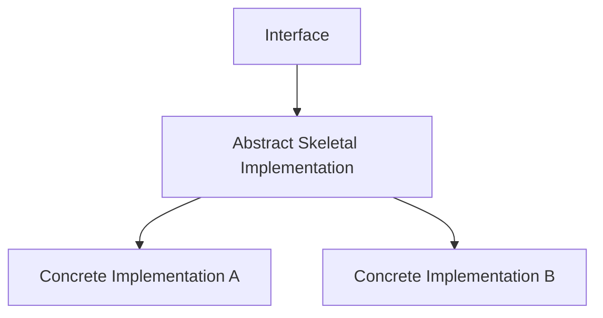
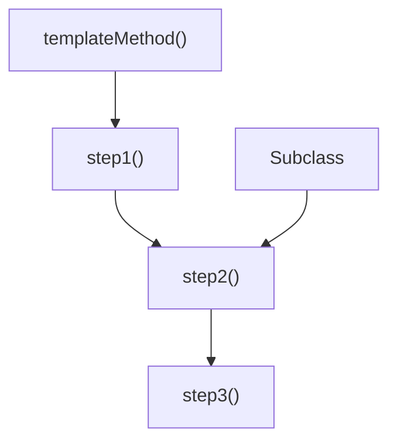

# 아이템 20. 추상 클래스보다 인터페이스를 우선하라.

# 아이템 20. 추상 클래스보다 인터페이스를 우선하라.

* toc
{:toc}

---

## 아이템 20. 핵심 정리 - 인터페이스의 장점

### 아이템 20. 추상 클래스보다 인터페이스를 우선하라

객체지향 설계에서 추상 클래스와 인터페이스는 자주 비교되는 개념이다.

둘 다 공통적인 타입을 정의하고 구현체가 따라야 할 규칙을 제공할 수 있지만, 역할과 확장 방식에는 큰 차이가 있다.

일반적으로 인터페이스는 **타입과 규약을 정의하는 역할**에 가깝고, 추상 클래스는 **공통 구현이나 상태를 일부 제공하면서 하위 클래스의 구현을 유도하는 역할**에 가깝다.

하지만 새로운 확장 가능한 타입을 설계할 때는 가능하면 추상 클래스보다 **인터페이스를 우선적으로 고려하는 것이 좋다.**

인터페이스는 추상 클래스보다 훨씬 유연하게 타입을 확장할 수 있고, 여러 역할을 하나의 클래스에 조합할 수도 있으며, Java 8 이후에는 `default` 메서드를 통해 일부 기본 구현까지 제공할 수 있기 때문이다.

---

### 추상 클래스의 가장 큰 제약은 단일 상속이다

Java 클래스는 하나의 클래스만 상속할 수 있다.

```java
public class Child extends Parent {
}
```

이미 어떤 클래스를 상속하고 있다면 다른 클래스를 추가로 상속할 수 없다.

```java
public class Child extends Parent, AnotherParent {
}
```

이런 코드는 Java에서 허용되지 않는다.

따라서 어떤 기능을 추상 클래스로 제공하면 그 기능을 사용하는 클래스는 자신의 상속 슬롯 하나를 소비해야 한다.

예를 들어 다음과 같은 추상 클래스가 있다고 가정해보자.

```java
public abstract class AbstractLogger {

    public abstract void log(String message);
}
```

그리고 어떤 클래스가 이미 다른 클래스를 상속하고 있다.

```java
public class OrderService extends BaseService {
}
```

`OrderService`에 `AbstractLogger`의 기능까지 추가하고 싶어도 다음과 같이 작성할 수 없다.

```java
public class OrderService
        extends BaseService, AbstractLogger {
}
```

이것이 추상 클래스를 기능 확장 수단으로 사용할 때의 가장 큰 제약이다.

---

### 인터페이스는 기존 상속 구조와 관계없이 추가할 수 있다

반면 인터페이스는 여러 개를 구현할 수 있다.

```java
public class OrderService
        extends BaseService
        implements Logger, Auditable, AutoCloseable {
}
```

기존에 어떤 클래스를 상속하고 있더라도 인터페이스를 추가하는 데는 문제가 없다.

즉 인터페이스는 기존 클래스 계층 구조를 거의 건드리지 않고 새로운 역할을 추가할 수 있다.

구조를 비교하면 차이가 명확하다.

```text
추상 클래스

BaseService
     ↑
OrderService

다른 추상 클래스 추가 불가능
```

반면 인터페이스는 다음과 같다.

```text
             Logger
               ↑
               │
BaseService ← OrderService → Auditable
               │
               ↓
          AutoCloseable
```

하나의 클래스가 여러 가지 역할을 동시에 표현할 수 있다.

---

### 인터페이스는 기존 클래스에도 새로운 타입을 쉽게 부여할 수 있다

인터페이스의 또 다른 장점은 이미 만들어진 클래스라도 쉽게 새로운 타입으로 확장할 수 있다는 것이다.

예를 들어 다음 인터페이스가 있다고 하자.

```java
public interface Printable {

    void print();
}
```

기존 클래스는 단순히 인터페이스를 구현하면 된다.

```java
public class Invoice implements Printable {

    @Override
    public void print() {
        System.out.println("Invoice 출력");
    }
}
```

추상 클래스를 사용했다면 해당 클래스의 기존 상속 관계를 고려해야 하지만, 인터페이스는 비교적 자유롭게 추가할 수 있다.

이러한 특성 때문에 **역할을 표현하는 타입을 설계할 때 인터페이스가 훨씬 유연하다.**

---

### Java 8부터 인터페이스도 기본 구현을 제공할 수 있다

과거에는 인터페이스와 추상 클래스의 차이가 더욱 뚜렷했다.

인터페이스는 거의 메서드 선언만 제공했고,

```java
public interface TimeClient {

    void setTime(int hour, int minute, int second);
}
```

구현 클래스가 모든 메서드를 직접 구현해야 했다.

반면 추상 클래스는 메서드 구현을 제공할 수 있었다.

하지만 Java 8부터 인터페이스에 **default method**가 추가되면서 상황이 많이 달라졌다.

```java
public interface TimeClient {

    void setTime(
            int hour,
            int minute,
            int second
    );

    default void printTime() {
        System.out.println("현재 시간을 출력한다.");
    }
}
```

`default` 키워드를 사용하면 인터페이스가 직접 메서드 구현을 제공할 수 있다.

---

### default method가 필요한 이유

인터페이스가 이미 여러 클래스에 공개되어 있다고 가정해보자.

```java
public interface TimeClient {

    LocalDateTime getLocalDateTime();
}
```

그리고 여러 구현체가 존재한다.

```java
public class SimpleTimeClient
        implements TimeClient {

    @Override
    public LocalDateTime getLocalDateTime() {
        return LocalDateTime.now();
    }
}
```

시간이 지나면서 `TimeClient`에 새로운 기능이 필요해졌다.

예를 들어 특정 시간대를 적용한 시간을 얻는 기능을 추가하고 싶다고 해보자.

```java
ZonedDateTime getZonedDateTime(String zoneString);
```

이를 그냥 추상 메서드로 추가하면 기존 구현 클래스들은 모두 영향을 받는다.

```java
public interface TimeClient {

    LocalDateTime getLocalDateTime();

    ZonedDateTime getZonedDateTime(
            String zoneString
    );
}
```

기존 `SimpleTimeClient`는 새로운 메서드를 구현하지 않았기 때문에 컴파일 오류가 발생한다.

```text
TimeClient 변경

        ↓

새 추상 메서드 추가

        ↓

기존 구현체들이 모두 새로운 메서드를 구현해야 함
```

공개된 인터페이스라면 어떤 클래스가 이 인터페이스를 구현하고 있는지 전부 알 수 없을 수도 있다.

이런 상황에서 인터페이스 변경은 큰 호환성 문제가 된다.

---

### default method를 사용하면 기존 구현체를 깨뜨리지 않을 수 있다

새로운 기능에 합리적인 기본 구현을 제공할 수 있다면 `default` 메서드를 사용할 수 있다.

```java
public interface TimeClient {

    LocalDateTime getLocalDateTime();

    default ZonedDateTime getZonedDateTime(
            String zoneString
    ) {
        return ZonedDateTime.of(
                getLocalDateTime(),
                getZoneId(zoneString)
        );
    }
}
```

이제 기존 구현체는 새로운 메서드를 직접 구현하지 않아도 된다.

```java
public class SimpleTimeClient
        implements TimeClient {

    @Override
    public LocalDateTime getLocalDateTime() {
        return LocalDateTime.now();
    }
}
```

하지만 다음 코드는 사용할 수 있다.

```java
TimeClient client =
        new SimpleTimeClient();

client.getZonedDateTime(
        "..."
);
```

즉 인터페이스에 새로운 기능을 추가하면서 기존 구현체에 기본 동작을 제공할 수 있다.

---

### 인터페이스의 static method

인터페이스에는 `static` 메서드도 정의할 수 있다.

예를 들어 문자열을 받아 `ZoneId`를 구하는 로직을 인터페이스 내부에 둘 수 있다.

```java
public interface TimeClient {

    LocalDateTime getLocalDateTime();

    default ZonedDateTime getZonedDateTime(
            String zoneString
    ) {
        return ZonedDateTime.of(
                getLocalDateTime(),
                getZoneId(zoneString)
        );
    }

    static ZoneId getZoneId(
            String zoneString
    ) {
        try {
            return ZoneId.of(zoneString);
        } catch (DateTimeException e) {
            System.err.println(
                    "잘못된 ZoneId: "
                            + zoneString
            );

            return ZoneId.systemDefault();
        }
    }
}
```

`default` 메서드는 구현 객체가 사용할 기본 동작을 제공하고, `static` 메서드는 인터페이스와 관련된 보조 기능을 제공하는 식으로 사용할 수 있다.

---

### default method 덕분에 인터페이스도 진화할 수 있다

과거에는 공개 인터페이스에 새로운 메서드를 추가하는 것이 매우 부담스러웠다.

```text
인터페이스 변경

↓

모든 구현체 변경
```

하지만 기본 구현이 가능한 기능이라면 `default` 메서드를 통해 다음 구조로 만들 수 있다.

```text
인터페이스 변경

↓

default method 추가

↓

기존 구현체 유지

↓

필요한 구현체만 직접 재정의
```

예를 들어 특별한 동작이 필요한 구현체만 다시 구현하면 된다.

```java
public class CustomTimeClient
        implements TimeClient {

    @Override
    public LocalDateTime getLocalDateTime() {
        return LocalDateTime.now();
    }

    @Override
    public ZonedDateTime getZonedDateTime(
            String zoneString
    ) {
        // 특별한 로직
        return ...;
    }
}
```

즉 기본 동작을 제공하면서 필요한 구현체에는 확장 가능성을 열어둘 수 있다.

---

### default method가 추상 클래스를 완전히 대체하는 것은 아니다

인터페이스에 기본 구현을 넣을 수 있다고 해서 추상 클래스가 필요 없어지는 것은 아니다.

인터페이스에는 구현상의 한계가 존재한다.

대표적인 것이 **인스턴스 필드를 사용할 수 없다는 점**이다.

예를 들어 다음과 같이 상태를 가지고 싶다고 해보자.

```java
private int count;
```

인터페이스에는 이런 인스턴스 상태를 가질 수 없다.

따라서 다음처럼 상태에 의존하는 공통 구현이 필요하다면 인터페이스의 `default` 메서드만으로 해결하기 어렵다.

```java
public abstract class AbstractCounter {

    private int count;

    protected void increase() {
        count++;
    }

    public int getCount() {
        return count;
    }
}
```

이런 경우에는 추상 클래스가 여전히 유용하다.

---

### 인터페이스와 추상 골격 구현을 함께 사용할 수 있다

인터페이스의 장점과 추상 클래스의 장점을 동시에 가져가는 방법도 있다.

개념적으로 다음 구조다.

```text
Interface
    ↑
    │
Abstract Implementation
    ↑
    │
Concrete Implementation
```

인터페이스는 타입과 계약을 제공하고,

```java
public interface MyInterface {
}
```

추상 클래스는 반복되는 구현을 제공한다.

```java
public abstract class AbstractMyInterface
        implements MyInterface {
}
```

실제 구현체는 필요한 경우 추상 골격 클래스를 상속할 수 있다.

```java
public class MyImplementation
        extends AbstractMyInterface {
}
```

이 방식은 인터페이스가 제공하는 유연성을 유지하면서도 공통 구현을 재사용할 수 있는 방법이다.

---

### 인터페이스는 믹스인 정의에 적합하다

인터페이스가 추상 클래스보다 유리한 또 하나의 이유는 **믹스인(Mixin)** 을 정의하기 좋다는 것이다.

믹스인은 어떤 클래스의 주된 역할과 별개로 추가적인 능력이나 특성을 부여하는 타입이라고 이해할 수 있다.

예를 들어 어떤 클래스의 본래 역할이 파일 처리라고 해보자.

```java
public class FileResource {
}
```

이 클래스가 자원을 닫을 수 있다는 추가적인 특성을 표현하고 싶다면 `AutoCloseable`을 구현할 수 있다.

```java
public class FileResource
        implements AutoCloseable {

    @Override
    public void close() {
        // 자원 정리
    }
}
```

`AutoCloseable`은 이 클래스의 본질적인 부모 타입이라기보다

```text
"이 객체는 닫을 수 있다."
```

라는 추가적인 능력을 표현한다.

---

### 하나의 클래스에 여러 믹스인을 추가할 수 있다

인터페이스를 이용하면 다음과 같은 설계가 가능하다.

```java
public class Resource
        implements AutoCloseable,
                   Serializable,
                   Comparable<Resource> {

    @Override
    public void close() {
    }

    @Override
    public int compareTo(Resource other) {
        return 0;
    }
}
```

하나의 클래스에 여러 역할을 조합할 수 있다.

```text
Resource의 주 역할

+

AutoCloseable

+

Serializable

+

Comparable
```

추상 클래스는 단일 상속 제한 때문에 이런 용도로 사용하기 어렵다.

---

### 추상 클래스를 믹스인으로 사용하기 어려운 이유

다음과 같은 추상 클래스가 있다고 해보자.

```java
public abstract class AbstractCloseable {

    public abstract void close();
}
```

어떤 클래스가 이미 다른 클래스를 상속하고 있다면

```java
public class Resource
        extends BaseResource {
}
```

`AbstractCloseable`을 추가로 상속할 수 없다.

따라서

```text
부가 능력
```

을 표현하는 타입에는 인터페이스가 훨씬 자연스럽다.

---

### 계층 구조가 명확하지 않은 타입도 인터페이스로 표현할 수 있다

객체들의 관계가 항상 깔끔한 상속 계층으로 표현되는 것은 아니다.

예를 들어 다음과 같은 관계는 비교적 명확할 수 있다.

```text
Shape
  ↑
Rectangle
```

하지만 현실의 역할들은 항상 이렇게 수직적인 구조를 가지지는 않는다.

대표적인 예가 다음 두 역할이다.

```text
Singer
Songwriter
```

노래를 부르는 사람과 노래를 만드는 사람은 서로 상하 관계가 아니다.

```text
Singer is-a Songwriter
```

도 아니고

```text
Songwriter is-a Singer
```

도 아니다.

하지만 어떤 사람은 두 역할을 모두 수행할 수 있다.

---

### Singer와 Songwriter를 인터페이스로 표현해보자

```java
public interface Singer {

    void sing();

    String sing(String song);
}
```

```java
public interface Songwriter {

    String compose(int chartPosition);
}
```

두 인터페이스 사이에는 직접적인 상속 관계가 없다.

하지만 두 능력을 모두 가진 타입을 만들 수 있다.

```java
public interface SingerSongwriter
        extends Singer, Songwriter {

    void strum();

    void actSensitive();
}
```

하나의 인터페이스가 여러 인터페이스를 상속할 수 있기 때문이다.

---

### 인터페이스는 역할을 조합하기 좋다

이 구조를 보면 인터페이스가 왜 계층 구조가 불분명한 타입을 표현하는 데 유리한지 알 수 있다.

```text
Singer          Songwriter
    \              /
     \            /
      SingerSongwriter
```

두 타입이 수직적인 관계는 아니지만 새로운 타입에서 둘을 결합할 수 있다.

추상 클래스만으로 표현하려고 하면 어느 클래스를 상속해야 하는지부터 문제가 생긴다.

```text
AbstractSinger

AbstractSongwriter
```

Java는 두 클래스를 동시에 상속할 수 없기 때문이다.

---

### 인터페이스는 타입 조합의 자유도를 높인다

필요하다면 더 많은 인터페이스를 조합할 수도 있다.

```java
public interface Performer {
    void perform();
}
```

```java
public interface Producer {
    void produce();
}
```

그리고 다음과 같이 만들 수 있다.

```java
public interface Artist
        extends Singer,
                Songwriter,
                Performer,
                Producer {
}
```

인터페이스에서는 이런 조합이 자연스럽다.

즉 클래스 계층을 억지로 만들어내지 않고 **능력과 역할을 중심으로 타입을 설계할 수 있다.**

---

### 인터페이스는 래퍼 클래스와도 잘 어울린다

아이템 18에서 살펴봤던 래퍼 클래스와 합성 구조 역시 인터페이스의 강점을 잘 보여준다.

대표적인 예가 `ForwardingSet`이다.

```java
public class ForwardingSet<E>
        implements Set<E> {

    private final Set<E> set;

    public ForwardingSet(Set<E> set) {
        this.set = set;
    }

    @Override
    public boolean add(E e) {
        return set.add(e);
    }

    @Override
    public boolean addAll(
            Collection<? extends E> c
    ) {
        return set.addAll(c);
    }

    // 나머지 Set 메서드도 전달
}
```

여기서 핵심은 구체 클래스가 아니라

```java
Set<E>
```

인터페이스를 사용한다는 것이다.

---

### 래퍼를 이용해 새로운 기능을 추가할 수 있다

`ForwardingSet` 위에 새로운 기능을 추가한다.

```java
public class InstrumentedSet<E>
        extends ForwardingSet<E> {

    private int addCount;

    public InstrumentedSet(Set<E> set) {
        super(set);
    }

    @Override
    public boolean add(E e) {
        addCount++;
        return super.add(e);
    }

    @Override
    public boolean addAll(
            Collection<? extends E> c
    ) {
        addCount += c.size();
        return super.addAll(c);
    }

    public int getAddCount() {
        return addCount;
    }
}
```

사용할 때는 다음과 같다.

```java
Set<String> set =
        new InstrumentedSet<>(
                new HashSet<>()
        );
```

`HashSet`을 상속하지 않고 내부 객체로 사용한다.

---

### 구현 상속과 비교해보자

상속을 직접 사용하면 다음처럼 될 수 있다.

```java
public class InstrumentedHashSet<E>
        extends HashSet<E> {

    private int addCount;

    @Override
    public boolean add(E e) {
        addCount++;
        return super.add(e);
    }

    @Override
    public boolean addAll(
            Collection<? extends E> c
    ) {
        addCount += c.size();
        return super.addAll(c);
    }
}
```

이 경우 상위 클래스의 내부 구현 방식에 따라 하위 클래스의 동작이 영향을 받을 수 있다.

예를 들어 `HashSet.addAll()`이 내부에서 `add()`를 호출한다면 카운트가 중복으로 증가하는 문제가 생길 수 있다.

```text
addAll(3개)

↓

addCount += 3

↓

super.addAll()

↓

내부 add() 3회 호출

↓

addCount += 3

↓

최종 6
```

상위 클래스의 구현에 의존하기 때문에 캡슐화가 약해진다.

---

### 인터페이스 기반 래퍼는 구현에 덜 의존한다

반면 `ForwardingSet`은 다음 관계를 가진다.

```text
InstrumentedSet
      ↓
ForwardingSet
      ↓
Set 인터페이스
      ↓
HashSet
```

`InstrumentedSet`이 직접 의존하는 것은 `HashSet` 내부 구현이 아니다.

`Set` 인터페이스가 제공하는 계약이다.

```java
return set.addAll(c);
```

따라서 내부 `HashSet`이 `addAll()`을 어떻게 구현하고 있는지 알아야 할 필요가 줄어든다.

---

### 구현체를 자유롭게 교체할 수도 있다

인터페이스를 기준으로 설계했기 때문에 다양한 구현체를 사용할 수 있다.

```java
new InstrumentedSet<>(
        new HashSet<>()
);
```

```java
new InstrumentedSet<>(
        new TreeSet<>()
);
```

```java
new InstrumentedSet<>(
        new LinkedHashSet<>()
);
```

`InstrumentedSet`의 코드는 바뀌지 않는다.

```text
InstrumentedSet
        ↓
      Set
     / | \
HashSet TreeSet LinkedHashSet
```

이것이 인터페이스 기반 설계의 큰 장점이다.

---

### 상위 클래스에 새로운 메서드가 추가되는 경우

구현 상속에서는 상위 클래스에 새로운 메서드가 추가되더라도 하위 클래스가 그 사실을 명확하게 알아차리지 못할 수 있다.

예를 들어 하위 클래스가 모든 요소 추가 연산을 검사하도록 설계했다고 하자.

```text
요소 추가
   ↓
검사
   ↓
실제 추가
```

그런데 미래에 상위 클래스에 새로운 요소 추가 메서드가 생긴다면 새 메서드는 기존 검사 로직을 우회할 수 있다.

```text
새로운 추가 메서드
        ↓
검사 로직을 거치지 않음
        ↓
원하지 않는 상태 발생 가능
```

이것이 구현 상속의 위험 중 하나다.

---

### 인터페이스 변경은 구현체에게 더 명시적으로 드러난다

인터페이스에 새로운 추상 메서드가 추가된다면 구현 클래스는 그 메서드를 구현해야 한다.

```java
public interface SetLike {

    void add(Object value);

    void addSafely(Object value);
}
```

기존 구현체가 `addSafely()`를 구현하지 않았다면 컴파일 단계에서 바로 문제가 드러난다.

```text
인터페이스 계약 변경

↓

구현체 컴파일 오류

↓

변경 사실 즉시 인지
```

즉 문제를 조용히 숨기기보다는 개발자에게 변경 사실을 드러낼 수 있다.

물론 `default` 메서드를 추가하는 경우에는 기존 구현체가 자동으로 기본 구현을 물려받기 때문에 별도의 검토가 필요할 수 있다.

---

### 추상 클래스와 인터페이스 비교

| 구분           | 추상 클래스      | 인터페이스         |
| ------------ | ----------- | ------------- |
| 클래스에서 사용     | `extends`   | `implements`  |
| 다중 사용        | 불가능         | 가능            |
| 기존 상속 구조와 조합 | 제약이 큼       | 자유로움          |
| 인스턴스 필드      | 가능          | 불가능           |
| 생성자          | 가능          | 없음            |
| 기본 메서드 구현    | 가능          | `default`로 가능 |
| 정적 메서드       | 가능          | 가능            |
| 믹스인          | 부적합한 경우가 많음 | 적합            |
| 타입 조합        | 제약이 큼       | 매우 유연         |
| 공통 상태 공유     | 가능          | 직접 불가능        |
| 래퍼와 조합       | 가능          | 특히 유연함        |

둘 중 하나가 항상 절대적으로 좋다는 의미는 아니다.

중요한 것은 **새로운 타입의 기본 계약을 설계할 때는 인터페이스를 먼저 고려하는 것**이다.

---

### default method는 언제 적합할까?

`default` 메서드는 다음처럼 인터페이스에 자연스럽게 정의할 수 있는 동작에 적합하다.

```java
public interface Calculator {

    int calculate(int a, int b);

    default int twice(int value) {
        return calculate(value, value);
    }
}
```

기존 추상 메서드만 이용해 구현할 수 있기 때문에 인터페이스 자체에서 합리적인 기본 동작을 제공할 수 있다.

---

### default method가 적합하지 않은 경우

반대로 객체마다 개별적인 상태를 관리해야 한다면 어렵다.

다음과 같은 상태가 필요하다고 해보자.

```java
private int requestCount;
```

그리고 메서드가 이 값을 계속 수정해야 한다.

```java
requestCount++;
```

인터페이스에서는 이런 인스턴스 필드를 가질 수 없기 때문에 `default` 메서드만으로 구현을 제공하기 어렵다.

이런 경우에는 추상 골격 클래스 같은 방법을 고려할 수 있다.

```text
인터페이스

+

추상 골격 구현

+

구체 구현
```

인터페이스의 유연성과 추상 클래스의 구현 재사용 능력을 함께 사용할 수 있다.

---

### 인터페이스를 우선적으로 고려해야 하는 이유

지금까지 내용을 정리하면 인터페이스에는 다음과 같은 강점이 있다.

#### 기존 클래스 계층에 쉽게 추가할 수 있다

이미 다른 클래스를 상속하고 있어도 상관없다.

```java
class A extends B
        implements C, D, E {
}
```

---

#### 여러 역할을 동시에 표현할 수 있다

```java
class Resource
        implements AutoCloseable,
                   Comparable<Resource> {
}
```

---

#### 믹스인을 정의하기 좋다

클래스의 주요 타입과 별개로 추가적인 능력을 부여할 수 있다.

---

#### 계층 구조가 불명확한 타입을 조합할 수 있다

```text
Singer + Songwriter
```

처럼 수직적인 상속 관계가 아닌 역할도 조합할 수 있다.

---

#### Java 8 이후 기본 구현도 제공할 수 있다

```java
default void doSomething() {
}
```

기본 구현이 명확하다면 추상 클래스 없이도 상당한 공통 동작을 제공할 수 있다.

---

#### 래퍼 클래스와 조합하기 좋다

구체 구현을 상속하지 않고 인터페이스의 계약을 기준으로 기능을 확장할 수 있다.

---

### 그렇다고 추상 클래스를 사용하지 말라는 것은 아니다

이번 아이템의 제목은

> 추상 클래스를 사용하지 마라

가 아니다.

**추상 클래스보다 인터페이스를 우선하라**는 것이다.

인터페이스만으로 충분하다면 인터페이스를 사용하는 것이 좋다.

하지만 다음과 같은 요구가 있다면 추상 클래스가 필요할 수 있다.

```text
공통 인스턴스 상태가 필요하다.

생성 과정을 공통화해야 한다.

protected 멤버를 통해 구현을 제공해야 한다.

default method만으로 구현하기 어려운 복잡한 공통 로직이 있다.
```

이런 경우에는 인터페이스를 공개 타입으로 제공하고 별도의 추상 골격 구현을 함께 제공하는 방법을 고려할 수 있다.

---

### 핵심 정리

* 추상 클래스와 인터페이스는 모두 공통 타입과 구현을 표현하는 데 사용될 수 있다.
* 새로운 타입을 설계할 때는 가능하면 추상 클래스보다 인터페이스를 우선적으로 고려하는 것이 좋다.
* Java 클래스는 하나의 클래스만 상속할 수 있기 때문에 추상 클래스는 기존 상속 구조에 큰 제약을 준다.
* 인터페이스는 여러 개를 동시에 구현할 수 있고 기존 상속 관계와도 함께 사용할 수 있다.
* Java 8부터 인터페이스에 `default` 메서드를 정의할 수 있어 일부 기본 구현도 제공할 수 있다.
* `default` 메서드를 활용하면 기존 구현 클래스를 바로 깨뜨리지 않으면서 인터페이스를 확장할 수 있는 경우가 있다.
* 인터페이스에는 `static` 메서드도 정의할 수 있다.
* 인터페이스에는 인스턴스 필드를 둘 수 없기 때문에 상태가 필요한 기본 구현에는 한계가 있다.
* 이런 경우 인터페이스와 추상 골격 클래스를 함께 사용하는 방법을 고려할 수 있다.
* 인터페이스는 `AutoCloseable`처럼 클래스의 주요 역할과 별개인 부가 능력을 표현하는 믹스인에 적합하다.
* 인터페이스는 `Singer`와 `Songwriter`처럼 수직적인 계층 관계가 없는 역할도 자유롭게 조합할 수 있다.
* 인터페이스는 래퍼 클래스와 함께 사용하면 구현 상속보다 안전하게 기능을 확장할 수 있다.
* 구현 상속은 상위 클래스의 내부 구현 변경에 하위 클래스가 영향을 받을 수 있지만 인터페이스 기반 래퍼는 인터페이스의 계약을 중심으로 동작한다.
* 인터페이스에 새로운 추상 메서드가 추가되면 구현체가 컴파일 단계에서 변경 사실을 알 수 있다.
* 인터페이스가 항상 추상 클래스보다 우월한 것은 아니며 상태 공유나 복잡한 공통 구현이 필요하면 추상 클래스가 적절할 수 있다.
* 중요한 것은 **타입의 공개 계약은 인터페이스를 우선하고 필요한 경우 구현 재사용을 위한 추상 클래스를 함께 제공하는 방향으로 설계하는 것**이다.

---

### 한 줄 요약

> 인터페이스는 단일 상속이라는 클래스의 제약에서 자유롭고 여러 역할을 조합할 수 있으며 `default` 메서드를 통해 기본 구현까지 제공할 수 있으므로, 새로운 확장 가능한 타입을 설계할 때는 추상 클래스보다 인터페이스를 먼저 고려하는 것이 더 유연하고 안전하다.

## 아이템 20. 핵심 정리 - 인터페이스와 추상 골격(skeletal) 클래스

### 아이템 20. 인터페이스와 추상 골격 구현을 함께 사용하라

인터페이스와 추상 클래스는 서로 경쟁하는 개념처럼 보이지만, 실제로는 둘을 함께 사용할 때 더 강력한 설계를 만들 수 있다.

인터페이스는 다음과 같은 장점이 있다.

* 타입의 계약을 정의하기 좋다.
* 여러 인터페이스를 동시에 구현할 수 있다.
* 기존 상속 구조와 관계없이 새로운 역할을 추가할 수 있다.
* `default` 메서드를 통해 일부 기본 구현을 제공할 수 있다.

반면 추상 클래스는 인터페이스만으로는 제공하기 어려운 구현을 담당할 수 있다.

예를 들어 다음과 같은 것들이다.

* 인스턴스 상태를 사용해야 하는 구현
* 여러 메서드가 공유하는 공통 로직
* 하위 클래스가 일부 메서드만 구현하면 되도록 제공하는 기본 골격
* `protected` 메서드 등을 활용한 확장 지점

따라서 둘 중 하나만 선택해야 하는 것이 아니라 다음처럼 조합할 수 있다.

```text
Interface
    ↓
Skeletal Abstract Class
    ↓
Concrete Implementation
```

인터페이스가 **계약**을 정의하고, 추상 골격 클래스가 **구현의 뼈대**를 제공하는 방식이다.

---

### 추상 골격 구현이란?

추상 골격 구현은 영어로 **Skeletal Implementation**이라고 한다.

말 그대로 인터페이스를 구현하기 위한 골격을 제공하는 추상 클래스다.

예를 들어 다음 인터페이스가 있다고 하자.

```java
public interface MyCollection<E> {

    int size();

    E get(int index);

    boolean isEmpty();
}
```

`isEmpty()`는 `size()`를 이용하면 쉽게 구현할 수 있다.

따라서 인터페이스에서 다음과 같이 `default` 메서드를 제공할 수도 있다.

```java
public interface MyCollection<E> {

    int size();

    E get(int index);

    default boolean isEmpty() {
        return size() == 0;
    }
}
```

하지만 모든 공통 구현을 인터페이스에 넣을 수 있는 것은 아니다.

복잡한 구현이 필요하거나 클래스 내부 상태를 이용해야 한다면 추상 클래스가 더 적합할 수 있다.

---

### 추상 골격 클래스는 인터페이스 구현의 뼈대를 제공한다

다음과 같은 구조를 생각할 수 있다.

```java
public interface DataStore {

    void save(String data);

    String load();

    void clear();
}
```

그리고 공통 구현 일부를 제공하는 추상 클래스를 만든다.

```java
public abstract class AbstractDataStore
        implements DataStore {

    @Override
    public void clear() {
        save("");
    }
}
```

`clear()`는 이미 구현되어 있다.

따라서 실제 구현체는 필요한 부분만 구현하면 된다.

```java
public class FileDataStore
        extends AbstractDataStore {

    @Override
    public void save(String data) {
        // 파일 저장
    }

    @Override
    public String load() {
        // 파일 조회
        return "...";
    }
}
```

이 구조에서 역할을 나누면 다음과 같다.

```text
DataStore

→ 어떤 기능을 제공해야 하는지 정의


AbstractDataStore

→ 공통적으로 사용할 수 있는 구현 제공


FileDataStore

→ 실제 구현에 필요한 부분만 작성
```

이것이 추상 골격 구현의 기본적인 목적이다.

---

### 모든 인터페이스 메서드를 처음부터 구현하는 것은 번거롭다

`List` 같은 인터페이스를 직접 구현한다고 생각해보자.

```java
return new List<Integer>() {
    ...
};
```

`List`는 많은 메서드를 가지고 있기 때문에 인터페이스를 직접 구현하면 상당히 많은 메서드를 구현해야 한다.

개념적으로는 다음과 같다.

```text
List 구현

├─ size()
├─ isEmpty()
├─ contains()
├─ iterator()
├─ toArray()
├─ add()
├─ remove()
├─ containsAll()
├─ addAll()
├─ removeAll()
├─ retainAll()
├─ clear()
├─ get()
├─ set()
├─ add(index, element)
├─ remove(index)
├─ indexOf()
├─ lastIndexOf()
├─ listIterator()
├─ subList()
└─ ...
```

우리가 실제로 필요한 기능은 몇 개 되지 않더라도 인터페이스를 직접 구현하면 많은 메서드를 처리해야 한다.

이런 경우 추상 골격 클래스가 유용하다.

---

### AbstractList를 이용한 간단한 List 구현

예를 들어 `int[]` 배열을 `List<Integer>`처럼 사용하고 싶다고 가정해보자.

단순하게 `List<Integer>`를 직접 구현하면 구현해야 할 메서드가 많다.

하지만 `AbstractList`를 사용하면 필요한 핵심 메서드만 구현할 수 있다.

```java
public static List<Integer> intArrayAsList(
        int[] array
) {

    Objects.requireNonNull(array);

    return new AbstractList<>() {

        @Override
        public Integer get(int index) {
            return array[index];
        }

        @Override
        public Integer set(
                int index,
                Integer value
        ) {
            int oldValue = array[index];
            array[index] = value;
            return oldValue;
        }

        @Override
        public int size() {
            return array.length;
        }
    };
}
```

우리는 `List`의 모든 메서드를 직접 구현하지 않았다.

핵심적인 몇 개의 메서드만 구현했다.

```text
get()

set()

size()
```

나머지 많은 기능은 `AbstractList`가 제공하는 구현을 활용할 수 있다.

---

### 추상 골격 클래스가 왜 편리한가?

`List`를 직접 구현한다고 생각하면 다음 구조가 된다.

```text
MyList
  ↓
List의 많은 메서드를 직접 구현
```

하지만 추상 골격 구현을 사용하면 다음과 같다.

```text
List
 ↓
AbstractList
 ↓
MyList
```

`AbstractList`가 상당한 기본 구현을 제공하기 때문에 실제 구현체는 핵심 메서드에 집중할 수 있다.

즉,

```text
인터페이스의 유연성

+

추상 클래스의 구현 재사용
```

두 가지 장점을 동시에 얻는다.

---

### Template Method 패턴과 연결된다

추상 골격 구현은 템플릿 메서드 패턴과도 자연스럽게 연결된다.

템플릿 메서드 패턴에서는 전체 알고리즘의 흐름은 상위 클래스가 정의하고 일부 단계만 하위 클래스가 구현한다.

예를 들어 다음과 같다.

```java
public abstract class AbstractProcessor {

    public final void process() {

        validate();

        beforeProcess();

        execute();

        afterProcess();
    }

    protected void beforeProcess() {
    }

    protected abstract void execute();

    protected void afterProcess() {
    }

    private void validate() {
        System.out.println("validation");
    }
}
```

전체 흐름은 다음과 같다.

```text
validate()

↓

beforeProcess()

↓

execute()

↓

afterProcess()
```

하위 클래스는 필요한 부분만 구현한다.

```java
public class PaymentProcessor
        extends AbstractProcessor {

    @Override
    protected void execute() {
        System.out.println("payment");
    }
}
```

이처럼 골격 클래스가 전체 구조를 제공하고 하위 클래스가 특정 지점만 채워 넣는 형태가 된다.

---

### 인터페이스 + 추상 골격 구현 구조

전체 구조를 정리하면 다음과 같다.



인터페이스가 외부 계약을 담당하고 추상 클래스가 구현 편의를 제공한다.

---

### 왜 인터페이스를 함께 유지해야 할까?

그렇다면 추상 클래스가 대부분의 구현을 제공한다면 인터페이스 없이 추상 클래스만 사용해도 될 것처럼 보인다.

하지만 인터페이스를 따로 유지하면 중요한 장점이 있다.

클라이언트는 추상 클래스가 아니라 인터페이스에 의존할 수 있다.

```java
public void process(DataStore store) {
}
```

구현 클래스가 반드시 다음 클래스를 상속해야 하는 것도 아니다.

```java
extends AbstractDataStore
```

필요한 경우 인터페이스를 직접 구현할 수도 있다.

```java
public class CustomDataStore
        implements DataStore {

    @Override
    public void save(String data) {
    }

    @Override
    public String load() {
        return "";
    }

    @Override
    public void clear() {
    }
}
```

즉 추상 골격 클래스는 **인터페이스 구현을 도와주는 선택적인 도구**가 된다.

---

### 골격 클래스를 반드시 상속할 필요는 없다

이 부분이 중요하다.

구조가 다음과 같다고 해보자.

```text
DataStore
    ↑
AbstractDataStore
    ↑
FileDataStore
```

그렇다고 해서 `DataStore`의 모든 구현체가 반드시 `AbstractDataStore`를 상속해야 하는 것은 아니다.

```java
public class MemoryDataStore
        implements DataStore {
}
```

처럼 직접 구현해도 된다.

따라서 추상 골격 클래스는

```text
강제되는 상위 클래스
```

가 아니라

```text
구현 편의를 위해 선택할 수 있는 기본 구현
```

에 가깝다.

이것이 인터페이스와 추상 클래스만 단독으로 사용하는 것과의 중요한 차이다.

---

### 이미 다른 클래스를 상속하고 있다면?

Java에서는 다중 클래스 상속이 불가능하다.

```java
public class MyClass
        extends FirstClass,
                AbstractFlyable {
}
```

이런 코드는 작성할 수 없다.

따라서 다음 상황을 생각해볼 수 있다.

```java
public class MyClass
        extends AbstractClass {
}
```

이미 `AbstractClass`를 상속했다.

그런데 여기에 `Flyable`이라는 기능도 추가하고 싶다.

---

### Flyable 인터페이스

다음 인터페이스를 만든다.

```java
public interface Flyable {

    void fly();
}
```

그리고 기본 구현을 제공하는 추상 골격 클래스를 만든다.

```java
public abstract class AbstractFlyable
        implements Flyable {

    @Override
    public void fly() {
        System.out.println("날아간다.");
    }
}
```

이제 다른 클래스에서 이 기능을 사용하고 싶다.

하지만 이미 다른 클래스를 상속하고 있다.

```java
public class MyClass
        extends AbstractClass {
}
```

다음은 불가능하다.

```java
public class MyClass
        extends AbstractClass,
                AbstractFlyable {
}
```

Java는 클래스 다중 상속을 지원하지 않기 때문이다.

---

### 내부 클래스를 이용해 골격 구현을 활용할 수 있다

이럴 때 인터페이스와 내부 클래스를 활용할 수 있다.

먼저 외부 클래스는 `Flyable`을 구현한다.

```java
public class MyClass
        extends AbstractClass
        implements Flyable {

}
```

그리고 내부에 `AbstractFlyable`을 상속한 클래스를 하나 만든다.

```java
public class MyClass
        extends AbstractClass
        implements Flyable {

    private class MyFlyable
            extends AbstractFlyable {

    }
}
```

이제 해당 객체를 필드로 가진다.

```java
public class MyClass
        extends AbstractClass
        implements Flyable {

    private final Flyable flyable =
            new MyFlyable();

    private class MyFlyable
            extends AbstractFlyable {

    }
}
```

그리고 `fly()` 호출을 내부 객체에게 전달한다.

```java
@Override
public void fly() {
    flyable.fly();
}
```

전체 코드는 다음과 같다.

```java
public class MyClass
        extends AbstractClass
        implements Flyable {

    private final Flyable flyable =
            new MyFlyable();

    @Override
    public void fly() {
        flyable.fly();
    }

    private class MyFlyable
            extends AbstractFlyable {
    }
}
```

---

### 구조를 살펴보면 다중 상속과 비슷하다

실제로 클래스 상속은 하나만 사용했다.

```text
MyClass

↓

AbstractClass
```

하지만 `Flyable` 기능도 얻었다.

```text
MyClass

implements

Flyable
```

그리고 실제 구현은 내부 객체가 담당한다.

```text
MyClass
   │
   ├─ extends AbstractClass
   │
   └─ has-a MyFlyable
             ↓
       AbstractFlyable
```

즉 클래스의 다중 상속은 아니지만 결과적으로 여러 상위 구현의 기능을 결합한 것처럼 사용할 수 있다.

---

### 시뮬레이트한 다중 상속

이 방식을 **Simulated Multiple Inheritance**, 즉 다중 상속을 시뮬레이션하는 방법으로 볼 수 있다.

Java에서는 다음이 불가능하다.

```text
Class A
   ↑
MyClass
   ↓
Class B
```

하지만 인터페이스와 내부 클래스, 위임을 조합하면 비슷한 효과를 만들 수 있다.

```text
             AbstractClass
                  ↑
                  │
                MyClass
                  │
                  │ implements
                  ▼
               Flyable
                  ▲
                  │
            MyFlyable
                  ↑
                  │
          AbstractFlyable
```

실제 클래스 상속은 하나만 존재하지만 `AbstractFlyable`의 구현도 재사용할 수 있다.

---

### 직접 위임까지 보면 구조가 더 명확하다

```java
public abstract class AbstractClass {

    public abstract String name();

    public abstract String sound();
}
```

```java
public interface Flyable {

    void fly();
}
```

```java
public abstract class AbstractFlyable
        implements Flyable {

    @Override
    public void fly() {
        System.out.println("기본 비행");
    }
}
```

다음처럼 조합한다.

```java
public class MyClass
        extends AbstractClass
        implements Flyable {

    private final Flyable flyable =
            new MyFlyable();

    @Override
    public String name() {
        return "MyClass";
    }

    @Override
    public String sound() {
        return "sound";
    }

    @Override
    public void fly() {
        flyable.fly();
    }

    private class MyFlyable
            extends AbstractFlyable {

        @Override
        public void fly() {
            System.out.println(
                    name() + "이 날아간다."
            );
        }
    }
}
```

외부 클래스는 하나의 클래스만 상속한다.

```text
extends AbstractClass
```

동시에 인터페이스를 구현한다.

```text
implements Flyable
```

그리고 `Flyable`의 실제 구현 상당 부분은 내부 골격 구현체에게 위임한다.

---

### 왜 이런 방식이 가능한가?

핵심은 인터페이스와 구현을 분리했기 때문이다.

만약 `Flyable`이 추상 클래스 하나로만 제공되었다면 다음 문제가 생긴다.

```text
MyClass

이미 AbstractClass 상속 중

↓

AbstractFlyable 상속 불가능
```

하지만 다음처럼 분리하면 이야기가 달라진다.

```text
Flyable
        → 타입

AbstractFlyable
        → 기본 구현
```

`MyClass`는 `Flyable` 타입만 구현하면 된다.

```java
implements Flyable
```

그리고 필요한 구현은 내부에서 자유롭게 재사용한다.

이것이 인터페이스를 공개 타입으로 두는 설계의 유연성이다.

---

### 인터페이스와 골격 구현의 역할을 명확히 나누자

두 역할을 다음처럼 이해하면 쉽다.

#### 인터페이스

```text
무엇을 할 수 있는가?
```

를 정의한다.

```java
public interface Flyable {

    void fly();
}
```

---

#### 추상 골격 구현

```text
그 기능을 쉽게 구현하려면
어떤 기본 동작을 제공할 수 있는가?
```

를 담당한다.

```java
public abstract class AbstractFlyable
        implements Flyable {

    @Override
    public void fly() {
        // 공통 구현
    }
}
```

---

#### 구체 클래스

필요하다면 골격 구현을 사용한다.

```text
직접 상속
```

또는

```text
내부 객체로 포함하고 위임
```

할 수도 있다.

---

### default 메서드와 골격 클래스는 경쟁 관계가 아니다

인터페이스에 `default` 메서드가 생겼기 때문에 추상 골격 구현이 필요 없다고 생각할 수도 있다.

하지만 역할이 조금 다르다.

인터페이스 자체에서 자연스럽게 구현할 수 있는 기능은 `default` 메서드로 제공할 수 있다.

```java
public interface Calculator {

    int calculate(int a, int b);

    default int twice(int value) {
        return calculate(value, value);
    }
}
```

반면 더 복잡한 구현이 필요하다면 골격 클래스를 활용할 수 있다.

```java
public abstract class AbstractCalculator
        implements Calculator {

    private int calculationCount;

    protected void increaseCount() {
        calculationCount++;
    }

    public int getCalculationCount() {
        return calculationCount;
    }
}
```

즉 다음처럼 역할을 나눌 수 있다.

```text
간단하고 상태가 필요 없는 기본 구현

→ default method


상태 또는 복잡한 공통 구현이 필요함

→ skeletal abstract class
```

둘을 함께 사용할 수도 있다.

---

### 골격 구현과 Template Method의 관계

추상 골격 클래스는 흔히 템플릿 메서드 형태로 설계될 수 있다.

전체 알고리즘은 골격 클래스가 제공한다.

```java
public final void execute() {

    before();

    doExecute();

    after();
}
```

일부 동작은 기본 구현을 제공한다.

```java
protected void before() {
}
```

핵심적인 특정 부분은 하위 클래스가 구현하게 한다.

```java
protected abstract void doExecute();
```

이렇게 하면 구현 클래스가 전체 알고리즘을 처음부터 작성할 필요가 없다.

```text
골격 구현

before()
   ↓
doExecute()
   ↓
after()
```

하위 클래스는 필요한 곳에만 들어가면 된다.

---

### 골격 클래스는 상속용 클래스다

여기서 중요한 점이 하나 있다.

추상 골격 클래스는 애초에 **다른 클래스가 상속해서 사용하도록 만든 클래스**다.

따라서 상속을 허용한다면 상속을 고려해서 설계해야 한다.

즉 이전 아이템에서 다뤘던 원칙들이 그대로 적용된다.

---

### 내부 동작을 명확하게 문서화해야 한다

하위 클래스가 메서드를 재정의했을 때 어떤 메서드에 영향을 미치는지 알아야 한다.

예를 들어 다음 구조라면

```java
public final void process() {
    beforeProcess();
    execute();
    afterProcess();
}
```

`execute()`를 재정의하면 `process()` 내부에서 호출된다는 사실이 하위 클래스 설계자에게 중요한 정보가 된다.

따라서 상속을 위해 필요한 내부 동작은 명확하게 문서화해야 한다.

---

### 확장 지점을 신중하게 선택해야 한다

모든 내부 메서드를 `protected`로 공개해서는 안 된다.

```java
protected void beforeProcess() {
}

protected abstract void execute();

protected void afterProcess() {
}
```

하위 클래스가 정말로 변경해야 하는 부분만 확장 지점으로 제공해야 한다.

한번 `protected` API로 공개하면 하위 클래스가 그 메서드에 의존하기 시작하기 때문에 이후 변경하기 어려워진다.

---

### 실제 하위 클래스를 만들어 검증해야 한다

골격 구현이 정말 사용하기 편한지는 실제로 상속해서 사용해봐야 알 수 있다.

```text
Skeletal Class 설계

↓

SubClass A 구현

↓

SubClass B 구현

↓

SubClass C 구현

↓

불필요하거나 부족한 확장 지점 확인
```

상속을 고려한 설계가 실제로 적절한지 검증하는 과정이 필요하다.

---

### 생성자에서 재정의 가능한 메서드를 호출하지 않는다

골격 클래스 역시 상속용 클래스이므로 생성자에서 재정의 가능한 메서드를 호출하면 안 된다.

다음과 같은 코드는 피해야 한다.

```java
public abstract class AbstractService {

    protected AbstractService() {
        initialize();
    }

    protected abstract void initialize();
}
```

하위 클래스의 필드가 아직 초기화되지 않은 상태에서 `initialize()`가 호출될 수 있기 때문이다.

```text
하위 클래스 생성

↓

상위 클래스 생성자 실행

↓

재정의된 initialize() 호출

↓

하위 클래스 필드 아직 초기화되지 않음
```

따라서 골격 클래스를 설계할 때도 상속용 클래스의 기본 규칙을 지켜야 한다.

---

### 인터페이스와 골격 구현을 같이 쓰는 이유

이 구조의 장점을 다시 정리해보자.

#### 인터페이스의 유연성을 유지한다

클라이언트는 구현 클래스가 아니라 인터페이스에 의존한다.

```java
void execute(Flyable flyable) {
    flyable.fly();
}
```

---

#### 구현을 강제하지 않는다

골격 클래스를 사용하기 싫다면 인터페이스를 직접 구현할 수 있다.

```java
public class CustomFlyable
        implements Flyable {

    @Override
    public void fly() {
    }
}
```

---

#### 공통 구현을 재사용할 수 있다

필요하다면 골격 클래스를 상속한다.

```java
public class Bird
        extends AbstractFlyable {
}
```

---

#### 이미 다른 클래스를 상속해도 사용할 수 있다

내부 클래스를 사용해서 골격 구현의 기능을 위임받을 수 있다.

```text
extends OtherClass

+

implements Flyable

+

내부 AbstractFlyable 구현
```

---

#### 다중 상속과 비슷한 효과를 얻을 수 있다

클래스 상속은 하나만 사용하면서 여러 인터페이스와 그 골격 구현을 조합할 수 있다.

---

### 인터페이스 단독, 추상 클래스 단독, 조합 방식 비교

| 방식            | 장점                    | 단점                |
| ------------- | --------------------- | ----------------- |
| 인터페이스만 사용     | 매우 유연하고 다중 구현 가능      | 복잡한 공통 구현 제공에 한계  |
| 추상 클래스만 사용    | 상태와 공통 구현 제공이 편리함     | 단일 상속 제약          |
| 인터페이스 + 골격 구현 | 타입 유연성과 구현 재사용을 함께 얻음 | 설계해야 할 구성 요소가 늘어남 |

가장 유연한 구조는 다음처럼 역할을 분리하는 것이다.

```text
Interface

→ 공개 계약


Default Method

→ 간단한 공통 구현


Skeletal Abstract Class

→ 보다 복잡한 공통 구현


Concrete Class

→ 실제 세부 구현
```

---

### 실무에서 생각해볼 수 있는 구조

예를 들어 메시지 전송 기능이 있다고 생각해보자.

인터페이스가 공개 계약을 담당한다.

```java
public interface MessageSender {

    void send(String message);
}
```

간단한 공통 기능은 `default` 메서드로 제공할 수 있다.

```java
public interface MessageSender {

    void send(String message);

    default void sendIfNotEmpty(
            String message
    ) {
        if (message == null
                || message.isBlank()) {
            return;
        }

        send(message);
    }
}
```

더 많은 공통 상태나 로직이 필요하다면 골격 구현을 만든다.

```java
public abstract class AbstractMessageSender
        implements MessageSender {

    private long sendCount;

    @Override
    public final void send(String message) {

        validate(message);

        doSend(message);

        sendCount++;
    }

    protected abstract void doSend(
            String message
    );

    private void validate(String message) {
        Objects.requireNonNull(message);
    }

    public long getSendCount() {
        return sendCount;
    }
}
```

실제 구현체는 핵심 부분만 구현한다.

```java
public class EmailMessageSender
        extends AbstractMessageSender {

    @Override
    protected void doSend(String message) {
        System.out.println(
                "Email: " + message
        );
    }
}
```

이 구조에서는 각각의 역할이 명확하다.

```text
MessageSender
→ 계약

default method
→ 단순한 공통 기능

AbstractMessageSender
→ 상태와 공통 실행 흐름

EmailMessageSender
→ 실제 전송
```

---

### 핵심 정리

* 인터페이스와 추상 클래스는 둘 중 하나만 선택해야 하는 관계가 아니다.
* 인터페이스는 공개 타입과 계약을 정의하고 추상 클래스는 구현의 골격을 제공하는 식으로 함께 사용할 수 있다.
* 인터페이스에서 자연스럽게 구현할 수 있는 기능은 `default` 메서드로 제공할 수 있다.
* 인터페이스만으로 제공하기 어려운 공통 구현은 추상 골격 클래스에서 구현할 수 있다.
* 추상 골격 구현은 인터페이스 구현체가 모든 메서드를 처음부터 구현해야 하는 부담을 줄여준다.
* `AbstractList` 같은 골격 구현을 사용하면 `List`의 모든 메서드를 직접 구현하지 않고 핵심 메서드만 구현할 수 있다.
* 골격 구현에서는 전체 알고리즘을 제공하고 일부 단계만 하위 클래스가 구현하게 할 수 있으며 이는 Template Method 패턴과 연결된다.
* 추상 골격 클래스는 강제되는 상위 클래스가 아니라 구현 편의를 위한 선택적인 구현체로 사용할 수 있다.
* 구현 클래스가 이미 다른 클래스를 상속하고 있다면 인터페이스를 구현하고 내부 클래스에서 골격 구현을 상속한 뒤 위임하는 방법을 사용할 수 있다.
* 이 방식을 통해 Java에서 지원하지 않는 클래스 다중 상속과 비슷한 효과를 얻을 수 있다.
* 인터페이스는 타입을 제공하고 골격 클래스는 구현을 제공하기 때문에 두 역할을 분리할 수 있다.
* 골격 클래스는 상속을 목적으로 만든 클래스이므로 상속을 고려해 설계하고 문서화해야 한다.
* 하위 클래스가 알아야 하는 내부 호출 구조와 재정의 지점을 명확하게 제공해야 한다.
* 확장용 `protected` 메서드는 신중하게 선정해야 한다.
* 실제 하위 클래스를 만들어보면서 골격 구현의 확장성을 검증하는 것이 좋다.
* 생성자에서는 재정의 가능한 메서드를 직접 또는 간접적으로 호출하지 않는 원칙도 그대로 적용된다.
* 인터페이스와 추상 골격 구현을 함께 사용하면 **인터페이스의 유연성과 추상 클래스의 구현 재사용 능력을 동시에 얻을 수 있다.**

---

### 한 줄 요약

> 인터페이스를 공개 계약으로 두고 `default` 메서드와 추상 골격 클래스로 공통 구현을 제공하면, 단일 상속의 제약을 최소화하면서 구현 재사용까지 얻을 수 있고 내부 클래스와 위임을 조합하면 다중 상속과 유사한 효과까지 구현할 수 있다.

## 아이템 20. 완벽 공략 - 템플릿 메서드 패턴

### 아이템 20 완벽 공략: 템플릿 메서드 패턴과 템플릿 콜백 패턴

인터페이스와 추상 골격 구현을 함께 사용하는 대표적인 방식 중 하나가 **템플릿 메서드 패턴(Template Method Pattern)** 이다.

템플릿 메서드 패턴은 전체 알고리즘의 구조를 상위 클래스에서 정의하고, 그중 일부 단계만 하위 클래스가 재정의할 수 있도록 만드는 디자인 패턴이다.

즉,

```text
전체 흐름은 고정한다.

+

일부 단계만 확장 가능하게 만든다.
```

라는 것이 핵심이다.

상위 클래스는 전체 실행 순서를 책임지고, 하위 클래스는 자신에게 필요한 부분만 구현한다.

---

### 템플릿 메서드 패턴이란?

템플릿 메서드 패턴은 **상속을 이용해 알고리즘의 일부분을 확장할 수 있도록 만드는 패턴**이다.

구조를 단순화하면 다음과 같다.

```text
AbstractClass

templateMethod()

  ↓

step1()

  ↓

step2()
```

`templateMethod()`가 전체 알고리즘의 순서를 정의한다.

그리고 `step1()`, `step2()` 같은 메서드를 하위 클래스가 재정의할 수 있도록 만든다.

---

### 전체 알고리즘은 상위 클래스가 가진다

예를 들어 다음과 같은 추상 클래스가 있다고 하자.

```java
public abstract class DataProcessor {

    public final void process() {
        read();

        convert();

        save();
    }

    protected void read() {
        System.out.println("데이터 읽기");
    }

    protected abstract void convert();

    protected void save() {
        System.out.println("데이터 저장");
    }
}
```

여기서 전체 흐름은 다음과 같다.

```text
read()

↓

convert()

↓

save()
```

이 순서는 상위 클래스가 결정한다.

하위 클래스는 그중 `convert()`만 구현한다.

```java
public class JsonDataProcessor
        extends DataProcessor {

    @Override
    protected void convert() {
        System.out.println(
                "JSON 데이터 변환"
        );
    }
}
```

실행하면 다음 순서로 동작한다.

```text
데이터 읽기

↓

JSON 데이터 변환

↓

데이터 저장
```

---

### 왜 Template Method라고 부를까?

이름 그대로다.

상위 클래스가 하나의 메서드 안에서 전체 알고리즘의 **템플릿**을 정의하고 있기 때문이다.

```java
public final void process() {

    step1();

    step2();

    step3();
}
```

이 메서드 자체가 알고리즘의 틀이다.

하위 클래스는 이 틀 전체를 바꾸는 것이 아니라 일부 단계만 변경한다.

---

### 템플릿 메서드는 보통 재정의하지 않는다

템플릿 메서드 패턴에서 중요한 점이 있다.

전체 흐름을 정의하는 메서드는 일반적으로 하위 클래스가 재정의하지 못하게 만드는 것이 좋다.

```java
public final void process() {
}
```

왜냐하면 이 메서드는 다음과 같은 알고리즘 자체를 표현하기 때문이다.

```text
검증

↓

실행

↓

후처리
```

하위 클래스가 이 전체 메서드를 마음대로 재정의해버리면 알고리즘의 구조 자체가 깨질 수 있다.

따라서 확장이 필요한 지점을 별도의 메서드로 제공한다.

```java
protected abstract void execute();
```

또는 선택적으로 재정의할 수 있는 기본 구현을 제공한다.

```java
protected void beforeExecute() {
}
```

---

### 템플릿 메서드의 구조



상위 클래스는 전체 실행 흐름을 알고 있다.

하위 클래스는 필요한 특정 단계만 변경한다.

---

### 파일 처리 예제로 이해해보자

숫자가 한 줄에 하나씩 들어 있는 파일이 있다고 가정해보자.

```text
1
2
3
4
5
```

이 파일을 한 줄씩 읽으면서 숫자를 처리하려고 한다.

공통적인 작업은 다음과 같다.

```text
파일 열기

↓

한 줄 읽기

↓

숫자로 변환

↓

이전 결과와 계산

↓

다음 줄 읽기

↓

최종 결과 반환
```

파일을 읽는 과정 자체는 항상 동일하다.

달라지는 것은 다음 부분이다.

```text
두 숫자를 어떻게 계산할 것인가?
```

예를 들어

```text
덧셈
```

일 수도 있고

```text
곱셈
```

일 수도 있다.

이런 상황은 템플릿 메서드 패턴을 적용하기 좋다.

---

### 추상 FileProcessor

```java
public abstract class FileProcessor {

    private final String path;

    protected FileProcessor(
            String path
    ) {
        this.path = path;
    }

    public final int process() {

        try (
                BufferedReader reader =
                        Files.newBufferedReader(
                                Path.of(path)
                        )
        ) {

            int result = 0;

            String line;

            while (
                    (line = reader.readLine())
                            != null
            ) {

                int number =
                        Integer.parseInt(line);

                result =
                        getResult(
                                result,
                                number
                        );
            }

            return result;

        } catch (IOException e) {
            throw new UncheckedIOException(e);
        }
    }

    protected abstract int getResult(
            int result,
            int number
    );
}
```

여기서 `process()`가 템플릿 메서드다.

전체 알고리즘을 가지고 있다.

```text
파일 열기

↓

한 줄 읽기

↓

정수 변환

↓

getResult()

↓

결과 누적

↓

반복

↓

결과 반환
```

---

### 확장 지점은 getResult()

파일을 읽는 방법은 바꾸지 않는다.

대신 계산 방법만 바꾸도록 한다.

```java
protected abstract int getResult(
        int result,
        int number
);
```

이 메서드가 하위 클래스가 구현해야 하는 확장 지점이다.

---

### 덧셈 구현

```java
public class SumFileProcessor
        extends FileProcessor {

    public SumFileProcessor(
            String path
    ) {
        super(path);
    }

    @Override
    protected int getResult(
            int result,
            int number
    ) {
        return result + number;
    }
}
```

파일이 다음과 같다면

```text
1
2
3
4
5
```

실행 결과는 다음과 같다.

```text
15
```

---

### 곱셈 구현도 쉽게 만들 수 있다

같은 파일 처리 알고리즘을 이용해서 곱셈 기능을 만들고 싶다면 `getResult()`만 변경하면 된다.

```java
public class MultiplyFileProcessor
        extends FileProcessor {

    public MultiplyFileProcessor(
            String path
    ) {
        super(path);
    }

    @Override
    protected int getResult(
            int result,
            int number
    ) {
        return result * number;
    }
}
```

핵심은 파일 처리 로직을 다시 작성하지 않았다는 것이다.

```text
파일 읽기

파싱

반복

예외 처리
```

같은 공통 로직은 모두 상위 클래스에 있다.

하위 클래스는 다음 질문에만 답하면 된다.

```text
"두 값을 어떻게 계산할 것인가?"
```

---

### 템플릿 메서드 패턴의 장점

#### 중복 코드가 줄어든다

공통 알고리즘을 상위 클래스 한 곳에서 관리할 수 있다.

---

#### 실행 순서를 통제할 수 있다

상위 클래스가 다음 순서를 강제할 수 있다.

```text
검증 → 처리 → 저장
```

하위 클래스가 이 흐름을 임의로 변경하지 못하도록 설계할 수 있다.

---

#### 필요한 부분만 확장할 수 있다

하위 클래스는 전체 알고리즘을 이해하고 다시 구현할 필요 없이 특정 단계만 구현한다.

---

#### 추상 골격 구현과 잘 어울린다

전체적인 기본 동작을 골격 클래스에서 제공하고, 필요한 확장 지점만 추상 메서드나 `protected` 메서드로 열어둘 수 있다.

---

### 하지만 템플릿 메서드는 상속을 사용한다

템플릿 메서드 패턴에는 중요한 특징이 있다.

```text
확장 = 상속
```

이라는 점이다.

덧셈 기능을 만들려면 다음과 같이 해야 한다.

```java
class SumFileProcessor
        extends FileProcessor {
}
```

곱셈 기능도 새로운 하위 클래스가 필요하다.

```java
class MultiplyFileProcessor
        extends FileProcessor {
}
```

즉 계산 방법 하나를 바꾸기 위해 새로운 클래스를 만들어야 한다.

---

### 상속에는 이미 살펴본 문제들이 존재한다

앞선 아이템에서 살펴봤듯 구현 상속에는 여러 주의사항이 있다.

* 단일 상속 제약이 있다.
* 상위 클래스 구현에 하위 클래스가 강하게 결합될 수 있다.
* 상속용 클래스는 확장 지점을 신중하게 설계해야 한다.
* 재정의 가능한 메서드의 동작을 문서화해야 한다.
* 생성자에서 재정의 가능한 메서드를 호출하면 안 된다.
* 하위 클래스를 직접 만들어 확장성을 검증해야 한다.

따라서 단순히

```text
"계산 방법 하나만 바꾸고 싶다."
```

는 요구에 상속까지 사용하는 것이 항상 최선은 아니다.

---

### 상속 없이 알고리즘을 확장할 수 없을까?

파일 처리 알고리즘을 다시 살펴보자.

달라지는 것은 사실 한 가지뿐이다.

```java
result + number
```

또는

```java
result * number
```

즉 결국 **두 값을 받아 하나의 결과를 만드는 연산**만 바뀐다.

그렇다면 연산 자체를 객체나 함수로 전달하면 된다.

이 방식이 **템플릿 콜백 패턴(Template Callback Pattern)** 으로 이어진다.

---

### 템플릿 콜백 패턴

템플릿 콜백 패턴은 전체 알고리즘의 흐름을 가진 코드에 변경 가능한 일부 동작을 콜백으로 전달하는 방식이다.

템플릿 메서드와 비교하면 다음과 같다.

```text
Template Method

상속을 통해 동작 변경
```

```text
Template Callback

함수 또는 객체를 전달해서 동작 변경
```

전체 알고리즘은 그대로 유지하면서 확장 방법만 달라진 것이다.

---

### Java에서는 함수형 인터페이스를 사용할 수 있다

Java 8 이후에는 함수형 인터페이스와 람다 표현식이 있기 때문에 템플릿 콜백 구조를 매우 간단하게 만들 수 있다.

이번 예제에는 `BiFunction`을 사용할 수 있다.

`BiFunction`의 개념적인 형태는 다음과 같다.

```java
BiFunction<T, U, R>
```

의미는 다음과 같다.

```text
T 타입 값 하나

+

U 타입 값 하나

↓

R 타입 결과 하나
```

즉 **두 개의 값을 받아 하나의 값을 반환하는 함수**를 표현한다.

---

### Integer 두 개를 받아 Integer를 반환한다면

이번 파일 처리에서는

```text
현재 결과

+

새로 읽은 숫자

↓

새로운 결과
```

가 필요하다.

따라서 다음 타입을 사용할 수 있다.

```java
BiFunction<Integer, Integer, Integer>
```

의미는 다음과 같다.

```text
Integer

Integer

↓

Integer
```

---

### 상속을 제거한 FileProcessor

```java
public class FileProcessor {

    private final String path;

    public FileProcessor(
            String path
    ) {
        this.path = path;
    }

    public int process(
            BiFunction<
                    Integer,
                    Integer,
                    Integer
            > operator
    ) {

        try (
                BufferedReader reader =
                        Files.newBufferedReader(
                                Path.of(path)
                        )
        ) {

            int result = 0;

            String line;

            while (
                    (line = reader.readLine())
                            != null
            ) {

                int number =
                        Integer.parseInt(line);

                result =
                        operator.apply(
                                result,
                                number
                        );
            }

            return result;

        } catch (IOException e) {
            throw new UncheckedIOException(e);
        }
    }
}
```

이제 클래스가 더 이상 `abstract`일 필요가 없다.

```java
public class FileProcessor
```

계산 방법을 다음과 같이 외부에서 전달받기 때문이다.

```java
BiFunction<Integer, Integer, Integer>
        operator
```

---

### apply()를 통해 콜백을 실행한다

핵심은 다음 코드다.

```java
result =
        operator.apply(
                result,
                number
        );
```

`FileProcessor`는 실제 연산이 무엇인지 알지 못한다.

단지 다음 계약만 알고 있다.

```text
Integer 두 개를 전달하면

Integer 하나를 돌려준다.
```

실제 계산 방식은 호출하는 쪽에서 결정한다.

---

### 덧셈 연산 전달

```java
FileProcessor processor =
        new FileProcessor(
                "numbers.txt"
        );

int result =
        processor.process(
                (a, b) -> a + b
        );
```

여기서

```java
(a, b) -> a + b
```

가 콜백이다.

`FileProcessor`가 파일을 읽다가 필요한 시점에 이 함수를 호출한다.

---

### 실행 구조

```text
Client

↓

(a, b) -> a + b 전달

↓

FileProcessor.process()

↓

파일 읽기

↓

operator.apply(a, b)

↓

덧셈 실행

↓

다음 줄 처리
```

호출자가 연산을 전달하고 `FileProcessor`가 나중에 호출하기 때문에 콜백 구조라고 볼 수 있다.

---

### 곱셈도 새로운 클래스가 필요 없다

템플릿 메서드 방식에서는 새로운 클래스를 만들었다.

```java
MultiplyFileProcessor
```

하지만 템플릿 콜백에서는 단순히 다른 함수를 전달하면 된다.

```java
processor.process(
        (a, b) -> a * b
);
```

새로운 클래스를 만들 필요가 없다.

---

### 비교 연산도 가능하다

같은 구조로 최대값을 구할 수도 있다.

```java
processor.process(
        Integer::max
);
```

최소값도 가능하다.

```java
processor.process(
        Integer::min
);
```

즉 `FileProcessor` 코드를 수정하지 않고도 다양한 동작을 주입할 수 있다.

---

### 람다를 메서드 레퍼런스로 줄일 수 있다

다음 람다는

```java
(a, b) -> a + b
```

Java 표준 라이브러리가 제공하는 다음 메서드와 의미가 같다.

```java
Integer.sum(a, b)
```

따라서 메서드 레퍼런스를 사용할 수 있다.

```java
Integer::sum
```

최종 코드는 다음처럼 간결해진다.

```java
int result =
        processor.process(
                Integer::sum
        );
```

구조는 동일하다.

```text
Integer::sum

↓

BiFunction<Integer, Integer, Integer>

↓

operator.apply(a, b)

↓

Integer.sum(a, b)
```

---

### 람다와 메서드 레퍼런스 비교

다음 두 코드는 같은 목적을 가진다.

```java
processor.process(
        (a, b) -> a + b
);
```

```java
processor.process(
        Integer::sum
);
```

이미 원하는 동작을 수행하는 메서드가 존재한다면 메서드 레퍼런스를 사용하는 편이 더 간결하게 의도를 표현할 수 있다.

---

### 사실 이 경우에는 IntBinaryOperator도 고려할 수 있다

두 `int` 값을 받아 `int`를 반환하는 연산이라면 개념적으로 다음 형태다.

```text
int + int → int
```

Java 표준 함수형 인터페이스에는 이런 용도를 위한 primitive 특화 인터페이스도 존재한다.

```java
IntBinaryOperator
```

사용 형태는 다음과 같다.

```java
public int process(
        IntBinaryOperator operator
) {

    ...

    result =
            operator.applyAsInt(
                    result,
                    number
            );

    ...
}
```

호출은 동일하게 작성할 수 있다.

```java
processor.process(
        Integer::sum
);
```

`BiFunction<Integer, Integer, Integer>`를 사용하면 `Integer` 박싱이 발생할 수 있기 때문에, 순수하게 `int` 연산만 필요하다면 이런 primitive 특화 함수형 인터페이스도 고려할 수 있다.

---

### 템플릿 메서드와 템플릿 콜백 비교

두 방식의 목적은 비슷하다.

```text
전체 알고리즘은 유지하면서
일부 동작만 교체한다.
```

하지만 확장 방법이 다르다.

| 구분           | 템플릿 메서드              | 템플릿 콜백    |
| ------------ | -------------------- | --------- |
| 확장 방식        | 상속                   | 함수/객체 전달  |
| 핵심 기술        | 오버라이딩                | 콜백        |
| 클래스 추가       | 필요할 수 있음             | 대부분 불필요   |
| 실행 시 변경      | 상대적으로 어려움            | 쉬움        |
| 단일 상속 제약     | 있음                   | 없음        |
| 결합도          | 상위 클래스와 결합           | 함수 계약과 결합 |
| Java 8 이후 표현 | 전통적인 OOP 방식          | 람다로 매우 간결 |
| 대표 확장 수단     | `protected abstract` | 함수형 인터페이스 |

---

### 템플릿 메서드 방식

```text
FileProcessor
      ↑
      │
SumFileProcessor
```

확장하고 싶으면 새로운 하위 클래스를 만든다.

```java
@Override
protected int getResult(
        int a,
        int b
) {
    return a + b;
}
```

---

### 템플릿 콜백 방식

```text
Client

↓

FileProcessor

+

Integer::sum
```

클래스 계층 구조가 없다.

```java
processor.process(
        Integer::sum
);
```

행위 자체를 외부에서 전달한다.

---

### 전략 패턴과도 비슷해 보인다

템플릿 콜백은 전략 패턴과도 상당히 유사하다.

두 방식 모두 변경되는 동작을 외부 객체나 함수로 분리한다.

```text
고정된 알고리즘

+

교체 가능한 전략
```

Java 8 이후 람다를 사용하면 별도의 전략 클래스를 만들 필요 없이 동작 자체를 전달할 수 있기 때문에 코드가 훨씬 간결해진다.

실무에서는 패턴 이름을 엄격하게 분류하기보다 다음 관점을 이해하는 것이 더 중요하다.

```text
변하지 않는 부분은 어디인가?

변하는 부분은 어디인가?

변하는 부분을 상속으로 열 것인가?

객체나 함수로 주입할 것인가?
```

---

### 상속 대신 함수를 전달한다는 의미

템플릿 메서드에서는 변경 지점이 클래스 내부에 존재한다.

```java
protected abstract int getResult(
        int a,
        int b
);
```

템플릿 콜백에서는 변경 지점을 파라미터로 끌어낸다.

```java
public int process(
        BiFunction<Integer, Integer, Integer>
                operator
)
```

즉 다음과 같은 설계 변화가 일어난다.

```text
오버라이딩 포인트

↓

함수 파라미터
```

이것은 매우 중요한 설계 관점이다.

작은 행위 하나를 바꾸기 위해 반드시 상속 계층을 만들 필요는 없다.

---

### 변경되는 행위를 외부로 분리하라

파일 처리 예제를 다시 보면 변하지 않는 부분은 많다.

```text
파일 열기

한 줄 읽기

숫자 변환

반복

예외 처리

리소스 종료
```

변하는 것은 단 하나다.

```text
숫자 두 개를 어떻게 계산할 것인가?
```

따라서 이 한 부분만 외부에서 받는 것이 자연스럽다.

```java
process(operator)
```

이런 구조는 변경 가능성이 높은 부분과 낮은 부분을 분리한다.

---

### 실무 예제: 재시도 정책 전달

같은 방식은 실무에서도 사용할 수 있다.

예를 들어 어떤 작업의 재시도 여부만 변경하고 싶다고 하자.

```java
public void execute(
        Predicate<Exception> retryCondition
) {

    try {
        doExecute();

    } catch (Exception e) {

        if (retryCondition.test(e)) {
            doExecute();
        }
    }
}
```

사용자는 정책만 전달한다.

```java
execute(
        e -> e instanceof IOException
);
```

상속을 사용하지 않고도 특정 알고리즘의 일부 정책을 바꿀 수 있다.

---

### 실무 예제: 데이터 변환 전략

```java
public <T, R> List<R> process(
        List<T> values,
        Function<T, R> mapper
) {

    return values.stream()
            .map(mapper)
            .toList();
}
```

호출할 때 원하는 로직을 넣는다.

```java
process(
        members,
        Member::getName
);
```

고정된 처리 흐름에 변경 가능한 동작을 주입한다는 점에서 같은 사고방식이다.

---

### Spring에서도 자주 볼 수 있는 구조

템플릿과 콜백의 조합은 프레임워크 코드에서도 자주 등장하는 설계 방식이다.

전체적인 반복 작업이나 자원 관리 과정은 프레임워크가 담당하고, 개발자는 실제로 변경되는 특정 작업만 전달하는 형태다.

개념적으로는 다음과 같다.

```text
Template

Connection 획득

↓

Callback 실행

↓

예외 처리

↓

Connection 반환
```

개발자는 다음 부분에만 집중한다.

```text
"Connection을 이용해서 무엇을 할 것인가?"
```

즉 반복되는 인프라 로직과 실제 비즈니스 동작을 분리할 수 있다.

---

### 템플릿 메서드가 항상 나쁜 것은 아니다

템플릿 콜백이 상속을 없앨 수 있다고 해서 템플릿 메서드 패턴이 잘못된 설계라는 뜻은 아니다.

하위 클래스가 다음과 같이 여러 단계에 걸쳐 깊게 확장해야 한다면 템플릿 메서드가 자연스러울 수 있다.

```text
before()

validate()

execute()

after()

handleError()
```

여러 메서드가 서로 관련된 하나의 구현 타입을 이루는 경우에는 상속 구조가 더 명확할 수도 있다.

반면 변경 지점이

```text
단순한 하나의 연산
```

정도라면 함수형 인터페이스로 전달하는 방식이 훨씬 간결할 수 있다.

---

### 어떤 방식을 선택해야 할까?

다음과 같이 생각할 수 있다.

#### 템플릿 메서드를 고려할 상황

```text
여러 확장 메서드가 필요하다.

하위 타입 자체가 의미가 있다.

전체 클래스 수준에서 동작을 특화해야 한다.

상속 관계가 자연스럽다.
```

---

#### 템플릿 콜백을 고려할 상황

```text
변경되는 동작이 하나 또는 소수다.

함수로 표현하기 쉽다.

상속 계층을 만들 필요가 없다.

실행할 때마다 다른 정책을 전달하고 싶다.
```

---

### Template Method에서 Template Callback으로

두 설계를 나란히 보면 변화가 명확하다.

#### 상속 기반

```java
public abstract class FileProcessor {

    protected abstract int getResult(
            int a,
            int b
    );
}
```

```java
public class SumProcessor
        extends FileProcessor {

    @Override
    protected int getResult(
            int a,
            int b
    ) {
        return a + b;
    }
}
```

---

#### 콜백 기반

```java
public class FileProcessor {

    public int process(
            BiFunction<Integer, Integer, Integer>
                    operator
    ) {
        ...
    }
}
```

```java
processor.process(
        Integer::sum
);
```

두 방식 모두 확장 가능하지만 두 번째 방식은 새로운 하위 클래스가 필요하지 않는다.

---

### 디자인 패턴의 핵심은 이름보다 변화 지점을 찾는 것이다

템플릿 메서드, 템플릿 콜백, 전략 패턴 같은 이름을 모두 외우는 것보다 더 중요한 것은 코드에서 **무엇이 변하고 무엇이 변하지 않는지**를 찾는 것이다.

```text
변하지 않는 전체 흐름
        ↓
템플릿으로 고정

변하는 일부 동작
        ↓
확장 지점으로 분리
```

그다음 확장 방식을 결정한다.

```text
상속이 자연스럽다면
→ Template Method

함수나 객체 전달이 자연스럽다면
→ Template Callback
```

이 관점으로 접근하면 디자인 패턴을 훨씬 실용적으로 사용할 수 있다.

---

### 핵심 정리

* 템플릿 메서드 패턴은 상속을 이용해 전체 알고리즘의 일부 단계를 확장할 수 있도록 만드는 디자인 패턴이다.
* 전체 실행 순서는 상위 클래스의 템플릿 메서드가 결정한다.
* 템플릿 메서드 자체보다는 내부에서 호출되는 `protected` 또는 추상 메서드를 하위 클래스가 재정의한다.
* 템플릿 메서드는 전체 알고리즘을 보호하기 위해 `final`로 만드는 방식도 고려할 수 있다.
* 공통 알고리즘을 상위 클래스에 두기 때문에 중복 코드를 줄이고 실행 흐름을 일정하게 유지할 수 있다.
* 파일 처리 예제에서는 파일을 읽고 반복하는 과정이 템플릿이고, 두 숫자를 계산하는 부분이 확장 지점이 된다.
* 템플릿 메서드 패턴은 구현 상속을 사용하기 때문에 단일 상속과 상속 설계에 따른 제약을 가진다.
* 단순한 행위 하나만 변경해야 한다면 반드시 상속을 사용할 필요는 없다.
* 변경되는 동작을 함수나 객체로 전달하면 템플릿 콜백 구조로 만들 수 있다.
* Java 8 이후에는 함수형 인터페이스와 람다를 이용해 템플릿 콜백을 간결하게 구현할 수 있다.
* `BiFunction<T, U, R>`은 두 개의 인자를 받아 하나의 결과를 반환하는 함수를 표현한다.
* `BiFunction<Integer, Integer, Integer>`를 사용하면 두 정수를 이용한 연산을 외부에서 주입할 수 있다.
* `(a, b) -> a + b` 같은 람다는 `Integer::sum` 같은 메서드 레퍼런스로 줄일 수도 있다.
* primitive `int` 연산만 필요하다면 `IntBinaryOperator` 같은 primitive 특화 함수형 인터페이스도 고려할 수 있다.
* 템플릿 메서드는 오버라이딩을 통해 확장하고 템플릿 콜백은 함수나 객체를 전달해서 확장한다.
* 변경 지점이 작고 함수로 표현하기 쉽다면 템플릿 콜백이 상속보다 단순하고 유연할 수 있다.
* 여러 관련 동작을 하나의 하위 타입으로 확장해야 한다면 템플릿 메서드가 더 자연스러울 수 있다.
* 중요한 것은 패턴 이름을 외우는 것이 아니라 **변하지 않는 알고리즘과 변경되는 동작을 분리하고, 변경되는 부분을 어떤 방식으로 주입할지 결정하는 것**이다.

---

### 한 줄 요약

> 템플릿 메서드는 전체 알고리즘을 상위 클래스에 고정하고 일부 단계를 상속과 오버라이딩으로 확장하는 패턴이며, 변경 지점이 단순한 행위라면 이를 함수형 인터페이스와 람다로 전달하는 템플릿 콜백 방식으로 바꿔 상속 없이도 더 유연하게 알고리즘을 확장할 수 있다.

## 아이템 20. 완벽 공략 - 디폴트 메서드와 Object 메서드

### 아이템 20 완벽 공략: Default Method와 Object Method

Java 8부터 인터페이스는 `default` 메서드를 가질 수 있다.

```java
public interface MyInterface {

    default void hello() {
        System.out.println("hello");
    }
}
```

이 기능 덕분에 인터페이스에서도 일정 수준의 기본 구현을 제공할 수 있게 되었다.

그렇다면 다음과 같은 코드도 가능할 것처럼 보인다.

```java
public interface MyInterface {

    default String toString() {
        return "MyInterface";
    }
}
```

하지만 이 코드는 컴파일되지 않는다.

컴파일러는 `Object`가 제공하는 메서드를 인터페이스의 `default` 메서드로 재정의하려는 시도를 막는다.

비슷하게 다음과 같은 메서드들도 `default` 메서드로 만들 수 없다.

```java
default boolean equals(Object obj) {
    return true;
}
```

```java
default int hashCode() {
    return 1;
}
```

즉 `Object`가 제공하는 대표적인 메서드인

```text
equals()

hashCode()

toString()
```

을 인터페이스의 `default` 메서드 구현으로 제공할 수 없다.

여기서 중요한 질문은 단순히

```text
"Java 문법상 안 된다."
```

가 아니다.

왜 Java는 이런 설계를 의도적으로 막았을까?

그 이유를 이해하면 `default` 메서드의 본래 목적과 Java의 메서드 선택 규칙을 함께 이해할 수 있다.

---

### default 메서드의 본래 목적부터 이해해야 한다

`default` 메서드는 인터페이스를 일반적인 구현 클래스처럼 만들기 위해 등장한 기능이 아니다.

가장 중요한 목적은 **기존 인터페이스의 진화**다.

예를 들어 다음 인터페이스가 이미 여러 구현체에서 사용되고 있다고 하자.

```java
public interface TimeClient {

    LocalDateTime getLocalDateTime();
}
```

시간이 지나면서 새로운 기능이 필요해졌다.

```java
ZonedDateTime getZonedDateTime(
        String zoneId
);
```

이를 일반 추상 메서드로 추가하면 기존 구현체들이 모두 영향을 받는다.

```text
기존 인터페이스
    ↓
새로운 추상 메서드 추가
    ↓
모든 구현 클래스에서 구현 필요
    ↓
기존 코드 컴파일 오류 가능
```

반면 합리적인 기본 구현을 제공할 수 있다면 `default` 메서드를 이용할 수 있다.

```java
public interface TimeClient {

    LocalDateTime getLocalDateTime();

    default ZonedDateTime getZonedDateTime(
            String zoneId
    ) {
        return ZonedDateTime.of(
                getLocalDateTime(),
                ZoneId.of(zoneId)
        );
    }
}
```

기존 구현체가 새로운 메서드를 직접 구현하지 않아도 인터페이스가 제공하는 기본 구현을 사용할 수 있다.

이것이 `default` 메서드가 만들어진 가장 중요한 이유다.

---

### default 메서드의 핵심은 인터페이스의 진화다

개념을 단순화하면 다음과 같다.

```text
기존 인터페이스

↓

이미 수많은 구현체 존재

↓

새로운 기능 필요

↓

default method 추가

↓

기존 구현체를 최대한 유지하면서 기능 확장
```

따라서 `default` 메서드의 중심 목적은

```text
인터페이스를 구현 클래스처럼 만드는 것
```

이 아니라

```text
기존 인터페이스를 호환성을 최대한 유지하면서 진화시키는 것
```

에 가깝다.

그런 의미에서 `equals()`, `hashCode()`, `toString()` 같은 객체의 근본적인 동작까지 인터페이스의 `default` 메서드가 개입하게 만드는 것은 본래 목적과 거리가 있다.

---

### Object 메서드는 클래스의 기본 동작에 매우 큰 영향을 준다

모든 Java 클래스는 명시적으로 다른 클래스를 상속하지 않더라도 결국 `Object`를 상속한다.

다음 클래스가 있다고 하자.

```java
public class MyClass {
}
```

개념적으로는 다음 관계가 존재한다.

```text
Object
   ↑
MyClass
```

따라서 `MyClass`에서는 직접 구현하지 않았더라도 다음 메서드를 사용할 수 있다.

```java
equals()
hashCode()
toString()
```

예를 들어 다음 코드가 정상적으로 동작한다.

```java
MyClass value = new MyClass();

System.out.println(value.toString());
System.out.println(value.hashCode());
System.out.println(value.equals(value));
```

즉 이 메서드들은 거의 모든 객체가 가지고 있는 **가장 기본적인 객체 계약**과 연결된다.

---

### 인터페이스에 default toString()을 정의한다고 가정해보자

실제로는 허용되지 않지만 이해를 위해 가정해보자.

```java
public interface MyInterface {

    default String toString() {
        return "MyInterface";
    }
}
```

그리고 다음 클래스가 있다고 하자.

```java
public class MyClass
        implements MyInterface {
}
```

여기서 문제가 발생한다.

`MyClass`는 명시적으로 `toString()`을 구현하지 않았다.

하지만 `Object`로부터 이미 `toString()`을 물려받고 있다.

동시에 `MyInterface`에도 `default toString()`이 있다고 가정하면 선택지가 두 개가 된다.

```text
Object.toString()

vs

MyInterface.toString()
```

그렇다면 어떤 메서드를 호출해야 할까?

```java
new MyClass().toString();
```

이 질문에 답하기 위한 추가적인 언어 규칙이 필요해진다.

---

### Java의 default 메서드 선택 규칙

인터페이스 `default` 메서드와 관련해서 중요한 선택 규칙이 있다.

대표적으로 다음 두 가지를 기억하면 이해하기 쉽다.

```text
1. 클래스가 인터페이스보다 우선한다.

2. 더 구체적인 인터페이스가 우선한다.
```

---

### 클래스가 인터페이스보다 우선한다

다음 구조를 보자.

```java
public interface Hello {

    default void hello() {
        System.out.println("interface");
    }
}
```

```java
public class Parent {

    public void hello() {
        System.out.println("class");
    }
}
```

그리고 다음 클래스가 있다고 하자.

```java
public class Child
        extends Parent
        implements Hello {
}
```

`Child`에서

```java
new Child().hello();
```

를 호출하면 클래스 계층에 있는 메서드가 우선한다.

```text
Parent.hello()

wins

Hello.default hello()
```

즉 기본적으로 다음 원칙이다.

```text
Class wins over Interface
```

인터페이스의 `default` 메서드는 어디까지나 기본 구현이다.

클래스가 이미 동일한 메서드를 제공하고 있다면 클래스의 메서드가 우선한다.

---

### 더 구체적인 인터페이스가 우선한다

인터페이스 역시 다른 인터페이스를 상속할 수 있다.

```java
public interface ParentInterface {

    default void hello() {
        System.out.println("parent");
    }
}
```

```java
public interface ChildInterface
        extends ParentInterface {

    @Override
    default void hello() {
        System.out.println("child");
    }
}
```

이 경우 더 구체적인 인터페이스인 `ChildInterface`의 구현이 우선한다.

```text
ParentInterface
       ↑
ChildInterface
```

따라서 다음 원칙으로 이해할 수 있다.

```text
더 구체적인 타입의 default method가 우선한다.
```

---

### Object 메서드까지 default로 허용하면 규칙이 복잡해진다

이제 다시 `equals()`를 생각해보자.

다음 코드가 있다고 가정한다.

```java
public interface MyInterface {

    default boolean equals(
            Object obj
    ) {
        return true;
    }
}
```

그리고

```java
public class MyClass
        implements MyInterface {
}
```

가 있다고 하자.

`MyClass`는 직접 `equals()`를 구현하지 않았다.

하지만 다음 두 경로가 존재하게 된다.

```text
Object.equals()

MyInterface.default equals()
```

여기서 어떤 것을 선택할지 새로운 규칙이 필요해진다.

기존 원칙을 따른다면 클래스가 인터페이스보다 우선하므로 `Object.equals()`가 선택되는 것이 자연스럽다.

그렇다면 다시 이런 의문이 생긴다.

```text
그렇다면 인터페이스의 default equals()는
도대체 언제 사용되는가?
```

반대로 인터페이스의 `equals()`가 `Object.equals()`보다 우선하도록 만든다면 다음 원칙이 깨진다.

```text
Class wins over Interface
```

결국 어느 방향으로 설계하더라도 언어의 기본적인 메서드 선택 규칙이 복잡해진다.

---

### Object 역시 클래스라는 점이 중요하다

다음 코드를 보면 `Object`가 눈에 보이지 않는다.

```java
public class MyClass
        implements MyInterface {
}
```

하지만 실제 타입 계층을 생각하면 다음과 같다.

```text
Object
   ↑
MyClass
   ↑
implements MyInterface
```

따라서 이미 `Object`라는 클래스가 메서드를 제공하고 있는 것이다.

여기서 인터페이스가 동일한 `default` 메서드를 제공하도록 허용한다면

```text
클래스에서 물려받은 메서드

vs

인터페이스의 default 메서드
```

사이의 관계를 계속 고려해야 한다.

특히 `equals()`, `hashCode()`, `toString()`은 거의 모든 클래스가 사용하는 메서드이므로 영향 범위가 매우 크다.

---

### equals와 hashCode는 단순한 편의 메서드가 아니다

특히 `equals()`와 `hashCode()`는 컬렉션과 객체 동등성에 직접 영향을 준다.

```java
Set<Member> members =
        new HashSet<>();
```

`HashSet`은 객체의

```text
hashCode()

equals()
```

동작에 크게 의존한다.

`HashMap` 역시 마찬가지다.

```java
Map<Member, Order> orders =
        new HashMap<>();
```

따라서 인터페이스에 `default equals()` 또는 `default hashCode()`가 추가되면서 객체 동등성 정책이 갑자기 바뀌는 구조는 매우 위험할 수 있다.

---

### 인터페이스 변경만으로 기존 클래스 동작이 바뀔 수 있다면?

다음과 같은 인터페이스가 있다고 하자.

```java
public interface Identifiable {
}
```

그리고 클래스가 이를 구현하고 있다.

```java
public class Member
        implements Identifiable {
}
```

기존에는 `Member`가 직접 `equals()`를 재정의하지 않았다면 `Object`의 기본 동작을 사용한다.

그런데 어느 날 `Identifiable`에 다음과 같은 구현이 추가될 수 있다고 가정해보자.

```java
default boolean equals(
        Object obj
) {
    ...
}
```

만약 이것이 허용되고 기존 클래스의 동작에 영향을 줄 수 있다면 `Member` 코드를 전혀 수정하지 않았는데도 동등성 정책이 바뀔 수 있다.

```text
Member.java 변경 없음

↓

상위 인터페이스 변경

↓

Member.equals() 동작 변경 가능
```

이것은 매우 위험한 변화다.

---

### 멀리 떨어진 인터페이스 때문에 동작이 바뀔 수도 있다

더 큰 문제는 인터페이스 계층이 깊을 때다.

예를 들어 다음과 같은 구조를 상상할 수 있다.

```text
Interface1
    ↑
Interface2
    ↑
Interface3
    ↑
Interface4
    ↑
...
    ↑
Interface9
    ↑
MyInterface
    ↑
MyClass implements
```

`MyClass` 개발자는 가장 가까운 인터페이스 몇 개만 보고 있을 수 있다.

그런데 계층 구조 한참 위에 있는 인터페이스에 `equals()` 같은 `default` 메서드가 추가되면서 `MyClass`의 객체 동작이 바뀐다면 매우 예상하기 어려운 변화가 된다.

이를 다음처럼 생각할 수 있다.

```text
멀리 떨어진 타입 변경

↓

현재 클래스 코드 변경 없음

↓

equals/hashCode/toString 동작 변화
```

이런 구조는 코드의 안정성을 떨어뜨린다.

---

### 이런 설계를 brittle하다고 표현할 수 있다

`brittle`은 소프트웨어 설계에서 흔히

```text
작은 변경에도 쉽게 깨지는

변경 영향 범위를 예측하기 어려운

취약한
```

정도의 의미로 사용된다.

인터페이스에 객체의 핵심 메서드 기본 구현을 자유롭게 추가할 수 있다면 인터페이스 계층의 작은 변경이 수많은 구현 클래스의 동작에 영향을 줄 수 있다.

즉 코드가 훨씬 취약해질 수 있다.

---

### default 메서드는 기존 구현체를 보호하기 위해 등장했다

이 관점에서 다시 `default` 메서드의 목적을 보면 이유가 더 명확해진다.

원래 의도는 다음과 같다.

```text
기존 인터페이스

↓

새로운 편의 기능 추가

↓

기존 구현체의 변경을 최소화
```

그런데 `equals()`, `hashCode()`, `toString()` 같은 메서드를 `default`로 허용하면 정반대의 상황이 발생할 수 있다.

```text
인터페이스에 메서드 하나 추가

↓

기존 구현 클래스의 핵심 객체 동작 변경

↓

예상하지 못한 사이드 이펙트
```

즉 인터페이스 진화를 안전하게 만들기 위한 기능이 오히려 기존 구현체를 위험하게 만들 수 있다.

---

### 인터페이스에는 인스턴스 상태도 없다

또 하나 생각할 부분이 있다.

`equals()`, `hashCode()`, `toString()`은 보통 객체 내부의 상태를 이용해서 구현한다.

예를 들어 다음 클래스가 있다고 하자.

```java
public final class Member {

    private final Long id;
    private final String name;

    @Override
    public String toString() {
        return "Member{" +
                "id=" + id +
                ", name='" + name + '\'' +
                '}';
    }
}
```

`toString()`은 `id`와 `name`을 사용한다.

`equals()`도 보통 객체의 핵심 상태를 비교한다.

```java
@Override
public boolean equals(Object obj) {

    if (this == obj) {
        return true;
    }

    if (!(obj instanceof Member other)) {
        return false;
    }

    return Objects.equals(
            id,
            other.id
    );
}
```

`hashCode()` 역시 같은 상태를 사용한다.

```java
@Override
public int hashCode() {
    return Objects.hash(id);
}
```

하지만 인터페이스에는 구현 클래스마다 다른 인스턴스 필드를 정의할 수 없다.

```text
Member
→ id, name

Order
→ orderNumber, price

Product
→ productCode, category
```

따라서 모든 구현 클래스에 적절한 `equals()`, `hashCode()`, `toString()` 기본 구현을 인터페이스 하나가 제공하는 것도 자연스럽지 않은 경우가 많다.

---

### Object 메서드는 객체의 정체성과 연결된다

`default` 메서드와 Object 메서드의 차이를 다음처럼 바라볼 수도 있다.

일반적인 `default` 메서드는 주로 타입이 제공하는 **행위**를 확장한다.

```java
default ZonedDateTime getZonedDateTime() {
    ...
}
```

```java
default boolean isEmpty() {
    ...
}
```

반면 다음 메서드들은 객체 자체를 어떻게 바라볼지와 깊게 연결된다.

```text
equals()
→ 이 객체와 다른 객체가 같은가?

hashCode()
→ 이 객체를 해시 기반 자료구조에서 어떻게 식별할 것인가?

toString()
→ 이 객체를 문자열로 어떻게 표현할 것인가?
```

따라서 단순한 편의 기능을 추가하는 것보다 훨씬 큰 의미를 가진다.

---

### 그렇다면 인터페이스에 equals 선언 자체도 불가능할까?

여기서는 한 가지를 구분해서 이해해야 한다.

이번 내용에서 핵심적으로 금지되는 것은 **Object의 메서드에 해당하는 메서드를 `default` 구현으로 제공하는 것**이다.

즉 다음처럼 기본 구현을 제공하려는 것이 문제다.

```java
default boolean equals(Object obj) {
    ...
}
```

```java
default int hashCode() {
    ...
}
```

```java
default String toString() {
    ...
}
```

이런 형태는 허용되지 않는다.

핵심은

```text
Object 메서드의 기본 구현을
인터페이스 default method로 주입하지 않는다.
```

는 것이다.

---

### 왜 이런 제한이 실용적으로도 자연스러운가?

지금까지의 이유를 하나로 모으면 다음과 같다.

첫 번째는 `default` 메서드의 목적과 맞지 않는다.

```text
default method

→ 인터페이스 진화를 위한 기능
```

객체의 근본적인 동등성이나 문자열 표현 정책까지 바꾸기 위한 기능이 아니다.

두 번째는 메서드 선택 규칙을 복잡하게 만든다.

```text
클래스의 Object 메서드

vs

인터페이스 default 메서드
```

사이에 새로운 충돌 규칙이 필요해진다.

세 번째는 기존 코드가 매우 취약해질 수 있다.

```text
멀리 있는 인터페이스 변경

↓

현재 클래스의 equals/hashCode/toString 변화
```

와 같은 일이 가능해질 수 있다.

네 번째는 인터페이스가 각 구현 객체의 인스턴스 상태를 직접 가지고 있지 않기 때문에 객체의 동등성이나 문자열 표현을 공통 구현하기에 자연스럽지 않은 경우가 많다.

---

### 클래스가 인터페이스보다 우선한다는 원칙

다시 한 번 메서드 선택 규칙을 정리해보자.

#### 클래스의 메서드가 우선한다

```text
Class Method
    wins
Default Interface Method
```

---

#### 더 구체적인 인터페이스가 우선한다

```text
Parent Interface
      ↑
Child Interface

Child Interface가 우선
```

---

#### 그래도 해결되지 않으면 명시적으로 선택해야 한다

서로 관련 없는 인터페이스 두 개가 같은 `default` 메서드를 제공하는 경우가 있다.

```java
public interface A {

    default void hello() {
        System.out.println("A");
    }
}
```

```java
public interface B {

    default void hello() {
        System.out.println("B");
    }
}
```

다음 클래스는 그대로 만들 수 없다.

```java
public class C
        implements A, B {
}
```

어느 `hello()`를 사용할지 모호하기 때문이다.

따라서 직접 재정의해야 한다.

```java
public class C
        implements A, B {

    @Override
    public void hello() {
        A.super.hello();
    }
}
```

이처럼 이미 `default` 메서드만으로도 충돌 해결 규칙이 필요하다.

Object 메서드까지 여기에 포함시키면 규칙이 더욱 복잡해질 수 있다.

---

### default 메서드를 사용할 때 생각해야 할 기준

`default` 메서드를 추가한다고 해서 무조건 안전한 것은 아니다.

다음 질문을 생각해볼 필요가 있다.

```text
이 기능에는 모든 구현체에 적용 가능한
합리적인 기본 구현이 존재하는가?

기존 구현체가 이 기본 구현을 물려받아도
의미가 유지되는가?

기존 구현체의 중요한 동작이
조용히 바뀌지는 않는가?

이 메서드는 인터페이스가 제공하는
역할과 자연스럽게 연결되는가?
```

이런 기준을 만족한다면 `default` 메서드가 인터페이스 진화에 유용한 도구가 될 수 있다.

---

### default 메서드는 강력하지만 제한적으로 사용해야 한다

`default` 메서드가 등장하면서 인터페이스는 과거보다 훨씬 강력해졌다.

```java
public interface CollectionLike<E> {

    int size();

    default boolean isEmpty() {
        return size() == 0;
    }
}
```

이런 구현은 자연스럽다.

`isEmpty()`는 이미 인터페이스가 가지고 있는 `size()`라는 계약만으로 정의할 수 있기 때문이다.

반면

```text
equals()
hashCode()
toString()
```

은 각 구현 객체의 정체성, 상태, 표현과 강하게 연결되므로 단순한 인터페이스 기본 구현과는 성격이 다르다.

---

### 아이템 20과 연결해서 이해하기

아이템 20에서는 추상 클래스보다 인터페이스를 우선하라고 권장한다.

그리고 Java 8 이후의 인터페이스는 `default` 메서드를 통해 상당한 기본 구현까지 제공할 수 있게 되었다.

하지만 이것이

```text
추상 클래스에서 할 수 있는 모든 것을
인터페이스 default method로 옮길 수 있다.
```

는 의미는 아니다.

인터페이스의 기본 구현에는 명확한 한계가 있다.

대표적인 것이 바로 Object의 핵심 메서드다.

```text
equals()
hashCode()
toString()
```

이들에 대한 객체별 의미는 실제 클래스에서 결정하는 것이 자연스럽다.

따라서 인터페이스를 우선하되 `default` 메서드가 해결할 수 없는 영역까지 억지로 인터페이스에 밀어 넣어서는 안 된다.

---

### 핵심 정리

* Java 8부터 인터페이스에는 `default` 메서드를 정의할 수 있다.
* 하지만 `equals()`, `hashCode()`, `toString()`처럼 `Object`가 제공하는 메서드를 인터페이스의 `default` 메서드로 구현할 수는 없다.
* 이를 시도하면 컴파일 단계에서 막힌다.
* `default` 메서드의 핵심 목적은 기존 인터페이스에 새로운 기능을 추가하면서 기존 구현체의 변경을 최소화하는 인터페이스 진화에 있다.
* Object의 핵심 메서드를 인터페이스에서 재정의하도록 허용하는 것은 이러한 목적과 거리가 있다.
* Java의 `default` 메서드 선택에서는 클래스의 메서드가 인터페이스의 기본 메서드보다 우선한다.
* 인터페이스끼리 충돌한다면 더 구체적인 인터페이스의 구현이 우선한다.
* 서로 관련 없는 인터페이스가 같은 기본 메서드를 제공하면 구현 클래스가 직접 충돌을 해결해야 한다.
* Object 메서드까지 인터페이스 기본 구현에 포함시키면 클래스와 인터페이스 중 어떤 구현을 선택해야 하는지 규칙이 더욱 복잡해질 수 있다.
* `equals()`, `hashCode()`, `toString()`은 객체의 동등성, 해시 정책, 문자열 표현이라는 근본적인 객체 동작과 연결되어 있다.
* 인터페이스 계층의 먼 곳에서 이러한 메서드의 기본 구현이 추가되는 것만으로 기존 클래스의 동작이 달라진다면 코드가 매우 취약해질 수 있다.
* 인터페이스는 구현 클래스의 인스턴스 필드를 직접 가지고 있지 않기 때문에 모든 구현체에 자연스러운 `equals()`, `hashCode()`, `toString()`을 제공하기도 어렵다.
* 따라서 `default` 메서드는 모든 구현체에 적용 가능한 합리적인 기본 동작이 있을 때 사용하는 것이 좋다.
* 인터페이스를 우선해서 설계하더라도 `default` 메서드가 클래스의 모든 역할을 대신한다고 생각해서는 안 된다.

---

### 한 줄 요약

> `default` 메서드는 기존 인터페이스를 안전하게 진화시키기 위한 기능이지 객체의 근본적인 동등성·해시·문자열 표현 정책까지 바꾸기 위한 기능이 아니며, `equals()`, `hashCode()`, `toString()`의 기본 구현을 허용하면 메서드 선택 규칙과 기존 클래스의 동작을 지나치게 복잡하고 취약하게 만들 수 있기 때문에 Java가 이를 금지하고 있다.

