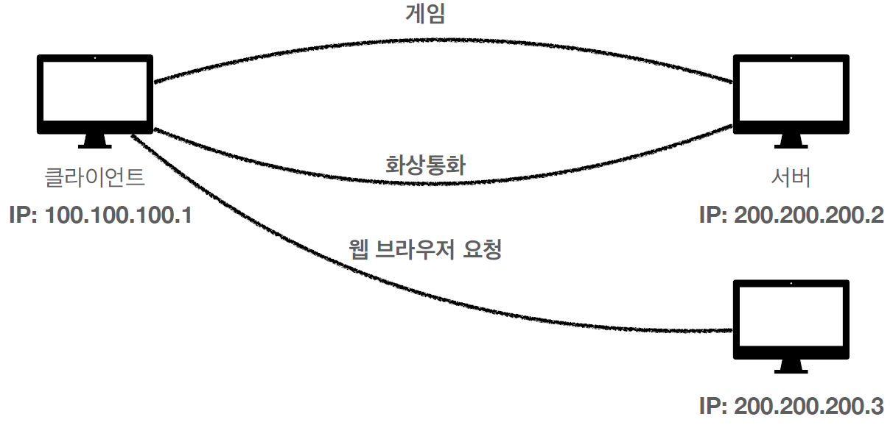

# 인터넷 네트워크

# 인터넷 네트워크
* toc
{:toc}

## 인터넷 통신
+ 인터넷에서 컴퓨터 둘 통신
  + 
+ 인터넷
  + 
+ 복잡한 인터넷 망
  + 

## IP(인터넷 프로토콜)
+ 인터넷 프로토콜 역할
  + 지정한 IP 주소(IP Address)에 데이터 전달
  + 패킷(Packet)이라는 통신 단위로 데이터 전달
+ IP 패킷 정보
  + 
+ 클라이언트 패킷 전달
  + 
+ 서버 패킷 전달
  + 
+ IP 프로토콜의 한계
  + 비연결성
    + 패킷을 받을 대상이 없거나 서비스 불능 상태여도 패킷 전송
  + 비신뢰성
    + 중간에 패킷이 사라지면?
    + 패킷이 순서대로 안오면?
  + 프로그램 구분
    + 같은 IP를 사용하는 서버에서 통신하는 애플리케이션이 둘 이상이면?
+ 대상이 서비스 불능, 패킷 전송
  + 
+ 패킷 소실
  + 
+ 패킷 전달 순서 문제 발생
  + 
  
## TCP UDP
+ 인터넷 프로토콜 스택의 4계층
  + 
+ 프로토콜 계층
  + 
  + 
+ IP 패킷 정보
  + 
+ TCP/IP 패킷 정보
  + 
+ TCP 특징
  + 전송 제어 프로토콜(Transmission Control Protocol)
  + 연결지향 - TCP 3 way handshake (가상 연결)
  + 데이터 전달 보증
  + 순서 보장
  + 신뢰할 수 있는 프로토콜
  + 현재는 대부분 TCP 사용
+ TCP 3 way handshake
  + 
  + SYN: 접속 요청
  + ACK: 요청 수락
  + 참고: 3. ACK와 함께 데이터 전송 가능
+ 데이터 전달 보증
  + 
+ 순서 보장
  + 
+ UDP 특징
  + 사용자 데이터그램 프로토콜(User Datagram Protocol)
  + 하얀 도화지에 비유(기능이 거의 없다)
  + 연결지향 - TCP 3 way handshake X
  + 데이터 전달 보증 X
  + 순서 보장 X
  + 데이터 전달 및 순서가 보장되지 않지만, 단순하고 빠름
  + 정리
    + IP와 거의 같다. +PORT +체크섬 정도만 추가
    + 애플리케이션에서 추가 작업 필요

## PORT
+ 한번에 둘 이상 연결해야 하면?
  + 
+ TCP/IP 패킷 정보
  + 
+ 패킷 정보
  + 
+ PORT - 같은 IP 내에서 프로세스 구분
  + 
+ PORT
  + 0 ~ 65535 할당 가능
  + 0 ~ 1023: 잘 알려진 포트, 사용하지 않는 것이 좋다
    + FTP - 20, 21
    + TELNET - 23
    + HTTP - 80
    + HTTPS - 443

## DNS
+ IP는 기억하기 어렵다.
+ IP는 변경될 수 있다.
+ DNS 도메인 네임 시스템(Domain Name System)
  + 전화번호부
  + 도메인 명을 IP 주소로 변환
+ DNS 사용
  + 
