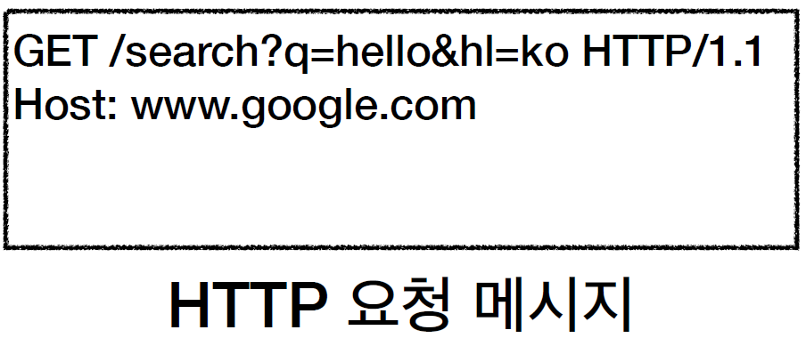

# URI와 웹 브라우저 요청 흐름

# URI와 웹 브라우저 요청 흐름
* toc
{:toc}

## URI(Uniform Resource Identifier)
+ URI는 로케이터(locator), 이름(name) 또는 둘 다 추가로 분류될 수 있다
+ [https://www.ietf.org/rfc/rfc3986.txt](https://www.ietf.org/rfc/rfc3986.txt)
+ 
+ 
+ Uniform: 리소스 식별하는 통일된 방식
+ Resource: 자원, URI로 식별할 수 있는 모든 것(제한 없다)
+ Identifier: 다른 항목과 구분하는데 필요한 정보
+ URL: Uniform Resource Locator
+ URN: Uniform Resource Name

### URL, URN
+ URL - Locator: 리소스가 있는 위치를 지정
+ URN - Name: 리소스에 이름을 부여
+ 위치는 변할 수 있지만, 이름은 변하지 않는다
+ urn:isbn:8960777331 (어떤 책의 isbn URN)
+ URN 이름만으로 실제 리소스를 찾을 수 있는 방법이 보편화 되지 않다

### URL-전체 문법
+ scheme://[userinfo@]host[:port][/path][?query][#fragment]
+ https://www.google.com/search?q=hello&hl=ko
+ 프로토콜(https)
+ 호스트명(www.google.com)
+ 포트 번호(443)
+ 패스(/search)
+ 쿼리 파라미터(q=hello&hl=ko)

### URL-scheme
+ 주로 프로토콜 사용
+ 프로토콜: 어떤 방식으로 자원에 접근할 것인가 하는 약속 규칙
  + 예) http, https, ftp 등등
+ http는 80 포트, https는 443 포트를 주로 사용, 포트는 생략 가능
+ https는 http에 보안 추가 (HTTP Secure)

### URL-userinfo
+ URL에 사용자정보를 포함해서 인증
+ 거의 사용하지 않는다

### URL-host
+ 호스트명
+ 도메인명 또는 IP 주소를 직접 사용가능

### URL-PORT
+ 포트(PORT)
+ 접속 포트
+ 일반적으로 생략, 생략시 http는 80, https는 443

### URL-path
+ 리소스 경로(path), 계층적 구조

### URL-query
+ key=value 형태
+ ?로 시작, &로 추가 가능 ?keyA=valueA&keyB=valueB
+ query parameter, query string 등으로 불린다, 웹서버에 제공하는 파라미터, 문자 형태

### URL-fragment
+ fragment
+ html 내부 북마크 등에 사용
+ 서버에 전송하는 정보 아니다

## 웹 브라우저 요청 흐름
+ 
+ 
+ HTTP 메시지 전송
  + 
+ 패킷 생성
  + 
  + 
+ 
+ 
