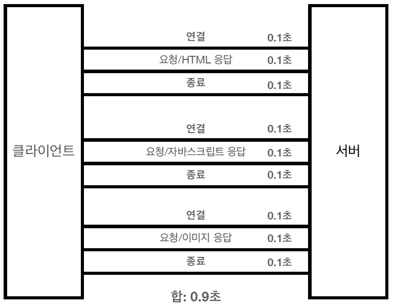
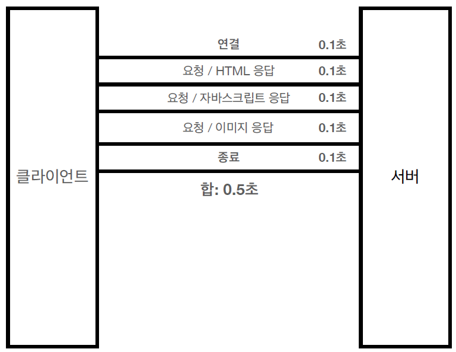
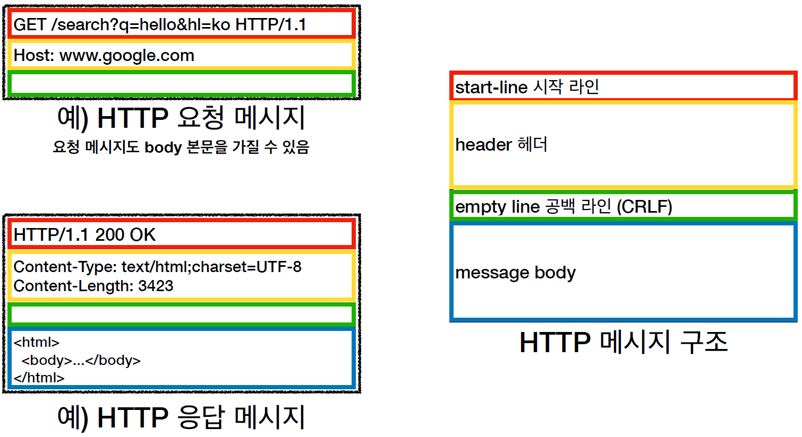
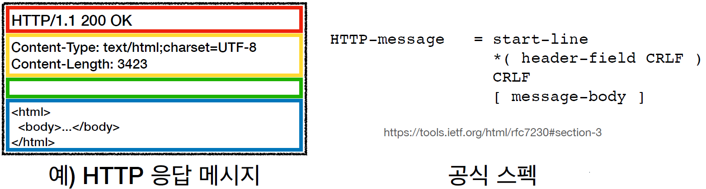
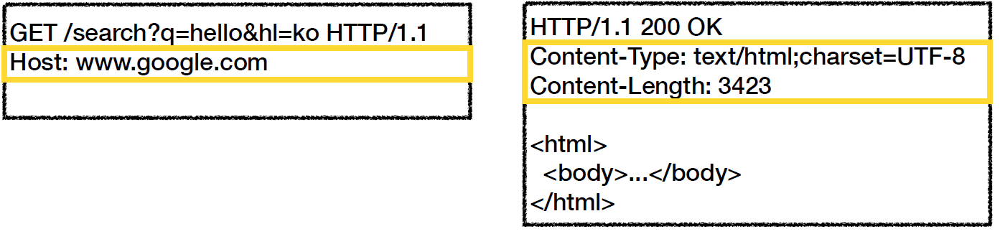

# HTTP (HyperText Transfer Protocol)

# HTTP (HyperText Transfer Protocol)
* toc
{:toc}

## 모든 것이 HTTP
HTTP 메시지에 모든 것을 전송
+ HTML, TEXT
+ IMAGE, 음성, 영상, 파일
+ JSON, XML (API)
+ 거의 모든 형태의 데이터 전송 가능
+ 서버간에 데이터를 주고 받을 때도 대부분 HTTP 사용

### HTTP 역사
+ HTTP/0.9 1991년: GET 메서드만 지원, HTTP 헤더X
+ HTTP/1.0 1996년: 메서드, 헤더 추가
+ HTTP/1.1 1997년: 가장 많이 사용, 우리에게 가장 중요한 버전
  + RFC2068 (1997) -> RFC2616 (1999) -> RFC7230~7235 (2014)
+ HTTP/2 2015년: 성능 개선
+ HTTP/3 진행중: TCP 대신에 UDP 사용, 성능 개선

### 기반 프로토콜
+ TCP: HTTP/1.1, HTTP/2
+ UDP: HTTP/3
+ 현재 HTTP/1.1 주로 사용
  + HTTP/2, HTTP/3 도 점점 증가

### HTTP 특징
+ 클라이언트 서버 구조
+ 무상태 프로토콜(스테이스리스), 비연결성
+ HTTP 메시지
+ 단순함, 확장 가능

## 클라이언트 서버 구조
+ Request Response 구조
+ 클라이언트는 서버에 요청을 보내고, 응답을 대기
+ 서버가 요청에 대한 결과를 만들어서 응답

## 무상태 프로토콜, 스테이스리스(Stateless)
+ 서버가 클라이언트의 상태를 보존X
+ 장점: 서버 확장성 높음(스케일 아웃)
+ 단점: 클라이언트가 추가 데이터 전송

### Stateful, Stateless 차이
+ 상태 유지
+ 무상태
+ 무상태는 응답 서버를 쉽게 바꿀 수 있다. -> 무한한 서버 증설 가능

### Stateless - 실무 한계
+ 모든 것을 무상태로 설계 할 수 있는 경우도 있고 없는 경우도 있다
+ 무상태
  + 예) 로그인이 필요 없는 단순한 서비스 소개 화면
+ 상태 유지
  + 예) 로그인
+ 로그인한 사용자의 경우 로그인 했다는 상태를 서버에 유지
+ 일반적으로 브라우저 쿠키와 서버 세션등을 사용해서 상태 유지
+ 상태 유지는 최소한만 사용

## 비 연결성(connectionless)
+ HTTP는 기본이 연결을 유지하지 않는 모델
+ 일반적으로 초 단위의 이하의 빠른 속도로 응답
+ 1시간 동안 수천명이 서비스를 사용해도 실제 서버에서 동시에 처리하는 요청은 수십개 이하로 매우 작다
  + 예) 웹 브라우저에서 계속 연속해서 검색 버튼을 누르지는 않는다
+ 서버 자원을 매우 효율적으로 사용할 수 있음

### 한계와 극복
+ TCP/IP 연결을 새로 맺어야 함 - 3 way handshake 시간 추가
+ 웹 브라우저로 사이트를 요청하면 HTML 뿐만 아니라 자바스크립트, css, 추가 이미지 등 수 많은 자원이 함께 다운로드
+ 지금은 HTTP 지속 연결(Persistent Connections)로 문제 해결
+ HTTP/2, HTTP/3에서 더 많은 최적화

### HTTP 초기 - 연결, 종료 낭비

### HTTP 지속 연결(Persistent Connections)

### 스테이스리스를 기억하자
서버 개발자들이 어려워하는 업무
+ 같은 시간에 딱 맞추어 발생하는 대용량 트래픽
+ 예) 선착순 이벤트, 명절 KTX 예약, 학과 수업 등록
+ 예) 저녁 6:00 선착순 1000명 치킨 할인 이벤트 -> 수만명 동시 요청

## HTTP 메시지
+ 
+ 

### 시작 라인
+ 요청 메시지
  + start-line = __request-line__ / status-line
  + request-line = method SP(공백) request-target SP HTTP-version CRLF(엔터)
  + HTTP 메서드 (GET: 조회)
  + 요청 대상 (/search?q=hello&hl=ko)
  + HTTP Version
+ 요청 메시지 - HTTP 메서드
  + 종류: GET, POST, PUT, DELETE...
  + 서버가 수행해야 할 동작 지정
    + GET: 리소스 조회
    + POST: 요청 내역 처리
+ 요청 메시지 - 요청 대상
  + absolute-path[?query] (절대경로[?쿼리])
  + 절대경로= "/" 로 시작하는 경로
  + 참고: *, http://...?x=y 와 같이 다른 유형의 경로지정 방법도 있다.
+ 요청 메시지 - HTTP 버전 
  + HTTP Version
+ 응답 메시지
  + start-line = request-line / __status-line__
  + status-line = HTTP-version SP status-code SP reason-phrase CRLF
  + HTTP 버전
  + HTTP 상태 코드: 요청 성공, 실패를 나타낸다
    + 200: 성공
    + 400: 클라이언트 요청 오류
    + 500: 서버 내부 오류
  + 이유 문구: 사람이 이해할 수 있는 짧은 상태 코드 설명 글

### HTTP 헤더
+ header-field = field-name ":" OWS field-value OWS (OWS:띄어쓰기 허용)
+ field-name은 대소문자 구문 없음
+ 
+ 용도
  + HTTP 전송에 필요한 모든 부가정보
  + 예) 메시지 바디의 내용, 메시지 바디의 크기, 압축, 인증, 요청 클라이언트(브라우저) 정보,
    서버 애플리케이션 정보, 캐시 관리 정보...
  + 표준 헤더가 너무 많다
    + [https://en.wikipedia.org/wiki/List_of_HTTP_header_fields](https://en.wikipedia.org/wiki/List_of_HTTP_header_fields)
  + 필요시 임의의 헤더 추가 가능
    + helloworld: hihi

### HTTP 메시지 바디
+ 용도
  + 실제 전송할 데이터
  + HTML 문서, 이미지, 영상, JSON 등등 byte로 표현할 수 있는 모든 데이터 전송 가능

### 단순함 확장 가능
+ HTTP는 단순하다.
+ HTTP 메시지도 매우 단순
+ 크게 성공하는 표준 기술은 단순하지만 확장 가능한 기술

