# HTTP 헤더1 일반 헤더

# HTTP 헤더1 일반 헤더
* toc
{:toc}

## HTTP 헤더 개요
+ HTTP 표준
  + 1999년 RFC2616 폐기됨
  + 2014년 RFC7230~7235 등장
+ RFC723x 변화
  + 엔티티(Entity) -> 표현(Representation)
  + Representation = representation Metadata + Representation Data
  + 표현 = 표현 메타데이터 + 표현 데이터

### HTTP 헤더
+ header-field = field-name ":" OWS field-value OWS (OWS:띄어쓰기 허용)
+ field-name은 대소문자 구문 없음
+ 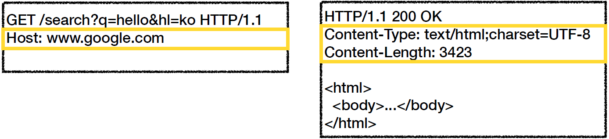
+ 용도
  + HTTP 전송에 필요한 모든 부가정보
  + 예) 메시지 바디의 내용, 메시지 바디의 크기, 압축, 인증, 요청 클라이언트, 서버 정보, 캐시 관리 정보...
  + 표준 헤더가 너무 많다
    + [https://en.wikipedia.org/wiki/List_of_HTTP_header_fields](https://en.wikipedia.org/wiki/List_of_HTTP_header_fields)
  + 필요시 임의의 헤더 추가 가능
+ 분류 - RFC2616(과거)
  + 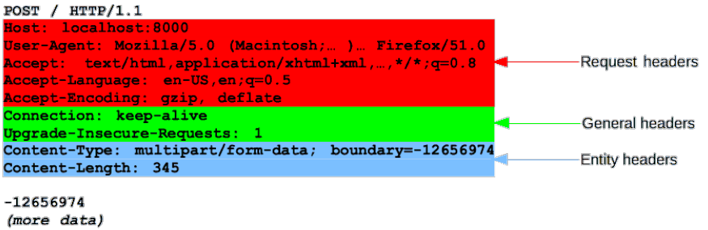
  + 헤더 분류
    + General 헤더: 메시지 전체에 적용되는 정보, 예) Connection: close
    + Request 헤더: 요청 정보, 예) User-Agent: Mozilla/5.0 (Macintosh; ..)
    + Response 헤더: 응답 정보, 예) Server: Apache
    + Entity 헤더: 엔티티 바디 정보, 예) Content-Type: text/html, Content-Length: 3423

### HTTP BODY
+ message body - RFC2616(과거)
  + 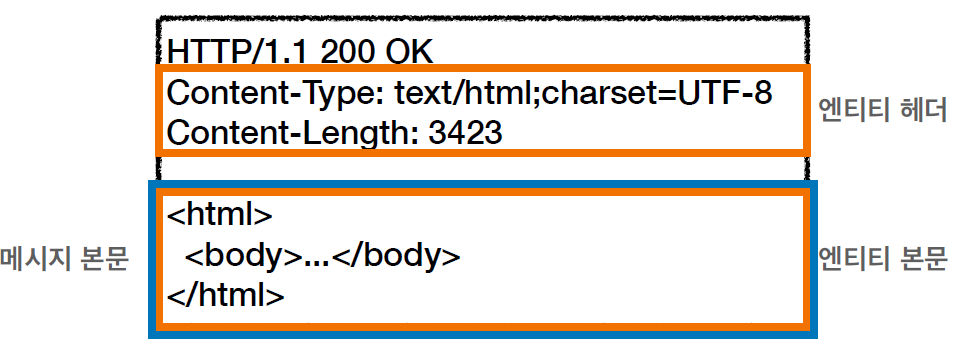
  + 메시지 본문(message body)은 엔티티 본문(entity body)을 전달하는데 사용
  + 엔티티 본문은 요청이나 응답에서 전달할 실제 데이터
  + 엔티티 헤더는 엔티티 본문의 데이터를 해석할 수 있는 정보 제공
    + 데이터 유형(html, json), 데이터 길이, 압축 정보 등등
+ message body - RFC7230(최신)
  + 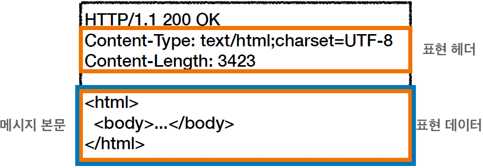
  + 메시지 본문(message body)을 통해 표현 데이터 전달
  + 메시지 본문 = 페이로드(payload)
  + 표현은 요청이나 응답에서 전달할 실제 데이터
  + 표현 헤더는 표현 데이터를 해석할 수 있는 정보 제공
    + 데이터 유형(html, json), 데이터 길이, 압축 정보 등등
  
## 표현
+ 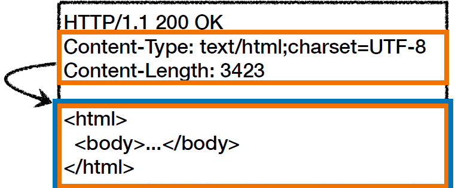
+ Content-Type: 표현 데이터의 형식
+ Content-Encoding: 표현 데이터의 압축 방식
+ Content-Language: 표현 데이터의 자연 언어
+ Content-Length: 표현 데이터의 길이
+ 표현 헤더는 전송, 응답 둘다 사용

### Content-Type
표현 데이터의 형식 설명
+ 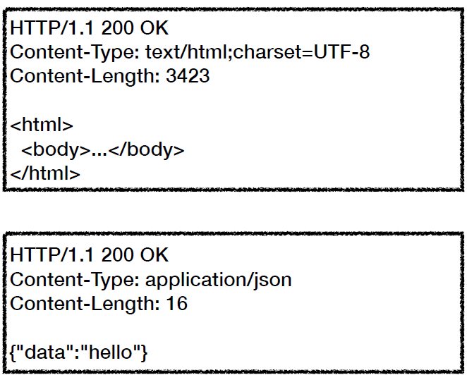
+ 미디어 타입, 문자 인코딩
+ 예)
  + text/html; charset=utf-8
  + application/json
  + image/png

### Content-Encoding
표현 데이터 인코딩
+ 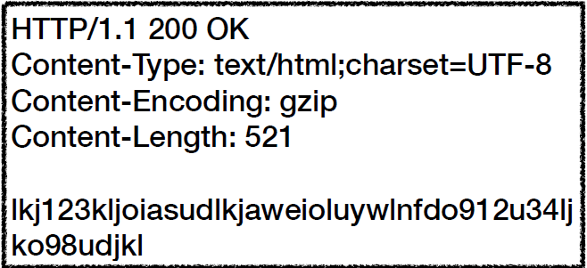
+ 표현 데이터를 압축하기 위해 사용
+ 데이터를 전달하는 곳에서 압축 후 인코딩 헤더 추가
+ 데이터를 읽는 쪽에서 인코딩 헤더의 정보로 압축 해제
+ 예)
  + gzip
  + deflate
  + identity

### Content-Language
표현 데이터의 자연 언어
+ 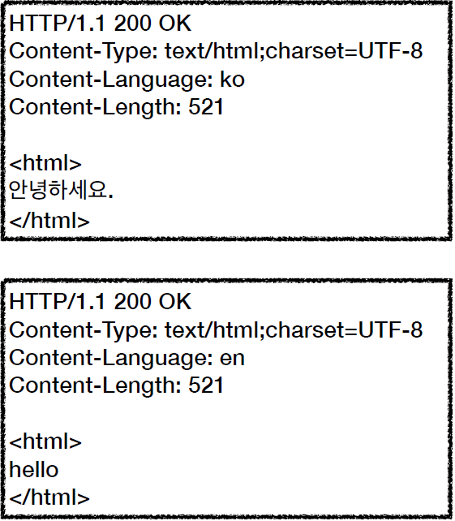
+ 표현 데이터의 자연 언어를 표현
+ 예)
  + ko
  + en
  + en-US

### Content-Length
표현 데이터의 길이
+ 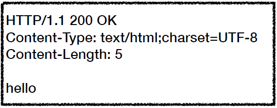
+ 바이트 단위
+ Transfer-Encoding(전송 코딩)을 사용하면 Content-Length를 사용하면 안된다

## 협상(콘텐츠 네고시에이션)
클라이언트가 선호하는 표현 요청
+ Accept: 클라이언트가 선호하는 미디어 타입 전달
+ Accept-Charset: 클라이언트가 선호하는 문자 인코딩
+ Accept-Encoding: 클라이언트가 선호하는 압축 인코딩
+ Accept-Language: 클라이언트가 선호하는 자연 언어
+ 협상 헤더는 요청시에만 사용
+ Accept-Language 적용 전
  + 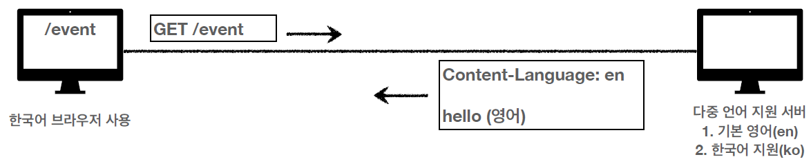
+ Accept-Language 적용 후
  + 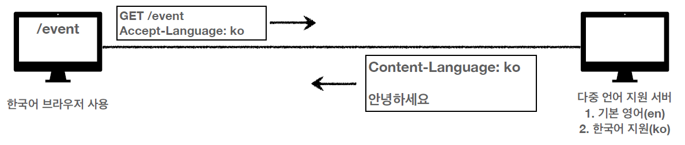
+ Accept-Language 복잡한 예시
  + 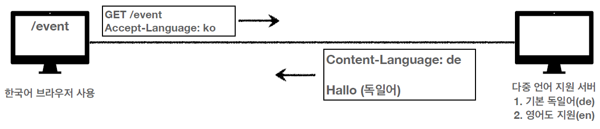

### 협상과 우선순위1
Quality Values(q)
+ 
+ Quality Values(q) 값 사용
+ 0~1, 클수록 높은 우선순위
+ 생략하면 1
  1. Accept-Language: ko-KR,ko;q=0.9,en-US;q=0.8,en;q=0.7
  2. ko-KR;q=1 (q생략)
  3. ko;q=0.9
  4. en-US;q=0.8
  5. en:q=0.7
  
+ Accept-Language 복잡한 예시
  + 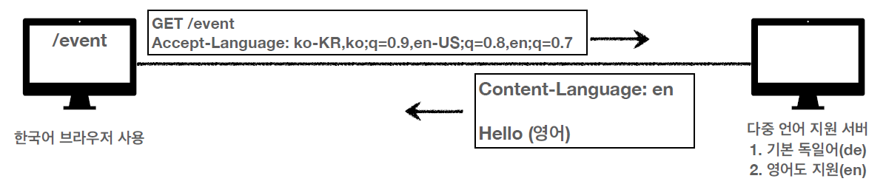

### 협상과 우선순위2
Quality Values(q)
+ 
+ 구체적인 것이 우선한다
+ Accept: text/*, text/plain, text/plain;format=flowed, */*
  1. text/plain;format=flowed
  2. text/plain
  3. text/*
  4. */*

### 협상과 우선순위3
Quality Values(q)
+ 구체적인 것을 기준으로 미디어 타입을 맞춘다
+ Accept: text/*;q=0.3, text/html;q=0.7, text/html;level=1, text/html;level=2;q=0.4, */*;q=0.5
+ 

## 전송 방식
+ Transfer-Encoding
+ Range, Content-Range

### 전송 방식 설명
+ 단순 전송
+ 압축 전송
+ 분할 전송
+ 범위 전송

### 단순 전송
+ Content-Length
+ 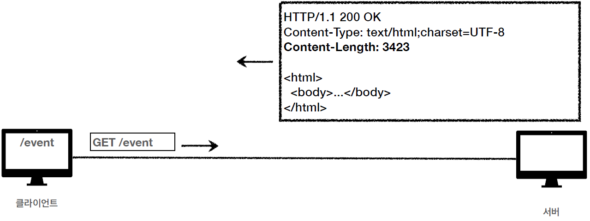

### 압축 전송
+ Content-Encoding
+ 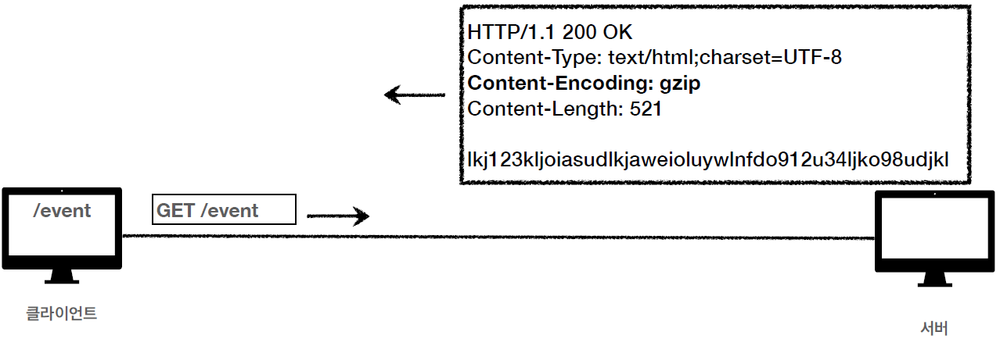

### 분할 전송
+ Transfer-Encoding
+ 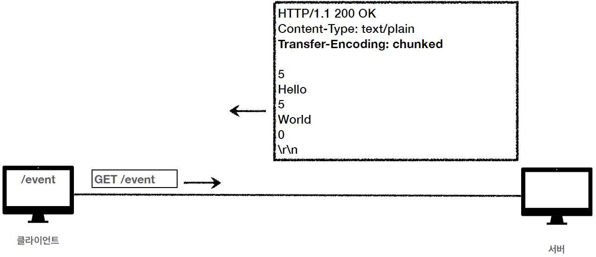

### 범위 전송
+ Range, Content-Range
+ 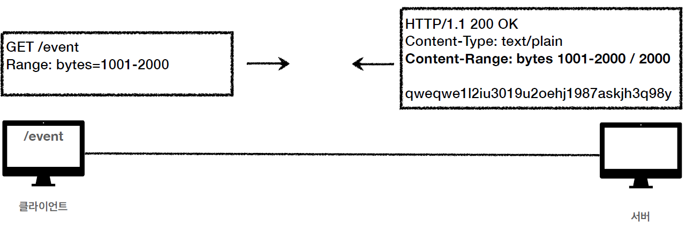

## 일반 정보
+ From: 유저 에이전트의 이메일 정보
+ Referer: 이전 웹 페이지 주소
+ User-Agent: 유저 에이전트 애플리케이션 정보
+ Server: 요청을 처리하는 오리진 서버의 소프트웨어 정보
+ Date: 메시지가 생성된 날짜

### From
유저 에이전트의 이메일 정보
+ 일반적으로 잘 사용되지 않는다
+ 검색 엔진 같은 곳에서, 주로 사용
+ 요청에서 사용

### Referer
이전 웹 페이지 주소
+ 현재 요청된 페이지의 이전 웹 페이지 주소
+ A -> B로 이동하는 경우 B를 요청할 때 Referer: A 를 포함해서 요청
+ Referer를 사용해서 유입 경로 분석 가능
+ 요청에서 사용
+ 참고: referer는 단어 referrer의 오타

### User-Agent
유저 에이전트 애플리케이션 정보
+ user-agent: Mozilla/5.0 (Macintosh; Intel Mac OS X 10_15_7) AppleWebKit/
  537.36 (KHTML, like Gecko) Chrome/86.0.4240.183 Safari/537.36
+ 클리이언트의 애플리케이션 정보(웹 브라우저 정보, 등등)
+ 통계 정보
+ 어떤 종류의 브라우저에서 장애가 발생하는지 파악 가능
+ 요청에서 사용

### Server
요청을 처리하는 ORIGIN 서버의 소프트웨어 정보
+ Server: Apache/2.2.22 (Debian)
+ server: nginx
+ 응답에서 사용

### Date
메시지가 발생한 날짜와 시간
+ Date: Tue, 15 Nov 1994 08:12:31 GMT
+ 응답에서 사용

## 특별한 정보
+ Host: 요청한 호스트 정보(도메인)
+ Location: 페이지 리다이렉션
+ Allow: 허용 가능한 HTTP 메서드
+ Retry-After: 유저 에이전트가 다음 요청을 하기까지 기다려야 하는 시간

### Host
요청한 호스트 정보(도메인)
+ 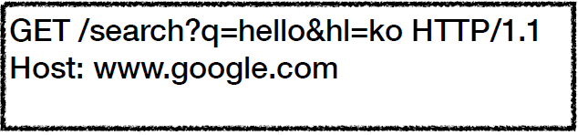
+ 요청에서 사용
+ 필수 
+ 하나의 서버가 여러 도메인을 처리해야 할 때
+ 하나의 IP 주소에 여러 도메인이 적용되어 있을 때
+ 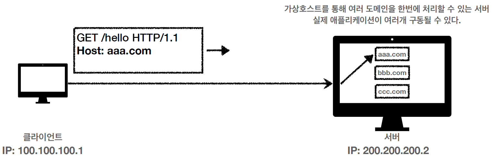

### Location
페이지 리다이렉션
+ 웹 브라우저는 3xx 응답의 결과에 Location 헤더가 있으면, Location 위치로 자동 이동 (리다이렉트)
+ 201 (Created): Location 값은 요청에 의해 생성된 리소스 URI
+ 3xx (Redirection): Location 값은 요청을 자동으로 리디렉션하기 위한 대상 리소스를 가리킨다

### Allow
허용 가능한 HTTP 메서드
+ 405 (Method Not Allowed) 에서 응답에 포함해야함
+ Allow: GET, HEAD, PUT

### Retry-After
유저 에이전트가 다음 요청을 하기까지 기다려야 하는 시간
+ 503 (Service Unavailable): 서비스가 언제까지 불능인지 알려줄 수 있다
+ Retry-After: Fri, 31 Dec 1999 23:59:59 GMT (날짜 표기)
+ Retry-After: 120 (초단위 표기)

## 인증
+ Authorization: 클라이언트 인증 정보를 서버에 전달
+ WWW-Authenticate: 리소스 접근시 필요한 인증 방법 정의

### Authorization
클라이언트 인증 정보를 서버에 전달
+ Authorization: Basic xxxxxxxxxxxxxxxx

### WWW-Authenticate
리소스 접근시 필요한 인증 방법 정의
+ 리소스 접근시 필요한 인증 방법 정의
+ 401 Unauthorized 응답과 함께 사용
+ WWW-Authenticate: Newauth realm="apps", type=1, title="Login to \"apps\"", Basic realm="simple"

## 쿠키
+ Set-Cookie: 서버에서 클라이언트로 쿠키 전달(응답)
+ Cookie: 클라이언트가 서버에서 받은 쿠키를 저장하고, HTTP 요청시 서버로 전달

### Stateless
+ HTTP는 무상태(Stateless) 프로토콜이다
+ 클라이언트와 서버가 요청과 응답을 주고 받으면 연결이 끊어진다
+ 클라이언트가 다시 요청하면 서버는 이전 요청을 기억하지 못한다
+ 클라이언트와 서버는 서로 상태를 유지하지 않는다

### 쿠키 사용 예제
+ 로그인
  + 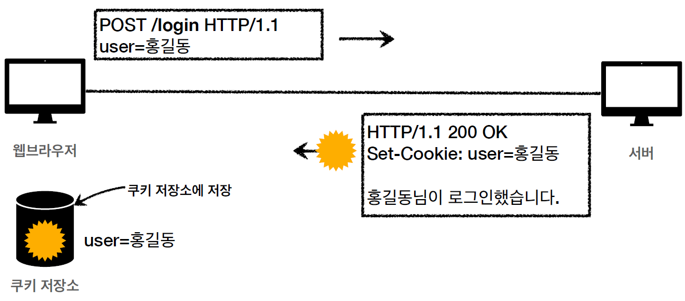
+ 로그인 이후
  + 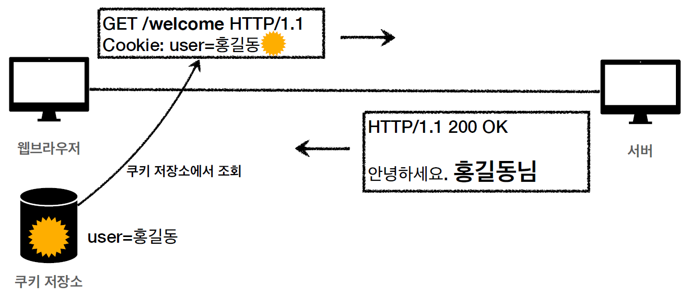
+ 모든 요청에 쿠키 정보 자동 포함
  + 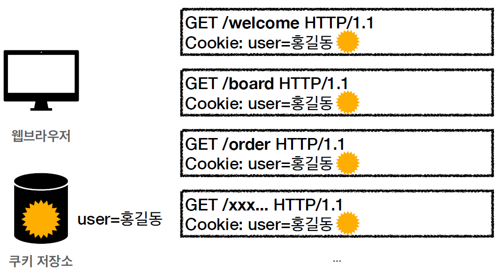

### 쿠키 특징
+ 예) set-cookie: sessionId=abcde1234; expires=Sat, 26-Dec-2020 00:00:00 GMT; path=/; domain=.google.com; Secure
+ 사용처
  + 사용자 로그인 세션 관리
  + 광고 정보 트래킹
+ 쿠키 정보는 항상 서버에 전송됨
  + 네트워크 트래픽 추가 유발
  + 최소한의 정보만 사용(세션 id, 인증 토큰)
  + 서버에 전송하지 않고, 웹 브라우저 내부에 데이터를 저장하고 싶으면 웹 스토리지 (localStorage, sessionStorage) 참고
+ 주의!
  + 보안에 민감한 데이터는 저장하면 안됨(주민번호, 신용카드 번호 등등)

### 쿠키 - 생명주기
Expires, max-age
+ Set-Cookie: expires=Sat, 26-Dec-2020 04:39:21 GMT
  + 만료일이 되면 쿠키 삭제
+ Set-Cookie: max-age=3600 (3600초)
  + 0이나 음수를 지정하면 쿠키 삭제
+ 세션 쿠키: 만료 날짜를 생략하면 브라우저 종료시 까지만 유지
+ 영속 쿠키: 만료 날짜를 입력하면 해당 날짜까지 유지

### 쿠키 - 도메인
Domain
+ 예) domain=example.org
+ 명시: 명시한 문서 기준 도메인 + 서브 도메인 포함
  + domain=example.org를 지정해서 쿠키 생성
    + example.org는 물론이고
    + dev.example.org도 쿠키 접근
+ 생략: 현재 문서 기준 도메인만 적용
  + example.org 에서 쿠키를 생성하고 domain 지정을 생략
    + example.org 에서만 쿠키 접근
    + dev.example.org는 쿠키 미접근

### 쿠키 - 경로
Path
+ 예) path=/home
+ 이 경로를 포함한 하위 경로 페이지만 쿠키 접근
+ 일반적으로 path=/ 루트로 지정
+ 예)
  + path=/home 지정
    + /home -> 가능
    + /home/level1 -> 가능
    + /home/level1/level2 -> 가능
    + /hello -> 불가능

### 쿠키 - 보안
Secure, HttpOnly, SameSite
+ Secure
  + 쿠키는 http, https를 구분하지 않고 전송
  + Secure를 적용하면 https인 경우에만 전송
+ HttpOnly
  + XSS 공격 방지
  + 자바스크립트에서 접근 불가(document.cookie)
  + HTTP 전송에만 사용
+ SameSite
  + XSRF 공격 방지
  + 요청 도메인과 쿠키에 설정된 도메인이 같은 경우만 쿠키 전송

