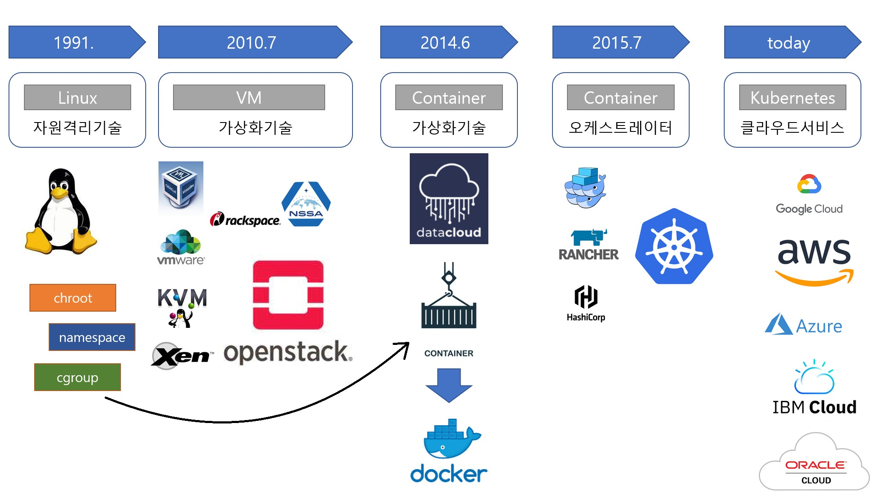

# Introduction

# Introduction

* toc
{:toc}

## 쿠버네티스
+ 자원을 효율적으로 사용하여 관리 및 운영 비용 최소화
+ Kubernetes를 큰 기업들이 꼭 써야 되는 이유는 대규모의 서비스를 운영하고 있기 때문에 최대한 자원을 효율적으로 써야 비용적으로 유리하다
+ 서버 자원을 효율적으로 쓰기 위해서는 가상화 기술에 대해 관심을 가질 수밖에 없는데 Kubernetes를 좀 더 잘 이해하려면 이런 가상화 기술들에 대한 히스토리를 알 필요가 있다 
+ 

## 가상화 기술들에 대한 히스토리
+ 
+ 최초의 리눅스 시스템이 나왔을 무렵부터 그리고 이 시스템에 대한 꾸준한 개발을 통해서 리눅스에는 자원들을 격리해서 프로세스들이 독립적인 환경에서 돌아가도록 해주는 기술들이 있었다 근데 이 기술들은 사용하기에 좀 어려워서 대중적으로는 사용되지 않고 있다
+ 이 기술과는 별개로 VM 가상화 기술이 기업들은 물론 일반인들에게까지 쉽게 vm을 가상화할 수 있을 정도로 발전이 됐다.
+ 2010년 7월에 락스페이스라는 클라우드 기업과 미국 나사에서 오픈스택이라는 vm을 가상화 시켜주는 오픈스스까지 등장을 하게 된다.
  + 이 당시 오픈 스택에 대한 개발이나 스폰서 활동이 활발하게 진행됐기 때문에 선진 기업들은 너도 나도 이걸 가지고 자신의 운영 환경을 자동화 시키려고 시도를 하게 됐다 
  + 근데 하다보니 자동화는 되는 것 같은데 생각보다 시스템 효율이 안 나는 걸 느끼게 된다
  + 가장 큰 원인을 제공하는 게 VM을 가상화하기 위해서 무거운 OS를 띄워야 한다는 근본적인 부분이고. 가벼운 서비스를 하나 띄우기 위해서 이거보다 더 큰 OS를 띄워야 하는 경우도 생기게 된다
+ 이럴 때쯤 다크라우더라는 회사가 예전 리눅스의 어려운 자원 격리 기술을 컨테이너라는 개념으로 누구나 쉽게 사용할 수 있게 만들었고 회사를 Docker라고 변경하면서 이 기술을 Open Source로 공개를 했다.
  + 컨테이너 가상화 기술은 서비스 간에 자원을 격리하는데 OS를 별도로 안 띄워도 된다.
  + os 기동 시간이 없기 때문에 자동화 시에 엄청 빠르고 자원효율도 매우 높다
+ 이때부터 도커가 유명세를 잡고 근데 도커 자체는 하나의 서비스를 컨테이너로 가상화 시켜서 배포를 하는 거지 엄청 많은 서비스들을 운영을 할 때 그걸 일일이 배포하고 운영하는 역할을 해주지 않는다
  + 이런 걸 해주는 게 컨테이너 오케스트레이터 라는 개념이다
  + 여러 컨테이너들을 관리해주는 솔루션이라고 보면 되는데 도커의 컨테이너 기술이 오픈소스이기 때문에 많은 회사들이 이걸 가지고 저마다의 오케스트레이터를 내놓게 된다.
+ 쿠버네티스가 릴리즈 버전을 내놓은 건 다른 회사보다 조금 늦었다
+ 이 시기에 각 기업들은 이런 여러 오케스트레이터들 중에 뭘 쓸지 선택을 해야 됐다
+ 쿠버네티스는 구글에서 주도를 했지만 해당 프로젝트의 여러 업체들이 참여해서 저마다의 시스템 운영 노하우들을 여기에 다 녹여내서인지 기업들은 쿠버네티스를 사용 후에 만족도가 매우 높았고 그래서 쿠버네티스에 대한 관심은 타 오케스트레이터들에 비해 기하급수적으로 증가하게 된다
+ 현재 Kubernetes가 서비스 배포 운영의 표준으로 자리 잡아가고 있고 이 기술 바탕으로 많은 클라우드 서비스를 제공하는 기업들은 Kubernetes 환경이 설치되어 있는 인프라를 서비스하고 있다.
+ 그래서 우리는 Kubernetes를 별도로 설치할 필요 없이 클라우드 서비스를 사용해도 되고 오픈소스이기 때문에 직접 설치해서 자신의 운영 환경에 맞게 최적화 시킬 수도 있다.

## 컨테이너 오케스트레이터
+ 컨테이너
  + 운영체제 수준의 가상화 기술로 리눅스 커널을 공유하면서 프로세스를 격리된 환경에서 실행하는 기술
+ 컨테이너 오케스트레이션
  + 컨테이너의 배포, 관리, 확장, 네트워킹을 자동화 하는 기술
