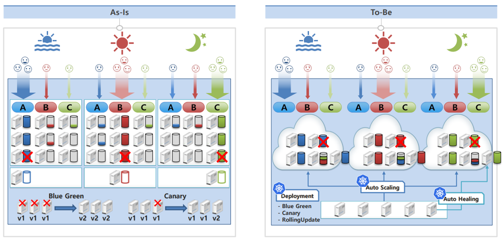
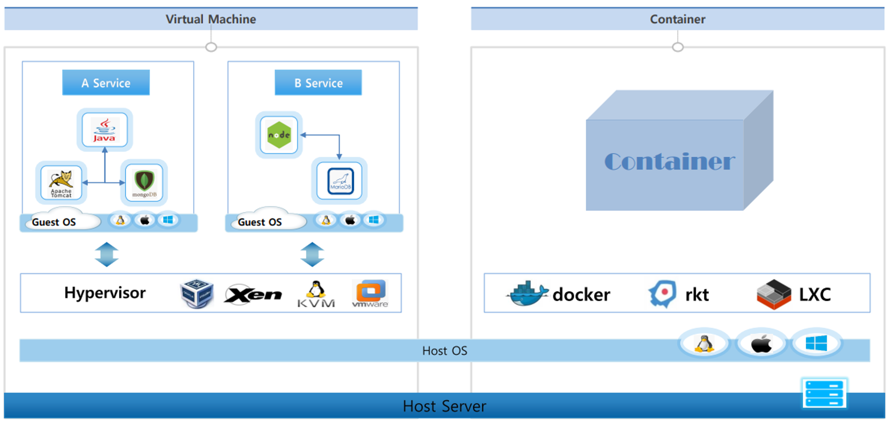
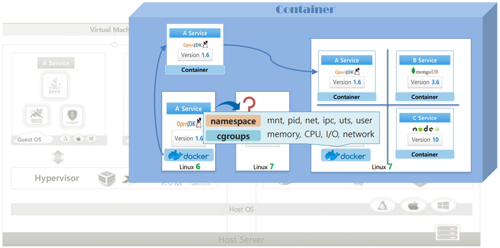
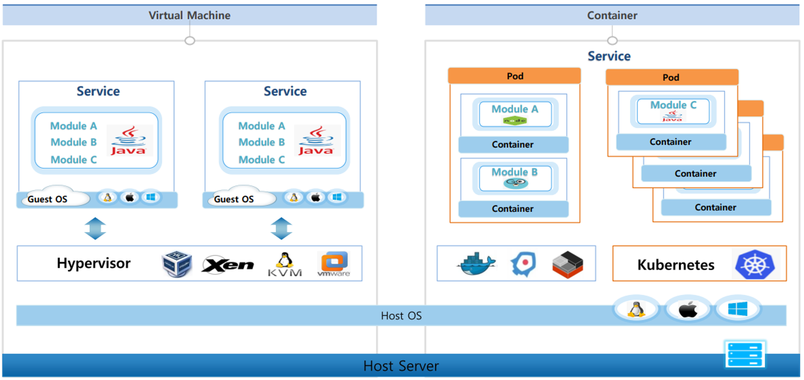
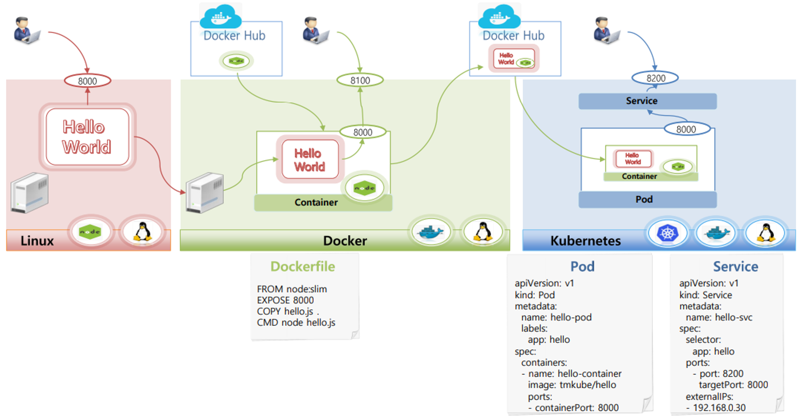
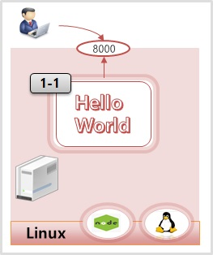
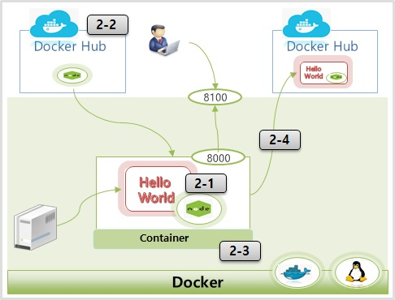
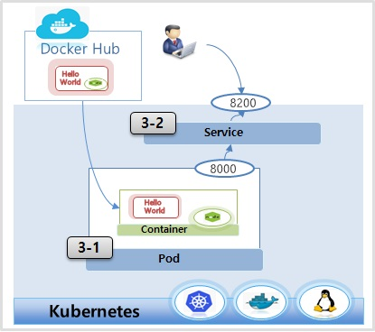
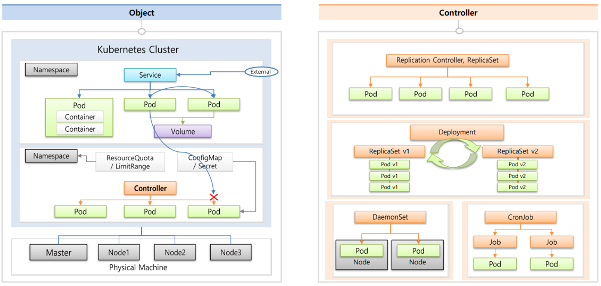

# 기초 다지기

# 기초 다지기

* toc
{:toc}

## Why Kubernetes? 
+ 어떤 서비스든 원활하게 유지되기 위해서 충분한 서버 자원들이 뒷받침되어야 한다 
+ 기업 입장에서도 미리 트래핑 양을 예측하기도 어려울 거고 엄청 많은 자원들을 준비해놓기에도 비용적인 측면에서 쉽지 않을 것 이다.
+ 한 서비스만 운영하는 게 아니라 여러 서비스를 운영한다면 상황은 더더욱 어려워진다

### Kubernetes 문제 해결
+ 
+ 서비스 효율로 인해서 서버가 적어지면 그만큼 유지 보수 비용이 적어지게 되기 때문에 큰 기업들이 관심을 가질 수밖에 없다
+ 규모가 작은 운영 환경에서도 이 다양한 방식의 운영에 대해서 일일이 계산할 필요가 없기 때문에 많은 도움이 된다.

#### As-Is
+ A, B, C 각 서비스는 시간대 별로 필요한 자원이 유동적으로 바뀌지만, 서버 자원을 동적으로 변경할 수 없어 최대 부하를 견딜 수 있는 자원을 미리 준비 시켜야 한다.
+ 각 서비스별 장애 상황에 대비해 최소 하나의 백업 서버가 필요하기 때문에 3대의 서버가 추가로 필요하다.
+ 무 중단 서비스를 제공하기 위해 운영 배포 시 한 번에 한 대씩 서버 작업을 해야 한다.

#### To-Be
+ A, B, C 각 서비스는 auto scaling 기술을 통해 CPU, 메모리, 디스크, 네트워크 트래픽과 같은 시스템 자원들의 메트릭(metric) 값을 모니터링 하여 서버 자원을 자동으로 조절한다.
+ 장애가 발생한 서버에 있는 서비스들이 자동으로 다른 서버로 이동하는 auto healing 기능을 사용하기 때문에 다수의 백업 서버가 필요하지 않다.
+ deployment 오브젝트를 사용하여 무 중단 배포가 가능하다.

## VM vs Container
+ 
+ 한 서버에는 기본적으로 어떤 운영체제가 됐건 호스트 OS가 올라간다.

### VM
+ VM의 경우 이 호스트 OS 위에 VM을 가상화 시켜주기 위해서 여러하이퍼바이저들이 있다 이런 것들을 사용해서 또 원하는 운영체제로 게스트OS를 올려서 여러 VM들을 만들 수 있다
+ 게스트OS도 호스트OS와 똑같이 하나의 OS를 독립적으로 가지고 있는 것처럼 사용을 할 수가 있다 그래서 여러가지 어플리케이션들을 설치를 하고 각각의 서비스를 만들 수가 있다

### Container
+ os 위에 컨테이너 가상화를 시켜주는 여러가지 소프트웨어들이 있다 현재 도커를 가장 많이 사용하고 있는 추세다 도커가 컨테이너라는 걸 만들어주게된다
+ 
+ 리눅스마다 버전이 있고 이 버전에 따라서 기본적으로 설치되는 라이브러리들이 다르다
+ 만약 리눅스 6버전에서 개발을 하다보면 리눅스 6버전에 설치되어 있는 OpenJDK 라이브러리를 자연스럽게 사용을 하게 된다
+ 개발이 완료되고 이걸 리눅스 7버전에서 띄우게 되면 분명 버전 차이에 따른 문제가 생긴다
+ 도커를 설치를 하고 이걸 통해서 컨테이너 이미지를 만들 수가 있는데 이 이미지에는 한 서비스와 그 서비스가 돌아가는 데 필요한 라이브러리들이 같이 있다
+ 리눅스 7 버전에 다른 라이브러리들이 있더라도 도커만 설치되어 있으면 이 컨테이너 이미지를 가져와서 사용했을 때 A서비스는 자신의 이미지 안에 있는 OpenStack 라이브러리를 사용하기 때문에 안정적으로 시스템을 구동할 수가 있다. Docker가 그렇게 작동을 하도록 해준다
+ 또 Docker가 해주는 일이 여러 컨테이너들 간에 호스트 자원을 분리해서 쓰도록 해주는데. 이게 Linux 고유 기술인 Namespace와 Cgroup을 사용해서 격리 한다 
+ Namespace는 커널에 관련된 영역을 분리를 해주고 Cgroup은 자원에 대한 영역을 분리해주는 역할을 한다

+ 정리
  + 도커와 같이 컨테이너 가상화 솔루션들은 OS에서 제공하는 자원 격리 기술을 이용을 해서 컨테이너라는 단위로 서비스를 분리를 할 수 있게 만들어준다.
  + 이걸 사용하면 컨테이너 가상화가 깔려있는 OS에서는 개발 환경에 대한 걱정 없이 배포가 가능하게 된다

+ 시스템 구조적으로 컨테이너는 한 OS를 공유를 하는 개념이고 VM은 각각의 OS를 띄워야 하는 구조이기 때문에 컨테이너가 훨씬 빠를 수밖에 없다.

#### VM 특징 
+ Host OS 로 Window 를 사용하고 있어도 Guest OS 로 Linux 를 설치해서 사용할 수 있다.
+ Guest OS 를 설치하기 때문에 느린 속도 
+ Guest OS 가 보안에 뚫여도 Host OS 와 분리되어 있기 때문에 각각 VM 간 피해가 없다

#### Container 특징
+ Host OS 와 다른 OS 의 Container 사용 불가능
+ Guest OS 를 사용하지 않기 때문에 빠른 속도
+ 하나의 Container 가 보안에 뚫려 Host OS 에 접근하게 되면 다른 Container 들도 위험하다.

### 시스템 개발 관점에서 VM 과 Container 의 다른 점
+ 

#### VM
+ 일반적으로 한 서비스를 만들 때 한 가지 언어를 사용을 해서 여러 모듈들이 한 서비스로 같이 돌아간다
+ 만약 A와 B 모듈은 괜찮은데 C 모듈에 부하가 많이 가는 상황이라고 하면은 VM을 하나 더 생성을 해서 띄우게 된다 
+ 자원 사용과 성능 입장에서 게스트OS가 2개가 올라가고 A와 B는 사실상 확장을 할 필요가 없는데 한 패키지이기 때문에 그대로 따라 올라간다

#### Container
+ 컨테이너는 컨테이너를 얘기할 때 마이크로 서비스에 대한 얘기가 따라오는데 한 서비스를 만들 때 모듈별로 쪼개서 각각의 컨테이너에 담는 걸 권하고 있고 그 모듈에 맞는 최적화된 개발 언어를 사용하면 더 좋다고 얘기를 한다
+ 여기서 Kubernetes는 여러 컨테이너들을 한 파드라는 개념에 묶을 수가 있고 한 컨테이너만 파드에 담을 수가 있는데 한 파드가 하나의 배포 단위이다 그래서 내가 필요한 파드만 확장을 할 수가 있다. Kubernetes가 그걸 정말 쉽게 해준다.
+ 컨테이너는 시스템을 모듈별로 쪼개서 개발을 했을 때 큰 효과를 발휘할 수가 있다.

## Getting started - Kubernetes
+ 

### 실습 시나리오 
1. 리눅스 서버 작업
   1. 'Hello World' 를 출력하는 node.js 애플리케이션을 만든다 (이하 hello app)
   2. 리눅스 서버에는 node.js 를 실행할 수 있는 패키지가 설치되어 있는 상태
2. Docker 배포 작업
   1. 리눅스 서버로부터 hello app 복사
   2. 이 서버에는 node 가 설치되어 있지 않아 실행안된다 
   3. Docker Hub 에서 node.js 를 실행할 수 있는 컨테이너 이미지 다운로드
   4. hello app 을 하나의 컨테이너로 생성
   5. 새로 만든 컨테이너를 Docker 로 구동시켜 외부에서 서비스 할 수 있도록 오픈
3. Kubernetes 배포 작업
   1. 앞서 만든 컨테이너 Docker Hub 에 업로드
   2. Pod 와 Pod 안에 컨테이너를 만들 때 Docker Hub 에 업로드 한 이미지를 가져와서 Pod 구동

### Linux
+ 
+ CentOS에 nodejs 설치 :

~~~shell

yum install epel-release
yum -y install nodejs

~~~

+ hello.js

~~~javascript

var http = require('http');
var content = function(req, resp) {
 resp.end("Hello Kubernetes!" + "\n");
 resp.writeHead(200);
}
var w = http.createServer(content);
w.listen(8000);

~~~

~~~shell

node hello.js

~~~

### Docker
+ 
+ Dockerfile

~~~dockerfile

FROM node:slim
EXPOSE 8000
COPY hello.js .
CMD node hello.js

~~~

+ Docker Hub Site
  + [https://hub.docker.com/](https://hub.docker.com/)

+ Docker Container Run

~~~shell

docker build -t kubetm/hello .
-t : 레파지토리/이미지명:버전

docker images
docker run -d -p 8100:8000 kubetm/hello
-d : 백그라운드 모드
-p : 포트변경

docker ps
docker exec -it c403442e8a59 /bin/bash

~~~

+ Docker Image Push

~~~shell

docker login
docker push kubetm/hello

~~~

### Kubernetes
+ 
+ Pod

~~~yaml

apiVersion: v1
kind: Pod
metadata:
  name: hello-pod
  labels:
    app: hello
spec:
  containers:
  - name: hello-container
    image: kubetm/hello
    ports:
    - containerPort: 8000

~~~

+ Service

~~~yaml

#v1.27

apiVersion: v1
kind: Service
metadata:
  name: hello-svc
spec:
  selector:
    app: hello
  ports:
    - port: 8200
      targetPort: 8000
  externalIPs:
  - 192.168.56.30
    
#v1.15

apiVersion: v1
kind: Service
metadata:
   name: hello-svc
spec:
   selector:
      app: hello
   ports:
      - port: 8200
        targetPort: 8000
   externalIPs:
      - 192.168.0.30

~~~

## Kubernetes Overview
+ 
+ Kubernetes 는 한 대의 서버를 Master 로 사용하고 다른 서버는 Node 로 하나의 Master 에 다수의 Node 들이 연결 된다. 이렇게 연결 된 하나의 묶음이 Kubernetes Cluster 가 된다.
+ 마스터는 Kubernetes의 전반적인 기능들을 컨트롤하는 역할이고 이 노드들은 자원을 제공하는 역할인데 만약 클러스터 전체 자원을 늘리고 싶다면 노드들을 계속 추가하면 된다 
+ 클러스터 안에 Namespace라는 애가 Kubernetes 오브젝트들을 독립된 공간으로 분리되게 만들어준다 
+ Namespace에는 Kubernetes 최소 배포단위인 파드들이 있고 이 파드들에게 외부로부터 연결이 가능하도록 IP를 할당해주는 서비스가 있어서 연결을 할 수가 있는데 서로 다른 네임 스페이스에 있는 하드들에게는 연결을 할 수가 없다
+ 파드 안에는 여러 컨테이너들이 있다. 컨테이너 하나당 하나의 앱이 동작하기 때문에 결국 파드에는 여러 앱들이 돌아갈 수가 있다
+ 근데 파드에 문제가 생겨서 재 생성이 되면 그 안에 있는 데이터들이 날아간다. 그래서 볼륨을 만들어서 파드에 연결을 하면 데이터는 이곳에 별도로 저장할 수 있다. 하드가 재생성돼서 데이터가 날아가는 문제를 해결할 수가 있다
+ Namespace 에는 ResourceQuota 와 LimitRange 를 추가하여 하나의 Namespace 에서 사용 할 수 있는 자원의 양을 제한할 수 있다. 예를 들면 Pod 의 수,  CPU, 메모리 등 이 있다.
+ 파드 생성 시에 컨테이너 안에 환경 변수 값을 넣어준다든가 파일을 마운팅을 해줄수가 있는데 Configmap 이나 Secret 을 통해서 세팅을 할 수 있게 해준다.

### Controller
+ Controller 는 Pod 들을 관리하는 기능을 하는데 각각의 사용 용도에 따라 다양한 종류가 있다.

#### Replication Controller, Replica Set (가장 기본적인 Controller)
+ Pod 가 죽으면 다시 살려주거나 Pod 의 개수를 늘리거나 줄일 수 있다. (scale in, out)

#### Deployment
+ 배포 후 Pod 를 새로운 버전으로 업그레이드
+ 업그레이드 도중 문제가 생기면 rollback이 가능하다.

#### DaemonSet
+ 하나의 Node 에 Pod 가 하나씩만 유지되도록 한다. (이렇게 사용해야만 하는 Module 들이 있다.)

#### CronJob
+ 특정 작업만 하고 종료하는 작업을 할 때 Pod 가 그렇게 동작할 수 있도록 해준다.
