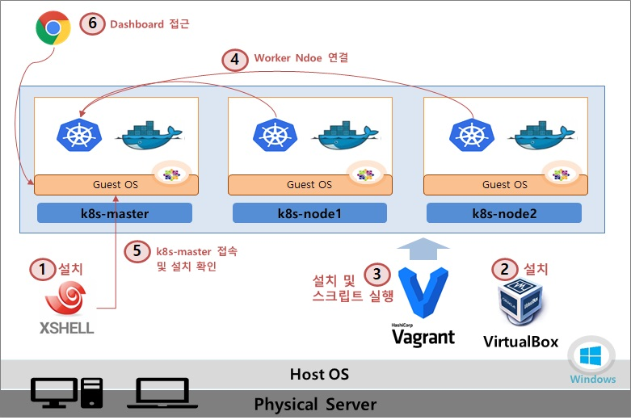
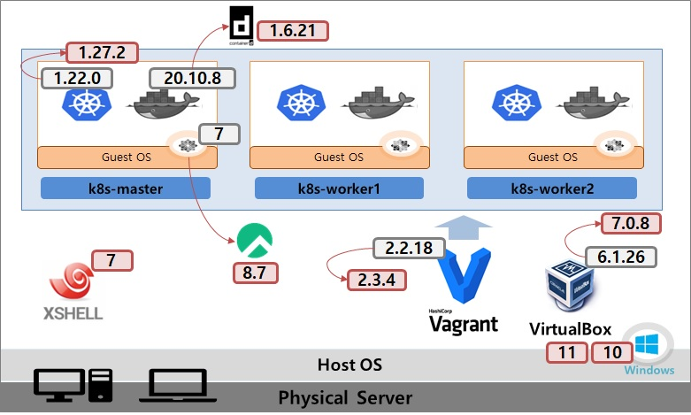
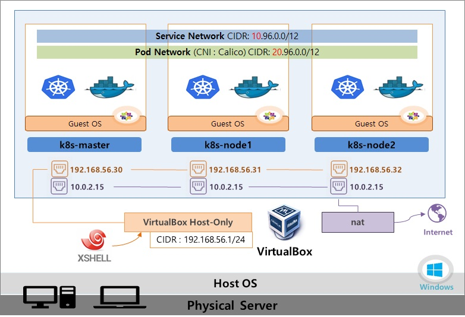

# 쿠버네티스 설치

# 쿠버네티스 설치

* toc
{:toc}

## 설치 가이드
1. XShell 설치 : 생성될 Master/Woker Node에 접속할 툴 (기존에 쓰고 있는게 있으면 생략가능)
   + 다운로드 url : [https://www.netsarang.com/en/free-for-home-school/](https://www.netsarang.com/en/free-for-home-school/)
2. VirtualBox 설치 : VM 및 내부 네트워크 생성 툴
   + Win 버전 : [https://download.virtualbox.org/virtualbox/7.0.8/VirtualBox-7.0.8-156879-Win.exe](https://download.virtualbox.org/virtualbox/7.0.8/VirtualBox-7.0.8-156879-Win.exe)
   + Mac 버전 : [https://download.virtualbox.org/virtualbox/7.0.8/VirtualBox-7.0.8-156879-OSX.dmg](shttps://download.virtualbox.org/virtualbox/7.0.8/VirtualBox-7.0.8-156879-OSX.dmg)
   + Download site : [https://www.virtualbox.org/wiki/Downloads](https://www.virtualbox.org/wiki/Downloads)
   + FAQ : microsoft visual 관련 에러 해결방법 [https://cafe.naver.com/kubeops/25](FAQ : microsoft visual 관련 에러 해결방법 https://cafe.naver.com/kubeops/25)
3. Vagrant 설치 및 k8s 설치 스크립트 실행 : 자동으로 VirtualBox를 이용해 VM들을 생성하고, K8S관련 설치 파일들이 실행됨
   + Win 버전 : [https://releases.hashicorp.com/vagrant/2.3.4/vagrant_2.3.4_windows_amd64.msi](https://releases.hashicorp.com/vagrant/2.3.4/vagrant_2.3.4_windows_amd64.msi)
   + Mac 버전 : [https://releases.hashicorp.com/vagrant/2.3.4/vagrant_2.3.4_darwin_amd64.dmg](https://releases.hashicorp.com/vagrant/2.3.4/vagrant_2.3.4_darwin_amd64.dmg)
   + Download site : [https://developer.hashicorp.com/vagrant/downloads?product_intent=vagrant](https://developer.hashicorp.com/vagrant/downloads?product_intent=vagrant)
4. Worker Node 연결 : Worker Node들을 Master에 연결하여 쿠버네티스 클러스터 구축
5. 설치 확인 : Node와 Pod 상태 조회
   + kubectl get pod -A
   + kubectl get nodes
6. 대시보드 접근 : Host OS에서 웹 브라우저를 이용해 클러스터 Dashboard에 접근

+ 
+ 
+ 
