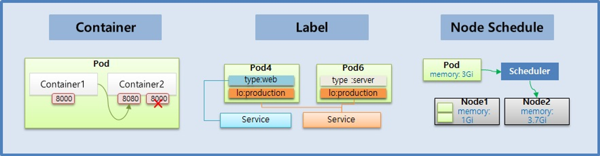

# 기본 오브젝트

# 기본 오브젝트

* toc
{:toc}

## Pod - Container, Label, NodeSchedule
+ 

### Pod
+ Pod의 특징을 보면 Pod 안에는 하나의 독립적인 서비스를 구동할 수 있는 컨테이너들이 있다
+ 그 컨테이너들은 서비스가 연결될 수 있도록 포트를 가지고 있는데 한 컨테이너가 포트를 하나 이상 가질 수는 있지만 한 Pod 내에서 컨테이너들끼리 포트가 중복될 수는 없다.
+ 
+ Container1 과 Container2 는 하나의 host 로 묶여 있다고 볼 수 있기 때문에, 만약 Container1 에서 Container2 로 접속을 할 때 localhost:8080 으로 접근할 수 있다.
+ 파드가 생성될 때 고유의 IP 주소가 할당이 되는데 Kubernetes 클러스터 내에서만 이 IP를 통해서 이 파드에 접근을 할 수가 있고 외부에서는 이 IP로 접근을 할 수가 없다
+ 만약 파드에 문제가 생기면 시스템이 이걸 감지를 해서 파드를 삭제를 시키고 다시 재생성을 하게 되는데 이때 IP 주소는 변경이 된다. 휘발성이 있는 특징을 가진 IP이다

~~~yaml

# 그림과 같은 Pod 를 생성하기 위한 YAML 파일
apiVersion: v1
kind: Pod                       # Pod 를 생성
metadata:
  name: pod-1                   # Pod 의 이름
spec:
  containers:                   # Container 에 Container1 과 Container2 를 생성
  - name: container1
    image: kubetm/p8000         # Container1 은 이미지의 이름이 p8000
    ports:
    - containerPort: 8000       # Container1 은 8000 번 port 에 노출
  - name: container2
    image: kubetm/p8080         # Container2 는 이미지의 이름이 p8080
    ports:
    - containerPort: 8080       # Container2 는 8080 번 port 에 노출

~~~

### Label
+ Label 은 Pod 뿐만 아니라 모든 오브젝트에 붙일 수 있는데, Pod 에 가장 많이 사용 한다.
+ 
+ Label 을 사용하는 이유는 목적에 따라 오브젝트들을 분류하고, 분류 된 오브젝트들만 선별하여 연결하기 위함이다.
+ Label 의 구성은 key 와 value 가 한 쌍이고 하나의 Pod 에는 다수의 Label 을 붙일 수 있다. 위와 같이 Label 이 작성 된 상태에서
  + 웹 개발자가 웹 화면만 보고싶은 경우 type 이 web 인 Label 을 가진 Pod 들을 Service 에 연결해서 이 Service 정보를 공유
  + 서비스 운영자에게는 lo 가 production 인 Label 을 가진 Pod 들을 Service 에 연결해서 이 Service 정보를 공유하면 된다
+ 사용 목적에 따라 라벨을 잘 달아 놓으면 우리가 해시태그를 붙여서 검색 용도로 사용하듯이 원하는 파드를 선택을 해서 사용할 수가 있다.

~~~yaml

# Pod 생성시 label 정보 추가
apiVersion: v1
kind: Pod
metadata:
  name: pod-2
  labels:           # label 정보를 추가할 때 k-v 형식을 사용
    type: web
    lo: dev
spec:
  containers:
  - name: container
    image: kubetm/init

~~~

~~~yaml

# 서비스 생성시 연결 할 label 정보 추가
apiVersion: v1
kind: Service
metadata:
  name: svc-1
spec:
  selector:         # selector 에 label 의 k-v 를 넣으면 매칭되는 Pod 에 연결
    type: web
  ports:
  - port: 8080

~~~

### Node Schedule
+ Pod 는 결국 다수의 Node 중 하나의 Node 에 올라가야 한다. 이 때 사용자가 직접 Node 를 선택하는 방법과 k8s 가 자동으로 선택하는 방법이 있다.
+ 

#### 직접 선택하는 방법
+ 직접 선택하는 방법을 보면 아까 파드에 라벨을 단 것처럼 이번엔 노드에 라벨을 달고 파드를 만들 때 노드를 지정을 할 수가 있다
+ 파드를 만들 때 노드 셀렉터라는 항목에 노드의 라벨과 매칭되는 Key Value를 넣으면 된다

~~~yaml

# 3-1 Node 를 직접 선택하는 경우
apiVersion: v1
kind: Pod
metadata:
  name: pod-3
spec:
  nodeSelector:    # Pod 생성시 Node 의 Label 과 매칭하는 k-v 를 작성
    hostname: node1
  containers:
  - name: container
    image: kubetm/init

~~~

#### Kubernetes의 스케줄러가 판단
+ Kubernetes의 스케줄러가 판단을 해서 지정을 해주는 경우인데 노드에는 전체 사용 가능한 자원량이 있다. 
+ 메모리와 CPU가 대표적인데 일단 메모리를 예를 들면 현재 이 노드에는 몇몇 파드들이 들어가 있어서 남은 메모리가 1기가, 그리고 이 노드에는 3.7기가의 메모리가 남은 상황
+ 이 때 새로 생성 할 Pod 가 필요한 메모리가 3 기가이기 때문에 k8s 가 Pod 를 Node2 쪽으로 Scheduling 해준다.
+ 추가로 리소스 사용량을 명시하는 이유는 Pod 내의 애플리케이션에 부하가 생길 경우 Node 자원을 무한정 사용하려 하기 때문이다. 이런 경우 같은 Node 의 모든 Pod 가 죽게 된다.

~~~yaml

# Pod 생성시 리소스 사용량 제한 설정
apiVersion: v1
kind: Pod
metadata:
  name: pod-4
spec:
  containers:
  - name: container
    image: kubetm/init
    resources:
      requests:           # Pod 에서 사용 할 리소스는
        memory: 2Gi       # 2 기가의 메모리를 요구하고
      limits:
        memory: 3Gi       # 최대 허용 메모리는 3 기가 이다

~~~

+ limits 설정에 대해 Memory 사용량 초과시 Pod 를 종료시키고, cpu 의 경우 사용량 초과시 request 수치로 리소스 양을 낮추기는 해도 직접 Pod 를 종료 시키지는 않는다. 이렇게 Memory 와 cpu 가 다르게 동작하는 이유는 각 자원에 대한 특성 때문이다. 
