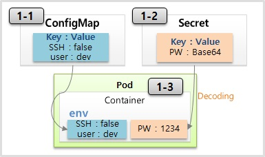

# 기본 오브젝트

# 기본 오브젝트

* toc
{:toc}

## Pod - Container, Label, NodeSchedule
+ 

### Pod
+ Pod의 특징을 보면 Pod 안에는 하나의 독립적인 서비스를 구동할 수 있는 컨테이너들이 있다
+ 그 컨테이너들은 서비스가 연결될 수 있도록 포트를 가지고 있는데 한 컨테이너가 포트를 하나 이상 가질 수는 있지만 한 Pod 내에서 컨테이너들끼리 포트가 중복될 수는 없다.
+ 
+ Container1 과 Container2 는 하나의 host 로 묶여 있다고 볼 수 있기 때문에, 만약 Container1 에서 Container2 로 접속을 할 때 localhost:8080 으로 접근할 수 있다.
+ 파드가 생성될 때 고유의 IP 주소가 할당이 되는데 Kubernetes 클러스터 내에서만 이 IP를 통해서 이 파드에 접근을 할 수가 있고 외부에서는 이 IP로 접근을 할 수가 없다
+ 만약 파드에 문제가 생기면 시스템이 이걸 감지를 해서 파드를 삭제를 시키고 다시 재생성을 하게 되는데 이때 IP 주소는 변경이 된다. 휘발성이 있는 특징을 가진 IP이다

~~~yaml

# 그림과 같은 Pod 를 생성하기 위한 YAML 파일
apiVersion: v1
kind: Pod                       # Pod 를 생성
metadata:
  name: pod-1                   # Pod 의 이름
spec:
  containers:                   # Container 에 Container1 과 Container2 를 생성
  - name: container1
    image: kubetm/p8000         # Container1 은 이미지의 이름이 p8000
    ports:
    - containerPort: 8000       # Container1 은 8000 번 port 에 노출
  - name: container2
    image: kubetm/p8080         # Container2 는 이미지의 이름이 p8080
    ports:
    - containerPort: 8080       # Container2 는 8080 번 port 에 노출

~~~

### Label
+ Label 은 Pod 뿐만 아니라 모든 오브젝트에 붙일 수 있는데, Pod 에 가장 많이 사용 한다.
+ 
+ Label 을 사용하는 이유는 목적에 따라 오브젝트들을 분류하고, 분류 된 오브젝트들만 선별하여 연결하기 위함이다.
+ Label 의 구성은 key 와 value 가 한 쌍이고 하나의 Pod 에는 다수의 Label 을 붙일 수 있다. 위와 같이 Label 이 작성 된 상태에서
  + 웹 개발자가 웹 화면만 보고싶은 경우 type 이 web 인 Label 을 가진 Pod 들을 Service 에 연결해서 이 Service 정보를 공유
  + 서비스 운영자에게는 lo 가 production 인 Label 을 가진 Pod 들을 Service 에 연결해서 이 Service 정보를 공유하면 된다
+ 사용 목적에 따라 라벨을 잘 달아 놓으면 우리가 해시태그를 붙여서 검색 용도로 사용하듯이 원하는 파드를 선택을 해서 사용할 수가 있다.

~~~yaml

# Pod 생성시 label 정보 추가
apiVersion: v1
kind: Pod
metadata:
  name: pod-2
  labels:           # label 정보를 추가할 때 k-v 형식을 사용
    type: web
    lo: dev
spec:
  containers:
  - name: container
    image: kubetm/init

~~~

~~~yaml

# 서비스 생성시 연결 할 label 정보 추가
apiVersion: v1
kind: Service
metadata:
  name: svc-1
spec:
  selector:         # selector 에 label 의 k-v 를 넣으면 매칭되는 Pod 에 연결
    type: web
  ports:
  - port: 8080

~~~

### Node Schedule
+ Pod 는 결국 다수의 Node 중 하나의 Node 에 올라가야 한다. 이 때 사용자가 직접 Node 를 선택하는 방법과 k8s 가 자동으로 선택하는 방법이 있다.
+ 

#### 직접 선택하는 방법
+ 직접 선택하는 방법을 보면 아까 파드에 라벨을 단 것처럼 이번엔 노드에 라벨을 달고 파드를 만들 때 노드를 지정을 할 수가 있다
+ 파드를 만들 때 노드 셀렉터라는 항목에 노드의 라벨과 매칭되는 Key Value를 넣으면 된다

~~~yaml

# 3-1 Node 를 직접 선택하는 경우
apiVersion: v1
kind: Pod
metadata:
  name: pod-3
spec:
  nodeSelector:    # Pod 생성시 Node 의 Label 과 매칭하는 k-v 를 작성
    hostname: node1
  containers:
  - name: container
    image: kubetm/init

~~~

#### Kubernetes의 스케줄러가 판단
+ Kubernetes의 스케줄러가 판단을 해서 지정을 해주는 경우인데 노드에는 전체 사용 가능한 자원량이 있다. 
+ 메모리와 CPU가 대표적인데 일단 메모리를 예를 들면 현재 이 노드에는 몇몇 파드들이 들어가 있어서 남은 메모리가 1기가, 그리고 이 노드에는 3.7기가의 메모리가 남은 상황
+ 이 때 새로 생성 할 Pod 가 필요한 메모리가 3 기가이기 때문에 k8s 가 Pod 를 Node2 쪽으로 Scheduling 해준다.
+ 추가로 리소스 사용량을 명시하는 이유는 Pod 내의 애플리케이션에 부하가 생길 경우 Node 자원을 무한정 사용하려 하기 때문이다. 이런 경우 같은 Node 의 모든 Pod 가 죽게 된다.

~~~yaml

# Pod 생성시 리소스 사용량 제한 설정
apiVersion: v1
kind: Pod
metadata:
  name: pod-4
spec:
  containers:
  - name: container
    image: kubetm/init
    resources:
      requests:           # Pod 에서 사용 할 리소스는
        memory: 2Gi       # 2 기가의 메모리를 요구하고
      limits:
        memory: 3Gi       # 최대 허용 메모리는 3 기가 이다

~~~

+ limits 설정에 대해 Memory 사용량 초과시 Pod 를 종료시키고, cpu 의 경우 사용량 초과시 request 수치로 리소스 양을 낮추기는 해도 직접 Pod 를 종료 시키지는 않는다. 이렇게 Memory 와 cpu 가 다르게 동작하는 이유는 각 자원에 대한 특성 때문이다. 

## Service - ClusterIP, NodePort, LoadBalancer
+ 
+ 서비스는 기본적으로 자신의 클러스터 IP를 가지고 있다 
+ 서비스를 파드에 연결을 시켜 놓으면 서비스의 IP를 통해서도 파드에 접근을 할 수 있다
+ 파드에도 똑같이 클러스터 내에서 접근할 수 있는 IP가 있는데 굳이 서비스를 달아서 이걸 통해서 접근을 하지 라고 생각할 수가 있는데 그 이유는 파드라는 존재는 Kubernetes에서 시스템 장애건, 성능 장애건 언제든지 죽을 수가
  있고 그러면 다시 재생성 되도록 설계가 돼 있는 오브젝트이다.
+ 파드의 IP는 재생성이 되면 변한다 그렇기 때문에 이 파드의 IP는 신뢰성이 떨어진다
+ 서비스는 사용자가 직접 지우지 않는 한 삭제되거나 재생성되고 그러지 않는다. 그래서 이 서비스의 IP로 접근을 하면 항상 연결되어 있는 파드에 접근할 수가 있게 된다 그렇기 때문에 서비스를 쓰는 거고 서비스의 종류는 여러 종류가 있고 그 종류에 따라서
  파드의 접근을 도와주는 방식이 틀린데 그 중 가장 기본적인 방식인 클러스터 IP라는 방식이 있다

### ClusterIP
+ 
+ 이 IP는 Kubernetes 클러스터 내에서만 접근이 가능한 IP이다. 파드에 있는 IP와 특징이 똑같다.
+ 이 IP도 클러스터 내에 다른 모든 오브젝트들이 접근을 할 수가 있지만 외부에서는 접근을 할 수가 없다. 파드에 있는 IP와 특징이 똑같다.
+ 파드를 하나만 연결할 수 있는 건 아니고 두 개 내지 여러 개의 파드를 연결시킬 수가 있는데 이렇게 여러 개의 파드를 연결시켰을 때 서비스가 트래픽을 분산을 해서 파드에 전달을 해준다

~~~yaml

apiVersion: v1
kind: Pod
metadata:
  name: pod-1
  labels:         # Service 에 연결하기 위한 lebel
     app: pod
spec:
  nodeSelector:
    kubernetes.io/hostname: k8s-node1
  containers:
  - name: container
    image: kubetm/app
    ports:
    - containerPort: 8080

~~~

~~~yaml

apiVersion: v1
kind: Service
metadata:
  name: svc-1
spec:
  selector:       # Pod 와 연결하기 위한 selector
    app: pod
  ports:
  - port: 9000         # 9000 port 로 Service 에 접근하면
    targetPort: 8080   # 8080 port 의 Pod 로 연결
  type: ClusterIP      # optional 값으로 default(ClusterIP)

~~~

~~~shell

curl 10.104.103.107:9000/hostname

~~~

+ yaml 내용을 보면 서비스와 파드가 연결되기 위한 셀렉터와 라벨이 있고 밑에 서비스의 타입을 보면 클러스터 IP라고 있다. 근데 이 타입은 optional한 값이라서 생략을 할 수가 있는데 생략을 하면 기본 값이 클러스터 IP이기 때문에 클러스터 IP를 사용할 때는 이 타입을 안 넣어도 된다.
+ 포트를 보면 9000번 포트로 이 서비스에 들어오면 타겟이 되는 하드에 8080 포트로 연결이 된다는 내용이다.

### NodePort
+ 
+ NodePort 타입의 Service 에도 기본적으로 ClusterIP 가 할당 되고 ClusterIP 와 같은 기능을 포함하고 있다.
+ 노드 타입만의 큰 특징은 Kubernetes 클러스터에 연결되어 있는 모든 노드한테 똑같은 포트가 할당이 돼서 외부로부터 어느 노드건간에 그 IP의 포트로 접속을 하면 이 서비스에 연결이 된다
+ 그럼 또 서비스는 기본 역할인 자신한테 연결되어 있는 파드의 트래픽을 전달을 해준다
+ 주의할 점은 이 파드가 있는 노드에만 포트가 할당되는 게 아니라 모든 노드에 포트가 만들어진다는 게 큰 특징이다

~~~yaml

apiVersion: v1
kind: Service
metadata:
  name: svc-2
spec:
  selector:
    app: pod
  ports:
  - port: 9000
    targetPort: 8080
    nodePort: 30000    # optional 값으로 30000~32767 값
  type: NodePort       # NodePort 타입의 Service
  externalTrafficPolicy: Local

~~~

+ 포트를 보면 노드 포트를 지정을 할 수가 있다 30,000번대에서 32,767번대 사이에서만 할당을 할 수가 있고 이 값도 옵셔널이기 때문에 안넣으면 자동으로 이 범위 내에서 할당이 된다.
+ 만약 각노드에 파드가 하나씩 올라가져 있을때 이 상태에서 1번 노드의 IP로 접근을 하더라도 이 서비스는 이 노드에 있는 파드한테 트래픽을 전달할 수가 있다 서비스 입장에서는 어떤 노드한테 온 트래픽인지 상관없이 그냥 자신한테 달려있는 파드들한테
  트래픽을 전달해 주기 때문인데 근데 만약에 이 yaml 내용에 External Traffic Policy라고 해서 값을 Local이라고 주면 특정 노드 포트의 IP로 접근을 하는 이 트래픽은 서비스가 해당 노드 위에 올려져 있는 파드한테만 트래픽을 전달을 해준다.

### Load Balancer
+ Load Balancer 타입으로 Service 를 만들면 NodePort 의 성격을 그대로 가지게 된다.
+ 
+ 로드 밸런서라는게 생겨서 각각의 로드의 트래픽을 분산시켜주는 역할을 한다 
+ 한가지 문제가 이 로드 밸런서에 접근을 하기 위한 외부 접속 ip 주소는 현재 개별적으로 Kubernetes를 설치를 했을 때 기본적으로 생기지가 않는다 별도로 외부 접속 IP를 할당을 해주는 플러그인이 설치가 되어 있어야 이 IP가 생기고
  구글 클라우드 플랫폼이나 아마존에서 제공하는 Kubernetes 플랫폼을 사용을 할 때는 얘네가 자체적으로 플러그인이 설치가 되어 있어서 로드 밸런서 타입으로 서비스를 만들면 알아서 외부에서 접속할 수 있는 IP를 만들어 준다
  그럼 그 IP를 통해서 외부에서 접근이 가능해진다 

~~~yaml

apiVersion: v1
kind: Service
metadata:
  name: svc-3
spec:
  selector:
    app: pod
  ports:
  - port: 9000
    targetPort: 8080
  type: LoadBalancer     # 특별한 설정 없이 타입만 지정

~~~

~~~shell

kubectl get service svc-3

~~~

+ yaml 내용을 보면 별다른 건 없고 타입의 로드 밸런서를 지정을 하면 된다.

### 정리
+ 첫째로 클러스터 IP는 외부에서 접근할 수가 없고 클러스터 내에서만 사용하는 IP이다 그렇기 때문에 이 IP에 접근할 수 있는 대상은 클러스터 내부에 접근을 할 수 있는 운영자와 같은 인가된 사람일 수밖에 없고
  주된 작업은 Kubernetes 대시보드를 관리를 하거나 각 파드의 서비스 상태를 디버깅하는 작업을 할 때 사용이 된다
+ 두 번째로 NodePort는 특징이 물리적인 호스트의 IP를 통해서 파드에 접근을 할 수가 있다는 건데 대부분 호스트 IP는 보안적으로 내부망에서만 접근을 할 수 있게 네트워크를 구성하기 때문에 이 노드포트는 클러스터 밖에는 있지만 그래도 내부망 안에서 접근을 해야 될
  때 쓰인다. 그리고 일시적인 외부 연동용으로도 사용이 되는데 내부 환경에서 시스템 개발을 하다가 외부에 간단한 데모를 보여줘야 된다고 할 때 종종 네트워크 중계기에 포트포워딩을 해서 외부에서 내부 시스템에 연결을 한다 이럴 때 노드포트를 잠깐 뚫어놓고 쓸 수가 있다
+ 마지막으로 로드 밸런서는 실제적으로 외부의 서비스를 노출시키려면 로드 밸런서를 이용을 해야 한다 그래야 내부 IP가 노출되지 않고 외부 IP를 통해서 안정적으로 서비스를 노출시킬 수가 있다 그렇기 때문에 이 로드밸런서는 외부의 시스템을 노출하는 용으로 쓰인다

### Sample Yaml

~~~yaml

piVersion: v1
kind: Service
metadata:
  name: svc-3
spec:
  selector:             # Pod의 Label과 매칭
    app: pod
  ports:
  - port: 9000          # Service 자체 Port
    targetPort: 8080    # Pod의 Container Port
  type: ClusterIP, NodePort, LoadBalancer  # 생략시 ClusterIP
  externalTrafficPolicy: Local, Cluster    # 트래픽 분배 역할

~~~

## Volume - emptyDir, hostPath, PV/PVC
+ 

### emptyDir
+ emptyDir은 컨테이너들끼리 데이터를 공유하기 위해서 볼륨을 사용하는 거고 최초 이 볼륨이 생성될 때는 항상 이 볼륨 안에 내용이 비어 있기 때문에 emptyDir라고 명칭이 된 것이다.
+ 
+ 만약에 컨테이너 1번이 웹 역할을 하는 서버이고 이 컨테이너 2번이 백엔드단을 처리해주는 서버라고 했을 때 이 웹서버로 받은 어떤 특정 파일을 마운트가 된 볼륨에 저장을 해 놓고요.
  백엔드단에 있는 컨테이너 역시 이 볼륨을 마운트를 해 놓으면 이 두 서버가 이 볼륨을 자신의 로컬에 있는 파일처럼 사용을 하기 때문에 이 두 서버가 서로 파일을 주고 받을 필요 없이 편하게 사용을 할 수가 있다.
+ 볼륨은 그림에서처럼 파드 안에 생성이 되는 거기 때문에 그렇다라는 건 파드에 문제가 발생을 해서 재생성이 되면 데이터가 싹 없어진다는 걸 의미를 한다 그래서 이 볼륨에 쓰이는 데이터는 꼭 일시적인 하용 목적에 의한 데이터만 넣는 게 좋다

~~~yaml

apiVersion: v1
kind: Pod
metadata:
  name: pod-volume-1
spec:
  containers:
    - name: container1
      image: kubetm/init
      volumeMounts:         # Volume mount
        - name: empty-dir
          mountPath: /mount1  # Container1 이 사용하는 path => /mount1
    - name: container2
      image: kubetm/init
      volumeMounts:         # Volume mount
        - name: empty-dir
          mountPath: /mount2  # Container2 가 사용하는 path => /mount2
  volumes:
    - name : empty-dir
      emptyDir: {}          # Volume 의 속성으로 emptyDir 을 지정

# mountPath : Container 가 이 Path 로 Volume 을 연결함을 의미
# mountPath 의 경로가 다르지만 Path 가 지정되는 Volume 의 이름이
#  empty-dir 로 동일하기 때문에 container 마다 자신이 원하는 경로를 사용하고 있지만
#  결국 같은 Volume 을 mount 하고 있다.

~~~

~~~shell

mount | grep mount1
echo "file context" >> file.txt

~~~

+ yaml 내용을 보면 컨테이너에 두 컨테이너가 있고 둘 다 볼륨을 마운트하고 있다 근데 마운트할 패스를 보시면 컨테이너1은 mount1이라는 패스를 사용했고 그리고 컨테이너2는 mount2라는 패스를 사용을 했다
  이 mount 패스의 의미는 이 컨테이너가 이 패스로 볼륨을 연결을 하겠다는 의미이지만 컨테이너2에서 패스의 이름이 틀리더라도 결국 각각의 패스가 지정되는 볼륨의 이름은 mtdir로 똑같은 이 볼륨을 지정을 하고 있기 때문에 컨테이너마다 자신의 원하는
  경로를 사용을 하고 있지만 결국 한 볼륨을 마운트를 하고 있는 것이다
+ 볼륨의 속성으로 여기 empty-dir 라고 명시되어 있는 걸 볼 수가 있다.

### hostPath
+ 이름에서 알 수 있듯 하나의 host 즉, Pod 들이 올라가 있는 Node 에 path 를 Volume 으로 사용한다.
+ 
+ emptyDir과 다른 점은 패스를 각각의 파드들이 마운트해서 공유하기 때문에, 파드들이 죽어도 이 노드에 있는 데이터는 사라지지 않는다
  그런 점에서 다소 좋아 보일 수 있지만, 파드 입장에서는 한가지 큰 문제가 있다. 
+ 만약 파드2가 죽어서 재생성이 될 때 꼭 해당 노드에 재생성될 이라는 보장이 없다 재생성되는 순간에 스케줄러가 자원 상황을 보고 이 노드2의 파드를 만들어 줄 수도 있고 또 노드1의 장애가 생겨서 다른 노드에 파드가 옮겨질 수도 있다
  그래서 파드가 이 노드로 옮겨졌을 때 이 파드는 이 노드1에 있는 볼륨을 마운트를 할 수가 없게 된다
+ hostPath이기 때문에 자신의 파드가 올라가져 있는 이 노드의 볼륨만 사용을 할 수가 있다. 하지만 굳이 방법을 찾는다면 만약 이 노드2가 추가가 될 때마다 똑같은 이름의 경로를 만들어서 직접 노드에 있는 패스끼리 마운트를 시켜주면 문제는 없어진다
  이렇게 구성하는 게 별로 어렵지는 않지만, 이거는 Kubernetes가 해주는 역할은 아니고 운영자가 직접 노드가 추가될 때마다 리눅스 시스템 별도의 마운트 기술을 사용을 해서 연결을 해줘야 된다.
  이런 구성을 하는 게 별로 어렵지는 않지만, 뭔가를 자동화를 시키는데 있어서 사람의 개입이 들어간다는 것 자체가 실수를 발생할 여지를 주기 때문에 딱히 이런 방법은 추천하지 않는다 
+ 호스트 패스는 어떨 때 써야 되냐면 각각의 노드에는 기본적으로 각 노드 자신을 위해서 사용되는 파일들이 있다 시스템 파일들이나 여러 설정 파일들이 있는데 파드 자신이 할당되어 있는 호스트의 데이터를 읽거나 써야 될 때 사용을 하면 된다

~~~yaml

apiVersion: v1
kind: Pod
metadata:
  name: pod-volume-3
spec:
  nodeSelector:
    kubernetes.io/hostname: k8s-node1
  containers:                 # Pod 를 만들 때 Conatiner 에서 
  - name: container
    image: kubetm/init
    volumeMounts:             # Volume 을 mount 하는데
    - name: host-path         # host-path 라는 이름의 Volume 을 사용 하고
      mountPath: /mount1      # Path 는 mount1 이다.
  volumes:
  - name : host-path          # host-path 라는 이름의 Volume
    hostPath:                 # hostPath 라는 속성을 사용한다.
      path: /node-v           # Path 는 node-v 이고 
      type: Directory         # type 은 Directory 이다.

# 추가로 hostPaht 의 path: /node-v 는 이 Pod 가 만들어지기 전에 만들어져 있어야 한다.

~~~

+ yaml 내용을 보면 하드를 만들 때 컨테이너에서 볼륨을 마운트를 할 건데 그 패스는 mount1 이고  패스에 대한 호스트 패스라는 이름의 볼륨이 있고 호스트 패스라는 볼륨은 이렇게 호스트 패스라는 속성이 들어가고
  패스는 node-v 이다, 타입은 디렉토리 타입
+ 한가지 주의해야 될 점은 이 호스트에 있는 패스는 이 파드가 만들어지기 전에 사전에 만들어져 있어야지 파드가 생성이 될 때 에러가 나지 않는다 
+ hostPath는 데이터를 저장하기 위한 용도가 아니라 노드에 있는 데이터를 파드에서 쓰기 위한 용도이다

### PV/PVC
+ PVC/PV 는 Pod 에 영속성 있는 Volume 을 제공하기 위한 기능이다.
+ 
+ 실제 볼륨들의 형태는 다양하다, 로컬 볼륨도 있지만 외부의 원격으로 사용되는 형태의 볼륨들도 있다
+ 아마존이나 Git에 연결을 할 수도 있고 NFS를 써서 다른 서버와 연결을 할 수도 있다 그리고 스토리지 OS 같이 볼륨을 직접 만들고 관리할 수 있는 솔루션들도 있다 이런 것들을 각각 퍼시언트 볼륨을 정의를 하고 연결을 한다
+ Pod 는 이런 PV 에 바로 연결하지 않고 PVC 를 통해 PV 와 연결 된다. k8s 는 Volume 사용에 있어서 User 영역과 Admin 영역으로 나누었다. Admin 은 k8s 를 관리하는 운영자이고 User 는 Pod 에 Service 를 만들고 배포를 관리하는 서비스 담당자 이다.
+ 볼륨들의 종류는 많고 이 각각의 볼륨들을 연결하기 위한 설정들도 각각 틀리다. 볼륨을 정의를 하는데 각각의 볼륨에 따라 연결하기 위한 속성들이 이렇게 다르게 들어간다 그래서 전문적으로 이런 걸 관리하는 어드민이 pvc를 만들어 놓으면 유저는 이걸 사용을
  하기 위해서 pvc를 만들어야 된다

~~~yaml

# 각 Volume 에 따라 서로 다른 설정 값이 사용 되는 예시 (nfs, iscsi, gitrepo)
apiVersion: v1
kind: PersistentVolume
metadata:
  name: pv-01
spec:
  nfs:
    server: 192.168.0.xxx
    path: /sda/data
  iscsi:
    targetPortal: 163.180.11
    iqn: iqn.200.qnap:...
    lun: 0
    fsType: ext4
    readOnly: no
    chapAuthSession: true
  gitRepo:
    repository: github.com...
    revision: master
    directory: .

~~~

~~~yaml

# PV 를 사용하기 위한 User 의 PVC 설정 예시
apiVersion: v1
kind: PersistentVolumeClaim
metadata:
  name: pvc-01
spec:
  accessModes:
  - ReadWriteOnce          # 읽기 쓰기 모드가 가능한
  resources:
    requests:
      storage: 1G          # 용량 1 기가인 Volume 을 요청
  storageClassName: ""     # 공백으로 넣으면 현재 만들어진 PV 중 선택 된다
                           # 이 값을 "" 대신 생략하게 되면 다른 동작을 할 수 있다.

~~~

~~~yaml

# PVC 를 사용하는 Pod 설정 예시
apiVersion: v1
kind: Pod
metadata:
  name: pod-volume-3
spec:
  containers:
  - name: container
    image: kubetm/init
    volumeMounts:
    - name: pvc-pv         # 만든어진 PVC 를 Container 에서 사용
      mountPath: /mount3
  volumes:
  - name : pvc-pv
    persistentVolumeClaim:
      claimName: pvc-01     # 앞서 만든 PVC 이름을 연결

~~~

+ 처리흐름
  1. 최초 Admin 이 PV 를 만들어 둔다.
  2. 사용자 (User) 가 PVC 를 만든다.
  3. k8s 가 PVC 내용에 맞는 적정한 Volume 에 연결 해준다.
  4. 이후 Pod 생성시 PVC 를 사용한다.

## ConfigMap, Secret - Env, Mount
+ 
+ 
+ 개발 환경과 상용 환경이 있다. 
+ A라는 서비스가 있는데 이 서비스에는 일반 접근과 보안 접근을 지원하고 있다. 그래서 개발 환경에서는 이 보안 접근을 해제할 수 있는 옵션이 있고 보안 접근을 한다면 접근 유저와 키를 세팅할 수도 있다.
+ 상용 환경으로 배포를 해야 된다면 이 값이 바뀌어야된다 다시 보안 접속으로 설정을 해야 되고 유저와 키값도 변해야 된다.
+ 근데 이 값은 컨테이너 안에 있는 서비스 이미지에 들어있는 값이기 때문에 이 내용을 바꾼다는 건 이렇게 개발 환경과 상용 환경에 컨테이너 이미지를 각각 관리하겠다는 의미가 된다. 이 값 몇 개 때문에 큰 용량의 이미지를 별도로 관리한다는 건 정말 부담되는 일이다
+ 그래서 보통 이렇게 환경에 따라 변하는 값들은 외부에서 결정을 할 수 있게 하는데 그걸 도와주기 위한 게 ConfigMap과 Seclet이라는 오브젝트이다.
+ 분리해야 되는 일반적인 상수들을 모아서 이 ConfigMap을 만든다
+ 키와 같이 보안적인 관리가 필요한 값을 모아서 이 Secret울 만든다.
+ Pod 를 생성할 때 ConfigMap 과 Secret 오브젝트를 연결할 수 있는데 Container 의 환경변수에 이 데이터들이 들어가게 된다. A Service 의 입장에서는 Env (환경변수) 값을 읽어서 로직을 처리하게 된다.
+ 상용 환경에서는 이 ConfigMap과 Secret에 데이터만 바꿔주면 똑같은 컨테이너 이미지를 사용을 해서 원하는 기능을 사용할 수 있게 되는 것이다
+ ConfigMap과 Secret을 만들 때 데이터로 상수를 넣을 수가 있고 파일을 넣을 수가 있다 파일을 넣을 때는 환경 변수로 세팅하는 게 아닌 볼륨을 마운트해서 사용을 할 수가 았다

### Env (Literal)
+ 
+ ConfigMap은 키와 밸류로 구성이 되어 있다.
+ 필요한 상수들을 정의를 해 놓으면 파드를 생성을 할 때 ConfigMap을 가져와서 컨테이너 안에 환경 변수에 세팅을 할 수가 있다.
+ Secret도 똑같은 역할을 하는데 이름에서 느껴지는 것처럼 뭔가 보완적인 요소의 값들을 저장하는 용도로 사용이 된다. 주로 패스워드라든지 인증키들은 Secret에 담는다 그리고 사용상 ConfigMap과 다른 점은 이 Value를 넣을 때 Base64
  Encoding을 해서 만들어야 된다는 건데 이게 Secret의 보완적인 요소는 아니고 단순히 secret의 value를 만들어야 된다는 규칙이고 이게 pod로 주입이 될 때는 자동으로 decoding이 돼서 환경 변수에서는 원래의 값이 보이게 된다
+ secret은 평문으로 쿠버네티스 DB(etcd)에 저장된다.
+ secret의 보안적 요소는 secret를 pod에 파일로 마운팅해서 사용할 때 Pod 내부에서는 파일이 보이지만 이런 기능을 구현하기 위해서 쿠버네티스 입장에서는 workernode에 secret 파일을 만들어 놓고, Pod에 이 파일을 마운팅 한다
  이때 workernode에 secret 파일을 인메모리 파일시스템(tmpfs)영역에 올려놓고 있다가 Pod가 삭제되면 지우는데 이렇게 민감한 데이터를 디스크에 저장해 놓지 않기 때문에 configmap보다 보안에 유리 할 수 있다

[//]: # (+ secret의 보완적인 요소가 뭐냐면 일반적인 오브젝트 값들은 Kubernetes DB에 저장이 되는데 이 secret은 메모리에 저장이 된다 아무래도 파일에 저장되어 있는 것보다 메모리에 저장되어 있는 게 보안에 좋다)
[//]: # (+ ConfigMap의 경우 키 밸류 리스트를 무한히 넣을 수 있는데에 반해 Secret은 1MB까지만 넣을 수가 있다.)
[//]: # (+ Secret은 메모리를 사용해서 너무 많이 만들게 되면 시스템 자원에 영향을 끼치게 된다. 그렇기 때문에 주의가 필요하다.)

~~~yaml

# ConfigMap 설정 예시
apiVersion: v1
kind: ConfigMap
metadata:
  name: cm-dev
data:
  SSH: 'false'    # key: value 형태의 상수를 입력
  User: dev

~~~

+ ConfigMap을 만드는데 이름을 지정을 하고 이 데이터에 키 밸류 형태의 상수를 넣으면 된다.

~~~yaml

# Secret 설정 예시
apiVersion: v1
kind: Secret
metadata:
  name: sec-dev
data:
  Key: MTIzNA==   # key: value 형태로 입력하되 value 는 BASE64 인코딩 한 값 사용

~~~

+ Secret도 이름을 넣고 데이터에 키를 넣고 Value에는 값을 Base64로 변환을 해서 넣으면 된다.

~~~yaml

# ConfigMap 과 Secret 을 사용하는 Pod 설정 예시
apiVersion: v1
kind: Pod
metadata:
  name: pod-1
spec:
  containers:
  - name: container
    image: kubetm/init
    envFrom:            # envFrom 으로 사용 할 ConfigMap 과 Secret 을 참조
    - configMapRef:
        name: cm-dev
    - secretRef:
        name: sec-dev

~~~

+ 파드를 만들 때 env-from 이라는 속성으로 ConfigMap 맵을 레퍼런스 할 거고 가져올 ConfigMap의 이름은 cm-dev 이다. Secret도 레퍼런스를 할 건데 그 이름은 sec-dev 이다.

### Env (File) 
+ 
+ 파일을 ConfigMap 에 담을 경우 파일의 이름이 ConfigMap 의 이름이 key 가 되고 내용이 value 가 된다. 이것을 Pod 를 만들 때 환경변수로 넣을 때 그대로 넣게 될 경우 key 가 파일 이름이 되어 자연스럽지 않다. 그래서 key 를 새로 정의해서 Content 를 넣는 방법을 사용 한다.
+ file 을 ConfigMap 으로 만드는 것은 대시보드에서 지원하지 않기 때문에 master node 에서 kubectl 명령을 사용 한다.

~~~shell

# cm-file 이라는 ConfigMap 생성
echo "Content" >> file.txt
kubectl create configmap cm-file --from-file=./file.txt

~~~

~~~shell

# sec-file 이라는 Secret 생성
echo "Content" >> file.txt
kubectl create secret generic sec-file --from-file=./file.txt

~~~

+ Secret 생성시 file 의 내용이 BASE64 로 인코딩 된다. 그렇기 때문에 미리 내용을 BASE64 로 인코딩 하였다면 두 번 인코딩 될 수 있으므로 주의해야한다

~~~yaml

apiVersion: v1
kind: Pod
metadata:
  name: pod-file
spec:
  containers:              # Container 에
  - name: container
    image: kubetm/init
    env:                   # 환경변수를 넣을 건데
    - name: file           # 이 환경변수의 이름은 file 이다.
      valueFrom:           # 이 파일의 값을 가져올건데
        configMapKeyRef:   # 그 값은 ConfigMap 의 Key 를 참조 한다.
          name: cm-file    # ConfigMap 의 이름은 cm-file 이고
          key: file.txt    # cm-file 안에 있는 file.txt 라는 key 에 대한 value 입력

~~~

+ 파드를 만들어 보면 컨테이너에 환경변수를 넣을 건데 이 환경변수의 이름은 file 이다. 이 파일의 값을 가져올건데 그 값은 ConfigMap 의 Key 를 참조 한다. ConfigMap 의 이름은 cm-file 이고 cm-file 안에 있는 file.txt 라는 key 에 대한 value 입력한다

### Volume Mount (File)
+ 
+ file 을 ConfigMap 에 담는 것 까지는 앞서 본 것과 동일하다.
+ 파드를 만들 때 컨테이너 안에 마운트 패스를 정의를 하고 이 패스 안에 파일을 마운팅 할 수가 있다.

~~~yaml

apiVersion: v1
kind: Pod
metadata:
  name: pod-mount
spec:
  containers:              # Container 안에
  - name: container
    image: kubetm/init
    volumeMounts:          # Volume 을 mount 하는데
    - name: file-volume
      mountPath: /mount    # 그 때 mount path 이고
  volumes:
  - name: file-volume      # maount 할 Volume 을 보면
    configMap:             # 이 Vloume 안에는 configMap 을 담았고
      name: cm-file        # configMap 의 이름은 cm-file 이다.

~~~

+  Env (File) 과 Volume Mount (File) 방식은 큰 차이점이 있다.
  + Env (File) 같은 경우 Pod 를 만들 때 환경변수 값을 한 번 주입하면 그것으로 끝이기 때문에 ConfigMap 의 데이터가 바뀌어도 Pod 의 환경변수 값은 바뀌지 않는다. Pod 가 다시 만들어질 경우에는 갱신이 된다.
  + 반면 Volume Mount (File) 방식은 mount 자체가 원본과 연결해 준다는 것을 의미하기 때문에 ConfigMap 의 데이터가 바뀔 경우 Pod 에 mount 된 내용도 같이 바뀌게 된다.

## Namespace, ResourceQuota, LimitRange
+ 
+ 쿠버네티스 클러스터라고 해서 전체 사용할 수 있는 자원이 있다. 일반적으로 메모리나 CPU가 있을 것이다
+ 클러스터 안에는 여러 네임 스페이스들을 만들 수가 있고 또 네임 스페이스 안에는 여러 파드들을 만들 수가 있다.
+ 각 파드는 필요한 자원을 클러스터 자원을 공유를 해서 사용을 하는데 만약 한 네임 스페이스 안에 있는 파드가 이 클러스터에 남은 자원을 모두 사용해 버리면 다른 파드 입장에서는 더 이상 쓸 자원이 없어서 자원이 필요할 때 문제가 발생하게 된다.
+ 이런 문제를 해결하기 위해서 ResourceQuota라는 게 존재를 하는데 이걸 naming space마다 달면 네임스페이스마다 최대 한계를 설정할 수가 있다. 그래서 파드 자원이 이 한계를 넘을 수가 없다
  이 파드 입장에서 자원이 부족해서 문제가 될지언정 이 다른 네임스페이스에 있는 파드들에는 영향을 끼치지 않게 해준다
+ 한 파드가 자원 사용량을 너무 크게 해버리면 다른 파드들이 이 네임스페이스에 더 이상 들어올 수 없게 된다 이러지 못하게 관리를 하기 위해서 이렇게 LimitRange를 둬서 네임스페이스에 들어오는 파드의 크기를 제한할 수가 있다
+ 한 파드의 자원 사용량이 이 LimitRange에 설정된 값보다 낮아야지 이 네임스페이스에 들어올 수가 있다. 이보다 클 경우에는 이 파드가 네임스페이스 안에 들어올 수가 없다
  참고로 이 두 오브젝트는 네임스페이스만 달 수 있는 게 아니라 클러스터에도 달아서 전체 자원에 대한 제한을 걸 수도 있다.

### Namespace
+ 
+ 한 네임스페이스 안에는 같은 타입의 오브젝트들은 이름이 중복될 수 없다는 특징을 가지고 있다  같은 파드의 이름을 중복해서 만들 수가 없다
+ 오브젝트들마다 별도의 UUID가 존재하기는 한데 한 네임스페이스 안에서는 같은 종류의 오브젝트라면 이름 또한 UUID 같이 유일한 키 역할을 할 수가 있는 셈이다
+ 네임스페이스의 대표적인 특징이 타 네임스페이스에 있는 자원과 분리가 돼서 관리가 된다는 건데 여기 다른 네임스페이스가 있고 그 안에는 서비스가 존재할 때 우리는 이 파드와 서비스 간의 연결을 파드에는 라벨을 달고 서비스에는 셀렉터를 달아서 연결을 하는데
  근데 이건 타 네임스페이스에 있는 파드에는 연결이 되지 않는다 
+ 대부분의 자원들은 그 자원 안에서 만든 네임스페이스 안에서만 사용할 수가 있다.
+ 물론 노드나 퍼센트 볼륨과 같이 모든 네임스페이스에서 공용으로 사용되는 오브젝트도 있긴 하다.
+ 네임스페이스를 지우게 되면 그 안에 있는 자원들도 모두 지워지기 때문에 네임스페이스를 지울 때는 이 점을 유의해야 된다 

~~~yaml

# Namespace 생성 예시
apiVersion: v1
kind: Namespace
metadata:
  name: nm-1      # 이름 외에 특별한 설정값 없음

~~~

~~~yaml

apiVersion: v1
kind: Pod
metadata:
  name: pod-1
  namespace: nm-1       # Pod 를 만들 때 속할 Namespace 를 지정
  labels:
    app: pod
spec:
  containers:
  - name: container
    image: kubetm/app
    ports:
    - containerPort: 8080

~~~

~~~yaml

apiVersion: v1
kind: Service
metadata:
  name: svc-1
  namespace: nm-1
spec:
  selector:
    app: pod
  ports:
  - port: 9000
    targetPort: 8080

~~~

### ResourceQuota
+ 
+ 리소스 커터는 네임스페이스에 자원 한계를 설정하는 오브젝트
+ 네임스페이스에 들어갈 파드들의 전체 리퀘스트 자원들을 최대 3기가로 설정을 하겠다라는 거고 메모리의 리미치는 6기가로 하겠다라는 설정
+ 리소스 커터가 지정되어 있는 네임스페이스에 파드를 만들 때 이 파드는 무조건 스펙을 명시해야 된다 스펙 자체가 없으면 네임스페이스에 만들어지지 않는다 
+ 현재 총 3기가의 리퀘스트 중에 2기가를 사용하는 파드가 있는데 이 리퀘스트를 또 2기가를 더 사용을 하겠다라는 파드가 들어오면 만들어지지 않는다.

~~~yaml

apiVersion: v1
kind: ResourceQuota
metadata:
  name: rq-1
  namespace: nm-1          # 할당 할 namespace 설정
spec:
  hard:                    # hard 라는 속성에
    requests.memory: 3Gi   # 제한 할 자원의 종류와 한계치를 설정
    limits.memory: 6Gi

~~~

+ 제한 가능한 자원 종류 : cpu, memory, storage
+ 오브젝트 생성 개수 제한 : Pod, Service, ConfigMap, PVC ...

### LimitRange
+ 
+ 리미트 렌즈의 기능은 각각의 파드마다 네임스페이스에 들어올 수 있는지 자원을 체크를 해준다 
+ 체크되는 항목은에서 min은 파드에서 설정되는 메모리의 리미트 값이 1기가가 넘어야 된다는 말이고 max는 4기가를 초과할 수 없다는 뜻이다
+ maxLimitRequestRatio는 equest 값과 limit 값의 비율이 최대 3 배를 넘을 수 없다.
+ Pod 의 경우 설정 된 max memory 가 0.4 기가 인데 0.5 기가를 설정 하였으므로 namespace 에 속할 수 없다
+ 추가로 defaultRequest 와 default 속성이 있는데, 3-3' 와 같이 Pod 에 아무 설정을 하지 않았을 경우 자동으로 request 값과 limit 값이 할당 된다.

~~~yaml

apiVersion: v1
kind: LimitRange
metadata:
  name: nm-1               # 할당 할 namespace 명시
spec:
  limits:                  # limit 속성에
  - type: Container        # type 을 Container 별로 제한
    min:
      memory: 1Gi
    max:
      memory: 4Gi
    maxLimitRequestRatio:
      memory: 3
    defaultRequest:
      memory: 1Gi
    default:
      memory: 2Gi

~~~
