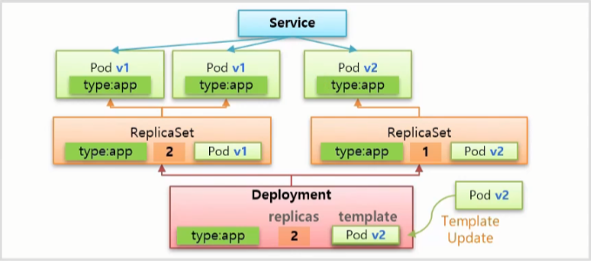
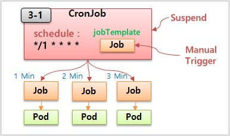

# 컨트롤러

# 컨트롤러

* toc
{:toc}

## Replication Controller, ReplicaSet - Template, Replicas, Selector
+ 
+ 쿠버네티스의 컨트롤러는 서비스를 관리하고 운영하는 데 큰 도움을 준다 

### Controller
+ **Auto Healing**
  + Node 위에 Pod 가 있는데 이 Pod 가 갑자기 다운 되거나 이 Pod 가 Scheduling 되어 있는 Node 가 다운 될 경우 Controller 는 장애를 바로 인지하고 Pod 를 다른 Node 에 새로 만들어 준다.
+ **Auto Scaling**
  + Pod 의 리소스가 최대치에 다다랐을 경우 Controller 는 이 상태를 파악하고 Pod 를 하나 더 만들어 줌으로 부하를 분산 시키고 Pod 가 다운되지 않도록 하여 서비스 장애 없이 안정적으로 운영할 수 있다.
+ **Software Update**
  + 다수의 Pod 에 대한 버전을 upgrade 해야 할 경우 Controller 를 통해 한 번에 쉽게 할 수 있고, upgrade 도중에 문제가 생기면 rollback 할 수 있는 기능을 제공 한다.
+ **Job**
  + 
  + 일시적인 작업을 해야하는 경우 Controller 가 필요한 순간 Pod 를 만들어서 해당 작업을 수행하고 삭제 한다.
  + 이렇게 하면 그 순간에만 자원을 사용 하고, 작업 후에 반환 하기 때문에 효율적인 자원 활용이 가능해 진다.

+ 현재 Replication Controller 는 deprecated 되었고 이것을 대체하는 것이 ReplicaSet 이다. Template 과 Replicas 는 Replication Controller 와 ReplicaSet 모두 가지고 있고 Selector 는 ReplicaSet 에만 존재 한다.

### Template
+ 
+ Controller 와 Pod 는 Service 와 Pod 처럼 Label 과 Selector 로 연결 된다.
+ 1-1 의 Pod 와 같이 type:web 이라는 Label 이 붙어 있고 1-2 와 같이 매핑되는 Selector 를 만들면 연결이 된다.
+ Controller 를 만들 때 template 으로 Pod 의 내용을 넣게 되는데, Controller 는 Pod 가 다운되면 template 을 사용해서 Pod 를 새로 만들어 준다. 
+ 이런 특성을 사용해서 애플리케이션을 업그레이드 할 수 있는데, template 에 V2 에 대한 Pod 를 업데이트 하고 기존에 연결 되어 있던 Pod 를 다운 시키면 Controller 는 template 을 가지고 새로 업그레이드 된 Pod 를 새로 만들면서 버전이 업그레이드 된다.

~~~yaml

apiVersion: v1
kind: Pod
metadata:
  name: pod-1
  labels:
    type: web       # Pod 에 Label 을 작성
spec:
  containers:
  - name: container
    image: kubetm/app:v1

~~~

~~~yaml

apiVersion: v1
kind: ReplicationController    # ReplicationController 를 만들 때
metadata:
  name: replication-1
spec:
  replicas: 1
  selector:
    type: web                  # selector 를 설정하면 Pod 와 연결 된다
  template:                    # template 으로 Pod 의 내용이 들어가는데
    metadata:
      name: pod-1
    labels:                    # 이곳에도 동일하게 label 을 지정해줘야
      type: web                # 새로 만들어질 때 이 Controller 와 연결 된다.
    spec:
      containers:
      - name: container
        image: kubetm/app:v2

~~~

### Replicas
+ 
+ 기능은 간단하다. replicas 에 적은 수 만큼 Pod 가 관리 된다. 
+ replicas 의 수를 늘리면 scale out, 줄이면 scale in 이 발생 한다.
+ Template 와 Replicas 기능을 통해 Pod 와 Controller 를 따로 만들지 않고 한 번에 만들 수 있다. 
+ 오른쪽과 같이 replicas 와 template 에 대한 내용을 담아서 Pod 없이 Controller 만 만들 경우 Controller 는 replicas 가 2 인데 현재 연결 되어 있는 Pod 가 없기 때문에 template 에 있는 Pod 의 내용을 기반으로 2 개의 Pod 를 만든다.

### Selector
+ 
+ ReplicationController 의 Selector 는 key 와 value 가 같은 label 을 연결 해준다. Pod3 과 같은 경우 Replication 의 label 과 value 가 다르기 때문에 연결해 주지 않는다.
+ 반면 ReplicaSet 은 Selector 에 두 개의 추가 속성이 있는데 matchLabels 와 matchExpressions 가 있다.
+ matchLabels 는 ReplicationController 와 같이 key 와 value 가 모두 같아야 연결을 해준다
+ matchExpressions  는 key 와 value 를 좀 더 정교하게 다룰 수 있다. 예를 들어 그림과 같이 key: ver 을 넣고 operator: Exists 라고 넣으면 value 는 다르지만 label 의 key 가 ver 인 모든 Pod 를 선택 하게 된다.

~~~yaml

apiVersion: apps/v1
kind: ReplicaSet
metadata:
  name: replica-1
spec:
  replicas: 3
  selector:                         # selector 에 바로 key-value 가 들어가지 않는다.
    matchLabels:
      type: web                     # matchLabels 에는 key-value 가 들어가고
    matchExpressions:               # matchExpression 에는
    - {key: ver, operator: Exists}  # 상세 설정이 들어간다.
  template:
    metadata:
      name: pod
... 이하 생략

~~~

#### operator 에 사용할 수 있는 값
+ 
+ Exists: 사용자가 key 를 정하고 이 key 값을 가지고 있는 Pod 들을 연결
+ DoesNotExist: key 에 똑같이 A 라고 설정하면 key 에 A 가 들어가지 않은 Pod 들을 연결
+ In: key 와 values 를 지정할 수 있는데, key 와 values 의 값들 중 일치하는 Pod 들을 연결
+ NotIn: key 와 values 를 지정할 수 있는데, key 와 values 의 값들 중 일치하지 않는 Pod 들을 연결

## Deployment - Recreate, RollingUpdate
+ Deployment 는 하나의 운영 중인 서비스를 업데이트 하여 다시 배포해야 할 때 도움을 주는 Controller 이다.
+ 
+ 대표적으로 Recreate, Rolling Update, Blue & Green, Canary 배포 방식이 있다.

### ReCreate
+ 
+ Deployment 를 만들면 v1 의 Pod 들이 만들어 진다.
+ 각 Pod 마다 각자의 자원을 사용 한다고 할 때 ReCreate 방법으로 를 업그레이드를 하게 되면 Deployment 는 먼저 기존의 Pod 들을 삭제 한다. 그렇기 때문에 서비스에 대한 Downtime 이 발생 하고 자원도 사용하지 않게 된다. 그리고 나서 v2 의 Pod 들을 만들어 준다.
+ 이 방법의 단점은 Downtime 이 발생하기 때문에 일시적으로 서비스를 중단할 수 있는 경우에만 사용할 수 있다.

### Rolling Update
+ 
+ Rolling Update 를 하면 Deployment 는 v2 의 Pod 를 먼저 만들어 준다.
+ v1 의 Pod 를 중지하지 않고 v2 의 Pod 를 만들기 때문에 그만큼 자원을 추가 사용하게 된다.
+ v1 과 v2 모두 동작하기 때문에 일시적으로 서로 다른 버전의 서비스를 동시에 사용하게 된다.
+ v2 의 Pod 를 만들고 v1 의 Pod 하나를 삭제하고, 다시 v2 의 Pod 를 만들고 v1 의 Pod 를 삭제 하는 순서로 처리 된다.
+ 다시 말해서 추가 자원을 사용 한다는 단점이 있지만 서비스 Downtime 이 없다는 장점이 있는 방법 이다.

### Blue/Green
+ 
+ 이 방법은 Deployment 자체로 제공되는 기능은 아니고 Deployment 를 사용 할 수도 있지만 ReplicaSet 과 같이 Replicas 를 관리하는 모든 Controller 를 이용해서 처리할 수 있다.
+ Controller 를 만들어서 Pod 가 만들어 지면 Pod 에는 Label 이 있기 때문에 Service 의 Selector 와 연결 된다. 
+ 이렇게 운영 중인 상태에서 Controller 를 하나 더 만드는데 v2 에 대한 Pod 를 만들고 Label 도 v2 를 사용 한다.
+ 이 때 자원 사용량은 기존의 2배가 된 상태에서 Service 에 있는 Label 만 수정하면, 기존 Pod 와 연결을 끊고 v2 의 Pod 와 바로 연결 된다.
+ 이 연결은 순간적으로 바뀌기 때문에 서비스에 대한 Downtime 은 없다. 그런데 만약 v2 에 문제가 발생할 경우 Service 의 Label 을 v1 으로 바꿔 줌으로 기존 서비스로 전환하여 롤백이 쉽게 가능하다. 문제가 없을 경우에는 v1 에 대한 내용을 삭제하면 된다.
+ 여러 방법 중 많이 사용하는 방법이고 안정적인 방법 이지만, 2배의 자원이 필요하다는 점이 단점 이다.

### Canary
+ 
+ v1 에 대한 Pod 가 있고 Label 이 작성 된 상태에서 Service 를 만드는데, ver:v1 이 아닌 ty:app 을 만들어 연결 한다.
+ 이렇게 운영 중인 상태에서 테스트 목적으로 Controller 를 만들 때 Replicas 를 1로 하여 v2 에 대한 Pod 를 하나 만들고, 동일하게 ty:app 이라고 Label 을 작성하면 Service 에 자동으로 연결 된다.
+ Service 로 유입되는 트래픽 중에 일부는 v2 에 접근이 되고 자연스럽게 새로운 버전에 대한 테스트가 된다. 이후 문제가 발생할 경우 새로 만든 Controller 의 Replicas 만 0으로 만들면 된다. 이 방법은 불특정한 사용자에 대해 테스트 하는 방법 이다.
+ 또 다른 방법으로 v1 과 v2 에 대한 Service 를 각각 만들고, Ingress Controller 라는 유입되는 트래픽을 url path 에 따라 Service 에 연결해주는 역할을 하는 Controller 를 사용하는 것이다.
+ 
+ 이후 문제 없이 테스트가 완료 되면 v2 에 대한 Pod 를 증가하고 Ingress Controller 에 설정을 변경한 다음 v1 에 대한 내용을 삭제하면 된다.
+ 
+ 이렇게 하면 역시 DownTime 이 발생하지 않는데 자원 사용량은 테스트 할 Pod 의 수나 v2 Pod 를 얼마나 만들어 두고 v1 의 Pod 를 다운 시키냐에 따라 증가하게 된다.

### Deployment

#### ReCreate
+ 
+ Deployment 를 만들 때 Replica 에서 넣었던 selector 와 replicas 그리고 template 값을 똑같이 설정 한다.
+ 하지만 이 값들은 Deployment 가 Pod 를 만들어서 관리하기 위한 값은 아니고 ReplicaSet 을 만들 때 사용하는 설정 값을 지정하기 위함 이다.
+ 
+ 이렇게 만들어진 ReplicaSet 은 설정 내용을 바탕으로 Pod 들을 만들게 된다. 그리고 Service 를 만들어 Label 값을 기반으로 Pod 를 연결 하면 이 Service 를 통해 Pod 에 접근할 수 있게 된다.
+ 
+ 이후 ReCreate 방법으로 v2 로 업그레이드 하려면 Deployment 의 template 을 v2 버전으로 업데이트 해주면 되는데, 먼저 ReplicaSet 의 replicas 를 0으로 변경 한다.
+ 그러면 ReplicaSet 은 Pod 들을 제거하고 Service 도 연결 대상이 없어지기 때문에 DownTime 이 발생 한다.
+ 
+ 그리고 새로운 ReplicaSet 을 만드는데 이 template 에는 변경 된 v2 의 Pod 를 넣기 때문에 Pod 들도 v2 버전으로 만들어지고 Service 는 Label 정보에 따라 Pod 와 연결 된다.

~~~yaml

apiVersion: apps/v1
kind: Deployment                 # Deployment 를 만들 때
metadata:
  name: deployment-1
spec:                            # selector, replicas, template 이 포함 되고
  selector:
    matchLabels:
      type: app
  replicas: 2
  strategy:
    type: Recreate               # 배포 방식으로 Recreate 를 사용 하고
  revisionHistoryLimit: 1        # 새로운 ReplicaSet 을 만들 때 replicas 가 0이 된다, ReplicaSet 을 1개만 남기겠다., default 값이 10 인 optional 값,  0이 된 레플리카셋은 내가 이전 버전으로 되돌아가고 싶을 때 사용
  template:                      
    metadata:                     
      labels:
        type: app
    spec:
      containers:
      - name: container
        image: kubetm/app:v1
      terminationGracePeriodSeconds: 10

~~~

#### Rolling Update (default)
+ 
+ 서비스가 운영중인 상태에서 새로운 버전으로 template 을 교체하면서 Rolling Update 가 시작 된다. 먼저 Replicas 가 1인 ReplicaSet 을 만들고 Label 값을 기반으로 Service 와 연결 된다.
+ 
+ 이후부터는 v1 과 v2 에 트래픽이 분산 된다. 그리고 기존의 ReplicaSet 의 replicas 를 1로 수정 해서 Pod 를 하나 삭제하고 v2 의 ReplicaSet 의 replicas 를 2로 바꿔 v2 의 Pod 를 하나 만든다.
+ 마지막으로 기존 ReplicaSet 의 replicas 를 0으로 만들어 남아있는 Pod 를 모두 삭제 한다.
+ 
+ 이 방법도 마찬가지로 ReplicaSet 을 제거하지 않고 배포를 종료 한다.
+ 레플리카셋은 셀렉터와 파드의 라벨로 매칭이 되는데 롤링 업데이트가 진행 중에 이 순간일 경우 v2 레플리카셋의 라벨은 이 파드로 연결될 수도 있는데 연결되지 않는 이유는 디플로이먼트가 리플리카셋을 만들 때 v2 셀렉터만 가지고 이 리플리카셋과 파드의 관계를 매칭하지 않고 추가적인 라벨과 셀렉터를 더 만들어준다 

~~~yaml

apiVersion: apps/v1
kind: Deployment
metadata:
  name: deployment-2
spec:
  selector:
    matchLabels:
      type: app2
  replicas: 2
  strategy:
    type: RollingUpdate      # 배포 방식으로 RollingUpdate 를 사용 하고
  minReadySeconds: 10        # 값을 설정하지 않으면 순식간에 진행되어
  template:                  # 변하는 상황을 보고 싶을 경우 값을 설정
    metadata:
      labels:
        type: app2
    spec:
      containers:
      - name: container
        image: kubetm/app:v1
      terminationGracePeriodSeconds: 0

~~~

## DaemonSet, Job, CronJob
+ 

### DaemonSet
+ 각 Node 에 자원이 다르게 남아있는 상태에서 ReplicaSet 의 경우 Pod 를 Scheduler 에 의존해서 Node 에 배치할 때, 만약 Node1 에 자원이 많이 남아있는 경우 Pod 를 많이 배치할 것이다. 그리고 Node3 과 같이 자원이 별로 없으면 Pod 를 배치하지 않을 수도 있다.
+ 
+ 반면 DaemonSet 은 Node 의 자원 상태와 상관 없이 각 Node 에 Pod 가 하나씩 만들어진다는 특징이 있다.
+ 만약 Node 가 10개면 각 노드에 하나씩 총 10개의 Pod 가 생긴다. 이렇게 각 Node 에 설치해서 사용해야 하는 서비스 들이 있다.
+ 각 Node 에 설치해서 사용해야 하는 서비스의 대표적인 예
  + 성능 수집 (Prometheus)
  + 로그 수집 (fluentd)
  + Storage (GlusterFS)

### Job / CronJob
+ Pod 는 크게 직접 , ReplicaSet 을 통해 그리고 Job 을 통해 만들어지는 세 가지 경우가 있다.
+ 모두 같은 Pod 지만 누구에 의해 만들어졌냐에 따라 조금씩 다른 부분이 존재 한다.
+ 
+ Pod 들이 Node1 에서 구동중인 상태에서 Node 가 다운이 된 상황을 가정하자. 그러면 직접 만든 Pod 도 장애가 발생한 것이고 해당 서비스는 더 이상 유지할 수 없다.
+ 하지만 Controller 에 의해 만들어진 Pod 들은 장애가 감지 되면 다른 Node 에 다시 만들어지기 때문에 서비스는 유지 된다. 
+ 그리고 ReplicaSet 에 의해 만들어진 Pod 는 일을 하지 않으면 Pod 를 Restart 시켜주기 때문에 서비스가 반드시 유지되어야 하는 경우 사용해야 한다.
+ Recreate와 Restart에 대한 차이는 Recreate는 파드를 다시 만들어주기 때문에 파드의 이름이나 IP들이 변경이 되고 Restart는 파드는 그대로 있고 파드 안에 컨테이너만 재기동시켜 준다는 차이점이 있다.
+ 반면 Job 으로 만들어진 Pod 는 프로세서가 일을 하지 않으면 Pod 는 종료 된다.
+ 이 때 종료의 의미는 Pod 가 삭제되는 것은 아니고 자원을 사용하지 않는 상태로 멈춰있기 때문에 Pod 에 들어가서 로그 등을 확인할 수 있다. 이후 불필요한 경우 직접 삭제할 수 있다.
+ 이렇게 파드를 만드는 주체에 따라서 상황별로 파드의 동작이 틀리기 때문에 잘 알고 사용해야 한다.
+ 
+ CronJob 은 이러한 Job 들을 주기에 맞춰 생성하는 역할을 하는데 일반적으로 이 Job 을 하나의 단위로 사용하지 않고 CronJob 을 만들어서 특정 시간에 반복적으로 실행 되도록 할 때 사용 한다.
+ 대표적인 예
  + 매일 새벽에 정기적으로 하는 데이터 백업 작업
  + 주기적인 업데이트 확인
  + 예약 메일 등 메시지 발송 작업

### DaemonSet 특징
+ selector 와 template 이 있어서 모든 Node 에 template 으로 Pod 를 만들고 selector 와 Label 로 DaemonSet 과 연결 된다.
+ 
+ 만약 Node 들의 OS 종류가 달라 그림과 같이 Label 이 설정 되어있고, 특정 os (ubuntu) 에는 Pod 를 설치하고 싶지 않은 경우 Pod 의 nodeSelector 를 설정 하여 이 Label 이 없는 Node 에는 Pod 를 생성하지 않도록 할 수 있다.
+ 
+ DaemonSet 은 하나의 Node 에 하나를 추가해서 Pod 를 만들 수는 없지만 Node 에 Pod 를 만들지 않을 수는 있다. 
+ 그리고 특정 Node 로 접근했을 때 그 Node 에 들어있는 Pod 에 접근이 되도록 많이 사용 한다. 그렇기 때문에 한 가지 더 생각해볼 수 있다. 
+ 만약 Node 타입의 Service 를 만들고 externalTrafficPolicy: Local 옵션을 추가하면 특정 Node 의 NodePort 로 접근하면 이 트래픽은 Service 로 가고 다시 해당 Node 의 Pod 로 연결 되도록 할 수 있다. 이렇게도 사용할 수 있지만 hostPort 라는 것을 설정하면 직접 Node 에 있는 Port 가 Pod 로 연결 되어 동일한 결과를 얻을 수 있다.

~~~yaml

apiVersion: apps/v1
kind: DaemonSet
metadata:
  name: daemonset-1
spec:
  selector:                    # selector 와
    matchLabels:
      type: app
  template:                    # template 이 있고 template 안에는
    metadata:
      labels:
        type: app
    spec:
      nodeSelector:            # nodeSelector 를 지정하면
        os: centos             # 이 Label 이 설정 된 Node 에만 Pod 가 생성 한다.
      containers:              # 지정하지 않으면 모든 Node 에 생성 한다.
      - name: container
        image: kubetm/app
        ports:
        - containerPort: 8080  # container 에 Port 가 있고
          hostPort: 18080      # hostPort 를 지정할 수 있다.

# 18080 Port 로 들어온 트래픽은 해당 Pod 의 8080 이라는 Container port 에 연결 된다.

~~~

## Job
+ Job 도 마찬가지로 template 과 selector 가 있는데 이 template 에는 특정 작업만 하고 종료가 되는 Pod 들을 담게 되고 selector 는 직접 만들지 않아도 Job 이 알아서 만들어 준다.
+ 
+ template 을 가지고 일반적으로 하나의 Pod 를 생성하고 Pod 가 일을 다 하면 Job 도 종료 되지만 completions 라는 값을 6을 주면 6개의 Pod 를 하나씩 순차적으로 실행 시켜 모두 작업이 끝나야 Job 도 종료 된다.
+ 또한 parallelism 이라고 2 라는 값을 주면 2개 씩 Pod 가 생성 되고  activeDeadlineSeconds 라고 해서 30 이라는 값을 주면 이 Job 은 30초 후 기능을 정지 해버리고 실행되고 있는 모든 Pod 들을 삭제 해버린다. 아직 실행하지 못한 Pod 들은 실행되지 않는다.
  어쩔 때 쓰냐면 만약 10초 걸릴 일에 잡을 만들었는데 30초가 되도록 작업이 끝나지 않으면 뭔가 행이 걸렸을 확률이 큰 거고 그럴 경우 파드들을 삭제해서 자원을 릴리즈하고 더이상 작업을 진행하지 않도록 설정을 할 때 사용이 된다

~~~yaml

apiVersion: batch/v1
kind: Job
metadata:
  name: job-1
spec:
  completions: 6
  parallelism: 2
  activeDeadlineSeconds: 30
  template:                    # template 에 Pod 의 내용들이 들어간다.
    spec:
      restartPolicy: Never
      containers:
      - name: container
        image: kubetm/init

~~~

## CronJob
+ job Template 이 있고 이 내용을 바탕으로 Job 을 만들고 schedule 에 설정한 값을 주기로 Job 을 만들어 준다.
+ 
+ schedule 을 그림과 같이 설정 할 경우 Job 이 1분 간격으로 만들어 지고 Job 은 또 자신의 역할인 Pod 를 만들게 된다.
+ 추가로 ConcurrencyPolicy 기능이 있는데 Allow, Forbid, Replace 세가지 옵션 값을 가진다. 일반적으로 이 Policy 를 설정하지 않으면 Allow 가 default 값이다.

> **1.19버전 이후 변경사항**
> 
> Cronjob 삭제시 Manual로 만든 Job도 같이 삭제된다

~~~yaml

# 1.27

apiVersion: batch/v1
kind: CronJob
metadata:
  name: cron-job
spec:
  schedule: "*/1 * * * *"
  jobTemplate:
    spec:
      template:
        spec:
          restartPolicy: Never
          containers:
          - name: container
            image: kubetm/init
            command: ["sh", "-c", "echo 'job start';sleep 20; echo 'job end'"]
          terminationGracePeriodSeconds: 0

~~~

~~~yaml

# 1.15

apiVersion: batch/v1beta1
kind: CronJob
metadata:
  name: cron-job
spec:
  schedule: "*/1 * * * *"
  jobTemplate:
    spec:
      template:
        spec:
          restartPolicy: Never
          containers:
            - name: container
              image: kubetm/init
              command: ["sh", "-c", "echo 'job start';sleep 20; echo 'job end'"]
          terminationGracePeriodSeconds: 0

~~~

+ Allow 는 1분 간격으로 schedule 한다고 설정 했을 때 앞서 만들어진 Pod 가 구동 및 종료 상태와 무관하게 자신의 schedule 에 맞춰 새로운 Job 을 만들고 Pod 가 생성 된다.
+ Forbid 는 1min 때 Job 이 생성 되지만 다음 schedule 타임 까지도 Pod 가 종료되지 않고 실행 중이라면 해당 시간의 Job 은 skip 된다. 그리고 이 Pod 가 종료되는 즉시 다음 schedule 타입의 Job 이 만들어 진다.
+ Replace 는 1min 에 Job 이 만들어 졌고 2min schedule 타임에 1min 의 Pod 가 running 중이라고 하면 새로운 Pod 를 만들면서 Job 과 연결 한다. 그렇기 때문에 2min 때 새로운 Job 은 생기지 않지만 새로운 Pod 가 생기면서 Job 과 연결 된다. 만약 Pod 가 자신의 schedule 타입에 종료 되었다면 3min 때 새로운 Job 이 만들어 지고 Pod 가 만들어 진다.
+ 이런 옵션 값을 가지고 CronJob 은 더욱 정교하게 Job 을 다룰 수 있다. 이 밖에도 실행중인 Job 을 일시 중지 (Suspend) 시킬 수 있고 Manual 로 Trigger 할 수 있다.

>**1.19버전 이후 변경사항**
> 
>Replace 모드 : 2min이 되었을 시 기존 Job은 삭제되고 (기존 Pod도 같이 삭제됨), 새 Job이(새 pod 생성) 만들어집니다.
> 
> 
