# Pod

# Pod

* toc
{:toc}

## Pod - Lifecycle
+ Pod 에는 Lifecycle 이 존재하고 어떤 Pod 든 만들어지고 사라지는 과정을 거치게 된다.
+ Lifecycle 은 각 단계 별로 하는 행동이 다르다는 특징을 갖는다. 
+ Pod 역시 단계별로 주요 행동들이 있고, 앞으로 알아 볼 ReadinessProbe, LivenessProbe, Qos, Policy 등 다양한 기능들이 Pod 의 특정 단계와 관련이 있기 때문에 Lifecycle 에 대해 잘 알아야 한다.
+ Pod 를 생성하고 나면 아래와 같이 Status 에 대한 값을 확인할 수 있다.

~~~yaml

status:
  phase: Pending
  conditions:
    - type: Initialized
      status: 'True'
      lastProbeTime: null
      lastTransitionTime: '2019-09-26T22:07:56Z'
    - type: PodScheduled
      status: 'True'
      lastProbeTime: null
      lastTransitionTime: '2019-09-26T22:07:56Z'
    - type: ContainersReady
      status: 'False'
      lastProbeTime: null
      lastTransitionTime: '2019-09-26T22:08:11Z'
      reason: ContainersNotReady
    - type: Ready
      status: 'False'
      lastProbeTime: null
      lastTransitionTime: '2019-09-26T22:08:11Z'
      reason: ContainersNotReady

containerStatuses:
  - name: container
    state:
      waiting:
        reason: ContainerCreating
      lastState: {}
      ready: false
      restartCount: 0
      image: tmkube/init
      imageID: ""
      started: false

~~~

+ 상기 내용에 대한 전체적인 구조는 아래와 같다.
+ 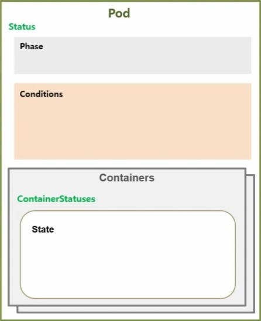

1. Pod > Status > Phase : Pod 의 전체 상태를 대표하는 속성
   1. Pending
   2. Running
   3. Succeeded
   4. Failed
   5. Unknown
2. Pod > Status > Conditions : Pod 가 생성 되면서 실행하는 각 단계와 단계의 상태를 알려주는 속성
   1. Conditions
      1. Initialized
      2. ContainerReady
      3. PodScheduled
      4. Ready
   2. Reason
      1. ContainersNotReady
      2. PodCompleted
3. Pod > Containers > State : Pod 안에 있는 각 Container 를 대표하는 상태
   1. State
      1. Waiting
      2. Running
      3. Terminated
   2. Reason
      1. ContainerCreating
      2. CrashLoopBackOff
      3. Error
      4. Completed

+ Pod 의 전체 상태를 나타내는 것이 Phase 라고 했는데 이 상태가 어떻게 바뀌고 바뀜에 따라 Pod 의 Container 동작이 어떻게 달라지는지 정리 한다.
+ 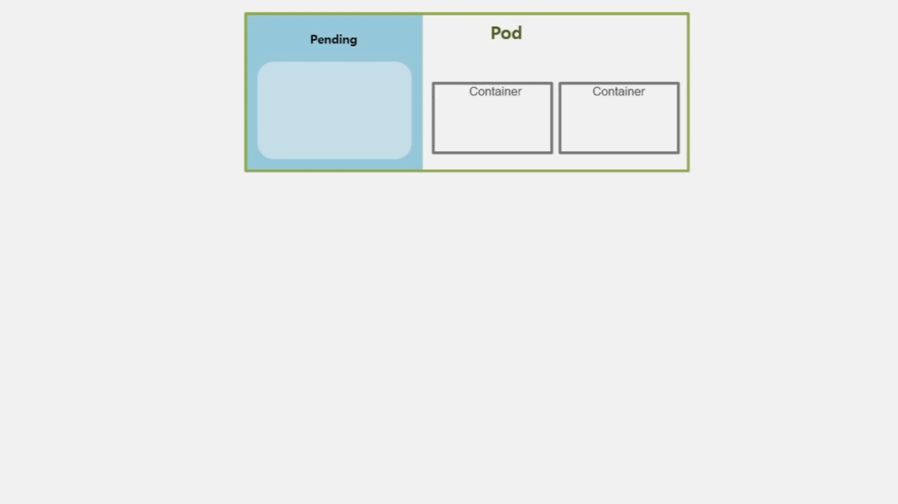

+ 
  + Pod 의 최초 상태는 Pending 이다. 
+ 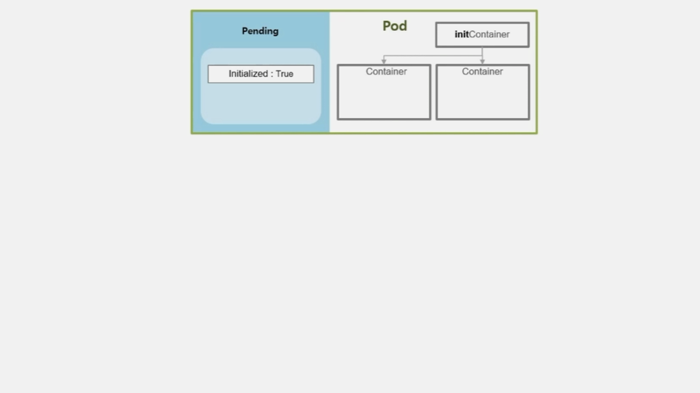
  + 띄우려고 하는 Container 가 기동되기 전에 초기화 해야 하는 내용이 있는 경우 그 내용을 담는 initContainer 가 있다. 
  + 만약 Volume 이나 보안 설정을 위해 사전 설정을 해야 하는 등의 경우에 해당 한다.

~~~yaml

apiVersion: v1
kind: Pod
metadata:
  name: myapp-pod
  labels:
    app: myapp
spec:
  containers:
  - name: myapp-container
    image: busybox:1.28
    command: ['sh', '-c', 'echo The app is running! && sleep 3600']
  initContainers:           # Pod 생성 내용 안에 initContainers 항목으로 초기화 스크립트를 삽입할 수 있다.
  - name: init-myservice
    image: busybox:1.28
    command: ['sh', '-c', 'until nslookup myservice; do echo waiting for myservice; sleep 2; done;']
  - name: init-mydb
    image: busybox:1.28
    command: ['sh', '-c', 'unitl mslookup mydb; do echo waiting for mydb; sleep 2; done;']

~~~

+ 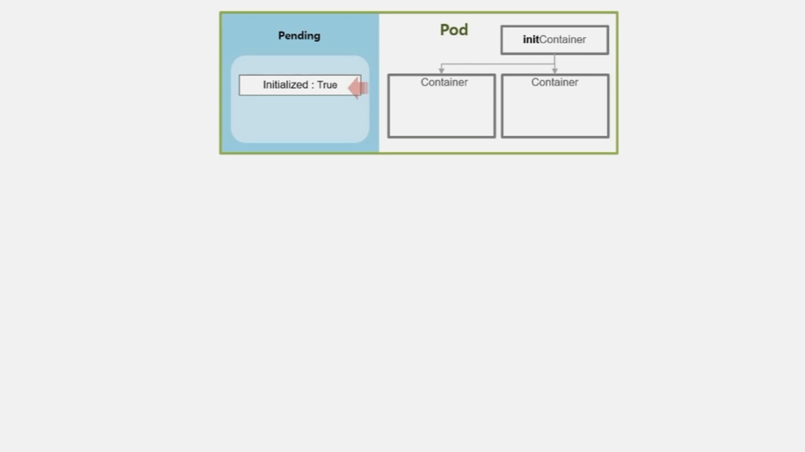
  + initContainer 가 정상적으로 실행 되었거나, Pod 에 설정되어 있지 않았을 경우 Initialized 값이 True 가 되고 실패했을 경우 False 가 된다.
+ 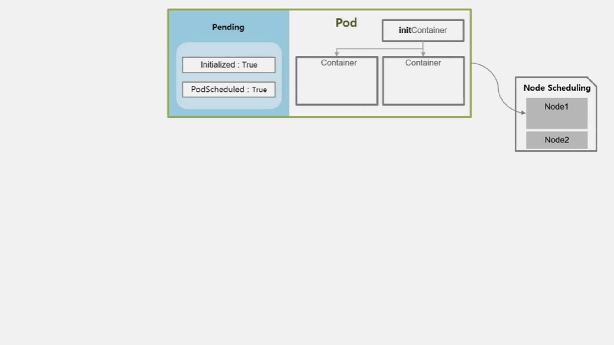
  + 이 Pod 가 올라갈 Node 는 직접 지정한 경우 그 node 에, 지정하지 않은 경우 k8s 가 자원의 상황을 판단하여 올라갈 Node 를 결정 한다.
+ 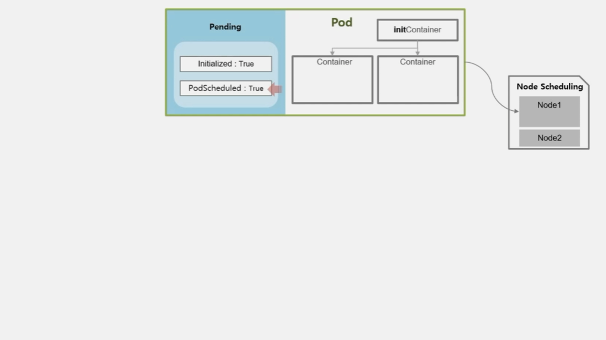
  + Pod 가 올라갈 Node 선정이 완료 되면 PodScheduled 값은 True 가 된다.
+ 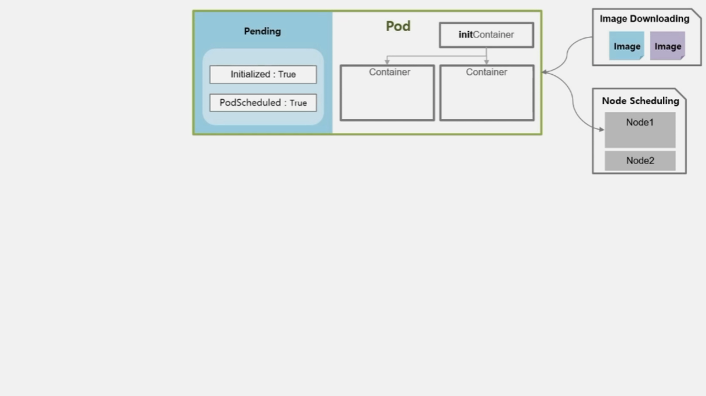
+ 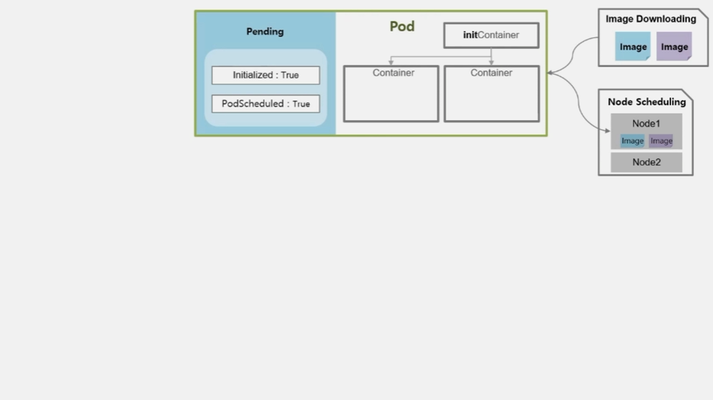
  + Container 에 image 를 다운로드 한다.
+ 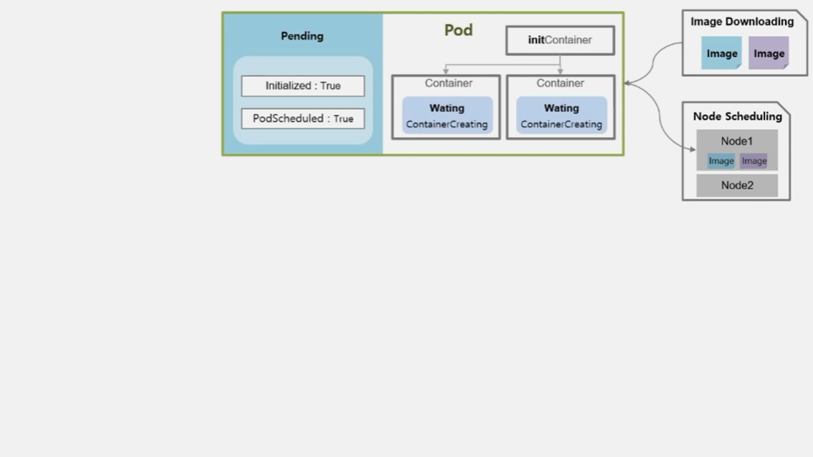
  + Node 를 선정하고 image 를 다운받는 동안 Container 의 상태는 Waiting 이고 reason 은 ContainerCreating 이다.
+ 
  + 본격적으로 Container 가 기동 되면서 Pod 와 Container 의 상태는 Running 이 된다.
+ 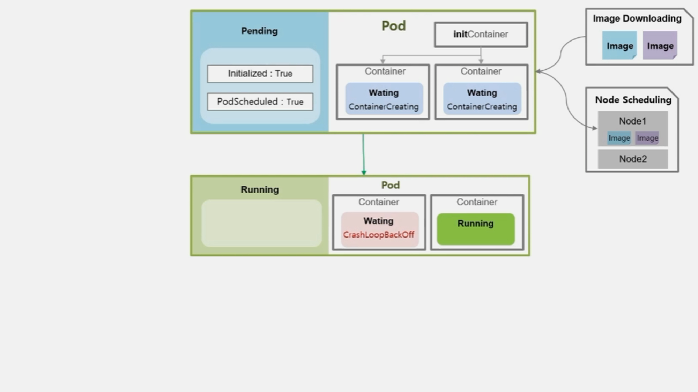
+ 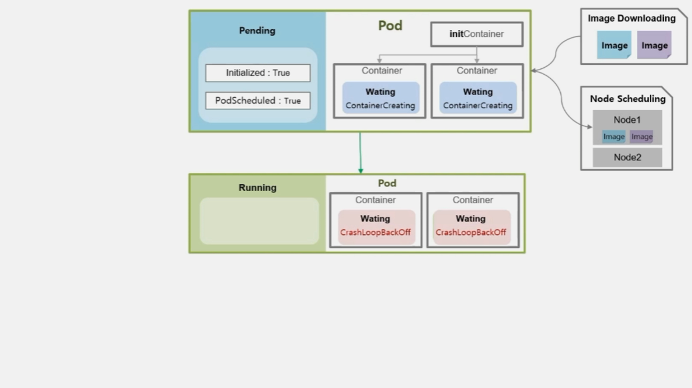
  + 보통 정상적으로 기동이 될 수도 있지만 하나 또는 모든 Container 가 기동 중 문제가 발생하여 재 시작 될 수 있다.
  + 문제가 발생한 경우 Container 의 상태는 Waiting 이고 CrashLoopBackOff 라는 reason 값을 가진다.
+ 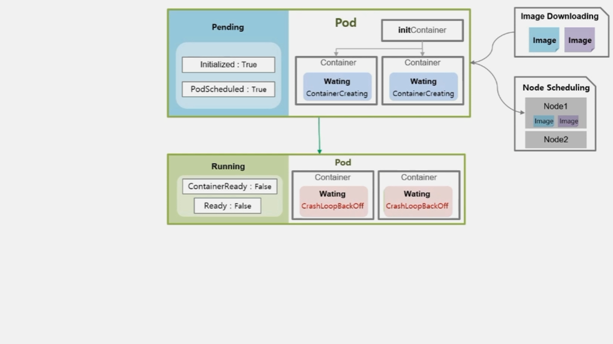
  + Pod 는 Container 의 이런 상태들에 대해 Running 이라고 간주하고, 대신 내부 Condition 에 ContainerReady 와 Ready 값은 False 로 가진다.
+ 
+ 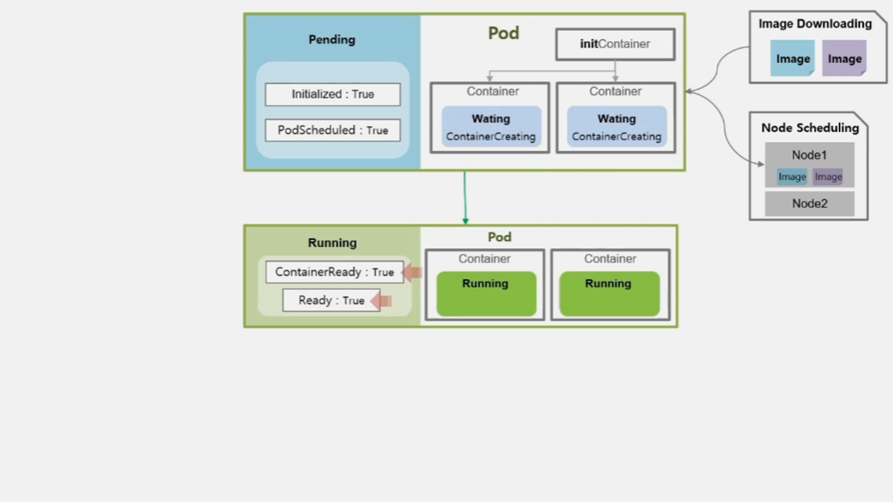
  + 결국 모든 Container 들이 정상적으로 기동 되어 동작 한다면 Condition 들은 모두 True 값이 된다.
  + 그래서 서비스가 계속 운영 되어야 하는 경우 이 status 가 True 인 상태를 계속 유지해야 한다.
  + 여기서 기억해야 할 것은 Pod 의 상태가 Running 이더라도 내부 Container 들의 상태가 Running 이 아닐 수 있기 때문에 Pod 뿐만 아니라 Container 의 상태도 모니터링 해야 한다.
+ 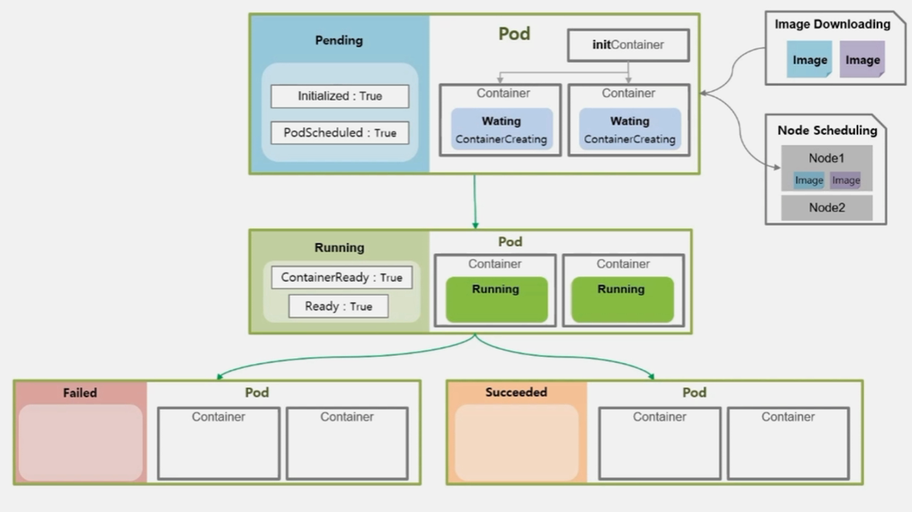
  + Job 이나 CronJob 으로 생성 된 Pod 의 경우 자신의 일을 수행 했을 때는 Running 중 이지만, 일을 마치고 나면 Pod 는 더 이상 일을 하지 않는 상태가 된다. 
  + 이 때 Pod 의 상태는 Failed 나 Succeeded 두 가지 중 하나를 갖는다.
+ 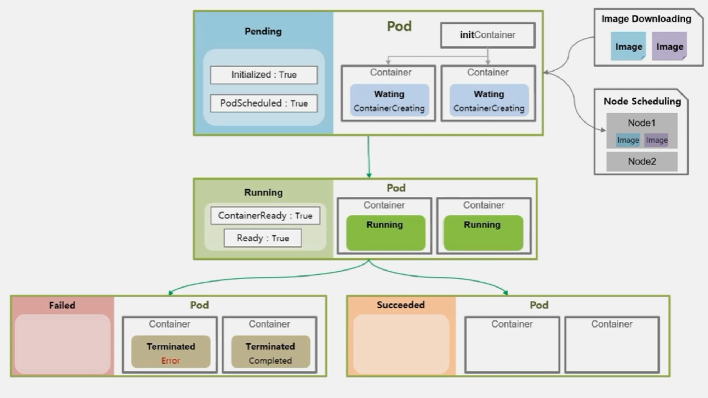
  + 만약 작업을 하고 있는 Container 중에 하나라도 문제가 생겨 에러가 발생 하면 Pod 의 상태는 Failed 가 된다.
+ 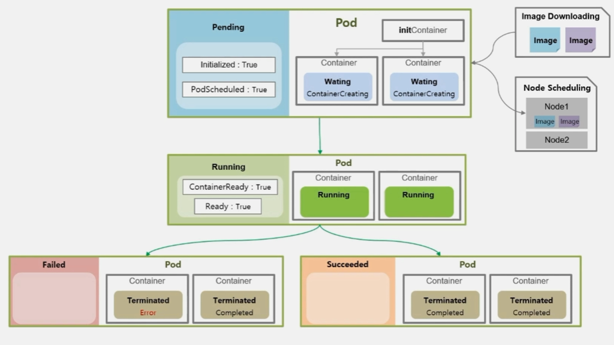
  + Container 들이 모두 Completed 로 일들을 잘 마쳤을 때 Succeeded 가 된다.
+ 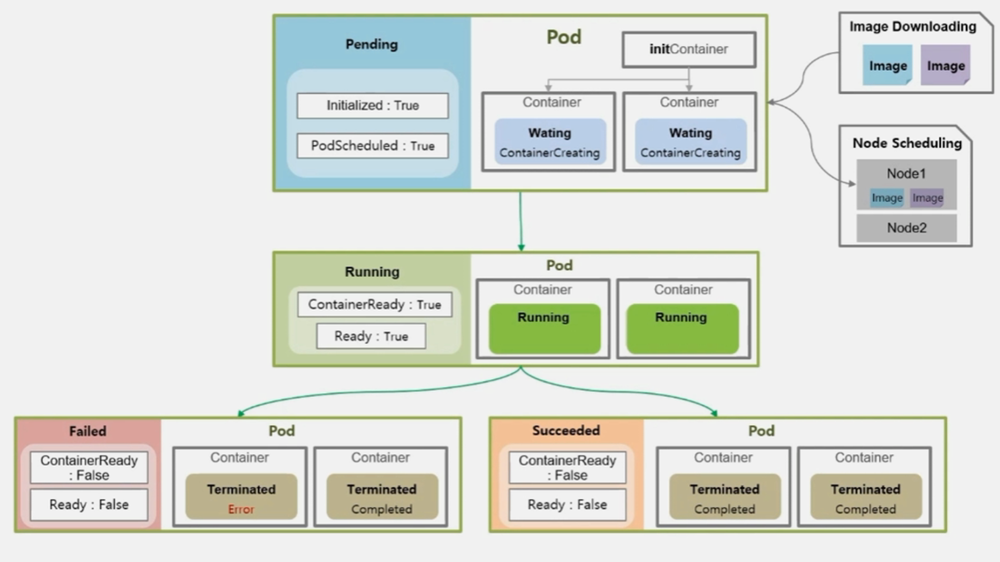
  + 이때 또 Pod 의 Condition 값이 변하게 되는데, 성패 여부를 떠나 ContainerReady 와 Ready 의 값이 False 로 바뀌게 된다.
+ 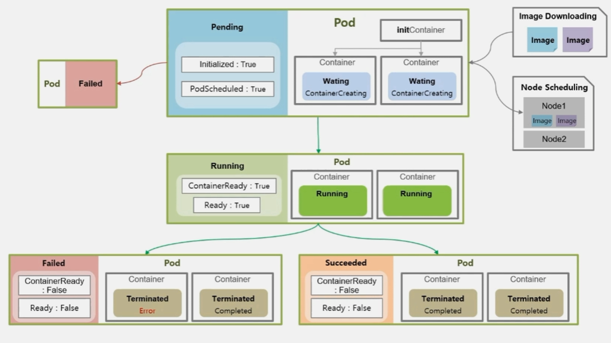
  + 추가적인 경우로 Pending 중에 바로 Failed 로 빠지는 경우도 있다
+ 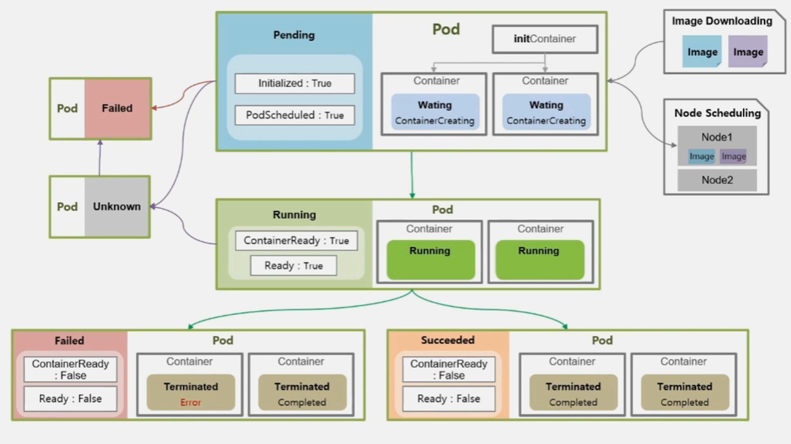
  + Pending 이나 Running 중에 통신 장애가 발생하면 Pod 가 Unknown 상태로 바뀌게 된다
  + 통신 장애 복구가 빨리 이루어지면 다시 기초 상태로 변경 되지만 이 상태가 오래 지속 되면 Failed 로 가기도 한다.

## Pod - ReadinessProbe, LivenessProbe
+ 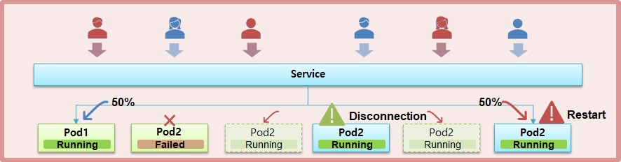
+ 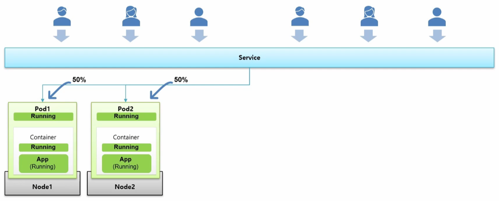
  + Pod 를 만들면 그 안에 Container 가 생기고 Pod 와 Container 의 상태가 Running 이 되면서 그 안에 있는 Application 도 정상적으로 구동이 되고 있을 것이다.
  + 그리고 Service 에 연결 되는데 이 Service 의 IP 가 외부에 노출되어 다수의 사용자에 의해 서비스가 이용 된다.
+ 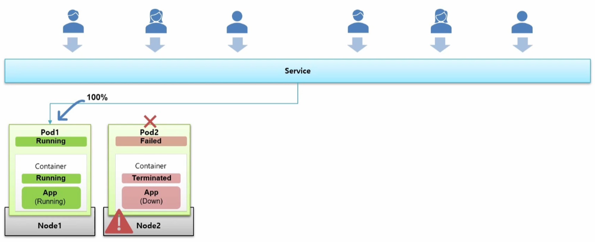
  + 현재 하나의 Service 에 두 개의 Pod 가 연결되어 있고 트래픽이 반으로 나뉜다고 하자.
  + 이 때 Node2 서버가 문제가 생겨 다운이 된 경우 그 위의 Pod 도 Failed 가 되면서 사용자의 모든 트래픽이 Pod1 로 들어가게 된다.
+ 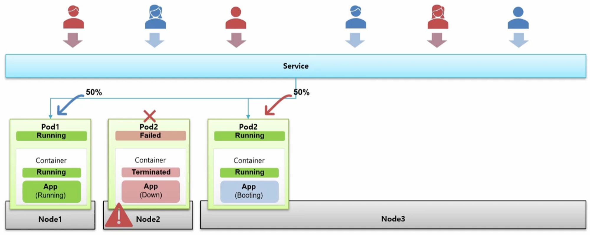
  + Pod1 이 트래픽을 견뎌준다면 서비스를 유지하는데 문제는 없다. 
  + 다운이 된 Pod2 는 Auto Healing 기능에 의해 다른 Node 에 생성을 시도 한다.
  + 그 과정에서 Pod 와 Container 가 Running 상태가 되면서 Service 와 연결 되는데 Application 이 구동 중인 순간이 발생 한다.
  + Service 와 연결이 되자 마자 트래픽이 Pod2 로 유입되기 때문에 Application 이 구동 되는 동안 사용자는 50% 확률로 Error 페이지를 보게 되는 경우가 생기게 된다.
+ 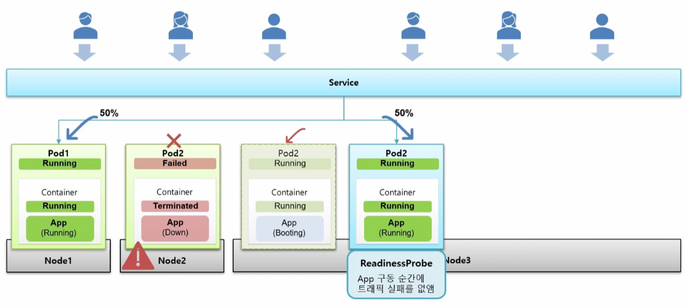
  + **Pod 를 만들 때 ReadinessProbe 를 주게 되면 이런 문제를 피할 수 있다.**
  + Application 이 완전히 구동 되기 전에는 Service 와 연결되지 않도록 해주기 때문이다.
  + 따라서 Pod2 의 상태는 Running 이지만 트래픽은 계속 Pod1 에만 유입 되고 Application 이 완전히 구동 된 것이 확인 되면 Service 와 연결 되면서 트래픽이 분산 된다.
+ 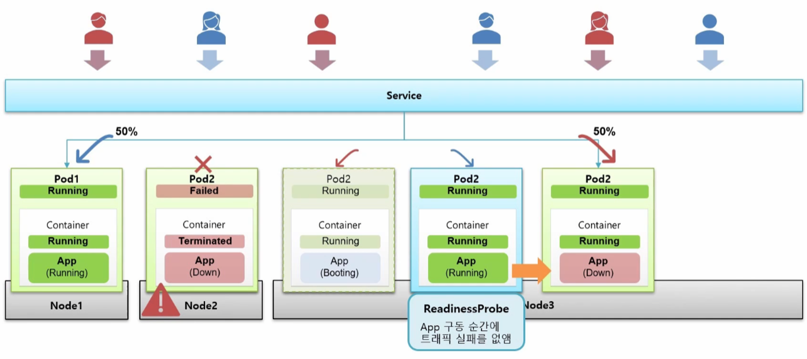
  + 서비스 운영 중 갑자기 Application 에 장애가 발생할 수 있다. 이건 서버에는 문제가 없는데 그 위에 동작하는 Application 자체에만 문제가 생긴 경우와 같다.
+ 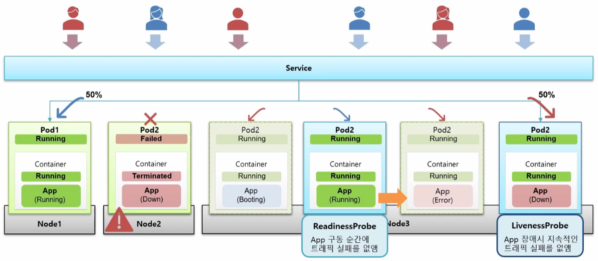
  + **이런 상황을 감지해 주는 게 LivenessProbe 이다**
  + Pod 를 만들 때 LivenessProbe 를 설정하면 Application 에 문제가 발생할 경우 Pod 를 다시 생성하도록 하여 잠시 동안 트래픽 에러는 발생 하지만 지속적으로 에러가 발생하는 것은 방지해 준다.

> 즉, ReadinessProbe 를 설정하여 Application 구동 중 트래픽 실패를 방지하고, LivenessProbe 를 설정하여 Application 장애가 발생한 경우 지속적인 트래픽 실패를 방지할 수 있도록 해야 한다.

### ReadinessProbe, LivenessProbe
> 하나의 Service 에 Pod 가 연결 되어 있는 상태에서 Pod 를 하나 더 생성 할 건데 이 Pod 는 Container 에 HostPath 로 Node 의 Volume 이 연결되어 있다. 
> 기본적으로 ReadinessProbe 와 LivenessProbe 는 사용 목적만 다를 뿐이고 설정할 수 있는 내용은 동일하다.

+ 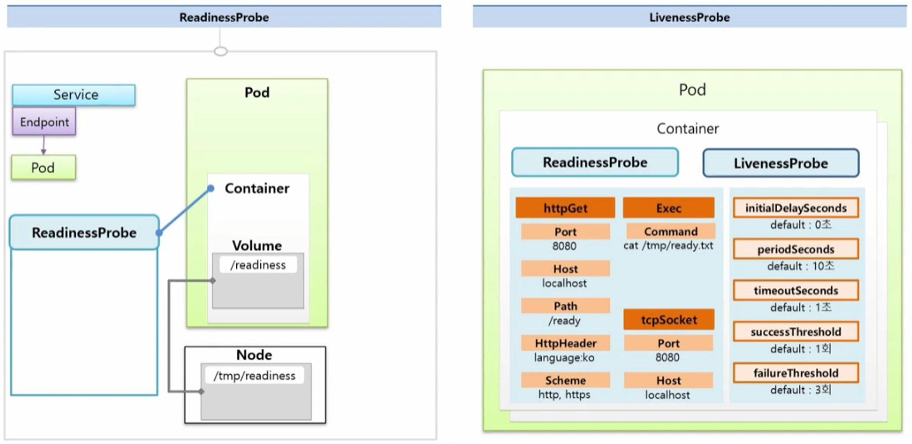
  + 공통으로 들어가는 속성들을 보면 크게 httpGet, Exec, tcpSocket 으로 해당 Application 의 상태를 확인할 수 있다.
  + httpGet
    + Port, Host, Path, HttpHeader, Scheme 을 확인할 수 있다.
  + Exec
    + Command 를 사용해서 특정 명령어를 전송하여 그에 따른 결과를 확인할 수 있다.
  + tcpSocket
    + ort, Host 를 통해 ReadinessProbe 와 LivenessProbe 의 성공 여부를 확인할 수 있다.
  + 추가로 설정할 수 있는 옵션 값이 있다.
  + initialDelaySeconds
    + 최초 Probe 를 하기 전에 딜레이 시간
    + default : 0 초
  + periodSeconds
    + Probe 를 체크하는 시간의 간격
    + default : 10 초
  + timeoutSeconds
    + 결과가 도착해야 하는 시간
    + default : 1 초
  + successThreshold
    + 몇 번 성공 결과를 받아야 정말 성공인지 설정
    + default : 1 회
  + failureThreshold
    + 몇 번 실패 결과를 받아야 정말 실패인지 설정
    + default : 3 회

#### ReadinessProbe
> Exec 를 사용해서 Command 로 ready.txt 파일을 조회 한다.

+ 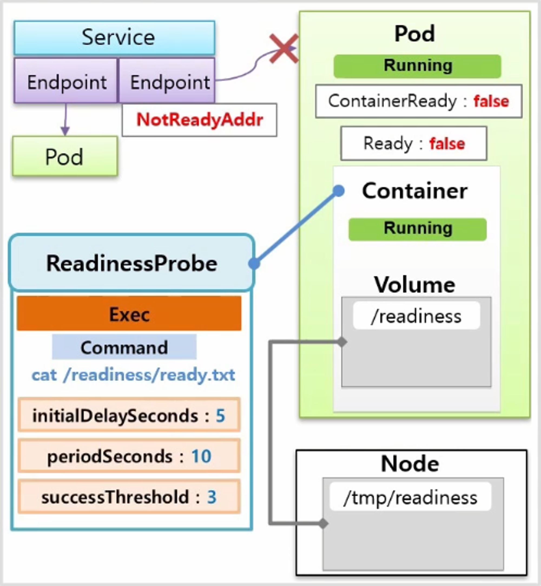
  + 최초 delay 5초, 체크 간격 10초, 3번 성공 시 정상 구동으로 설정했다면 Pod 를 만들 때 Node 가 Schedule 되고 이미지가 다운 받아 지면서 Pod 와 Container 상태는 Running 이 되지만 이 Probe 가 성공하기 전까지는 Condition 에 Container Ready 상태와 Ready 상태가 false 로 남아 있고 EndPoint 에서는 이 Pod 의 IP 를 NotReadyAddr 로 간주하고 Service 에 연결하지 않는다.
+ 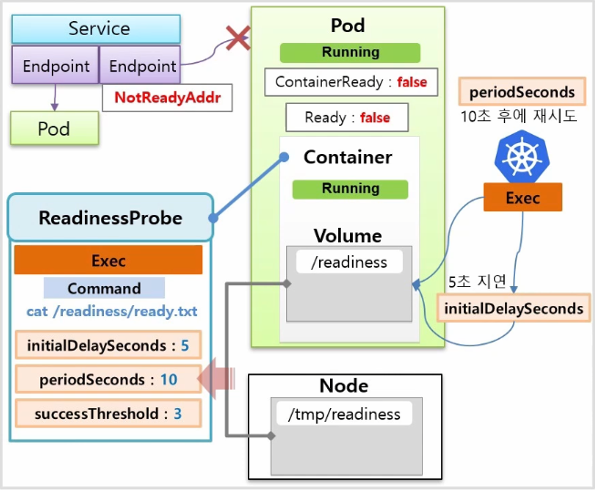
  + k8s 는 ReadinessProbe 의 내용 대로 Application 의 기동 상태를 체크하는데, Container 상태가 Running 이 되면 최초 5초간 지연 하고 있다가 5초가 지나면 ready.txt 파일이 있는지 체크해보고, 파일이 없으면 10초 후에 다시 체크를 하게 된다.
+ 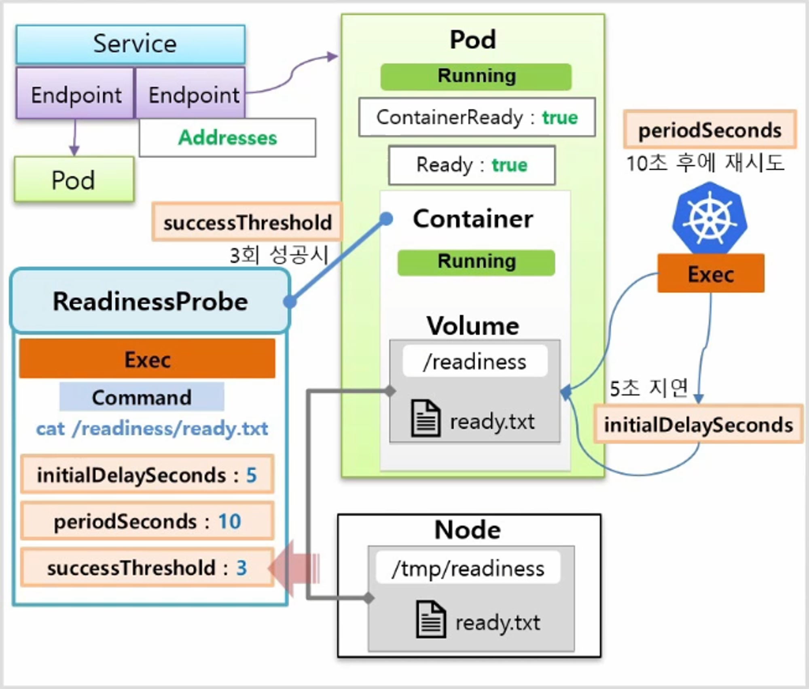
  + 이 Node 에 Ready.txt 라는 데이터를 추가하면 Container 의 Volume 과 연결 되어 있기 때문에 다음에 ReadinessProbe 를 체크할 때 성공 결과를 받게 된다. 그리고 3번 성공하게 되면 Condition 의 상태는 true 가 되고 EndPoint 도 정상적으로 Address 로 간주 하면서 Service 와 연결 되게 된다.

~~~yaml

apiVersion: v1
kind: Service
metadata:
  name: svc-readiness
spec:
  selector:
    app: readiness
  ports:
  - port: 8080
    targetPort: 8080

~~~

~~~yaml

apiVersion: v1
kind: Pod
metadata:
  name: pod1
  labels:
    app: readiness  
spec:
  containers:
  - name: container
    image: kubetm/app
    ports:
    - containerPort: 8080	
  terminationGracePeriodSeconds: 0

~~~

~~~shell

while true; do date && curl 10.97.190.80:8080/hostname; sleep 1; done

~~~

~~~yaml

apiVersion: v1
kind: Pod
metadata:
  name: pod-readiness-exec1
  labels:
    app: readiness  
spec:
  containers:
  - name: readiness
    image: kubetm/app
    ports:
    - containerPort: 8080	
    readinessProbe: # readiness라는 컨테이너 이름에 readinessprobe 내용이 들어간다
      exec:
        command: ["cat", "/readiness/ready.txt"]  # exec로 커멘드를 날릴 건데 이 ready.txt 파일의 내용을 읽어보는 커멘드
      initialDelaySeconds: 5 # 옵션 
      periodSeconds: 10 # 옵션
      successThreshold: 3 # 옵션
    volumeMounts:
    - name: host-path
      mountPath: /readiness
  volumes:
  - name : host-path
    hostPath: # 호스트패스로 노드와 볼륨을 연결
      path: /tmp/readiness
      type: DirectoryOrCreate
  terminationGracePeriodSeconds: 0

~~~

~~~shell

kubectl get events -w | grep pod-readiness-exec1
kubectl describe pod pod-readiness-exec1 | grep -A5 Conditions
kubectl describe endpoints svc-readiness
touch ready.txt

~~~

#### LivenessProbe
> 하나의 Service 에 두 개의 Pod 가 Running 되고 있는 상태를 가정 한다. 
> 이 중 한 Application 의 내용을 보면 /health 라는 요청을 보내면 Status 로 200을 주면서 서비스가 정상 운영 중이라는 Health Check 가 만들어져 있다.

+ 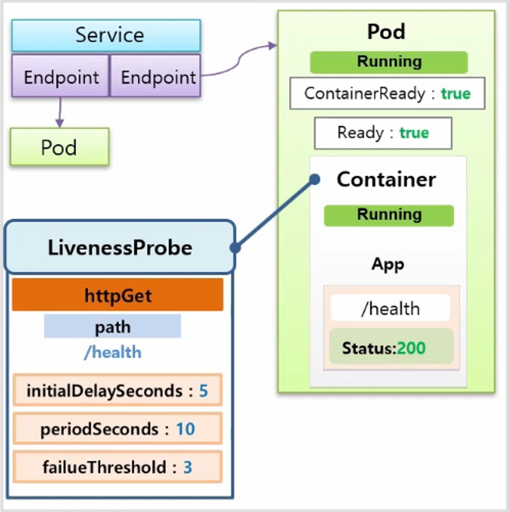
  + 그리고 이 Container 에는 LivenessProbe 가 설정되어 있고, 내용은 httpGet 으로 path에 /health 경로를 체크 한다. 옵션으로는 최초 5초 지연과 10초 간격 체크 그리고 3번 실패 할 경우 Pod 가 재시작 하도록 설정 했다.
+ 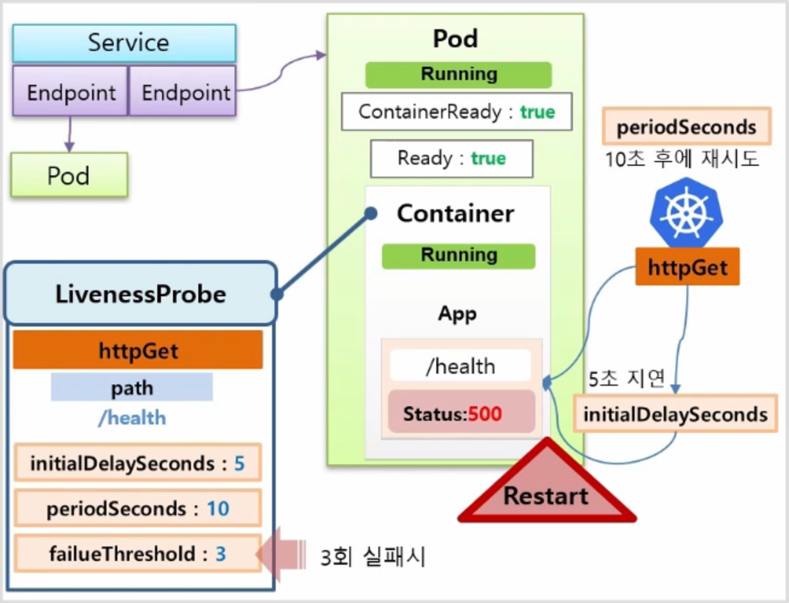
  + k8s 가 httpGet 으로 5초 후에 해당 path 를 체크해보고 200 응답을 받을 것이다.
  + 그리고 10초 후 다시 체크할 때고 200 응답을 받으면서 서비스가 정상 운영 중이라고 판단 하게 된다.
  + 그러던 중 어느 순간 path 를 호출했을 때 Internal Server Error 를 발생 하면서 500 응답을 받았다고 하자. 하지만 Pod 는 Running 상태로 남아 있는다.
  + 그렇게 3번을 500응답을 받게 되면 k8s 는 문제가 있다고 판단하고 이 Pod 를 Restart 한다.

~~~yaml

apiVersion: v1
kind: Service
metadata:
  name: svc-liveness
spec:
  selector:
    app: liveness
  ports:
  - port: 8080
    targetPort: 8080

~~~

~~~yaml

apiVersion: v1
kind: Pod
metadata:
  name: pod2
  labels:
    app: liveness
spec:
  containers:
  - name: container
    image: kubetm/app
    ports:
    - containerPort: 8080
  terminationGracePeriodSeconds: 0

~~~

~~~yaml

apiVersion: v1
kind: Pod
metadata:
  name: pod-liveness-httpget1
  labels:
    app: liveness
spec:
  containers:
  - name: liveness
    image: kubetm/app
    ports:
    - containerPort: 8080
    livenessProbe:
      httpGet: # http get으로 경로와 포트로 체크
        path: /health
        port: 8080
      initialDelaySeconds: 5 # 옵션
      periodSeconds: 10 # 옵션
      failureThreshold: 3 # 옵션
  terminationGracePeriodSeconds: 0

~~~

~~~shell

while true; do date && curl 10.103.160.58:8080/health; sleep 1; done
watch "kubectl describe pod pod-liveness-httpget1 | grep -A10 Events"
curl 20.109.131.43:8080/status500

~~~
