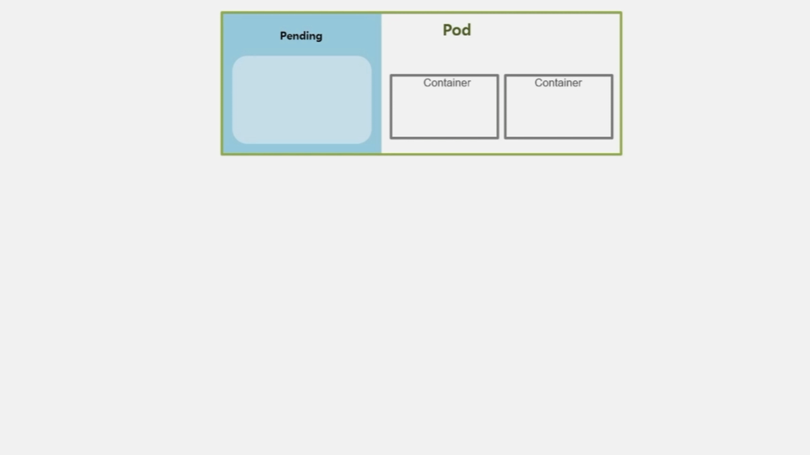
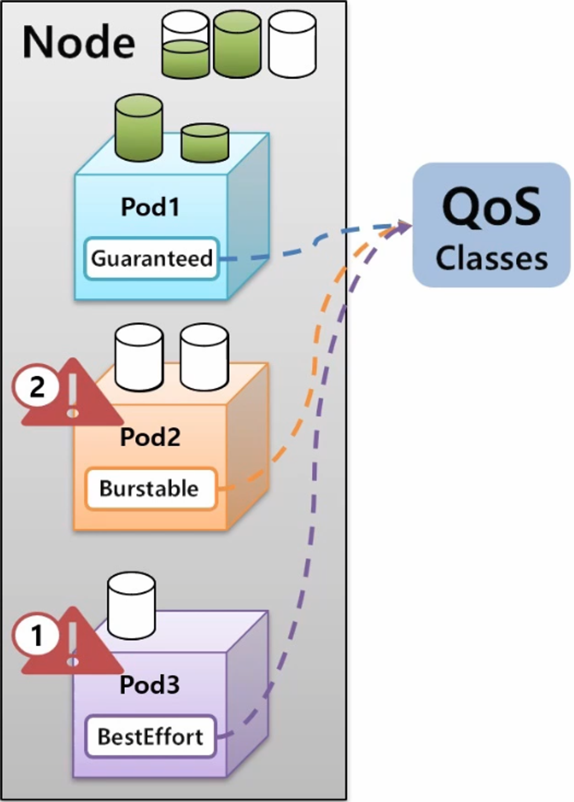

# Pod

# Pod

* toc
{:toc}

## Pod - Lifecycle
+ Pod 에는 Lifecycle 이 존재하고 어떤 Pod 든 만들어지고 사라지는 과정을 거치게 된다.
+ Lifecycle 은 각 단계 별로 하는 행동이 다르다는 특징을 갖는다. 
+ Pod 역시 단계별로 주요 행동들이 있고, 앞으로 알아 볼 ReadinessProbe, LivenessProbe, Qos, Policy 등 다양한 기능들이 Pod 의 특정 단계와 관련이 있기 때문에 Lifecycle 에 대해 잘 알아야 한다.
+ Pod 를 생성하고 나면 아래와 같이 Status 에 대한 값을 확인할 수 있다.

~~~yaml

status:
  phase: Pending
  conditions:
    - type: Initialized
      status: 'True'
      lastProbeTime: null
      lastTransitionTime: '2019-09-26T22:07:56Z'
    - type: PodScheduled
      status: 'True'
      lastProbeTime: null
      lastTransitionTime: '2019-09-26T22:07:56Z'
    - type: ContainersReady
      status: 'False'
      lastProbeTime: null
      lastTransitionTime: '2019-09-26T22:08:11Z'
      reason: ContainersNotReady
    - type: Ready
      status: 'False'
      lastProbeTime: null
      lastTransitionTime: '2019-09-26T22:08:11Z'
      reason: ContainersNotReady

containerStatuses:
  - name: container
    state:
      waiting:
        reason: ContainerCreating
      lastState: {}
      ready: false
      restartCount: 0
      image: tmkube/init
      imageID: ""
      started: false

~~~

+ 상기 내용에 대한 전체적인 구조는 아래와 같다.
+ 

1. Pod > Status > Phase : Pod 의 전체 상태를 대표하는 속성
   1. Pending
   2. Running
   3. Succeeded
   4. Failed
   5. Unknown
2. Pod > Status > Conditions : Pod 가 생성 되면서 실행하는 각 단계와 단계의 상태를 알려주는 속성
   1. Conditions
      1. Initialized
      2. ContainerReady
      3. PodScheduled
      4. Ready
   2. Reason
      1. ContainersNotReady
      2. PodCompleted
3. Pod > Containers > State : Pod 안에 있는 각 Container 를 대표하는 상태
   1. State
      1. Waiting
      2. Running
      3. Terminated
   2. Reason
      1. ContainerCreating
      2. CrashLoopBackOff
      3. Error
      4. Completed

+ Pod 의 전체 상태를 나타내는 것이 Phase 라고 했는데 이 상태가 어떻게 바뀌고 바뀜에 따라 Pod 의 Container 동작이 어떻게 달라지는지 정리 한다.
+ 

+ 
  + Pod 의 최초 상태는 Pending 이다. 
+ 
  + 띄우려고 하는 Container 가 기동되기 전에 초기화 해야 하는 내용이 있는 경우 그 내용을 담는 initContainer 가 있다. 
  + 만약 Volume 이나 보안 설정을 위해 사전 설정을 해야 하는 등의 경우에 해당 한다.

~~~yaml

apiVersion: v1
kind: Pod
metadata:
  name: myapp-pod
  labels:
    app: myapp
spec:
  containers:
  - name: myapp-container
    image: busybox:1.28
    command: ['sh', '-c', 'echo The app is running! && sleep 3600']
  initContainers:           # Pod 생성 내용 안에 initContainers 항목으로 초기화 스크립트를 삽입할 수 있다.
  - name: init-myservice
    image: busybox:1.28
    command: ['sh', '-c', 'until nslookup myservice; do echo waiting for myservice; sleep 2; done;']
  - name: init-mydb
    image: busybox:1.28
    command: ['sh', '-c', 'unitl mslookup mydb; do echo waiting for mydb; sleep 2; done;']

~~~

+ 
  + initContainer 가 정상적으로 실행 되었거나, Pod 에 설정되어 있지 않았을 경우 Initialized 값이 True 가 되고 실패했을 경우 False 가 된다.
+ 
  + 이 Pod 가 올라갈 Node 는 직접 지정한 경우 그 node 에, 지정하지 않은 경우 k8s 가 자원의 상황을 판단하여 올라갈 Node 를 결정 한다.
+ 
  + Pod 가 올라갈 Node 선정이 완료 되면 PodScheduled 값은 True 가 된다.
+ 
+ 
  + Container 에 image 를 다운로드 한다.
+ 
  + Node 를 선정하고 image 를 다운받는 동안 Container 의 상태는 Waiting 이고 reason 은 ContainerCreating 이다.
+ 
  + 본격적으로 Container 가 기동 되면서 Pod 와 Container 의 상태는 Running 이 된다.
+ 
+ 
  + 보통 정상적으로 기동이 될 수도 있지만 하나 또는 모든 Container 가 기동 중 문제가 발생하여 재 시작 될 수 있다.
  + 문제가 발생한 경우 Container 의 상태는 Waiting 이고 CrashLoopBackOff 라는 reason 값을 가진다.
+ 
  + Pod 는 Container 의 이런 상태들에 대해 Running 이라고 간주하고, 대신 내부 Condition 에 ContainerReady 와 Ready 값은 False 로 가진다.
+ 
+ 
  + 결국 모든 Container 들이 정상적으로 기동 되어 동작 한다면 Condition 들은 모두 True 값이 된다.
  + 그래서 서비스가 계속 운영 되어야 하는 경우 이 status 가 True 인 상태를 계속 유지해야 한다.
  + 여기서 기억해야 할 것은 Pod 의 상태가 Running 이더라도 내부 Container 들의 상태가 Running 이 아닐 수 있기 때문에 Pod 뿐만 아니라 Container 의 상태도 모니터링 해야 한다.
+ 
  + Job 이나 CronJob 으로 생성 된 Pod 의 경우 자신의 일을 수행 했을 때는 Running 중 이지만, 일을 마치고 나면 Pod 는 더 이상 일을 하지 않는 상태가 된다. 
  + 이 때 Pod 의 상태는 Failed 나 Succeeded 두 가지 중 하나를 갖는다.
+ 
  + 만약 작업을 하고 있는 Container 중에 하나라도 문제가 생겨 에러가 발생 하면 Pod 의 상태는 Failed 가 된다.
+ 
  + Container 들이 모두 Completed 로 일들을 잘 마쳤을 때 Succeeded 가 된다.
+ 
  + 이때 또 Pod 의 Condition 값이 변하게 되는데, 성패 여부를 떠나 ContainerReady 와 Ready 의 값이 False 로 바뀌게 된다.
+ 
  + 추가적인 경우로 Pending 중에 바로 Failed 로 빠지는 경우도 있다
+ 
  + Pending 이나 Running 중에 통신 장애가 발생하면 Pod 가 Unknown 상태로 바뀌게 된다
  + 통신 장애 복구가 빨리 이루어지면 다시 기초 상태로 변경 되지만 이 상태가 오래 지속 되면 Failed 로 가기도 한다.

## Pod - ReadinessProbe, LivenessProbe
+ 
+ 
  + Pod 를 만들면 그 안에 Container 가 생기고 Pod 와 Container 의 상태가 Running 이 되면서 그 안에 있는 Application 도 정상적으로 구동이 되고 있을 것이다.
  + 그리고 Service 에 연결 되는데 이 Service 의 IP 가 외부에 노출되어 다수의 사용자에 의해 서비스가 이용 된다.
+ 
  + 현재 하나의 Service 에 두 개의 Pod 가 연결되어 있고 트래픽이 반으로 나뉜다고 하자.
  + 이 때 Node2 서버가 문제가 생겨 다운이 된 경우 그 위의 Pod 도 Failed 가 되면서 사용자의 모든 트래픽이 Pod1 로 들어가게 된다.
+ 
  + Pod1 이 트래픽을 견뎌준다면 서비스를 유지하는데 문제는 없다. 
  + 다운이 된 Pod2 는 Auto Healing 기능에 의해 다른 Node 에 생성을 시도 한다.
  + 그 과정에서 Pod 와 Container 가 Running 상태가 되면서 Service 와 연결 되는데 Application 이 구동 중인 순간이 발생 한다.
  + Service 와 연결이 되자 마자 트래픽이 Pod2 로 유입되기 때문에 Application 이 구동 되는 동안 사용자는 50% 확률로 Error 페이지를 보게 되는 경우가 생기게 된다.
+ 
  + **Pod 를 만들 때 ReadinessProbe 를 주게 되면 이런 문제를 피할 수 있다.**
  + Application 이 완전히 구동 되기 전에는 Service 와 연결되지 않도록 해주기 때문이다.
  + 따라서 Pod2 의 상태는 Running 이지만 트래픽은 계속 Pod1 에만 유입 되고 Application 이 완전히 구동 된 것이 확인 되면 Service 와 연결 되면서 트래픽이 분산 된다.
+ 
  + 서비스 운영 중 갑자기 Application 에 장애가 발생할 수 있다. 이건 서버에는 문제가 없는데 그 위에 동작하는 Application 자체에만 문제가 생긴 경우와 같다.
+ 
  + **이런 상황을 감지해 주는 게 LivenessProbe 이다**
  + Pod 를 만들 때 LivenessProbe 를 설정하면 Application 에 문제가 발생할 경우 Pod 를 다시 생성하도록 하여 잠시 동안 트래픽 에러는 발생 하지만 지속적으로 에러가 발생하는 것은 방지해 준다.

> 즉, ReadinessProbe 를 설정하여 Application 구동 중 트래픽 실패를 방지하고, LivenessProbe 를 설정하여 Application 장애가 발생한 경우 지속적인 트래픽 실패를 방지할 수 있도록 해야 한다.

### ReadinessProbe, LivenessProbe
> 하나의 Service 에 Pod 가 연결 되어 있는 상태에서 Pod 를 하나 더 생성 할 건데 이 Pod 는 Container 에 HostPath 로 Node 의 Volume 이 연결되어 있다. 
> 기본적으로 ReadinessProbe 와 LivenessProbe 는 사용 목적만 다를 뿐이고 설정할 수 있는 내용은 동일하다.

+ 
  + 공통으로 들어가는 속성들을 보면 크게 httpGet, Exec, tcpSocket 으로 해당 Application 의 상태를 확인할 수 있다.
  + httpGet
    + Port, Host, Path, HttpHeader, Scheme 을 확인할 수 있다.
  + Exec
    + Command 를 사용해서 특정 명령어를 전송하여 그에 따른 결과를 확인할 수 있다.
  + tcpSocket
    + ort, Host 를 통해 ReadinessProbe 와 LivenessProbe 의 성공 여부를 확인할 수 있다.
  + 추가로 설정할 수 있는 옵션 값이 있다.
  + initialDelaySeconds
    + 최초 Probe 를 하기 전에 딜레이 시간
    + default : 0 초
  + periodSeconds
    + Probe 를 체크하는 시간의 간격
    + default : 10 초
  + timeoutSeconds
    + 결과가 도착해야 하는 시간
    + default : 1 초
  + successThreshold
    + 몇 번 성공 결과를 받아야 정말 성공인지 설정
    + default : 1 회
  + failureThreshold
    + 몇 번 실패 결과를 받아야 정말 실패인지 설정
    + default : 3 회

#### ReadinessProbe
> Exec 를 사용해서 Command 로 ready.txt 파일을 조회 한다.

+ 
  + 최초 delay 5초, 체크 간격 10초, 3번 성공 시 정상 구동으로 설정했다면 Pod 를 만들 때 Node 가 Schedule 되고 이미지가 다운 받아 지면서 Pod 와 Container 상태는 Running 이 되지만 이 Probe 가 성공하기 전까지는 Condition 에 Container Ready 상태와 Ready 상태가 false 로 남아 있고 EndPoint 에서는 이 Pod 의 IP 를 NotReadyAddr 로 간주하고 Service 에 연결하지 않는다.
+ 
  + k8s 는 ReadinessProbe 의 내용 대로 Application 의 기동 상태를 체크하는데, Container 상태가 Running 이 되면 최초 5초간 지연 하고 있다가 5초가 지나면 ready.txt 파일이 있는지 체크해보고, 파일이 없으면 10초 후에 다시 체크를 하게 된다.
+ 
  + 이 Node 에 Ready.txt 라는 데이터를 추가하면 Container 의 Volume 과 연결 되어 있기 때문에 다음에 ReadinessProbe 를 체크할 때 성공 결과를 받게 된다. 그리고 3번 성공하게 되면 Condition 의 상태는 true 가 되고 EndPoint 도 정상적으로 Address 로 간주 하면서 Service 와 연결 되게 된다.

~~~yaml

apiVersion: v1
kind: Service
metadata:
  name: svc-readiness
spec:
  selector:
    app: readiness
  ports:
  - port: 8080
    targetPort: 8080

~~~

~~~yaml

apiVersion: v1
kind: Pod
metadata:
  name: pod1
  labels:
    app: readiness  
spec:
  containers:
  - name: container
    image: kubetm/app
    ports:
    - containerPort: 8080	
  terminationGracePeriodSeconds: 0

~~~

~~~shell

while true; do date && curl 10.97.190.80:8080/hostname; sleep 1; done

~~~

~~~yaml

apiVersion: v1
kind: Pod
metadata:
  name: pod-readiness-exec1
  labels:
    app: readiness  
spec:
  containers:
  - name: readiness
    image: kubetm/app
    ports:
    - containerPort: 8080	
    readinessProbe: # readiness라는 컨테이너 이름에 readinessprobe 내용이 들어간다
      exec:
        command: ["cat", "/readiness/ready.txt"]  # exec로 커멘드를 날릴 건데 이 ready.txt 파일의 내용을 읽어보는 커멘드
      initialDelaySeconds: 5 # 옵션 
      periodSeconds: 10 # 옵션
      successThreshold: 3 # 옵션
    volumeMounts:
    - name: host-path
      mountPath: /readiness
  volumes:
  - name : host-path
    hostPath: # 호스트패스로 노드와 볼륨을 연결
      path: /tmp/readiness
      type: DirectoryOrCreate
  terminationGracePeriodSeconds: 0

~~~

~~~shell

kubectl get events -w | grep pod-readiness-exec1
kubectl describe pod pod-readiness-exec1 | grep -A5 Conditions
kubectl describe endpoints svc-readiness
touch ready.txt

~~~

#### LivenessProbe
> 하나의 Service 에 두 개의 Pod 가 Running 되고 있는 상태를 가정 한다. 
> 이 중 한 Application 의 내용을 보면 /health 라는 요청을 보내면 Status 로 200을 주면서 서비스가 정상 운영 중이라는 Health Check 가 만들어져 있다.

+ 
  + 그리고 이 Container 에는 LivenessProbe 가 설정되어 있고, 내용은 httpGet 으로 path에 /health 경로를 체크 한다. 옵션으로는 최초 5초 지연과 10초 간격 체크 그리고 3번 실패 할 경우 Pod 가 재시작 하도록 설정 했다.
+ 
  + k8s 가 httpGet 으로 5초 후에 해당 path 를 체크해보고 200 응답을 받을 것이다.
  + 그리고 10초 후 다시 체크할 때고 200 응답을 받으면서 서비스가 정상 운영 중이라고 판단 하게 된다.
  + 그러던 중 어느 순간 path 를 호출했을 때 Internal Server Error 를 발생 하면서 500 응답을 받았다고 하자. 하지만 Pod 는 Running 상태로 남아 있는다.
  + 그렇게 3번을 500응답을 받게 되면 k8s 는 문제가 있다고 판단하고 이 Pod 를 Restart 한다.

~~~yaml

apiVersion: v1
kind: Service
metadata:
  name: svc-liveness
spec:
  selector:
    app: liveness
  ports:
  - port: 8080
    targetPort: 8080

~~~

~~~yaml

apiVersion: v1
kind: Pod
metadata:
  name: pod2
  labels:
    app: liveness
spec:
  containers:
  - name: container
    image: kubetm/app
    ports:
    - containerPort: 8080
  terminationGracePeriodSeconds: 0

~~~

~~~yaml

apiVersion: v1
kind: Pod
metadata:
  name: pod-liveness-httpget1
  labels:
    app: liveness
spec:
  containers:
  - name: liveness
    image: kubetm/app
    ports:
    - containerPort: 8080
    livenessProbe:
      httpGet: # http get으로 경로와 포트로 체크
        path: /health
        port: 8080
      initialDelaySeconds: 5 # 옵션
      periodSeconds: 10 # 옵션
      failureThreshold: 3 # 옵션
  terminationGracePeriodSeconds: 0

~~~

~~~shell

while true; do date && curl 10.103.160.58:8080/health; sleep 1; done
watch "kubectl describe pod pod-liveness-httpget1 | grep -A10 Events"
curl 20.109.131.43:8080/status500

~~~

## Pod - QoS Classes
+ 
  + 리소스를 균등하게 사용하고 있는 3개의 Pod 를 가진 Node 가 있다.
+ 
  + 각 Pod 가 Node 의 리소스를 균등하게 사용하고 있기 때문에 특정 Pod 에 추가 리소스를 할당 할 수 없는 상황에서 Pod1 이 추가 리소스를 필요로 하는 상황이 발생 했다.
  + 그럼 Pod1 이 리소스 부족으로 에러가 발생하고 다운 되어야 할까? 아니면 다른 Pod2 나 Pod3 을 다운시키고 Pod1 에 추가 리소스를 할당 해야 할까?
+ 
  + k8s 에는 Application 의 중요도에 따라 이런 상황을 핸들링 할 수 있도록 세 가지 단계로 Quality of Service 를 지원해주고 있다.
  + 지금 상황에서는 BestEffort 가 부여 된 Pod 가 가장 먼저 다운이 되고 리소스가 반환 되고 Pod1 은 필요한 리소스를 제공받아 사용할 수 있게 된다.
+ 
  + Node 에 어느정도 자원이 남아 있지만 Pod2 에서 그보다 많은 자원을 필요로 한다면 Burstable 이 적용 된 Pod 가 다음으로 다운 되면서 리소스가 반환 된다.
  + 그래서 Guaranteed 가 마지막까지 Pod 를 안정적으로 유지시켜주는 Class 이다.
+ 
  + QoS 는 특별한 속성이 있어서 설정할 수 있는 것은 아니다.
  + Container 의 resource 설정이 있는데, 여기에 requests 와 limits 에 따라 memory 와 cpu 를 어떻게 설정 할지 결정 한다.

### Guaranteed
+ 
  + Pod 에 다수의 Container 가 있을 경우 각각의 Container 마다 Request 와 Limit 가 있어야 한다.
  + 그리고 그 안에 memory 와 cpu 둘 다 설정 되어 있어야 하고, 각 Container 안에 설정 된 memory 와 cpu 값은 request 와 limit 가 같아야 한다.
  + 이 모든 규칙은 만족 해야 k8s 가 이 Pod 를 Guaranteed Class 로 판단하고 Pod 의 어떤 Container 에도 request 와 limit 가 설정되어있지 않다면 BestEffort 가 된다.

### Burstable
+ 
  + Guaranteed 와 BestEffort 의 중간이라고 생각하면 된다.
  + 가령 Container 마다 request 와 limit 는 설정되어 있지만 request 의 값이 더 작다던가, request 만 설정 되었다던가 또는 Pod 의 Container 가 두 개인데 하나만 완벽하게 설정 되어 있는 경우 모두 Bustable Class 가 된다.
  + 추가로 Bustable Class 에 다수의 Pod 가 있을 경우 어떤 Pod 가 먼저 다운 되어 리소스를 반환하는지에 대해서도 알 필요가 있다. 이것은 OOM(Out Of Memory) Score 에 따라 결정 된다.
+ 
  + 현재 Pod2 와 Pod3 의 request memory 가 각각 5G, 8G 로 설정 되어 있는데, 그 안의 Application 의 실제 memory 가 똑같이 4G 만큼 사용되고 있다고 하면 Pod2 의 memory 사용량은 75% 이고 Pod3 는 50% 이다. OOM Score 는 Pod2 가 75% 로 더 크기 때문에 k8s 는 Pod2 를 먼저 제거 한다.

### BestEffort
+ 

> 이렇게 세 가지 Class 는 Container 에 request 와 limit 를 어떻게 설정 하느냐에 따라 결정 된다.

## Pod - Node Scheduling
+ 
> Pod 는 기본적으로 Scheduler 에 의해 Node 에 할당 되지만 사용자의 의도에 의해 Node 를 지정할 수 있고, 운영자가 특정 노드를 사용하지 못하도록 관리 할 수도 있다.

### Node 선택 (NodeName, NodeSelector, NodeAffinity)
+ Pod 를 특정 Node 에 할당 되도록 선택하기 위한 용도로 사용 한다.
+ 
  + Node1, Node2, Node3 은 서버가 한국에 있고, Node4, Node5 는 미국에 있다고 가정 한다. 이 상태에서 Pod 를 하나 만들면 k8s Scheduler 는 cpu 자원이 가장 많은 Node 에 이 Pod 를 할당 한다.

#### NodeName
+ NodeName 을 사용하면 Scheduler 와는 상관 없이 바로 해당 Node 의 이름으로 Pod 가 할당 된다. 
+ 명시적으로 Node 에 할당 할 수 있어서 좋아 보이지만 운영 환경에서는 Node 가 추가, 삭제 되면서 Node 이름이 계속 바뀔 수 있기 때문에 잘 사용하지 않는다.

#### NodeSelector
+ 특정 Node 를 선택할 때 권장하는 방법은 NodeSelector 인데, Pod 에 key 와 value 를 설정하면, 해당 Label 이 작성 된 Node 에 할당 된다. 
+ 하지만 Label 의 특성 상 다수의 Node 에 동일한 Label 을 설정할 수 있기 때문에 Pod 에 NodeSelector 를 설정하면 Scheduler 에 의해 자원이 많은 Node 에 Pod 가 할당 된다.
+ NodeSelector 에는 단점이 있는데, key 와 value 가 완전히 일치 해야하고 만약 매칭하는 Label 이 없으면 Pod 가 어느 Node 에도 할당 되지 않아 오류가 발생한다.
+ 단점을 보완한 방법이 NodeAffinity 이다.

#### NodeAffinity
+ Pod 에 key 만 설정해도 해당 그룹 중에 Scheduler 를 통해 자원이 많은 Node 에 Pod 가 할당 된다. 
+ 만약 조건에 맞는 key 를 가진 Node 가 없더라도 Scheduler 가 판단해서 자원이 많은 Node 에 할당 되도록 옵션을 설정할 수 있다.

### Pod 간 집중, 분산 (Pod Affinity, Anti-Affinity)
+ 다수의 Pod 들을 하나의 Node 에 집중해서 할당 하거나 Pod 간 겹치는 Node 없이 분산해서 할당할 수 있다.
+ 

#### Pod Affinity
+ 예를 들어 위와 같이 Web 과 Server 가 있고 이 두 Pod 는 Hostpath 를 쓰는 하나의 PV 에 연결 되어 있을 때, 두 Pod 는 같은 Node 에 있어야 문제가 발생하지 않는다. 그래서 두 Pod 를 같은 Node 에 할당 하려면 Pod Affinity 를 사용해야 한다.
+ 처음 Web Pod 가 Scheduler 에 의해 특정 Node 에 할당 되면 그 Hostpath 에 PV 가 생기게 된다.
+ 다음으로 Server Pod 가 Web Pod 가 있는 Node 에 들어가게 하려면 Server Pod 를 만들 때 Pod Affinity 속성을 넣고 Web Pod 에 있는 Label 을 지정하면 된다.

#### Anti-Affinity
+ Master 가 다운되면 Slave 가 백업을 해줘야 하는 관계라고 할 때, 이 두 Pod 가 같은 Node 에 들어갈 경우 Node 가 다운 되었을 때 둘 다 장애가 발생한다. 그래서 서로 다른 Node 에 Scheduling 되어야 한다.
+ 그렇기 때문에 Master 가 Scheduler 에 의해 어느 한 Node 에 들어가고 Slave Pod 를 만들 때 Anti-Affinity 를 설정하여 Master Pod 의 key, value 를 설정하면 Slave Pod 는 Master Pod 와 다른 Node 에 만들어 진다.

### Node 할당 제한 (Toleration, Taint)
+ 특정 Node 에는 Pod 가 할당 되지 않도록 제한하기 위해 사용 한다.
+ 
  + Node5 는 높은 사양의 그래픽을 요구하는 Application 을 운영하는 용도로 GPU 를 설정 했을 때, 운영자는 Taint 라는 것을 설정 해둔다.
  + 그러면 일반적인 Pod 들은 Scheduler 가 이 Node 로 할당하지 않기 때문에 Pod 가 직접 Node5 를 지정해서 할당하려 해도 불가능 하다. 
  + 이 Node 에 Pod 를 할당 하려면 Pod 는 Toleration 을 설정 해야 한다.

### Node Affinity
+ 
  + Selector 와 Label 은 key 와 value 가 모두 같아야 매칭이 되지만 matchExpressions 는 다양한 조합으로 Pod 들을 선택할 수 있다.
+ 
  + Node Affinity 를 사용할 때 matchExpressions 속성을 통해 Pod 는 Node 를 선택할 수 있다.
  + key 를 그룹핑 단위로 Pod 를 하위 식별자로 하는 Label 들이 Node 에 설정되어 있고, Pod 를 key 가 kr 인 그룹 안에 할당할 때 matchExpressions 를 사용할 수 있다. 그러면 Scheduler 가 자원이 많은 Node 쪽으로 Pod 를 배치 한다.
+ 
+ 
  + Node Affinity 에서 matchExpressions 에 Operator 로 사용할 수 있는 종류는 위와 같다. 
  + 대부분 ReplicaSet 에서 보았던 내용과 동일하고, 아래쪽의 Gt 와 Lt 는 사용자가 지정한 value 보다 값이 크거나 작은 Node 를 선택하는 옵션이 추가 되었다.
+ Node Affinity 의 다음 속성으로 required 와 preferred 가 있다.
  + 
    + 위와 같이 두 개의 Node 가 있을 때, 만약 Node Affinity 로 required 속성을 가진 Pod 가 Node 에는 없는 key 를 가지고 있을 경우 이 Pod 는 Node 에 절대로 Scheduling 되지 않는다. 
    + 하지만 만약 key 가 ch 인 Node 가 있으면 선호할 뿐이고 반드시 그 Node 에 할당 되어야 하는 Pod 가 아닌 경우에는 required 대신 preferred 옵션을 작성하면 해당 key 가 없더라도 적절한 Node 에 할당 된다.
    + preferred 에는 weight 라는 필수 값이 있다.
      + 
      + key 가 다른 Label 을 가진 두 개의 Node 가 있고, cpu 는 50과 30으로 Node1 이 더 많다고 하자.
      + 그리고 preferred 속성을 가진 Pod 를 만드는데, 두 Node 의 key 가 모두 있기 때문에 두 노드 중 cpu 자원이 많은 Node1 에 할당 된다.
    + 
      + 여기에 선호도에 대한 가중치를 주는 의미로 weight 값을 줄 수 있다.
      + 이 Pod 는 key 가 us 이거나 kr 인 Node 에 할당 될 수 있지만, key 가 kr 인 Node 에 가중치를 조금 더 주겠다고 설정 했다.
      + 그러면 Scheduler 는 최초 cpu 자원만 보고 Node1 에 할당 하려 했지만, Pod 의 가중치가 합산 되어 다시 점수를 매긴다. 그 결과 최종 점수가 더 높은 Node 에 Pod 를 할당 한다.
      + 점수를 계산하는 방식이 이렇게 간단하지 않지만 대략적인 weight 속성에 대한 개념은 설명한 내용과 같다.

+ 

~~~shell

#Node Labeling 노드에 라벨을 다는 명령 

kubectl label nodes k8s-node1 kr=az-1
kubectl label nodes k8s-node2 us=az-1

~~~

~~~yaml

# MatchExpressions

apiVersion: v1
kind: Pod
metadata:
 name: pod-match-expressions1
spec:
 affinity:
  nodeAffinity:
   requiredDuringSchedulingIgnoredDuringExecution:  # required는 사실 이렇게 이름이 긴 속성
    nodeSelectorTerms:
    - matchExpressions:
      -  {key: kr, operator: Exists} # 여러 개의 matchExpressions를 달 수가 있다, 키가 KR인 라벨이 달려있는 노드에 할당
 containers:
 - name: container
   image: kubetm/app
 terminationGracePeriodSeconds: 0

~~~

~~~yaml

# Required

apiVersion: v1
kind: Pod
metadata:
  name: pod-required
spec:
  affinity:
    nodeAffinity:
      requiredDuringSchedulingIgnoredDuringExecution:
        nodeSelectorTerms:
          - matchExpressions:
              - {key: ch, operator: Exists}
  containers:
    - name: container
      image: kubetm/app
  terminationGracePeriodSeconds: 0

~~~

~~~yaml

# Preferred

apiVersion: v1
kind: Pod
metadata:
 name: pod-preferred
spec:
 affinity:
  nodeAffinity:
   preferredDuringSchedulingIgnoredDuringExecution: # preferred가 붙은 긴 이름의 속성
    - weight: 1 # weight 속성
      preference:
       matchExpressions: # 이 위에 required 속성과 살짝 구조가 틀리기 때문에 만들 때 주의가 필요
       - {key: ch, operator: Exists}
 containers:
 - name: container
   image: kubetm/app
 terminationGracePeriodSeconds: 0

~~~

### Pod Affinity, Pod Anti-Affinity
+ 
  + type: web 이라는 Label 을 가진 web Pod 가 Scheduler 에 의해 Node1에 할당 되었다.
  + 만약 이 web Pod 와 같은 Node 에 Pod 를 할당 하려면 Pod Affinity 라는 속성으로 matchExpressions 를 사용할 수 있는데, 이 matchExpressions 는 Node 의 Label 이 아닌 Pod 의 Label 과 매칭 된다. 
  + 그래서 web Pod 와 같은 Node1 에 할당될 수 있다. 
  + 추가로 topologyKey 는 Node 의 key 를 본다. 다시 말하면 matchExpressions 에 있는 조건에 맞는 Pod 를 찾지만 Node 의 key 가 a-team 인 범위에서만 찾겠다는 의미이다.
+ 
  + 만약 web Pod 가 Node3 에 할당 되었었다면, server Pod 는 pending 상태가 되고 설정된 조건이 만족 할 때까지 Node 에 할당 되지 않는다.
+ 
  + 다음으로 Pod Anti-Affinity 는 type: master 라는 Label 을 가진 master Pod 가 Node4 에 Schduling 되었을 때, 이와 다른 Node 에 Pod 를 할당하기 위해 slave Pod 에 Anti-Affinity 를 설정하고 matchExpressions 로 master Pod 의 Label 을 설정한다. 
  + 마찬가지로 topologyKey 를 설정하여 b-team 이라는 key 를 가진 Node 로 범위를 제한 할 수 있다.

+ 

~~~shell

#Node Labeling

kubectl label nodes k8s-node1 a-team=1
kubectl label nodes k8s-node2 a-team=2

~~~

~~~yaml

# Web1 Pod

apiVersion: v1
kind: Pod
metadata:
 name: web1
 labels:
  type: web1
spec:
 nodeSelector:
  a-team: '1' # 노드1에 할당이 되도록 노드 셀렉터 사용
 containers:
 - name: container
   image: kubetm/app
 terminationGracePeriodSeconds: 0

~~~

~~~yaml

# Web1 Affinity Pod

apiVersion: v1
kind: Pod
metadata:
 name: server1
spec:
 affinity:
  podAffinity:
   requiredDuringSchedulingIgnoredDuringExecution:   
   - topologyKey: a-team # a-team 이라는 라벨의 키를 가진 node의 그룹으로 지정
     labelSelector: # 이 라벨은 이 파드의 라벨을 가리킨다는 의미
      matchExpressions:
      -  {key: type, operator: In, values: [web1]} # 키가 type이고 value가 web 이름 파드를 찾게 된다
 containers:
 - name: container
   image: kubetm/app
 terminationGracePeriodSeconds: 0

~~~

~~~yaml

# Web2 Affinity Pod 

apiVersion: v1
kind: Pod
metadata:
 name: server2
spec:
 affinity:
  podAffinity:
   requiredDuringSchedulingIgnoredDuringExecution:   
   - topologyKey: a-team
     labelSelector:
      matchExpressions:
      -  {key: type, operator: In, values: [web2]}
 containers:
 - name: container
   image: kubetm/app
 terminationGracePeriodSeconds: 0

~~~

~~~yaml

# Web2 Pod

apiVersion: v1
kind: Pod
metadata:
  name: web2
  labels:
     type: web2
spec:
  nodeSelector:
    a-team: '2'
  containers:
  - name: container
    image: kubetm/app
  terminationGracePeriodSeconds: 0

~~~

+ 

~~~yaml

# Master Pod

apiVersion: v1
kind: Pod
metadata:
  name: master
  labels:
     type: master
spec:
  nodeSelector:
    a-team: '1'
  containers:
  - name: container
    image: kubetm/app
  terminationGracePeriodSeconds: 0

~~~

~~~yaml

#  Master Anti-Affinity Pod

apiVersion: v1
kind: Pod
metadata:
 name: slave
spec:
 affinity:
  podAntiAffinity:
   requiredDuringSchedulingIgnoredDuringExecution:   
   - topologyKey: a-team
     labelSelector:
      matchExpressions:
      -  {key: type, operator: In, values: [master]}
 containers:
 - name: container
   image: kubetm/app
 terminationGracePeriodSeconds: 0

~~~

### Taint, Toleration
+ 
  + Node1 은 다른 Node 들과는 다르게 GPU 가 구성되어 있다. 
  + 그리고 일반적인 Pod 들이 Node1 에 할당되는 것을 막으려면 Taint 라는 것을 Node 에 설정한다.
  + Taint 에는 식별자로 사용하는 Label 인 key 와 value 가 있고, effect 라는 옵션에 값을 NoSchedule 로 주면 다른 Pod 들이 이 Node 에 할당되지 않는다.
+ 
  + 만약 Pod 가 GPU 자원을 사용해야 하는 경우 해당 Pod 에 Toleration 을 설정하여 Taint 가 설정 된 Node 에 Pod 를 할당할 수 있다. 
  + 내용으로는 key, operator, value, effect 가 있는데 Taint 의 Label 과 일치해야 한다. 
  + 하나라도 다른 값을 가질 경우 Toleration 을 설정 했다고 하더라도 Taint 가 설정 된 Node 에 할당될 수 없다.
+ 
  + 추가로 Pod 의 Toleration 설정 값으로 매칭하는 Taint 가 있는 Node 를 찾는다고 생각할 수 있는데 그렇지 않다.
  + Pod 가 Node1 에 Scheduling 되었을 때, Pod 에 Node1 의 Taint 와 매칭하는 Toleration 이 있기 때문에 Node1 에 할당될 수 있는 것이다.
+ 
  + 그렇기 때문에 Pod 에 별도의 Node Selector 를 설정하여 특정 Pod 가 Node1 에 할당될 수 있도록 해야 한다.
  + 즉, Taint 가 설정 된 Node 에는 아무 Pod 나 할당될 수 없으며, 해당 Taint 와 매칭하는 Toleration 을 설정한 Pod 만 할당될 수 있지만, Pod 가 특정 Node 에 Scheduling 되도록 하려면 별도의 옵션을 추가 해야 한다.
  + effect 는 NoShcedule, PreferNoSchedule, NoExecute 값을 가진다. PreferNoSchedule 은 가급적 Scheduling 이 되지 않도록 하는 것으로 Pod 가 다른 Node 에 할당될 수 없는 상황이라면 Taint 가 설정 된 Node 라도 Pod 가 할당될 수 있다.
+ 
  + NoExecute 는 Pod1 이 Node2 할당 되어 운영 중에 NoSchedule effect 를 가진 Taint 를 설정하면 어떻게 될까?
  + Node Affinity, Pod Affinity 그리고 NoSchedule 설정 값은 Pod 가 최초 Node 를 선택할 때에만 영향을 주는 것으로 이미 Pod 가 Node 에 할당 된 이후에는 Node Label 을 수정 하거나 Taint 를 설정 한다고 해서 Pod 가 삭제되거나 하지 않는다.
+ 
  + 하지만 Pod 가 Node 에 이미 할당 되어 운영중일 때 NoExecute 값을 가진 Taint 를 설정하게 되면 Pod는 삭제 된다.
+ 
  + 만약 Node3 의 Pod2 가 삭제 되지 않도록 하기 위해서는 Pod 를 만들 때 Taint 와 매칭하는 Toleration 을 설정하면 된다.
  + tolerationSeconds 라는 속성이 있는데 이 값에 설정된 시간이 경과한 후 Pod 가 삭제 된다. 만약 tolerationSeconds 속성을 사용하지 않으면 Pod 는 삭제 되지 않는다.
+ NoSchedule 과 NoExecute 는 k8s 에서 자주 사용하는 속성으로 개념을 알아두면 좋다. 
+ NoSchedule 은 Master Node 에 기본적으로 설정되어 있어서 Pod 를 만들 때 Master 에 할당되지 않도록 하는데 사용 된다. 
+ 만약 ReplicaSet 을 사용해서 Pod 를 운영 중일 때 Node 에 장애가 발생하면 k8s 는 해당 Node 의 Pod 들이 정상 동작하지 않을 수 있기 때문에 NoExecute 속성을 가진 Taint 를 자체적으로 장애가 발생한 Node 에 설정한다.
  그러면 ReplicaSet 은 자신의 Pod 가 없어졌기 때문에 다른 Node 에 Pod 를 다시 만들어서 Service 가 유지될 수 있도록 해준다.

+ 

~~~shell

#Node Labeling

kubectl label nodes k8s-node1 gpu=no1

~~~

~~~shell

#Node1 - Taint 
# 테인트의 라벨로 키에는 hw 그리고 value로는 gpu

kubectl taint nodes k8s-node1 hw=gpu:NoSchedule

~~~

~~~yaml

# Pod with Toleration

apiVersion: v1
kind: Pod
metadata:
 name: pod-with-toleration
spec:
 nodeSelector: # 노드1에 배치를 하기 위해서 셀렉터 사용
  gpu: no1
 tolerations: # 노드에 할당되어 있는 내용과 똑같이 매칭
 - effect: NoSchedule
   key: hw
   operator: Equal
   value: gpu
 containers:
 - name: container
   image: kubetm/app
 terminationGracePeriodSeconds: 0

~~~

~~~yaml

# Pod without Toleration

apiVersion: v1
kind: Pod
metadata:
 name: pod-without-toleration
spec:
 nodeSelector:
  gpu: no1
 containers:
 - name: container
   image: kubetm/app
 terminationGracePeriodSeconds: 0

~~~

~~~yaml

# Pod1 with NoExecute

apiVersion: v1
kind: Pod
metadata:
 name: pod1-with-no-execute
spec:
 tolerations:
 - effect: NoExecute
   key: out-of-disk
   operator: Exists
   tolerationSeconds: 30
 containers:
 - name: container
   image: kubetm/app
 terminationGracePeriodSeconds: 0

~~~

~~~yaml

# Pod2 with NoExecute 

apiVersion: v1
kind: Pod
metadata:
 name: pod2-without-no-execute
spec:
 containers:
 - name: container
   image: kubetm/app
 terminationGracePeriodSeconds: 0

~~~

~~~shell

#Node2 - Taint

kubectl taint nodes k8s-node1 hw=gpu:NoSchedule-
kubectl taint nodes k8s-node2 out-of-disk=True:NoExecute

~~~

> **필독! 작업 후 Taint 꼭 삭제해주세요**
> 
> kubectl taint nodes k8s-node2 out-of-disk=True:NoExecute-
