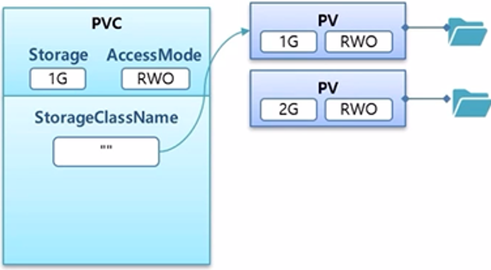
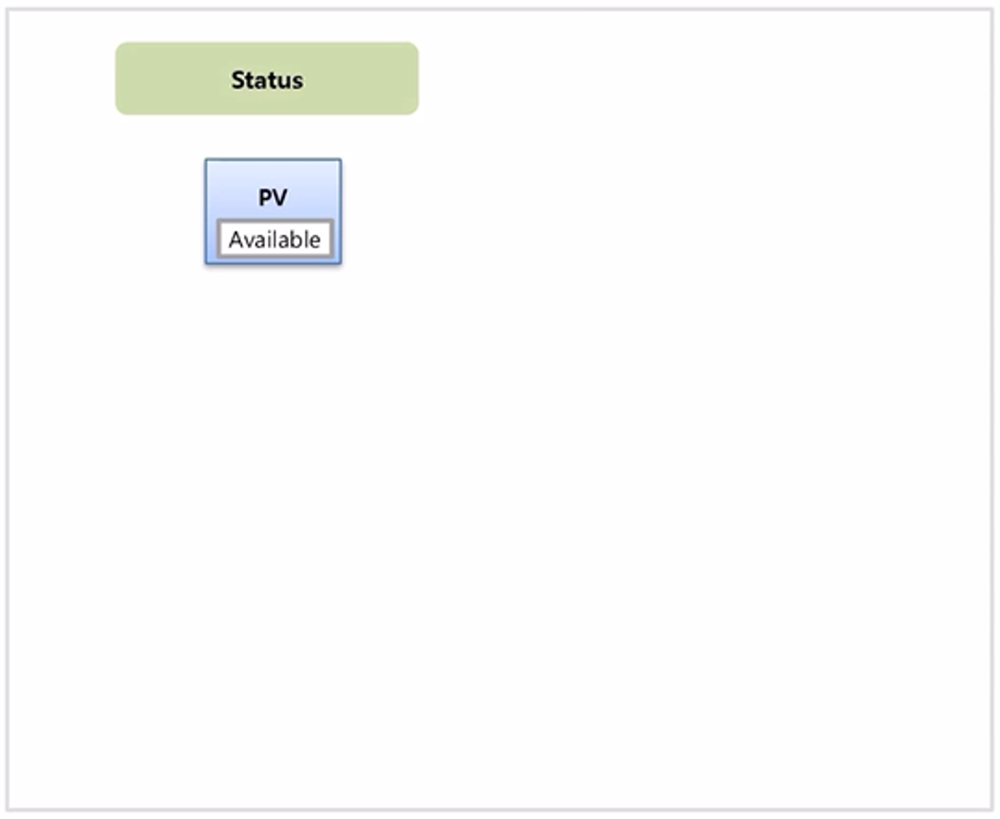
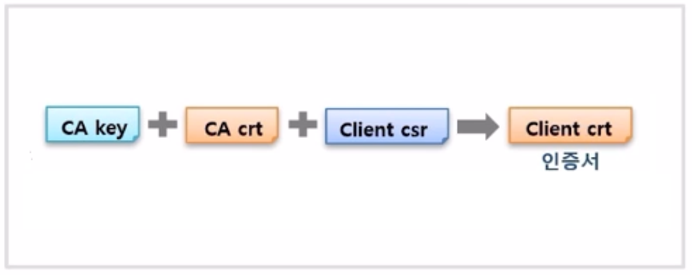
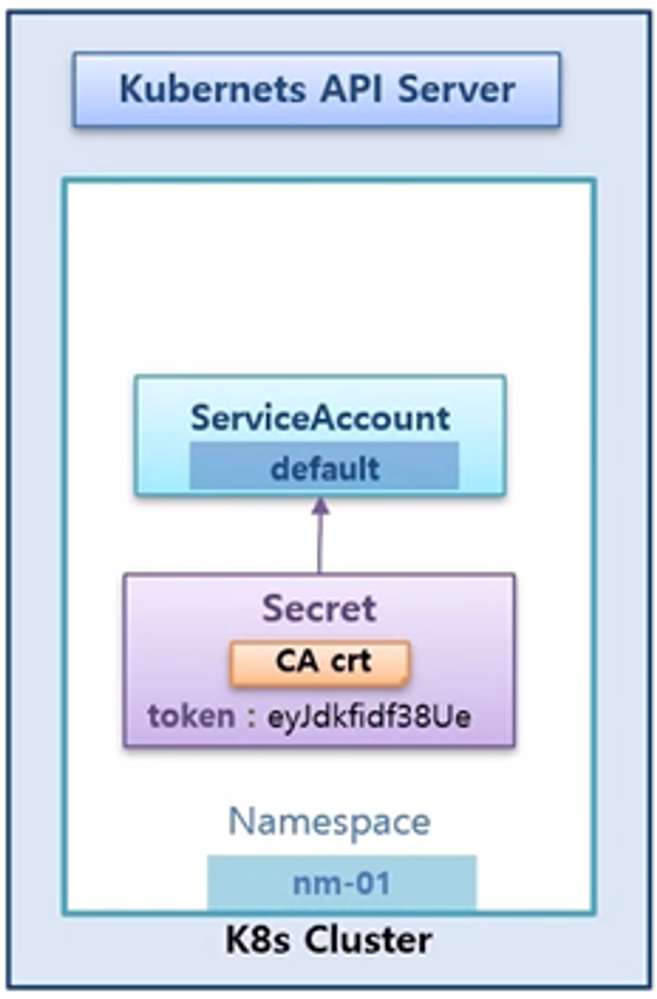

# 기본 오브젝트 - 중급

# 기본 오브젝트 - 중급

* toc
{:toc}

## Service - Headless, Endpoint, ExternalName

+ 
  + 공유기를 통해서 192.168.x.x 대역의 ip 로 내부망을 구성한다고 하자.
  + 3대의 서버를 이용해서 Master 와 Node 로 k8s Cluster 를 만들고, Cluster 안에는 Pod 를 위한 ip 대역과 Service 를 위한 ip 대역이 있다. 10번과 20번으로 시작하는 ip 대역은 k8s 를 구성할 때 설정할 수 있는 부분이다.
+ 
  + 이렇게 설정된 상태에서 Pod 가 만들어지면 20번대 ip 가 할당 되고, Service 가 만들어지면 10번대 ip 가 할당 된다.
  + Pod 와 Service 가 연결이 되어있는 상태에서 Service 의 ip 가 ClusterIP 로 만들어진 경우 Service 에 접근은 k8s 를 구성하고 있는 서버에서만 호출이 가능하다. 
  + 서버에 접근할 수 있는 권한이 있는 사용자만 ClusterIP 를 사용해서 접속할 수 있기 때문에 특정 Pod 에 ClusterIP 를 설정함은 내부 관리자만 접근할 수 있도록 하기 위한 용도로 볼 수 있다.
+ 
  + 위와 같이 내부망에 ip 를 할당 받은 다수의 단말기가 있을 수 있지만, Service 의 IP 를 직접 호출할 방법은 없다.
+ 
  + 내부망에 있는 단말기가 접근하기 위해서는 NodePort 를 생성해야 한다.
  + NodePort 를 설정하면 k8s 를 구성하는 서버들에게 30,000 번대의 포트가 생성 되고, 이 포트가 Service 와 연결 된다.
  + 그래서 k8s 관리자는 내부망 사용자에게 서버들 중 하나의 ip 와 포트 번호를 알려주는 것으로 내부에 접근이 가능 하도록 할 수 있다.
+ 
  + google cloud, aws 또는 azure 와 같이 Cloud Provider 를 사용해서 k8s Cluster 를 구축할 수 있는데, 이런 경우 k8s 에서 LoadBalancer 를 설정했을 때 NodePort 가 생성 되면서 이 포트에 LoadBalancer 가 연결 되어 외부망에 있는 사용자는 이 ip 를 통해 Service 에 접근할 수 있게 된다.
+ 
  + 사용자 관점에서 k8s Cluster 내부의 Service 에, 궁극적으로 연결 되어 있는 Pod 에 접근하기 위해 ClusterIP 와 NodePort 그리고 LoadBalancer 를 설정한 Service 를 만들었던 것이다. 
  + 이 때 접근을 하는 방법은 서비스가 만들어진 다음 ip 를 확인하고 이 ip 로 접근하면 된다.
+ 
  + Pod 의 경우 이 자원들이 동시에 배포될 수 있다.
+ 
  + 이 경우 Pod A 가 Pod B 에 접근해야 할 경우 Pod 와 Service 는 생성될 때 ip 가 동적으로 만들어지기 때문에 Pod A 입장에서 Pod B 의 ip 를 미리 알 수 없다.
+ 
  + 또한 Pod B 의 경우 만약 장애가 발생하여 다운되면 자동으로 다시 만들어 지면서 ip 가 변경되기 때문에 Pod A 가 ip 를 알고 있다고 하더라도 지속적으로 사용할 수 없다.
+ 
  + 이런 문제를 해결하고 Pod 와 Service 간 연결을 하기 위해서는 **DNS** 와 **Headless** 가 필요하다.
+ 
  + 또한 Pod 가 외부의 특정 사이트에 접속하여 데이터를 가져와야 할 때, 접속 할 사이트의 주소를 변경해야 하는 상황이 생길 수 있다. 
  + 그럼 이 때 사이트의 경로를 변경하기 위해 Pod 를 수정하고 재배포 해야 할까?
+ 
  + 이런 문제를 쉽게 해결하기 위해 k8s 는 Service 의 **ExternalName** 을 이용해서 외부 연결을 Pod 의 수정 없이 변경할 수 있도록 할 수 있다.
+ 
  + k8s Cluster 안에는 DNS 서버가 별도로 존재 한다. 이 DNS 서버에는 Service 의 도메인 이름과 ip 가 저장되어 있어 Pod 가 service1 에 대한 도메인 이름을 질의하면 해당 ip 를 알려 준다.
+ 
  + 내부망에서도 DNS 서버가 구축 되어 있다면, 내부 서버들이 생겼을 때 해당 이름들이 DNS 서버에 등록 되었을 것이고 Pod 가 user1 을 질의할 경우 k8s Cluster 의 DNS 서버에 없다면 DNS 동작 흐름상 상위 DNS 서버를 찾고 해당 이름의 ip 를 알려 준다.
+ 
  + 마찬가지로 외부의 사이트도 도메인 이름이 외부 DNS 서버에 등록되어 있기 때문에 google 을 찾으면 부모의 부모를 찾아서 결국 google 의 ip 주소를 알 수 있게 된다.
+ 
  + Pod 에서 DNS 서버를 이용해서 원하는 서비스나 외부에 접근을 할 수 있다.
  + 그렇기 때문에 Pod 가 ip 주소를 몰라도 DNS 서버에 서비스 이름으로 ip 를 질의하여 접속할 수 있다.
+ 
  + 만약 pod1 이나 pod2 를 선택하여 접속하고 싶을 경우 pod 의 headless 서비스를 연결하면 되는데, 이럴 경우 DNS 서버에 pod 의 이름과 service 의 이름이 연결되어 도메인 이름으로 등록되기 때문에 pod 의 입장에서 pod1 에 접근하기 위해 ip 주소는 필요 없이 도메인 이름으로 접근할 수 있다.
+ 
  + ExternalName 이라는 서비스를 만들 수 있는데, 이 안에는 특정 외부 도메인 주소를 넣을 수 있다.
  + 만약 google 도메인 이름을 넣으면 DNS 서버를 타고 타서 google ip 를 가져올 수 있다.
+ 
  + pod 는 service3 을 통해서 데이터를 수신하도록 설정할 수 있는데, 나중에 github 에서 데이터를 가져오도록 변경했을 때 pod 수정 없이 ExternalName 만 바꿔주면 된다.

### Headless
+ 
  + default 네임스페이스에 Pod 두 개와 ClusterIP 가 설정 된 Service 가 연결되어 있다.
  + Pod 의 이름은 각각 pod1, pod2 이고 Service 는 service1 의 이름을 가지고 ip 도 동적으로 만들어진 상황을 가정 한다.
  + k8s DNS 서버가 있는데, 이 서버의 이름은 cluster.local 이다. 이 DNS 서버는 Pod 또는 Service 를 생성하면 도메인 이름과 ip 가 저장 된다.
+ 
  + DNS 에 저장되는 내용은 위와 같은 규칙으로 만들어진 내용이 들어가고 이를 FQDN (Fully Qualified Domain Name) 이라고 한다.
  + 그리고 같은 Namespace 안에서는 Service 는 앞자리만 (위의 경우 service1) 짧게 써도 되지만, Pod 의 경우 FQDN 전체를 입력 해야 한다. 또한 Pod 는 앞부분이 ip 이기 때문에 지속적으로 사용하기에 어려움이 있다.
+ 
  + Pod 의 입장에서 Service 의 Domain 이름을 DNS 서버에 질의를 통해 ip 를 가져오기 때문에 Service 의 이름만 알아도 해당 Service 에 접근할 수 있고, 모든 이름들은 사용자가 직접 만들기 때문에 만들어질 Service 의 이름을 예상해서 Pod 에 설정해둘 수 있다. 그래서 단순히 Service 에만 연결 할 경우 ClusterIP 만 설정해도 문제 없다.
+ 
  + 동일한 상황에서 특정 Pod 가 pod4 에 직접 연결하고 싶다면 headless1 이름을 가진 Service 를 Headless 서비스로 만들어야 한다. 
  + 만드는 방법은 clusterIP 속성 값으로 None 을 주면 된다.
  + 이 설정의 뜻은 headless1 Service 의 ip 를 만들지 않겠다는 것을 의미하고 또 실제로 만들어지지 않는다.
+ 
  + Pod 를 만들때도 신경 써줘야 하는데, hostname 속성에 domain 이름을 넣어야 하고 subdomain 에 Service 의 이름을 넣어줘야 한다.
+ 
  + 이렇게 Pod 와 Service 를 설정해주면 DNS 서버에 Serivce 는 ClusterIP 를 None 이 아닌 값으로 설정 했을 때와 동일한데, 다른 점은 Service 에 ip 가 없기 때문에 Service 이름을 호출하게 되면 연결되어있는 모든 Pod 의 ip 를 알려 준다.
+ 
  + Pod 의 경우 Pod 의 hostname 이 앞에 작성되어 있고, 뒤쪽은 Service 의 이름과 동일하여 간단하게 pod4.headless1 로 호출할 수 있다.
  + 그래서 이 Pod 들은 이름을 미리 정해놓고 DNS 서버를 통해 원하는 Pod 로 직접 통신할 수 있게 된다.

+ 

~~~yaml

# Service 

apiVersion: v1
kind: Service
metadata:
  name: clusterip1
spec:
  selector:
    svc: clusterip
  ports:
  - port: 80
    targetPort: 8080

~~~

~~~yaml

# Pod

apiVersion: v1
kind: Pod
metadata:
  name: pod1
  labels:
    svc: clusterip
spec:
  containers:
  - name: container
    image: kubetm/app

~~~

~~~yaml

# Request Pod 

apiVersion: v1
kind: Pod
metadata:
  name: request-pod
spec:
  containers:
  - name: container
    image: kubetm/init

~~~

~~~shell

kubectl exec request-pod -it /bin/bash

~~~

~~~shell

# nslookup

nslookup clusterip1
nslookup clusterip1.default.svc.cluster.local

~~~

~~~shell

# curl

curl clusterip1/hostname
curl clusterip1.default.svc.cluster.local/hostname

~~~

+ 

~~~yaml

# Service

apiVersion: v1
kind: Service
metadata:
  name: headless1
spec:
  selector:
    svc: headless
  ports:
    - port: 80
      targetPort: 8080    
  clusterIP: None

~~~

~~~yaml

# Pod 

apiVersion: v1
kind: Pod
metadata:
  name: pod4
  labels:
    svc: headless
spec:
  hostname: pod-a # 만약 이 값을 안 주게 되면 지금까지 hostname이 이 pod 이름으로 됐었다 하지만 이 값을 주게 되면 호스트 네임이 이 이름으로 바뀌게 된다
  subdomain: headless1 # 서브 도메인을 줘야 되는데 이 서브 도메인의 이름은 좀 전에 만든 서비스에 이름을 넣으면 된다
  containers:
  - name: container
    image: kubetm/app

~~~

~~~shell

# nslookup

nslookup headless1
nslookup pod-a.headless1
nslookup pod-b.headless1al

~~~

~~~shell

# curl

curl pod-a.headless1:8080/hostname
curl pod-b.headless1:8080/hostname

~~~

### Endpoint
+ 
  + Service 와 Pod 를 연결할 때 Label 을 사용 한다.
  + 하지만 이것은 사용자 입장에서 Service 와 Pod 를 연결하기 위한 도구일 뿐이고 k8s 는 Label 이 매칭 되었을 때 Endpoint 라는 것을 만들어 실제 연결 고리를 관리 한다.
+ 
  + k8s 는 Serivce 의 이름과 동일한 이름으로 Endpoint 의 이름을 설정 
+ 
  + Endpoint 안에는 Pod 의 접속 정보를 넣어 준다. 그렇기 때문에 이 규칙을 알면 별도의 Label 과 Selector 를 만들지 않아도 Service 와 Pod 를 직접 연결할 수 있게 된다.
+ 
  + Service 와 Pod 를 만들 때, Label 과 Selector 를 설정하지 않으면 일단 연결이 되지 않는다.
+ 
  + 이 상태에서 Endpoint 를 직접 만드는데, Service 의 이름과 Pod 의 ip 정보를 입력하면 똑같이 연결이 된다.
  + Service 의 연결 대상을 사용자가 직접 지정을 해주는 것인데, 위와 같이 ip 와 port 가 내부 port 를 가리킬 수 있다
+ 
  + 외부 ip 주소를 안다면 외부를 가리킬 수도 있다. 
  + 하지만 ip 는 바뀔 수 있기 때문에 도메인 이름을 사용한다. Github 의 ip 주소도 바뀔 수 있기 때문에 도메인 이름을 지정하는 방법도 필요한데, 이럴때 사용하는게 ExternalName 이다.

+ 

~~~yaml

# Service

apiVersion: v1
kind: Service
metadata:
  name: endpoint1
spec:
  selector:
    svc: endpoint
  ports:
    - port: 8080

~~~

~~~yaml

# Pod 

apiVersion: v1
kind: Pod
metadata:
  name: pod7
  labels:
    svc: endpoint
spec:
  containers:
    - name: container
      image: kubetm/app

~~~

~~~shell

kubectl describe endpoints endpoint1

~~~

+ 

~~~yaml

# Service

apiVersion: v1
kind: Service
metadata:
  name: endpoint2
spec:
  ports:
    - port: 8080

~~~

~~~yaml

# Pod 

apiVersion: v1
kind: Pod
metadata:
  name: pod9
spec:
  containers:
    - name: container
      image: kubetm/app

~~~

~~~yaml

# Endpoint

apiVersion: v1
kind: Endpoints
metadata:
  name: endpoint2 # 엔드포인트의 이름은 서비스의 이름과 동일하게 만든다
subsets:
 - addresses:
   - ip: 20.109.5.12 # IP는 파드의 IP를 확인하고 그 IP를 넣어야 된다 
   ports:
   - port: 8080

~~~

~~~shell

curl endpoint2:8080/hostname

~~~

+ 

~~~yaml

# Service

apiVersion: v1
kind: Service
metadata:
  name: endpoint3
spec:
  ports:
    - port: 80

~~~

~~~shell

# Github - Ip Address

nslookup https://www.github.com
curl -O 185.199.110.153:80/kubetm/kubetm.github.io/blob/master/sample/practice/intermediate/service-sample.md

~~~


~~~yaml

# Endpoint

apiVersion: v1
kind: Endpoints
metadata:
  name: endpoint3
subsets:
  - addresses:
      - ip: 185.199.110.153
    ports:
      - port: 80

~~~

~~~shell

curl -O endpoint3/kubetm/kubetm.github.io/blob/master/sample/practice/intermediate/service-sample.md

~~~


### ExternalName
+ 
  + Service 에 ExternalName 이라는 속성을 담아서 그 안에 도메인 이름을 넣을 수 있는데, DNS cache 가 내부와 외부 DNS 서버를 찾아서 ip 를 알아 낸다.
+ 
  + 그래서 결국 Pod 는 Service 를 가리키고만 있으면 Service 에서 필요할 때마다 도메인 주소를 변경할 수 있어서 접속할 곳이 바뀌어도 Pod 를 수정하고 재배포 하는 일은 없게 된다.

+ 

~~~yaml

# Service

apiVersion: v1
kind: Service
metadata:
  name: externalname1
spec:
  type: ExternalName # 타입의 값으로 ExternalName이 들어간다
  externalName: github.github.io # ExternalName이라는 속성이 있는데 이 속성에 연결하려고 하는 외부 도메인 이름을 넣으면 된다

~~~

~~~shell

curl -O externalname1/kubetm/kubetm.github.io/blob/master/sample/practice/intermediate/service-sample.md

~~~


### yaml 

~~~yaml

# Service

apiVersion: v1
kind: Service
metadata:
  name: headless1
spec:
  selector:             # 생략시 Endpoints 직접 생성해서 사용
    svc: headless
  ports:
    - port: 80
      targetPort: 8080    
  clusterIP: None       # headless 서비스  
  type: ExternalName    # ExternalName Service 설정시 사용
  externalName: github.github.io  # ExternalName사용시 연결 Domain지정

~~~

~~~yaml

# Endpoints

apiVersion: v1
kind: Endpoints
metadata:
  name: headless1       # Service의 이름과 동일하게 지정
subsets:
 - addresses:
   - ip: 20.109.5.12    # Pod의 ClusterIp
   ports:
   - port: 8080         # Pod의 Container Port

~~~

~~~yaml

# Pod

apiVersion: v1
kind: Pod
metadata:
  name: pod4
  labels:
    svc: headless
spec:
  hostname: pod-a       # 호스트네임 설정, 생략시 Pod Name이 적용됨
  subdomain: headless1  # headless 서비스 사용시 Service의 이름으로 지정
  containers:
    - name: container
      image: kubetm/app


~~~

### kubectl 

~~~shell

# Exec 
# Pod이름이 request-pod인 Container로 들어가기 (나올땐 exit)
kubectl exec request-pod -it /bin/bash

~~~

~~~shell

# Describe 
# Endpoints 상세보기
kubectl describe endpoints endpoint1

~~~

### Tips 
+ DNS
  + Kubernetes 버전 1.11 이전의 Kubernetes DNS 서비스는 kube-dns를 기반
  + 버전 1.11은 kube-dns의 일부 보안 및 안정성 문제를 해결하기 위해 CoreDNS 를 도입

## Volume - Dynamic Provisioning, StorageClass, Status, ReclaimPolicy
+ 
+ Volume 은 데이터를 안정적으로 유지하기 위해 사용 한다.
+ 그러기 위해 실제 데이터를 k8s Cluster 와 분리해서 관리 한다. 
+ 이런 방식으로 관리할 수 있는 Volume 의 종류가 많은데, 크게 내부망에서 관리하는 것과 외부망에서 관리하는 경우로 나눌 수 있다.
+ 
  + 외부망에는 amazon web service, google cloud platform service 그리고 microsoft azure 와 같은 cloud storage 를 두고 여기에 k8s Cluster 를 연결하여 사용할 수 있다.
+ 
  + 내부망에는 k8s 를 구성하는 Node 들이 있는데, 기본적으로 k8s 에서 이 Node 들의 실제 물리 공간에 데이터를 만들 수 있는 hostPath 나 local volume 이 있고, 별도의 On-Premise Storage Solution 들을 Node 들에 설치할 수도 있다.
  + storageos, ceph 그리고 glusterFS 와 같은 종류가 있고 각 Solution 들이 알아서 Node 자원을 사용하여 Volume 을 관리 해준다.
  + 추가로 NFS 를 사용해서 다른 서버를 Volume 자원으로 사용할 수 있는 등 다양한 종류의 Volume 서비스들이 있다.
+ 
  + k8s Cluster 밖에 실제 Volume 들이 마련되어 있다면, 관리자가 PV 를 만들 때 저장 용량과 AccessMode 를 정하고 선택한 Volume 과 연결 한다. 
  + 그리고 사용자는 원하는 용량과 AccessMode 로 PVC 를 만들면 k8s 가 알아서 적절한 PV 와 연결하고, 이 PVC 를 Pod 에서 사용 하게 된다.
  + AccessMode 는 하나의 Node 에서 읽기 및 쓰기가 되거나(RWO, ReadWriteOnce), 다수의 Node 에 읽기만 가능(ROM, ReadOnlyMany) 또는 읽기 및 쓰기가 가능(RWM, ReadWriteMany)한 총 세가지 종류가 있다.
+ 
  + 하지만 k8s 에 이런 AccessMode 가 있다고 하여 실제 Volume 들도 모두 이와 같이 지원 되는 것은 아니고 각 Volume 마다 실제 지원되는 AccessMode 가 다르다.
+ 
  + 위와 같은 방식으로 Volume 을 사용하면, Volume 이 필요할 때마다 PV 를 만들어야 하고 또 원하는 PV 와 연결하기 위해 Storage 와 AccessMode 를 확인하여 맞춰야 하는 등 해야할 것들이 너무 많아진다.
  + 그래서 k8s 에는 Dynamic Provisioning 을 지원 한다. 이것은 사용자가 PVC 를 만들면 알아서 PV 를 만들고 실제 Volume 과 연결해주는 기능을 한다.
+ 
  + 각 PV 는 Pod 와 같이 상태가 존재 한다.
  + 이 상태를 통해 현재 PV 가 PVC 에 연결 되어 있는지 또는 오류가 발생 했는지 등을 알 수 있다. 
  + 추가로 PV 를 삭제할 때 정책적인 요소가 있다

+ StorageOS Operator 설치
  + 스토리지 OS를 만들고 관리해 주는 역할을 한다

~~~shell

# 설치
kubectl apply -f https://github.com/storageos/cluster-operator/releases/download/1.5.0/storageos-operator.yaml

~~~

~~~shell

# 설치 확인
kubectl get all -n storageos-operator

~~~

~~~shell

# Depolyment 수정
kubectl edit deployments.apps storageos-cluster-operator -n storageos-operator

~~~

~~~yaml

# spec.containers.env의 DISABLE_SCHEDULER_WEBHOOK의 Value를 true로 설정
# 이걸 안하면 나중에 이 pv를 만들 때 스토리지 클래스 네임에 더블 쿼테이션을 넣었을 때 pv를 못 찾고 에러가 난다

spec:
  containers:
    - command:
        - cluster-operator
      env:
        - name: DISABLE_SCHEDULER_WEBHOOK
          value: "false"    # true 로 변경
      image: storageos/cluster-operator:1.5.0
      imagePullPolicy: IfNotPresent

~~~

~~~shell

# 관리 계정을 위한 Secret 생성 (username 및 password를 Base64문자로 만들기)
echo -n "admin" | base64
echo -n "1234" | base64

~~~

~~~yaml

# apiUsername 및 apiPassword 부분에 위 결과로 나온 문자 넣기
kubectl create -f - <<END
apiVersion: v1
kind: Secret
metadata:
  name: "storageos-api"
  namespace: "storageos-operator"
  labels:
    app: "storageos"
type: "kubernetes.io/storageos"
data:
  apiUsername: YWRtaW4=  # admin
  apiPassword: MTIzNA==  # 1234
END

~~~

+ StorageOS 설치

~~~yaml

# StorageOS 설치 트리거 생성
kubectl apply -f - <<END
apiVersion: "storageos.com/v1"
kind: StorageOSCluster
metadata:
  name: "example-storageos"
  namespace: "storageos-operator"
spec:
  secretRefName: "storageos-api" # Reference the Secret created in the previous step
  secretRefNamespace: "storageos-operator"  # Namespace of the Secret
  k8sDistro: "kubernetes"
  images:
    nodeContainer: "storageos/node:1.5.0" # StorageOS version
  resources:
    requests:
    memory: "512Mi"
END

~~~

~~~shell

# 설치확인
kubectl get all -n storageos

~~~

~~~shell

# Dashboard 접속을 위한 Service 수정 (방법 1)
kubectl edit service storageos -n storageos

~~~

~~~yaml

# spec에 externalIPs와 Master IP 추가
spec:
  clusterIP: 10.109.77.121
  externalIPs:     # 추가
  - 192.168.0.30   # Master IP 추가
  ports:

~~~

~~~

http://192.168.0.30:5705/

~~~

~~~shell

# Dashboard 접속을 위한 Service 수정 (방법 2)
kubectl edit service storageos -n storageos

~~~

~~~yaml

# type을 NodePort로 변경
spec:
  ports:
    - name: storageos
      port: 5705
      protocol: TCP
      targetPort: 5705
      nodePort: 30705  # port 번호 추가
  type: NodePort     # type 변경

~~~

~~~

 접속
 
http://192.168.0.30:5705/

~~~

+ Default StorageClass 추가

~~~yaml

kubectl apply -f - <<END
apiVersion: storage.k8s.io/v1
kind: StorageClass
metadata:
  name: default # 스토리지 클래스의 이름은 default
    storageclass.kubernetes.io/is-default-class: "true" # 어노테이션이 있는데 이 내용이 있기 때문에 이 스토리지 클래스가 디폴트로 작용을 할 수가 있게 된다
provisioner: kubernetes.io/storageos
parameters:
  adminSecretName: storageos-api
  adminSecretNamespace: storageos-operator
  fsType: ext4
  pool: default
END

~~~

~~~shell

# StorageClass 확인
kubectl get storageclasses.storage.k8s.io

~~~

~~~shell

NAME                PROVISIONER               AGE
default (default)   kubernetes.io/storageos   3s    # 디폴트가 지금 방금 만든 스토리지 클래스
fast                kubernetes.io/storageos   59s   # 패스트는 스토리지 OS를 설치하면서 자동으로 생성된 스토리지

~~~

### Dynamic Provisioning
+ 
  + 먼저 Dynamic Provisioning 을 지원해주는 Storage Solution 을 선택해서 설치해야 한다. 
  + 다양한 Solution 중 예시에서는 storageos Solution 을 사용 한다.
  + 설치하면 Service, Pod 등 다양한 오브젝트들이 생성 되지만, 중요한 것은 StorageClass 라는 오브젝트 이다.
+ 
  + StorageClass 를 사용해서 동적으로 PV 를 만들 수 있다. 
  + PVC 를 만들 때 StorageClassName 이라는 부분이 있다
  + 앞서 초급편에서는 local volume 을 사용해서 PV 를 만들었고 StorageClassName 에 공백 (””) 을 넣으면 적절한 PV 에 연결 되었었다.
+ 
  + 만약 여기에 앞서 만든 StorageClass 의 이름을 넣으면, 자동으로 storageos volume 을 가진 PV 가 만들어 진다.
+ 
  + StorageClass 는 추가도 만들 수 있고 Default 라는 것을 설정할 수 있는데, StorageClassName 에 아무 값도 설정하지 않으면 Default StorageClass 가 적용되어 PV 가 만들어 진다.

+ 

~~~yaml

# PersistentVolume 
apiVersion: v1
kind: PersistentVolume
metadata:
  name: pv-hostpath1
spec:
  capacity:
    storage: 1G
  accessModes:
  - ReadWriteOnce
  hostPath:
    path: /mnt/hostpath
    type: DirectoryOrCreate

~~~

~~~yaml

# PersistentVolumeClaim 
apiVersion: v1
kind: PersistentVolumeClaim
metadata:
  name: pvc-hostpath1
spec:
  accessModes:
  - ReadWriteOnce
  resources:
    requests:
      storage: 1G 
  storageClassName: "" #  PV를 만들 때 이렇게 넣으면 여기 스토리지 용량이 1GB이기 때문에 pv-hostpath1 PV와 연결이 될 것이다

~~~

~~~yaml

# PersistentVolumeClaim 
apiVersion: v1
kind: PersistentVolumeClaim
metadata:
  name: pvc-fast1
spec:
  accessModes:
  - ReadWriteOnce
  resources:
    requests:
      storage: 1G
  storageClassName: "fast"

~~~

~~~yaml

# PersistentVolumeClaim 
apiVersion: v1
kind: PersistentVolumeClaim
metadata:
  name: pvc-default1
spec:
  accessModes:
    - ReadWriteOnce
  resources:
    requests:
      storage: 2G


~~~

+ pv를 먼저 만들었을 때랑 pvc를 만들어서 pv가 만들어졌을 때와 차이점은 동적으로 pv가 만들어졌을 경우 바로 볼륨이 만들어지고 근데 pv를 먼저 만들었을 때는 이 볼륨이 먼저 만들어지지 않는다 

### Status & ReclaimPolicy
+ 
  + Status 는 최초 PV 가 만들어졌을 때 Available 상태이다.
+ 
  + PVC 와 연결 되면 Bound 상태가 된다.
+ 
  + 하지만 이렇게 PV 를 직접 만드는 경우 아직 volume 에 실제 데이터가 만들어지기 전이며, Pod 가 PVC 를 사용해서 구동될 때 실제 volume 이 만들어 진다.
+ 
  + Pod 의 서비스가 구동되다가 Pod 가 삭제 될 경우 PVC 와 PV 에는 아무런 변화가 없기 때문에 데이터에는 문제가 없다.
+ 
  + PVC 를 삭제 해야 PV 와 연결이 끊어지면서 PV 의 상태는 Released 상태가 된다.
+ 
  + 이 과정 중에 PV 와 실제 데이터 간 연결에 문제가 발생하면 Failed 상태가 되기도 한다.
+ 
  + 이 상태들 중 PVC 가 삭제 된 상황에 대해 PV 에 설정한 ReclaimPolicy 에 따라 PV 의 상태가 달라진다. ReclaimPolicy 는 Retain, Delete 그리고 Recycle 이렇게 세가지가 있다.
  + Retain
    + Retain 의 경우 PVC 가 삭제 되면 PV 상태가 Released 가 되는데, PV 를 만들 때 ReclaimPolicy 를 별도로 설정하지 않았을 경우 기본 정책 이다.
    + 이 상태일 때 실제 volume 의 데이터는 유지 되지만, 그렇다고 해서 이 PV 를 다른 PVC 에 다시 연결 할 수는 없다. 그래서 PV 를 수동으로 만든 것과 같이 삭제도 수동으로 해주어야 한다.
  + Delete 
    + Delete 의 경우 PVC 를 삭제하면 PV 도 같이 삭제 된다. 
    + 이 정책은 StorageClass 를 사용해서 자동으로 만들어진 PV 인 경우 기본 정책 이다. volume 의 종류에 따라 실제 데이터가 삭제 될 수도 있다.
  + Recycle 
    + Recycle 의 경우 PV 의 상태가 Available 이 되면서 PVC 에서 다시 연결할 수 있는 상태가 된다.
    + 하지만 현재 이 정책은 Deprecated 되었으며, 실제 데이터가 삭제 되면서 PV 를 재사용 할 수 있다.

+ 

~~~yaml

# Pod 
apiVersion: v1
kind: Pod
metadata:
  name: pod-hostpath1
spec:
  nodeSelector:
    kubernetes.io/hostname: k8s-node1
  terminationGracePeriodSeconds: 0
  containers:
  - name: container
    image: kubetm/init
    volumeMounts:
    - name: hostpath
      mountPath: /mount1
  volumes:
  - name: hostpath
    persistentVolumeClaim:
      claimName: pvc-hostpath1

~~~

~~~shell

cd /mount1
touch file.txt

~~~


~~~

StorageOS Dashboard

http://192.168.0.30:5705/

~~~

+ 

~~~yaml

# PersistentVolume
apiVersion: v1
kind: PersistentVolume
metadata:
  name: pv-recycle1
spec:
  persistentVolumeReclaimPolicy: Recycle
  capacity:
    storage: 3G
  accessModes:
  - ReadWriteOnce
  hostPath:
    path: /tmp/recycle
    type: DirectoryOrCreate

~~~

~~~yaml

# PersistentVolumeClaim 
apiVersion: v1
kind: PersistentVolumeClaim
metadata:
  name: pvc-recycle1
spec:
  accessModes:
  - ReadWriteOnce
  resources:
    requests:
      storage: 3G
  storageClassName: ""

~~~

~~~yaml

# Pod 
apiVersion: v1
kind: Pod
metadata:
  name: pod-recycle1
spec:
  nodeSelector:
    kubernetes.io/hostname: k8s-node1
  terminationGracePeriodSeconds: 0
  containers:
    - name: container
      image: kubetm/init
      volumeMounts:
        - name: hostpath
          mountPath: /mount1
  volumes:
    - name: hostpath
      persistentVolumeClaim:
        claimName: pvc-recycle1

~~~

~~~shell

cd /mount1
touch file.txt

~~~

### yaml

~~~yaml

apiVersion: storage.k8s.io/v1
kind: StorageClass
metadata:
  name: default
  annotations:
    # Default StorageClass로 선택 
    storageclass.kubernetes.io/is-default-class: "true" 
# 동적으로 PV생성시 PersistentVolumeReclaimPolicy 선택 (Default:Delete)
reclaimPolicy: Retain, Delete, Recycle
provisioner: kubernetes.io/storageos
# provisioner 종류에 따라 parameters의 하위 내용 다름 
parameters:                        

~~~


### kubectl

~~~shell

# Get All Objects in Namespaces, 네임스페이스의 모든 개체 가져오기 
kubectl get all -n storageos-operator


~~~

~~~shell

# Force Deletion 
kubectl delete persistentvolumeclaims pvc-fast1 --namespace=default --grace-period 0 --force
kubectl delete persistentvolume pvc-b53fd802-3919-4fb0-8c1f-02221a3e4bc0 --grace-period 0 --force

~~~

### Tips 
+ hostPath
  + Recycle 정책은 /tmp/로 시작하는 Path에서만 됨

## Accessing API - Overview
+  
  + Master Node 에 k8s API 서버가 있다. 
  + 이 API 서버를 통해서만 k8s 에 자원을 만들거나 조회를 할 수 있다. 
  + k8s 를 설치할 때 kubectl 도 설치하여 CLI 로 자원이 조회 가능한 것도 k8s API 서버에 접근해서 정보를 가져오는 것이다. 
+ 
  + 외부에서 이 API 서버에 접근 하려면 인증서를 가지고 있는 사용자만 https 로 보안 접근을 할 수 있다. 
  + 하지만 만약 내부 관리자가 kubectl 명령으로 Proxy 를 열어 두었다면, 인증서 없이 http 로 API 서버에 접근할 수 있다.
+ 
  + kubectl 은 Master Node 에만 설치할 수 있는 것은 아니고, 외부 PC 에서도 설치하여 사용할 수 있다. 
  + Config 기능을 활용하면, 만약 k8s Cluster 가 여러대가 있을 때 간단한 명령을 통해 접근 가능한 Cluster 에 연결을 유지할 수 있다. 
  + 연결이 된 상태에서는 kubectl 명령으로 해당 Cluster 에 있는 Pod 정보들을 가지고 올 수 있다.
  + 위와 같은 접근 방법은 사용자 입장에서 API 서버에 접근하는 방법이고, 이것을 User Account 라고 한다.
+ 
  + Pod 입장에서 k8s API 서버는 마음대로 접근할 수 없다. 왜냐하면 Pod 를 만들기만 하면 누구나 이 Pod 를 통해 k8s API 서버에 접근이 가능해지기 때문에 보안상 문제가 발생한다.
+ 
  + k8s 에서는 Service Account 라는 것을 통해 Pod 들이 k8s API 서버에 접근 한다.
+ 
  + 다시 말해서 k8s 에는 사용자들이 API 서버에 접근하기 위한 User Account 와 Pod 들이 접근하기 위한 Service Account 가 있다
  + Service Account 도 사용 방법만 익히면 Cluster 외부에서도 접근 가능하다.
  + 여기까지는 k8s API 서버에 접근하는 Authentication 에 대한 내용 이었고, 접근 이후 필요한 자원을 조회하는 권한에 대해서도 알아볼 예정이다.
+ 
  + 만약 Namespace 로 Pod 가 분리되어있는 상태에서 Namespace B 에 있는 Pod 가 k8s API 서버에 접근할 수 있다고 해서 Namespace A 이 있는 Pod 를 조회 할 수 있어야 할까?
    + 이것은 권한 여부에 따라 가능할 수도 있고 불가능 할 수도 있다. 
    + 이 부분은 Authorization 에 대한 부분이다.
  + 그리고 권한까지 문제가 없다면 마지막으로 Admission Control 이라는 것이 있는데, 예를 들어 PV 를 만들 때 관리자가 용량을 1Gb 이상 만들지 못하도록 설정 했다면, Pod 를 생성하라는 API 요청이 들어왔을 때 k8s 는 설정한 크기를 초과하지 못하도록 하는 것과 같은 내용 이다.
  + 본 과정에서는 Admission Control 에 대한 내용은 다루지 않는다.

## Authentication - X509 Certs, kubectl, ServiceAccount
+ 

### X509 Client Certs
+ 
  + Cluster 에 6443 포트로 API 서버가 열려 있고, 사용자가 이곳으로 https 접속을 시도하는 상황이다. 
  + k8s 를 설치할 때 kubeconfig 라고 하는 Cluster 에 접근할 수 있는 정보가 들어있는 파일이 있는데, 이 안에 인증서 내용이 포함되어 있다. 그래서 Client 가 인증서를 복사해서 가지고 오면 된다.
+ 
  + 최초 발급 기관과 클라이언트에 대한 개인키를 만든다.
+ 
  + 이 개인키를 가지고 인증서를 만들기 위한 인증 요청서라는 csr 파일을 만든다.
+ 
  + CA 는 이 인증 요청서를 가지고 인증서를 만드는데, kubeconfig 에 있는 CA cert 가 이것에 해당 한다.
+ 
  + 클라이언트 인증서의 경우 발급기관의 개인키와 인증서 그리고 클라이언트 인증 요청서를 모두 더해 만들어 진다. 
  + 이렇게 만들어진 클라이언트 인증서는 kubeconfig 파일에 Client crt 파일로 들어 있다. 그리고 Client key 도 kubeconfig 파일 안에 같이 들어 있다.
+ 
  + k8s 를 설치할 때 kubectl 을 설치하고, 설정 내용 중 kubeconfig 파일을 통째로 kubectl 에서 사용하도록 복사하는 과정이 있다. 
  + 그 덕분에 사용자는 kubectl 로 k8s API 서버에 인증이 되어 리소스들을 조회할 수 있다.
  + 또한 accept-hosts 옵션을 통해 8001 번 포트를 열어두면 외부에서 http 로 접근할 수 있게 되는데, 그러면 kubectl 이 인증서를 가지고 있기 때문에 사용자는 인증서 없이 접근할 수 있게 된다.
+ 

#### 1-1) kubeconfig 인증서 확인
Path : /etc/kubernetes/admin.conf

~~~

cluster.certificate-authority-data : CA.crt (Base64)
user.client-certificate-data: Client.crt (Base64)
user.client-key-data: Client.key (Base64)

~~~

~~~shell

grep 'client-certificate-data' /etc/kubernetes/admin.conf | head -n 1 | awk '{print $2}' | base64 -d
grep 'client-key-data' /etc/kubernetes/admin.conf | head -n 1 | awk '{print $2}' | base64 -d

~~~

#### 1-2) Https API (Client.crt, Client.key)

+ v1.27

~~~

# case1) postman
https://192.168.56.30:6443/api/v1/nodes

Settings > General > SSL certificate verification > OFF
Settings > Certificates > Client Certificates > Host, CRT file, KEY file

# case2) curl
curl -k --key ./Client.key --cert ./Client.crt https://192.168.56.30:6443/api/v1/nodes

~~~

+ v1.15

~~~

# case1) postman
https://192.168.0.30:6443/api/v1/nodes

Settings > General > SSL certificate verification > OFF
Settings > Certificates > Client Certificates > Host, CRT file, KEY file

# case2) curl
curl -k --key ./Client.key --cert ./Client.crt https://192.168.0.30:6443/api/v1/nodes

~~~

#### 1-3) kubectl config 세팅

+ v1.27

~~~

# kubeadm / kubectl / kubelet 설치
yum install -y --disableexcludes=kubernetes kubelet-1.27.2-0.x86_64 kubeadm-1.27.2-0.x86_64 kubectl-1.27.2-0.x86_64

# admin.conf 인증서 복사
mkdir -p $HOME/.kube
sudo cp -i /etc/kubernetes/admin.conf $HOME/.kube/config
sudo chown $(id -u):$(id -g) $HOME/.kube/config

# Kubectl Proxy 띄우기
nohup kubectl proxy --port=8001 --address=192.168.56.30 --accept-hosts='^*$' >/dev/null 2>&1 &

~~~

+ v1.15

~~~

# kubeadm / kubectl / kubelet 설치
yum install -y --disableexcludes=kubernetes kubeadm-1.15.5-0.x86_64 kubectl-1.15.5-0.x86_64 kubelet-1.15.5-0.x86_64

# admin.conf 인증서 복사
mkdir -p $HOME/.kube
sudo cp -i /etc/kubernetes/admin.conf $HOME/.kube/config
sudo chown $(id -u):$(id -g) $HOME/.kube/config

# Kubectl Proxy 띄우기
nohup kubectl proxy --port=8001 --address=192.168.0.30 --accept-hosts='^*$' >/dev/null 2>&1 &

~~~


#### 1-4) HTTP API 호출 (Proxy)

+ v1.27

~~~

# case1) postman
http://192.168.56.30:8001/api/v1/nodes

# case2) curl
curl http://192.168.56.30:8001/api/v1/nodes

~~~

+ v1.15

~~~

# case1) postman
http://192.168.0.30:8001/api/v1/nodes

# case2) curl
curl http://192.168.0.30:8001/api/v1/nodes

~~~

#### 2-1) Cluster A kubeconfig
+ path : /etc/kubernetes/admin.conf

#### 2-2) Cluster B kubeconfig
+ path : /etc/kubernetes/admin.conf

#### 2-3) kubeconfig

~~~yaml

apiVersion: v1
clusters:
- cluster:
    certificate-authority-data: LS0tLS1KVEUtLS0tLQo=
    server: https://192.168.0.30:6443
  name: cluster-a
- cluster:
    certificate-authority-data: LS0tLS1KVEUtLS0tLQo=
    server: https://192.168.0.50:6443
  name: cluster-b
contexts:
- context:
    cluster: cluster-a
    user: admin-a
  name: context-a
- context:
    cluster: cluster-b
    user: admin-b
  name: context-b
current-context: context-a
kind: Config
preferences: {}
users:
- name: admin-a
  user:
    client-certificate-data: LS0tLS1KVEUtLS0tLQo=
    client-key-data: LS0tLS1KVEUtLS0tLQo=
- name: admin-b
  user:
    client-certificate-data: LS0tLS1KVEUtLS0tLQo=
    client-key-data: LS0tLS1KVEUtLS0tLQo=

~~~

#### 2-4) kubectl CLI
+ kubectl download : [https://kubernetes.io/docs/tasks/tools/install-kubectl/](https://kubernetes.io/docs/tasks/tools/install-kubectl/)
+ windows

~~~

curl -LO https://storage.googleapis.com/kubernetes-release/release/v1.18.0/bin/windows/amd64/kubectl.exe

~~~

~~~

C:\Users\taemin
kubectl config use-context context-a

~~~

~~~

kubectl get nodes

~~~

### kubectl
+ 
+ 
  + 외부 서버에 kubectl 을 설치해서 멀티 Cluster 에 접근하는 것에 대해 알아 본다.
  + 사전에 각 Cluster 에 있는 kubeconfig 파일이 내 kubectl 에 있으면 사용자는 원하는 Cluster 에 접근해서 자원을 조회하고 만들 수 있다.
+ 
  + kubeconfig 안에는 clusters 라는 항목으로 Cluster 를 등록할 수 있고, 내용은 이름과 연결 정보 그리고 CA 인증서가 있다.
  + users 라는 항목으로 사용자를 등록할 수 있는데, 내용은 user 이름과 이 user 에 대한 개인키와 인증서가 있다.
+ 
  + contexts 항목을 통해 clusters 와 users 를 연결할 수 있는데, 내용은 context 이름과 연결 할 cluster 그리고 user 이름이 있다. 위와 같이 cluster-A 에 대한 context 가 만들었다.
+ 
  + 마찬가지로 cluster-B 에 대해서도 위와 같이 등록을 할 수 있다.
+ 
  + 이렇게 kubeconfig 가 만들어 졌을 때 사용자가 cluster-A 에 연결하고 싶으면 ```kubectl config user-context context-A``` 명령으로 사용하고 싶은 context 를 지정할 수 있다. 
  + 이렇게 지정 했을 때 ```kubectl get node``` 명령을 내리면 cluster-A 에 대한 node 정보들이 조회 된다.

### Service Account
+ 
+ 
  + k8s Cluster 와 k8s API 서버가 있고, namespace 를 만들면 기본적으로 default 라는 이름으로 ServiceAccount 가 자동으로 만들어 진다.
+ 
  + 그리고 ServiceAccount 에는 Secret 이 하나 달려 있는데, 내용은 CA cert 정보와 token 값이 들어 있다.
+ 
  + Pod 를 만들면 ServiceAccount 와 연결 되고, Pod 는 token 값을 통해 k8s API 서버에 연결할 수 있다. 
  + 결국 token 값만 알면 사용자도 이 값을 가지고 k8s API 서버에 접근할 수 있다.

#### 3-1) Namespace

~~~

kubectl create ns nm-01

~~~

#### 3-2) ServiceAccount & Secret 확인

~~~

kubectl describe -n nm-01 serviceaccounts
kubectl describe -n nm-01 secrets

~~~

#### 3-3) Pod

~~~

cat <<EOF | kubectl create -f -
apiVersion: v1
kind: Pod
metadata:
name: pod-1
namespace: nm-01
labels:
app: pod
spec:
containers:
- name: container
  image: kubetm/app
  EOF
  
~~~

#### 3-4) Https API 호출 (Token)
+ v1.27

~~~

# case1) http
# [header] Authorization : Bearer TOKEN

https://192.168.56.30:6443/api/v1
https://192.168.56.30:6443/api/v1/namespaces/nm-01/pods/

# case2) curl
curl -k -H "Authorization: Bearer TOKEN" https://192.168.56.30:6443/api/v1
curl -k -H "Authorization: Bearer TOKEN" https://192.168.56.30:6443/api/v1/namespaces/nm-01/pods/

~~~

+ v1.15

~~~

# case1) http
# [header] Authorization : Bearer TOKEN

https://192.168.0.30:6443/api/v1
https://192.168.0.30:6443/api/v1/namespaces/nm-01/pods/

# case2) curl
curl -k -H "Authorization: Bearer TOKEN" https://192.168.0.30:6443/api/v1
curl -k -H "Authorization: Bearer TOKEN" https://192.168.0.30:6443/api/v1/namespaces/nm-01/pods/

~~~

