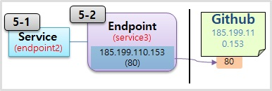

# 기본 오브젝트 - 중급

# 기본 오브젝트 - 중급

* toc
{:toc}

## Service - Headless, Endpoint, ExternalName

+ 
  + 공유기를 통해서 192.168.x.x 대역의 ip 로 내부망을 구성한다고 하자.
  + 3대의 서버를 이용해서 Master 와 Node 로 k8s Cluster 를 만들고, Cluster 안에는 Pod 를 위한 ip 대역과 Service 를 위한 ip 대역이 있다. 10번과 20번으로 시작하는 ip 대역은 k8s 를 구성할 때 설정할 수 있는 부분이다.
+ 
  + 이렇게 설정된 상태에서 Pod 가 만들어지면 20번대 ip 가 할당 되고, Service 가 만들어지면 10번대 ip 가 할당 된다.
  + Pod 와 Service 가 연결이 되어있는 상태에서 Service 의 ip 가 ClusterIP 로 만들어진 경우 Service 에 접근은 k8s 를 구성하고 있는 서버에서만 호출이 가능하다. 
  + 서버에 접근할 수 있는 권한이 있는 사용자만 ClusterIP 를 사용해서 접속할 수 있기 때문에 특정 Pod 에 ClusterIP 를 설정함은 내부 관리자만 접근할 수 있도록 하기 위한 용도로 볼 수 있다.
+ 
  + 위와 같이 내부망에 ip 를 할당 받은 다수의 단말기가 있을 수 있지만, Service 의 IP 를 직접 호출할 방법은 없다.
+ 
  + 내부망에 있는 단말기가 접근하기 위해서는 NodePort 를 생성해야 한다.
  + NodePort 를 설정하면 k8s 를 구성하는 서버들에게 30,000 번대의 포트가 생성 되고, 이 포트가 Service 와 연결 된다.
  + 그래서 k8s 관리자는 내부망 사용자에게 서버들 중 하나의 ip 와 포트 번호를 알려주는 것으로 내부에 접근이 가능 하도록 할 수 있다.
+ 
  + google cloud, aws 또는 azure 와 같이 Cloud Provider 를 사용해서 k8s Cluster 를 구축할 수 있는데, 이런 경우 k8s 에서 LoadBalancer 를 설정했을 때 NodePort 가 생성 되면서 이 포트에 LoadBalancer 가 연결 되어 외부망에 있는 사용자는 이 ip 를 통해 Service 에 접근할 수 있게 된다.
+ 
  + 사용자 관점에서 k8s Cluster 내부의 Service 에, 궁극적으로 연결 되어 있는 Pod 에 접근하기 위해 ClusterIP 와 NodePort 그리고 LoadBalancer 를 설정한 Service 를 만들었던 것이다. 
  + 이 때 접근을 하는 방법은 서비스가 만들어진 다음 ip 를 확인하고 이 ip 로 접근하면 된다.
+ 
  + Pod 의 경우 이 자원들이 동시에 배포될 수 있다.
+ 
  + 이 경우 Pod A 가 Pod B 에 접근해야 할 경우 Pod 와 Service 는 생성될 때 ip 가 동적으로 만들어지기 때문에 Pod A 입장에서 Pod B 의 ip 를 미리 알 수 없다.
+ 
  + 또한 Pod B 의 경우 만약 장애가 발생하여 다운되면 자동으로 다시 만들어 지면서 ip 가 변경되기 때문에 Pod A 가 ip 를 알고 있다고 하더라도 지속적으로 사용할 수 없다.
+ 
  + 이런 문제를 해결하고 Pod 와 Service 간 연결을 하기 위해서는 **DNS** 와 **Headless** 가 필요하다.
+ 
  + 또한 Pod 가 외부의 특정 사이트에 접속하여 데이터를 가져와야 할 때, 접속 할 사이트의 주소를 변경해야 하는 상황이 생길 수 있다. 
  + 그럼 이 때 사이트의 경로를 변경하기 위해 Pod 를 수정하고 재배포 해야 할까?
+ 
  + 이런 문제를 쉽게 해결하기 위해 k8s 는 Service 의 **ExternalName** 을 이용해서 외부 연결을 Pod 의 수정 없이 변경할 수 있도록 할 수 있다.
+ 
  + k8s Cluster 안에는 DNS 서버가 별도로 존재 한다. 이 DNS 서버에는 Service 의 도메인 이름과 ip 가 저장되어 있어 Pod 가 service1 에 대한 도메인 이름을 질의하면 해당 ip 를 알려 준다.
+ 
  + 내부망에서도 DNS 서버가 구축 되어 있다면, 내부 서버들이 생겼을 때 해당 이름들이 DNS 서버에 등록 되었을 것이고 Pod 가 user1 을 질의할 경우 k8s Cluster 의 DNS 서버에 없다면 DNS 동작 흐름상 상위 DNS 서버를 찾고 해당 이름의 ip 를 알려 준다.
+ 
  + 마찬가지로 외부의 사이트도 도메인 이름이 외부 DNS 서버에 등록되어 있기 때문에 google 을 찾으면 부모의 부모를 찾아서 결국 google 의 ip 주소를 알 수 있게 된다.
+ 
  + Pod 에서 DNS 서버를 이용해서 원하는 서비스나 외부에 접근을 할 수 있다.
  + 그렇기 때문에 Pod 가 ip 주소를 몰라도 DNS 서버에 서비스 이름으로 ip 를 질의하여 접속할 수 있다.
+ 
  + 만약 pod1 이나 pod2 를 선택하여 접속하고 싶을 경우 pod 의 headless 서비스를 연결하면 되는데, 이럴 경우 DNS 서버에 pod 의 이름과 service 의 이름이 연결되어 도메인 이름으로 등록되기 때문에 pod 의 입장에서 pod1 에 접근하기 위해 ip 주소는 필요 없이 도메인 이름으로 접근할 수 있다.
+ 
  + ExternalName 이라는 서비스를 만들 수 있는데, 이 안에는 특정 외부 도메인 주소를 넣을 수 있다.
  + 만약 google 도메인 이름을 넣으면 DNS 서버를 타고 타서 google ip 를 가져올 수 있다.
+ 
  + pod 는 service3 을 통해서 데이터를 수신하도록 설정할 수 있는데, 나중에 github 에서 데이터를 가져오도록 변경했을 때 pod 수정 없이 ExternalName 만 바꿔주면 된다.

### Headless
+ 
  + default 네임스페이스에 Pod 두 개와 ClusterIP 가 설정 된 Service 가 연결되어 있다.
  + Pod 의 이름은 각각 pod1, pod2 이고 Service 는 service1 의 이름을 가지고 ip 도 동적으로 만들어진 상황을 가정 한다.
  + k8s DNS 서버가 있는데, 이 서버의 이름은 cluster.local 이다. 이 DNS 서버는 Pod 또는 Service 를 생성하면 도메인 이름과 ip 가 저장 된다.
+ 
  + DNS 에 저장되는 내용은 위와 같은 규칙으로 만들어진 내용이 들어가고 이를 FQDN (Fully Qualified Domain Name) 이라고 한다.
  + 그리고 같은 Namespace 안에서는 Service 는 앞자리만 (위의 경우 service1) 짧게 써도 되지만, Pod 의 경우 FQDN 전체를 입력 해야 한다. 또한 Pod 는 앞부분이 ip 이기 때문에 지속적으로 사용하기에 어려움이 있다.
+ 
  + Pod 의 입장에서 Service 의 Domain 이름을 DNS 서버에 질의를 통해 ip 를 가져오기 때문에 Service 의 이름만 알아도 해당 Service 에 접근할 수 있고, 모든 이름들은 사용자가 직접 만들기 때문에 만들어질 Service 의 이름을 예상해서 Pod 에 설정해둘 수 있다. 그래서 단순히 Service 에만 연결 할 경우 ClusterIP 만 설정해도 문제 없다.
+ 
  + 동일한 상황에서 특정 Pod 가 pod4 에 직접 연결하고 싶다면 headless1 이름을 가진 Service 를 Headless 서비스로 만들어야 한다. 
  + 만드는 방법은 clusterIP 속성 값으로 None 을 주면 된다.
  + 이 설정의 뜻은 headless1 Service 의 ip 를 만들지 않겠다는 것을 의미하고 또 실제로 만들어지지 않는다.
+ 
  + Pod 를 만들때도 신경 써줘야 하는데, hostname 속성에 domain 이름을 넣어야 하고 subdomain 에 Service 의 이름을 넣어줘야 한다.
+ 
  + 이렇게 Pod 와 Service 를 설정해주면 DNS 서버에 Serivce 는 ClusterIP 를 None 이 아닌 값으로 설정 했을 때와 동일한데, 다른 점은 Service 에 ip 가 없기 때문에 Service 이름을 호출하게 되면 연결되어있는 모든 Pod 의 ip 를 알려 준다.
+ 
  + Pod 의 경우 Pod 의 hostname 이 앞에 작성되어 있고, 뒤쪽은 Service 의 이름과 동일하여 간단하게 pod4.headless1 로 호출할 수 있다.
  + 그래서 이 Pod 들은 이름을 미리 정해놓고 DNS 서버를 통해 원하는 Pod 로 직접 통신할 수 있게 된다.

+ 

~~~yaml

# Service 

apiVersion: v1
kind: Service
metadata:
  name: clusterip1
spec:
  selector:
    svc: clusterip
  ports:
  - port: 80
    targetPort: 8080

~~~

~~~yaml

# Pod

apiVersion: v1
kind: Pod
metadata:
  name: pod1
  labels:
    svc: clusterip
spec:
  containers:
  - name: container
    image: kubetm/app

~~~

~~~yaml

# Request Pod 

apiVersion: v1
kind: Pod
metadata:
  name: request-pod
spec:
  containers:
  - name: container
    image: kubetm/init

~~~

~~~shell

kubectl exec request-pod -it /bin/bash

~~~

~~~shell

# nslookup

nslookup clusterip1
nslookup clusterip1.default.svc.cluster.local

~~~

~~~shell

# curl

curl clusterip1/hostname
curl clusterip1.default.svc.cluster.local/hostname

~~~

+ 

~~~yaml

# Service

apiVersion: v1
kind: Service
metadata:
  name: headless1
spec:
  selector:
    svc: headless
  ports:
    - port: 80
      targetPort: 8080    
  clusterIP: None

~~~

~~~yaml

# Pod 

apiVersion: v1
kind: Pod
metadata:
  name: pod4
  labels:
    svc: headless
spec:
  hostname: pod-a # 만약 이 값을 안 주게 되면 지금까지 hostname이 이 pod 이름으로 됐었다 하지만 이 값을 주게 되면 호스트 네임이 이 이름으로 바뀌게 된다
  subdomain: headless1 # 서브 도메인을 줘야 되는데 이 서브 도메인의 이름은 좀 전에 만든 서비스에 이름을 넣으면 된다
  containers:
  - name: container
    image: kubetm/app

~~~

~~~shell

# nslookup

nslookup headless1
nslookup pod-a.headless1
nslookup pod-b.headless1al

~~~

~~~shell

# curl

curl pod-a.headless1:8080/hostname
curl pod-b.headless1:8080/hostname

~~~

### Endpoint
+ 
  + Service 와 Pod 를 연결할 때 Label 을 사용 한다.
  + 하지만 이것은 사용자 입장에서 Service 와 Pod 를 연결하기 위한 도구일 뿐이고 k8s 는 Label 이 매칭 되었을 때 Endpoint 라는 것을 만들어 실제 연결 고리를 관리 한다.
+ 
  + k8s 는 Serivce 의 이름과 동일한 이름으로 Endpoint 의 이름을 설정 
+ 
  + Endpoint 안에는 Pod 의 접속 정보를 넣어 준다. 그렇기 때문에 이 규칙을 알면 별도의 Label 과 Selector 를 만들지 않아도 Service 와 Pod 를 직접 연결할 수 있게 된다.
+ 
  + Service 와 Pod 를 만들 때, Label 과 Selector 를 설정하지 않으면 일단 연결이 되지 않는다.
+ 
  + 이 상태에서 Endpoint 를 직접 만드는데, Service 의 이름과 Pod 의 ip 정보를 입력하면 똑같이 연결이 된다.
  + Service 의 연결 대상을 사용자가 직접 지정을 해주는 것인데, 위와 같이 ip 와 port 가 내부 port 를 가리킬 수 있다
+ 
  + 외부 ip 주소를 안다면 외부를 가리킬 수도 있다. 
  + 하지만 ip 는 바뀔 수 있기 때문에 도메인 이름을 사용한다. Github 의 ip 주소도 바뀔 수 있기 때문에 도메인 이름을 지정하는 방법도 필요한데, 이럴때 사용하는게 ExternalName 이다.

+ 

~~~yaml

# Service

apiVersion: v1
kind: Service
metadata:
  name: endpoint1
spec:
  selector:
    svc: endpoint
  ports:
    - port: 8080

~~~

~~~yaml

# Pod 

apiVersion: v1
kind: Pod
metadata:
  name: pod7
  labels:
    svc: endpoint
spec:
  containers:
    - name: container
      image: kubetm/app

~~~

~~~shell

kubectl describe endpoints endpoint1

~~~

+ 

~~~yaml

# Service

apiVersion: v1
kind: Service
metadata:
  name: endpoint2
spec:
  ports:
    - port: 8080

~~~

~~~yaml

# Pod 

apiVersion: v1
kind: Pod
metadata:
  name: pod9
spec:
  containers:
    - name: container
      image: kubetm/app

~~~

~~~yaml

# Endpoint

apiVersion: v1
kind: Endpoints
metadata:
  name: endpoint2 # 엔드포인트의 이름은 서비스의 이름과 동일하게 만든다
subsets:
 - addresses:
   - ip: 20.109.5.12 # IP는 파드의 IP를 확인하고 그 IP를 넣어야 된다 
   ports:
   - port: 8080

~~~

~~~shell

curl endpoint2:8080/hostname

~~~

+ 

~~~yaml

# Service

apiVersion: v1
kind: Service
metadata:
  name: endpoint3
spec:
  ports:
    - port: 80

~~~

~~~shell

# Github - Ip Address

nslookup https://www.github.com
curl -O 185.199.110.153:80/kubetm/kubetm.github.io/blob/master/sample/practice/intermediate/service-sample.md

~~~

~~~yaml

# Endpoint

apiVersion: v1
kind: Endpoints
metadata:
  name: endpoint3
subsets:
  - addresses:
      - ip: 185.199.110.153
    ports:
      - port: 80

~~~

~~~shell

curl -O endpoint3/kubetm/kubetm.github.io/blob/master/sample/practice/intermediate/service-sample.md

~~~

### ExternalName
+ 
  + Service 에 ExternalName 이라는 속성을 담아서 그 안에 도메인 이름을 넣을 수 있는데, DNS cache 가 내부와 외부 DNS 서버를 찾아서 ip 를 알아 낸다.
+ 
  + 그래서 결국 Pod 는 Service 를 가리키고만 있으면 Service 에서 필요할 때마다 도메인 주소를 변경할 수 있어서 접속할 곳이 바뀌어도 Pod 를 수정하고 재배포 하는 일은 없게 된다.

+ 

~~~yaml

# Service

apiVersion: v1
kind: Service
metadata:
  name: externalname1
spec:
  type: ExternalName # 타입의 값으로 ExternalName이 들어간다
  externalName: github.github.io # ExternalName이라는 속성이 있는데 이 속성에 연결하려고 하는 외부 도메인 이름을 넣으면 된다

~~~

~~~shell

curl -O externalname1/kubetm/kubetm.github.io/blob/master/sample/practice/intermediate/service-sample.md

~~~

### yaml 

~~~yaml

# Service

apiVersion: v1
kind: Service
metadata:
  name: headless1
spec:
  selector:             # 생략시 Endpoints 직접 생성해서 사용
    svc: headless
  ports:
    - port: 80
      targetPort: 8080    
  clusterIP: None       # headless 서비스  
  type: ExternalName    # ExternalName Service 설정시 사용
  externalName: github.github.io  # ExternalName사용시 연결 Domain지정

~~~

~~~yaml

# Endpoints

apiVersion: v1
kind: Endpoints
metadata:
  name: headless1       # Service의 이름과 동일하게 지정
subsets:
 - addresses:
   - ip: 20.109.5.12    # Pod의 ClusterIp
   ports:
   - port: 8080         # Pod의 Container Port

~~~

~~~yaml

# Pod

apiVersion: v1
kind: Pod
metadata:
  name: pod4
  labels:
    svc: headless
spec:
  hostname: pod-a       # 호스트네임 설정, 생략시 Pod Name이 적용됨
  subdomain: headless1  # headless 서비스 사용시 Service의 이름으로 지정
  containers:
    - name: container
      image: kubetm/app

~~~

### kubectl 

~~~shell

# Exec 
# Pod이름이 request-pod인 Container로 들어가기 (나올땐 exit)
kubectl exec request-pod -it /bin/bash

~~~

~~~shell

# Describe 
# Endpoints 상세보기
kubectl describe endpoints endpoint1

~~~

### Tips 
+ DNS
  + Kubernetes 버전 1.11 이전의 Kubernetes DNS 서비스는 kube-dns를 기반
  + 버전 1.11은 kube-dns의 일부 보안 및 안정성 문제를 해결하기 위해 CoreDNS 를 도입

