# 컨트롤러 - 중급

# 컨트롤러 - 중급

* toc
{:toc}

## StatefulSet
+ 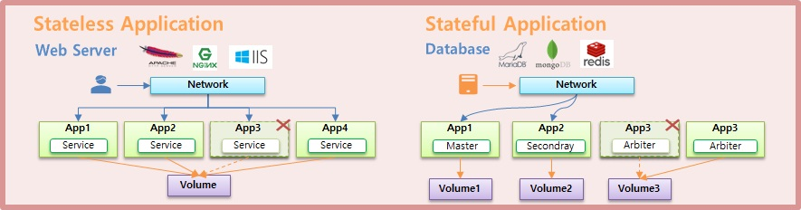
+ 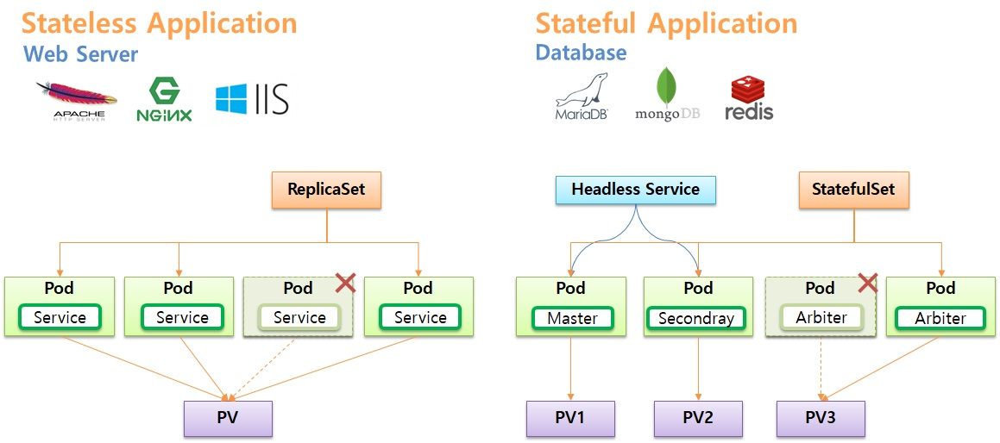
+ application 의 종류에는 Stateless Application 과 Stateful Application 이 있다.
+ 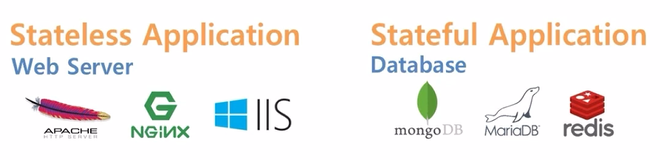
  + Stateless Application 에는 Apache, Nginx, IIS 등의 Web Server 가 있고, Stateful Applicatio 에는 mongoDB, MariaDB, redis 등의 Database 가 있다.
+ 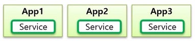
  + Stateless Application 은 App 이 여러개 배포 되더라도 모두 동일한 Service 의 역할을 한다.
+ 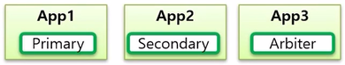
  + 반면 Stateful Application 은 각 App 마다 자신의 역할이 있다. mongoDB 의 경우 각각 Primary, Secondary, Arbiter 역할을 한다. 각각에 대해 간단하게 설명하면 Primary 가 메인 DB 이고, Primary 가 다운 되면 Arbiter 가 감지하고 Secondary 가 Primary 의 역할을 할 수 있도록 변경 해준다.
  + 이렇게 단순 복제인 Stateless 와 달리 Stateful Application 은 각 App 마다 자신의 고유 역할을 가지고 있다.
+ 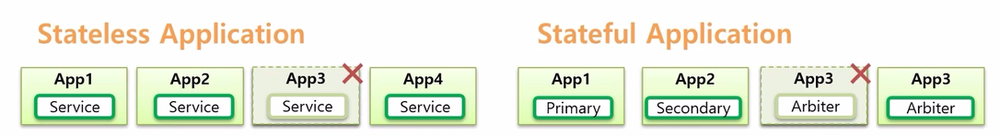
  + 그렇기 때문에 만약 App 하나가 다운 되면 Stateless Application 은 같은 Service 역할을 하는 App 을 복제하면 된다. 또한 App 의 이름도 중요하지 않다.
  + 반면 Stateful Application 은 Arbiter 역할을 하는 App 이 다운 되면, 반드시 Arbiter 역할을 하는 App 이 만들어져야 하고 App 이름도 이름 자체가 식별자로 사용되기 때문에 바뀌면 안된다.
+ 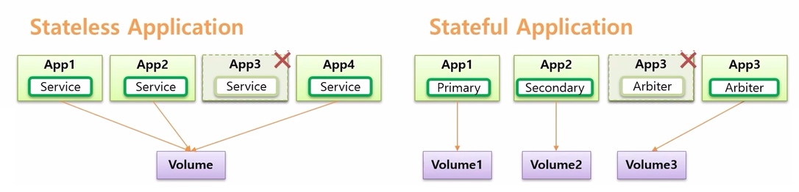
  + 다른 특징으로 Stateless Application 은 Volume 이 반드시 필요한 것은 아니다. 만약 App 의 로그를 영구 저장 하고 싶은 경우 Volume 과 연결할 수 있는데, 하나의 Volume 에 모든 App 이 연결 되어 저장할 수 있다.
  + 반면 Stateful Application 은 각각의 역할이 다르기 때문에 Volume 도 구분해서 사용해야 한다. 그래야 Arbiter 와 같은 역할을 하는 앱이 다운 되어도 새로운 App 이 같은 Volume 과 연결 되면서 역할을 이어갈 수 있기 때문이다.
+ 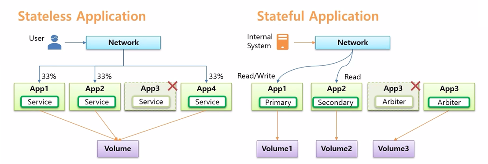
  + Stateless 와 Stateful Application 은 네트워크 흐름에도 다른점이 있다.
  + Stateless Application 은 대체로 사용자가 접속하고, 이 트래픽은 분산되는 형태를 가진다.
  + 반면 Stateful Application 은 대체로 내부 시스템들이 DB 데이터 저장을 위해 연결 하고, 각 트래픽은 App 의 특징에 맞게 처리 되어야 한다. 
    + 연결하려는 시스템에서 CRUD 를 하려면 Read/Write 권한이 있는 Primary App 에 접속 해야 한다.
    + Secondary 는 Read 권한만 있기 때문에 조회만 해도 되는 내부 시스템은 트래픽 분산을 위해 사용할 수 있다.
  + App3 은 Arbiter 로 Primary 와 Secondary 의 상태를 감시하고 있어야 하기 때문에 App1, App2 에 연결 되어야 한다
+ 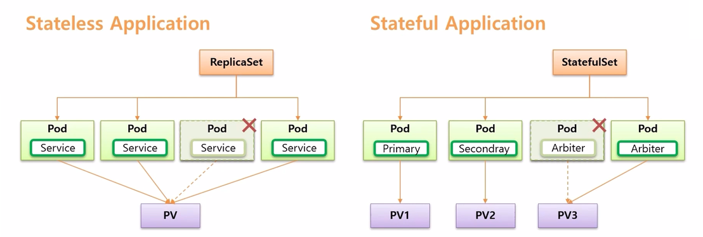
  + 이렇게 Stateful Application 은 역할에 따라 의도가 있는 연결이고, Stateless Application 은 단순히 트래픽 분산의 목적만 가지고 있는 연결이다.
  + k8s 는 이런 두 Application 의 특징에 따라 활용할 수 있도록 나누어진게 Stateless Application 의 ReplicaSet Controller 이고, Stateful Application 은 StatefulSet Controller 이다.
+ 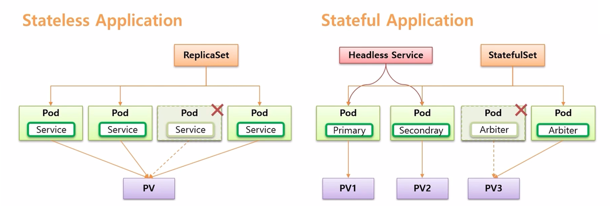
  + 이번에 확인해 볼 StatefulSet 은 Application 이 Stateful Application 이 될 수 있도록 관리 해준다
  + 해당 Pod 에 접근하기 위해, 즉 목적에 맞는 Pod 에 연결하기 위해 Headless Service 를 사용 한다.

### StatefulSet Controller
+ StatefulSet 은 Controller 이다. 이 Controller 에 대한 특징을 ReplicaSet Controller 와 비교하며 정리 한다.
+ 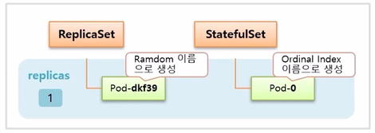
  + 먼저 replicas 를 1 로 설정하여 Controller 를 만들면 StatefulSet 도 ReplicaSet 과 마찬가지로 설정한 수 만큼 Pod 가 관리 된다. 
  + 다른 점은 Pod 생성시 이름이 ReplicaSet 은 뒷 부분이 랜덤으로 생성 되지만, StatefulSet 은 0 부터 순차적으로 생성 된다.
+ 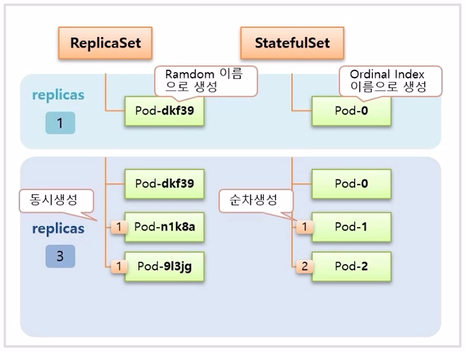
  + 이후 replicas 를 3으로 늘리면 ReplicaSet 은 두 개의 Pod 가 동시에 임의의 이름으로 추가 생성 되고, StatefulSet 은 늘리더라도 동시에 생기지 않고 하나씩 순차적으로 생성 된다.
+ 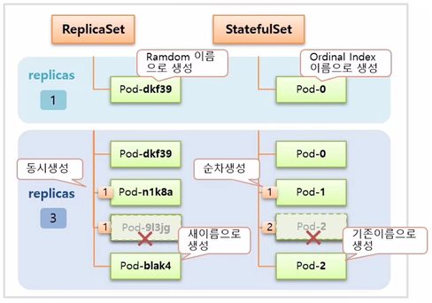
  + 만약 이 때 하나의 Pod 가 삭제 되면 ReplicaSet 은 새로운 이름으로 Pod 를 만들지만, StatefulSet 은 삭제된 Pod 와 동일한 이름으로 Pod 가  다시 만들어 진다.
+ 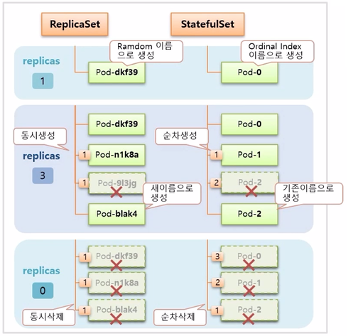
  + replicas 를 0 으로 설정하면 ReplicaSet 은 동시에 모든 Pod 가 삭제 된다. StatefulSet 은 index 가 높은 Pod 부터 순차적으로 삭제 된다.

### PersistentVolumeClaim, Headless Service
+ 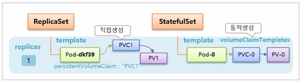
  + ReplicaSet 은 Pod 와 Volume 을 연결 하려면 PVC 를 별도로 미리 생성해 두어야 한다. 그리고 ReplicaSet 을 만들면 template 에 정의한 Pod 의 persistentVolumeClaim 으로 PVC1 을 지정해 두기 때문에 바로 연결이 된다.
  + StatefulSet 의 경우 template 을 통해 Pod 가 만들어지고, 추가로 volumeClaimTemplates 가 있는데, 이것을 통해 PVC 가 동적으로 생성 되고 Pod 와도 바로 연결이 된다.
+ 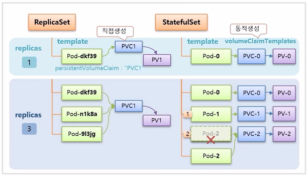
  + replicas 를 3 으로 수정하면, ReplicaSet 은 모든 Pod 들이 동일한 persistentVolumeClaim 이름으로 PVC1 을 가지고 있기 때문에 같은 PVC 에 모두 연결 된다.
  + StatefulSet 은 volumeClaimTemplates 가 있어서 Pod 가 추가 될 때마다 새로운 PVC 가 생성되어 연결 된다. 그래서 각 Pod 는 각자의 역할에 따라 구분하여 데이터를 저장할 수 있다. 만약 중간에 Pod-2 가 삭제 되면, Pod-2 가 다시 만들어 지면서 기존에 Pod-2 에 연결 되어 있던 PVC-2 에 연결 된다.
+ 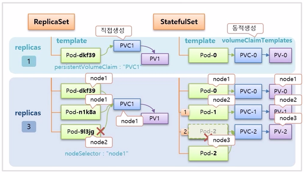
  + 추가로 한 가지 주의할 점이 있다. ReplicaSet 은 PVC 가 node1 에 만들어 졌다면 PVC 에 연결하는 Pod 도 node1 에 존재해야 한다. 만약 node2 에 Pod 가 생성 되면 PVC 와 연결 되지 않아 Pod 가 생성 되지 않는다. 그래서 template 안에 nodeSelector 를 node1 로 해줘야 문제를 방지할 수 있다.
  + StatefulSet 은 동적으로 Pod 와 PVC 가 같은 node 에 만들어지기 때문에 알아서 잘 만들어 진다.
+ 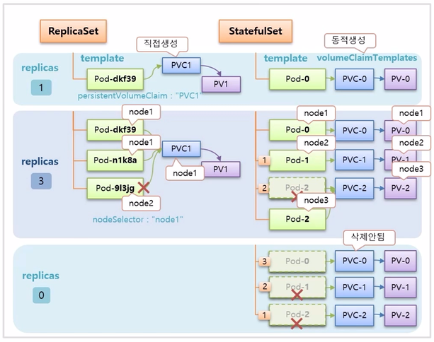
  + replicas 를 0 으로 설정 하면, StatefulSet 은 Pod 를 순차적으로 삭제 하지만 PVC 는 삭제하지 않는다. Volume 은 함부로 지우면 안되기 때문에 삭제를 하려면 사용자가 직접 해야 한다.
+ 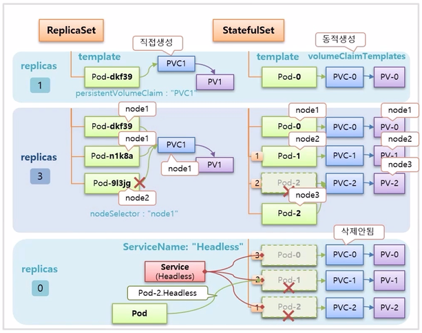
  + 마지막으로 StatefulSet 을 만들 때 ServiceName 속성으로 Service 이름을 넣을 수 있는데, 이 이름과 매칭하는 Headless Service 를 만들면 Pod 에 예측 가능한 domain 이름이 만들어지기 때문에 내부 서버의 특정 Pod 에서 원하는 StatefulSet 의 Pod 에 연결할 수 있다. 그래서 상황에 따라 Pod 를 선택해서 접속할 수 있게 된다.
  
### 1. StatefulSet Controller 
+ 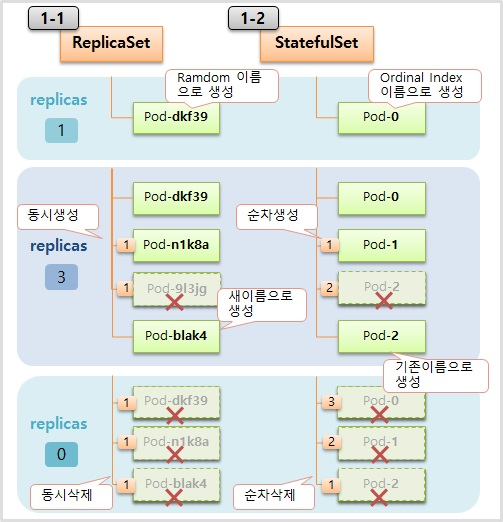

#### 1-1) ReplicaSet 

~~~yaml

apiVersion: apps/v1
kind: ReplicaSet
metadata:
  name: replica-web
spec:
  replicas: 1
  selector:
    matchLabels:
      type: web
  template:
    metadata:
      labels:
        type: web
    spec:
      containers:
      - name: container
        image: kubetm/app
      terminationGracePeriodSeconds: 10

~~~

#### 1-2) StatefulSet

~~~yaml

apiVersion: apps/v1
kind: StatefulSet
metadata:
  name: stateful-db
spec:
  replicas: 1
  selector:
    matchLabels:
      type: db
  template:
    metadata:
      labels:
        type: db
    spec:
      containers:
      - name: container
        image: kubetm/app
      terminationGracePeriodSeconds: 10

~~~

### 2. PersistentVolumeClaim
+ 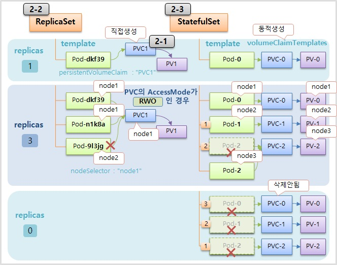

#### 2-1) PersistentVolumeClaim 

~~~yaml

apiVersion: v1
kind: PersistentVolumeClaim
metadata:
  name: replica-pvc1
spec:
  accessModes:
  - ReadWriteOnce
  resources:
    requests:
      storage: 1G
  storageClassName: "fast"

~~~

#### 2-2) ReplicaSet

~~~yaml

apiVersion: apps/v1
kind: ReplicaSet
metadata:
  name: replica-pvc
spec:
  replicas: 1
  selector:
    matchLabels:
      type: web2
  template:
    metadata:
      labels:
        type: web2
    spec:
      nodeSelector:
        kubernetes.io/hostname: k8s-node1
      containers:
      - name: container
        image: kubetm/init
        volumeMounts:
        - name: longhorn
          mountPath: /applog
      volumes:
      - name: longhorn
        persistentVolumeClaim:
          claimName: replica-pvc1
      terminationGracePeriodSeconds: 10

~~~

~~~

touch /applog/server.log

~~~

#### 2-3) StatefulSet

~~~yaml

apiVersion: apps/v1
kind: StatefulSet
metadata:
  name: stateful-pvc
spec:
  replicas: 1
  selector:
    matchLabels:
      type: db2
  serviceName: "stateful-headless"
  template: 
    metadata:
      labels:
        type: db2
    spec:
      containers:
      - name: container
        image: kubetm/app
        volumeMounts:
        - name: volume
          mountPath: /applog
      terminationGracePeriodSeconds: 10
  volumeClaimTemplates:
  - metadata:
      name: volume
    spec:
      accessModes:
      - ReadWriteOnce
      resources:
        requests:
          storage: 1G
      storageClassName: "fast"

~~~

### 3. Headless Service 
+ 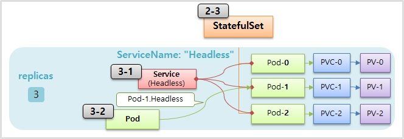

#### 3-1) Service (Headless)

~~~yaml

apiVersion: v1
kind: Service
metadata:
  name: stateful-headless
spec:
  selector:
    type: db2
  ports:
    - port: 80
      targetPort: 8080    
  clusterIP: None

~~~

#### 3-2) Pod 

~~~yaml

piVersion: v1
kind: Pod
metadata:
  name: request-pod
spec:
  containers:
  - name: container
    image: kubetm/init

~~~

~~~shell

nslookup stateful-headless
curl stateful-pvc-0.stateful-headless:8080/hostname

~~~

### 4) Longhorn 삭제
자원을 많이 먹으니 실습 후 꼭 삭제

+ v1.27

~~~shell

kubectl delete -f https://raw.githubusercontent.com/kubetm/kubetm.github.io/master/yamls/longhorn/longhorn-1.5.0.yaml

~~~

+ v1.22

~~~shell

kubectl delete -f https://raw.githubusercontent.com/kubetm/kubetm.github.io/master/yamls/longhorn/longhorn-1.3.3.yaml

~~~

## Ingress - Nginx
+ Ingress 의 대표적인 사용 목적은 Service LoadBalancing 과 Canary Upgrade 가 있다.
+ 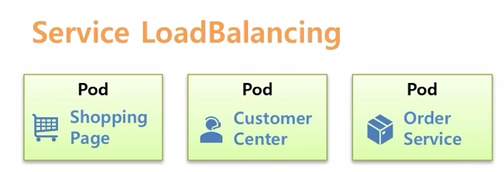
  + Service LoadBalancing 은 만약 쇼핑몰을 운영중이라고 가정 하고, Shopping Page 와 Customer Center 그리고 Order Service 를 Pod 별로 각각 만들었다.
  + 이렇게 Application 을 구분하면 Shopping Page 에 장애가 발생해도 고객 응대나 주문 관리를 하는데는 영향이 없다는 장점이 있다.
+ 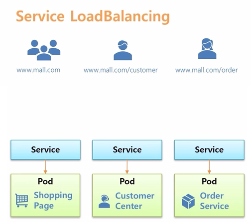
  + 그리고 외부에서 연결할 수 있도록 각각 Service 를 연결하고 사용자로 하여금 Shogging Page 에 접속하기 위해 www.mall.com 을, Customer Center 에 접속 하려면 path 에 /customer 를, 그리고 /order 를 붙이면 Order Service 에 접속 하도록 하고 싶은데,
  일반적으로 각 path 에 따라 각 Service 의 ip 를 연결해줄 수 있는 L4 나 스위치같은 장비가 있어야 한다.
+ 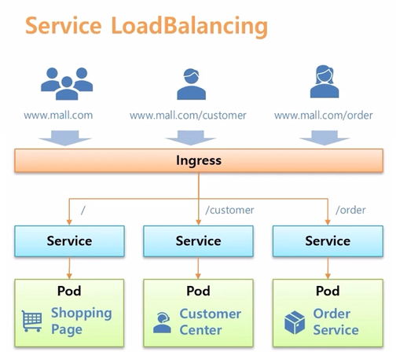
  + k8s 에서는 Ingress 오브젝트가 그 역할을 대신 해준다. root path 로 접속하면 Shopping Page 가 있는 Pod 로 연결 해주고, /customer 가 있으면 Customer Center Pod 가 있는 Service 로 각각 연결 될 수 있도록 해준다.
    그래서 별도로 ip load balancing 해주는 장비가 필요 없다.
+ 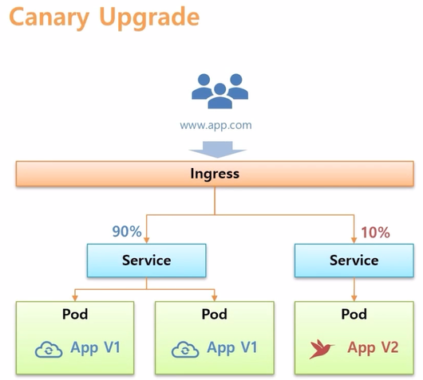
  + 다른 사용 예로 Ingress 를 사용하면 Canary Upgrade 를 쉽게 할 수 있다.
  + V1 의 Application 들이 구동되어 운영되는 상태에서 테스트 할 V2 의 Application 을 구동 시킨다.
  + Ingress 를 만들어서 두가지 버전의 Service 를 연결 하면, 사용자가 Ingress 를 통해 접속 했을 때 10% 의 트래픽만 V2 로 유입 되도록 할 수 있다.
  + 그리고 유입량에 대한 % 수치를 변경 하거나 연결 될 때 들어있는 Header 값들로 트래픽을 조절할 수도 있다.
+ 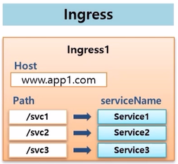
  + Ingress 오브젝트는 k8s 가 설치 되어 있으면 바로 만들 수 있다.
  + Ingress 에는 Host로 도메인을 설정할 수 있고, 이 도메인으로 유입되는 트래픽은 path 에 따라 원하는 Service 로 연결하라는 내용이 주 된 내용이다.
  + 하지만 이렇게 Ingress 를 만들었다고 해서 작동하는 것은 아무것도 없다. 왜냐하면 이 규칙을 실행 할 구현체가 없기 때문이다. k8s 에서 이 구현체를 만들기 위한 플러그인을 설치 해야 한다.
+ 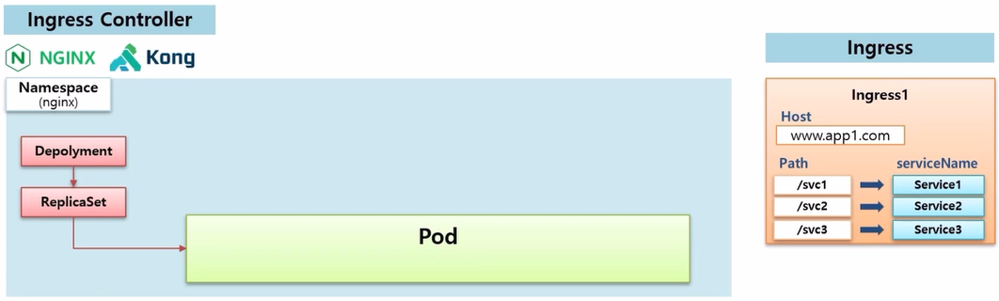
  + 그 플러그인 들을 Ingress Controller 라고 하고 대표적으로 Nginx, Kong 등이 있다. 
  + 만약 Nginx 를 설치하게 되면 nginx 에 대한 Namespace 가 생기고, 이 위에 Deployment 와 ReplicaSet 이 만들어 지면서 실제 Ingress 의 구현체인 nginx Pod 가 만들어 진다.
+ 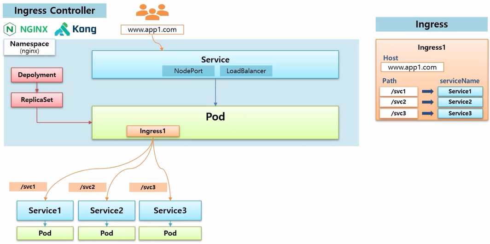
  + 이 Pod 가 Ingress 규칙이 있는지 확인하고, 존재한다면 그 규칙에 맞춰 Service 에 연결하는 역할을 한다. 
  + 이 규칙에 따라 Service 에 트래픽이 유입 되려면, 외부에서 접속하는 사용자들의 트래픽은 nginx Pod 를 지나야 하기 때문에 외부에서 접근 가능한 Service 를 하나 만들어서 Pod 에 연결 해줘야 한다.
  + 직접 k8s 를 설치 했다면 NodePort 를 만들어서 외부에 연결할 수 있고, cloud 서비스를 이용하고 있다면 LoadBalancer 를 만들어서 연결할 수 있다.
  + Ingress 규칙에서 지정한 도메인으로 접속하면 Service 를 통해 nginx Pod 로 트래픽이 유입 되어 Ingress 규칙에 따라 지정된 Service 와 Pod 에 접속할 수 있게 된다.
+ 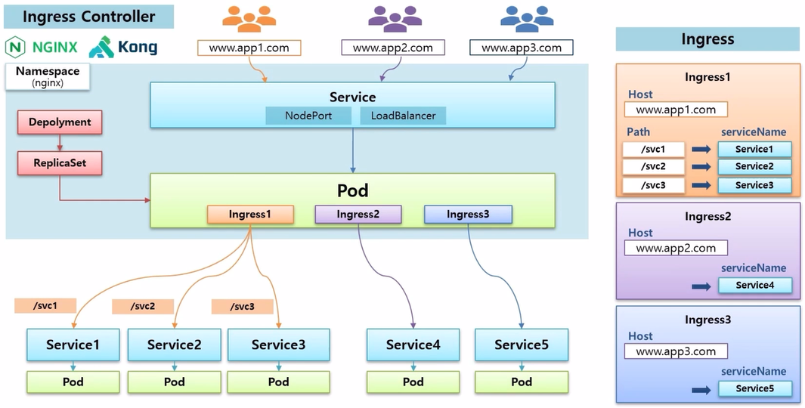
  + Ingress 를 더 추가할 수 있는데, 다른 도메인을 설정하고 path 없이 바로 Service 로 연결도 가능하다. 
  + 예시에서 nginx 가 설치 되어 있기 때문에 바로 Ingress 가 인식 되어 지정한 Service 에 연결 된다.
  + 그래서 사용자가 Ingress 에 지정된 도메인으로 접속 하면 해당 Service 에 연결 될 수 있고, 더 많이 만들어 추가할 수도 있다.
  + Ingress 의 세 가지 기능인 Service Loadbalancing, Canary Upgrade, Https 에 대해 정리 한다.

### Service Loadbalancing
+ 
  + 각 업무별로 Pod 와 Service 를 만든다. 미리 nginx Controller 가 설치 되어 있고, 이 Pod 가 외부에서 연결 가능하도록 NodePort Service 에도 연결 되어 있기 때문에 Master 의 host ip 인 192.168.0.30:30431 로 접속 하면 Pod 의 80 번 포트로 트래픽이 유입 된다.
+ 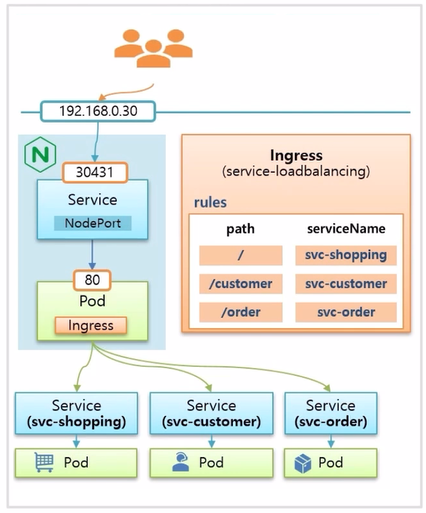
  + 이 상태에서 Ingress 를 만들고, path 에 따라 의도하는 Service 에 매칭하는 규칙을 설정하면 준비는 끝난다.
+ 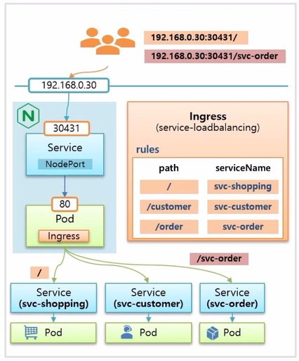
  + 별도의 도메인 이름을 주지 않았기 때문에 사용자가 192.168.0.30:30431 로 접속 하면 Service Page 에 접속 하고, /svc-order path 로 접속하면 주문 관리 페이지로 접속 하게 된다.

### Canary Upgrade
+ 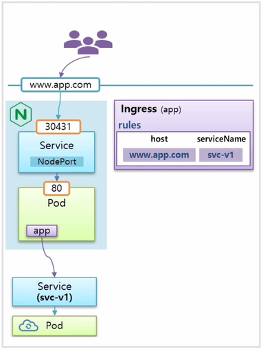
  + www.app.com 이라는 도메인 이름으로 사용자가 접속하면 svc-v1 이라는 이름의 Service 로 연결이 되도록 구성 되어 있다. 현재 사용자들에게 Application 이 운영 중인 상황이다.
+ 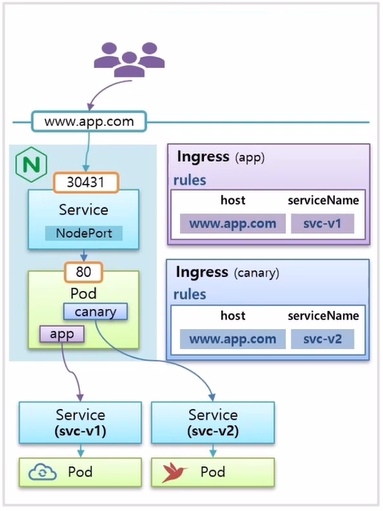
  + 이 상태에서 Canary Upgrade 를 테스트 할 Pod 와 Service 를 구동시키고 Ingress 를 하나 더 만드는데, host 이름은 www.app.com 으로 동일하고, serviceName 을 v2 로 설정하면 위와 같이 구성 된다.
+ 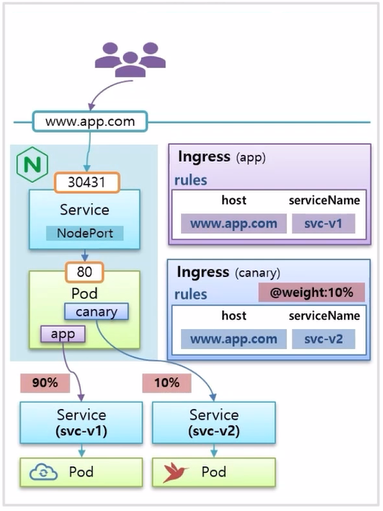
  + 새로 만든 Ingress 에 @weight 라는 annotation 을 설정할 수 있는데, 10% 로 설정하면, 이 도메인으로 유입되는 트래픽의 10% 는 svc-v2 Pod 로 들어가 테스트 하게 된다.
+ 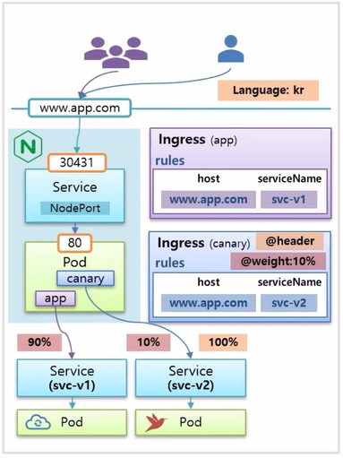
  + 만약 특정 국가 별로 테스트 하고 싶은 경우 @header 옵션을 사용하면, 이 사이트에 접속하는 언어가 kr 일 때 100% 트래픽으로 svc-v2 Pod 에 유입 된다.
  + 이 밖에도 다양한 annotation 을 사용하면 nginx 의 다양한 기능들을 사용 할 수 있다.

### Https
+ Ingress 를 통해서 https 로 연결할 수 있도록 인증서 관리도 가능하다. Pod 자체에서 인증서 기능을 제공하기 어려울 때 사용하면 좋다.
+ 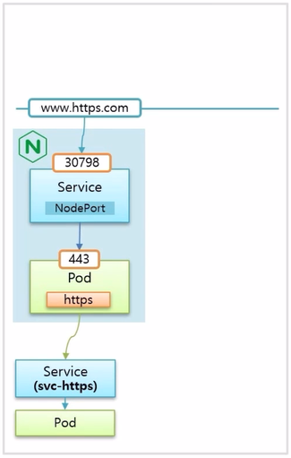
  + nginx Pod 로 https 를 사용하려면 443 포트로 연결 해야 한다.
+ 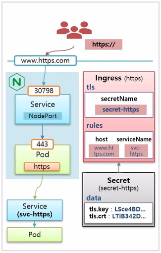
  + 그리고 Ingress 를 만들 때 host 도메인 이름과 Service 를 연결하고, tls 옵션에 secretName 으로 실제 Secret 오브젝트를 연결한다. 
  + 이 Secret 오브젝트 안에는 data 값으로 인증서를 가지고 있다. 이렇게 구성하면 사용자는 도메인 이름 앞에 https:// 를 붙여야 접속할 수 있게 된다.

### 실습
+ [https://kubetm.github.io/k8s/08-intermediate-controller/ingress/](https://kubetm.github.io/k8s/08-intermediate-controller/ingress/)
