# 아키택쳐 - 중급

# 아키택쳐 - 중급

* toc
{:toc}

## Kubernetes Architecture 개요
+ 전체적인 범위는 Components, Networking, Storage 그리고 Logging 이다.
+ 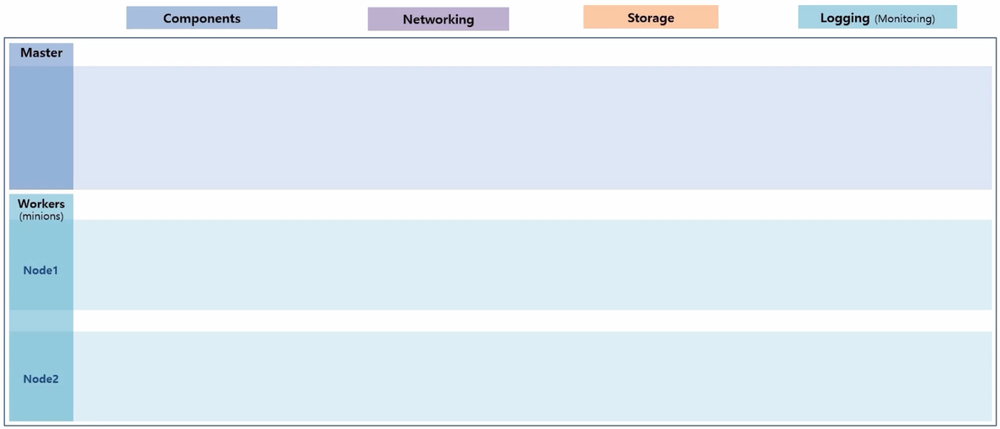
  + k8s 는 하나의 Master 와 다수의 Worker Node 들로 구성 된다.
+ 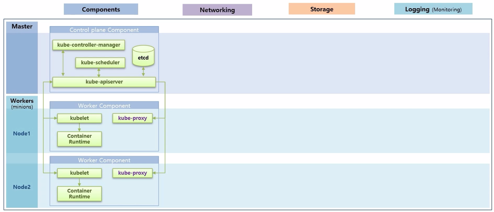
  + Master 에는 Control plane Component 라고 하는 k8s 주요 기능들을 담당하는 Component 들이 있고, 각 Worker Node 에는 Worker Component 라고 하는 Container 를 관리하기 위한 기능들이 있다.
+ 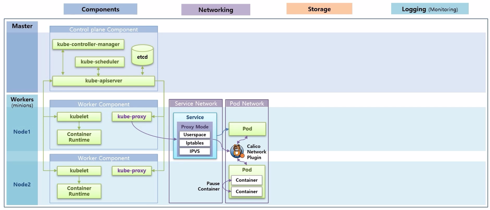
  + k8s 에는 크게 Service 와 Pod 에 대한 Network 영역이 있다. 
  + Pod Network 에서 Pod 내의 Container 간 통신에 대해 알아본다. 그리고 Pod 간 통신인데 현재 강의 실습에서는 Calico 플러그인을 설치 했기 때문에 이 플러그인을 사용해서 어떻게 통신 하는지 알아 본다.
  + 그리고 Service 를 Pod 에 연결 했을 때, Service 를 통해 Pod 와 통신할 수 있다. 이 부분이 Service Network 에 대한 부분이고 k8s 를 설치할 때, 설정 모드에 따라 내부적으로 어떻게 동작 하는지에 대해서도 알아 본다.
+ 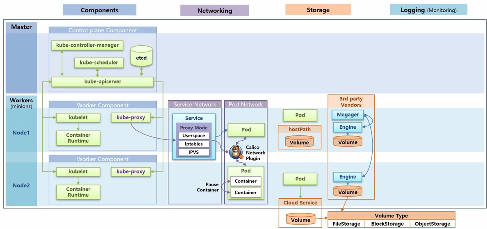
  + Storage 는 Pod 에서 데이터를 안정적으로 저장하는 방법에 대한 내용으로 그 방법에는 hostPath 를 사용하는 방법, 외부 Cloud Service 에서 제공하는 Storage 를 사용하는 방법, 그리고 Cluster 내부에 3rd party 에서 제공하는 Storage Solution 을 설치하는 방법에 대해 알아 본다.
  + 그리고 어떤 방식의 Storage 를 사용하더라도 Volume Type 에는 FileStorage, BlockStorage, ObjectStorage 등 크게 세 가지 종류가 있다. k8s 에서는 이런 type 들에 대한 특징을 잘 알고 사용해야 한다.
+ 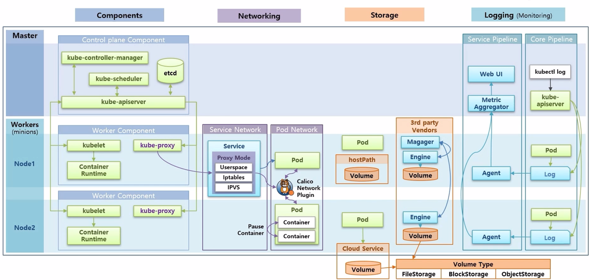
  + Logging 은 k8s 내에 동작중인 Application 에서 출력되는 log 들을 어떻게 관리하느냐에 대한 부분이다. 크게 Service Pipeline 과 Core Pipeline 이 있다. Core Pipeline 에서는 Pod 에서 생성 된 Log 가 어떤 구조로 쌓이는지 그리고 쌓인 로그를 어떻게 보는지에 대해 알아본다.
  + Service Pipeline 은 별도의 플러그인을 설치하면 Monitoring 에 대한 Pod 들이 생기고, 이 Pod 들이 각 Node 에서 Log 를 가져다 수집 서버에 모으고 이것을 ui 를 통해 사용자에게 보여 준다.

## Component - kube-apiserver, etcd, kube-schedule, kube-proxy, kube-controller-manager
+ Pod 가 생성되는 과정을 통해 각 Component 들이 어떤 역할을 하는지 살펴 본다.
+ 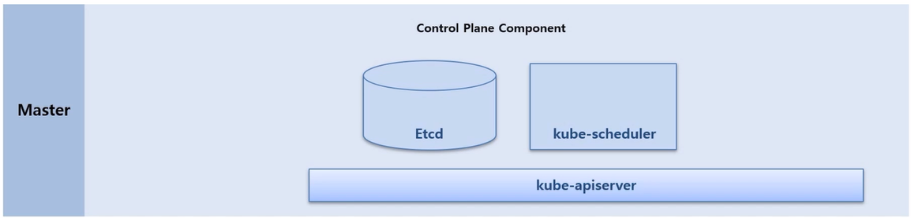
  + Master Node 에는 Etcd, kube-scheduler, kube-apiserver 가 있다. 일반적인 설치를 했을 때 이 Component 들은 Pod 형태로 띄워져서 구동 된다.
+ 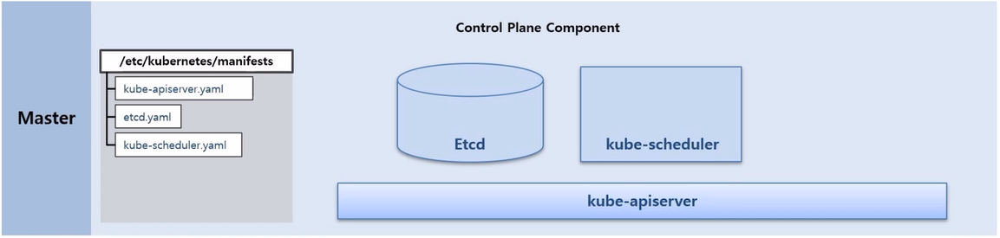
  + Master Node 에 /etc/kubernetes/manifests 디렉토리를 보면 Component 생성에 대한 yaml 파일들이 있는 것을 볼 수 있다. k8s 가 구동시 이 파일들을 읽고 이 Pod 들을 static 으로 띄운다.
+ 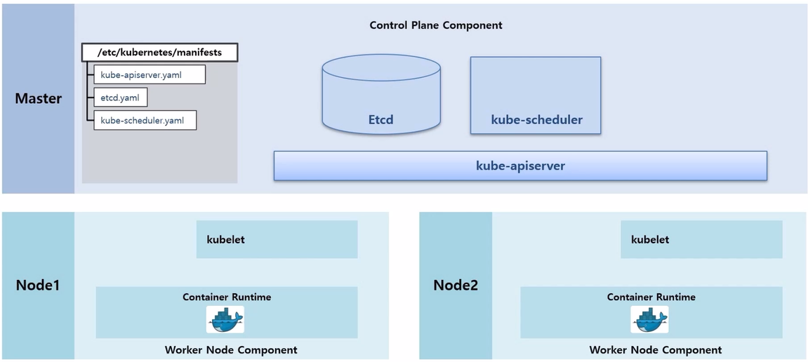
  + Worker Node 들은 k8s 를 설치할 때 같이 설치한 kubelet 과 Container Runtime 인 Docker 가 구동중인 상태이다.
+ 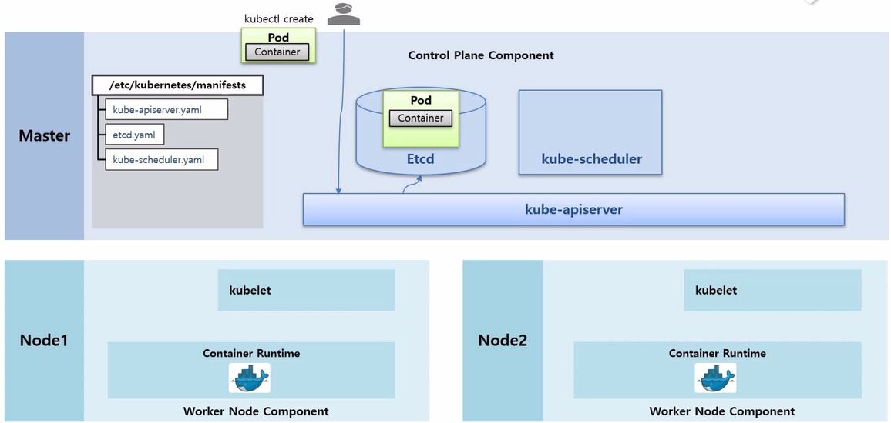
  + 이 때 사용자가 kubectl 명령으로 Pod 생성 요청을 했다고 하자. 
  + 먼저 Pod 생성 명령은 kube-apiserver 로 전달 된다.
  + kube-apiserver 는 Etcd 에 있는 Pod 에 대한 입력 정보들을 저장 한다. Etcd 는 k8s 에서 다양한 데이터들을 저장하는 DB 역할을 한다.
+ 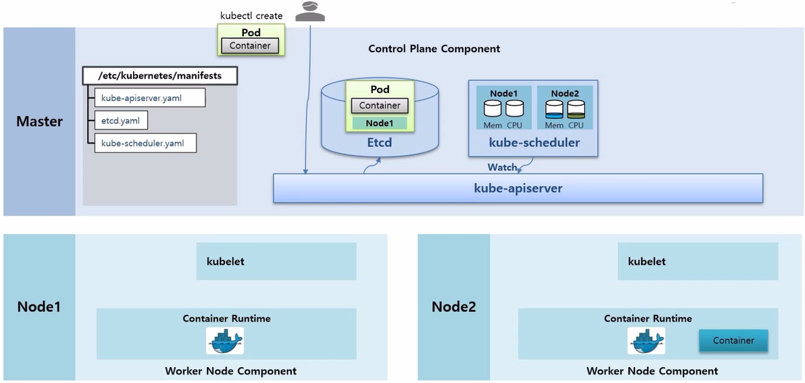
  + kube-scheduler 는 수시로 각 Node 의 자원들을 체크하고 있다.
  + 예를 들어 만약 Node2 에 Container 가 구동중이어서 자원이 사용되고 있다는 것을 알고 있다.
  + 추가로 Watch 라는 기능으로 kube-apiserver 를 통해 Etcd 에 Pod 생성 요청이 들어온 것이 있는지 감시하고 있다.
  + Pod 생성 요청이 있는 것을 발견하면 현재 Node 자원 상태를 확인하고 Pod 가 어느 Node 에 배치되는 것이 좋은지 판단해서 Pod 에 Node 정보를 설정한다.
+ 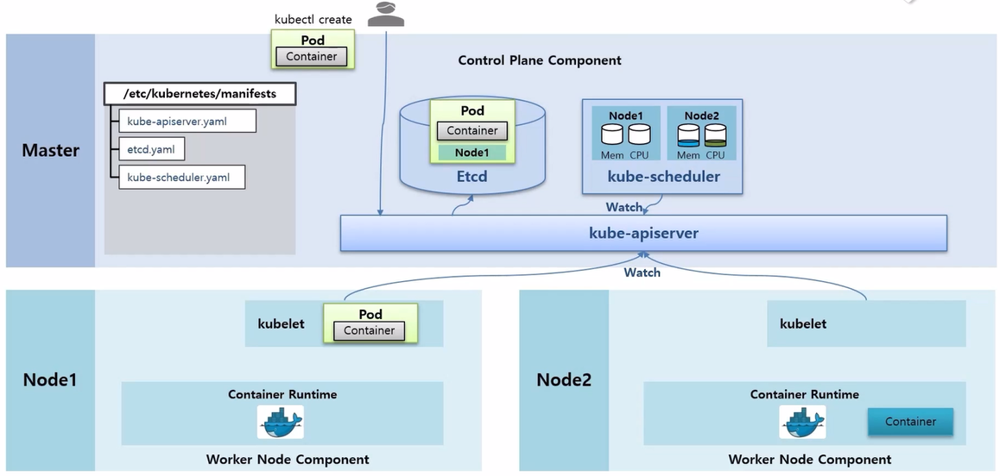
  + 각 Node 에 있는 kubelet 들도 kube-apiserver 에 Watch 가 걸려 있고 Pod 에 자신의 Node 정보가 있는지 체크하고 있다가 자신의 Node 정보가 있는 Pod 를 발견하면, 이 정보를 가지고 Pod 를 만들기 시작 한다. 
  + kubelet 이 Pod 를 만들 때 크게 두 가지 일을 한다. 먼저 Docker 에게 Container 를 만들라고 요청하면 Docker 가 바로 Container 를 만들어 준다.
+ 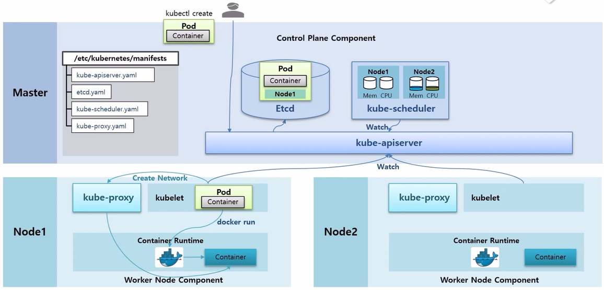
  + 추가로 /etc/kubernetes/manifests 디렉토리 안에 kube-proxy Controller 를 만드는 kube-proxy.yaml 파일이 있고, 이 yaml 파일은 DaemonSet 이라서 모든 Node 에 kube-proxy Pod 가 생성 되어 있다.
  + 이 상태에서 kubelet 은 kube-proxy 에게 Network 생성 요청을 하고 kube-proxy 가 새로 생성 된 Container 에 통신이 되도록 도와 준다.
+ 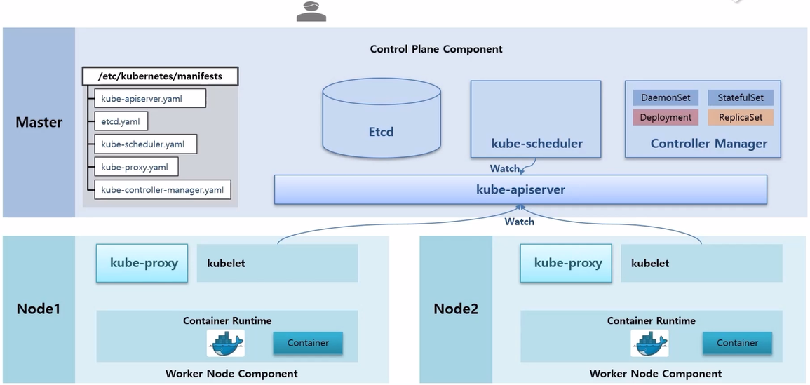
  + Deployment 를 생성하는 과정을 통해 Component 들의 역할을 알아 본다.
  + 다른 Component 들과 마찬가지로 /etc/kubernentes/manifests 디렉토리 안에 kube-controller-manager.yaml 파일이 있어서 Controller Manager Pod 가 띄워져 있다. 그리고 이 안에 여러 Cotroller 들에 대한 기능들이 Thread 형태로 동작 중이다.
+ 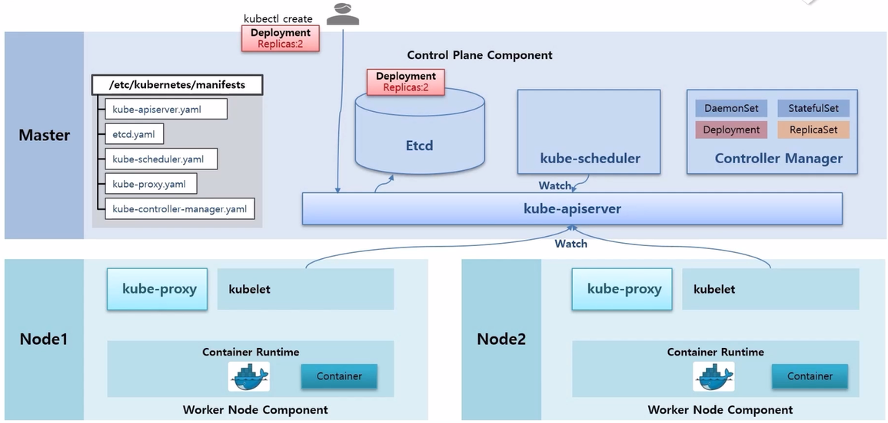
  + 이 상태에서 사용자가 kubectl create 명령으로 Deployment 에 replicas 2 를 설정해서 생성했다고 하자. 
  + 그럼 이 명령은 kube-apiserver 로 전달 되고 Etcd DB 에 정보가 저장 된다.
+ 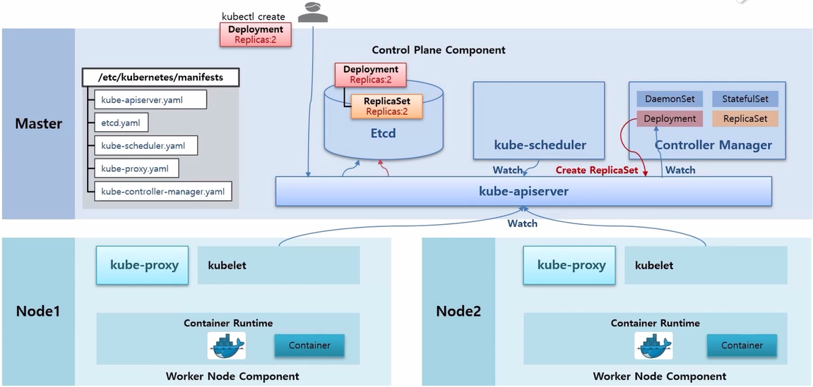
  + 한편 Controller Manager 에 있는 Deployment Thread 는 kube-apiserver 에게 Deployment 관련 정보가 수신 되면 알려달라는 Watch 가 걸려있는 상태이다.
  + 그리고 Deployment 가 들어왔기 때문에 Deployment Thread 가 이 내용을 읽고 ReplicaSet 을 만들라고 요청 한다.
+ 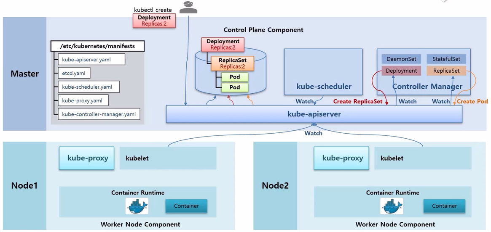
  + 그리고 나면 ReplicaSet 이 관련된 오브젝트가 있는지 Watch 를 걸어둔 상태라 이것을 감지해서 ReplicaSet 안에 Replicas 가 몇 개가 있는지 확인한 다음에 그만큼 Pod 를 만들어 달라고 요청 한다.
+ 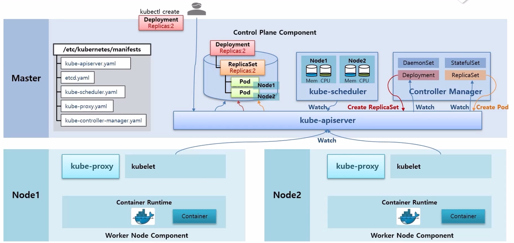
  + 이 상황에서 kube-scheduler 는 Node 가 할당 되지 않은 Pod 를 감지하고, 현재 Node 들의 자원을 고려해서 Pod 들에게 Scheduling 된 Node 를 할당 해준다.
+ 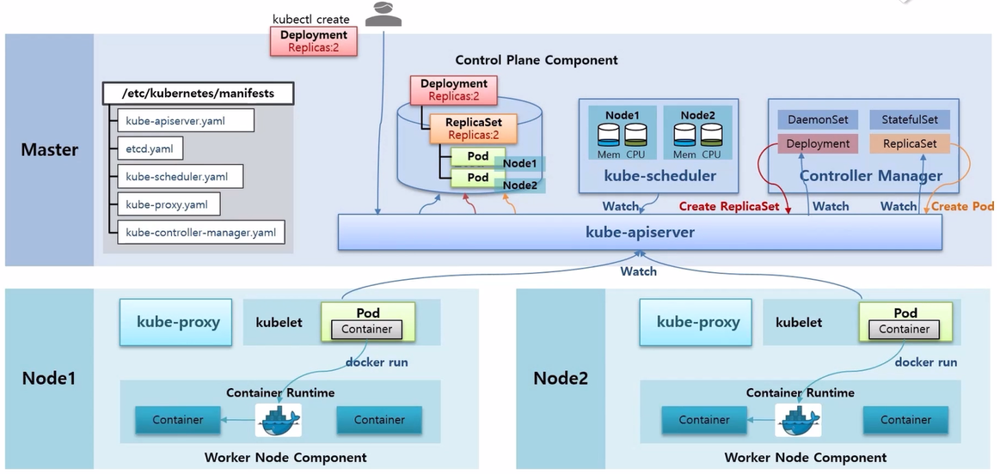
  + 그리고 각 Node 에 있는 kubelet 은 자신에게 할당 된 Pod 들을 감지하고 Pod 안의 Container 내용을 Docker 에게 생성 하게 한다.
  + 그럼 Docker 가 Container 를 만들고 kubelet 이 kube-proxy 를 통해 네트워크를 연결 해준다.

